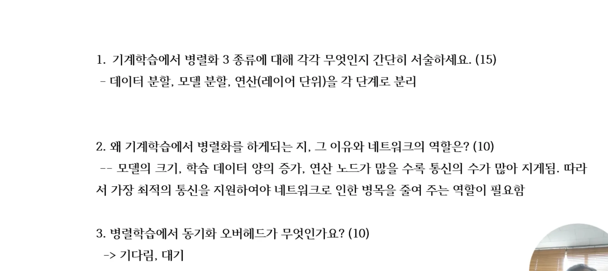
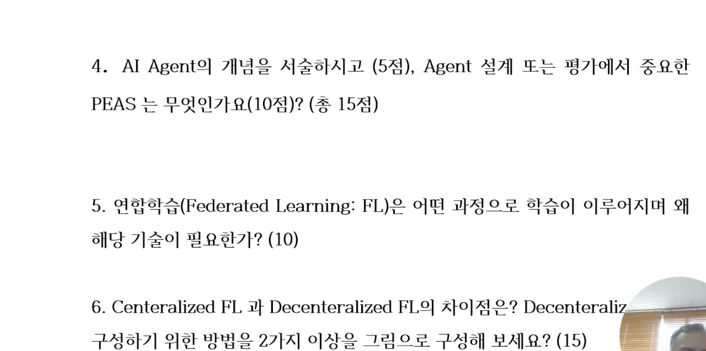
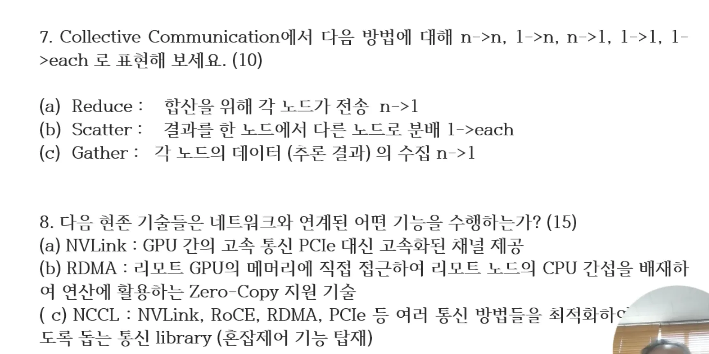

> 경희대 **AI 네트워킹**(허의남 교수님) 기말 기출 문항 정리.
> [← 전체 목차](/posts/ain-overview/)

> ⚠️ **각 문항의 답안은 교수님이 직접 작성하신 간결한 모범답안입니다.**
> (1·2·3·7·8번) — 짧고 핵심만 적힌 형태 그대로 옮겼습니다.
> 4·5·6번은 족보 원본에 답안이 적혀 있지 않아, 정리노트 기반 **보충 답안(📎)** 을 별도로 표시했습니다.

---

## 📷 원본 족보 이미지







---

## 1. 기계학습에서 병렬화 3종류에 대해 각각 무엇인지 간단히 서술하세요. (15)

**✅ 교수님 답안 (간결)**
> 데이터 분할, 모델 분할, 연산(레이어 단위) 분리

---

## 2. 왜 기계학습에서 병렬화를 하게 되는지, 그 이유와 네트워크의 역할은? (10)

**✅ 교수님 답안 (간결)**
> 모델의 크기, 학습 데이터 양의 증가, 연산 노드가 많을수록 통신의 수가 많아지게 됨. 따라서 가장 최적의 통신을 지원해야 네트워크로 인한 병목을 줄여 주는 역할이 필요함.

---

## 3. 병렬학습에서 동기화 오버헤드가 무엇인가요? (10)

**✅ 교수님 답안 (간결)**
> 기다림, 대기

---

## 4. AI Agent의 개념을 서술하시오 (5점). Agent 설계 또는 평가에서 중요한 PEAS는 무엇인가요? (10점) — 총 15점

**✅ 교수님 답안:** *(족보 원본에 미작성)*

**📎 보충 답안 (정리노트 기반)**
- **AI Agent** = 센서(Sensors)로 환경을 **인지(perceive)** 하고, 액추에이터(Actuators)로 환경에 **행동(act)** 하는 자율적 개체. (입력 인지 → 판단 → 행동의 반복)
- **PEAS** = 에이전트 설계·평가의 4요소
  - **P**erformance measure (성능 척도)
  - **E**nvironment (환경)
  - **A**ctuators (행동기)
  - **S**ensors (센서)

---

## 5. 연합학습(Federated Learning: FL)은 어떤 과정으로 학습이 이루어지며 왜 해당 기술이 필요한가? (10)

**✅ 교수님 답안:** *(족보 원본에 미작성)*

**📎 보충 답안 (정리노트 기반)**
- **과정**: ① 서버가 글로벌 모델을 각 클라이언트에 배포 → ② 각 클라이언트가 **로컬 데이터로 학습** → ③ 데이터가 아닌 **모델 파라미터(가중치)만 서버로 전송** → ④ 서버가 **집계(FedAvg 등)** 해 글로벌 모델 갱신 → ⑤ 재배포, 반복.
- **필요 이유**: 원본 데이터를 한곳에 모으지 않아 **프라이버시 보호**, 데이터 이동/전송 비용 절감, 의료·금융 등 **규제** 대응, 분산된 데이터 활용.

---

## 6. Centralized FL 과 Decentralized FL의 차이점은? Decentralized FL을 구성하기 위한 방법을 2가지 이상 그림으로 구성해 보세요. (15)

**✅ 교수님 답안:** *(족보 원본에 미작성)*

**📎 보충 답안 (정리노트 기반)**
- **Centralized FL**: **중앙 서버**가 모든 클라이언트의 파라미터를 집계. 구현 단순하지만 서버가 **단일 장애점·통신 병목**.
- **Decentralized FL**: 중앙 서버 없이 클라이언트끼리 **P2P로 파라미터 교환·집계**. 견고하지만 수렴·동기화 난이도↑.
- **구성 방법 2가지 이상 (그림 개념)**
  1. **P2P Gossip 토폴로지**: 각 노드가 이웃과 무작위로 파라미터를 주고받아 평균 → 점진적 수렴.
  2. **Ring / Mesh 토폴로지**: 링·메시 구조로 연결해 이웃 간 분산 평균(decentralized averaging).
  3. **Blockchain 기반 집계**: 중앙 서버 대신 블록체인 원장에 파라미터 갱신을 기록·검증.

```
[Centralized]            [Decentralized - Gossip]      [Decentralized - Ring]
   ┌─Server─┐                C1 ─ C2                      C1 ─ C2
   │   ▲    │                 │ \ │                        │     │
  C1  C2   C3                 C4 ─ C3                      C4 ─ C3
 (서버가 집계)           (이웃끼리 교환·평균)          (링 순환 평균)
```

---

## 7. Collective Communication에서 다음 방법을 n→n, 1→n, n→1, 1→1, 1→each 로 표현해 보세요. (10)

**✅ 교수님 답안 (간결)**
> - **(a) Reduce**: 합산을 위해 각 노드가 전송 → **n→1**
> - **(b) Scatter**: 결과를 한 노드에서 다른 노드로 분배 → **1→each**
> - **(c) Gather**: 각 노드의 데이터(주로 결과)의 수집 → **n→1**

---

## 8. 다음 현존 기술들은 네트워크와 연계되어 어떤 기능을 수행하는가? (15)

**✅ 교수님 답안 (간결)**
> - **(a) NVLink**: GPU 간의 교차 통신, **PCIe 대신 고속화된 채널** 제공.
> - **(b) RDMA**: 리모트 GPU의 메모리에 직접 접근하여, 리모트 노드의 **CPU 간섭을 배제**하여 연산에 활용하는 **Zero-Copy 지원** 기술.
> - **(c) NCCL**: NVLink, RoCE, RDMA, PCIe 등 여러 통신 방법들을 **최적화하도록 돕는 통신 library** (혼성 통신 기능 탑재).

---

> 📌 더 자세한 개념은 [기말 종합 요약](/posts/ain-AI네트워킹-요약/) 및 [F03 Parallel ML](/posts/ain-f03/), [F04 Federated & Split Learning](/posts/ain-f04/), [F05 Communication Challenge in ML](/posts/ain-f05/), [F06 AI Agent](/posts/ain-f06/) 노트 참고.
