> 원본 슬라이드를 슬라이드별로 직역하고 강의 녹취 설명을 함께 정리한 노트.
> [← 전체 목차](/posts/ain-overview/)

## 슬라이드 1

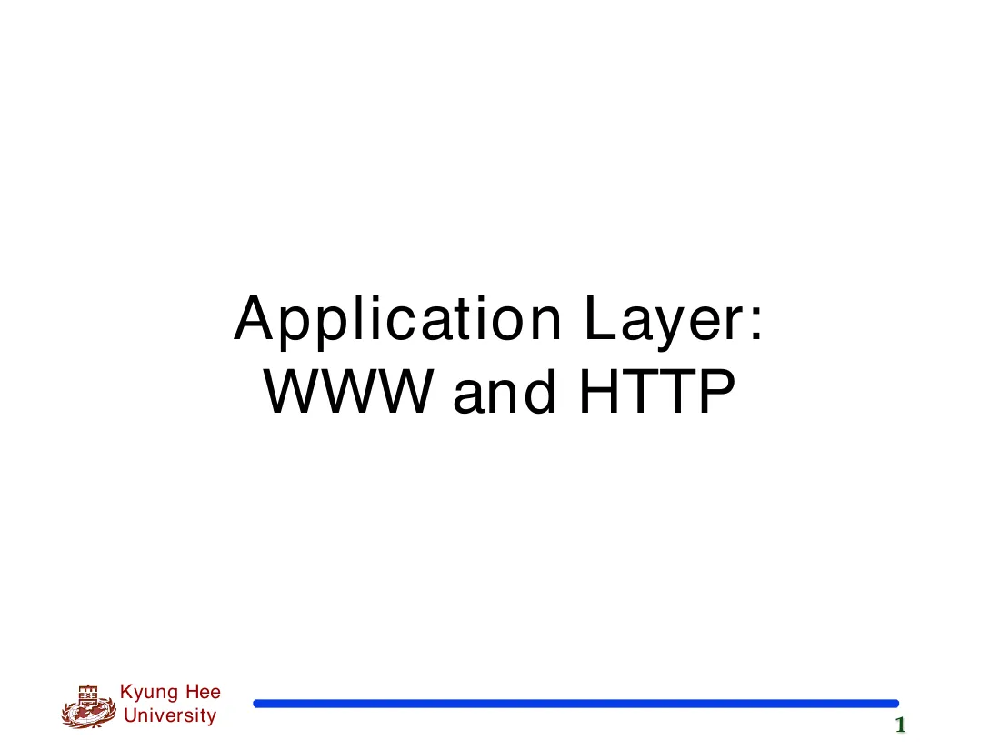

**직역**
> 응용 계층(Application Layer): WWW와 HTTP
> Kyung Hee University

**설명**
- 시험 범위는 네트워크 계층까지(4개 계층)를 커버했고, 이제 5계층(응용 계층)으로 전환한다. 응용 계층은 사용자가 서비스 목적에 맞게 애플리케이션을 구성하고, 아래의 TCP/IP를 통해 해당 프로세스·부하까지 전달하며, 아래 단(하위 계층)을 잘 활용해 다양한 서비스를 만드는 것이 더 중요하다.
- (반복 강조) 인프라(KT 등)를 제공하는 쪽보다 그 위에서 서비스 플랫폼(네이버 등)을 만드는 쪽이 돈을 더 번다. 기술자의 영역(하위 계층)과 서비스의 영역(사용자를 끌어들여 비즈니스화)을 둘 다 볼 수 있는 눈이 필요하며, 기술만 보지 말고 "이걸 어떻게 생각해 내지"에 초점을 둘 것.

## 슬라이드 2

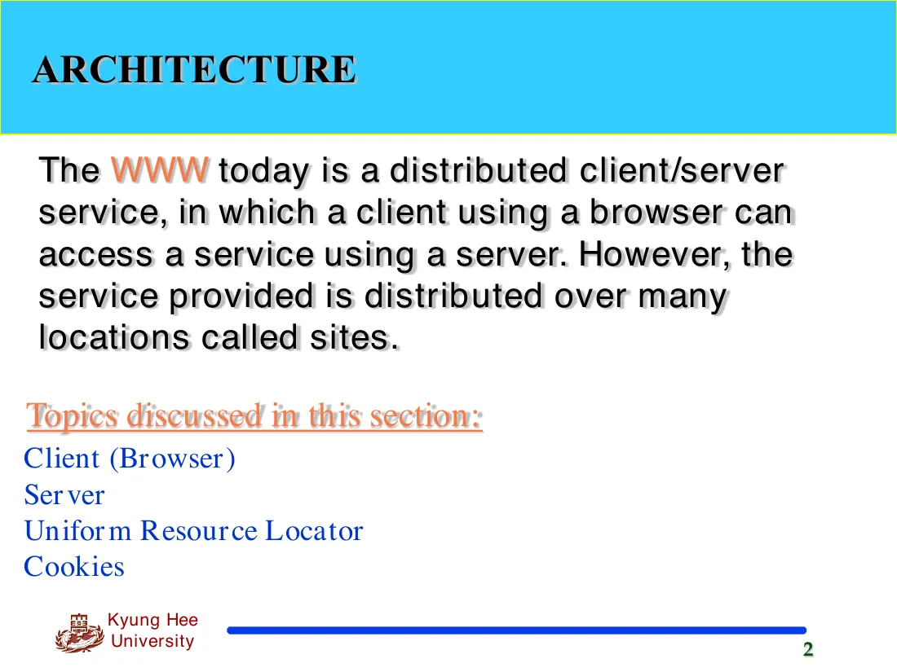

**직역**
> **아키텍처(ARCHITECTURE)**
> 오늘날의 WWW는 분산된 클라이언트/서버 서비스로, 브라우저를 사용하는 클라이언트가 서버를 사용하는 서비스에 접근할 수 있다. 그러나 제공되는 서비스는 사이트(site)라고 불리는 여러 위치에 분산되어 있다.
>
> 이 절에서 다루는 주제:
> - 클라이언트(브라우저, Browser)
> - 서버(Server)
> - 통합 자원 위치 지정자(Uniform Resource Locator)
> - 쿠키(Cookies)

**설명**
- WWW 구성 요소: 클라이언트(사용자 브라우저), 서버(웹 페이지·서비스 제공), 사이트(웹 서비스가 존재하는 위치), 웹 페이지. 사이트에 요청을 보내면 web page를 받아오고, 웹 페이지 안에 다양한 것을 표현한다.

## 슬라이드 3

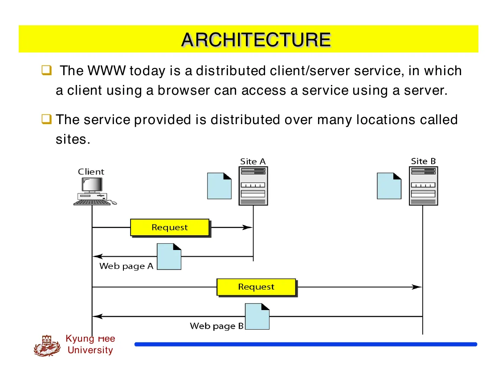

**직역**
> **아키텍처(ARCHITECTURE)**
> - 오늘날의 WWW는 분산된 클라이언트/서버 서비스로, 브라우저를 사용하는 클라이언트가 서버를 사용하는 서비스에 접근할 수 있다.
> - 제공되는 서비스는 사이트(sites)라고 불리는 여러 위치에 분산되어 있다.
>
> (다이어그램)
> - Client(클라이언트), Site A(사이트 A), Site B(사이트 B)
> - 클라이언트 → Request(요청) → Site A → Web page A(웹 페이지 A) → 클라이언트
> - 클라이언트 → Request(요청) → Site B → Web page B(웹 페이지 B) → 클라이언트

**설명**
- WWW는 분산된 클라이언트-서버 서비스다. 브라우저(클라이언트)로 여러 사이트의 여러 서버가 제공하는 것을 사용자가 찾아 접근하는 패턴이다.
- (Pull vs Push 패러다임) 클라이언트가 정보가 어디 있는지 알고 직접 찾아가 request하면 웹 페이지 형태로 준다(Pull). 반대로 구독(subscribe)해 놓으면 정보가 날아오는 푸시(Push) 서비스도 등장했고, 유튜브 광고 등으로 진화했다.

## 슬라이드 4

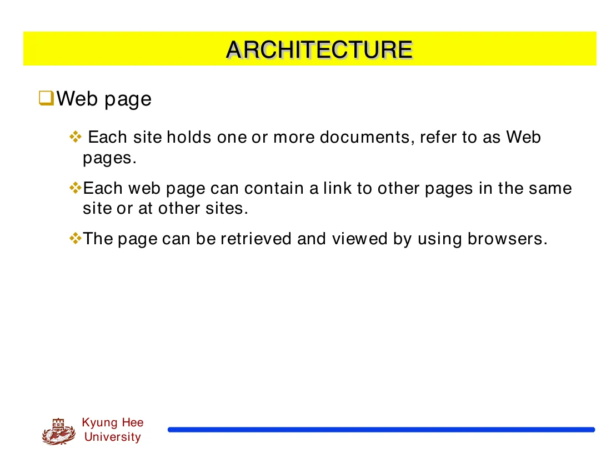

**직역**
> **아키텍처(ARCHITECTURE)**
> 웹 페이지(Web page)
> - 각 사이트는 하나 이상의 문서를 보유하며, 이를 웹 페이지(Web pages)라고 부른다.
> - 각 웹 페이지는 같은 사이트 또는 다른 사이트의 다른 페이지로 가는 링크를 포함할 수 있다.
> - 그 페이지는 브라우저를 사용하여 가져와서(retrieved) 볼 수 있다(viewed).

**설명**
- 기존(이전 방식) 대비 달라진 점은, 단순 텍스트가 아니라 문서 안에 그림·음악·비디오 등 멀티미디어 콘텐츠를 하나로 제공하겠다는 서비스라는 것이다.
- 웹 페이지는 각 사이트 안에 저장되며, 같은/다른 사이트의 다른 페이지로 연결되는 링크를 포함할 수 있다. 하나의 웹 페이지를 가져올 때도 HTML은 사이트 A, JS는 사이트 B에서 가져오는 식의 분산 동작이 가능하다.

## 슬라이드 5

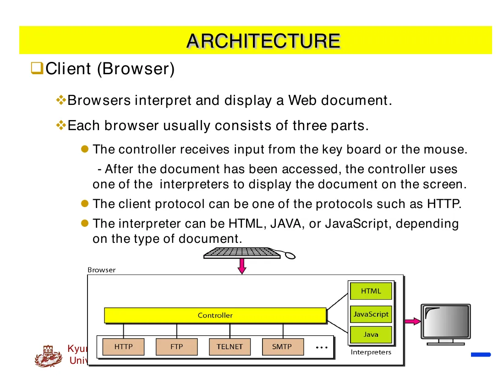

**직역**
> **아키텍처(ARCHITECTURE)**
> 클라이언트(브라우저, Client (Browser))
> - 브라우저는 웹 문서를 해석하고(interpret) 표시한다(display).
> - 각 브라우저는 보통 세 부분으로 구성된다.
>   - 컨트롤러(controller)는 키보드나 마우스로부터 입력을 받는다.
>     - 문서에 접근한 후, 컨트롤러는 인터프리터(interpreter) 중 하나를 사용하여 문서를 화면에 표시한다.
>   - 클라이언트 프로토콜(client protocol)은 HTTP 같은 프로토콜 중 하나일 수 있다.
>   - 인터프리터(interpreter)는 문서 종류에 따라 HTML, JAVA, 또는 JavaScript일 수 있다.

**설명**
- 브라우저는 세 부분으로 구성된다.
  1. Controller: 키보드·마우스·주소 입력을 받아 어떤 프로토콜·어떤 문서·어떤 인터프리터를 쓸지 결정한다.
  2. Client Protocol: 서버와 통신하기 위한 규약으로 HTTP, FTP, TELNET, SMTP 등이 있으며 웹 문서를 가져오는 대표는 HTTP이다.
  3. Interpreter: 문서 종류에 따라 해석기가 달라진다(HTML→HTML 해석기, JS→JS 엔진, Java Applet→Java 실행 환경).
- 동작 순서: 입력 → Controller 수신 → HTTP 등으로 서버에 요청 → 문서 수신 → 종류별 해석기 처리 → 화면 표시.

## 슬라이드 6

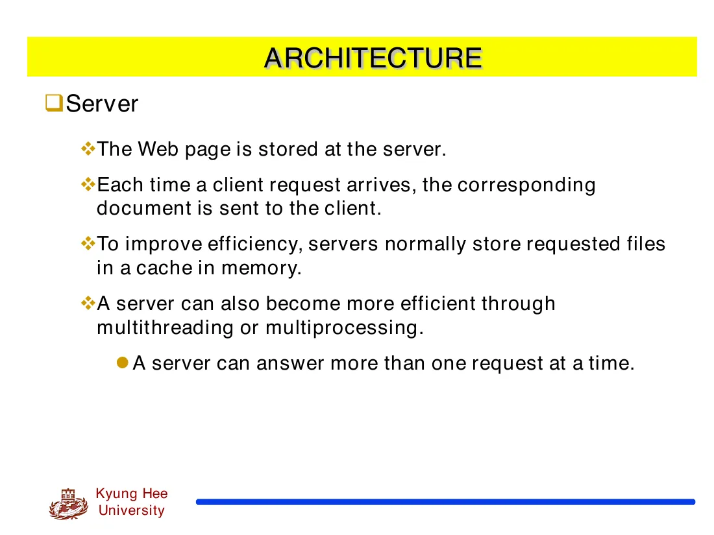

**직역**
> **아키텍처(ARCHITECTURE)**
> 서버(Server)
> - 웹 페이지는 서버에 저장된다.
> - 클라이언트 요청이 도착할 때마다, 해당하는 문서가 클라이언트로 전송된다.
> - 효율을 높이기 위해, 서버는 보통 요청된 파일을 메모리 내의 캐시(cache)에 저장한다.
> - 서버는 멀티스레딩(multithreading)이나 멀티프로세싱(multiprocessing)을 통해서도 더 효율적이 될 수 있다.
>   - 서버는 한 번에 둘 이상의 요청에 응답할 수 있다.

**설명**
- 서버의 역할: 웹 페이지 저장, 요청 시 해당 문서 응답, 여러 요청을 효율적으로 처리. 효율을 위해 요청 파일을 느린 디스크 대신 빠른 메모리 캐시에 저장한다.
- 동시에 여러 사용자를 처리하기 위해 서버를 멀티프로세싱/멀티스레딩 구조로 가야 함이 보인다. (실제 사례: SK 서버에서 동시 1만 5천 센서 처리 시 SQL 로깅이 디스크를 다 써 병목이 됨 → 배운 것이 당연히 되리라 생각하지 말고 다양한 이슈를 이해해야 한다.)

## 슬라이드 7

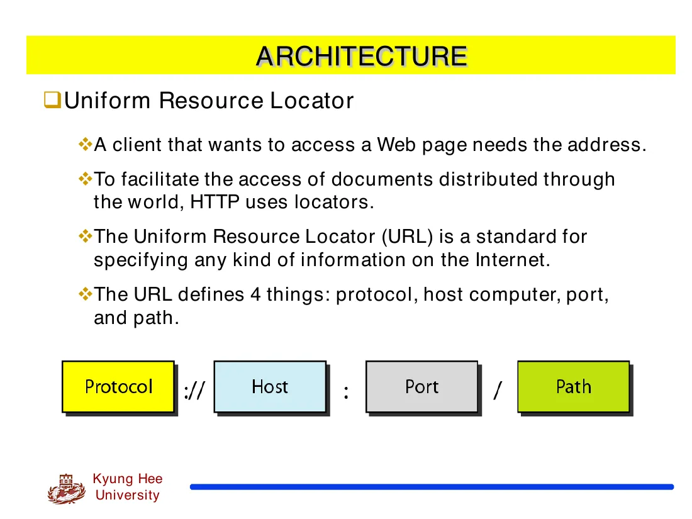

**직역**
> **아키텍처(ARCHITECTURE)**
> 통합 자원 위치 지정자(Uniform Resource Locator)
> - 웹 페이지에 접근하려는 클라이언트는 주소가 필요하다.
> - 전 세계에 분산된 문서에 대한 접근을 용이하게 하기 위해, HTTP는 위치 지정자(locators)를 사용한다.
> - 통합 자원 위치 지정자(Uniform Resource Locator, URL)는 인터넷상의 모든 종류의 정보를 지정하기 위한 표준이다.
> - URL은 4가지를 정의한다: 프로토콜(protocol), 호스트 컴퓨터(host computer), 포트(port), 경로(path).

**설명**
- URL은 인터넷상의 정보에 대한 "위치 지정자"로, 분산된 문서를 정확히 찾기 위한 표준 주소 체계다. 형식은 `protocol://host:port/path`.

## 슬라이드 8

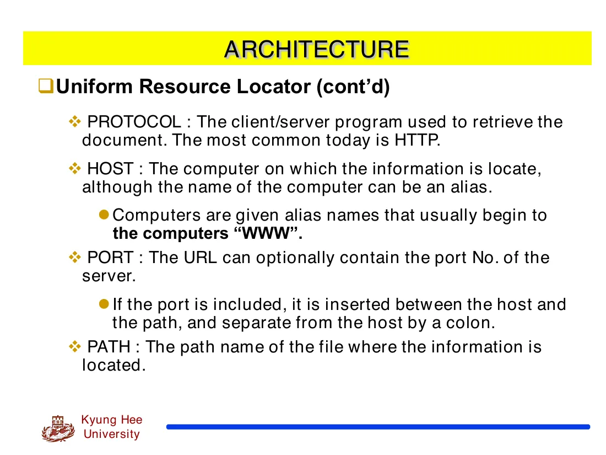

**직역**
> **아키텍처(ARCHITECTURE)**
> 통합 자원 위치 지정자(Uniform Resource Locator (cont'd))
> - PROTOCOL(프로토콜): 문서를 가져오는 데 사용되는 클라이언트/서버 프로그램. 오늘날 가장 흔한 것은 HTTP이다.
> - HOST(호스트): 정보가 위치한 컴퓨터. 다만 컴퓨터의 이름은 별칭(alias)일 수 있다.
>   - 컴퓨터에는 보통 "WWW"로 시작하는 별칭 이름이 부여된다.
> - PORT(포트): URL은 선택적으로 서버의 포트 번호를 포함할 수 있다.
>   - 포트가 포함되는 경우, 호스트와 경로 사이에 삽입되며, 콜론(colon)으로 호스트와 분리된다.
> - PATH(경로): 정보가 위치한 파일의 경로 이름.

**설명**
- 아키텍처: 프로토콜(HTTP) + 호스트(콜론, 포트번호) + 문서 경로로 URL을 정의해 브라우저가 서버에 접근한다.
- 각 구성요소의 의미:
  1. Protocol: 클라이언트/서버가 어떤 약속으로 통신할지(HTTP, HTTPS).
  2. Host: 정보가 있는 서버 컴퓨터. IP가 아닌 사람이 읽기 쉬운 도메인을 쓸 수 있고 보통 www 별칭을 사용한다.
  3. Port: 한 서버 안에서 어떤 서버 프로그램에 접속할지 구분하며, 기본 포트는 생략 가능(선택적)하다.
  4. Path: 서버 안에서 자원이 위치한 경로.

## 슬라이드 9

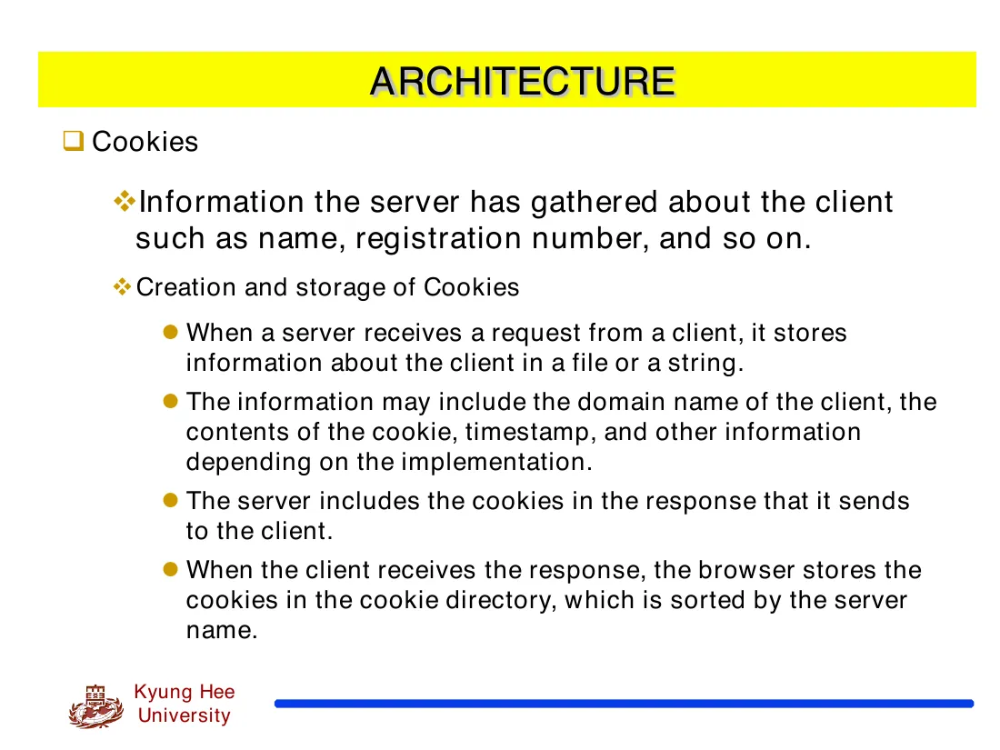

**직역**
> **아키텍처(ARCHITECTURE)**
> 쿠키(Cookies)
> - 서버가 클라이언트에 대해 수집한 정보로, 이름·등록 번호 등이 그 예이다.
> - 쿠키의 생성과 저장(Creation and storage of Cookies)
>   - 서버가 클라이언트로부터 요청을 받으면, 클라이언트에 대한 정보를 파일이나 문자열에 저장한다.
>   - 그 정보에는 구현에 따라 클라이언트의 도메인 이름, 쿠키의 내용, 타임스탬프, 그 밖의 정보가 포함될 수 있다.
>   - 서버는 클라이언트에게 보내는 응답에 쿠키를 포함시킨다.
>   - 클라이언트가 응답을 받으면, 브라우저는 서버 이름별로 정렬된 쿠키 디렉터리에 쿠키를 저장한다.

**설명**
- HTTP는 무상태성(stateless)이라 매 요청마다 클라이언트를 식별하기 어렵다 → 쿠키로 식별한다.
- 쿠키(Cookie): 한 사이트에 계속 머물며 활용할 때 매번 "너 맞아?" 확인하면 시간이 걸린다 → 한 번 접속 시 신분 증명 정보를 문서에 붙여 두고 매번 그 정보로 통과시킨다. 서버가 클라이언트에게 줘서, 클라이언트가 매번 접속 시 사이트 내에서 활용한다.
- 쿠키 동작 흐름: ① 클라이언트 최초 요청 → ② 서버가 식별 정보 생성 → ③ 응답에 쿠키 포함 → ④ 브라우저가 쿠키 디렉터리(서버 이름별)에 저장 → ⑤ 이후 같은 서버 요청 시 쿠키 동봉 → ⑥ 서버가 동일 사용자 파악.
- 쿠키의 문제: 클라이언트가 쿠키(정보)를 가지고 있으면 공격으로 탈취당했을 때 다른 사용자가 접속 가능하다. → 해결책으로 세션(Session): 접속 정보를 서버가 가지고 있다가, 들어올 때 접속 정보만 보고 확인하며 통과시킨다. (쿠키 = 클라이언트가 매번 가져와 알려주는 것 / 세션 = 서버가 관리하는 것.)

## 슬라이드 10

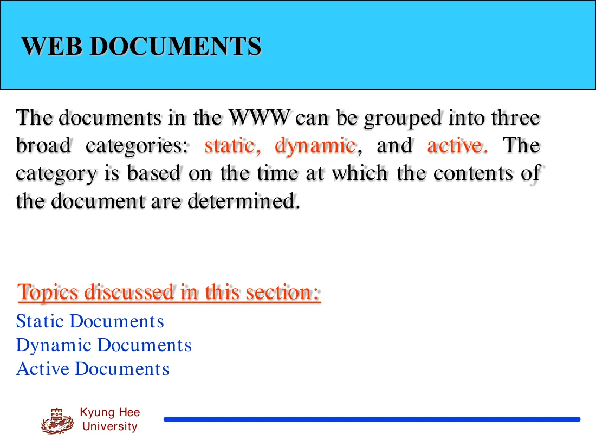

**직역**
> **웹 문서(WEB DOCUMENTS)**
> WWW의 문서들은 세 가지 큰 범주로 나눌 수 있다: 정적(static), 동적(dynamic), 액티브(active). 이 범주는 문서의 내용이 결정되는 시점에 기반한다.
>
> 이 절에서 다루는 주제:
> - 정적 문서(Static Documents)
> - 동적 문서(Dynamic Documents)
> - 액티브 문서(Active Documents)

**설명**
- 웹 문서 분류 기준: ① 문서 내용이 결정되는 시점, ② 문서가 실행되는 위치. 즉 문서가 언제 만들어지는가 / 어디서 실행되는가 / 서버·클라이언트 중 누가 processing을 담당하는가로 구분한다.
- 정리(비교):
  - Static: 생성 시점=파일 생성 시 / 실행 위치=서버는 저장된 파일 전달 / 기술=HTML
  - Dynamic: 생성 시점=요청 시 / 실행 위치=서버 / 기술=CGI, PHP, JSP, ASP
  - Active: 생성·실행=클라이언트 수신 후 실행 / 실행 위치=클라이언트 / 기술=Java Applet, JavaScript

## 슬라이드 11

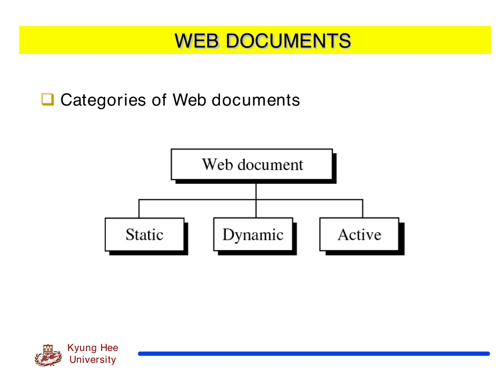

**직역**
> **웹 문서(WEB DOCUMENTS)**
> 웹 문서의 범주(Categories of Web documents)
>
> (다이어그램 - 트리 구조)
> - 웹 문서(Web document)
>   - 정적(Static)
>   - 동적(Dynamic)
>   - 액티브(Active)

## 슬라이드 12

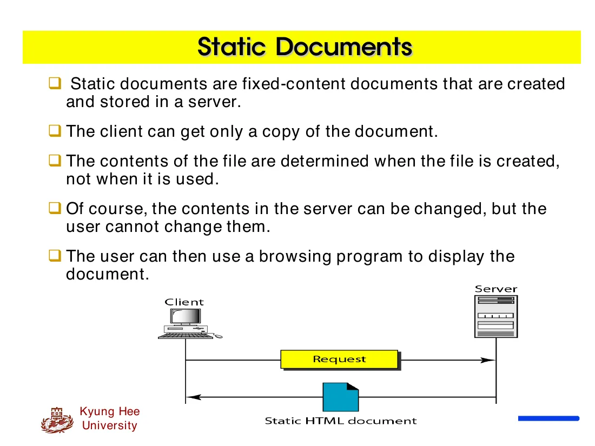

**직역**
> **정적 문서(Static Documents)**
> - 정적 문서는 서버에 생성·저장되는 고정 내용 문서(fixed-content documents)이다.
> - 클라이언트는 그 문서의 복사본만 받을 수 있다.
> - 파일의 내용은 파일이 생성될 때 결정되며, 사용될 때 결정되지 않는다.
> - 물론 서버 안의 내용은 변경될 수 있지만, 사용자는 그것을 변경할 수 없다.
> - 사용자는 그런 다음 브라우징 프로그램을 사용하여 문서를 표시할 수 있다.

**설명**
- 정적 문서(Static Document): 미리 만들어 둔 페이지(HTML)를 요청하면 그대로 전달한다. 예: 연구실 정보 같은 고정 콘텐츠. HTML 태그로 표현한다.

## 슬라이드 13

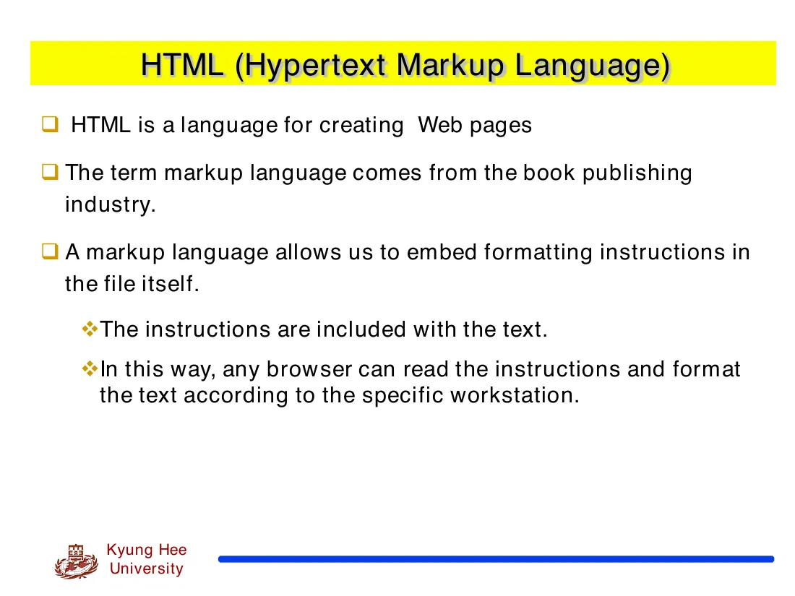

**직역**
> **HTML (Hypertext Markup Language)**
> - HTML은 웹 페이지를 만들기 위한 언어이다.
> - 마크업 언어(markup language)라는 용어는 출판(서적 출판) 산업에서 유래했다.
> - 마크업 언어는 파일 자체에 서식 지정 명령(formatting instructions)을 삽입할 수 있게 해 준다.
>   - 명령은 텍스트와 함께 포함된다.
>   - 이런 방식으로, 어떤 브라우저든 명령을 읽고 특정 워크스테이션에 맞게 텍스트를 서식 지정할 수 있다.

**설명**
- 다양한 멀티미디어 문서를 표현하기 위해 언어를 만들었다 → HTML(HyperText Markup Language). 이미지 삽입, 하이퍼링크(href, hyper-reference) 등 태그로 색·글자·이미지를 표현한다.

## 슬라이드 14

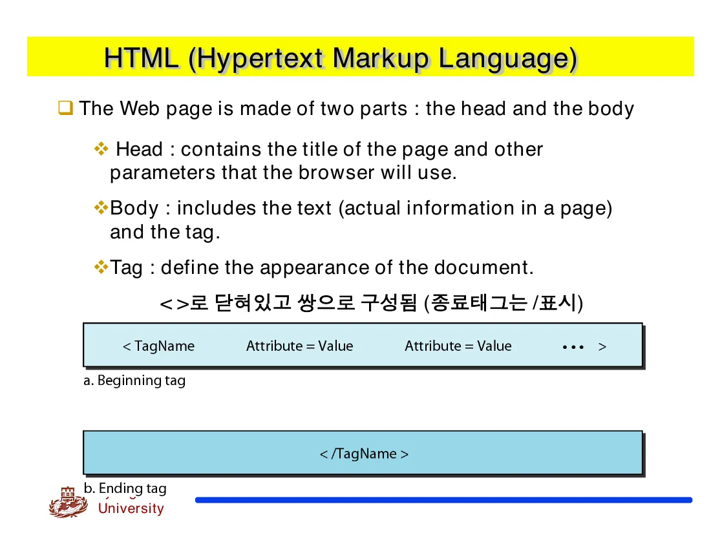

**직역**
> **HTML (Hypertext Markup Language)**
> - 웹 페이지는 두 부분으로 이루어진다: 머리(head)와 몸체(body)
>   - Head(머리): 페이지의 제목과 브라우저가 사용할 그 밖의 매개변수를 포함한다.
>   - Body(몸체): 텍스트(페이지 안의 실제 정보)와 태그(tag)를 포함한다.
>   - Tag(태그): 문서의 외형(appearance)을 정의한다.
>     - `< >`로 닫혀 있고 쌍으로 구성됨 (종료 태그는 `/` 표시)

**설명**
- 구성: Head(제목·매개변수) / Body(실제 텍스트·태그). Tag는 `<`, `>`로 둘러싸이고 보통 쌍을 이루며, 종료 태그에는 `/`가 붙는다.
- 주요 태그: `<B>`(볼드), `<I>`(이미지 태그 — 비텍스트 정보 포함), `<U>`(언더라인), 하이퍼링크 앵커 `<A HREF="...">...</A>`.

## 슬라이드 15

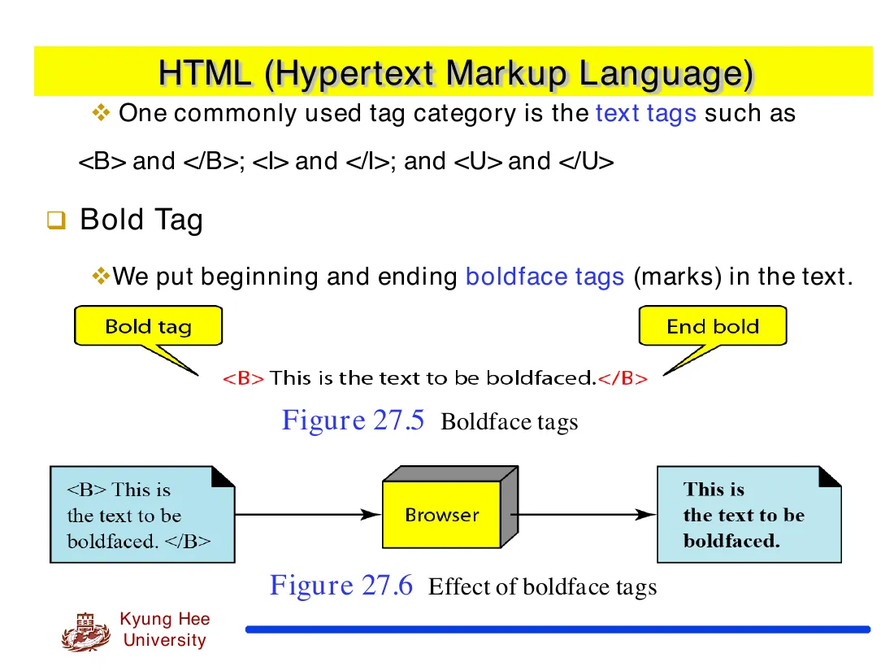

**직역**
> **HTML (Hypertext Markup Language)**
> - 흔히 사용되는 태그 범주 중 하나는 텍스트 태그(text tags)로, 예를 들어 `<B>`와 `</B>`; `<I>`와 `</I>`; `<U>`와 `</U>`가 있다.
> - 볼드 태그(Bold Tag)
>   - 텍스트에 시작 볼드체 태그와 끝 볼드체 태그(표시, marks)를 넣는다.
>
> (그림 27.5 - 볼드체 태그, Boldface tags)
> - `Bold tag(볼드 태그)` → `<B> This is the text to be boldfaced.</B>` ← `End bold(볼드 끝)`
>
> (그림 27.6 - 볼드체 태그의 효과, Effect of boldface tags)
> - `<B> This is the text to be boldfaced. </B>` → Browser(브라우저) → **This is the text to be boldfaced.**(볼드체로 표시됨)

## 슬라이드 16

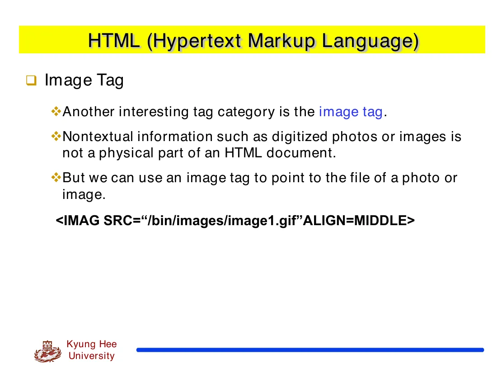

**직역**
> **HTML (Hypertext Markup Language)**
> - 이미지 태그(Image Tag)
>   - 또 다른 흥미로운 태그 범주는 이미지 태그이다.
>   - 디지털화된 사진이나 이미지 같은 비텍스트 정보는 HTML 문서의 물리적 일부가 아니다.
>   - 하지만 이미지 태그를 사용하여 사진이나 이미지 파일을 가리킬 수 있다.
>   - `<IMAG SRC="/bin/images/image1.gif" ALIGN=MIDDLE>` (원문 그대로; 이미지 파일 경로를 지정하고 가운데 정렬)

## 슬라이드 17

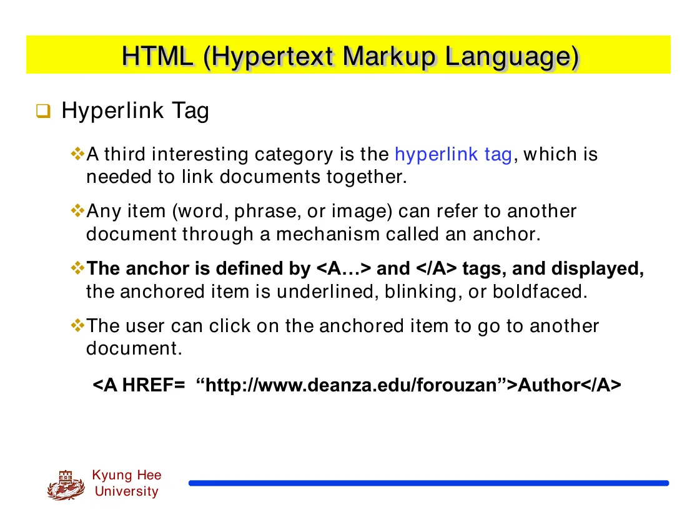

**직역**
> **HTML (Hypertext Markup Language)**
> - 하이퍼링크 태그(Hyperlink Tag)
>   - 세 번째 흥미로운 범주는 하이퍼링크 태그로, 문서들을 서로 연결하는 데 필요하다.
>   - 어떤 항목(단어, 구절, 또는 이미지)이든 앵커(anchor)라는 메커니즘을 통해 다른 문서를 참조할 수 있다.
>   - 앵커는 `<A…>`와 `</A>` 태그로 정의되며, 표시될 때 앵커가 걸린 항목은 밑줄이 그어지거나, 깜빡이거나, 볼드체로 표시된다.
>   - 사용자는 앵커가 걸린 항목을 클릭하여 다른 문서로 이동할 수 있다.
>   - `<A HREF= "http://www.deanza.edu/forouzan">Author</A>` (원문 그대로; "Author" 텍스트가 해당 URL로 가는 링크가 됨)

## 슬라이드 18

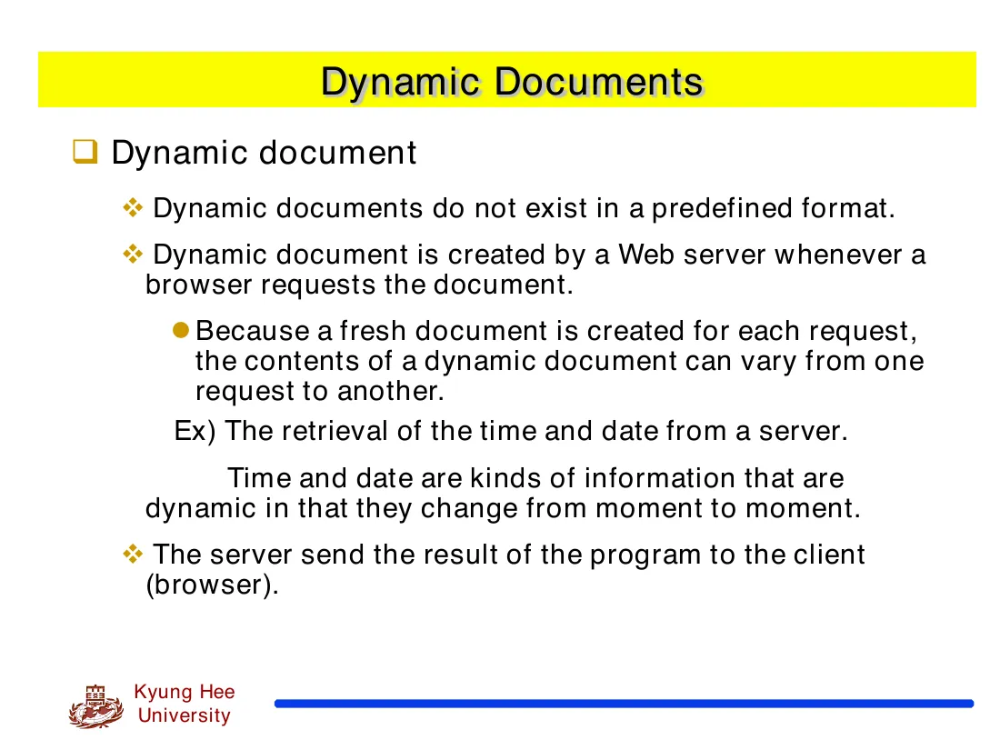

**직역**
> **동적 문서(Dynamic Documents)**
> - 동적 문서(Dynamic document)
>   - 동적 문서는 미리 정의된 형태로 존재하지 않는다.
>   - 동적 문서는 브라우저가 문서를 요청할 때마다 웹 서버에 의해 생성된다.
>     - 각 요청마다 새 문서가 생성되기 때문에, 동적 문서의 내용은 요청마다 달라질 수 있다.
>     - 예) 서버로부터 시간과 날짜를 가져오는 것. 시간과 날짜는 순간마다 바뀐다는 점에서 동적인 종류의 정보이다.
>   - 서버는 프로그램의 결과를 클라이언트(브라우저)로 보낸다.

**설명**
- 동적 문서(Dynamic Document): 미리 못 만들고, 클라이언트가 request할 때 서버가 콘텐츠를 생성한다. 매 요청마다 새 문서가 만들어져 내용이 다양하게 바뀐다. 예: 시간·날짜, 게시판에 글 올리면 리스트가 바뀌는 것. 요청에 "어떤 프로그램을 수행하라"는 정보(입력값 포함)가 붙어 온다.
- 핵심 기준은 문서가 요청 시점에 서버에서 생성된다는 점이다.

## 슬라이드 19

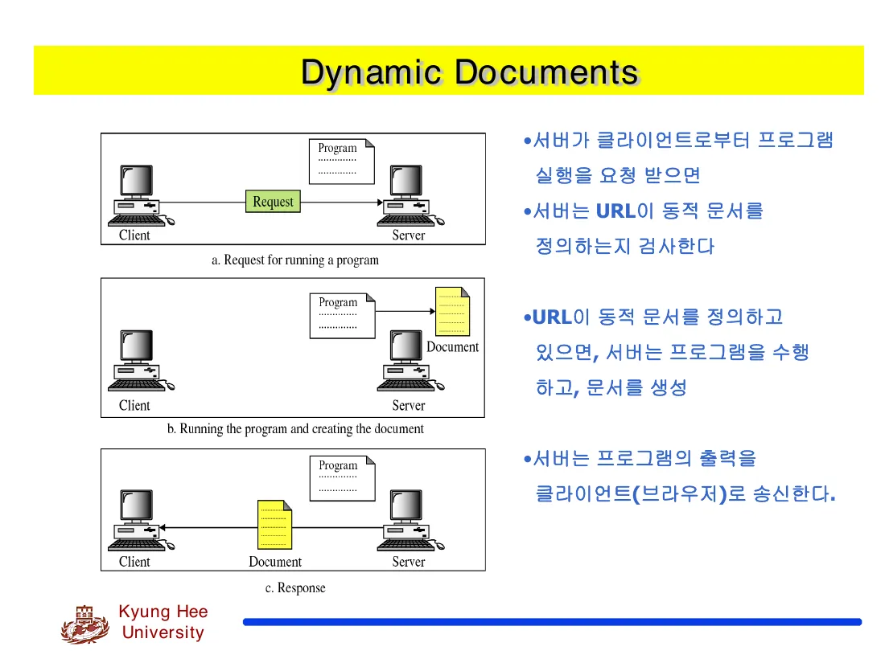

**직역**
> **동적 문서(Dynamic Documents)**
>
> (다이어그램 - 3단계)
> - a. Request for running a program (프로그램 실행 요청): Client → Request → Server(Program 보유)
> - b. Running the program and creating the document (프로그램을 실행하고 문서를 생성): Server에서 Program → Document(문서) 생성
> - c. Response (응답): Server의 Document → Client
>
> (오른쪽 설명)
> - 서버가 클라이언트로부터 프로그램 실행을 요청 받으면
> - 서버는 URL이 동적 문서를 정의하는지 검사한다
> - URL이 동적 문서를 정의하고 있으면, 서버는 프로그램을 수행하고, 문서를 생성
> - 서버는 프로그램의 출력을 클라이언트(브라우저)로 송신한다.

## 슬라이드 20

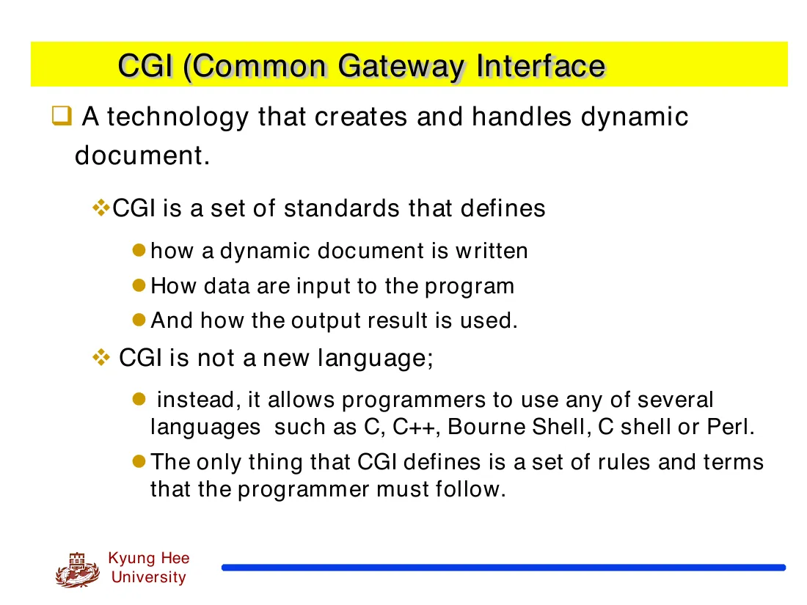

**직역**
> **CGI (Common Gateway Interface)**
> - 동적 문서를 생성하고 처리하는 기술.
> - CGI는 다음을 정의하는 표준의 집합이다.
>   - 동적 문서가 어떻게 작성되는지
>   - 데이터가 프로그램에 어떻게 입력되는지
>   - 그리고 출력 결과가 어떻게 사용되는지
> - CGI는 새로운 언어가 아니다.
>   - 대신, 프로그래머가 C, C++, Bourne Shell, C shell, Perl 등 여러 언어 중 어느 것이든 사용할 수 있게 해 준다.
>   - CGI가 정의하는 것은 프로그래머가 따라야 하는 규칙과 용어의 집합뿐이다.

**설명**
- 동적 문서의 구현으로 CGI(Common Gateway Interface) 개념이 있다. 웹 서버가 CGI를 지원한다(ASP, PHP, JSP 등).
- CGI는 동적 문서 생성 프로그램의 실행 방식을 표준화한 것(새 언어가 아니라 표준 규칙)으로, ① 동적 문서 작성 방식 ② 입력 데이터 전달 방식 ③ 출력 결과 사용 방식을 정의한다.
- 입력값 예: query parameter, form data, environment variable, DB 조회 결과.

## 슬라이드 21

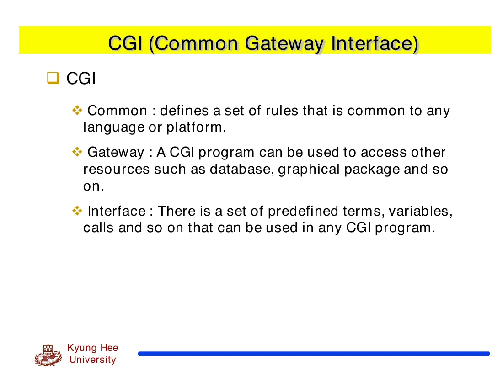

**직역**
> **CGI (Common Gateway Interface)**
> - CGI
>   - Common(공통): 어떤 언어나 플랫폼에든 공통인 규칙의 집합을 정의한다.
>   - Gateway(게이트웨이): CGI 프로그램은 데이터베이스, 그래픽 패키지 등 다른 자원에 접근하는 데 사용될 수 있다.
>   - Interface(인터페이스): 어떤 CGI 프로그램에서든 사용할 수 있는, 미리 정의된 용어·변수·호출 등의 집합이 있다.

**설명**
- 이름의 의미:
  - Common: 특정 언어·OS에 묶이지 않는 공통 규칙(C, C++, Perl, Shell 등 사용 가능).
  - Gateway: 웹 서버와 외부 자원(DB, 파일, 그래픽 처리) 사이의 통로.
  - Interface: 입력·환경변수·출력 형식 등 데이터를 주고받기 위한 약속.

## 슬라이드 22

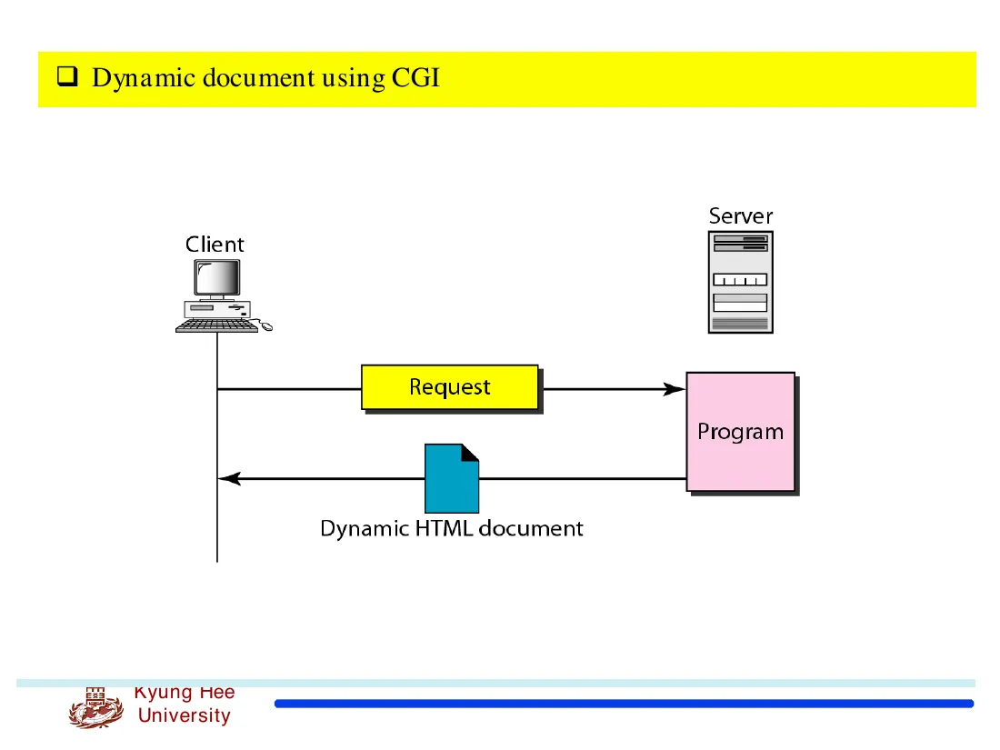

**직역**
> **CGI를 사용한 동적 문서(Dynamic document using CGI)**
>
> (다이어그램)
> - Client(클라이언트) → Request(요청) → Server(서버) 측의 Program(프로그램, 분홍 박스)
> - Program → Dynamic HTML document(동적 HTML 문서) → Client

**설명**
- CGI 동작 예: a1, a2 두 변수를 받아 연산(예: 곱셈) 후, 프로그램이 `print` 출력문으로 `<html><body> ... 결과 ... </body></html>` 형태의 HTML을 만들어 돌려준다. DB를 읽어 테이블을 만들든 결국 print 문으로 HTML을 생성한다.

## 슬라이드 23

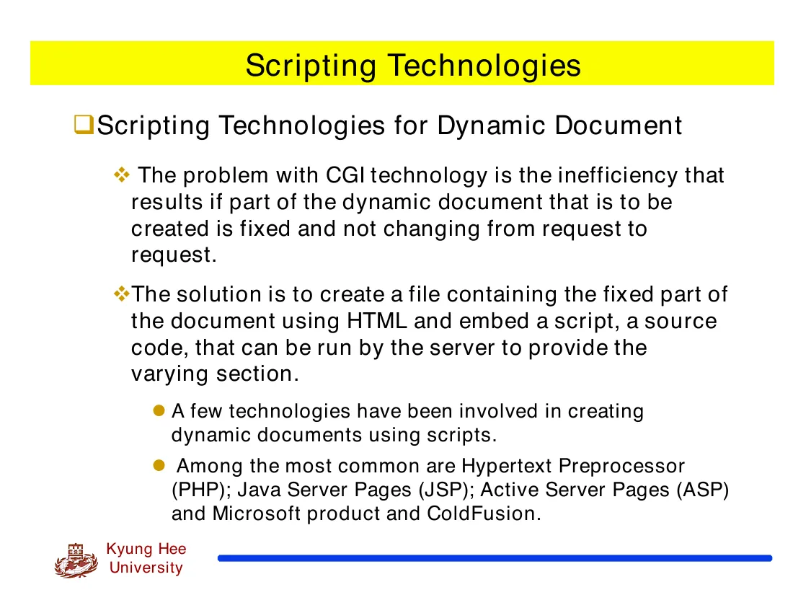

**직역**
> **스크립팅 기술(Scripting Technologies)**
> 동적 문서를 위한 스크립팅 기술(Scripting Technologies for Dynamic Document)
> - CGI 기술의 문제는, 생성하려는 동적 문서의 일부가 고정되어 있고 요청마다 변하지 않을 경우 발생하는 비효율성이다.
> - 해결책은 문서의 고정된 부분을 HTML로 담은 파일을 만들고, 변하는 부분을 제공하기 위해 서버가 실행할 수 있는 스크립트(소스 코드)를 그 안에 삽입(embed)하는 것이다.
>   - 스크립트를 사용한 동적 문서 생성에는 몇 가지 기술이 관여해 왔다.
>   - 가장 흔한 것으로는 Hypertext Preprocessor (PHP); Java Server Pages (JSP); Active Server Pages (ASP)와 마이크로소프트 제품, 그리고 ColdFusion이 있다.

**설명**
- Server-side Scripting: CGI는 동적 문서의 일부가 고정인데도 요청마다 전체를 다시 만들면 비효율이 발생한다는 문제가 있다. 해결책은 HTML로 고정된 부분을 만들고, 변하는 부분만 서버가 실행할 스크립트(소스 코드)로 삽입하는 것이다. 대표 기술은 PHP, JSP, ASP, ColdFusion.

## 슬라이드 24

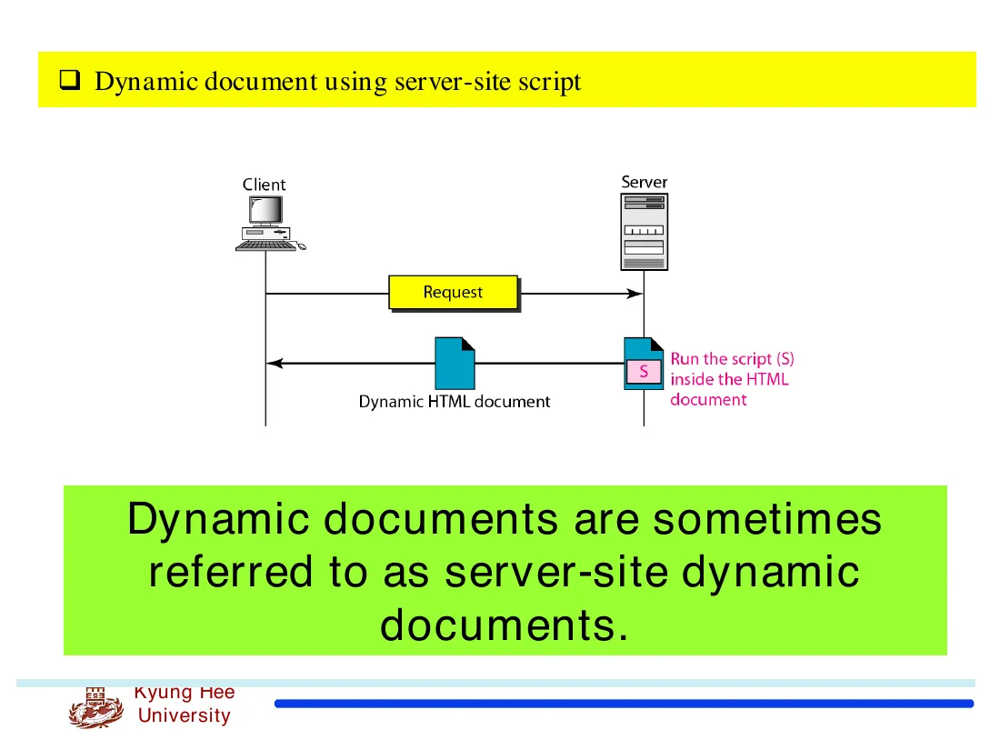

**직역**
> **서버 사이드 스크립트를 사용한 동적 문서(Dynamic document using server-site script)**
>
> (다이어그램)
> - Client(클라이언트) → Request(요청) → Server(서버) 측의 문서 안에 스크립트 S 포함
> - Server: Run the script (S) inside the HTML document (HTML 문서 안의 스크립트(S)를 실행)
> - → Dynamic HTML document(동적 HTML 문서) → Client
>
> (강조 박스) 동적 문서는 때때로 서버 사이드 동적 문서(server-site dynamic documents)라고 불린다.

**설명**
- 서버가 HTML 문서 안에 삽입된 스크립트(S)를 실행해 변하는 부분을 채운 뒤 동적 HTML 문서를 클라이언트로 전달한다. 실행 위치가 서버이므로 server-side dynamic document라고 부른다.

## 슬라이드 25

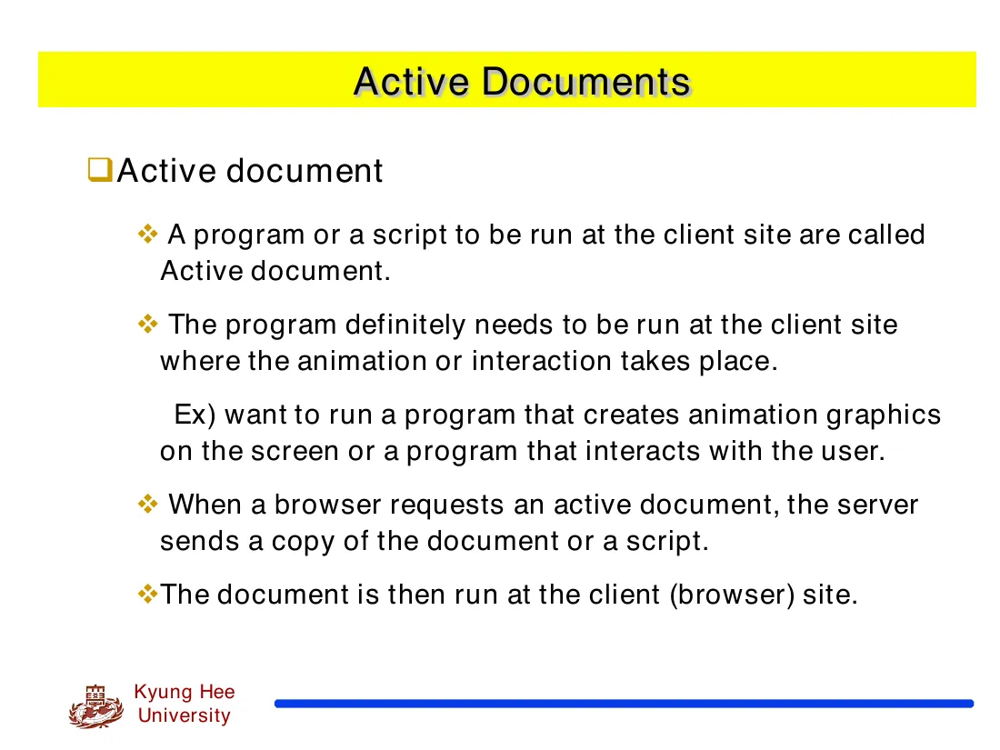

**직역**
> **액티브 문서(Active Documents)**
> - 액티브 문서(Active document)
>   - 클라이언트 사이트에서 실행되는 프로그램이나 스크립트를 액티브 문서라고 부른다.
>   - 그 프로그램은 애니메이션이나 상호작용이 일어나는 클라이언트 사이트에서 반드시 실행되어야 한다.
>     - 예) 화면에 애니메이션 그래픽을 생성하는 프로그램이나 사용자와 상호작용하는 프로그램을 실행하고 싶은 경우.
>   - 브라우저가 액티브 문서를 요청하면, 서버는 문서나 스크립트의 복사본을 보낸다.
>   - 그 문서는 그런 다음 클라이언트(브라우저) 사이트에서 실행된다.

**설명**
- 액티브 문서(Active Document): 클라이언트 사이드에서 프로그램/스크립트가 실행되며 인터랙션이 발생한다(애니메이션·그래픽 등 사용자 인터랙티브). 서버는 복사본을 전달하고 실행은 브라우저에서 일어난다. 목적은 애니메이션, 인터랙션, 클라이언트측 처리(사용자와 인터랙션할 때 사용)다.

## 슬라이드 26

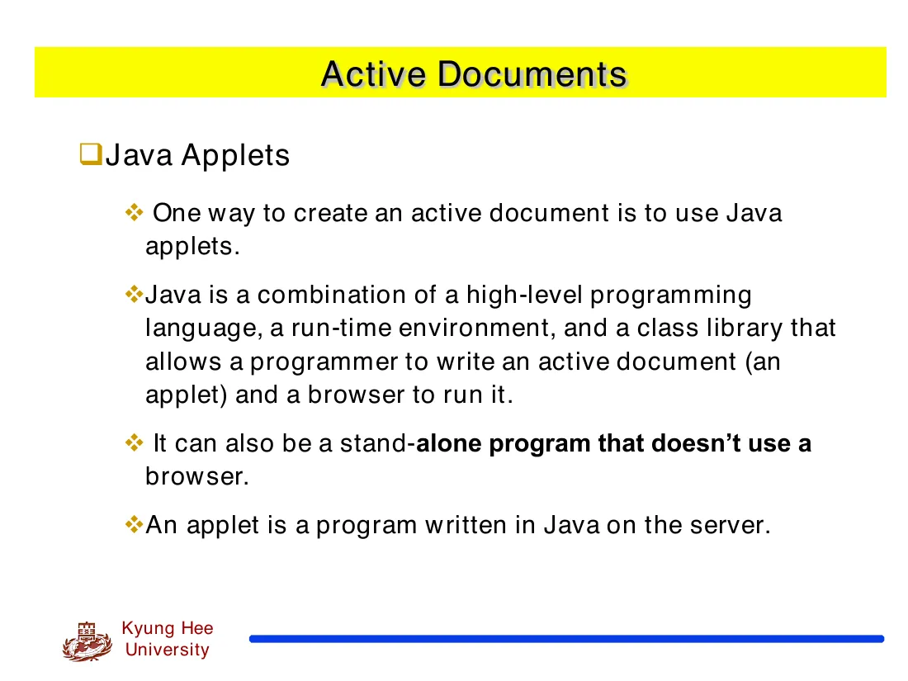

**직역**
> **액티브 문서(Active Documents)**
> - 자바 애플릿(Java Applets)
>   - 액티브 문서를 만드는 한 가지 방법은 자바 애플릿을 사용하는 것이다.
>   - 자바(Java)는 고수준 프로그래밍 언어, 런타임 환경(run-time environment), 클래스 라이브러리(class library)의 조합으로, 프로그래머가 액티브 문서(애플릿)를 작성하고 브라우저가 그것을 실행할 수 있게 해 준다.
>   - 브라우저를 사용하지 않는 독립 실행형 프로그램(stand-alone program)이 될 수도 있다.
>   - 애플릿(applet)은 서버에서 자바로 작성된 프로그램이다.

**설명**
- 최초 방식은 Java Applet으로, 가벼운 Java를 풀 코드로 넘겨 브라우저의 Java 런타임/컴파일러가 수행한다. 단순 스크립트와는 다르다.
- 동작: 서버에서 Java로 작성·컴파일(바이너리)하여 저장 → 클라이언트가 복사본을 요청 → 클라이언트가 자신의 S/W로 바이너리를 실행 가능한 코드로 변환 후 실행한다.
- 단점: 브라우저에 별도의 Java 실행기가 필요해 무겁다.

## 슬라이드 27

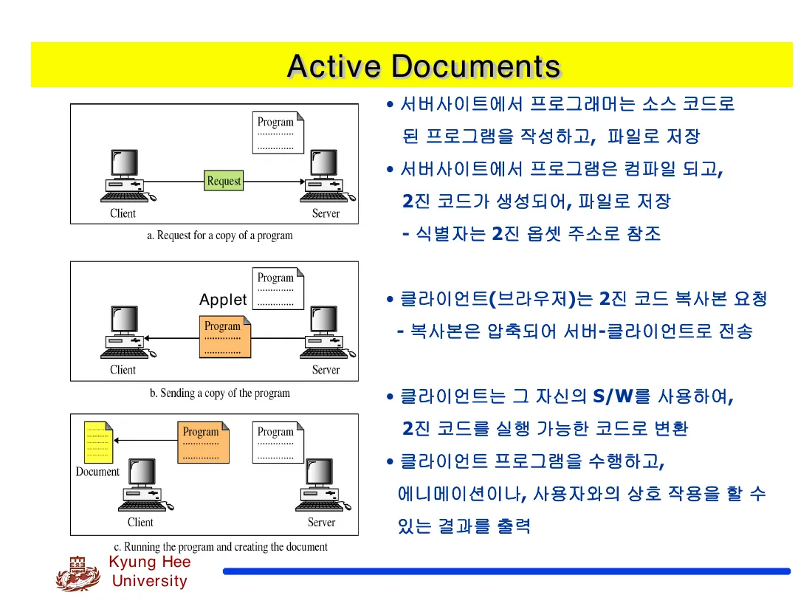

**직역**
> **액티브 문서(Active Documents)**
>
> (다이어그램 - 3단계)
> - a. Request for a copy of a program (프로그램 복사본 요청): Client → Request → Server(Program 보유)
> - b. Sending a copy of the program (프로그램 복사본 전송): Server의 Program(Applet) → Client
> - c. Running the program and creating the document (프로그램을 실행하고 문서를 생성): Client에서 Program 실행 → Document
>
> (오른쪽 설명 - Applet)
> - 서버사이트에서 프로그래머는 소스 코드로 된 프로그램을 작성하고, 파일로 저장
> - 서버사이트에서 프로그램은 컴파일 되고, 2진 코드가 생성되어, 파일로 저장
>   - 식별자는 2진 옵셋 주소로 참조
> - 클라이언트(브라우저)는 2진 코드 복사본 요청
>   - 복사본은 압축되어 서버-클라이언트로 전송
> - 클라이언트는 그 자신의 S/W를 사용하여, 2진 코드를 실행 가능한 코드로 변환
> - 클라이언트 프로그램을 수행하고, 에니메이션이나, 사용자와의 상호 작용을 할 수 있는 결과를 출력

## 슬라이드 28

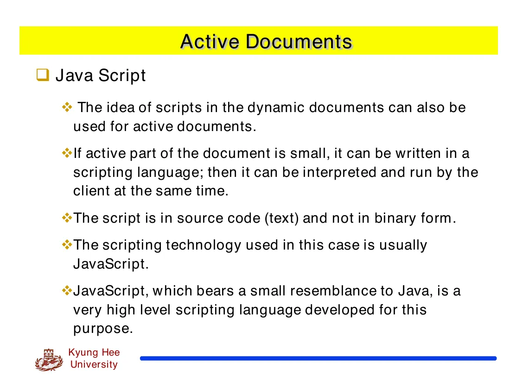

**직역**
> **액티브 문서(Active Documents)**
> - 자바 스크립트(Java Script)
>   - 동적 문서에서의 스크립트 아이디어는 액티브 문서에도 사용될 수 있다.
>   - 문서의 액티브 부분이 작으면, 스크립팅 언어로 작성할 수 있고, 그러면 클라이언트가 동시에 해석하고 실행할 수 있다.
>   - 스크립트는 소스 코드(텍스트) 형태이며 2진(binary) 형태가 아니다.
>   - 이 경우 사용되는 스크립팅 기술은 보통 JavaScript이다.
>   - JavaScript는 Java와 약간의 유사성을 지니며, 이 목적을 위해 개발된 매우 고수준의 스크립팅 언어이다.

**설명**
- HTML은 서버가 만들어 콘텐츠를 긁어 예쁘게 형태를 만들어 전달한다. 반면 JavaScript를 클라이언트에 주는 것은 프로세싱(처리)을 클라이언트에게 넘기겠다는 패러다임이다 → 사용자가 많아지면 서버 부담을 클라이언트로 넘기려는 비즈니스적 동기.
- JavaScript는 소스 코드(텍스트) 형태로 전달되어 브라우저가 해석·실행하므로, 컴파일된 바이너리를 넘기는 Java Applet보다 가벼운 클라이언트측 동적 문서 방식이다.
- 표현 기술 관점: HTML, JS는 서버가 만들어서 넘겨주는 반면, Java는 프로그래밍 언어 자체를 넘겨 프로세싱을 클라이언트에 넘겨주겠다는 발상이다(→ 이후 WASM으로 이어짐).
- Java Applet은 너무 무겁고 느려서 폐기되었고, 이후 JavaScript가 등장했다. 요즘은 Node.js 등 다양한 라이브러리/툴로 스크립트를 화려하게 작성한다.

## 슬라이드 29

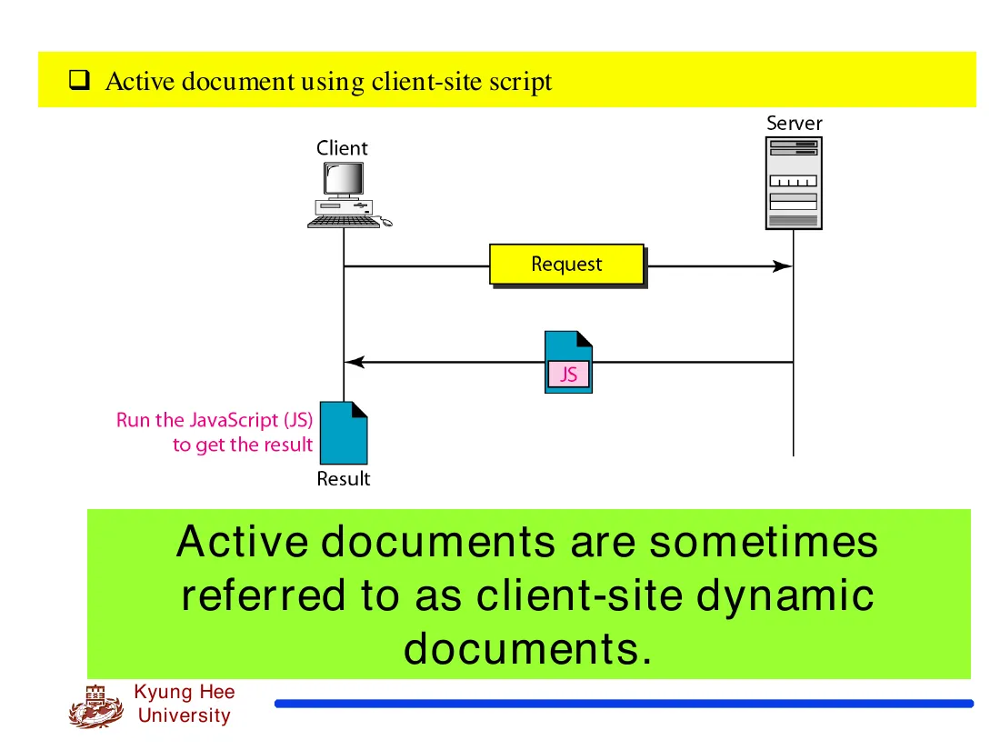

**직역**
> **클라이언트 사이드 스크립트를 사용한 액티브 문서(Active document using client-site script)**
>
> (다이어그램)
> - Client(클라이언트) → Request(요청) → Server(서버)
> - Server → JS(자바스크립트 스크립트) → Client
> - Client: Run the JavaScript (JS) to get the result (결과를 얻기 위해 JavaScript(JS)를 실행) → Result(결과)
>
> (강조 박스) 액티브 문서는 때때로 클라이언트 사이드 동적 문서(client-site dynamic documents)라고 불린다.

**설명**
- 서버는 JavaScript(JS) 스크립트를 클라이언트로 보내고, 클라이언트가 JS를 실행해 결과를 얻는다. 실행 위치가 클라이언트이므로 액티브 문서를 client-side dynamic document라고도 부른다(서버사이드 동적 문서와 대비됨).
