> 원본 슬라이드를 슬라이드별로 직역하고 강의 녹취 설명을 함께 정리한 노트.
> [← 전체 목차](/posts/ain-overview/)

## 슬라이드 1

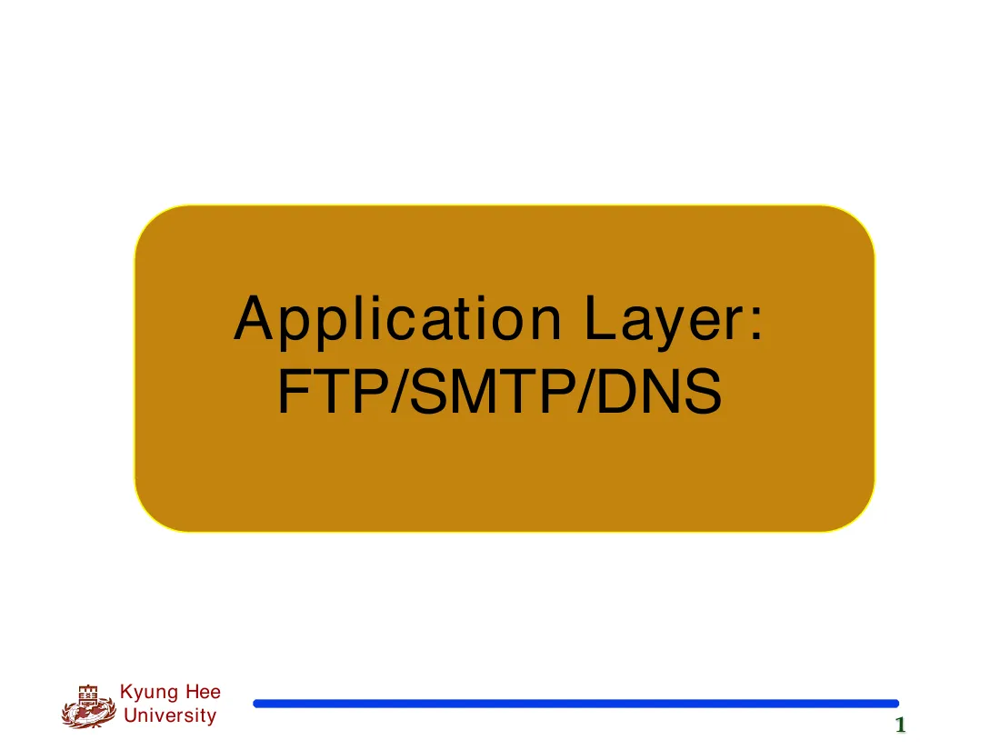

**직역**
> Application Layer: FTP/SMTP/DNS (응용 계층: FTP/SMTP/DNS)
> Kyung Hee University (경희대학교)

## 슬라이드 2

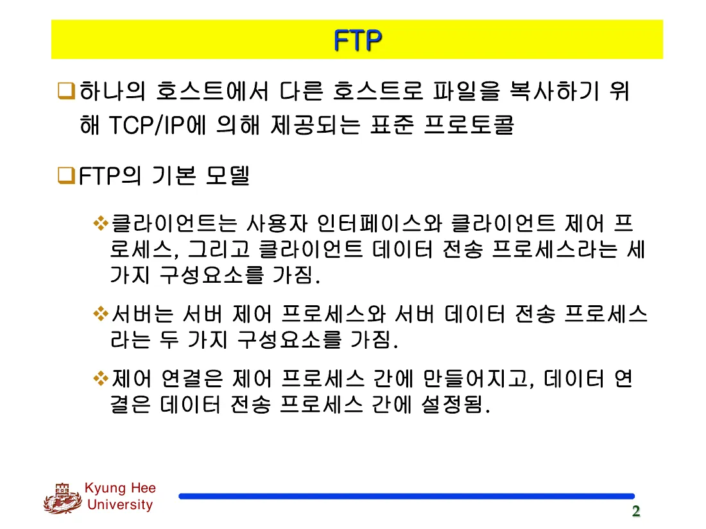

**직역**
> ### FTP
> 하나의 호스트에서 다른 호스트로 파일을 복사하기 위해 TCP/IP에 의해 제공되는 표준 프로토콜
>
> **FTP의 기본 모델**
> - 클라이언트는 사용자 인터페이스와 클라이언트 제어 프로세스, 그리고 클라이언트 데이터 전송 프로세스라는 세 가지 구성요소를 가짐.
> - 서버는 서버 제어 프로세스와 서버 데이터 전송 프로세스라는 두 가지 구성요소를 가짐.
> - 제어 연결(control connection)은 제어 프로세스 간에 만들어지고, 데이터 연결(data connection)은 데이터 전송 프로세스 간에 설정됨.

**설명**
- 목적: HTTP가 콘텐츠 문서를 주고받아 바로 확인하는 것과 달리, FTP는 **파일 단위**로 이동·복사한다. 바이너리 파일은 내용을 바로 못 보고 받아서 수행. TCP/IP 상에서 파일 단위로 효율적 전송 서비스.
- 전송 시 고려사항: 파일 종류(텍스트/바이너리), 파일 크기(크면 압축해서 전송), 전송 중 문제.

## 슬라이드 3

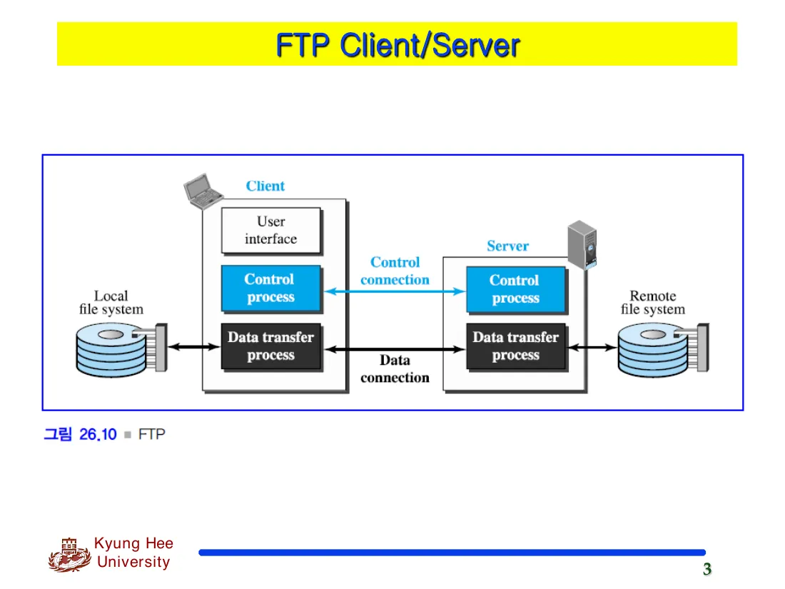

**직역**
> ### FTP Client/Server
> (그림 26.10 ■ FTP)
> - **Client(클라이언트)**: User interface(사용자 인터페이스), Control process(제어 프로세스), Data transfer process(데이터 전송 프로세스). Local file system(로컬 파일 시스템)과 연결.
> - **Server(서버)**: Control process(제어 프로세스), Data transfer process(데이터 전송 프로세스). Remote file system(원격 파일 시스템)과 연결.
> - Client의 Control process와 Server의 Control process 사이는 **Control connection(제어 연결)**.
> - Client의 Data transfer process와 Server의 Data transfer process 사이는 **Data connection(데이터 연결)**.

## 슬라이드 4

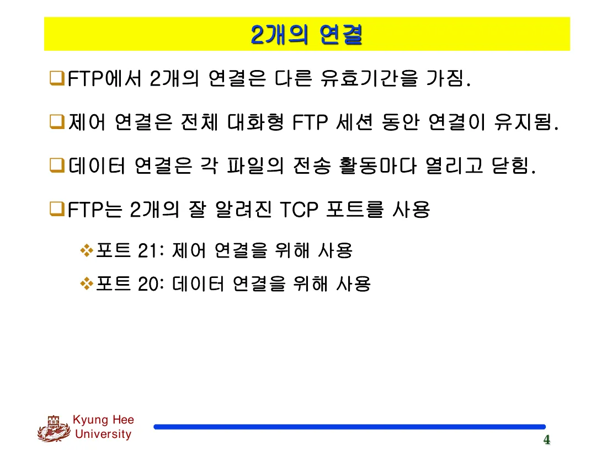

**직역**
> ### 2개의 연결
> FTP에서 2개의 연결은 다른 유효기간(lifetime)을 가짐.
> - 제어 연결은 전체 대화형 FTP 세션 동안 연결이 유지됨.
> - 데이터 연결은 각 파일의 전송 활동마다 열리고 닫힘.
>
> FTP는 2개의 잘 알려진(well-known) TCP 포트를 사용
> - 포트 21: 제어 연결(control connection)을 위해 사용
> - 포트 20: 데이터 연결(data connection)을 위해 사용

**설명**
- **두 개의 연결(채널) 분리**가 FTP의 핵심 특징이다. 데이터 전송과 접속 제어를 분리한 획기적 아이디어로, 두 연결은 서로 다른 유효기간을 가진다.
- 보안 효과: 파일마다 데이터 연결을 열고 닫으며 클라이언트 정보(포트 등)가 계속 바뀌어, 해킹 시 다른 데이터 작업(manipulation)을 막는 효과가 있다.

## 슬라이드 5

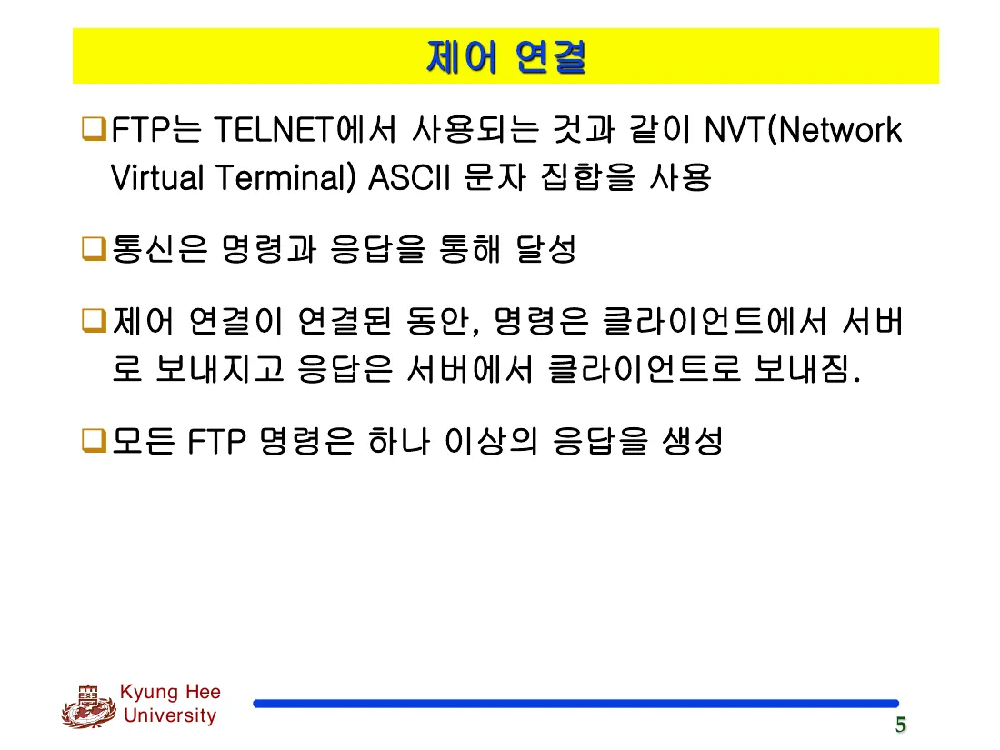

**직역**
> ### 제어 연결
> - FTP는 TELNET에서 사용되는 것과 같이 NVT(Network Virtual Terminal) ASCII 문자 집합을 사용
> - 통신은 명령(command)과 응답(response)을 통해 달성
> - 제어 연결이 연결된 동안, 명령은 클라이언트에서 서버로 보내지고 응답은 서버에서 클라이언트로 보내짐.
> - 모든 FTP 명령은 하나 이상의 응답을 생성

## 슬라이드 6

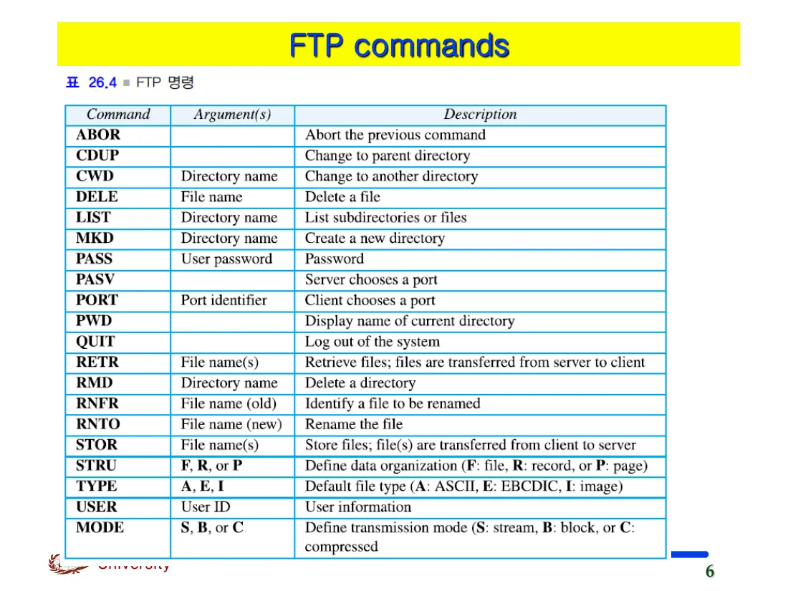

**직역**
> ### FTP commands (표 26.4 ■ FTP 명령)
>
> | Command | Argument(s) | Description |
> |---|---|---|
> | ABOR | | Abort the previous command |
> | CDUP | | Change to parent directory |
> | CWD | Directory name | Change to another directory |
> | DELE | File name | Delete a file |
> | LIST | Directory name | List subdirectories or files |
> | MKD | Directory name | Create a new directory |
> | PASS | User password | Password |
> | PASV | | Server chooses a port |
> | PORT | Port identifier | Client chooses a port |
> | PWD | | Display name of current directory |
> | QUIT | | Log out of the system |
> | RETR | File name(s) | Retrieve files; files are transferred from server to client |
> | RMD | Directory name | Delete a directory |
> | RNFR | File name (old) | Identify a file to be renamed |
> | RNTO | File name (new) | Rename the file |
> | STOR | File name(s) | Store files; file(s) are transferred from client to server |
> | STRU | F, R, or P | Define data organization (F: file, R: record, P: page) |
> | TYPE | A, E, I | Default file type (A: ASCII, E: EBCDIC, I: image) |
> | USER | User ID | User information |
> | MODE | S, B, or C | Define transmission mode (S: stream, B: block, C: compressed) |

## 슬라이드 7

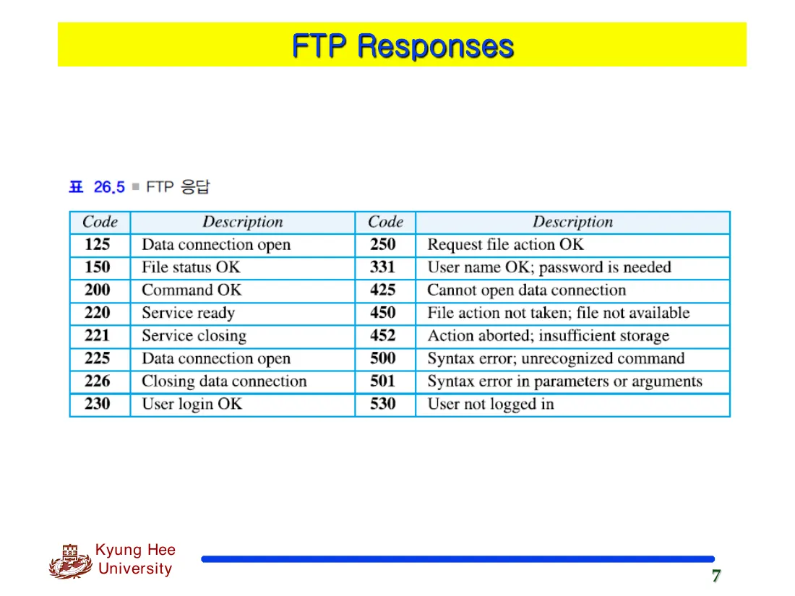

**직역**
> ### FTP Responses (표 26.5 ■ FTP 응답)
>
> | Code | Description | Code | Description |
> |---|---|---|---|
> | 125 | Data connection open | 250 | Request file action OK |
> | 150 | File status OK | 331 | User name OK; password is needed |
> | 200 | Command OK | 425 | Cannot open data connection |
> | 220 | Service ready | 450 | File action not taken; file not available |
> | 221 | Service closing | 452 | Action aborted; insufficient storage |
> | 225 | Data connection open | 500 | Syntax error; unrecognized command |
> | 226 | Closing data connection | 501 | Syntax error in parameters or arguments |
> | 230 | User login OK | 530 | User not logged in |

**설명**
- 포트는 제어 21번, 데이터는 낮은 번호(20번)를 쓴다. Telnet처럼 문자 집합으로 명령어를 주고받고, 하나 이상의 응답(코드)을 받는다.

## 슬라이드 8

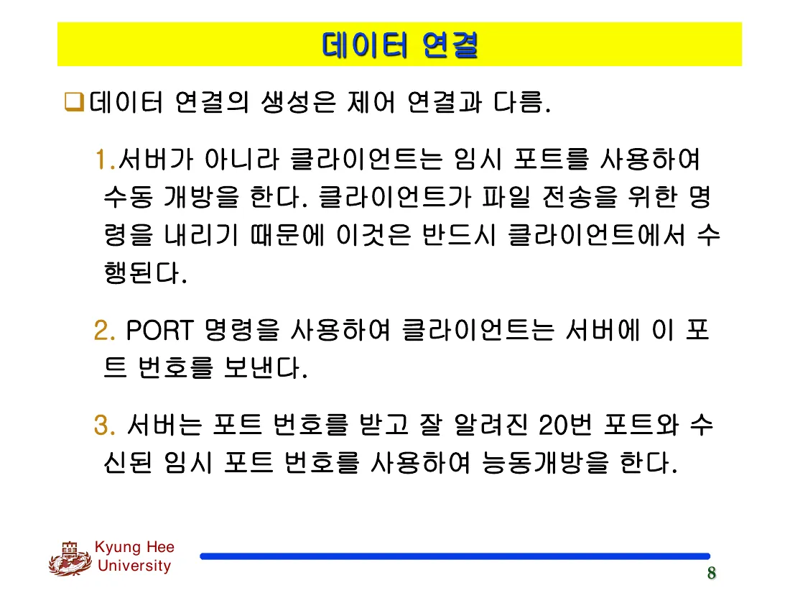

**직역**
> ### 데이터 연결
> 데이터 연결의 생성은 제어 연결과 다름.
> 1. 서버가 아니라 클라이언트는 임시 포트(ephemeral port)를 사용하여 수동 개방(passive open)을 한다. 클라이언트가 파일 전송을 위한 명령을 내리기 때문에 이것은 반드시 클라이언트에서 수행된다.
> 2. PORT 명령을 사용하여 클라이언트는 서버에 이 포트 번호를 보낸다.
> 3. 서버는 포트 번호를 받고 잘 알려진 20번 포트와 수신된 임시 포트 번호를 사용하여 능동 개방(active open)을 한다.

## 슬라이드 9

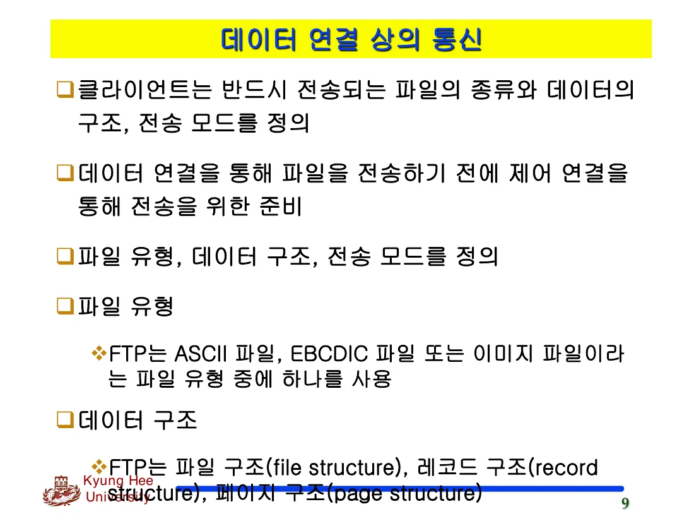

**직역**
> ### 데이터 연결 상의 통신
> - 클라이언트는 반드시 전송되는 파일의 종류와 데이터의 구조, 전송 모드를 정의
> - 데이터 연결을 통해 파일을 전송하기 전에 제어 연결을 통해 전송을 위한 준비
> - 파일 유형, 데이터 구조, 전송 모드를 정의
>
> **파일 유형(file type)**
> - FTP는 ASCII 파일, EBCDIC 파일 또는 이미지 파일이라는 파일 유형 중에 하나를 사용
>
> **데이터 구조(data structure)**
> - FTP는 파일 구조(file structure), 레코드 구조(record structure), 페이지 구조(page structure)

## 슬라이드 10

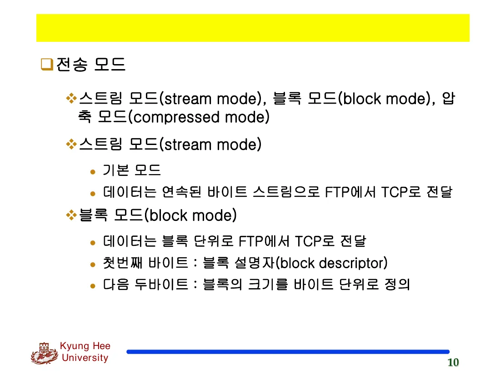

**직역**
> **전송 모드(transmission mode)**
> - 스트림 모드(stream mode), 블록 모드(block mode), 압축 모드(compressed mode)
> - 스트림 모드(stream mode)
>   - 기본 모드
>   - 데이터는 연속된 바이트 스트림으로 FTP에서 TCP로 전달
> - 블록 모드(block mode)
>   - 데이터는 블록 단위로 FTP에서 TCP로 전달
>   - 첫번째 바이트: 블록 설명자(block descriptor)
>   - 다음 두 바이트: 블록의 크기를 바이트 단위로 정의

## 슬라이드 11

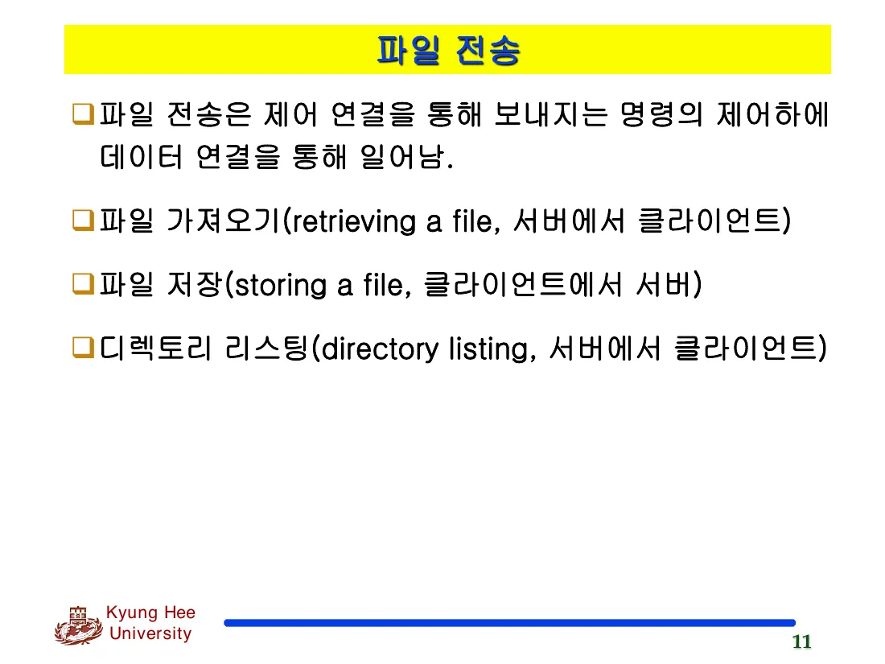

**직역**
> ### 파일 전송
> 파일 전송은 제어 연결을 통해 보내지는 명령의 제어하에 데이터 연결을 통해 일어남.
> - 파일 가져오기(retrieving a file, 서버에서 클라이언트)
> - 파일 저장(storing a file, 클라이언트에서 서버)
> - 디렉토리 리스팅(directory listing, 서버에서 클라이언트)

## 슬라이드 12

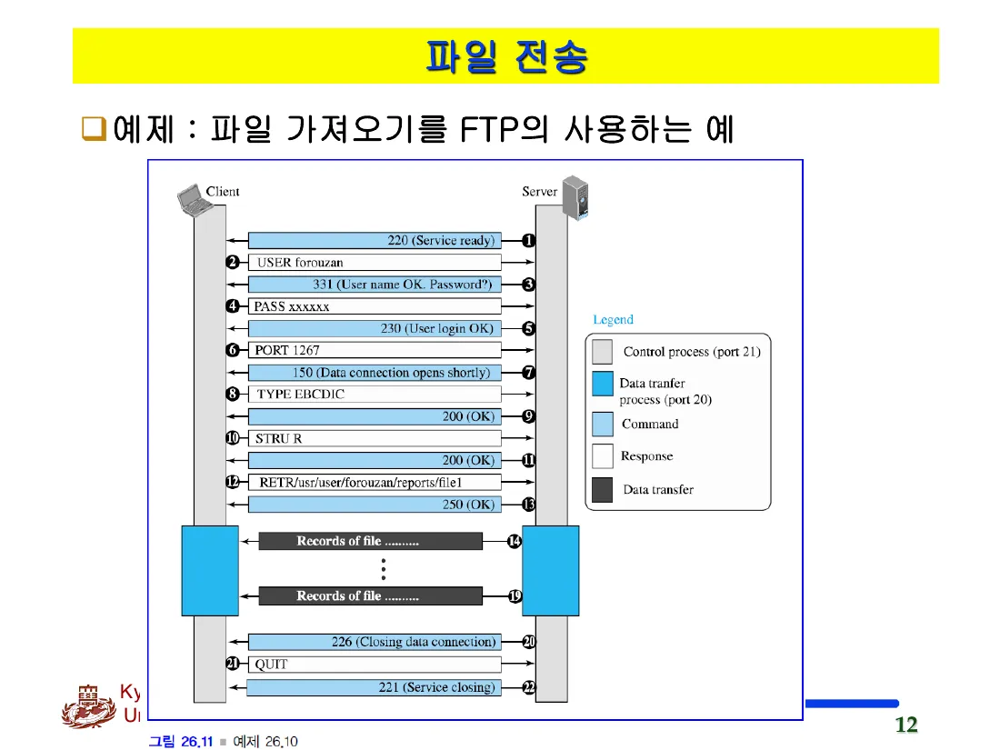

**직역**
> ### 파일 전송
> 예제: 파일 가져오기를 FTP의 사용하는 예 (그림 26.11 ■ 예제 26.10)
>
> Client ↔ Server 메시지 흐름:
> 1. `220 (Service ready)` (서버→클라이언트)
> 2. `USER forouzan` (클라이언트→서버)
> 3. `331 (User name OK. Password?)`
> 4. `PASS xxxxxx`
> 5. `230 (User login OK)`
> 6. `PORT 1267`
> 7. `150 (Data connection opens shortly)`
> 8. `TYPE EBCDIC`
> 9. `200 (OK)`
> 10. `STRU R`
> 11. `200 (OK)`
> 12. `RETR /usr/user/forouzan/reports/file1`
> 13. `250 (OK)`
> 14. `Records of file ..........` (데이터 전송)
> 19. `Records of file ..........` (데이터 전송)
> 20. `226 (Closing data connection)`
> 21. `QUIT`
> 22. `221 (Service closing)`
>
> **Legend(범례)**
> - Control process (port 21) (제어 프로세스, 포트 21)
> - Data transfer process (port 20) (데이터 전송 프로세스, 포트 20)
> - Command (명령)
> - Response (응답)
> - Data transfer (데이터 전송)

**설명**
- 실제 흐름: `ftp 주소`로 접속 → 220 OK → USER(이름) → PASS(패스워드) → PORT 설정 → TYPE 설정 → STOR/RETR로 전송 → QUIT. C 프로그램에서는 send로 명령어 문자열을 구성해 전송한다.

## 슬라이드 13

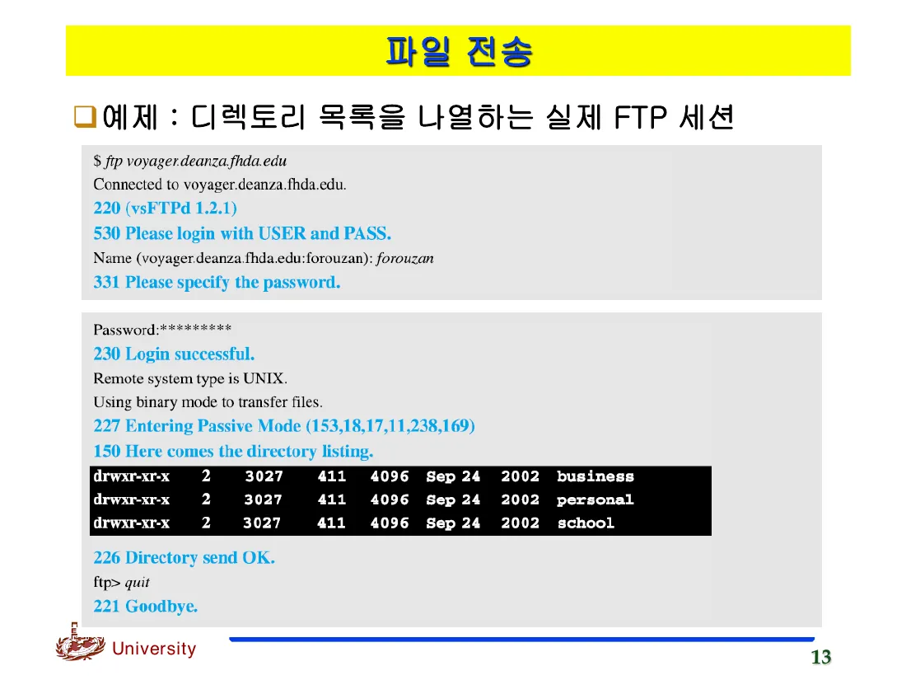

**직역**
> ### 파일 전송
> 예제: 디렉토리 목록을 나열하는 실제 FTP 세션
>
> ```
> $ ftp voyager.deanza.fhda.edu
> Connected to voyager.deanza.fhda.edu.
> 220 (vsFTPd 1.2.1)
> 530 Please login with USER and PASS.
> Name (voyager.deanza.fhda.edu:forouzan): forouzan
> 331 Please specify the password.
> Password:*********
> 230 Login successful.
> Remote system type is UNIX.
> Using binary mode to transfer files.
> 227 Entering Passive Mode (153,18,17,11,238,169)
> 150 Here comes the directory listing.
> drwxr-xr-x  2  3027  411  4096  Sep 24  2002  business
> drwxr-xr-x  2  3027  411  4096  Sep 24  2002  personal
> drwxr-xr-x  2  3027  411  4096  Sep 24  2002  school
> 226 Directory send OK.
> ftp> quit
> 221 Goodbye.
> ```

## 슬라이드 14

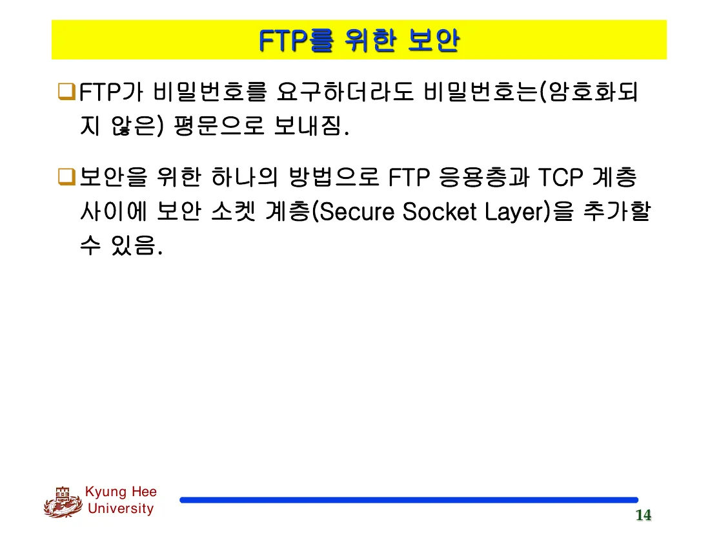

**직역**
> ### FTP를 위한 보안
> - FTP가 비밀번호를 요구하더라도 비밀번호는 (암호화되지 않은) 평문(plaintext)으로 보내짐.
> - 보안을 위한 하나의 방법으로 FTP 응용층과 TCP 계층 사이에 보안 소켓 계층(Secure Socket Layer)을 추가할 수 있음.

**설명**
- 초창기 FTP는 패스워드를 **평문(plaintext)**으로 전송 → SFTP/SCP가 등장. TCP 위에 **SSL/TLS** 계층을 두어 응용계층에서 내려오는 데이터를 암호화한다.
- 상대방과 키 교환·협상이 필요한데, 이 협상(핸드셰이킹) 과정을 보안에서는 **SA(Security Association)**라 부른다(어떤 암호·키를 쓸지 negotiation).

## 슬라이드 15

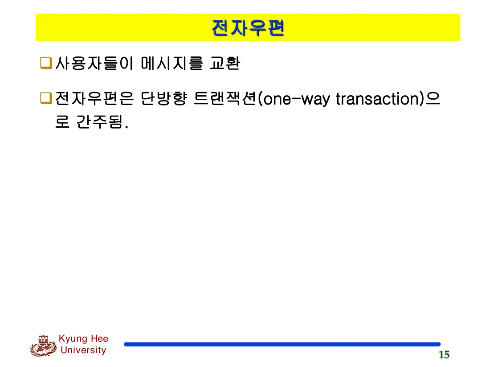

**직역**
> ### 전자우편
> - 사용자들이 메시지를 교환
> - 전자우편은 단방향 트랜잭션(one-way transaction)으로 간주됨.

**설명**
- 이메일은 사용자 우편 메시지 서비스이며 **one-way transaction**이다. 송신자(Alice)와 수신자(Bob)가 각자 우편 서버에 연결되어 전송한다.

## 슬라이드 16

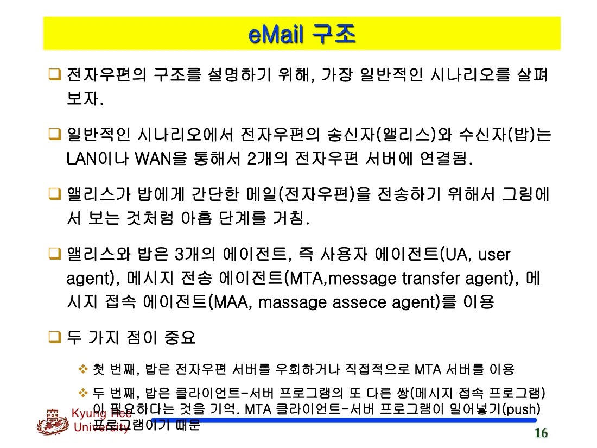

**직역**
> ### eMail 구조
> - 전자우편의 구조를 설명하기 위해, 가장 일반적인 시나리오를 살펴보자.
> - 일반적인 시나리오에서 전자우편의 송신자(앨리스)와 수신자(밥)는 LAN이나 WAN을 통해서 2개의 전자우편 서버에 연결됨.
> - 앨리스가 밥에게 간단한 메일(전자우편)을 전송하기 위해서 그림에서 보는 것처럼 아홉 단계를 거침.
> - 앨리스와 밥은 3개의 에이전트, 즉 사용자 에이전트(UA, user agent), 메시지 전송 에이전트(MTA, message transfer agent), 메시지 접속 에이전트(MAA, massage assece agent)를 이용
> - 두 가지 점이 중요
>   - 첫 번째, 밥은 전자우편 서버를 우회하거나 직접적으로 MTA 서버를 이용
>   - 두 번째, 밥은 클라이언트-서버 프로그램의 또 다른 쌍(메시지 접속 프로그램)이 필요하다는 것을 기억. MTA 클라이언트-서버 프로그램이 밀어넣기(push) 프로그램이기 때문

**설명**
- 세 에이전트: **UA(User Agent)** = 사용자 프로그램(Outlook, 웹 등)으로 서버에 접속. **MTA(Message Transfer Agent)** = 메일을 다른 서버로 전송(SMTP). **MAA(Message Access Agent)** = 수신 측에서 사용자가 자기 메일박스의 메일을 읽어올 때 사용.

## 슬라이드 17

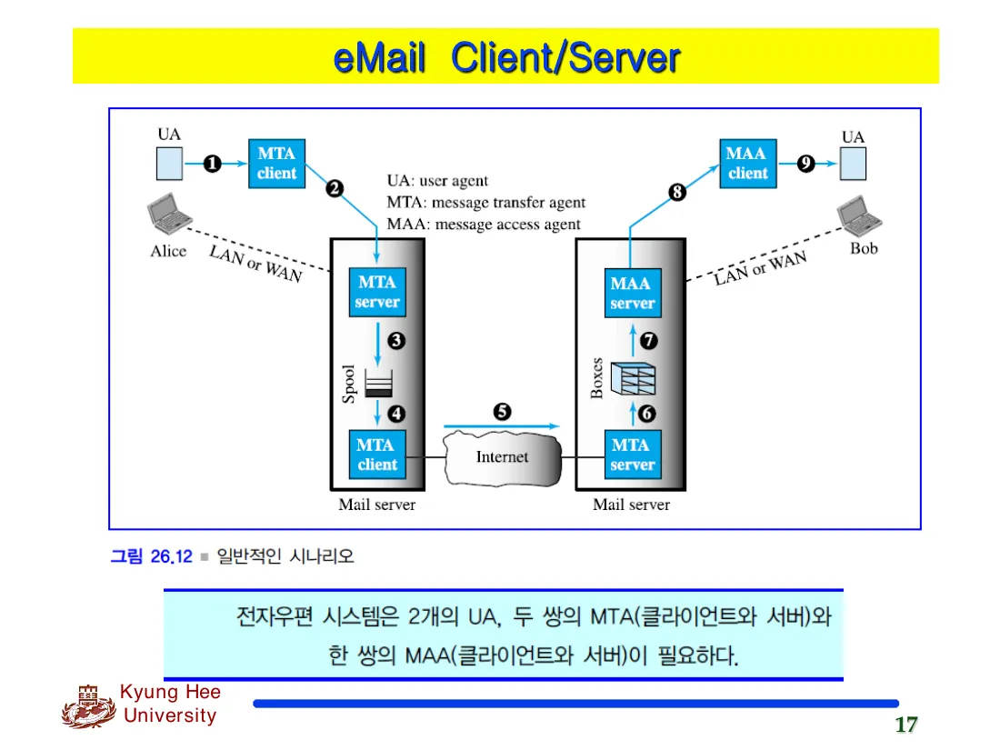

**직역**
> ### eMail Client/Server (그림 26.12 ■ 일반적인 시나리오)
> - UA: user agent / MTA: message transfer agent / MAA: message access agent
> - 흐름(좌→우): Alice의 UA → (1) → MTA client → (2) → (Alice 측) Mail server의 MTA server → (3, Spool) → MTA client → (4) → Internet → (5) → (Bob 측) Mail server의 MTA server → (6, Boxes) → MAA server → (7) → (8) → MAA client → (9) → Bob의 UA
> - 하단 강조 박스: 전자우편 시스템은 2개의 UA, 두 쌍의 MTA(클라이언트와 서버)와 한 쌍의 MAA(클라이언트와 서버)이 필요하다.

**설명**
- 수신 측은 사용자별 **메시지 박스(폴더, inbox/outbox)**를 파일 형태(또는 DB)로 관리한다. 메일 읽기 프로그램(MAA 클라이언트)이 서버에 접속해 자기 메일박스를 읽는다. 학교 메일 서버는 보내기(MTA)·받기(MAA) 기능을 다 가지며 웹메일 형태로도 지원한다.

## 슬라이드 18

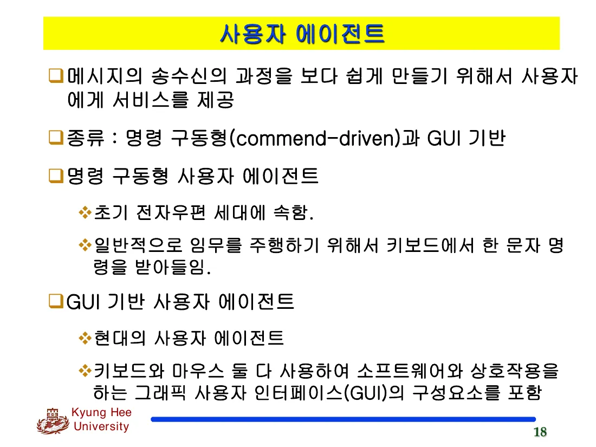

**직역**
> ### 사용자 에이전트
> - 메시지의 송수신의 과정을 보다 쉽게 만들기 위해서 사용자에게 서비스를 제공
> - 종류: 명령 구동형(command-driven)과 GUI 기반
> - 명령 구동형 사용자 에이전트
>   - 초기 전자우편 세대에 속함.
>   - 일반적으로 임무를 주행하기 위해서 키보드에서 한 문자 명령을 받아들임.
> - GUI 기반 사용자 에이전트
>   - 현대의 사용자 에이전트
>   - 키보드와 마우스 둘 다 사용하여 소프트웨어와 상호작용을 하는 그래픽 사용자 인터페이스(GUI)의 구성요소를 포함

## 슬라이드 19

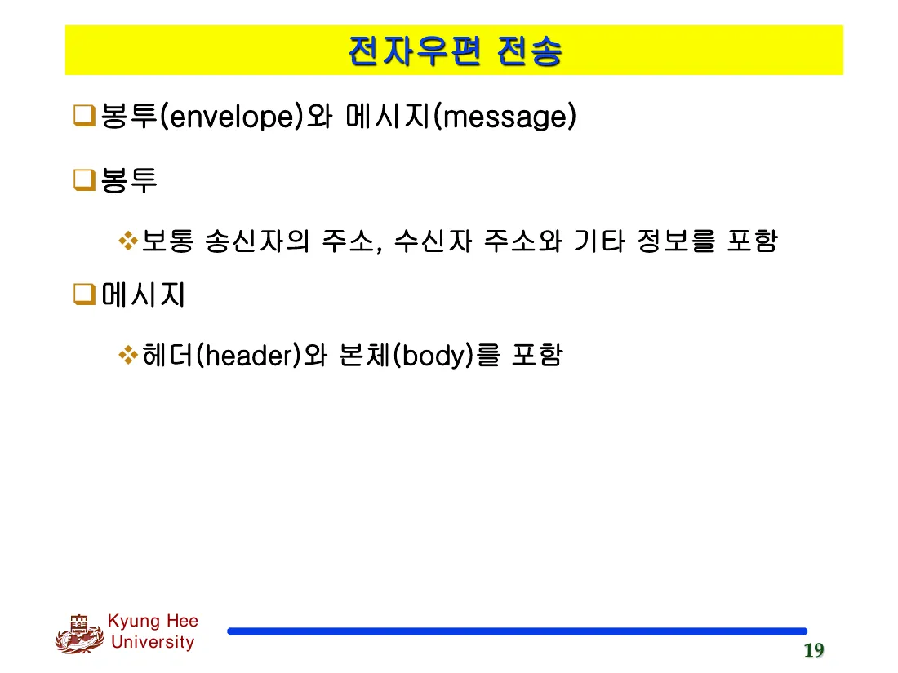

**직역**
> ### 전자우편 전송
> - 봉투(envelope)와 메시지(message)
> - 봉투
>   - 보통 송신자의 주소, 수신자 주소와 기타 정보를 포함
> - 메시지
>   - 헤더(header)와 본체(body)를 포함

**설명**
- 이메일 구조: **Envelope(봉투, 주소 정보) + Message(헤더 + 바디)**. 헤더 = From/To/날짜/제목, 바디 = 순수 메시지 내용.
- 참고: 느린 우편(post mail)을 **Snail Mail(스네일 메일)**이라 부른다(달팽이). 이메일은 그보다 빠르다.

## 슬라이드 20

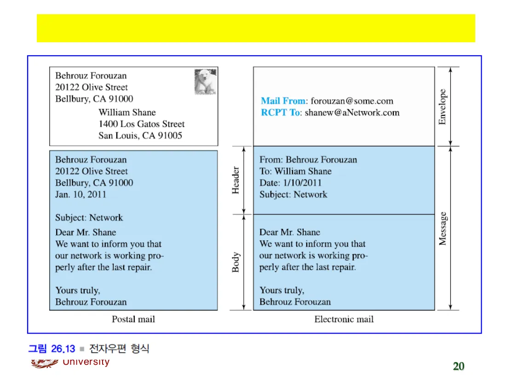

**직역**
> (그림 26.13 ■ 전자우편 형식) — Postal mail(우편)과 Electronic mail(전자우편) 비교
>
> **Postal mail (우편)**
> - (봉투) Behrouz Forouzan / 20122 Olive Street / Bellbury, CA 91000 — William Shane / 1400 Los Gatos Street / San Louis, CA 91005
> - (편지) Behrouz Forouzan / 20122 Olive Street / Bellbury, CA 91000 / Jan. 10, 2011 / Subject: Network / Dear Mr. Shane / We want to inform you that our network is working properly after the last repair. / Yours truly, / Behrouz Forouzan
>
> **Electronic mail (전자우편)**
> - **Envelope(봉투)**: Mail From: forouzan@some.com / RCPT To: shanew@aNetwork.com
> - **Header(헤더)**: From: Behrouz Forouzan / To: William Shane / Date: 1/10/2011 / Subject: Network
> - **Body(본체)**: Dear Mr. Shane / We want to inform you that our network is working properly after the last repair. / Yours truly, / Behrouz Forouzan
> - 우측 라벨: Envelope, Header, Body, Message

## 슬라이드 21

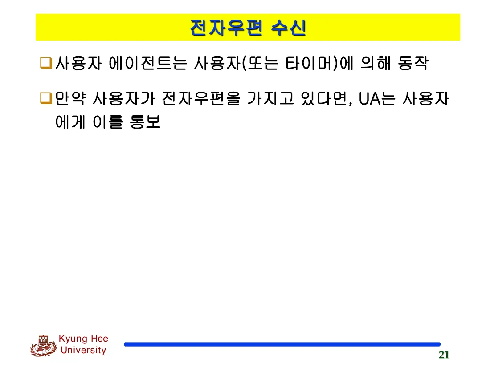

**직역**
> ### 전자우편 수신
> - 사용자 에이전트는 사용자(또는 타이머)에 의해 동작
> - 만약 사용자가 전자우편을 가지고 있다면, UA는 사용자에게 이를 통보

## 슬라이드 22

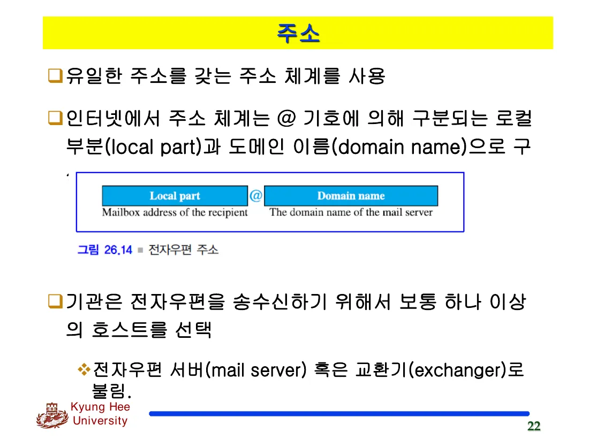

**직역**
> ### 주소
> - 유일한 주소를 갖는 주소 체계를 사용
> - 인터넷에서 주소 체계는 @ 기호에 의해 구분되는 로컬 부분(local part)과 도메인 이름(domain name)으로 구성
>
> (그림 26.14 ■ 전자우편 주소)
> - **Local part** @ **Domain name**
> - Local part = Mailbox address of the recipient (수신자의 편지함 주소)
> - Domain name = The domain name of the mail server (메일 서버의 도메인 이름)
>
> - 기관은 전자우편을 송수신하기 위해서 보통 하나 이상의 호스트를 선택
>   - 전자우편 서버(mail server) 혹은 교환기(exchanger)로 불림.

## 슬라이드 23

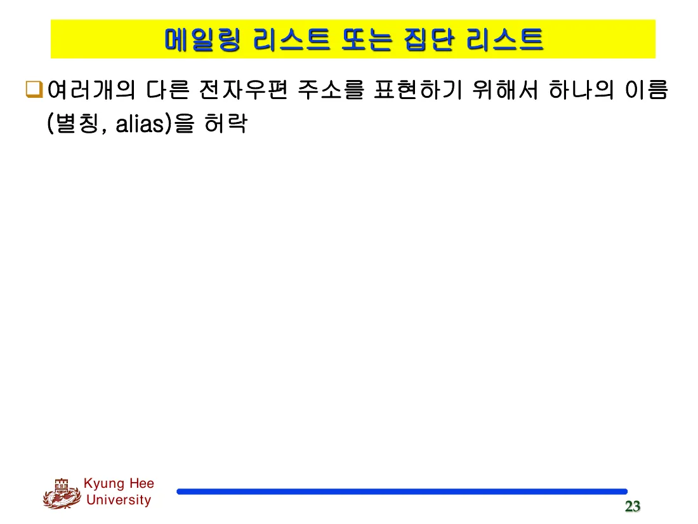

**직역**
> ### 메일링 리스트 또는 집단 리스트
> - 여러개의 다른 전자우편 주소를 표현하기 위해서 하나의 이름(별칭, alias)을 허락

## 슬라이드 24

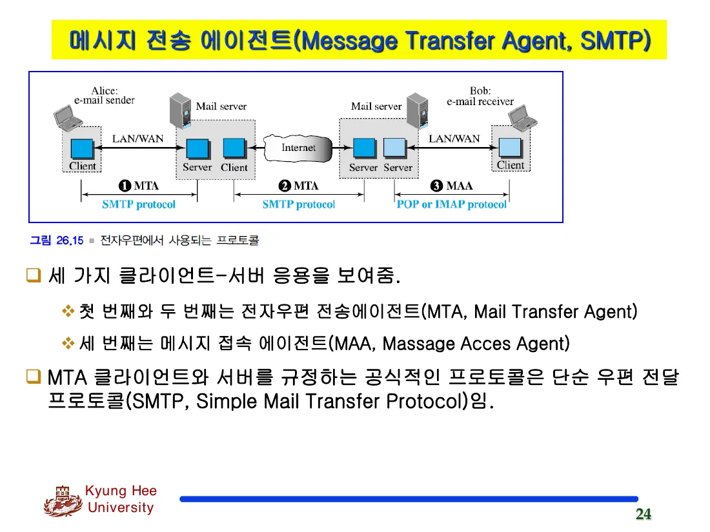

**직역**
> ### 메시지 전송 에이전트(Message Transfer Agent, SMTP)
> (그림 26.15 ■ 전자우편에서 사용되는 프로토콜)
> - Alice: e-mail sender(전자우편 송신자) → Client → (Mail server) Server / Client → SMTP protocol → Internet → SMTP protocol → (Mail server) Server / Server → Client: Bob: e-mail receiver(전자우편 수신자)
> - 구간 라벨: (1) MTA — SMTP protocol, (2) MTA — SMTP protocol, (3) MAA — POP or IMAP protocol
>
> - 세 가지 클라이언트-서버 응용을 보여줌.
>   - 첫 번째와 두 번째는 전자우편 전송 에이전트(MTA, Mail Transfer Agent)
>   - 세 번째는 메시지 접속 에이전트(MAA, Massage Acces Agent)
> - MTA 클라이언트와 서버를 규정하는 공식적인 프로토콜은 단순 우편 전달 프로토콜(SMTP, Simple Mail Transfer Protocol)임.

**설명**
- 메시지 전송 프로토콜 = **SMTP(Simple Mail Transfer Protocol)**, 포트 25번. 학교 메일 서버가 받아서 상대 도메인의 MTA로 접속해 하나씩 전달한다.

## 슬라이드 25

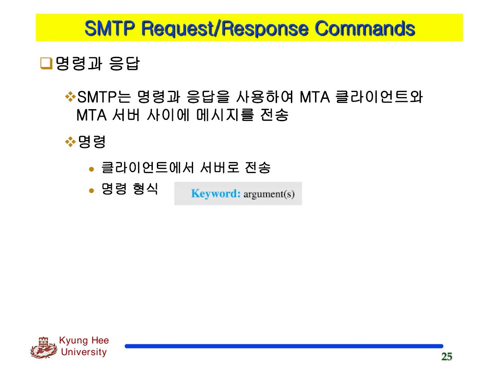

**직역**
> ### SMTP Request/Response Commands
> **명령과 응답**
> - SMTP는 명령(command)과 응답(response)을 사용하여 MTA 클라이언트와 MTA 서버 사이에 메시지를 전송
> - 명령
>   - 클라이언트에서 서버로 전송
>   - 명령 형식

## 슬라이드 26

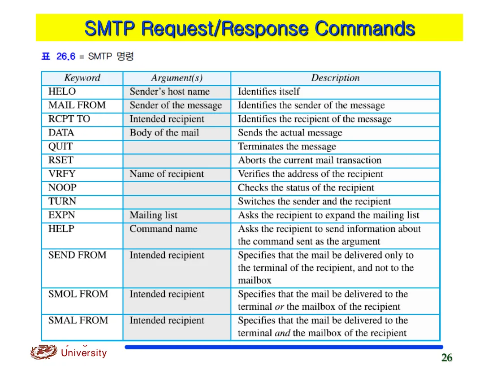

**직역**
> ### SMTP Request/Response Commands (표 26.6 ■ SMTP 명령)
>
> | Keyword | Argument(s) | Description |
> |---|---|---|
> | HELO | Sender's host name | Identifies itself |
> | MAIL FROM | Sender of the message | Identifies the sender of the message |
> | RCPT TO | Intended recipient | Identifies the recipient of the message |
> | DATA | Body of the mail | Sends the actual message |
> | QUIT | | Terminates the message |
> | RSET | | Aborts the current mail transaction |
> | VRFY | Name of recipient | Verifies the address of the recipient |
> | NOOP | | Checks the status of the recipient |
> | TURN | | Switches the sender and the recipient |
> | EXPN | Mailing list | Asks the recipient to expand the mailing list |
> | HELP | Command name | Asks the recipient to send information about the command sent as the argument |
> | SEND FROM | Intended recipient | Specifies that the mail be delivered only to the terminal of the recipient, and not to the mailbox |
> | SMOL FROM | Intended recipient | Specifies that the mail be delivered to the terminal or the mailbox of the recipient |
> | SMAL FROM | Intended recipient | Specifies that the mail be delivered to the terminal and the mailbox of the recipient |

## 슬라이드 27

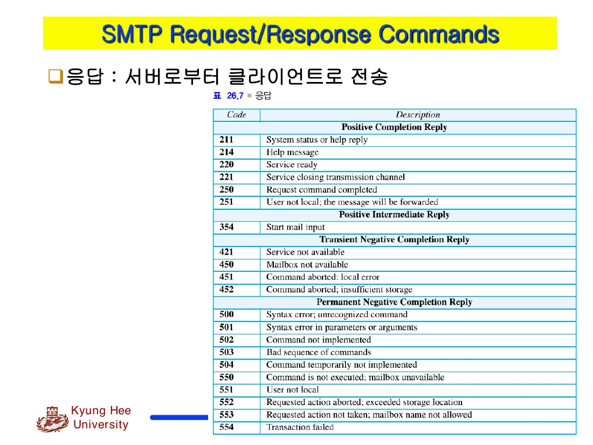

**직역**
> ### SMTP Request/Response Commands
> 응답: 서버로부터 클라이언트로 전송 (표 26.7 ■ 응답)
>
> | Code | Description |
> |---|---|
> | **Positive Completion Reply** | |
> | 211 | System status or help reply |
> | 214 | Help message |
> | 220 | Service ready |
> | 221 | Service closing transmission channel |
> | 250 | Request command completed |
> | 251 | User not local; the message will be forwarded |
> | **Positive Intermediate Reply** | |
> | 354 | Start mail input |
> | **Transient Negative Completion Reply** | |
> | 421 | Service not available |
> | 450 | Mailbox not available |
> | 451 | Command aborted: local error |
> | 452 | Command aborted; insufficient storage |
> | **Permanent Negative Completion Reply** | |
> | 500 | Syntax error; unrecognized command |
> | 501 | Syntax error in parameters or arguments |
> | 502 | Command not implemented |
> | 503 | Bad sequence of commands |
> | 504 | Command temporarily not implemented |
> | 550 | Command is not executed; mailbox unavailable |
> | 551 | User not local |
> | 552 | Requested action aborted; exceeded storage location |
> | 553 | Requested action not taken; mailbox name not allowed |
> | 554 | Transaction failed |

## 슬라이드 28

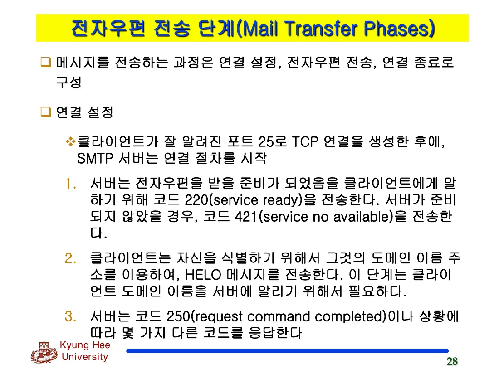

**직역**
> ### 전자우편 전송 단계(Mail Transfer Phases)
> 메시지를 전송하는 과정은 연결 설정, 전자우편 전송, 연결 종료로 구성
>
> **연결 설정**
> 클라이언트가 잘 알려진 포트 25로 TCP 연결을 생성한 후에, SMTP 서버는 연결 절차를 시작
> 1. 서버는 전자우편을 받을 준비가 되었음을 클라이언트에게 말하기 위해 코드 220(service ready)을 전송한다. 서버가 준비되지 않았을 경우, 코드 421(service no available)을 전송한다.
> 2. 클라이언트는 자신을 식별하기 위해서 그것의 도메인 이름 주소를 이용하여, HELO 메시지를 전송한다. 이 단계는 클라이언트 도메인 이름을 서버에 알리기 위해서 필요하다.
> 3. 서버는 코드 250(request command completed)이나 상황에 따라 몇 가지 다른 코드를 응답한다

## 슬라이드 29

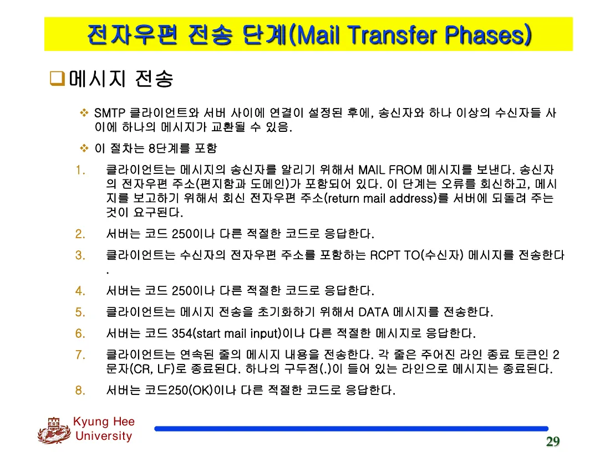

**직역**
> ### 전자우편 전송 단계(Mail Transfer Phases)
> **메시지 전송**
> - SMTP 클라이언트와 서버 사이에 연결이 설정된 후에, 송신자와 하나 이상의 수신자들 사이에 하나의 메시지가 교환될 수 있음.
> - 이 절차는 8단계를 포함
> 1. 클라이언트는 메시지의 송신자를 알리기 위해서 MAIL FROM 메시지를 보낸다. 송신자의 전자우편 주소(편지함과 도메인)가 포함되어 있다. 이 단계는 오류를 회신하고, 메시지를 보고하기 위해서 회신 전자우편 주소(return mail address)를 서버에 되돌려 주는 것이 요구된다.
> 2. 서버는 코드 250이나 다른 적절한 코드로 응답한다.
> 3. 클라이언트는 수신자의 전자우편 주소를 포함하는 RCPT TO(수신자) 메시지를 전송한다.
> 4. 서버는 코드 250이나 다른 적절한 코드로 응답한다.
> 5. 클라이언트는 메시지 전송을 초기화하기 위해서 DATA 메시지를 전송한다.
> 6. 서버는 코드 354(start mail input)이나 다른 적절한 메시지로 응답한다.
> 7. 클라이언트는 연속된 줄의 메시지 내용을 전송한다. 각 줄은 주어진 라인 종료 토큰인 2문자(CR, LF)로 종료된다. 하나의 구두점(.)이 들어 있는 라인으로 메시지는 종료된다.
> 8. 서버는 코드 250(OK)이나 다른 적절한 코드로 응답한다.

## 슬라이드 30

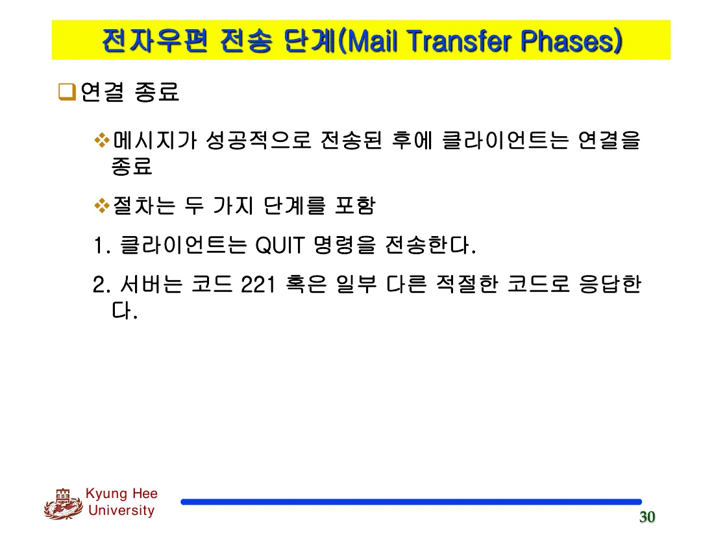

**직역**
> ### 전자우편 전송 단계(Mail Transfer Phases)
> **연결 종료**
> - 메시지가 성공적으로 전송된 후에 클라이언트는 연결을 종료
> - 절차는 두 가지 단계를 포함
> 1. 클라이언트는 QUIT 명령을 전송한다.
> 2. 서버는 코드 221 혹은 일부 다른 적절한 코드로 응답한다.

## 슬라이드 31

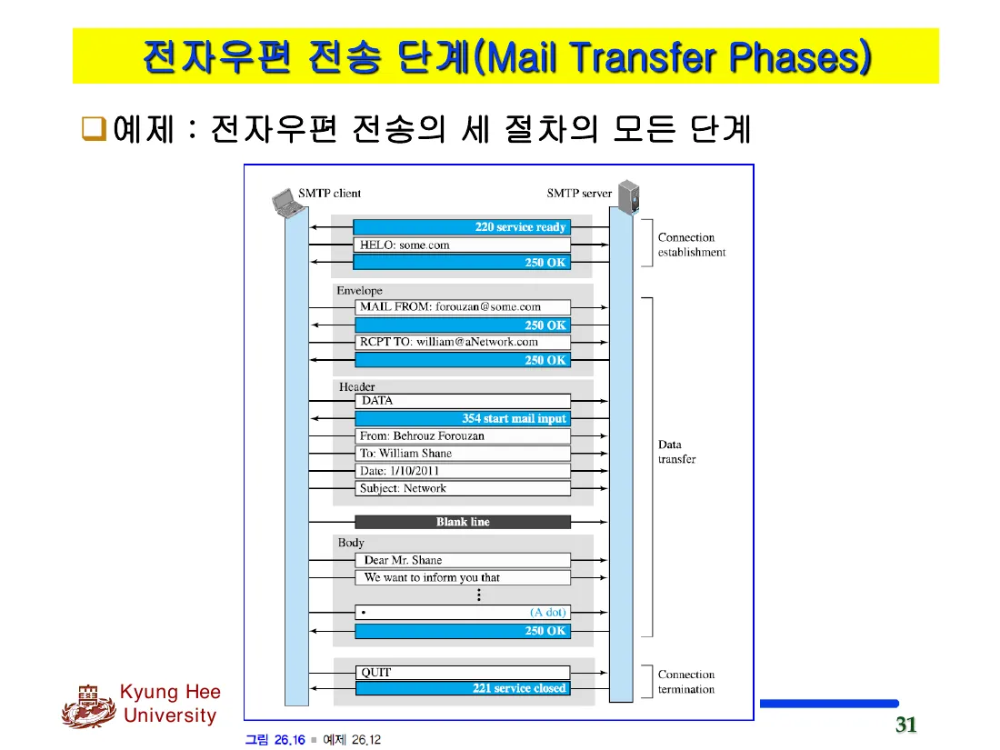

**직역**
> ### 전자우편 전송 단계(Mail Transfer Phases)
> 예제: 전자우편 전송의 세 절차의 모든 단계 (그림 26.16 ■ 예제 26.12)
>
> SMTP client ↔ SMTP server:
> - **Connection establishment(연결 설정)**: `220 service ready` → `HELO: some.com` → `250 OK`
> - **Envelope(봉투)**: `MAIL FROM: forouzan@some.com` → `250 OK` → `RCPT TO: william@aNetwork.com` → `250 OK`
> - **Header(헤더) / Data transfer(데이터 전송)**: `DATA` → `354 start mail input` → `From: Behrouz Forouzan` / `To: William Shane` / `Date: 1/10/2011` / `Subject: Network`
> - `Blank line` (빈 줄)
> - **Body(본체)**: `Dear Mr. Shane` / `We want to inform you that` ... / `.` (A dot) → `250 OK`
> - **Connection termination(연결 종료)**: `QUIT` → `221 service closed`

## 슬라이드 32

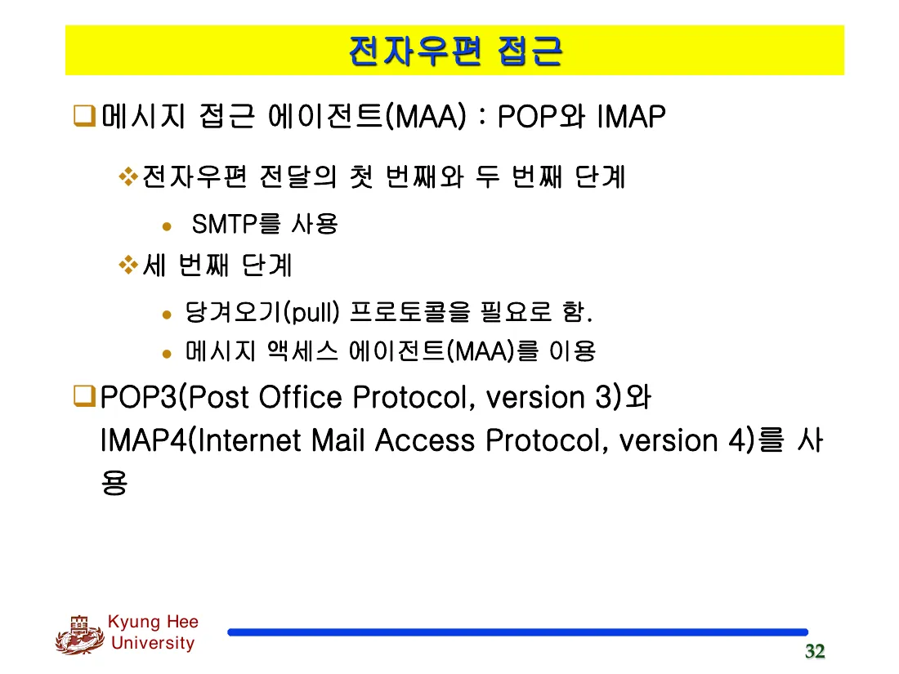

**직역**
> ### 전자우편 접근
> **메시지 접근 에이전트(MAA): POP와 IMAP**
> - 전자우편 전달의 첫 번째와 두 번째 단계
>   - SMTP를 사용
> - 세 번째 단계
>   - 당겨오기(pull) 프로토콜을 필요로 함.
>   - 메시지 액세스 에이전트(MAA)를 이용
> - POP3(Post Office Protocol, version 3)와 IMAP4(Internet Mail Access Protocol, version 4)를 사용

**설명**
- 수신은 SMTP가 아니라 별도 프로토콜로 받아온다: **POP3** 또는 **IMAP**. 현재는 거의 IMAP을 쓴다.

## 슬라이드 33

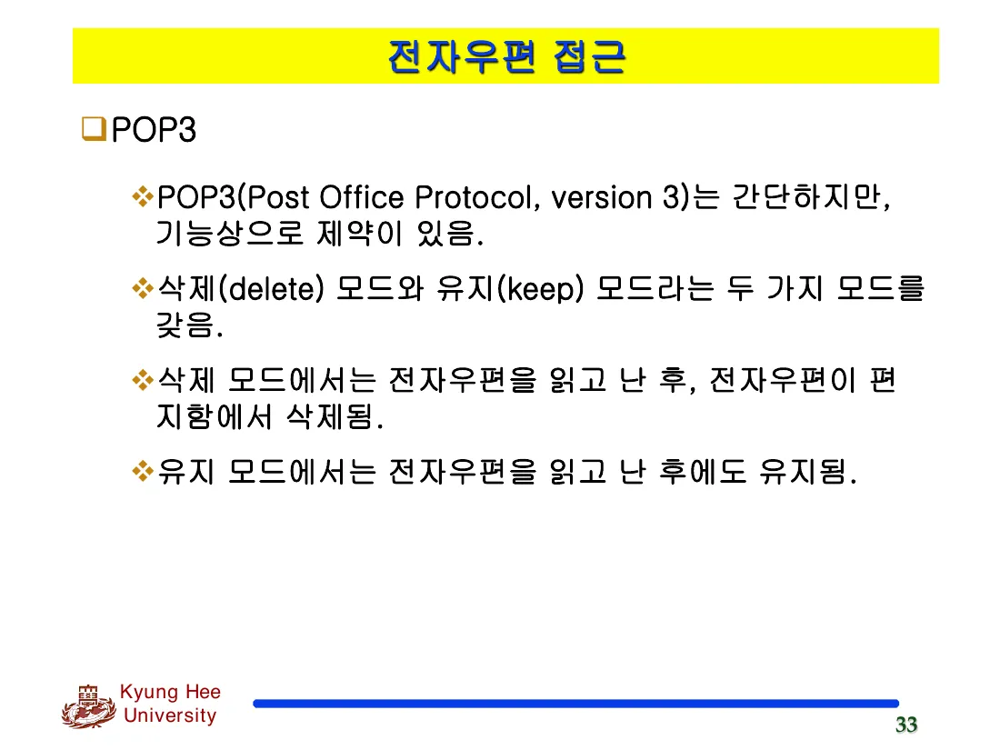

**직역**
> ### 전자우편 접근
> **POP3**
> - POP3(Post Office Protocol, version 3)는 간단하지만, 기능상으로 제약이 있음.
> - 삭제(delete) 모드와 유지(keep) 모드라는 두 가지 모드를 갖음.
> - 삭제 모드에서는 전자우편을 읽고 난 후, 전자우편이 편지함에서 삭제됨.
> - 유지 모드에서는 전자우편을 읽고 난 후에도 유지됨.

## 슬라이드 34

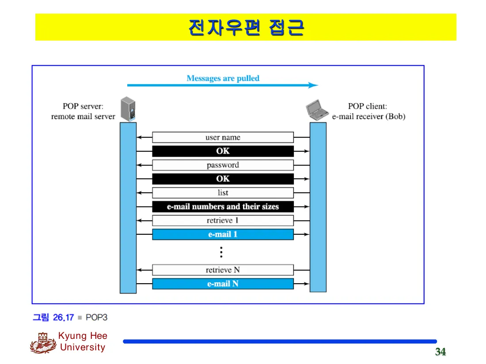

**직역**
> ### 전자우편 접근 (그림 26.17 ■ POP3)
> - **POP server: remote mail server(원격 메일 서버)** ↔ **POP client: e-mail receiver (Bob)**
> - Messages are pulled (메시지를 당겨옴)
> - 흐름: `user name` → `OK` → `password` → `OK` → `list` → `e-mail numbers and their sizes` → `retrieve 1` → `e-mail 1` → ... → `retrieve N` → `e-mail N`

**설명**
- POP3 흐름: USER → OK → PASS → LIST(자동, 메일 번호·크기·제목 목록) → 인덱스 순으로 가져옴. 인덱스 번호로 관리한다.

## 슬라이드 35

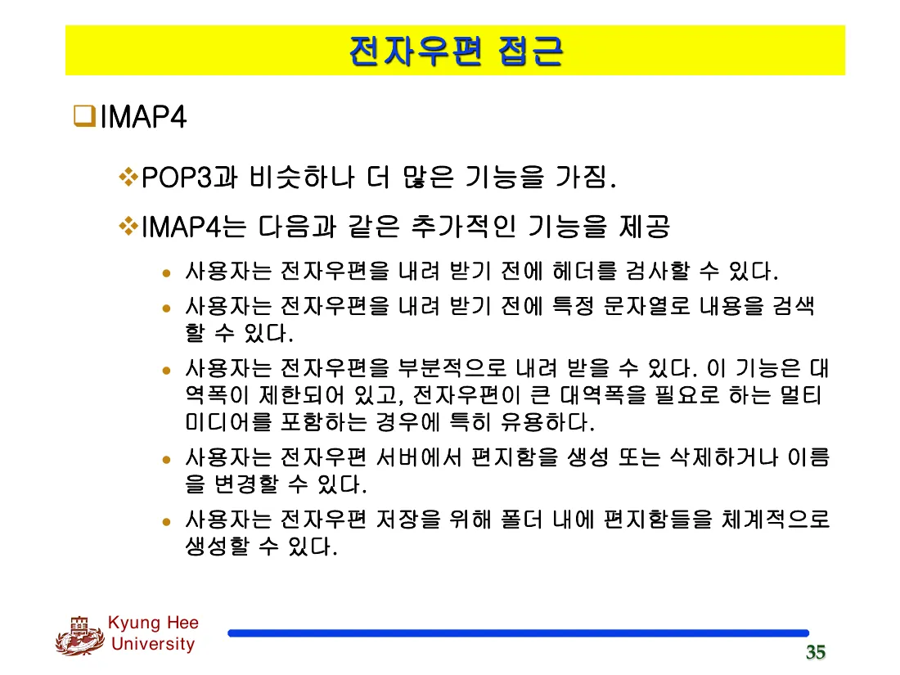

**직역**
> ### 전자우편 접근
> **IMAP4**
> - POP3과 비슷하나 더 많은 기능을 가짐.
> - IMAP4는 다음과 같은 추가적인 기능을 제공
>   - 사용자는 전자우편을 내려 받기 전에 헤더를 검사할 수 있다.
>   - 사용자는 전자우편을 내려 받기 전에 특정 문자열로 내용을 검색할 수 있다.
>   - 사용자는 전자우편을 부분적으로 내려 받을 수 있다. 이 기능은 대역폭이 제한되어 있고, 전자우편이 큰 대역폭을 필요로 하는 멀티미디어를 포함하는 경우에 특히 유용하다.
>   - 사용자는 전자우편 서버에서 편지함을 생성 또는 삭제하거나 이름을 변경할 수 있다.
>   - 사용자는 전자우편 저장을 위해 폴더 내에 편지함들을 체계적으로 생성할 수 있다.

**설명**
- IMAP은 메일 전체를 내려받기 전에 헤더 선검사·내용 검색이 가능해, 감염 의심 스크립트/코드를 미리 거를 수 있어 **보안성이 우수**하다.

## 슬라이드 36

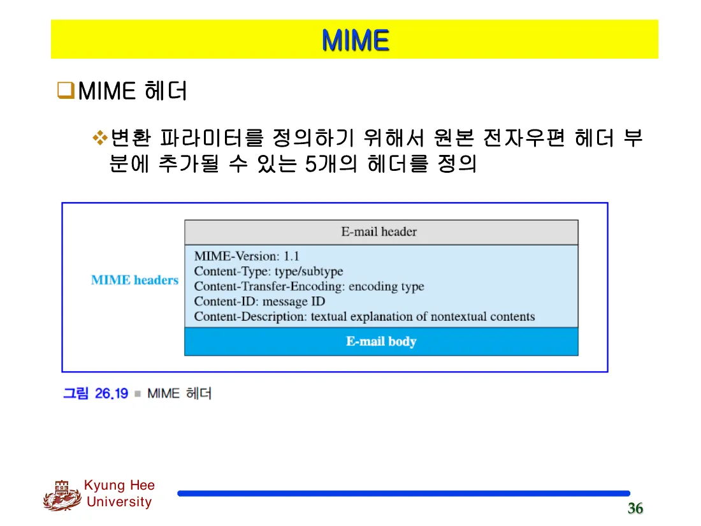

**직역**
> ### MIME
> **MIME 헤더**
> - 변환 파라미터를 정의하기 위해서 원본 전자우편 헤더 부분에 추가될 수 있는 5개의 헤더를 정의
>
> (그림 26.19 ■ MIME 헤더)
> - **E-mail header** → **MIME headers**:
>   - MIME-Version: 1.1
>   - Content-Type: type/subtype
>   - Content-Transfer-Encoding: encoding type
>   - Content-ID: message ID
>   - Content-Description: textual explanation of nontextual contents
> - **E-mail body**

**설명**
- MIME: 메시지가 여러 정보(텍스트, 이미지, 오디오 등)를 포함하므로, 헤더로 인코딩 방식·메시지 ID·boundary(경계)를 정의한다.

## 슬라이드 37

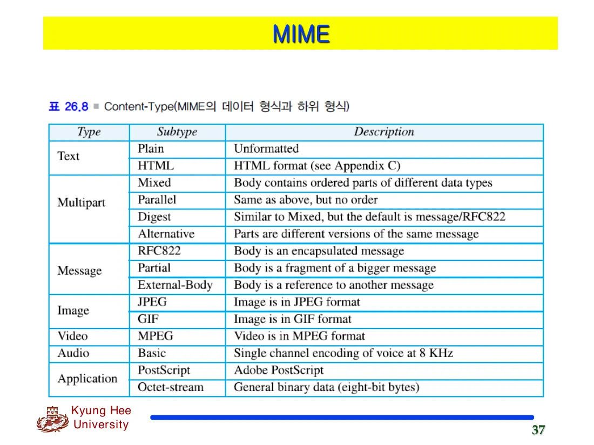

**직역**
> ### MIME (표 26.8 ■ Content-Type(MIME의 데이터 형식과 하위 형식))
>
> | Type | Subtype | Description |
> |---|---|---|
> | Text | Plain | Unformatted |
> | | HTML | HTML format (see Appendix C) |
> | Multipart | Mixed | Body contains ordered parts of different data types |
> | | Parallel | Same as above, but no order |
> | | Digest | Similar to Mixed, but the default is message/RFC822 |
> | | Alternative | Parts are different versions of the same message |
> | Message | RFC822 | Body is an encapsulated message |
> | | Partial | Body is a fragment of a bigger message |
> | | External-Body | Body is a reference to another message |
> | Image | JPEG | Image is in JPEG format |
> | | GIF | Image is in GIF format |
> | Video | MPEG | Video is in MPEG format |
> | Audio | Basic | Single channel encoding of voice at 8 KHz |
> | Application | PostScript | Adobe PostScript |
> | | Octet-stream | General binary data (eight-bit bytes) |

**설명**
- 전자우편을 무엇으로 보낼지는 Content-Type 헤더로 결정한다: **text(plain/html), multipart, image** 등 중에서 선택. 한 메일에 여러 데이터 타입이 섞이면 multipart의 **mixed**를 쓴다.
- 데이터는 인코딩되어 텍스트(스트링) 형태로 전송되므로, 어디까지가 글자이고 어디부터 미디어인지 구분이 필요하다 → 각 파트 앞에 Content-Type과 구분자(boundary)를 넣는다.

## 슬라이드 38

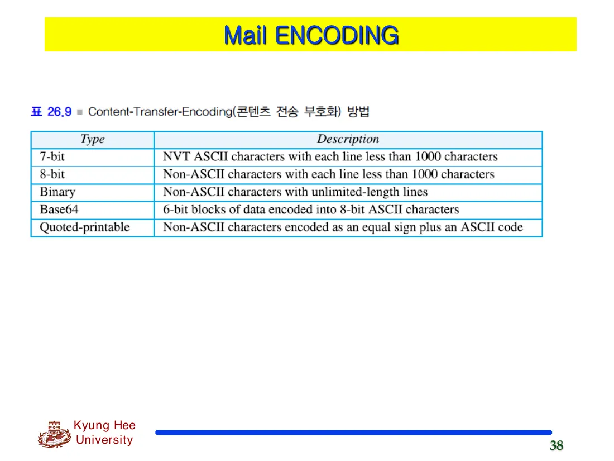

**직역**
> ### Mail ENCODING (표 26.9 ■ Content-Transfer-Encoding(콘텐츠 전송 부호화) 방법)
>
> | Type | Description |
> |---|---|
> | 7-bit | NVT ASCII characters with each line less than 1000 characters |
> | 8-bit | Non-ASCII characters with each line less than 1000 characters |
> | Binary | Non-ASCII characters with unlimited-length lines |
> | Base64 | 6-bit blocks of data encoded into 8-bit ASCII characters |
> | Quoted-printable | Non-ASCII characters encoded as an equal sign plus an ASCII code |

## 슬라이드 39

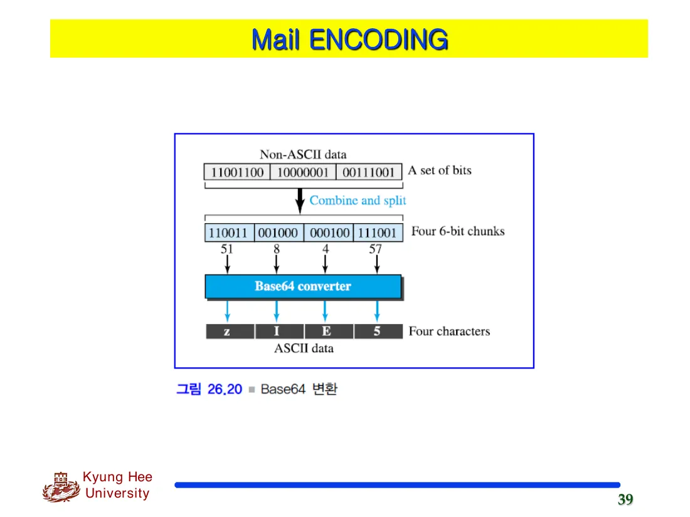

**직역**
> ### Mail ENCODING (그림 26.20 ■ Base64 변환)
> - **Non-ASCII data**: `11001100 10000001 00111001` — A set of bits
> - ↓ Combine and split (결합 후 분할)
> - **Four 6-bit chunks**: `110011 | 001000 | 000100 | 111001` → 값 51, 8, 4, 57
> - ↓ **Base64 converter**
> - **Four characters (ASCII data)**: `z I E 5`

**설명**
- Base64는 3바이트(24비트)를 6비트씩 4개로 쪼개 코드 테이블 값으로 변환한다. 그 결과 실제 전송 데이터가 원본보다 커진다.

## 슬라이드 40

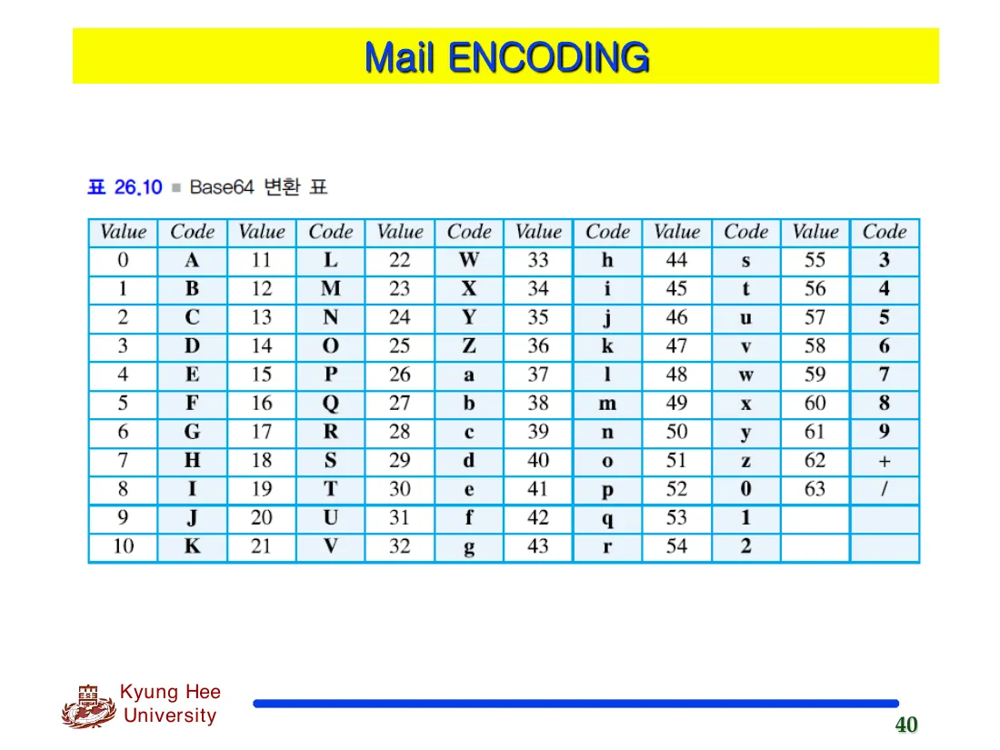

**직역**
> ### Mail ENCODING (표 26.10 ■ Base64 변환 표)
> Value/Code 대응표:
> 0=A 1=B 2=C 3=D 4=E 5=F 6=G 7=H 8=I 9=J 10=K
> 11=L 12=M 13=N 14=O 15=P 16=Q 17=R 18=S 19=T 20=U 21=V
> 22=W 23=X 24=Y 25=Z 26=a 27=b 28=c 29=d 30=e 31=f 32=g
> 33=h 34=i 35=j 36=k 37=l 38=m 39=n 40=o 41=p 42=q 43=r
> 44=s 45=t 46=u 47=v 48=w 49=x 50=y 51=z 52=0 53=1 54=2
> 55=3 56=4 57=5 58=6 59=7 60=8 61=9 62=+ 63=/

## 슬라이드 41

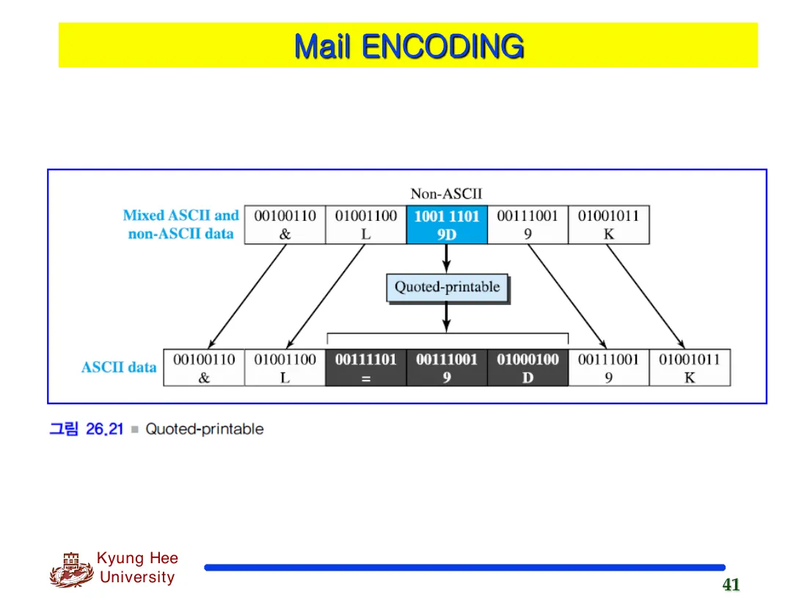

**직역**
> ### Mail ENCODING (그림 26.21 ■ Quoted-printable)
> - **Non-ASCII** / Mixed ASCII and non-ASCII data: `00100110 (&) | 01001100 (L) | 1001 1101 (9D) | 00111001 (9) | 01001011 (K)`
> - 비-ASCII 바이트(9D)만 ↓ **Quoted-printable** 변환
> - **ASCII data**: `00100110 (&) | 01001100 (L) | 00111101 (=) 00111001 (9) 01000100 (D) | 00111001 (9) | 01001011 (K)`
> - 즉, 1바이트(9D)가 `=9D` 세 글자로 변환됨.

## 슬라이드 42

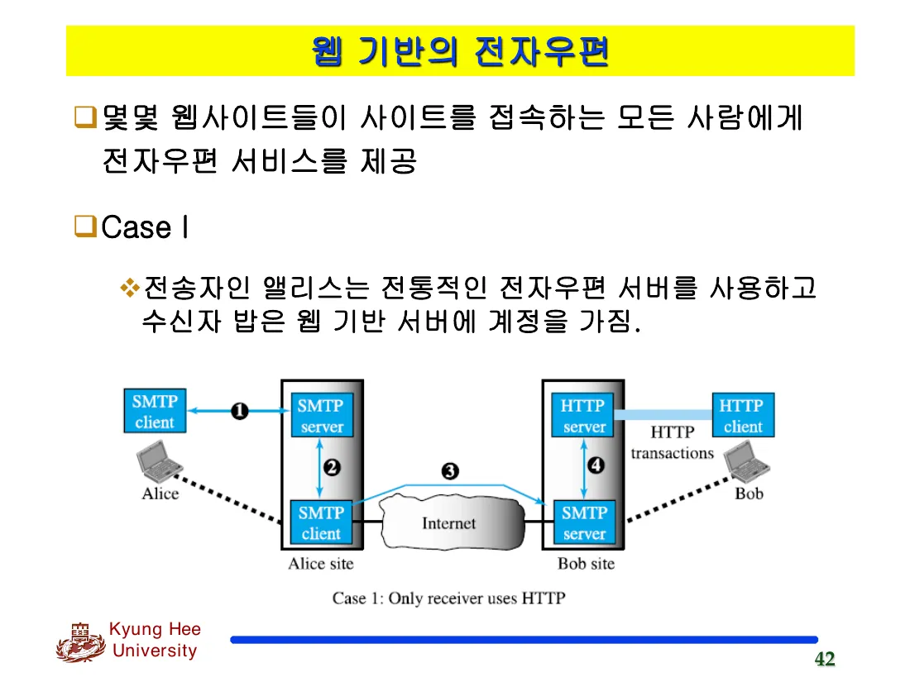

**직역**
> ### 웹 기반의 전자우편
> - 몇몇 웹사이트들이 사이트를 접속하는 모든 사람에게 전자우편 서비스를 제공
>
> **Case I**
> - 전송자인 앨리스는 전통적인 전자우편 서버를 사용하고 수신자 밥은 웹 기반 서버에 계정을 가짐.
>
> (그림) Case 1: Only receiver uses HTTP (수신자만 HTTP 사용)
> - Alice → (1) SMTP client → SMTP server(Alice site) → (2) → SMTP client → (3) Internet → SMTP server(Bob site) → (4) → HTTP server → HTTP transactions → HTTP client → Bob

**설명**
- 웹 기반 메일에서 **웹(HTTP)으로 처리되는 것은 사용자 인증·접근 부분**이고, 실제 서버는 전자우편 서버 그대로다. 즉 IMAP 같은 메일 기능을 웹에서 구현해 HTTP로 전자우편을 다루는 방식이다.
- Case I에서는 수신자(밥)만 HTTP를 쓰므로, 메일이 밥 사이트에 도착할 때까지는 SMTP로 전달되고(서버 간 전자우편 전송), 밥이 자기 메일을 읽는 마지막 구간만 HTTP 트랜잭션으로 처리된다.

## 슬라이드 43

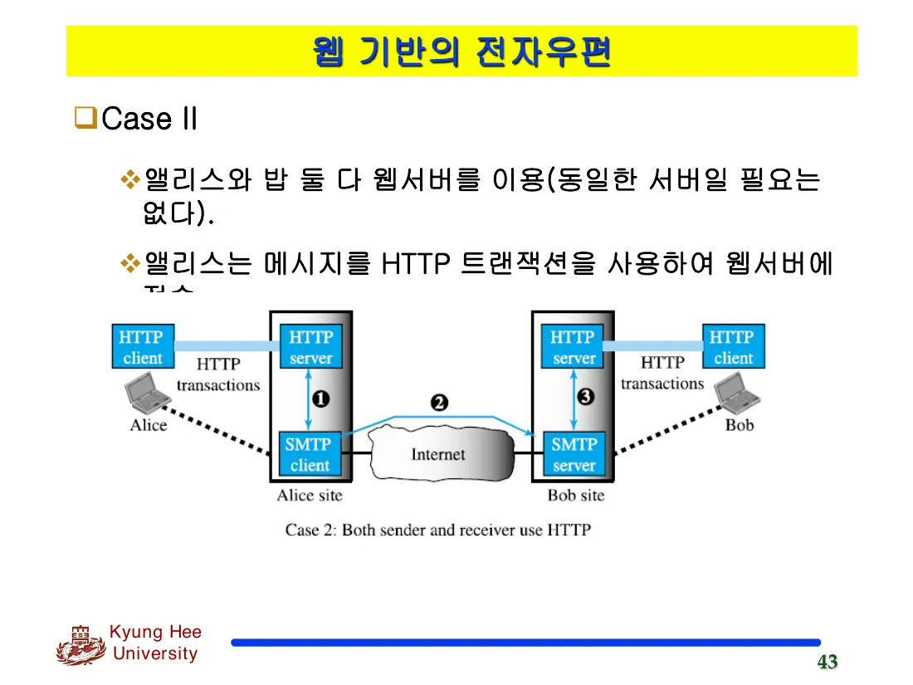

**직역**
> ### 웹 기반의 전자우편
> **Case II**
> - 앨리스와 밥 둘 다 웹서버를 이용(동일한 서버일 필요는 없다).
> - 앨리스는 메시지를 HTTP 트랜잭션을 사용하여 웹서버에 전송
>
> (그림) Case 2: Both sender and receiver use HTTP (송수신자 모두 HTTP 사용)
> - Alice → HTTP transactions → HTTP client → HTTP server(Alice site) → (1) → SMTP client → (2) Internet → SMTP server(Bob site) → (3) → HTTP server → HTTP transactions → HTTP client → Bob

**설명**
- Case II는 송수신자 모두 웹메일을 쓰는 경우다. 양 끝(사용자↔자기 사이트)은 HTTP 트랜잭션이지만, **두 메일 서버 사이의 실제 전달은 여전히 SMTP**로 이뤄진다. 웹은 인증·작성·읽기 인터페이스만 담당하고 서버 간 전송 본체는 전자우편 프로토콜이라는 점이 핵심이다.

## 슬라이드 44

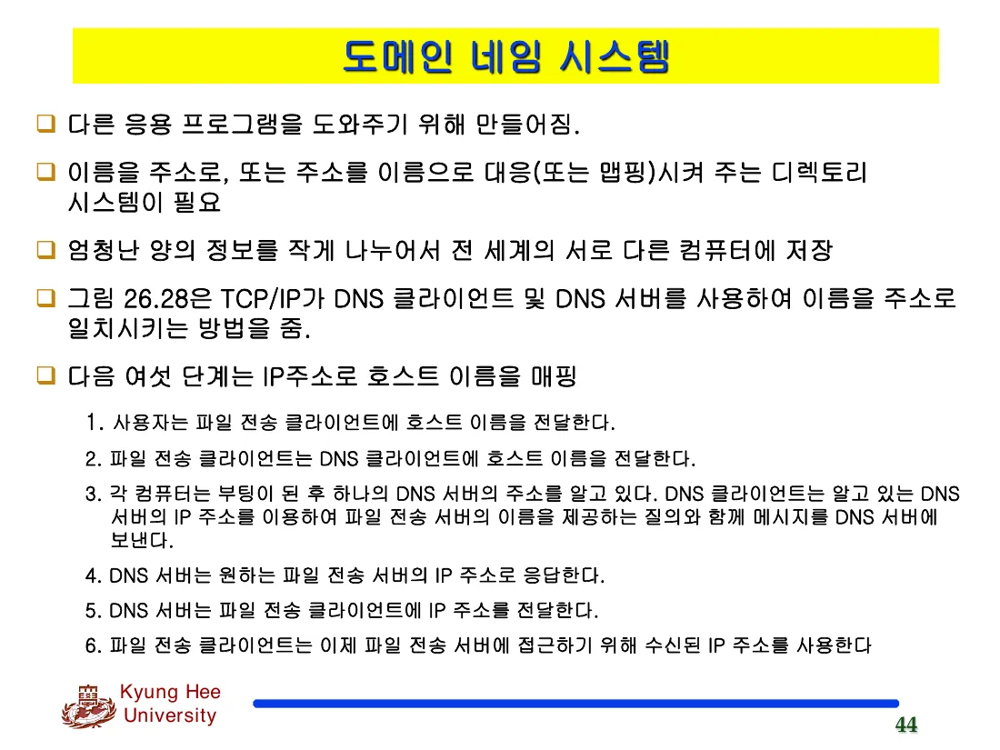

**직역**
> ### 도메인 네임 시스템
> - 다른 응용 프로그램을 도와주기 위해 만들어짐.
> - 이름을 주소로, 또는 주소를 이름으로 대응(또는 맵핑)시켜 주는 디렉토리 시스템이 필요
> - 엄청난 양의 정보를 작게 나누어서 전 세계의 서로 다른 컴퓨터에 저장
> - 그림 26.28은 TCP/IP가 DNS 클라이언트 및 DNS 서버를 사용하여 이름을 주소로 일치시키는 방법을 줌.
> - 다음 여섯 단계는 IP주소로 호스트 이름을 매핑
>   1. 사용자는 파일 전송 클라이언트에 호스트 이름을 전달한다.
>   2. 파일 전송 클라이언트는 DNS 클라이언트에 호스트 이름을 전달한다.
>   3. 각 컴퓨터는 부팅이 된 후 하나의 DNS 서버의 주소를 알고 있다. DNS 클라이언트는 알고 있는 DNS 서버의 IP 주소를 이용하여 파일 전송 서버의 이름을 제공하는 질의와 함께 메시지를 DNS 서버에 보낸다.
>   4. DNS 서버는 원하는 파일 전송 서버의 IP 주소로 응답한다.
>   5. DNS 서버는 파일 전송 클라이언트에 IP 주소를 전달한다.
>   6. 파일 전송 클라이언트는 이제 파일 전송 서버에 접근하기 위해 수신된 IP 주소를 사용한다

**설명**
- 프로그램에서 호스트 이름으로 통신하려면 **DNS 클라이언트 로직**이 필요하다(C의 `gethostbyname` → 이름 넣으면 IP 리턴 → connect). 또한 네트워크 바이트 순서 변환이 필요하다: `htons/htonl`(host→network), `ntohs/ntohl`(network→host).

## 슬라이드 45

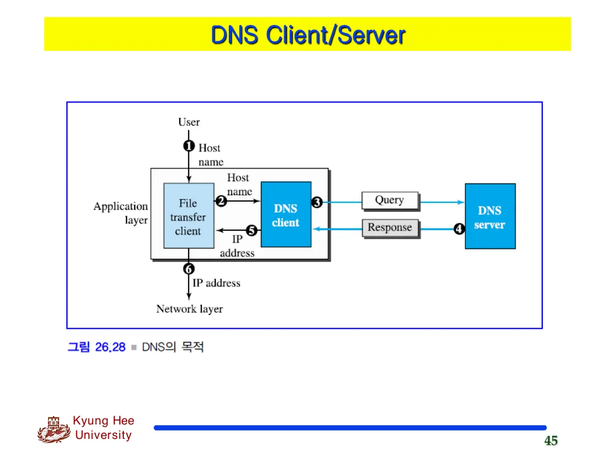

**직역**
> ### DNS Client/Server (그림 26.28 ■ DNS의 목적)
> - **Application layer** 안: File transfer client ↔ DNS client
> - 흐름: User → (1) Host name → File transfer client → (2) Host name → DNS client → (3) Query → DNS server / DNS server → (4) Response → DNS client → (5) IP address → File transfer client → (6) IP address → Network layer

## 슬라이드 46

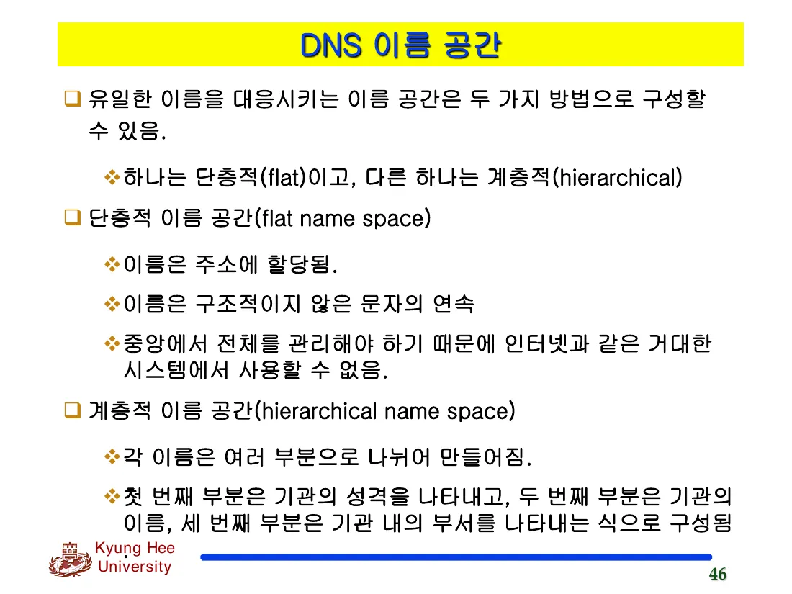

**직역**
> ### DNS 이름 공간
> - 유일한 이름을 대응시키는 이름 공간은 두 가지 방법으로 구성할 수 있음.
>   - 하나는 단층적(flat)이고, 다른 하나는 계층적(hierarchical)
> - **단층적 이름 공간(flat name space)**
>   - 이름은 주소에 할당됨.
>   - 이름은 구조적이지 않은 문자의 연속
>   - 중앙에서 전체를 관리해야 하기 때문에 인터넷과 같은 거대한 시스템에서 사용할 수 없음.
> - **계층적 이름 공간(hierarchical name space)**
>   - 각 이름은 여러 부분으로 나뉘어 만들어짐.
>   - 첫 번째 부분은 기관의 성격을 나타내고, 두 번째 부분은 기관의 이름, 세 번째 부분은 기관 내의 부서를 나타내는 식으로 구성됨.

## 슬라이드 47

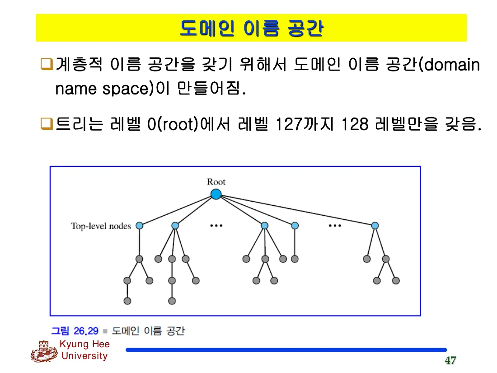

**직역**
> ### 도메인 이름 공간
> - 계층적 이름 공간을 갖기 위해서 도메인 이름 공간(domain name space)이 만들어짐.
> - 트리는 레벨 0(root)에서 레벨 127까지 128 레벨만을 갖음.

## 슬라이드 48

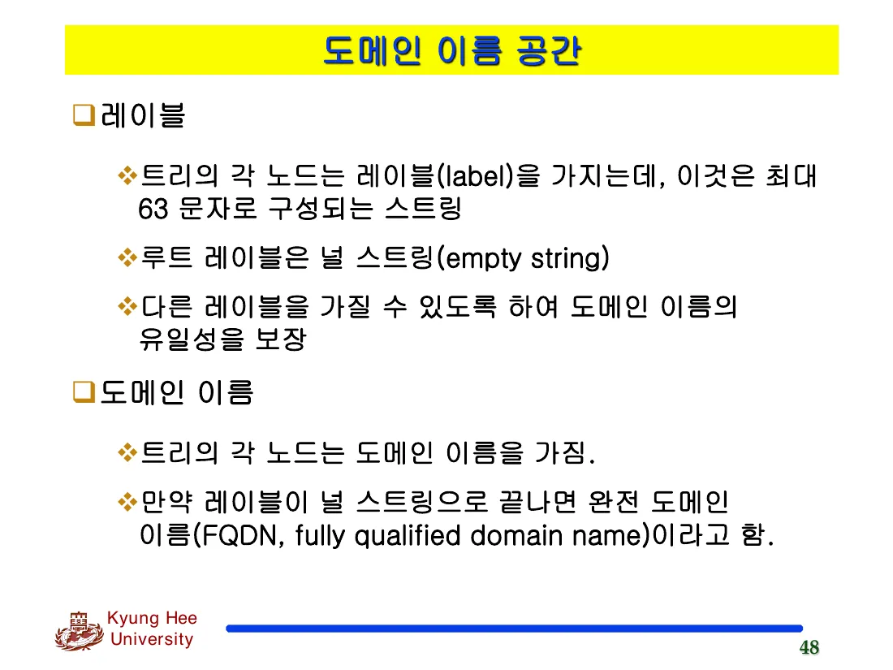

**직역**
> ### 도메인 이름 공간
> **레이블(label)**
> - 트리의 각 노드는 레이블을 가지는데, 이것은 최대 63 문자로 구성되는 스트링
> - 루트 레이블은 널 스트링(empty string)
> - 다른 레이블을 가질 수 있도록 하여 도메인 이름의 유일성을 보장
>
> **도메인 이름(domain name)**
> - 트리의 각 노드는 도메인 이름을 가짐.
> - 만약 레이블이 널 스트링으로 끝나면 완전 도메인 이름(FQDN, fully qualified domain name)이라고 함.

## 슬라이드 49

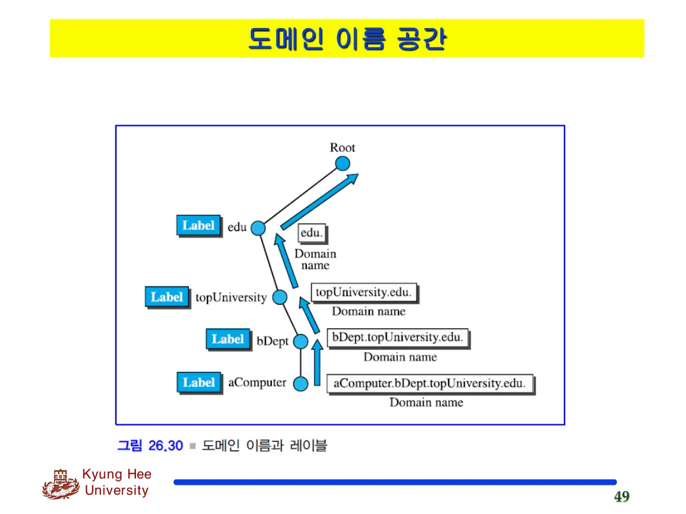

**직역**
> ### 도메인 이름 공간 (그림 26.30 ■ 도메인 이름과 레이블)
> - Root(루트) 아래로 트리가 이어지며 각 노드는 Label을 가짐:
>   - `edu` (Label) → Domain name: `edu.`
>   - `topUniversity` (Label) → Domain name: `topUniversity.edu.`
>   - `bDept` (Label) → Domain name: `bDept.topUniversity.edu.`
>   - `aComputer` (Label) → Domain name: `aComputer.bDept.topUniversity.edu.`

## 슬라이드 50

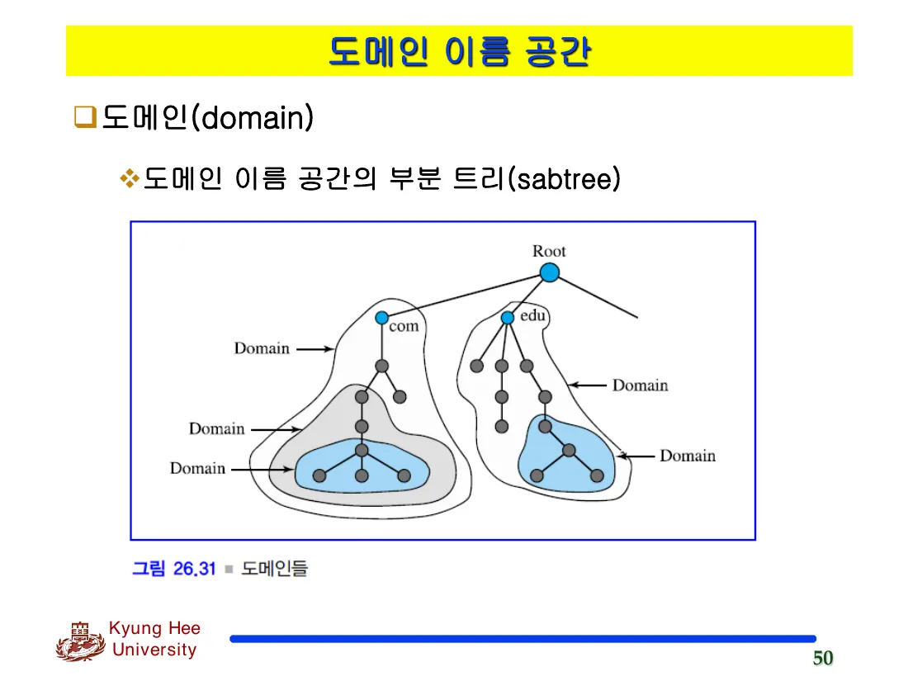

**직역**
> ### 도메인 이름 공간
> **도메인(domain)**
> - 도메인 이름 공간의 부분 트리(subtree)
>
> (그림 26.31 ■ 도메인들)
> - Root 아래 `com`, `edu` 노드가 있고, 각 부분 트리(subtree)가 여러 겹의 **Domain**으로 표시됨(중첩된 영역이 각각 하나의 도메인).

## 슬라이드 51

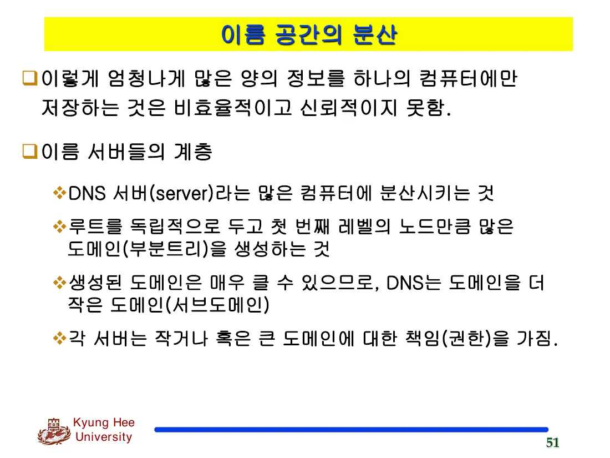

**직역**
> ### 이름 공간의 분산
> - 이렇게 엄청나게 많은 양의 정보를 하나의 컴퓨터에만 저장하는 것은 비효율적이고 신뢰적이지 못함.
> - **이름 서버들의 계층**
>   - DNS 서버(server)라는 많은 컴퓨터에 분산시키는 것
>   - 루트를 독립적으로 두고 첫 번째 레벨의 노드만큼 많은 도메인(부분트리)을 생성하는 것
>   - 생성된 도메인은 매우 클 수 있으므로, DNS는 도메인을 더 작은 도메인(서브도메인)
>   - 각 서버는 작거나 혹은 큰 도메인에 대한 책임(권한)을 가짐.

## 슬라이드 52

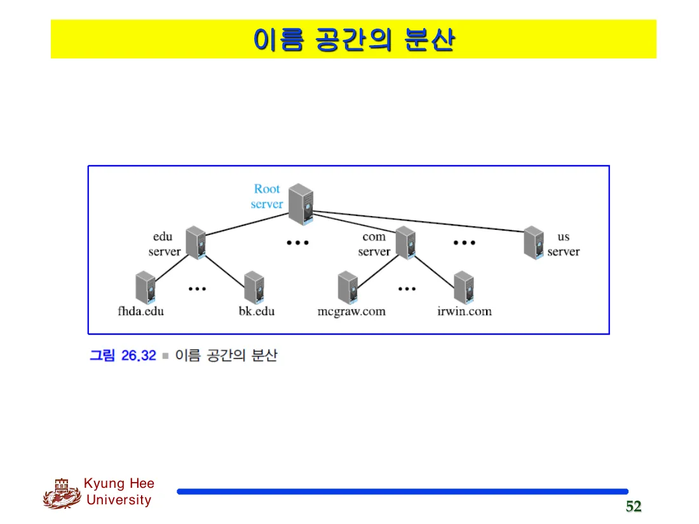

**직역**
> ### 이름 공간의 분산 (그림 26.32 ■ 이름 공간의 분산)
> - **Root server(루트 서버)** 아래에 `edu server`, ..., `com server`, ..., `us server`
> - `edu server` 아래: `fhda.edu`, ..., `bk.edu`
> - `com server` 아래: `mcgraw.com`, ..., `irwin.com`

**설명**
- 부담 분산: 기관이 크면 도메인을 쪼개 운영할 수 있다. 장애 대비로 **Secondary(보조) DNS**를 보통 2개 둔다.

## 슬라이드 53

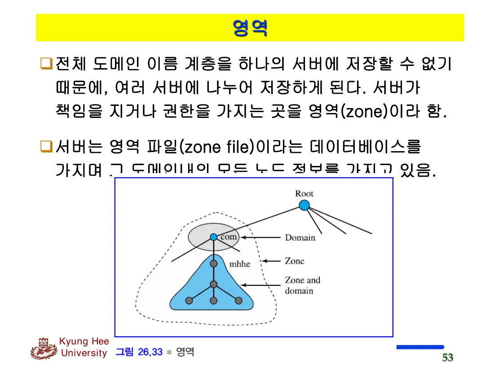

**직역**
> ### 영역
> - 전체 도메인 이름 계층을 하나의 서버에 저장할 수 없기 때문에, 여러 서버에 나누어 저장하게 된다. 서버가 책임을 지거나 권한을 가지는 곳을 영역(zone)이라 함.
> - 서버는 영역 파일(zone file)이라는 데이터베이스를 가지며 그 도메인내의 모든 노드 정보를 가지고 있음.

## 슬라이드 54

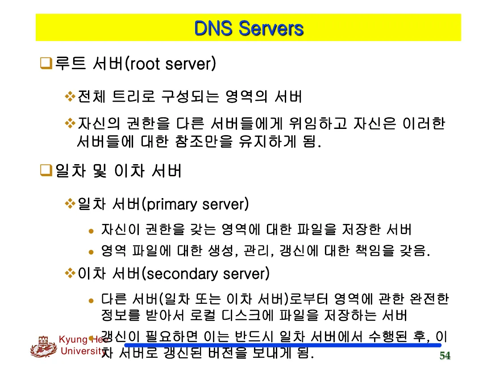

**직역**
> ### DNS Servers
> **루트 서버(root server)**
> - 전체 트리로 구성되는 영역의 서버
> - 자신의 권한을 다른 서버들에게 위임하고 자신은 이러한 서버들에 대한 참조만을 유지하게 됨.
>
> **일차 및 이차 서버**
> - 일차 서버(primary server)
>   - 자신이 권한을 갖는 영역에 대한 파일을 저장한 서버
>   - 영역 파일에 대한 생성, 관리, 갱신에 대한 책임을 갖음.
> - 이차 서버(secondary server)
>   - 다른 서버(일차 또는 이차 서버)로부터 영역에 관한 완전한 정보를 받아서 로컬 디스크에 파일을 저장하는 서버
>   - 갱신이 필요하면 이는 반드시 일차 서버에서 수행된 후, 이차 서버로 갱신된 버전을 보내게 됨.

## 슬라이드 55

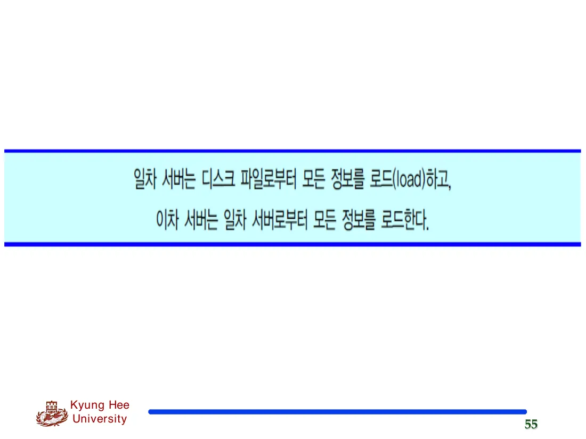

**직역**
> (강조 박스) 일차 서버는 디스크 파일로부터 모든 정보를 로드(load)하고, 이차 서버는 일차 서버로부터 모든 정보를 로드한다.

## 슬라이드 56

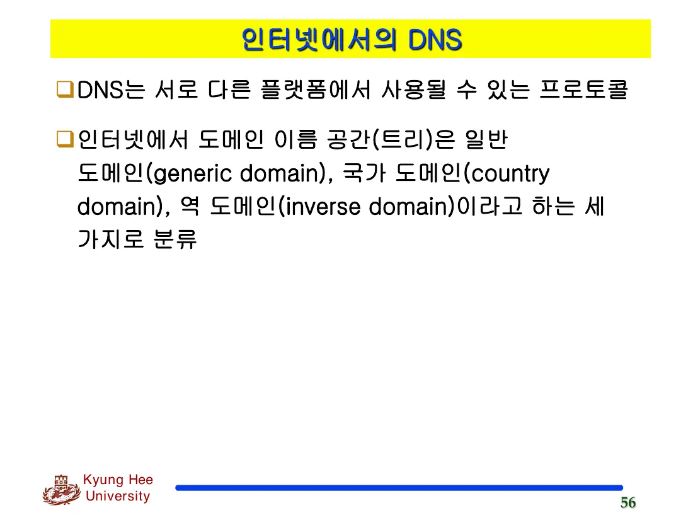

**직역**
> ### 인터넷에서의 DNS
> - DNS는 서로 다른 플랫폼에서 사용될 수 있는 프로토콜
> - 인터넷에서 도메인 이름 공간(트리)은 일반 도메인(generic domain), 국가 도메인(country domain), 역 도메인(inverse domain)이라고 하는 세 가지로 분류

## 슬라이드 57

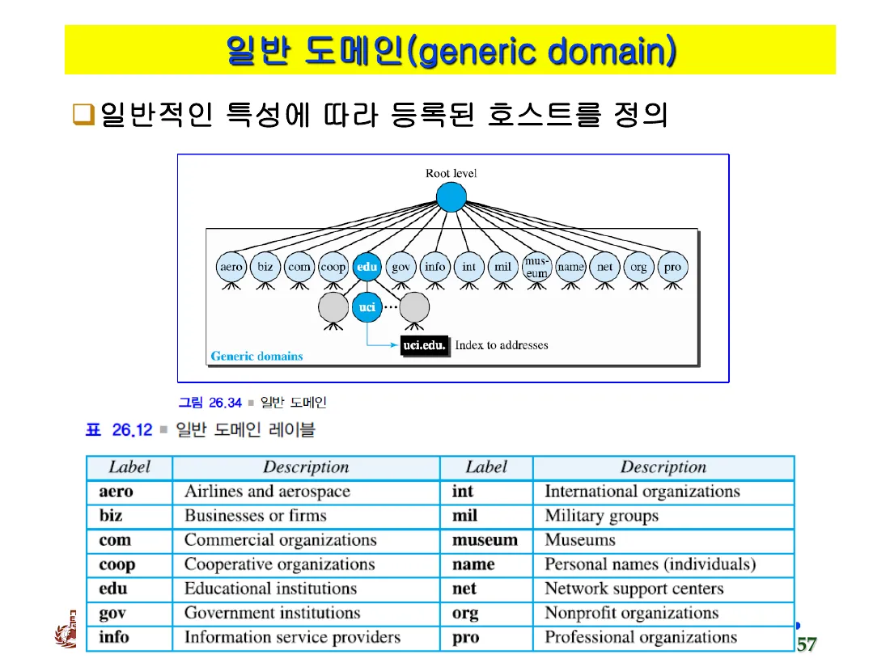

**직역**
> ### 일반 도메인(generic domain)
> - 일반적인 특성에 따라 등록된 호스트를 정의
> - (그림 26.34 ■ 일반 도메인) Root level 아래에 aero, biz, com, coop, edu, gov, info, int, mil, museum, name, net, org, pro 등의 노드. 예: `uci.edu.` (Index to addresses)
>
> (표 26.12 ■ 일반 도메인 레이블)
>
> | Label | Description | Label | Description |
> |---|---|---|---|
> | aero | Airlines and aerospace | int | International organizations |
> | biz | Businesses or firms | mil | Military groups |
> | com | Commercial organizations | museum | Museums |
> | coop | Cooperative organizations | name | Personal names (individuals) |
> | edu | Educational institutions | net | Network support centers |
> | gov | Government institutions | org | Nonprofit organizations |
> | info | Information service providers | pro | Professional organizations |

## 슬라이드 58

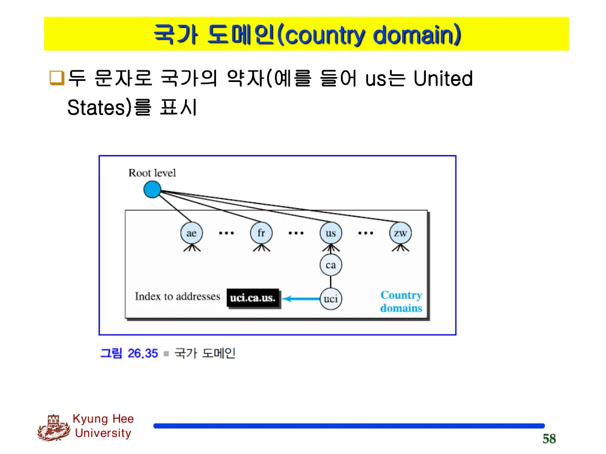

**직역**
> ### 국가 도메인(country domain)
> - 두 문자로 국가의 약자(예를 들어 us는 United States)를 표시
> - (그림 26.35 ■ 국가 도메인) Root level 아래에 `ae`, ..., `fr`, ..., `us`, ..., `zw` 노드. `us` → `ca` → `uci` 식으로 내려가며 `uci.ca.us.` (Index to addresses).

## 슬라이드 59

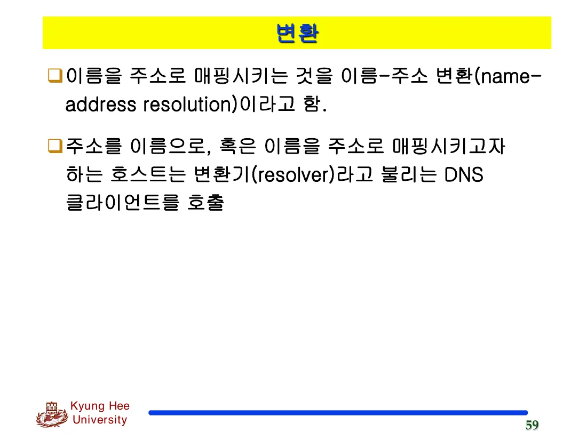

**직역**
> ### 변환
> - 이름을 주소로 매핑시키는 것을 이름-주소 변환(name-address resolution)이라고 함.
> - 주소를 이름으로, 혹은 이름을 주소로 매핑시키고자 하는 호스트는 변환기(resolver)라고 불리는 DNS 클라이언트를 호출

## 슬라이드 60

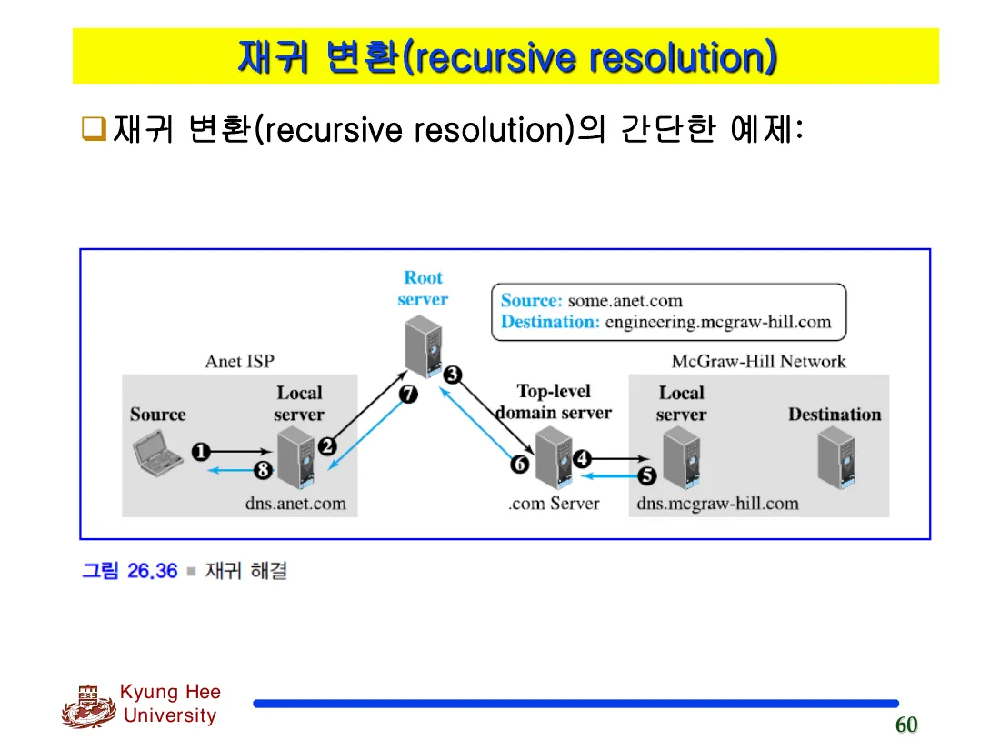

**직역**
> ### 재귀 변환(recursive resolution)
> 재귀 변환의 간단한 예제: (그림 26.36 ■ 재귀 해결)
> - Source: some.anet.com / Destination: engineering.mcgraw-hill.com
> - 흐름: Source → (1) → Local server(dns.anet.com) → (2) → Root server → (3) → Top-level domain server(.com Server) → (4) → Local server(dns.mcgraw-hill.com) → (5) → (6) → (7) → Local server(dns.anet.com) → (8) → Source
> - 즉, 요청을 받은 로컬 서버가 위로 올라가 답을 받아와 클라이언트에게 최종 응답을 돌려줌.

**설명**
- **Recursive(재귀적) 변환**: 로컬 서버에 없으면 위로 올라가 해당 도메인 서버까지 가서 IP를 받아온다.

## 슬라이드 61

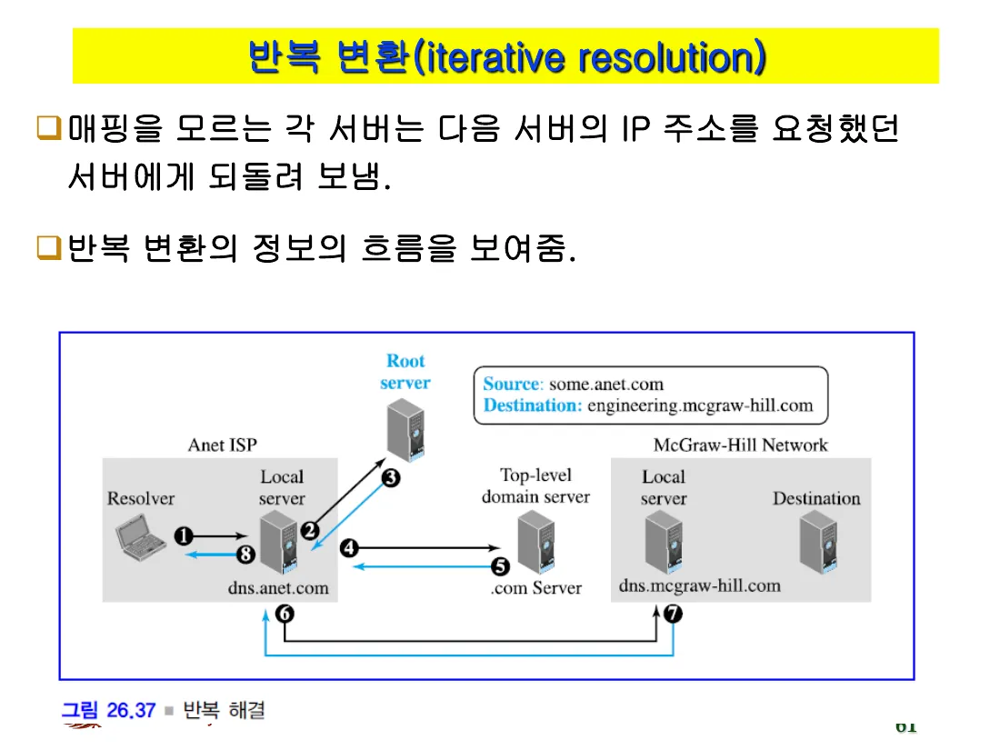

**직역**
> ### 반복 변환(iterative resolution)
> - 매핑을 모르는 각 서버는 다음 서버의 IP 주소를 요청했던 서버에게 되돌려 보냄.
> - 반복 변환의 정보의 흐름을 보여줌. (그림 26.37 ■ 반복 해결)
> - Source: some.anet.com / Destination: engineering.mcgraw-hill.com
> - 흐름: Resolver → (1) → Local server(dns.anet.com) → (2) Root server → (3) → (4) .com Server → (5) → (6) → dns.mcgraw-hill.com → (7) → (8) → Resolver
> - 각 단계에서 로컬 서버가 직접 다음 서버에게 차례로 질의를 반복함.

## 슬라이드 62

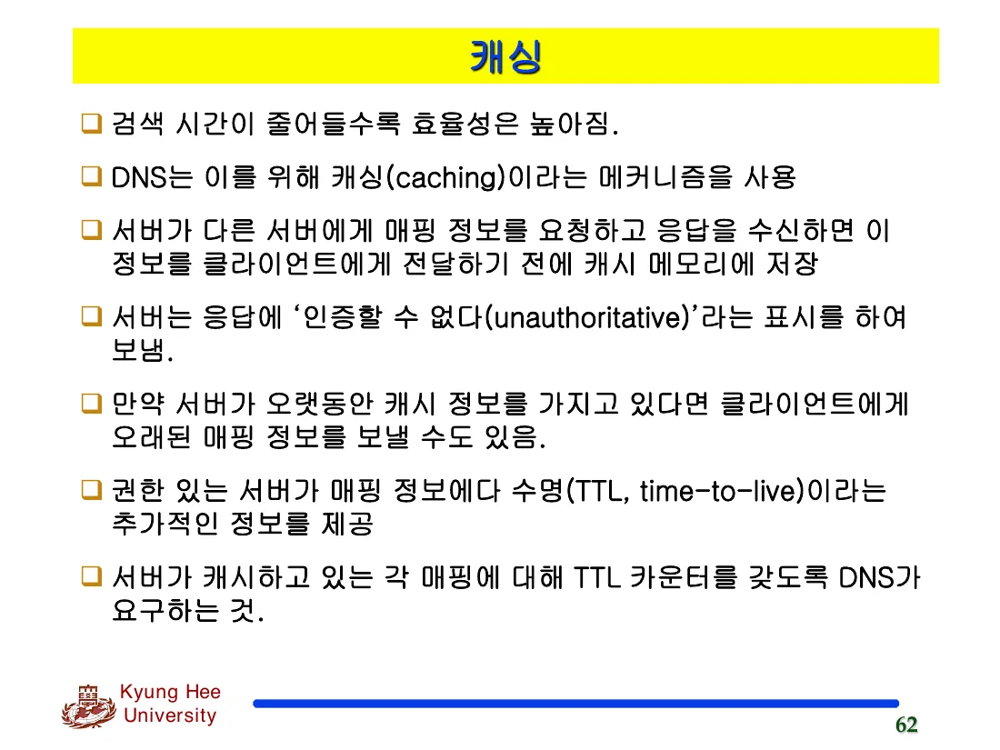

**직역**
> ### 캐싱
> - 검색 시간이 줄어들수록 효율성은 높아짐.
> - DNS는 이를 위해 캐싱(caching)이라는 메커니즘을 사용
> - 서버가 다른 서버에게 매핑 정보를 요청하고 응답을 수신하면 이 정보를 클라이언트에게 전달하기 전에 캐시 메모리에 저장
> - 서버는 응답에 '인증할 수 없다(unauthoritative)'라는 표시를 하여 보냄.
> - 만약 서버가 오랫동안 캐시 정보를 가지고 있다면 클라이언트에게 오래된 매핑 정보를 보낼 수도 있음.
> - 권한 있는 서버가 매핑 정보에다 수명(TTL, time-to-live)이라는 추가적인 정보를 제공
> - 서버가 캐시하고 있는 각 매핑에 대해 TTL 카운터를 갖도록 DNS가 요구하는 것.

## 슬라이드 63

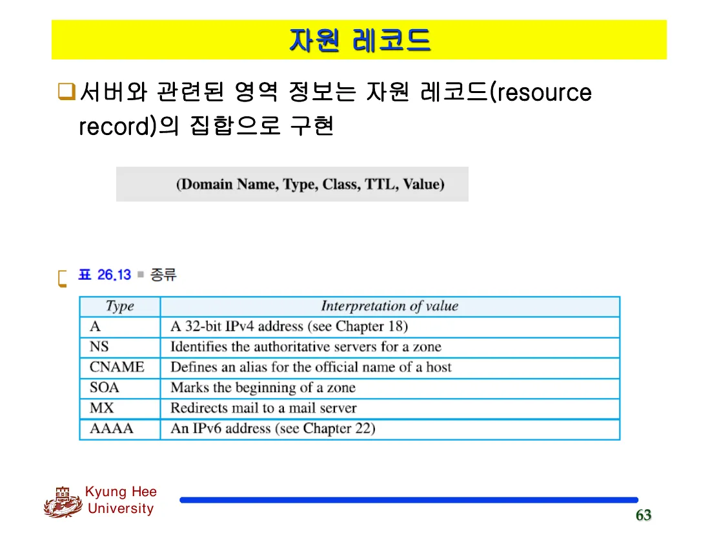

**직역**
> ### 자원 레코드
> - 서버와 관련된 영역 정보는 자원 레코드(resource record)의 집합으로 구현
> - 레코드 형식: **(Domain Name, Type, Class, TTL, Value)**
> - 일반적인 유형과 각 유형에서 값을 해석하는 방법 (표 26.13 ■ 종류)
>
> | Type | Interpretation of value |
> |---|---|
> | A | A 32-bit IPv4 address (see Chapter 18) |
> | NS | Identifies the authoritative servers for a zone |
> | CNAME | Defines an alias for the official name of a host |
> | SOA | Marks the beginning of a zone |
> | MX | Redirects mail to a mail server |
> | AAAA | An IPv6 address (see Chapter 22) |

**설명**
- 영역 정보는 **자원 레코드(Resource Record, RR)**의 집합으로 구현되며, 각 레코드는 (Domain Name, Type, Class, TTL, Value) 형식이다. Type에 따라 Value 해석이 달라진다: **A**(IPv4 주소), **MX**(메일 서버로 메일을 라우팅), **CNAME**(별칭), **NS**(권한 서버), **AAAA**(IPv6) 등.
- 메일 서버는 **MX 레코드**로 등록한다(앞에 mx, IP·이름 기록). 한 도메인에 MX를 여러 개 둘 수 있고, A/CNAME으로 한 도메인에 여러 IP를 등록해 로드 밸런싱에 활용할 수도 있다.

## 슬라이드 64

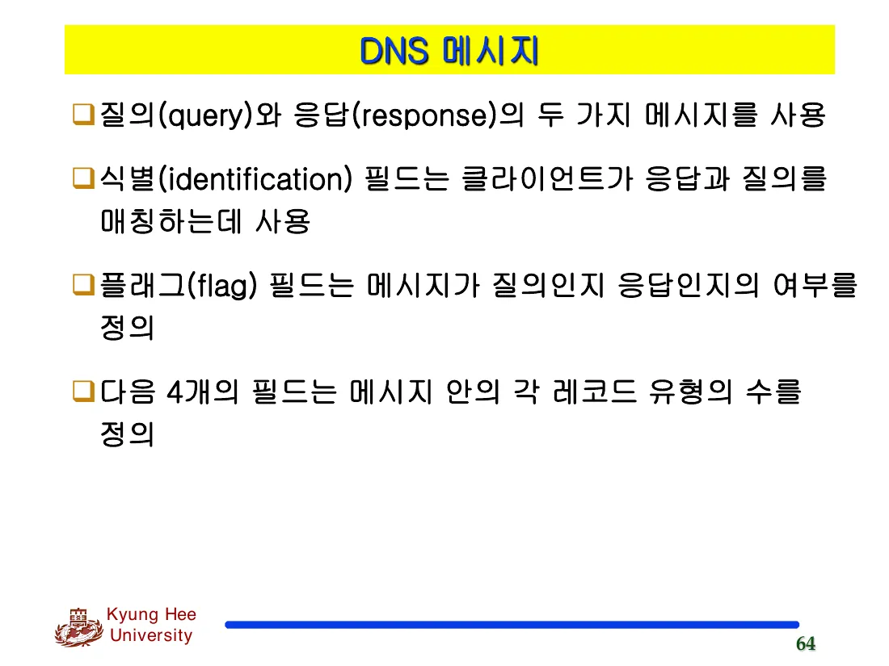

**직역**
> ### DNS 메시지
> - 질의(query)와 응답(response)의 두 가지 메시지를 사용
> - 식별(identification) 필드는 클라이언트가 응답과 질의를 매칭하는데 사용
> - 플래그(flag) 필드는 메시지가 질의인지 응답인지의 여부를 정의
> - 다음 4개의 필드는 메시지 안의 각 레코드 유형의 수를 정의

## 슬라이드 65

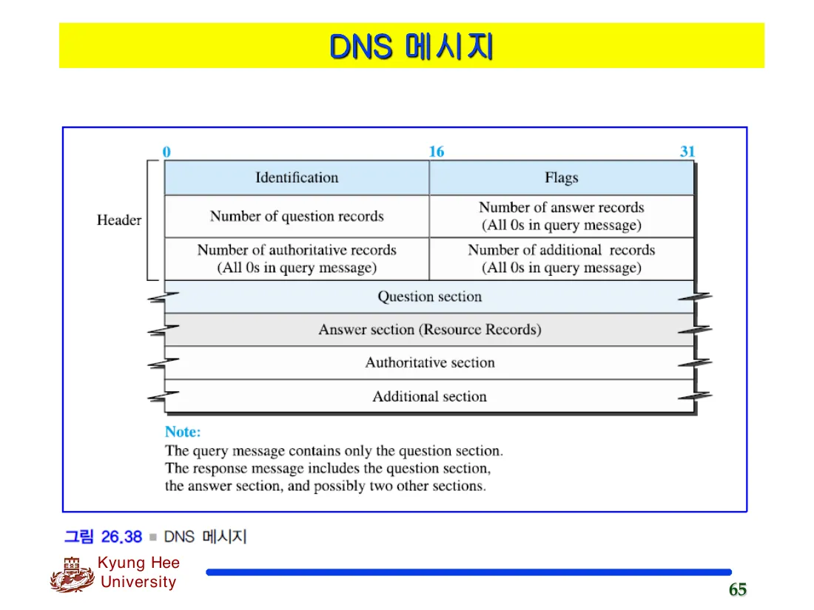

**직역**
> ### DNS 메시지 (그림 26.38 ■ DNS 메시지)
> - **Header(헤더)** (비트 0~16~31):
>   - Identification | Flags
>   - Number of question records | Number of answer records (All 0s in query message)
>   - Number of authoritative records (All 0s in query message) | Number of additional records (All 0s in query message)
> - **Question section** (질의 섹션)
> - **Answer section (Resource Records)** (응답 섹션, 자원 레코드)
> - **Authoritative section** (권한 섹션)
> - **Additional section** (추가 섹션)
> - **Note:** The query message contains only the question section. The response message includes the question section, the answer section, and possibly two other sections.

## 슬라이드 66

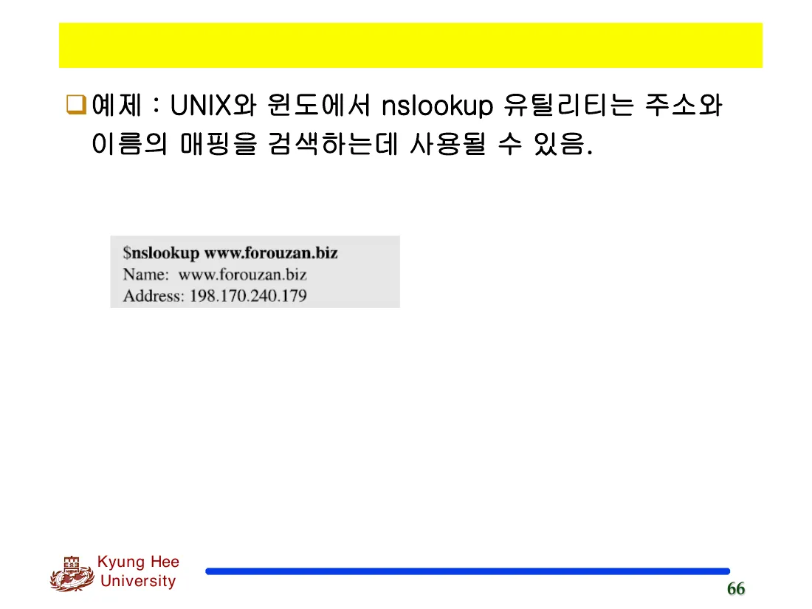

**직역**
> 예제: UNIX와 윈도에서 nslookup 유틸리티는 주소와 이름의 매핑을 검색하는데 사용될 수 있음.
>
> ```
> $nslookup www.forouzan.biz
> Name:  www.forouzan.biz
> Address: 198.170.240.179
> ```

**설명**
- 로드 밸런싱: 한 도메인(예: www)에 실제 IP가 여러 개 등록되어 있고, 요청이 올 때마다 다른 IP를 주는 **라운드 로빈** 방식으로 한 곳에 몰리지 않게 한다. nslookup으로 조회하면 서버가 여러 개 나오는 경우가 있다.

## 슬라이드 67

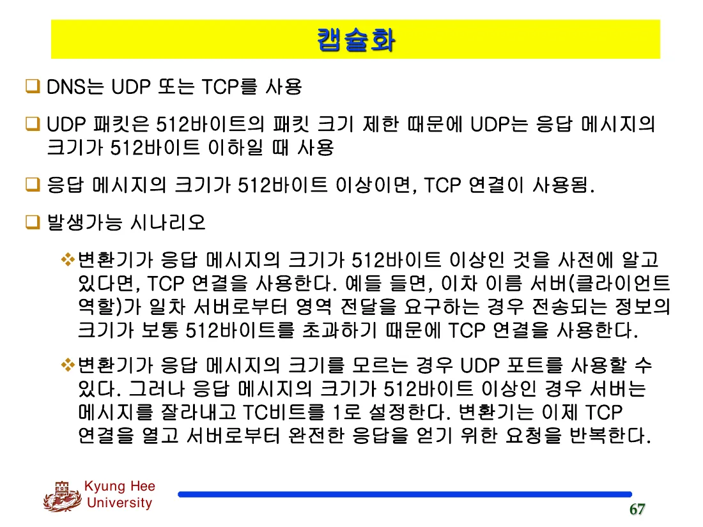

**직역**
> ### 캡슐화
> - DNS는 UDP 또는 TCP를 사용
> - UDP 패킷은 512바이트의 패킷 크기 제한 때문에 UDP는 응답 메시지의 크기가 512바이트 이하일 때 사용
> - 응답 메시지의 크기가 512바이트 이상이면, TCP 연결이 사용됨.
> - 발생가능 시나리오
>   - 변환기가 응답 메시지의 크기가 512바이트 이상인 것을 사전에 알고 있다면, TCP 연결을 사용한다. 예들 들면, 이차 이름 서버(클라이언트 역할)가 일차 서버로부터 영역 전달을 요구하는 경우 전송되는 정보의 크기가 보통 512바이트를 초과하기 때문에 TCP 연결을 사용한다.
>   - 변환기가 응답 메시지의 크기를 모르는 경우 UDP 포트를 사용할 수 있다. 그러나 응답 메시지의 크기가 512바이트 이상인 경우 서버는 메시지를 잘라내고 TC비트를 1로 설정한다. 변환기는 이제 TCP 연결을 열고 서버로부터 완전한 응답을 얻기 위한 요청을 반복한다.

## 슬라이드 68

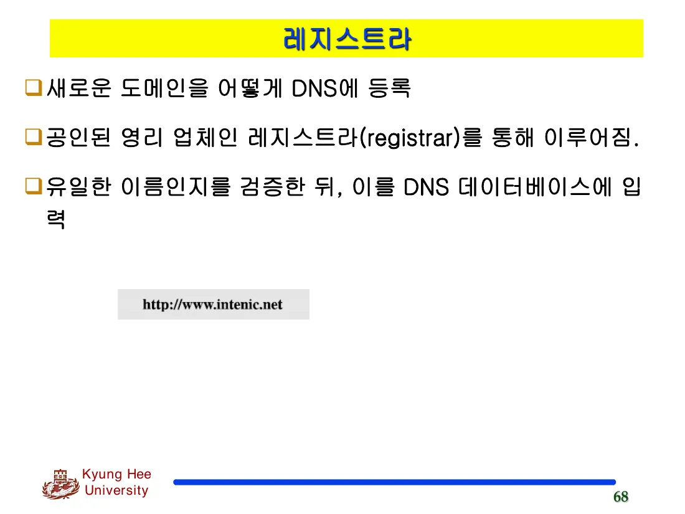

**직역**
> ### 레지스트라
> - 새로운 도메인을 어떻게 DNS에 등록
> - 공인된 영리 업체인 레지스트라(registrar)를 통해 이루어짐.
> - 유일한 이름인지를 검증한 뒤, 이를 DNS 데이터베이스에 입력

**설명**
- InterNIC 등 기관에서 DB에 유일성을 확인한 뒤 등록하며, 기관명·대표자명·전자서명 등 정보가 필요하다.
- 새 도메인을 등록하면 상위 TLD를 비롯한 다른 서버들로 **전파되기까지 시간이 걸린다**(옛날엔 반나절 정도 소요). DNS 정보가 여러 서버에 분산되어 있기 때문이다.
