> 원본 슬라이드를 슬라이드별로 직역하고 강의 녹취 설명을 함께 정리한 노트.
> [← 전체 목차](/posts/ain-overview/)

## 슬라이드 1

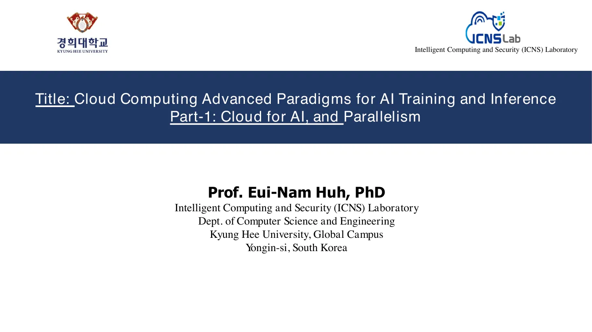

**직역**
> Intelligent Computing and Security (ICNS) Laboratory
>
> 제목: AI 학습과 추론을 위한 클라우드 컴퓨팅 고급 패러다임 (Cloud Computing Advanced Paradigms for AI Training and Inference)
> Part-1: AI를 위한 클라우드, 그리고 병렬화 (Cloud for AI, and Parallelism)
>
> Eui-Nam Huh 교수, PhD
> Intelligent Computing and Security (ICNS) Laboratory
> 컴퓨터공학부 (Dept. of Computer Science and Engineering)
> 경희대학교 국제캠퍼스 (Kyung Hee University, Global Campus)
> 대한민국 용인시 (Yongin-si, South Korea)

## 슬라이드 2

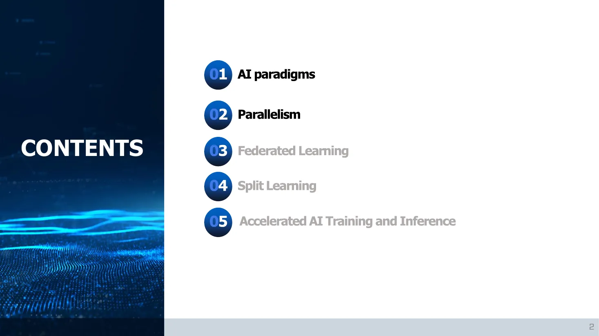

**직역**
> 목차 (CONTENTS)
> 01 AI 패러다임 (AI paradigms)
> 02 병렬화 (Parallelism)
> 03 연합학습 (Federated Learning)
> 04 스플릿 러닝 (Split Learning)
> 05 가속화된 AI 학습과 추론 (Accelerated AI Training and Inference)

## 슬라이드 3

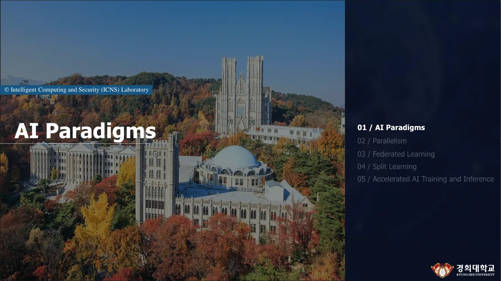

**직역**
> AI 패러다임 (AI Paradigms)
> 01 / AI 패러다임 (AI Paradigms)
> 02 / 병렬화 (Parallelism)
> 03 / 연합학습 (Federated Learning)
> 04 / 스플릿 러닝 (Split Learning)
> 05 / 가속화된 AI 학습과 추론 (Accelerated AI Training and Inference)

## 슬라이드 4

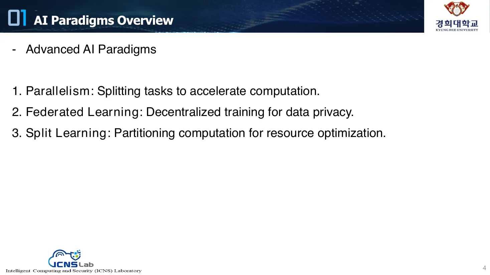

**직역**
> 01 AI 패러다임 개요 (AI Paradigms Overview)
> - 고급 AI 패러다임 (Advanced AI Paradigms)
>
> 1. 병렬화 (Parallelism): 연산을 가속하기 위해 작업을 분할.
> 2. 연합학습 (Federated Learning): 데이터 프라이버시를 위한 탈중앙화 학습.
> 3. 스플릿 러닝 (Split Learning): 자원 최적화를 위한 연산 분할.

## 슬라이드 5

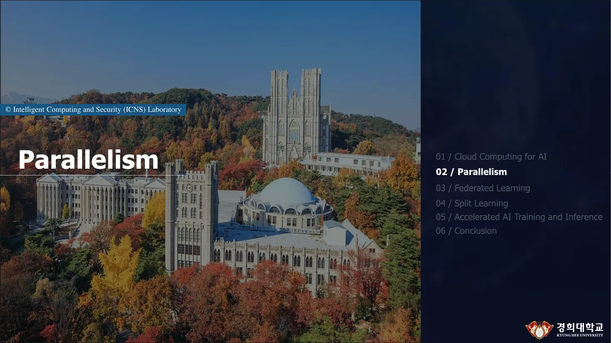

**직역**
> 병렬화 (Parallelism)
> 01 / AI를 위한 클라우드 컴퓨팅 (Cloud Computing for AI)
> 02 / 병렬화 (Parallelism)
> 03 / 연합학습 (Federated Learning)
> 04 / 스플릿 러닝 (Split Learning)
> 05 / 가속화된 AI 학습과 추론 (Accelerated AI Training and Inference)
> 06 / 결론 (Conclusion)

## 슬라이드 6

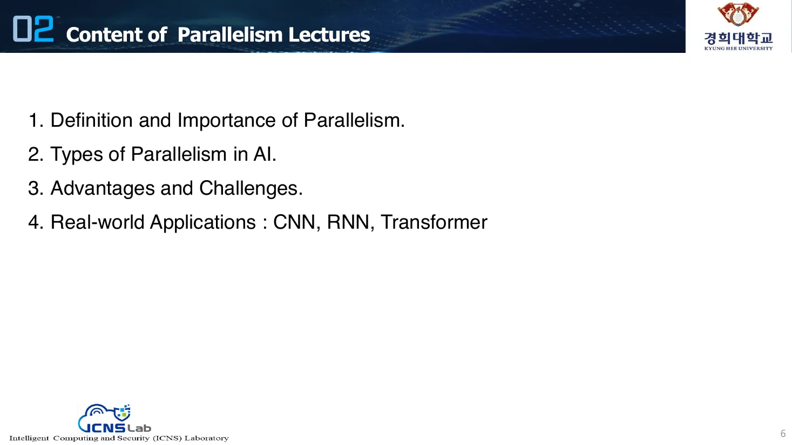

**직역**
> 02 병렬화 강의의 내용 (Content of Parallelism Lectures)
>
> 1. 병렬화의 정의와 중요성 (Definition and Importance of Parallelism).
> 2. AI에서의 병렬화 유형 (Types of Parallelism in AI).
> 3. 장점과 도전 과제 (Advantages and Challenges).
> 4. 실세계 응용 (Real-world Applications): CNN, RNN, 트랜스포머(Transformer)

## 슬라이드 7

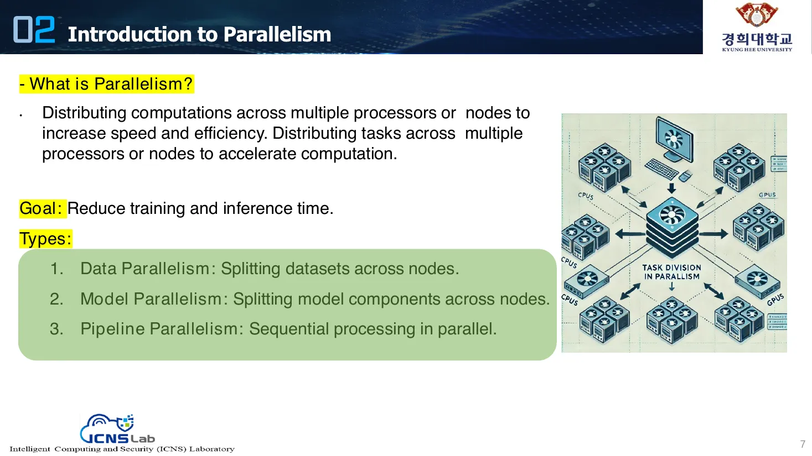

**직역**
> 02 병렬화 소개 (Introduction to Parallelism)
> - 병렬화란 무엇인가? (What is Parallelism?)
> - 속도와 효율을 높이기 위해 여러 프로세서 또는 노드에 걸쳐 연산을 분산. 연산을 가속하기 위해 여러 프로세서 또는 노드에 걸쳐 작업을 분산.
>
> 목표 (Goal): 학습과 추론 시간을 줄인다.
> 유형 (Types):
> 1. 데이터 병렬화 (Data Parallelism): 데이터셋을 노드들에 걸쳐 분할.
> 2. 모델 병렬화 (Model Parallelism): 모델 구성요소를 노드들에 걸쳐 분할.
> 3. 파이프라인 병렬화 (Pipeline Parallelism): 병렬로 이루어지는 순차 처리.

**설명**
- 처음에는 데이터를 모아 GPU 하나에서 학습했지만, 더 많은 데이터가 더 좋은 모델을 만들면서 규모가 커져 한 대로는 무리가 생김. 모델 경쟁(OpenAI, Claude, DeepSeek 등)이 곧 "시간 싸움"이 되면서 빨리 끝내야 한다는 압박이 커짐.
- Parallelism 정의: 여러 노드의 여러 프로세스에 연산을 분산시켜 처리량과 속도를 올리는 것. AI에 적용하는 목적은 학습(training)과 추론(inference) 시간을 줄이는 것.
- (1) 병렬화, (2) 연합학습, (3) 모델 분리(스플릿 러닝)가 중요해졌는데, 이 모든 것의 공통 병목(bottleneck)이 바로 네트워크. "분산 학습은 네트워크 없으면 안 된다."

## 슬라이드 8

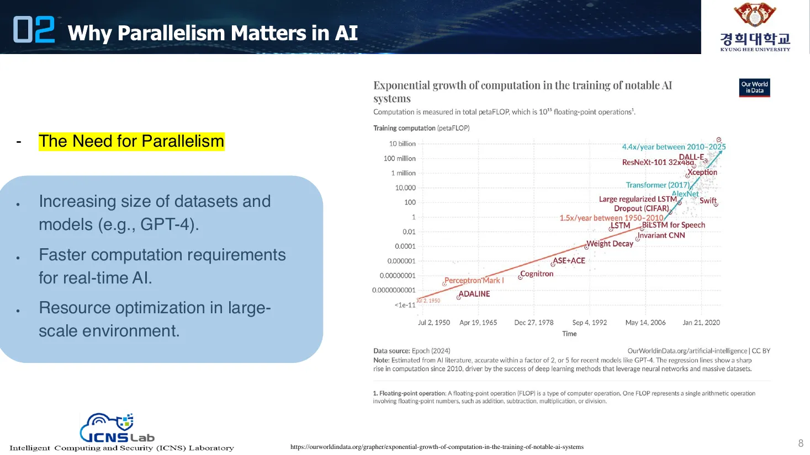

**직역**
> 02 AI에서 왜 병렬화가 중요한가 (Why Parallelism Matters in AI)
> - 병렬화의 필요성 (The Need for Parallelism)
>
> - 데이터셋과 모델 크기의 증가 (예: GPT-4).
> - 실시간 AI를 위한 더 빠른 연산 요구.
> - 대규모 환경에서의 자원 최적화.
>
> (그래프: 주목할 만한 AI 시스템 학습에서 연산량의 지수적 성장 — Exponential growth of computation in the training of notable AI systems. 가로축 연도, 세로축 학습 연산량(petaFLOP, 로그 스케일). AlphaGo Zero, GPT-3, GPT-4 등 모델들이 우상향으로 표시됨. 출처: ourworldindata.org)

**설명**
- 2006년 이후(LSTM, CIFAR, ImageNet 시기) 고도화가 시작됨. 기본 LSTM은 오래됐지만 양방향 LSTM(Bi-LSTM) 등으로 개선되며 성능이 좋아져 컴퓨팅 수요가 폭증. ResNet, DALL-E 등이 나오며 페타플롭스(PetaFLOPs) 급 연산이 필요해짐.

## 슬라이드 9

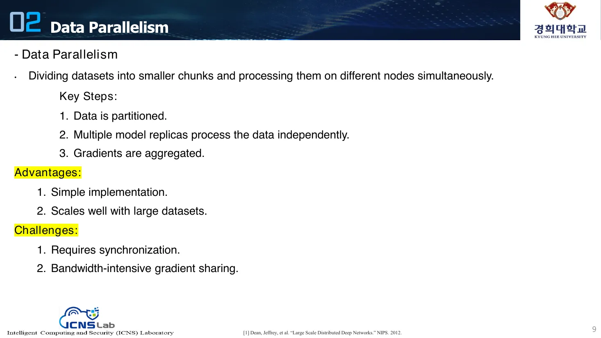

**직역**
> 02 데이터 병렬화 (Data Parallelism)
> - 데이터 병렬화 (Data Parallelism)
> - 데이터셋을 더 작은 덩어리(chunk)로 나누어 서로 다른 노드에서 동시에 처리.
>
> 핵심 단계 (Key Steps):
> 1. 데이터가 분할된다 (partitioned).
> 2. 여러 모델 복제본(replica)이 데이터를 독립적으로 처리한다.
> 3. 그래디언트(gradient)가 합산된다 (aggregated).
>
> 장점 (Advantages):
> 1. 구현이 간단하다.
> 2. 큰 데이터셋에 대해 잘 확장된다 (scales well).
>
> 도전 과제 (Challenges):
> 1. 동기화(synchronization)가 필요하다.
> 2. 대역폭 집약적인 그래디언트 공유 (Bandwidth-intensive gradient sharing).
>
> [1] Dean, Jeffrey, et al. "Large Scale Distributed Deep Networks." NIPS. 2012.

**설명**
- 큰 데이터를 작은 단위(shard)로 나눠 서로 다른 노드에 할당해 학습. 모델(replica)은 똑같은 것을 여러 개 두고 데이터만 독립적으로 할당.
- 각 노드가 학습하면 모델 구조는 같지만 내부 파라미터가 달라짐 → 합쳐야 함(aggregation). 중간중간 합칠지, 다 만든 뒤 파라미터 평균을 낼지 고민 필요. 그래디언트를 aggregate.
- 동기화 문제: 노드별 GPU 사양이 다르면(예: H200 vs A5000) 같은 크기 데이터를 줬을 때 느린 노드를 기다려야 함. 해결 아이디어는 비동기(asynchronous) 메커니즘, 그리고 노드 성능을 고려해 sharding/미니배치 크기를 다르게 해 밸런스를 맞추는 것.

## 슬라이드 10

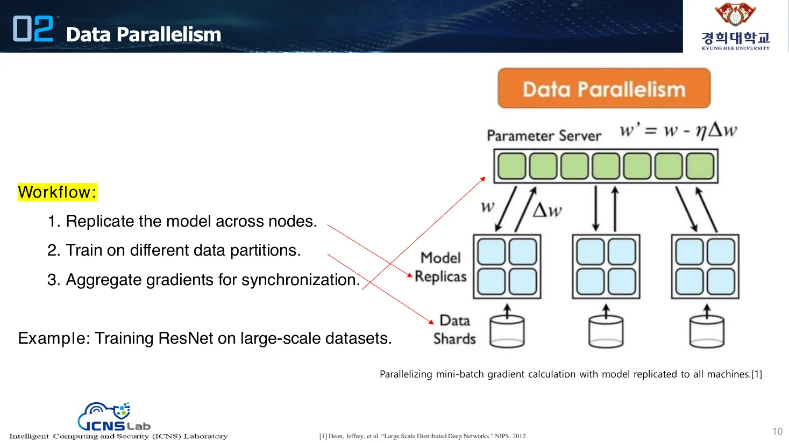

**직역**
> 02 데이터 병렬화 (Data Parallelism)
>
> 워크플로우 (Workflow):
> 1. 모델을 노드들에 걸쳐 복제한다.
> 2. 서로 다른 데이터 분할(partition)에 대해 학습한다.
> 3. 동기화를 위해 그래디언트를 합산한다.
>
> 예시 (Example): 대규모 데이터셋에서 ResNet 학습.
>
> (다이어그램: Parameter Server(파라미터 서버)가 상단에 있고, 가중치 갱신식 w' = w − η·Δw 표시. 서버가 각 Model Replicas(모델 복제본)로 w(가중치)를 내려보내고, 각 복제본은 Δw(그래디언트)를 서버로 올려보냄. 하단에는 Data Shards(데이터 샤드)들이 각 복제본에 연결됨. 캡션: "모든 머신에 복제된 모델로 미니배치 그래디언트 계산을 병렬화함[1]")
>
> [1] Dean, Jeffrey, et al. "Large Scale Distributed Deep Networks." NIPS. 2012.

## 슬라이드 11

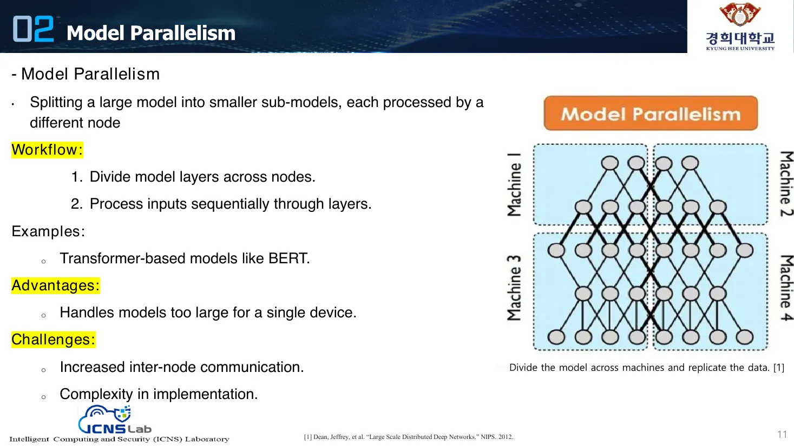

**직역**
> 02 모델 병렬화 (Model Parallelism)
> - 모델 병렬화 (Model Parallelism)
> - 큰 모델을 더 작은 서브 모델(sub-model)로 나누고, 각각을 서로 다른 노드에서 처리.
>
> 워크플로우 (Workflow):
> 1. 모델 레이어를 노드들에 걸쳐 분할한다.
> 2. 입력을 레이어들을 통해 순차적으로 처리한다.
>
> 예시 (Examples):
> - BERT 같은 트랜스포머 기반 모델.
>
> 장점 (Advantages):
> - 단일 디바이스에 비해 너무 큰 모델을 다룰 수 있다.
>
> 도전 과제 (Challenges):
> - 노드 간(inter-node) 통신 증가.
> - 구현의 복잡성.
>
> (다이어그램: 하나의 큰 신경망을 Machine 1·2·3·4 (머신 1~4)로 영역을 나눠 분할하고, 경계의 노드들끼리 연결선이 교차함. 캡션: "모델을 머신들에 걸쳐 나누고 데이터를 복제한다.[1]")
>
> [1] Dean, Jeffrey, et al. "Large Scale Distributed Deep Networks." NIPS. 2012.

**설명**
- 모델을 작은 서브 모델로 나눠 서로 다른 노드에서 처리(머신 1·2·3·4). 이것이 스플릿 러닝과 연결되는 개념.
- 경계(boundary)에 있는 노드들끼리는 전부 통신해야 함 → 여기서 통신 부담 발생.
- 장점: 모델이 크고 레이어가 어마어마하게 많아 연산이 많을 때, 노드가 많으면 연산을 나눠 빨리 끝낼 수 있음. BERT/트랜스포머 계열은 전부 모델 병렬화 가능.

## 슬라이드 12

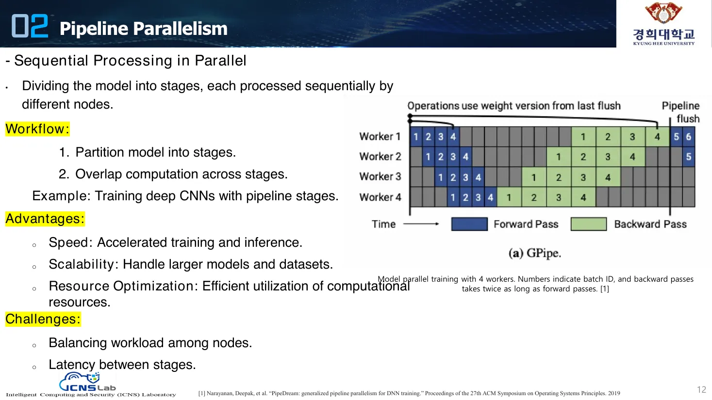

**직역**
> 02 파이프라인 병렬화 (Pipeline Parallelism)
> - 병렬로 이루어지는 순차 처리 (Sequential Processing in Parallel)
> - 모델을 스테이지(stage)로 나누고, 각각을 서로 다른 노드가 순차적으로 처리.
>
> 워크플로우 (Workflow):
> 1. 모델을 스테이지로 분할한다.
> 2. 스테이지 간 연산을 오버랩(overlap)시킨다.
> 예시 (Example): 파이프라인 스테이지로 깊은 CNN 학습.
>
> 장점 (Advantages):
> - 속도(Speed): 가속된 학습과 추론.
> - 확장성(Scalability): 더 큰 모델과 데이터셋을 다룸.
> - 자원 최적화(Resource Optimization): 연산 자원의 효율적 활용.
>
> 도전 과제 (Challenges):
> - 노드 간 워크로드 균형 맞추기.
> - 스테이지 간 지연(latency).
>
> (다이어그램 (a) GPipe: Worker 1~4(작업자 1~4)에 대한 시간 축 타임테이블. 칸 안의 숫자는 배치 ID, Forward Pass(파란색)와 Backward Pass(노란색)가 표시되며 백워드가 포워드의 두 배 시간을 차지. "Operations use weight version from last flush", "flush" 라벨 존재. 빈 칸은 노드가 노는 idle time(아이들 타임)을 나타냄.)
>
> [1] Narayanan, Deepak, et al. "PipeDream: generalized pipeline parallelism for DNN training." Proceedings of the 27th ACM Symposium on Operating Systems Principles. 2019

**설명**
- 모델을 스테이지로 나눔. 한 노드가 첫 몇 개 오퍼레이션을 수행하는 동안, 끝난 결과를 받아 다음 노드가 이어서 수행하는 방식. 끝나면 백워드(backward)로 다시 넘겨주며 학습.
- 문제: 그림만 봐도 노드가 "논다"(idle time 발생). 이 아이들 타임을 줄이는 아이디어가 많이 나와 있음.
- 최적화: 워크로드 밸런싱, 스테이지별 레이턴시 차이로 생기는 언밸런스 줄이기. 기존 논문 아이디어는 연산이 끝난 뒤 전송하는 게 아니라 연산(computation)과 통신(communication)을 오버랩시키면서 동기화해 대기 시간을 줄이는 것.

## 슬라이드 13

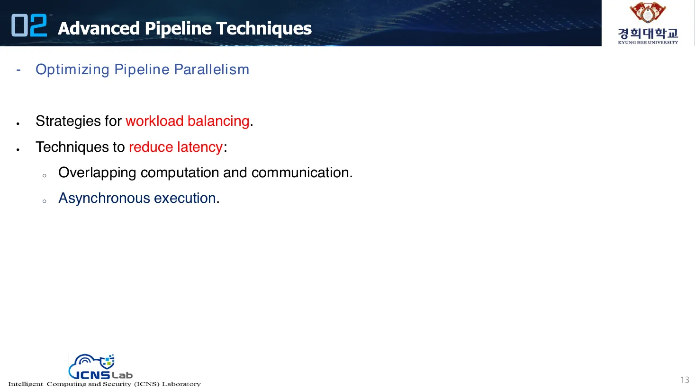

**직역**
> 02 고급 파이프라인 기법 (Advanced Pipeline Techniques)
> - 파이프라인 병렬화 최적화 (Optimizing Pipeline Parallelism)
>
> - 워크로드 균형을 위한 전략.
> - 지연(latency)을 줄이는 기법:
>   - 연산과 통신의 오버랩 (Overlapping computation and communication).
>   - 비동기 실행 (Asynchronous execution).

## 슬라이드 14

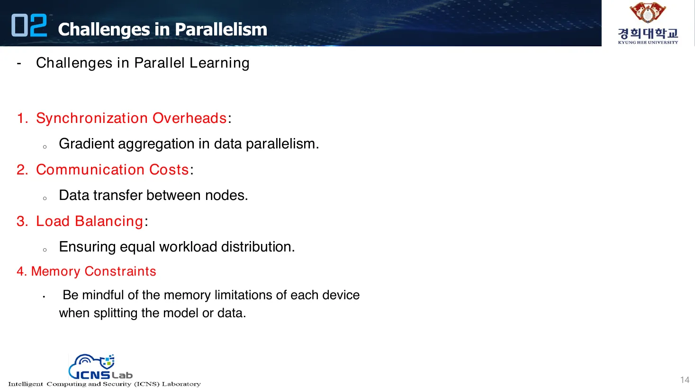

**직역**
> 02 병렬화의 도전 과제 (Challenges in Parallelism)
> - 병렬 학습의 도전 과제 (Challenges in Parallel Learning)
>
> 1. 동기화 오버헤드 (Synchronization Overheads):
>    - 데이터 병렬화에서의 그래디언트 합산.
> 2. 통신 비용 (Communication Costs):
>    - 노드 간 데이터 전송.
> 3. 로드 밸런싱 (Load Balancing):
>    - 동등한 워크로드 분배 보장.
> 4. 메모리 제약 (Memory Constraints)
>    - 모델 또는 데이터를 분할할 때 각 디바이스의 메모리 한계를 유념할 것.

**설명**
- GPU 메모리 문제: 집의 RTX 3050/3080 같은 GPU로 큰 모델을 돌리면 처음엔 돌다가 중간에 OOM(Out of Memory)으로 죽음 → 다른 GPU와 같이 쓰고 분리하는 작업이 필요해지고 파라미터 이동이 많아져 혼잡(congestion) 발생.
- LLM은 데이터가 10바이트여도 필요한 메모리는 키(Key)·밸류(Value)·중간 연산값까지 저장해 몇 배가 필요. 데이터가 적어 보여도 중간에 죽는 원인은 결국 메모리.

## 슬라이드 15

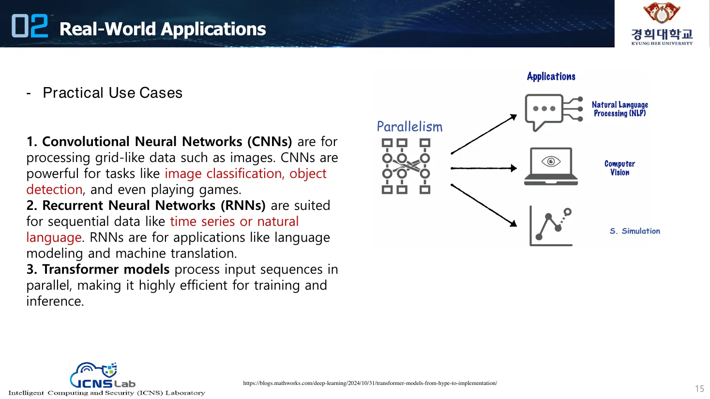

**직역**
> 02 실세계 응용 (Real-World Applications)
> - 실용적 사용 사례 (Practical Use Cases)
>
> 1. 합성곱 신경망 (Convolutional Neural Networks, CNNs)은 이미지 같은 격자형(grid-like) 데이터를 처리하기 위한 것. CNN은 이미지 분류, 객체 탐지, 심지어 게임 플레이 같은 작업에 강력하다.
> 2. 순환 신경망 (Recurrent Neural Networks, RNNs)은 시계열이나 자연어 같은 순차(sequential) 데이터에 적합. RNN은 언어 모델링, 기계 번역 같은 응용을 위한 것.
> 3. 트랜스포머(Transformer) 모델은 입력 시퀀스를 병렬로 처리하여, 학습과 추론에 매우 효율적이다.
>
> (그림: 트랜스포머 관련 이미지, "Parallelism", "S. Simulation" 라벨. 출처: blogs.mathworks.com)

**설명**
- 이 수업에서는 RNN(시계열 데이터)과 트랜스포머(데이터-데이터 관계성 중시, 추론 정확도 향상)를 중심으로 다룸. CNN은 이미지(컨볼루션) 쪽이라 이 수업과는 상관이 적음.

## 슬라이드 16

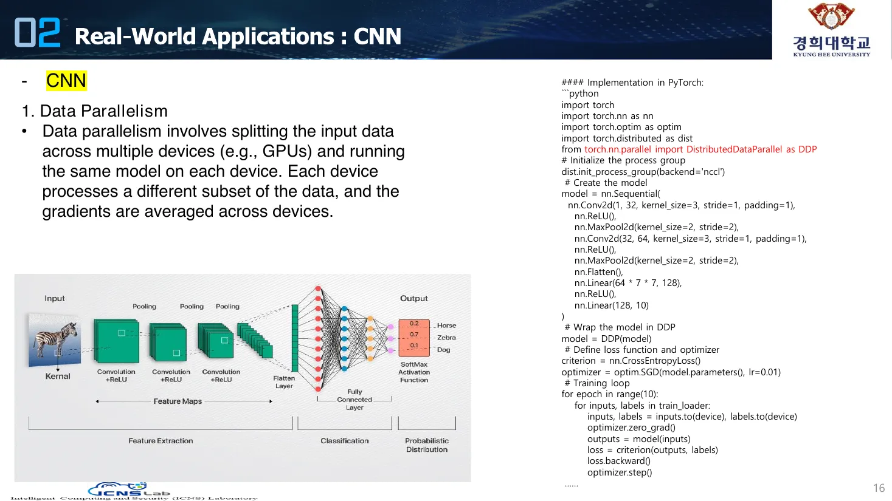

**직역**
> 02 실세계 응용: CNN (Real-World Applications : CNN)
> - CNN
> 1. 데이터 병렬화 (Data Parallelism)
> - 데이터 병렬화는 입력 데이터를 여러 디바이스(예: GPU)에 걸쳐 분할하고 각 디바이스에서 같은 모델을 실행하는 것. 각 디바이스는 데이터의 서로 다른 부분집합을 처리하고, 그래디언트는 디바이스 전체에 걸쳐 평균낸다.
>
> PyTorch 구현:
> ```python
> import torch
> import torch.nn as nn
> import torch.optim as optim
> import torch.distributed as dist
> from torch.nn.parallel import DistributedDataParallel as DDP
> # Initialize the process group
> dist.init_process_group(backend='nccl')
> # Create the model
> model = nn.Sequential(
>     nn.Conv2d(1, 32, kernel_size=3, stride=1, padding=1),
>     nn.ReLU(),
>     nn.MaxPool2d(kernel_size=2, stride=2),
>     nn.Conv2d(32, 64, kernel_size=3, stride=1, padding=1),
>     nn.ReLU(),
>     nn.MaxPool2d(kernel_size=2, stride=2),
>     nn.Flatten(),
>     nn.Linear(64 * 7 * 7, 128),
>     nn.ReLU(),
>     nn.Linear(128, 10)
> )
> # Wrap the model in DDP
> model = DDP(model)
> # Define loss function and optimizer
> criterion = nn.CrossEntropyLoss()
> optimizer = optim.SGD(model.parameters(), lr=0.01)
> # Training loop
> for epoch in range(10):
>     for inputs, labels in train_loader:
>         inputs, labels = inputs.to(device), labels.to(device)
>         optimizer.zero_grad()
>         outputs = model(inputs)
>         loss = criterion(outputs, labels)
>         loss.backward()
>         optimizer.step()
>     ……
> ```

**설명**
- CNN의 데이터 병렬성: 입력할 이미지를 나눠서 처리. convolution 과정에서 flat한 것들로 feature map을 만듦.

## 슬라이드 17

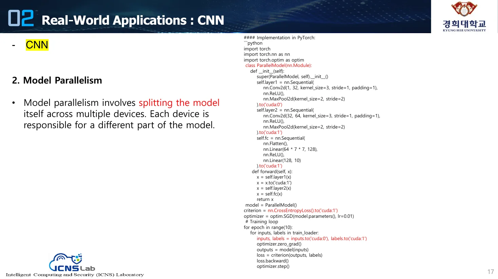

**직역**
> 02 실세계 응용: CNN (Real-World Applications : CNN)
> - CNN
> 2. 모델 병렬화 (Model Parallelism)
> - 모델 병렬화는 모델 자체를 여러 디바이스에 걸쳐 분할하는 것. 각 디바이스는 모델의 서로 다른 부분을 담당한다.
>
> PyTorch 구현:
> ```python
> import torch
> import torch.nn as nn
> import torch.optim as optim
> class ParallelModel(nn.Module):
>     def __init__(self):
>         super(ParallelModel, self).__init__()
>         self.layer1 = nn.Sequential(
>             nn.Conv2d(1, 32, kernel_size=3, stride=1, padding=1),
>             nn.ReLU(),
>             nn.MaxPool2d(kernel_size=2, stride=2)
>         ).to('cuda:0')
>         self.layer2 = nn.Sequential(
>             nn.Conv2d(32, 64, kernel_size=3, stride=1, padding=1),
>             nn.ReLU(),
>             nn.MaxPool2d(kernel_size=2, stride=2)
>         ).to('cuda:1')
>         self.fc = nn.Sequential(
>             nn.Flatten(),
>             nn.Linear(64 * 7 * 7, 128),
>             nn.ReLU(),
>             nn.Linear(128, 10)
>         ).to('cuda:1')
>     def forward(self, x):
>         x = self.layer1(x)
>         x = x.to('cuda:1')
>         x = self.layer2(x)
>         x = self.fc(x)
>         return x
> model = ParallelModel()
> criterion = nn.CrossEntropyLoss().to('cuda:1')
> optimizer = optim.SGD(model.parameters(), lr=0.01)
> # Training loop
> for epoch in range(10):
>     for inputs, labels in train_loader:
>         inputs, labels = inputs.to('cuda:0'), labels.to('cuda:1')
>         optimizer.zero_grad()
>         outputs = model(inputs)
>         loss = criterion(outputs, labels)
>         loss.backward()
>         optimizer.step()
> ```
> (주: layer1은 cuda:0, layer2와 fc는 cuda:1에 배치되어 서로 다른 GPU에 모델을 나눔)

**설명**
- 이 예시는 나눠서 cuda:0, cuda:1에서 돌리고 cuda:1에서 합치는 형태인데, GPU 사이의 성능 차이를 고려하지 않은 단순 예시. 본래는 앞 단에서 각 GPU 성능을 분석해 처리할 로드 양을 조절할 필요가 있음.

## 슬라이드 18


**직역**
> 02 실세계 응용: CNN (Real-World Applications : CNN)
> - CNN
> 3. 파이프라인 병렬화 (Pipeline Parallelism)
> - 파이프라인 병렬화는 모델을 스테이지로 나누고, 각 스테이지를 서로 다른 디바이스에 배치하는 것. 입력 데이터는 이 스테이지들을 순차적으로 통과한다.
>
> ```python
> import torch
> import torch.nn as nn
> import torch.optim as optim
> class PipelineModel(nn.Module):
>     def __init__(self):
>         super(PipelineModel, self).__init__()
>         self.stage1 = nn.Sequential(
>             nn.Conv2d(1, 32, kernel_size=3, stride=1, padding=1),
>             nn.ReLU(),
>             nn.MaxPool2d(kernel_size=2, stride=2)
>         ).to('cuda:0')
>         self.stage2 = nn.Sequential(
>             nn.Conv2d(32, 64, kernel_size=3, stride=1, padding=1),
>             nn.ReLU(),
>             nn.MaxPool2d(kernel_size=2, stride=2)
>         ).to('cuda:1')
>         self.stage3 = nn.Sequential(
>             nn.Flatten(),
>             nn.Linear(64 * 7 * 7, 128),
>             nn.ReLU(),
>             nn.Linear(128, 10)
>         ).to('cuda:1')
>     def forward(self, x):
>         x = self.stage1(x)
>         x = x.to('cuda:1')
>         x = self.stage2(x)
>         x = self.stage3(x)
>         return x
> model = PipelineModel()
> criterion = nn.CrossEntropyLoss().to('cuda:1')
> optimizer = optim.SGD(model.parameters(), lr=0.01)
> # Training loop
> for epoch in range(10):
>     for inputs, labels in train_loader:
>         inputs, labels = inputs.to('cuda:0'), labels.to('cuda:1')
>         optimizer.zero_grad()
>         outputs = model(inputs)
>         loss = criterion(outputs, labels)
>         loss.backward()
>         optimizer.step()
> ```

## 슬라이드 19

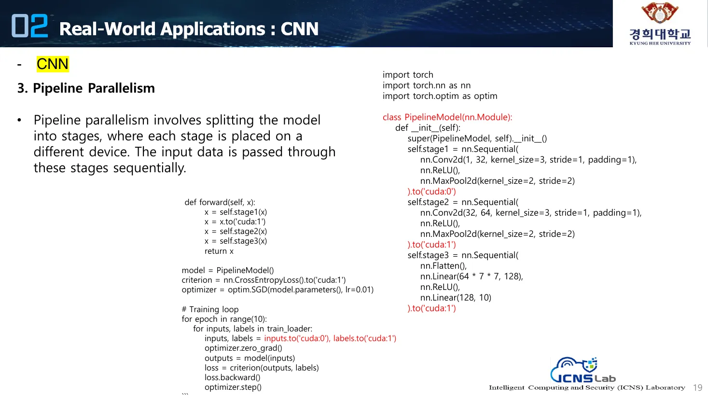

**직역**
> 02 실세계 응용: CNN (Real-World Applications : CNN)
> - CNN
> 3. 파이프라인 병렬화 (Pipeline Parallelism)
> - 파이프라인 병렬화는 모델을 스테이지로 나누고, 각 스테이지를 서로 다른 디바이스에 배치하는 것. 입력 데이터는 이 스테이지들을 순차적으로 통과한다.
>
> (슬라이드 18과 동일한 PipelineModel 코드 반복: stage1 → cuda:0, stage2/stage3 → cuda:1, forward에서 stage1 후 cuda:1로 이동해 stage2·stage3 수행)

## 슬라이드 20

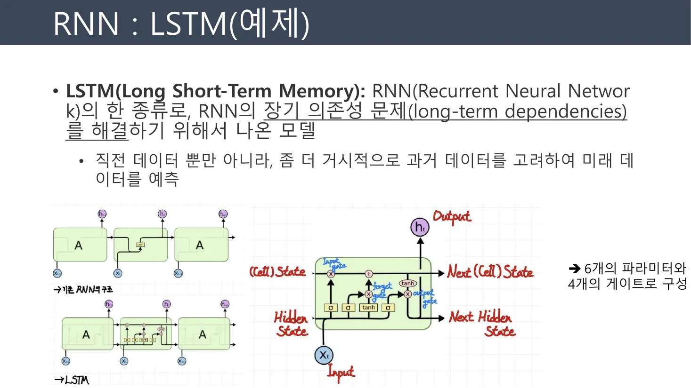

**직역**
> RNN : LSTM(예제)
> - LSTM(Long Short-Term Memory): RNN(Recurrent Neural Network)의 한 종류로, RNN의 장기 의존성 문제(long-term dependencies)를 해결하기 위해서 나온 모델
>   - 직전 데이터뿐만 아니라, 좀 더 거시적으로 과거 데이터를 고려하여 미래 데이터를 예측
>
> (다이어그램: 펼쳐진 RNN 체인의 각 셀 "A"가 연결된 그림과, 한 LSTM 셀 내부 구조. 라벨: Output(출력), Cell State / Next (Cell) State, Hidden State / Next Hidden State, Input(입력))
> ➔ 6개의 파라미터와 4개의 게이트로 구성

**설명**
- LSTM 예시는 반복(recurrent)해서 단계별로 진행됨. 이전 것을 가중치 같은 것으로 줄이거나 해서 다음 것에 반영하는 식.
- 반복 기반이라 CNN보다 병렬화하기 어렵고, 그 때문에 결과의 정확도가 떨어지는 경우가 많음.

## 슬라이드 21

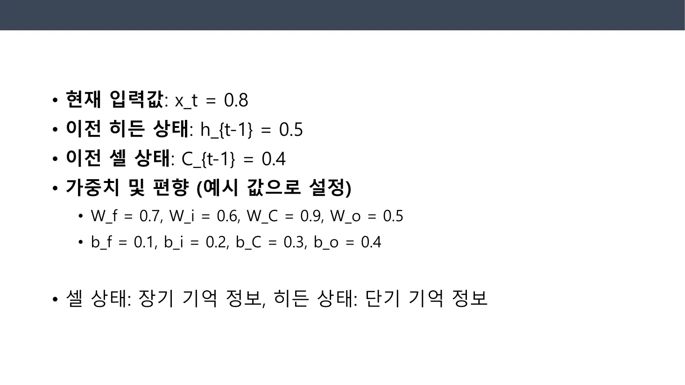

**직역**
> - 현재 입력값: x_t = 0.8
> - 이전 히든 상태: h_{t-1} = 0.5
> - 이전 셀 상태: C_{t-1} = 0.4
> - 가중치 및 편향 (예시 값으로 설정)
>   - W_f = 0.7, W_i = 0.6, W_C = 0.9, W_o = 0.5
>   - b_f = 0.1, b_i = 0.2, b_C = 0.3, b_o = 0.4
>
> - 셀 상태: 장기 기억 정보, 히든 상태: 단기 기억 정보

## 슬라이드 22

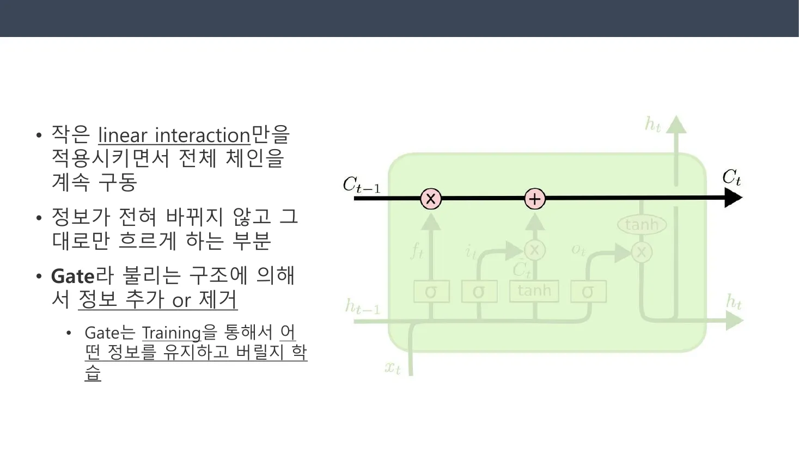

**직역**
> - 작은 linear interaction만을 적용시키면서 전체 체인을 계속 구동
> - 정보가 전혀 바뀌지 않고 그대로만 흐르게 하는 부분
> - Gate라 불리는 구조에 의해서 정보 추가 or 제거
>   - Gate는 Training을 통해서 어떤 정보를 유지하고 버릴지 학습
>
> (다이어그램: LSTM 셀 내부. 상단 가로선 C_{t-1} → C_t (셀 상태, ⊗ 곱셈·⊕ 덧셈 노드), 하단 h_{t-1}, x_t 입력. 내부 게이트: f_t, i_t, C̃_t(tanh), o_t 와 시그모이드(σ)·tanh 노드, 출력 h_t)

## 슬라이드 23

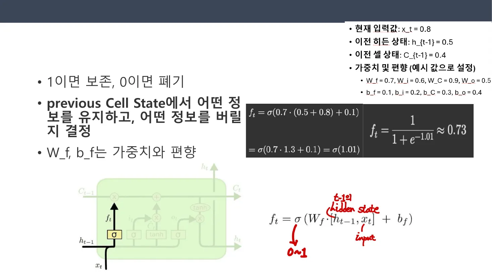

**직역**
> - 1이면 보존, 0이면 폐기
> - previous Cell State에서 어떤 정보를 유지하고, 어떤 정보를 버릴지 결정
> - W_f, b_f는 가중치와 편향
>
> (우측 상단: 슬라이드 21의 입력/가중치 값들 재표시 — x_t=0.8, h_{t-1}=0.5, C_{t-1}=0.4, W_f=0.7, W_i=0.6, W_C=0.9, W_o=0.5, b_f=0.1, b_i=0.2, b_C=0.3, b_o=0.4)
>
> 망각 게이트 (forget gate) 계산:
> f_t = σ(0.7·(0.5+0.8) + 0.1)
>     = σ(0.7·1.3 + 0.1) = σ(1.01)
> f_t = 1 / (1 + e^(-1.01)) ≈ 0.73
>
> (수기 주석) f_t = σ(W_f · [h_{t-1}, x_t] + b_f)  — h_{t-1}은 t-1의 hidden state, x_t는 input, 결과 범위 0~1

## 슬라이드 24

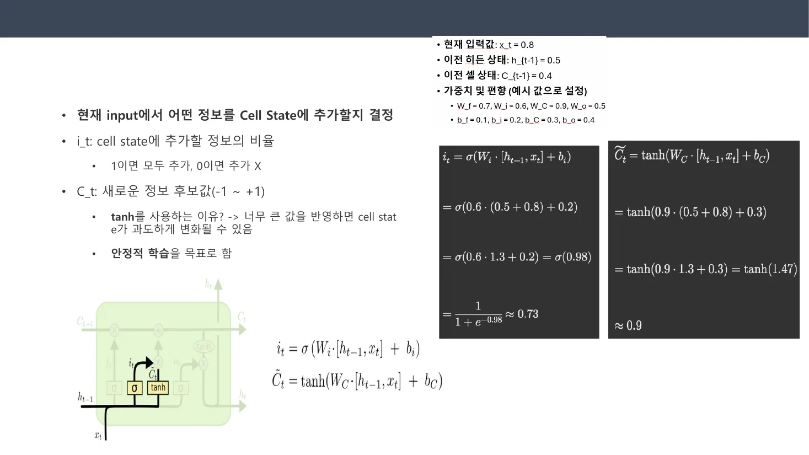

**직역**
> - 현재 input에서 어떤 정보를 Cell State에 추가할지 결정
> - i_t: cell state에 추가할 정보의 비율
>   - 1이면 모두 추가, 0이면 추가 X
> - C_t: 새로운 정보 후보값(-1 ~ +1)
>   - tanh를 사용하는 이유? -> 너무 큰 값을 반영하면 cell state가 과도하게 변화될 수 있음
>   - 안정적 학습을 목표로 함
>
> 입력 게이트 (input gate) 계산:
> i_t = σ(W_i · [h_{t-1}, x_t] + b_i)
>     = σ(0.6·(0.5+0.8) + 0.2)
>     = σ(0.6·1.3 + 0.2) = σ(0.98)
>     = 1 / (1 + e^(-0.98)) ≈ 0.73
>
> C̃_t = tanh(W_C · [h_{t-1}, x_t] + b_C)
>     = tanh(0.9·(0.5+0.8) + 0.3)
>     = tanh(0.9·1.3 + 0.3) = tanh(1.47)
>     ≈ 0.9

## 슬라이드 25

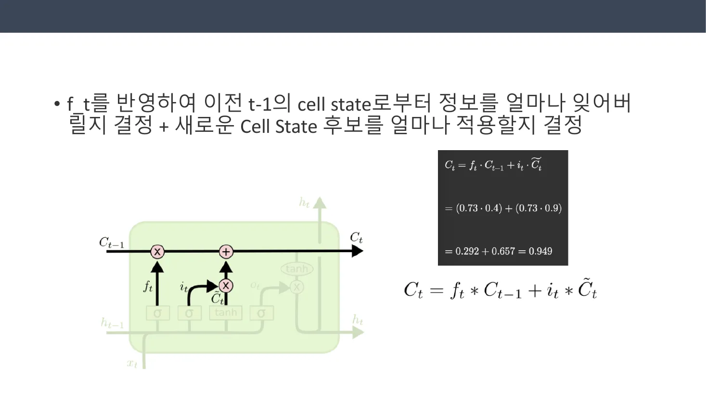

**직역**
> - f_t를 반영하여 이전 t-1의 cell state로부터 정보를 얼마나 잊어버릴지 결정 + 새로운 Cell State 후보를 얼마나 적용할지 결정
>
> 셀 상태 갱신 계산:
> C_t = f_t · C_{t-1} + i_t · C̃_t
>     = (0.73 · 0.4) + (0.73 · 0.9)
>     = 0.292 + 0.657 = 0.949
>
> C_t = f_t * C_{t-1} + i_t * C̃_t

## 슬라이드 26

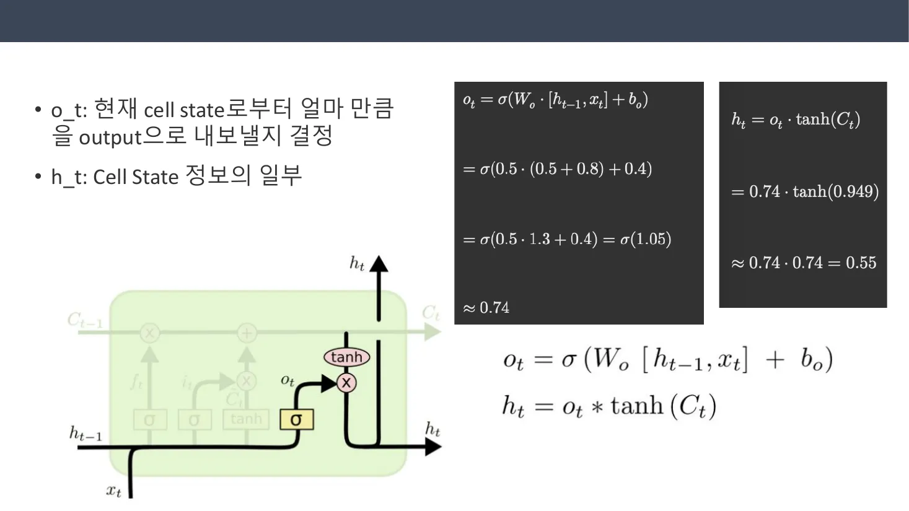

**직역**
> - o_t: 현재 cell state로부터 얼마 만큼을 output으로 내보낼지 결정
> - h_t: Cell State 정보의 일부
>
> 출력 게이트 (output gate) 계산:
> o_t = σ(W_o · [h_{t-1}, x_t] + b_o)
>     = σ(0.5·(0.5+0.8) + 0.4)
>     = σ(0.5·1.3 + 0.4) = σ(1.05)
>     ≈ 0.74
>
> h_t = o_t · tanh(C_t)
>     = 0.74 · tanh(0.949)
>     ≈ 0.74 · 0.74 = 0.55
>
> o_t = σ(W_o [h_{t-1}, x_t] + b_o)
> h_t = o_t * tanh(C_t)

## 슬라이드 27

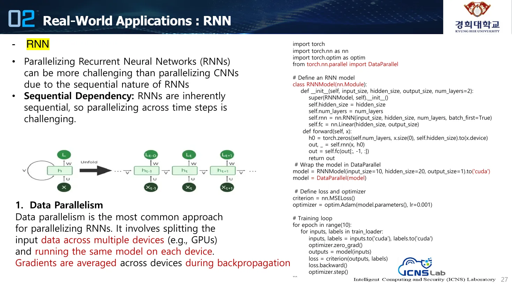

**직역**
> 02 실세계 응용: RNN (Real-World Applications : RNN)
> - RNN
> - 순환 신경망(RNN)의 병렬화는 RNN의 순차적 특성 때문에 CNN의 병렬화보다 더 어려울 수 있다.
> - 순차 의존성(Sequential Dependency): RNN은 본질적으로 순차적이라, 타임스텝에 걸쳐 병렬화하는 것이 어렵다.
>
> 1. 데이터 병렬화 (Data Parallelism)
> 데이터 병렬화는 RNN을 병렬화하는 가장 흔한 접근. 입력 데이터를 여러 디바이스(예: GPU)에 걸쳐 분할하고 각 디바이스에서 같은 모델을 실행. 역전파(backpropagation) 중에 그래디언트는 디바이스 전체에 걸쳐 평균낸다.
>
> ```python
> import torch
> import torch.nn as nn
> import torch.optim as optim
> from torch.nn.parallel import DataParallel
> # Define an RNN model
> class RNNModel(nn.Module):
>     def __init__(self, input_size, hidden_size, output_size, num_layers=2):
>         super(RNNModel, self).__init__()
>         self.hidden_size = hidden_size
>         self.num_layers = num_layers
>         self.rnn = nn.RNN(input_size, hidden_size, num_layers, batch_first=True)
>         self.fc = nn.Linear(hidden_size, output_size)
>     def forward(self, x):
>         h0 = torch.zeros(self.num_layers, x.size(0), self.hidden_size).to(x.device)
>         out, _ = self.rnn(x, h0)
>         out = self.fc(out[:, -1, :])
>         return out
> # Wrap the model in DataParallel
> model = RNNModel(input_size=10, hidden_size=20, output_size=1).to('cuda')
> model = DataParallel(model)
> # Define loss and optimizer
> criterion = nn.MSELoss()
> optimizer = optim.Adam(model.parameters(), lr=0.001)
> # Training loop
> for epoch in range(10):
>     for inputs, labels in train_loader:
>         inputs, labels = inputs.to('cuda'), labels.to('cuda')
>         optimizer.zero_grad()
>         outputs = model(inputs)
>         loss = criterion(outputs, labels)
>         loss.backward()
>         optimizer.step()
> ```

**설명**
- RNN은 반복 기반이라 CNN보다 병렬화가 어려워 정확도가 떨어지기 쉬움. 그래서 데이터를 쪼개 병렬로 돌리는 데이터 병렬화가 가장 흔한 접근.
- 데이터를 쪼갤 때 그 단위들이 서로 독립적이면 좋지만, 그렇지 않으면 시퀀스 간 연계성(전후 관계)을 고려해야 함.

## 슬라이드 28

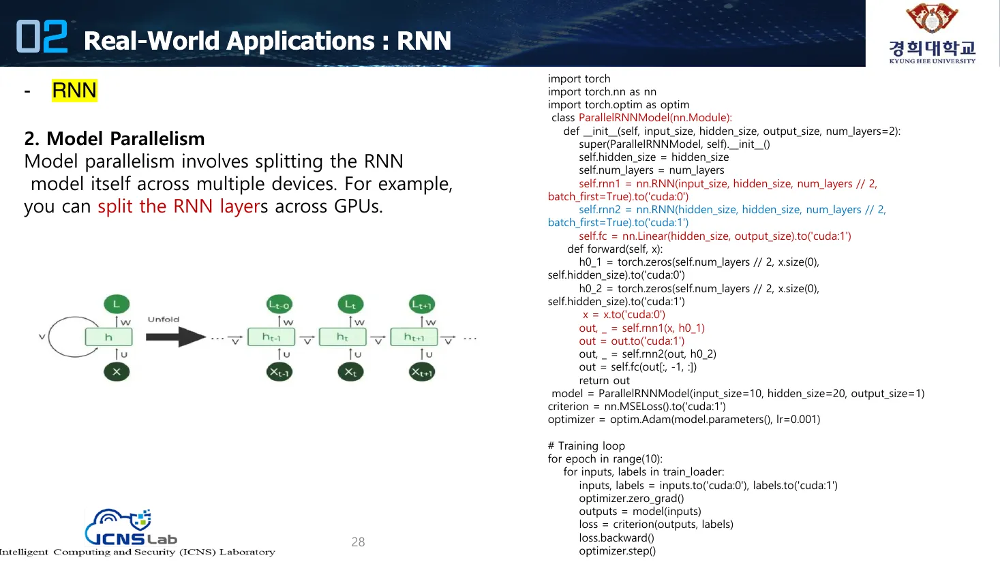

**직역**
> 02 실세계 응용: RNN (Real-World Applications : RNN)
> - RNN
> 2. 모델 병렬화 (Model Parallelism)
> 모델 병렬화는 RNN 모델 자체를 여러 디바이스에 걸쳐 분할하는 것. 예를 들어 RNN 레이어들을 GPU들에 걸쳐 나눌 수 있다.
>
> ```python
> import torch
> import torch.nn as nn
> import torch.optim as optim
> class ParallelRNNModel(nn.Module):
>     def __init__(self, input_size, hidden_size, output_size, num_layers=2):
>         super(ParallelRNNModel, self).__init__()
>         self.hidden_size = hidden_size
>         self.num_layers = num_layers
>         self.rnn1 = nn.RNN(input_size, hidden_size, num_layers // 2, batch_first=True).to('cuda:0')
>         self.rnn2 = nn.RNN(hidden_size, hidden_size, num_layers // 2, batch_first=True).to('cuda:1')
>         self.fc = nn.Linear(hidden_size, output_size).to('cuda:1')
>     def forward(self, x):
>         h0_1 = torch.zeros(self.num_layers // 2, x.size(0), self.hidden_size).to('cuda:0')
>         h0_2 = torch.zeros(self.num_layers // 2, x.size(0), self.hidden_size).to('cuda:1')
>         x = x.to('cuda:0')
>         out, _ = self.rnn1(x, h0_1)
>         out = out.to('cuda:1')
>         out, _ = self.rnn2(out, h0_2)
>         out = self.fc(out[:, -1, :])
>         return out
> model = ParallelRNNModel(input_size=10, hidden_size=20, output_size=1)
> criterion = nn.MSELoss().to('cuda:1')
> optimizer = optim.Adam(model.parameters(), lr=0.001)
> # Training loop
> for epoch in range(10):
>     for inputs, labels in train_loader:
>         inputs, labels = inputs.to('cuda:0'), labels.to('cuda:1')
>         optimizer.zero_grad()
>         outputs = model(inputs)
>         loss = criterion(outputs, labels)
>         loss.backward()
>         optimizer.step()
> ```

## 슬라이드 29

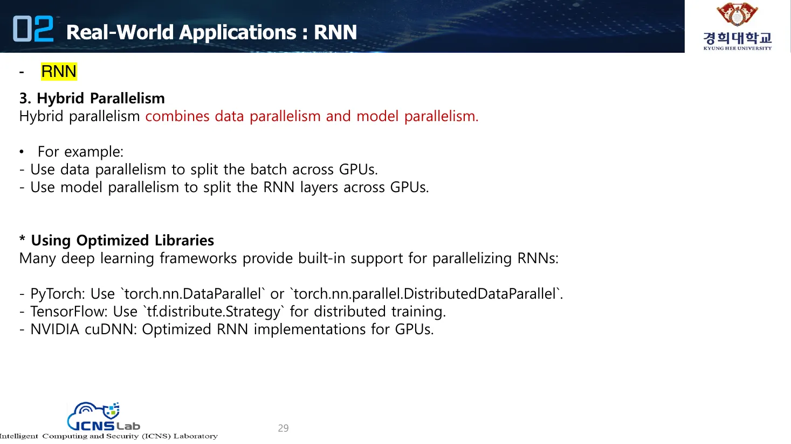

**직역**
> 02 실세계 응용: RNN (Real-World Applications : RNN)
> - RNN
> 3. 하이브리드 병렬화 (Hybrid Parallelism)
> 하이브리드 병렬화는 데이터 병렬화와 모델 병렬화를 결합한다.
>
> - 예를 들어:
>   - 데이터 병렬화를 사용해 배치를 GPU들에 걸쳐 분할한다.
>   - 모델 병렬화를 사용해 RNN 레이어들을 GPU들에 걸쳐 분할한다.
>
> * 최적화된 라이브러리 사용 (Using Optimized Libraries)
> 많은 딥러닝 프레임워크가 RNN 병렬화를 위한 내장 지원을 제공한다:
> - PyTorch: `torch.nn.DataParallel` 또는 `torch.nn.parallel.DistributedDataParallel` 사용.
> - TensorFlow: 분산 학습을 위해 `tf.distribute.Strategy` 사용.
> - NVIDIA cuDNN: GPU에 최적화된 RNN 구현.

## 슬라이드 30

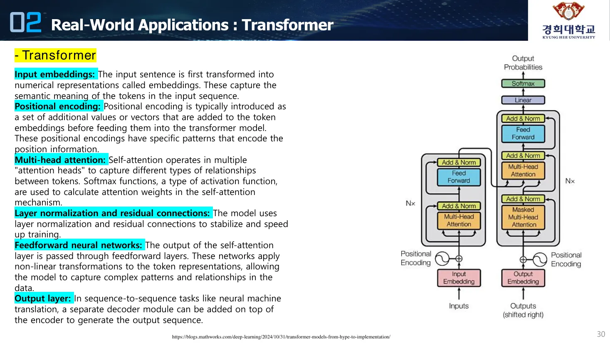

**직역**
> 02 실세계 응용: 트랜스포머 (Real-World Applications : Transformer)
> - 트랜스포머 (Transformer)
> 입력 임베딩 (Input embeddings): 입력 문장이 먼저 임베딩이라 불리는 수치 표현으로 변환된다. 이는 입력 시퀀스 토큰들의 의미적 의미를 포착한다.
> 위치 인코딩 (Positional encoding): 위치 인코딩은 보통 토큰 임베딩에 더해지는 추가 값 또는 벡터 집합으로, 트랜스포머 모델에 넣기 전에 더해진다. 이 위치 인코딩은 위치 정보를 인코딩하는 특정 패턴을 가진다.
> 멀티헤드 어텐션 (Multi-head attention): 셀프 어텐션은 토큰들 사이의 서로 다른 종류의 관계를 포착하기 위해 여러 "어텐션 헤드(attention head)"에서 동작한다. 활성화 함수의 일종인 소프트맥스(Softmax) 함수가 셀프 어텐션 메커니즘에서 어텐션 가중치를 계산하는 데 사용된다.
> 레이어 정규화와 잔차 연결 (Layer normalization and residual connections): 모델은 학습을 안정화하고 가속하기 위해 레이어 정규화와 잔차 연결을 사용한다.
> 피드포워드 신경망 (Feedforward neural networks): 셀프 어텐션 레이어의 출력은 피드포워드 레이어를 통과한다. 이 네트워크는 토큰 표현에 비선형 변환을 적용하여, 모델이 데이터의 복잡한 패턴과 관계를 포착하게 한다.
> 출력 레이어 (Output layer): 신경망 기계 번역 같은 시퀀스-투-시퀀스(sequence-to-sequence) 작업에서는, 인코더 위에 별도의 디코더 모듈을 추가하여 출력 시퀀스를 생성할 수 있다.
>
> (우측 다이어그램: 트랜스포머 구조도 — 좌측 인코더(Inputs → Input Embedding → Positional Encoding → Multi-Head Attention → Add & Norm → Feed Forward → Add & Norm), 우측 디코더(Outputs(shifted right) → Masked Multi-Head Attention → Multi-Head Attention → Feed Forward → Linear → Softmax → Output Probabilities))

**설명**
- 트랜스포머는 데이터와 데이터의 상관관계(관계성)에 집중하는 모델. RNN이 전후 관계 위주인 것과 대비됨.
- 처리 단계: ① embedding(문장을 넣으면 숫자로 바꿈) → ② positional(위치 정보) 처리 → ③ attention(단어의 중요도를 가중치로 두어 집중도를 나타내는 메커니즘, self-attention / multi-head attention).

## 슬라이드 31

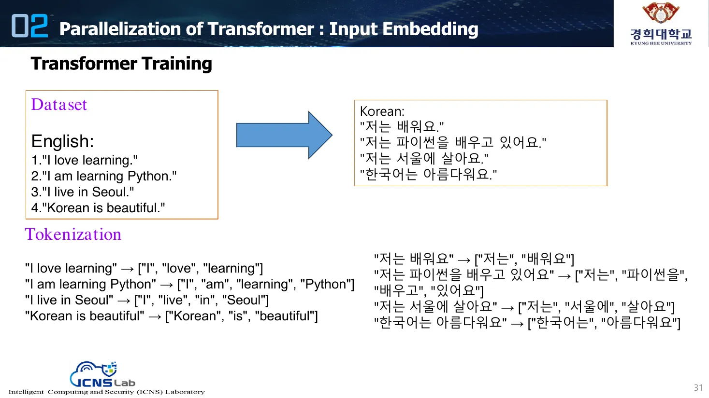

**직역**
> 02 트랜스포머의 병렬화: 입력 임베딩 (Parallelization of Transformer : Input Embedding)
> 트랜스포머 학습 (Transformer Training)
>
> 데이터셋 (Dataset)
> 영어 (English):
> 1. "I love learning."
> 2. "I am learning Python."
> 3. "I live in Seoul."
> 4. "Korean is beautiful."
>
> 한국어 (Korean):
> "저는 배워요."
> "저는 파이썬을 배우고 있어요."
> "저는 서울에 살아요."
> "한국어는 아름다워요."
>
> 토큰화 (Tokenization)
> "I love learning" → ["I", "love", "learning"]
> "I am learning Python" → ["I", "am", "learning", "Python"]
> "I live in Seoul" → ["I", "live", "in", "Seoul"]
> "Korean is beautiful" → ["Korean", "is", "beautiful"]
>
> "저는 배워요" → ["저는", "배워요"]
> "저는 파이썬을 배우고 있어요" → ["저는", "파이썬을", "배우고", "있어요"]
> "저는 서울에 살아요" → ["저는", "서울에", "살아요"]
> "한국어는 아름다워요" → ["한국어는", "아름다워요"]

## 슬라이드 32

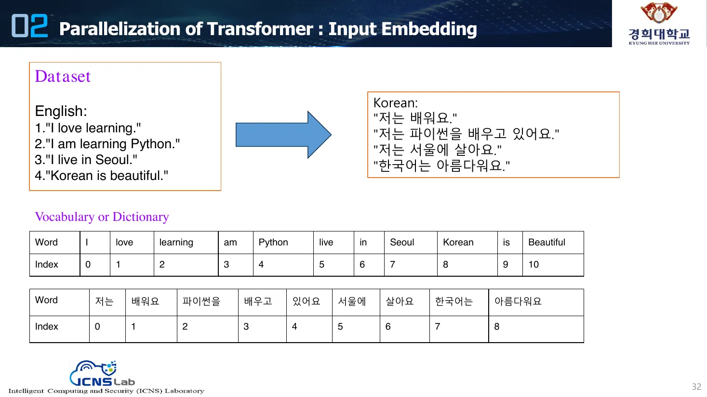

**직역**
> 02 트랜스포머의 병렬화: 입력 임베딩 (Parallelization of Transformer : Input Embedding)
> 데이터셋 (영어/한국어 슬라이드 31과 동일)
>
> 어휘집 또는 사전 (Vocabulary or Dictionary)
> | 단어(Word) | I | love | learning | am | Python | live | in | Seoul | Korean | is | Beautiful |
> | 인덱스(Index) | 0 | 1 | 2 | 3 | 4 | 5 | 6 | 7 | 8 | 9 | 10 |
>
> | 단어(Word) | 저는 | 배워요 | 파이썬을 | 배우고 | 있어요 | 서울에 | 살아요 | 한국어는 | 아름다워요 |
> | 인덱스(Index) | 0 | 1 | 2 | 3 | 4 | 5 | 6 | 7 | 8 |

## 슬라이드 33

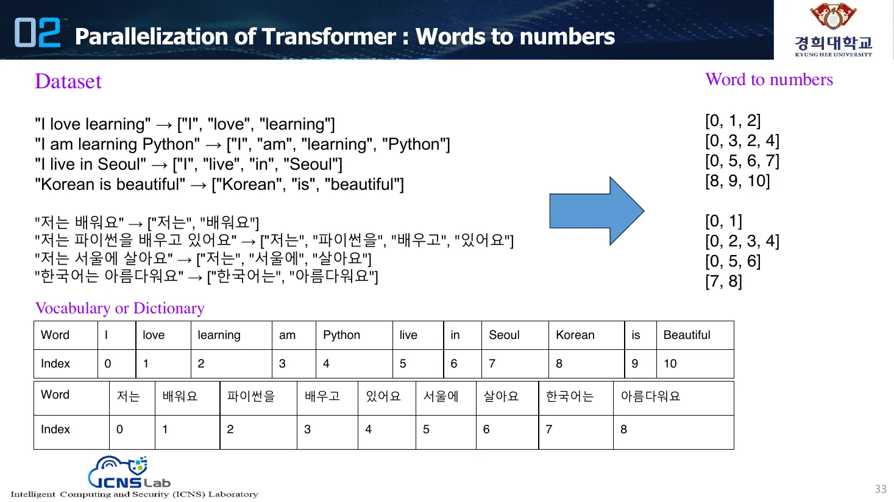

**직역**
> 02 트랜스포머의 병렬화: 단어를 숫자로 (Parallelization of Transformer : Words to numbers)
> 데이터셋 → 단어를 숫자로 (Word to numbers)
>
> "I love learning" → ["I", "love", "learning"] → [0, 1, 2]
> "I am learning Python" → ["I", "am", "learning", "Python"] → [0, 3, 2, 4]
> "I live in Seoul" → ["I", "live", "in", "Seoul"] → [0, 5, 6, 7]
> "Korean is beautiful" → ["Korean", "is", "beautiful"] → [8, 9, 10]
>
> "저는 배워요" → ["저는", "배워요"] → [0, 1]
> "저는 파이썬을 배우고 있어요" → ["저는", "파이썬을", "배우고", "있어요"] → [0, 2, 3, 4]
> "저는 서울에 살아요" → ["저는", "서울에", "살아요"] → [0, 5, 6]
> "한국어는 아름다워요" → ["한국어는", "아름다워요"] → [7, 8]
>
> 어휘집 또는 사전 (슬라이드 32와 동일한 인덱스 표)

## 슬라이드 34

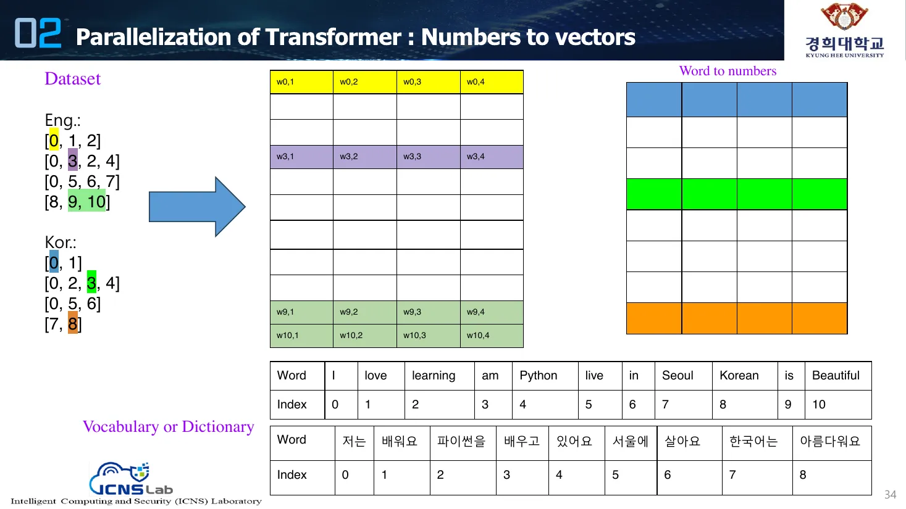

**직역**
> 02 트랜스포머의 병렬화: 숫자를 벡터로 (Parallelization of Transformer : Numbers to vectors)
> 데이터셋 → 단어를 숫자로 (Word to numbers)
> 영어(Eng.): [0, 1, 2] / [0, 3, 2, 4] / [0, 5, 6, 7] / [8, 9, 10]
> 한국어(Kor.): [0, 1] / [0, 2, 3, 4] / [0, 5, 6] / [7, 8]
>
> (임베딩 가중치 행렬: 각 인덱스 행마다 w_{0,1} w_{0,2} w_{0,3} w_{0,4} … w_{3,1}…w_{3,4} … w_{9,*}, w_{10,*} 형태의 가중치들. 즉 단어 인덱스 → 4차원 임베딩 벡터로 매핑)
>
> 어휘집 또는 사전 (인덱스 표, 슬라이드 32와 동일)

## 슬라이드 35

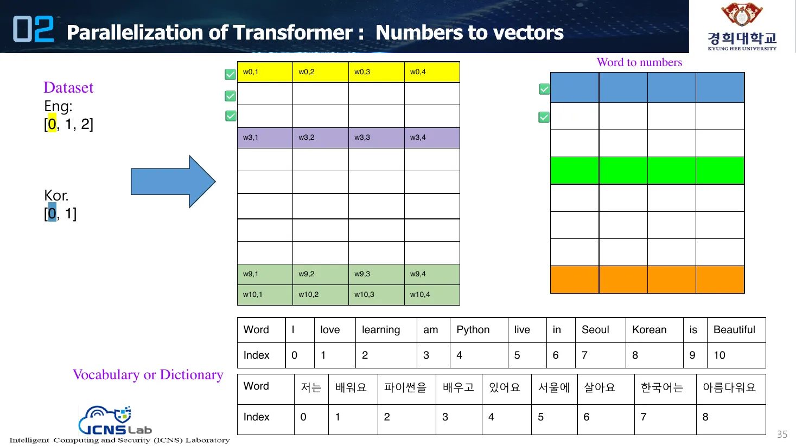

**직역**
> 02 트랜스포머의 병렬화: 숫자를 벡터로 (Parallelization of Transformer : Numbers to vectors)
> 데이터셋 → 단어를 숫자로 (Word to numbers)
> 영어(Eng): [0, 1, 2]
> 한국어(Kor.): [0, 1]
>
> (가중치 행렬 w_{0,*}, w_{3,*}, w_{9,*}, w_{10,*} 표시. 슬라이드 34에서 일부 문장만 강조해 표시)
> 어휘집 또는 사전 (인덱스 표 동일)

## 슬라이드 36

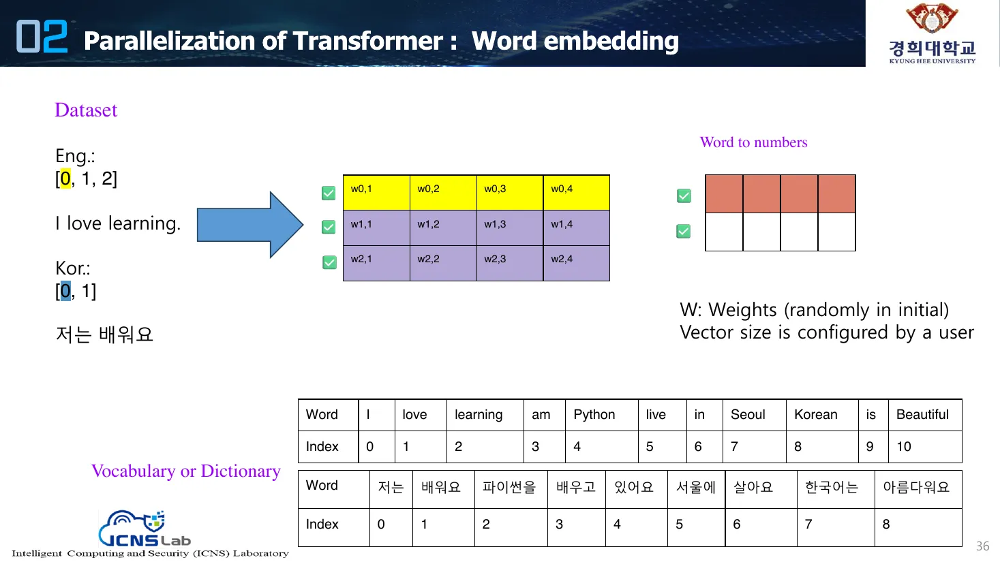

**직역**
> 02 트랜스포머의 병렬화: 단어 임베딩 (Parallelization of Transformer : Word embedding)
> 데이터셋 → 단어를 숫자로 (Word to numbers)
> 영어(Eng.): [0, 1, 2]  →  I love learning.
> 한국어(Kor.): [0, 1]  →  저는 배워요
>
> (가중치 행렬: w_{0,1} w_{0,2} w_{0,3} w_{0,4} / w_{1,1}…w_{1,4} / w_{2,1}…w_{2,4} — 각 단어 인덱스에 대응하는 임베딩 행)
> W: 가중치 (초기에는 무작위) (W: Weights (randomly in initial))
> 벡터 크기는 사용자가 설정한다 (Vector size is configured by a user)
>
> 어휘집 또는 사전 (인덱스 표 동일)

## 슬라이드 37

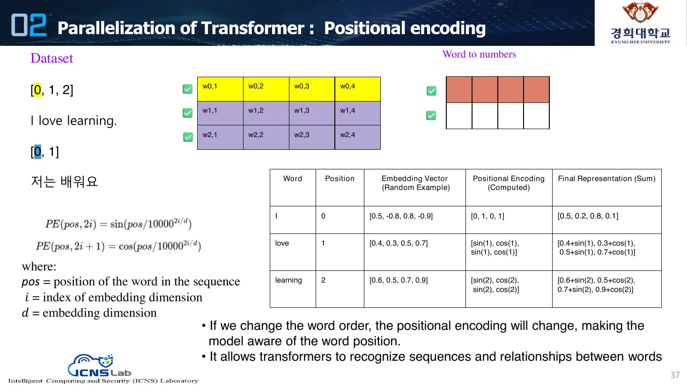

**직역**
> 02 트랜스포머의 병렬화: 위치 인코딩 (Parallelization of Transformer : Positional encoding)
> 데이터셋 → 단어를 숫자로
> [0, 1, 2] → I love learning.
> [0, 1] → 저는 배워요
> (가중치 행렬 w_{0,*}, w_{1,*}, w_{2,*})
>
> | 단어(Word) | 위치(Position) | 임베딩 벡터(Embedding Vector, 무작위 예시) | 위치 인코딩(Positional Encoding, 계산됨) | 최종 표현(Final Representation, 합) |
> | I | 0 | [0.5, -0.8, 0.8, -0.9] | [0, 1, 0, 1] | [0.5, 0.2, 0.8, 0.1] |
> | love | 1 | [0.4, 0.3, 0.5, 0.7] | [sin(1), cos(1), sin(1), cos(1)] | [0.4+sin(1), 0.3+cos(1), 0.5+sin(1), 0.7+cos(1)] |
> | learning | 2 | [0.6, 0.5, 0.7, 0.9] | [sin(2), cos(2), sin(2), cos(2)] | [0.6+sin(2), 0.5+cos(2), 0.7+sin(2), 0.9+cos(2)] |
>
> 여기서 (where):
> pos = 시퀀스에서 단어의 위치
> i = 임베딩 차원의 인덱스
> d = 임베딩 차원
>
> - 단어 순서를 바꾸면 위치 인코딩이 바뀌어, 모델이 단어 위치를 인식하게 된다.
> - 이를 통해 트랜스포머는 시퀀스와 단어 간의 관계를 인식할 수 있다.

## 슬라이드 38

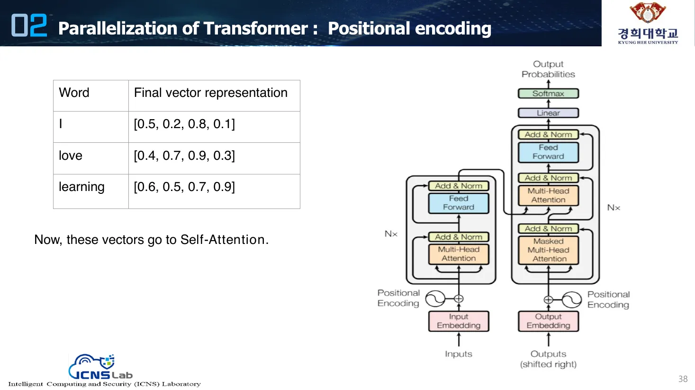

**직역**
> 02 트랜스포머의 병렬화: 위치 인코딩 (Parallelization of Transformer : Positional encoding)
>
> | 단어(Word) | 최종 벡터 표현(Final vector representation) |
> | I | [0.5, 0.2, 0.8, 0.1] |
> | love | [0.4, 0.7, 0.9, 0.3] |
> | learning | [0.6, 0.5, 0.7, 0.9] |
>
> 이제 이 벡터들은 셀프 어텐션(Self-Attention)으로 간다.

## 슬라이드 39

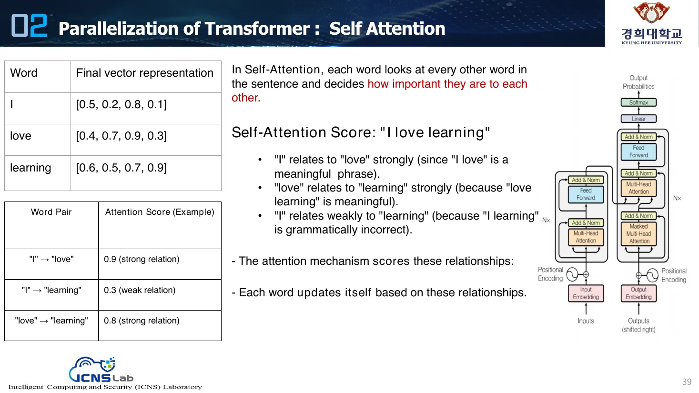

**직역**
> 02 트랜스포머의 병렬화: 셀프 어텐션 (Parallelization of Transformer : Self Attention)
>
> | 단어(Word) | 최종 벡터 표현 |
> | I | [0.5, 0.2, 0.8, 0.1] |
> | love | [0.4, 0.7, 0.9, 0.3] |
> | learning | [0.6, 0.5, 0.7, 0.9] |
>
> 셀프 어텐션에서, 각 단어는 문장의 다른 모든 단어를 살펴보고 서로 얼마나 중요한지를 결정한다.
>
> 셀프 어텐션 점수 (Self-Attention Score): "I love learning"
> - "I"는 "love"와 강하게 관련됨 ("I love"는 의미 있는 구이므로).
> - "love"는 "learning"과 강하게 관련됨 ("love learning"이 의미 있으므로).
> - "I"는 "learning"과 약하게 관련됨 ("I learning"은 문법적으로 틀리므로).
>
> | 단어 쌍(Word Pair) | 어텐션 점수(예시) |
> | "I" → "love" | 0.9 (강한 관계) |
> | "I" → "learning" | 0.3 (약한 관계) |
> | "love" → "learning" | 0.8 (강한 관계) |
>
> - 어텐션 메커니즘은 이 관계들에 점수를 매긴다.
> - 각 단어는 이 관계들을 바탕으로 자신을 갱신한다.

**설명**
- 어텐션은 단어의 중요도를 가중치로 두어 어디에 집중할지를 나타내는 메커니즘. 토크나이징해 숫자로 변환하고 딕셔너리를 만든 입력을, 이후 Query/Key/Value로 치환해 단어 간 관계를 계산함.

## 슬라이드 40

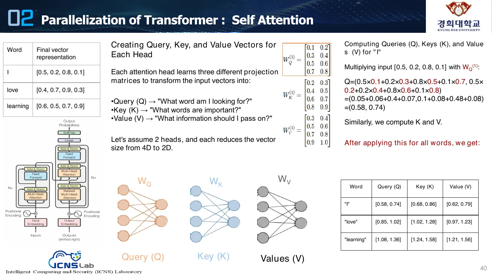

**직역**
> 02 트랜스포머의 병렬화: 셀프 어텐션 (Parallelization of Transformer : Self Attention)
>
> 각 헤드를 위한 Query, Key, Value 벡터 생성 (Creating Query, Key, and Value Vectors for Each Head)
> 각 어텐션 헤드는 입력 벡터를 다음으로 변환하기 위해 세 개의 서로 다른 투영 행렬(projection matrix)을 학습한다:
> - Query (Q) → "내가 찾고 있는 단어는 무엇인가?"
> - Key (K) → "어떤 단어들이 중요한가?"
> - Value (V) → "내가 전달해야 할 정보는 무엇인가?"
>
> 2개의 헤드가 있다고 가정하고, 각각이 벡터 크기를 4차원에서 2차원으로 줄인다고 하자.
> (다이어그램: 입력 → WQ, WK, WV 투영 → Query(Q), Key(K), Values(V))
>
> "I"에 대한 Q, K, V 계산 (Computing Queries (Q), Keys (K), and Values (V) for "I"):
> 입력 [0.5, 0.2, 0.8, 0.1]을 WQ(1)과 곱함:
> Q = (0.5×0.1+0.2×0.3+0.8×0.5+0.1×0.7, 0.5×0.2+0.2×0.4+0.8×0.6+0.1×0.8)
>   = (0.05+0.06+0.4+0.07, 0.1+0.08+0.48+0.08)
>   = (0.58, 0.74)
> 마찬가지로 K와 V를 계산한다. 모든 단어에 적용하면:
>
> | 단어(Word) | Query (Q) | Key (K) | Value (V) |
> | "I" | [0.58, 0.74] | [0.68, 0.86] | [0.62, 0.79] |
> | "love" | [0.85, 1.02] | [1.02, 1.28] | [0.97, 1.23] |
> | "learning" | [1.08, 1.36] | [1.24, 1.58] | [1.21, 1.56] |

**설명**
- Q/K/V의 역할: Query는 "무엇을 찾나", Key는 "무엇이 중요한 단어인가", Value는 "어떤 정보를 찾아야 하는가".
- Q·K로 단어와 단어의 관계를 구하고, 거기에 V값을 곱해주면 최종 스코어가 됨.

## 슬라이드 41

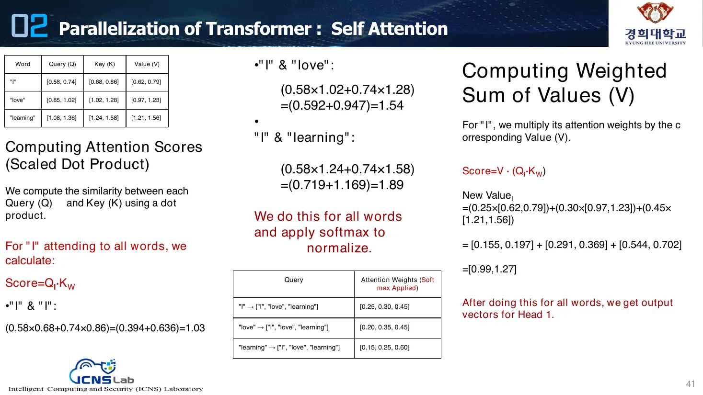

**직역**
> 02 트랜스포머의 병렬화: 셀프 어텐션 (Parallelization of Transformer : Self Attention)
>
> | 단어 | Query (Q) | Key (K) | Value (V) |
> | "I" | [0.58, 0.74] | [0.68, 0.86] | [0.62, 0.79] |
> | "love" | [0.85, 1.02] | [1.02, 1.28] | [0.97, 1.23] |
> | "learning" | [1.08, 1.36] | [1.24, 1.58] | [1.21, 1.56] |
>
> 어텐션 점수 계산 (Scaled Dot Product) (Computing Attention Scores)
> Query(Q)와 Key(K) 사이의 유사도를 내적(dot product)으로 계산한다.
> "I"가 모든 단어에 어텐션할 때:
> Score = Q_I · K_W
>
> - "I" & "I": (0.58×0.68+0.74×0.86) = (0.394+0.636) = 1.03
> - "I" & "love": (0.58×1.02+0.74×1.28) = (0.592+0.947) = 1.54
> - "I" & "learning": (0.58×1.24+0.74×1.58) = (0.719+1.169) = 1.89
>
> 모든 단어에 대해 이것을 하고 소프트맥스(softmax)를 적용해 정규화한다.
>
> | Query | 어텐션 가중치(Softmax 적용) |
> | "I" → ["I", "love", "learning"] | [0.25, 0.30, 0.45] |
> | "love" → ["I", "love", "learning"] | [0.20, 0.35, 0.45] |
> | "learning" → ["I", "love", "learning"] | [0.15, 0.25, 0.60] |
>
> 가중합 계산 (Computing Weighted Sum of Values (V))
> "I"에 대해, 그 어텐션 가중치를 대응하는 Value(V)에 곱한다.
> Score = V · (Q_I · K_W)
> New Value_I = (0.25×[0.62,0.79]) + (0.30×[0.97,1.23]) + (0.45×[1.21,1.56])
>             = [0.155, 0.197] + [0.291, 0.369] + [0.544, 0.702]
>             = [0.99, 1.27]
> 모든 단어에 대해 이렇게 하면 Head 1의 출력 벡터를 얻는다.

## 슬라이드 42

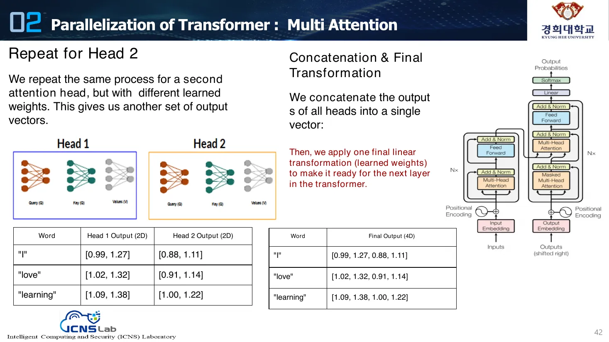

**직역**
> 02 트랜스포머의 병렬화: 멀티 어텐션 (Parallelization of Transformer : Multi Attention)
>
> Head 2 반복 (Repeat for Head 2)
> 같은 과정을 두 번째 어텐션 헤드에 대해 반복하되, 서로 다른 학습된 가중치를 사용한다. 이로써 또 다른 출력 벡터 집합을 얻는다.
>
> 연결 & 최종 변환 (Concatenation & Final Transformation)
> 모든 헤드의 출력을 하나의 벡터로 연결한다(concatenate):
> 그런 다음, 트랜스포머의 다음 레이어를 위해 준비되도록 마지막 선형 변환(학습된 가중치)을 한 번 적용한다.
>
> | 단어 | Head 1 출력(2D) | Head 2 출력(2D) |  | 단어 | 최종 출력(4D) |
> | "I" | [0.99, 1.27] | [0.88, 1.11] |  | "I" | [0.99, 1.27, 0.88, 1.11] |
> | "love" | [1.02, 1.32] | [0.91, 1.14] |  | "love" | [1.02, 1.32, 0.91, 1.14] |
> | "learning" | [1.09, 1.38] | [1.00, 1.22] |  | "learning" | [1.09, 1.38, 1.00, 1.22] |

**설명**
- HEAD가 2개면 한 문장을 처리할 때 같은 과정을 2번 돎(서로 다른 학습 가중치 사용). 이렇게 헤드/레이어 반복 횟수는 모델마다 다른데, GPT-3는 96번 반복함.

## 슬라이드 43

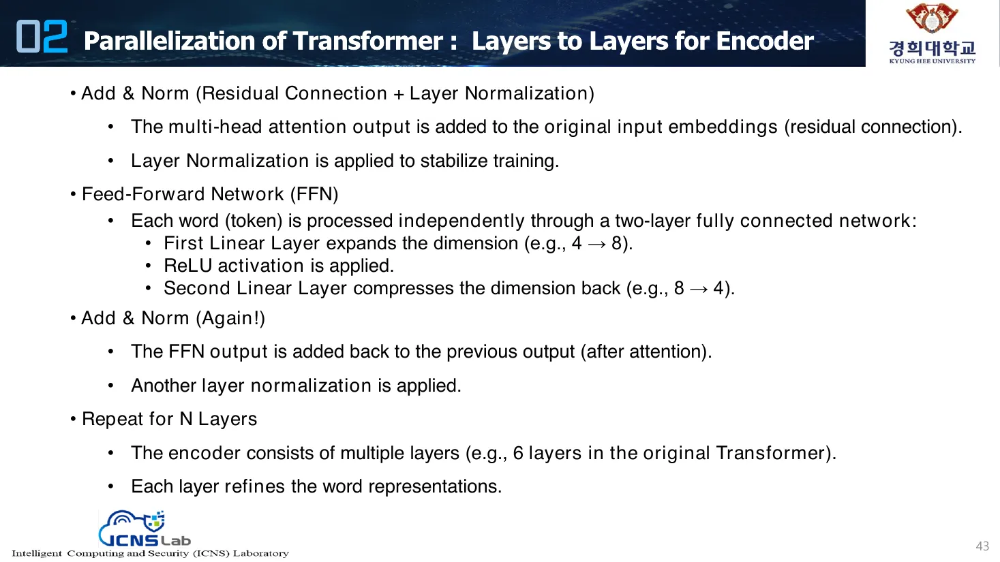

**직역**
> 02 트랜스포머의 병렬화: 인코더의 레이어에서 레이어로 (Parallelization of Transformer : Layers to Layers for Encoder)
> - Add & Norm (잔차 연결 + 레이어 정규화)
>   - 멀티헤드 어텐션 출력이 원래 입력 임베딩에 더해진다 (잔차 연결).
>   - 학습을 안정화하기 위해 레이어 정규화가 적용된다.
> - 피드포워드 네트워크 (FFN)
>   - 각 단어(토큰)는 2층 완전연결 네트워크를 통해 독립적으로 처리된다:
>     - 첫 번째 선형 레이어가 차원을 확장한다 (예: 4 → 8).
>     - ReLU 활성화가 적용된다.
>     - 두 번째 선형 레이어가 차원을 다시 압축한다 (예: 8 → 4).
> - Add & Norm (다시!)
>   - FFN 출력이 이전 출력(어텐션 후)에 다시 더해진다.
>   - 또 한 번의 레이어 정규화가 적용된다.
> - N개 레이어 반복
>   - 인코더는 여러 레이어로 구성된다 (예: 원래 트랜스포머에서 6개 레이어).
>   - 각 레이어는 단어 표현을 정제한다.

## 슬라이드 44

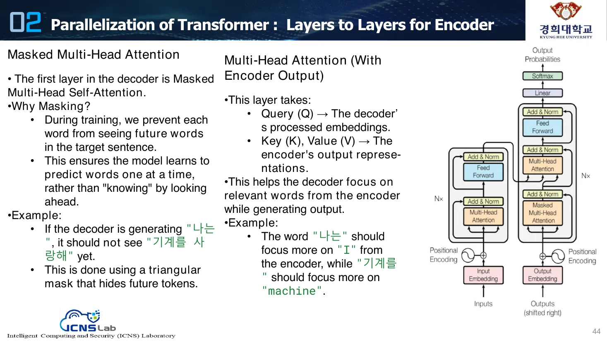

**직역**
> 02 트랜스포머의 병렬화: 인코더의 레이어에서 레이어로 (Parallelization of Transformer : Layers to Layers for Encoder)
>
> 마스킹된 멀티헤드 어텐션 (Masked Multi-Head Attention)
> - 디코더의 첫 번째 레이어는 마스킹된 멀티헤드 셀프 어텐션이다.
> - 왜 마스킹하는가?
>   - 학습 중에, 각 단어가 타깃 문장의 미래 단어를 보지 못하게 막는다.
>   - 이로써 모델이 앞을 "미리 알고" 예측하는 대신, 한 번에 한 단어씩 예측하도록 학습한다.
> - 예시:
>   - 디코더가 "나는"을 생성 중이라면, 아직 "기계를 사랑해"를 보면 안 된다.
>   - 이것은 미래 토큰을 가리는 삼각형 마스크(triangular mask)로 수행된다.
>
> 멀티헤드 어텐션 (인코더 출력과 함께) (Multi-Head Attention (With Encoder Output))
> - 이 레이어는 다음을 받는다:
>   - Query (Q) → 디코더의 처리된 임베딩.
>   - Key (K), Value (V) → 인코더의 출력 표현.
> - 이는 디코더가 출력을 생성하는 동안 인코더의 관련 단어에 집중하도록 돕는다.
> - 예시:
>   - 단어 "나는"은 인코더의 "I"에 더 집중해야 하고, "기계를"은 "machine"에 더 집중해야 한다.

## 슬라이드 45

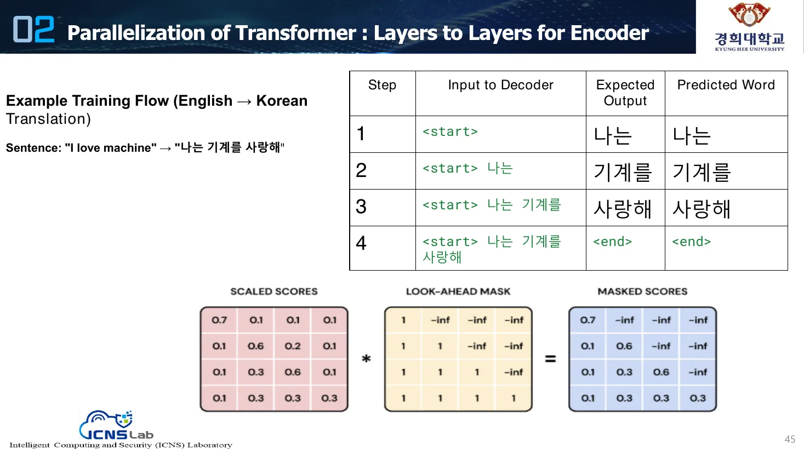

**직역**
> 02 트랜스포머의 병렬화: 인코더의 레이어에서 레이어로 (Parallelization of Transformer : Layers to Layers for Encoder)
>
> 예시 학습 흐름 (영어 → 한국어 번역) (Example Training Flow (English → Korean Translation))
> 문장: "I love machine" → "나는 기계를 사랑해"
>
> | 단계(Step) | 디코더 입력(Input to Decoder) | 기대 출력(Expected Output) | 예측 단어(Predicted Word) |
> | 1 | \<start\> | 나는 | 나는 |
> | 2 | \<start\> 나는 | 기계를 | 기계를 |
> | 3 | \<start\> 나는 기계를 | 사랑해 | 사랑해 |
> | 4 | \<start\> 나는 기계를 사랑해 | \<end\> | \<end\> |

## 슬라이드 46

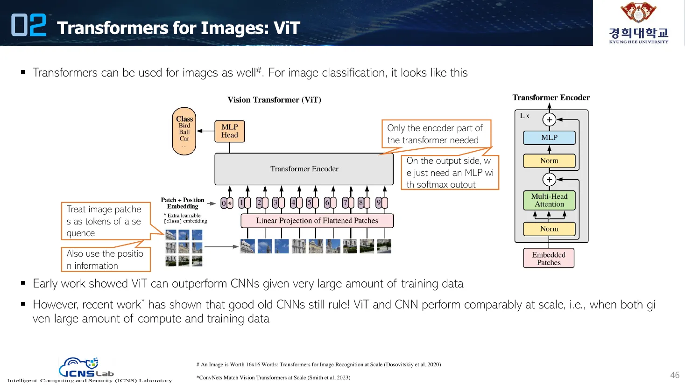

**직역**
> 02 이미지를 위한 트랜스포머: ViT (Transformers for Images: ViT)
> - 트랜스포머는 이미지에도 사용될 수 있다#. 이미지 분류의 경우 다음과 같이 생겼다.
>
> (다이어그램: Vision Transformer (ViT) 구조. 이미지를 패치(patch)들로 나눠 Linear Projection of Flattened Patches(평탄화된 패치의 선형 투영)에 넣고, Patch + Position Embedding(패치 + 위치 임베딩)을 더하며, 추가로 [class] 토큰을 둠. → Transformer Encoder → MLP Head → Class(예: Bird, Ball, Car…) 출력. 우측에는 Transformer Encoder 내부(Norm, Multi-Head Attention, Norm, MLP, Embedded Patches) 표시.)
> - 트랜스포머 인코더 부분만 필요 (Only the encoder part of the transformer needed)
> - 출력 쪽에는 소프트맥스 출력을 가진 MLP만 있으면 됨 (On the output side, we just need an MLP with softmax output)
> - 이미지 패치들을 시퀀스의 토큰들로 취급 (Treat image patches as tokens of a sequence)
> - 위치 정보도 사용 (Also use the position information)
>
> - 초기 연구는 ViT가 매우 많은 양의 학습 데이터가 주어지면 CNN을 능가할 수 있음을 보였다.
> - 그러나 최근 연구*는 좋은 옛날 CNN이 여전히 강력함을 보였다! ViT와 CNN은 스케일에서, 즉 둘 다 많은 양의 연산과 학습 데이터가 주어지면, 비슷하게 작동한다.
>
> # An Image is Worth 16x16 Words: Transformers for Image Recognition at Scale (Dosovitskiy et al, 2020)
> * ConvNets Match Vision Transformers at Scale (Smith et al, 2023)

**설명**
- ViT(Vision Transformer)는 이미지를 트랜스포머로 다루는 모델. RNN과 달리 전체 시퀀스(이미지 패치 전체)를 한 번에 사용하기 때문에 처음부터 병렬화를 타겟으로 만들어짐.
- NLP뿐 아니라 비전, 오디오, 시계열에서도 사용 가능. 단점은 계산 비용, 데이터 요구사항, 해석 가능성(interpretability).

## 슬라이드 47

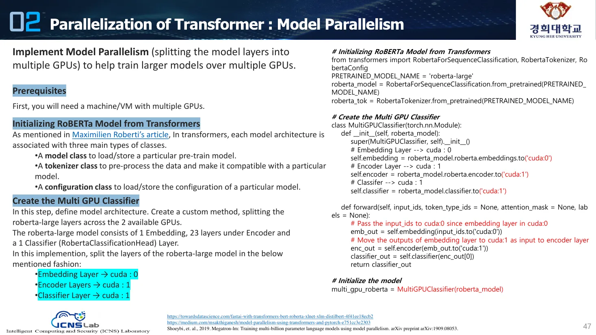

**직역**
> 02 트랜스포머의 병렬화: 모델 병렬화 (Parallelization of Transformer : Model Parallelism)
> 더 큰 모델을 여러 GPU에 걸쳐 학습하도록 돕기 위해 모델 병렬화(모델 레이어를 여러 GPU로 분할)를 구현한다.
>
> 사전 준비 (Prerequisites)
> 먼저, 여러 GPU를 가진 머신/VM이 필요하다.
>
> Transformers로부터 RoBERTa 모델 초기화 (Initializing RoBERTa Model from Transformers)
> Maximilien Roberti의 글에서 언급했듯, transformers에서 각 모델 아키텍처는 세 가지 주요 클래스와 연관된다.
> - 특정 사전학습 모델을 로드/저장하는 모델 클래스(model class).
> - 데이터를 전처리해 특정 모델과 호환되게 만드는 토크나이저 클래스(tokenizer class).
> - 특정 모델의 설정을 로드/저장하는 설정 클래스(configuration class).
>
> 멀티 GPU 분류기 생성 (Create the Multi GPU Classifier)
> 이 단계에서 모델 아키텍처를 정의한다. roberta-large 레이어를 가용한 2개 GPU에 걸쳐 분할하는 커스텀 메서드를 만든다.
> roberta-large 모델은 1개의 Embedding, Encoder 아래의 23개 레이어, 그리고 1개의 Classifier(RobertaClassificationHead) 레이어로 구성된다.
> 이 구현에서는 roberta-large 모델의 레이어를 아래와 같이 분할한다:
> - 임베딩 레이어 → cuda : 0
> - 인코더 레이어들 → cuda : 1
> - 분류기 레이어 → cuda : 1
>
> ```python
> # Initializing RoBERTa Model from Transformers
> from transformers import RobertaForSequenceClassification, RobertaTokenizer, RobertaConfig
> PRETRAINED_MODEL_NAME = 'roberta-large'
> roberta_model = RobertaForSequenceClassification.from_pretrained(PRETRAINED_MODEL_NAME)
> roberta_tok = RobertaTokenizer.from_pretrained(PRETRAINED_MODEL_NAME)
> # Create the Multi GPU Classifier
> class MultiGPUClassifier(torch.nn.Module):
>     def __init__(self, roberta_model):
>         super(MultiGPUClassifier, self).__init__()
>         # Embedding Layer --> cuda : 0
>         self.embedding = roberta_model.roberta.embeddings.to('cuda:0')
>         # Encoder Layer --> cuda : 1
>         self.encoder = roberta_model.roberta.encoder.to('cuda:1')
>         # Classifier --> cuda : 1
>         self.classifier = roberta_model.classifier.to('cuda:1')
>     def forward(self, input_ids, token_type_ids=None, attention_mask=None, labels=None):
>         # Pass the input_ids to cuda:0 since embedding layer in cuda:0
>         emb_out = self.embedding(input_ids.to('cuda:0'))
>         # Move the outputs of embedding layer to cuda:1 as input to encoder layer
>         enc_out = self.encoder(emb_out.to('cuda:1'))
>         classifier_out = self.classifier(enc_out[0])
>         return classifier_out
> # Initialize the model
> multi_gpu_roberta = MultiGPUClassifier(roberta_model)
> ```
> 출처: towardsdatascience.com, medium.com/@msakthiganesh
> Shoeybi, et. al., 2019. Megatron-lm: Training multi-billion parameter language models using model parallelism. arXiv:1909.08053.

## 슬라이드 48

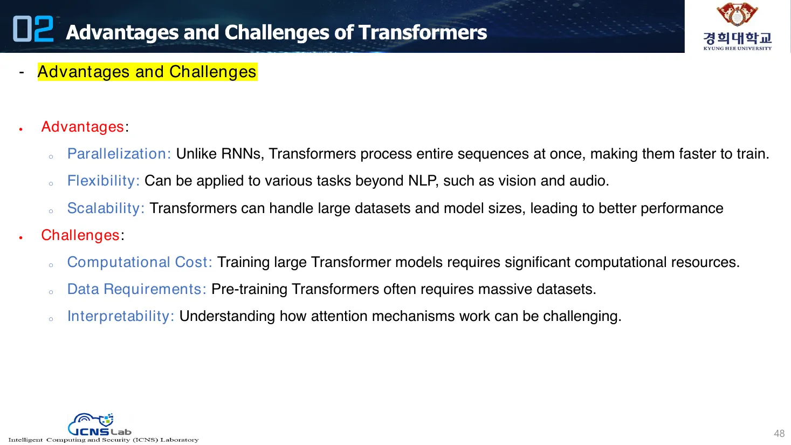

**직역**
> 02 트랜스포머의 장점과 도전 과제 (Advantages and Challenges of Transformers)
> - 장점과 도전 과제 (Advantages and Challenges)
>
> - 장점 (Advantages):
>   - 병렬화(Parallelization): RNN과 달리 트랜스포머는 전체 시퀀스를 한 번에 처리하여 학습이 더 빠르다.
>   - 유연성(Flexibility): NLP를 넘어 비전, 오디오 같은 다양한 작업에 적용할 수 있다.
>   - 확장성(Scalability): 트랜스포머는 큰 데이터셋과 모델 크기를 다룰 수 있어 더 나은 성능으로 이어진다.
> - 도전 과제 (Challenges):
>   - 연산 비용(Computational Cost): 큰 트랜스포머 모델 학습은 상당한 연산 자원을 요구한다.
>   - 데이터 요구량(Data Requirements): 트랜스포머 사전학습은 종종 거대한 데이터셋을 요구한다.
>   - 해석 가능성(Interpretability): 어텐션 메커니즘이 어떻게 동작하는지 이해하는 것이 어려울 수 있다.

## 슬라이드 49

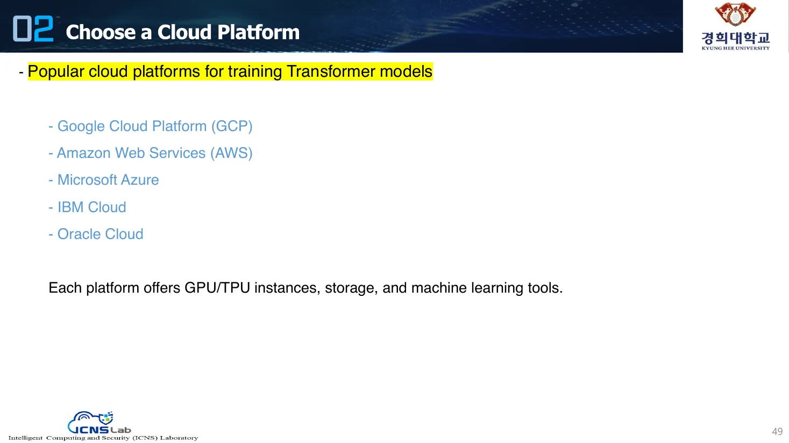

**직역**
> 02 클라우드 플랫폼 선택 (Choose a Cloud Platform)
> - 트랜스포머 모델 학습을 위한 인기 있는 클라우드 플랫폼
>
> - Google Cloud Platform (GCP)
> - Amazon Web Services (AWS)
> - Microsoft Azure
> - IBM Cloud
> - Oracle Cloud
>
> 각 플랫폼은 GPU/TPU 인스턴스, 스토리지, 머신러닝 도구를 제공한다.

## 슬라이드 50

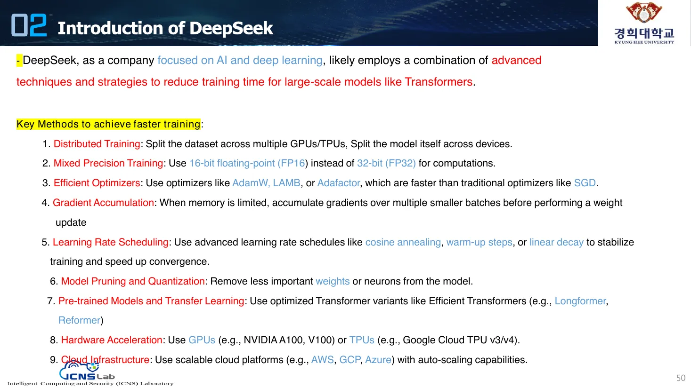

**직역**
> 02 DeepSeek 소개 (Introduction of DeepSeek)
> - DeepSeek은 AI와 딥러닝에 집중하는 회사로서, 트랜스포머 같은 대규모 모델의 학습 시간을 줄이기 위해 고급 기법과 전략의 조합을 사용할 가능성이 높다.
>
> 더 빠른 학습을 달성하는 핵심 방법들 (Key Methods to achieve faster training):
> 1. 분산 학습 (Distributed Training): 데이터셋을 여러 GPU/TPU에 걸쳐 분할하고, 모델 자체를 디바이스들에 걸쳐 분할.
> 2. 혼합 정밀도 학습 (Mixed Precision Training): 연산에 32비트(FP32) 대신 16비트 부동소수점(FP16) 사용.
> 3. 효율적인 옵티마이저 (Efficient Optimizers): SGD 같은 전통적 옵티마이저보다 빠른 AdamW, LAMB, Adafactor 같은 옵티마이저 사용.
> 4. 그래디언트 누적 (Gradient Accumulation): 메모리가 제한적일 때, 가중치 갱신을 수행하기 전에 여러 작은 배치에 걸쳐 그래디언트를 누적.
> 5. 학습률 스케줄링 (Learning Rate Scheduling): 코사인 어닐링, 워밍업 스텝, 선형 감쇠 같은 고급 학습률 스케줄을 사용해 학습을 안정화하고 수렴을 가속.
> 6. 모델 가지치기와 양자화 (Model Pruning and Quantization): 모델에서 덜 중요한 가중치나 뉴런을 제거.
> 7. 사전학습 모델과 전이학습 (Pre-trained Models and Transfer Learning): Efficient Transformers(예: Longformer, Reformer) 같은 최적화된 트랜스포머 변형 사용.
> 8. 하드웨어 가속 (Hardware Acceleration): GPU(예: NVIDIA A100, V100)나 TPU(예: Google Cloud TPU v3/v4) 사용.
> 9. 클라우드 인프라 (Cloud Infrastructure): 오토스케일링이 가능한 확장형 클라우드 플랫폼(예: AWS, GCP, Azure) 사용.

**설명**
- 모델 경쟁은 곧 "시간 싸움"이며, DeepSeek은 효율성을 거의 절반 수준으로 끌어올려 저급 노드로도 학습을 빨리 끝냈다고 언급됨.

## 슬라이드 51


**직역**
> Intelligent Computing and Security (ICNS) Laboratory
>
> Q&A
