> 원본 슬라이드를 슬라이드별로 직역하고 강의 녹취 설명을 함께 정리한 노트.
> [← 전체 목차](/posts/ain-overview/)

## 슬라이드 1

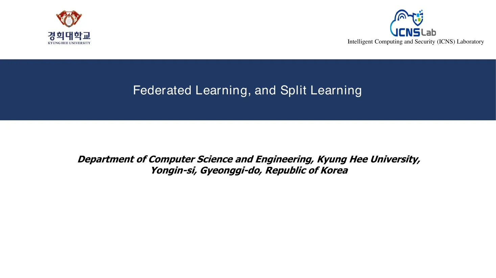

**직역**
> (상단) 경희대학교(KYUNG HEE UNIVERSITY) / 지능형 컴퓨팅 및 보안 연구실(Intelligent Computing and Security (ICNS) Laboratory)
>
> **연합 학습, 그리고 스플릿 러닝(Federated Learning, and Split Learning)**
>
> 컴퓨터공학과(Department of Computer Science and Engineering), 경희대학교(Kyung Hee University), 대한민국 경기도 용인시(Yongin-si, Gyeonggi-do, Republic of Korea)

## 슬라이드 2

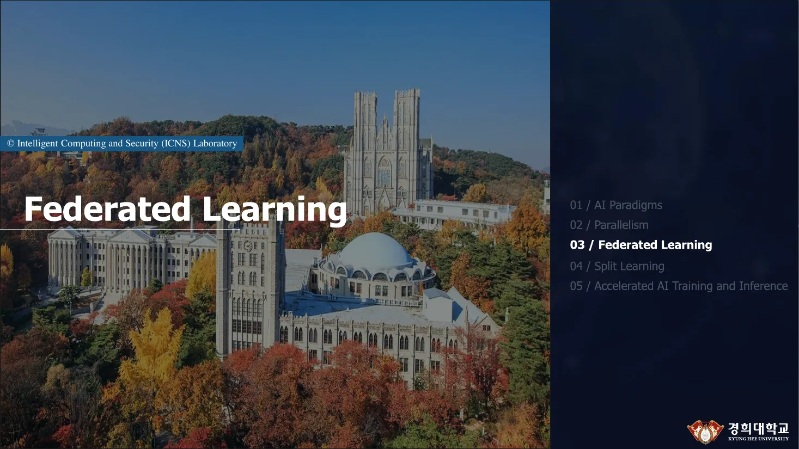

**직역**
> © 지능형 컴퓨팅 및 보안(ICNS) 연구실
>
> **연합 학습(Federated Learning)**
>
> 01 / AI 패러다임(AI Paradigms)
> 02 / 병렬성(Parallelism)
> 03 / 연합 학습(Federated Learning)
> 04 / 스플릿 러닝(Split Learning)
> 05 / 가속화된 AI 학습 및 추론(Accelerated AI Training and Inference)

## 슬라이드 3

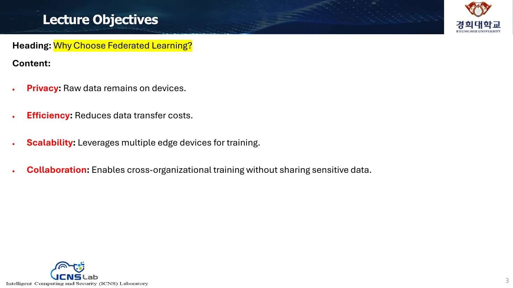

**직역**
> **강의 목표(Lecture Objectives)**
> 제목: 왜 연합 학습을 선택하는가?(Why Choose Federated Learning?)
> 내용:
> - 프라이버시(Privacy): 원시 데이터(raw data)가 디바이스에 그대로 남아 있다.
> - 효율성(Efficiency): 데이터 전송 비용을 줄인다.
> - 확장성(Scalability): 학습을 위해 다수의 엣지 디바이스(edge devices)를 활용한다.
> - 협력(Collaboration): 민감한 데이터를 공유하지 않고도 조직 간(cross-organizational) 학습을 가능하게 한다.

**설명**
- 연합학습이 나온 배경: 데이터가 많아야 모델 정확도가 올라가지만, 개인 데이터는 학습 서버로 올리기 부담스럽다(프라이버시). 예를 들어 A병원에 무좀 사진 5만 장이 있어도 특정 형태(발가락 위 무좀)는 10장뿐이라 모델을 잘 못 만들고, 다른 병원 데이터가 필요하지만 개인 허락 없이는 못 준다. 영국·미국 등은 데이터 이동을 법적으로 금지한다.
- 두 번째 이유는 데이터 전송 비용이다. 데이터 양이 많을수록 통신 오버헤드·저장 비용이 커지고 중앙집중 학습은 느리다.
- 정리하면 연합학습을 하는 이유는 4가지다: ① Privacy(프라이버시 이슈로 데이터를 못 가져올 때), ② Efficiency(한곳으로 데이터를 모을 때 생기는 통신 오버헤드 회피), ③ Scalability(엣지 디바이스에서의 훈련 활용), ④ Collaboration(협업).

## 슬라이드 4

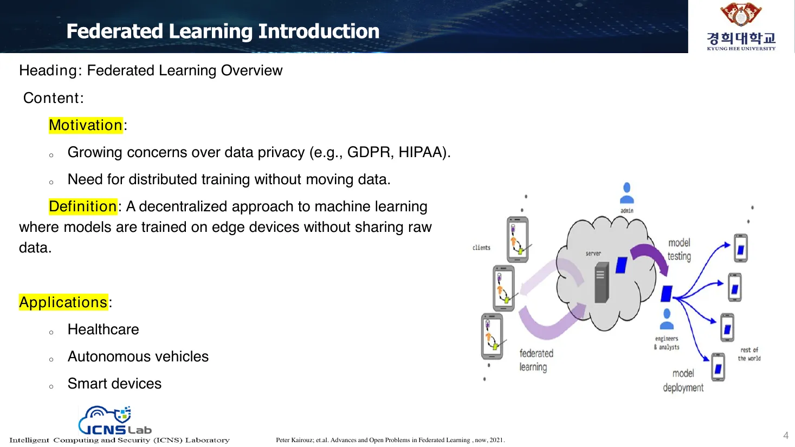

**직역**
> **연합 학습 소개(Federated Learning Introduction)**
> 제목: 연합 학습 개요(Federated Learning Overview)
> 내용:
> 동기(Motivation):
> - 데이터 프라이버시에 대한 우려 증가(예: GDPR, HIPAA).
> - 데이터를 이동하지 않고 분산 학습(distributed training)을 할 필요성.
>
> 정의(Definition): 원시 데이터(raw data)를 공유하지 않고 엣지 디바이스(edge devices)에서 모델을 학습하는, 머신러닝에 대한 탈중앙화 접근법(decentralized approach).
>
> 응용(Applications):
> - 헬스케어(Healthcare)
> - 자율주행 차량(Autonomous vehicles)
> - 스마트 디바이스(Smart devices)
>
> (출처) Peter Kairouz; et.al. *Advances and Open Problems in Federated Learning*, now, 2021.

**설명**
- 그래서 나온 것이 연합학습이다. 원시 데이터를 공유하지 않고 엣지에서 학습하는 분산 접근으로, 각자의 컴퓨터(핸드폰 포함)가 하나의 엣지 노드가 된다. 헬스케어, 자율주행차, 스마트 디바이스 등에서 활용된다.

## 슬라이드 5

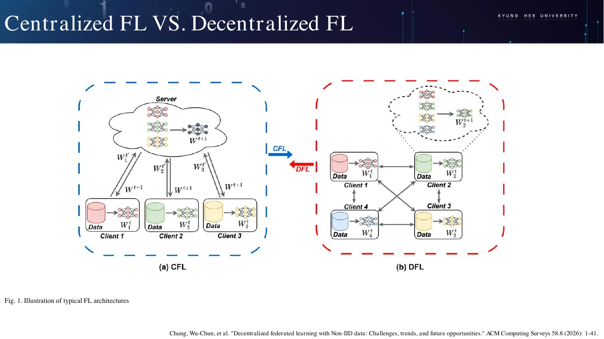

**직역**
> **중앙집중형 FL 대 탈중앙화 FL(Centralized FL VS. Decentralized FL)**
>
> (그림) 왼쪽 (a) CFL: 클라우드 안에 서버(Server)가 있고, 각 클라이언트(Client 1, 2, 3)가 자기 데이터(Data)로 W₁ᵗ, W₂ᵗ, W₃ᵗ 를 만들어 서버로 올리면(↑), 서버가 합쳐 다음 라운드 글로벌 가중치 Wᵗ⁺¹ 를 각 클라이언트로 내려보낸다(↓).
> 오른쪽 (b) DFL: 중앙 서버 없이 클라이언트들(Client 1~4)이 각자 데이터와 가중치(W₁ᵗ ... W₄ᵗ)를 가지고 서로(피어 간) 직접 교환·공유하여 Wₖᵗ⁺¹ 를 만든다.
>
> 그림 1. 전형적인 FL 아키텍처 예시(Fig. 1. Illustration of typical FL architectures)
>
> (출처) Chung, Wu-Chun, et al. "Decentralized federated learning with Non-IID data: Challenges, trends, and future opportunities." ACM Computing Surveys 58.8 (2026): 1-41.

**설명**
- 두 가지 구조가 있다. **Centralized FL**: 중앙 서버 하나에 여러 클라이언트가 학습한 뒤 모델 파라미터만 올려 서버에서 취합·평균하며, 모두 동일한 네트워크(모델)를 사용한다. **Decentralized FL**: 서버 없이 P2P(피어) 개념으로 함께 만들고 공유한다.
- Decentralized FL은 중앙 서버 부하가 없는 대신, 각 노드 사이의 속도 조절이 필요하고 정확도 이슈도 생긴다(특정 노드의 데이터가 부정확할 수 있음) → 더 정확한 쪽의 가중치를 더 주는 방식 등으로 해결한다. (실습은 1번 중앙화 방식으로 진행)

## 슬라이드 6

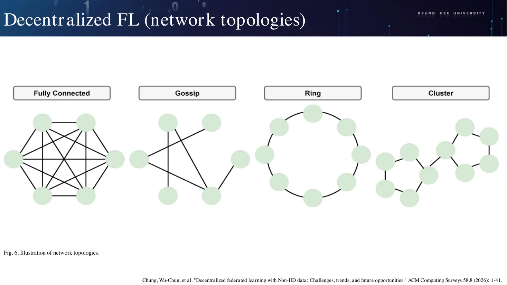

**직역**
> **탈중앙화 FL (네트워크 토폴로지)(Decentralized FL (network topologies))**
>
> (그림 4종, 각 노드를 선으로 연결)
> - 완전 연결(Fully Connected): 모든 노드가 서로 연결됨.
> - 가십(Gossip): 노드들이 무작위/부분적으로 연결됨.
> - 링(Ring): 노드들이 고리 형태로 연결됨.
> - 클러스터(Cluster): 노드들이 군집으로 묶여 연결됨.
>
> 그림 6. 네트워크 토폴로지 예시(Fig. 6. Illustration of network topologies)
>
> (출처) Chung, Wu-Chun, et al. "Decentralized federated learning with Non-IID data: Challenges, trends, and future opportunities." ACM Computing Surveys 58.8 (2026): 1-41.

**설명**
- Decentralized 토폴로지: 풀 커넥티드(모든 노드가 서로 연결되어 통신량이 과다), **링(ring)** 형(돌아가며 교환 — 한 노드가 정체되면 전체가 느려진다), **클러스터(cluster)** 형(가깝거나 유사한 노드끼리 묶어 합침 — 장점이 많은 방식)이 있다. 전부 네트워크 관련 이슈다.

## 슬라이드 7

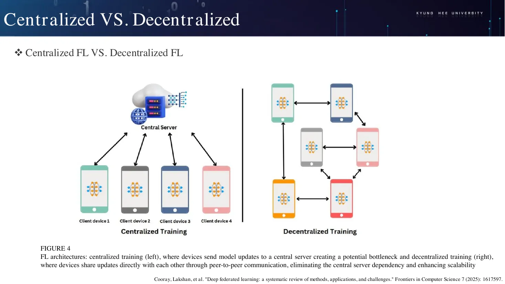

**직역**
> **중앙집중 대 탈중앙화(Centralized VS. Decentralized)**
> ❖ 중앙집중형 FL 대 탈중앙화 FL(Centralized FL VS. Decentralized FL)
>
> (그림) 왼쪽 — 중앙집중 학습(Centralized Training): 중앙 서버(Central Server)가 있고 클라이언트 디바이스(Client device 1~4)들이 서버와 양방향으로 연결됨.
> 오른쪽 — 탈중앙화 학습(Decentralized Training): 디바이스들이 서로 직접(피어 간) 연결됨.
>
> 그림 4(FIGURE 4)
> FL 아키텍처: 중앙집중 학습(왼쪽)은 디바이스가 중앙 서버로 모델 업데이트를 보내며 잠재적 병목(bottleneck)을 만들고, 탈중앙화 학습(오른쪽)은 디바이스가 P2P 통신을 통해 서로 직접 업데이트를 공유하여 중앙 서버 의존성을 제거하고 확장성을 높인다.
>
> (출처) Cooray, Lakshan, et al. "Deep federated learning: a systematic review of methods, applications, and challenges." Frontiers in Computer Science 7 (2025): 1617597.

## 슬라이드 8

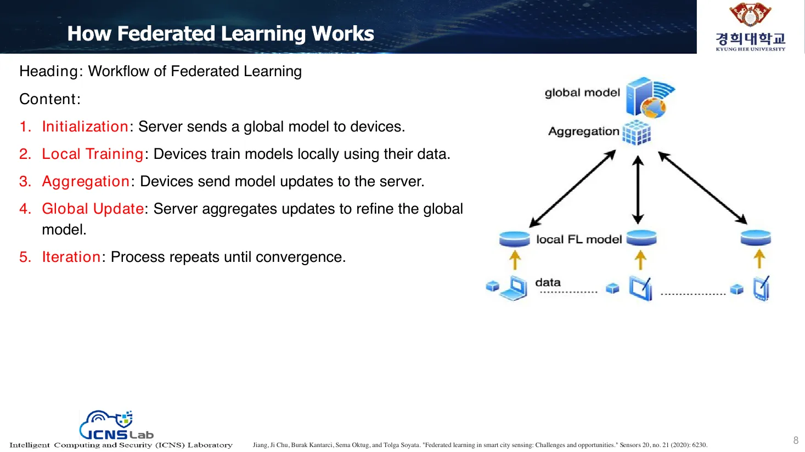

**직역**
> **연합 학습은 어떻게 동작하는가(How Federated Learning Works)**
> 제목: 연합 학습의 워크플로(Workflow of Federated Learning)
> 내용:
> 1. 초기화(Initialization): 서버가 글로벌 모델(global model)을 디바이스들에 보낸다.
> 2. 로컬 학습(Local Training): 디바이스들이 자신의 데이터를 사용해 로컬에서 모델을 학습한다.
> 3. 집계(Aggregation): 디바이스들이 모델 업데이트를 서버로 보낸다.
> 4. 글로벌 갱신(Global Update): 서버가 업데이트들을 집계하여 글로벌 모델을 개선한다.
> 5. 반복(Iteration): 수렴할 때까지 과정을 반복한다.
>
> (그림) 디바이스의 데이터(data) → 로컬 FL 모델(local FL model)을 학습 → 위로 업로드 → 글로벌 모델(global model)에서 집계(Aggregation) → 다시 아래로 배포.
>
> (출처) Jiang, Ji Chu, Burak Kantarci, Sema Oktug, and Tolga Soyata. "Federated learning in smart city sensing: Challenges and opportunities." Sensors 20, no. 21 (2020): 6230.

**설명**
- 기존 방식은 데이터를 모두 올려 중앙(centralized) 서버가 학습해 모델을 만들어 배포하는 것이다.
- 연합학습은 서버가 모델 아키텍처(구조)를 정의 → 로컬에 배포 → 각 로컬이 자기 데이터로 학습 → 한 라운드(또는 한 에폭)마다 파라미터만 서버로 교환 → 서버가 합침(aggregation, 평균화) → 다시 배포 → 반복한다. 데이터는 보내지 않고 파라미터만 주고받는다.

## 슬라이드 9

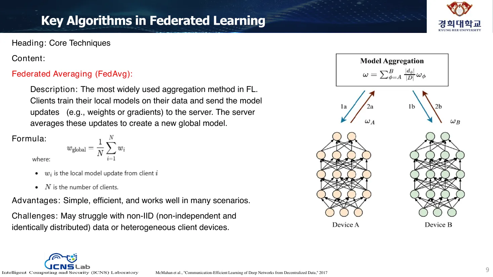

**직역**
> **연합 학습의 핵심 알고리즘(Key Algorithms in Federated Learning)**
> 제목: 핵심 기법(Core Techniques)
> 내용:
> **연합 평균화(Federated Averaging, FedAvg):**
> 설명: FL에서 가장 널리 쓰이는 집계 방법. 클라이언트가 자신의 데이터로 로컬 모델을 학습하고 모델 업데이트(예: 가중치 또는 그래디언트)를 서버로 보낸다. 서버는 이 업데이트들을 평균하여 새로운 글로벌 모델을 만든다.
> 공식:
> $$w_{\text{global}} = \frac{1}{N} \sum_{i=1}^{N} w_i$$
> where(여기서):
> - $w_i$ 는 클라이언트 $i$ 의 로컬 모델 업데이트.
> - $N$ 은 클라이언트의 수.
>
> 장점(Advantages): 단순하고 효율적이며 많은 시나리오에서 잘 동작한다.
> 도전 과제(Challenges): non-IID(독립적이고 동일하게 분포되지 않은) 데이터나 이질적인(heterogeneous) 클라이언트 디바이스에서는 어려움을 겪을 수 있다.
>
> (그림) 모델 집계(Model Aggregation): $w \leftarrow \frac{1}{N}\sum w_i$ — Device A, Device B의 신경망 가중치를 평균.
>
> (출처) McMahan et al., "Communication-Efficient Learning of Deep Networks from Decentralized Data," 2017

**설명**
- **단순 평균(FedAvg 개념)**: 각 노드가 1라운드 돌리면 파라미터(예: a0, a1...)가 나오는데 노드별로 값이 다르다 → 두 값의 평균((a0+a1)/2)으로 파라미터를 고쳐 다시 학습한다. 노드가 많으면 전부 평균화해 다시 배포한다.

## 슬라이드 10

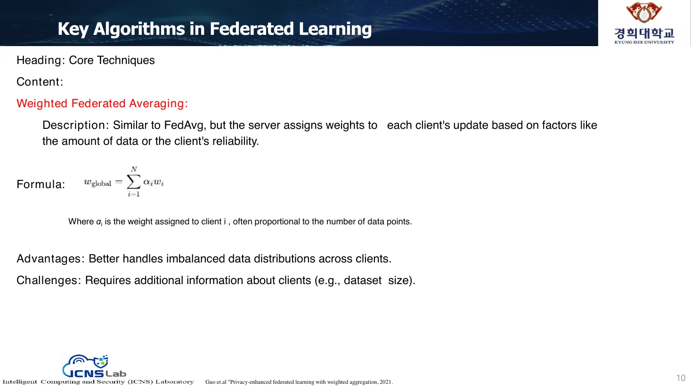

**직역**
> **연합 학습의 핵심 알고리즘(Key Algorithms in Federated Learning)**
> 제목: 핵심 기법(Core Techniques)
> 내용:
> **가중 연합 평균화(Weighted Federated Averaging):**
> 설명: FedAvg와 유사하지만, 서버가 데이터 양이나 클라이언트의 신뢰도 같은 요소에 따라 각 클라이언트의 업데이트에 가중치를 부여한다.
> 공식:
> $$w_{\text{global}} = \sum_{i=1}^{N} \alpha_i w_i$$
> 여기서 $\alpha_i$ 는 클라이언트 $i$ 에 부여된 가중치로, 종종 데이터 포인트 수에 비례한다.
>
> 장점(Advantages): 클라이언트 간 불균형한 데이터 분포를 더 잘 처리한다.
> 도전 과제(Challenges): 클라이언트에 대한 추가 정보(예: 데이터셋 크기)가 필요하다.
>
> (출처) Guo et.al "Privacy-enhanced federated learning with weighted aggregation, 2021.

**설명**
- **Weighted Aggregation**: 클라이언트의 신뢰도 또는 데이터 양에 따라 가중치를 줘서 평균한다.

## 슬라이드 11

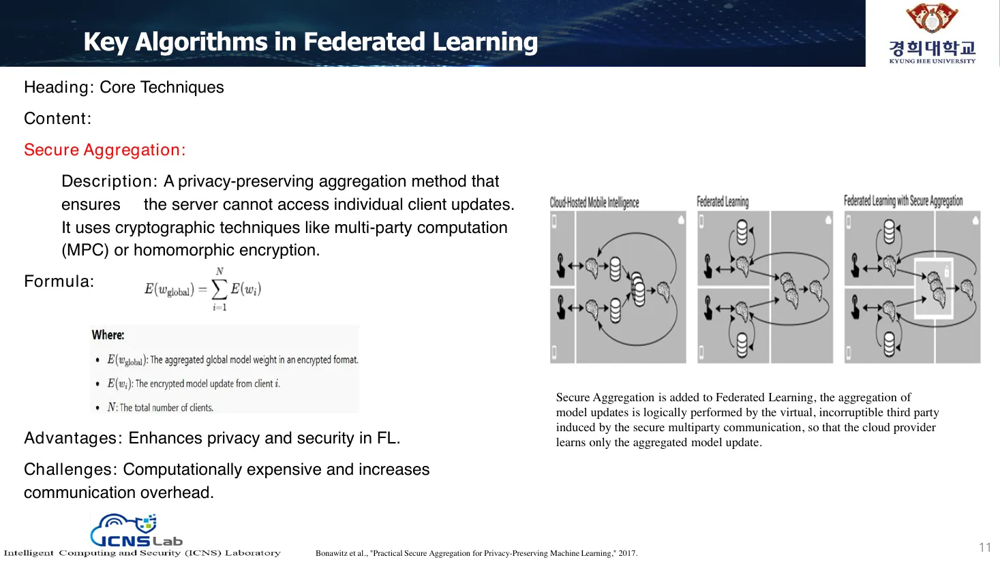

**직역**
> **연합 학습의 핵심 알고리즘(Key Algorithms in Federated Learning)**
> 제목: 핵심 기법(Core Techniques)
> 내용:
> **보안 집계(Secure Aggregation):**
> 설명: 서버가 개별 클라이언트 업데이트에 접근할 수 없도록 보장하는 프라이버시 보존(privacy-preserving) 집계 방법. 다자간 연산(multi-party computation, MPC)이나 동형 암호(homomorphic encryption) 같은 암호 기법을 사용한다.
> 공식:
> $$E(w_{\text{global}}) = \sum_{i=1}^{N} E(w_i)$$
> Where(여기서):
> - $E(w_{\text{global}})$ : 암호화된 형식의 집계된 글로벌 모델 가중치.
> - $E(w_i)$ : 클라이언트 $i$ 의 암호화된 모델 업데이트.
>
> 장점(Advantages): FL의 프라이버시와 보안을 강화한다.
> 도전 과제(Challenges): 연산 비용이 크고 통신 오버헤드가 증가한다.
>
> (우측 그림 설명) Secure Aggregation이 연합 학습에 추가되면, 모델 업데이트의 집계가 보안 다자간 통신으로 유도되는 가상의 변조 불가능한(incorruptible) 제3자에 의해 논리적으로 수행되어, 클라우드 제공자는 집계된 모델 업데이트만 알게 된다.
>
> (출처) Bonawitz et al., "Practical Secure Aggregation for Privacy-Preserving Machine Learning," 2017.

**설명**
- **암호화 기반**: 프라이버시 때문에 파라미터 자체를 암호화해 전송한다(보안 고려).

## 슬라이드 12

**직역**
> **연합 학습의 핵심 알고리즘(Key Algorithms in Federated Learning)**
> 제목: 핵심 기법(Core Techniques)
> 내용:
> **연합 확률적 분산 감소 그래디언트(Federated Stochastic Variance Reduced Gradient, FSVRG):**
> 설명: 그래디언트 업데이트의 분산(variance)을 줄여 수렴을 개선하는 최적화 기반 집계 방법.
> 공식:
> $$w^{t+1} = w^t - \eta \left( \nabla f_i(w^t) - \nabla f_i(\tilde{w}) + \nabla F(\tilde{w}) \right)$$
> Where(여기서):
> - $w^t$ : 반복 $t$ 에서의 모델 가중치.
> - $w^{t+1}$ : 반복 $t+1$ 에서의 갱신된 모델 가중치.
> - $\eta$ : 학습률(learning rate).
> - $\nabla f_i(w^t)$ : 가중치 $w^t$ 에서 클라이언트 $i$ 의 손실 함수에 대한 확률적 그래디언트.
> - $\nabla f_i(\tilde{w})$ : 분산 감소된 확률적 그래디언트 추정값.
> - $\nabla F(\tilde{w})$ : 기준 가중치 $\tilde{w}$ 에서 평가된 전체(full) 그래디언트.
>
> 장점(Advantages): 경우에 따라 FedAvg보다 빠른 수렴.
> 도전 과제(Challenges): 더 복잡하고 연산 부담이 크다.
>
> (출처) Dinh, Canh T., et al. "Federated learning with proximal stochastic variance reduced gradient algorithms." Proceedings of the 49th International Conference on Parallel Processing, pp. 1-11. 2020.

**설명**
- **분산/통계 기반(variance reduction)**: 모델 weight나 loss function의 그래디언트 통계(분포)를 보고 일정 범위 안에서 커버한다. 너무 큰 값은 걸러낸다.

## 슬라이드 13

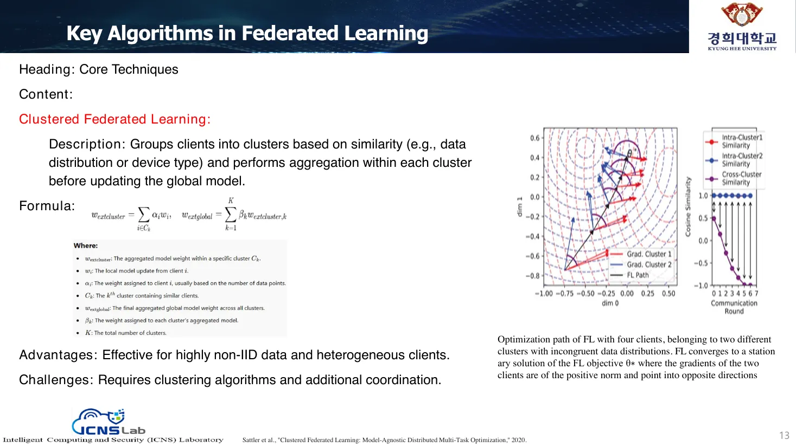

**직역**
> **연합 학습의 핵심 알고리즘(Key Algorithms in Federated Learning)**
> 제목: 핵심 기법(Core Techniques)
> 내용:
> **클러스터형 연합 학습(Clustered Federated Learning):**
> 설명: 유사성(예: 데이터 분포 또는 디바이스 타입)을 기준으로 클라이언트를 클러스터로 묶고, 글로벌 모델을 갱신하기 전에 각 클러스터 내에서 집계를 수행한다.
> 공식:
> $$w_{\text{cluster}} = \sum_{i \in C_k} \alpha_i w_i, \quad w_{\text{global}} = \sum_{k=1}^{K} \beta_k w_{\text{cluster},k}$$
> Where(여기서):
> - $w_{\text{cluster}}$ : 특정 클러스터 $C_k$ 내에서 집계된 모델 가중치.
> - $w_i$ : 클라이언트 $i$ 의 로컬 모델 업데이트.
> - $\alpha_i$ : 클라이언트 $i$ 에 부여된 가중치, 보통 데이터 포인트 수 기반.
> - $C_k$ : 유사한 클라이언트를 포함하는 $k$ 번째 클러스터.
> - $w_{\text{global}}$ : 모든 클러스터에 걸친 최종 집계 글로벌 모델 가중치.
> - ($\beta_k$ : 각 클러스터에 부여된 가중치 — 슬라이드 하단 일부 잘림)
>
> 장점(Advantages): 매우 non-IID한 데이터와 이질적 클라이언트에 효과적.
> 도전 과제(Challenges): 클러스터링 알고리즘과 추가 조정(coordination)이 필요.
>
> (우측 그림) 일치하지 않는(incongruent) 데이터 분포를 가진 두 개의 서로 다른 클러스터에 속한 4개 클라이언트의 FL 최적화 경로. FL은 두 클라이언트의 그래디언트가 양의 노름(norm)을 가지면서 서로 반대 방향을 가리키는 FL 목적함수의 정류(stationary) 해 θ* 로 수렴한다.
>
> (출처) Sattler et al., "Clustered Federated Learning: Model-Agnostic Distributed Multi-Task Optimization," 2020.

**설명**
- **클러스터 기반**: 유사한 파라미터/데이터 분포/디바이스 타입을 가진 클라이언트끼리 묶어(similarity grouping) aggregation을 수행한다.

## 슬라이드 14

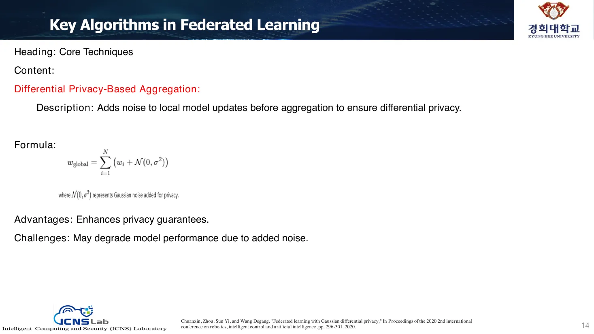

**직역**
> **연합 학습의 핵심 알고리즘(Key Algorithms in Federated Learning)**
> 제목: 핵심 기법(Core Techniques)
> 내용:
> **차등 프라이버시 기반 집계(Differential Privacy-Based Aggregation):**
> 설명: 차등 프라이버시(differential privacy)를 보장하기 위해 집계 전에 로컬 모델 업데이트에 노이즈를 추가한다.
> 공식:
> $$w_{\text{global}} = \sum_{i=1}^{N} \left( w_i + \mathcal{N}(0, \sigma^2) \right)$$
> 여기서 $\mathcal{N}(0, \sigma^2)$ 은 프라이버시를 위해 추가되는 가우시안 노이즈(Gaussian noise)를 나타낸다.
>
> 장점(Advantages): 프라이버시 보장을 강화한다.
> 도전 과제(Challenges): 추가된 노이즈로 인해 모델 성능이 저하될 수 있다.
>
> (출처) Chuanxin, Zhou, Sun Yi, and Wang Degang. "Federated learning with Gaussian differential privacy." Proceedings of the 2020 2nd international conference on robotics, intelligent control and artificial intelligence, pp. 296-301. 2020.

**설명**
- **Differential Privacy 기반(차등 프라이버시)**: 전송(마이그레이션) 전 로컬 모델 파라미터에 노이즈를 더하고 빼서 원본 대신 전송한다. 노이즈는 대부분 가우시안 분포를 따르게 한다.

## 슬라이드 15

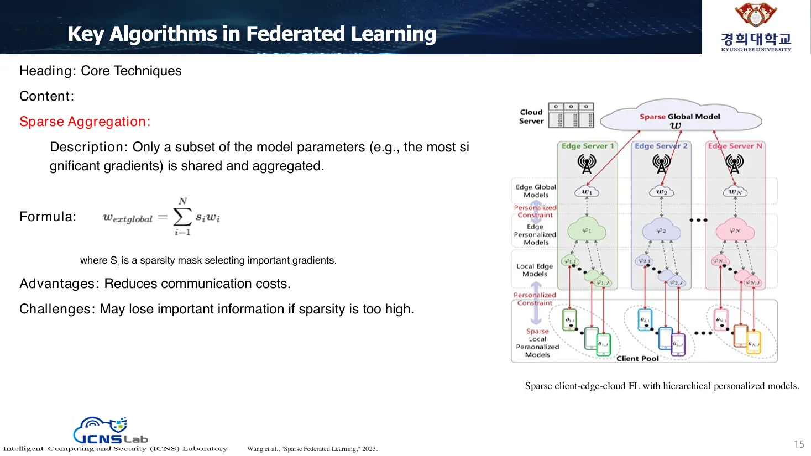

**직역**
> **연합 학습의 핵심 알고리즘(Key Algorithms in Federated Learning)**
> 제목: 핵심 기법(Core Techniques)
> 내용:
> **희소 집계(Sparse Aggregation):**
> 설명: 모델 파라미터의 일부(예: 가장 유의미한 그래디언트)만 공유하고 집계한다.
> 공식:
> $$w_{\text{global}} = \sum_{i=1}^{N} S_i w_i$$
> 여기서 $S_i$ 는 중요한 그래디언트를 선택하는 희소성 마스크(sparsity mask)이다.
>
> 장점(Advantages): 통신 비용을 줄인다.
> 도전 과제(Challenges): 희소성이 너무 높으면 중요한 정보를 잃을 수 있다.
>
> (우측 그림) 계층적 개인화 모델을 갖춘 희소 클라이언트-엣지-클라우드 FL(Sparse client-edge-cloud FL with hierarchical personalized models).
>
> (출처) Wang et al., "Sparse Federated Learning," 2023.

**설명**
- **Sparse Aggregation(희소 집계)**: 모든 파라미터가 아니라 중요한 특징(변동이 큰) 파라미터만 골라 전송하여 통신량을 줄인다.

## 슬라이드 16

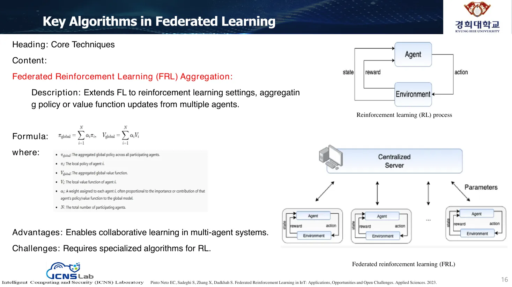

**직역**
> **연합 학습의 핵심 알고리즘(Key Algorithms in Federated Learning)**
> 제목: 핵심 기법(Core Techniques)
> 내용:
> **연합 강화학습(Federated Reinforcement Learning, FRL) 집계:**
> 설명: FL을 강화학습(reinforcement learning) 환경으로 확장하여, 다수 에이전트의 정책(policy) 또는 가치 함수(value function) 업데이트를 집계한다.
> 공식:
> $$\pi_{\text{global}} = \sum_{i=1}^{N} \alpha_i \pi_i, \quad V_{\text{global}} = \sum_{i=1}^{N} \alpha_i V_i$$
> where(여기서):
> - $\pi_{\text{global}}$ : 참여한 모든 에이전트에 걸친 집계 글로벌 정책.
> - $\pi_i$ : 에이전트 $i$ 의 로컬 정책.
> - $V_{\text{global}}$ : 집계된 글로벌 가치 함수.
> - $V_i$ : 에이전트 $i$ 의 로컬 가치 함수.
> - $\alpha_i$ : 각 에이전트 $i$ 에 부여된 가중치, 종종 해당 에이전트의 정책/가치 함수가 글로벌 모델에 기여하는 중요도에 비례.
> - $N$ : 참여 에이전트의 총 수.
>
> 장점(Advantages): 다중 에이전트(multi-agent) 시스템에서 협력 학습을 가능하게 한다.
> 도전 과제(Challenges): RL을 위한 특화된 알고리즘이 필요하다.
>
> (우측 그림) 강화학습(RL) 과정 / 연합 강화학습(FRL).
>
> (출처) Pinto Neto EC, Sadeghi S, Zhang X, Dadkhah S. Federated Reinforcement Learning in IoT: Applications, Opportunities and Open Challenges. Applied Sciences. 2023.

**설명**
- **강화학습(Reinforcement Learning)**: 환경(environment)에 액션을 주고 상태 변화를 보고, 원하는 대로면 보상(reward), 아니면 페널티를 주어 지속적 피드백으로 액션을 바꾼다. 이 구조가 **에이전트(Agent)**다.
- 에이전트는 반드시 액션이 있어야 하고 피드백을 받아 다음 액션을 결정한다(예: FSD 자율주행차 — 가다가 돌이 떨어지면 방향 전환 후 보상). Q-러닝이 대표적이다.
- 예시: 학교 V3 백신(안티바이러스) — 새 파일이 들어오면 검사(수집)하고 이상 시 액션(삭제/알림), 다른 지역에 "이런 형태가 있었다"고 알린다. 이렇게 에이전트들끼리 federate하며 학습하는 것이 **Federated Agent (Reinforcement) Learning**으로, 떠오르는 연구 분야다.
- (시험 관련) 에이전트 정의를 반드시 알 것: "반드시 액션이 있어야 하고, 피드백을 받아 다음 액션을 내리는 소프트웨어"다. 아무 소프트웨어나 에이전트라 부르면 안 된다.

## 슬라이드 17

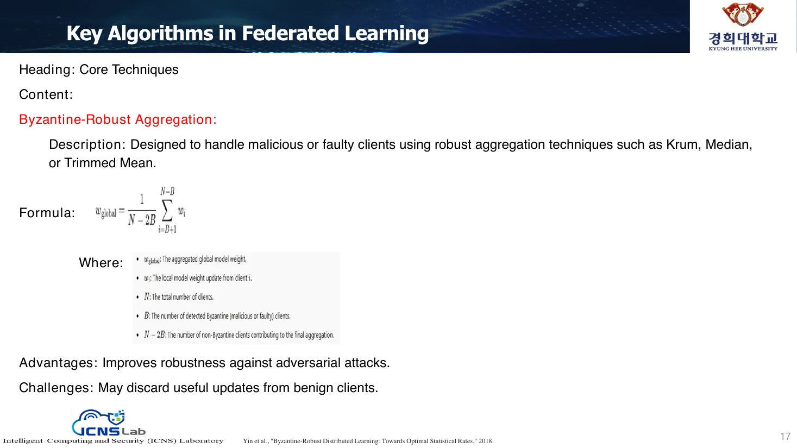

**직역**
> **연합 학습의 핵심 알고리즘(Key Algorithms in Federated Learning)**
> 제목: 핵심 기법(Core Techniques)
> 내용:
> **비잔틴 강건 집계(Byzantine-Robust Aggregation):**
> 설명: Krum, 중앙값(Median), 절사 평균(Trimmed Mean) 같은 강건한(robust) 집계 기법을 사용하여 악의적이거나 결함이 있는 클라이언트를 처리하도록 설계되었다.
> 공식:
> $$w_{\text{global}} = \frac{1}{N - 2B} \sum_{i=B+1}^{N-B} w_i$$
> Where(여기서):
> - $w_{\text{global}}$ : 집계된 글로벌 모델 가중치.
> - $w_i$ : 클라이언트 $i$ 의 로컬 모델 가중치 업데이트.
> - $N$ : 클라이언트의 총 수.
> - $B$ : 탐지된 비잔틴(악의적이거나 결함 있는) 클라이언트의 수.
>
> 장점(Advantages): 적대적 공격에 대한 강건성을 향상한다.
> 도전 과제(Challenges): 정상적인(benign) 클라이언트의 유용한 업데이트를 버릴 수 있다.
>
> (출처) Yin et al., "Byzantine-Robust Distributed Learning: Towards Optimal Statistical Rates," 2018

## 슬라이드 18

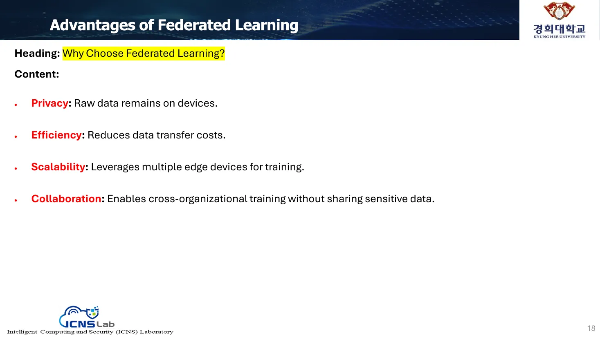

**직역**
> **연합 학습의 장점(Advantages of Federated Learning)**
> 제목: 왜 연합 학습을 선택하는가?(Why Choose Federated Learning?)
> 내용:
> - 프라이버시(Privacy): 원시 데이터가 디바이스에 그대로 남는다.
> - 효율성(Efficiency): 데이터 전송 비용을 줄인다.
> - 확장성(Scalability): 학습을 위해 다수의 엣지 디바이스를 활용한다.
> - 협력(Collaboration): 민감한 데이터를 공유하지 않고 조직 간 학습을 가능하게 한다.

**설명**
- 효율성 측면에서 데이터를 보내지 않고 파라미터만 전송하므로 사이즈가 줄어든다. 단, LLM 계열처럼 모델/파라미터가 매우 크면 파라미터 교환 자체가 큰 부담이 된다.
- (사례) NVIDIA NCCL에서 교환 방식을 개선해 통신 혼잡 없이 약 50% 절감한 석사 학생 논문이 있다.
- **협력(Collaboration)**: 에이전트들 간 협력(식당에서 둘이 분업하는 비유), 로봇 간 물리적 협력 연구가 활발하다. 협력 시 보상(reward) 분배 문제, 통신 없이 협력하는 방법(상대 액션을 관찰·예측해 미리 대응)까지 연구 중이다.

## 슬라이드 19

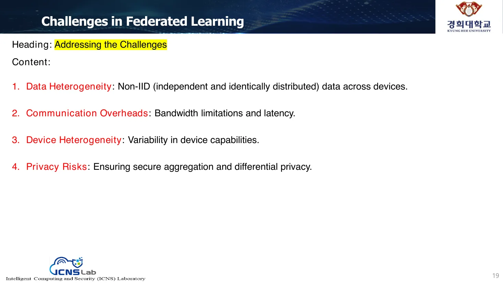

**직역**
> **연합 학습의 도전 과제(Challenges in Federated Learning)**
> 제목: 도전 과제 해결하기(Addressing the Challenges)
> 내용:
> 1. 데이터 이질성(Data Heterogeneity): 디바이스 간 non-IID(독립적이고 동일하게 분포된) 데이터.
> 2. 통신 오버헤드(Communication Overheads): 대역폭 제한과 지연(latency).
> 3. 디바이스 이질성(Device Heterogeneity): 디바이스 성능의 가변성.
> 4. 프라이버시 위험(Privacy Risks): 보안 집계와 차등 프라이버시 보장.

**설명**
- **과제(Challenge)**: Non-IID(독립적이고 동일분포가 아닌 데이터), aggregation, **Communication Overhead / Bandwidth Limitation**(반드시 고려), Device Heterogeneity(노드 성능 차이). 모델이 클 때 통신 부담이 매우 크다.
- **non-IID (Non-Identical Distribution)**: 데이터가 엣지별로 고르지 않게 분포한 상태를 말한다. 각 엣지에서 학습을 돌리면 파라미터가 나오는데, 데이터 분포가 제각각이라 IID(동일 분포)일 때보다 집계·수렴이 어려워진다. (이것이 FedAvg 등 집계 기법의 핵심 도전 과제다.)
- (기말 프로젝트) 연합학습 또는 통신 challenge / heterogeneity 개선을 주제로 진행하며, Communication overhead와 bandwidth limitation을 반드시 고려해야 한다.

## 슬라이드 20

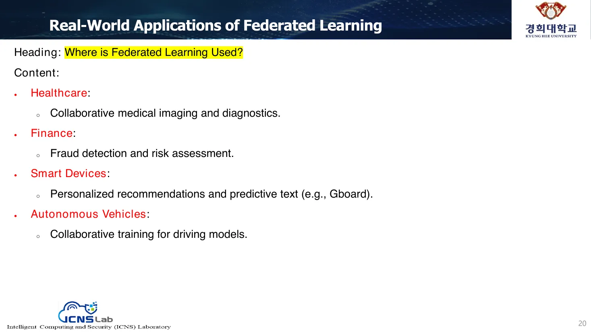

**직역**
> **연합 학습의 실제 응용(Real-World Applications of Federated Learning)**
> 제목: 연합 학습은 어디에 쓰이는가?(Where is Federated Learning Used?)
> 내용:
> - 헬스케어(Healthcare): 협력적 의료 영상 및 진단.
> - 금융(Finance): 사기 탐지(fraud detection)와 위험 평가.
> - 스마트 디바이스(Smart Devices): 개인화 추천 및 예측 텍스트(predictive text)(예: Gboard).
> - 자율주행 차량(Autonomous Vehicles): 주행 모델을 위한 협력 학습.

## 슬라이드 21

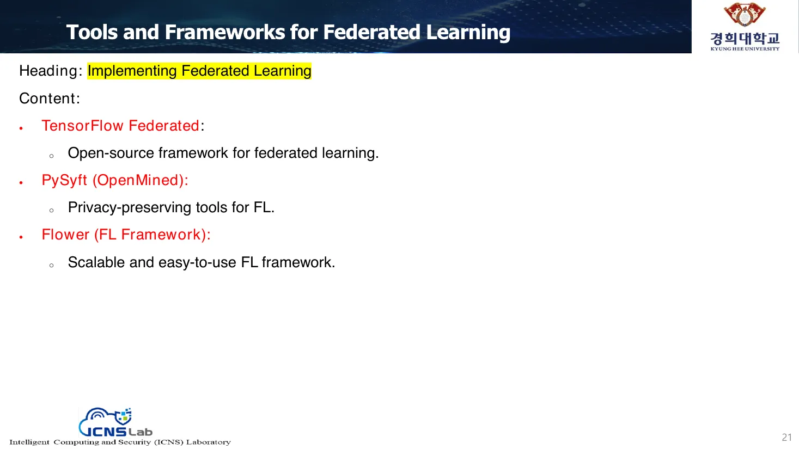

**직역**
> **연합 학습을 위한 도구와 프레임워크(Tools and Frameworks for Federated Learning)**
> 제목: 연합 학습 구현하기(Implementing Federated Learning)
> 내용:
> - TensorFlow Federated: 연합 학습을 위한 오픈소스 프레임워크.
> - PySyft (OpenMined): FL을 위한 프라이버시 보존 도구.
> - Flower (FL Framework): 확장 가능하고 사용하기 쉬운 FL 프레임워크.

**설명**
- 구현 프레임워크로 TensorFlow Federated, **Flower(플라워)**(학부 캡스톤에서 많이 사용), PySyft 등 오픈소스가 있다.

## 슬라이드 22

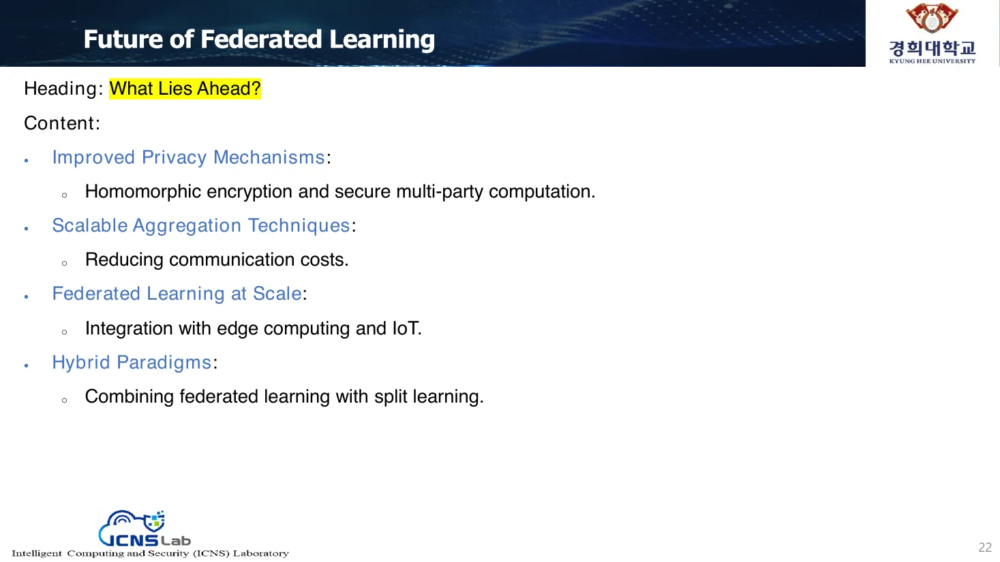

**직역**
> **연합 학습의 미래(Future of Federated Learning)**
> 제목: 무엇이 다가오는가?(What Lies Ahead?)
> 내용:
> - 개선된 프라이버시 메커니즘(Improved Privacy Mechanisms): 동형 암호와 보안 다자간 연산(secure multi-party computation).
> - 확장 가능한 집계 기법(Scalable Aggregation Techniques): 통신 비용 절감.
> - 대규모 연합 학습(Federated Learning at Scale): 엣지 컴퓨팅 및 IoT와의 통합.
> - 하이브리드 패러다임(Hybrid Paradigms): 연합 학습과 스플릿 러닝의 결합.

## 슬라이드 23

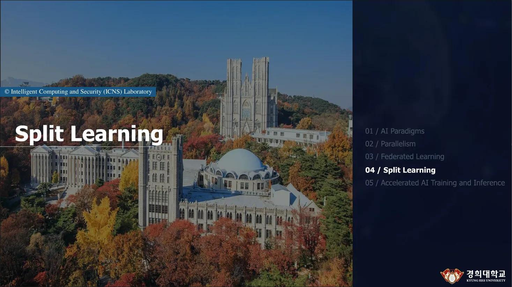

**직역**
> © 지능형 컴퓨팅 및 보안(ICNS) 연구실
>
> **스플릿 러닝(Split Learning)**
>
> 01 / AI 패러다임(AI Paradigms)
> 02 / 병렬성(Parallelism)
> 03 / 연합 학습(Federated Learning)
> 04 / 스플릿 러닝(Split Learning)
> 05 / 가속화된 AI 학습 및 추론(Accelerated AI Training and Inference)

## 슬라이드 24

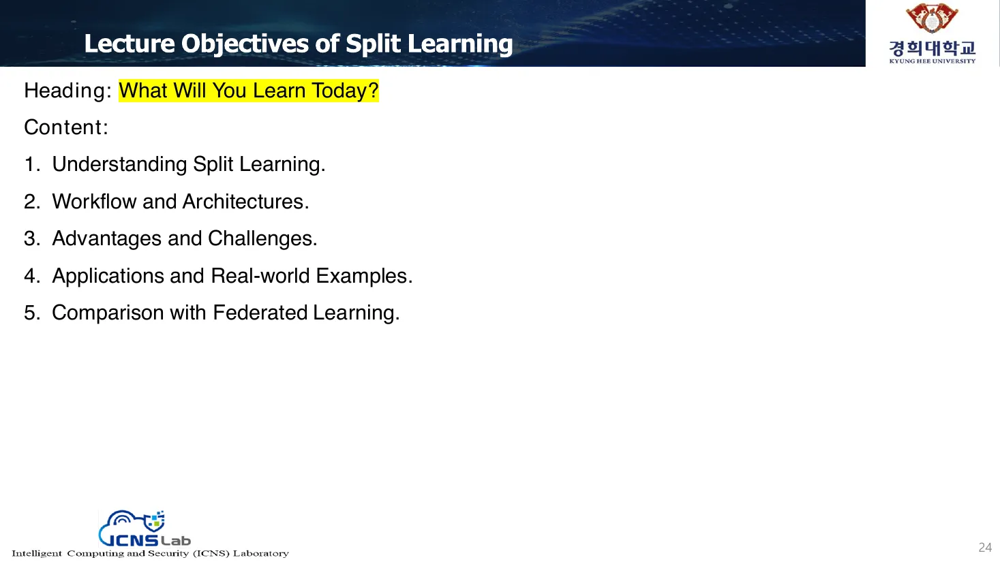

**직역**
> **스플릿 러닝의 강의 목표(Lecture Objectives of Split Learning)**
> 제목: 오늘 무엇을 배우는가?(What Will You Learn Today?)
> 내용:
> 1. 스플릿 러닝의 이해.
> 2. 워크플로와 아키텍처.
> 3. 장점과 도전 과제.
> 4. 응용과 실제 사례.
> 5. 연합 학습과의 비교.

## 슬라이드 25

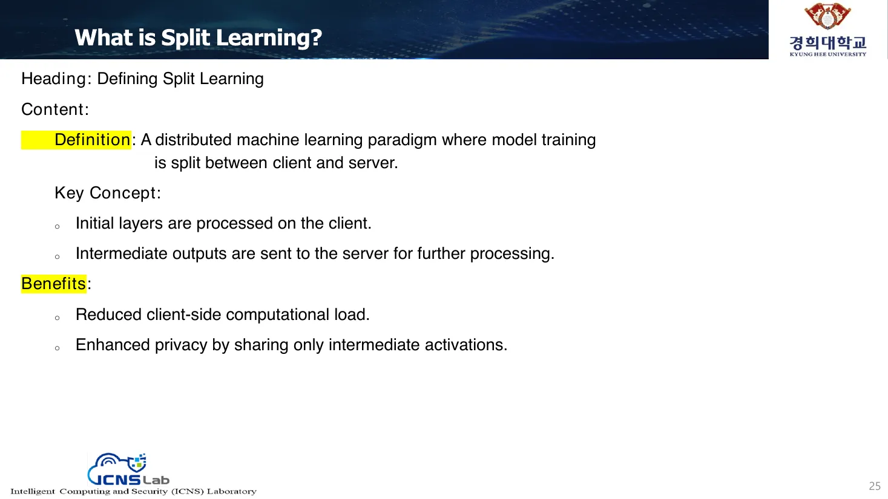

**직역**
> **스플릿 러닝이란 무엇인가?(What is Split Learning?)**
> 제목: 스플릿 러닝의 정의(Defining Split Learning)
> 내용:
> 정의(Definition): 모델 학습이 클라이언트와 서버 사이에서 분할(split)되는 분산 머신러닝 패러다임.
> 핵심 개념(Key Concept):
> - 초기 레이어(initial layers)는 클라이언트에서 처리된다.
> - 중간 출력(intermediate outputs)은 추가 처리를 위해 서버로 전송된다.
> 이점(Benefits):
> - 클라이언트 측 연산 부하 감소.
> - 중간 활성값(intermediate activations)만 공유하여 프라이버시 강화.

**설명**
- (시험 관련, 반복 강조) 정의: 전체 모델 중 **앞부분(입력 처리 레이어)은 클라이언트가, 나머지는 서버가** 학습한다. 즉 서버도 학습한다 — 연합학습은 서버가 학습하지 않고 aggregation만 한다는 점이 핵심 차이다.
- 모델 보유 측면의 차이도 있다: 연합학습은 모든 노드가 전체 모델을 가지고 있어야 하지만, 스플릿은 모델의 레이어(또는 다른 기준)를 잘라서 나눠 가진다. 엣지 디바이스끼리도 스플릿이 가능하다.

## 슬라이드 26

**직역**
> **왜 스플릿 러닝인가?(Why Split Learning?)**
> 제목: 스플릿 러닝의 동기(Motivation for Split Learning)
> 내용:
> 전통적 ML의 도전 과제(Challenges in Traditional ML):
> - 엣지 디바이스에 대한 높은 자원 요구.
> - 중앙집중식 데이터 저장에 따른 프라이버시 우려.
> 스플릿 러닝이 해결하는 것(Split Learning Addresses):
> - 자원 최적화(Resource optimization).
> - 제한된 데이터 노출(Limited data exposure).
> - 엣지 디바이스를 위한 확장성(Scalability for edge devices).
>
> (우측 그림) DNN 모델 분할(Splitting the DNN model): Device A, Device B(클라이언트 측 앞부분)와 Server(뒷부분)로 신경망을 나눔.
>
> (출처) Samikwa, Eric, Antonio Di Maio, and Torsten Braun. "DFL: Dynamic Federated Split Learning in Heterogeneous IoT." IEEE transactions on machine learning in communications and networking (2024).

**설명**
- 장점: 로컬(노트북)에 비싼 GPU가 없어도 적은 연산만 하고 무거운 부분은 성능 좋은 서버에 맡길 수 있다. 메모리도 적게 필요하다. 많은 노드/GPU 클러스터/CPU를 효율적으로 활용하면서 프라이버시도 보장한다. 이렇게 로드를 나누는 것 자체를 **오프로딩(offloading, 모델 오프로딩)** 관점으로 본다.
- 주의: 모델을 많이 자른다고 해서 학습이 더 빨라지는 것은 아니다. 자르는 지점이 늘수록 통신 오버헤드 등이 증가해 오히려 느려질 수 있다 → 이 통신 부담만 해결하면 된다.

## 슬라이드 27

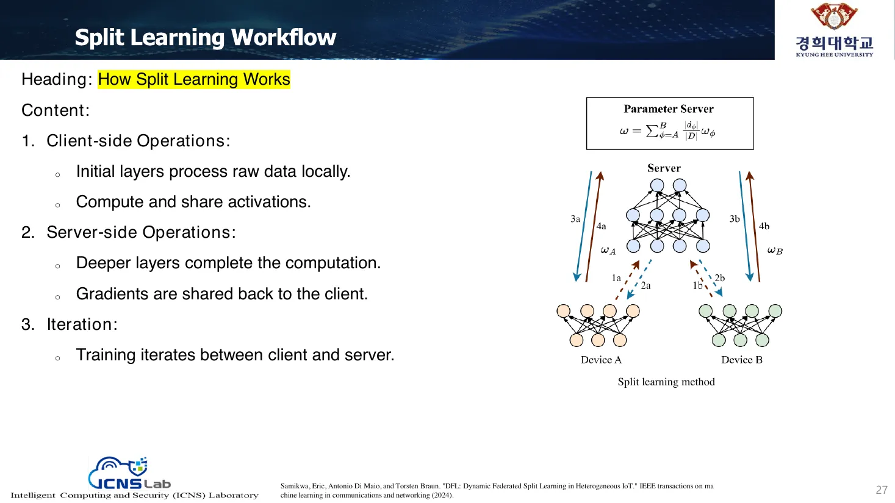

**직역**
> **스플릿 러닝 워크플로(Split Learning Workflow)**
> 제목: 스플릿 러닝은 어떻게 동작하는가(How Split Learning Works)
> 내용:
> 1. 클라이언트 측 동작(Client-side Operations):
> - 초기 레이어가 원시 데이터를 로컬에서 처리한다.
> - 활성값(activations)을 계산하고 공유한다.
> 2. 서버 측 동작(Server-side Operations):
> - 더 깊은 레이어가 연산을 완료한다.
> - 그래디언트가 클라이언트로 다시 공유된다.
> 3. 반복(Iteration):
> - 학습이 클라이언트와 서버 사이를 오가며 반복된다.
>
> (우측 그림) 파라미터 서버(Parameter Server) $w \leftarrow \frac{1}{N}\sum w_i$ 와 Server, Device A·Device B를 보여주는 스플릿 러닝 방식(Split learning method).
>
> (출처) Samikwa, Eric, Antonio Di Maio, and Torsten Braun. "DFL: Dynamic Federated Split Learning in Heterogeneous IoT." IEEE transactions on machine learning in communications and networking (2024).

**설명**
- 동작: 클라이언트가 초기 레이어를 학습 → 그 출력(중간 결과)만 서버로 전달 → 서버가 이어서 처리한다. **원시 데이터는 넘어가지 않으므로 데이터 프라이버시가 여전히 보장**된다.

## 슬라이드 28

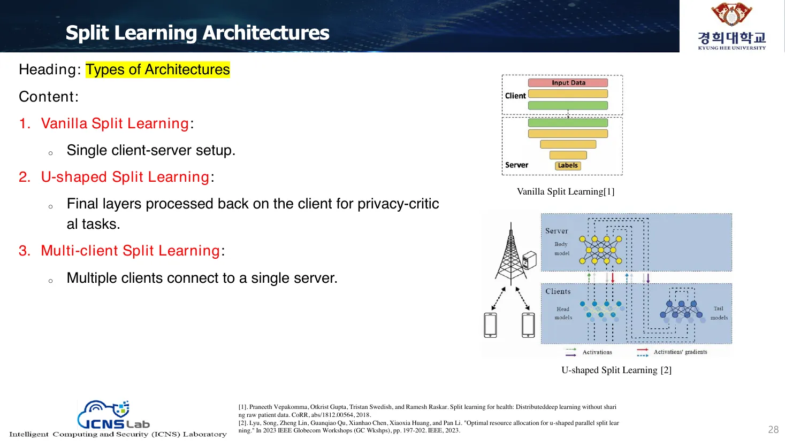

**직역**
> **스플릿 러닝 아키텍처(Split Learning Architectures)**
> 제목: 아키텍처의 종류(Types of Architectures)
> 내용:
> 1. 바닐라 스플릿 러닝(Vanilla Split Learning):
> - 단일 클라이언트-서버 구성.
> 2. U자형 스플릿 러닝(U-shaped Split Learning):
> - 프라이버시가 중요한 작업을 위해 최종 레이어를 다시 클라이언트에서 처리.
> 3. 멀티 클라이언트 스플릿 러닝(Multi-client Split Learning):
> - 다수 클라이언트가 단일 서버에 연결.
>
> (우측 그림 1) 바닐라 스플릿 러닝(Vanilla Split Learning [1]): Client(앞 레이어) — Server(뒤 레이어) — Labels.
> (우측 그림 2) U자형 스플릿 러닝(U-shaped Split Learning [2]): 다수 클라이언트와 서버, 입력/출력 양끝이 클라이언트에 있는 형태.
>
> (출처)
> [1]. Praneeth Vepakomma, Otkrist Gupta, Tristan Swedish, and Ramesh Raskar. "Split learning for health: Distributed deep learning without sharing raw patient data." CoRR, abs/1812.00564, 2018.
> [2]. Lyu, Song, et al. "Optimal resource allocation for u-shaped parallel split learning." 2023 IEEE Globecom Workshops (GC Wkshps), pp. 197-202. IEEE, 2023.

**설명**
- 구조 종류: Vanilla Split Learning, U-shaped Split Learning(클라이언트들이 서로 다른 것을 학습한 뒤 합침, 수평적), Multi-client(수평+수직을 동시에 고려).
- 추론(inference)에도 적용되며, 모델을 쪼개 부하를 분산하는 것을 **오프로딩(offloading)**(모델 오프로딩)이라 한다.

## 슬라이드 29

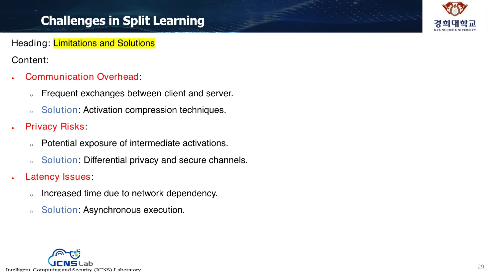

**직역**
> **스플릿 러닝의 도전 과제(Challenges in Split Learning)**
> 제목: 한계와 해결책(Limitations and Solutions)
> 내용:
> - 통신 오버헤드(Communication Overhead):
>   - 클라이언트와 서버 간 잦은 교환.
>   - 해결책: 활성값 압축(activation compression) 기법.
> - 프라이버시 위험(Privacy Risks):
>   - 중간 활성값의 잠재적 노출.
>   - 해결책: 차등 프라이버시와 보안 채널(secure channels).
> - 지연 문제(Latency Issues):
>   - 네트워크 의존성으로 인한 시간 증가.
>   - 해결책: 비동기 실행(asynchronous execution).

**설명**
- **통신 오버헤드**: 노드 간 연결이 많아 통신 부담이 크다 → 액티베이션(중간 출력) 자체를 압축해 보내는 방법이 필요하다.
- **프라이버시 리스크**: 노드 간 데이터가 넘겨지는 과정(중간 피처/파라미터)에서 노출될 수 있어, 거꾸로 복원해 원본 데이터를 찾아내는 공격 논문도 나왔다. 그래서 데이터 병렬보다는 낫지만 완전(High)하지는 않다.
- **네트워크 의존성(병목)**: 병목이 발생하면 레이턴시가 크게 증가한다.

## 슬라이드 30

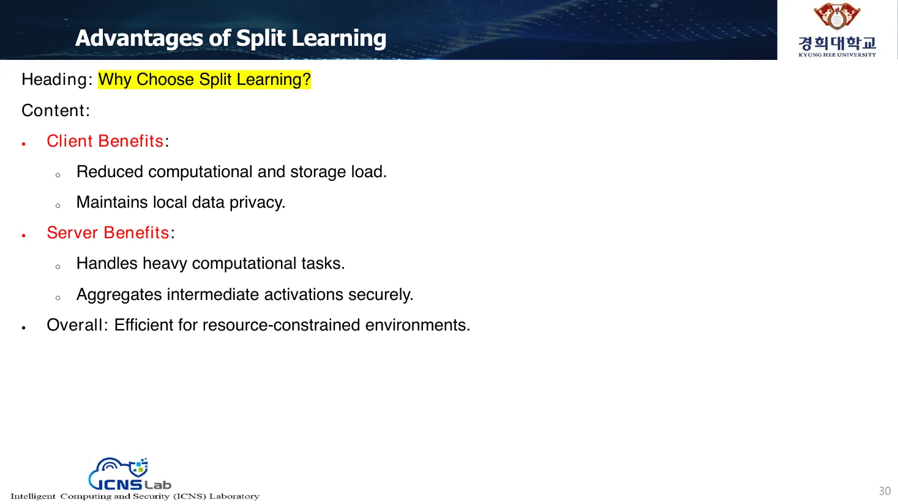

**직역**
> **스플릿 러닝의 장점(Advantages of Split Learning)**
> 제목: 왜 스플릿 러닝을 선택하는가?(Why Choose Split Learning?)
> 내용:
> - 클라이언트의 이점(Client Benefits):
>   - 연산 및 저장 부하 감소.
>   - 로컬 데이터 프라이버시 유지.
> - 서버의 이점(Server Benefits):
>   - 무거운 연산 작업 처리.
>   - 중간 활성값을 안전하게 집계.
> - 전반(Overall): 자원이 제약된(resource-constrained) 환경에 효율적.

## 슬라이드 31

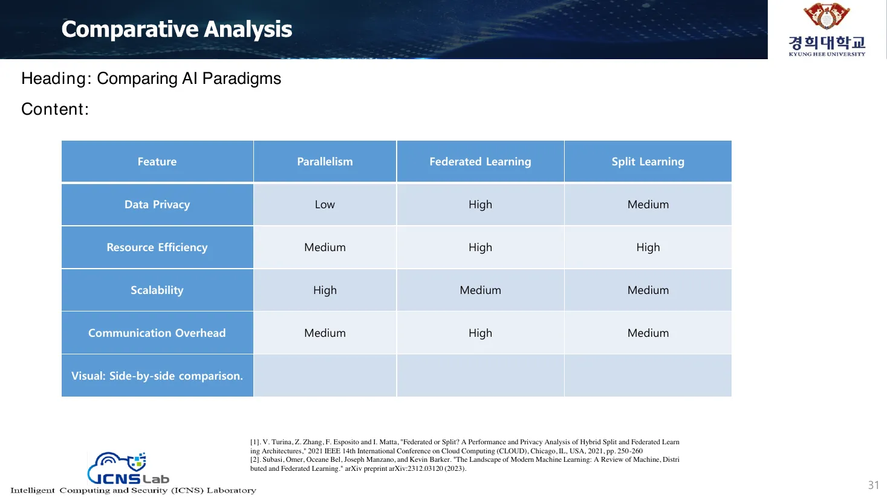

**직역**
> **비교 분석(Comparative Analysis)**
> 제목: AI 패러다임 비교(Comparing AI Paradigms)
> 내용:
>
> | 특성(Feature) | 병렬성(Parallelism) | 연합 학습(Federated Learning) | 스플릿 러닝(Split Learning) |
> |---|---|---|---|
> | 데이터 프라이버시(Data Privacy) | 낮음(Low) | 높음(High) | 중간(Medium) |
> | 자원 효율성(Resource Efficiency) | 중간(Medium) | 높음(High) | 높음(High) |
> | 확장성(Scalability) | 높음(High) | 중간(Medium) | 중간(Medium) |
> | 통신 오버헤드(Communication Overhead) | 중간(Medium) | 높음(High) | 중간(Medium) |
>
> 시각 자료(Visual): 나란히 비교(Side-by-side comparison).
>
> (출처)
> [1]. V. Turina, Z. Zhang, F. Esposito and I. Matta, "Federated or Split? A Performance and Privacy Analysis of Hybrid Split and Federated Learning Architectures," 2021 IEEE 14th International Conference on Cloud Computing (CLOUD), Chicago, IL, USA, 2021, pp. 250-260.
> [2]. Subasi, Omer, Oceane Bel, Joseph Manzano, and Kevin Barker. "The Landscape of Modern Machine Learning: A Review of Machine, Distributed and Federated Learning." arXiv preprint arXiv:2312.03120 (2023).

**설명**
- 세 가지(FL / Split / Parallelism) 비교: 데이터 프라이버시는 연합학습이 가장 좋다(단 중간 피처 복원 논문이 존재). 리소스 효율성은 스플릿이 더 섬세하게 활용한다.
- **확장성(Scalability) 주의**: 표 기준 Scalability는 스플릿 러닝이 Medium(중간)이나, 강의 구두 설명에서는 서버 자원이 큰 쪽이라며 스플릿이 더 높다고 언급했다 — 표 기준값과 구두 설명이 다르다는 점에 유의.
- **Communication Overhead가 가장 많은 것은 연합학습**이다(아래에서 다 만든 큰 파라미터를 전달하기 때문). 단 **병목(중간에 트래픽이 많이 발생)은 스플릿 러닝**이 많다.

## 슬라이드 32

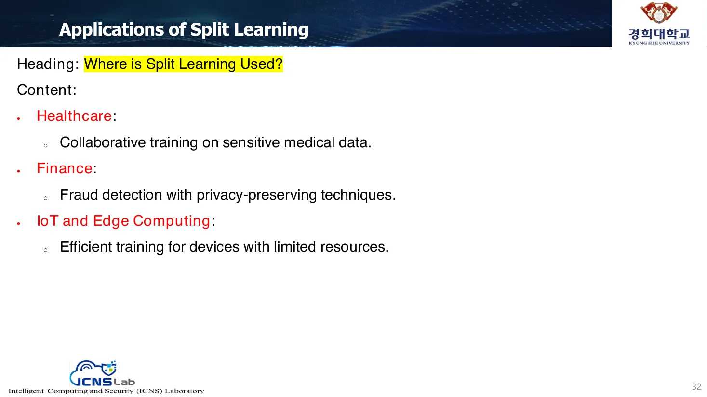

**직역**
> **스플릿 러닝의 응용(Applications of Split Learning)**
> 제목: 스플릿 러닝은 어디에 쓰이는가?(Where is Split Learning Used?)
> 내용:
> - 헬스케어(Healthcare): 민감한 의료 데이터에 대한 협력 학습.
> - 금융(Finance): 프라이버시 보존 기법을 활용한 사기 탐지.
> - IoT 및 엣지 컴퓨팅(IoT and Edge Computing): 자원이 제한된 디바이스를 위한 효율적 학습.

**설명**
- IoT 쪽에서 많이 일어나며, 라즈베리파이에 LLM을 경량화해 올려 학습까지 하는 회사 사례가 언급되었다.

## 슬라이드 33

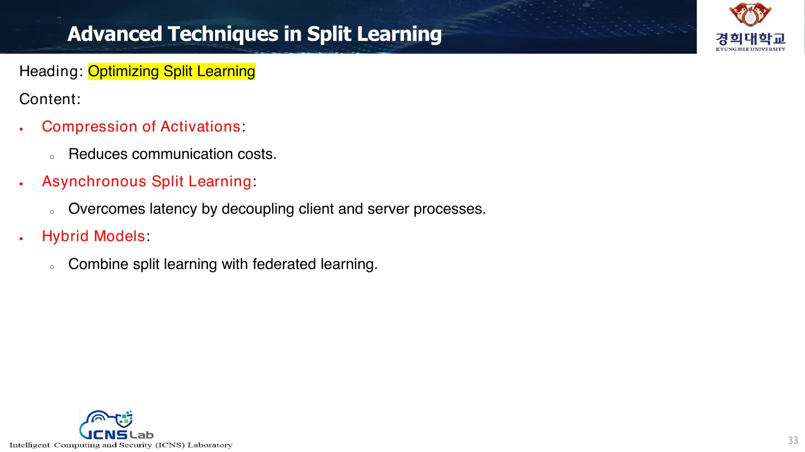

**직역**
> **스플릿 러닝의 고급 기법(Advanced Techniques in Split Learning)**
> 제목: 스플릿 러닝 최적화(Optimizing Split Learning)
> 내용:
> - 활성값 압축(Compression of Activations): 통신 비용을 줄인다.
> - 비동기 스플릿 러닝(Asynchronous Split Learning): 클라이언트와 서버 프로세스를 분리(decoupling)하여 지연을 극복한다.
> - 하이브리드 모델(Hybrid Models): 스플릿 러닝과 연합 학습을 결합한다.

**설명**
- 개선 방향: 연결 부분(통신)을 줄이고, **비동기(asynchronous)** 처리로 대기를 제거하며, Split+Federated 결합, 다양한 aggregation 방법, 경량화(pruning, knowledge distillation)로 모델을 축약한다.

## 슬라이드 34

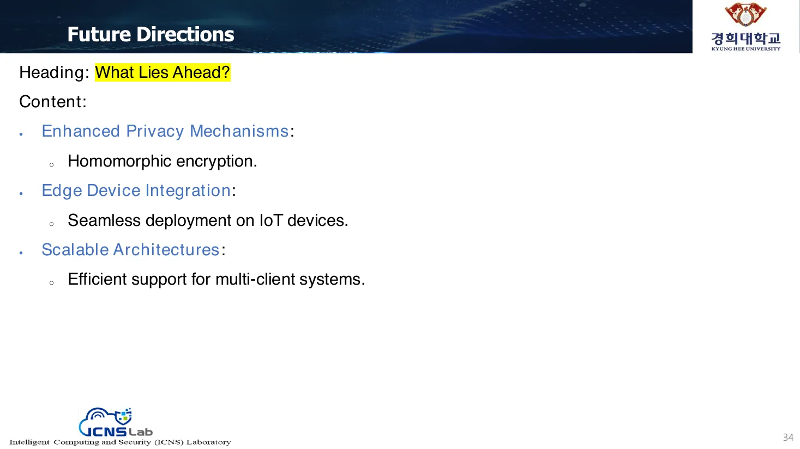

**직역**
> **향후 방향(Future Directions)**
> 제목: 무엇이 다가오는가?(What Lies Ahead?)
> 내용:
> - 강화된 프라이버시 메커니즘(Enhanced Privacy Mechanisms): 동형 암호(Homomorphic encryption).
> - 엣지 디바이스 통합(Edge Device Integration): IoT 디바이스에 매끄러운 배포.
> - 확장 가능한 아키텍처(Scalable Architectures): 멀티 클라이언트 시스템에 대한 효율적 지원.

## 슬라이드 35

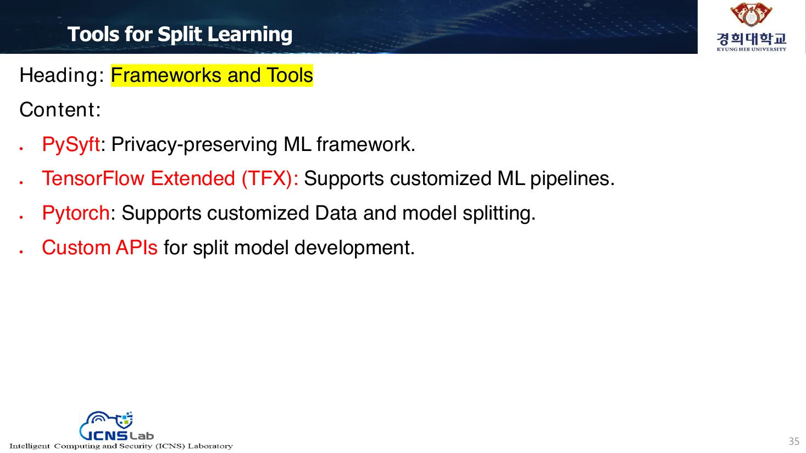

**직역**
> **스플릿 러닝을 위한 도구(Tools for Split Learning)**
> 제목: 프레임워크와 도구(Frameworks and Tools)
> 내용:
> - PySyft: 프라이버시 보존 ML 프레임워크.
> - TensorFlow Extended (TFX): 맞춤형 ML 파이프라인 지원.
> - PyTorch: 맞춤형 데이터 및 모델 분할 지원.
> - 스플릿 모델 개발을 위한 커스텀 API(Custom APIs).

**설명**
- 텐서플로우/파이토치 모두 스플릿 러닝을 지원한다.

## 슬라이드 36

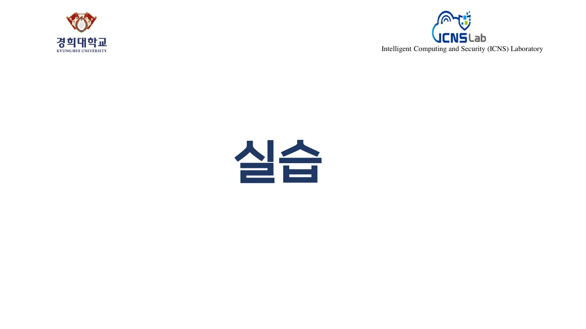

**직역**
> 지능형 컴퓨팅 및 보안(ICNS) 연구실(Intelligent Computing and Security (ICNS) Laboratory)
>
> **실습**
