> 원본 슬라이드를 슬라이드별로 직역하고 강의 녹취 설명을 함께 정리한 노트.
> [← 전체 목차](/posts/ain-overview/)

## 슬라이드 1

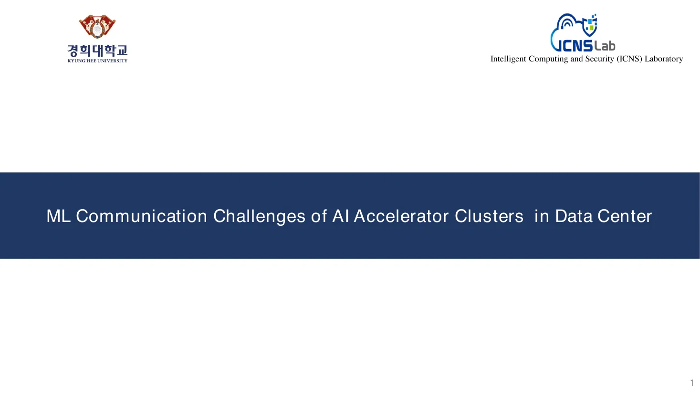

**직역**
> (경희대학교 KYUNG HEE UNIVERSITY 로고 / ICNS Lab 로고)
> Intelligent Computing and Security (ICNS) Laboratory (지능 컴퓨팅 및 보안 연구실)
>
> **데이터 센터 내 AI 가속기 클러스터의 ML 통신 문제 (ML Communication Challenges of AI Accelerator Clusters in Data Center)**

## 슬라이드 2

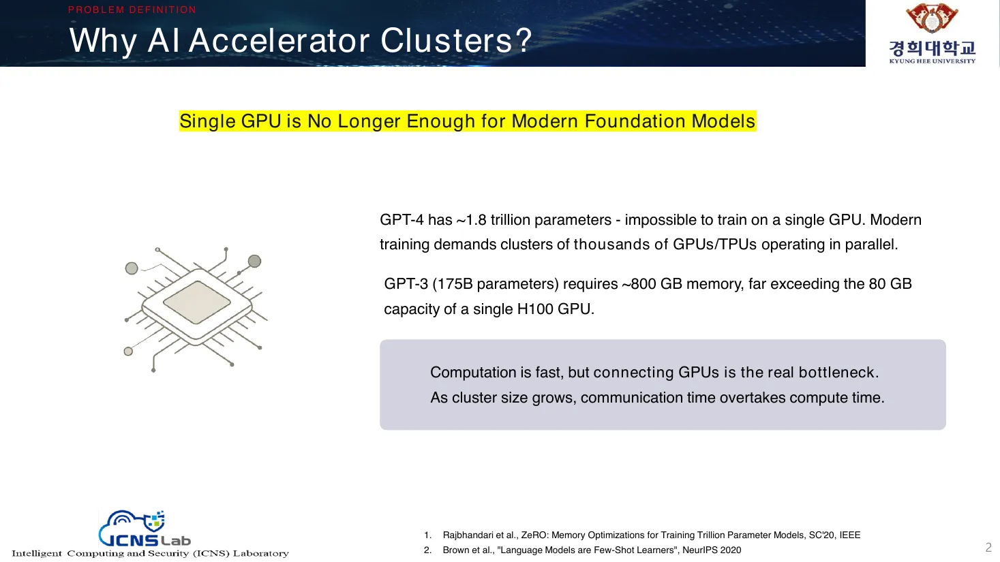

**직역**
> 문제 정의 (PROBLEM DEFINITION)
>
> **왜 AI 가속기 클러스터(AI Accelerator Clusters)인가?**
>
> 단일 GPU는 더 이상 현대 파운데이션 모델(Foundation Models)에 충분하지 않다 (Single GPU is No Longer Enough for Modern Foundation Models)
>
> - GPT-4는 약 1.8조(trillion) 개의 파라미터를 가진다 — 단일 GPU로 학습하는 것은 불가능하다. 현대의 학습은 수천 개의 GPU/TPU가 병렬로 동작하는 클러스터를 요구한다.
> - GPT-3(1,750억 파라미터)는 약 800 GB 메모리를 필요로 하며, 이는 단일 H100 GPU의 80 GB 용량을 훨씬 초과한다.
>
> - 연산(Computation)은 빠르지만, GPU들을 연결하는 것이 진짜 병목(bottleneck)이다.
> - 클러스터 크기가 커질수록 통신 시간(communication time)이 연산 시간(compute time)을 추월한다.
>
> 참고문헌:
> 1. Rajbhandari et al., ZeRO: Memory Optimizations for Training Trillion Parameter Models, SC'20, IEEE
> 2. Brown et al., "Language Models are Few-Shot Learners", NeurIPS 2020

**설명**
- GPT-4급 모델은 파라미터가 약 1.8조 개로, 분산 병렬 학습 시 이 파라미터들이 다운로드/전송되어야 한다.
- 플롭스(FLOPS) 사이즈가 10→100→1000으로 늘면 fitting time(학습 시간)은 줄지만, 노드가 많아질수록 통신 데이터가 엄청나게 증가한다는 점을 잊지 말아야 한다. AI 학과 학생들은 이 부분을 심각하게 고려하지 않는 경향이 있다.

## 슬라이드 3

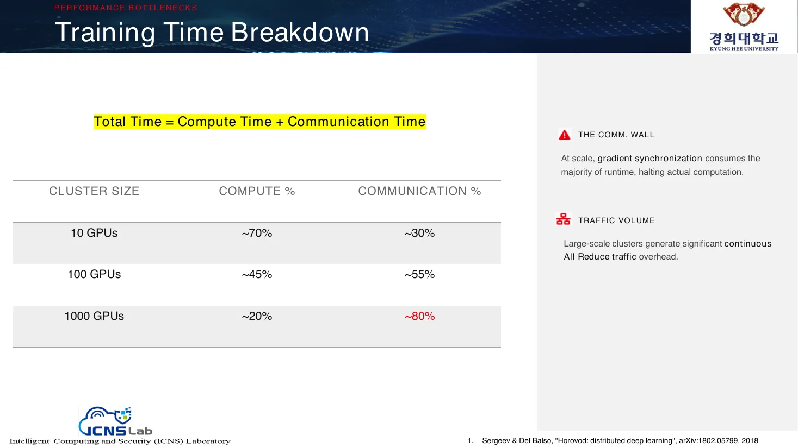

**직역**
> 성능 병목 (PERFORMANCE BOTTLENECKS)
>
> **학습 시간 분해 (Training Time Breakdown)**
>
> 전체 시간 = 연산 시간 + 통신 시간 (Total Time = Compute Time + Communication Time)
>
> | 클러스터 크기 (CLUSTER SIZE) | 연산 % (COMPUTE %) | 통신 % (COMMUNICATION %) |
> |---|---|---|
> | 10 GPUs | ~70% | ~30% |
> | 100 GPUs | ~45% | ~55% |
> | 1000 GPUs | ~20% | ~80% |
>
> **통신의 벽 (THE COMM. WALL)**
> 대규모에서는 그래디언트 동기화(gradient synchronization)가 런타임의 대부분을 소비하며, 실제 연산을 멈추게 한다.
>
> **트래픽 볼륨 (TRAFFIC VOLUME)**
> 대규모 클러스터는 상당한 연속적 All Reduce 트래픽 오버헤드를 생성한다.
>
> 참고문헌:
> 1. Sergeev & Del Balso, "Horovod: distributed deep learning", arXiv:1802.05799, 2018

**설명**
- AI로 옵티마이즈하면 좋아지는데, 사람들이 통신을 고려하지 않아 실제로는 약 4배 더 많은 시간이 걸리는 문제가 생긴다.

## 슬라이드 4

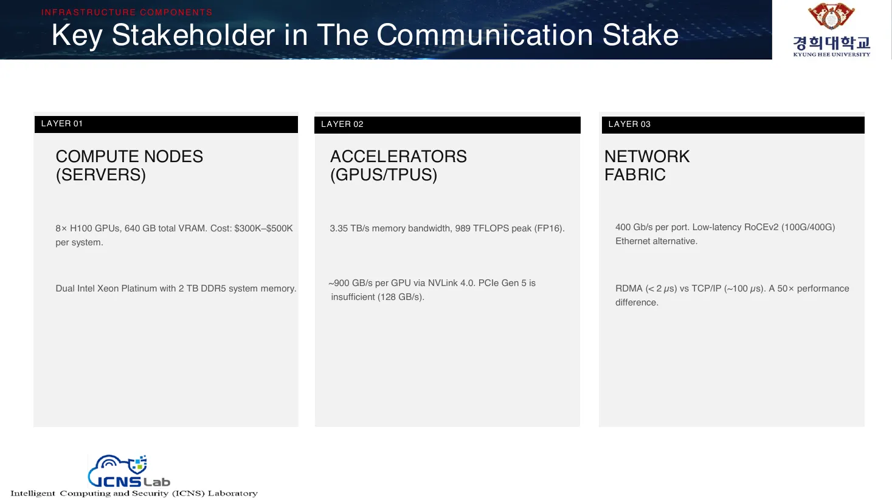

**직역**
> 인프라 구성요소 (INFRASTRUCTURE COMPONENTS)
>
> **통신 이해관계의 핵심 이해당사자 (Key Stakeholder in The Communication Stake)**
>
> **LAYER 01 — 컴퓨트 노드 (서버) (COMPUTE NODES (SERVERS))**
> - 8× H100 GPU, 총 640 GB VRAM. 비용: 시스템당 $300K–$500K.
> - 듀얼 Intel Xeon Platinum, 2 TB DDR5 시스템 메모리.
>
> **LAYER 02 — 가속기 (GPU/TPU) (ACCELERATORS (GPUS/TPUS))**
> - 3.35 TB/s 메모리 대역폭, 989 TFLOPS 피크 (FP16).
> - NVLink 4.0를 통해 GPU당 ~900 GB/s. PCIe Gen 5는 불충분(128 GB/s).
>
> **LAYER 03 — 네트워크 패브릭 (NETWORK FABRIC)**
> - 포트당 400 Gb/s. 저지연 RoCEv2 (100G/400G) 이더넷 대안.
> - RDMA(< 2 µs) 대 TCP/IP(~100 µs). 50배 성능 차이.

## 슬라이드 5

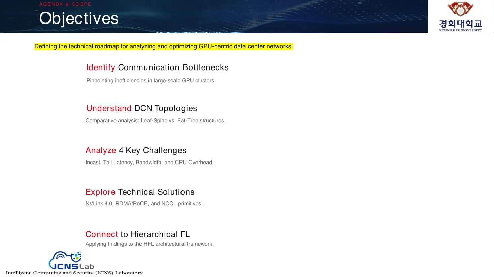

**직역**
> 아젠다 & 범위 (AGENDA & SCOPE)
>
> **목표 (Objectives)**
> GPU 중심 데이터 센터 네트워크를 분석하고 최적화하기 위한 기술 로드맵 정의.
>
> - **통신 병목 식별 (Identify Communication Bottlenecks)**
>   대규모 GPU 클러스터의 비효율을 짚어낸다.
> - **DCN 토폴로지 이해 (Understand DCN Topologies)**
>   비교 분석: Leaf-Spine 대 Fat-Tree 구조.
> - **4가지 핵심 도전과제 분석 (Analyze 4 Key Challenges)**
>   인캐스트(Incast), 테일 레이턴시(Tail Latency), 대역폭(Bandwidth), CPU 오버헤드(CPU Overhead).
> - **기술적 해법 탐색 (Explore Technical Solutions)**
>   NVLink 4.0, RDMA/RoCE, NCCL 프리미티브(primitives).
> - **계층적 FL과 연결 (Connect to Hierarchical FL)**
>   분석 결과를 HFL 아키텍처 프레임워크에 적용.

## 슬라이드 6

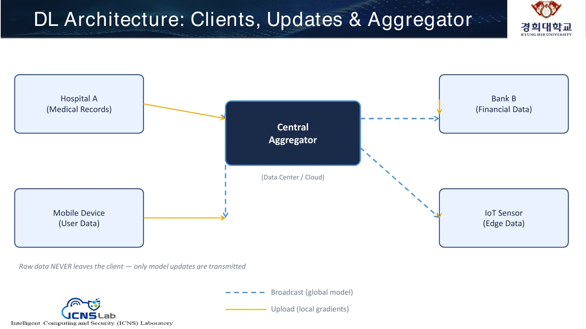

**직역**
> **DL 아키텍처: 클라이언트, 업데이트 & 집계자 (DL Architecture: Clients, Updates & Aggregator)**
>
> (다이어그램)
> - 병원 A (의료 기록) (Hospital A (Medical Records))
> - 은행 B (금융 데이터) (Bank B (Financial Data))
> - 중앙 집계자 (Central Aggregator) — (데이터 센터 / 클라우드) (Data Center / Cloud)
> - 모바일 기기 (사용자 데이터) (Mobile Device (User Data))
> - IoT 센서 (엣지 데이터) (IoT Sensor (Edge Data))
>
> 원시 데이터(Raw data)는 절대 클라이언트를 떠나지 않는다 — 오직 모델 업데이트(model updates)만 전송된다.
>
> (범례)
> - ----  브로드캐스트 (전역 모델) (Broadcast (global model))
> - ——  업로드 (로컬 그래디언트) (Upload (local gradients))

## 슬라이드 7

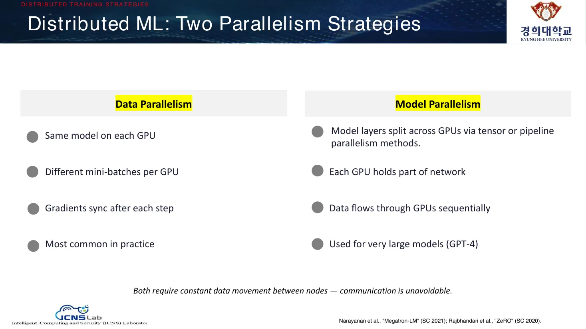

**직역**
> 분산 학습 전략 (DISTRIBUTED TRAINING STRATEGIES)
>
> **분산 ML: 두 가지 병렬화 전략 (Distributed ML: Two Parallelism Strategies)**
>
> **데이터 병렬화 (Data Parallelism)**
> - 각 GPU에 동일한 모델 (Same model on each GPU)
> - GPU별로 다른 미니배치 (Different mini-batches per GPU)
> - 각 스텝 후 그래디언트 동기화 (Gradients sync after each step)
> - 실무에서 가장 일반적 (Most common in practice)
>
> **모델 병렬화 (Model Parallelism)**
> - 텐서 또는 파이프라인 병렬화 방법으로 모델 레이어를 GPU들에 분할 (Model layers split across GPUs via tensor or pipeline parallelism methods.)
> - 각 GPU가 네트워크의 일부를 보유 (Each GPU holds part of network)
> - 데이터가 GPU들을 순차적으로 흐름 (Data flows through GPUs sequentially)
> - 아주 큰 모델(GPT-4)에 사용 (Used for very large models (GPT-4))
>
> 둘 다 노드 간 끊임없는 데이터 이동을 요구한다 — 통신은 불가피하다 (Both require constant data movement between nodes — communication is unavoidable.)
>
> 참고문헌: Narayanan et al., "Megatron-LM" (SC 2021); Rajbhandari et al., "ZeRO" (SC 2020).

## 슬라이드 8

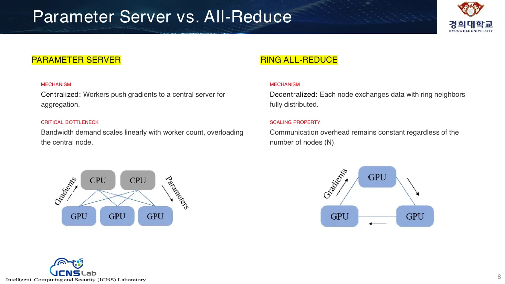

**직역**
> **파라미터 서버 대 All-Reduce (Parameter Server vs. All-Reduce)**
>
> **파라미터 서버 (PARAMETER SERVER)**
> - 메커니즘 (MECHANISM): 중앙집중형(Centralized) — 워커(Workers)들이 집계를 위해 그래디언트를 중앙 서버로 push한다.
> - 핵심 병목 (CRITICAL BOTTLENECK): 대역폭 수요가 워커 수에 따라 선형적으로 증가하여 중앙 노드에 과부하를 준다.
> - (다이어그램) Gradients → CPU, CPU → GPU, GPU, GPU, → Parameters
>
> **링 All-Reduce (RING ALL-REDUCE)**
> - 메커니즘 (MECHANISM): 분산형(Decentralized) — 각 노드가 링(ring) 이웃과 데이터를 교환하며 완전히 분산됨.
> - 스케일링 특성 (SCALING PROPERTY): 통신 오버헤드가 노드 수(N)에 관계없이 일정하게 유지된다.
> - (다이어그램) GPU - GPU - GPU 링 형태, Gradients
>
> 벤치마크: BERT-LARGE 학습 (BENCHMARK: BERT-LARGE TRAINING)

**설명**
- 그래디언트를 모아 합치는 Aggregation 방식은 크게 두 가지다. 하나는 중앙집중식 **파라미터 서버**로, 워커들이 그래디언트를 중앙 서버로 보내 집계한다. 다른 하나는 각 노드가 링(ring) 형식으로 돌며 이웃과 데이터를 서로 교환하는 **All-Reduce(링 All-Reduce)**다.
- 파라미터 서버는 대역폭 수요가 워커 수에 비례해 늘어 중앙 노드에 병목이 생기는 반면, 링 All-Reduce는 노드 수(N)와 무관하게 통신 오버헤드가 일정하게 유지된다.

## 슬라이드 9

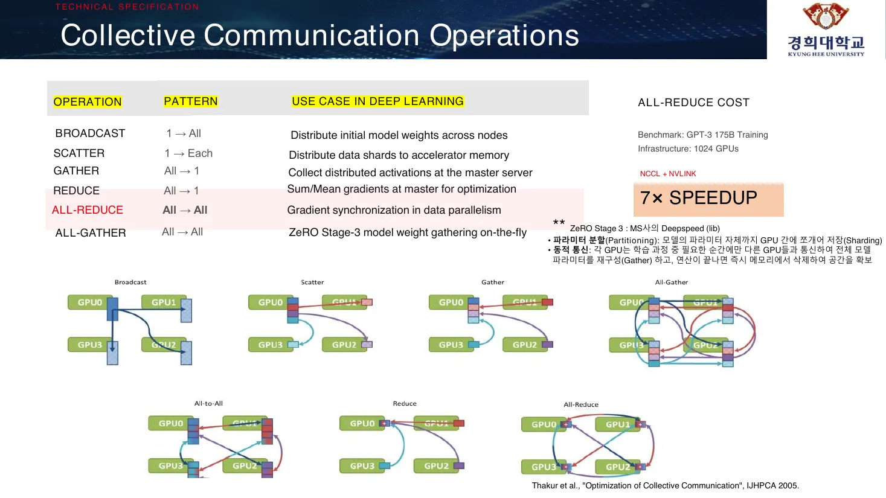

**직역**
> 기술 사양 (TECHNICAL SPECIFICATION)
>
> **집합 통신 연산 (Collective Communication Operations)**
>
> | 연산 (OPERATION) | 패턴 (PATTERN) | 딥러닝에서의 사용 사례 (USE CASE IN DEEP LEARNING) |
> |---|---|---|
> | BROADCAST | 1 → All | 초기 모델 가중치를 노드 전체에 분배 |
> | SCATTER | 1 → Each | 데이터 샤드(shards)를 가속기 메모리로 분배 |
> | GATHER | All → 1 | 분산된 활성화(activations)를 마스터 서버에 수집 |
> | REDUCE | All → 1 | 최적화를 위해 마스터에서 그래디언트 합/평균(Sum/Mean) |
> | ALL-REDUCE | All → All | 데이터 병렬화에서 그래디언트 동기화 |
> | ALL-GATHER | All → All | ZeRO Stage-3 모델 가중치를 실시간(on-the-fly)으로 수집 |
>
> **All-Reduce 비용 (ALL-REDUCE COST)**
> 벤치마크: GPT-3 175B 학습 (Benchmark: GPT-3 175B Training)
> 인프라: 1024 GPU (Infrastructure: 1024 GPUs)
> NCCL + NVLINK
> **7× 속도 향상 (7× SPEEDUP)**
>
> (슬라이드 주석)
> ** ZeRO Stage 3 : MS사의 Deepspeed (lib)
> - 파라미터 분할(Partitioning): 모델의 파라미터 자체까지 GPU 간에 쪼개어 저장(Sharding)
> - 동적 통신: 각 GPU는 학습 과정 중 필요한 순간에만 다른 GPU들과 통신하여 전체 모델 파라미터를 재구성(Gather) 하고, 연산이 끝나면 즉시 메모리에서 삭제하여 공간을 확보
>
> (하단 다이어그램: Broadcast, Scatter, Gather, Reduce, All-Reduce, All-Gather 각 패턴의 GPU 간 통신 흐름 그림)
>
> 참고문헌: Thakur et al., "Optimization of Collective Communication", IJHPCA 2005.

**설명**
- **Scatter**는 한쪽으로 뿌려주는 것, **Gather**는 모으는 과정, **Broadcast / All-reduce**는 만들어진 것을 뿌리고 합치는 과정이다.
- 각자 만든 것을 모아 평균 등으로 합쳐 하나의 파라미터로 동기화(synchronize)하는 것을 통칭 **Reduce**라 한다.
- 이런 AI 학습 시 발생하는 통신 라이브러리/방법을 통칭 **Collective Communication(집합 통신)**이라 하며, 외워야 할 용어다.

## 슬라이드 10

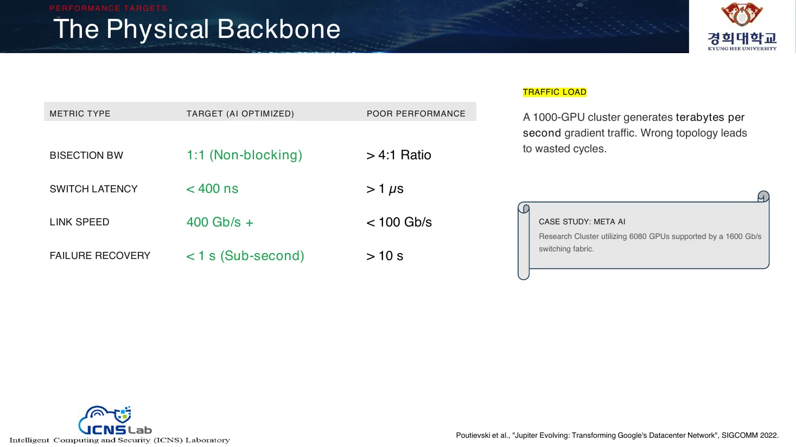

**직역**
> 성능 목표 (PERFORMANCE TARGETS)
>
> **물리적 백본 (The Physical Backbone)**
>
> | 메트릭 유형 (METRIC TYPE) | 목표(AI 최적화) (TARGET (AI OPTIMIZED)) | 저성능 (POOR PERFORMANCE) |
> |---|---|---|
> | 이분 대역폭 (BISECTION BW) | 1:1 (논블로킹, Non-blocking) | > 4:1 비율 |
> | 스위치 지연 (SWITCH LATENCY) | < 400 ns | > 1 µs |
> | 링크 속도 (LINK SPEED) | 400 Gb/s + | < 100 Gb/s |
> | 장애 복구 (FAILURE RECOVERY) | < 1 s (서브초, Sub-second) | > 10 s |
>
> **트래픽 부하 (TRAFFIC LOAD)**
> 1000-GPU 클러스터는 초당 테라바이트(terabytes per second)의 그래디언트 트래픽을 생성한다. 잘못된 토폴로지는 낭비되는 사이클로 이어진다.
>
> **사례 연구: META AI (CASE STUDY: META AI)**
> 6080개 GPU를 활용하는 연구 클러스터, 1600 Gb/s 스위칭 패브릭으로 지원됨.
>
> 참고문헌: Poutievski et al., "Jupiter Evolving: Transforming Google's Datacenter Network", SIGCOMM 2022.

## 슬라이드 11

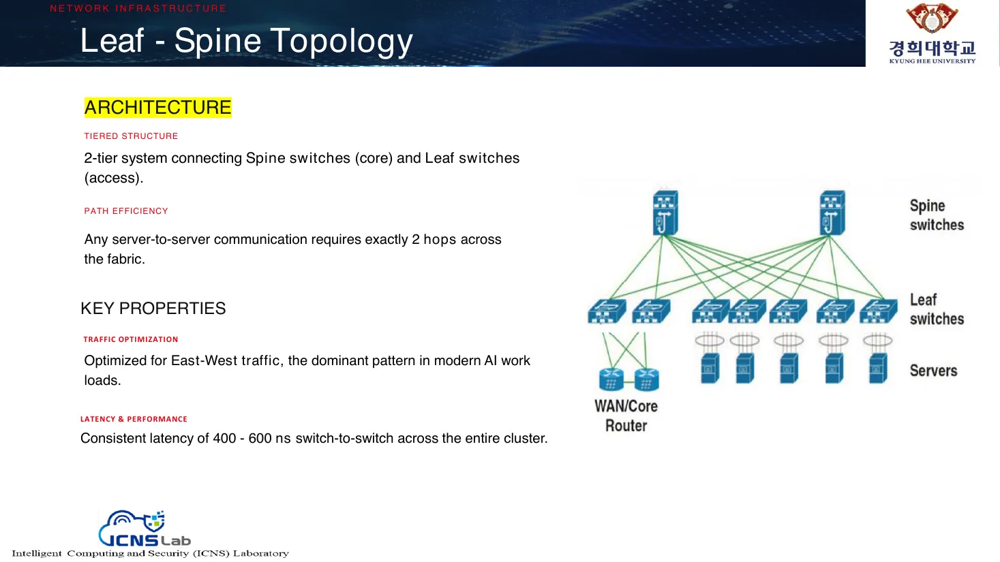

**직역**
> 네트워크 인프라 (NETWORK INFRASTRUCTURE)
>
> **Leaf - Spine 토폴로지 (Leaf - Spine Topology)**
>
> **아키텍처 (ARCHITECTURE)**
> - 계층 구조 (TIERED STRUCTURE): Spine 스위치(코어)와 Leaf 스위치(액세스)를 연결하는 2계층(2-tier) 시스템.
> - 경로 효율성 (PATH EFFICIENCY): 어떤 서버-대-서버 통신도 패브릭을 가로질러 정확히 2홉(2 hops)을 요구한다.
>
> **핵심 특성 (KEY PROPERTIES)**
> - 트래픽 최적화 (TRAFFIC OPTIMIZATION): East-West 트래픽에 최적화 — 현대 AI 워크로드의 지배적 패턴.
> - 지연 & 성능 (LATENCY & PERFORMANCE): 클러스터 전체에서 스위치-대-스위치 400 - 600 ns의 일관된 지연.
>
> (다이어그램) Spine switches(스파인 스위치) — Leaf switches(리프 스위치) — Servers(서버), WAN/Core Router(WAN/코어 라우터)

**설명**
- Leaf-Spine 구조는 2-tier로, 아래 Leaf = Access Switch, 위 Spine = Aggregation/Core Switch이다. 같은 레벨 간 교환인 East-West 트래픽이 발생하며, 스위치-스위치 레이턴시는 400~600ns다.

## 슬라이드 12

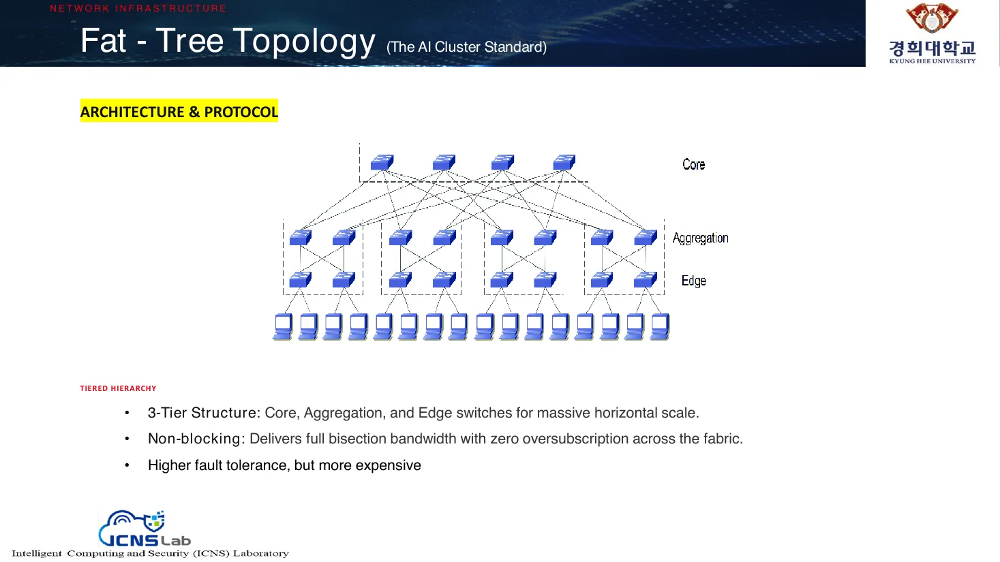

**직역**
> 네트워크 인프라 (NETWORK INFRASTRUCTURE)
>
> **Fat - Tree 토폴로지 (AI 클러스터 표준) (Fat - Tree Topology (The AI Cluster Standard))**
>
> **아키텍처 & 프로토콜 (ARCHITECTURE & PROTOCOL)**
> (라벨) NDR 400G, InfiniBand
> (다이어그램) Core(코어) — Aggregation(집계) — Edge(엣지) 3계층 스위치 구조
>
> **계층 위계 (TIERED HIERARCHY)**
> - 3계층 구조 (3-Tier Structure): 대규모 수평 확장을 위한 Core, Aggregation, Edge 스위치.
> - 논블로킹 (Non-blocking): 패브릭 전체에서 오버서브스크립션(oversubscription) 없이 완전한 이분 대역폭(full bisection bandwidth) 제공.
> - 더 높은 내결함성(fault tolerance), 그러나 더 비쌈.

**설명**
- Fat-Tree 구조는 Core-Aggregation-Edge의 다층 이중화로, Non-blocking delivery, full bisection bandwidth, fault tolerance를 목표로 한다. 비용이 매우 크다.

## 슬라이드 13

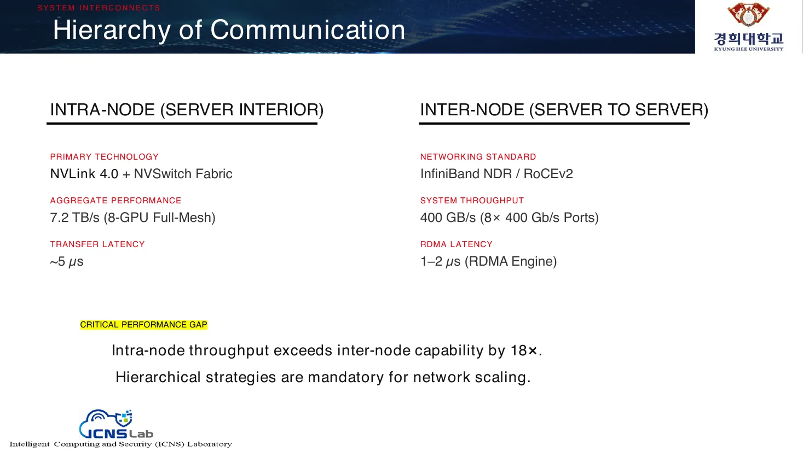

**직역**
> 시스템 인터커넥트 (SYSTEM INTERCONNECTS)
>
> **통신의 위계 (Hierarchy of Communication)**
>
> **인트라노드 (서버 내부) (INTRA-NODE (SERVER INTERIOR))**
> - 주요 기술 (PRIMARY TECHNOLOGY): NVLink 4.0 + NVSwitch 패브릭
> - 총 성능 (AGGREGATE PERFORMANCE): 7.2 TB/s (8-GPU 풀메시, Full-Mesh)
> - 전송 지연 (TRANSFER LATENCY): ~5 µs
>
> **인터노드 (서버 대 서버) (INTER-NODE (SERVER TO SERVER))**
> - 네트워킹 표준 (NETWORKING STANDARD): InfiniBand NDR / RoCEv2
> - 시스템 스루풋 (SYSTEM THROUGHPUT): 400 GB/s (8× 400 Gb/s 포트)
> - RDMA 지연 (RDMA LATENCY): 1–2 µs (RDMA 엔진)
>
> **핵심 성능 격차 (CRITICAL PERFORMANCE GAP)**
> 인트라노드 스루풋이 인터노드 능력을 18배 초과한다. 네트워크 스케일링을 위해 계층적 전략(Hierarchical strategies)이 필수적이다.

**설명**
- NVLink는 인트라노드(서버 내) GPU-GPU 직접 연결로 약 7.2TB aggregation, 전송 5μs, 4~8개까지 가능. 8개 초과 시 NVSwitch로 확장하며, 이때 약 17배의 추가 성능을 얻는다.
- 인터노드 통신은 노드-노드 스위치가 필요하며 InfiniBand 기반(400G x 8포트). 인트라노드가 인터노드보다 약 18배 빠른 스루풋이다.

## 슬라이드 14

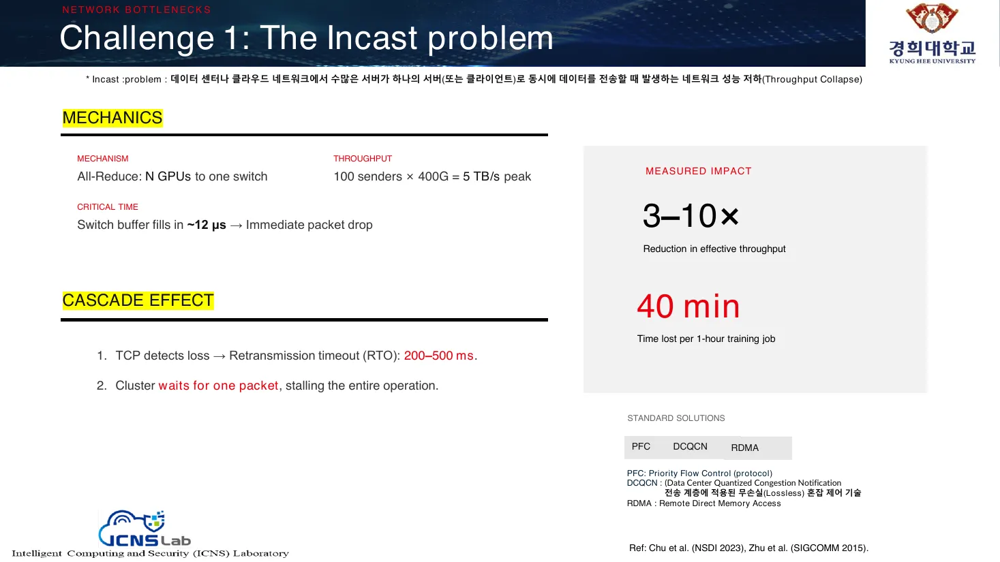

**직역**
> 네트워크 병목 (NETWORK BOTTLENECKS)
>
> **도전과제 1: 인캐스트 문제 (Challenge 1: The Incast problem)**
> * Incast problem : 데이터 센터나 클라우드 네트워크에서 수많은 서버가 하나의 서버(또는 클라이언트)로 동시에 데이터를 전송할 때 발생하는 네트워크 성능 저하(Throughput Collapse)
>
> **메커니즘 (MECHANICS)**
> - 메커니즘 (MECHANISM): All-Reduce: N개 GPU가 하나의 스위치로
> - 스루풋 (THROUGHPUT): 100 발신자 × 400G = 5 TB/s 피크
> - 임계 시간 (CRITICAL TIME): 스위치 버퍼가 ~12 μs 만에 채워짐 → 즉각적인 패킷 드롭(packet drop)
>
> **캐스케이드 효과 (CASCADE EFFECT)**
> 1. TCP가 손실을 감지 → 재전송 타임아웃(Retransmission timeout, RTO): 200–500 ms.
> 2. 클러스터가 하나의 패킷을 기다리며 전체 연산이 멈춤(stalling).
>
> **측정된 영향 (MEASURED IMPACT)**
> - **3–10×** : 유효 스루풋(effective throughput)의 감소
> - **40 min** : 1시간 학습 작업당 손실되는 시간
>
> **표준 해법 (STANDARD SOLUTIONS)**: PFC | DCQCN | RDMA
> - PFC: Priority Flow Control (protocol) (우선순위 흐름 제어)
> - DCQCN : Data Center Quantized Congestion Notification — 전송 계층에 적용된 무손실(Lossless) 혼잡 제어 기술
> - RDMA : Remote Direct Memory Access
>
> 참고문헌: Chu et al. (NSDI 2023), Zhu et al. (SIGCOMM 2015).

**설명**
- 연합학습에서 클라이언트들이 한 서버로 파라미터를 다 보낼 때(aggregation 시) 트래픽이 몰린다. 100개 센서가 400G씩 내면 5TB/s인데 그런 스위치가 없다.
- 스위치 버퍼가 12μs 만에 차서 드롭 → TCP 로스 → 재전송 → 타임아웃(200~500ms) → stalling. 실제 3~10배 손실, 1시간 학습 중 40분이 인캐스트 때문에 날아가는 사례도 있다.
- 대응으로 PFC, DCQCN, RDMA를 쓰며 전력(power) 이슈도 발생한다. "Incast Problem" 용어는 외워야 한다.

## 슬라이드 15

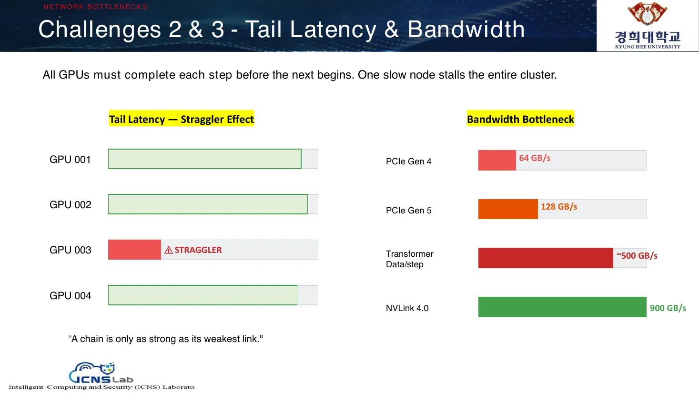

**직역**
> 네트워크 병목 (NETWORK BOTTLENECKS)
>
> **도전과제 2 & 3 - 테일 레이턴시 & 대역폭 (Challenges 2 & 3 - Tail Latency & Bandwidth)**
> 모든 GPU는 다음 스텝이 시작되기 전에 각 스텝을 완료해야 한다. 한 개의 느린 노드가 전체 클러스터를 멈춘다.
>
> **테일 레이턴시 — 스트래글러 효과 (Tail Latency — Straggler Effect)**
> (막대 그래프)
> - GPU 001 (정상)
> - GPU 002 (정상)
> - GPU 003 ⚠ 스트래글러 (STRAGGLER) — 짧고 붉음
> - GPU 004 (정상)
>
> **대역폭 병목 (Bandwidth Bottleneck)**
> (막대 그래프)
> - PCIe Gen 4 : 64 GB/s
> - PCIe Gen 5 : 128 GB/s
> - 트랜스포머 데이터/스텝 (Transformer Data/step) : ~500 GB/s
> - NVLink 4.0 : 900 GB/s
>
> "사슬은 가장 약한 고리만큼만 강하다." ("A chain is only as strong as its weakest link.")

**설명**
- Tail Latency(테일 레이턴시)는 늦어진 노드(꼬리)를 말한다. GPU별 성능 차이, NVLink 없이 초창기 랜카드로 여러 개 꽂으면 성능이 안 나온다.
- PCIe 연결 GPU로는 트랜스포머가 요구하는 500GB/step을 못 맞춰 병렬 학습이 늦어진다.

## 슬라이드 16

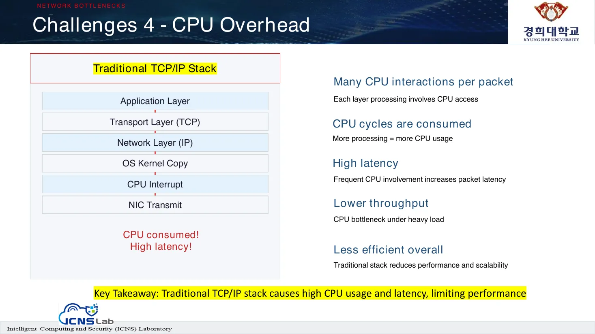

**직역**
> 네트워크 병목 (NETWORK BOTTLENECKS)
>
> **도전과제 4: CPU 오버헤드 (Challenge 4: CPU Overhead)**
>
> **전통적 TCP/IP 스택 (Traditional TCP/IP Stack)**
> (스택 다이어그램, 위에서 아래로)
> - 애플리케이션 계층 (Application Layer)
> - 전송 계층 (TCP) (Transport Layer (TCP))
> - 네트워크 계층 (IP) (Network Layer (IP))
> - OS 커널 복사 (OS Kernel Copy)
> - CPU 인터럽트 (CPU Interrupt)
> - NIC 전송 (NIC Transmit)
> - → CPU 소모! 높은 지연! (CPU consumed! High latency!)
>
> (우측 항목)
> - 패킷마다 많은 CPU 상호작용 (Many CPU interactions per packet): 각 계층 처리가 CPU 접근을 수반
> - CPU 사이클 소모 (CPU cycles are consumed): 처리가 많을수록 CPU 사용량 증가
> - 높은 지연 (High latency): 빈번한 CPU 개입이 패킷 지연 증가
> - 낮은 스루풋 (Lower throughput): 고부하 시 CPU 병목
> - 전반적으로 덜 효율적 (Less efficient overall): 전통적 스택은 성능과 확장성을 저하
>
> 핵심 요점 (Key Takeaway): 전통적 TCP/IP 스택은 높은 CPU 사용량과 지연을 유발하여 성능을 제한한다.

**설명**
- 레이어별로 통신하며 패킷마다 CPU interaction이 발생해 CPU 사이클을 소모하고, 패킷 레이턴시가 증가하며 로스로 인한 재전송이 일어난다.
- AI/ML 애플리케이션은 네트워크도 많고 연산도 많아 CPU와 NIC 둘 다 부담된다. (웹 서버는 IO 위주라 CPU 부담이 적고, AI는 둘 다 많다.)

## 슬라이드 17

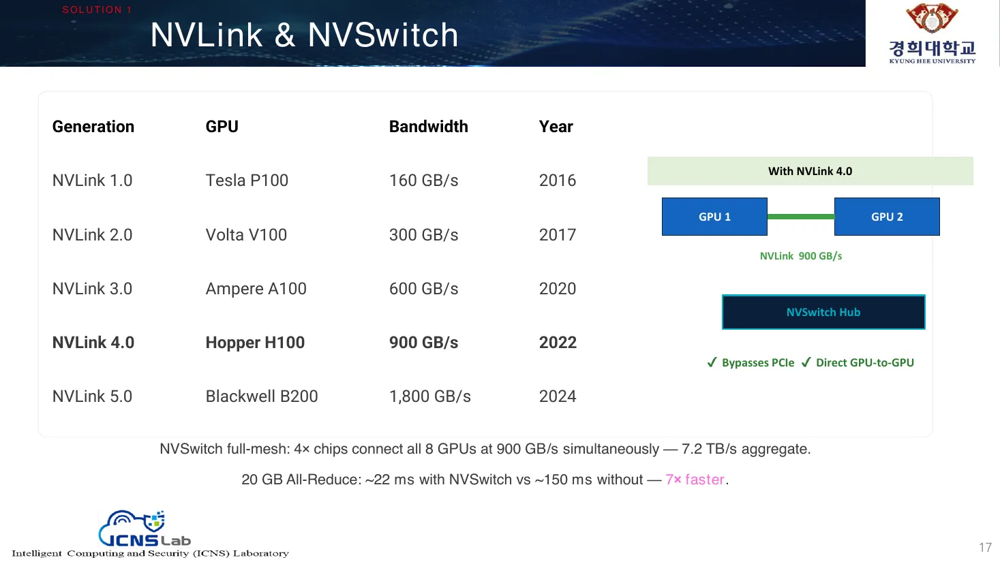

**직역**
> 해법 1 (SOLUTION 1)
>
> **NVLink & NVSwitch**
>
> | 세대 (Generation) | GPU | 대역폭 (Bandwidth) | 연도 (Year) |
> |---|---|---|---|
> | NVLink 1.0 | Tesla P100 | 160 GB/s | 2016 |
> | NVLink 2.0 | Volta V100 | 300 GB/s | 2017 |
> | NVLink 3.0 | Ampere A100 | 600 GB/s | 2020 |
> | NVLink 4.0 | Hopper H100 | 900 GB/s | 2022 |
> | NVLink 5.0 | Blackwell B200 | 1,800 GB/s | 2024 |
>
> (다이어그램) With NVLink 4.0: GPU 1 ↔ GPU 2, NVLink 900 GB/s, NVSwitch Hub
> ✓ PCIe 우회 (Bypasses PCIe) ✓ 직접 GPU-대-GPU (Direct GPU-to-GPU)
>
> NVSwitch 풀메시(full-mesh): 4개 칩이 8개 GPU를 모두 900 GB/s로 동시 연결 — 7.2 TB/s 총합.
> 20 GB All-Reduce: NVSwitch 사용 시 ~22 ms 대 미사용 시 ~150 ms — 7배 빠름.

**설명**
- GPU 세대별 NVLink 대역폭이 증가했다(P100→V100→A100→H100, 900GB/s급, 2022 H100 1800GB 방향). 소비자용 RTX 3080/5080은 NVLink를 미지원해 통신이 결국 돈 싸움이 된다.

## 슬라이드 18

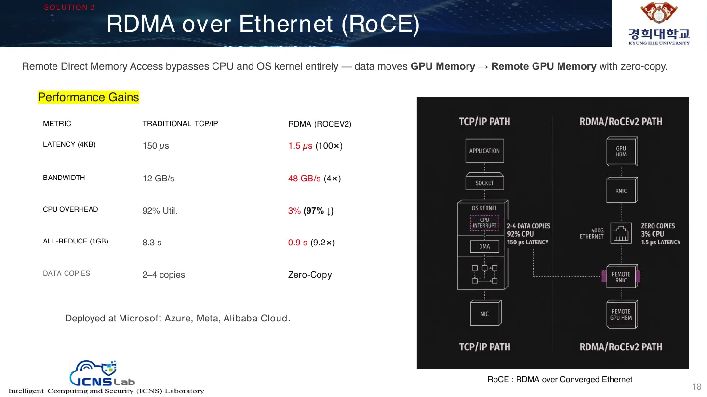

**직역**
> 해법 2 (SOLUTION 2)
>
> **이더넷 상의 RDMA (RoCE) (RDMA over Ethernet (RoCE))**
> 원격 직접 메모리 접근(Remote Direct Memory Access)은 CPU와 OS 커널을 완전히 우회한다 — 데이터가 GPU 메모리 → 원격 GPU 메모리로 제로카피(zero-copy)로 이동.
>
> **성능 향상 (Performance Gains)**
>
> | 메트릭 (METRIC) | 전통적 TCP/IP (TRADITIONAL TCP/IP) | RDMA (ROCEV2) |
> |---|---|---|
> | 지연 (4KB) (LATENCY (4KB)) | 150 µs | 1.5 µs (100×) |
> | 대역폭 (BANDWIDTH) | 12 GB/s | 48 GB/s (4×) |
> | CPU 오버헤드 (CPU OVERHEAD) | 92% 사용률 | 3% (97% ↓) |
> | All-Reduce (1GB) (ALL-REDUCE (1GB)) | 8.3 s | 0.9 s (9.2×) |
> | 데이터 복사 (DATA COPIES) | 2–4 복사 | 제로카피 (Zero-Copy) |
>
> Microsoft Azure, Meta, Alibaba Cloud에 배포됨.
>
> (다이어그램) TCP/IP PATH 대 RDMA/RoCEv2 PATH 비교
> RoCE : RDMA over Converged Ethernet

**설명**
- RoCE는 conventional 이더넷(우리가 실제 쓰는 이더넷) 위에서 다른 노드의 GPU HBM을 액세스한다.
- RDMA의 핵심은 NIC에서 받은 데이터를 CPU(OS 커널)로 복사하는 과정을 생략하고 바로 가져가는 **제로카피(zero-copy)**다.
- 학부생 논문 실험에서 400G 인터넷의 TCP/IP는 48GB(4배 향상에 그침), RDMA는 1.5μs로 접근하고 CPU 오버헤드도 감소(All-reduce 8.3초→0.9초)했다.
- "RDMA가 지원하는 가장 핵심 사항은? → 제로 카피(Zero-copy)"가 시험 문제 형태로 강조되었다.

## 슬라이드 19

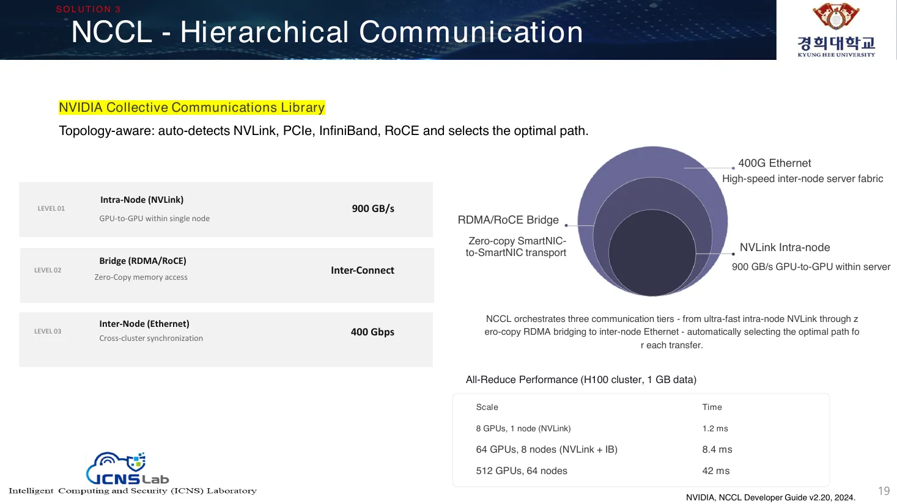

**직역**
> 해법 3 (SOLUTION 3)
>
> **NCCL - 계층적 통신 (NCCL - Hierarchical Communication)**
>
> NVIDIA 집합 통신 라이브러리 (NVIDIA Collective Communications Library)
> 토폴로지 인식(Topology-aware): NVLink, PCIe, InfiniBand, RoCE를 자동 감지하고 최적 경로를 선택한다.
>
> - **LEVEL 01 — 인트라노드 (NVLink) (Intra-Node (NVLink))** : 900 GB/s, 단일 노드 내 GPU-대-GPU
> - **LEVEL 02 — 브리지 (RDMA/RoCE) (Bridge (RDMA/RoCE))** : 인터커넥트(Inter-Connect), 제로카피 메모리 접근
> - **LEVEL 03 — 인터노드 (이더넷) (Inter-Node (Ethernet))** : 400 Gbps, 클러스터 간 동기화
>
> (우측 다이어그램)
> - 400G Ethernet: 고속 인터노드 서버 패브릭 (High-speed inter-node server fabric)
> - RDMA/RoCE Bridge: 제로카피 SmartNIC-대-SmartNIC 전송 (Zero-copy SmartNIC-to-SmartNIC transport)
> - NVLink Intra-node: 서버 내 900 GB/s GPU-대-GPU
>
> NCCL은 세 가지 통신 계층을 오케스트레이션한다 — 초고속 인트라노드 NVLink에서 제로카피 RDMA 브리징을 거쳐 인터노드 이더넷까지 — 각 전송에 대해 자동으로 최적 경로를 선택한다.
>
> **All-Reduce 성능 (H100 클러스터, 1 GB 데이터)**
> | 규모 (Scale) | 시간 (Time) |
> |---|---|
> | 8 GPUs, 1 노드 (NVLink) | 1.2 ms |
> | 64 GPUs, 8 노드 (NVLink + IB) | 8.4 ms |
> | 512 GPUs, 64 노드 | 42 ms |
>
> 참고문헌: NVIDIA, NCCL Developer Guide v2.20, 2024.

**설명**
- NCCL(NVIDIA Collective Communication Library)은 AI 학습 통신을 위한 라이브러리(TCP/IP 라이브러리 같은 것)로, intra-node는 NVLink, inter-node는 RDMA/RoCE를 자동 오케스트레이션한다. 여기서 혼잡제어·스케줄링을 조절한다.

## 슬라이드 20

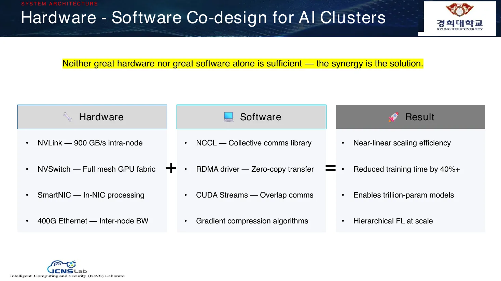

**직역**
> 시스템 아키텍처 (SYSTEM ARCHITECTURE)
>
> **AI 클러스터를 위한 하드웨어-소프트웨어 코디자인 (Hardware - Software Co-design for AI Clusters)**
> 훌륭한 하드웨어만으로도, 훌륭한 소프트웨어만으로도 충분하지 않다 — 시너지가 해법이다.
>
> **하드웨어 (Hardware)**
> - NVLink — 900 GB/s 인트라노드
> - NVSwitch — 풀메시 GPU 패브릭
> - SmartNIC — NIC 내 처리(In-NIC processing)
> - 400G 이더넷 — 인터노드 대역폭(BW)
>
> **+ 소프트웨어 (Software)**
> - NCCL — 집합 통신 라이브러리
> - RDMA 드라이버 — 제로카피 전송
> - CUDA 스트림(Streams) — 통신 오버랩(Overlap comms)
> - 그래디언트 압축 알고리즘 (Gradient compression algorithms)
>
> **= 결과 (Result)**
> - 거의 선형적인 스케일링 효율 (Near-linear scaling efficiency)
> - 학습 시간 40%+ 감소 (Reduced training time by 40%+)
> - 조 단위 파라미터 모델 가능 (Enables trillion-param models)
> - 대규모 계층적 FL (Hierarchical FL at scale)

**설명**
- 소프트웨어로 조절 가능한 것: CUDA 스트림으로 연산-통신 오버랩, 그래디언트 압축(gradient compression), 캐시 관리. 그래디언트 압축은 AI 전공이, 캐시/스케줄링은 네트워크(컴퓨터공학) 전공이 담당한다.
- Hardware/Software Co-design이 핵심 솔루션이며(단독으로는 안 됨), 결과 목표는 Near-linear scaling efficiency다. 논문 결과 학습 시간을 40% 이상 절감했다(주로 ResNet/MobileNet/ImageNet 같은 CNN 계열).

## 슬라이드 21

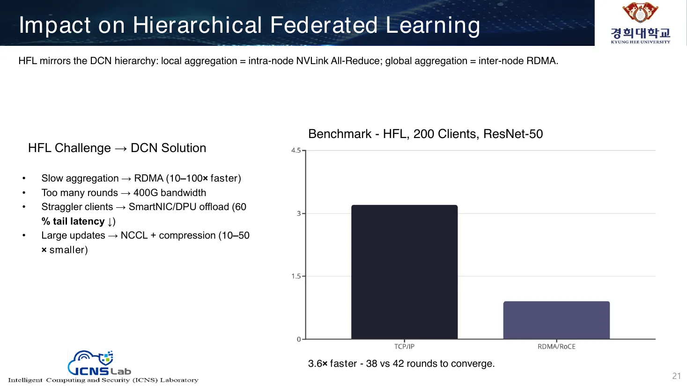

**직역**
> **계층적 연합학습에 대한 영향 (Impact on Hierarchical Federated Learning)**
> HFL은 DCN 위계를 미러링한다: 로컬 집계 = 인트라노드 NVLink All-Reduce; 전역 집계 = 인터노드 RDMA.
>
> **HFL 도전과제 → DCN 해법 (HFL Challenge → DCN Solution)**
> - 느린 집계 → RDMA (10–100배 빠름) (Slow aggregation → RDMA)
> - 너무 많은 라운드 → 400G 대역폭 (Too many rounds → 400G bandwidth)
> - 스트래글러 클라이언트 → SmartNIC/DPU 오프로드 (테일 레이턴시 60% ↓) (Straggler clients → SmartNIC/DPU offload)
> - 큰 업데이트 → NCCL + 압축 (10–50배 작아짐) (Large updates → NCCL + compression)
>
> **벤치마크 - HFL, 200 클라이언트, ResNet-50 (Benchmark - HFL, 200 Clients, ResNet-50)**
> (막대 그래프) TCP/IP (높음) 대 RDMA/RoCE (낮음)
> 3.6배 빠름 - 수렴까지 38 대 42 라운드. (3.6× faster - 38 vs 42 rounds to converge.)

**설명**
- 기존 연합학습은 단일 aggregation 서버 구조(flat)였는데, 이를 데이터 센터 Fat-Tree 구조에 맞춰 계층적(hierarchical)으로 구성하면 aggregation을 개선할 수 있다. 400G 대역을 fully utilize하고, too-many-rounds 문제를 완화하며, tail latency 감소 + NCCL 압축을 적용한다.
- ResNet 200 클라이언트로 HFL을 TCP/IP 대 RDMA(RoCE)로 비교한 연구가 존재한다.

## 슬라이드 22

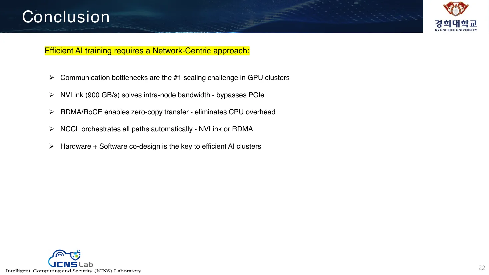

**직역**
> **결론 (Conclusion)**
> 효율적인 AI 학습은 네트워크 중심(Network-Centric) 접근을 요구한다:
>
> - 통신 병목은 GPU 클러스터에서 #1 스케일링 도전과제다.
> - NVLink(900 GB/s)는 인트라노드 대역폭을 해결한다 - PCIe를 우회한다.
> - RDMA/RoCE는 제로카피 전송을 가능하게 한다 - CPU 오버헤드를 제거한다.
> - NCCL은 모든 경로를 자동으로 오케스트레이션한다 - NVLink 또는 RDMA.
> - 하드웨어 + 소프트웨어 코디자인이 효율적인 AI 클러스터의 핵심이다.

**설명**
- 결론 키 메시지는 "Efficient AI training requires a network-centric approach" — 네트워크를 반드시 고려해 학습해야 한다는 것이다. 추론(inference) 시에도 적용이 필요하다(리얼타임 AI는 0.5~100ms 안에 응답해야 하는데 LLM 해석이 느림).

## 슬라이드 23

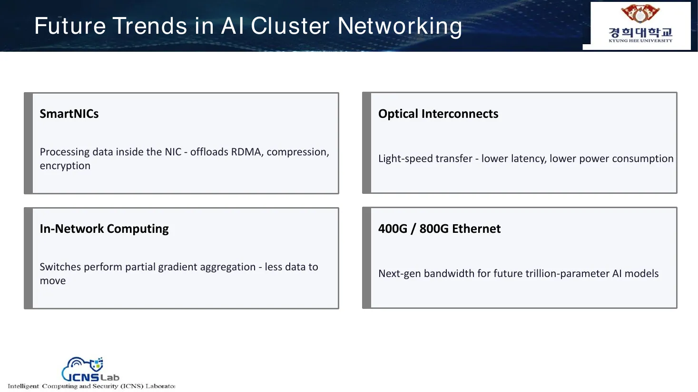

**직역**
> **AI 클러스터 네트워킹의 미래 트렌드 (Future Trends in AI Cluster Networking)**
>
> - **SmartNICs**: NIC 내부에서 데이터를 처리 - RDMA, 압축, 암호화를 오프로드.
> - **광 인터커넥트 (Optical Interconnects)**: 광속 전송 - 더 낮은 지연, 더 낮은 전력 소비.
> - **인-네트워크 컴퓨팅 (In-Network Computing)**: 스위치가 부분 그래디언트 집계(partial gradient aggregation) 수행 - 이동할 데이터가 줄어듦.
> - **400G / 800G 이더넷 (400G / 800G Ethernet)**: 미래의 조 단위 파라미터 AI 모델을 위한 차세대 대역폭.

**설명**
- 제로카피는 CPU 오버헤드뿐 아니라 열(에너지) 발생도 줄인다(메모리↔GPU 이동에서 열이 가장 많이 발생).
- Smart NIC / DPU(Data Processing Unit)는 NIC 안에서 데이터를 처리(바이패싱, DPDK 활용)한다. 가상 패스를 만들어 플로우별 로직을 처리하고, in-network computing으로 스위치가 partial aggregation을 수행하면 서버로 안 보내도 된다.

## 슬라이드 24

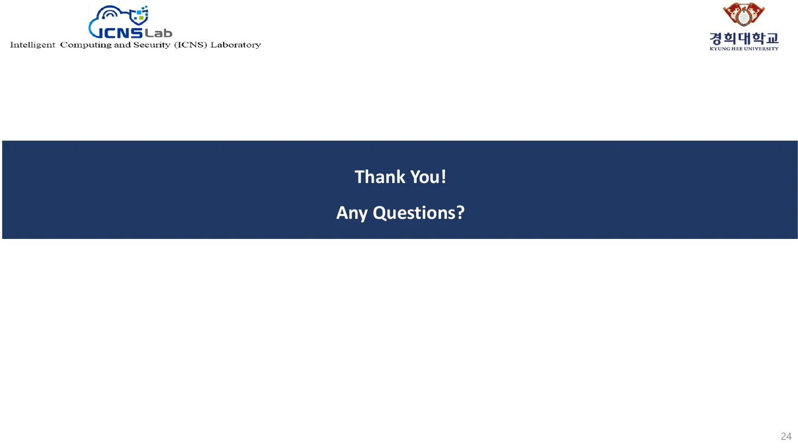

**직역**
> (ICNS Lab 로고 / 경희대학교 KYUNG HEE UNIVERSITY 로고)
>
> **감사합니다! (Thank You!)**
> **질문 있으신가요? (Any Questions?)**
