> 원본 슬라이드를 슬라이드별로 직역하고 강의 녹취 설명을 함께 정리한 노트.
> [← 전체 목차](/posts/ain-overview/)

## 슬라이드 1

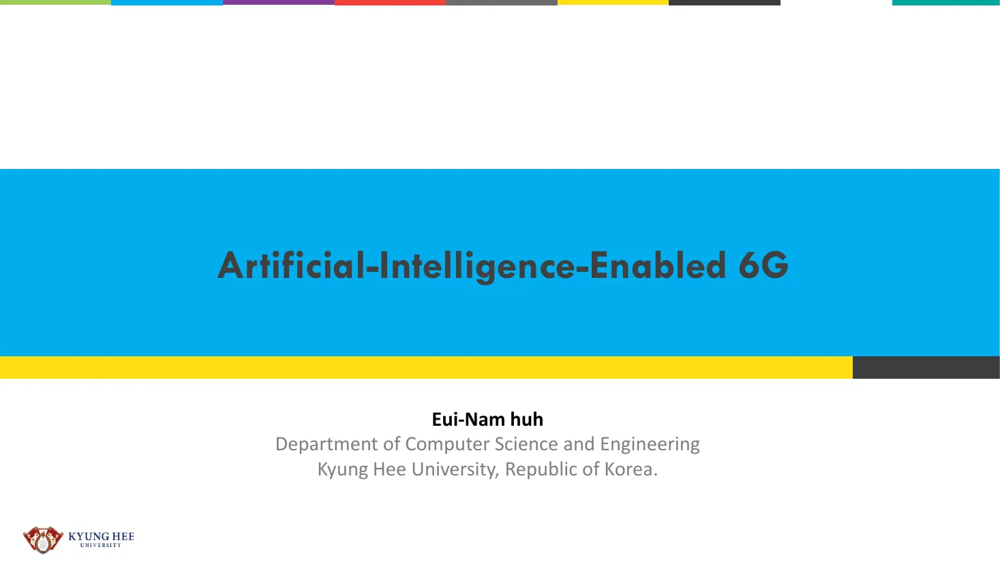

**직역**
> 인공지능 기반 6G (Artificial-Intelligence-Enabled 6G)
> Eui-Nam huh (허의남)
> 컴퓨터공학과 (Department of Computer Science and Engineering)
> 경희대학교, 대한민국 (Kyung Hee University, Republic of Korea.)

**설명**
- 6G는 아직 나오지 않은 기술이므로, 디테일보다 "왜 필요한지, 어떤 핵심 기술이 될 것인지, 앞으로 세상이 어떻게 바뀌고 우리가 어떤 플레이를 할 수 있을지"를 캐치하는 것이 강의의 목적.

## 슬라이드 2

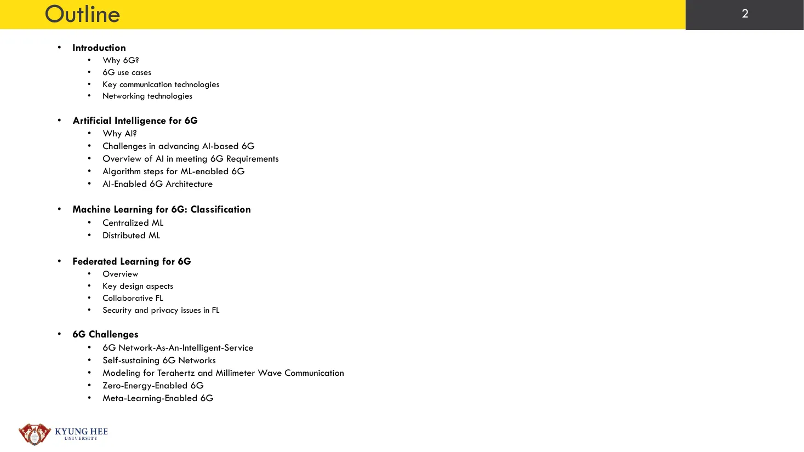

**직역**
> **목차 (Outline)**
>
> - 서론 (Introduction)
>   - 왜 6G인가? (Why 6G?)
>   - 6G 활용 사례 (6G use cases)
>   - 핵심 통신 기술 (Key communication technologies)
>   - 네트워킹 기술 (Networking technologies)
> - 6G를 위한 인공지능 (Artificial Intelligence for 6G)
>   - 왜 AI인가? (Why AI?)
>   - AI 기반 6G를 발전시키는 데의 도전 과제 (Challenges in advancing AI-based 6G)
>   - 6G 요구사항 충족에서 AI의 개요 (Overview of AI in meeting 6G Requirements)
>   - ML 기반 6G를 위한 알고리즘 단계 (Algorithm steps for ML-enabled 6G)
>   - AI 기반 6G 아키텍처 (AI-Enabled 6G Architecture)
> - 6G를 위한 머신러닝: 분류 (Machine Learning for 6G: Classification)
>   - 중앙집중식 ML (Centralized ML)
>   - 분산 ML (Distributed ML)
> - 6G를 위한 연합학습 (Federated Learning for 6G)
>   - 개요 (Overview)
>   - 핵심 설계 측면 (Key design aspects)
>   - 협력적 FL (Collaborative FL)
>   - FL의 보안과 프라이버시 문제 (Security and privacy issues in FL)
> - 6G의 도전 과제 (6G Challenges)
>   - 지능형 서비스로서의 6G 네트워크 (6G Network-As-An-Intelligent-Service)
>   - 자가 지속(self-sustaining) 6G 네트워크 (Self-sustaining 6G Networks)
>   - 테라헤르츠 및 밀리미터파 통신 모델링 (Modeling for Terahertz and Millimeter Wave Communication)
>   - 제로 에너지(Zero-Energy) 기반 6G (Zero-Energy-Enabled 6G)
>   - 메타러닝 기반 6G (Meta-Learning-Enabled 6G)

## 슬라이드 3

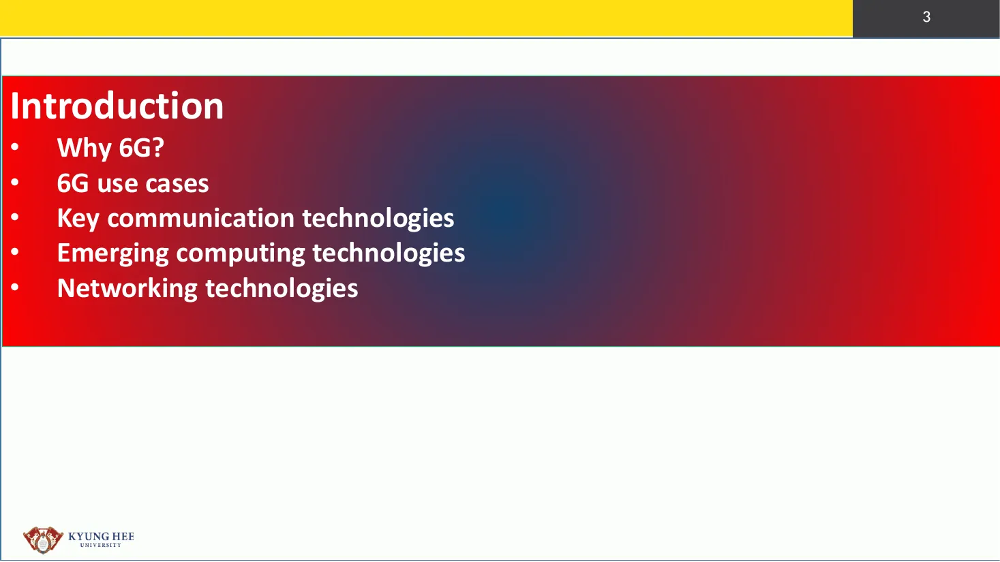

**직역**
> **서론 (Introduction)**
> - 왜 6G인가? (Why 6G?)
> - 6G 활용 사례 (6G use cases)
> - 핵심 통신 기술 (Key communication technologies)
> - 떠오르는 컴퓨팅 기술 (Emerging computing technologies)
> - 네트워킹 기술 (Networking technologies)

## 슬라이드 4

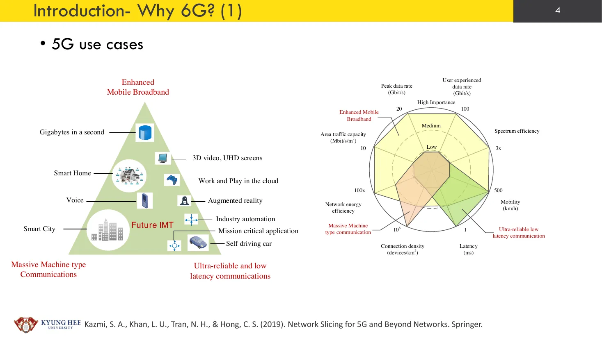

**직역**
> **서론 — 왜 6G인가? (1) (Introduction- Why 6G? (1))**
>
> - 5G 활용 사례 (5G use cases)
>
> (왼쪽 피라미드) 미래 IMT (Future IMT)
> - 강화된 모바일 광대역 (Enhanced Mobile Broadband)
>   - 초당 기가바이트 (Gigabytes in a second), 3D 비디오·UHD 화면 (3D video, UHD screens), 스마트홈 (Smart Home), 클라우드에서의 업무와 놀이 (Work and Play in the cloud), 음성 (Voice), 증강현실 (Augmented reality), 산업 자동화 (Industry automation), 스마트시티 (Smart City), 미션 크리티컬 응용 (Mission critical application), 자율주행차 (Self driving car)
> - 대규모 머신 타입 통신 (Massive Machine type Communications)
> - 초고신뢰·저지연 통신 (Ultra-reliable and low latency communications)
>
> (오른쪽 레이더 차트 — 5G 핵심 성능 지표)
> - 최대 데이터 전송률 (Peak data rate, Gbit/s): 20
> - 사용자 체감 데이터 전송률 (User experienced data rate, Gbit/s): 100
> - 스펙트럼 효율 (Spectrum efficiency): 3x
> - 이동성 (Mobility, km/h): 500
> - 지연 (Latency, ms): 1
> - 연결 밀도 (Connection density, devices/km²): 10⁶
> - 네트워크 에너지 효율 (Network energy efficiency): 100x
> - 면적당 트래픽 용량 (Area traffic capacity, Mbit/s/m²): 10
> - 중요도 등급: 높음(High Importance) / 중간(Medium) / 낮음(Low)
> - 강화된 모바일 광대역(Enhanced Mobile Broadband) → 높은 중요도, 대규모 머신 타입 통신(Massive Machine type communication) → 연결 밀도, 초고신뢰 저지연 통신(Ultra-reliable low latency communication) → 지연
>
> 출처: Kazmi, S. A., Khan, L. U., Tran, N. H., & Hong, C. S. (2019). Network Slicing for 5G and Beyond Networks. Springer.

**설명**
- 5G의 핵심은 모바일 중심(IMT, International Mobile Telecommunications). 3G/4G부터 해외에서도 자유롭게 사용, 5G에서 초당 기가비트급 요구 + 끊김 없는 reliability.
- 5G 3대 특징: eMBB(enhanced Mobile Broadband, 더 빠른 모바일 광대역), URLLC(Ultra-Reliable Low-Latency Communication, 높은 신뢰성+빠른 응답), mMTC(massive Machine Type Communication, 엄청나게 많은 머신 통신).
- 5G 설계 목표 예: 피크 20Gbps, 1km²당 100만(10⁶) 디바이스, 레이턴시 1ms, 고속 이동성(KTX/SRT) 지원.

## 슬라이드 5

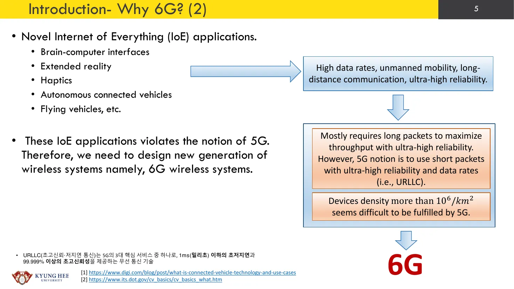

**직역**
> **서론 — 왜 6G인가? (2) (Introduction- Why 6G? (2))**
>
> - 새로운 만물인터넷(IoE) 응용 (Novel Internet of Everything (IoE) applications)
>   - 뇌-컴퓨터 인터페이스 (Brain-computer interfaces)
>   - 확장현실 (Extended reality)
>   - 햅틱스 (Haptics)
>   - 자율 커넥티드 차량 (Autonomous connected vehicles)
>   - 비행 차량 등 (Flying vehicles, etc.)
> - 이러한 IoE 응용들은 5G의 개념을 위배한다. 따라서 새로운 세대의 무선 시스템, 즉 6G 무선 시스템을 설계할 필요가 있다.
>
> (오른쪽 박스)
> - 높은 데이터 전송률, 무인 이동성, 장거리 통신, 초고신뢰성. (High data rates, unmanned mobility, long-distance communication, ultra-high reliability.)
> - 대부분 처리량(throughput)을 극대화하기 위해 초고신뢰성과 함께 긴 패킷(long packets)을 요구한다. 그러나 5G의 개념은 초고신뢰성·데이터 전송률과 함께 짧은 패킷(short packets)을 쓰는 것이다(즉, URLLC).
> - 10⁶/km²를 넘는 디바이스 밀도는 5G로 충족하기 어려워 보인다. → 6G
>
> - URLLC(초고신뢰·저지연 통신)는 5G의 3대 핵심 서비스 중 하나로, 1ms(밀리초) 이하의 초저지연과 99.999% 이상의 초고신뢰성을 제공하는 무선 통신 기술
>
> 출처: [1] https://www.digi.com/blog/post/what-is-connected-vehicle-technology-and-use-cases [2] https://www.its.dot.gov/cv_basics/cv_basics_what.htm

**설명**
- 새 애플리케이션 등장: XR, BCI(촉감 전달 등), 자율/커넥티드 디바이스, 군집 드론, IoE 애플리케이션.
- 6G에서는 긴 패킷(long packet)을 연속해서 보내는 트래픽 + 더 높은 device density가 필요 → 5G로는 한계.
- 핵심 키워드 IoE(Internet of Everything): 모든 것이 네트워킹화. high data rate + ultra-high reliability 요구.
- long distance 통신 요구로 저궤도 위성 통신(SpaceX Starlink 등)이 결합 → 지상뿐 아니라 공중(위)까지 함께 연결. 5G의 초고속·초연결을 넘어 AI 융합·지능형 자동화로 전환되는 방향.

## 슬라이드 6

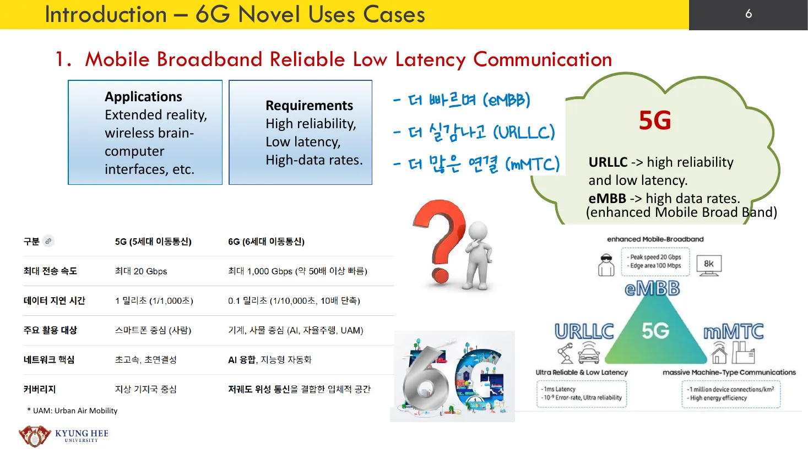

**직역**
> **서론 — 6G의 새로운 활용 사례 (Introduction – 6G Novel Uses Cases)**
>
> 1. 모바일 광대역 신뢰성 저지연 통신 (Mobile Broadband Reliable Low Latency Communication)
>
> | 응용 (Applications) | 요구사항 (Requirements) |
> |---|---|
> | 확장현실, 무선 뇌-컴퓨터 인터페이스 등 (Extended reality, wireless brain-computer interfaces, etc.) | 높은 신뢰성, 낮은 지연, 높은 데이터 전송률 (High reliability, Low latency, High-data rates.) |
>
> (오른쪽) 5G:
> - URLLC → 높은 신뢰성과 낮은 지연 (high reliability and low latency).
> - eMBB → 높은 데이터 전송률 (high data rates). (enhanced Mobile Broad Band)
>
> * UAM: 도심 항공 모빌리티 (Urban Air Mobility)

## 슬라이드 7

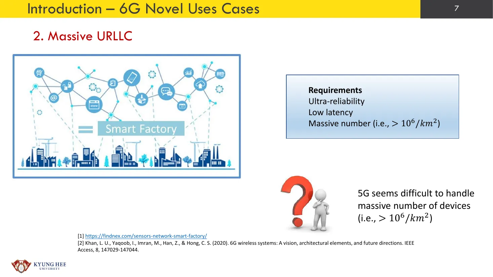

**직역**
> **서론 — 6G의 새로운 활용 사례 (Introduction – 6G Novel Uses Cases)**
>
> 2. 대규모 URLLC (Massive URLLC)
>
> 요구사항 (Requirements)
> - 초고신뢰성 (Ultra-reliability)
> - 저지연 (Low latency)
> - 대규모 수량 (Massive number, 즉 > 10⁶/km²)
>
> (오른쪽 박스) 5G는 대규모 수의 디바이스(즉 > 10⁶/km²)를 처리하기 어려워 보인다. (5G seems difficult to handle massive number of devices.)
>
> 출처: [1] https://findnex.com/sensors-network-smart-factory/ [2] Khan, L. U., Yaqoob, I., Imran, M., Han, Z., & Hong, C. S. (2020). 6G wireless systems: A vision, architectural elements, and future directions. IEEE Access, 8, 147029-147044.

## 슬라이드 8

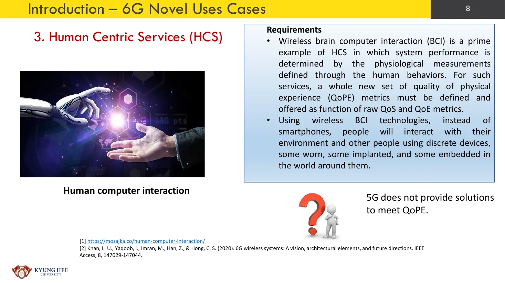

**직역**
> **서론 — 6G의 새로운 활용 사례 (Introduction – 6G Novel Uses Cases)**
>
> 3. 인간 중심 서비스 (Human Centric Services, HCS)
> (그림 라벨) 인간-컴퓨터 상호작용 (Human computer interaction)
>
> 요구사항 (Requirements)
> - 무선 뇌-컴퓨터 상호작용(BCI)은 HCS의 대표적 예로, 시스템 성능이 인간 행동을 통해 정의되는 생리학적 측정값(physiological measurements)에 의해 결정된다. 이러한 서비스를 위해서는 원시 QoS와 QoE 지표의 함수로서 전혀 새로운 물리적 경험 품질(QoPE, quality of physical experience) 지표 집합을 정의하고 제공해야 한다.
> - 무선 BCI 기술을 사용하면, 사람들은 스마트폰 대신 일부는 착용하고 일부는 이식하며 일부는 주변 세계에 내장된 개별 장치(discrete devices)를 통해 환경 및 다른 사람들과 상호작용하게 될 것이다.
>
> (오른쪽 박스) 5G는 QoPE를 충족하는 솔루션을 제공하지 못한다. (5G does not provide solutions to meet QoPE.)
>
> 출처: [1] https://mozajka.co/human-computer-interaction/ [2] Khan, L. U., Yaqoob, I., Imran, M., Han, Z., & Hong, C. S. (2020). 6G wireless systems... IEEE Access, 8, 147029-147044.

**설명**
- HCS는 사람 몸에 들어가 생체 효율을 측정(Physical Experience Metrics) → 의료/헬스케어 활용. 아주 빠른 경험 서비스 제공이 요구되며 대부분 무선(wireless).

## 슬라이드 9

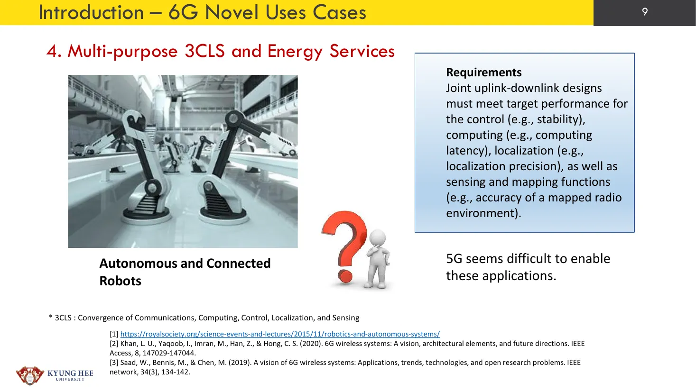

**직역**
> **서론 — 6G의 새로운 활용 사례 (Introduction – 6G Novel Uses Cases)**
>
> 4. 다목적 3CLS 및 에너지 서비스 (Multi-purpose 3CLS and Energy Services)
> (그림 라벨) 자율 및 커넥티드 로봇 (Autonomous and Connected Robots)
>
> 요구사항 (Requirements)
> - 결합된 상향링크-하향링크 설계(Joint uplink-downlink designs)는 제어(예: 안정성), 컴퓨팅(예: 컴퓨팅 지연), 위치추정(예: 위치추정 정밀도), 그리고 감지·매핑 기능(예: 매핑된 무선 환경의 정확도)에 대한 목표 성능을 충족해야 한다.
>
> (오른쪽 박스) 5G는 이러한 응용을 가능케 하기 어려워 보인다. (5G seems difficult to enable these applications.)
>
> * 3CLS: 통신·컴퓨팅·제어·위치추정·감지의 융합 (Convergence of Communications, Computing, Control, Localization, and Sensing)
>
> 출처: [1] royalsociety.org [2] Khan, L. U. et al. (2020). 6G wireless systems... IEEE Access [3] Saad, W., Bennis, M., & Chen, M. (2019). A vision of 6G wireless systems... IEEE network, 34(3), 134-142.

**설명**
- CCC / 3CLS: Communication-Computing-Control(국방의 C4I와 유사 개념. C4I = Command/Communication/Control/Computing + Intelligence). 로봇 맥락에서는 3CLS = + Localization + Sensing. 컨트롤은 매우 민감·빠른 실시간 반응 요구.
- MPS(Multipurpose 3CLS and Energy Services, 의료 로봇 수술 등): 통신+컴퓨팅+컨트롤 결합. (정식 명칭은 슬라이드 10 표기대로 Multipurpose이며, 강의 구두로는 "멀티 퍼포먼스"라고 언급함.)
- 시사점: 서비스 종류마다 네트워크 요구사항이 다른데, 하나의 거대한 이름(6G)으로 다양한 요구를 만족시키려 함.

## 슬라이드 10

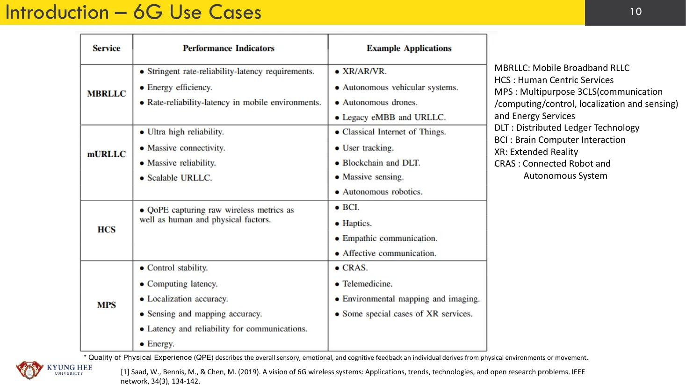

**직역**
> **서론 — 6G 활용 사례 (Introduction – 6G Use Cases)**
>
> | 서비스 (Service) | 성능 지표 (Performance Indicators) | 응용 예 (Example Applications) |
> |---|---|---|
> | MBRLLC | 엄격한 전송률-신뢰성-지연 요구사항; 에너지 효율; 모바일 환경에서의 전송률-신뢰성-지연 | XR/AR/VR; 자율 차량 시스템; 자율 드론; 레거시 eMBB와 URLLC |
> | mURLLC | 초고신뢰성; 대규모 연결성; 대규모 신뢰성; 확장 가능한 URLLC | 고전적 사물인터넷; 사용자 추적; 블록체인과 DLT; 대규모 감지; 자율 로보틱스 |
> | HCS | 인간적·물리적 요인과 함께 원시 무선 지표를 포착하는 QoPE | BCI; 햅틱스; 공감적 통신(Empathic communication); 감정적 통신(Affective communication) |
> | MPS | 제어 안정성; 컴퓨팅 지연; 위치추정 정확도; 감지·매핑 정확도; 통신을 위한 지연·신뢰성; 에너지 | CRAS; 원격의료(Telemedicine); 환경 매핑·영상화; XR 서비스의 일부 특수 사례 |
>
> (오른쪽 약어 설명)
> - MBRLLC: Mobile Broadband Reliable Low Latency Communication
> - HCS: Human Centric Services
> - MPS: Multipurpose 3CLS(communication/computing/control, localization and sensing) and Energy Services
> - DLT: Distributed Ledger Technology
> - BCI: Brain Computer Interaction
> - XR: Extended Reality
> - CRAS: Connected Robot and Autonomous System
>
> * 물리적 경험 품질(QPE, Quality of Physical Experience)은 개인이 물리적 환경 또는 움직임에서 얻는 전체적인 감각적, 감정적, 인지적 피드백을 설명한다.
>
> 출처: Saad, W., Bennis, M., & Chen, M. (2019). A vision of 6G wireless systems... IEEE network, 34(3), 134-142.

## 슬라이드 11

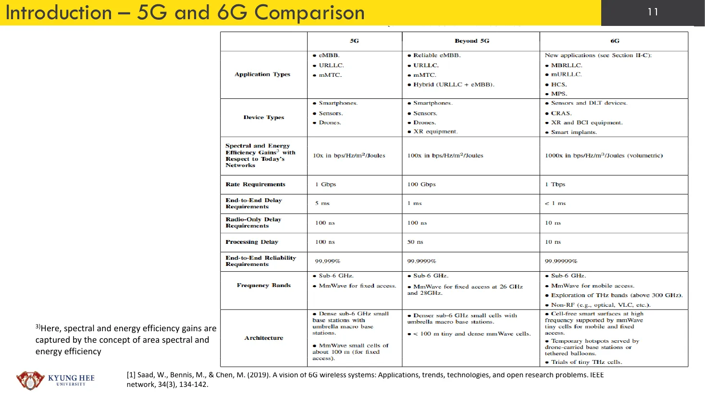

**직역**
> **서론 — 5G와 6G 비교 (Introduction – 5G and 6G Comparison)**
>
> | 항목 | 5G | 비욘드 5G (Beyond 5G) | 6G |
> |---|---|---|---|
> | 응용 유형 (Application Types) | eMBB; URLLC; mMTC | 신뢰성 eMBB; URLLC; mMTC; 하이브리드(URLLC + eMBB) | 신규 응용(II-C절 참조): MBRLLC; mURLLC; HCS; MPS |
> | 디바이스 유형 (Device Types) | 스마트폰; 센서; 드론 | 스마트폰; 센서; 드론; XR 장비 | 센서와 DLT 디바이스; CRAS; XR 및 BCI 장비; 스마트 임플란트 |
> | 오늘날 네트워크 대비 스펙트럼·에너지 효율 이득³ (Spectral and Energy Efficiency Gains) | 10x (bps/Hz/m²/Joules) | 100x (bps/Hz/m²/Joules) | 1000x (bps/Hz/m³/Joules, 부피 단위 volumetric) |
> | 전송률 요구사항 (Rate Requirements) | 1 Gbps | 100 Gbps | 1 Tbps |
> | 종단간 지연 요구사항 (End-to-End Delay Requirements) | 5 ms | 1 ms | < 1 ms |
> | 무선 전용 지연 요구사항 (Radio-Only Delay Requirements) | 100 ns | 100 ns | 10 ns |
> | 처리 지연 (Processing Delay) | 100 ns | 50 ns | 10 ns |
> | 종단간 신뢰성 요구사항 (End-to-End Reliability Requirements) | 99.999% | 99.9999% | 99.99999% |
> | 주파수 대역 (Frequency Bands) | 6GHz 이하; 고정 액세스용 mmWave | 6GHz 이하; 26·28GHz의 고정 액세스용 mmWave | 6GHz 이하; 모바일 액세스용 mmWave; THz 대역 탐색(300GHz 이상); 비-RF(예: 광, VLC 등) |
> | 아키텍처 (Architecture) | 우산형 매크로 기지국을 갖춘 조밀한 6GHz 이하 소형 기지국; 약 100m 이하의 조밀한 mmWave 소형 셀 | 우산형 매크로 기지국을 갖춘 조밀한 6GHz 이하 소형 셀; 100m 미만의 작고 조밀한 mmWave 셀 | 높은 주파수에서 셀-프리(cell-free) 스마트 표면; 모바일 mmWave 액세스용 초소형 셀; 테더링된 풍선이나 드론 운반 기지국이 제공하는 임시 핫스팟 |
>
> 3) 여기서 스펙트럼·에너지 효율 이득은 면적 스펙트럼 효율 및 에너지 효율(area spectral and energy efficiency) 개념으로 포착된다.
>
> 출처: Saad, W., Bennis, M., & Chen, M. (2019). A vision of 6G wireless systems... IEEE network, 34(3), 134-142.

**설명**
- 6G 목표(5G 대비): 속도 약 50배 이상(20Gbps→1Tbps급), 지연 1ms→0.1ms 수준, 신뢰성 99.99999%. 코어뿐 아니라 엔드까지(transceiver→receiver) 성능을 고려.

## 슬라이드 12

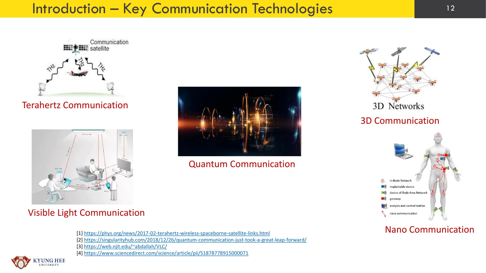

**직역**
> **서론 — 핵심 통신 기술 (Introduction – Key Communication Technologies)**
>
> (그림 라벨)
> - 테라헤르츠 통신 (Terahertz Communication) — 통신 위성(Communication Satellite)
> - 가시광 통신 (Visible Light Communication)
> - 양자 통신 (Quantum Communication)
> - 3D 통신 / 3D 네트워크 (3D Communication / 3D Networks)
> - 나노 통신 (Nano Communication)
>
> 출처: [1] phys.org (terahertz wireless spaceborne satellite links) [2] singularityhub.com (quantum communication) [3] web.njit.edu/~abdallah/VLC/ [4] sciencedirect.com

**설명**
- 6G 주파수 대역은 THz(테라헤르츠) 단위까지 올라가야 함: 멀고 빠르게 가기 위한 주파수.
- 양자 통신(Quantum Communication): 먼 미래 기술로 분류.
- Light Communication(VLC/LiFi, LED communication): 빛에 데이터를 실어 통신. Optical wireless. 몸속(in-body)에는 적용 어려움. (이계삼 교수 일화 — 자동차 라이트로 앞차에 신호/데이터를 전달하는 식으로 빛 통신을 활용할 수 있음.)
- 3D Network: 드론 + 위성 + 지상을 3차원으로 연결. 주변 디바이스가 액세스 포인트 역할을 하는 cell-free 개념.
- Nano Communication(in-body): 몸속 나노 센서로 데이터 수집·전송. WBAN(Wireless Body Area Network).

## 슬라이드 13

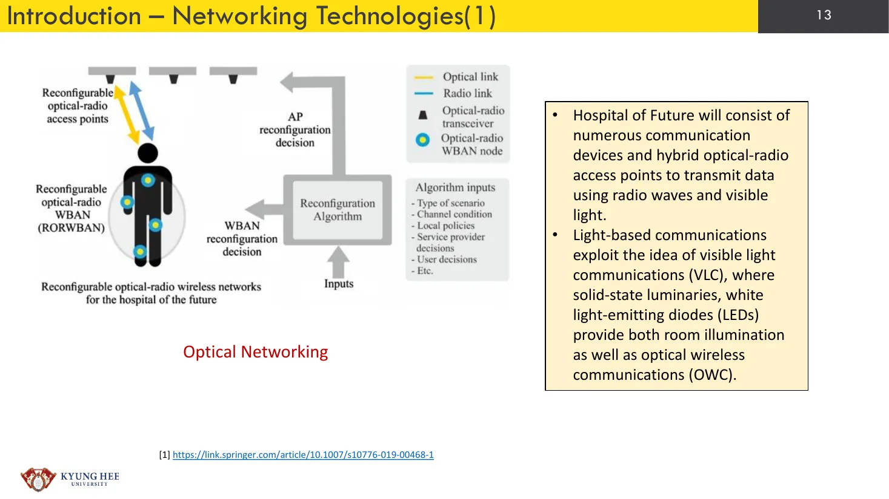

**직역**
> **서론 — 네트워킹 기술 (1) (Introduction – Networking Technologies(1))**
> (그림 라벨) 광 네트워킹 (Optical Networking)
>
> - 미래의 병원(Hospital of Future)은 무수히 많은 통신 장치와, 전파(radio waves)와 가시광(visible light)을 사용해 데이터를 전송하는 하이브리드 광-무선 액세스 포인트(hybrid optical-radio access points)로 구성될 것이다.
> - 빛 기반 통신(Light-based communications)은 가시광 통신(VLC, visible light communications)의 아이디어를 활용하는데, 고체 상태 조명기구(solid-state luminaries), 백색 발광 다이오드(white LEDs)가 실내 조명과 광 무선 통신(OWC, optical wireless communications)을 모두 제공한다.
>
> 출처: [1] https://link.springer.com/article/10.1007/s10776-019-00468-1

## 슬라이드 14

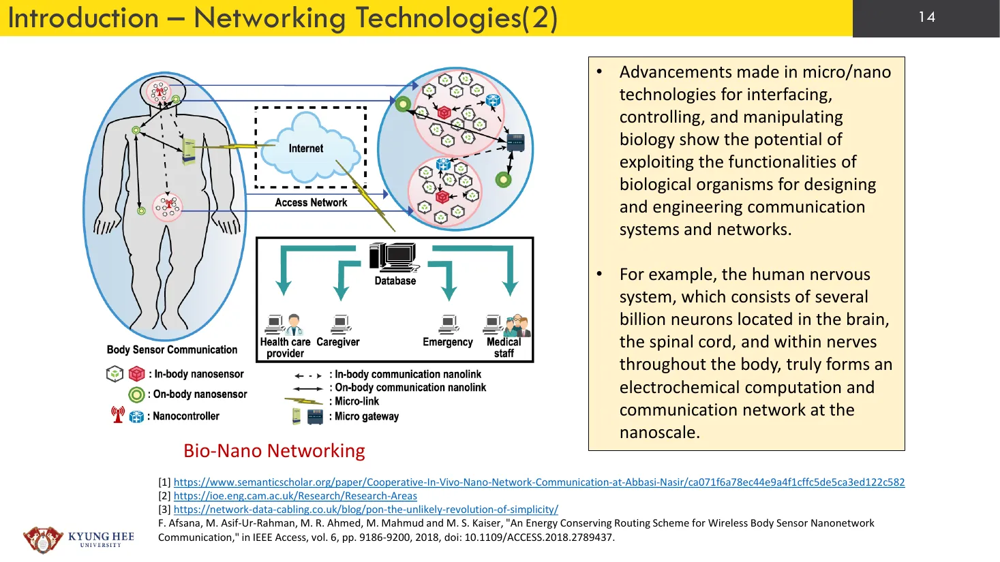

**직역**
> **서론 — 네트워킹 기술 (2) (Introduction – Networking Technologies(2))**
> (그림 라벨) 바이오-나노 네트워킹 (Bio-Nano Networking)
>
> - 생물학을 인터페이스·제어·조작하기 위한 마이크로/나노 기술의 발전은, 통신 시스템과 네트워크를 설계·공학하기 위해 생물학적 유기체의 기능을 활용할 수 있는 잠재력을 보여준다.
> - 예를 들어, 뇌·척수·신체 전반의 신경 속에 위치한 수십억 개의 뉴런으로 구성된 인간 신경계는, 진정으로 나노스케일에서 전기화학적 계산 및 통신 네트워크(electrochemical computation and communication network)를 형성한다.
>
> 출처: [1] semanticscholar.org [2] ioe.eng.cam.ac.uk [3] network-data-cabling.co.uk; F. Afsana et al., "An Energy Conserving Routing Scheme for Wireless Body Sensor Nanonetwork Communication," IEEE Access, vol. 6, pp. 9186-9200, 2018.

**설명**
- 모든 것이 소형화(배터리 포함)됨. (사례: 오토바이 사고 후 신경 통증 → 신경 다발을 끊고 장치가 신호를 받아 정상 신호로 변환해 올려보내는 국내 제품.)

## 슬라이드 15

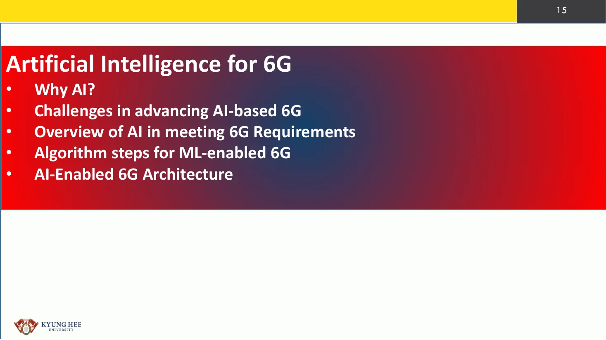

**직역**
> **6G를 위한 인공지능 (Artificial Intelligence for 6G)**
> - 왜 AI인가? (Why AI?)
> - AI 기반 6G를 발전시키는 데의 도전 과제 (Challenges in advancing AI-based 6G)
> - 6G 요구사항 충족에서 AI의 개요 (Overview of AI in meeting 6G Requirements)
> - ML 기반 6G를 위한 알고리즘 단계 (Algorithm steps for ML-enabled 6G)
> - AI 기반 6G 아키텍처 (AI-Enabled 6G Architecture)

## 슬라이드 16

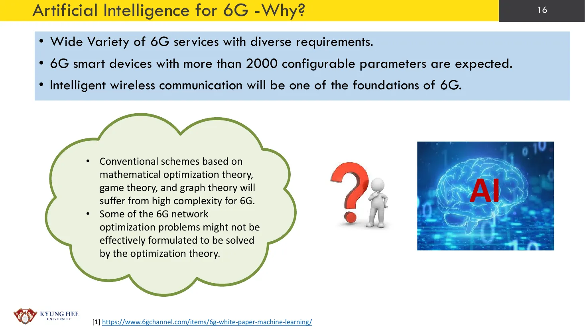

**직역**
> **6G를 위한 인공지능 — 왜? (Artificial Intelligence for 6G -Why?)**
>
> - 다양한 요구사항을 가진 매우 다양한 6G 서비스. (Wide Variety of 6G services with diverse requirements.)
> - 2000개 이상의 설정 가능 파라미터(configurable parameters)를 갖는 6G 스마트 디바이스가 예상된다.
> - 지능형 무선 통신(Intelligent wireless communication)이 6G의 기초 중 하나가 될 것이다.
>
> (왼쪽 박스 → AI)
> - 수학적 최적화 이론(mathematical optimization theory), 게임 이론(game theory), 그래프 이론(graph theory)에 기반한 기존 방식들은 6G에서 높은 복잡도(high complexity)로 인해 어려움을 겪을 것이다.
> - 일부 6G 네트워크 최적화 문제는 최적화 이론으로 풀 수 있도록 효과적으로 정식화(formulate)되지 못할 수도 있다.
> → AI
>
> 출처: [1] https://www.6gchannel.com/items/6g-white-paper-machine-learning/

**설명**
- 다양한 서비스 요구를 분석하니 약 2000개 파라미터의 조합 → complexity가 너무 높아 기존 5G의 수학적 최적화(optimization theory, game theory)로는 처리 어려움 → AI로 해결.
- 핵심 명제: Intelligent Wireless Communication(AI 기반 무선 통신)이 6G의 기초 모델(foundation model)이 될 것.

## 슬라이드 17

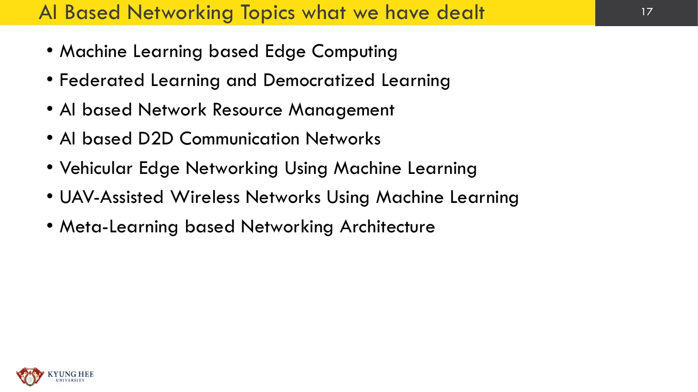

**직역**
> **우리가 다뤄온 AI 기반 네트워킹 주제들 (AI Based Networking Topics what we have dealt)**
>
> - 머신러닝 기반 엣지 컴퓨팅 (Machine Learning based Edge Computing)
> - 연합학습 및 민주화된 학습 (Federated Learning and Democratized Learning)
> - AI 기반 네트워크 자원 관리 (AI based Network Resource Management)
> - AI 기반 D2D 통신 네트워크 (AI based D2D Communication Networks)
> - 머신러닝을 사용한 차량 엣지 네트워킹 (Vehicular Edge Networking Using Machine Learning)
> - 머신러닝을 사용한 UAV 보조 무선 네트워크 (UAV-Assisted Wireless Networks Using Machine Learning)
> - 메타러닝 기반 네트워킹 아키텍처 (Meta-Learning based Networking Architecture)

**설명**
- AI 적용 방향: 엣지로 연산을 넘김, 연합학습, 민주화된(democratized) 러닝 — 정해진 노드만 학습에 참여시키지 말고 모두가 참여해 파라미터(의견)를 보낼 수 있게 하자(민주주의 투표 비유).
- 머신러닝 = 학습 + 추론(inference) 둘 다 포함. Meta-learning(메타화된 정보로 네트워크 구조를 학습)도 등장.

## 슬라이드 18

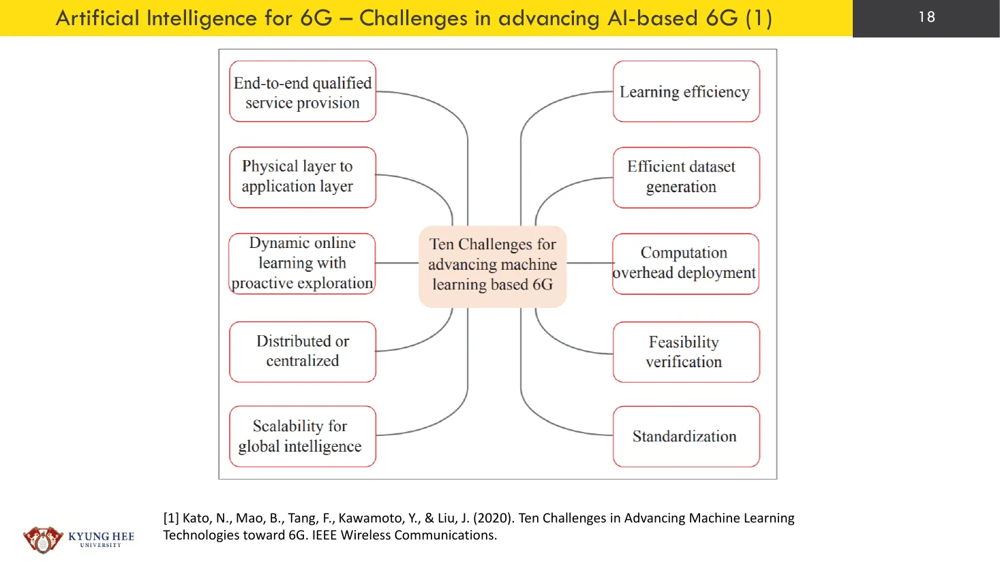

**직역**
> **6G를 위한 인공지능 — AI 기반 6G를 발전시키는 데의 도전 과제 (1) (Challenges in advancing AI-based 6G (1))**
>
> (중앙) ML 기반 6G를 발전시키기 위한 10가지 도전 과제 (Ten Challenges for advancing machine learning based 6G)
> 주변 10개 과제:
> - 종단간 자격을 갖춘 서비스 제공 (End-to-End qualified service provision)
> - 물리 계층에서 응용 계층까지 (Physical layer to application layer)
> - 능동적 탐색을 동반한 동적 온라인 학습 (Dynamic online learning with proactive exploration)
> - 분산형 또는 중앙집중형 (Distributed or centralized)
> - 전역 지능을 위한 확장성 (Scalability for global intelligence)
> - 학습 효율 (Learning efficiency)
> - 효율적 데이터셋 생성 (Efficient dataset generation)
> - 계산 오버헤드 배포 (Computation overhead deployment)
> - 실현 가능성 검증 (Feasibility verification)
> - 표준화 (Standardization)
>
> 출처: Kato, N., Mao, B., Tang, F., Kawamoto, Y., & Liu, J. (2020). Ten Challenges in Advancing Machine Learning Technologies toward 6G. IEEE Wireless Communications.

## 슬라이드 19

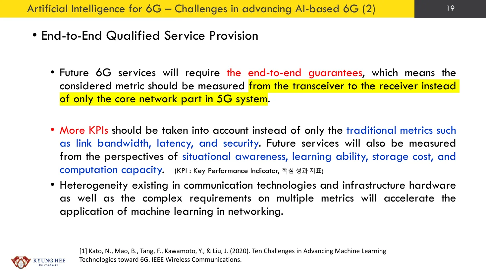

**직역**
> **AI 기반 6G의 도전 과제 (2) (Challenges in advancing AI-based 6G (2))**
>
> - 종단간 자격을 갖춘 서비스 제공 (End-to-End Qualified Service Provision)
>   - 미래 6G 서비스는 종단간 보장(end-to-end guarantees)을 요구한다. 즉 5G 시스템처럼 코어 네트워크 부분만이 아니라, 송신기(transceiver)에서 수신기(receiver)까지 고려하는 지표가 측정되어야 한다.
>   - 링크 대역폭·지연·보안 같은 전통적 지표만이 아니라 더 많은 KPI가 고려되어야 한다. 미래 서비스는 상황 인지(situational awareness), 학습 능력(learning ability), 저장 비용(storage cost), 계산 용량(computation capacity)의 관점에서도 측정될 것이다. (KPI: Key Performance Indicator, 핵심 성과 지표)
>   - 통신 기술과 인프라 하드웨어에 존재하는 이질성(heterogeneity)과 다중 지표에 대한 복잡한 요구사항이 네트워킹에서 머신러닝의 적용을 가속화할 것이다.
>
> 출처: Kato, N. et al. (2020). Ten Challenges... IEEE Wireless Communications.

**설명**
- KPI 변화: 기존 매트릭(레이턴시·대역폭)만으론 부족. Future service의 다양한 metric(러닝 능력, 스토리지 코스트, 컴퓨팅 코스트, 상황 인지 등) 고려 필요. 6G는 코어뿐 아니라 엔드까지 성능 고려.

## 슬라이드 20

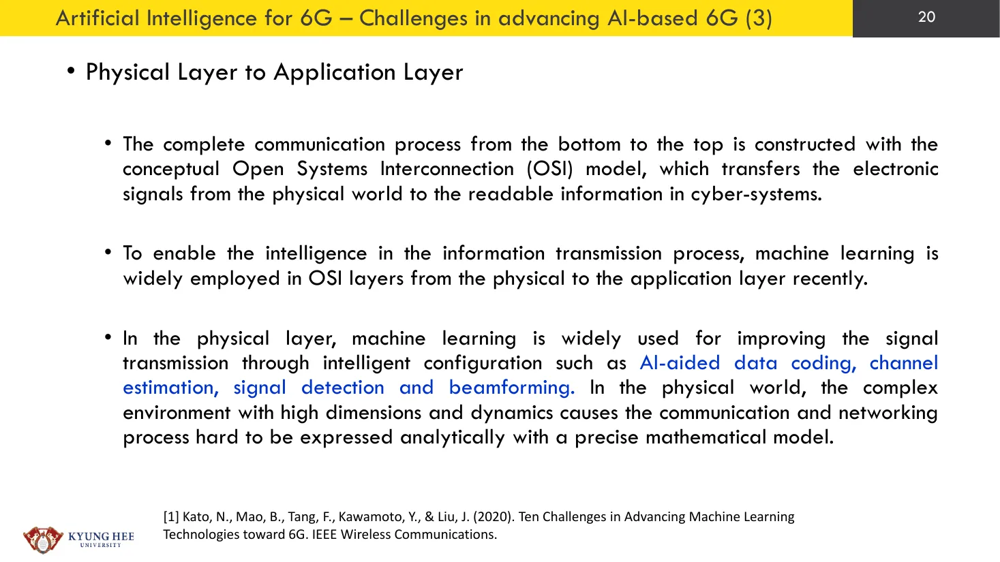

**직역**
> **AI 기반 6G의 도전 과제 (3) (Challenges in advancing AI-based 6G (3))**
>
> - 물리 계층에서 응용 계층까지 (Physical Layer to Application Layer)
>   - 아래에서 위까지의 완전한 통신 과정은 개념적 OSI(Open Systems Interconnection) 모델로 구성되며, 이는 물리 세계의 전자 신호를 사이버 시스템에서 읽을 수 있는 정보로 전달한다.
>   - 정보 전송 과정에서 지능을 가능케 하기 위해, 최근 머신러닝이 물리 계층부터 응용 계층까지 OSI 계층 전반에 널리 사용되고 있다.
>   - 물리 계층에서 머신러닝은 AI 보조 데이터 코딩(data coding), 채널 추정(channel estimation), 신호 검출(signal detection), 빔포밍(beamforming) 같은 지능형 구성을 통해 신호 전송을 개선하는 데 널리 쓰인다. 물리 세계에서는 높은 차원과 동적 변화를 가진 복잡한 환경 때문에 통신·네트워킹 과정을 정밀한 수학적 모델로 해석적으로 표현하기 어렵다.
>
> 출처: Kato, N. et al. (2020). Ten Challenges... IEEE Wireless Communications.

**설명**
- 물리 계층: 채널 estimation, signal detection, beamforming/안테나, 코딩 선택.
- 계층별 AI 적용에서 네트워크 전공의 핵심은 Transport Layer + Network Layer(트래픽 예측·클러스터링·트래픽 컨트롤, 라우팅·전력·스펙트럼 컨트롤, 네트워크 association).

## 슬라이드 21

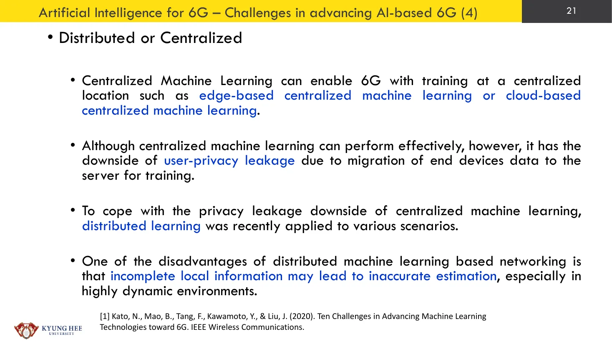

**직역**
> **AI 기반 6G의 도전 과제 (4) (Challenges in advancing AI-based 6G (4))**
>
> - 분산형 또는 중앙집중형 (Distributed or Centralized)
>   - 중앙집중식 머신러닝(Centralized Machine Learning)은 엣지 기반 또는 클라우드 기반의 중앙 위치에서 학습을 수행해 6G를 가능케 할 수 있다.
>   - 중앙집중식 머신러닝은 효과적으로 동작할 수 있으나, 학습을 위해 단말 장치 데이터를 서버로 이동시키기 때문에 사용자 프라이버시 누출(user-privacy leakage)이라는 단점이 있다.
>   - 중앙집중식 머신러닝의 프라이버시 누출 단점에 대응하기 위해, 최근 분산 학습(distributed learning)이 다양한 시나리오에 적용되었다.
>   - 분산 머신러닝 기반 네트워킹의 단점 중 하나는, 불완전한 지역 정보(incomplete local information)가 특히 매우 동적인 환경에서 부정확한 추정으로 이어질 수 있다는 것이다.
>
> 출처: Kato, N. et al. (2020). Ten Challenges... IEEE Wireless Communications.

**설명**
- Centralized는 데이터가 모여 효율적이나 프라이버시·수집 불가 데이터 문제 → 분산/연합학습으로 진화. 분산 학습 문제는 incomplete local information, 지역별 dynamic 차이로 교환 시 불일치 → 각 특성 반영, key anchor 두는 논문들이 있음.

## 슬라이드 22

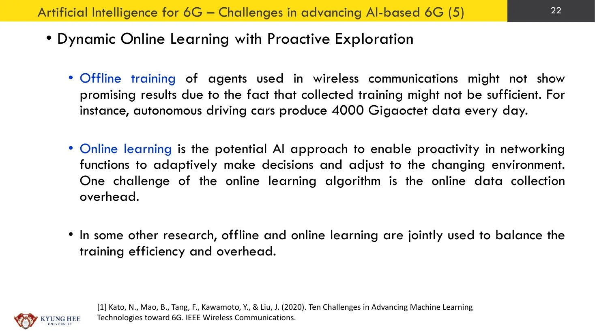

**직역**
> **AI 기반 6G의 도전 과제 (5) (Challenges in advancing AI-based 6G (5))**
>
> - 능동적 탐색을 동반한 동적 온라인 학습 (Dynamic Online Learning with Proactive Exploration)
>   - 무선 통신에 쓰이는 에이전트의 오프라인 학습(Offline training)은, 수집된 학습 데이터가 충분하지 않을 수 있다는 사실 때문에 유망한 결과를 보이지 못할 수 있다. 예를 들어 자율주행차는 매일 4000 기가옥텟(Gigaoctet)의 데이터를 생성한다.
>   - 온라인 학습(Online learning)은 변화하는 환경에 적응적으로 결정을 내리고 조정하기 위해 네트워킹 기능에 능동성(proactivity)을 부여할 수 있는 유망한 AI 접근법이다. 온라인 학습 알고리즘의 한 가지 도전 과제는 온라인 데이터 수집 오버헤드이다.
>   - 일부 다른 연구에서는 학습 효율과 오버헤드의 균형을 위해 오프라인과 온라인 학습을 결합해(jointly) 사용한다.
>
> 출처: Kato, N. et al. (2020). Ten Challenges... IEEE Wireless Communications.

**설명**
- 오프라인은 사람이 라벨링, 무선 환경에선 데이터가 너무 많아(예: 자율주행 4TB/day급) 한계 → 온라인은 피드백으로 데이터셋 생성·계산. Offline+Online을 조인트로 섞는 접근, Centralized+Decentralized 혼합도 존재.

## 슬라이드 23

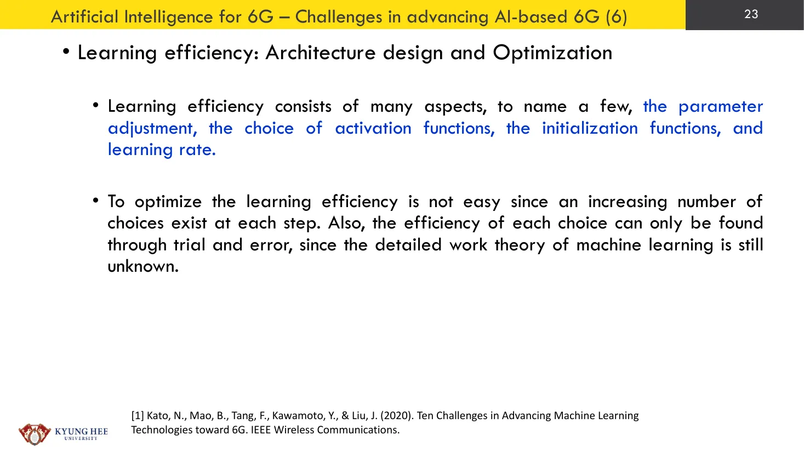

**직역**
> **AI 기반 6G의 도전 과제 (6) (Challenges in advancing AI-based 6G (6))**
>
> - 학습 효율: 아키텍처 설계와 최적화 (Learning efficiency: Architecture design and Optimization)
>   - 학습 효율은 많은 측면으로 구성된다. 몇 가지 예를 들면 파라미터 조정(parameter adjustment), 활성화 함수의 선택(choice of activation functions), 초기화 함수(initialization functions), 학습률(learning rate) 등이다.
>   - 각 단계마다 점점 더 많은 선택지가 존재하므로 학습 효율을 최적화하기란 쉽지 않다. 또한 머신러닝의 상세한 작동 이론이 아직 알려져 있지 않으므로, 각 선택의 효율은 오직 시행착오(trial and error)를 통해서만 찾을 수 있다.
>
> 출처: Kato, N. et al. (2020). Ten Challenges... IEEE Wireless Communications.

**설명**
- 하이퍼파라미터(activation function: ReLU, tanh 등, weight initialization, learning rate, batch size 등) 조정에 따라 모델 성능이 달라짐 → SoTA 논문은 어떤 metric/하이퍼파라미터로 어떤 결과를 냈는지 공개해야 함.
- 학습 효율을 위해 (앞 강의의) RDMA·NVLink·NCCL 계열 분산 학습 가속 기술을 활용하고, 학습 자체를 돕는 AI도 도입.

## 슬라이드 24

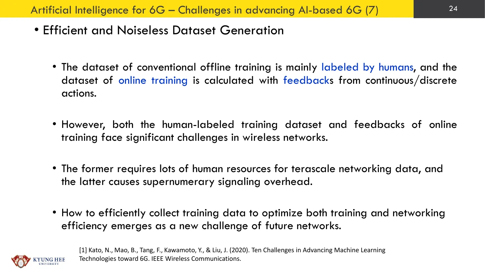

**직역**
> **AI 기반 6G의 도전 과제 (7) (Challenges in advancing AI-based 6G (7))**
>
> - 효율적이고 잡음 없는 데이터셋 생성 (Efficient and Noiseless Dataset Generation)
>   - 기존 오프라인 학습의 데이터셋은 주로 사람에 의해 라벨링되며, 온라인 학습의 데이터셋은 연속/이산 행동의 피드백으로 계산된다.
>   - 그러나 사람이 라벨링한 학습 데이터셋과 온라인 학습의 피드백 모두 무선 네트워크에서 상당한 도전 과제에 직면한다.
>   - 전자는 테라스케일(terascale) 네트워킹 데이터에 대해 많은 인적 자원을 요구하고, 후자는 과도한 시그널링 오버헤드(supernumerary signaling overhead)를 유발한다.
>   - 학습 효율과 네트워킹 효율을 모두 최적화하기 위해 학습 데이터를 어떻게 효율적으로 수집할지가 미래 네트워크의 새로운 도전 과제로 떠오른다.
>
> 출처: Kato, N. et al. (2020). Ten Challenges... IEEE Wireless Communications.

**설명**
- 자동 라벨링: 테라스케일 네트워킹 데이터를 사람이 라벨링하기 불가능 → 자동 라벨링 프로젝트가 회사에서 많이 나옴. 다양한 네트워크에서 쏟아지는 데이터의 라벨링이 큰 과제.
- 데이터 부재 문제: 6G용 AI 모델을 만들려면 6G 데이터가 필요한데 6G가 아직 없음(새로운 영역) → ns-3 등 네트워크 시뮬레이터로 100만 노드·20Gbps급 트래픽을 가상으로 돌려 throughput/latency 데이터를 만들어 학습. 또는 5G 기반에서 문제점을 찾아 그 이상만 데이터로 다룸.

## 슬라이드 25

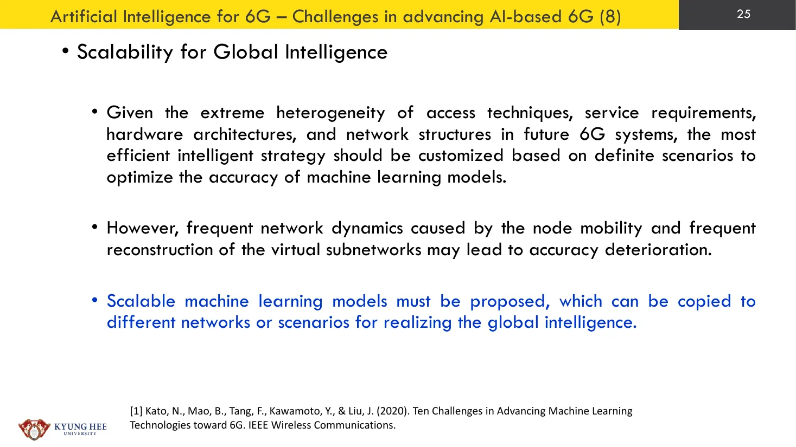

**직역**
> **AI 기반 6G의 도전 과제 (8) (Challenges in advancing AI-based 6G (8))**
>
> - 전역 지능을 위한 확장성 (Scalability for Global Intelligence)
>   - 미래 6G 시스템에서 액세스 기법·서비스 요구사항·하드웨어 아키텍처·네트워크 구조의 극단적 이질성을 고려할 때, 머신러닝 모델의 정확도를 최적화하려면 가장 효율적인 지능형 전략이 명확한 시나리오에 기반해 맞춤화되어야 한다.
>   - 그러나 노드 이동성과 가상 서브네트워크의 잦은 재구성으로 인한 빈번한 네트워크 동적 변화는 정확도 저하로 이어질 수 있다.
>   - 전역 지능(global intelligence)을 실현하기 위해 서로 다른 네트워크나 시나리오로 복사될 수 있는 확장 가능한(scalable) 머신러닝 모델이 제안되어야 한다.
>
> 출처: Kato, N. et al. (2020). Ten Challenges... IEEE Wireless Communications.

**설명**
- Scalable ML / Foundation Model(World Model): 한 번 만든 스케일러블 모델을 다른 환경에 어댑테이션/튜닝만으로 적용. 6G 인텔리전스는 adaptive해야 하며 scale down(knowledge distillation·pruning)도 가능해야 함.

## 슬라이드 26

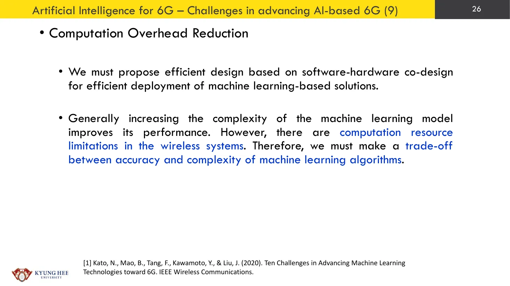

**직역**
> **AI 기반 6G의 도전 과제 (9) (Challenges in advancing AI-based 6G (9))**
>
> - 계산 오버헤드 감소 (Computation Overhead Reduction)
>   - 머신러닝 기반 솔루션의 효율적 배포를 위해 소프트웨어-하드웨어 공동 설계(software-hardware co-design)에 기반한 효율적 설계를 제안해야 한다.
>   - 일반적으로 머신러닝 모델의 복잡도를 늘리면 성능이 향상된다. 그러나 무선 시스템에는 계산 자원의 제약이 있다. 따라서 머신러닝 알고리즘의 정확도와 복잡도 사이에서 트레이드오프(trade-off)를 만들어야 한다.
>
> 출처: Kato, N. et al. (2020). Ten Challenges... IEEE Wireless Communications.

**설명**
- 모델이 커질수록 처리 노드(라우터도 CPU를 가진 노드) 부담 증가 → 어떤 노드에 capability를 넣어 빠르게 추론할지가 중요. GPU 구매·배치 전략도 중요.

## 슬라이드 27

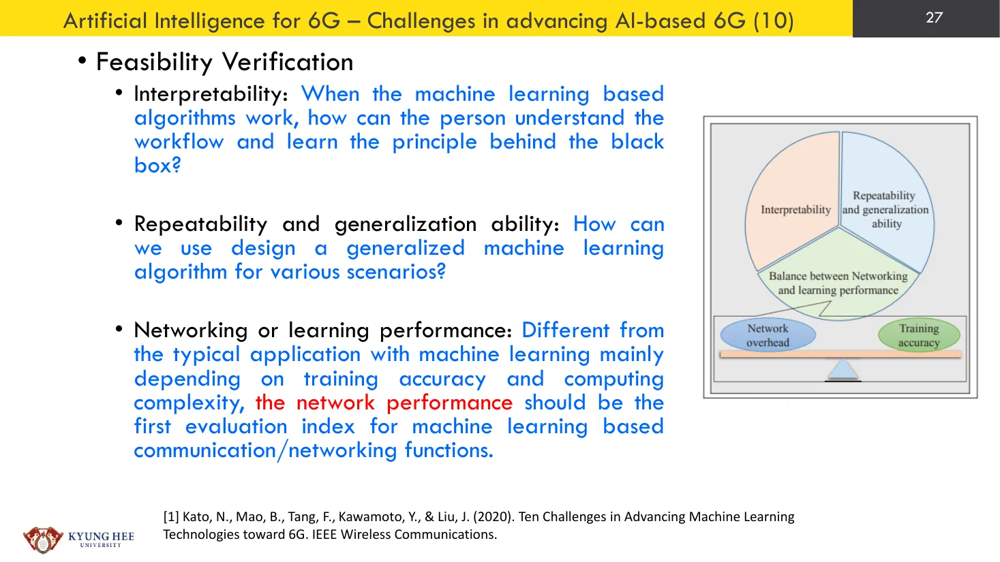

**직역**
> **AI 기반 6G의 도전 과제 (10) (Challenges in advancing AI-based 6G (10))**
>
> - 실현 가능성 검증 (Feasibility Verification)
>   - 해석 가능성(Interpretability): 머신러닝 기반 알고리즘이 동작할 때, 사람이 어떻게 그 워크플로를 이해하고 블랙박스 뒤의 원리를 배울 수 있는가?
>   - 반복 가능성과 일반화 능력(Repeatability and generalization ability): 다양한 시나리오에 대해 일반화된 머신러닝 알고리즘을 어떻게 설계할 수 있는가?
>   - 네트워킹 또는 학습 성능(Networking or learning performance): 주로 학습 정확도와 계산 복잡도에 의존하는 전형적 머신러닝 응용과는 달리, 머신러닝 기반 통신/네트워킹 기능에서는 네트워크 성능이 첫 번째 평가 지표가 되어야 한다.
>
> 출처: Kato, N. et al. (2020). Ten Challenges... IEEE Wireless Communications.

**설명**
- Feasibility/Verification: 어디까지가 진짜 가능한 AI 모델인지 검증이 어려움. AI라고 다 되는 게 아님(예측이 정확하지 않을 수 있음).

## 슬라이드 28

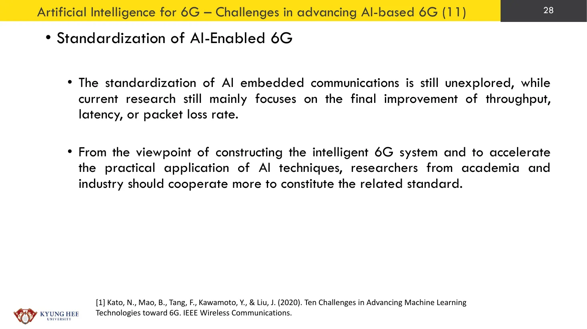

**직역**
> **AI 기반 6G의 도전 과제 (11) (Challenges in advancing AI-based 6G (11))**
>
> - AI 기반 6G의 표준화 (Standardization of AI-Enabled 6G)
>   - AI가 내장된 통신의 표준화는 아직 탐구되지 않았으며, 현재 연구는 여전히 주로 처리량(throughput), 지연(latency), 패킷 손실률(packet loss rate)의 최종 개선에 집중되어 있다.
>   - 지능형 6G 시스템을 구축하고 AI 기술의 실용적 적용을 가속화하는 관점에서, 학계와 산업계의 연구자들은 관련 표준을 구성하기 위해 더 많이 협력해야 한다.
>
> 출처: Kato, N. et al. (2020). Ten Challenges... IEEE Wireless Communications.

**설명**
- 표준화(Standardization): ITU-T 등에서 진행 중.

## 슬라이드 29

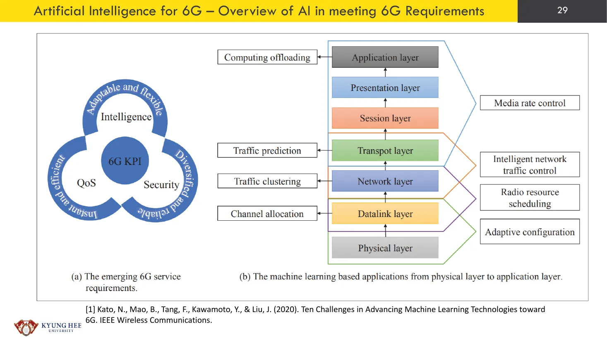

**직역**
> **6G 요구사항 충족에서 AI의 개요 (Overview of AI in meeting 6G Requirements)**
>
> (a) 떠오르는 6G 서비스 요구사항 (The emerging 6G service requirements)
> - 중심: 6G KPI / QoS / 보안(Security)
> - 둘러싼 특성: 지능(Intelligence), 적응적이고 유연한(Adaptive and flexible), 분산되고 신뢰성 있는(Distributed and reliable), 제한적이고 효율적인(Limited and efficient)
>
> (b) 물리 계층부터 응용 계층까지의 머신러닝 기반 응용 (The machine learning based applications from physical layer to application layer)
> - 응용 계층 (Application layer) ← 컴퓨팅 오프로딩 (Computing offloading)
> - 표현 계층 (Presentation layer)
> - 세션 계층 (Session layer) ← 미디어 전송률 제어 (Media rate control)
> - 전송 계층 (Transport layer) ← 트래픽 예측 (Traffic prediction); 지능형 네트워크 트래픽 제어 (Intelligent network traffic control)
> - 네트워크 계층 (Network layer) ← 트래픽 클러스터링 (Traffic clustering); 무선 자원 스케줄링 (Radio resource scheduling)
> - 데이터링크 계층 (Datalink layer) ← 채널 할당 (Channel allocation); 적응적 구성 (Adaptive configuration)
> - 물리 계층 (Physical layer)
>
> 출처: Kato, N. et al. (2020). Ten Challenges... IEEE Wireless Communications.

**설명**
- 응용 계층은 주로 오프로딩 정도. Transport Layer + Network Layer가 네트워크 전공의 핵심 관심 분야(별표).

## 슬라이드 30

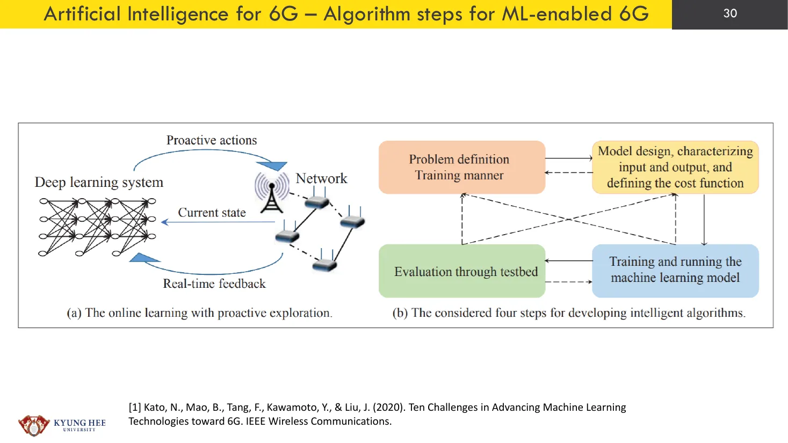

**직역**
> **ML 기반 6G를 위한 알고리즘 단계 (Algorithm steps for ML-enabled 6G)**
>
> (a) 능동적 탐색을 동반한 온라인 학습 (The online learning with proactive exploration)
> - 딥러닝 시스템(Deep learning system) ↔ 네트워크(Network)
> - 능동적 행동(Proactive actions) → 현재 상태(Current state) → 실시간 피드백(Real-time feedback)
>
> (b) 지능형 알고리즘 개발을 위해 고려되는 네 단계 (The considered four steps for developing intelligent algorithms)
> - 문제 정의, 학습 방식 (Problem definition, Training manner)
> - 모델 설계, 입출력 특성화, 비용 함수 정의 (Model design, characterizing input and output, and defining the cost function)
> - 머신러닝 모델의 학습과 실행 (Training and running the machine learning model)
> - 테스트베드를 통한 평가 (Evaluation through testbed)
>
> 출처: Kato, N. et al. (2020). Ten Challenges... IEEE Wireless Communications.

**설명**
- 전체 흐름(모델 정의→트레이닝→적용→evaluation→재조정)이 곧 강화학습(반복 피드백) 구조. 데이터가 커지고 상호 연관성이 많아질수록 깊은 신경망(Deep NN)이 필요.

## 슬라이드 31

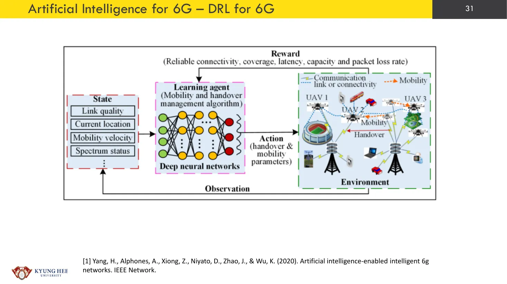

**직역**
> **6G를 위한 DRL (Artificial Intelligence for 6G – DRL for 6G)**
> (DRL: Deep Reinforcement Learning, 심층 강화학습)
>
> - 보상(Reward): 신뢰성 있는 연결성, 커버리지, 지연, 용량, 패킷 손실률 (Reliable connectivity, coverage, latency, capacity and packet loss rate)
> - 상태(State): 링크 품질(Link quality), 현재 위치(Current location), 이동 속도(Mobility velocity), 스펙트럼 상태(Spectrum status)
> - 학습 에이전트(Learning agent): 이동성·핸드오버 관리 알고리즘 (Mobility and handover management algorithm) — 심층 신경망(Deep neural networks)
> - 행동(Action): 핸드오버 및 이동성 파라미터 (handover & mobility parameters)
> - 환경(Environment): 통신 링크 또는 연결성(Communication link or connectivity), UAV 1·2·3, 이동성(Mobility), 핸드오버(Handover)
> - 관측(Observation)
>
> 출처: Yang, H., Alphones, A., Xiong, Z., Niyato, D., Zhao, J., & Wu, K. (2020). Artificial intelligence-enabled intelligent 6g networks. IEEE Network.

## 슬라이드 32

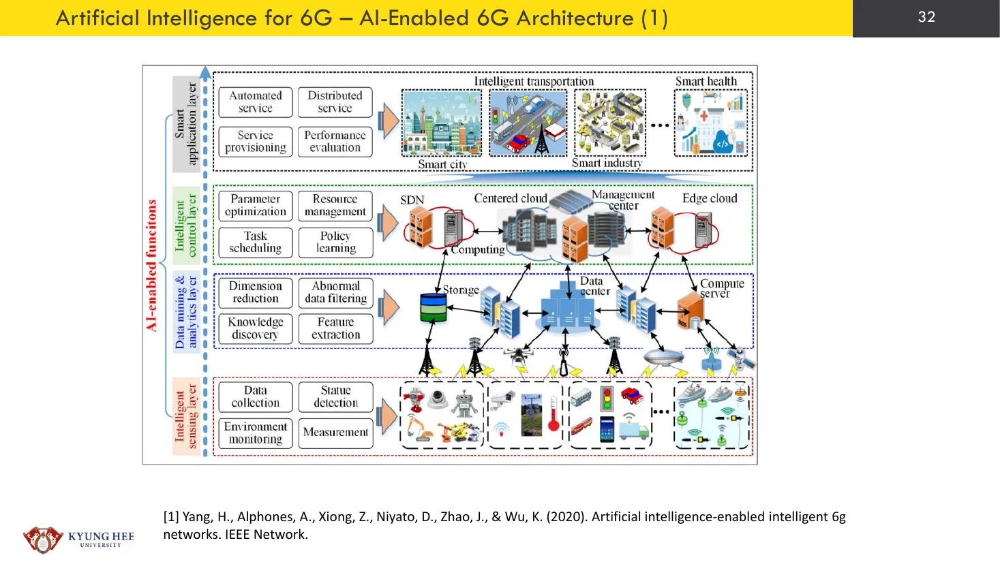

**직역**
> **AI 기반 6G 아키텍처 (1) (AI-Enabled 6G Architecture (1))**
>
> 4계층 구조(아래에서 위로):
> - 지능형 감지 계층 (Intelligent sensing layer): 데이터 수집(Data collection), 상태 감지(Status detection), 환경 모니터링(Environment monitoring), 측정(Measurement)
> - 데이터 마이닝 및 분석 계층 (Data mining & analytics layer): 차원 축소(Dimension reduction), 비정상 데이터 필터링(Abnormal data filtering), 지식 발견(Knowledge discovery), 특징 추출(Feature extraction) — 저장소(Storage), 데이터 센터(Data center), 컴퓨팅 서비스(Compute service)
> - 지능형 제어 계층 (Intelligent control layer / AI-enabled functions): 파라미터 최적화(Parameter optimization), 자원 관리(Resource management), 작업 스케줄링(Task scheduling), 정책 학습(Policy learning) — SDN, 중앙 클라우드(Centered cloud), 관리 센터(Management center), 엣지 클라우드(Edge cloud), 컴퓨팅(Computing)
> - 스마트 응용 계층 (Smart application layer): 자동화 서비스(Automated service), 분산 서비스(Distributed service), 서비스 프로비저닝(Service provisioning), 성능 평가(Performance evaluation) — 지능형 교통(Intelligent transportation), 스마트시티(Smart city), 스마트산업(Smart industry), 스마트헬스(Smart health)
>
> 출처: Yang, H. et al. (2020). Artificial intelligence-enabled intelligent 6g networks. IEEE Network.

## 슬라이드 33

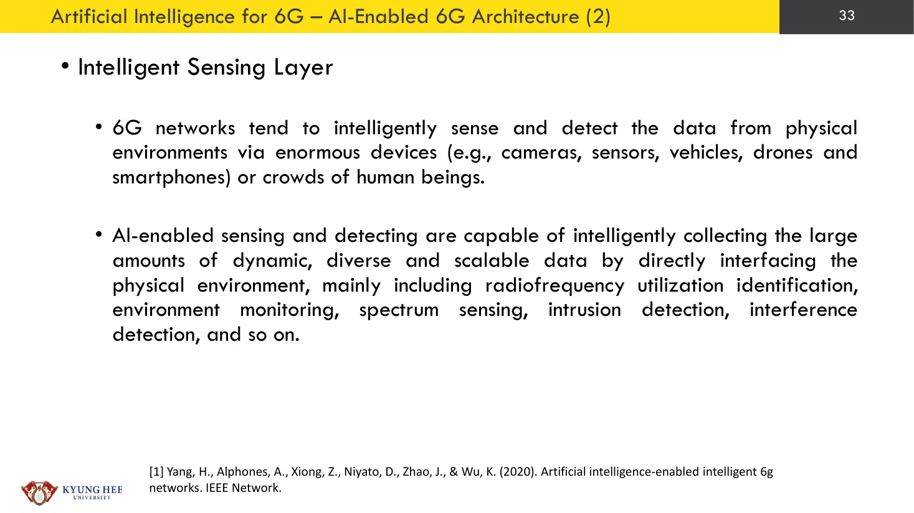

**직역**
> **AI 기반 6G 아키텍처 (2) (AI-Enabled 6G Architecture (2))**
>
> - 지능형 감지 계층 (Intelligent Sensing Layer)
>   - 6G 네트워크는 막대한 수의 장치(예: 카메라, 센서, 차량, 드론, 스마트폰) 또는 사람 군중을 통해 물리적 환경의 데이터를 지능적으로 감지·검출하는 경향이 있다.
>   - AI 기반 감지·검출은 물리적 환경과 직접 인터페이스함으로써 대량의 동적이고 다양하며 확장 가능한 데이터를 지능적으로 수집할 수 있다. 주로 무선 주파수 활용 식별(radiofrequency utilization identification), 환경 모니터링, 스펙트럼 감지(spectrum sensing), 침입 탐지(intrusion detection), 간섭 탐지(interference detection) 등을 포함한다.
>
> 출처: Yang, H. et al. (2020). Artificial intelligence-enabled intelligent 6g networks. IEEE Network.

## 슬라이드 34

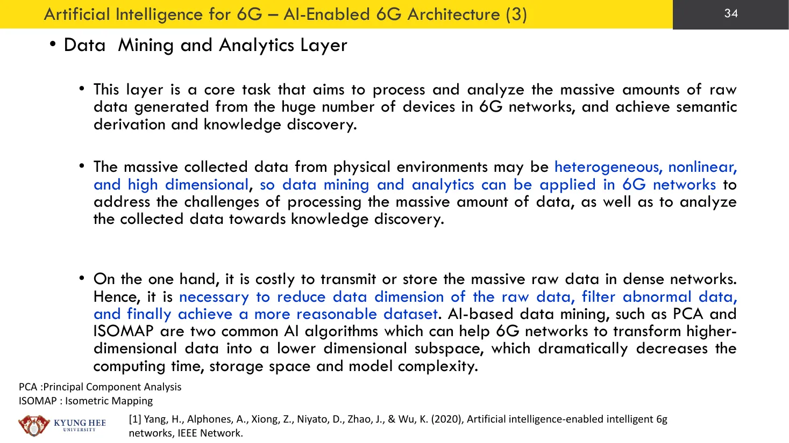

**직역**
> **AI 기반 6G 아키텍처 (3) (AI-Enabled 6G Architecture (3))**
>
> - 데이터 마이닝 및 분석 계층 (Data Mining and Analytics Layer)
>   - 이 계층은 6G 네트워크의 막대한 수의 장치에서 생성되는 대량의 원시 데이터를 처리·분석하고 의미 도출(semantic derivation)과 지식 발견(knowledge discovery)을 달성하는 핵심 작업이다.
>   - 물리적 환경에서 수집된 대량 데이터는 이질적(heterogeneous), 비선형(nonlinear), 고차원(high dimensional)일 수 있으므로, 데이터 마이닝과 분석을 6G 네트워크에 적용하여 대량 데이터 처리의 도전 과제를 해결하고 지식 발견을 향해 수집 데이터를 분석할 수 있다.
>   - 한편, 조밀한 네트워크에서 대량의 원시 데이터를 전송·저장하는 것은 비용이 많이 든다. 따라서 원시 데이터의 차원을 줄이고, 비정상 데이터를 필터링하여, 최종적으로 더 합리적인 데이터셋을 달성할 필요가 있다. PCA와 ISOMAP 같은 AI 기반 데이터 마이닝은 고차원 데이터를 저차원 부분공간으로 변환할 수 있는 두 가지 일반적 AI 알고리즘으로, 계산 시간·저장 공간·모델 복잡도를 극적으로 감소시킨다.
>
> PCA: 주성분 분석 (Principal Component Analysis)
> ISOMAP: 등거리 매핑 (Isometric Mapping)
>
> 출처: Yang, H. et al. (2020). Artificial intelligence-enabled intelligent 6g networks. IEEE Network.

## 슬라이드 35

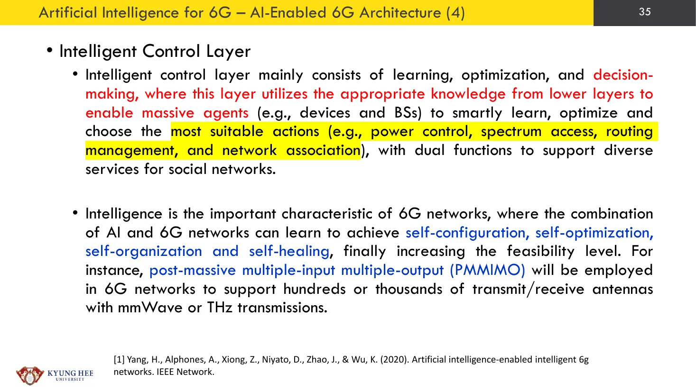

**직역**
> **AI 기반 6G 아키텍처 (4) (AI-Enabled 6G Architecture (4))**
>
> - 지능형 제어 계층 (Intelligent Control Layer)
>   - 지능형 제어 계층은 주로 학습(learning), 최적화(optimization), 의사결정(decision-making)으로 구성된다. 이 계층은 하위 계층의 적절한 지식을 활용하여, 막대한 수의 에이전트(예: 장치, 기지국 BS)가 사회 네트워크를 위한 다양한 서비스를 지원하는 이중 기능과 함께, 가장 적합한 행동(예: 전력 제어, 스펙트럼 접근, 라우팅 관리, 네트워크 연결 association)을 스마트하게 학습·최적화·선택할 수 있게 한다.
>   - 지능은 6G 네트워크의 중요한 특성으로, AI와 6G 네트워크의 결합은 자가 구성(self-configuration), 자가 최적화(self-optimization), 자가 조직화(self-organization), 자가 치유(self-healing)를 학습으로 달성하여 최종적으로 실현 가능성 수준을 높인다. 예를 들어, 후-대규모 다중입력다중출력(PMMIMO, post-massive MIMO)이 6G 네트워크에 채택되어 mmWave 또는 THz 전송으로 수백~수천 개의 송수신 안테나를 지원할 것이다.
>
> 출처: Yang, H. et al. (2020). Artificial intelligence-enabled intelligent 6g networks. IEEE Network.

## 슬라이드 36

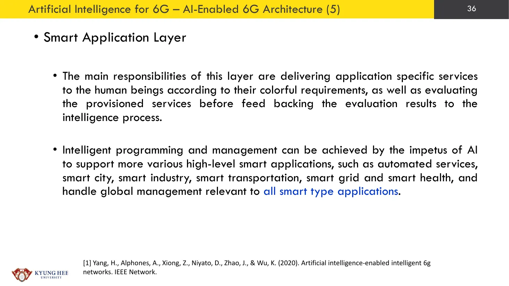

**직역**
> **AI 기반 6G 아키텍처 (5) (AI-Enabled 6G Architecture (5))**
>
> - 스마트 응용 계층 (Smart Application Layer)
>   - 이 계층의 주요 책임은 사람들의 다채로운 요구사항에 따라 응용별 서비스를 전달하고, 평가 결과를 지능화 과정에 피드백하기 전에 제공된 서비스를 평가하는 것이다.
>   - AI의 추진력으로 지능형 프로그래밍과 관리를 달성할 수 있으며, 자동화 서비스, 스마트시티, 스마트산업, 스마트교통, 스마트그리드, 스마트헬스 등 더 다양한 고수준 스마트 응용을 지원하고, 모든 스마트 유형 응용과 관련된 전역 관리를 처리할 수 있다.
>
> 출처: Yang, H. et al. (2020). Artificial intelligence-enabled intelligent 6g networks. IEEE Network.

## 슬라이드 37

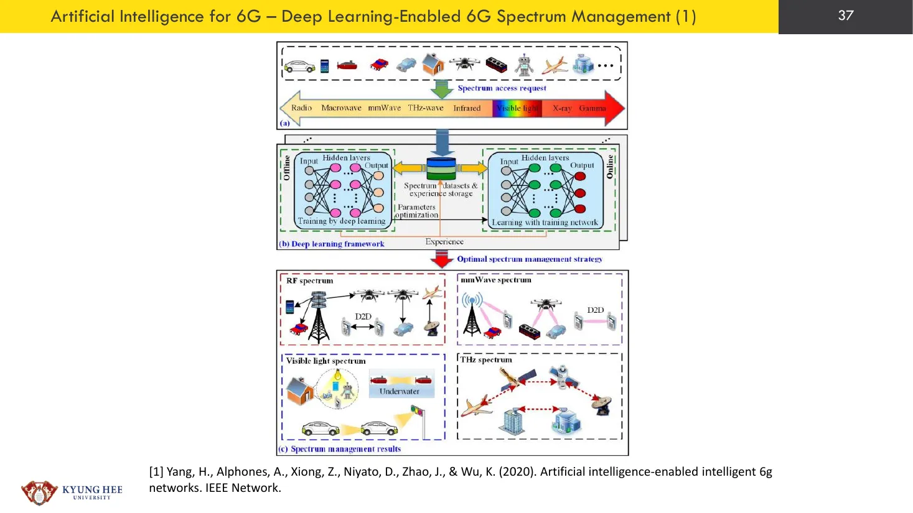

**직역**
> **딥러닝 기반 6G 스펙트럼 관리 (1) (Deep Learning-Enabled 6G Spectrum Management (1))**
>
> (상단) 스펙트럼 접근 요청 (Spectrum access request): 무선(Radio), mmWave, THz파(THz wave), 적외선(Infrared), 가시광(Visible), 자외선(UV) 등 다양한 스펙트럼 대역
> (중단 a) 딥러닝 프레임워크 (Deep learning framework): 입력 계층(Input layer) — 은닉 계층(Hidden layers, 학습/Training) — 출력 계층(Output layer); 스펙트럼 네트워크 & 경험 저장소(Spectrum network & experience storage), 파라미터(Parameters)
> (b) 최적 스펙트럼 관리 전략 (Optical spectrum management strategy)
> (하단 c) 스펙트럼 관리 결과 (Spectrum management result): RF 스펙트럼(RF spectrum), mmWave 스펙트럼(mmWave spectrum), 가시광 스펙트럼(Visible light spectrum), THz 스펙트럼(THz spectrum)
>
> 출처: Yang, H. et al. (2020). Artificial intelligence-enabled intelligent 6g networks. IEEE Network.

## 슬라이드 38

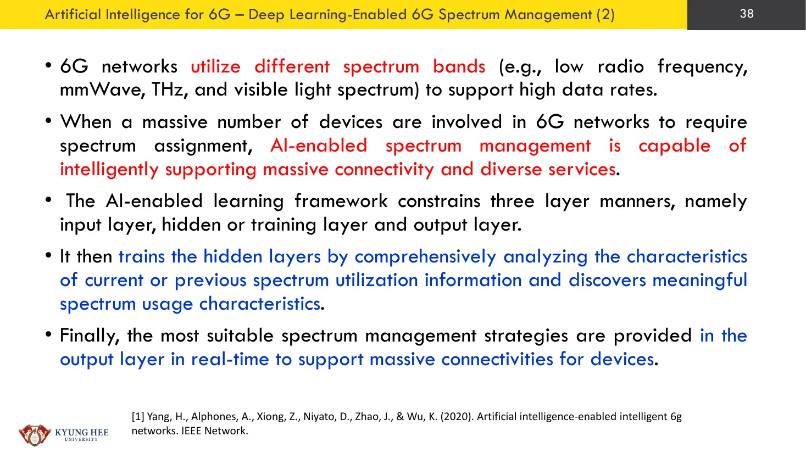

**직역**
> **딥러닝 기반 6G 스펙트럼 관리 (2) (Deep Learning-Enabled 6G Spectrum Management (2))**
>
> - 6G 네트워크는 높은 데이터 전송률을 지원하기 위해 서로 다른 스펙트럼 대역(예: 저 무선 주파수, mmWave, THz, 가시광 스펙트럼)을 활용한다.
> - 막대한 수의 장치가 6G 네트워크에서 스펙트럼 할당을 요구할 때, AI 기반 스펙트럼 관리는 대규모 연결성과 다양한 서비스를 지능적으로 지원할 수 있다.
> - AI 기반 학습 프레임워크는 세 계층 방식, 즉 입력 계층(input layer), 은닉 또는 학습 계층(hidden or training layer), 출력 계층(output layer)으로 제약된다.
> - 그런 다음 현재 또는 이전 스펙트럼 활용 정보의 특성을 종합적으로 분석하여 은닉 계층을 학습하고, 의미 있는 스펙트럼 사용 특성을 발견한다.
> - 최종적으로 가장 적합한 스펙트럼 관리 전략이 출력 계층에서 실시간으로 제공되어 장치들의 대규모 연결성을 지원한다.
>
> 출처: Yang, H. et al. (2020). Artificial intelligence-enabled intelligent 6g networks. IEEE Network.

## 슬라이드 39

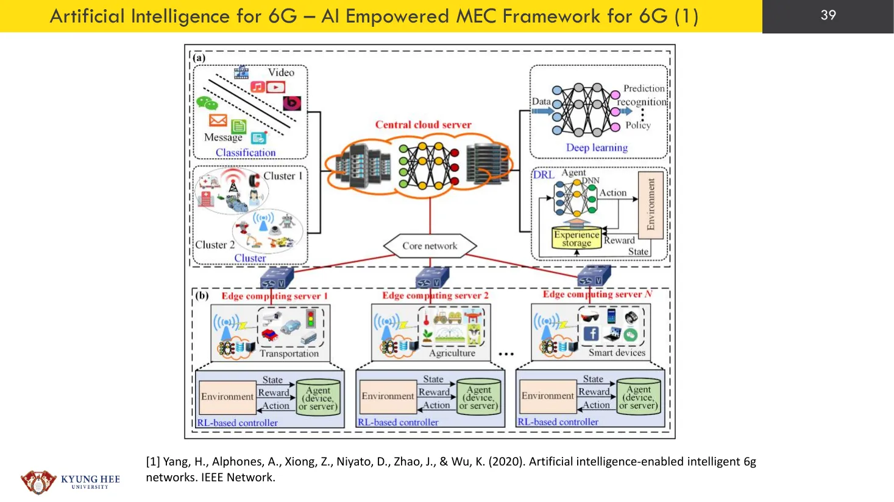

**직역**
> **6G를 위한 AI 강화 MEC 프레임워크 (1) (AI Empowered MEC Framework for 6G (1))**
> (MEC: Mobile Edge Computing, 모바일 엣지 컴퓨팅)
>
> (a) 중앙 클라우드 서버 (Central cloud server) — 비디오/메시지 분류(Classification), 클러스터 1·2(Cluster), 코어 네트워크(Core network), 딥러닝(Deep learning) → 예측(Prediction)/인식(Recognition)/정책(Policy); 에이전트(Agent) — 행동(Action), 경험 저장소(Experience storage), 보상(Reward), 상태(State)
> (b) 엣지 컴퓨팅 서버 1·2·3 (Edge computing server): 교통(Transportation), 농업(Agriculture), 스마트 장치(Smart devices); 각 서버는 환경(Environment), 에이전트(Agent), 행동(Action), 보상(Reward), 상태(State)와 RL 기반 컨트롤러(RL-based controller)를 가짐
>
> 출처: Yang, H. et al. (2020). Artificial intelligence-enabled intelligent 6g networks. IEEE Network.

## 슬라이드 40

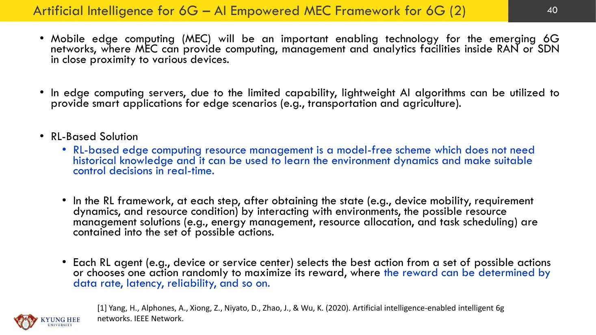

**직역**
> **6G를 위한 AI 강화 MEC 프레임워크 (2) (AI Empowered MEC Framework for 6G (2))**
>
> - 모바일 엣지 컴퓨팅(MEC)은 떠오르는 6G 네트워크의 중요한 기반 기술이 될 것이며, MEC는 다양한 장치 가까이에서 RAN 또는 SDN 내부에 컴퓨팅·관리·분석 시설을 제공할 수 있다.
> - 엣지 컴퓨팅 서버에서는 제한된 성능 때문에 경량 AI 알고리즘(lightweight AI algorithms)을 활용하여 엣지 시나리오(예: 교통과 농업)를 위한 스마트 응용을 제공할 수 있다.
> - RL 기반 솔루션 (RL-Based Solution)
>   - RL 기반 엣지 컴퓨팅 자원 관리는 과거 지식을 필요로 하지 않는 모델 프리(model-free) 방식이며, 환경의 동적 변화를 학습하고 실시간으로 적절한 제어 결정을 내릴 수 있다.
>   - RL 프레임워크에서는 매 단계마다, 환경과 상호작용하여 상태(예: 장치 이동성, 요구사항 동적 변화, 자원 조건)를 얻은 후, 가능한 자원 관리 솔루션(예: 에너지 관리, 자원 할당, 작업 스케줄링)이 가능한 행동 집합에 포함된다.
>   - 각 RL 에이전트(예: 장치 또는 서비스 센터)는 보상을 최대화하기 위해 가능한 행동 집합에서 최선의 행동을 선택하거나 무작위로 하나를 선택한다. 보상은 데이터 전송률, 지연, 신뢰성 등으로 결정될 수 있다.
>
> 출처: Yang, H. et al. (2020). Artificial intelligence-enabled intelligent 6g networks. IEEE Network.

## 슬라이드 41

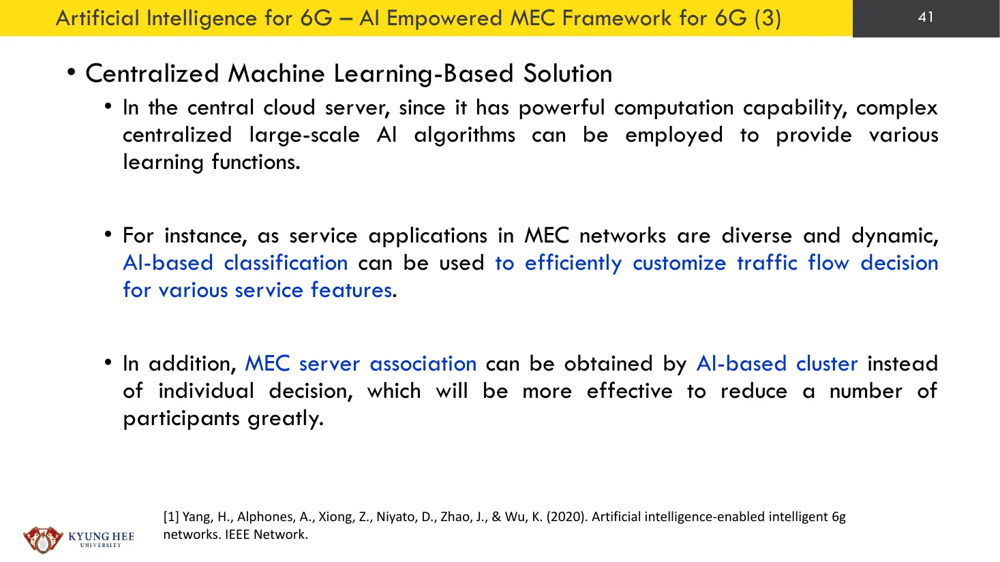

**직역**
> **6G를 위한 AI 강화 MEC 프레임워크 (3) (AI Empowered MEC Framework for 6G (3))**
>
> - 중앙집중식 머신러닝 기반 솔루션 (Centralized Machine Learning-Based Solution)
>   - 중앙 클라우드 서버는 강력한 계산 성능을 가지므로, 복잡한 중앙집중식 대규모 AI 알고리즘을 채택하여 다양한 학습 기능을 제공할 수 있다.
>   - 예를 들어, MEC 네트워크의 서비스 응용은 다양하고 동적이므로, AI 기반 분류(classification)를 사용하여 다양한 서비스 특성에 대한 트래픽 흐름 결정을 효율적으로 맞춤화할 수 있다.
>   - 또한 MEC 서버 연결(association)은 개별 결정 대신 AI 기반 클러스터(cluster)로 얻을 수 있으며, 이는 참여자 수를 크게 줄이는 데 더 효과적이다.
>
> 출처: Yang, H. et al. (2020). Artificial intelligence-enabled intelligent 6g networks. IEEE Network.

## 슬라이드 42

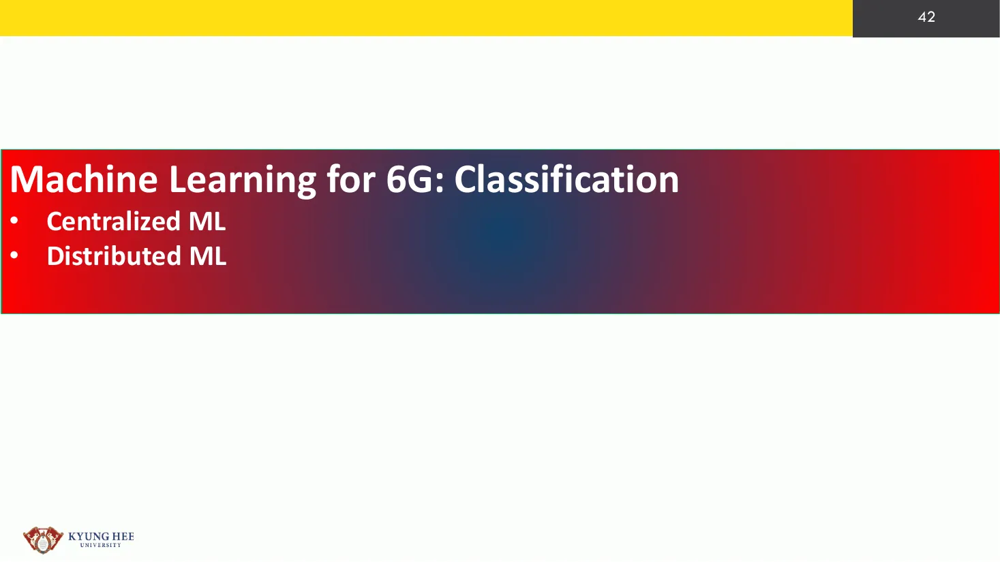

**직역**
> **6G를 위한 머신러닝: 분류 (Machine Learning for 6G: Classification)**
> - 중앙집중식 ML (Centralized ML)
> - 분산 ML (Distributed ML)

## 슬라이드 43

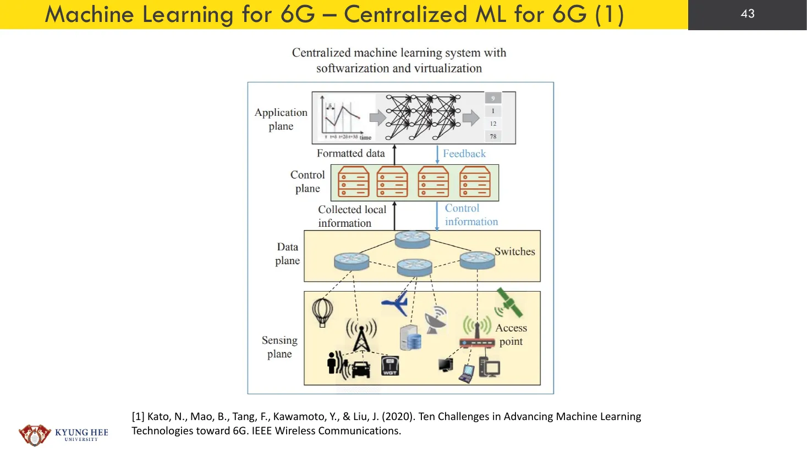

**직역**
> **6G를 위한 중앙집중식 ML (1) (Centralized ML for 6G (1))**
>
> 소프트웨어화와 가상화를 갖춘 중앙집중식 머신러닝 시스템 (Centralized machine learning system with softwarization and virtualization)
> - 응용 평면 (Application plane): (딥러닝 신경망 그림) 형식화된 데이터(Formatted data) ← 피드백(Feedback)
> - 제어 평면 (Control plane): 수집된 지역 정보(Collected local information), 제어 정보(Control information)
> - 데이터 평면 (Data plane): 스위치(Switches)
> - 감지 평면 (Sensing plane): 액세스 포인트(Access point) 및 다양한 센싱 장치
>
> 출처: Kato, N. et al. (2020). Ten Challenges... IEEE Wireless Communications.

## 슬라이드 44

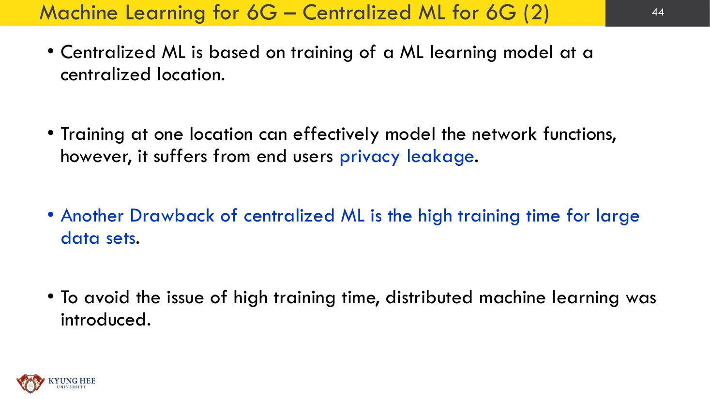

**직역**
> **6G를 위한 중앙집중식 ML (2) (Centralized ML for 6G (2))**
>
> - 중앙집중식 ML은 중앙 위치에서 ML 학습 모델을 학습시키는 것에 기반한다.
> - 한 위치에서 학습하면 네트워크 기능을 효과적으로 모델링할 수 있으나, 단말 사용자의 프라이버시 누출(privacy leakage)을 겪는다.
> - 중앙집중식 ML의 또 다른 단점은 대규모 데이터셋에 대한 높은 학습 시간(high training time)이다.
> - 높은 학습 시간 문제를 피하기 위해 분산 머신러닝(distributed machine learning)이 도입되었다.

## 슬라이드 45

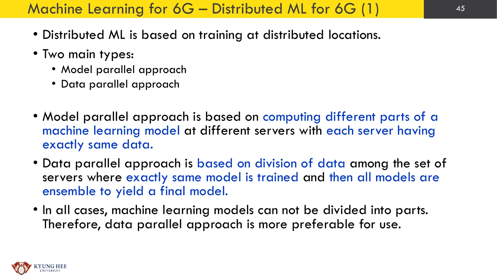

**직역**
> **6G를 위한 분산 ML (1) (Distributed ML for 6G (1))**
>
> - 분산 ML은 분산된 위치에서의 학습에 기반한다.
> - 두 가지 주요 유형:
>   - 모델 병렬 방식 (Model parallel approach)
>   - 데이터 병렬 방식 (Data parallel approach)
> - 모델 병렬 방식은 각 서버가 정확히 동일한 데이터를 가진 채로, 머신러닝 모델의 서로 다른 부분을 서로 다른 서버에서 계산하는 것에 기반한다.
> - 데이터 병렬 방식은 서버 집합 간에 데이터를 분할하여, 정확히 동일한 모델을 학습시킨 다음 모든 모델을 앙상블(ensemble)하여 최종 모델을 산출하는 것에 기반한다.
> - 모든 경우에 머신러닝 모델은 부분으로 나눌 수 없다. 따라서 데이터 병렬 방식이 사용에 더 선호된다.

## 슬라이드 46

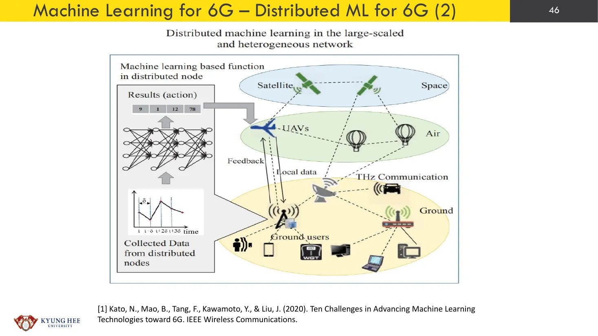

**직역**
> **6G를 위한 분산 ML (2) (Distributed ML for 6G (2))**
>
> 대규모·이질적 네트워크에서의 분산 머신러닝 (Distributed machine learning in the large-scaled and heterogeneous network)
> - 분산 노드의 머신러닝 기반 기능 (Machine learning based function in distributed node): 결과(행동) (Results (action)), 분산 노드에서 수집된 데이터 (Collected Data from distributed nodes)
> - 환경: 위성/우주(Satellite/Space), UAV/공중(UAVs/Air), 지상 사용자/지상(Ground users/Ground), THz 통신(THz Communication), 지역 데이터(Local data), 피드백(Feedback)
>
> 출처: Kato, N. et al. (2020). Ten Challenges... IEEE Wireless Communications.

## 슬라이드 47

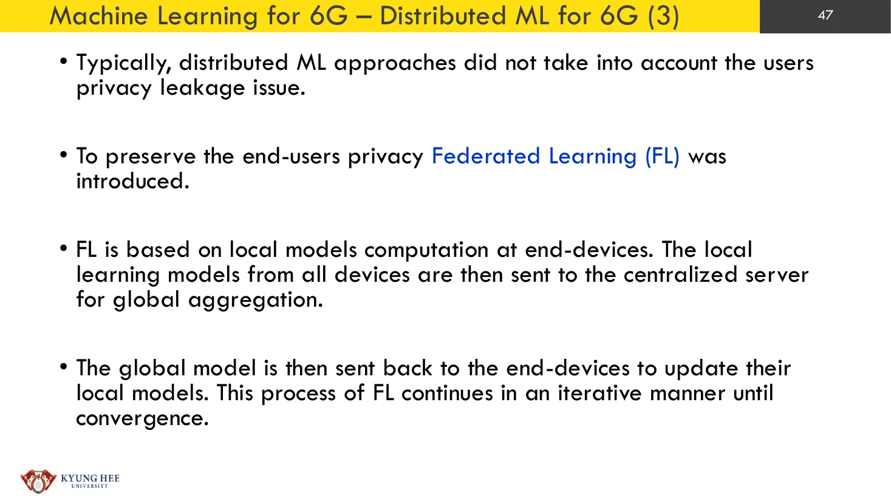

**직역**
> **6G를 위한 분산 ML (3) (Distributed ML for 6G (3))**
>
> - 일반적으로 분산 ML 방식은 사용자 프라이버시 누출 문제를 고려하지 않았다.
> - 단말 사용자의 프라이버시를 보존하기 위해 연합학습(Federated Learning, FL)이 도입되었다.
> - FL은 단말 장치(end-devices)에서의 지역 모델 계산에 기반한다. 모든 장치의 지역 학습 모델은 전역 집계(global aggregation)를 위해 중앙 서버로 전송된다.
> - 그런 다음 전역 모델(global model)이 단말 장치로 다시 전송되어 지역 모델을 업데이트한다. 이 FL 과정은 수렴(convergence)할 때까지 반복적으로 계속된다.

## 슬라이드 48

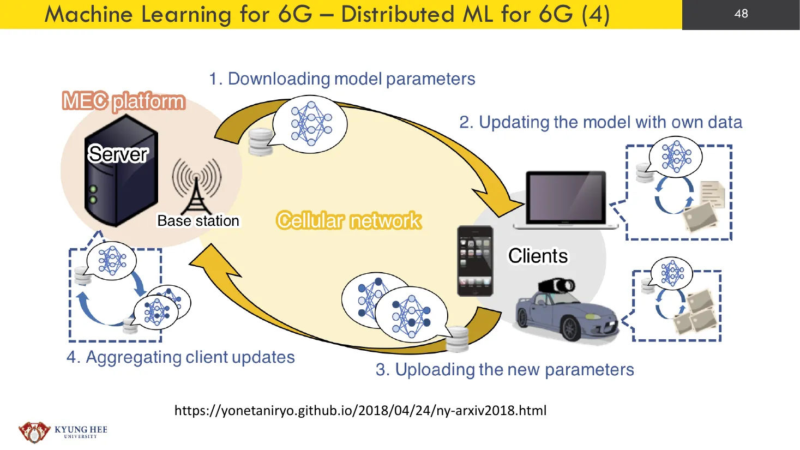

**직역**
> **6G를 위한 분산 ML (4) (Distributed ML for 6G (4))**
>
> (FL 과정 순환도 — MEC 플랫폼/서버, 기지국(Base station), 셀룰러 네트워크(Cellular network), 클라이언트(Clients))
> 1. 모델 파라미터 다운로드 (Downloading model parameters)
> 2. 자신의 데이터로 모델 업데이트 (Updating the model with own data)
> 3. 새 파라미터 업로드 (Uploading the new parameters)
> 4. 클라이언트 업데이트 집계 (Aggregating client updates)
>
> 출처: https://yonetaniryo.github.io/2018/04/24/ny-arxiv2018.html

## 슬라이드 49

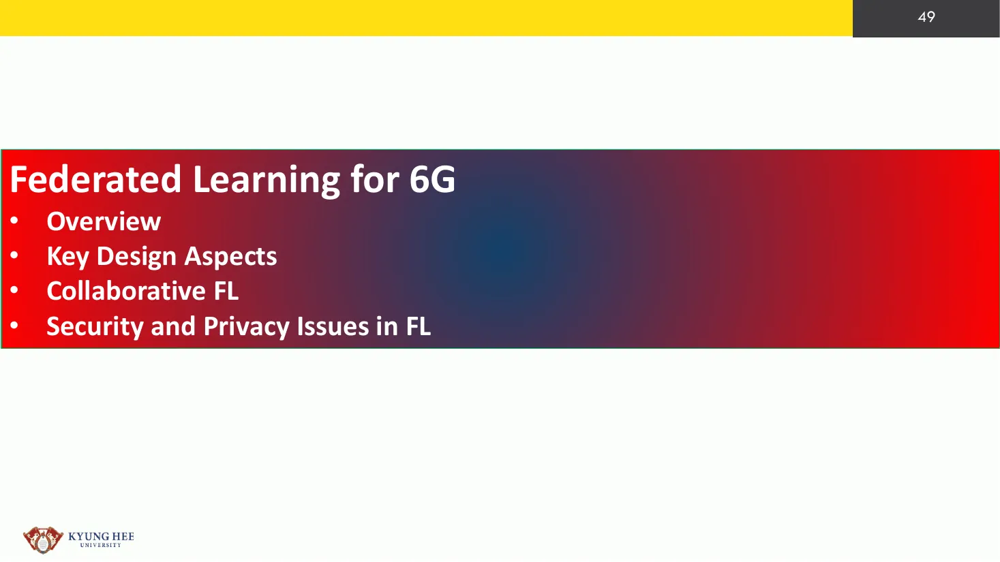

**직역**
> **6G를 위한 연합학습 (Federated Learning for 6G)**
> - 개요 (Overview)
> - 핵심 설계 측면 (Key Design Aspects)
> - 협력적 FL (Collaborative FL)
> - FL의 보안과 프라이버시 문제 (Security and Privacy Issues in FL)

## 슬라이드 50

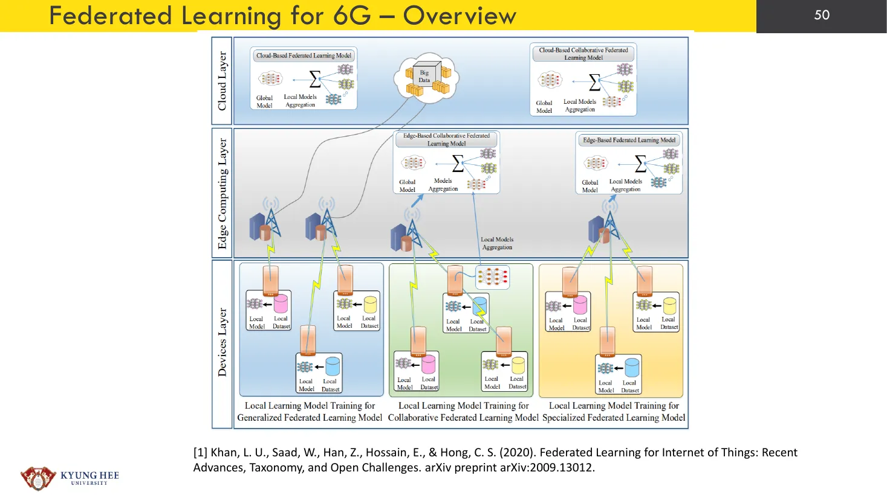

**직역**
> **연합학습 개요 (Federated Learning for 6G – Overview)**
>
> 3계층 FL 구조:
> - 클라우드 계층 (Cloud Layer): 클라우드 기반 연합학습 모델 (Cloud-Based Federated Learning Model) — 전역 모델(Global Model), 모델 집계(Model Aggregation), 지역 모델(Local Model)
> - 엣지 컴퓨팅 계층 (Edge Computing Layer): 엣지 기반 협력적 연합학습 모델 (Edge-Based Collaborative Federated Learning Model) — 전역 모델, 모델 집계, 지역 모델 집계(Local Model Aggregation)
> - 디바이스 계층 (Device Layer): 일반화된 연합학습 모델을 위한 지역 학습 모델 학습 (Local Learning Model Training for Generalized Federated Learning Model), 협력적 연합학습 모델을 위한 학습 (for Collaborative Federated Learning Model), 특화된 연합학습 모델을 위한 학습 (for Specialized Federated Learning Model) — 지역 모델, 학습(Trained)
>
> 출처: Khan, L. U., Saad, W., Han, Z., Hossain, E., & Hong, C. S. (2020). Federated Learning for Internet of Things: Recent Advances, Taxonomy, and Open Challenges. arXiv preprint arXiv:2009.13012.

## 슬라이드 51

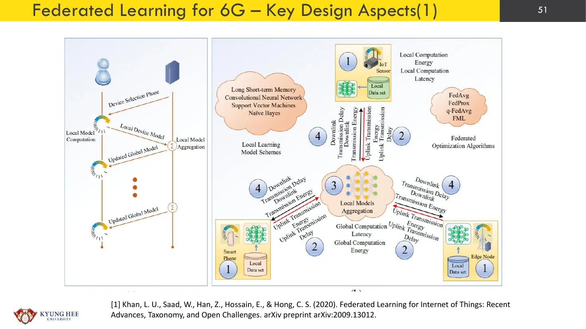

**직역**
> **연합학습 핵심 설계 측면 (1) (Key Design Aspects(1))**
>
> (왼쪽) 장치 선택 단계 (Device Selection Phase): 지역 모델 계산(Local Model Computation), 지역 장치 모델(Local Device Model), 지역 모델 집계(Local Model Aggregation), 업데이트된 전역 모델(Updated Global Model)
> (오른쪽 FL 순환 다이어그램, 번호 단계 1~4)
> - 1) 지역 데이터(Local Data), 지역 계산 에너지(Local Computation Energy), 지역 계산 지연(Local Computation Latency)
> - 2) 지역 학습 모델 방식 (Local Learning Model Schemes): LSTM(Long Short-term Memory), CNN(Convolutional Neural Network), SVM(Support Vector Machines), 나이브 베이즈(Naive Bayes)
> - 3) 지역 모델 집계 (Local Models Aggregation): 전역 계산 지연·에너지(Global Computation Latency/Energy)
> - 4) 다운링크/업링크 전송 지연·에너지 (Downlink/Uplink Transmission Delay/Energy)
> - 연합 최적화 알고리즘 (Federated Optimization Algorithms): FedAvg, FedBoy, q-FedAvg, FML
> - 엣지 노드(Edge Node), IoT 등
>
> 출처: Khan, L. U. et al. (2020). Federated Learning for Internet of Things... arXiv:2009.13012.

## 슬라이드 52

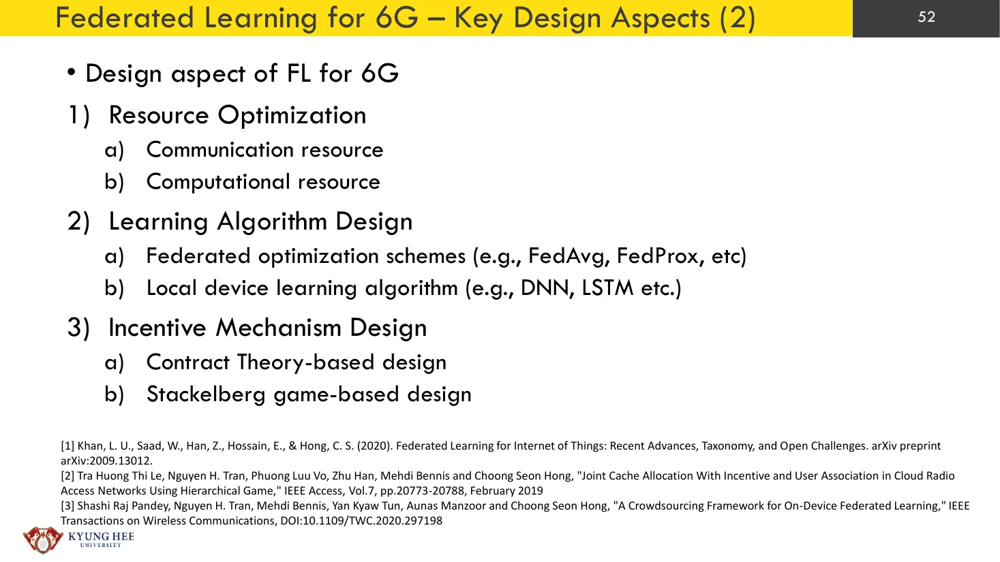

**직역**
> **연합학습 핵심 설계 측면 (2) (Key Design Aspects (2))**
>
> - 6G를 위한 FL의 설계 측면 (Design aspect of FL for 6G)
> 1) 자원 최적화 (Resource Optimization)
>    a) 통신 자원 (Communication resource)
>    b) 계산 자원 (Computational resource)
> 2) 학습 알고리즘 설계 (Learning Algorithm Design)
>    a) 연합 최적화 방식 (Federated optimization schemes, 예: FedAvg, FedProx 등)
>    b) 지역 장치 학습 알고리즘 (Local device learning algorithm, 예: DNN, LSTM 등)
> 3) 인센티브 메커니즘 설계 (Incentive Mechanism Design)
>    a) 계약 이론 기반 설계 (Contract Theory-based design)
>    b) 슈타켈베르크 게임 기반 설계 (Stackelberg game-based design)
>
> 출처: [1] Khan, L. U. et al. (2020). FL for IoT... arXiv:2009.13012. [2] Tra Huong Thi Le et al., "Joint Cache Allocation With Incentive and User Association in Cloud Radio Access Networks Using Hierarchical Game," IEEE Access, Vol.7, pp.20773-20788, Feb 2019. [3] Shashi Raj Pandey et al., "A Crowdsourcing Framework for On-Device Federated Learning," IEEE Transactions on Wireless Communications.

## 슬라이드 53

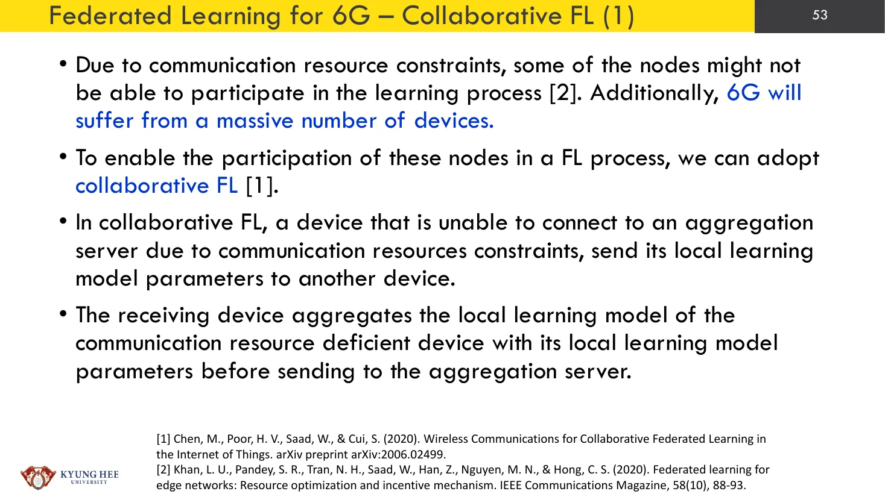

**직역**
> **협력적 FL (1) (Collaborative FL (1))**
>
> - 통신 자원 제약 때문에 일부 노드는 학습 과정에 참여하지 못할 수 있다 [2]. 게다가 6G는 막대한 수의 장치로 어려움을 겪을 것이다.
> - 이러한 노드의 참여를 가능케 하기 위해 협력적 FL(collaborative FL)을 채택할 수 있다 [1].
> - 협력적 FL에서, 통신 자원 제약으로 인해 집계 서버(aggregation server)에 연결할 수 없는 장치는 자신의 지역 학습 모델 파라미터를 다른 장치로 전송한다.
> - 수신 장치는 통신 자원이 부족한 장치의 지역 학습 모델을 자신의 지역 학습 모델 파라미터와 집계한 후 집계 서버로 전송한다.
>
> 출처: [1] Chen, M., Poor, H. V., Saad, W., & Cui, S. (2020). Wireless Communications for Collaborative Federated Learning in the Internet of Things. arXiv:2006.02499. [2] Khan, L. U. et al. (2020). Federated learning for edge networks... IEEE Communications Magazine, 58(10), 88-93.

## 슬라이드 54

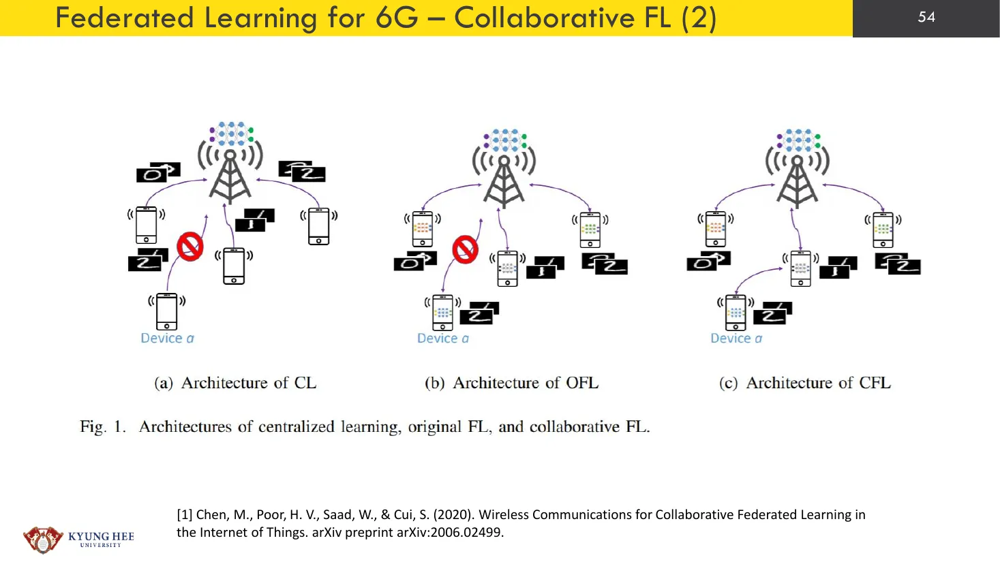

**직역**
> **협력적 FL (2) (Collaborative FL (2))**
>
> (세 가지 아키텍처 비교 그림 — 장치 a(Device a))
> - (a) CL의 아키텍처 (Architecture of CL, 중앙집중식 학습 Centralized Learning)
> - (b) OFL의 아키텍처 (Architecture of OFL, 원본 연합학습 Original FL)
> - (c) CFL의 아키텍처 (Architecture of CFL, 협력적 연합학습 Collaborative FL)
> 그림 1. 중앙집중식 학습, 원본 FL, 협력적 FL의 아키텍처. (Fig. 1. Architectures of centralized learning, original FL, and collaborative FL.)
>
> 출처: Chen, M., Poor, H. V., Saad, W., & Cui, S. (2020). Wireless Communications for Collaborative Federated Learning in the Internet of Things. arXiv:2006.02499.

## 슬라이드 55

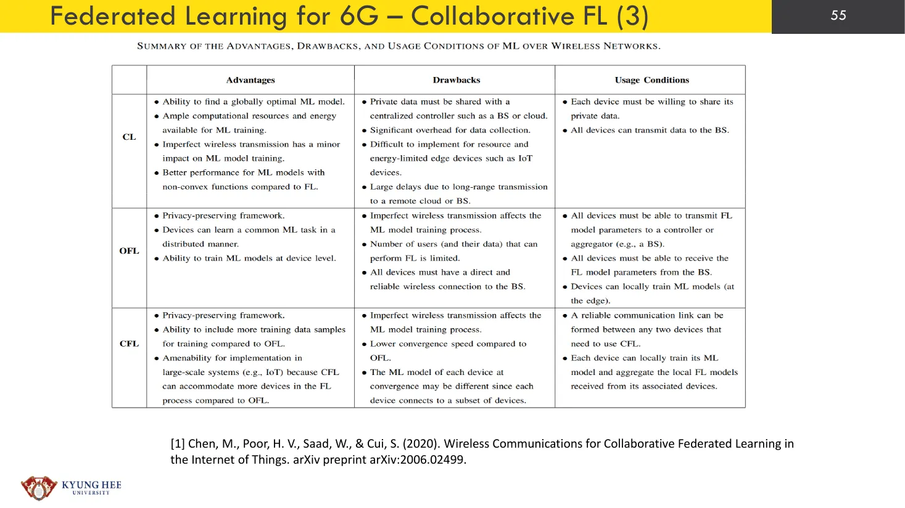

**직역**
> **협력적 FL (3) (Collaborative FL (3))**
>
> 무선 네트워크에서 ML의 장점·단점·사용 조건 요약 (Summary of the Advantages, Drawbacks, and Usage Conditions of ML over Wireless Networks)
>
> | | 장점 (Advantages) | 단점 (Drawbacks) | 사용 조건 (Usage Conditions) |
> |---|---|---|---|
> | CL | 최적의 디지털 ML 모델 학습 가능; 풍부한 계산 자원과 가용 에너지; ML 학습 비용이 적음; 비핵심 기능 대비 ML 모델 성능이 우수함. | 지역 데이터가 BS나 클라우드로 전송되어 프라이버시 데이터를 공유할 수 있음; 막대한 데이터 전송 부담; 에너지 제한 엣지 장치가 ML을 수행하기 어려움; 장거리 전송이 신뢰성 있는 무선 연결을 보장하기 어려움. | 모든 장치가 BS로 데이터 전송 가능; 모든 장치가 데이터를 BS로 전송 가능. |
> | OFL | 프라이버시 보존 프레임워크; 장치가 공통 ML 작업을 분산 방식으로 학습 가능; ML 모델과 장치 수준에 의존. | ML 모델 학습에 영향을 주는 불완전 정보; 각 장치가 ML을 수행하기에 충분한 계산 자원이 있어야 함; ML 장치는 BS와 직접·신뢰성 있는 무선 연결이 있어야 함. | 모든 장치가 FL 모델 파라미터를 컨트롤러나 집계기(예: BS)로 전송 가능; 모든 장치가 자원을 갖춰 FL 참가자가 될 수 있어야 함; 장치가 ML 모델을 지역적으로 학습 가능(엣지에서). |
> | CFL | 프라이버시 보존 프레임워크; 데이터 샘플이 OFL 대비 더 많은 학습으로 정확한 모델을 만들 수 있음; OFL 대비 더 적은 수렴 시간; FL 과정의 일부로 더 많은 장치를 수용 가능. | 신뢰성 있는 통신 링크는 장치 간에 형성될 수 있음; 각 장치는 자신의 데이터 안에서 지역적으로 학습 가능; 각 장치가 지역 FL 모델을 학습하고 집계된 지역 FL 모델을 인접 장치로부터 받을 수 있음. | 신뢰성 있는 통신 링크를 장치 간 형성 가능; 각 장치가 지역적으로 학습 가능; 각 장치가 지역 FL 모델을 학습하고 인접 장치로부터 집계된 지역 FL 모델을 받음. |
>
> 출처: Chen, M., Poor, H. V., Saad, W., & Cui, S. (2020). Wireless Communications for Collaborative Federated Learning... arXiv:2006.02499.

## 슬라이드 56

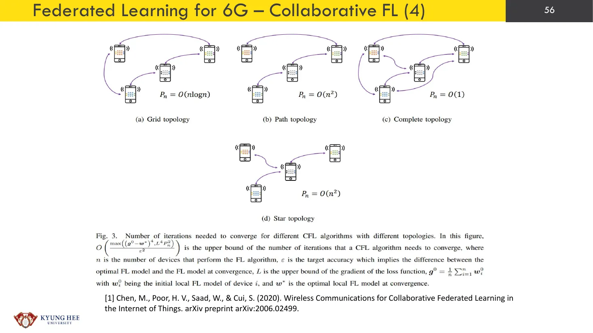

**직역**
> **협력적 FL (4) (Collaborative FL (4))**
>
> 서로 다른 토폴로지의 CFL 알고리즘이 수렴에 필요한 반복 횟수 (Number of iterations needed to converge for different CFL algorithms with different topologies)
> - (a) 그리드 토폴로지 (Grid topology): Pₙ = O(n log n)
> - (b) 경로 토폴로지 (Path topology): Pₙ = O(n²)
> - (c) 완전 토폴로지 (Complete topology): Pₙ = O(1)
> - (d) 스타 토폴로지 (Star topology): Pₙ = O(n²)
>
> 그림 3. 이 그림에서 G(...)는 CFL 알고리즘이 수렴에 필요한 반복 횟수의 상한이며, n은 FL 알고리즘을 수행하는 장치 수, ε은 수렴 시 최적 FL 모델과 FL 모델 간 차이를 의미하는 목표 정확도, L은 함수 기울기의 상한, wₙ* 및 wₙ은 각각 장치 n의 지역 FL 모델과 수렴 시 최적 지역 FL 모델.
>
> 출처: Chen, M., Poor, H. V., Saad, W., & Cui, S. (2020). Wireless Communications for Collaborative Federated Learning... arXiv:2006.02499.

## 슬라이드 57

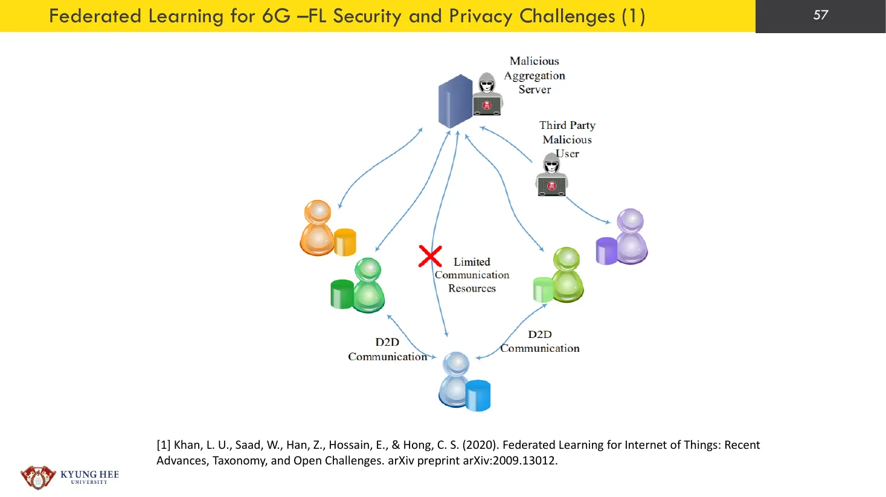

**직역**
> **FL 보안과 프라이버시 도전 과제 (1) (FL Security and Privacy Challenges (1))**
>
> (다이어그램)
> - 악의적 집계 서버 (Malicious Aggregation Server)
> - 제3자 악의적 사용자 (Third Party Malicious User)
> - 제한된 통신 자원 (Limited Communication Resources) — X 표시
> - D2D 통신 (D2D Communication)
> - 여러 사용자(단말 장치)들이 집계 서버 및 서로 간에 모델 파라미터를 교환하는 구조
>
> 출처: Khan, L. U., Saad, W., Han, Z., Hossain, E., & Hong, C. S. (2020). Federated Learning for Internet of Things... arXiv:2009.13012.

## 슬라이드 58

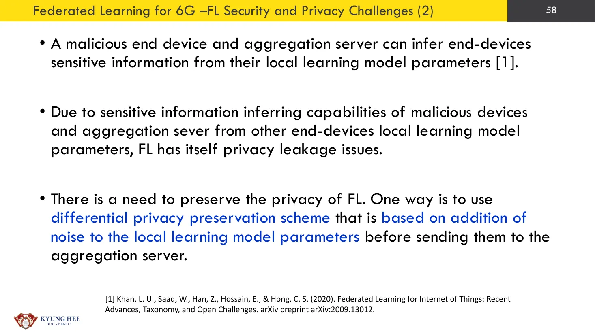

**직역**
> **FL 보안과 프라이버시 도전 과제 (2) (FL Security and Privacy Challenges (2))**
>
> - 악의적 단말 장치와 집계 서버는 단말 장치의 지역 학습 모델 파라미터로부터 단말 장치의 민감 정보를 추론할 수 있다 [1].
> - 악의적 장치와 집계 서버가 다른 단말 장치의 지역 학습 모델 파라미터로부터 민감 정보를 추론할 수 있는 능력 때문에, FL 자체에 프라이버시 누출 문제가 있다.
> - FL의 프라이버시를 보존할 필요가 있다. 한 가지 방법은 차등 프라이버시 보존 방식(differential privacy preservation scheme)으로, 지역 학습 모델 파라미터를 집계 서버로 보내기 전에 잡음(noise)을 추가하는 것에 기반한다.
>
> 출처: Khan, L. U. et al. (2020). Federated Learning for Internet of Things... arXiv:2009.13012.

## 슬라이드 59

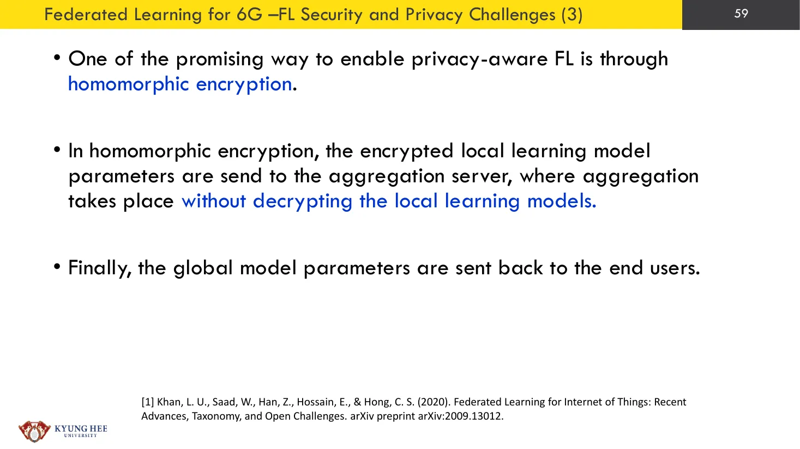

**직역**
> **FL 보안과 프라이버시 도전 과제 (3) (FL Security and Privacy Challenges (3))**
>
> - 프라이버시를 고려한 FL을 가능케 하는 유망한 방법 중 하나는 동형 암호화(homomorphic encryption)이다.
> - 동형 암호화에서는 암호화된 지역 학습 모델 파라미터를 집계 서버로 보내며, 거기서 지역 학습 모델을 복호화하지 않고도 집계가 이루어진다.
> - 최종적으로 전역 모델 파라미터가 단말 사용자에게 다시 전송된다.
>
> 출처: Khan, L. U. et al. (2020). Federated Learning for Internet of Things... arXiv:2009.13012.

## 슬라이드 60

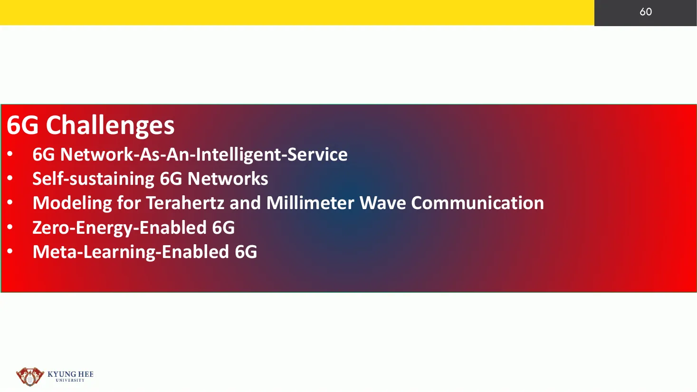

**직역**
> **6G의 도전 과제 (6G Challenges)**
> - 지능형 서비스로서의 6G 네트워크 (6G Network-As-An-Intelligent-Service)
> - 자가 지속 6G 네트워크 (Self-sustaining 6G Networks)
> - 테라헤르츠 및 밀리미터파 통신 모델링 (Modeling for Terahertz and Millimeter Wave Communication)
> - 제로 에너지 기반 6G (Zero-Energy-Enabled 6G)
> - 메타러닝 기반 6G (Meta-Learning-Enabled 6G)

## 슬라이드 61

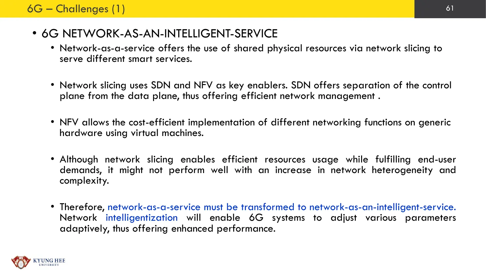

**직역**
> **6G 도전 과제 (1) (6G – Challenges (1))**
>
> - 지능형 서비스로서의 6G 네트워크 (6G NETWORK-AS-AN-INTELLIGENT-SERVICE)
>   - 서비스로서의 네트워크(Network-as-a-service)는 네트워크 슬라이싱(network slicing)을 통해 공유 물리 자원을 사용하여 서로 다른 스마트 서비스를 제공한다.
>   - 네트워크 슬라이싱은 SDN과 NFV를 핵심 기반으로 사용한다. SDN은 제어 평면(control plane)을 데이터 평면(data plane)에서 분리하여 효율적 네트워크 관리를 제공한다.
>   - NFV는 가상 머신을 사용해 일반 하드웨어(generic hardware)에서 서로 다른 네트워킹 기능을 비용 효율적으로 구현할 수 있게 한다.
>   - 네트워크 슬라이싱은 단말 사용자 요구를 충족하면서 효율적 자원 사용을 가능케 하지만, 네트워크 이질성과 복잡도가 증가하면 잘 작동하지 않을 수 있다.
>   - 따라서 서비스로서의 네트워크는 지능형 서비스로서의 네트워크(network-as-an-intelligent-service)로 전환되어야 한다. 네트워크 지능화(network intelligentization)는 6G 시스템이 다양한 파라미터를 적응적으로 조정하게 하여 향상된 성능을 제공한다.

**설명**
- 네트워크 슬라이싱: 하나의 물리 네트워크를 서비스별 요구(대역폭·reliability 등)에 맞춰 논리적/가상적으로 나눔. 가상화(virtualization)의 새 이름 = Network Slicing. 6G의 핵심 개념. SDN/NFV가 핵심 기반.

## 슬라이드 62

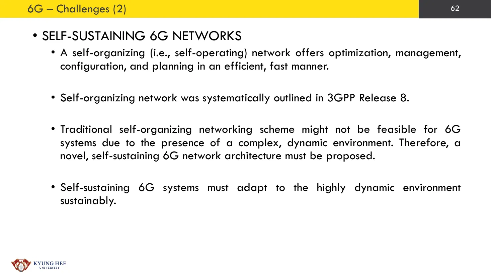

**직역**
> **6G 도전 과제 (2) (6G – Challenges (2))**
>
> - 자가 지속 6G 네트워크 (SELF-SUSTAINING 6G NETWORKS)
>   - 자가 조직(self-organizing, 즉 자가 운영 self-operating) 네트워크는 최적화·관리·구성·계획을 효율적이고 빠르게 제공한다.
>   - 자가 조직 네트워크는 3GPP Release 8에서 체계적으로 개략되었다.
>   - 전통적 자가 조직 네트워킹 방식은 복잡하고 동적인 환경의 존재 때문에 6G 시스템에 실현 가능하지 않을 수 있다. 따라서 새로운 자가 지속 6G 네트워크 아키텍처가 제안되어야 한다.
>   - 자가 지속 6G 시스템은 매우 동적인 환경에 지속 가능하게 적응해야 한다.

## 슬라이드 63

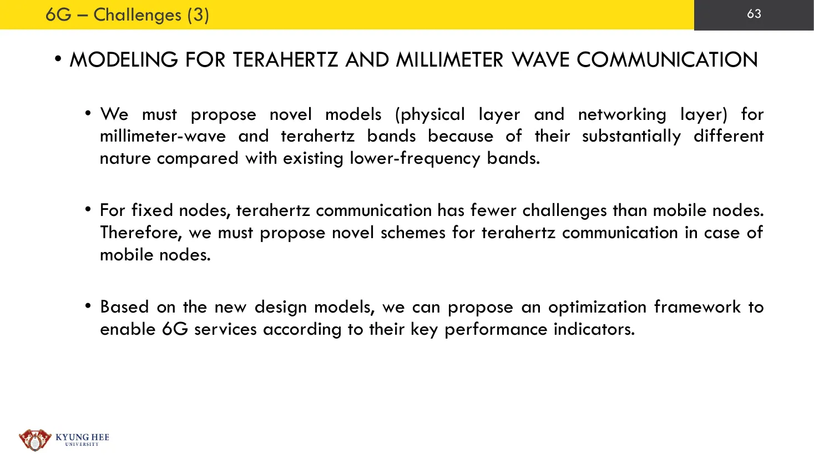

**직역**
> **6G 도전 과제 (3) (6G – Challenges (3))**
>
> - 테라헤르츠 및 밀리미터파 통신 모델링 (MODELING FOR TERAHERTZ AND MILLIMETER WAVE COMMUNICATION)
>   - 밀리미터파와 테라헤르츠 대역은 기존 저주파 대역과 본질적으로 상당히 다르므로, 이를 위한 새로운 모델(물리 계층 및 네트워킹 계층)을 제안해야 한다.
>   - 고정 노드(fixed nodes)의 경우 테라헤르츠 통신은 모바일 노드보다 도전 과제가 적다. 따라서 모바일 노드의 경우를 위한 테라헤르츠 통신의 새로운 방식을 제안해야 한다.
>   - 새 설계 모델에 기반하여, 핵심 성과 지표(KPI)에 따라 6G 서비스를 가능케 하는 최적화 프레임워크를 제안할 수 있다.

## 슬라이드 64

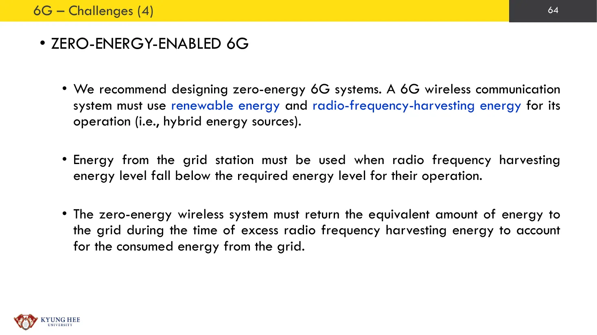

**직역**
> **6G 도전 과제 (4) (6G – Challenges (4))**
>
> - 제로 에너지 기반 6G (ZERO-ENERGY-ENABLED 6G)
>   - 제로 에너지 6G 시스템을 설계할 것을 권장한다. 6G 무선 통신 시스템은 운영을 위해 재생 에너지(renewable energy)와 무선 주파수 수확 에너지(radio-frequency-harvesting energy)를 사용해야 한다(즉, 하이브리드 에너지원).
>   - 무선 주파수 수확 에너지 수준이 운영에 필요한 에너지 수준 아래로 떨어질 때는 그리드 발전소(grid station)의 에너지를 사용해야 한다.
>   - 제로 에너지 무선 시스템은 무선 주파수 수확 에너지가 과잉인 시간 동안, 그리드에서 소비한 에너지를 상쇄하기 위해 동등한 양의 에너지를 그리드로 반환해야 한다.

## 슬라이드 65

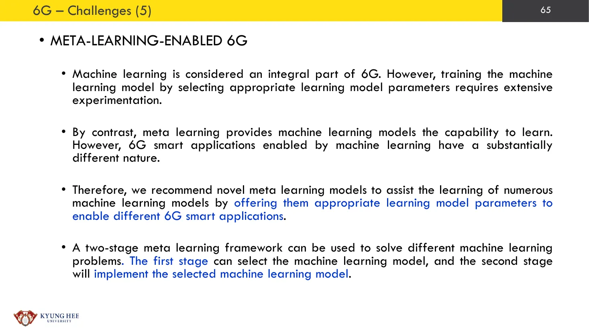

**직역**
> **6G 도전 과제 (5) (6G – Challenges (5))**
>
> - 메타러닝 기반 6G (META-LEARNING-ENABLED 6G)
>   - 머신러닝은 6G의 필수 구성 요소로 여겨진다. 그러나 적절한 학습 모델 파라미터를 선택하여 머신러닝 모델을 학습시키는 것은 광범위한 실험을 요구한다.
>   - 반면, 메타러닝(meta learning)은 머신러닝 모델에 학습할 수 있는 능력을 제공한다. 그러나 머신러닝으로 구현되는 6G 스마트 응용은 본질적으로 상당히 다르다.
>   - 따라서 다양한 6G 스마트 응용을 가능케 하기 위해, 적절한 학습 모델 파라미터를 제공함으로써 수많은 머신러닝 모델의 학습을 보조하는 새로운 메타러닝 모델을 권장한다.
>   - 서로 다른 머신러닝 문제를 풀기 위해 2단계 메타러닝 프레임워크(two-stage meta learning framework)를 사용할 수 있다. 첫 번째 단계는 머신러닝 모델을 선택하고, 두 번째 단계는 선택된 머신러닝 모델을 구현한다.

## 슬라이드 66

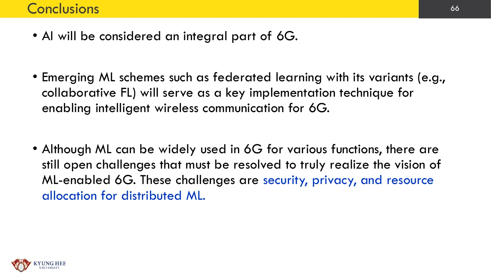

**직역**
> **결론 (Conclusions)**
>
> - AI는 6G의 필수 구성 요소로 여겨질 것이다.
> - 연합학습 및 그 변형(예: 협력적 FL collaborative FL)과 같은 떠오르는 ML 방식은, 6G를 위한 지능형 무선 통신을 가능케 하는 핵심 구현 기법(key implementation technique)으로 기능할 것이다.
> - ML이 6G의 다양한 기능에 널리 사용될 수 있지만, ML 기반 6G의 비전을 진정으로 실현하기 위해 반드시 해결되어야 하는 열린 도전 과제들이 여전히 존재한다. 이 도전 과제들은 분산 ML을 위한 보안(security), 프라이버시(privacy), 자원 할당(resource allocation)이다.

**설명**
- 핵심 결론: 6G는 분산 강화학습 + 멀티 에이전트 협력 구조로 갈 수밖에 없음. 환경이 너무 복잡 → 멀티 에이전트가 키워드이며, 각 에이전트의 액션이 서로 영향·충돌하므로 Collaboration(협력), 에이전트 간 통신·평가 방법이 과제. 엣지에 에이전트를 둬 반응은 매우 빠르게, 수집 정보로 모델을 지속 업데이트·재배포. (앞 강의의) NCCL·RDMA·NVLink 같은 효율화 기술도 활용.
