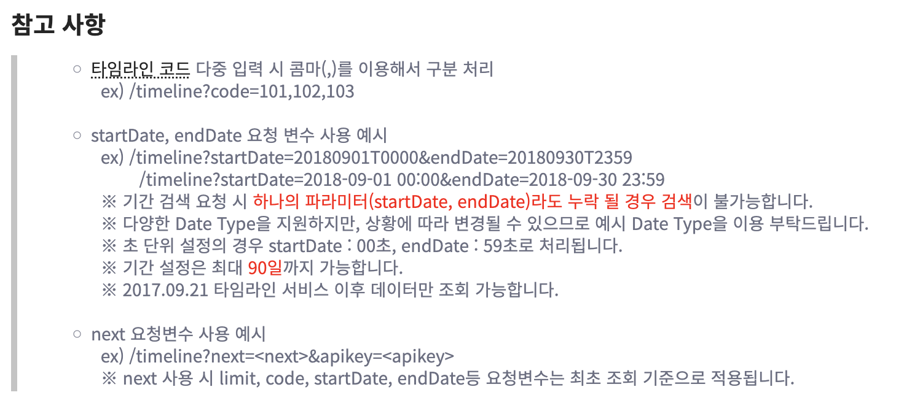

# 프롤로그
## 개발자의 글쓰기와 기획자, 관리자의 글쓰기 차이
- 개발자 글쓰기: 정확성, 간결성, 가독성이 중요하다
- 기획자, 관리자의 글쓰기: 논리력, 설득력, 실행력이 중요하다

## 개발자가 주로 쓰는 글
1. 클래스, 함수, 변수의 이름
2. 주석
3. 에러 메시지
4. 릴리즈 문서
5. 개발 가이드
6. 장애 보고서(주로 SM업무)
7. 제안서 (주로 SI업무)
8. ERD, 기능 명세서 등의 개발 산출물
9. 개발자 블로그
이들은 모두 정확하고 간결하며 가독성이 높아야 한다.

## 정확성, 간결성, 가독성 그리고 이 원칙들의 대치
### 세 가지 원칙
1. 정확성: 틀림이 없이 확실해야 한다는 원칙
	- 개발 계획을 정확성을 지켜서 작성하면, 쓰인 대로만 개발하면 버그 없이 실행되어야 한다.
2. 간결성: 글에 군더더기 없이 간단하고 깔끔해야 한다
	- 간결성을 지킨 글에는 핵심만 있어야 한다.
3. 가독성: 쉽게 읽혀야 한다
	- 가독성을 지킨 글은 쉬운 용어를 사용하고, 필요한 경우 표나 그림으로 잘 정리해야 한다.
	- 문단과 문서 전체에 체계와 위계가 갖추어져야 한다.
### 세 원칙 사이 대치
이 세 가지 원칙은 서로 대치되는 관계를 가진다.

특정한 인물이 성인인지 아닌지를 판단하는 코드를 세 가지 원칙 중 하나를 중요시하여 작성한다.

1. 간결성을 높인 예시
```
def isAdult(h):
	if h.age < 20:
		return False
	else:
		return True
```
- 이 코드는 성년의 판별을 목적으로 하는 코드 중에 꽤나 간결한 축에 속한다.
- 그러나 대한민국 민법상 실제로 성인은 만 19세가 되어야 하므로 `h.age`가 19인 경우에도 성인이 있을 수 있다. 즉, 정확성이 낮은 것이다.
- 또한 해당 함수의 매개변수 `h`는 주위 맥락이 없이 무엇을 의미하는지 알기 쉽지 않고, 반환값도 return문을 보아야 확인이 가능하다. 즉, 특정한 측면에서의 가독성이 낮은 것이다.
> 이 예시는 간결성이 높아진 대신 정확성과 가독성이 낮아졌다.
 
2. 정확성이 높아진 예시
```
def isAdult(h):
	today = datetime.today()

	if h.age > 19:
		return True
	elif h.age == 19:
		if h.birthday >= today:
			return True
		else: 
			return False
	else:
		return False

```
- "대한민국에서 성인은 만 19세가 되어야 성인으로 취급한다"라는 형태로 정확도를 높인 코드이다.
	- 이 코드는 19세에 대해 만 나이 판별 로직이 추가되었다. 
- 해당 로직의 추가로 인해 코드의 규모가 커지고, 로직을 위한 변수와 분기가 추가되었다.
	- 즉, 정확성은 높아졌으나 가독성, 간결성이 낮아졌다.
- 또한 기존 코드가 지닌 가독성의 문제(파라미터 등)를 그대로 가지고 있다.
> 이 예시는 정확성이 높아진 대신 간결성과 가독성이 낮아졌다.
	
3. 가독성이 높아진 예시
```
THRESHOLD_AGE = 19

def isAdult(human: Human) -> bool:
	today = datetime.today()

	if human.age > THREASHOLD_AGE:
		return True
	elif human.age == THREASHOLD_AGE:
		if human.birthday >= today:
			return True
		else: 
			return False
	else:
		return False
```
- 이 코드는 19라는 값이 무엇을 의미하는지 파악하기 위해 `THREASHOLD_AGE`라는 상수로 분리하고, 각 파라미터와 반환값의 명칭과 반환 타입의 힌트를 달아 가독성을 높인 형태이다.
- 그러나 부가적인 함수, 코드 규모의 증가로 간결성을 놓쳤다.
	- 기존에 정확성이 높아진 코드를 기반으로 하여, 정확성이 낮아지지는 않았다.

> 이 예시에서는 가독성이 높아진 대신 간결성이 낮아졌다.

**그러나 필자는 학습과 연습을 통해 정확하고 간결하고 가독성이 높은 글을 쓸 수 있다고 말한다.**

#### 정리와 내 생각
> 개발자의 글쓰기는 다른 글쓰기와 다르게 "간결성", "정확성", "가독성"의 세 가지 원칙을 잘 지켜야 한다.
> 
> 이 글에서는 세 가지 원칙이 대치된다고 하지만, 이는 항상 성립하는 것이 아니다.
> 특정한 상황에서는 세 가지 원칙의 Trade-off 관계를 보인다.
> 	- 필자의 표현력의 부족, 표현력을 펼치기 위한 시간 등의 자원, 글(또는 코드베이스) 전체의 맥락이 받쳐주지 못하는 상황에서는 세 가지가 서로 상충하는 모습을 보여준다.
> 충분히 잘 설계된 글(코드)에서는 이 세 가지 원칙을 모두 만족할 수 있으며, 개발자들은 이를 목표로 해야 한다.


---
# 1장. 개발자가 알아야 할 글쓰기 기본
## 문장을 구조화하는 법
이 책에서는 문장을 구조화할 때 2가지 과정을 따르게 한다.
1. 간단한 구조로 핵심만 말하기
2. 필요에 따라 부가 설명을 하기

### 예시 
아래 문장을 구조화하는 것을 목표로 한다.
```
색상 RGB값을 각각 사용하기 때문에 입력 데이터는 3차원 벡터다.
```

해당 문장에서 주어("입력 데이터")를 앞으로 뺀 결과는 다음과 같다.
```
입력 데이터는 색상 RGB값을 각각 사용하기 때문에 3차원 벡터다.
```

이 문장은 인과관계가 있는 복문이므로 두 문장으로 나눌 수 있다.
```
입력 데이터는 색상 RGB값을 각각 사용한다. 그래서 입력 데이터는 3차원 벡터다.
```

이 문장에서 핵심만 남긴다.
```
입력 데이터는 3차원 벡터다.
```

핵심을 남긴 후 선택적으로 부가 설명을 추가한다.
```
입력 데이터는 3차원 벡터다. 색상 RGB값을 각각 사용하기 때문이다.
```
- 이 부연 설명은 "색상 RGB를 사용하면 세 가지 값을 사용하므로 3차원 벡터이다"라는 내용을 이해할 수 있는 대상(ex. 그래픽 프로그램을 사용하지 않는 사람)으로 할 때 필요하다.
	- 이를 충분히 이해하는 대상자라면 해당 부가 설명은 제거해도 된다.

이 예시에서 1) 주어를 앞으로 이동 2) 인과 관계의 복문 나누기 3) 핵심만 남기기의 세 가지 과정은 "간단한 문장 구조로 핵심만 말하기"를 위한 과정이다.

#### 내 생각
> "간단한 구조로 핵심만 말하기"에는 이 글에서 말한 방법을 제외하고도 여러 가지 절차와 접근 방법이 존재하는 것으로 보인다.
> 
> 이 부분은 생성형 AI와 같이 정리해본 결과는 아래와 같다.
> 1. 표현하고 싶은 내용을 문장으로 작성한다.
> 2. 핵심을 남기기 위해서 문장을 제거 가능한 단어와, 제거하면 의미가 변하는 단어로 나눈다.
> 3. 제거 가능한 단어를 제거하고, 남은 단어를 주어 + 목적어 + 동사 단위로 배치한다.
>	- 주어, 목적어, 동사의 배치는 한글일 때만 해당한다. 영어인 경우 S+V+O로 배치한다. 
> 4. 필요한 경우 부가 설명을 덧붙인다.
> 
> 추가적으로 인간의 작업 기억 능력을 고려했을 때 이 과정은 아래와 같다.
> 1. 복문은 단문으로 분해한다. <- 작업 기억이 한 번에 처리할 내용을 줄여 인지적 부하 감소
> 2. 핵심이 앞에 위치해야 한다. <- 문장의 핵심 정보를 해석하고 부가 설명을 처리하는 것이 문장 이해의 기준점을 부여해 해석 과정의 복잡도를 줄여 인지적인 부하를 줄인다.
> 3. 부가적인 표현을 줄인다. <- 작업 기억의 처리 부하를 줄인다(1번과 같다)
> 이때 1, 3번은 "문장을 되도록 작게 유지한다."는 원칙으로 일반화 가능하다. 이는 인지적 부하를 줄이기 위함이다.


> **단락을 구조화하는 법**
	-> 아래 "서술식, 개조식, 도식의 차이", "개조식 서술 방식과 글머리 기호", "단락을 구조화하는 위계"는 실질적으로 단락을 구조화하는 법이다.
## 서술식, 개조식, 도식의 차이
생각을 글로 표현하는 방식은 크게 세 가지다.
1. 서술식
2. 개조식
3. 도식
### 서술식
- "~다."와 같은 종결 어미로 끝나는 완전한 문장으로 구성된 글
- 무엇을 설명하거나 논증할 때 주로 사용하는 방식
- 소설, 신문 기사, 개발 가이드 문서 등은 대부분 서술식으로 작성한다
- 줄거리가 있는 설명이나 이야기라면 서술식을 사용해야 한다
- 예시
```
해당 메신저에는 4가지 푸시 알림이 있습니다. 공지 알림은 서비스 변경이나 장애 이벤트 등 메신저 운영사가 직접 보냅니다. 오전 9시부터 오후 6시 사이에만 발송합니다. 메시지 알림은 등록된 친구가 메시지를 보냈을 때 자동으로 시스템이 전송합니다. 친구 등록 알림은 새로운 친구가 등록되었을 때 알려줍니다. 친구 해제 알림은 친구가 탈퇴했을 때 알려줍니다.
```

### 개조식
- 종결 어미(ex. ~다.) 대신 명사나 용언의 명사형(ex. ~음)으로 끝내는 방식
- 신문의 헤드라인, 어떤 사항을 나열할 때 주로 사용한다
- 릴리즈 문서나 장애 보고서는 개조식으로 작성한다
- 여러 가지 종류의 항목과 내용이 반복되거나 서술식에서 강조가 필요한 내용이라면 개조식으로 써야 한다
- 예시
```
해당 메신저의 4가지 푸시 알림
- 공지 알림: 서비스 변경이나 장애, 이벤트
	- 메신저 운영사가 오전 9시부터 오후 6시 사이에 직접 발송
- 메시지 알림: 등록된 친구가 메시지를 보냈을 때 시스템이 자동으로 전송
- 친구 등록 알림: 새로운 친구가 등록되었을 때 
- 친구 해제 알림: 친구가 탈퇴했을 때
```

### 도식
- 사물의 구조나 관계, 상태를 그림이나 서식으로 보여주는 것
- 행과 열로 이뤄진 표가 대표적인 도식
	- 이때 글만 있으면 표, 막대 같은 그림이 있으면 도표
- 각 항목이나 사항의 관계를 명확히 규정하고 싶다면 도식으로 보여줘야 한다
- 예시

<table>
  <tr>
    <th>알림 종류</th>
    <th>상황</th>
    <th>발송 방식</th>
    <th>발송 시간</th>
  </tr>
  <tr>
    <td>공지 알림</td>
    <td>서비스 변경, 장애, 이벤트</td>
    <td>수동</td>
    <td>09:00 ~ 18:00</td>
  </tr>
  <tr>
    <td>메시지 알림</td>
    <td>친구가 메시지 전송</td>
    <td rowspan="3">자동</td>
    <td rowspan="3">상시</td>
  </tr>
  <tr>
    <td>친구 등록 알림</td>
    <td>새로운 친구 등록</td>
  </tr>
  <tr>
    <td>친구 해제 알림</td>
    <td>친구 탈퇴</td>
  </tr>
</table>
## 개조식 서술 방식과 글머리 기호
- 개조식 글에서는 글머리 기호(말머리 기호)를 사용해야 한다
- 이 글머리 기호는 글의 진술 방식에 따라 다르다
- 글의 진술 방식은 1) 설명 2) 묘사 3) 논증 4) 서사(서술)로 나뉜다.
- 각 진술 방식과 그에 따른 글머리 기호는 아래와 같이 나뉜다.
	1. 설명
		- 내용을 구체적으로 설명하거나 나열할 때
		- 하위 요소로 갈수록 부가 설명이 되며 중요도가 낮아지므로 크기가 작아지거나 들여쓰기를 해야 한다
		- ▪︎, ▫︎, ⁃, * 등을 사용
	2. 묘사
		- 내용을 그림으로 나타낼 때
		- 이때 그림 안에 어떤 요소나 영역을 표시하기 위해 원형문자를 사용
		- ①, ②, ③, ⓐ, ⓑ 등을 사용
	3. 논증
		- 내용이 논리 관계(귀납, 연역, 인과, 유추, 비교, 단계 등)로 구성될 때
		- →, =>, <, >, = 등을 사용
	4. 서사(서술)
		- 이때 순서나 단계를 나타낼 때
		- 1, 2, 3, 가, 나, 다 등을 사용
## 단락을 구조화하는 위계
- 비즈니스 문서에는 문단과 문단 사이 위계가 필요하다
- 위계는 위치와 계층을 합한 말이다
- 위치는 2차원 평면 상의 좌표다
	- 문서에서 위치는 급이 높은 문장과 낮은 문장 사이 위치를 "들여쓰기"로 구분함으로써 표현한다
- 계층은 3차원 입체의 높이다
	- 문서에서 계층은 굵기, 모양, 밑줄, 줄 간 거리 등으로 표현한다



- 위 이미지의 글은 위치(급 차이가 나는 문장 사이 들여쓰기)와 계층(제목의 글씨 크기, 굵기, 글자의 색상)을 지킨 예시다
- 개발자들은 개발 도구를 사용할 때 위치는 맞추지만 계층은 맞추지 않는다. 그런 이유로 개발자의 글에서는 위치는 강박적으로 맞춰져 있지만 계층은 맞추어져 있지 않은 경우가 많다.

## 쉽게 쓰는 띄어쓰기와 문장 부호


---
# 2장.
