> 원본 Notion 정리 — 강의 슬라이드 이미지 + 설명.
> [← 전체 목차](/posts/ml-overview/)

***

# 최적화(Optimization)

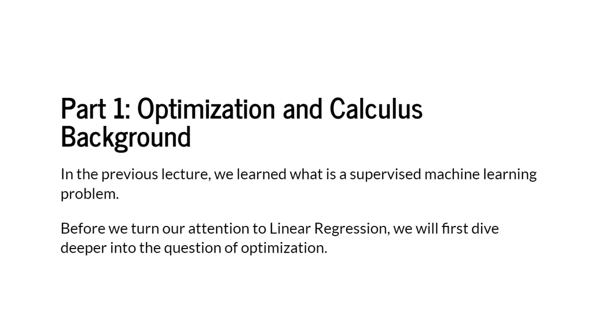

→ 최적화와 미적분의 배경

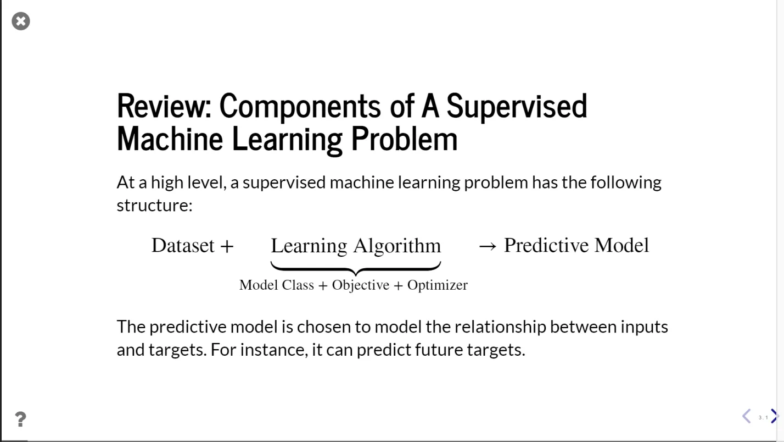

## 지도학습 머신러닝 문제의 구성요소

- 큰 틀에서 보면, 지도학습 머신러닝 문제는 다음과 같은 구조를 가짐
	```python
Dataset + Learning Algorithm → Predictive Model
	```
	→ 데이터셋 + 학습 알고리즘 → 예측 모델

	- **Model Class + Objective + Optimizer**
	- **학습 알고리즘은 모델 클래스 + 목적 함수 + 최적화 방법 으로 구성**
- 모델 클래스는 입력과 정답 사이 관계를 모델링 하기 위해 사용

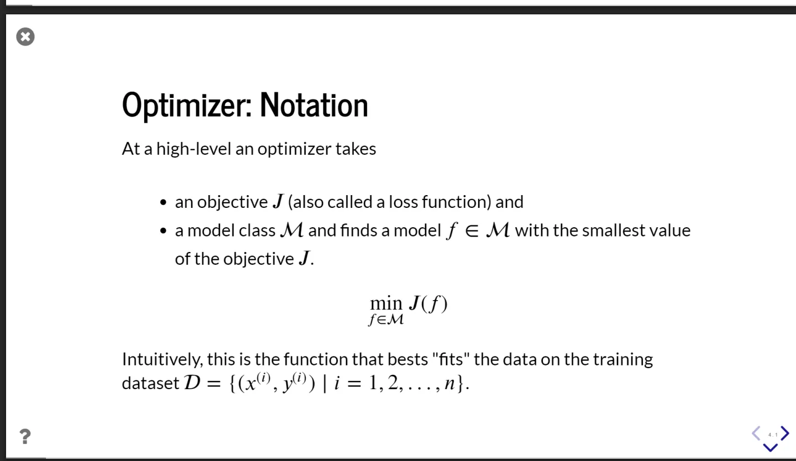

## Optimizer 표기법

- 추상적으로 보면 Optimizer는 아래 요소들로 구성
	1. `J` → 목적함수(== 손실 함수라고도 불림)
	2. `M` → 모델 클래스
	$$


\min_{f \in \mathcal{M}} J(f)
	$$

	- Optimizer는 모델 클래스 `M` 에 속한 함수들 중 목적함수 `J` 를 최소로 만드는 함수를 찾는 것을 목적으로 함
	→ 이때 모델 클래스에 있는 함수 f들은 가중치와 모델 클래스를 결합해서 만들어진 것
 → 즉, 함수 f들은 모두 각각의 가중치애 매핑되고
 → 그 함수를 찾는 과정은 가중치를 찾는 것과 동일한 작업이 됨
→ Optimizer는 모델 구조, 손실함수 등이 아닌, 어떻게 학습을 할 것인지에 대한 문제

### 예시 코드

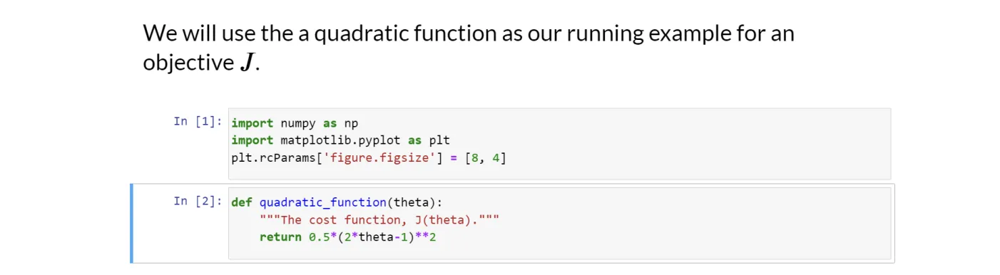

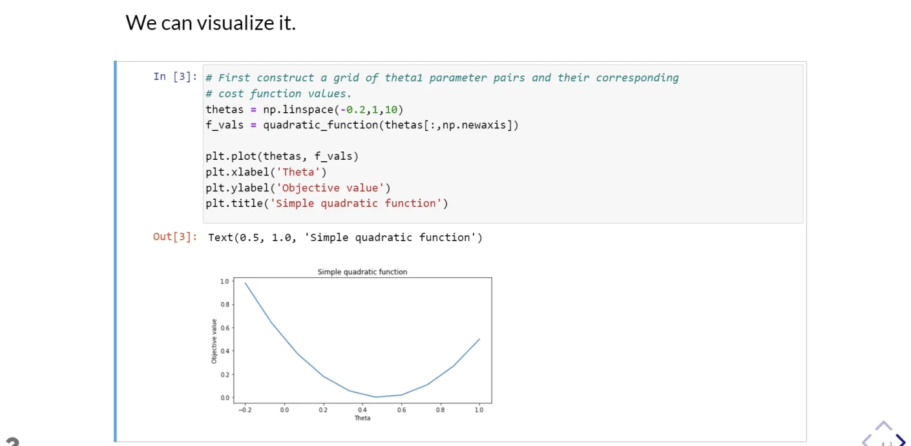

- $`J(\theta) = 0.5(2\theta - 1)^2`$ 를 목적함수로 설정
- 아래 그래프는 세타 값에 따른 목적함수 J의 값을 보여줌
	→ 0.45 정도에서 최소가 됨

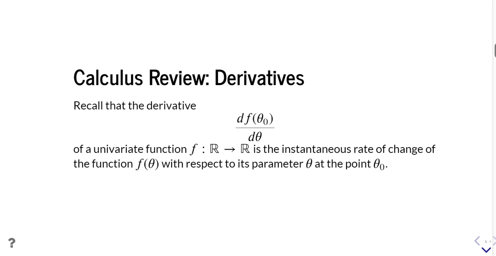

## 미적분 복습: 미분
$$

\frac{d f(\theta_0)}{d\theta}
$$

- 위 미분은 단변수 함수`f: R->R` 가 $`\theta_0`$라는 지점에서 $`\theta`$에 대해 얼마나 빠르게 움직이는지를 나타냄
⇒ 이를 최적화 관점에서 특정 지점에서 목적함수의 기울기를 구하는 데 사용 가능

	- 이는 현재를 기점으로 목적함수의 값이 줄어들지, 늘어날지 판단 가능

### 예시 코드

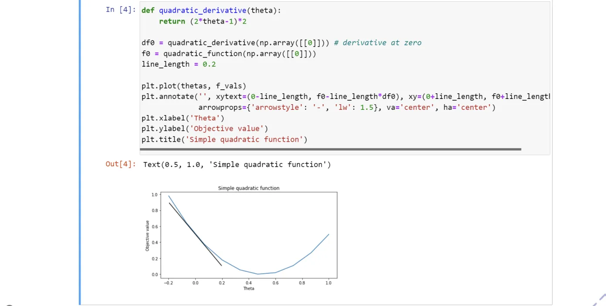

- 한 지점에서의 미분 결과를 보여주는 코드
- 현재 해당 지점의 기울기의 부호는 음수이고,
	- 이는 해당 지점을 기준으로 왼쪽으로 이동하면 목적함수가 커지고
	- 오른쪽으로 이동하면 목적함수의 값이 작아짐을 의미

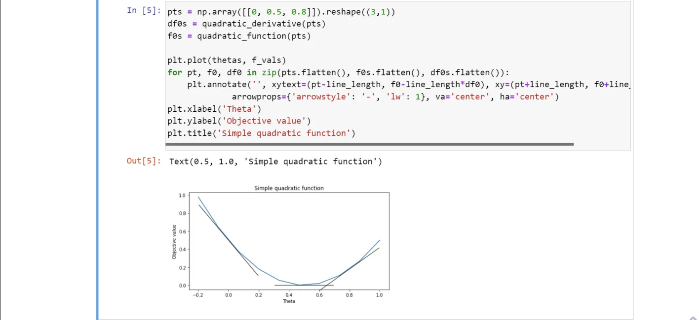

- 여러 지점에서의 미분 결과를 보여주는 코드
- 위 결과는 아래와 같이 해석 가능
	1. **최소점보다 왼쪽에 있으면**
 - 접선이 오른쪽 아래로 기울어짐
 → **오른쪽으로 가야 함**

	2. **최소점보다 오른쪽에 있으면**
 - 접선이 오른쪽 위로 기울어짐
 → **왼쪽으로 가야 함**

	3. **최소점에서는**
 - 접선이 수평
 → **미분 = 0**
 → **움직일 필요 없음**

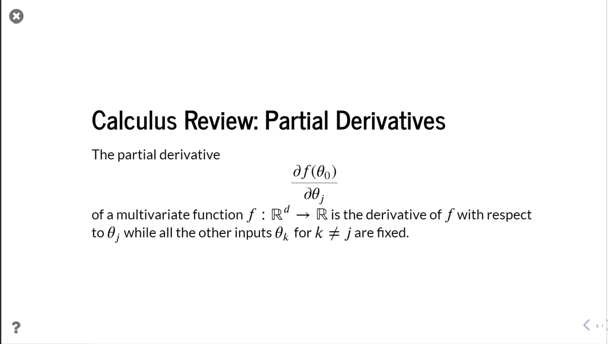

## 미적분 복습: 편미분
$$

\frac{\partial f(\theta_0)}{\partial \theta_j}
$$

- 편미분은 다변수 함수 $`f : \mathbb{R}^d \rightarrow \mathbb{R}`$ 에 대해, 다른 모든 입력 $`\theta_k (k \neq j)`$는 고정한 채, $`\theta_j`$에 대해서만 미분한 것
⇒ 이는 실제 머신러닝에서는 목적함수가 다변수 함수일 확률이 높기 때문에 편미분을 통해 특정 가중치만의 변화를 파악 가능
	→ 다른 가중치는 전부 멈춰 세워 두고, 이 가중치 하나만 살짝 움직이면 손실이 어떻게 변하는가

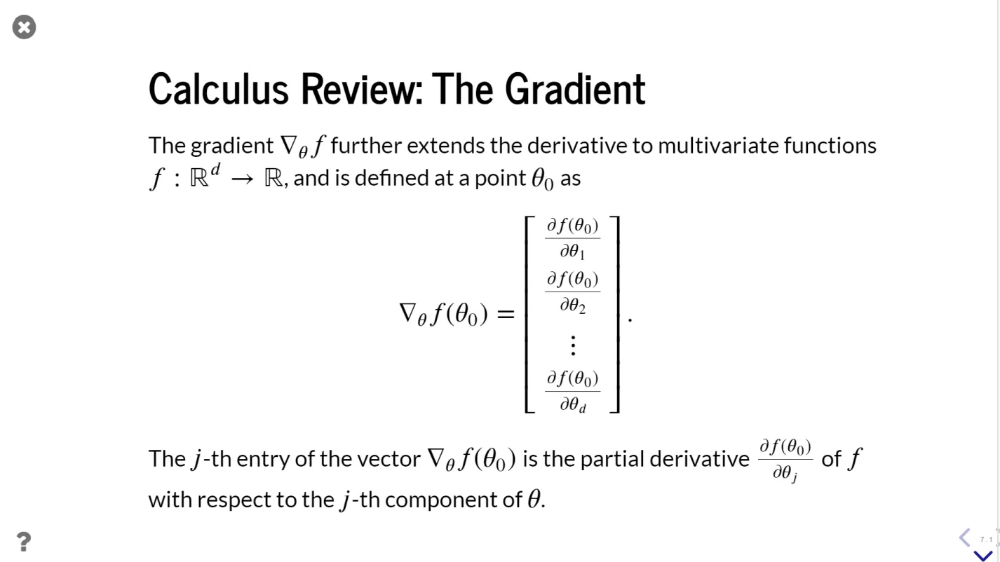

## 미적분 복습: 그래디언트(기울기 벡터)

- 그래디언트 $`\nabla_\theta f`$는 미분을 다변수 함수로 확장한 것
$$

\nabla_\theta f(\theta_0) =
\begin{bmatrix}
\frac{\partial f(\theta_0)}{\partial \theta_1} \\
\frac{\partial f(\theta_0)}{\partial \theta_2} \\
\vdots \\
\frac{\partial f(\theta_0)}{\partial \theta_d}
\end{bmatrix}
$$

- $`f : \mathbb{R}^d \rightarrow \mathbb{R}`$ 인 함수에 대해, $`\theta_0`$ 지점에서 다음과 같이 정의
- 이 벡터의 j번째 원소는 $`\theta_0`$ 의 j번째 성분에 대한 편미분
→ 부가설명

	- 그래디언트는 각 가중치 방향으로의 기울기를 한 벡터에 모아 놓은 것
 → 그래디언트의 정의

 1. θ 하나 → **미분**
 2. θ 여러 개 → **편미분**
 3. 편미분 여러 개 → 그래디언트
	- 따라서 그래디언트 벡터의 한 요소는 특정 지점에서의 편미분값
	⇒ 이 그래디언트는 로컬 영역(전역X)에서 함수가 가장 빠르게 증가하는 방향 ← 정리(이런 특성이 있음)
 → 감소는 아님 , 감소는 -그래디언트


 ## **2⃣ 먼저 수학적 정의 (팩트)**
 그래디언트의 정의는 이겁니다:
 $$
 \nabla f(\theta)

\begin{bmatrix}
\frac{\partial f}{\partial \theta_1} \\
\frac{\partial f}{\partial \theta_2} \\
\vdots
\end{bmatrix}
 $$
 이건 **팩트**
 여기까지는 “편미분 값의 집합”이 맞습니다
***
 ## **3⃣ 그런데 “방향” 이야기는 어디서 나오나?**
 여기서 핵심 질문이 나옵니다:
 > “이 벡터가 왜 ‘가장 빠르게 증가하는 방향’이지?”
 이건 **정의가 아니라 정리(theorem)**입니다.
***
 ## **4⃣ 핵심 아이디어 (기하적 직관)**
 어떤 점에서 함수 f(\\theta)가 있고,
 우리가 **어떤 방향 **v 로 아주 조금 움직인다고 합시다.
 그때 함수 값 변화는:
 $$
 \text{변화량} \;\approx\; \nabla f(\theta) \cdot v
 $$
 (이게 **방향 미분**입니다)
***
 ## **5⃣ 이제 질문을 이렇게 바꿔봅니다**
 > “길이가 1인 방향 벡터 v 중에서
 > f를 가장 많이 증가시키는 방향은 무엇인가?”
 즉,
 $$
 \max_{\|v\|=1} \nabla f(\theta) \cdot v
 $$
***
 ## **6⃣ 답은 선형대수에서 바로 나옵니다**
 내적의 성질:
 $$
 \nabla f \cdot v

\|\nabla f\|\;\|v\|\;\cos\theta
 $$

 - $`\|v\| = 1`$
 - 최대가 되려면 $`\cos\theta = 1`$
 즉,
 $$
 v = \frac{\nabla f}{\|\nabla f\|}
 $$

### 예시 코드

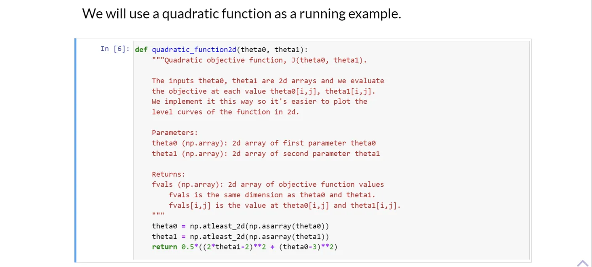

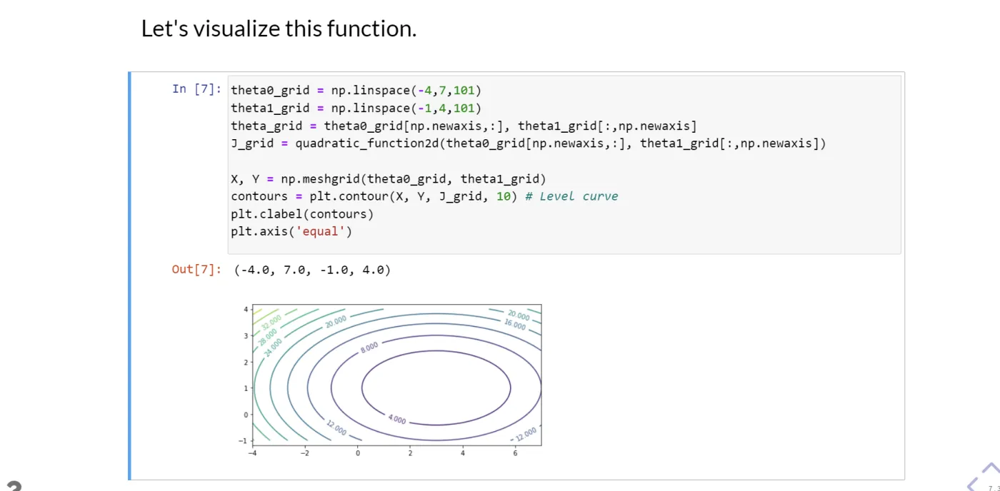

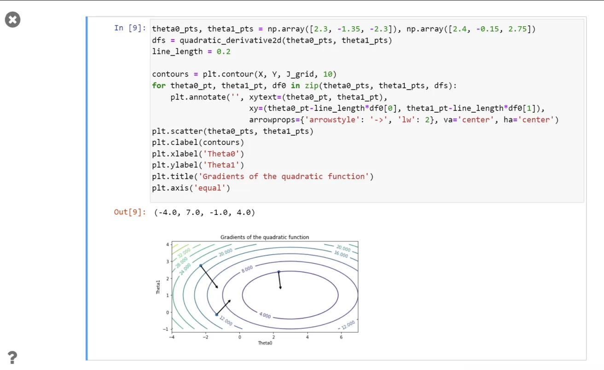

- θ가 2개일 때, 손실 함수가 “지형”처럼 생긴다는 걸 보여주고, 그래디언트가 그 지형에서 방향을 알려준다는 걸 시각화
- 화살표의 방향이 그래디언트
	→ 결국 손실함수의 최소화를 위해 이것의 방향의 반대로 가야함
***

# Gradient Desent (경사하강법)

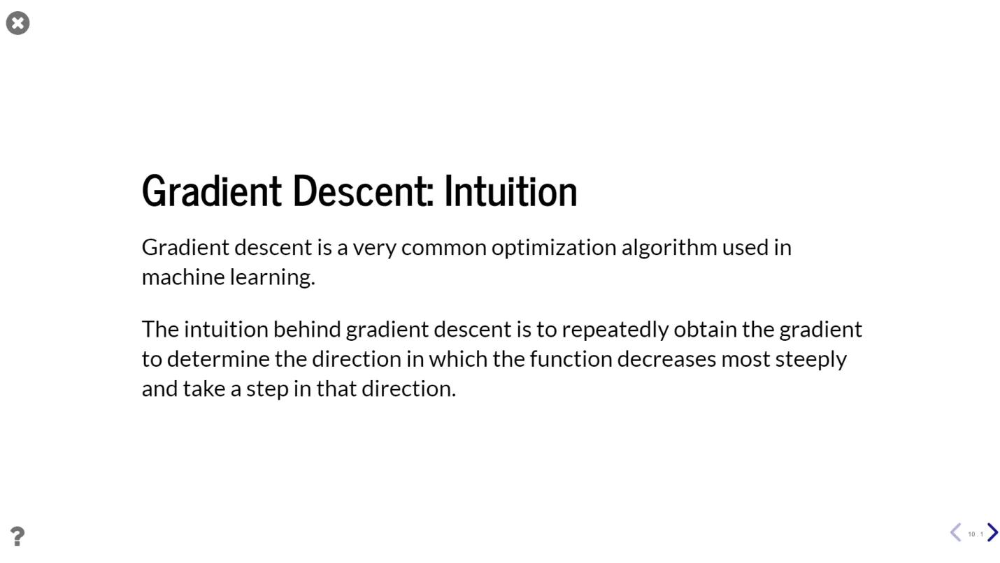

## 경사하강법: 직관

- 그래디언트를 반복해서 계산해 함수가 가장 가파르게 감소하는 방향을 찾고, 그 방향으로 이동하는 것
	- 그래디언트 = 가장 빠르게 **증가**하는 방향
	- 우리는 감소를 원함 ⇒ 그래서 **반대 방향으로 이동**
	- 위 과정을 반복적으로 수행

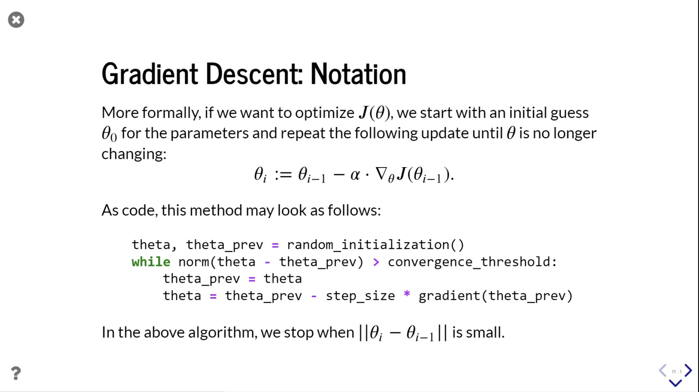

## 경사하강법: 표기법
$$
\theta_i := \theta_{i-1} - \alpha \cdot \nabla_\theta J(\theta_{i-1}) 
$$

- 파라미터의 초기 추정값 $`\theta_0`$에서 시작해서 $`\theta`$가 더 이상 변하지 않을 때까지 다음 업데이트를 반복
- $`\theta_{i-1}`$ → 현재 위치
- $`\nabla_\theta J(\theta_{i-1})`$ → 현재 위치에서의 그래디언트, 가장 빨리 올라가는 방향
- $`-`$ → 내려가고 싶기 때문에 마이너스로 처리
- $`\alpha`$ → 한 번에 얼마나 움직일지, **학습률 (learning rate)**
	- 작으면 안정적이고 느림
	- 크면 빠르지만 튈 수 있음
⇒ 경사하강법을 통해 가장 손실함수가 적은 $`\theta`$값을 구해낼 수 있음
	→ 가장 적절한 가중치를 구하는 셈
→ 간단 정리

	1. 손실 함수는 등고선 형태
	2. 그래디언트는 올라가는 방향이다
	3. 그 반대 방향으로 이동한다
	4. 이걸 반복한다
	5. 거의 안 움직이면 멈춘다
	→ **Gradient Descent**

### 예시 코드

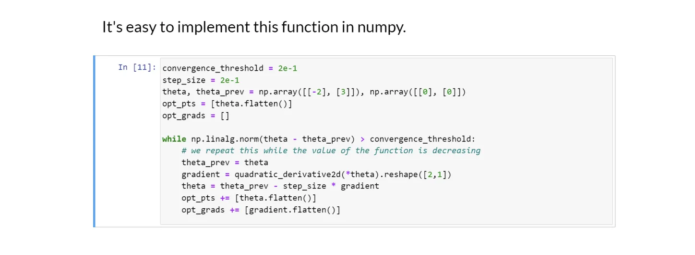

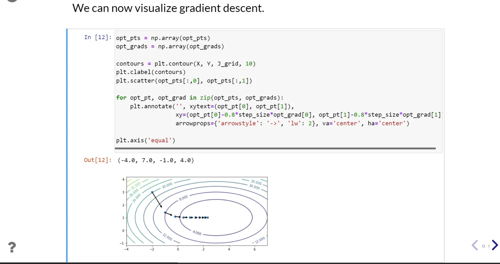

- **위 예시 코드 설명**
	1. **등고선**
 - 손실 함수 J의 지형
 - 안쪽으로 갈수록 낮음
	2. **점들 (●)**
 - 경사하강법이 실제로 방문한 θ들
 - **시간 순서대로 찍힌 경로**
	3. **화살표**
 - 각 점에서의 **그래디언트 방향**
 - 즉, “이쪽이 올라가는 방향”

# 선형 모델에서의 경사하강법

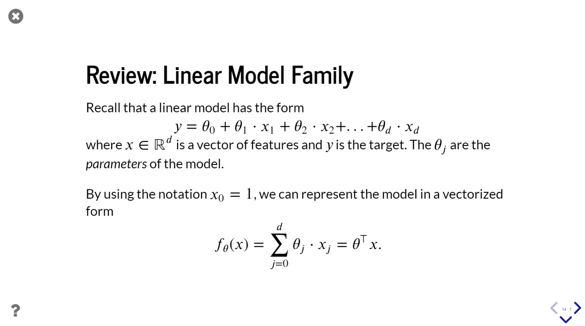

## 복습: 선형 모델 계열(Family)
$$
y = \theta_0 + \theta_1 x_1 + \theta_2 x_2 + \dots + \theta_d x_d
$$

- 선형 모델은 다음과 같은 형태를 가짐
- 설명
	- 입력: $`x = (x_1, x_2, \dots, x_d)`$ ← 피처 벡터
	- 출력: y ← 타깃(정답)
	- $`\theta_j`$들은 모델의 파라미터
	- 모델의 역할
 → 입력의 **가중합(weighted sum)**으로 y 예측

### 예시 코드

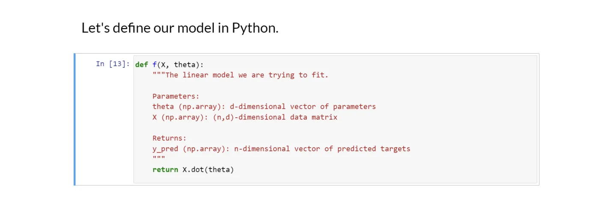

개념적으로 이 함수는

- 입력:
	- X: 데이터 행렬 (n개의 샘플 × d개의 특성)
	- $`\theta`$: 파라미터 벡터
- 출력:
	- 각 데이터에 대한 예측값 $`y_{\text{pred}}`$
⇒ $`y_{\text{pred}} = X\theta`$

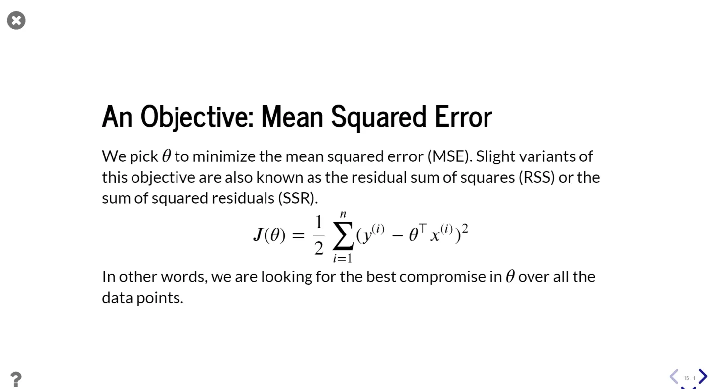

## 목적함수: Mean Squared Error (MSE)
$$
J(\theta) = \frac{1}{2}\sum_{i=1}^{n} \big(y^{(i)} - \theta^T x^{(i)}\big)^2
$$

- 위는 선형모델에서 자주 사용되는 목적 함수의 일종인 ⇒ MSE
- 수식 설명
	1. $`y^{(i)}`$ → i번째 데이터의 **실제 정답**
	2. $`\theta^T x^{(i)}`$ → i번째 데이터에 대한 **모델의 예측값**
	3. $`y^{(i)} - \theta^T x^{(i)}`$ → **오차(residual)**
	4. $`^2`$ → 오차를 제곱 → (부호 제거 + 큰 오차를 더 크게 두드러지게 함)
	5. $`\sum_{i=1}^n`$ → 모든 데이터에 대해 합산
	⇒ 모든 데이터에서 예측과 실제의 차이를 제곱해서 전부 더한 값

- 이 목적 함수의 약간 다른 형태로 RSS(Residual Sum of Squres) 또는 SSR(Sum of Squared Residuals) 라는 것이 있음
- 이 목적함수는 모든 데이터 포인트에 대해 가장 좋은 타협점이 되는 $`\theta`$를 찾는 것
	- 타협점 → MSE는 **전체 오차의 균형을 가장 잘 맞추는 θ로 타협하는 것**
 → 보통 하나의 $`\theta`$로 모든 지점을 완벽하게 맞추지 못하는 경우가 많음, 따라서 전체의 균형으로 타협
\* 각 목적함수 사용

	- 사용하는 알고리즘에 따라 목적함수는 다르게 사용 가능
	1. 선형 회귀 + MSE
	2. 로지스틱 회귀 + Cross Entropy
	3. SVM + Hinge loss
	- 모델과 알고리즘이 목적함수를 강제하는 경우도 존재, 아에 자율로 선택할 수도 있음

### 예시 코드

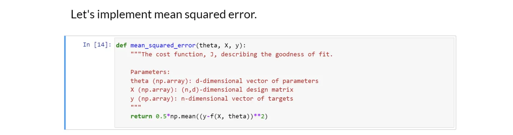

- 위의 MSE의 동일한 python 코드

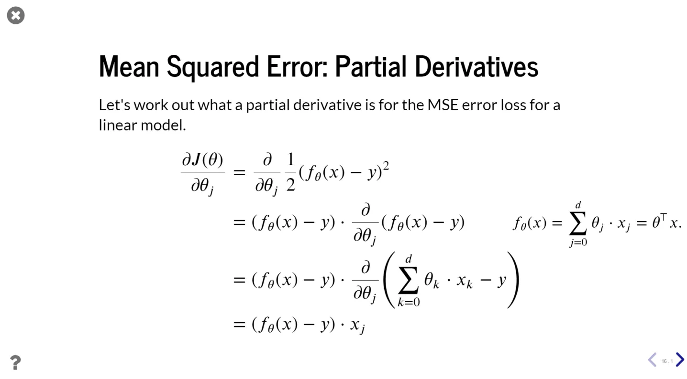

## Mean Squared Error: 편미분

- MSE 목적함수를 θⱼ로 편미분하면 왜 $`(f_\theta(x)-y)\,x_j`$**가 되는지 증명**
	- $`f_\theta(x) = \theta^T x = \sum_{k=0}^d \theta_k x_k`$
	- y는 **상수**
	- $`\theta_j`$ 만 변수 (편미분이므로)
$$

\frac{\partial J(\theta)}{\partial \theta_j}
= \frac{\partial}{\partial \theta_j}
\left[
\frac{1}{2}(f_\theta(x) - y)^2
\right]
$$

- 제곱의 미분 같은 경우 아래 식과 같이 전개 가능
$$

= (f_\theta(x) - y)\;
\frac{\partial}{\partial \theta_j}(f_\theta(x) - y)
$$

- 아래는 f의 식으로, 이를 통해 아래와 같이 유도 가능
$$
f_\theta(x)
= \sum_{k=0}^d \theta_k x_k
$$
$$

f_\theta(x) - y
= \sum_{k=0}^d \theta_k x_k - y
$$
⇒ 아래와 같이 수식 변환 가능
$$
\frac{\partial}{\partial \theta_j}(f_\theta(x) - y) =

\frac{\partial}{\partial \theta_j}
\left(
\sum_{k=0}^d \theta_k x_k - y
\right) = x_j
$$

- 이때 k ≠ j 이면 모두 상수취급, k=j일 때만 변수 취급이 되므로 이에 대해서만 미분
	- 이때 k = j 이면 $`\theta_j`$는 1로 미분되므로 위와 같은 결과가 나옴
따라서
$$
\frac{\partial J(\theta)}{\partial \theta_j} =

(f_\theta(x) - y)\,x_j

$$
⇒ 이 결과는 목적함수의 편미분 결과가 됨

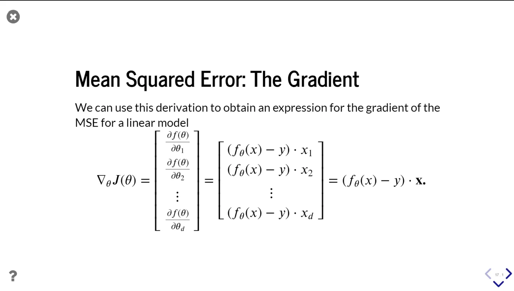

## Mean Squared Error: 그래디언트

- MSE 손실을 θ에 대해 미분한 결과를 ‘그래디언트 벡터’ 형태로 정리
	- 위에서 구한 목적함수의 편미분을 모두 모아 그래디언트 벡터를 생성
$$

\nabla_\theta J(\theta)
=
\begin{bmatrix}
\frac{\partial J}{\partial \theta_1} \\
\frac{\partial J}{\partial \theta_2} \\
\vdots \\
\frac{\partial J}{\partial \theta_d}
\end{bmatrix}

=
\begin{bmatrix}
(f_\theta(x) - y)\,x_1 \\
(f_\theta(x) - y)\,x_2 \\
\vdots \\
(f_\theta(x) - y)\,x_d
\end{bmatrix}

$$
$$

[x_1, x_2, \dots, x_d]^T = X
$$

- 벡터 X를 위와 같이 정의하면
$$

\nabla_\theta J(\theta) = (f_\theta(x) - y)\,x

$$

### 예시 코드

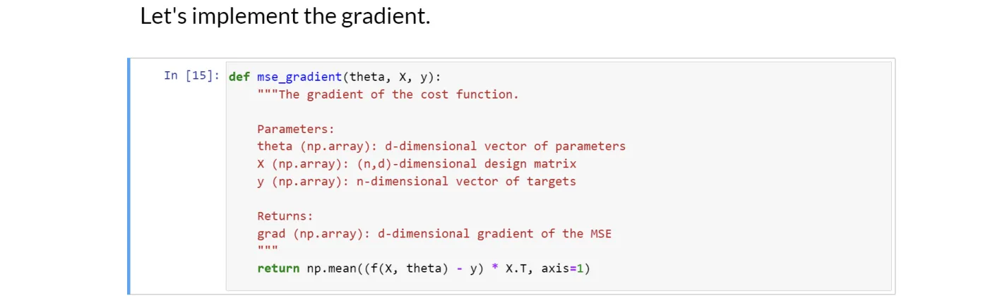

- mse 그래디언트의 코드 표시

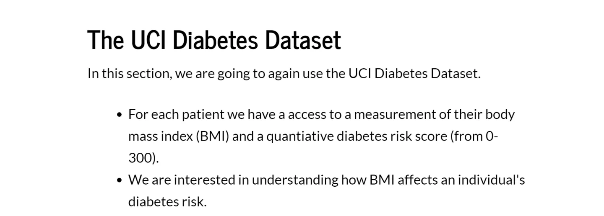

## MSE 적용 선형 모델 예시: UCI 당뇨병 데이터셋

- 각 환자에 대해 BMI(체질량지수)와 정량화된 당뇨 위험 점수(0~300)를 가지고 있음
- BMI와 당뇨의 관계성을 이해하는 것이 목표

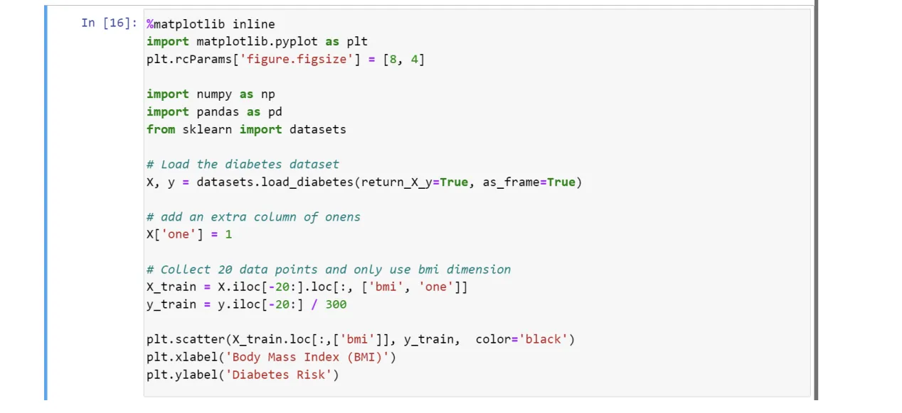

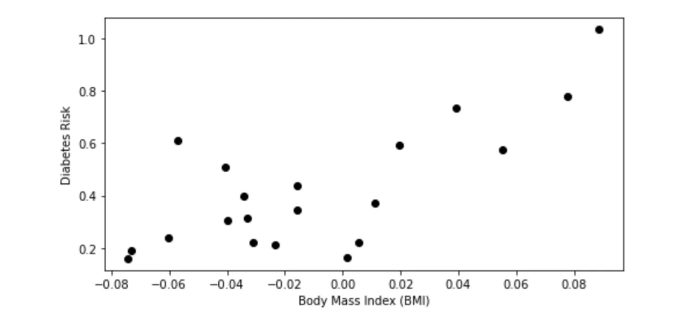

- 가로축은 BMI, 세로축은 당뇨 확률로 20명을 뽑아낸 산점도

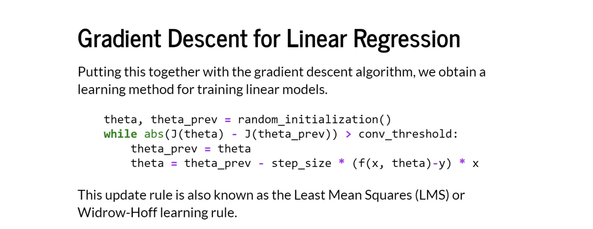

## 선형 모델과 경사하강법

- 경사 하강법 알고리즘과 지금까지 내용을 합치면 선형 모델을 학습하는 방법이 됨
- 위 의사코드는 아래와 같은 뜻
	1. 초기화하고
	2. 수렴할 때까지 반복
	3. $`\theta \leftarrow \theta - \alpha \cdot (f(x,\theta)-y)\cdot x`$
	$$


\theta \leftarrow \theta - \alpha \nabla J(\theta)
	$$
	$$


\theta \leftarrow \theta - \alpha (f_\theta(x) - y)x
	$$

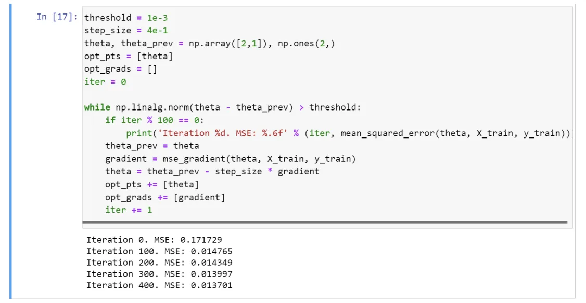

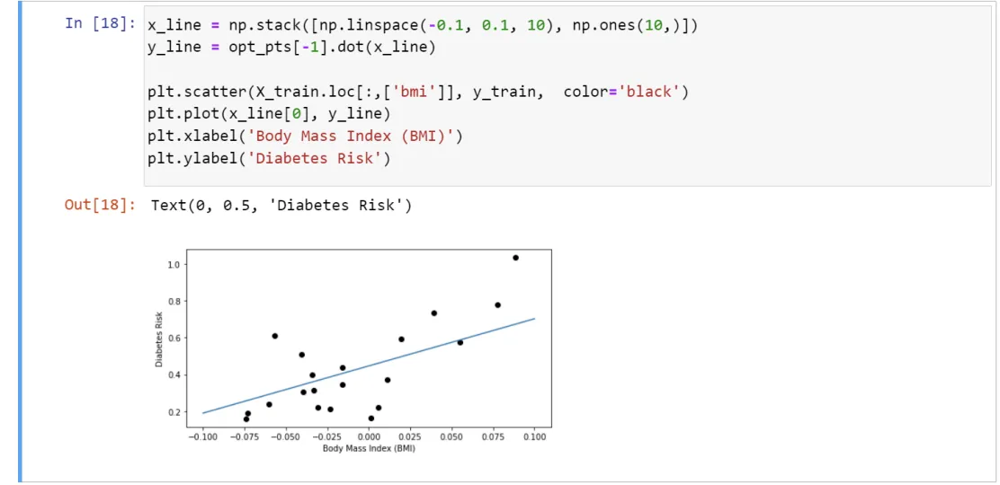

- 위 코드의 로그를 보면 실제로 MSE가 점차 낮아짐 → 실제로 학습이 잘 되고 있다는 뜻
- 아래는 학습한 직선

# Ordinary Least Squares

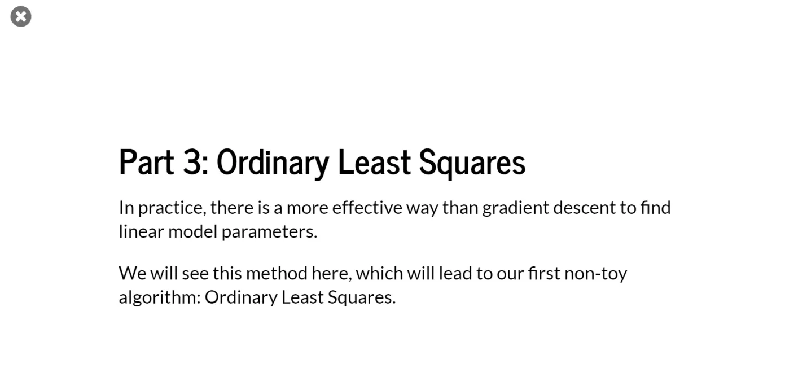

→ 최소 제곱법

- 실제로는 선형 모델의 파라미터를 찾는 데 경사하강법보다 더 효율적인 방법
- 선형 회귀는 MSE가 짝꿍
	- 선형 회귀 → $`f_\theta(x) = X\theta`$
	- MSE 목적함수 → $`J(\theta) = \|X\theta - y\|^2`$
	- Gradient Descent 옵티마이저 → $`\theta \leftarrow \theta - \alpha \nabla J(\theta)`$
	→ 이 방법은 아래와 같은 특징이 있음
 특징

 - 반복적(iterative)
 - 학습률 튜닝 필요
 - 수렴까지 시간 소요
 - 대규모/비선형 모델에는 필수
 하지만 선형 회귀에서는

 - **너무 일반적인 도구**
 - 사실 과한 방법
⇒ 선형 회귀에 반복 없이 가중치를 구하는 더 좋은 방법 → OLS

### OLS 방식

1. MSE 목적함수 설정
2. θ에 대해 미분
3. **그래디언트 = 0**인 지점을 직접 계산
4. θ를 수식으로 한 번에 구함
→ 이 방식을 사용하면 반복 없이 가중치를 구할 수 있음

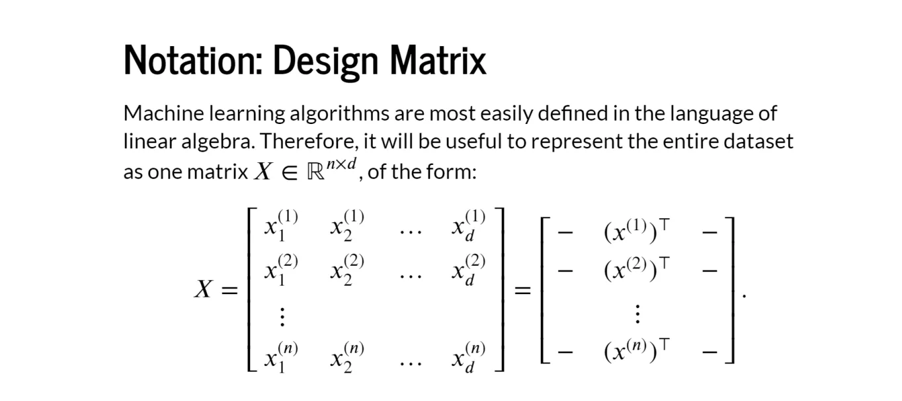

## 표기법: Design matrix
$$

X =
\begin{bmatrix}
x_1^{(1)} & x_2^{(1)} & \cdots & x_d^{(1)} \\
x_1^{(2)} & x_2^{(2)} & \cdots & x_d^{(2)} \\
\vdots & \vdots & \ddots & \vdots \\
x_1^{(n)} & x_2^{(n)} & \cdots & x_d^{(n)}
\end{bmatrix}
=
\begin{bmatrix}
	•	(x^{(1)})^T - \\
	•	(x^{(2)})^T - \\
\vdots \\
	•	(x^{(n)})^T -
\end{bmatrix}
$$

- 전체 데이터셋을 하나의 행렬 $`X \in \mathbb{R}^{n \times d}`$로 표현
- **Design Matrix = Feature Matrix (피처 매트릭스)**
	- 행(row) 하나 → **데이터 하나 (샘플 하나)**
	- 열(column) 하나 → **특성(feature) 하나**
$$

y =
\begin{bmatrix}
y^{(1)} \\
y^{(2)} \\
\vdots \\
y^{(n)}
\end{bmatrix}
$$

- 피처와 동일하게 타겟(정답값)도 벡터로 표기 가능

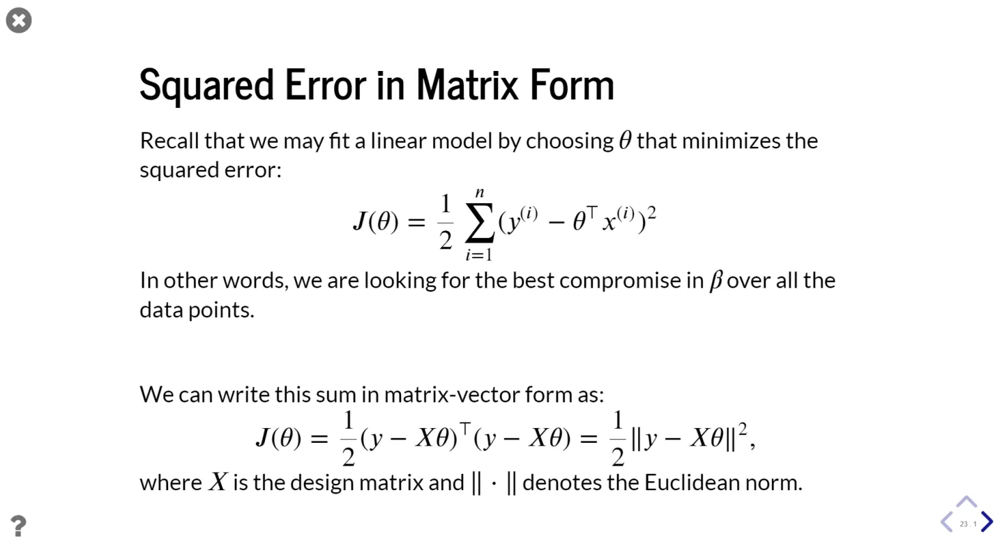

## 행렬 형태로 표현한 제곱 오차(Squared Error)

- 이 제곱 오차를 최소화하는 $`\theta`$를 선택해 선형 모델을 적합시킬 수 있음
$$

J(\theta) = \frac{1}{2}\sum_{i=1}^{n}\big(y^{(i)} - \theta^T x^{(i)}\big)^2
$$
→ 위 식은 이전에 확인한 MSE 목적함수에서 학습률만 제외한 식
$$

J(\theta)
= \frac{1}{2}(y - X\theta)^T (y - X\theta)
= \frac{1}{2}\|y - X\theta\|^2
$$

- 위 식을 행렬-벡터 형태로 표기 가능
$$
r = y - X\theta = y - \hat y
$$

- 위는 모델의 잔차,
$$

r =
\begin{bmatrix}
y^{(1)} - \theta^T x^{(1)} \\
y^{(2)} - \theta^T x^{(2)} \\
\vdots \\
y^{(n)} - \theta^T x^{(n)}
\end{bmatrix}
$$

- 벡터로 표현하면 위와 같음

$$
\sum_{i=1}^{n}(y^{(i)} - \theta^T x^{(i)})^2
=

\sum_i r_i r_i = \sum_i r_i^2=r \cdot r

$$

$$
= r^T r = (y - X\theta)^T (y - X\theta)
$$

- 위 잔차를 기존 식에 대입하면
	- residual 벡터 r의 제곱
	- 벡터각 요소들의 제곱의 합은 내적과 같음

	$$
	A \cdot B = A^TB
	$$

$$

\boxed{
J(\theta)
= \frac{1}{2}(y - X\theta)^T (y - X\theta)
= \frac{1}{2}\|y - X\theta\|^2
}
$$

- 따라서 기존 목적함수는 위와 같이 표기 가능
- 위 형태로 변환하는 이유
	1. 미분이 **매우 쉬워짐**
	2. OLS 해를 **한 줄로 유도 가능**
	3. Normal Equation이 자연스럽게 나옴
	4. Gradient, Hessian이 깔끔해짐

	- $`\|\cdot\| = 유클리드 노름`$
	- $`\|v\|^2 = v^Tv`$

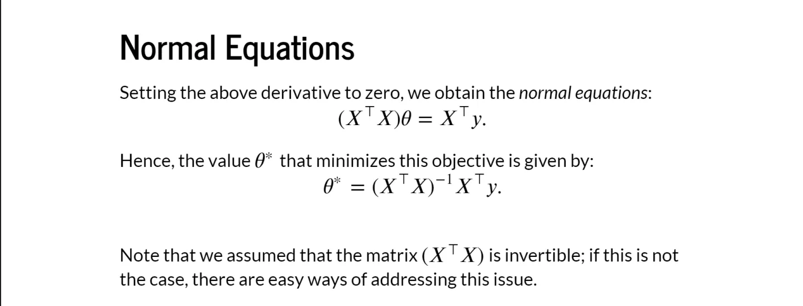

## Normal Equation(정상 방정식)
$$

J(\theta) = \frac{1}{2}\|y - X\theta\|^2
$$

- 이는 이전 단계에서 정의한 목적 함수
	- 상수배(학습률)을 제외한 MSE 식
- 이때 최소값은 미분해서 0이 되는 지점에서 발생
$$

\nabla_\theta J(\theta)
= -X^\top(y - X\theta)
$$

- 위 목적 함수를 미분하면 위와 같음
- 위 식이 0일 때 최소값이 되는 것
$$

-X^\top(y - X\theta) = 0
$$
⇒ 최소값이 0이라고 할 때의 위 식
$$

X^\top X\theta = X^\top y
$$

- 위 최소값의 식을 이렇게 변환 가능
⇒ 이제 “정상 방정식”
$$
\theta^{*} = (X^\top X)^{-1} X^\top y
$$

- 이때 행렬 $`(X^\top X)`$가 역행렬을 가진다고 가정했으며, 만약 그렇지 않더라도 이를 해결하는 쉬운 방법들이 존재
	⇒ 쉽게 풀기 위해서 정상 방정식 형태로 변환하는 것

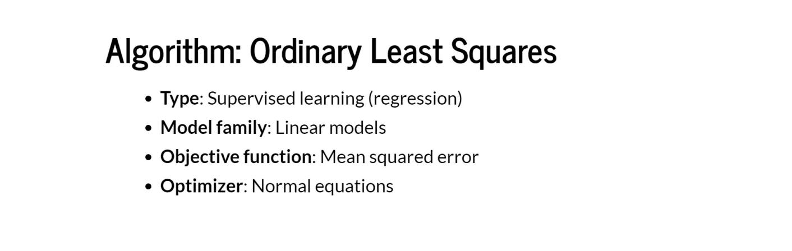

## Oridinary Leasy Squares 알고리즘

- **Type: Supervised learning (regression)**
	→ 유형: 지도학습(회귀)

- **Model family: Linear models**
	→ 모델 계열: 선형 모델

- **Objective function: Mean squared error**
	→ 목적 함수: 평균 제곱 오차(MSE)

- **Optimizer: Normal equations**
	→ 최적화 방법: 정상 방정식(Normal Equations)
→ OLS는 머신러닝의 구성요소 관점에서 위와 같음

# Non-Linear Least Squares(비선형 최소제곱법)

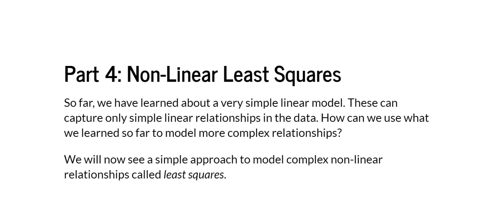

→ 최소 제곱법으로 비선형 관계 모델링하는 방법

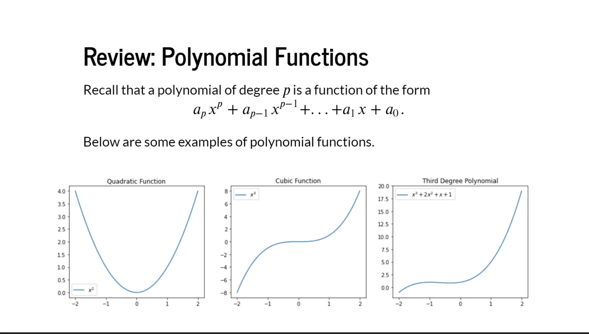

## 복습: 다항 함수
$$

a_p x^p + a_{p-1} x^{p-1} + \dots + a_1 x + a_0
$$

- 차수가 p인 다항식은 다음과 같은 형태의 함수
→ 다항함수는 가장 대표적인 비선형 함수

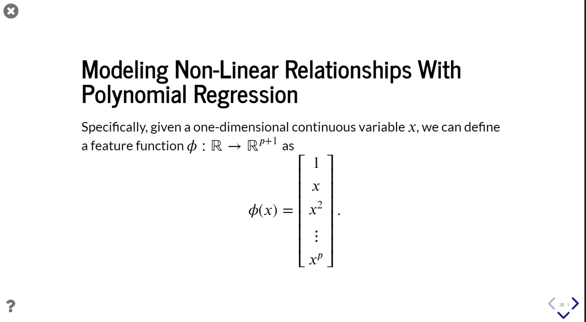

## 다항 회귀를 이용한 비선형 관계 모델링

- 구체적으로, 하나의 1차원 연속 변수 x가 주어졌을 때, 다음과 같은 특징 함수를 정의 가능
$$

\phi(x) =
\begin{bmatrix}
1 \\
x \\
x^2 \\
\vdots \\
x^p
\end{bmatrix}(\phi : \mathbb{R} \rightarrow \mathbb{R}^{p+1})
$$
$$

f(x) = \theta^T \phi(x)
$$
$$

f(x)
= \theta_0
	•	\theta_1 x
	•	\theta_2 x^2
	•	\cdots
	•	\theta_p x^p
$$

- 이 함수는 x에 대해서는 비선형
- 그러나 $`\theta`$에 대해서는 선형
⇒ 입력 x의 공간에서는 비선형이지만, 파라미터 $`\theta`$의 공간에서는 선형이므로 → 선형 회귀의 확장

## Polynomial Regression 모델 클래스
$$

f_\theta(x) := \sum_{j=0}^{p} \theta_j x^j = \theta^\top \phi(x)
$$

- 이는 x의 0 ~ p 제곱까지를 모두 사용한 p차 다항식 모델
$$

\phi(x) =
\begin{bmatrix}
1 \\
x \\
x^2 \\
\vdots \\
x^p
\end{bmatrix}
$$

- 다항 특징 벡터를 사용하면
$$

f_\theta(x) = \theta^\top \phi(x)
$$

- 이 형태로 변환 가능
⇒ 이는 완전히 선형 회귀와 같은 형태

### 예시: 당뇨병 데이터셋

- 비선형 피처 변환

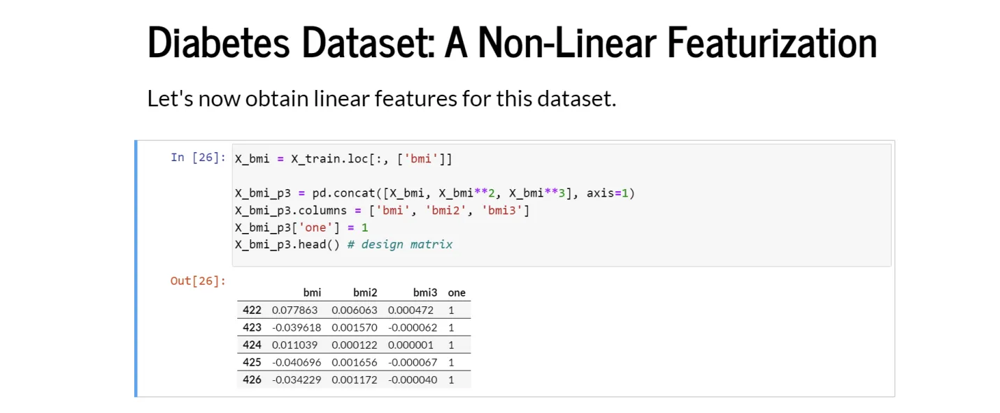

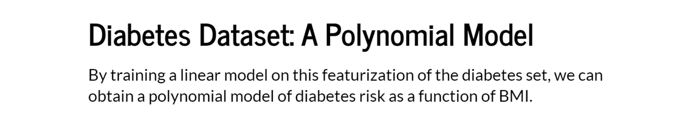

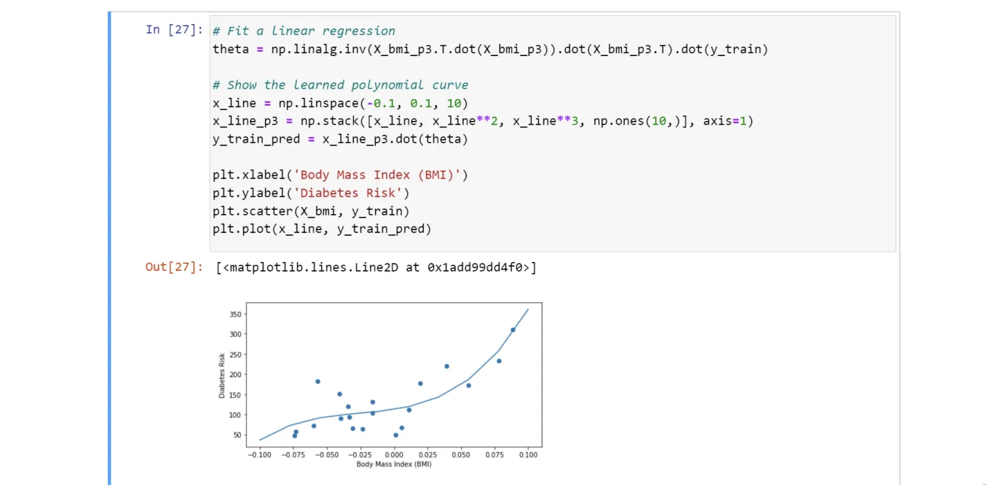

- 학습은 선형 모델로 했는데, 결과는 다항 모델임을 알 수 있음

## 다변수 다항 회귀

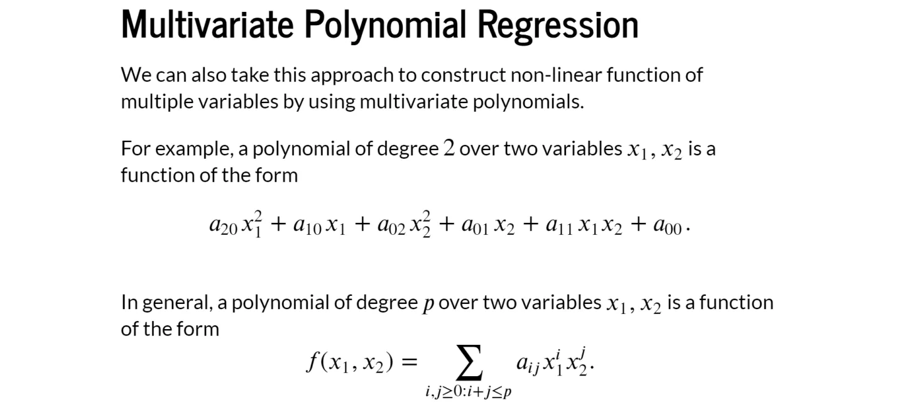

- 다변수 다항식을 사용함으로써, 여러 변수에 대한 비선형 함수를 구성
- 예를 들어, 두 변수 x_1, x_2에 대한 2차 다항식은 다음과 같은 형태의 함수이다.
$$
a_{20} x_1^2
•	a_{10} x_1
•	a_{02} x_2^2
•	a_{01} x_2
•	a_{11} x_1 x_2
•	a_{00}
$$

- 일반적으로, 두 변수 $`x_1, x_2`$에 대한 차수 p의 다항식은 다음 형태를 가짐
$$

f(x_1, x_2)=

\sum_{i,j \ge 0 : i + j \le p}
a_{ij} x_1^{i} x_2^{j}
$$

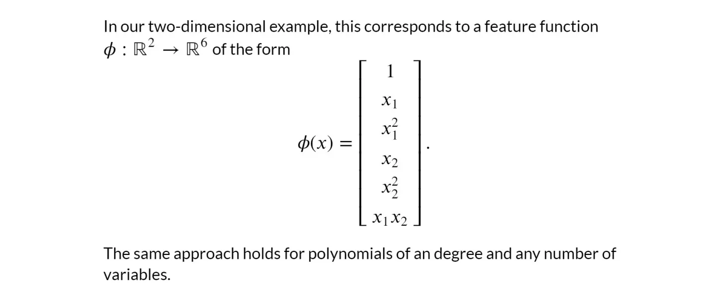

- 위 예시의 다항 함수에서 아래와 같은 특징 함수를 추출할 수 있음
$$

\phi(x) =
\begin{bmatrix}
1 \\
x_1 \\
x_1^2 \\
x_2 \\
x_2^2 \\
x_1 x_2
\end{bmatrix}(

\phi : \mathbb{R}^2 \rightarrow \mathbb{R}^6

)
$$

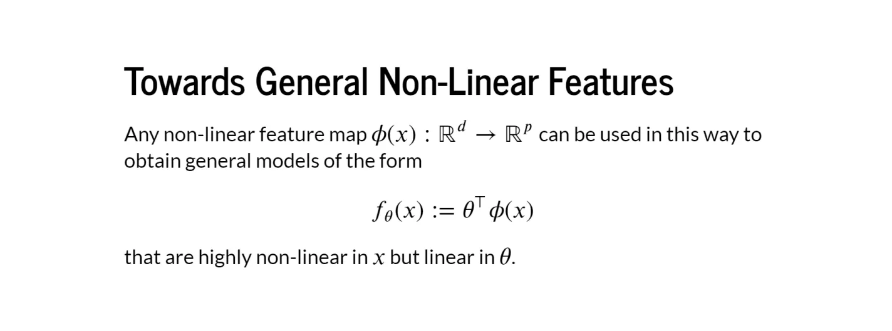

- 위와 같은 형태의 다변수 다항 함수 모델도 일반적인 모델을 얻을 수 있음
$$

f_\theta(x) := \theta^\top \phi(x)
$$
→ 이 모델들은 입력 x에 대해서는 매우 비선형이지만, 파라미터 $`\theta`$에 대해서는 선형

- $`\theta`$에 대해서만 선형이면 가능
	- $`f(x) = e^{\theta x}, \quad \theta^2 x`$ → OLS불가, 진짜 non-linear least squares 필요
	- $`f(x) = \theta_1 \sin x + \theta_2 e^x`$ → x는 복잡하나 $`\theta`$는 단순 가중치 → OLS 가능

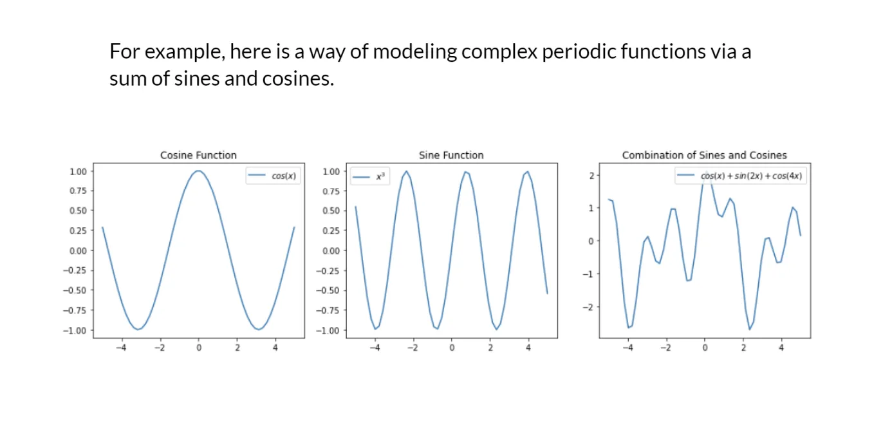

- 사인과 코사인의 합을 사용하여 복잡한 주기 함수들을 모델링하는 방식으로도 선형적인 형태의 일반 모델 형태로 만들어낼 수 있음
- **Cosine Function**
	→ 코사인 함수

- **Sine Function**
	→ 사인 함수

- **Combination of Sines and Cosines**
	→ 사인과 코사인의 조합
→ 위 형태도 여전히 아래 구조를 따름
	$$


f_\theta(x) = \theta^\top \phi(x)
	$$
	→ 이때 feature 함수는 아래와 같을 수 있음
 $$


\phi(x) =
\begin{bmatrix}
\cos(x) \\
\sin(2x) \\
\cos(4x)
\end{bmatrix}
 $$

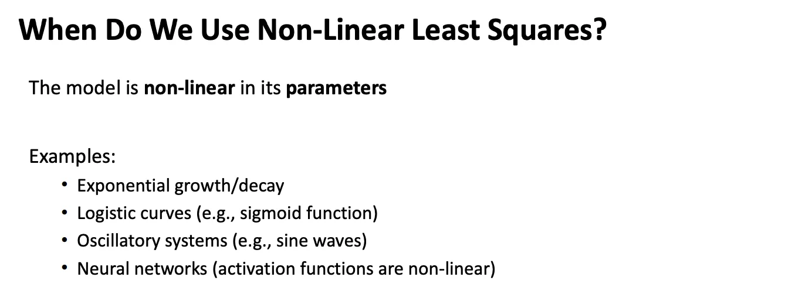

## Non-Linear Least Squares 알고리즘

- **Type: Supervised learning (regression)**
	→ 유형: 지도학습 (회귀)

- **Model family: Linear in the parameters; non-linear with respect to raw inputs.**
	→ 모델 계열:

 - 파라미터에 대해서는 선형이고,
 - 원시 입력(raw input)에 대해서는 비선형
- **Features: Non-linear functions of the attributes**
	→ 특징: 입력 속성들에 대한 비선형 함수들

- **Objective function: Mean squared error**
	→ 목적 함수: 평균 제곱 오차(MSE)

- **Optimizer: Normal equations**
	→ 최적화 방법: 정상 방정식(Normal Equation)

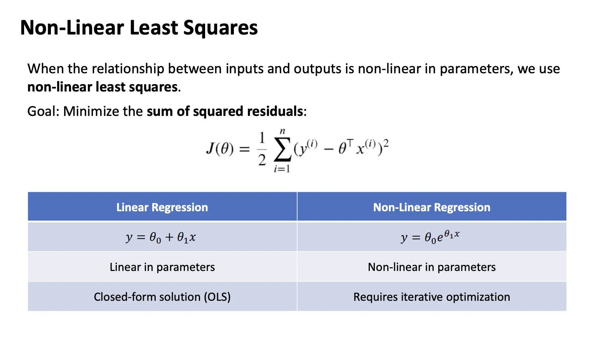

## 비선형 최소 제곱법

- 입력과 출력 사이의 관계가 **파라미터에 대해 비선형일 때**, 비선형 최소제곱법을 사용
	- $`\theta`$를 기준으로, 이게 비선형일 때 비선형 최소제곱법을 사용

### 표 비교

1. **Linear Regression**
	- $`y = \theta_0 + \theta_1 x`$
	- 파라미터에 대해 선형
	- 닫힌 형태 해(OLS)
2. **Non-Linear Regression**
	- $`y = \theta_0 e^{\theta_1 x}`$
	- 파라미터에 대해 비선형
	- 반복적 최적화 필요

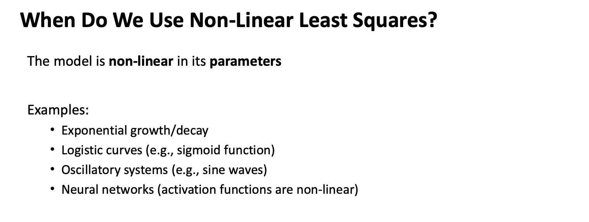

## 언제 비선형 최소제곱을 사용하는가?

- 모델이 **파라미터에 대해 비선형일 때**
- 예시들
	1. **Exponential growth/decay**
 → 지수적 성장/감소

	2. **Logistic curves (e.g., sigmoid function)**
 → 로지스틱 곡선 (예: 시그모이드 함수)

	3. **Oscillatory systems (e.g., sine waves)**
 → 진동 시스템 (예: 사인파)

	4. **Neural networks (activation functions are non-linear)**
 → 신경망 (활성화 함수가 비선형)

## 예시: 지수적 모델

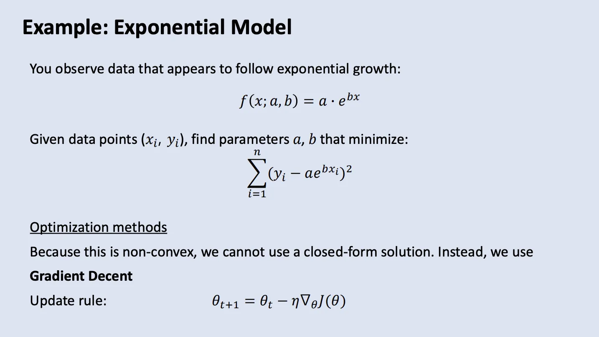

## 예시: 비선형 최소제곱

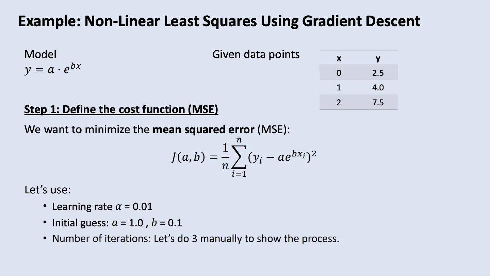

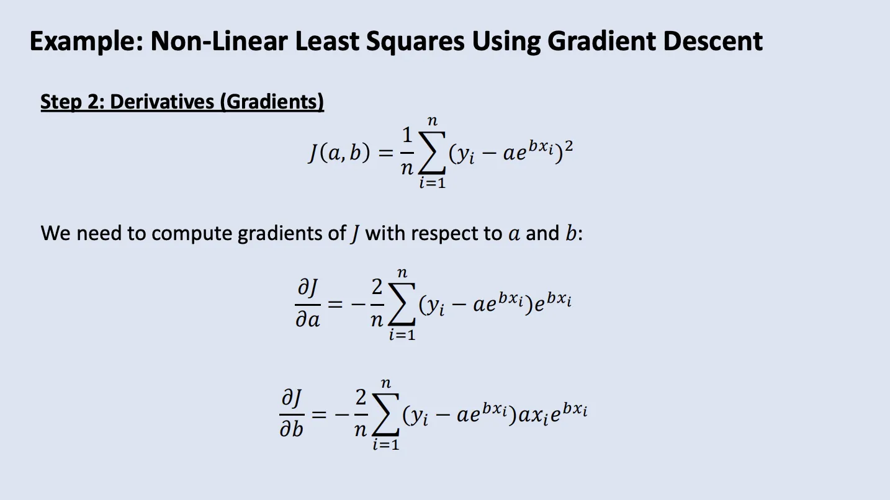

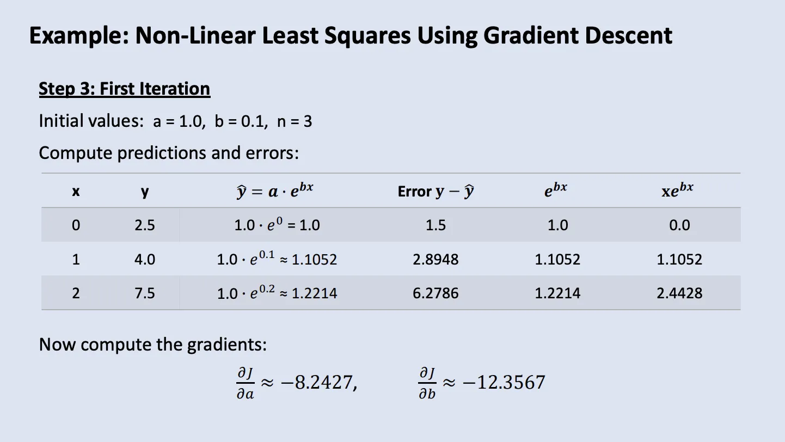

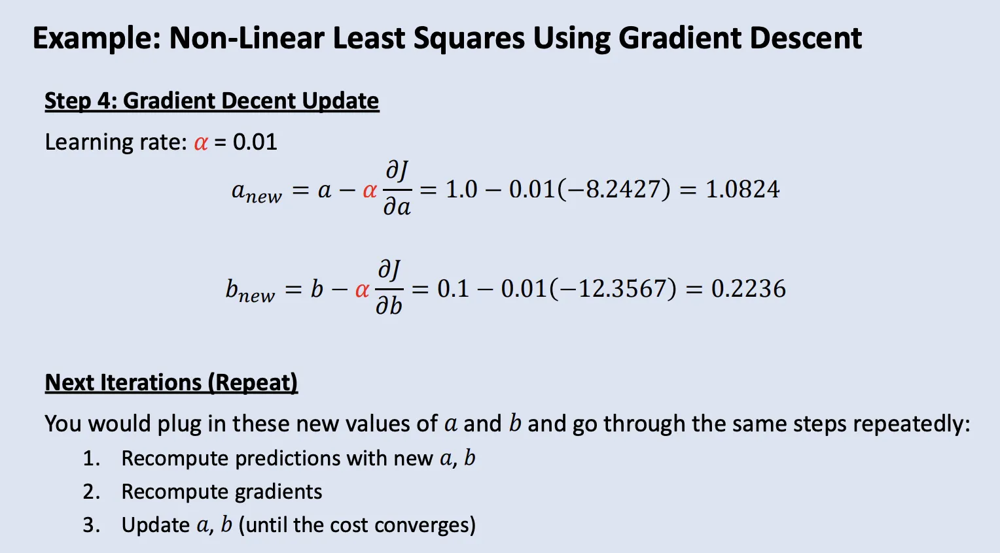

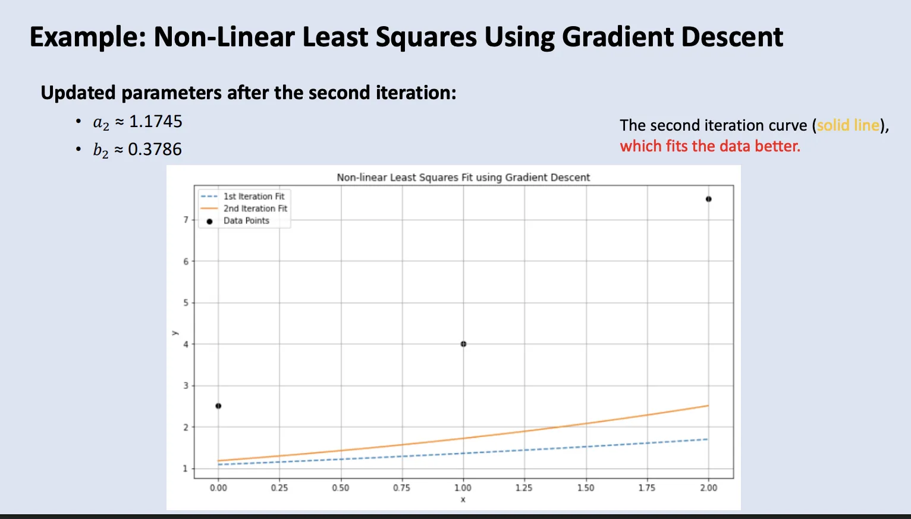
