> 원본 Notion 정리 — 강의 슬라이드 이미지 + 설명.
> [← 전체 목차](/posts/ml-overview/)

***

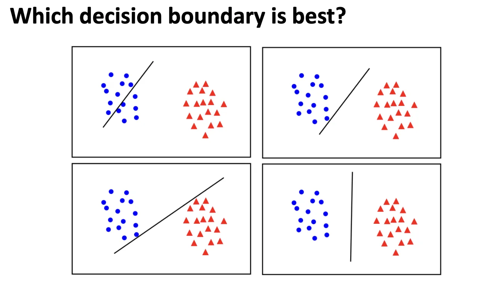

- svm은 각 요소들과 가장 멀리 떨어진 것을 좋은 것으로 생각
- 가까우면 조금 바뀌면 결정경계 너머로 갈 수도 있음 ← 안좋은것

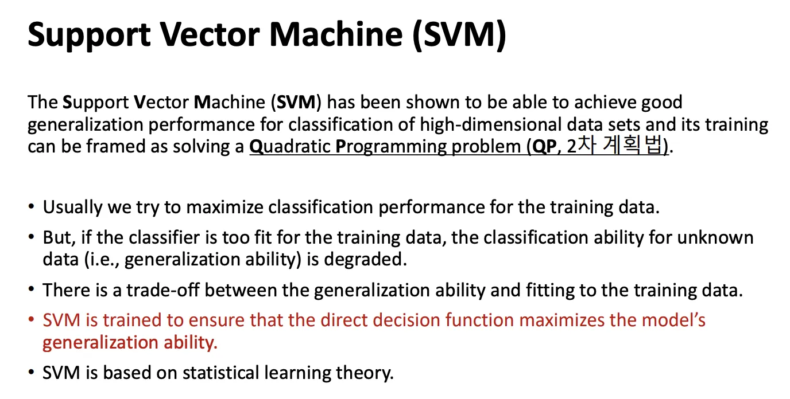

## SVM

- 고차원 데이터셋의 분류에서 좋은 일반화 성능을 달성할 수 있음이 입증
- 일반적으로 우리는 학습 데이터에 대한 분류 성능을 최대화하려고 한다.
- 하지만 분류기가 학습 데이터에 너무 맞춰지면(overfit), 보지 못한 데이터에 대한 분류 성능(즉, 일반화 능력)은 저하된다.
- 일반화 능력과 학습 데이터에 대한 적합도 사이에는 트레이드오프가 존재한다.
- **SVM은 모델의 일반화 능력을 최대화하도록 직접적인 결정 함수가 학습되도록 훈련된다.**
- SVM은 통계적 학습 이론(statistical learning theory)에 기반한다.
→ 부가설명

	- 보통 분류 문제에서
		→ *훈련 데이터 정확도*를 최대화하려고 하면
		→ **과적합(overfitting)** 이 발생합니다.

	- SVM은 접근 방식이 다릅니다.
		- **훈련 정확도 자체**가 목표 ❌
		- **일반화 성능(새 데이터에서 잘 맞는가)** 이 목표 ⭕
	- 그래서 SVM은
		**결정 경계(decision function)** 를
		*“얼마나 여유 있게, 안정적으로 분리하느냐”* 기준으로 학습합니다.

	- 이 기준이 나중에 나오는 **마진(margin)** 입니다.
	- 수학적으로는
		→ “마진을 최대화하는 문제”

# 분류 마진

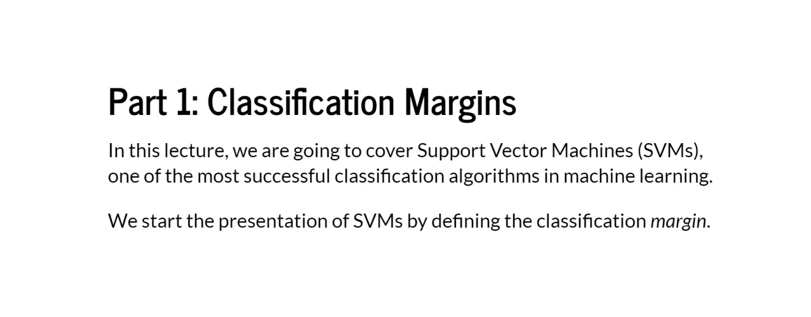

## 아래는 이번 강의의 가정

	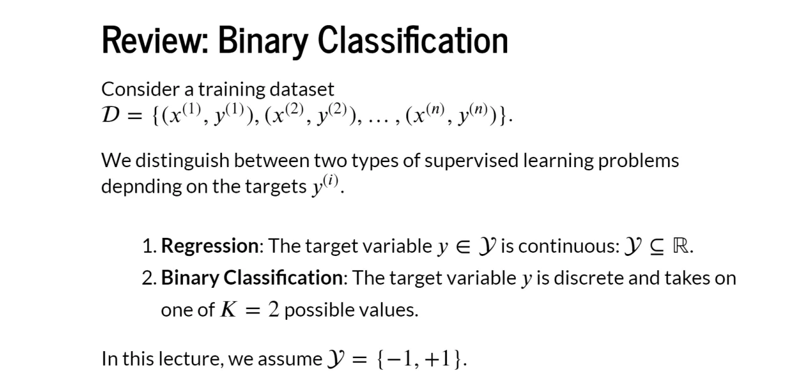

	→ 이번 강의에서는 -1, +1로 나뉘는 분류 모델로 가정

	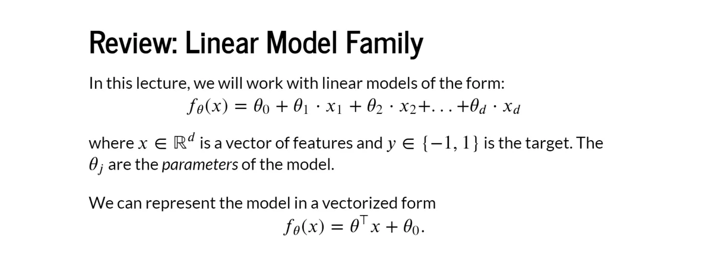

	## 선형 모델 계열들

	- 이 강에서는 아래와 같은 것들로 고정
	$$
	f_\theta(x) = \theta_0 + \theta_1 \cdot x_1 + \theta_2 \cdot x_2 + \dots + \theta_d \cdot x_d
	$$

	- 여기서 $`x \in \mathbb{R}^d`$는 특징(feature)들의 벡터이고, 
	-  $`y \in \{-1, 1\}`$은 타깃이다.
	- $`\theta_j`$ 들은 모델의 파라미터이다.
	
	이 모델은 다음과 같이 **벡터화된 형태**로 표현할 수 있음
	$$
	f_\theta(x) = \theta^T x + \theta_0
	$$

	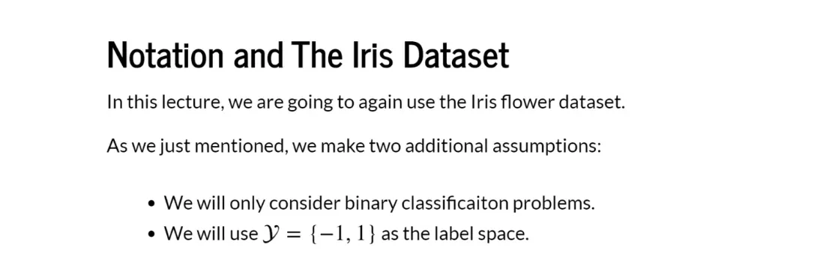

	붗꽃 데이터셋으로 가정

## 분류 알고리즘 비교

- 모델 학습 시 유효한 결정 경계가 여러개 일 수 있음

	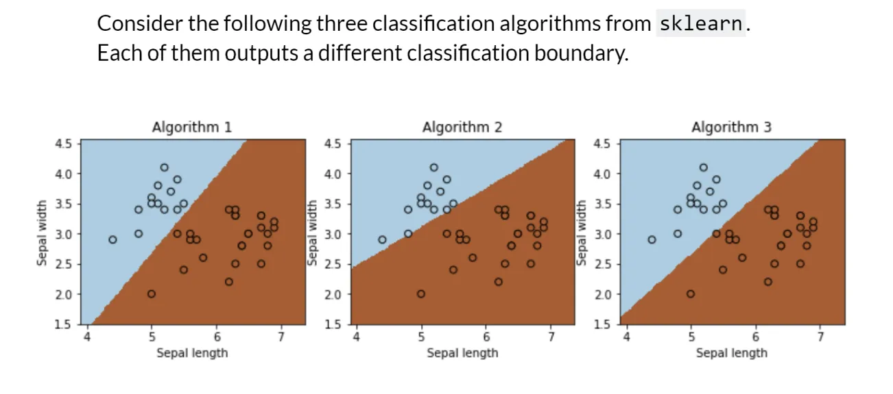

	⇒ 이때 어떤 것을 선택해야하는가
	→ SVM을 기반으로 가장 안정적인 경계를 선택

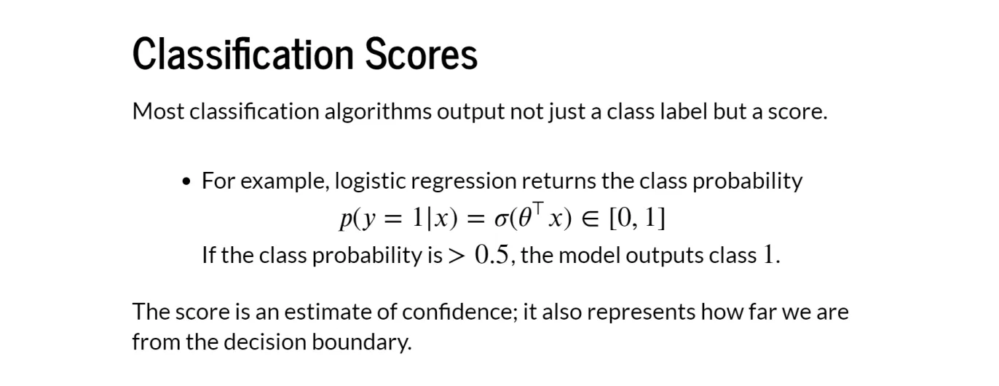

## 분류 점수

- 대부분의 분류 알고리즘은 클래스 라벨 뿐만 아니라 점수도 함께 출력
	- ex) 로지스틱 회귀는 클래스 확률을 반환
- 이 점수는 결정 경계로부터 얼마나 떨어져 있는지를 나타냄
	- 멀면 신뢰도가 높은 것, 가까우면 낮은 것

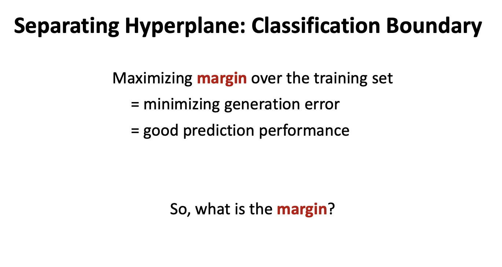

## 분리 초평면 → 분류 경계
→ 그냥 superplan을 반으로 분리한다는 뜻(분류 경계로 분리된 초평면)

- **훈련 데이터셋에 대해 마진(margin) 을 최대화하는 것**
	**= 일반화 오류(generalization error) 를 최소화하는 것**
	**= 좋은 예측 성능을 얻는 것**

## Max Margin 원칙

- 마진이 가장 큰 결정 경계를 선ㅌ개해야함
	- 이는 모든 데이터 포인트에서 결정 경계까지가 가능한 한 멀어야 함
	- 이때 데이터 포인트들은 멀 수록 신뢰성이 높은 것 → 전체적으로 가장 신뢰성이 높아야 함

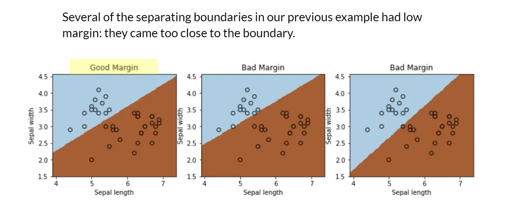

- 직관적으로 가장 먼 1번이 좋은 마진 → SVM 기준

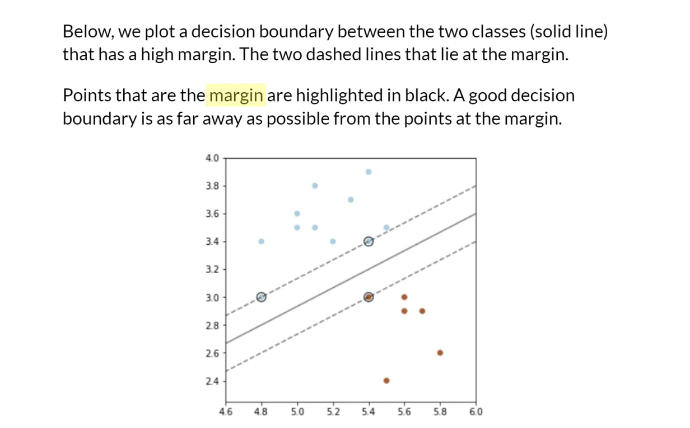

- 위 그림의 두 점선은 마진
⇒ 좋은 결정 경계 → 마진 위의 점으로부터 가능한 한 멀리 떨어진 경계

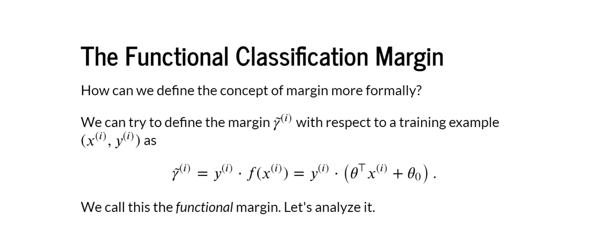

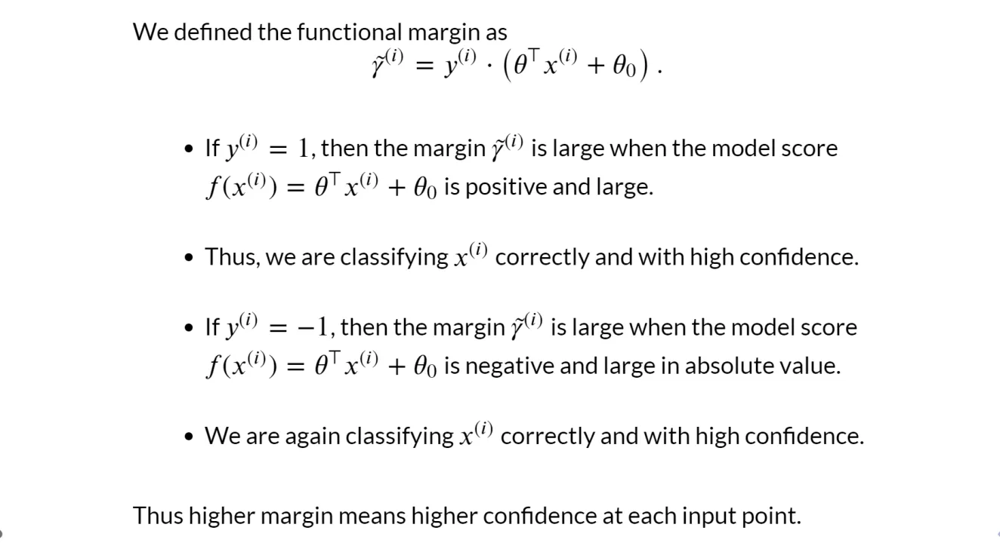

## 함수적 분류 마진

- 훈련 샘플 $`(x^{(i)}, y^{(i)})`$에 대해 마진 $`\tilde{\gamma}^{(i)}`$를 다음과 같이 정의할 수 있다.
$$
\tilde{\gamma}^{(i)} = y^{(i)} \cdot f(x^{(i)})
= y^{(i)} \cdot (\theta^T x^{(i)} + \theta_0)
$$
⇒ 이것이 “함수적 마진”

### 함수적 마진의 정의
$$

\tilde{\gamma}^{(i)} = y^{(i)} \cdot (\theta^T x^{(i)} + \theta_0)
$$
→ f(x)가 선형 경계 모델로 들어간 것

- 만약 $`y^{(i)} = 1`$이면, 모델 점수 $`f(x^{(i)}) = \theta^T x^{(i)} + \theta_0`$ 가 **양수이고 크면** 마진은 크다.
	- 1 x 큰 양수 → 큰 마진
- 따라서 우리는  $`x^{(i)}`$를 **올바르게**, 그리고 **높은 신뢰도로** 분류하고 있다.
- 만약 $`y^{(i)} = -1`$이면, 모델 점수 $`f(x^{(i)})`$가 **음수이고 절댓값이 크면** 마진은 크다.
	- -1 x 절대값이 큰 음수(작은 음수) → 큰 마진
	- 이 경우에도 우리는 $`x^{(i)}`$ 를 **올바르게**, **높은 신뢰도로** 분류하고 있다.
⇒ 따라서 마진이 클수록, 각 입력 점에서의 신뢰도가 높다
⇒ 정답 방향으로 점수가 얼마나 큰가를 수식으로 나타낸 것

### 마진의 부호

- $`\tilde{\gamma}^{(i)} > 0`$
	→ 올바른 분류

- $`\tilde{\gamma}^{(i)} < 0`$
	→ 오분류

- $`|\tilde{\gamma}^{(i)}| 가 클수록`$
	→ 결정 경계에서 멀다 → 신뢰도 높다

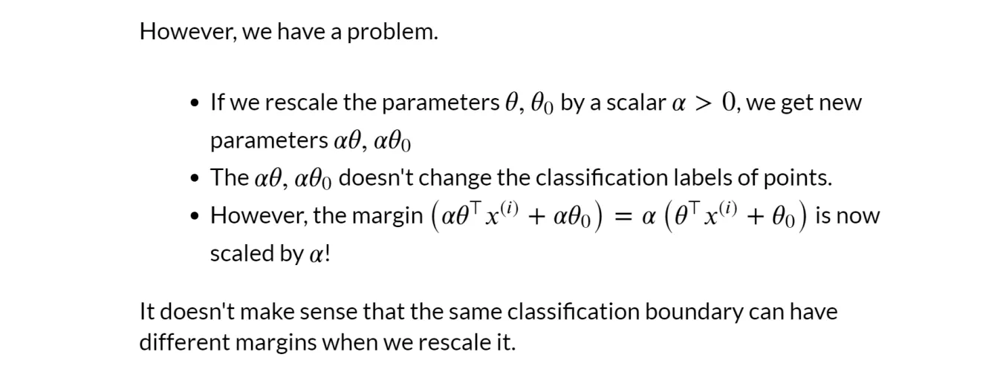

## 함수적 마진의 문제점

- 파라미터 $`\theta, \theta_0`$ 를 어떤 스칼라 $`\alpha > 0`$로 스케일하면
	- 새로운 파라미터 $`\alpha\theta, \alpha\theta_0`$ 를 얻게 된다.
-  $`\alpha\theta, \alpha\theta_0`$ 는 분류 라벨을 **바꾸지 않는다**.
- 하지만 마진  $`(\alpha\theta^T x^{(i)} + \alpha\theta_0)
= \alpha(\theta^T x^{(i)} + \theta_0)`$ 는 $`\alpha`$ 만큼 **커진다**.
**⇒ 같은 결정 경계가 스케일에 따라 마진이 달라지는 문제가 생김**
→ 이때 알파는 그냥 파라미터(가중치)가 커지는 상황을 표현한 것

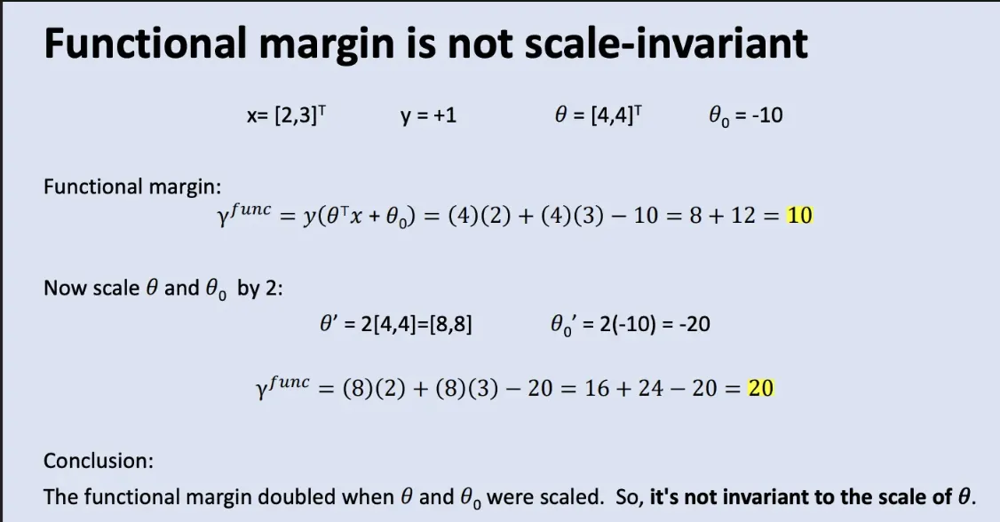

## 함수적 마진은 스케일 불변하지 않음
$$

x = [2, 3]^T \\

y = +1\\

\theta = [4, 4]^T \\

\theta_0 = -10
$$

- 이 값에서 함수적 마진은
$$

\gamma_{\text{func}} = y(\theta^T x + \theta_0)
= (4)(2) + (4)(3) - 10
= 8 + 12
= 10
$$

$$

\theta' = 2[4,4] = [8,8] \\

\theta_0' = 2(-10) = -20
$$

- 파라미터를 2배로 스케일하면
$$

\gamma_{\text{func}} = (8)(2) + (8)(3) - 20
= 16 + 24 - 20
= 20
$$

→ 부가 설명

	- 결정 경계 → $`\theta^T x + \theta_0 = 0`$
	- 스케일 후 → $`2(\theta^T x + \theta_0) = 0`$
	⇒ **같은 직선 / 같은 초평면**
	⇒ 같은 모델이라 같은 결정 경계를 가지는데 마진 값만 바뀌게 됨

⇒ 이를 해결하기 위해 지오매트릭 마진이 생김

	- SVM에서도 이 기하학적 마진을 사용

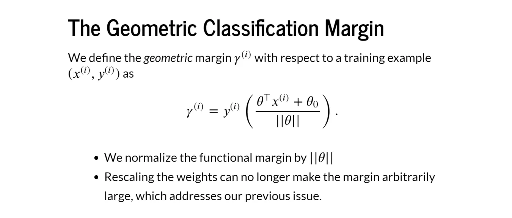

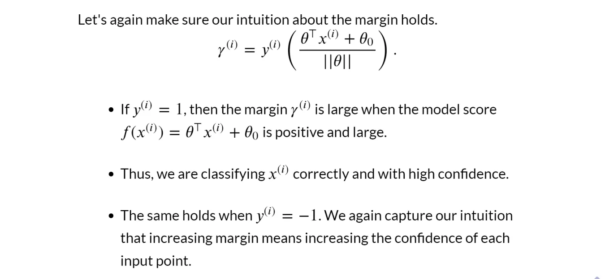

## 기하적 마진

- 기존의 함수적 마진을 $`||\theta||`$로 정규화
	- 이는 가중치를 스케일하더라도 임의로 마진을 크게하지 못하게 함
- 만약 $`y^{(i)} = 1`$이면, 모델 점수 $`f(x^{(i)}) = \theta^T x^{(i)} + \theta_0`$ 가 **양수이고 크면** 마진은 크다.
	- 1 x 큰 양수 → 큰 마진
- 따라서 우리는  $`x^{(i)}`$를 **올바르게**, 그리고 **높은 신뢰도로** 분류하고 있다.
- 만약 $`y^{(i)} = -1`$이면, 모델 점수 $`f(x^{(i)})`$가 **음수이고 절댓값이 크면** 마진은 크다.
	- -1 x 절대값이 큰 음수(작은 음수) → 큰 마진
	- 이 경우에도 우리는 $`x^{(i)}`$ 를 **올바르게**, **높은 신뢰도로** 분류하고 있다.
⇒ 이 경향성은 기하학적 마진에서도 동일하게 성립

### 기하학적 마진은 스케일 불변

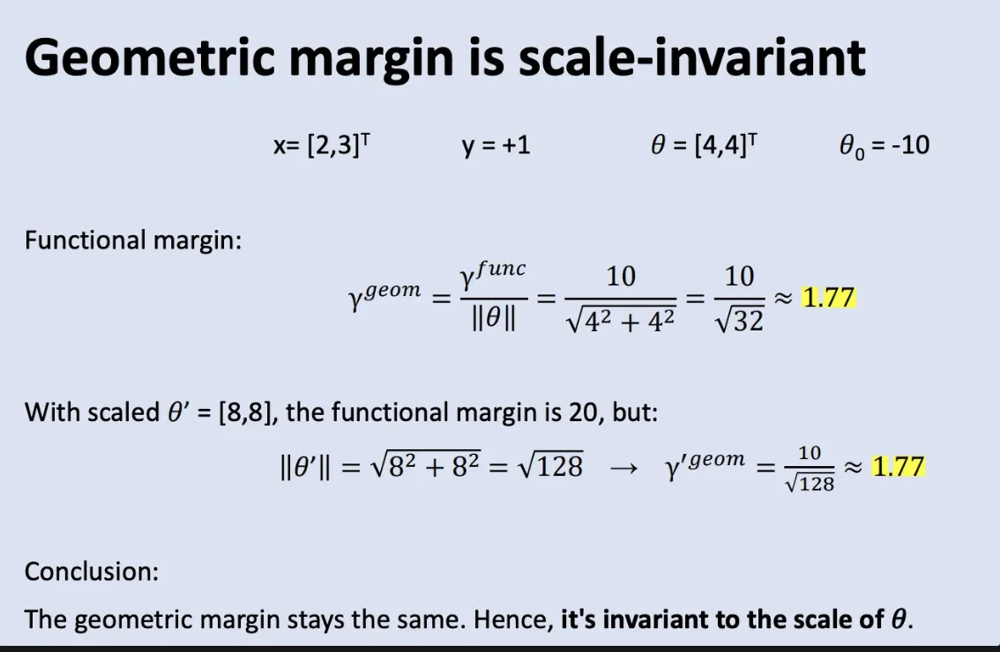

- 현재 $`\theta \rightarrow 2\theta`$ 으로 변한 상황
	- 변한 것
		- 가중치
		- 함수적 마진
	- 변하지 않은 것
		- 결정 경계
		- 데이터
		- 기하적 마진

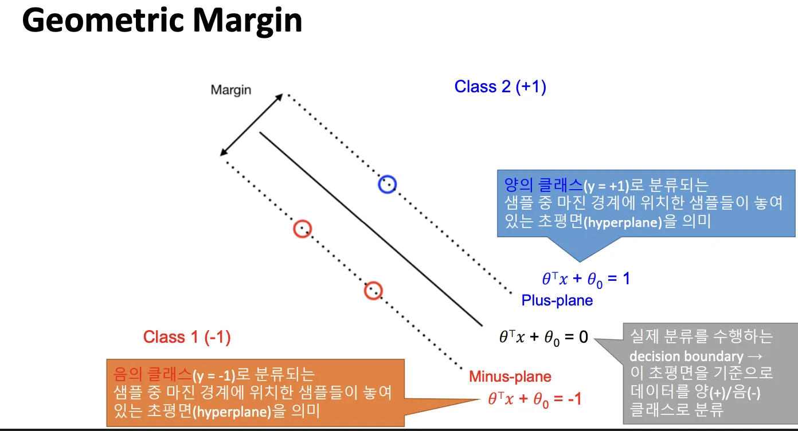

**기하학적 마진**

- 가운데 실선은 결정 경계:
	$$
	\theta^T x + \theta_0 = 0
	$$

- 두 개의 점선은 마진 경계:
	- **Plus-plane**
		$`\theta^T x + \theta_0 = 1`$

	- **Minus-plane**
		$`\theta^T x + \theta_0 = -1`$

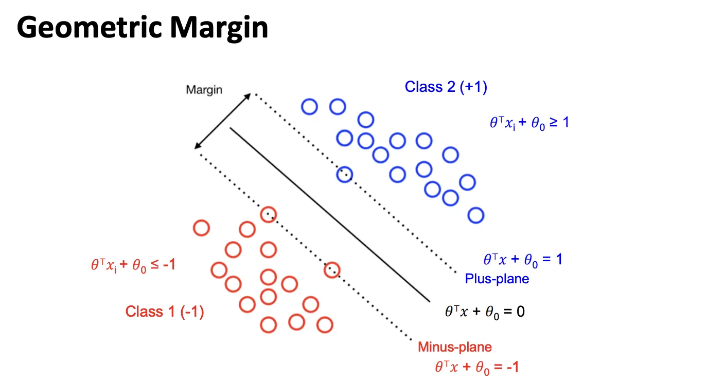

### **직역**

- 양의 클래스:
	$`\theta^T x_i + \theta_0 \ge 1`$

- 음의 클래스:
	$`\theta^T x_i + \theta_0 \le -1`$

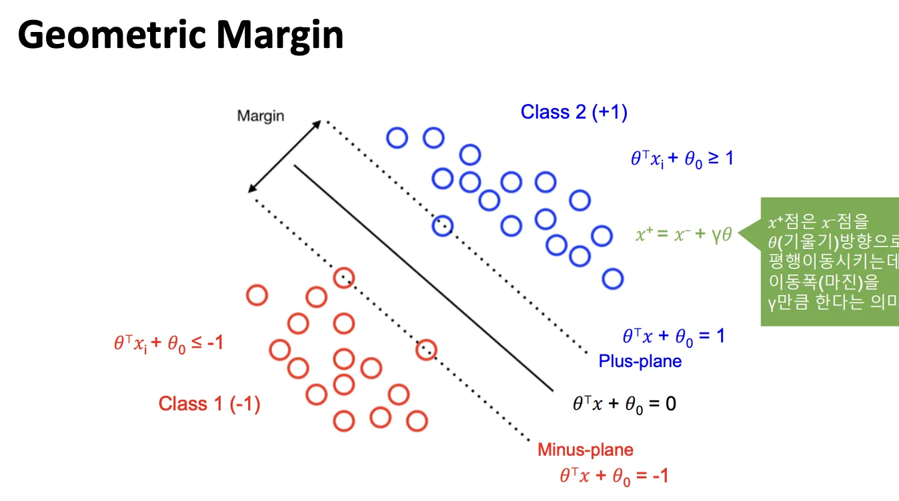

→ $`x^+ = x^- + \gamma \theta`$

	- 여기서 세타는 법선 벡터 → 디시전 바운더리의 법선
	- 스칼라는 얼만큼 이동할지 나타내는 계수 ← 이게 이동폭

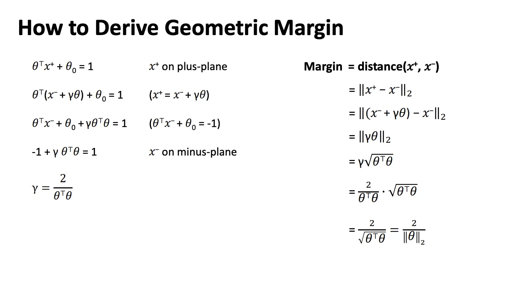

## 기하학적 마진의 유도 방식

- x\^+ 는 **plus-plane** 위의 점 → $`\theta^T x^+ + \theta_0 = 1`$
- x\^- 는 **minus-plane** 위의 점 → $`\theta^T x^- + \theta_0 = -1`$
- 두 점의 관계를 다음과 같이 둔다 → $`x^+ = x^- + \gamma \theta`$
⇒ 위를 대입하면 

	- $`\theta^T(x^- + \gamma\theta) + \theta_0 = 1`$
	→ 위를 정리하면
	$`\theta^T x^- + \theta_0 + \gamma \theta^T\theta = 1`$
→ 이때  $`x^-`$는 minus-plane 위에 있으므로:

- -$`1 + \gamma \theta^T\theta = 1`$
⇒  따라서
$$

\gamma = \frac{2}{\theta^T\theta}
$$
⇒ 이렇게 스칼라 값을 구함

### 마진의 정의
$$

\text{Margin} = \text{distance}(x^+, x^-)
\\

= \|x^+ - x^-\|_2 \\
= \|(x^- + \gamma\theta) - x^-\|_2 \\
= \|\gamma\theta\|_2 \\

= \gamma \sqrt{\theta^T\theta} \\
= \frac{2}{\theta^T\theta}\sqrt{\theta^T\theta} \\
= \frac{2}{\sqrt{\theta^T\theta}} \\
= \frac{2}{\|\theta\|_2}
$$

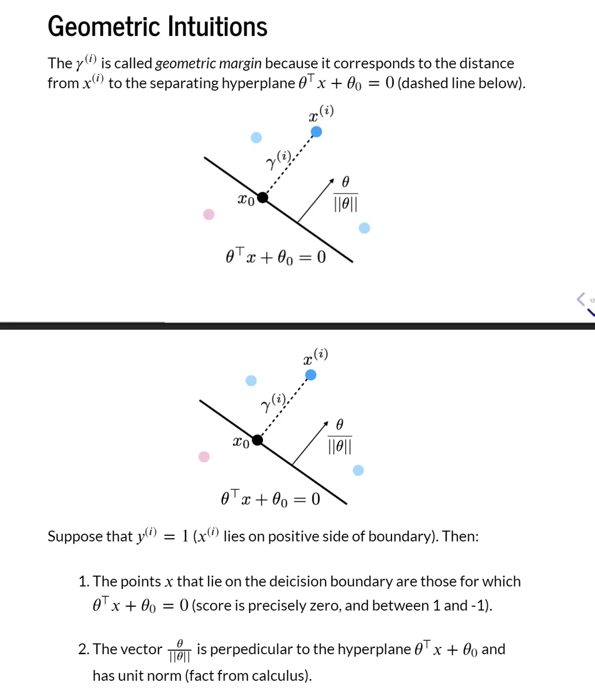

## 기하학적 마진의 직관

- $`\gamma^{(i)}`$ → 이게 기하학적 마진
	- $`\theta^T x_0 + \theta_0 = 0`$ 부터 $`x^{(x)}`$까지의 거리이므로
⇒ $`x^{(i)}`$ 로부터 $`x^0`$를 얻어내려면
	$`x_0 = x^{(i)} - \gamma^{(i)}\frac{\theta}{\|\theta\|}`$ ← 이렇게 구함 따라서 
$$

\theta^T x_0 + \theta_0 = 0 \\
= 

\theta^T\!\left(x^{(i)} - \gamma^{(i)}\frac{\theta}{\|\theta\|}\right) + \theta_0 = 0

$$
⇒ $`\gamma^{(i)}=\frac{\theta^T x^{(i)}+\theta_0}{\|\theta\|}`$ ← 이렇게 정리되고 이는 기하학적 마진

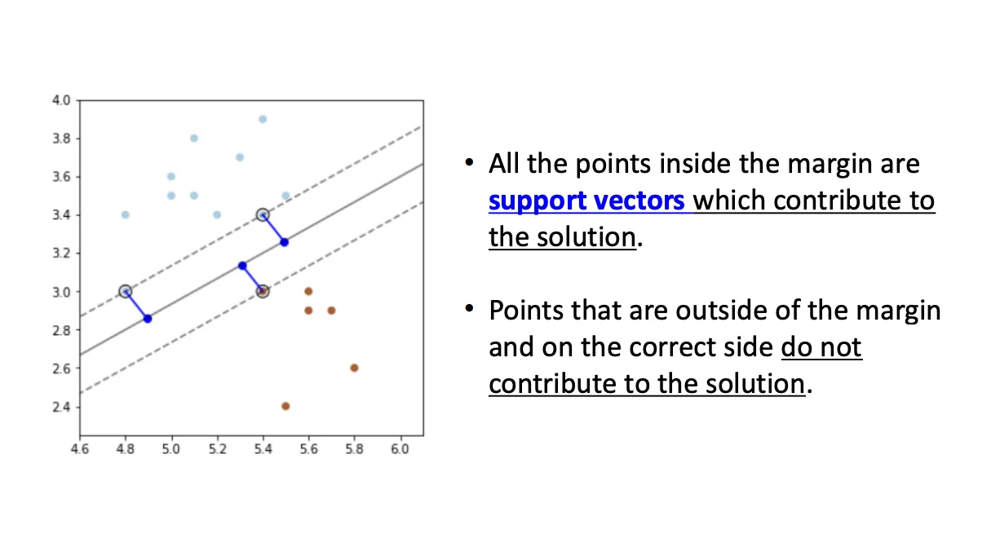

## 서포트 벡터란

- 마진 내부의 모든 점 ← 서포트 벡터
	- 이는 해에 기여하는 점들
- 마진 바깥에 있고, 올마른 쪽에 위치한 것들은 기여하지 않음
⇒ 수식으로는 → $`y_i(\theta^T x_i + \theta_0) \le 1`$

- 점선(±1 plane)에 닿아 있거나
- 그 안쪽에 있는 점들이 강조되어 있음
→ 마진 바깥에 있지만 잘못된 위치에 있는 것들은 “하드 마진 SVM”에서는 허용되지 않음

# Max-Margin Classifier(맥스 마진 분류기)

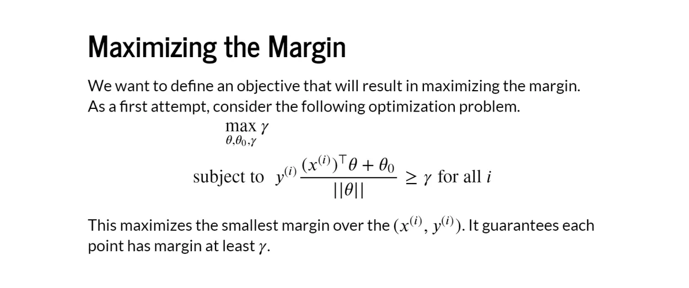

## 마진 최대화

- 마진을 최대화하는 결과를 내는 목적함수를 정의해야함 → $`\max_{\theta,\;\theta_0,\;\gamma}\;\; \gamma`$

### 제약조건
$$

y^{(i)}\frac{(x^{(i)})^T\theta + \theta_0}{\|\theta\|} \;\ge\; \gamma
\quad \text{for all } i
$$

- 이 제약식은 
	- 각 점의 기하적 마진이 감마 이상
	- 모든 데이터가 결정 경계에서 최소 감마만큼 떨어져 있음을 의미

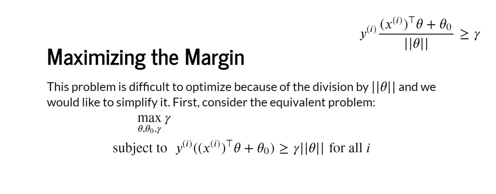

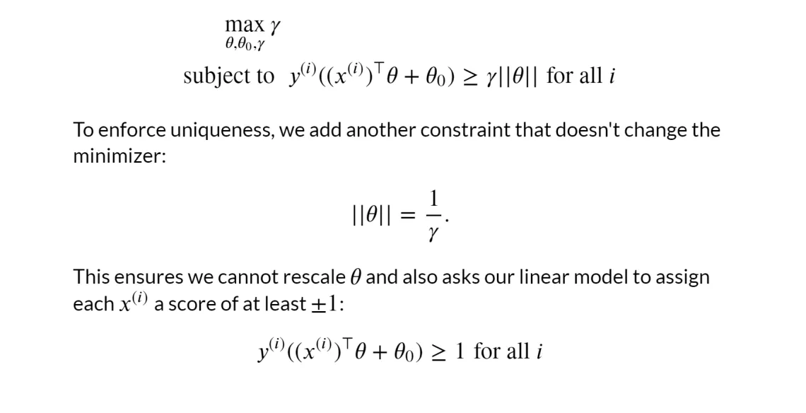

- 이 문제는 $`\|\theta\|`$로 나누는 항 때문에 최적화하기가 어렵다
⇒ 방금의 제약식을 아래와 같이 변형
$$

y^{(i)}\frac{(x^{(i)})^T\theta + \theta_0}{\|\theta\|} \ge \gamma
\quad\Longleftrightarrow\quad
y^{(i)}\big((x^{(i)})^T\theta + \theta_0\big) \ge \gamma\|\theta\|
$$

- 이 상태에서는 여전히 아래와 같이 스케일 업을 해도 제약식이 성립
	- $`\theta \rightarrow \alpha\theta`$
	- $`\gamma \rightarrow \alpha\gamma`$
	⇒ 이 때문에 제약 조건을 하나 더 걸게 됨 → $`\|\theta\| = \frac{1}{\gamma}`$

		- $`\theta`$ 의 크기와 $`\gamma`$를 서로 고정
⇒ 이를 제약식에 대입하면
	$$
	

y^{(i)}\big((x^{(i)})^T\theta + \theta_0\big)
\;\ge\;
\gamma \cdot \frac{1}{\gamma}
= 1
	$$

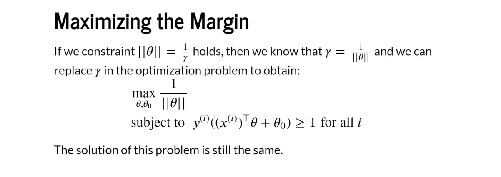

- $`\|\theta\| = \frac{1}{\gamma}`$이라는 제약을 둔다면,  $`\gamma = \frac{1}{\|\theta\|}`$ 임을 알 수 있음
- 최적화 대상인  → $`\max_{\theta,\;\theta_0,\;\gamma}\;\; \gamma`$  이 식이 ⇒ $`\max_{\theta,\theta_0}\;\; \frac{1}{\|\theta\|}`$ 으로 표현됨
	- 제약 조건은 그대로 $`y^{(i)}\big((x^{(i)})^T\theta + \theta_0\big) \ge 1
\quad \text{for all } i`$
	⇒ 이 문제의 해는 기존과 동일

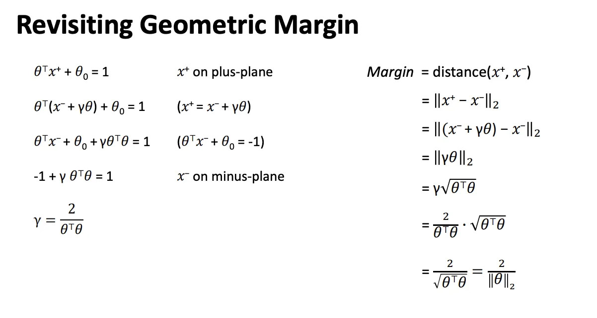

⇒ 결국 마진 최대화가 $`||\theta||`$ 의 문제가 됨

	- 이때 마진의 최대화 == 1/ $`||\theta||`$ 의 최대화 == $`||\theta||`$ 의 최소화가 됨
$$

\max \frac{1}{\|\theta\|}
\quad\Longleftrightarrow\quad
\min \|\theta\|
\quad\Longleftrightarrow\quad
\min \frac{1}{2}\|\theta\|^2
$$

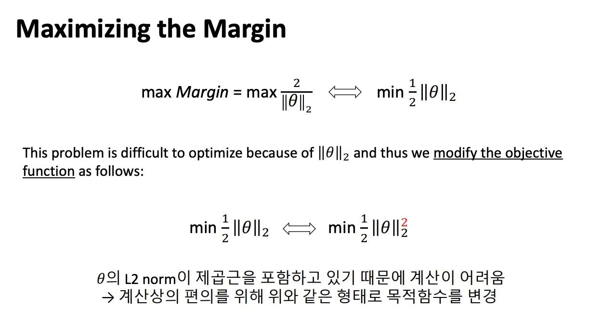

→ 제곱해도 되니깐 기존 L2 norm에 제곱을 함

⇒ 결국 SVM 목적함수는 아래와 같음
	$$
	

\displaystyle \min \frac{1}{2}\|\theta\|^2 
	$$

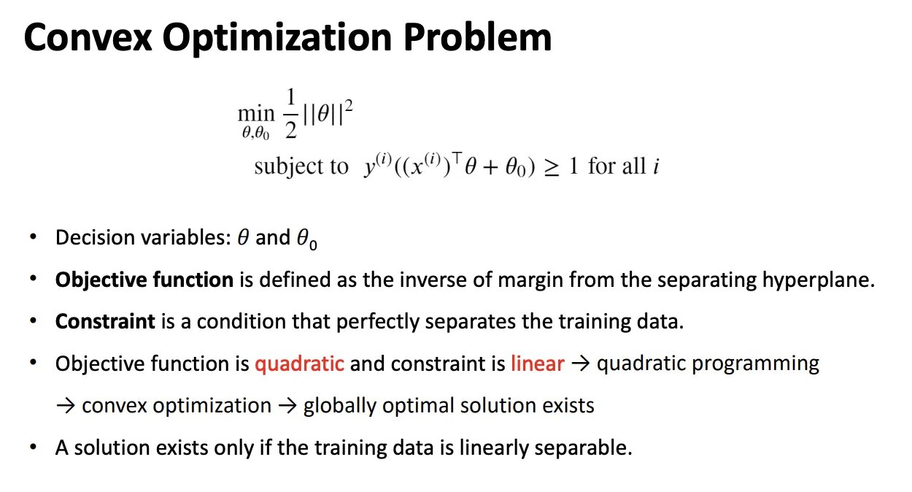

## Convex Optimization Problem
$$

\min_{\theta,\theta_0}\;\; \frac{1}{2}\|\theta\|^2

\\
제약조건: 
y^{(i)}\big((x^{(i)})^T\theta + \theta_0\big) \ge 1
\quad \text{for all } i
$$

- **결정 변수(Decision variables)**: \\theta 와 \\theta_0
- **목적 함수(Objective function)** 는 분리 초평면으로부터의 **마진의 역수**로 정의된다.
- **제약조건(Constraint)** 은 학습 데이터를 **완벽히 분리**하는 조건이다.
- 목적 함수는 **이차(quadratic)** 이고 제약조건은 **선형(linear)** 이다
	→ **이차계획(Quadratic Programming)**

- → **볼록 최적화(convex optimization)**
	→ **전역 최적해(globally optimal solution)** 가 존재한다.

- 학습 데이터가 **선형 분리 가능(linearly separable)** 할 때만 해가 존재한다.

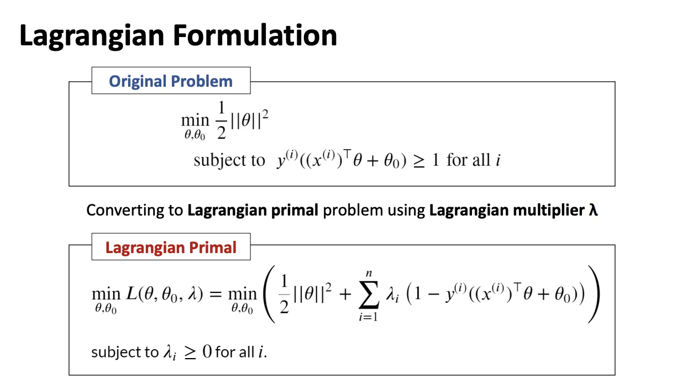

## 라그랑주 승수  ← 이거 꼭 다시보기

### 원래
원래 문제는 이렇게 생겼습니다:

- 최소화해야 할 것: $`\frac{1}{2}\|\theta\|^2`$
- 반드시 지켜야 할 조건: $`y_i(\theta^T x_i + \theta_0) \ge 1`$
이걸 그대로 풀면:

- 제약을 계속 체크해야 함
- 해석·계산이 번거로움
⇒  **라그랑주는 “위반하면 벌점” 방식으로 제약을 목적함수에 흡수**합니다.

### $`\lambda_i`$** 의 의미 (아주 중요)**
라그랑주 항:
$`\lambda_i\big(1 - y_i(\theta^T x_i + \theta_0)\big)`$

- 제약을 **잘 만족**하면:
	- $`1 - y_i(\cdot) < 0`$
	- $`\lambda_i = 0`$ 이 최적
- 제약을 **위반하거나 딱 맞추면**:
	- $`\lambda_i > 0`$
	- 목적함수에 직접 영향
$`👉 \lambda_i > 0 \iff support vector`$

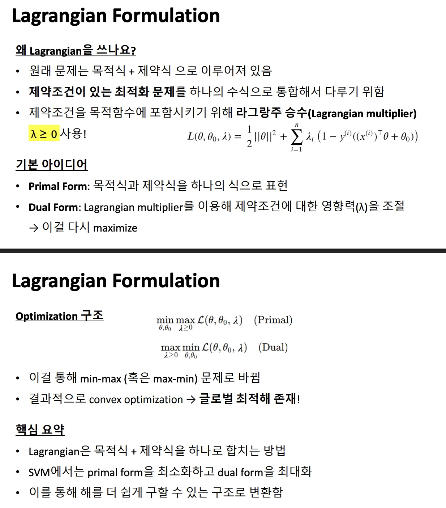

⇒ 
$`y_i(\theta^T x_i + \theta_0)\ge 1`$
이걸 이렇게 바꿉니다:
$`\underbrace{1 - y_i(\theta^T x_i + \theta_0)}_{\text{제약 위반량}}`$

- 이 값이 ≤ 0 이면: 제약 만족
- 이 값이 > 0 이면: 제약 위반
⇒ 목적 함수에 벌점 항을 추가하게 됨
	$$
	

\frac{1}{2}\|\theta\|^2
+
\sum_i \lambda_i
\big(1 - y_i(\theta^T x_i + \theta_0)\big)
	$$

<table header-row="true">
<tr>
<td>**데이터 상태**</td>
<td>1-yi()</td>
<td>**최적 λ**</td>
</tr>
<tr>
<td>마진 밖, 안전</td>
<td>< 0</td>
<td>λ = 0</td>
</tr>
<tr>
<td>마진 위</td>
<td>= 0</td>
<td>λ ≥ 0</td>
</tr>
<tr>
<td>마진 침범</td>
<td>> 0</td>
<td>λ > 0</td>
</tr>
</table>

-  **λ가 0이 아니면 그 점은 반드시 서포트 벡터**

## 라그랑지안 쓰는 이유
$$

y_i(\theta^T x_i+\theta_0)\ge 1
1-y_i(\theta^T x_i+\theta_0)\le 0 
로 쓰고, 
\\
각 제약마다 벌점 계수 \lambda_i\ge 0 를 붙여: \\

L(\theta,\theta_0,\lambda)
=
\frac12\|\theta\|^2
+
\sum_{i=1}^n \lambda_i\big(1-y_i(\theta^T x_i+\theta_0)\big)
$$
→ 람다 i는 최적화가 찾아내는 변수

# **8) “primal에서 dual로” 넘어가는 실제 계산 순서**
Dual을 만들려면:

### **(1) 먼저 **\\theta,\\theta_0** 에 대해 최소화(미분=0)**
$$
\frac{\partial L}{\partial \theta}=0
\Rightarrow
\theta=\sum_{i=1}^n \lambda_i y_i x_i
$$
$$
\frac{\partial L}{\partial \theta_0}=0
\Rightarrow
\sum_{i=1}^n \lambda_i y_i = 0
$$
이 두 줄이 엄청 중요합니다.

- **세타 가 데이터의 선형결합으로 표현됨**
- **라벨 가중합 제약**이 생김

### **(2) 위 결과를 **L** 에 대입해서 **\\theta,\\theta_0** 를 제거**
그러면 \\lambda 만 남는 목적함수가 됩니다:
$$
\max_{\lambda\ge 0}
\Big(
\sum_{i=1}^n \lambda_i
-\frac12
\sum_{i=1}^n\sum_{k=1}^n
\lambda_i\lambda_k y_i y_k\, x_i^T x_k
\Big)
$$
제약:
$$
\sum_{i=1}^n \lambda_i y_i = 0,\quad
\lambda_i\ge 0
$$
이게 **SVM dual**입니다

# **9) 왜 dual이 좋은가? (SVM의 진짜 힘)**
Dual 목적함수에는 데이터가 항상
$$
x_i^T x_k
$$
즉 **내적 형태**로만 등장합니다.
그래서 나중에 커널을 쓰면
$$
x_i^T x_k \rightarrow K(x_i,x_k)
$$
로 바꿔서 비선형 분류가 됩니다.
(이게 SVM의 핵심 강점)

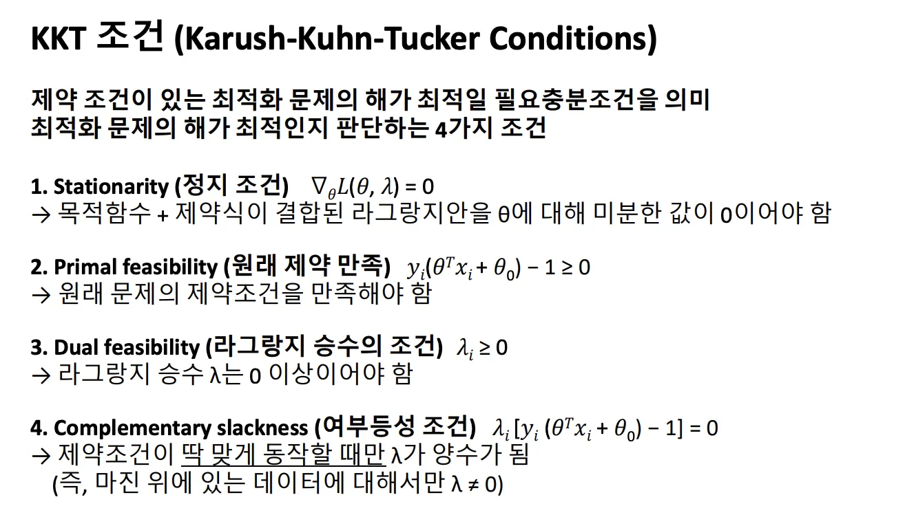

## KKT 조건

- 제약이 있는 최적화 문제에서 진짜 최적해라면 반드시 만족해야하는 4 가지 조건

# **KKT 조건 1️⃣ Stationarity (정지 조건)**
\\nabla_\{\\theta,\\theta_0\} L(\\theta,\\theta_0,\\lambda)=0

### **뜻 (사람 말)**

> 목적함수 + 제약을 합친 라그랑지안이

> θ, θ₀ 방향으로 더 이상 줄어들 수 없는 지점

### **SVM에서 실제로 나오는 결과**
미분 = 0 을 풀면:
\\theta = \\sum_i \\lambda_i y_i x_i
\\sum_i \\lambda_i y_i = 0

### **직관**

- 결정 경계의 방향(θ)은 **데이터들의 가중합**
- 그 가중치가 바로 **λ**
- 즉, **λ가 0이 아닌 데이터만 θ를 만든다**
👉 벌써 “서포트 벡터 냄새”가 나죠.
***

# **KKT 조건 2️⃣ Primal feasibility (원래 제약 만족)**
y_i(\\theta\^T x_i+\\theta_0)-1 \\ge 0

### **뜻**

> 모든 데이터는 원래 SVM 제약을 만족해야 한다
즉,

- 마진 안쪽 ❌
- 결정 경계 반대편 ❌
- 하드 마진에서는 **완벽 분리 필수**
이건 그냥 “문제의 기본 조건”입니다.
***

# **KKT 조건 3️⃣ Dual feasibility (λ ≥ 0)**
\\lambda_i \\ge 0

### **뜻**

> 라그랑주 승수는
	**벌점의 세기**

> 음수(보상)가 되면 안 된다
이건 규칙 같은 거라 깊게 생각할 필요는 없습니다.
***

# **⭐ KKT 조건 4️⃣ Complementary Slackness (여기가 핵심)**
$$
\lambda_i \,[\,y_i(\theta^T x_i+\theta_0)-1\,] = 0
$$
이 한 줄이 **SVM의 영혼**입니다.
천천히 케이스로 보겠습니다.

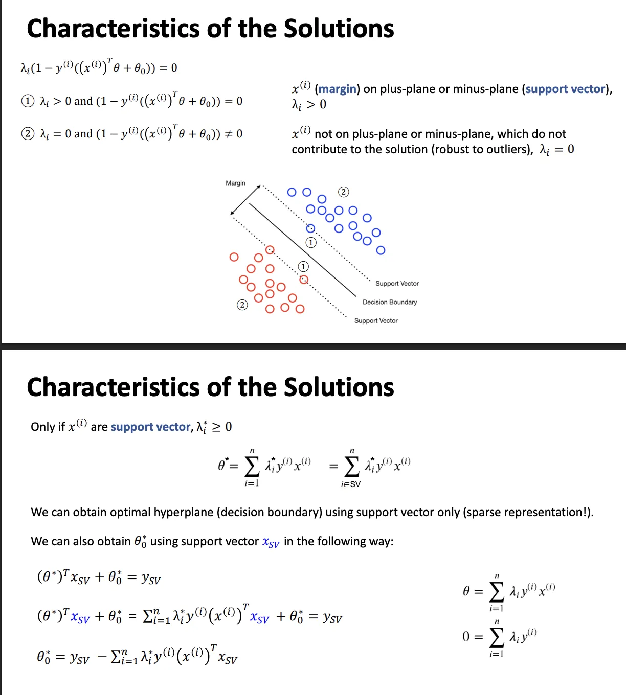

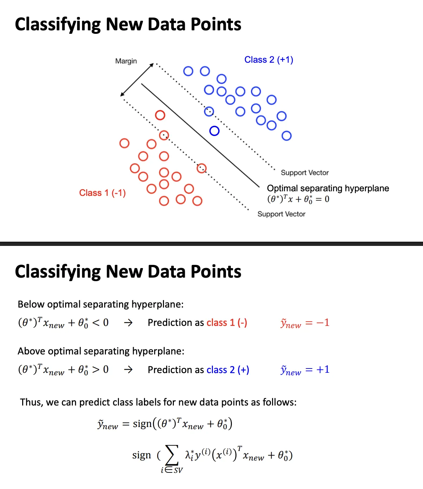

# **지금까지 전체 흐름을 한 번에 요약**

1. KKT의 complementary slackness 때문에
	→ **마진 위 점만 λ ≠ 0**

2. 그래서
	→ **support vector만 θ를 구성**

3. θ, θ₀ 모두
	→ **support vector로만 계산**

4. 새 데이터 분류도
	→ **support vector와의 내적만 사용**

5. 그래서
	→ sparse, robust, kernelizable
***

# 전체 정리
	# **0. 오늘 강의의 목표 한 줄**
	> 선형으로 두 클래스를 나누되, “가장 안전하게” 나누는 경계(마진 최대)를 찾고,
	> 그걸 수학적으로 풀기 위해 QP→라그랑주→KKT→서포트벡터→예측식까지 도달한다.
***
	# **1. 분류는 점수로 한다**
	선형 분류기는
	$$
	f(x)=\theta^T x+\theta_0
	$$
	라는 **점수(score)** 를 만들고,
	$$
	\hat y=\text{sign}(f(x))
	$$
	즉 **부호**로 클래스(+1/-1)를 정합니다.
	여기서 중요한 건:

	- \\theta: 경계의 방향(법선)
	- \\theta_0: 경계의 위치(절편)
***
	# **2. “경계가 여러 개면 뭘 골라야 하지?” → 마진**
	같은 데이터를 분리하는 직선(경계)은 여러 개가 나올 수 있습니다.
	SVM은 그 중에서
	> 두 클래스 사이 “틈”이 가장 넓은 경계(마진 최대)
	를 고릅니다.
	왜?
	틈이 넓으면 새 데이터가 조금 흔들려도(노이즈) 잘못 분류될 가능성이 줄어듭니다 → 일반화가 좋아짐.
***
	# **3. functional margin의 문제 → 스케일 장난 가능**
	처음엔 마진을
	$$
	\tilde\gamma_i=y_i(\theta^T x_i+\theta_0)
	$$
	라고 정의하면 “정답 방향으로 얼마나 점수가 큰지”를 줍니다.
	$$
	하지만 \theta,\theta_0 를 \alpha배 키우면 분류는 그대로인데 \tilde\gamma_i는 \alpha배 커집니다.
	$$
	즉 **같은 경계인데 마진이 커졌다고 착각**하게 됨.
	그래서 functional margin은 최적화 기준으로 쓰기 어렵습니다.
***
	# **4. geometric margin = “진짜 거리”로 고친다**
	스케일 문제를 없애려면 점수에 \\\|\\theta\\\| 로 정규화를 합니다:
	$$
	\gamma_i=y_i\frac{\theta^T x_i+\theta_0}{\|\theta\|}
	$$
	$$
	이 \gamma_i는 실제로
	$$
	$$
	점 x_i에서 결정경계 \theta^T x+\theta_0=0까지의 수직거리입니다.
	$$
	그래서 geometric margin은 스케일을 바꿔도 값이 변하지 않습니다.
***
	# **5. Plus-plane / Minus-plane과 “±1”의 의미**
	결정경계는
	$$
	\theta^T x+\theta_0=0
	$$
	마진 경계는 관례적으로
	$$
	\theta^T x+\theta_0=+1,\quad \theta^T x+\theta_0=-1
	$$
	라고 둡니다.
	여기서 **±1은 자연법칙이 아니라 “스케일을 고정하기 위한 약속”**이에요.
	이 약속을 두면 마진 폭이
	$$
	\text{Margin}=\frac{2}{\|\theta\|}
	$$
	로 깔끔해집니다.
***
	# **6. “마진 최대화”를 최적화 문제로 만들면?**
	마진이 \\frac\{2\}\{\\\|\\theta\\\|\} 이니까

	- 마진 최대화
		$$
		\max \frac{2}{\|\theta\|}
		$$
	은 결국

	- $`\|\theta\|`$ 최소화와 동치입니다.
	계산 편의를 위해 제곱을 씌워도 최소해는 같으므로 최종적으로:
	$$
	\min_{\theta,\theta_0}\ \frac12\|\theta\|^2
\quad\text{s.t.}\quad
y_i(\theta^T x_i+\theta_0)\ge 1\ \forall i
	$$
	이게 **하드 마진 SVM의 Primal(원문제)** 입니다.

	- 목적함수: 이차(quadratic)
	- 제약식: 선형(linear)
	→ **QP (Quadratic Programming)**
	→ **Convex**라서 전역 최적해 보장.
	단, 하드 마진은 데이터가 **선형 분리 가능**해야 해가 존재합니다.
***
	# **7. 이제 왜 라그랑주를 쓰나?**
	Primal은 “제약이 있는 최소화”라서 직접 풀어도 되지만,
	SVM은 라그랑주로 바꾸면 좋은 점이 많습니다:

	- 제약을 목적함수에 합쳐 “한 식”으로 다룸
	- Dual로 가면 데이터가 **내적 형태**로만 등장 → 커널 트릭 가능
	- 서포트 벡터가 왜 생기는지 수학적으로 깔끔히 보임
	라그랑지안은:
	$$
	L(\theta,\theta_0,\lambda)=\frac12\|\theta\|^2+\sum_i\lambda_i\big(1-y_i(\theta^T x_i+\theta_0)\big)
	$$
	$$
	(여기서 \lambda_i\ge 0)
	$$
	$`\lambda_i`$는 사람이 정하는 값이 아니라 **최적화가 찾아내는 변수**입니다.
***
	# **8. Dual로 가는 핵심 계산 (미분=0)**
	$`\theta,\theta_0`$Dual을 만들기 위해 먼저 에 대해 최솟값을 만들면(미분=0):
	$$
	\theta=\sum_i\lambda_i y_i x_i
	$$
	$$
	\sum_i\lambda_i y_i=0
	$$
	이 두 식이 “오늘 강의의 큰 전환점”입니다:

	- \\theta가 **데이터의 선형 결합으로 표현**
	- 즉, 어떤 데이터는 영향력(λ)이 0이면 아예 사라짐
	$$
	이걸 L에 대입하면 \lambda만 남는 문제(Dual) 가 됩니다:
	$$
	$$
	\max_{\lambda\ge0}\ \sum_i\lambda_i-\frac12\sum_i\sum_k\lambda_i\lambda_k y_i y_k (x_i^T x_k)
	$$
	$$
	\text{s.t. } \sum_i\lambda_i y_i=0
	$$
***
	# **9. KKT 조건: “왜 서포트 벡터만 남나?”**
	KKT는 제약 최적화의 최적해가 만족해야 할 조건이고,
	그 중 결정적인 한 줄이:
	$$
	\lambda_i\big(1-y_i(\theta^T x_i+\theta_0)\big)=0
	$$
	이게 의미하는 바는 딱 두 가지 뿐입니다:
	### **(A) 마진 밖 안전하면**
	$$
	y_i(\theta^T x_i+\theta_0)>1 \Rightarrow (1-\cdot)<0 \Rightarrow \lambda_i=0
	$$
	→ 영향 없음 (학습 결과에 기여 X)
	### **(B) 마진 경계에 딱 걸리면**
	$$
	y_i(\theta^T x_i+\theta_0)=1 \Rightarrow (1-\cdot)=0 \Rightarrow \lambda_i\text{가 살아있을 수 있음}
	$$
	→ 이 점이 경계를 결정 (Support Vector)
	그래서
	> $`\lambda_i>0`$
		**인 점만 서포트 벡터**
	> 나머지는 자동으로 제거됨(λ=0)
	이게 SVM이 sparse 한 이유입니다.
***
	# **10. 새 데이터는 어떻게 분류하나?**
	결정경계는
	(\\theta\^\*)\^T x+\\theta_0\^\*=0
	따라서
	$$
	\hat y_{new}=\text{sign}\big((\theta^*)^T x_{new}+\theta_0^*\big)
	$$
	$$
	그런데 \theta^*=\sum_{i\in SV}\lambda_i^* y_i x_i 이므로
	$$
	$$
	(\theta^*)^T x_{new}=\sum_{i\in SV}\lambda_i^* y_i (x_i^T x_{new})
	$$
	즉 최종 분류식은:
	$$
	\boxed{
\hat y_{new}=
\text{sign}\left(
\sum_{i\in SV}\lambda_i^* y_i (x_i^T x_{new})+\theta_0^*
\right)
}
	$$
	$$
	여기서 내적 x_i^T x_{new} 만 커널 K(x_i,x_{new})로 바꾸면 비선형 SVM이 됩니다(다음 강에서 보통 이어짐).
	$$
***
	# **이 강의의 “핵심 5문장” 요약**

	1. SVM은 **마진(최소 거리)** 을 최대화하는 경계를 찾는다.
	2. 마진 최대화는 \\\|\\theta\\\| 최소화로 바뀌고, 그래서 \\min \\frac12\\\|\\theta\\\|\^2가 된다.
	3. 제약 y_i(\\theta\^T x_i+\\theta_0)\\ge1 때문에 QP(Convex)가 된다.
	4. 라그랑주/듀얼로 바꾸면 \\theta=\\sum\\lambda_i y_i x_i가 되어 데이터가 내적 형태로만 남는다.
	5. KKT의 \\lambda_i(1-y_if(x_i))=0 때문에 **서포트 벡터만 λ가 남고**, 예측도 서포트 벡터만으로 한다.
