> 원본 Notion 정리 — 강의 슬라이드 이미지 + 설명.

> [← 전체 목차](/posts/net-overview/)

***

## 목차
## 1. Transport 계층의 이해

- 1.1 프로세스-프로세스 통신(Process-to-Process Delivery)
- 1.2 클라이언트/서버 패러다임
- 1.3 포트 번호(주소지정)
- 1.4 멀티플렉싱과 디멀티플렉싱
## 2. 연결 방식의 분류

- 2.1 연결 없는 서비스(Connectionless)
- 2.2 연결 지향 서비스(Connection-oriented)
- 2.3 신뢰할 수 있는 서비스 vs 신뢰할 수 없는 서비스
## 3. User Datagram Protocol (UDP)

- 3.1 개념 및 특징
- 3.2 프레임 형식
- 3.3 동작 방식
- 3.4 클라이언트/서버 큐잉
- 3.5 UDP 사용 애플리케이션
## 4. Transmission Control Protocol (TCP)

- 4.1 개념 및 특징
- 4.2 스트림 전달 서비스(Stream Delivery)
- 4.3 송수신 버퍼
- 4.4 세그먼트 및 바이트 번호
- 4.5 TCP 세그먼트 형식
- 4.6 제어 필드(Control field)
## 5. TCP 연결 관리

- 5.1 연결 설정(3-way handshake)
- 5.2 데이터 전송
- 5.3 연결 종료(4-way handshake)
- 5.4 반개방(Half-close)
## 6. TCP 흐름 제어 및 오류 제어

- 6.1 정상 동작
- 6.2 손실 세그먼트 처리
- 6.3 빠른 재전송(Fast Retransmission)
- 6.4 손실된 확인번호 처리
## 7. TCP 혼잡 제어

- 7.1 Slow Start (지수적 증가)
- 7.2 Congestion Avoidance (선형 증가)
- 7.3 Tahoe TCP 예시
- 7.4 Reno TCP 예시
- 7.5 AIMD(Additive Increase, Multiplicative Decrease)

***

# Transport Layer(Layer 4, 전송층)

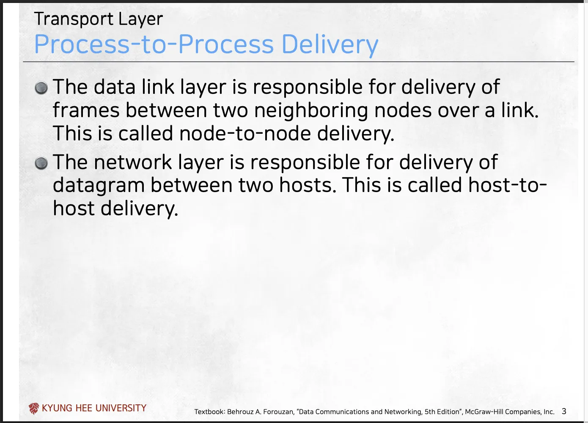

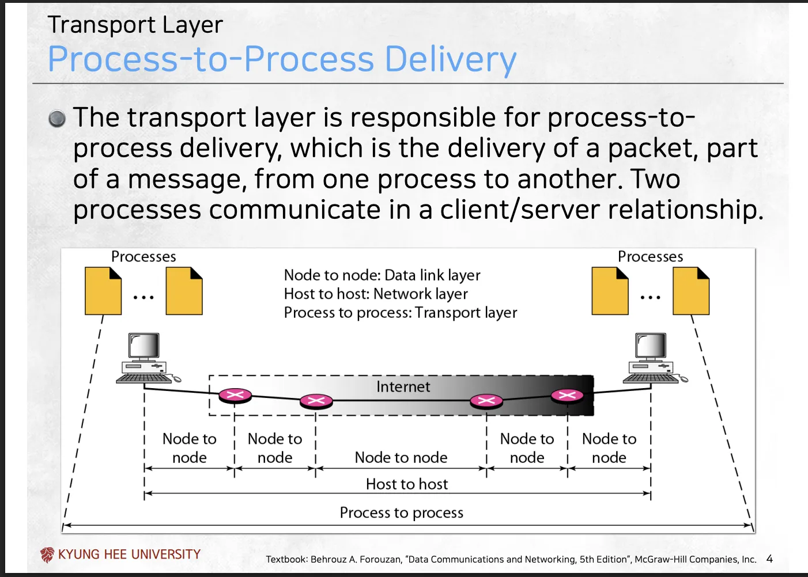

## 계층의 전송 범위

### 데이터 링크 층

- 바로 인접한 범위까지만 책임지는 짧은 범위의 배송
- Note-to-Node / Hop-by-Hop

### 네트워크 층

- 출발지 컴퓨터(호스트)에서 목적치 컴퓨터(호스트) 까지 End to End를 전달하는 것
- 중간에 수많은 라우터나 중간 노드를 거치지만 3계층의 최종 목표는 목적지 컴퓨터의 IP주소를 보고 정확한 컴퓨터까지 전송하는 것
- Host-to-Host/ End-to-End

### 전송 층(Transport Layer, L4)

- 3계층 덕분에 올바른 호스트에 도착한 패킷이 호스트 안의 여러 프로세스 중 어떤 프로세스로 가야 하는지를 구분하고 전달해줌
	- 이때 포트 번호를 사용
- Process-to-Process

## 4계층의 두 가지 주요 프로토콜

### 1. UDP(User Datagram Protocol)

- IP와 마찬가지로 데이터그램을 기반으로 하는 프로토콜
- 보내는 것만 신경을 쓰고 에러 복구, 검출, 흐름제어, 혼잡제어는 하지 않음
- 데이터의 순서가 무관하고, 손실되어도 무관한 것을 다루는 프로토콜
- 신뢰성으 낮지만, 속도가 빠름

### 2. TCP(Transmission Control Protocol)

- 데이터를 보내면 상대방이 잘 받았는지 일일이 확인(ACK)
	- 만약 데이터가 중간에 사라지면 **재전송**하고, 순서가 뒤바뀌면 **재조립**
	- 에러 복구, 검출, 흐름제어, 혼잡제어 모두 함
- 신뢰성이 높지만, 이러한 절차 탓에 속도가 상대적으로 느림

## 클라이언트/서버 패러다임

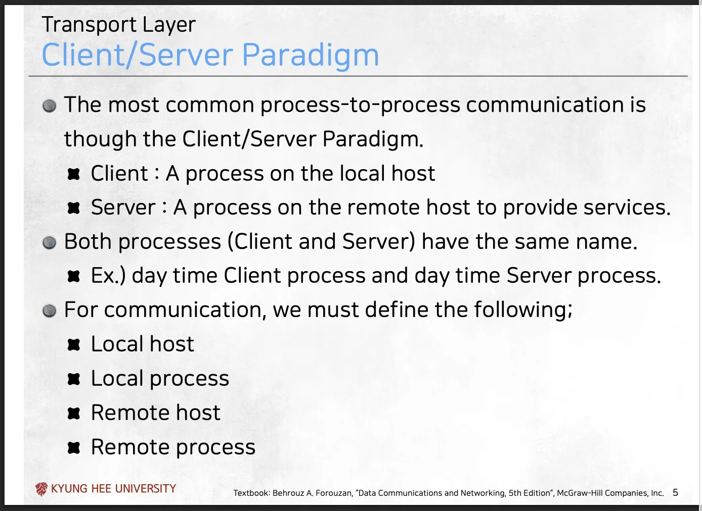

### 클라이언트/서버 패러다임

- 클라이언트와 서버로 역할을 나누는 것이 이 모델의 본질
	- 초창기에는 성능이 낮은 PC가 복잡한 연산을 고성능 서버에게 요청해서 그 결과를 응답받아 보여주는 식
- 한쪽은 요청을 하고 한쪽은 서비스를 제공하는 비대칭 구조가 패러다임의 핵심
→ 80년대에도 터미널 단말 하드웨어가 고성능 PC에 요청만 하는 형태가 있었음(매우 오래된 패러다임)

### 프로세스-to-프로세스 통신

- 가장 일반적인 Process-to-Process 통신은 클라이언트/서버 패러다임을 통해서 이뤄짐
- 이를 위해서는 네 가지 정보가 필요
	1. local host → 출발지 호스트, 출발지 호스트를 식별 가능한 IP주소
	2. local process → 출발지 프로세스, 이 프로세스를 식별 가능한 포트 번호
	3. remote host → 목적지 호스트, 이 호스트를 식별 가능한 IP주소
	4. remote process → 목적지 프로세스, 이 프로세스를 식별 가능한 포트 번호
	→ 여기서 보통 로컬이 클라이언트, 목적지가 서버가 됨

## Addressing

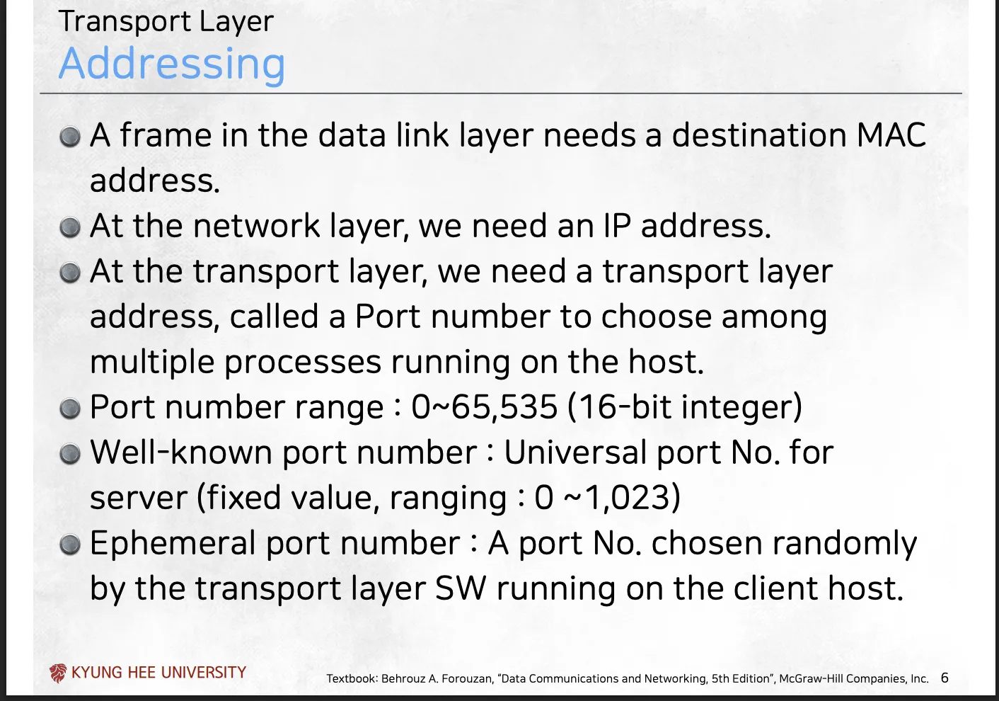

### Layer 4의 주소 지정

- 데이터 링크 층의 프레임은 목적지의 MAC주소, 네트워크 층에서는 IP주소를 필요로 함
- 전송 층에선느 프로세스의 식별을 위해 Port Number라는 것을 필요로 함
	→ PC로 들어오는건 IP까지 끝, 그 이후 프로세스 식별은 포트 넘버로 수행

- 포트 번호의 범위 ⇒ 0~65535까지 사용 가능
	- 이는 크게 Well-known portal number, Emphemeral port number로 분류
	1. well-known port number: 서버를 위한 보편적인 포트 번호
		- 전 세계적으로 이 포트가 특정하 서비스를 위해 사용하기로 예약된 번호
		- 0~1023의 번호를 가짐
	2. Emphemeral port number(임시 포트번호): 클라이언트가 서버에 접속을 요청할 때 임시로 할당받는 포트 번호
		- 클라이언트 호스트에서 실행되는 전송층 sw에 의해 무작위로 선택되는 포트번호
		- 1024~65535의 범위

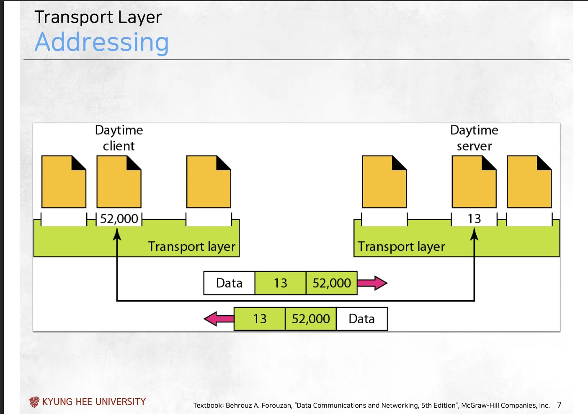

### DayTiem 서비스 예시

- 상황: client 컴퓨터가 켜졌는데 현재 시간을 몰라 시간을 알려주는 Daytime에게 시간을 물어보려 함
- Daytime은 시간을 알려주는 단순한 서비스로 13번 포트를 사용하도록 약속되어있음
- 이 Daytime Server와 Client는 다른 역할을 함
	1. Daytime Server (서버 측)
		- 서버는 불특정 다수의 클라이언트가 언제 요청을 할 지 몰라 항상 준비해야함
			- 따라서 고정되고 공개된 주소가 필요 → 이 경우에는 well known port인 13번
		- 서버의 L4는 13번 포트를 열어두고 클라이언트 요청이 오는지 항상 수신 대기 상태로 기다림
	2. Daytime Client(클라이언트 측)
		- 클라이언트는 시간을 물어보기 위해 능동적으로 접속을 요청하는 쪽
		- 클라이언트가 13번 서버에 요청을 할 때 서버가 응답을 돌려줄 반송 주소(Return Address)가 필요
			- 이때 OS는 Ephemeral Port중 남는 것을 하나 유동적으로 할당
				→ 위 예시에서는 52000번을 할당

- 위 예시에서 패킷의 흐름은
	1. 요청(Client → Server)
		- Source Port: 52000 / Detination Port: 13
	2. 응답(Server → Client)
		- Source Port 13 / Destination Port: 52000
	→ 서버는 받은 주소를 그대로 뒤집음

## IP주소와 포트넘버 비교

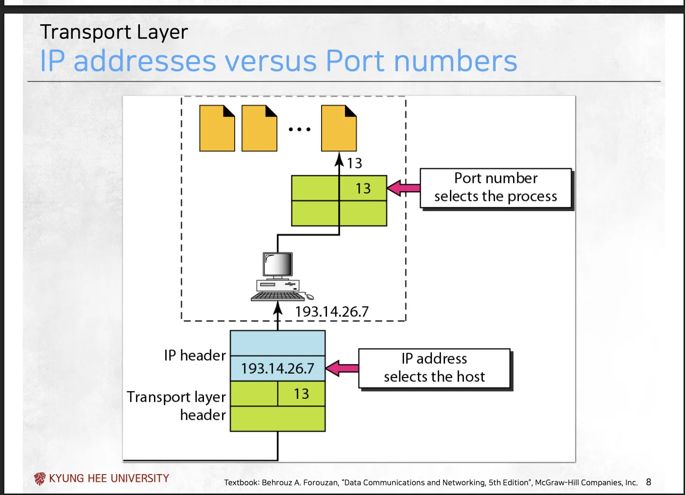

- 위 그림에서 가장 처음에는 패킷에 ip헤더와 전송층 헤더가 함께 있으며, 이 IP헤더의 IP주소가 호스트를 찾는데 사용
- 이후 프로세스를 찾는데 Port Number를 사용

### 접속에 필요한 네 가지 정보(4-튜플)

- 하나의 완전한 접속(연결)을 위해서는 네 가지 정보가 조합되어야 함
	- Source IP, Source Port, Destination IP, Destination Port
- 이것들을 4-튜플이라고 부르기도 함

## Socket Address

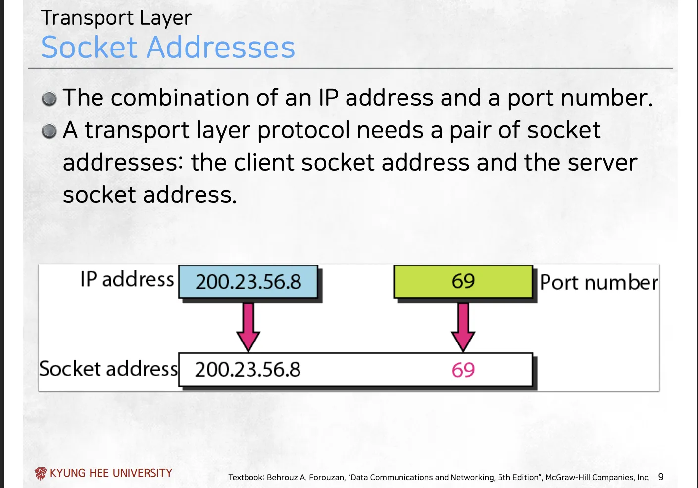

### Socket Address

- IP 주소와 포트 번호의 조합
- ex) `200.23.56.8:69` 
- 어차피 특정 호스트의 특정 프로그램을 찾아가기 위해서는 IP주소와 포트넘버가 같이 있어야 하므로 이를 합쳐서 표현
- 전송층의 프로토콜은 한 쌍의 프로토콜을 필요로 함
	- 클라이언트 소켓 주소, 서버 소켓 주소
	→ 실질적으로 4-튜플과 같은 말

### → 소켓 프로그래밍

- 개발자가 TCP나 UDP를 이용해 L4 레벨에서 직접 통신하려면, `IP:Port` 조합(소켓 주소)을 코드에 명시해야함
	- 소켓 프로그래밍의 대두
	- 이 시기 네트워킹 책은 모두 TCP/UDP 소켓 프로그래밍과 동의어
- 현재는 L4보다는 L7을 다뤄서 네트워크 책의 주제가 다른 걸로 넘어감(별로 안중요)

## Multiplexing and Demultiplexing

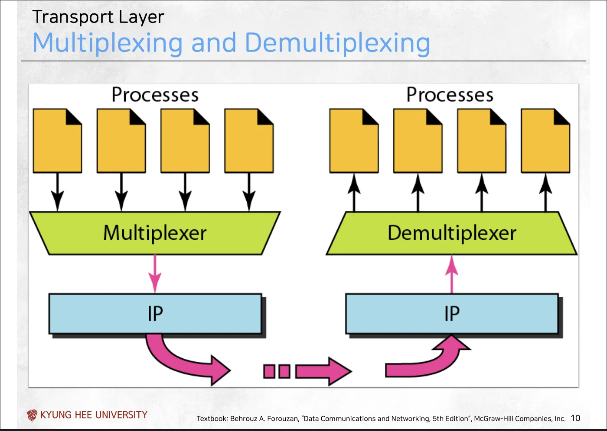

### Multiplexing(MUX, 다중화)

- 보내는 측의 컴퓨터에 있는 것
- 여러 프로세스가 네트워크를 사용할 때 하나의 인터넷 연결을 통해야 함
- 이를 위해 L4가 Multiplexing을 하여 하나의 IP로 통합하여, 돌아올 Source Port를 각 데이터 세그먼트에 붙여 일렬로 내보냄

### Demultiplexing(DEMUX, 역다중화)

- 받는 측 컴퓨터(Receiver)에 있는 것
- 3계층(**IP**)은 인터넷에서 도착한 데이터(패킷)를 4계층으로 올려보냅니다. 이 데이터는 웹, 게임, 메신저 데이터가 *뒤섞인* 상태
- **하나의** 데이터 스트림을 받아서, *여러* 개의 올바른 프로그램(**Processes**)에게 정확히 나누어서 배달
→ 별로 안중요하다고 함, 이런게 있다
→ go에서 서버를 프레임워크 없이 짤 때 쓰는 mux가 이거인듯

# Connection

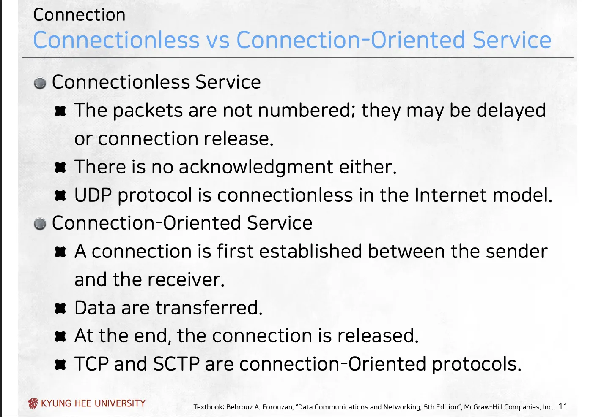

### Layer 4의 두 가지 서비스 스타일

- 4계층은 Connectionless(비연결형) / Connection-Oriented(연결 지향형)의 두 가지 서비스 방식을 가짐

### Connectionless Service(비연결형 서비스)

- 연결 수립 없이 일단 패킷을 보내는 방식
- 패킷에 번호가 없어 순서가 뒤바뀌거나 중간에 유실될 수 있음
- 상대방이 잘 받았는지 확인하지 않음
⇒ Unreliable(신뢰성 없는) 프로토콜

- UDP가 대표적

### Connection-Oriented Service(연결 지향형 서비스)

- 먼저 송신자와 수신자 사이에 연결이 수립
- 데이터가 전송(잘 받았는지도 확인)
- 마지막에 연결을 해제
⇒ Reliable 프로토콜

- TCP, SCTP 등이 대표적

### → UDP도 중요한 이유

- UDP는 에러 검출 및 복구, 혼잡 제어, 흐름제어 등을 하지 않음
- 그럼에도 4계층의 역할은 포트 번호로 프로세스를 잘 찾아 넘겨주는 것이므로 UDP도 동등하게 중요

## Reliable, Unreliable

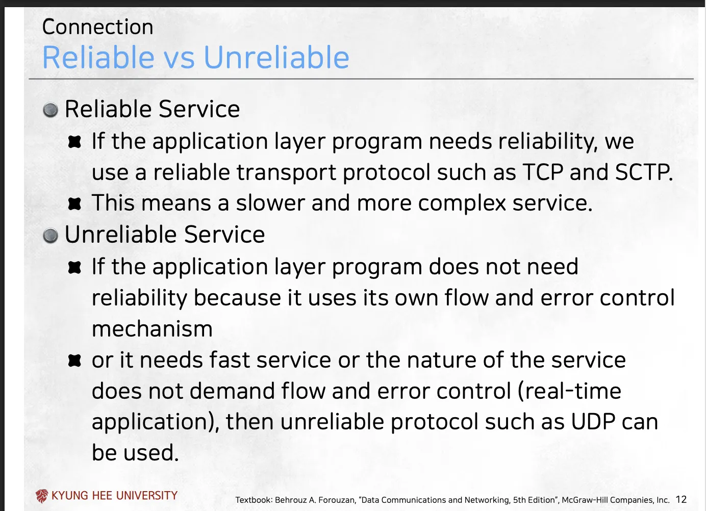

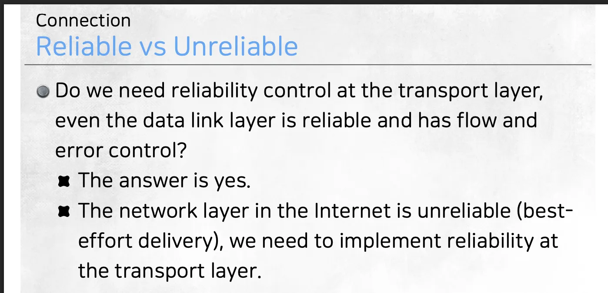

### Reliable Service

- 만일 응용 계층 프로그램이 신뢰성을 필요로 한다면, 신뢰성 있는 Transport Layer 프로토콜을 사용
- 이는 더 느리고 복잡한 서비스를 의미
	- 신뢰성을 위해 ACK, 재전송 등을 하므로 더 느리고 복잡한 서비스가 됨

### Unreliable Service

- 아래 경우에 비신뢰성 프로토콜을 사용
	1. 응용 프로그램이 자체적으로 흐름 및 에러 제어 매커니즘을 가져 신뢰성이 필요하지 않을 때
	2. 빠른 서비스를 필요로 할 떄
	3. 서비스의 특성상 흐름 및 에러 제어가 필요하지 않을 때

### 2계층에서 에러, 흐름 제어를 하고 4계층에서 또 하는 이유

- 데이터 링크 레이어에서도 에러 검출 및 복구, 흐름 제어를 수행
	- 그러나 이는 hop-by-hop 구간만 책임을 짐
- 또한 3계층의 IP는 비신뢰성(Unreliable, Best-Effort)이므로 2계층이 구간 사이에 완벽하게 전달했다 해도 3계층에서 패킷을 잃어버릴 수 있음
⇒ 따라서 End-to-End 신뢰성을 요구하는 4계층이 반드시 필요

## Error Control

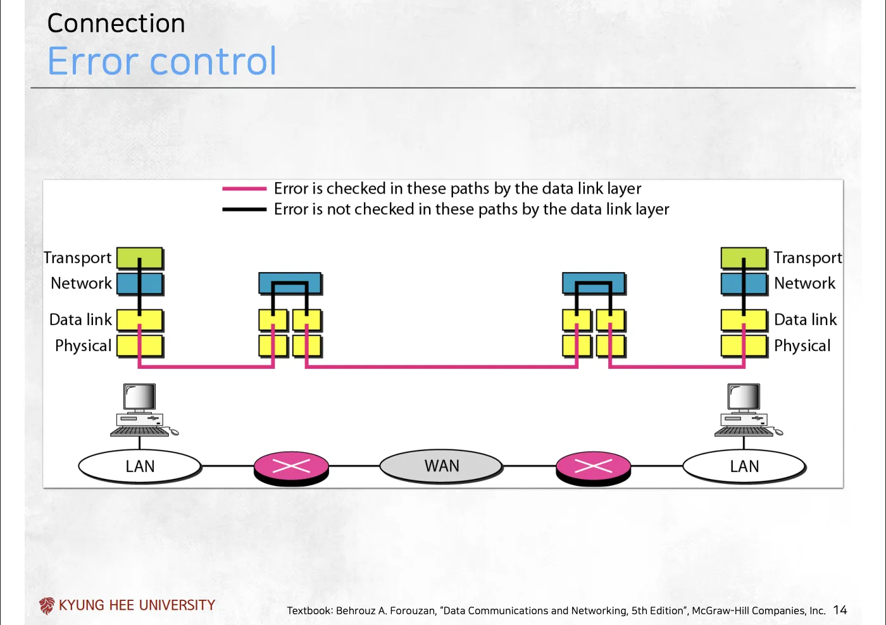

→ 위 그림에서 분홍 선은 데이터 링크 계층에 의해 에러가 검사됨, 검정 선은 데이터 링크 층에 의해 에러가 검사되지 않음

	- 검정 선은 2계층에서 검사하지 않으므로 에러 컨트롤이 필요

### **1. 2계층 에러 제어의 한계: Hop-to-Hop**

- 슬라이드의 **분홍색(마젠타) 선**은 2계층(Data Link Layer)이 에러를 검사하는 구간을 의미
- 이 선은 PC ↔ 라우터, 라우터 ↔ 라우터와 같이 바로 인접한 구간에서만 동작

### **2. 3계층(라우터)의 문제: 패킷은 버려질 수 있다**

- 패킷이 라우터에 도착하면, 2계층 껍질이 벗겨지고 3계층(Network Layer)에서 다음 경로를 계산
- 2계층 링크를 무사히 통과했더라도 **라우터(3계층) 내부에서** 메모리가 꽉 차거나(congestion) 다른 문제가 생기면 **패킷이 버려질(dropped) 수 있음**
- 2계층은 이 라우터 *내부*에서 발생한 에러(유실)는 전혀 알 수 없음

### **3. 4계층 에러 제어의 필요성: End-to-End**

- 2계층이 각 *구간*을 아무리 완벽하게 전달해도, 중간 라우터에서 패킷이 유실되면 최종 목적지 컴퓨터는 그 패킷을 영원히 받지 못함
- 출발지 컴퓨터부터 목적지 컴퓨터까지 끝까지 신뢰성을 유지하는 4계층 에러제어가 필요
- 4계층(TCP)은 패킷이 도착하지 않으면, 3계층(IP)이 중간에 잃어버린 것으로 간주하고 해당 패킷을 **재전송**

## 전송층의 주요 프로토콜

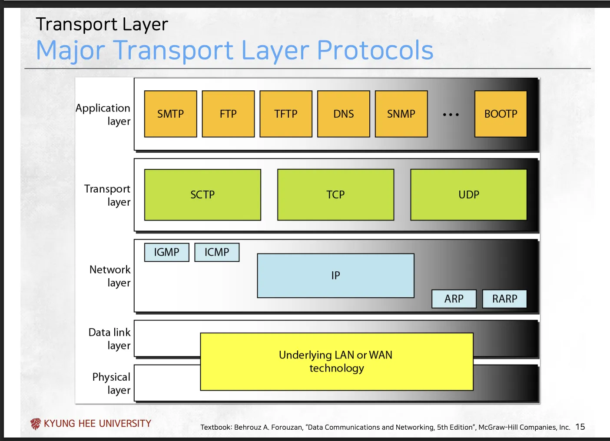

### 전송 계층 주요 프로토콜

1. **TCP (전송 제어 프로토콜)**: 연결 지향형 프로토콜. 데이터 전송의 신뢰성이 중요한 경우에 사용
2. **UDP (사용자 데이터그램 프로토콜)**: 비연결형 프로토콜. 전송 속도가 중요한 경우에 사용
3. **SCTP (스트림 제어 전송 프로토콜)**
	- 상대적으로 최신 프로토콜로, TCP와 UDP의 장점을 결합한 형태
	- 특히 SCTP은 3G/4G/5G 같은 모바일 통신망의 신호 전송(시그널링)에 광범위하게 활용
***

# User Datagram Protocol (UDP)

## UDP의 개념

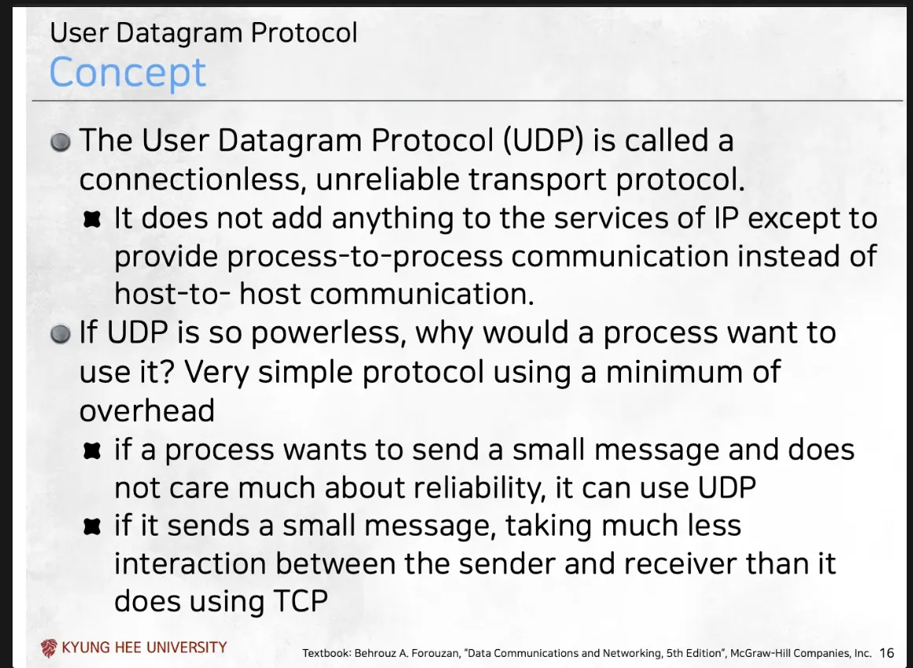

### UDP 개념

- 비연결형(connectionless), 비신뢰성(unreliable) Transport (layer) protocol
	- UDP는 IP프로토콜에 아무것도 추가하지 않으며, host-to-host대신 process-to-process 통신만을 추가로 제공
	→ **UDP = IP (비신뢰성 Host-to-Host) + 포트 번호 (Process-to-Process)** 라고 요약 가능

### 기능이 없는데 UDP를 쓰는 이유

- UDP는 매우 단순한 프로토콜이며 최소한의 오버헤드만을 사용
	⇒ 최소한의 오버헤드로 Process-to-Process 통신을 제공하는 것에 의의를 가짐

### UDP가 적합한 사례

- 프로세스가 작은 메시지를 보내고 신뢰성에 대해 크게 신경쓰지 않으면 UDP사용 가능
	- 단순한 메시지를 보낼 때는 훨씬 작은 상호작용만이 필요할 수도 있음

## UDP와 함께 사용되는 Well-known ports

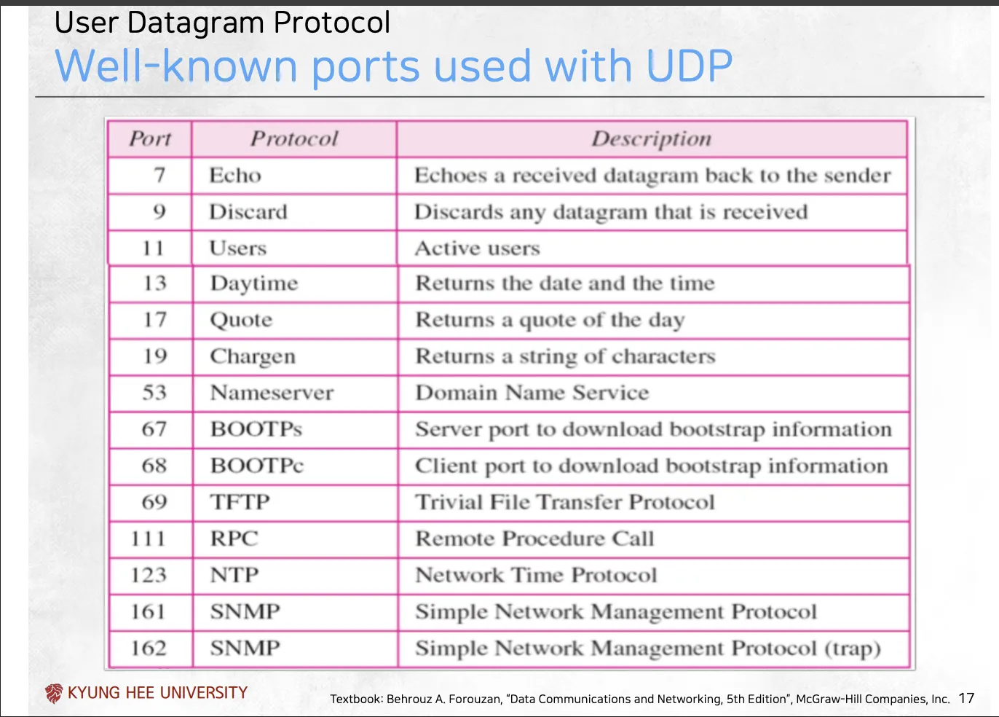

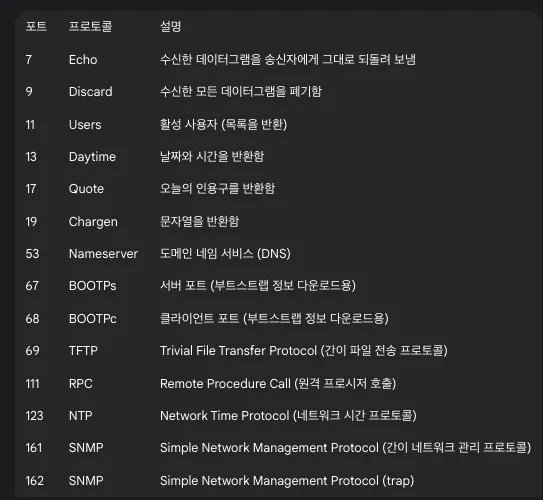

- 위 프로토콜들은 모두 4계층 프로토콜로 TCP가 아닌 UDP를 사용
	- 이 프로토콜들은 패킷 사이 의존성이 없고 신뢰성, 순서 보장, 흐름 제어 등의 복잡한 기능에 의존하지 않기 때문

## Frame Format

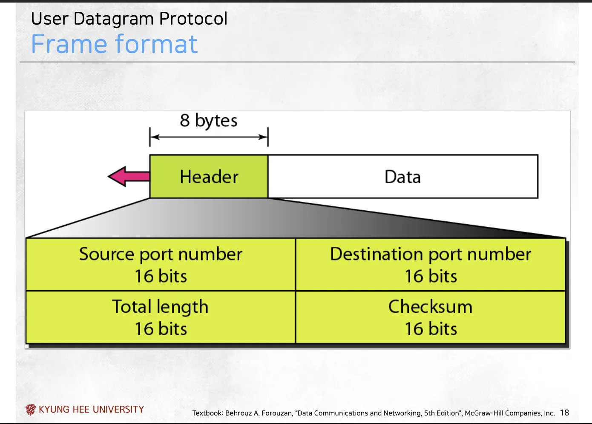

→ 위는 축약된 형태의 UDP 헤더

- 출발지의 포트 넘버(Source Port number)와 목적지의 포트 넘버(Destination port number)를 가지고 있음

### 4가지 필수 필드

1. **Source port number (16 bits / 출발지 포트)**
	- 데이터를 "보내는" 프로그램의 주소
	- 서버가 응답을 돌려줄 때 사용할 '반송 주소'이며, 보통 임시 포트(Ephemeral Port)가 할당
2. **Destination port number (16 bits / 목적지 포트)**
	- 데이터를 "받아야 할" 프로그램의 주소
	- 이 번호를 보고 OS가 패킷을 올바른 프로그램에게 배달(Demultiplexing)
3. **Total length (16 bits / 총 길이)**
	- 헤더(8바이트) + 데이터(Data)를 합친 UDP 패킷 *전체*의 길이를 바이트 단위로 표시
4. **Checksum (16 bits / 체크섬)**
	- 전송 중 데이터(헤더+데이터)에 오류가 생겼는지 검사하기 위한 *최소한의* 에러 검출 필드
	→ TCP는 에러를 정교하게 복구하는 것과 반해, UDP는 에러를 검출하면 그냥 버림

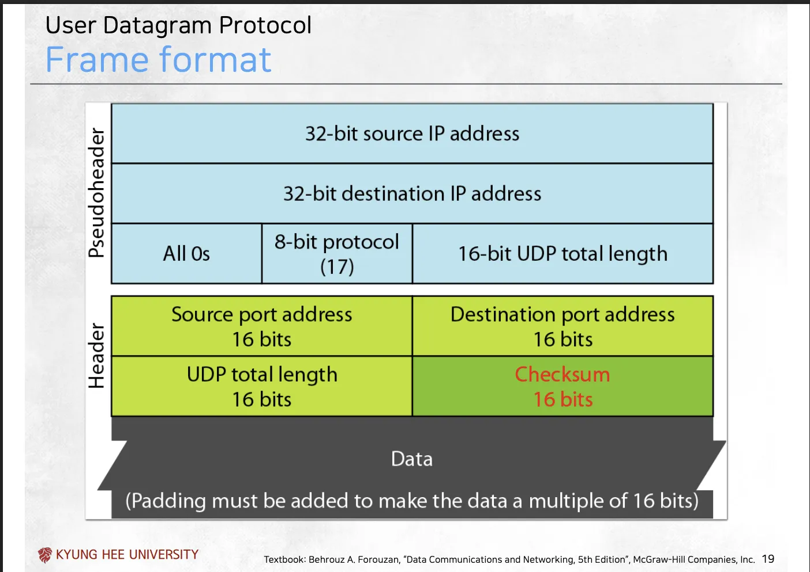

→ 여기서는 Pseudo header라는 개념이 존재

	- UDP에서 임시로 IP헤더를 끌어오는 것
	- 이렇게 ip헤더의 정보와 udp의 헤더 정보로 체크섬 확인
		→ udp만으로도 에러 검출은 가능하지만, ip까지 함게하면 잘못된 곳으로 온 것이 아님도 검출 가능
→ 이렇게 소켓 어드레스(ip주소, 포트넘버)가 잘못된 것인지 아닌지도 검출 가능

## UDP의 동작

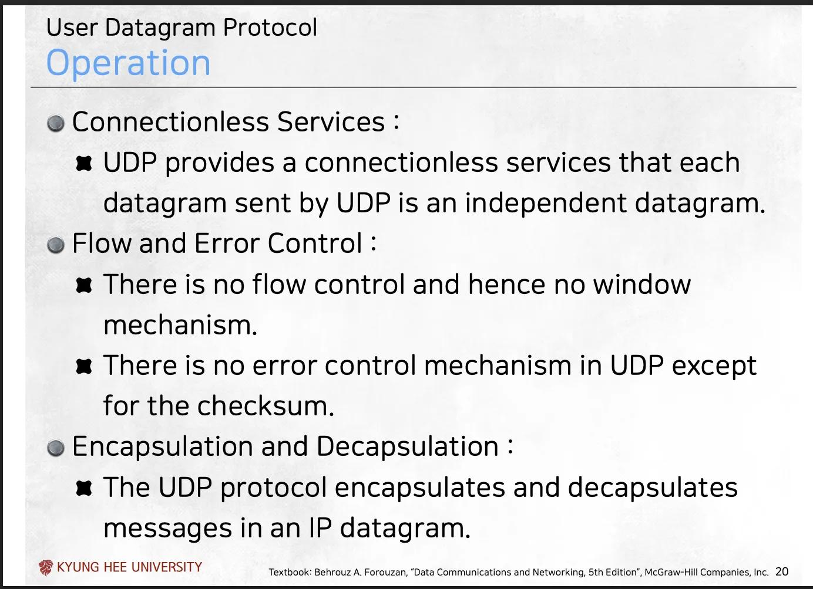

### 1.  Connetionless Service

- UDP는 비연결형 서비스를 제공하고, UDP로 전송되는 각 데이터그램은 독립적인 데이터그램
- UDP는 각 데이터그램(패킷)을 완전히 독립적인 존재로 취급 
	⇒ 이는 논리적인 줄이 없다는 뜻

	- 순서, 신뢰성 등을 보장하지 않는다는 뜻, 줄 자체가 필요없고 패킷(데이터그램)을 순서없이 전송

### 2. Flow and Error Control (No Control)

- 흐름제어도 없으며, 따라서 윈도우 매커니즘도 없음
	- 윈도우 매커니즘: 한 번에 보낼 수 있는 **데이터량을 제어하는 시스템, TCP에는 있음**
- UDP에는 체크섬을 제외한 어떤 에러 제어 매커니즘도 없음

### 3. Encapsulation and Decapsulation

- UDP프로토콜은 IP 데이터그램 내의 메시지를 캡슐화하고 역캡슐화 함
	⇒ 이게 실질적으로 UDP가 하는 진짜 일

		- IP 데이터그램에 포트번호를 포함한 UDP헤더를 붙여 UDP데이터그램으로 만듬

## UDP의 Queuing(큐잉)

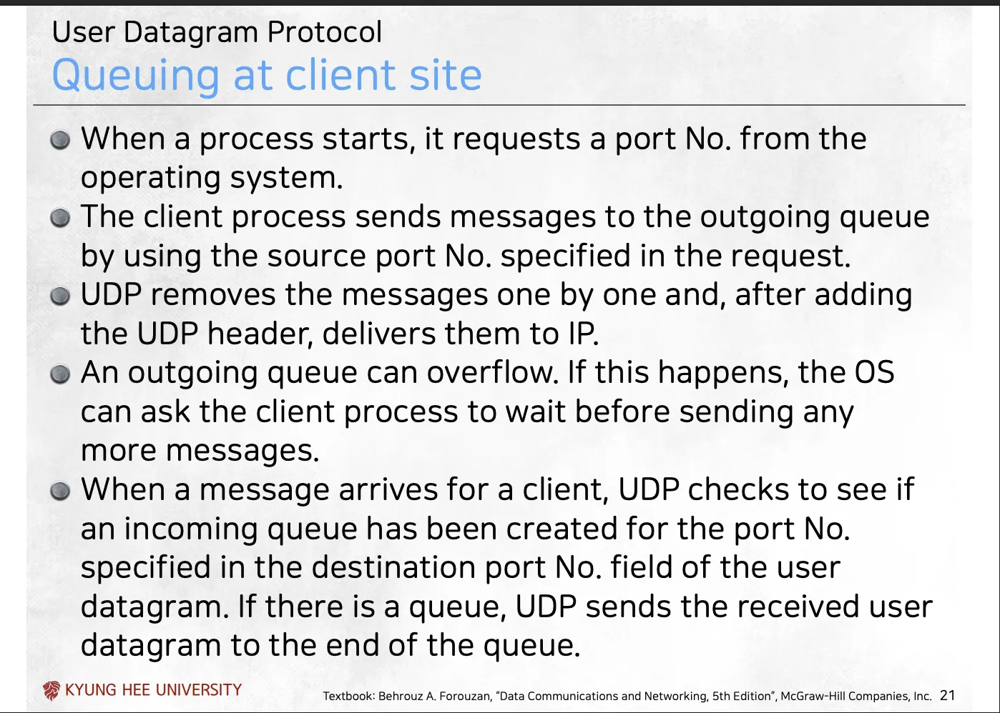

### UDP 클라이언트 측면의 큐의 동작

1. 클라이언트 프로세스가 시작되면 OS에 포트 번호를 요청
	- 이때 OS는 Ephemeral port 중 하나를 할당하고 이 포트 전용 수신/발신 큐를 생성
2. 클라이언트 프로세스 요청을 보냄
	- 클라이언트 프로세스가 요청에 명시된 출발지 포트 번호로 메시지를 발신 큐로 보냄
3. OS는 UDP의 발신 큐에서 메시지를 하나씩 제거하고 UDP헤더를 추가한 뒤 IP에게 전달
	- 발신 큐가 오버플로가 될 수 있음, 만일 오버플로가 발생하면 OS는 클라이언트 프로세스에게 더 많은 메시지를 보내기 전에 대기 요청을 할 수 잇음
4. 클라이언트 프로세스가 요청을 받는 경우
	- UDP는 사용자 데이터그램의 목적지 포트 번호 필드에 명시된 포트 번호를 위해 생성된 수신 큐가 있는지 확인
	- 만일 있다면 UDP는 수신된 사용자 데이터그램을 큐의 끝에 추가

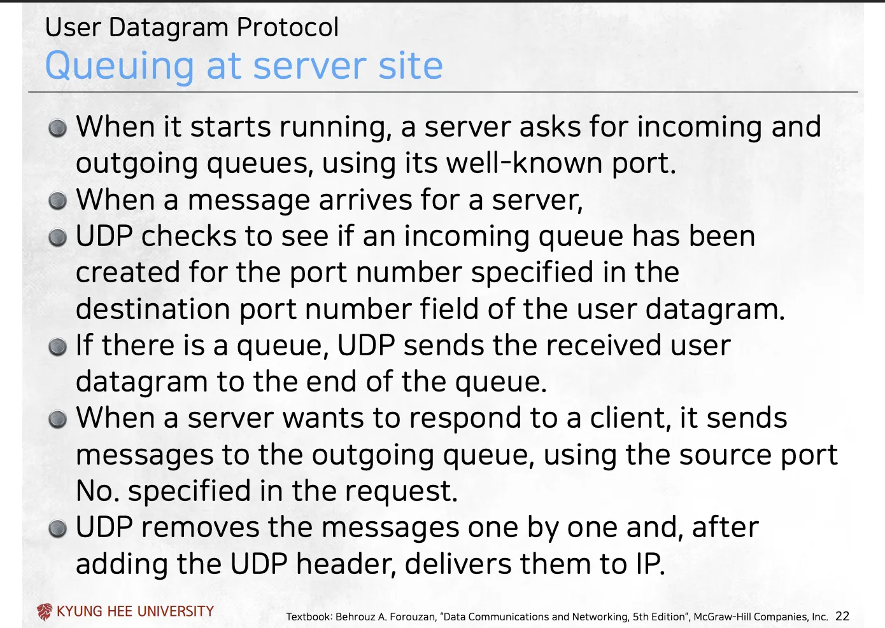

### UDP 서버 측면의 큐의 동작

1. 서버가 실행을 시작할 때, 자신의 well-known port(잘 알려진 포트)를 사용하여 **수신(incoming) 및 발신(outgoing) 큐**를 요청
2. 서버를 위한 메시지가 도착했을 때, UDP는 사용자 데이터그램의 목적지 포트 필드에 명시된 포트 번호를 위해 생성된 **수신 큐가 있는지 확인**
3. 큐가 있다면, UDP는 수신된 사용자 데이터그램을 **큐의 끝에 추가**
4. 서버가 클라이언트에게 응답하고자 할 때 클라이언트 요청에 명시되었는 Source port number를 사용해 메시지를 발신 큐로 전송
5. UDP는 발신 큐에서 메시지를 하나씩 제거하고 UDP헤더를 추가한 뒤 IP에게 전달

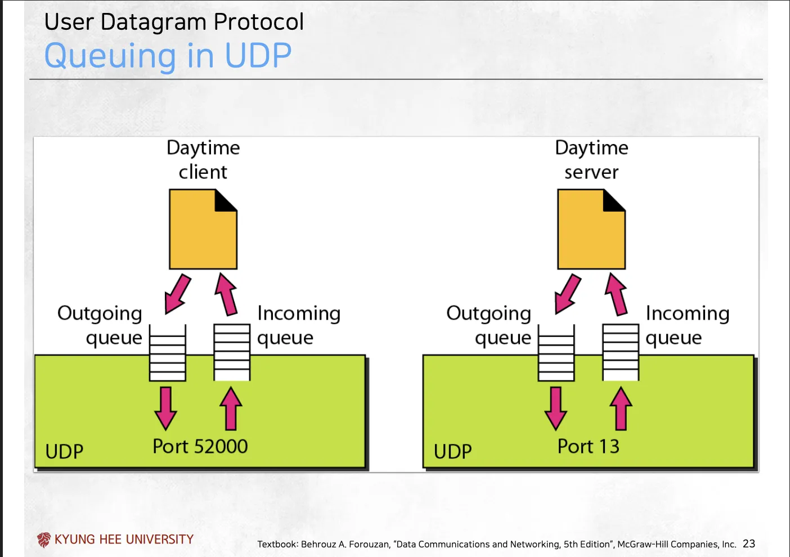

→ 위 설명을 나타내는 그림

	- 공통점
		1. 시작 시 OS에게 수신(incoming), 발신(outgoing) 큐 생성을 요청
		2. 수신의 경우
			- UDP는 데이터그램을 수신 큐의 끝에 추가
			- 하나씩 제거해서 UDP헤더 제거하고 상위 레이어로 전달
		3. 발신의 경우
			- UDP는 데이터그램을 발신 큐의 끝에 추가
			- 하나씩 제거해서 UDP헤더 추가하고 IP에게 전달

## UDP의 애플리케이션

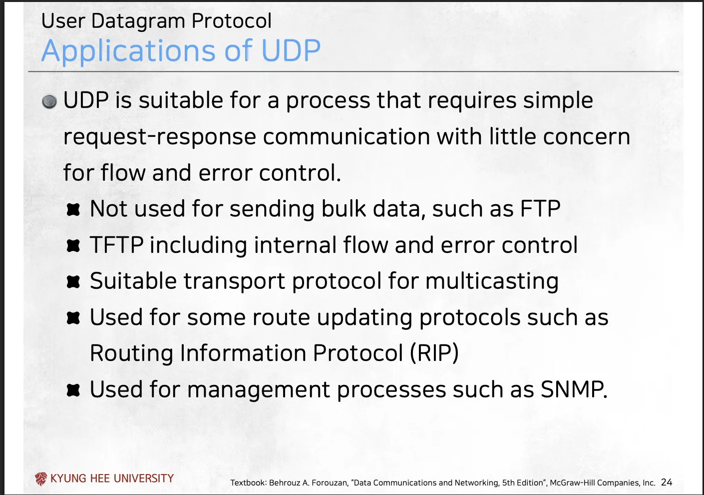

- UDP는 흐름 제어와 에러 제어에 대한 **큰 걱정 없이**, **단순한 요청-응답(request-response) 통신**을 필요로 하는 프로세스에 적합

### UDP를 사용하는 애플리케이션

- 대량 데이터(X) vs 단순 요청(O):
	- **FTP**와 같은 대량 데이터(bulk data)를 보내는 데는 신뢰성이 필요하므로 TCP사용
	- **TFTP** (내부적인 흐름 및 에러 제어 포함)
		- 이름(Trivial: 사소한)처럼, 라우터 펌웨어 같은 '작은' 파일을 '빨리' 전송하는 게 목적
		- 약간의 신뢰성이 필요해 애플리케이션에서 추가로 간단한 에러 컨트롤을 수행
- 멀티캐스팅(multicasting)에 적합한 트랜스포트 프로토콜
	- **UDP**는 그냥 "에라 모르겠다" 하고 패킷을 한 번에 쏨
- 라우팅 및 관리 프로토콜 (RIP, SNMP):
	- RIP (Routing Information Protocol)와 같은 일부 라우트 업데이트 프로토콜에 사용
	- SNMP (Simple Network Management Protocol)와 같은 관리 프로세스에 사용됩
	⇒ 라우팅, 상태에 대한 작고 간단한 요청/응답만 주고받음

## 기타

### zero-copy와 포인터

- interrupt로 하드웨어(L1)에서 데이터가 수신되어 응용 프로그램(L7)까지 올라갈 때, zero-copy가 이뤄지는 방법
- NIC가 패킷을 받으면 OS이 관리하는 메모리 공간에 데이터를 저장
	- 이때 OS는 데이터 자체를 애플리케이션의 큐로 복사하지 않음
	- 대신 데이터가 저장된 메모리 주소(포인터)만을 큐에 전달
- 애플리케이션은 큐에서 이 주소를 꺼내서
	- 이 주소는 데이터는 여기서부터 시작하고 앞의 몇 바이트는 헤더로 간주하라는 내용을 포함
	- 데이터가 커널 메모리 → 응용 프로그램 메모리로 복사되는 과정이 0번 일어남 → zero copy

### TCP가 UDP보다 빨랐던 이유

- **이론:** UDP는 기능이 없어 오버헤드가 적으므로 TCP보다 **빨라야 함**
- **현실 (QUIC 테스트 당시):** "TCP는 UDP보다 빠름"이라는 충격적인 결과가 나옴
	- **TCP는 많이 써서 좋은 개발자를 투입**
		- TCP는 웹, 이메일 등 거의 모든 핵심 서비스가 사용
		- 따라서 지난 수십 년간 리눅스(OS) 커널 개발자들은 TCP 스택에 엄청난 투자와 좋은 개발자를 투입해 **최적화**
	- UDP는 상대적으로 관심을 받지 못함
⇒ 결로, 코드는 이론과는 다르게 동작
***

# Tranmission Control Protocol(TCP)

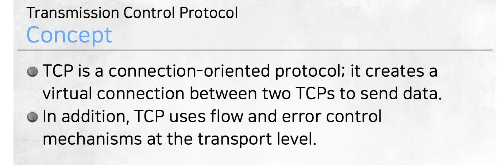

### TCP의 개념

- TCP는 Connection-Oriented 프로토콜
	- 데이터를 보내기 위해 두 TCP 사이에 가상 연결을 생성
- TCP는 전송 계층에서 흐름 제어와 에러 제어 매커니즘을 사용

## TCP 기반 서비스

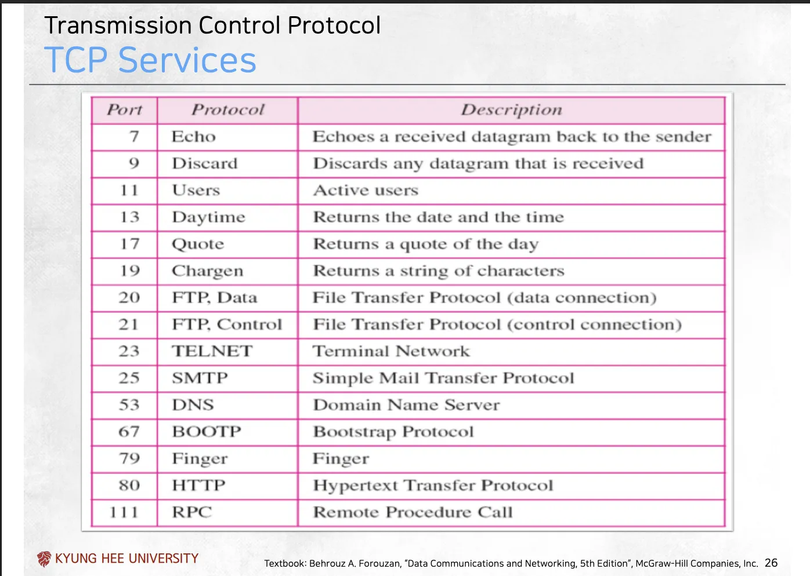

→ 위는 TCP 기반의 Well-known service들

- Daytime은 UDP에서도 동작
	- 이는 계층 간 독립성의 의해 가능한 것
- HTTP는 TCP에서만 동작하도록 설계
- FTP도 TCP에서만 동작하게 설계
	- 예는 한 서비스에서 2개 포트를 사용
	- [FTP.DATA](http://FTP.DATA) → 파일전송
	- FTP.Control → 얼마나 갔는지, 현재 전송량은 어떤지 등

## TCP의 Stream Delivery Service

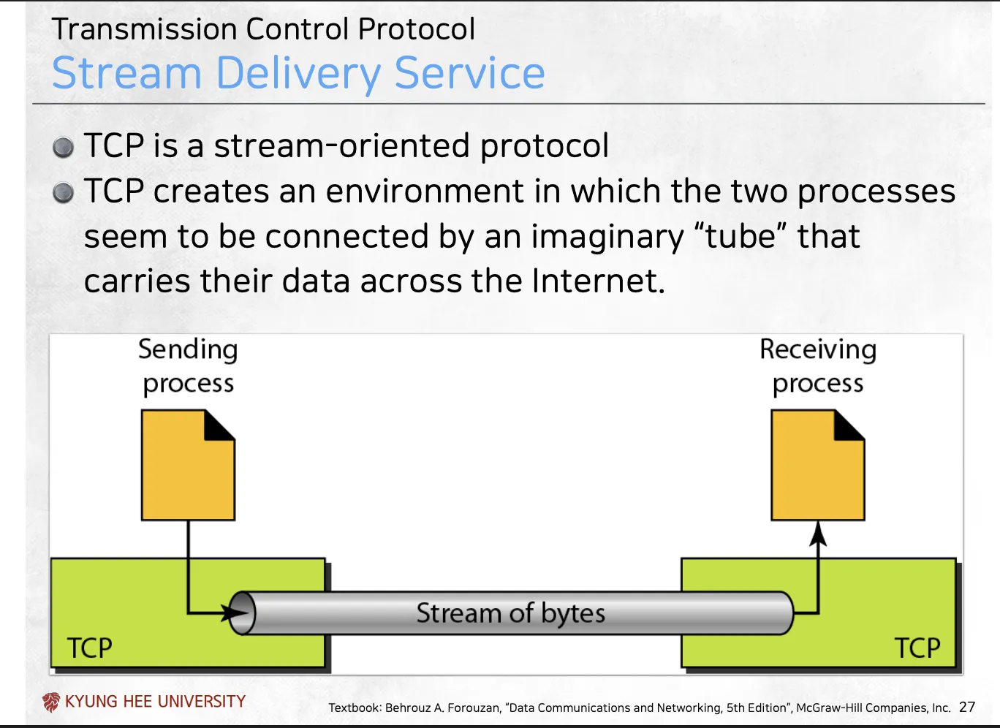

- TCP는 Stream-Oriented(스트림 지향)프로토콜
- TCP는 두 프로세스가 인터넷을 통해 데이터를 전송하는 가상의 “튜프”로 연결된 것 같은 환경을 만듬
	→ 이 튜브가 UDP에는 없던 일종의 논리적인 선

- TCP는 데이터를 흐름을 논리적인 연결에 보내고, 받는 쪽에서는 이를 그냥 흘러나오는 대로 읽게 되어있음
	- TCP는 데이터 최소 단위로 바이트를 사용하기 때문에, 이 흐름은 
		⇒ Stream of Bytes가 됨

## TCP 수신, 송신 버퍼

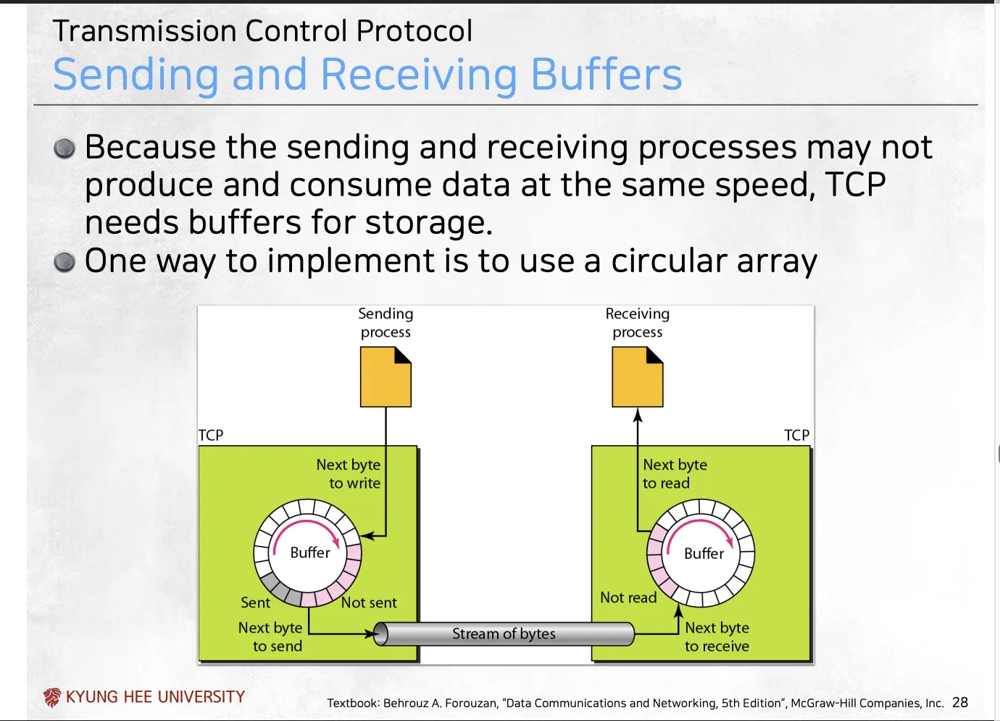

### TCP의 송수신 버퍼

- 송신 프로그램이 데이터를 생산하는 속도와 수신 프로그램이 데이터를 소비하는 속도는 대부분 경우에 다름
- 이 속도 차이를 맞추기 위해 TCP는 중간에 데이터를 임시로 저장하는 버퍼(Buffer)를 둠
1. Sending Buffer
	- 송신 프로그램이 데이터를 생성하는 족족 버퍼에 집어넣음(write)
	- TCP는 이 버퍼레 쌓인 데이터를 상대방이 받을 수 있는 속도에 맞춰 조절해 Stream of bytes로 보냄
2. Receiving Buffer
	- 네트워크에거 데이터를 생성하는 족족 이 버퍼에 쏟아부음
	- 수신 프로그램은 자신이 가능한 속도대로 이 버퍼에서 데이터를 꺼내 감(read)
- 이 버퍼는 원형 큐(Circular Queue)로 구현
	- 일자 큐를 쓰면 데이터를 앞으로 빼면 뒤의 데이터를 앞으로 이동시키거나 앞 공간이 비어버림
		⇒ 성능상 비효율(데이터 당기기), 메모리 공간 낭비(앞 공간이 빔)

	- 원형 큐는 끝과 시작이 연결된 트랙
		- 데이터를 빼가서 공간이 생기면 그 공간을 뒤에서 즉시 재사용 가능
	⇒ 데이터를 끊김없이 주고 받는 스트림 환경에서 멈추지 않고 공간을 효율적으로 재사용 가능해 흐름 제어 횟수를 줄이는 가장 효율적인 알고리즘

- 송신 버퍼에는 세 가지 상태가 있음
	1. 보냈지만 아직 응답 못받음
		→ 그림에서의 회색

		- TCP에 네트워크로 Send했지만, 상대방으로부터 ACK를 받지 못한 상태
			→ 보관하는 이유: 중간에 유실되었다면 이를 재전송해야하기 때무

	2. 대기 중이라 아직 못 보냄
		- 응용 프로그램이 버퍼에 넣었지만 TCP가 아직 네트워크로 Send하지 않은 데이터
	3. 데이터가 존재하지 않는 빈 공간

### 버퍼와 흐름제어 횟수

- 큐(버퍼)의  크기를 늘리면 한번에 데이터를 많이 담아둘 수 있어 흐름제어로 인한 멈춤 횟수가 줄어들어 전송 효율 상승
- 따라서 TCP, UDP 모두 이를 실행하는 함수에 버퍼 사이즈를 받는 파라미터가 있음

## 세그먼트

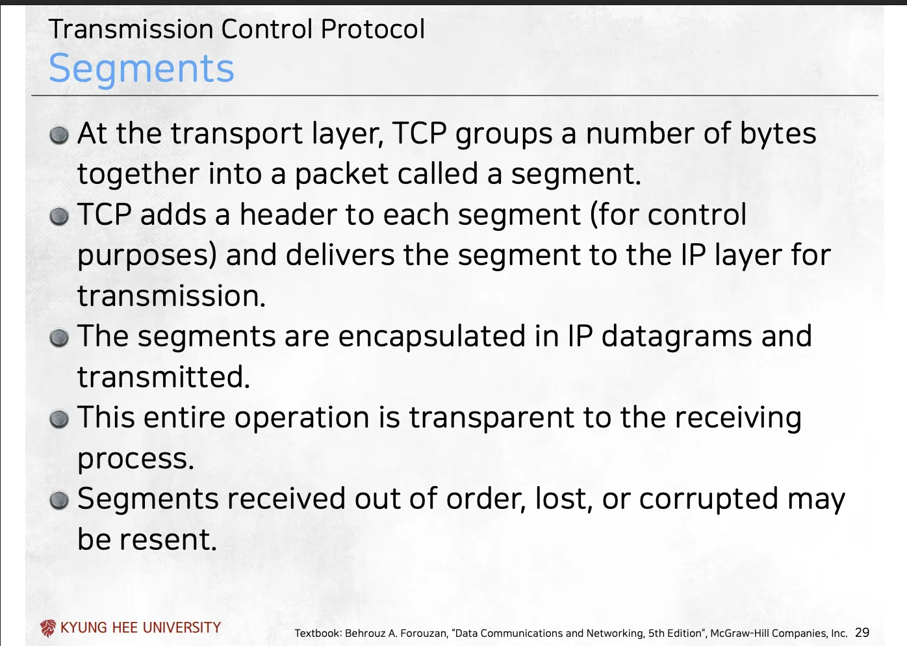

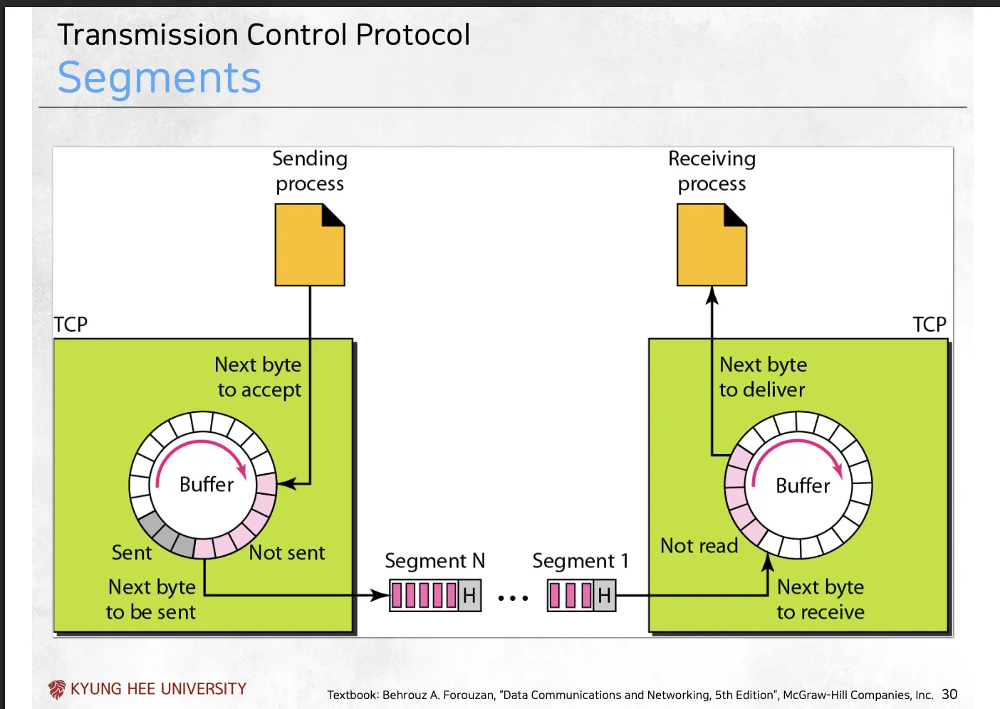

### 세그먼트

- 4계층에서 TCP는 여러 바이트를 세그먼트라고 불리는 패킷으로 그룹화
- TCP는 제어 목적으로 각 세그먼트에 헤더를 추가하고, 전송을 ㅜ이해 세그먼트를 IP계층으로 전달
- 세그먼트는 IP 데이터그램으로 캡슐화되어 전송
- 이 전체 동작은 수신 프로세스에게 보이지 않게 숨겨짐
	→ 애플리케이션은 그냥 스트림을 읽는 것으로 생각하게 됨

- 세그먼트의 순서가 맞지 않거나, 유실되거나, 손상된 세그먼트는 재전송 가능
→ 세그먼트의 시퀀스 넘버가 있음, 이는 본인이 실어 나르는 데이터의 번호

	- 아래에서 나옴

	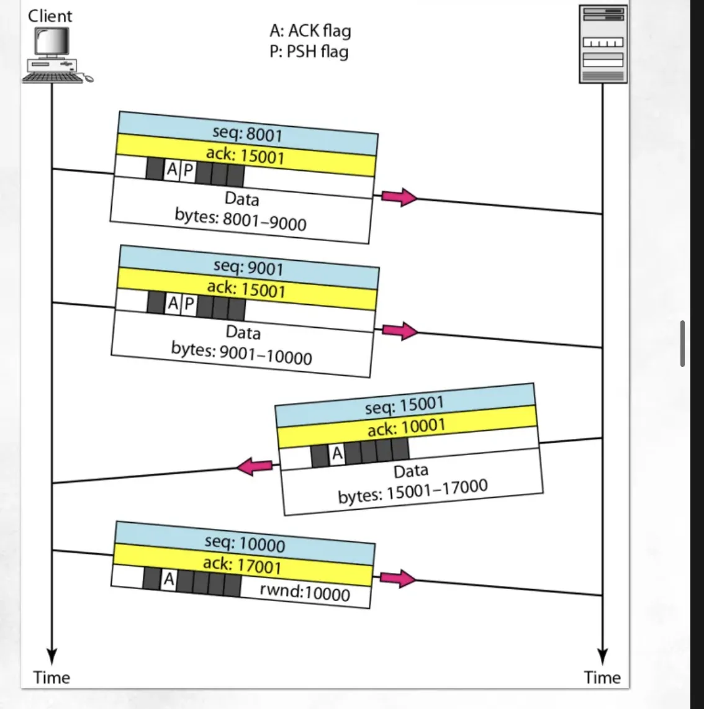

## Full Duplex Service

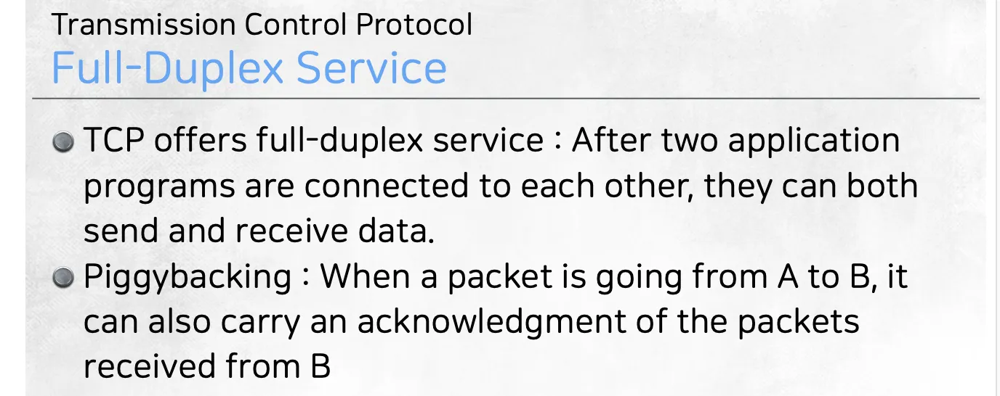

### TCP와 전이중 서비스

- TCP는 **전이중(full-duplex) 서비스**를 제공
-  응용 프로그램이 서로 연결된 후, 양측 모두 데이터를 **보내고 받을 수 있음**
⇒ 일단 두 프로그램(클라이언트/서버) 간에 "연결"이 맺어지면, 두 프로그램은 **동시에** 데이터를 *보내고(Send)* **동시에** *받을 수(Receive) 있음*
	→ 무전기 같은 건 한 사람이 말할 때 다른 한 명은 들어야 함
	→ 전화같이 두 사람이 동시에 말하고 들을 수 있음

- TCP는 Connection-Oriented Service라서, 한쪽에서 다른 한쪽으로 향하는 연결이 2개 존재(서로 다른 방향)
	- 이걸 기반으로 전이중 통신 구현

### 피기배킹(Piggybacking)

- 패킷이 A에서 B로 갈 때, B로부터 받은 패킷에 대한 확인 응답(acknowledgment)을 **함께 실어 나를 수 있음**

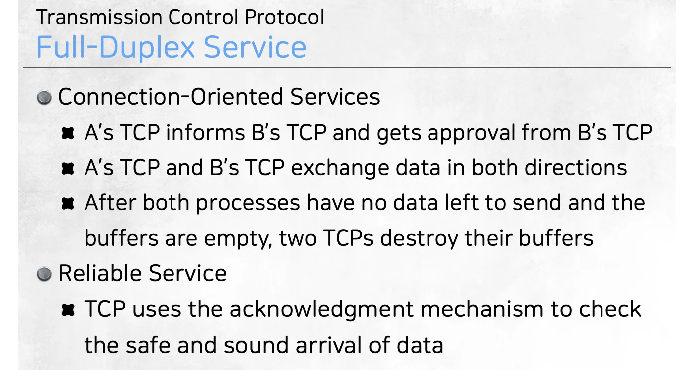

### Connection-Oriented Services

- A의 TCP가 B의 TCP에 알리고, B의 TCP로부터 승인을 받음
- A의 TCP와 B의 TCP는 양방향으로 데이터 교환
- 두 프로세스 모두 보낼 데이터가 없고 버퍼가 비워진 후, 두 TCP는 버퍼를 파기 = 연결해제

### Reliable Service

- TCP는 데이터의 안전하고 온전한 도착의 확인을 위해, 확인 응답(acknowledgement) 매커니즘 사용

## Byte Numbers

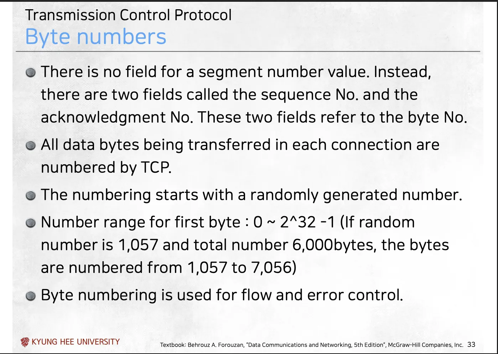

- TCP헤더에는 세그먼트 번호 값을 위한 필드가 존재하지 않음
	- 대신 TCP는 연결을 통해 흐르는 모든 바이트마다 1,2,3… 처럼 고유 번호 = 바이트 번호를 매김
- seq, ack의 진짜 의미
	- seq(시퀀스 넘버): 이 세그먼트에 실린 데이터의 첫 번째 바이트 번호가 몇 번인지 나타냄
	- ack(응답 번호): 당신이 보낸 데이터는 ack number - 1 번째 바이트까지 잘 받았으니, 이제 ack number 바이트를 보내달라는 의미
- 이 번호는 난수를 기반으로 시작, 첫 바이트의 번호 범위는 0~ $`2^{32}-1`$ 까지
	- 바이트 번호는 흐름제어와 에러 제어를 위해 사용

## Sequence Number

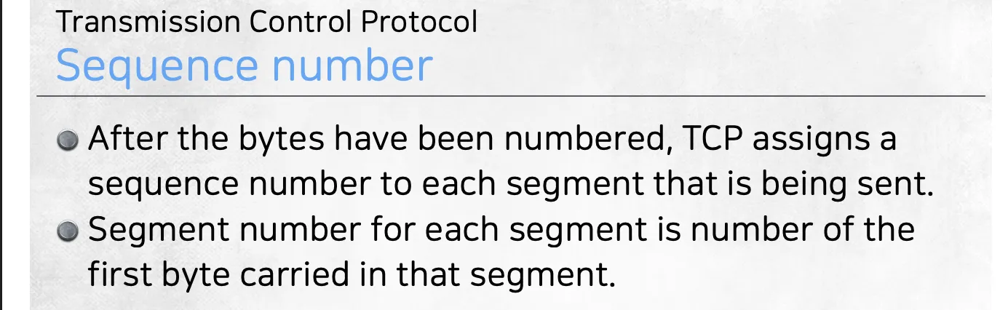

- 각 바이트에 번호가 매겨진 후, TCP는 전송되는 세그먼트에 시퀀스 번호를 할당
- 각 세그먼트의 세그먼트 번호는 그 세그먼트에 실린 첫 번째 바이트의 번호
- TCP의 '세그먼트'는 단순한 덩어리가 아니라, 전체 "바이트 스트림(Sequence)"의 *어느 부분*인지를 정의하는 `시퀀스 번호(seq)`를 다름
	- 응용 단의 메시지, 또는 패킷 등과는 다르게 이는 바이트의 스트림이라 시퀀스가 존재

## Acknowledgement number

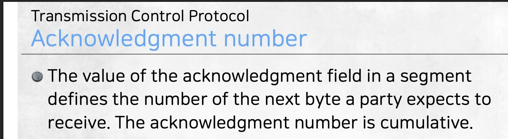

- 세그먼트 내의 acknowledgement필드의 값은 통신 당사자가 다음에 수신하기를 기대하는 바이트의 번호를 정의
- acknowledgement number는 누적됨
	→ `ack: 9001`이라는 응답 하나는, `8001`번 바이트, `8002`번 바이트, ..., `9000`번 바이트 **전부**를 한꺼번에 "잘 받았다"고 확인해 주는 것

## TCP 세그먼트 포맷과 컨트롤 필드

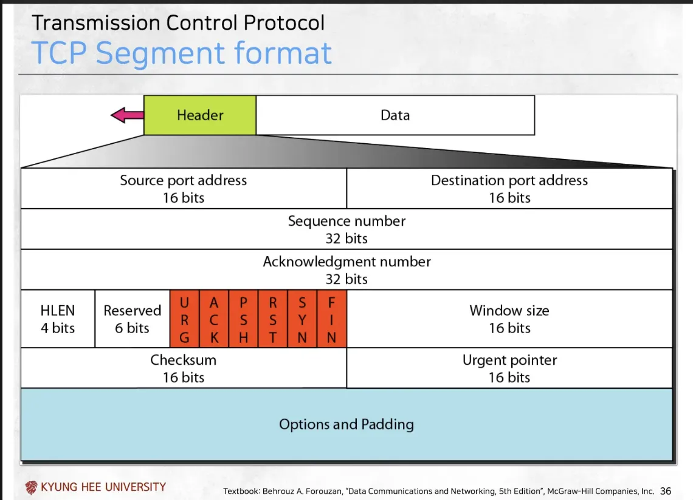

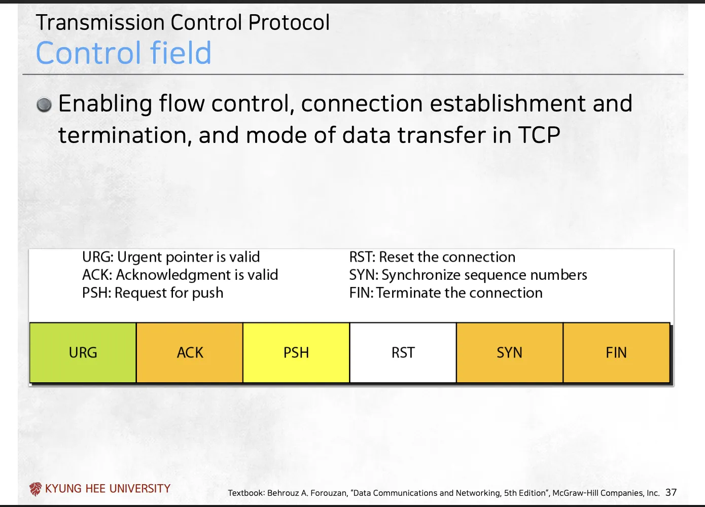

## 컨트롤 필드

- TCP에서 **흐름 제어, 연결 수립 및 종료, 그리고 데이터 전송 모드**를 가능하게 함
- **URG:** Urgent pointer (긴급 포인터)가 유효함
- **ACK:** Acknowledgment (응답)이 유효함
- **PSH:** Push (밀어넣기)를 요청함
- **RST:** Reset the connection (연결을 리셋함)
- **SYN:** Synchronize sequence numbers (시퀀스 번호를 동기화함)
- **FIN:** Terminate the connection (연결을 종료함)

## TCP와 Connection-Oriented Service

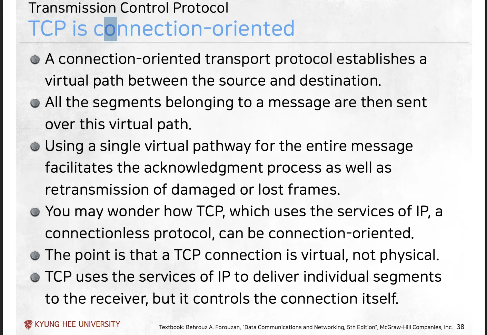

- 연결 지향형 전송층 프로토콜은 출발지 ↔ 목적지 사이 가상의 경로를 수립
- 하나의 메시지에 속한 모든 세그먼트들은 이 가상의 경로로 전달
	- 하나의 큰 메시지를 TCP단에서 나눈 것이 세그먼트, 이 세그먼트들은 모두 가상의 경로로 전송
- 전체 메시지를 위해 단일 가상 경로를 사용하는 것은, 손상되거나 유실된 프레임의 재전송과 ACK과정을 용이하게 함
- 비 연결형 IP위에서 논리적인 경로를 생성하는 것

# TCP 연결 관리

## 연결 수립

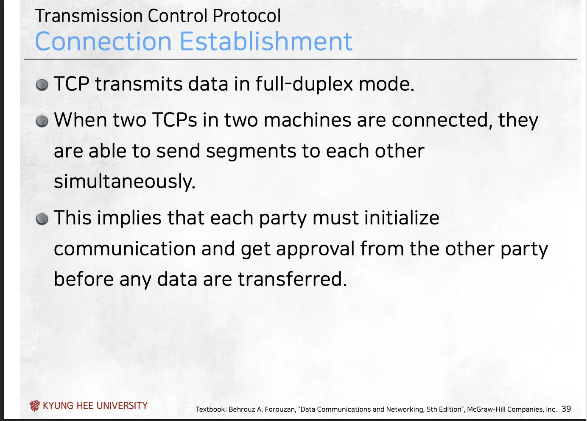

### TCP의 연결 수립

- TCP는 **전이중(full-duplex) 모드**로 데이터를 전송
	- 두 기계의 두 TCP가 연결되었을 때, 그들은 서로에게 **동시에(simultaneously)** 세그먼트를 전송 가능
- 이는 어떠한 데이터가 전송되기 *전에*, **각 당사자(each party)가 통신을 초기화(initialize)하고** 상대방으로부터 **승인(approval)을 받아야 함**을 의미
	⇒ 상호 합의를 기반으로 연결 수립이 필요
	→ 쟤도 보낼 수 있고 나도 보낼 수 있음

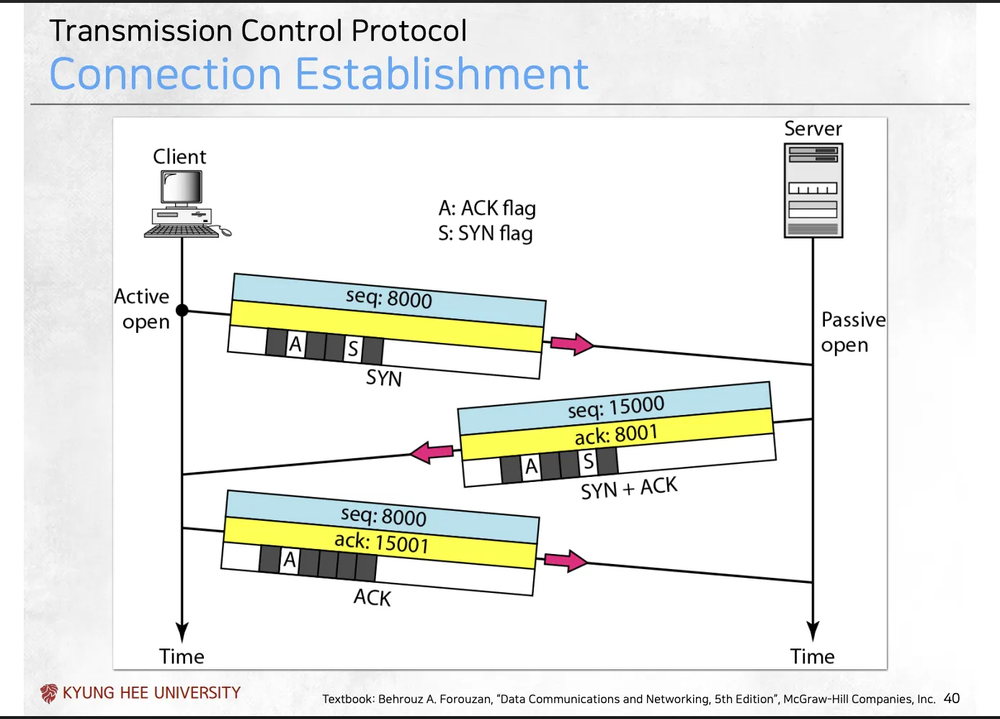

### TCP 3-Way Handshake

- TCP는 신뢰할 수 있는 양방향(full-duplex) 통신을 위해 연결을 맺을 때, 총 세 번의 패킷을 주고받는 3-Way Handshake 과정을 거침
**단계별 Three-Way Handshake**

1. 1단계 ⇒ Client → Server: SYN (연결 요청)
	- 클라이언트(Active Open)가 서버(Passive open)에게 연결을 요청
	- 이때 SYN 비트가 1로 설정된 세그먼트를 전송 → SYN비트가 1이면 연결 요청
	→ 이때 sequence number는 8000
	→ 저 그림의 A는 없음, 이때 세그먼트는 순수한 SYN

2. 2단계 ⇒ Server → Client: SYN + ACK (요청 수락 및 서버의 연결 요청)
	- 서버는 클라이언트에게 SYN(8000)을 받고, 이에 대한 응답(ACK)와 함께 자신도 클라이언트에게 연결을 요청하는(SYN) 세그먼트를 보냄
	- ACK: 연결 요청(SYN, 8000)을 잘 받았고, 이제 8001번을 기대한다는 의미로 acknowledge number를 8001로 설정
	- SYN: 서버 역시 자신의 고유한 Sequence Number를 생성해(seq=15000), SYN비트를 1로 설정해 보냄
	⇒ 이때 클라이언트 → 서버, 서버 → 클라이언트의 SYN요청을 통해 Full-Duplex 스트림이 생성

3. 3단계 ⇒ Client → Server: SYN(서버 요청 수락)
	- 클라이언트는 서버의 SYN+ACK(seq=15000, ack=8001)을 받은 상태
	- 클라이언트는 SYN(seq=15000)요청을 잘 받았고, 이제 15001번을 기대한다는 의미로 ACK비트를 1로, acknowledgement number=15001로 설정해 서버로 전송
	**⇒ 이 단계가 완료되면 양방향 연결이 모두 수립**

### Active Open ,Passive Open

1. Active Open ⇒ 먼저 연결을 시도하는 쪽
2. Passive Open ⇒ Active Open을 받아 이후에 연경르 요청하는 쪽

## TCP 연결 수립과 관련된 보안 이슈, 엣지케이스

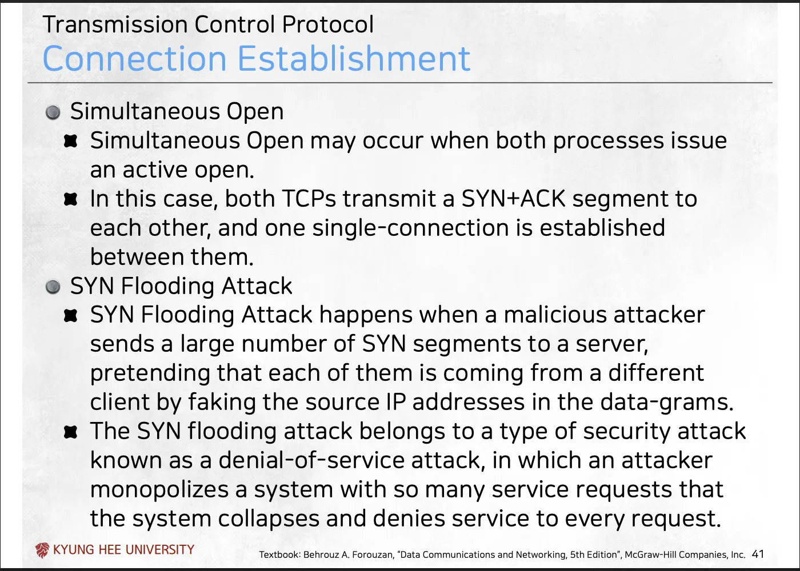

### 동시 연결(Simultaneous Open) → 엣지케이스

- 드문 경우지만, 두 프로세스가 모두 능동적 연결(active open)하는 경우가 있음
- 이 경우 양쪽 모두 서로에게 SYN+ACK를 전송하며, 결국 하나의 정상적인 양방향 연결이 수립

### SYN Flooding Attack

- 3-Way Handshake 과정의 허점을 이용한 것이 SYN Flooding
- 공격 원리
	1. 공격자가 1단계인 SYN 패킷을 대량으로 서버에 전송
	2. 이때 출발지 IP(Source IP)를 위조해 전송
	3. 서버는 위조된 IP로부터 대랭의 SYN 요청을 받고 2단계인 SYN+ACK를 위조된 IP로 전송
		- 이때 서버와 위조된 IP로 단방향 연결이 수립
		- 서버는 3단계 ACK가 오기를 기다리며 Half-Open 상태로 메모리(자원)를 할당
	4. 위조된 IP에서 3단계 ACK가 돌아오지 않으므로 서버 자원은 금방 고갈되어 DoS상태에 빠짐
- 방어 방법

## TCP의 데이터 전송

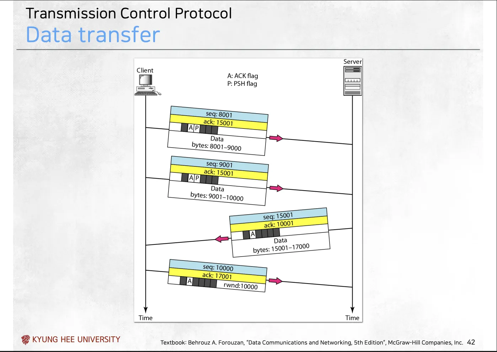

### TCP 데이터 전송 과정

- 연결이 수립된 이후, 데이터를 어떻게 주고 받는지 보여줌
1. 1단계 ⇒ Client → Server (Pushing Data)
	- 클라이언트가 seq=8001부터, bytes=8001~9000 (총 1000바이트)의 데이터를 전송
	- 이때 PSH플래그(P)가 1로 설정
	- 이전에 서버로부터 받은 데이터(seq=15000)에 대한 응답(ACK)으로 ack=15001을 함께 보냄 
		→ piggybacking

2. 2단계 ⇒ Client → Server (Pushign Data)
	- 클라이언트가 이어서 seq=9001부터 bytes-9001~10000(총 1000바이트)의 데이터를 보냄
	- 응답할 것이 없다면 ack=15001을 유지
3. 3단계 ⇒ Server → Client (ACK) + Data
	- 서버가 클라이언트로부터 총 2000바이트(8001~10000)을 받은 상태
	- 이제 1001번을 기대한다는 의미로 ack=10001을 보냄
	- 서버가 보낸 ack = 10001은 클라이언트가 보낸 10000번까지의 데이터를 모두 잘 받았다는 누적 응답(Cumulative ACK)
	- 이때 ACK와 Data는 함께 보내짐 ⇒ Piggybacking
4. 5단계 ⇒ Client → Server(ACK)
	- 클라이언트가 서버의 2000바이트를 잘 받고 이대 17001번을 기대한다는 의미로 ack=17001로 응답

### Piggybacking

- 데이터를 보낼 때 이전에 상대방에게서 받은 데이터에 대한 응답(ACK)을 별도 패킷으로 보내지 않고, 내가 보낼 데이터에 입혀서 함께 보내는 방식
- 이는 네트워크 효율성을 높여주는 방식
	- 내 데이터를 보내면서 상대에 대한 응답을 붙여넣는다고 비유
		→ 내 데이터(돼지) + 상대 대한 응답(돼지꼬리) → Piggybacking

### ACK 타이밍
→ 배운거 아님

1. 클라이언트가 데이터를 언제까지 보내는지 알 수 있는 방법
	- 3-way handshake과정에서 서버의 윈도우 크기를 클라이언트에게 알림, 클라이언트는 이걸 초과하지 않게 응답을 보냄
2. 서버는 언제 ACK를 보내는가
	- 서버는 데이터를 받으면 바로 ACK를 보내지 않고 짧은 시간을 대기 
		- 매번 보내면 네트워크 대역 낭비가 심함, Delayed ACK 방식
	- 이 시간 동안 추가 데이터가 도착하면 이것까지 누적한 후 마지막 데이터에 대한 ACK하나만 보냄
3. 패킷이 유실되면
	- 클라이언트는 데이터 보내고 재전송 타이머를 작동하고 이 시간 안에 ACK가 안오면 재전송
		- 추가 데이터 보낼 때 마다 리셋됨

## TCP 데이터 전송 

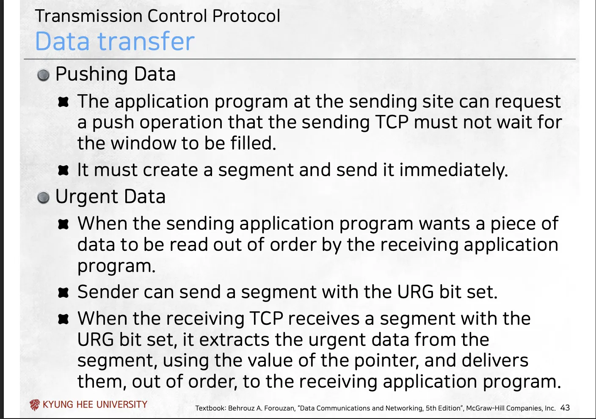

### 데이터 밀어 넣기(Pushing data)

- 송신 측의 애플리케이션은 윈도우가 채워질 때(=버퍼가 어느정도 찰 때) 또는 특정 시간이 지나면 한번에 보냄
- 그러나 데이터를 지금 당장 보내야 한다고 하는 경우가 있음
	- 이때 PSH 플래그를 1로 설정하면, TCP는 버퍼가 다 찰 때까지 기다리지 않고 세그먼트는 즉시 네트워크로 전송됨

### 긴급 데이터(Urgent Data)

- 특정 데이터 스트립 중에서 급한 데이터를 먼저 처리하라 알리는 기술
- 송신자는 URG비트가 설정된 세그먼트 전송 가능
- TCP 수신자가 URG비트가 설정된 세그먼트를 받으면, 포인터 값을 사용해 세그먼트에서 긴급 데이터를 추출하고, 순서와 무관하게 수신 애플리케이션으로 전달

## TCP 연결 해제

- 기본적으로 4-way handshake의 네 단계를 거침
- **진행 단계 (4-Way):**
	1. **\[Client → Server\] FIN:** 클라이언트가 "나는 더 이상 보낼 데이터가 없어"라고 FIN을 보냄
	2. **\[Server → Client\] ACK:** 서버는 "알았어. 너의 FIN 요청 잘 받았어"라는 확인(ACK)을 **즉시** 보냄
		- 이때 서버는 보낼 데이터가 남은 경우 곧장 자신의 FIN요청을 보내지 않음
			→ 그럼 Client → Server 방향의 연결만 끊어진 상황
		**\[... Half-Close 상태 ...\]**

		- 클라이언트 → 서버 방향은 닫혔지만, 서버 → 클라이언트 방향은 열려 있음
		- 서버는 이 열린 연결을 통해 남은 데이터(회색 박스)를 마저 클라이언트에게 전송
	3. **\[Server → Client\] FIN:** 서버가 자신의 데이터를 모두 보낸 후, "나도 이제 보낼 거 다 끝났어"라는 FIN을 보냄
	4. **\[Client → Server\] ACK:** 클라이언트가 서버의 FIN을 받고, "알겠어"라는 마지막 ACK를 보내면서 연결이 완전히 종료

### 경우에 따른 연결 종료 과정

1. 서버가 FIN요청을 받을 때 마침 남은 보낼 데이터가 없는 경우
	- 2단계와 3단계의 ACK, FIN을 함께 전송 → 4-way handshake이지만 실제로는 패킷 3개만 전송
2. 서버가 FIN요청을 받을 때 남은 보낼 데이터가 있는 경우
	- 그 경우 2단계(ACK)로 Client→Server 연결을 끊고, 대기
	- 이때 Server → Client는 연결이 유지, 이 연결로 남은 데이터를 전송
	- 이후 서버는 FIN요청을 Client로 전송

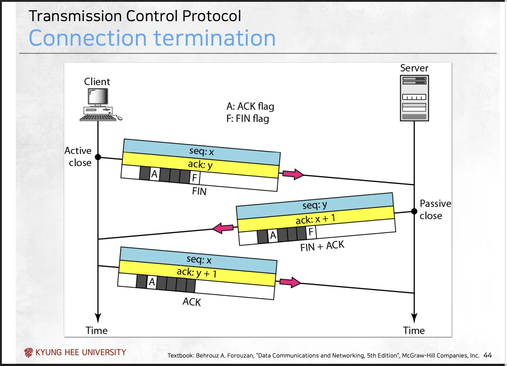

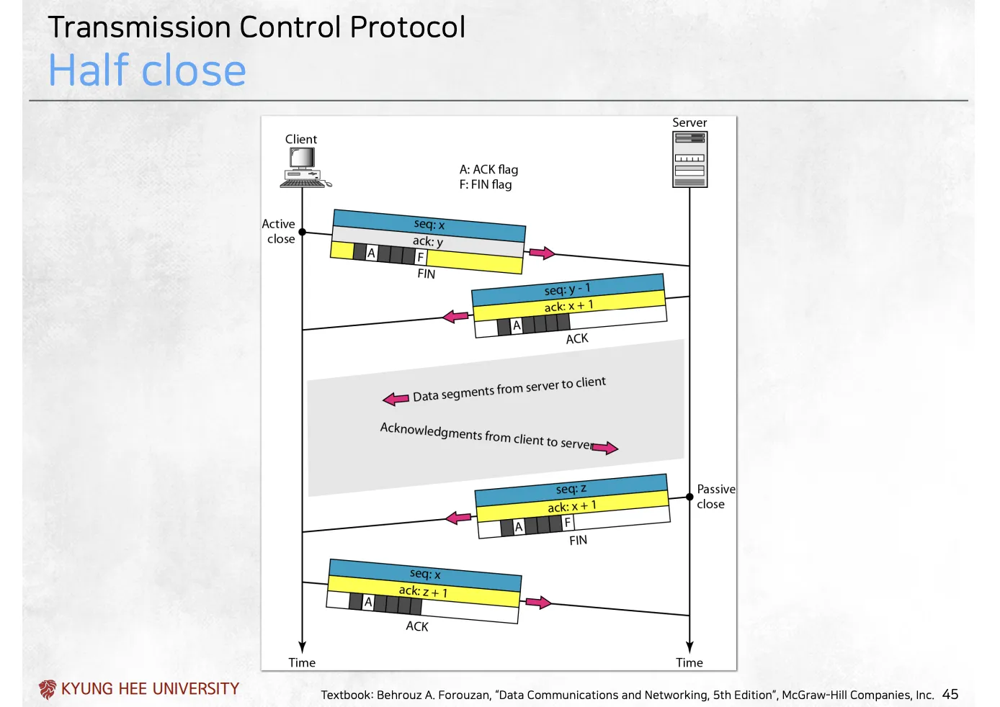

## TCP의 흐름 제어

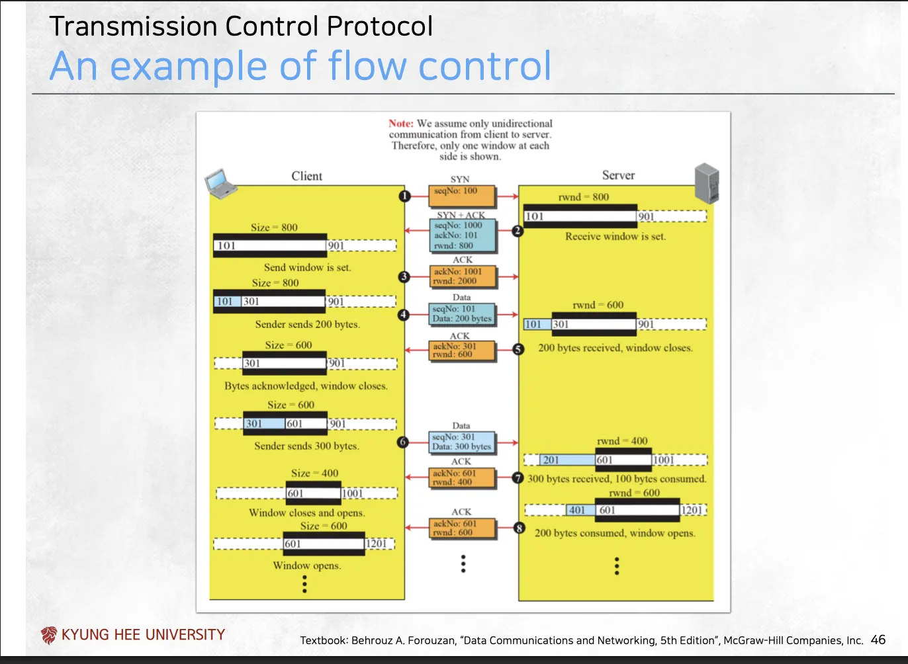

### 흐름 제어(Flow Control)

- 송신 측이 수신 측의 처리 속도보다 빠르게 데이터를 보내서 수신 측의 버퍼가 넘치는 것을 방지
	**⇒ 핵심은 수신 측이 자신이 현재 받을 수 있는 용량을 송신 측에 계속 알려주는 것**

- 흐름제어와 관련해 rwnd, swnd가 있음
	1. rwnd(Receive Window)
		- 수신 측(서버)이 가진 수신 버퍼의 남은 빈 공간 크기
		- 서버는 데이터를 받을 때 마다 이 rwnd값을 계산해 ACK패킷에 실어 클라이언트로 전송
	2. swnd(Send Window)
		- 송신 측(클라이언트)이 ACK응답을 기다리지 않고 한 번에 보낼 수 있는 데이터의 최대 크기
		- 이 swnd는 서버가 알려준 rwnd값과 동일하게 설정

### 흐름제어 다이어그램 예시

1. Client → Server ⇒ SYN (연결 요청)
2. Server → Client ⇒ SYN + ACK(연결 요청 수락 및 연결 요청)
	- 이때 Server의 rwnd도 같이 보냄 (ex. 800)
3. Client → Server ⇒ ACK(연결 요청 수락)
	- 이때 Client의 rwnd도 같이 보냄 (ex. 2000)
4. Client → Server ⇒ 데이터 전송
	- 클라이언트가 101~300 바이트 넘버의 200바이트를 보냄
5. Server → Client ⇒ 데이터 송신 확인(ACK)
	- 이때 ack number = 301(기대하는 바이트넘버)와 남은 rwnd인 800-200=600
6. 서버는 ACK=301를 받고 서버의 rwnd가 600으로 줄어든 것을 확인
	- 자신의 swnd도 600으로 갱신
	→ 이때 200을 뒤에서 줄이는게 아니라 앞에서 200만큼 줄임 → why? 다음에 기대하는건 301이니깐, 그냥 그걸 기준으로 한 것

7. 여기서 100바이트만큼 소비됨(애플리케이션에 의해) → rwnd에 +100
8. Client → Server ⇒ 데이터 전송 
	- 301~600까지 300바이트를 전송
9. Server → Client ⇒ ACK
	- 데이터 송신 ACK(ack=601)와 함께 rwnd 800 - 200 + 100 - 300 = 400
10. Client는 400으로 설정
11. 이런게 반복되다 애플리케이션이 데이터를 소비하지 않아 rwnd가 0이 되면 수신 중단
	- Server → Client로 rwnd가 0이라는 정보를 전송

## 일반적인 동작

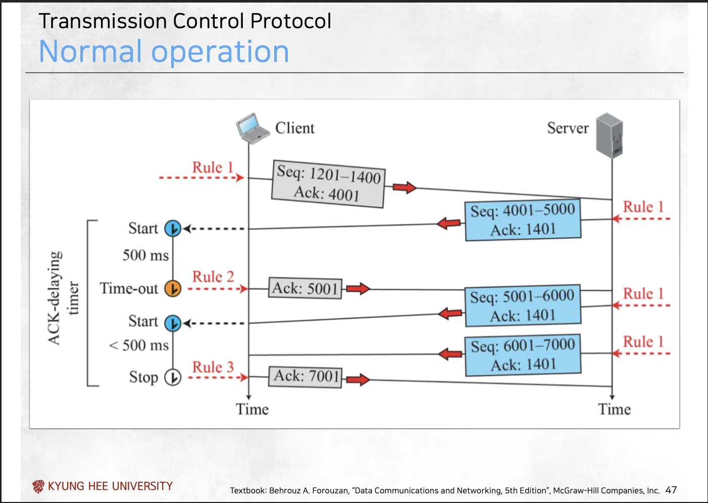

### 지연된 ACK(Delayed ACK)

- TCP는 데이터를 받을 때 마다 즉시 ACK를 보내는 것이 아님
	- ACK를 보내기 전에 짧은 시간(ex. 500ms) 동안 일부러 기다림
⇒ 지연된 ACK를 통해 아래 장점을 얻을 수 있음

	- 기다리는 동안 상대방에게 보낼 데이터가 생긴다면 ACK와 데이터를 함께 보내는 “Piggybacking”이 가능
	- 매번 ACK를 보내지 않아 네트워크 효율성도 높임
- 지연된 ACK의 단점
	- ACK를 기다리는 시간 때문에 단위 시간 안에 많은 데이터를 빠르게 주고받기 어려울 수 있음
- 즉각적 ACK의 장단점
	- 장점: ACK를 바로 보내면 버퍼 상태에 대한 피드백이 빨라져 전송 속도가 올라갈 수 있음
	- 단점: ACK패킷이 너무 많아져 데이터를 받는 쪽과 보내는 쪽 모두에게 부담이 될 수 있음

### ACK-delaying timer와 세가지 규칙

- ACK를 보내기 전까지 기다리는 시간을 재는 것이 ACK-delaying timer
1. Rule 1 → 서버의 piggybacking
	- 서버가 클라이어늩의 데이터를 받고, ACK를 바로 보내지 않고 기다리다가 자신의 데이터를 보낼 때 함께 보냄
	- 가장 효율적인 시나리온
2. Rule 2 → 클라이언트가 타이머 만료로 인해 순수한 ACK만 전송
	- 클라이언트가 서버의 데이터를 받고, ACK-delaying 타이머가 시작
	- 클라이언트는 이 시간 만큼을 기다렸지만, 그 안에 서버로 보낼 데이터가 생기지 않고 타이머가 만료
	- 클라이언트는 더 이상 기다릴 수 없어, ACK만을 담은 순수 ACK패킷을 보냄
3. Rule 3 → 타이머 만료 전 Piggybacking 성공
	- 클라이언트가 서버의 다음 데이터를 받음, ACK 지연 타이머가 다시 시작
	- ACK지연 타이머가 끝나기 전에 클라이언트에게 서버의 데이터가 다시 옴
	- 이때 즉시 스탑하고 누적된 ACK를 서버로 전송

## 패킷(세그먼트)을 유실한 경우

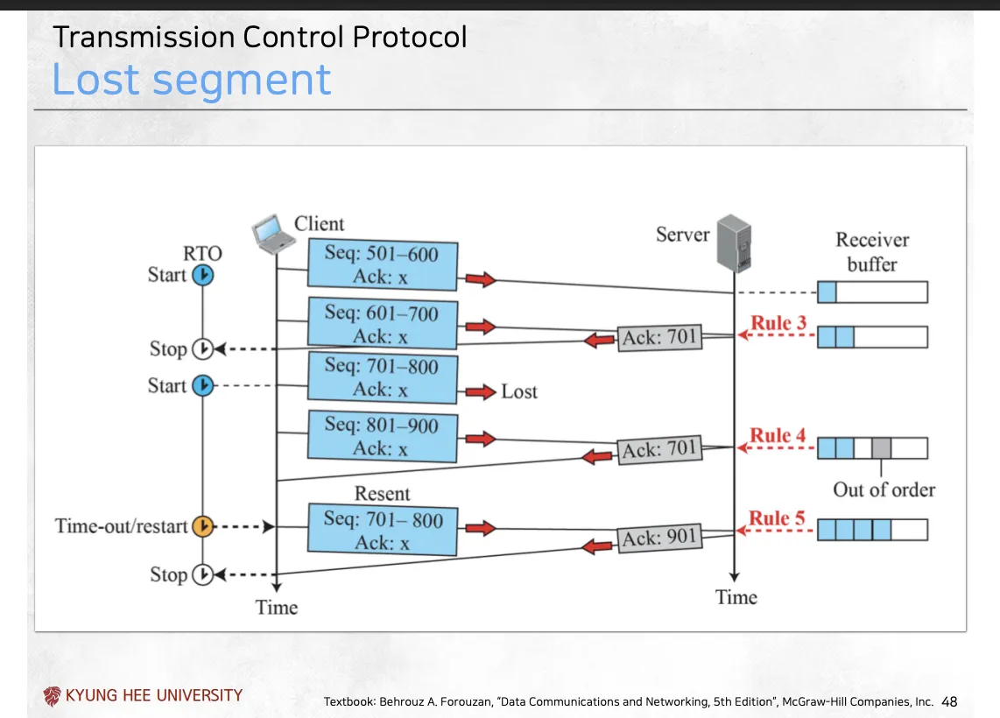

### ACK 손실 시나리오

1. 데이터 전송: 클라이언트가 데이터 세그먼트를 서버로 연속으로 전송
	- 이때 클라이언트는 첫 번째 패킷을 보낸 직후 RTO(Retransmission Timout, 재전송 시간 초과) 타이머를 시작
2. 서버에서 데이터에 대한 누적 ACK(701)을 클라이언트에게 전송
	- 이 패킷이 유실
3. 클라이언트의 RTO가 끝날 때 까지 서버의 ACK가 오지 않음
	- 패킷 유실로 판단
4. 701~800 패킷을 다시 전송
5. 이후 미리 보냈던 801~900까지 누적된 ACK(901)이 도착 → ACK로 받아들이고 재전송 하지 않음

## TCP의 혼잡제어(Congestion Control)

### 혼잡 제어(Conjestion Control)

- 네트워크가 처리할 수 있는 용량을 초과하는 데이터가 전송되어 발생하는 **네트워크 혼잡을 방지하고 관리**하기 위한 메커니즘

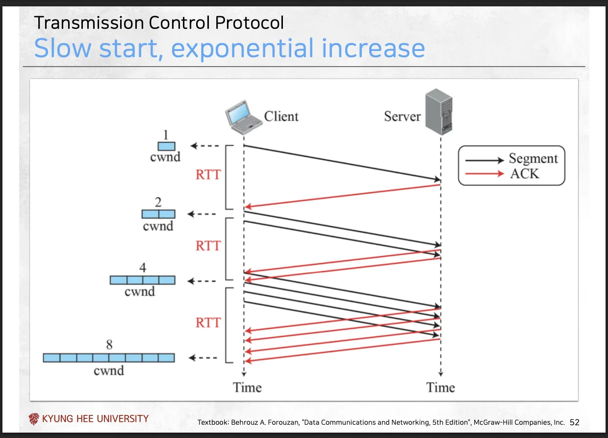

### Slow Start, exponential increase

- 연결이 막 시작 되었을 때 네트워크가 얼마나 감당하는지 알지 못해 지수적으로 보내는 양을 늘리게 함
- 1RTT(왕복시간)마다 cwnd(한번에 보내는 양)을 2배씩 늘림

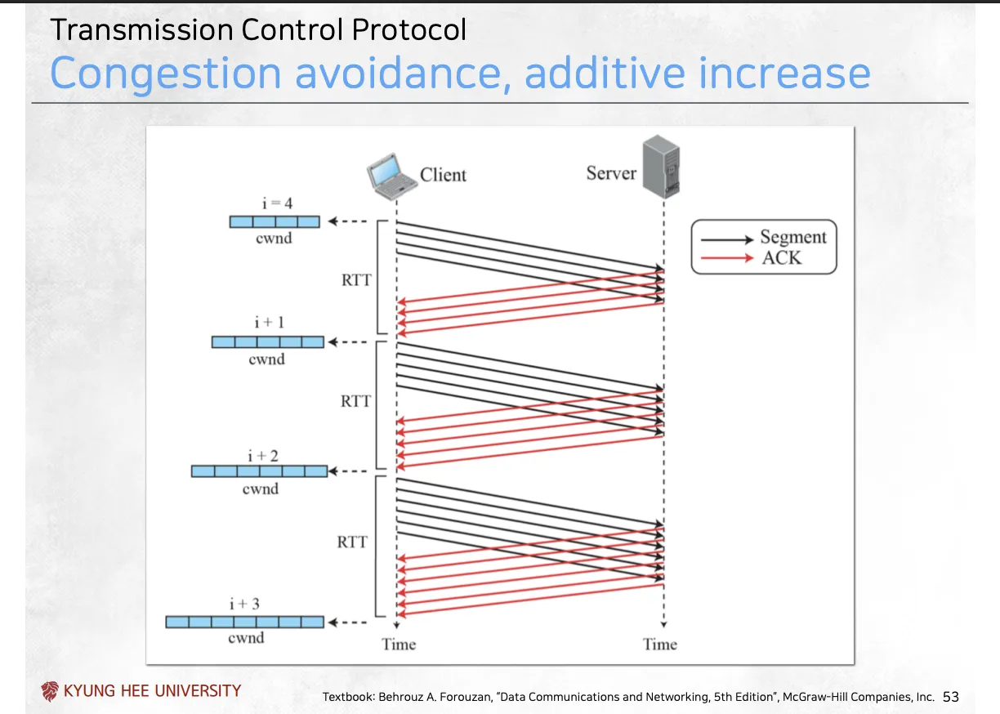

### Conjestion Avoidance, additive increase

- 초기 Slow start도 cwnd가 특정 임계값이 도달한 이후, 네트워크 혼잡을 피하면서 조심스럽게 속도를 올리기 위한 단계
- cwnd를 1RTT 마다 1MSS(1세그먼트씩)만 늘림 → additive increate(1씩 더하면서 증가)

## TCP성능이 들쭉날쭉한 이유

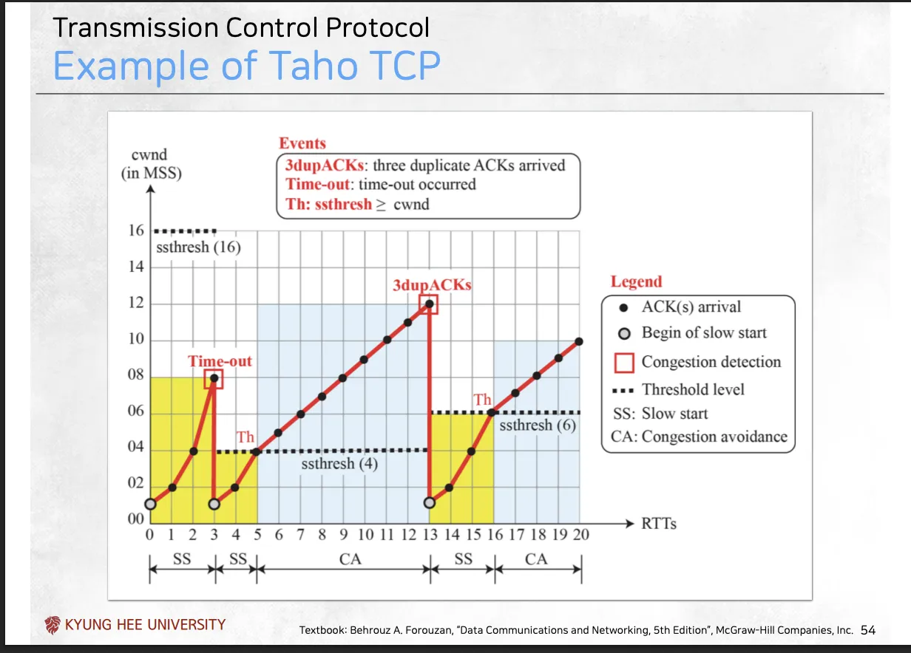

### Taho TCP

- Slow Start와 Conjestion Avoinace를 혼합한 TCP혼잡제어 알고리즘

### 위 다이어그램 해설

- 다이어그램 요소
	- X축, RTT(Round Trip Time, 데이터를 보냈다가 ACK를 받을 때 까지 시간)
	- Y축(cwnd), 송신 측이 ACK없이 한 번에 보낼 수 있는 데이터 양 → 곧 전송 속도
	- ssthresh → TCP에서 cwnd가 커질 수 있는 임계점
- Time-Out과 3dupACKs
	1. Time-out → 다이어그램의 RTT4
		- RTO타이머가 만료되어 ACK가 시간 내에 들어오지 않음
		- 이건 심각한 혼잡으로 간주되어 → cwnd를 1로 바꿈, 다시 Slow Start를 시작
	2. 3dupACKs → 다이어그램의 RTT12
		- 3개의 ACK가 중복 → 패킷 하나가 유실된 것 ⇒ 가벼운 혼잡 상황으로 간주
		- ssthresh를 현재 cwnd의 절반으로 설정
		- Taho는 cwnd를 1로 바꾸고 Slow Start를 시작

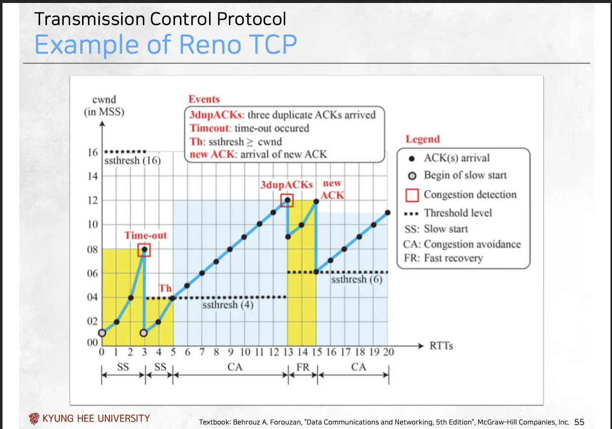

### Reno TCP

- 1990년에 Tahoe를 개선하여 개발
- **Tahoe와의 차이점**
	- **Fast Recovery** 추가: 3개의 중복 ACK(3dupACKs) 수신 시 cwnd를 1로 줄이지 않고 절반으로만 감소시킨 후 congestion avoidance 단계로 진입

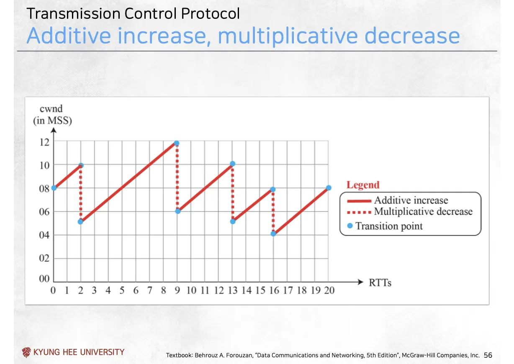

### TCP 성능이 둘쭉날쭉한 이유

1. TCP는 연결 시작 시(최초 연결 시) 네트워크 상태를 모르기 때문에 무조건 느리게 시작 ⇒ Slow Start
	- 이런 이유로 TCP가 제 속도가 올라올 때 까지 필요한 데이터를 미리 받아서 사용자가 체감하는 끊김을 숨기는 전략 ⇒ 버퍼링이 사용
2. TCP는 안정적으로 작동하다가도 네트워크 혼잡(패킷 유실)이 감지되면 속도를 일부러 떨어뜨림
	- 이게 Time-out, 3dupACKs이벤트
