> 원본 Notion 정리 — 강의 슬라이드 이미지 + 설명.

> [← 전체 목차](/posts/net-overview/)

***

### 목차
	## 1. Socket & Socket API의 이해

	- Network Socket 개념
	- Socket Programming 소개
	- Berkeley Socket API
 - API 함수 (1/3): socket, bind, listen, connect
 - API 함수 (2/3): accept, send, recv, close
 - API 함수 (3/3): gethostbyname, select, poll, getsockopt, setsockopt
	- TCP를 위한 Berkeley Socket API 절차
	## 2. 1:1 TCP Socket 프로그래밍

	- TCP Echo Server in Python (기본 예제)
	- TCP Echo Client in Python (기본 예제)
	- TCP Echo Client/Server 실행 화면
	- Socket API 함수 상세
 - socket function (1/2, 2/2)
 - bind function
 - listen function
 - accept function (1/2, 2/2)
 - connect function (1/2, 2/2)
	- TCP Echo Server in Python (개선된 예제)
	- TCP Echo Client in Python (개선된 예제)
	- TCP Echo Client & Server in C (예제)
	## 3. 1:N 동기식 & 비동기식 TCP Socket 서버 프로그래밍

	- TCP Echo Server 개선을 통한 비동기식 1:N 지원
 - Socket API 기반 개발 vs 언어별 차별화 기능
 - Python socketserver 활용
	- socketserver 기반 TCP Echo Server 개발
 - socketserver.TCPServer 소개
 - TCP 서버 만드는 절차
 - 예제 프로그램 및 문제점 분석
	- 비동기식 TCP socketserver 개발
 - 동기식 vs 비동기식 동작
 - Multi-Thread/Process 개념
 - ThreadingMixIn 활용
 - Request Handler 수정
 - Main Thread 설정 및 실행
 - 예제 프로그램 및 실행 화면
	- 다른 비동기식 개발 방법 (asyncio, selectors)
	## 4. N:M TCP 기반 비동기식 채팅 서비스 개발

	- 비동기식 TCP Chatting 서비스 개요
	- Server 변경 내용 (client 정보 관리, 브로드캐스트)
	- Client 변경 내용 (Thread 기반 송수신 분리)
	- 예제 프로그램 및 실행 화면
	## 5. 1:N UDP Socket 서버 프로그래밍

	- socketserver 기반 UDP Echo 서비스 개발
	- TCP vs UDP 차이점 (connection-less)
	- UDP Echo Client 개발
	- UDP Echo Server 개발
	## 6. N:M UDP 기반 채팅 서비스 개발

	- socketserver 기반 UDP 채팅 서비스 개요
	- Connection-less 특성에 따른 client 정보 관리
	- 등록/해제 프로토콜 (#REG, #DEREG)
	- 예제 프로그램 및 실행 화면
	## 7. SEASON #2 Examples

	- GUI 기반의 Chatting Program (PySimpleGUI)
	## 8. 심도 있는 Socket 기반 개발을 위한 추천 도서

	- UNIX TCP/IP 커널 코드 설명 & 개발
	- Linux TCP/IP 커널 코드 설명 & 개발
	- Python 네트워크 프로그래밍
	- C++ 네트워크 프로그래밍


***

# Socket

## Network Socket

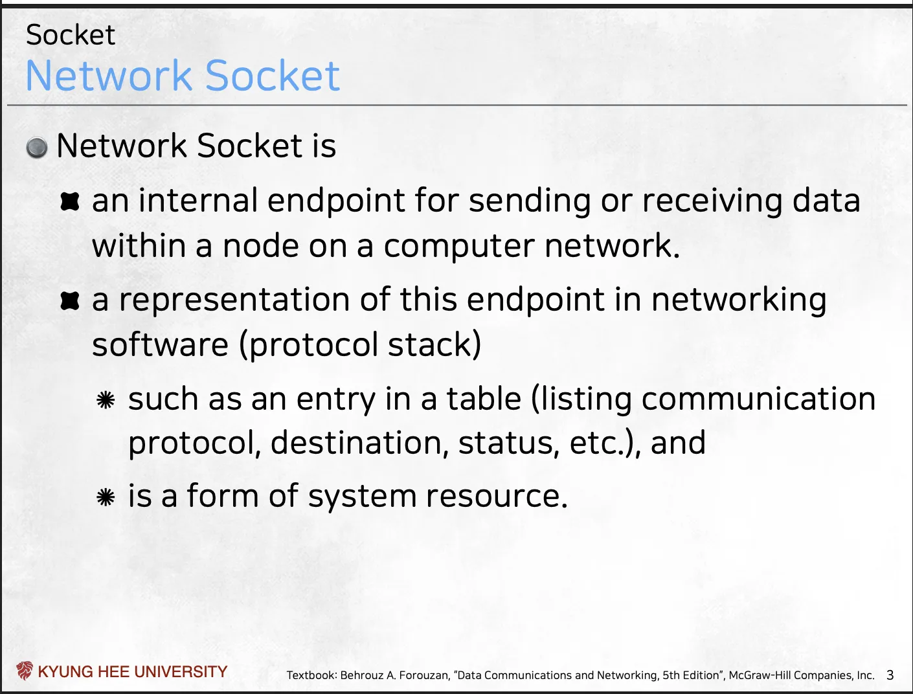

### 네트워크 소켓

- 컴퓨터 네트워크 상의 노드 내에서 데이터를 보내거나 받기 위한 내부 엔드포인트
- 네트워킹 소프트웨어(프로토콜 스택)에서 엔드포인트를 표현 하는 것
	- 통신 프로토콜, 목적지, 상태 등을 나열하는 테이블의 항목, 그리고 시스템 자원의 한 형태
	→ 운영체제(OS)가 네트워크 통신을 관리하기 위해 소프트웨어적으로 만들어낸 개념(객체), 시스템 자원
→ TCP/UDP + IP를 더한 것을 네트워크 소켓이라 보기도 함

	- IP Address + Port Number ⇒ Socket Address 인 것의 연장

## Socket Programming

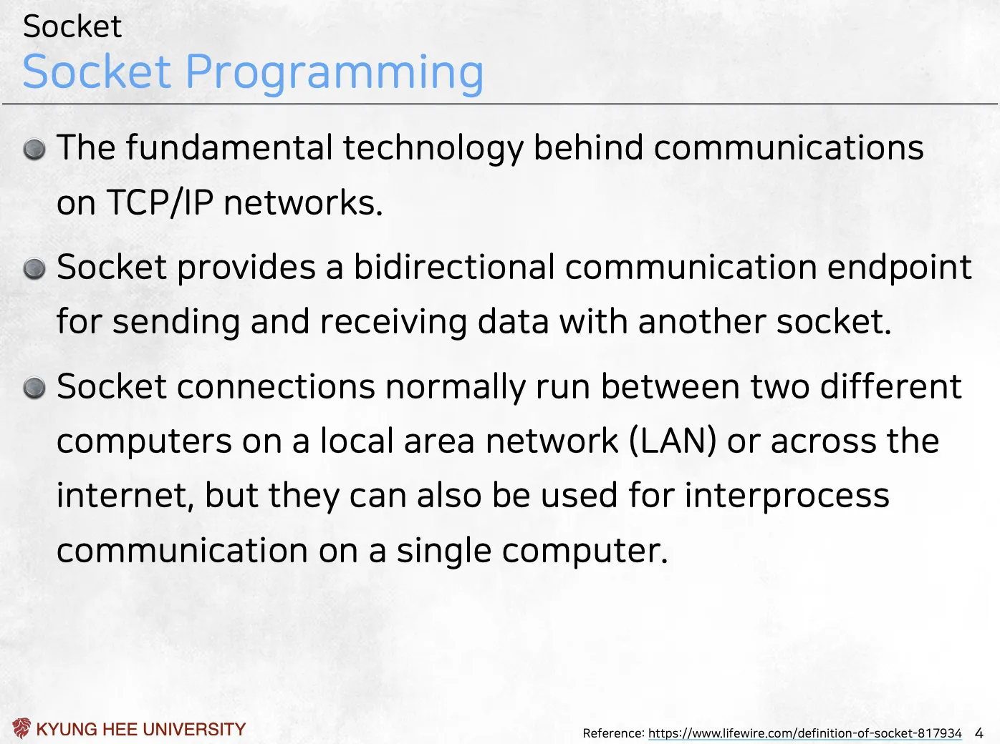

### 소켓 프로그래밍

- TCP/IP 네트워크 상의 통신 이면에 있는 근본적 기술
- 소켓은 다른 소켓과 데이터를 보내고 받기 위한 양방향 통신 엔드포인트를 제공
	→ 노드(점)와 노드(점) 사이 양방향 연결(소켓)

- 소켓 연결은 보통 LAN이나 인터넷을 통해 두 개의 다른 컴퓨터 사이에서 실행되지만, 단일 컴퓨터 상의 프로세스 간 통신(InterProcess Communication, IPC)을 위해서도 사용 가능

## 클라이언트, 서버 구조

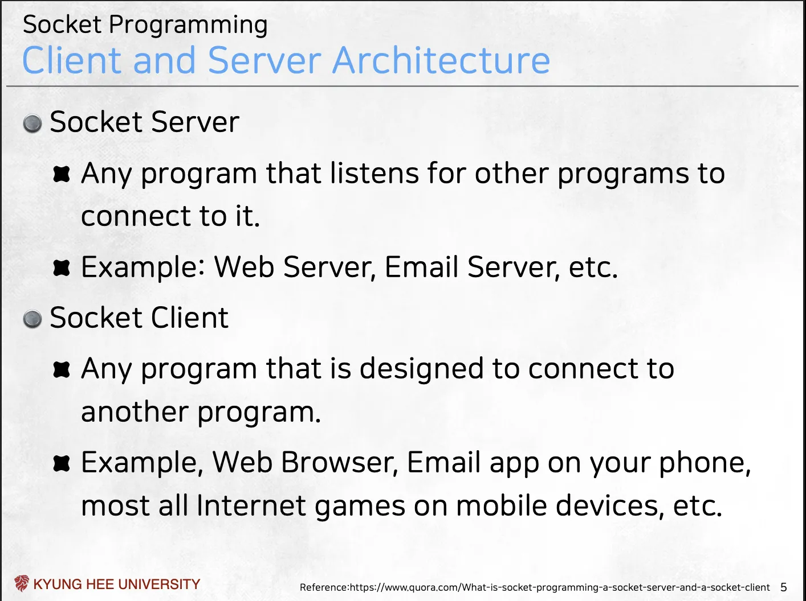

### 소켓 서버

- 다른 프로그램이 자신에게 접속하는 것을 기다리는 모든 프로그램
	- ex) 웹 서버, 이메일 서버
→ 소켓 서버는 먼저 실행되어, 클라이언트가 접속해오기를 **수동적으로 기다리는(listen)**프로그램

### 소켓 클라이언트

- 다른 프로그램에 접속하도록 설계된 모든 프로그램
	- ex) 웹 브라우저, 인터넷 게임 등
→ 소켓 클라이언트는 서버에게 **능동적으로 연결을 시도하는(connect)**프로그램

## Berkeley Socket API

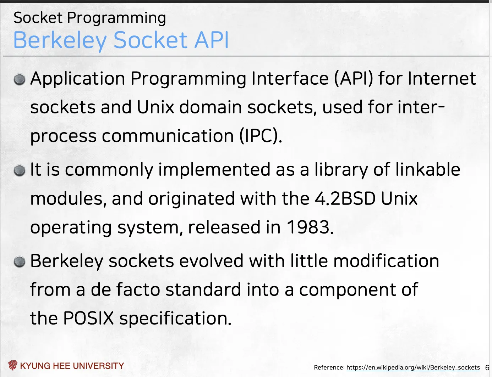

### 버클리 소켓 API

- 인터넷 소켓과, IPC에 사용되는 유닉스 도베인 소켓을 위한 API
- 일반적으로 링크 가능한 모듈의 라이브러리로 구현, 83년도에 출시된 BSD 유닉스에서 유래
- 버클리 소켓은 약간의 수정을 거쳐 사실상의 표준에서 POSIX구성 요소로 발전
→ API는 함수, 버클리 소켓 API는 소켓 프로그래밍에 사용 가능한 함수들의 목록

## Berkeley Socket API 함수

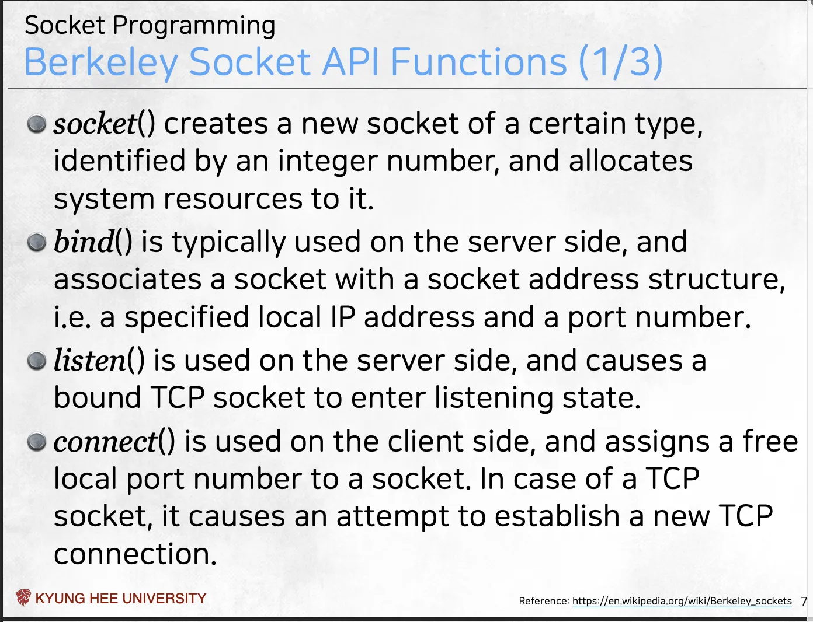

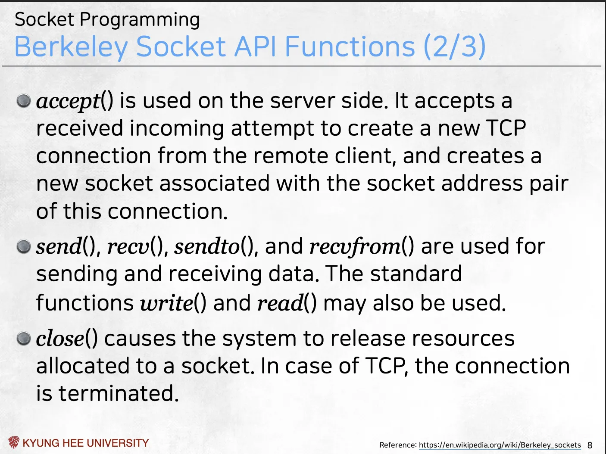

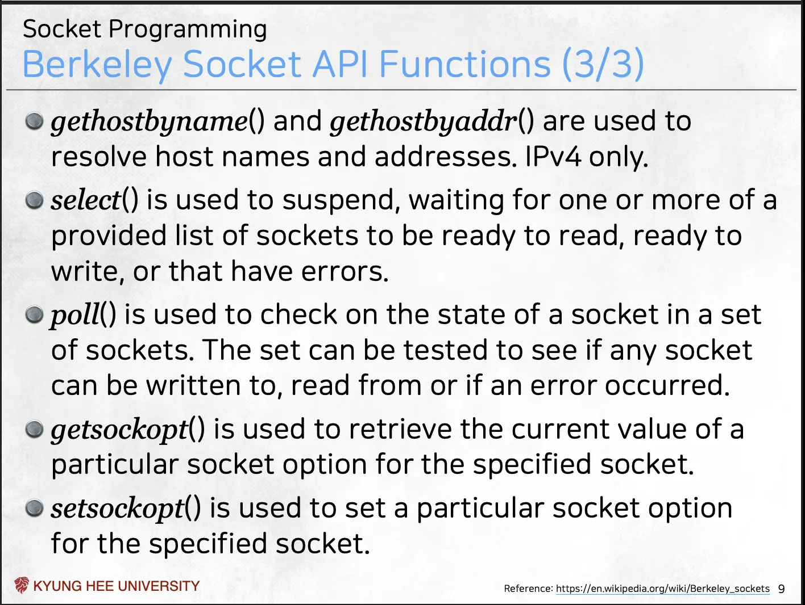

### 1. 서버 1단계: 준비 (레스토랑 개점 )
서버가 먼저 실행되어 클라이언트의 접속을 기다릴 준비를 합니다.

### `socket` (가게 계약)

- **\[직역\]**: "특정 타입의 새로운 소켓을 생성하고, 정수(integer)로 식별되며, 시스템 자원을 할당한다."
- **\[설명\]**: 운영체제(OS)에게 "네트워크 통신을 위한 창구(소켓)를 하나 만들어줘"라고 요청하고 시스템 자원을 할당받습니다.

### `bind` (간판 달기)

- **\[직역\]**: "전형적으로 서버 측에서 사용되며, 소켓을 소켓 주소 구조체, 즉 지정된 로컬 IP 주소 및 포트 번호와 연결(연관)시킨다."
- **\[설명\]**: "이 소켓은 **이 IP와 이 포트 번호**(예: 80번)로 오는 손님만 받겠다"고 OS에 등록(바인딩)합니다.

### `listen` (영업 시작)

- **\[직역\]**: "서버 측에서 사용되며, 바인드된(bound) TCP 소켓이 리스닝(listening) 상태로 들어가게 한다."
- **\[설명\]**: "이제 손님 받을 준비(영업 시작) 됐다"고 OS에 알리고, 클라이언트의 접속 요청을 기다리는 대기 상태가 됩니다.

### 2. 클라이언트 1단계: 접속 (손님 방문 )
클라이언트가 서버에 능동적으로 연결을 시도합니다.

### `socket` (손님의 전화기)

- **\[직역\]**: "특정 타입의 새로운 소켓을 생성하고, 정수(integer)로 식별되며, 시스템 자원을 할당한다."
- **\[설명\]**: 클라이언트도 서버와 통신하기 위해 OS로부터 자신의 '창구'(소켓)를 할당받습니다.

### `connect` (전화 걸기)

- **\[직역\]**: "클라이언트 측에서 사용되며, 비어있는(free) 로컬 포트 번호를 소켓에 할당한다. TCP 소켓의 경우, 새로운 TCP 연결을 수립하려는 시도를 유발한다."
- **\[설명\]**: 서버가 `bind`하고 `listen` 중인 (IP, 포트)를 향해 "연결해 줘!"라고 능동적으로 요청을 보냅니다.

### 3. 서버 2단계: 연결 수락 (주문 받기 )
서버가 `listen` 대기열에 들어온 클라이언트의 요청을 수락합니다.

### `accept` (전담 직원 배정)

- **\[직역\]**: "서버 측에서 사용된다. 원격 클라이언트로부터의 새로운 TCP 연결 생성 시도를 수신하고 수락하며(accepts), 이 연결의 소켓 주소 쌍(pair)과 연관된 **새로운 소켓**을 생성한다."
- **\[설명\]**: 대기 중인 클라이언트의 연결 요청을 수락합니다. **(중요!)**이 함수는 해당 클라이언트와 1:1로 통신할 **'새로운 통신용 소켓'**을 반환합니다. 기존의 `listen` 소켓(가게 정문)은 계속해서 다른 손님을 받기 위해 대기합니다.

### 4. 3단계: 데이터 통신 (대화 )
`connect`된 클라이언트 소켓과 `accept`로 생성된 서버의 새 소켓 간에 데이터를 주고받습니다.

### `send` / `recv` (데이터 송수신)

- **\[직역\]**: "데이터를 보내고(sending) 받는(receiving) 데 사용된다. 표준 함수인 `write`와 `read` 또한 사용될 수 있다."
- **\[설명\]**: 클라이언트가 요청을 `send(보내기)`하고 서버가 `recv(받기)`하거나, 서버가 데이터를 `send`하고 클라이언트가 `recv`하는 등 양방향으로 데이터를 교환합니다.

### 5. 4단계: 연결 종료 (퇴장 및 마감 )
통신 목적이 달성되면 사용했던 자원을 반납합니다.

### `close` (연결 종료)

- **\[직역\]**: "시스템이 소켓에 할당된 자원을 해제(release)하도록 한다. TCP의 경우, 연결이 종료(terminated)된다."
- **\[설명\]**: 통신이 끝난 **클라이언트와 서버 양쪽 모두**이 함수를 호출하여, "이제 통신 끝났으니 소켓 자원 회수해가"라고 OS에 알립니다.
***

## TCP에서의 Berkeley Socket API 절차

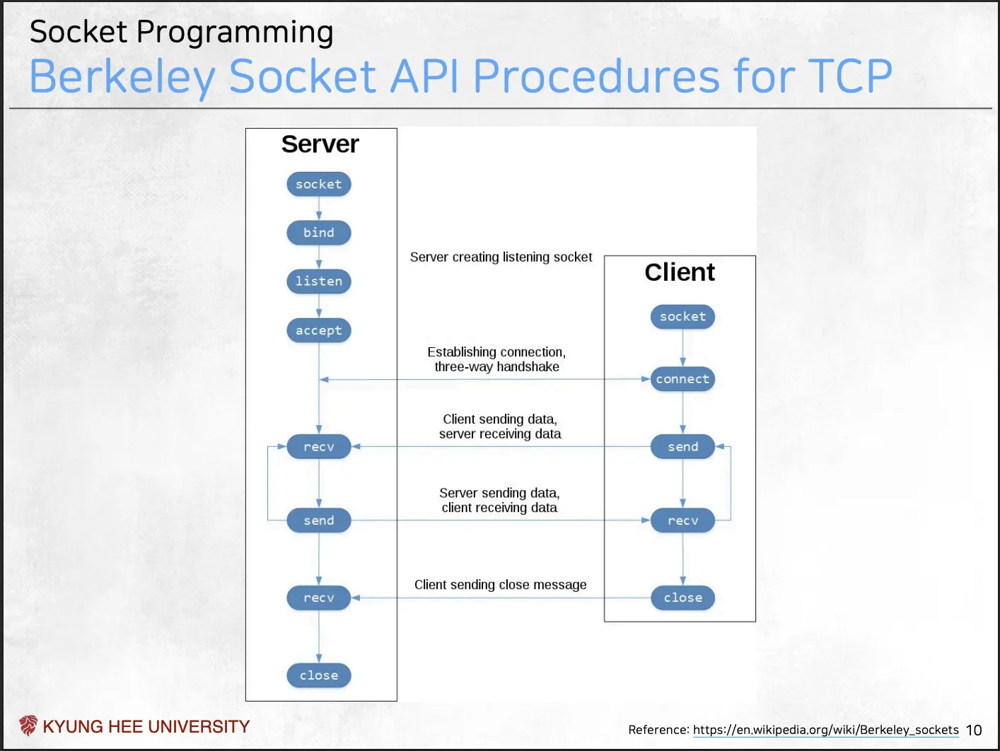

### **서버 측 순서**

1. **socket**→ 소켓 생성
2. **bind**→ IP 주소와 포트 번호를 소켓에 바인딩
3. **listen**→ 클라이언트 연결 대기 상태로 전환
4. **accept**→ 클라이언트 연결 요청 수락
5. **recv**→ 클라이언트로부터 데이터 수신
6. **send**→ 클라이언트에게 데이터 전송
7. **recv**→ 종료 메시지 수신
8. **close**→ 연결 종료

### **클라이언트 측 순서**

1. **socket**→ 소켓 생성
2. **connect**→ 서버에 연결 요청 (3-way handshake)
3. **send**→ 서버에 데이터 전송
4. **recv**→ 서버로부터 데이터 수신
5. **close**→ 연결 종료 메시지 전송
6. **연결 종료**

### 다이어그램의 순서

1. `socket` : 서버가 OS에게 소켓 생성을 요청, 이를 정수로 식별
	- IP는 서버의 호스트의 IP, 포트 넘버는 서버가 OS에게 할당요청
2. `bind` : OS가 서버의 소켓에 IP주소와 포트 넘버를 명시적으로 바인딩
	- 이후 해당 포트로 들어오는 연결을 이 소켓으로 라우팅
3. `listen` : 서버가 준비가 끝났고, 클라이언트를 대기하는 상태
4. `socket` : 클라이언트가 통신용 소켓 생성 → 이때 포트번호는 OS가 자동으로 할당(ephemeral port)
	→ 아직 연결되지는 않은 상태

5. `connect` : 클라이언트가 서버의 IP주소와 포트 넘버(소켓 주소)로 연결 요청
	- 이때 3-way handshake 시작
6. `accept` : 대기 중이던 서버가 클라이언트의 연결 요청을 수학
	- 이때 서버는 이 클라이언트 전용의 소켓을 샡성
	- 원래의 listening 소켓은 다른 클라이언트 대기
	- 이때 클라이언트의 IP 주소와 Port number를 반환
	⇒ 여기까지가 연결 수립 단계

7. client가 server에게, server가 client에게 `send -> recv` 를 반복
	⇒ 정보를 주고 받는 단계

8. `close` : 클라이언트가 연결 종료 메시지를 서버로 전송
	→ FIN패킷 전송

	- 이후 연결 종료
9. `recv` : 서버가 클라이언트의 종료 신호 감지
10. `close`: 서버도 소켓을 닫음
	⇒ 서버의 종료 단계
***

# Socket Programming 1:1

## TCP Echo Server
```python
import socket

HOST = '127.0.0.1'
PORT = 65456

print('> echo-server is activated')

with socket.socket(socket.AF_INET, socket.SOCK_STREAM) as serverSocket:
    serverSocket.bind((HOST, PORT))
    serverSocket.listen()

    clientSocket, clientAddress = serverSocket.accept()
    with clientSocket:
        print('> client connected by IP address {0} with Port number {1}'.format(clientAddress[0], clientAddress[1]))

        while True:
            # [=start=]
            RecvData = clientSocket.recv(1024)
            print('> echoed:', RecvData.decode('utf-8'))
            clientSocket.sendall(RecvData)
            if RecvData.decode('utf-8') == 'quit':
                break
            # [==end==]
            
print('> echo-server is de-activated')
```

### 역할

- 서버는 클라이언트의 연결 요청을 기다리고, 연결이 수립되면 클라이언트가 보낸 메시지를 그대로 다시 돌려보내는(에코) 역할

### 코드 설명
```python
 import socket
```

- 네트워크 통신에 필요한 **소켓(socket) 모듈 임포트**
```python
HOST = '127.0.0.1'
PORT = 65456
```

- 서버가 사용할 IP 주소(HOST)와 **포트(PORT) 번호**를 설정 → 소켓 어드레스를 설정
```python
with socket.socket(socket.AF_INET, socket.SOCK_STREAM) as serverSocket:
```

- **서버 소켓**을 생성
- `with` 구문을 사용하여 이 블록이 끝나면 소켓이 자동으로 닫히도록(close) 함
- `AF_INET`: **IPv4**주소 체계를 사용
	→ 첫 번째 인자는 ip주소체계 → socket.AF_INET6(IPv6), socket.AF_UNIX(Unix 도메인 소켓) 등 가능

- `SOCK_STREAM`: **TCP**프로토콜을 사용
	→ 두 번째 인자는 소켓 타입(TCP) 타입

 - socket.SOCK_DGRAM, socket.SOCK_RAW 등이 가능
 - socket.SOCK_STREAM은 TCP로, TCP가 연결지향이기 때문
```python
	serverSocket.bind((HOST, PORT))
	serverSocket.listen()
```

- HOST, PORT를 서버 소켓에 할당 = bind
- 이후 클라이언트의 접속 요청을 대기 = listen
```python
	clientSocket, clientAddress = serverSocket.accept()
```

- 클라이언트 연결 요청이 올 떄 까지 대기(blocking)하고, 연결이 들어오면 클라이언트와 통신을 담당할 소켓과, 클라이언트의 주소 정보를 반환
	→ 기존 소켓은 계속 요청 대기, 새 소켓을 만들어 사용
```python
with clientSocket:
		while True:
          # [=start=]
          RecvData = clientSocket.recv(1024)
          print('> echoed:', RecvData.decode('utf-8'))
          clientSocket.sendall(RecvData)
          if RecvData.decode('utf-8') == 'quit':
              break
          # [==end==]
```

- with 구분으로 생성된 클라이언트를 자동으로 닫히게 함
- 아래에서 무한 루프를 통해 클라이언트와 지속적으로 통신
	- `clientSocket.recv(1024)`: 클라이언트로부터 데이터를 **수신**
 - 파라미터는 한번에 받는 최대의 바이트
	- `clientSocket.sendall(RecvData)`: 수신한 바이트 데이터(`RecvData`)를 **그대로**클라이언트에게 **다시 전송**(에코)
- quit이라는 메시지를 받으면 break로 무한반복 종료
	- with구분으로 client소켓 닫고, 그 상단의 서버 소켓도 닫게 됨

## TCP Echo Client
```python
import socket

HOST = '127.0.0.1'
PORT = 65456

print('> echo-client is activated')

with socket.socket(socket.AF_INET, socket.SOCK_STREAM) as clientSocket:
    clientSocket.connect((HOST, PORT))

    while True:
        sendMsg = input('> ')
        clientSocket.sendall(bytes(sendMsg, 'utf-8'))
        recvData = clientSocket.recv(1024)
        print('> received:', recvData.decode('utf-8'))
        if sendMsg == "quit":
            break

print('> echo-client is de-activated')
```

### 역할

- 위의 TCP서버와 쌍을 이루는 클라이언트
- 연결을 요청하고 데이터를 전송하고 응답받는 역할

### 코드 설명
```python
import socket
```

- 네트워크 통신 위한 소켓 모듈 임포트
```python
HOST = '127.0.0.1'
PORT = 65456
```

- 접속할 서버의 IP주소(HOST)와 포트번호를 정의
```python
with socket.socket(socket.AF_INET, socket.SOCK_STREAM) as clientSocket:
```

- 클라이언트 소켓을 설정, with구문으로 스코프를 나갈 시 자동 닫기
- 동일하게 IPv4, TCP소켓으로 설정
```python
clientSocket.connect((HOST, PORT))
```

- 클라이언트 소켓으로 위에서 설정한 HOST, Port로 연결 요청
```python
		while True:
        sendMsg = input('> ')
        clientSocket.sendall(bytes(sendMsg, 'utf-8'))
        recvData = clientSocket.recv(1024)
        print('> received:', recvData.decode('utf-8'))
        if sendMsg == "quit":
            break
```

- 무한루프로 계속해서 사용자에게 입력을 받고 `sendall`로 메시지를 보내고, 응답을 받아서 이를 출력
- quit을 입력받으면 → sendall로 서버에게 전송한 후 스스로 break
→ 위 코드들에서는 close만 명시적으로 호출하지 않음

## TCP Echo 서버 실행 예시

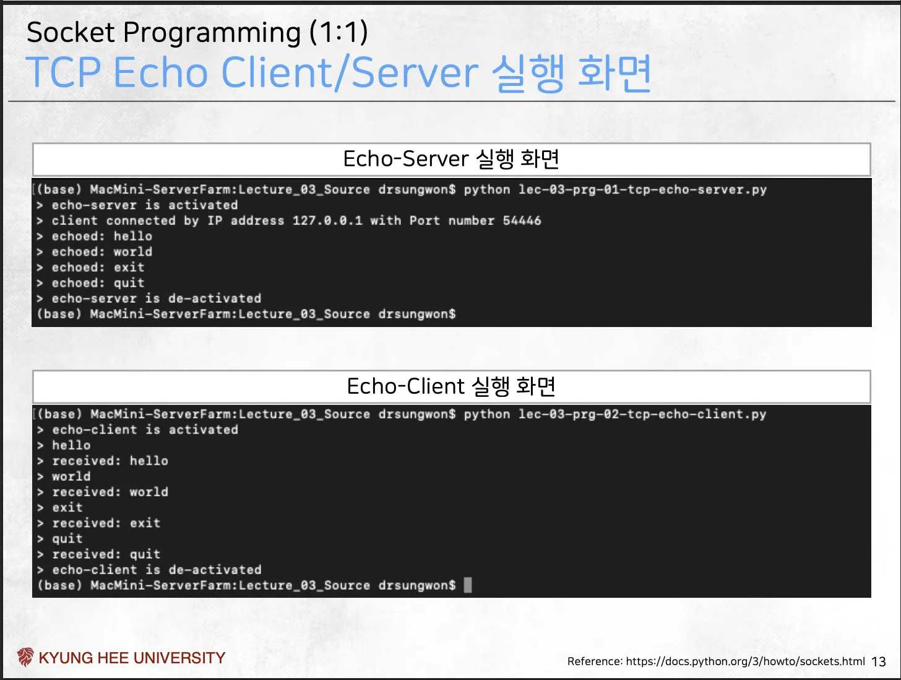

## socket 함수

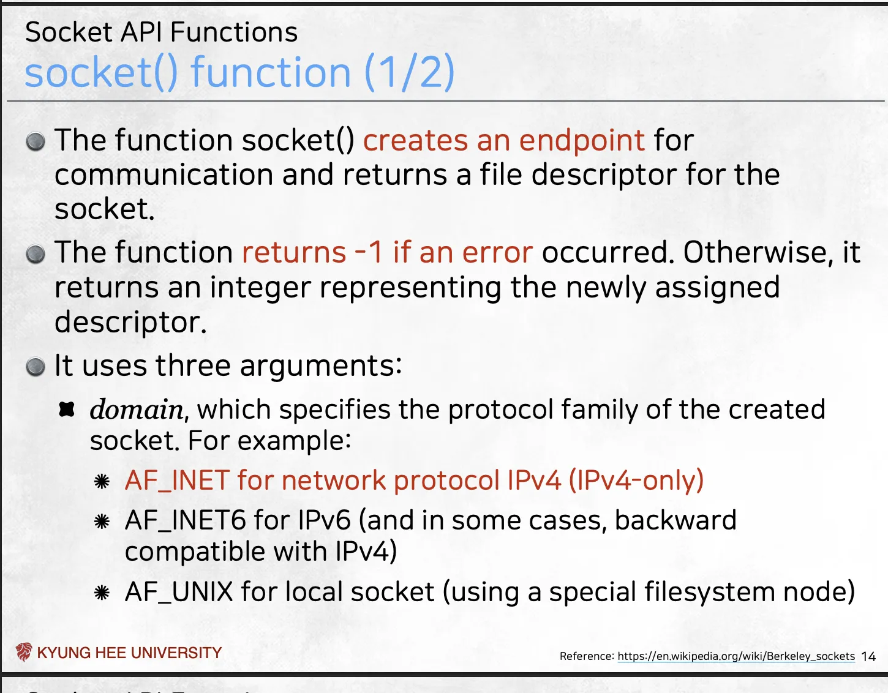

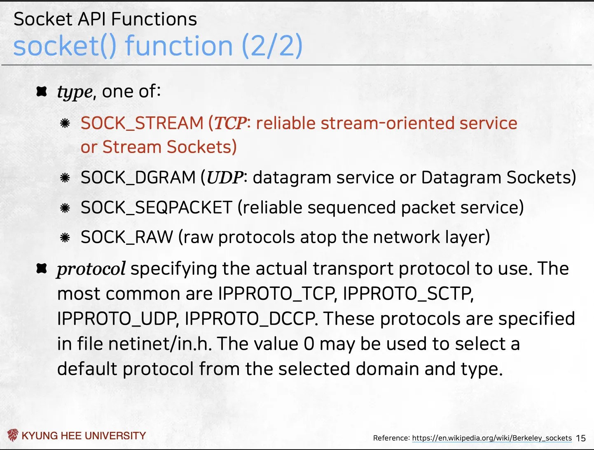

### socket 함수

- 통신을 위한 엔드포인트를 생성하고 해당 소켓의 파일 디스크립터(정수 번호)를 반환
	- 에러 발생 시 -1을 반환, 성공 시 새로 할당된 디스크립터를 나타내는 정수를 반환

### socket 함수의 파라미터
→ 세 가지 파라미터가 존재

1. domain
	- 생성될 소켓의 프로토콜 체계 지정 → 이 소켓의 3게층 프로토콜 지정
	- AF_INET(IPv4), AF_INET6(IPv6), AF_UNIX(로컬 소켓 → 특수 파일시스템 노드 등)
2. type
	- 생성될 소켓의 타입을 지정 → 이 소켓의 4계층 프로토콜 지정
	- SOCK_STREAM(TCP, 연결 지향형), SOCK_DGRAM(UDP, 비연결형 데이터그램 서비스), SOCK_RAW(L4가 아닌 네트워크 레이어의 원시 프로토콜)
3. protocol
	- 실제 사용할 전송 프로토콜
	- 비워두면 0이 들어가고, 선택한 도메인과 타입의 조합에서 기본으로 설정된 프로토콜 사용
 → ex) AF_INET, SOCK_STREAM ⇒ TCP

## bind 함수

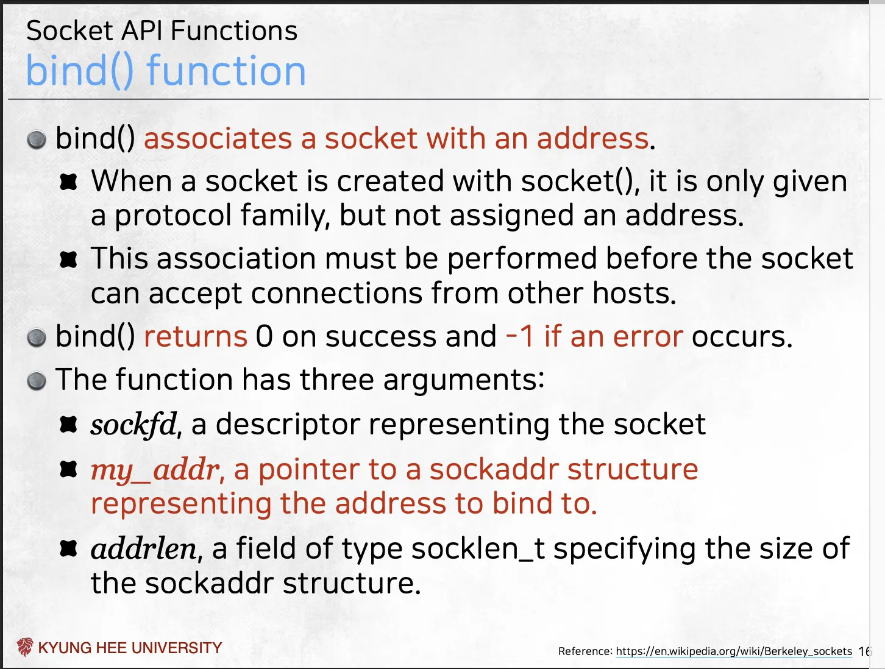

### bind 함수

- 소켓을 주소와 연결하는 함수
- socket으로 소켓 생성 시 프로토콜 체계만 정의 → 주소 할당이 필요
- bind(연결) 작업은 소켓이 다른 호스트로부터 연결을 수락하기 전에 수행되어야 함
- 성공시 0, 실패시 -1을 반환

### bind 함수 파라미터
→ 세 개의 파라미터를 가짐

1. sockefd ⇒ 소켓을 나타내는 디스크립터
2. my_addr ⇒ 바인딩할 주소를 나타내는 sockaddr구조체를 나타내는 포인터
3. addrlen: sockaddr 구조체의 크기를 지정하는 socklen_t타입의 필드
→ 여기서 필수는 (HOST, PORT)의 형태(튜플, 또는 구조체)로 넘어가는 소켓 어드레스 뿐
	→ sockfd는 필수가 아니라 기본적으로 객체지향으로 내부 상태로 넘어감

## listen 함수

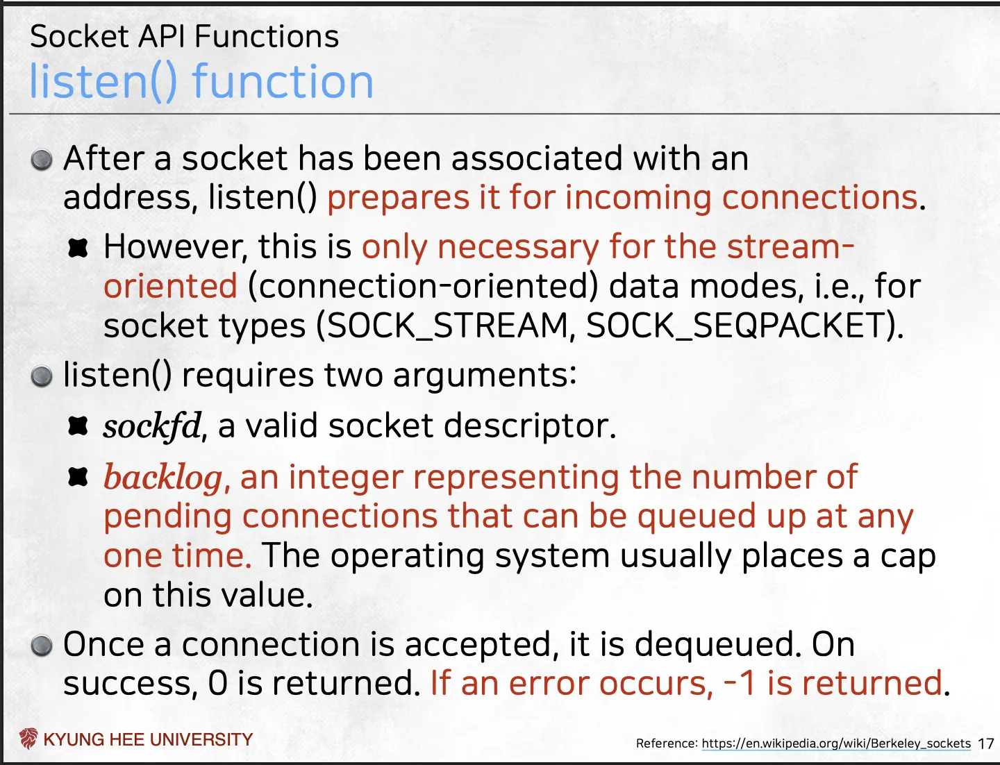

### listen 함수

- 소켓이 bind를 통해 주소와 연결된 후, listen 함수는 이 소켓이 들어오는 연결을 받을 수 있게 준비시킴
- 이는 연결 지향형 모드인 소켓에서만 사용됨
	→ 비연결형(데이터그램 서비스)인 서비스는 연결 개념이 없어 들어온 데이터가 연결 대기 큐가 아닌 수신 큐로 곧장 들어옴
	→

- 이 listen은 큐를 만드는 과정
	→ 연결 요청은 이 큐에 쌓이게 됨

### listen 함수의 파라미터

- sockfd → 유효한 소켓 디스크립터 번호
- backlog → 동시에 큐에 대기 가능한 연결의 수, 보통 OS단에서도 여기에 제한을 검
	- 클라이언트와 서버가 N:1이면 연결 요청들이 이 큐에 들어옴

## accept 함수

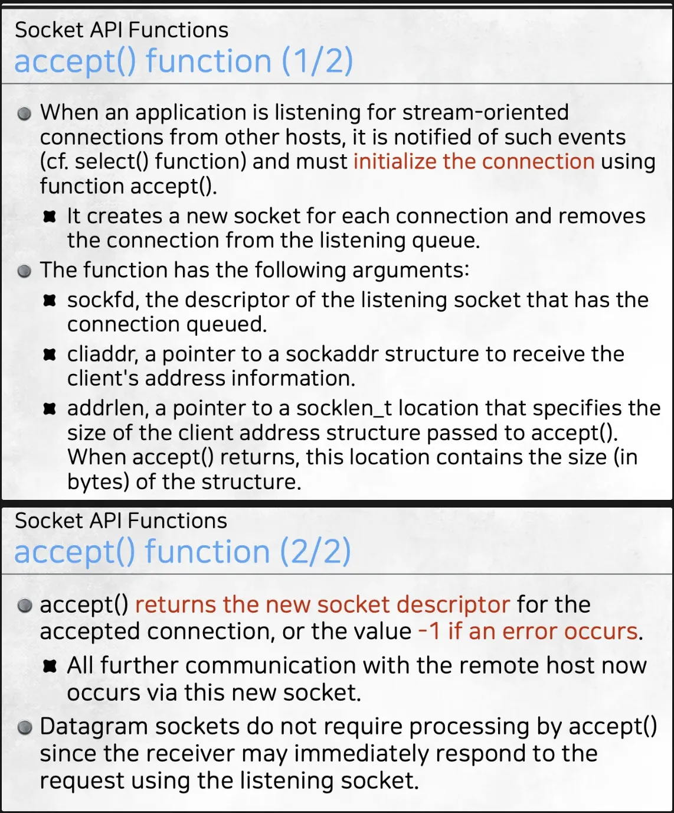

### accept 함수

- 애플리케이션이 다른 호스트로부터 스트림 지향(TCP) 연결을 `listen`(수신 대기)하고 있을 때, 그런 이벤트(연결 요청)를 통지받으면 반드시 `accept` 함수를 사용하여 **연결을 초기화해야함**
- 연결에 대해 새로운 소켓을 생성하고 listen 큐에서 해당 연결 제거
- 수락된 연결에 대한 새로운 소켓 디스크립터를 반환하거나 에러가 발생하면 -1을 반환
	→ 연결 요청이 들어올 때 까지 프로그램을 멈추고 대기

### accept의 파라미터

- sockfd → 연결 큐를 가진 수신 대기 소켓의 디스크립터
- cliaddr → 쿨라이언트의 주소 정보를 받기 위한 포인터
- addrlen → 클라이언트 주소 구조체 크기를 지정하는 속성을 가리키는포인터

## connect

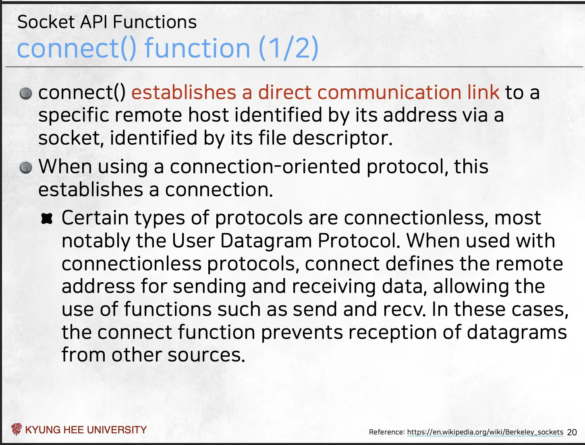

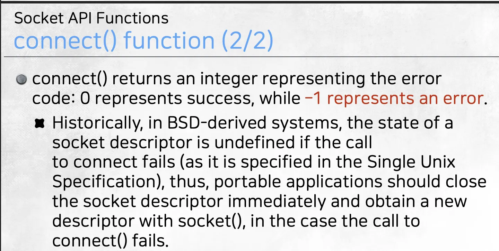

### connect 함수

- 파일 디스크립터로 식별되는 소켓을 통해 주소로 명시된 특정 원격 호스트와 직접적인 통신 링크를 수립
- 연결 지향형 프로토콜에서는 실제 연결을 수립하는 것
- 비연결형 프로토콜 사용 시 connect는 데이터를 송수신할 원격 주소를 지정하는 역할
- connect 함수는 에러 코드를 나타내는 정수를 반환
	- 성공 시 0, 실패시 -1
	→ 파이썬에서는 성공 시 client의 IP주소, client의 port넘버 튜플을 반환, 실패 시 exception(예외) 발생

- USD기반 시스템의 connect호출은 실패하면 소켓 디스크립터의 상태가 정의되지 않아, 이식성이 중요한 애플리케이션은 connect 실패시 즉시 소켓 디스크립터를 닫고 새 소켓을 열어야 함
	- 통신 시스템은 성공에 대한 보장이 없으므로(언제든 끊길 수 있음), 실패 시 즉시 소켓을 닫고 다시 생성을 권장

## 위 예외 사항을 담아 개선한 Echo 서버
```python
import socket

HOST = '127.0.0.1'
PORT = 65456

def main():
    with socket.socket(socket.AF_INET, socket.SOCK_STREAM) as serverSocket:
        try:
            if serverSocket.bind((HOST, PORT)) == -1:
                print('> bind() failed and program terminated')
                serverSocket.close()
                return
        except Exception as exceptionObj:
            print('> bind() failed by exception:', exceptionObj)
            serverSocket.close()
            return
        
        if serverSocket.listen() == -1:
            print('> listen() failed and program terminated')
            serverSocket.close()
            return
        
        clientSocket, clientAddress = serverSocket.accept()
        
        with clientSocket:
            print('> client connected by IP address {0} with Port number {1}'.format(clientAddress[0], clientAddress[1]))
            while True:
                # [=start=]
                RecvData = clientSocket.recv(1024)
                print('> echoed:', RecvData.decode('utf-8'))
                clientSocket.sendall(RecvData)
                if RecvData.decode('utf-8') == 'quit':
                    break
                # [==end==]
                
if __name__ == "__main__":
    print('> echo-server is activated')
    main()
    print('> echo-server is de-activated')
```
→ 위 ECHO서버를 개선한 버전

### 주요 차이점

1. 실제 로직을 `main` 함수로 분리하고, `if __name__ == "__main__":` 구문을 사용하여 프로그램을 실행하도록 구조화

### 코드 설명

1. `bind`와 `listen` 함수의 **에러(예외) 처리**부분이 추가
2. **`if __name__ == "__main__":`****(라인 36)**
	- 이 파이썬 스크립트가 **직접 실행될 때**(다른 파일에서 `import`된 것이 아닐 때) `if` 안의 코드를 실행하라는 의미입니다.
	- "echo-server is activated"를 출력하고, 핵심 로직이 담긴 `main` 함수를 호출합니다.
	- `main` 함수가 정상적으로 끝나면(클라이언트 접속이 끊어지면) "echo-server is de-activated"를 출력하고 프로그램이 종료됩니다.
3. **`main`****함수 (라인 7-34)**
	- **`with socket.socket(...)`****(라인 7)**: 서버 소켓을 생성합니다.
	- **`try-except`****(라인 9-16)**: `bind` 함수를 실행할 때 발생할 수 있는 에러를 처리합니다.
 - `bind`는 **포트가 이미 사용 중**일 때(Address already in use)처럼 다양한 이유로 실패할 수 있습니다.
 - 이 코드는 `bind`가 실패하면( `1`을 반환하거나 `Exception`이 발생하면) 에러 메시지를 출력하고, 소켓을 명시적으로 닫은 뒤(`close`) `return`을 통해 `main` 함수를 즉시 종료시킵니다.
	- **`if serverSocket.listen == -1:`****(라인 18-21)**: `listen` 함수가 실패했을 때도 마찬가지로 에러 메시지를 출력하고 `close` 후 함수를 종료합니다.
	- **`clientSocket, clientAddress = serverSocket.accept`****(라인 23)**: 클라이언트의 접속을 기다립니다.
	- **`with clientSocket:`****(라인 25)**: 클라이언트와 통신할 소켓을 `with` 구문으로 감쌉니다.
	- **`while True:`****(라인 27-34)**: 클라이언트와 데이터를 주고받는 에코 로직입니다. "quit" 메시지를 받으면 루프를 `break`합니다.
	- 루프가 `break`되면 `with clientSocket:` 블록이 끝나며 클라이언트 소켓이 닫히고, 이어서 `with serverSocket:` 블록도 끝나며 서버 소켓도 닫히고, `main` 함수가 종료
***

# Socket Programming 1:N

## 1:N(서버:클라) 연결 처리 가능 서버

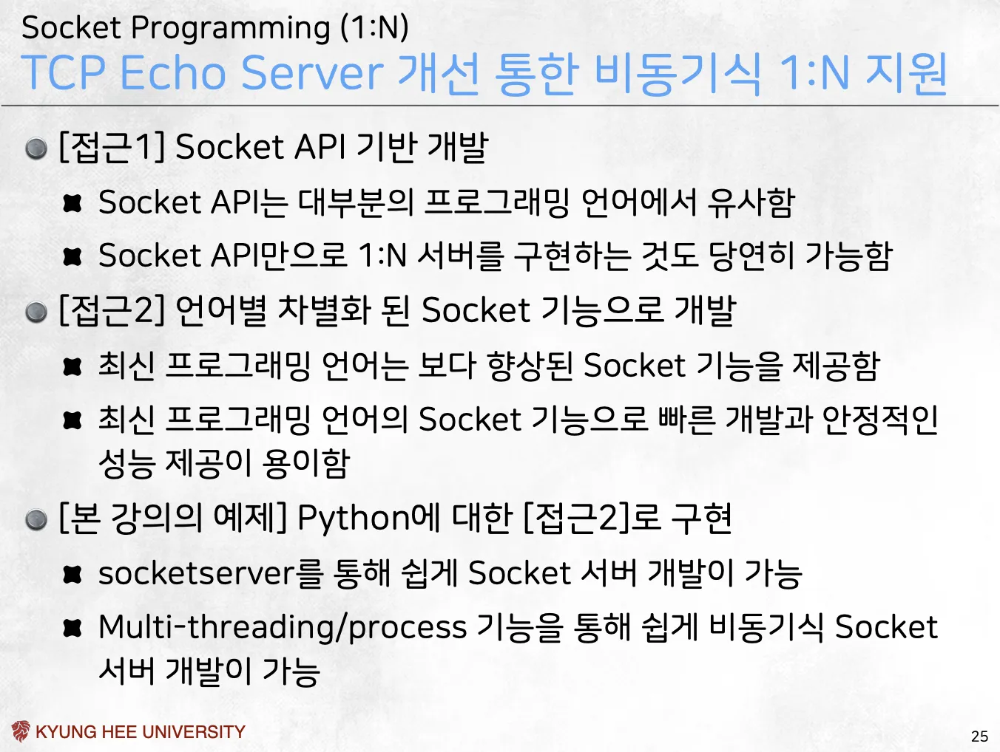

### 1:N 서버

- 여러 클라이언트(N)의 요청을 동시에 처리 가능한 1:N 비동기 서버를 구현

### 1:N 서버 개발 접근 방식

1. Socket API 기반 개발
	- 기본 socket api를 사용하는 방식 → Berkeley Socket API
	- 모든 언어에서 유사
	- 그러나 어려움
2. 언어별 차별화된 Socket기능 기반 개발
	- 프로그래밍 언어가 제공하는 고수준 내장 기능에 기반해 개발
	- 빠른 개발과 안정적인 성능 제공이 용이
⇒ 아래 예시는 2번 방식을 택함, 개발이 더 빠르고 성능이 안정적

## Python Socket 서버 기반 TCP Echo Server

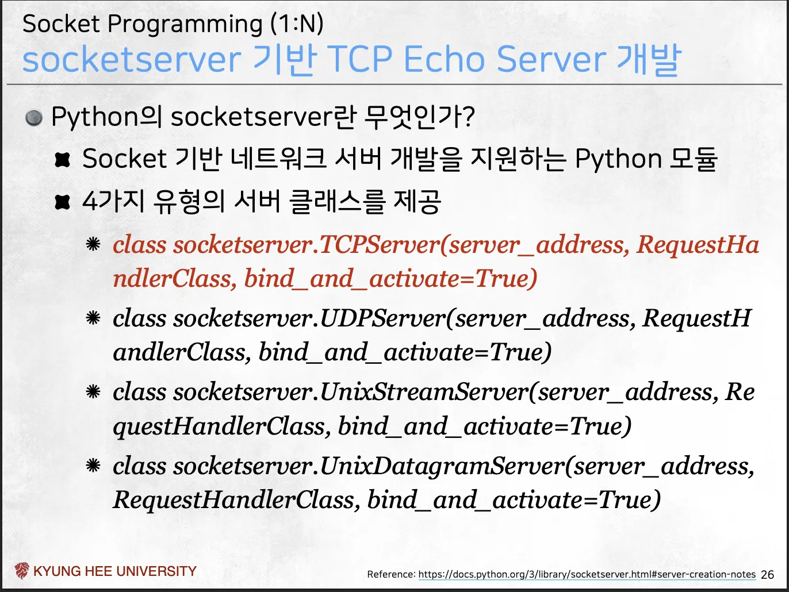

### Python socketserver

- Socket기반 네트워크 서버 개발 지원하는 Python모듈
- 네 가지 유형의 서버 클래스 제공
	→ 이 중 TCPServer(server_address, requesthandler, bind_and_active=True)를 사용

	- 파라미터로 server주소와 요청 핸들러를 전달
	→ 즉 이를 사용하는 개발자는 요청 핸들러를 구현하면 됨

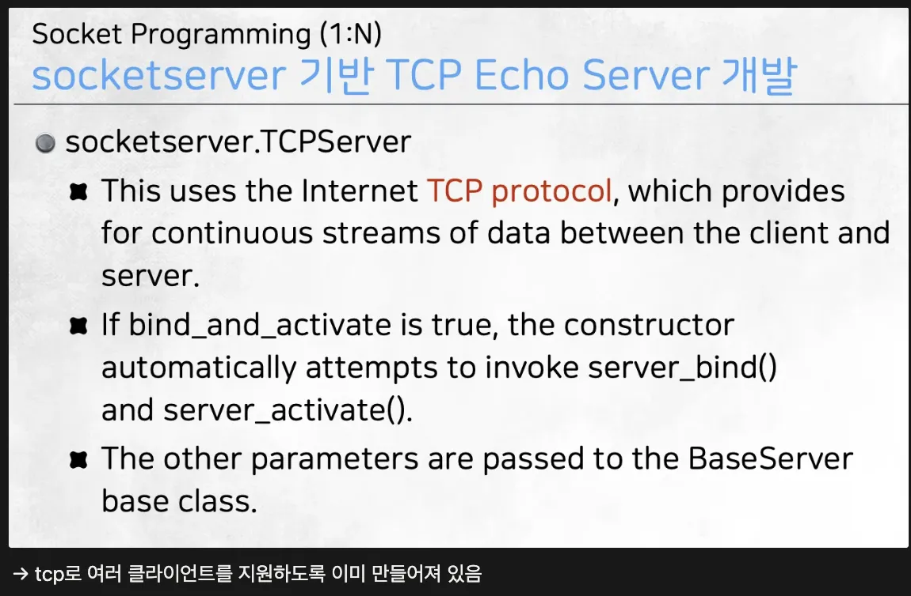

### Python `socketserver.TCPServer`

- `socketserver.TCPServer` 는 클라이너트와 서버 간의 연속적 데이터 스트림을 제공하는 인터넷 TCP프로토콜을 사용
- bind_and_active가 True이면 contructor는 자동으로 server_bind와 server_activate를 호출하려 시도
→ 사용 시 수동으로 코딩했던 `bind`나 `listen` 과정을 라이브러리가 알아서 처리

	- **TCP 사용**: 이름 그대로 TCP (`SOCK_STREAM`) 프로토콜을 사용
	- **자동 ****`bind`****및 ****`listen`**: `TCPServer` 객체를 생성할 때 `bind_and_activate=True` 인자(이것이 기본값)가 적용되면, 객체가 생성되는 즉시 **자동으로 ****`bind`****와 ****`listen`****(슬라이드에서는 ****`server_activate`****)이 실행**

## socketserver기반 TCP Server만드는 절차

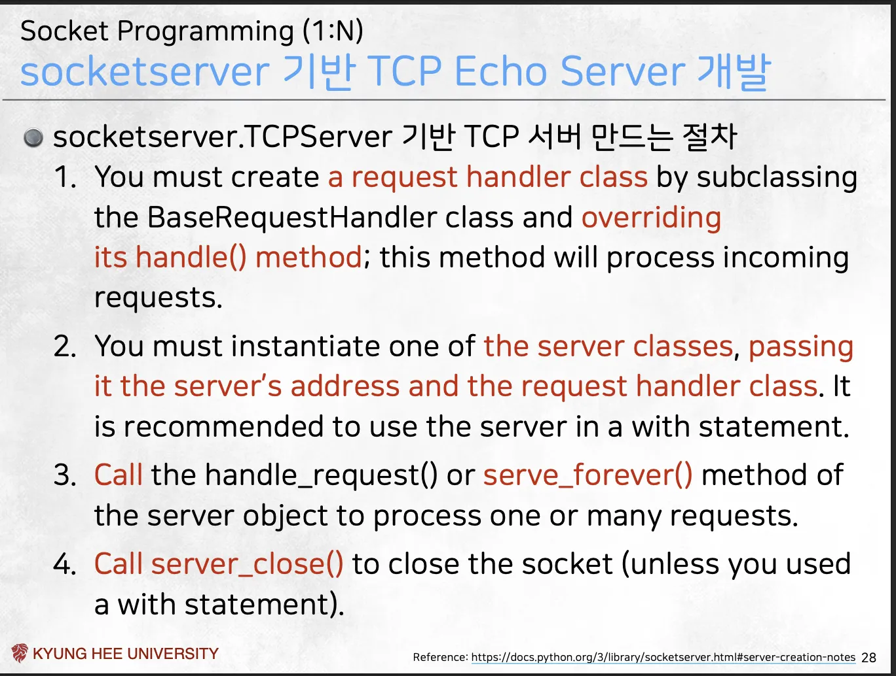

### socketserver기반 TCP서버 만드는 절차

1. `BaseRequestHandler` 클래스를 상속해 `handle` 메서드를 오버라이딩하여 요청 핸들러 클래스를 생성
	→ request handler 생성

2. 서버 클래스 중 하나를 인스턴스화(객체생성)
	- 이때 서버 주소와 요청 핸들러를 인자로 전달
3. 하나 또는 여러 요청 처리를 위해 handle_request(단일요청), serve_forever(무한정처리)를 호출
4. with구문을 사용하지 않았다면 소켓을 닫기위해 serve_close호출
→ 이때 대부분 공통 동작은 TCPServer 클래스에서 처리

	- 공통적으로 처리하는 부분(socket, bind, listen, accept 등)은 알아서 처리
	- recv, send 사이 로직 처리 부분을 개발자가 개발 → request handler

## socketserver기반 TCP Echo Server 코드
```python
import socketserver

class MyTCPSocketHandler(socketserver.BaseRequestHandler):
    """
    The Request Handler class for our server.

    It is instantiated once per connection to the server, and must
    override the handle() method to implement communication to the client.
    """

    def handle(self):
        print('> client connected by IP address {0} with Port number {1}'.format(self.client_address[0], self.client_address[1]))
        while True:
            # [=start=]
            RecvData = self.request.recv(1024)
            print('> echoed:', RecvData.decode('utf-8'))
            self.request.sendall(RecvData)
            if RecvData.decode('utf-8') == 'quit':
                break
            # [==end==]

if __name__ == "__main__":
    HOST, PORT = "127.0.0.1", 65456

    print('> echo-server is activated')
    # Create the server, binding to localhost on port 9999 
    with socketserver.TCPServer((HOST, PORT), MyTCPSocketHandler) as server:
        # Activate the server; this will keep running until you interrupt the program with Ctrl-C
        server.serve_forever()
    
    print('> echo-server is de-activated')
```

### 코드 설명
```python
import socketserver
```

- 소켓 서버 개발을 쉽게하는 socketserver모듈
```python
class MyTCPSocketHandler(socketserver.BaseRequestHandler):
    """
    The Request Handler class for our server.
    ...
    """
    def handle(self):
        print('> client connected by IP address {0} with Port number {1}'.format(self.client_address[0], self.client_address[1]))
        while True:
            # [=start=]
            RecvData = self.request.recv(1024)
            print('> echoed:', RecvData.decode('utf-8'))
            self.request.sendall(RecvData)
            if RecvData.decode('utf-8') == 'quit':
                break
            # [==end==]
```

- 클래스를 상속받아 MyTCPSocketHandler라는 요청 핸들러를 정의
- def handle 내부에서 요청 데이터를 받고 다시 돌려주는(Echo) 동작 수행
```python
if __name__ == "__main__":
    HOST, PORT = "127.0.0.1", 65456

    print('> echo-server is activated')
    # Create the server, binding to localhost on port 9999 
    with socketserver.TCPServer((HOST, PORT), MyTCPSocketHandler) as server:
        # Activate the server; this will keep running until you interrupt the program with Ctrl-C
        server.serve_forever()
    
    print('> echo-server is de-activated')
```

- 실제로 socketserver를 실행하는 부분
- TCPServer에 소켓 주소와 커스텀 요청 핸들러를 파라미터로 넘겨 인스턴스를 생성
- with구문으로 자동 serve_close 처리
	- serve_forever로 연결요청 대기

## socketserver기반 TCP Echo Server의 문제점

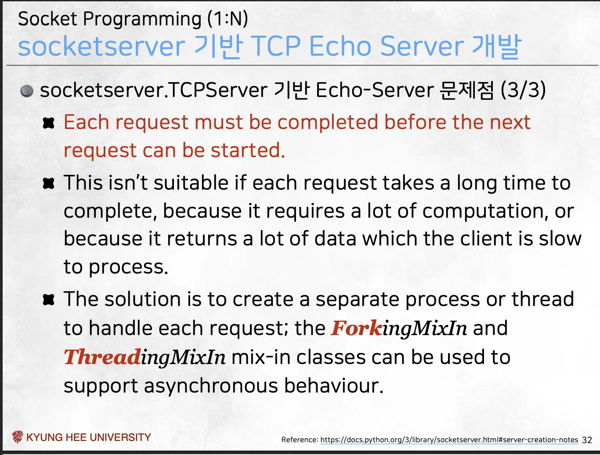

### 문제점

- 이 코드는 여전히 1:1통신만을 지원
	- 각 요청은 다음 요청이 시작되기 전에 반드시 **완료되어야 하는 상황 **
 **→ 오래걸리는 작업이 있다면 요청 처리가 블로킹됨**

### 해결 방법

- 별도의 프로세스(process)나 스레드(thread)를 생성
- `ForkingMixIn`과 `ThreadingMixIn` 같은 믹스인(mix-in) 클래스들이 **비동기(asynchronous) 동작**을 지원하기 위해 사용 가능

### Mixin class

- 독립적으로 사용되지 않으며 다른 클래스에 다중 상속을 통해 결함되어 해당 클래스에 새로운 기능을 추가

## 비동기식 1:N TCP Echo Server

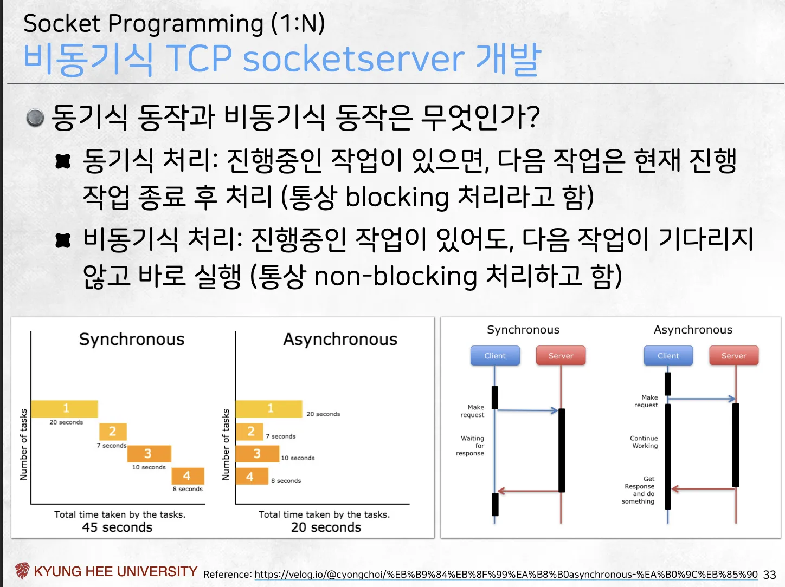

### 동기식 동작

- 진행 중인 작업이 있으면 다음 작업은 현재 작업이 종료된 후에 처리

### 비동기식 동작

- 진행 중인 작업이 있어도 다음 작업이 기다리지 않고 실행

## 멀티 스레드/ 멀티 프로세스

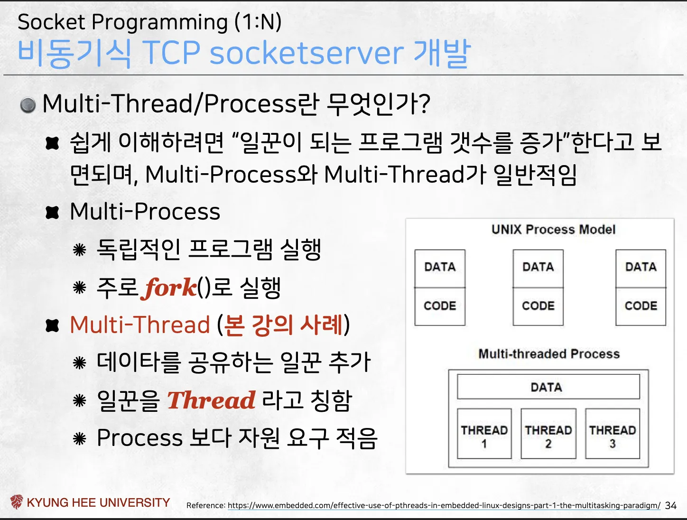

### Multi Thread / Multi Process

- 일을 하는 일꾼의 개수를 증가시키는 것

### Multi-Process

- 독립적인 프로세스(프로그램)를 여러 개 실행하는 방식
	→ 각 프로세스는 독립된 메모리 공간과 코드를 가짐
	→ 한 프로세스에 문제 생겨도 다른 프로세스에 영향을 주지 않음

- 주로 `fork` 로 기존 프로세스를 복제해서 생성

### Multi-Thread

- 하나의 프로세스 내에서 데이터를 공유하는 일꾼을 추가하는 방식 → 일꾼 == Thread
- 프로세스 생성보다 자원요구가 적고 새성 속도가 빠름
- 데이터를 공유하므로 스레드 사이 통신이 쉽지만 데이터 동기화 문제 등이 발생

## 비동기식 TCP SocketServer 개발

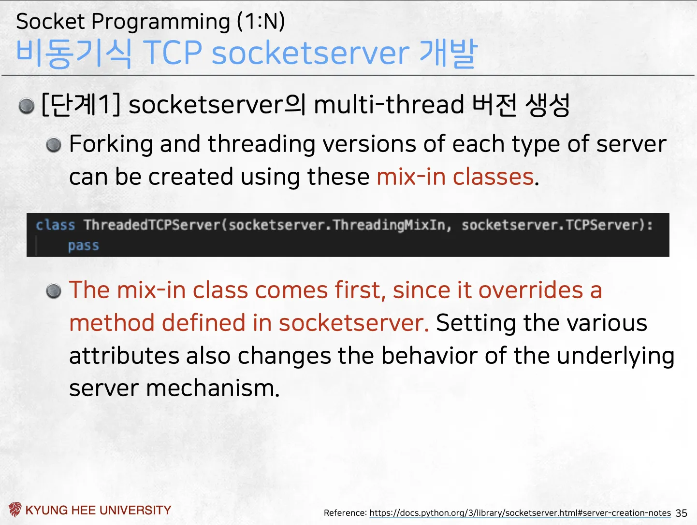

### 단계 1: socketserver의 multi-thread버전 생성

- 서버의 각 타입(TCP, UDP 등)에 대한 **포킹(Forking, 프로세스 기반)**및 **스레딩(Threading, 스레드 기반)**버전은 이러한 **믹스인(mix-in) 클래스**들을 사용하여 생성 가능
```python
class ThreadedTCPServer(socketserver.ThreadingMixIn, socketserver.TCPServer):
    pass
```

- **믹스인 클래스가 (상속 시) 먼저 와야 합니다.**왜냐하면 믹스인 클래스가 `socketserver`(기본 서버 클래스)에 정의된 메서드를 오버라이드(overrides, 재정의)하기 때문
	→ MRO 순서 때문에 그럼

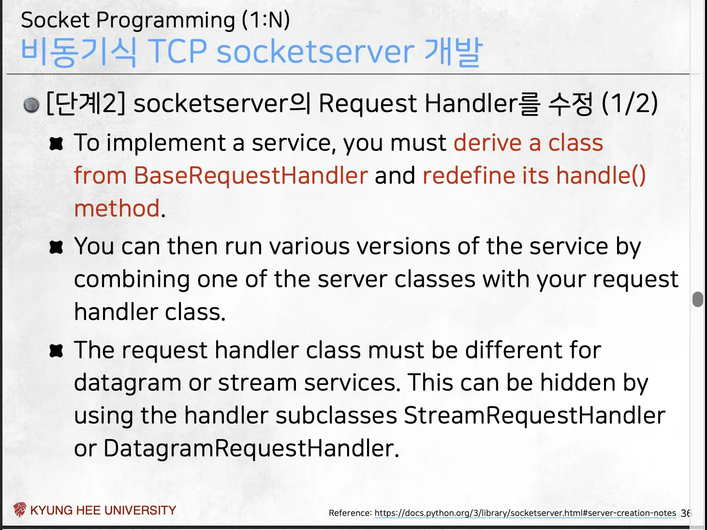

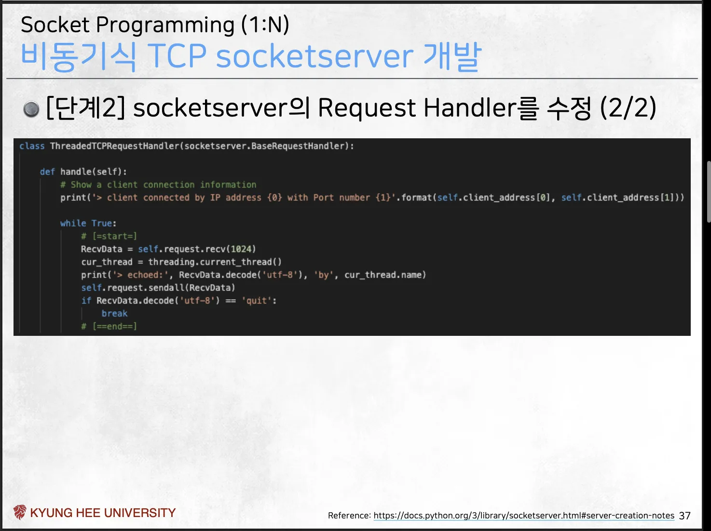

### 단계 2: socketserver의 RequestHandler 수정
→ 핸들러는 메인 로직의 변경이 없음

	- 확인을 위해 현재 스레드의 id를 출력하는 부분만 추가
- 서비스 구현 위해 BaseRequestHandler를 상속해 handle메서드를 재정의
- 핸들러 클래스는 UDP, TCP에 따라 달라야 함

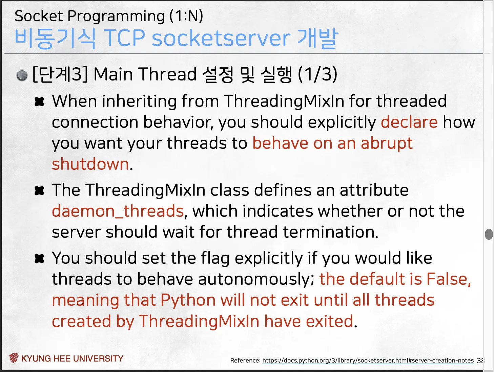

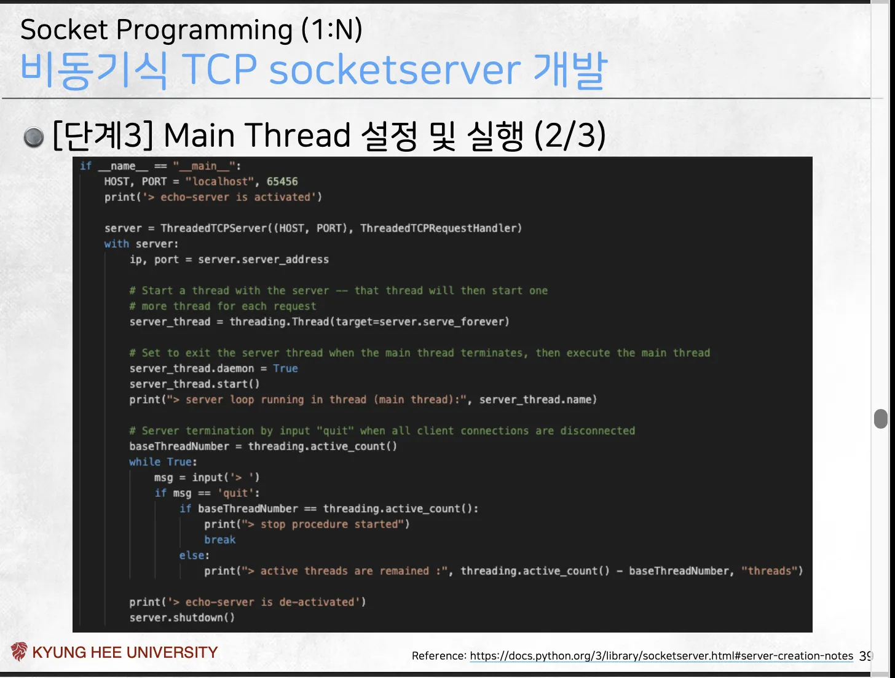

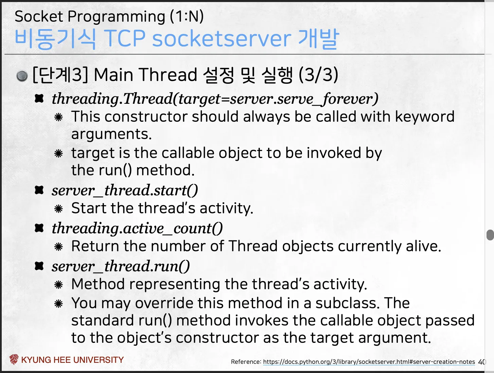

### 단계 3: Main Thread 설정 및 실행

- ThreadingMixin을 상속받아 스레드 기반의 연결을 구현할 때는 갑작스러운 종료 시 스레드의 동작을 명시적으로 선언
- `ThreadingMixIn` 클래스는 `daemon_threads`라는 속성(attribute)을 정의
	- 이는 서버가 스레드 종료를 기다릴지 여부를 나타냄
	- 스레드가 메인 스레드와 상관없이(자율적으로) 동작하게 하려면 이 플래그를 명시적으로 설정해야 함
	- **기본값은 False**
 - `ThreadingMixIn`이 생성한 **모든 스레드가 종료될 때까지**파이썬 프로그램이 **종료되지 않고 기다린다**는 의미
- `threading.Thread(target=server.serve_forever)` 생성자는 `target` 인자로 `run` 메서드에 의해 호출될 함수(callable object)를 받음
- `server_thread.start`는 스레드의 활동을 시작
- `threading.active_count`는 현재 살아있는(alive) 스레드 객체의 수를 반환

### 코드 및 설명
```python
if __name__ == "__main__":
    HOST, PORT = "localhost", 65456
    print('> echo-server is activated')

    server = ThreadedTCPServer((HOST, PORT), ThreadedTCPRequestHandler)
    ip, port = server.server_address

    # Start a thread with the server -- that thread will then start one
    # more thread for each request
    server_thread = threading.Thread(target=server.serve_forever)
    
    # Set to exit the server thread when the main thread terminates, then execute the main thread
    server_thread.daemon = True
    server_thread.start()
    
    print(f'> server loop running in thread (main thread):, {server_thread.name}')

    # Server termination by input "quit" when all client connections are disconnected
    BaseThreadNumber = threading.active_count()
    while True:
        msg = input('> ')
        if msg == 'quit':
            if BaseThreadNumber == threading.active_count():
                print('> stop procedure started')
                break
            else:
                print(f"> active threads are remained :, {threading.active_count() - BaseThreadNumber}, "threads")

    print('> echo-server is de-activated')
    server.shutdown()
```
```python
server = ThreadedTCPServer((HOST, PORT), ThreadedTCPRequestHandler)
```

- 스레드 서버 객체 생성
```python
server_thread = threading.Thread(target=server.serve_forever)
```

- 서버의 시작을 별도 스레드에서 처리
```python
server_thread.daemon = True
server_thread.start()
```

- 이 별도 스레드를 데몬으로 설정
	- 데몬 스레드 → 메인 스레드가 종료되면 자신도 함께 종료되는 백그라운드 스레드
	- 이 스레드가 메인과 무관하게 동작하다 좀비 스레드가되지 않게 하기 위함
- start를 하면, 메인 스레드와 서버 스레드가 동작
```python
BaseThreadNumber = threading.active_count()
while True:
    msg = input('> ')
    if msg == 'quit':
        # (연결된 클라이언트가 없을 때만 종료하도록 하는 로직)
        if BaseThreadNumber == threading.active_count():
            break
        else:
            # (활성 스레드 수 = 기본 스레드 + 클라이언트 스레드)
            print(f"> active threads are remained ...")
```

- 사용자가 "quit"를 입력했을 때, 만약 **연결된 클라이언트 스레드가 남아 있다면**(즉, 현재 스레드 수가 기본 스레드 수보다 많다면) 종료하지 않고 대기
- 모든 클라이언트가 접속을 끊어 스레드 수가 원래대로 돌아와야 `break`가 실행
⇒ 동작 중인 이 서버는 결국에 세 가지 종류의 스레드를 가짐

	- `MainThread`는 `input`에서 대기 중.
 → 관리자 입력을 받는 메인 스레드, 얘는 서버의 시작과 관리를 담당
 → input에서 대기 중

	- `server_thread`는 `accept`에서 대기 중.
 → 서버를 대기하는 서버 스레드
 → accept에서 대기 중

	- `client thread` 는 server_thread에 의해 생성되어 동작
 → 서버에 의해 생성되어 접속을 처리하는 clinet thread

## multi thread가 아닌 방식의 비동기식 개발

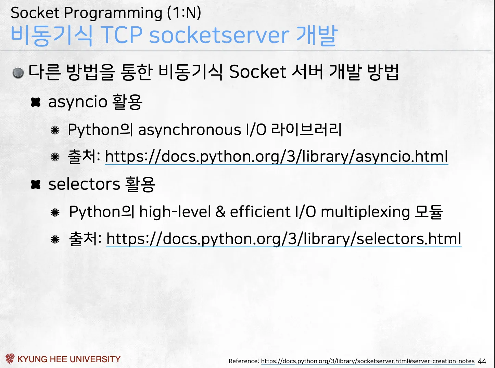

→ 또 다른 비동기 방식으로 아래 도구들을 설명

	- python의 표준 라이브러리인 asyncio
	- 더 저수준의 라이브러리인 selectors
→ 추가로 GIL과 파이썬은 실제로 multi-threading을 하지 못하고 시분할 동시성 처리를 함

## 비동기식 TCP 채팅 프로그램 개발
```python
class ThreadedTCPServer(socketserver.ThreadingMixIn, socketserver.TCPServer):
    pass

if __name__ == "__main__":
    # ... (서버 객체 생성)
    server = ThreadedTCPServer((HOST, PORT), ThreadedTCPRequestHandler)
    
    # ... (서버를 '데몬 스레드'로 분리하여 실행)
    server_thread = threading.Thread(target=server.serve_forever)
    server_thread.daemon = True
    server_thread.start()
    
    # ... (메인 스레드는 'quit' 입력을 받으며 대기)
    while True:
        msg = input('> ')
        # ... (안전하게 종료하는 로직)
```

### TCP 서버 실행 부분

- **역할**: 여러 클라이언트가 동시에 접속(1:N)할 수 있도록, `ThreadingMixIn`을 사용한 비동기 서버를 실행
- **`serve_forever`**: '서버 스레드'에서 `accept`를 무한 반복하며 새 클라이언트의 접속을 대기
- **`MainThread`**: 서버 콘솔에서 "quit" 입력을 기다리는 관리자 역할
```python
import threading

group_queue = [] # (CHAT#1) 채팅방 역할을 할 전역 리스트

class ThreadedTCPRequestHandler(socketserver.BaseRequestHandler):

    def handle(self):
        # (CHAT#3) 새 클라이언트가 접속하면 전역 리스트에 추가
        global group_queue
        group_queue.append(self.request) 
        
        while True:
            RecvData = self.request.recv(1024)
            
            if RecvData.decode('utf-8') == 'quit':
                # (CHAT#4) 클라이언트가 'quit'를 보내면 리스트에서 제거
                group_queue.remove(self.request)
                break
            else:
                # (CHAT#5) 'quit'가 아니면, 리스트의 모든 클라이언트에게 메시지 전송
                print('> received ...')
                for conn in group_queue:
                    conn.sendall(RecvData)
```

### 채팅 Request Handler 부분

- **`group_queue = []`****(채팅방)**
	- (CHAT#1) 모든 클라이언트의 소켓(`self.request`)을 저장하기 위한 **전역(global) 리스트**를 생성합니다.
	- 이 `group_queue`가 **모든 클라이언트가 공유하는 하나의 '채팅방'**역할을 합니다.
- **`handle`****메서드 (클라이언트 1명당 1개씩 실행)**
	1. **채팅방 입장 (CHAT#3)**:
 - 새 클라이언트가 접속하면(`accept`되면), `ThreadingMixIn`이 이 `handle` 메서드를 새 스레드로 실행시킵니다.
 - `handle` 메서드는 가장 먼저 클라이언트 자신의 소켓(`self.request`)을 `group_queue` 리스트에 `append` (추가)합니다.
	2. **메시지 수신 및 브로드캐스트 (CHAT#5)**:
 - 클라이언트가 "quit"가 아닌 일반 메시지를 보냅니다.
 - `else` 문이 실행됩니다.
 - `for conn in group_queue:`: 서버는 `group_queue` **리스트 전체를 순회**합니다.
 - `conn.sendall(RecvData)`: 리스트에 들어있는 **모든 클라이언트의 소켓(`conn`)**에게 방금 받은 메시지(`RecvData`)를 **전송(broadcast)**합니다.
	3. **채팅방 퇴장 (CHAT#4)**:
 - 클라이언트가 "quit" 메시지를 보냅니다.
 - `if` 문이 실행됩니다.
 - `group_queue.remove(self.request)`: 서버는 `group_queue` 리스트에서 "quit"를 보낸 **해당 클라이언트의 소켓만 찾아 제거**합니다.
 - `break`로 `while` 루프를 탈출하고 `handle` 메서드가 종료됩니다. (해당 클라이언트 스레드 종료)
→ 참고: TCP에서 sendall인 이유는 모든 연결에 broadcast하는게 아니라(그래서 for문으로 하나씩 함)

	- 현재 모든 정보를 넘겨주는 것, 그냥 send는 보낼만큼 보냄, 이걸 반복해주는게 sendall

# Socketserver기반 UDP Echo 서비스

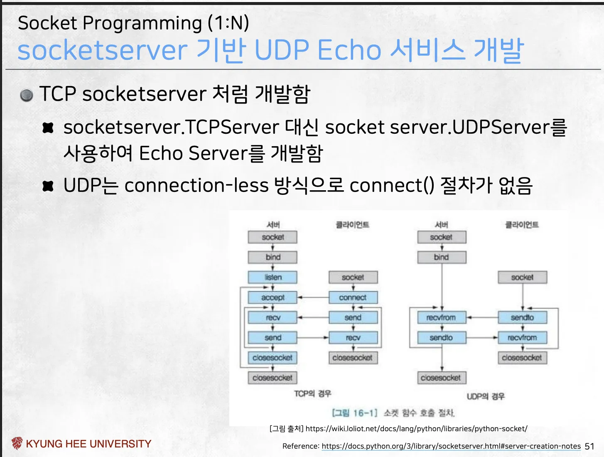

### UDP와 TCP차이

- UDP는 connectionless 방식, 즉 연결에 필요한 단계들이 없음
	- socket, bind, recv, send, close는 동일
	- listen, connect, accept와 같이 연결에 필요한 부분들은 없음

### 개발 시 차이

- socketserver.UDPServer를 사용해서 개발

## UDP Echo 서버 코드
```python
import socketserver

# [핵심 1] UDP 핸들러
class MyUDPHandler(socketserver.BaseRequestHandler):
    """
    (Docstring) 이 클래스는 TCP 핸들러와 비슷하게 동작하지만,
    self.request가 (데이터, 클라이언트 소켓) 한 쌍으로 구성됩니다.
    연결이 없기 때문에, sendto()로 데이터를 보낼 때
    클라이언트 주소가 명시적으로 주어져야 합니다.
    """
    def handle(self):
        # self.request는 (데이터, 소켓) 튜플임
        RecvData = self.request[0].strip() # [0]은 수신된 '데이터'
        RecvSocket = self.request[1]        # [1]은 데이터를 보낸 '소켓'
        
        print('> echoed:', RecvData.decode('utf-8'))
        
        # [핵심 2] sendto()로 응답
        # 데이터를 받은 '소켓'을 이용해, '클라이언트 주소'로 응답을 보냄
        RecvSocket.sendto(RecvData, self.client_address)

if __name__ == "__main__":
    HOST, PORT = "127.0.0.1", 65456
    print('> echo-server is activated')
    
    # [핵심 3] UDPServer 사용
    with socketserver.UDPServer((HOST, PORT), MyUDPHandler) as server:
        server.serve_forever()
        
    print('> echo-server is de-activated')
```

### TCP 서버와의 핵심 차이점

- **`UDPServer`****사용 (핵심 3)**:
	- `TCPServer` 대신 `socketserver.UDPServer` 클래스를 사용
	- `UDPServer`는 `listen`, `accept` 과정을 거치지 않음
- **`handle`****메서드의 ****`self.request`****(핵심 1)**:
	- TCP에서는 `self.request`가 클라이언트와 1:1로 연결된 통신 소켓(`clientSocket`) 그 자체
	- UDP에서는 `self.request`가 `(data, socket)` 형태의 튜플(tuple)
 → 연결이 아닌 데이터그램 방식

 - `self.request[0]`: 클라이언트가 보낸 **데이터(바이트)**
 - `self.request[1]`: 이 데이터를 전송하는 데 사용된 **서버 자신의 소켓**
- **응답 방식 (핵심 2)**:
	- TCP에서는 `self.request.sendall`로 응답
	- UDP에서는 `self.request[1].sendto(데이터, 주소)` 형식을 사용
	- 즉, 데이터를 받은 소켓(`RecvSocket`)을 이용해, `self.client_address`(데이터를 보낸 클라이언트의 주소)로 데이터를 다시 발송
	⇒ 연결이 아니므로 주소를 알아야 다시 보낼 수 잇음

## UDP Echo Client
```python
import socket
import threading

# [핵심 1] 수신(recv) 전용 스레드가 실행할 함수
def recvHandler(clientSocket):
    while True:
        # 이 스레드는 오직 '데이터 수신'만 기다림
        recvData = clientSocket.recv(1024) 
        print('> received:', recvData.decode('utf-8'))
        if recvData.decode('utf-8') == "quit":
            break

def main():
    # [핵심 2] UDP 소켓 생성 (SOCK_DGRAM)
    with socket.socket(socket.AF_INET, socket.SOCK_DGRAM) as clientSocket:
        
        # [핵심 3] 수신 전용 스레드 생성 및 시작
        clientThread = threading.Thread(target=recvHandler, args=(clientSocket,))
        clientThread.daemon = True # 메인 스레드(송신)가 끝나면 같이 종료
        clientThread.start()

        # [핵심 4] 메인 스레드는 '송신'만 담당
        while True:
            sendMsg = input('> ')
            # UDP는 'sendto'로 서버 주소(HOST, PORT)를 매번 지정해 보냄
            clientSocket.sendto(bytes(sendMsg, 'utf-8'), (HOST, PORT))
            if sendMsg == "quit":
                break

if __name__ == "__main__":
    # ... (main 함수 실행)
```

### TCP 클라이언트와의 핵심 차이점

- **`SOCK_DGRAM`****사용 (핵심 2)**:
	- TCP(`SOCK_STREAM`) 대신 UDP(`SOCK_DGRAM`) 타입으로 소켓을 생성
- **`connect`****없음**:
	- UDP는 비연결형이므로 서버에 `connect`를 호출하는 과정이 **없음**
- **`sendto`****사용 (핵심 4)**:
	- `connect`를 하지 않았기 때문에, `sendall` 대신 `sendto`를 사용
	- `sendto`는 데이터를 보낼 때마다 목적지 주소(`(HOST, PORT)`)를 매번 명시적으로 지정해야 함
	⇒ 마찬가지, 연결이 아니므로

- **스레드 분리 (핵심 1, 3)**:
	- TCP는 `send`와 `recv`가 하나의 '연결' 위에서 순차적으로(send-recv-send-recv...) 일어남
	- UDP는 `sendto`(송신)와 `recv`(수신)가 완전히 독립적
	- 사용자가 `input`(송신)을 위해 멈춰있는 동안에도 서버의 에코 메시지(수신)를 받아야 하므로, **`recvHandler`****라는 수신 전용 스레드를 따로 만들어**백그라운드에서 `recv`를 계속 실행
	- **메인 스레드**는 `input`을 받아 `sendto`를 하는 **송신**역할

## socketserver기반 UDP 채팅 서비스 개발

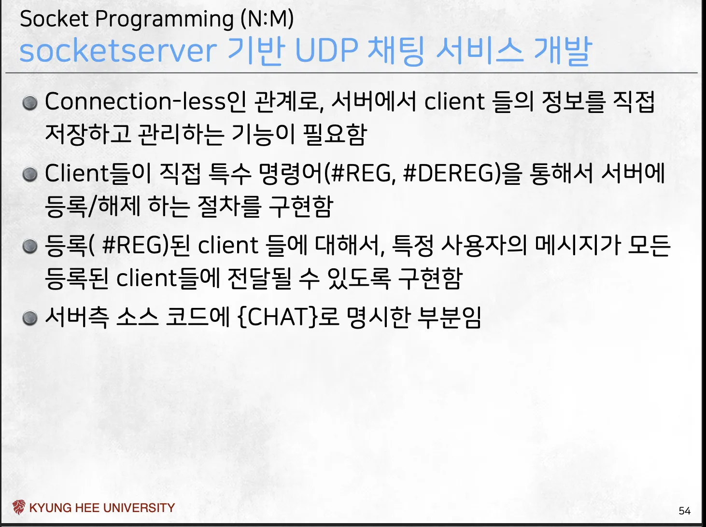

```python
import socketserver

# (CHAT#1) Create a DB to register all client's socket information
group_queue = []

class MyUDPHandler(socketserver.BaseRequestHandler):
    """
    This class works similar to the TCP handler class, except that
    self.request consists of a pair of data and client socket, and since
    there is no connection the client address must be given explicitly
    when sending data back via sendto().
    """

    def handle(self):
        # [=start=]
        RecvData = self.request[0].strip()
        RecvSocket = self.request[1]
        
        RecvCmd = RecvData.decode('utf-8')
        
        # (CHAT#2) Command line protocol to client registration and deregistration
        if RecvCmd[0] == "#" or RecvCmd == "quit":
            if RecvCmd == "#REG":
                print("> client registered", self.client_address)
                group_queue.append(self.client_address)
            elif RecvCmd == "#DEREG" or RecvCmd == "quit":
                if group_queue.__contains__(self.client_address) == True:
                    print("> client de-registered", self.client_address)
                    group_queue.remove(self.client_address)
        
        else:
            # (CHAT#3) Prohibit an un-registered client message
            if len(group_queue) == 0:
                print("> no clients to echo")
            
            elif group_queue.__contains__(self.client_address) == False:
                print('> ignores a message from un-registered client')
            
            else:
                # (CHAT#4) Forward a client message to whole clients (currently a broadcast)
                print('> received (', RecvData.decode('utf-8'), ') and echoed to ', len(group_queue), 'clients')
                for clientConn in group_queue:
                    RecvSocket.sendto(RecvData, clientConn)
        # [==end==]

if __name__ == "__main__":
    HOST, PORT = "127.0.0.1", 65456
    print('> echo-server is activated')
    # Create the server, binding to localhost on port 65456
    with socketserver.UDPServer((HOST, PORT), MyUDPHandler) as server:
        # Activate the server; this will keep running until you interrupt the program with Ctrl-C
        server.serve_forever()
    
    print('> echo-server is de-activated')
```

### 클라이언트 처리 로직(**`MyUDPHandler`****)**
****`handle` 메서드는 클라이언트가 보낸 메시지(`RecvCmd`)를 확인하고 3가지 중 하나를 수행

- **`if RecvCmd == "#REG":`**
	- →`group_queue.append(self.client_address)`
	- (참여 요청: 보낸 사람의 **주소**를 명단에 추가)
- `e`**`lif RecvCmd == "#DEREG" or RecvCmd == "quit":`**
	- → `group_queue.remove(self.client_address)`
	- (퇴장 요청: 명단에서 보낸 사람의 주소를 제거)
- **`else:`****(일반 메시지)**
	- → `if self.client_address in group_queue:`
	- (명단 확인: 보낸 사람이 명단에 있는지?)
	- → `for addr in group_queue: RecvSocket.sendto(RecvData, addr)`
	- (브로드캐스트: 명단에 있는 모든 주소(`addr`)로 메시지 발송

## UDP의 보안 주의점

- udp입장에서는 tcp의 syn flooding이 아니라 받는거 자체가 공격이 될 수 있음
	- 얘는 연결 설정이 아니라서 트래픽 방어 자체가 쉽지 않음
	- 연결 해제 시 추가적으로 전달할 수 없는 tcp와 달리 udp는 걍 랜덤하게 계속 때릴 수 있음
