> 원본 Notion 정리 — 강의 슬라이드 이미지 + 설명.

> [← 전체 목차](/posts/net-overview/)

***

# WWW, 인터넷

## 알파넷

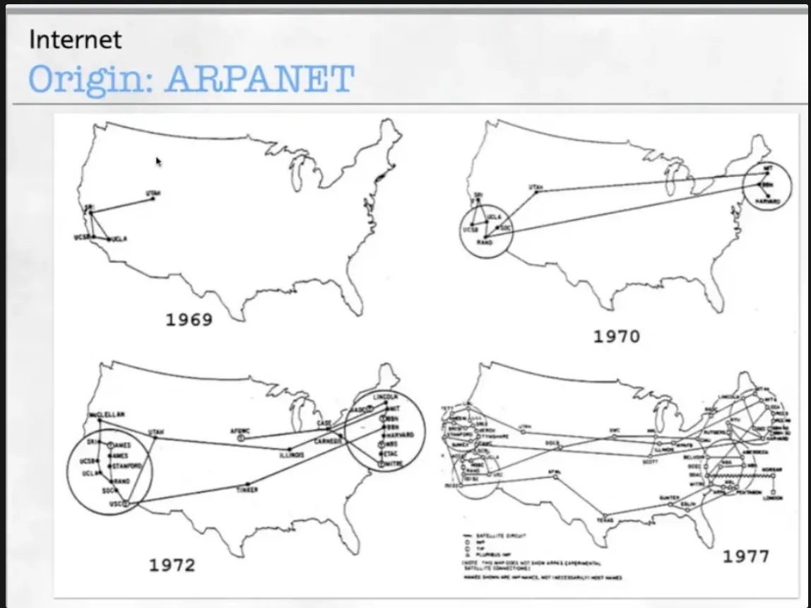

### Arphanet(알파넷)

- ARPANET은 오늘날 우리가 부르는 인터넷의 시초
- **미국 국방부(DoD)의 투자**로 시작
- 네트워크의 확장 과정
	1. 1969년 유타 대학 등 미국 내 4개 대학을 연결한 것을 시작
	2. 1970년에는 스탠퍼드 대학을 포함해 미 전역(동-서부)을 횡단하는 네트워크로 발전
	3. 이후 1972년에는 중부, 동/서부를 포함한 더 많은 대학으로 확장됨
	4. 1970년대 후반(1977년 그림)에 이르러서는 더 많은 대학, 연구 기관, 정부 조직 등이 연결
- 미국의 여러 네트워크들을 연결하기 위해서는 새로운 **물리적 케이블**과 **소프트웨어**가 필요, 이때문에 많은 것들이 개발됨
- **네트워크 설계의 핵심 철학은 ⇒ "Survivability (생존성)"**
	- 당시 미 국방부는 본부가 핵 공격 등으로 파괴되더라도, **분산된 방식으로 정보를 끊김 없이 공유**할 수 있는 견고한 네트워크를 요구
	- ARPANET은 군사 명령과 같은 **소량의 데이터가 어떤 악조건에서도 안정적으로 전달**되는 것을 목표로 함
 - 현재와 같은 멀티미디어 전송 등은 설계 시 상정되지 않음

## 네트워크들의 네트워크

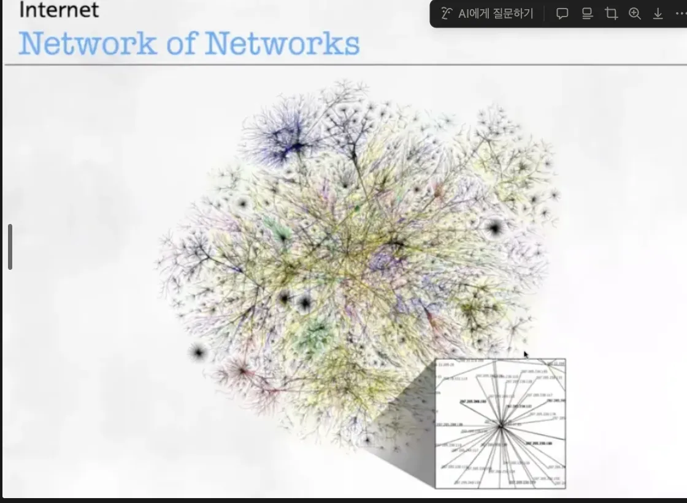

### 네트워크들의 네트워크 → 인터넷

- 인터넷의 시작은 이미 존재하는 여러 네트워크들을 **서로 연결하는 것**에서 출발
- '네트워크 간의 연결'을 위해 탄생한 대표적인 프로토콜 ⇒ CSMA/CD 기반의 이더넷(Ethernet)
	- E1/T1처럼 1.5~2Mbps 정도의 속도를 제공하는 프로토콜도 존재
- 당시의 인터넷 기술, 즉 소프트웨어 스택은 IP (L3)를 기반으로 하고, 그 위에 TCP/UDP (L4)를 구축하는 방식
	→ 슬라이드의 그림은 이러한 계층 구조(L1/L2는 이더넷, L3는 IP, L4는 TCP/UDP)를 기반으로 컴퓨터(소프트웨어가 붙는 것)들을 연결하고, 그렇게 만들어진 네트워크들을 다시 연결하는 모습을 시각화

- **WWW(월드 와이드 웹) 이전**에 인터넷에서 가장 널리 쓰인 애플리케이션은 이메일(E-mail)
- 1960년대 중반부터 미국 대학들이 이런 방식으로 연결되었으며, 우리나라 대학들도 1990년대 중앙에서부터 연결되기 시작
	→ 당시에는 기술적 한계로 이메일이 전송되지 않거나, 전화로 이메일을 보내고 받는 경우도 있었음

## 인터넷

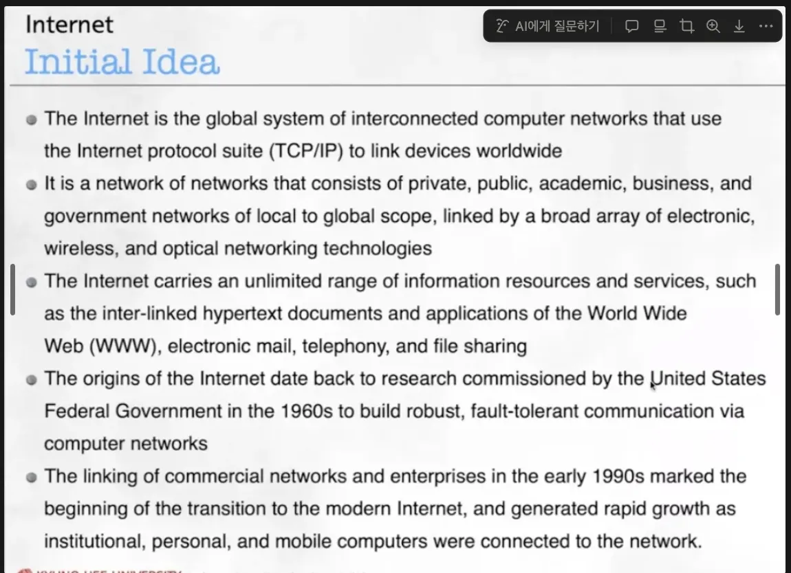

### 인터넷

- 인터넷은 전 세계 장치들을 연결하기 위해 인터넷 프로토콜 스위트(TCP/IP)를 사용하는, 상호 연결된 컴퓨터 네트워크의 글로벌 시스템

### 인터넷의 초기 아이디어

- 인터넷의 시초는 1960년대 말에서 1970년대에 미국을 중심으로 만들어진, **견고하고(robust) 장애 허용(fault-tolerant) 기능**을 갖춘 네트워크
- 당시 **주요 목적은 상업적인 용도가 아니었습니다.**대신 국가 기관, 대학, 연구소 등이 서로 **정보를 안정적으로 주고받는 것**
	- 지역적 범위에서 글로벌 범위에 이르는 사설, 공용, 학술, 비즈니스 및 정부 네트워크로 구성된 '네트워크의 네트워크'이며, 광범위한 전자, 무선 및 광학 네트워킹 기술로 연결
- 인터넷은 월드 와이드 웹(WWW)의 상호 연결된 하이퍼텍스트 문서 및 애플리케이션, 전자 메일, 전화, 파일 공유와 같은 무제한적인 범위의 정보 자원과 서비스를 전달
	- 초기 인터넷에서도 첨부 파일 전송이 가능은 했지만, 주된 정보 교환 매체는 **텍스트(글자)**중심
- 1990년대 초 상업용 네트워크와 기업의 연결은 현대 인터넷으로의 전환의 시작을 알렸으며, 기관용, 개인용, 모바일 컴퓨터가 네트워크에 연결되면서 급속한 성장을 이끌어냄
	→ 상업용 네트워크가 연결되며 폭발적으로 발전

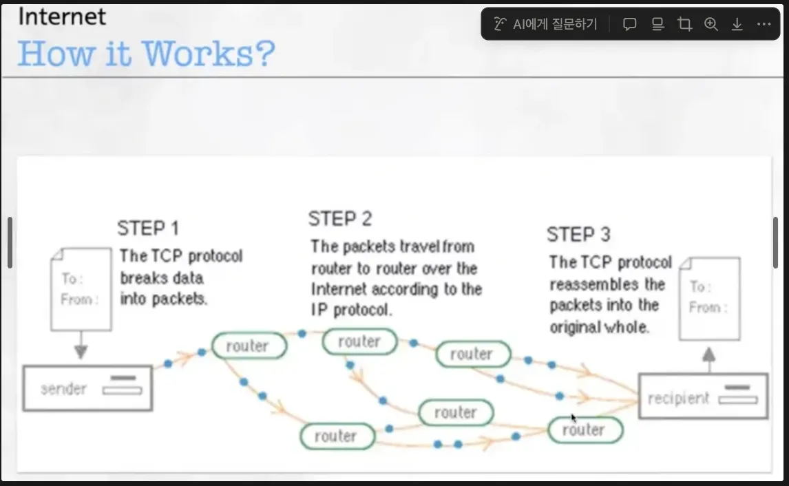

### 인터넷의 작동 방식

- **1단계:**TCP 프로토콜이 데이터를 패킷(→세그먼트)으로 분할
	→ 발신자(sender) 측의 TCP 프로토콜(L4)이 전송할 데이터를 '패킷(packets)'이라는 작은 단위로 잘게 나눔

- **2단계:**패킷들은 IP 프로토콜에 따라 인터넷을 통해 라우터에서 라우터로 이동
	→ 이 패킷들은 인터넷망을 통해 독립적으로 이동
	→ OSI 7계층 모델의 네트워크 계층(L3)에서 작동하는 라우터는, IP 프로토콜(L3)을 기반으로 각 패킷의 주소를 보고 다음 경로를 결정하여 전달
	→ 패킷들은 서로 다른 경로를 통해 목적지로 향할 수 있음

- **3단계:**TCP 프로토콜이 패킷들을 원래의 전체 데이터로 재조립
	→ 수신자(recipient) 측에 도착한 패킷들은 다시 TCP 프로토콜(L4)에 의해 원래 순서대로 재조립되어 완전한 데이터로 복원

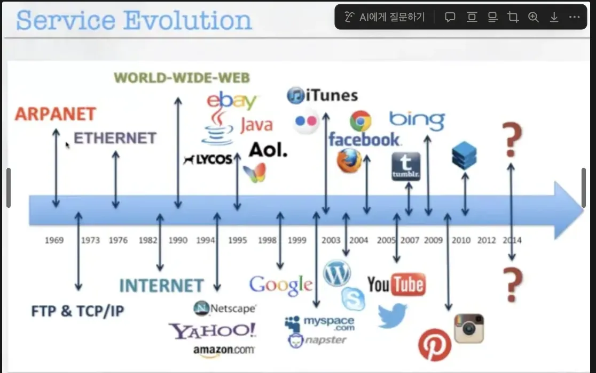

### 인터넷 서비스의 발전 과정
**1. 인터넷의 태동: 기반 인프라 구축 (1960년대 후반 ~ 1980년대)**

- **ARPANET (1969):**시작입니다. 미 국방부가 핵 공격에도 견딜 수 있는 분산형 네트워크(패킷 교환 방식)로 개발했습니다.
- **TCP/IP & ETHERNET (1973):**인터넷의 핵심 '언어'(TCP/IP)와 '내부 도로망'(Ethernet, LAN) 기술이 등장했습니다.
- **INTERNET (1980년대):**ARPANET이 TCP/IP를 표준으로 채택하고, 대학, 연구소, 기업으로 연결이 확산되며 '인터넷'이 본격화되었습니다. 이 시기까지는 주로 전문가들이 텍스트(이메일, FTP 등) 중심으로 사용했습니다.
**2. WWW와 닷컴 시대의 개막 (1990년대)**

- **WWW (1990):**가장 큰 혁신입니다. 인터넷이라는 '토양' 위에 **HTML**(문서), **URL**(주소), **HTTP**(통신)라는 기술로 '웹' 서비스가 탄생했습니다.
- **하이퍼링크**의 등장은 누구나 쉽게 정보를 탐색하는 '정보의 바다'를 열었습니다.
- **초기 닷컴 기업:**
	- **Netscape (1994):**최초의 대중적 웹 브라우저.
	- **Yahoo!, Amazon, ebay (1994-1995):**검색 포털과 전자상거래 서비스가 등장했습니다.
	- **Java (1995):**"운영체제와 무관하게" 프로그램을 실행시키는 언어가 등장해 소프트웨어 개발에 변화를 가져왔습니다.
**3. 검색 엔진과 소셜 미디어의 부상 (1990년대 후반 ~ 2000년대)**

- **Google (1998):**폭발적으로 증가하는 정보를 효과적으로 찾아주는 강력한 검색 엔진이 시장을 장악했습니다. (초기부터 자체 하드웨어와 커스텀 OS(Linux)를 사용할 정도로 기술력이 뛰어났습니다.)
- **Napster, MySpace:**P2P 파일 공유와 1세대 소셜 미디어의 가능성을 보여주었습니다.
- **iTunes, Facebook, YouTube (2003-2005):**디지털 음악, 소셜 네트워크, 동영상 공유의 표준을 제시하며 인터넷 서비스의 패러다임을 바꿨습니다.
**4. 그 이후: 모바일과 AI의 시대 (2007년 ~ )**

- 2007년 이후 **스마트폰**의 대중화, **클라우드 컴퓨팅**, 그리고 **AI(인공지능)**기술이 인터넷 서비스 진화의 핵심 동력으로 작용하며 현재에 이르고 있습니다.

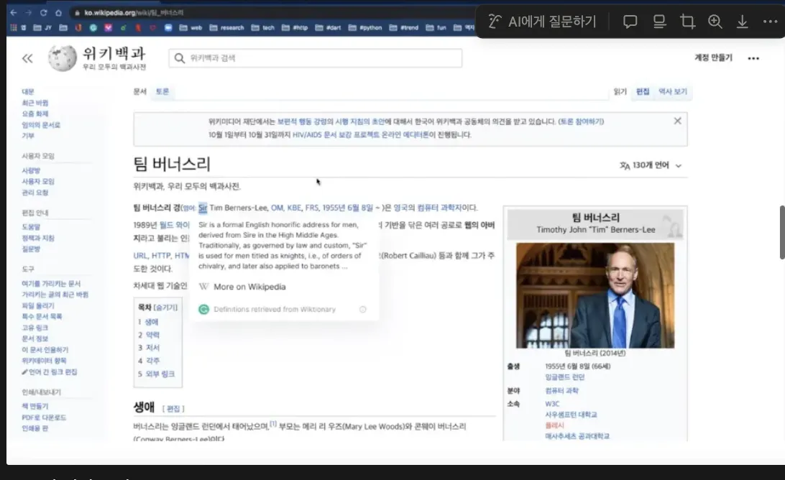

### 팀 버너스 리

- WWW의 아버지
- 웹 브라우저의 초기 버전, WWW의 핵심 기술인 HTTP, HTML을 개발하고 주도
	- HTTP, HTML 두 기술을 기반으로 **최초의 웹 서버**와 **최초의 웹 브라우저**를 직접 개발
- 이 기점으로 인터넷이 ARPANET 시절의 '생존성(survivability)'이라는 초기 목표에서 벗어나, '정보의 연결(하이퍼링크)'이라는 **전혀 다른 방향성**을 가지고 발전

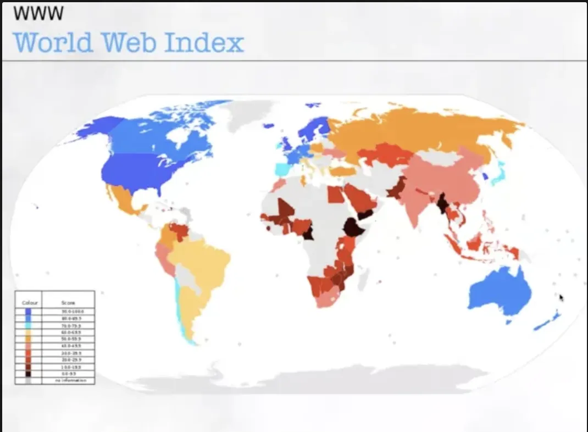

### World Wide Web 인덱스
→ 이 슬라이드는 **WWW 인덱스**, 즉 국가별 **인터넷 트래픽**을 보여주는 지도

	- (파란색일수록 트래픽 지수가 높음)
- **미국, 대한민국 (파란색):**인터넷 트래픽이 매우 높은 국가입니다. 특히 한국은 WWW(웹) 도입에 매우 열정적이었으며 최고 수준의 트래픽을 보입니다. 영국 또한 소프트웨어 강국으로 트래픽이 높습니다.
- **일본 (밝은색/낮음):**의외로 지수가 낮은데, 이는 초기에 유선 통신보다 **무선(이동통신)**이 먼저 발달하면서 상대적으로 유선 인터넷(WWW) 발전이 더뎠기 때문입니다.
- **신흥국 동향:**신규 국가들은 **유선 인프라 구축이 어렵기 때문에, 유선망(WWW)을 건너뛰고 이동통신(모바일) 중심으로 네트워크가 발달하는 경향**이 있습니다.

## World Wide Web의 역사

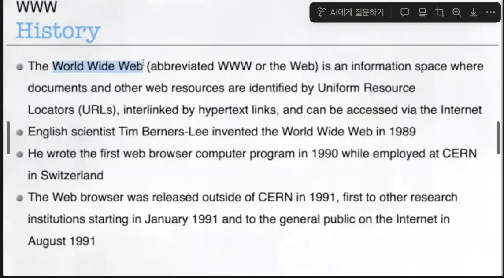

### WWW

- 월드 와이드 웹(WWW 또는 웹으로 약칭)은 문서 및 기타 웹 리소스가 URL(Uniform Resource Locators)로 식별되고, 하이퍼텍스트 링크로 상호 연결되며, 인터넷을 통해 액세스할 수 있는 정보 공간

### WWW의 역사

- **팀 버너스리**가 **1989년 CERN**에 근무하며 발명
	- 화면에 나온 것을 누르면 추가 정보가 나오는 개념 자체는 오래됨
	- 이를 네트워크로 전송하는 형태를 고안한 것
- 개발 목적은 CERN의 연구자들이 연구 결과와 **자료(텍스트, 글, 그림 등)를 더 쉽게 공유**하기 위함
- 최초의 웹 브라우저
	- 1991년 CERN에서 발명
	- 초기에는 PC가 아닌 **워크스테이션**(서버와 데스크탑의 중간 형태)에서 주로 사용
	- 1991년 외부로 공개
- 대중화의 계기
	- 1995년 MS 윈도우 95(Windows 95)에 **인터넷 익스플로러**가 탑재되면서부터
 - 그 이전에 윈도우가 TCP/IP를 지원하기 시작한 것이 기반
	- 현재 일반인들이 사용하는 WWW는 약 25년의 역사를 가짐, 그 이전에는 연구자들의 것
- 대중화 이후, WWW는 텍스트 중심에서 벗어나 **비디오, 오디오 등의 멀티미디어 데이터를 전송**하는 것이 주 용도
	- 현재 전 세계 트래픽의 **95%를 비디오(WWW)가 사용할 정도**
	- 이 과정에서 **HTTP**를 사용하게 되면서, 자연스럽게 서비스를 요청하는 '클라이언트(Client)'와 서비스를 제공하는 '서버(Server)'로 역할이 나뉘게 됨
***

# HTTP/1.1

## HTTP/1.1의 이해

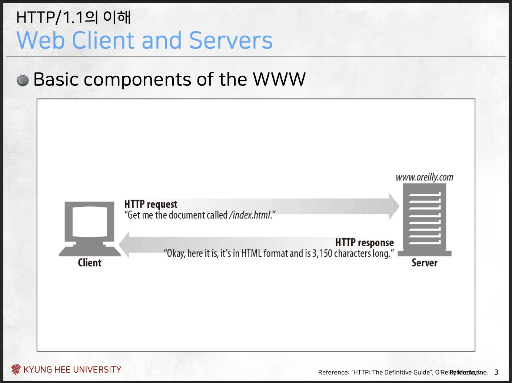

### HTTP/1.1의 이해

- WWW의 기본 구성 요소
- 기본적으로 Client-Server 모델(아키텍처)을 기반으로 함
	- **클라이언트 (Client):**웹 브라우저, 스마트폰, PC 등 서비스를 요청하는 주체
	- **서버 (Server):**요청을 받아 처리하고 응답을 주는 주체
- 동작 방식
	- 클라이언트가 "이거 주세요"라는 request(요청)를 보내면, 서버가 "여기 있습니다"라는 response(응답)를 줍
	- ex) 위 그림은클라이언트가 `/index.html` 문서를 요청(req)하고 서버가 해당 HTML 문서를 응답(res)하는 **1:1 요청-응답 쌍**이 가장 기본적이고 간단한 형태

### HTTP/1.1의 특징

- http의 기장 기본이 되는 프로토콜
- **다양한 언어에서 지원**
	- **Python**같은 언어는 HTTP 라이브러리를 잘 지원하지만, C/C++ 같은 언어는 지원이 미비할 수 있음
	- http1.1은 거의 모든 언어에서 기본지원
- 간단한 형태의 서비스는 **http1.1**을 주로 사용
	- 기술적으로 앞서가거나 대규모 트래픽을 다루는 곳(예: 넷플릭스, YouTube)은 성능이 개선된 **http2**나 **http3**를 메인으로 사용

### HTTP의 확장
→ HTTP/1.1은 단순히 '웹 브라우저'와 '웹 서버' 간의 **콘텐츠(html, 이미지, 오디오)**전송에만 사용되지 않음

- **정보(데이터) 전송**
	- 컴퓨터'와 '컴퓨터' 사이, 또는 '프로세스'와 '프로세스' 사이에서 **정보를 실어 나르는 용도**로 사용
- **유사 표준 (JSON/RESTful)**
	- 이렇게 프로세스 간 통신에 HTTP를 사용할 때, 데이터 형식은 **JSON**을, 통신 구조는 **RESTful 아키텍처**를 따르는 경우가 많습니다. (이것들이 HTTP 표준 자체는 아니지만 사실상의 표준처럼 쓰임)
- **gRPC로의 발전**
	- 이러한 서버/프로세스/컴퓨터 간의 정보 교환 요구가 발전하여, **http2**를 기반으로 하는 더 효율적인 통신 기술인 **gRPC**가 등장

# Resource

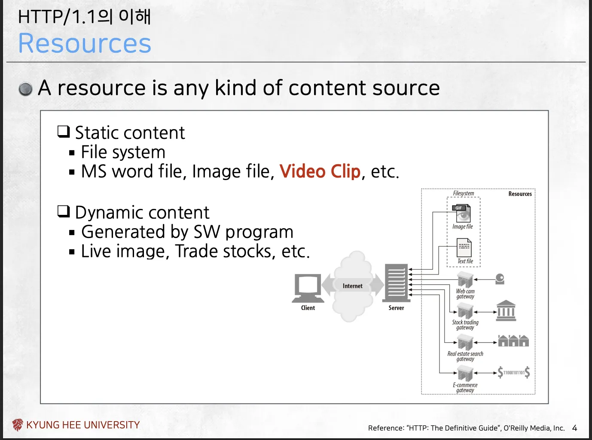

### 리소스란

- 모든 종류의 콘텐츠 소스
- 클라이언트가 서버에 요청해 받아오는 무언가
	→ 본질적으로는 바이트 덩어리(=파일)임

### 리소스의 유형

1. Static Content
	- 클라이언트의 요청이 오기 전부터 이미 파일 시스템에 존재하는 콘텐츠
	- 텍스트 파일, 이미지 파일, 비디오 파일, 실시간 스트리밍 파일(→아래에서 자세히 설명) 등
2. Dynamic Content
	- SW에 의해 클라이언트의 요청이 오는 시점에 서버가 새로 생성해 응답하는 콘텐츠
	- 라이브 이미지, 주식 거래 이미지 등 곧장 만들어서 응답하는 것

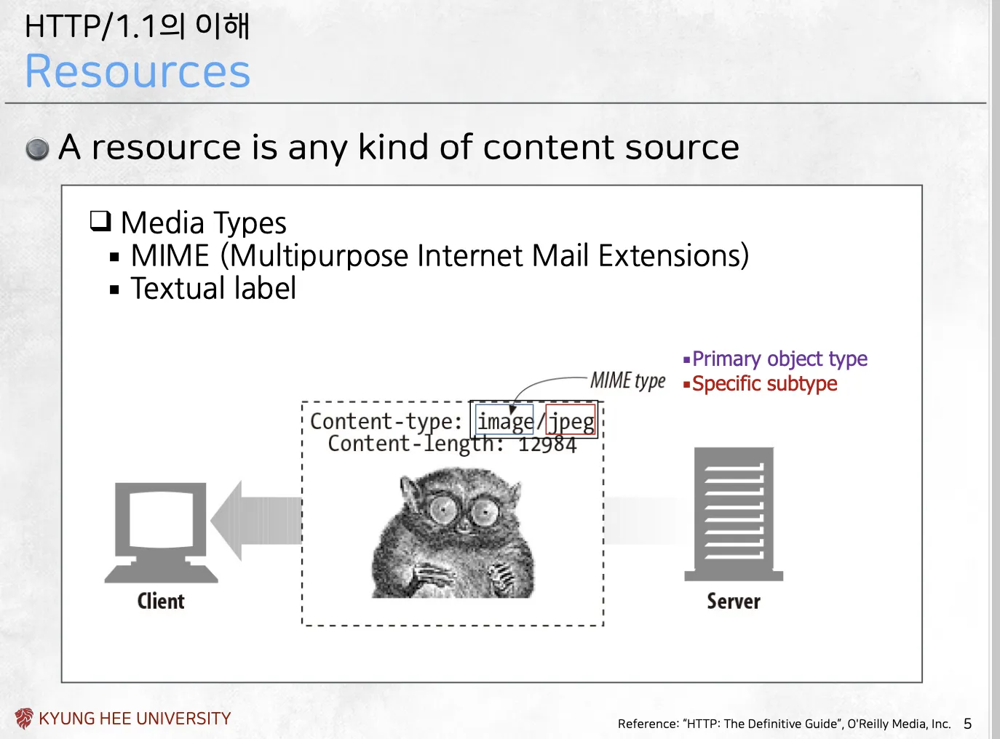

### HTTP 응답의 기본 구조

- http는 클라이언트와 서버가 파일을 주고 받는 것을 목적으로 함
	- 클라이언트가 리소스를 요청하면 서버는 응답을 보냄
- 서버는 단순히 파일 덩어리만 보내는 것이 아닌, 파일이 무엇인지 설명하는 메타데이터도 전송
	- **`Content-length`****(콘텐츠 길이):**리소스의 크기를 바이트(byte) 단위로 명시
 →(예: 12984 bytes)

	- **`Content-type`****(콘텐츠 유형):**전송하는 리소스가 어떤 종류의 파일인지 명시
 → (예: `image/jpeg`)

### MIME(Multipurpose Internet Mail Extension)

- 본래 이메일에서 사용되는 포맷
	- 초기 텍스트만 전송 가능했던 이메일에서 다목적의 동영상, 이미지 등을 보낼 수 있게 확장하는 미디어 표준
- HTTP에서 이 포맷을 차용
- `주 타입/하위 타입` 형태로 나타내는 텍스트 레이블
	- `image/jpeg` → 이 리소스는 이미지(image)이고, 그중에서도 **JPEG**형식
	- `text/html` → 이 리소스는 텍스트(text)이고, 그중에서도 **HTML**형식
→ 또한 HTTP는 바이트 단위 처리로 읽을 수 있으므로, 텍스트 레이블을 사용

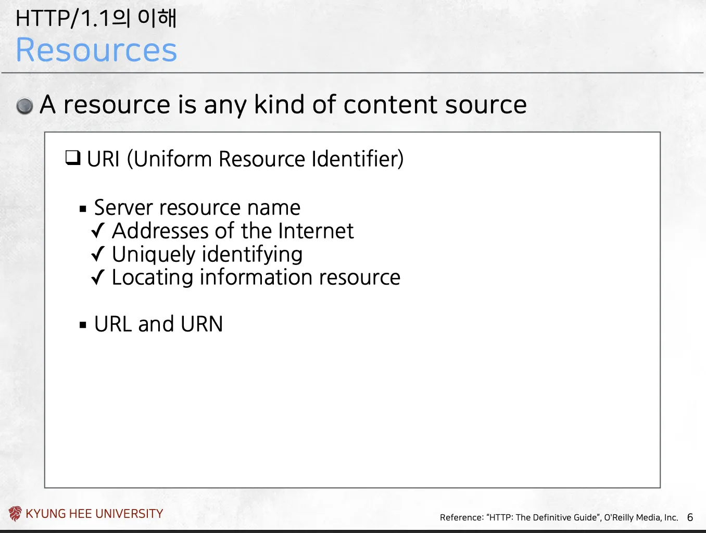

### URI(Uniform Resource Identifier)

- 클라이언트가 서버에 무엇인가를 요청하기 위해 사용하는 정보
	- 근본적으로 파일을 식별하는 방법
- 인터넷 상의 특정 리소스를 고유하게 식별하게 하는 의미
- Uniform → 요청하려는 리소스(콘텐츠)의 종류와 상관없이 (예: HTML 파일, 이미지, 동영상 등), **언제나 동일한 형태로 파일을 식별**
- 두 가지 방식으로 나뉨
	1. URL(Uniform Resource Locator)
 - 리소스의 위치를 기반으로 식별
 - ex) [www.naver.com/~/~.html](http://www.naver.com/~/~.html)
	2. URN(Uniform Resource Name)
 - 리소스의 이름을 기반으로 식별
	→ 보통은 URL을 사용

# Transaction

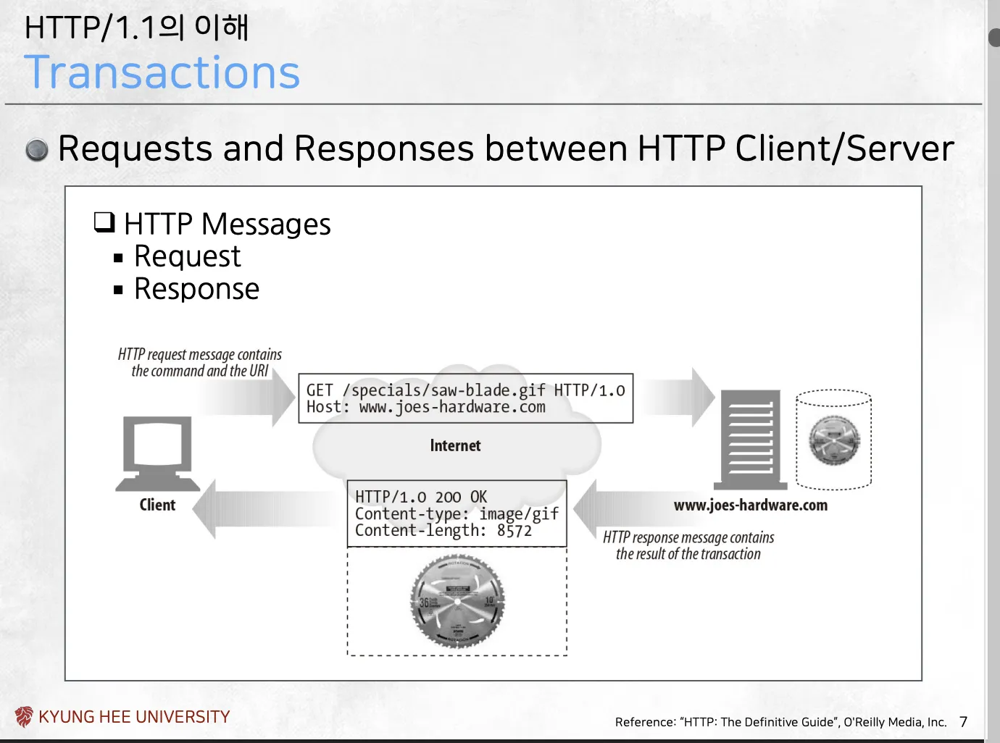

### HTTP 트랜젝션

- http통신의 기본 단위, 요청과 응답의 하나의 쌍으로 이뤄짐

### HTTP 트랜젝션의 동작 과정

- 클라이언트가 서버에게 무언가를 요청할 때, "무엇을 요청할 것인지"를 식별하는 주소가 필요
	- 컴퓨터 내부에서는 '파일 시스템'으로 파일을 식별 → 이와 유사한 포멧으로 컴퓨터를 식별, 내부 디렉터리를 식별하는 URL을 사용
	→ 이를 사용해 요청함

- HTTP는 이 URL을 기반으로 다음과 같은 형태의 '요청'과 '응답' 메시지를 주고받음
	- **요청 (Request) 메시지:**클라이언트가 서버에게 보냄
 - **`GET /... HTTP/1.1`****(시작줄):**
 - `GET` : 무엇을 할지 나타내는 명령 (Method)
 - `/specials/saw-blade.gif` : 무엇을 원하는지 나타내는 경로 (Path/URL)
 - `HTTP/1.1` : 사용할 **프로토콜**버전
 - **`Host: ...`****(헤더):**
 - `Host` : 요청을 보낼 서버의 주소(도메인)
	- **응답 (Response) 메시지:**서버가 클라이언트에게 회신
 - **`HTTP/1.1 200 OK`****(상태줄):**
 - `HTTP/1.1` : 사용된 **프로토콜**
 - `200` : 요청 처리 결과를 나타내는 **응답 상태 코드**
 - **헤더:**`Content-type` (리소스 종류), `Content-length` (리소스 크기) 등

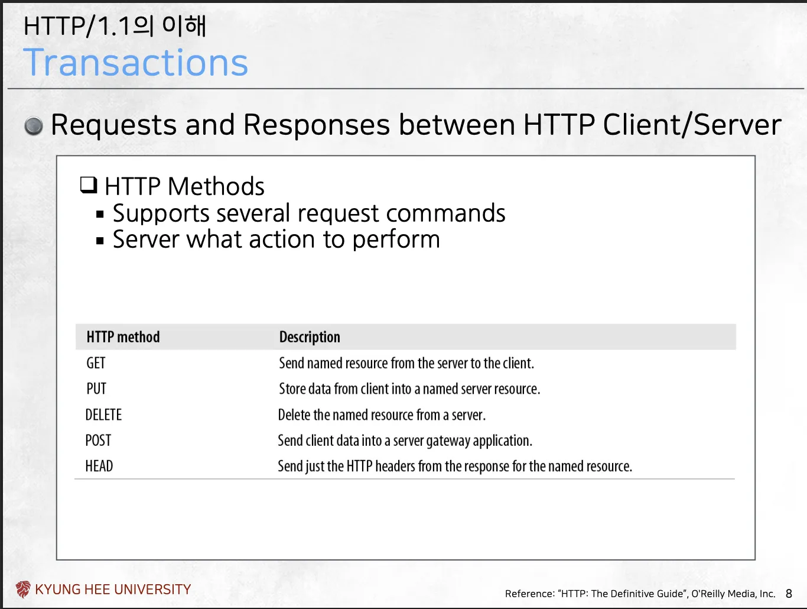

### HTTP메서드

- 요청 메시지에서 서버에게 원하는 작업을 명령하는 부분
- GET → 해당 리소스를 달라는 요청, 받으면 서버에서 클라이언트로 명명된 리소스를 전송
- **PUT → 해당 리소스를 저장해달라는 요청, 받으면 **클라이언트에서 서버로 명명된 리소스를 저장
- **DELETE → 해당 리소스를 삭제해달라는 요청, 받으면 **서버에서 명명된 리소스를 삭제
- **POST → 이 입력값(파라미터)로 서버에서 명령을 수행해달라는 요청, 받으면 **클라이언트 데이터를 서버 게이트웨이 애플리케이션으로 전송
- **HEAD → GET과 동일, **명명된 리소스에 대한 응답의 HTTP 헤더만 전송

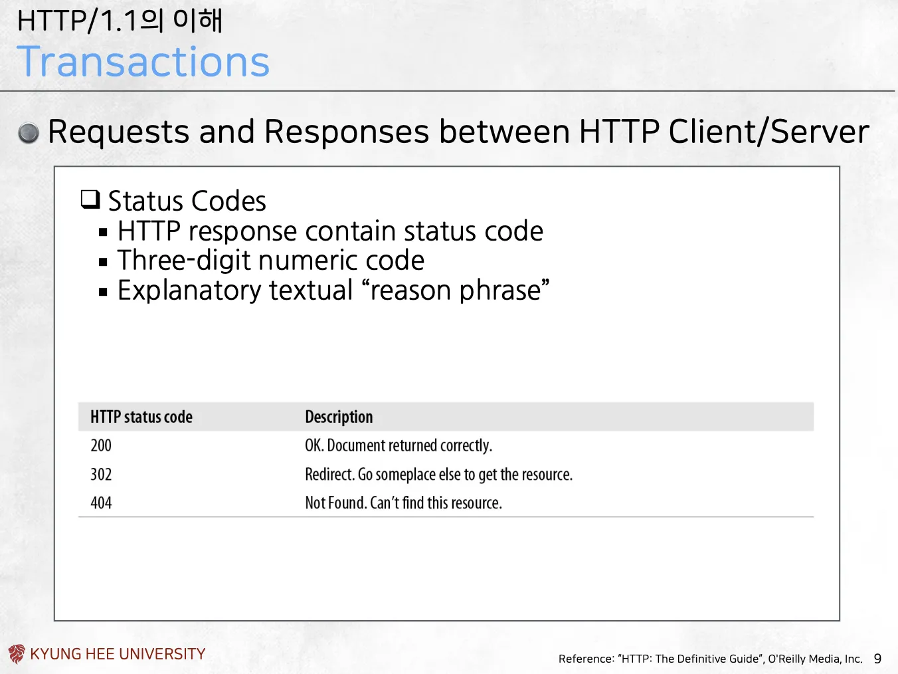

### 응답 상태 코드

- 서버는 요청을 처리한 뒤, 그 결과를 '상태 코드'로 알려줌
- **숫자 + 문자 조합:**상태 코드는 `200 OK`, `404 Not Found`처럼 숫자와 문자로 구성
	- **숫자(예: 200, 404)는 프로그램(브라우저)이 읽고**기계적으로 처리하기 위한 것
	- **문자(예: OK, Not Found)는 개발자(사람)가**디버깅 등을 위해 쉽게 읽고 이해하기 위한 것
- ex)
	- 이 코드를 통해 요청이 성공했는지(`200`)
	- 요청한 파일이 없는지(`404)`
	- 다른 주소로 가야 하는지(`302`, 리다이렉트)
	- 다양한 문제 상황과 결과를 표현할 수 있습니다.

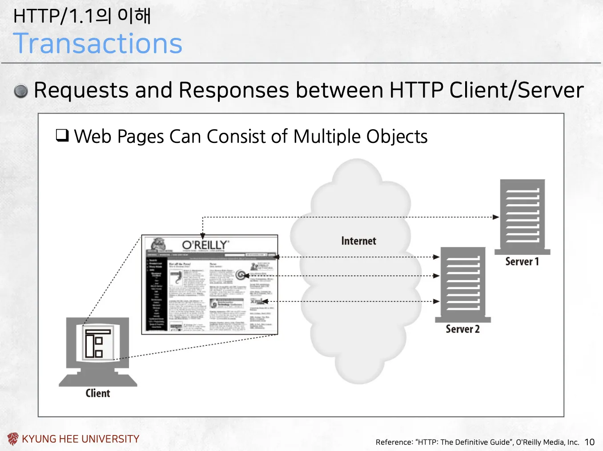

### 복합 객체와 트랜잭션

- 현대의 웹 페이지는 `index.html` 파일 하나로 이루어져 있지 않음
	- 하나의 HTML 파일 안에 여러 개의 이미지, 스크립트 파일, CSS 파일 등이 포함
⇒ 브라우저가 웹 페이지 하나를 띄우기 위해서는 이 **모든 '객체(Object)'를 각각 별개의 HTTP 트랜잭션(요청/응답)으로**가져와야 함
ex)`Server 1`에서 `index.html`을 `GET`으로 받아온(트랜잭션 1) 브라우저가 그 내용을 분석하다가 `Server 2`의 `ad.jpg`라는 이미지가 필요한 것을 발견하면, `Server 2`로 `ad.jpg`를 `GET`하는 새로운 트랜잭션(트랜잭션 2)을 다시 시작

# Message

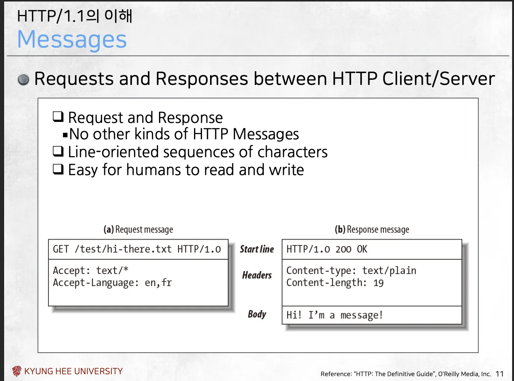

### 메시지

- http 클라이언트/서버 사이 요청 및 응답
	→ http의 유일한 통신 수단

- 요청
	- 클라이언트(브라우저)가 서버에게 보내는 메시지
	- 시작줄 → http 메서드 / 요청 리소스 URL / 프로토콜 버전
	- 헤더 → 요청에 대한 부가 내용
 - `Host: www.joes-hardware.com`: (이전 자료) 어느 서버에게 요청하는지
 - `Accept: text/html...`: 서버가 이 형식이 아니면 보내지 않거나, 변환해서 보내도록 유도
 - `Accept-Language: en`: 허용 언어 설정
 - `User-Agent: ...`: 현재 요청을 보내는 프로그램(ex. 크롬브라우저)
	- 본문 (Body)
- 응답
	- 서버가 클라이언트의 요청을 받아 처리한 뒤, 그 결과를 돌려주는 메시지
	- **시작줄 (Status line)**
 - `HTTP/1.0 200 OK`: (이전 자료) 프로토콜 버전과 상태 코드(200 OK)
	- **헤더 (Headers):**응답하는 리소스에 대한 부가 정보
 - `Content-type: text/html`: 요청한 리소스의 타입
 - `Content-length:` : 요청 리소스의 길이
	- 본문
 - 라이언트가 요청한 **실제 리소스 데이터**(예: HTML 코드)가 담김

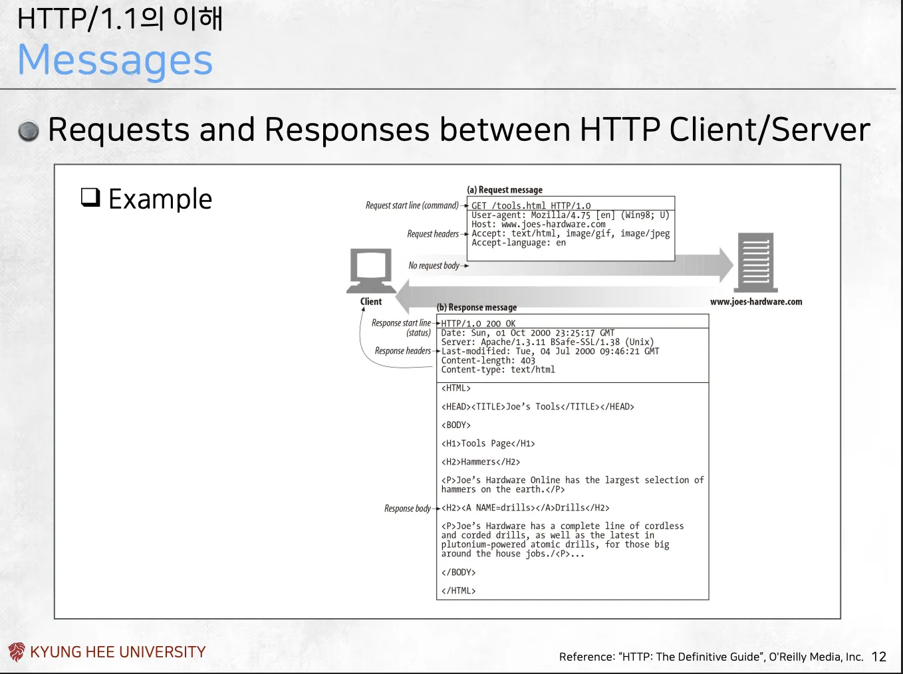

서버 입장에서 **웹 서비스**는 **"무차별적으로"**불특정 다수를 상대해야 함

- **(문제)**서버는 요청을 보내는 클라이언트가 **누구인지, 어떤 사람인지 전혀 모름**
- **(다양성)**클라이언트는 **수많은 종류의 브라우저**(크롬, 파이어폭스, 엣지...)와 **수많은 장치**(PC, 안드로이드폰, 아이폰...)를 사용
	- 그나마 애플(iOS)은 기기(디바이스)가 한정적이라 **컨트롤이 가능**한 환경
	- 반면 **안드로이드**는 오픈소스이고 제조사가 많아 자율성은 높지만 **컨트롤이 불가능**
**⇒ (결론)**

	- 이렇게 통제 불가능하고 다양한 환경 때문에,
	- 클라이언트는 "나는 이런 브라우저고, 이런 언어를 선호하고, 이런 파일만 받을 수 있다"는 **모든 정보를 헤더에 다 기입**해서 서버에 알려줘야만 함
	→ 이 복잡성 때문에 웹 서비스 개발이 '지저분하다(messy)'고 표현

# Connection

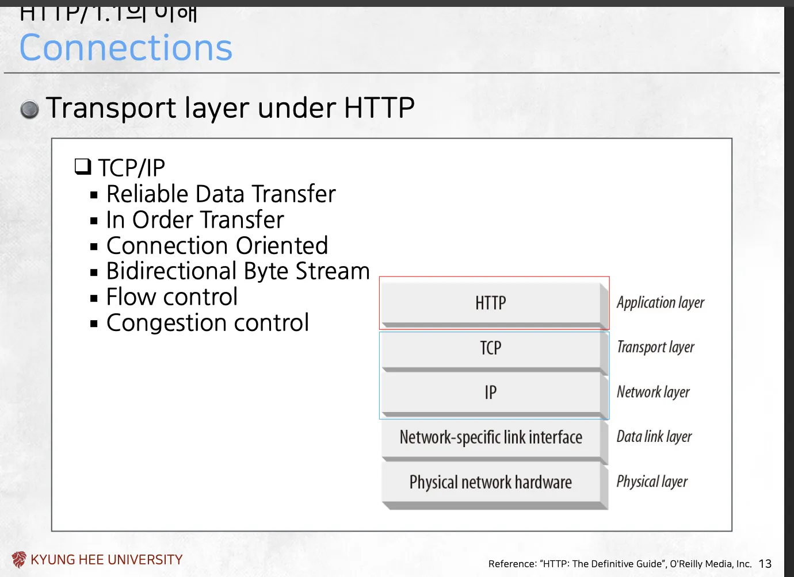

### HTTP하위의 전송 계층 → TCP

- HTTP는 TCP를 전송 계층으로 사용, 이를 전제하고 설계
	- HTTP는 그 자체로 매우 간단하게, request(요청)와 response(응답)만 주고받도록 설계
 → 부담스러운 작업은 TCP의 신뢰성을 믿고 처리

- **TCP/IP는 아래 기능을 제공**
	- 신뢰할 수 있는 데이터 전송
	- 순서 보장
	- 연결 지향
	- 양방향 바이트 스트림
	- 흐름 제어
	- 혼잡 제어
⇒ HTTP는 `req`/`res`라는 '명령'만 알 뿐, 연결을 설정(`connect`)하거나 해제(`close`)하는 복잡한 과정은 모두 **'믿고'**그 하위의 **TCP**에게 맡김

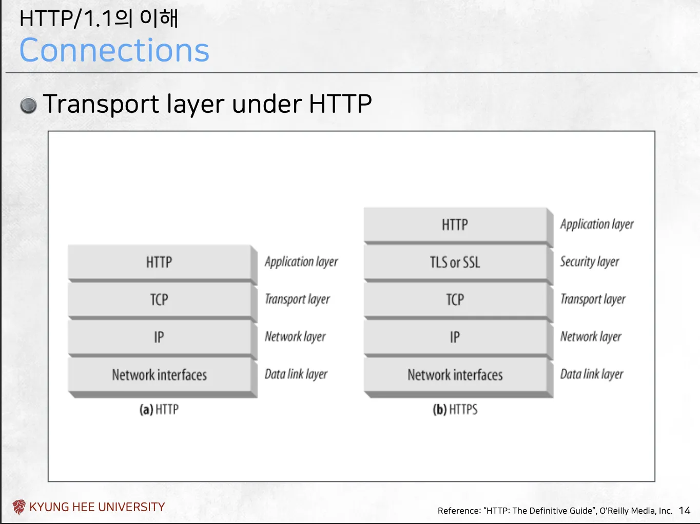

→ 위는 http, https의 프로토콜 스택

### HTTPS

- 통신 분야의 보안은
	- 인증(상대가 진짜인지 확인)과 암호화(데이터 스니핑에도 내용을 알 수 없게)가 중심
	⇒ 이를 위해 HTTP가 등장

- 기존 HTTP의 TCP 사이에 보안을 위한 암호화 계층(SSL or TLS)을 삽입 → HTTPS

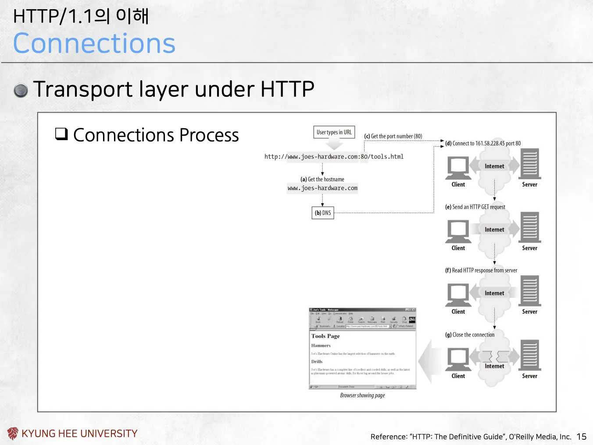

### 웹 브라우저 기준 실제 동작
→ 웹 브라우저에서 주소를 입력했을 때, 이 스택(HTTP + TCP)이 동작하는 실제 순서

1. **도메인 입력:**사용자가 `www.joes-hardware.com` 같은 도메인 이름을 입력하고 엔터를 침
2. **DNS 조회:**브라우저는 먼저 DNS 서버에 '호스트 이름'을 물어봐서 실제 서버의 **IP 주소**로 변환
3. **TCP 연결 (소켓 열기):****TCP 계층**이 서버의 IP 주소와 지정된 포트(HTTP는 80)로 소켓 연결(3-way handshake)을 시도
4. **HTTP 요청:**TCP 연결이 성공적으로 열리면, 비로소 **HTTP 계층**이 그 연결(파이프)을 통해 `GET /tools.html ...` 같은 **HTTP 요청 메시지**를 전송
5. **HTTP 응답:**서버가 요청을 처리하고, 동일한 TCP 연결을 통해 **HTTP 응답 메시지**를 보냄
6. **TCP 연결 종료:**응답을 받고 나면, 일정 시간이 지나거나 명시적인 요청이 있을 때 **TCP 연결이 끊어짐**

# HTTP의 아키텍처 구성 요소

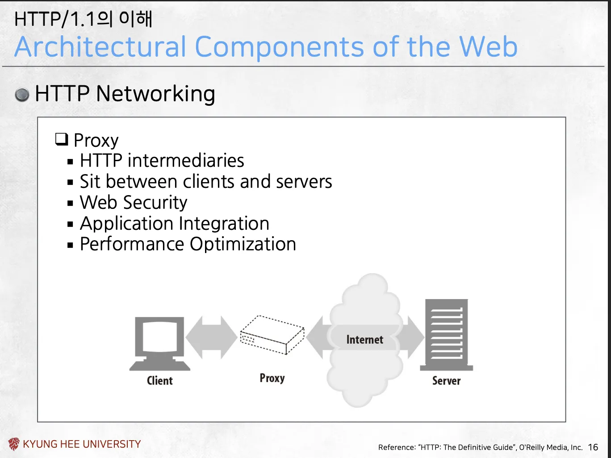

## 프록시
→ HTTP 중개자/ 클라이언트와 서버 사이에 위치/ 웹 보안/ 애플리케이션 통합/ 성능 최적화

- 서버, 클라이언트 사이에는 프록시가 존재할 수 있음
- 프록시는 네트워크의 관문에 설치되어 모든 트래픽이 이곳을 경우하게 함
- **프록시의 역할:**프록시는 단순히 통신을 중개하는 것을 넘어 여러 유용한 기능을 수행
	- **성능 최적화 (Performance Optimization):**
 - **(캐싱)**프록시 서버는 자주 요청되는 리소스(예: 이미지, 비디오)를 미리 복사본으로 저장(캐싱)
 - 만약 클라이언트가 동일한 리소스를 요청하면, 원본 서버까지 가지 않고 프록시가 즉시 응답
 - 이를 통해 **응답 시간을 단축**하고 **네트워크 트래픽을 감소**
	- **웹 보안 (Web Security) / 정책 적용**
 - 프록시는 모든 요청/응답을 검사할 수 있으므로, 특정 사이트 접근을 막는 블랙리스트(Blacklist)나 허용된 사이트만 접근시키는 **화이트리스트(Whitelist)**같은 정책(policy)을 적용하는 데 사용
	- **애플리케이션 통합:**(슬라이드) 여러 시스템을 연결하는 관문 역할

## HTTP/1.1의 문제점

- **(문제 1) TCP 의존성 및 비효율적 연결**
	- HTTP/1.1은 **매 요청(Request)마다 TCP 연결(connect)과 종료(disconnect)를 반복**하는 것을 기본으로 설계되어 매우 느림
	- 이를 개선하기 위해 'Keep-Alive(연결 유지)' 옵션이 생겼지만, 이는 반대로 일정 시간 연결을 유지해야 해서 **서버의 부하(load)가 커지는**문제를 유발
	- 또한 TCP의 **혼잡 제어(congestion control)**같은 성능 문제를 그대로 물려받음
- **(문제 2) Head-of-Line Blocking (HOLB)**
	- **(핵심 문제)**HTTP/1.1은 **요청을 보낸 순서대로 응답을 받아야만**함
	- 만약 1, 2, 3번 요청을 보냈는데, 서버가 2, 3번 응답은 준비가 끝났어도 **1번 응답이 늦어지면(지연), 2, 3번은 1번이 끝날 때까지 대기해야 함**
 → 이 때문에 전체 속도가 저하

- **(문제 3) 비효율적인 헤더 (Large Headers)**
	- 매 요청마다 중복되는 내용이 많은 **헤더의 크기가 너무 큼**
	- 또한 사람이 읽을 수 있는 **바이트(텍스트) 기반**인 점은 디버깅엔 편하지만, 비트(bit) 기반 통신에 비해 성능상 비효율적
- **(문제 4) 서버 푸시(Server Push) 불가**
	- HTTP/1.1은 오직 클라이언트의 요청(Request)이 있어야만 서버가 응답(Response) 가능
	- 서버가 클라이언트에게 새로운 데이터가 생겼어!"라며 **먼저 데이터를 밀어 넣어줄(Push) 수 없음**
→ 이후 http/2, http/3 등장의 배경이 되는 문제점들
→ 추가로 빅데이터, 인공지능 등의 기술이 나온 이유는

	- 야후, 구글 등은 본인 서버에 http요청이 들어온 시점이 t0일 때 모든 동작을 하고 다시 http response가 회사의 가장 앞단의 서버에서 응답으로 나갈 때 까지, 야후는 100ms아래로 해야함
 → 100ms는 고객이 떠나지 않는 시간으로 설정, 이 시간이 지나면 고객 이탈

 - 정해진 시간에 이미지, 오디오, 텍스트에도 모두 100ms여야 함
	- 다만, 처리할 정보다 너무 많아 기존 기술로는 불가능, 신기술 사용
 - 빅데이터 → 많은 데이터를 100ms안에 응답
 - 데이터 기반 인공지능 → 못찾으면 확률, 통계를 기반으로 때려 맞추는 것

# HTTP Method

### 1. GET (두 번째 슬라이드)

- **(슬라이드)**`GET` / `가장 일반적인 메서드` / `서버에게 리소스를 보내달라고 요청`
- **(설명)**가장 기본이 되는 메서드입니다. 서버에 특정 파일(리소스)을 달라(Get)고 요청하여 받아오는 데 사용

### 2. PUT (두 번째 슬라이드)

- **(슬라이드)**`PUT` / `서버에 문서를 작성` / `PUT을 수행하기 전에 서버가 비밀번호를 요구할 수 있음`
- **(설명)**`GET`의 반대 개념입니다. 클라이언트가 서버로 특정 파일(리소스)을 보내서 저장(Put)하라고 요청하는 데 사용

### 3. POST (다섯 번째 슬라이드)

- **(슬라이드)**`POST` / `서버에 입력 데이터를 전송`
- **(설명)**`GET`, `PUT`이 주로 '파일(리소스)' 자체를 다루는 것과 달리, `POST`는 입력 데이터(파라미터)를 서버로 전송하여 **특정 동작을 수행**하라고 요청하는 것
- 마치 **서버의 함수(CGI 프로그램 등)를 호출**하면서 인자(arguments)를 전달하는 것과 비슷
	- 예: 웹 양식(form)에 값을 써서 제출)
- 이 방식은 HTML 파일이 아닌 **JSON, REST API**등 PC(프로세스) 간 정보를 주고받는 통신의 기반이 되며, 이는 **gRPC**같은 기술로 더욱 발전

### 4. HEAD (네 번째 슬라이드)

- **(슬라이드)**`HEAD` / `서버는 응답에 헤더만 반환` / `클라이언트는 리소스를 가져오지 않고 헤더를 검사`
- **(설명)**`GET`과 거의 동일하지만, **실제 파일(Body)은 제외**하고 **헤더(Header) 정보만**받아옴
- **클라이언트는 ****`GET`****으로 매번 파일을 다운로드할 필요 없이, ****`HEAD`****로 파일 크기(****`Content-length`****)나 수정 시점(****`Last-Modified`****) 같은 메타데이터만 확인해서 "파일이 바뀌지 않았으면 안 받아도 되겠다"라고 판단 가능 → HEAD의 용도**

### 5. OPTIONS (첫 번째 슬라이드)

- **(슬라이드)**`OPTIONS` / `서버에게 웹 서버가 지원하는 다양한 기능에 대해 알려달라고 요청`
- **(설명)**이 서버(또는 특정 리소스)가 어떤 메서드를 허용합니까?"라고 물어보는 요청
- 서버는 응답 헤더의 `Allow: GET, POST, PUT, OPTIONS`처럼 자신이 제공하는 기능(메서드) 목록을 알림
- (보안상의 이유로 서버가 이 요청을 무시할 수도 있음)

### 6. TRACE (세 번째 슬라이드)

- **(슬라이드)**`TRACE` / `클라이언트는 TRACE 요청이 최종적으로 서버에 도달했을 때 어떻게 보이는지 확인`
- **(설명)****디버깅용**메서드입니다. 요청이 클라이언트에서 서버까지 가는 동안 중간에 **프록시(Proxy)**서버를 거칠 수 있음
- `TRACE` 요청은 `GET`처럼 보내되, 프록시를 지날 때마다 `Via: ...` 같은 헤더 정보가 누적
	- 서버는 이렇게 완성된 최종 요청 메시지를 그대로 클라이언트에게 반사(echo)
- 개발자는 이 응답을 보고 "내 요청이 어떤 경로를 거쳤는지", "중간에 프록시가 내 요청을 변경하지는 않았는지" 등을 추적 가능
	- (이 또한 보안상 서버가 무시 가능)

# Status code

- 301 Moved Permanently: 새 위치로 리디렉션
	- 클라이언트가 요청한 리소스가 **영구적으로 다른 위치(URL)로 이동**했을 때 사용
- 304 Not Modified: 로컬 캐시로 리디렉션
	- 클라이언트가 이미 로컬 캐시(PC에 저장된 복사본)를 가지고 있을 때, 그 캐시를 그대로 사용해도 되는지 확인하는 과정
#

[‎Google Gemini](https://gemini.google.com/app/ec3a42565e6b76e1)
