> 원본 Notion 정리 — 강의 슬라이드 이미지 + 설명.

> [← 전체 목차](/posts/net-overview/)

***

## → WebRTC 개요

- 웹 브라우저를 기반으로 실시간 음성, 영상, 데이터 통신을 가능하게 하는 기술
- 기술의 카테고리에서 P2P에 속하는 기술
	- Peer-to-Peer
		- 클라이언트와 클라이언트가 직접 연결되는 방식
		- 중앙 서버를 거치지 않고 사용자 간에 직접 데이터를 주고받기 때문에 속도가 빠르고 서버부하가 적음
			→ 이는 조건부로 이러한 특징을 가짐, 중앙 서버를 거치는 것과 다름없을 때도 있음

	- webrtc의 최초 아이디어는 서버를 완전히 배제하는 것
		→ 현실적으로는 시그널링 서버만 거치고 실제 미디어 데이터는 직접 주고받는 구조를 지향함, 그렇지 못하는 경우도 있음

# Peer to Peer

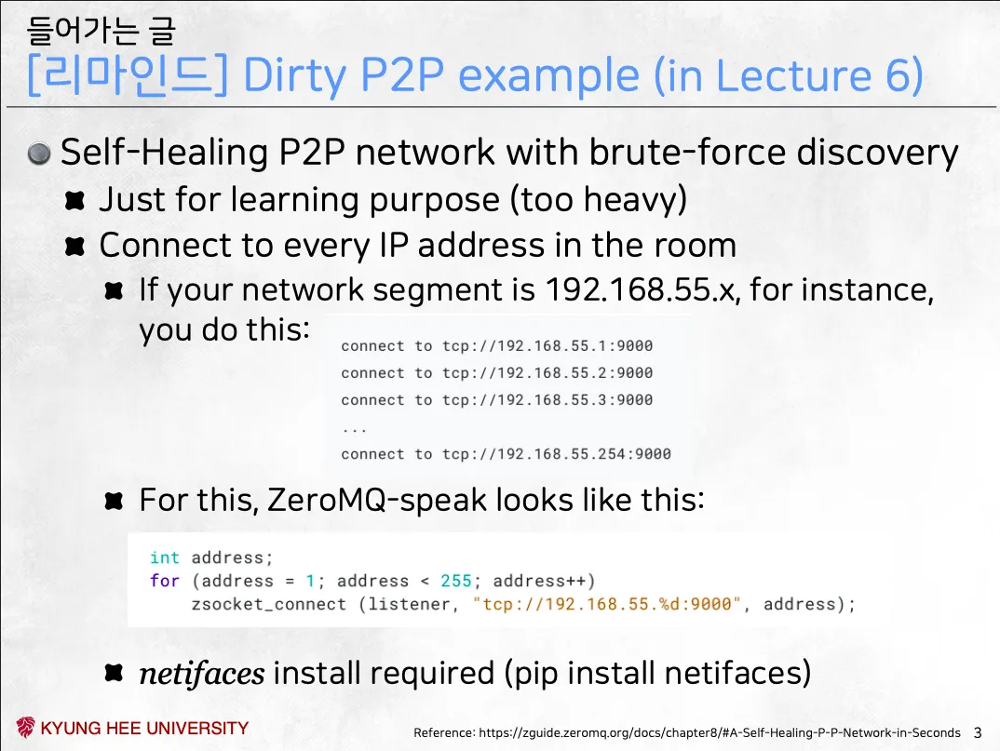

## Brute-Force 탐색을 이용한 Self-Healing P2P 네트워크

- 같은 네트워크에 있는 모든 IP주소에 연결을 시도하는 형태의 P2P 네트워크
→ 이전 ZMQ에서 구현

	- 이 방식은 너무 무거워서 실제로는 사용 불가능

### **Dirty P2P (Brute-force Discovery)**

- 서로를 찾기 위해 중앙 서버(디렉토리)를 사용하는 대신, 같은 네트워크 대역에 있는 **모든 가능한 IP 주소**에 무작위로 연결 요청을 보내는 방식
- **작동 방식:**
	1. 내 IP가 `192.168.55.10`이라면, 같은 대역(`192.168.55.x`)에 있는 1번부터 254번까지의 모든 IP에 대해 문을 두드립니다(Connect 시도)
	2. 응답하는 상대방이 있으면 연결이 성립
- **문제점:**
	- **비효율성:** 존재하지 않거나 상관없는 IP에도 모두 요청을 보내므로 네트워크 트래픽 낭비가 심하고 속도가 느림
	- **학습용:** 실제 서비스에서는 사용할 수 없는 방식이며, 오직 P2P의 기본 개념을 이해하기 위한 학습용 코드
⇒ 기존 Dirty P2P도 한쪽은 서버, 다른 한쪽은 클라이언트의 역할을 해야함
	→ 피어 A가 피어 B에 직접 접속 시도
	→ webRTC는 제 3의 시그널링 서버를 사용하는 것이 약간 다른 점

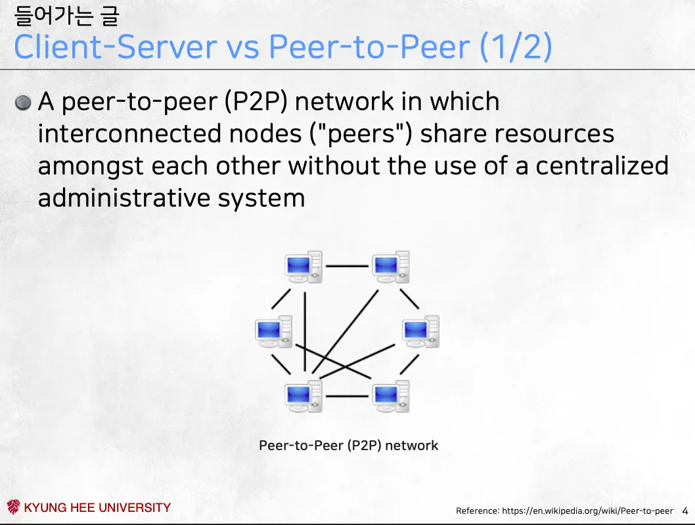

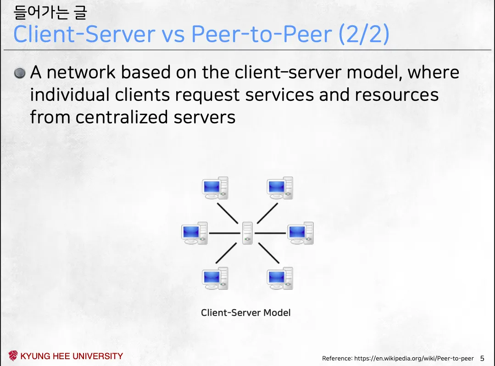

## Client Server vs P2P

### 1. P2P

- 상호 연결된 노드(=피어)들이 중앙 관리 시스템을 사용하지 않고 서로 자원을 공유하는 P2P 네트워크

### 2. Client-Server

- 개별 클라이언트가 중앙 서버로부터 서비스와 리소스를 요청하는 클라이언트-서버 모델에 기반한 네트워크
→ 중앙에서 데이터를 관리하고 통제하기 쉬운 구조

### → 비즈니스 관점의 해석

- 구글과 같은 기업은 사용자 간의 통신(P2P, ex. 갤럭시 폰과 갤럭시 TV 사이 연결)에 개입하여 광고를 보여주어야 수익이 남
- 순수 P2P는 서버가 끼어들 수 없어 광고 송출이 어려움
	→ 따라서 광고를 위해 서버를 개입시킬 필요가 생김

- 줌, 구글 미트 등은 사용자 수가 일정 이상이 늘어나면 비용이 청구됨
	- 특정 접속자 수 이상에서는 P2P가 불가능하므로 중앙 서버가 개입해야함
	- 이는 서버를 개입시킬 수 있고, 사용자에게 요금을 청구하는 근거가 됨
- 홈 네트워크에도 구글은 자사 서비스(서버)를 붙여 수익을 창출하고자 함
⇒ 기술적으로는 P2P가 효율적일 수 있는 상황(홈 네트워크 등)에서도, 

	- 플랫폼 기업은 **광고 노출과 수익 창출, 대규모 트래픽 관리**를 위해 
		- 중앙 서버가 통신에 개입하는 클라이언트-서버 모델(혹은 하이브리드 모델)을 비즈니스적으로 선호
⇒ 모든 P2P는 규모가 커지거나 노드 사이 거리가 늘어나는 경우 서버를 필요로 하게 됨

	- 접속자가 많아지거나, 글로벌 단위로 거리가 멀어지면 데이터 전송 속도, 동기화에서 문제가 생겨 서버를 개입시켜야 하는 한계 존재

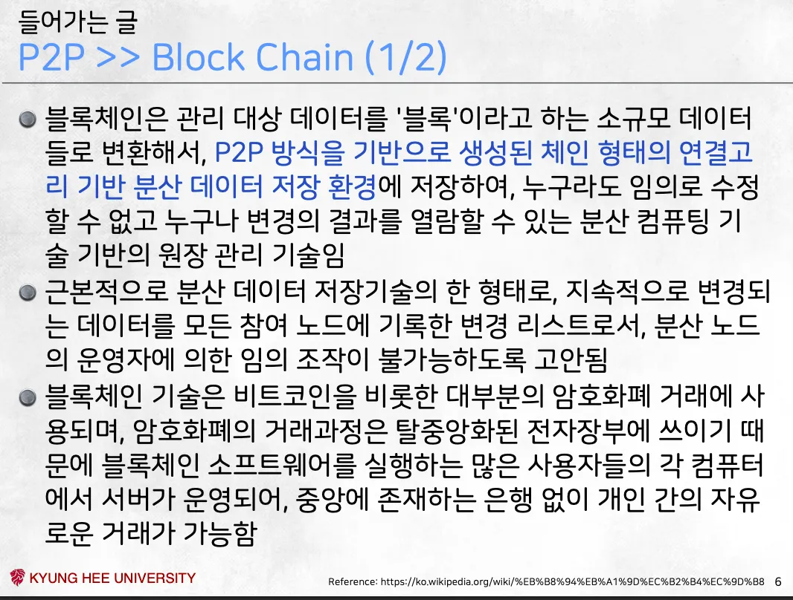

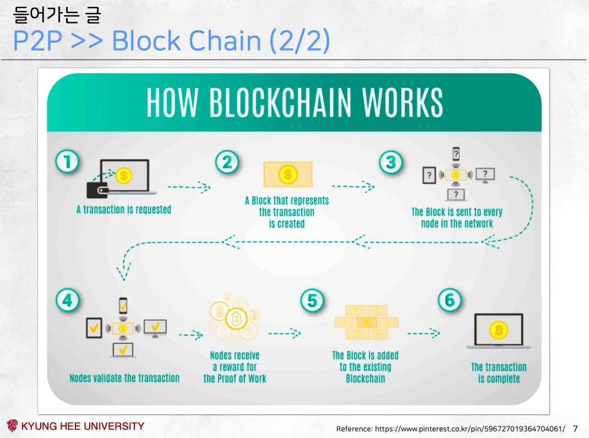

## 블록체인

- 관리 대상 데이터를 “블록”이라 하는 소규모 데이터로 변환해 
	- P2P방식 기반으로 생성된 체인 형태의 연결고리 기반 분산 데이터 저장 환경에 저장해 
	- 누구도 임의 수정할 수 없고, 누구나 변경 결과를 열람할 수 있는 분산 컴퓨팅 기술 기반 원장 관리 기술
- 근본적으로 분산 데이터 저장 기술의 한 형태
	- 지속적으로 변경되는 데이터를 모든 참여 노드에 기록한 변경 리스트
	- 운영자에 의한 임의 조작이 불가능하게 고안
- 비트코인을 비롯한 대부분 암호화폐 거래에 사용
	- 암호화폐의 거래과정은 탈중앙화된 전자장부에 쓰이기 때문에 블록체인 소프트웨어를 실행하는 많은 사용자의 각 컴퓨터에서 서버가 운영되어, 중앙에 존재하는 은행 없이 개인 간의 자유로운 거래가 가능

# WebRTC

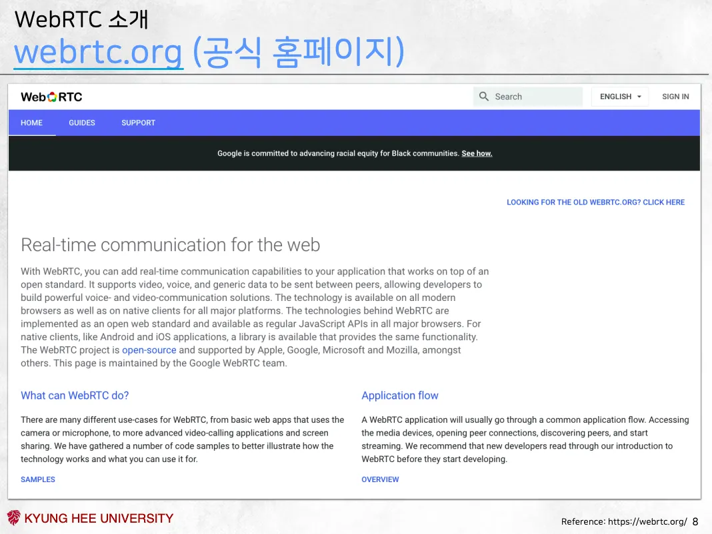

- 오픈 표준 기반
- 별도 플러그인 없이 브라우저에서 바로 실시간 통신 가능
- 카메라, 마이크 접근, 화면 공유, P2P 연결 등을 지원
- 구글, 모질라, MS, 애플 등이 참여해 표준화

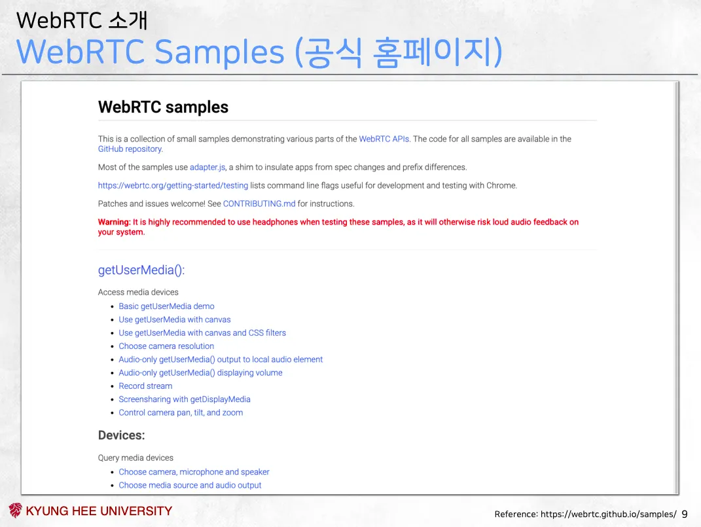

- getUserMedia() : 카메라·마이크 접근
- 화면 공유(Screen sharing)
- 음성·영상 출력 제어
- 오디오 캡처를 로컬로 출력
- 화상 채팅, 데이터 채널 테스트
- 디바이스 선택 (카메라, 마이크, 스피커)
→ WebRTC가 제공하는 기능에 대한 예시

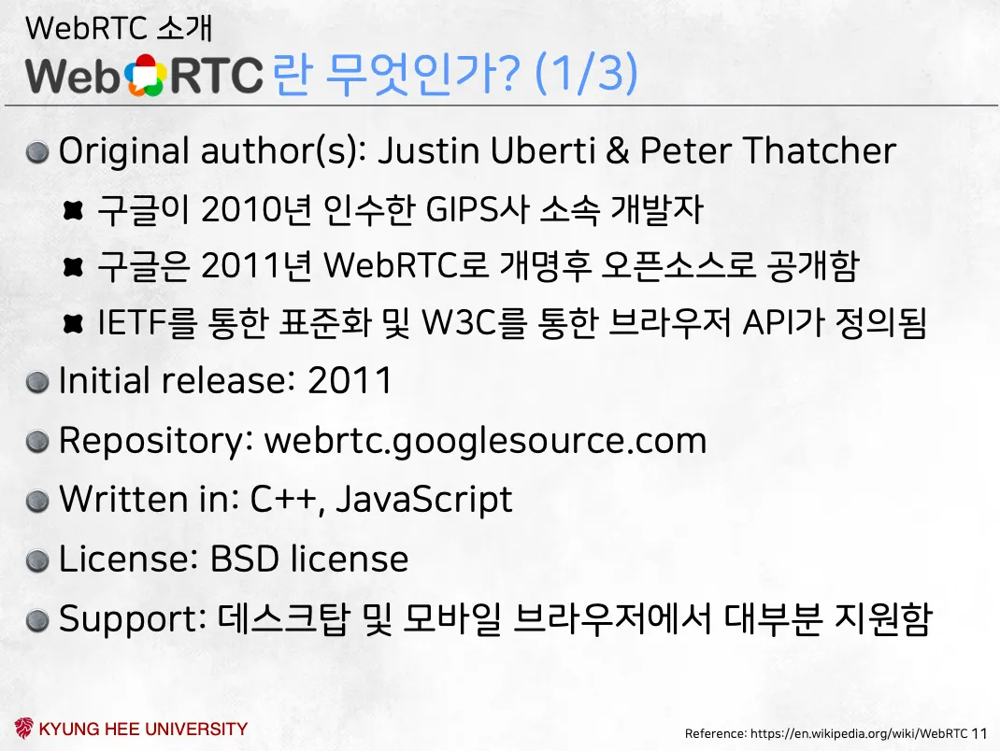

## WebRTC란

### 개요

- 원 저자: Justin Uberti & Peter Thatcher
- Google이 2010년 GIPS 회사를 인수하면서 기술 기반 확보
- 2011년 WebRTC 프로젝트를 오픈소스로 공개
- IETF와 W3C를 통해 표준화된 API
- 초기 릴리즈: 2011
- Repository: webrtc.googlesource.com
- 언어: C++, JavaScript
- 대부분의 데스크톱·모바일 브라우저 지원

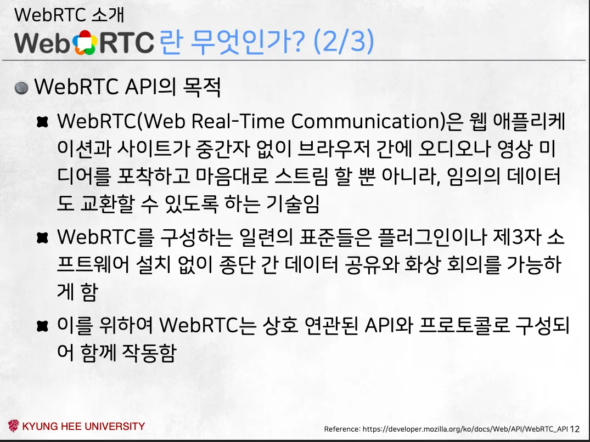

## WebRTC의 목적

- 중간 서버나 플러그인 없이 브라우저 간 직접 실시간 오디오/비디오 및 데이터 전송
	→ 중간자 없이 어떤 데이터도 전송할 수 있게 하는 것

- 이를 위해 여러 표준 API와 프로토콜이 함께 동작
- 데이터 공유, 음성/영상 회의 등 P2P 방식으로 처리
→ 클라이언트 간 직접 통신이라는 핵심 아이디어를 가짐

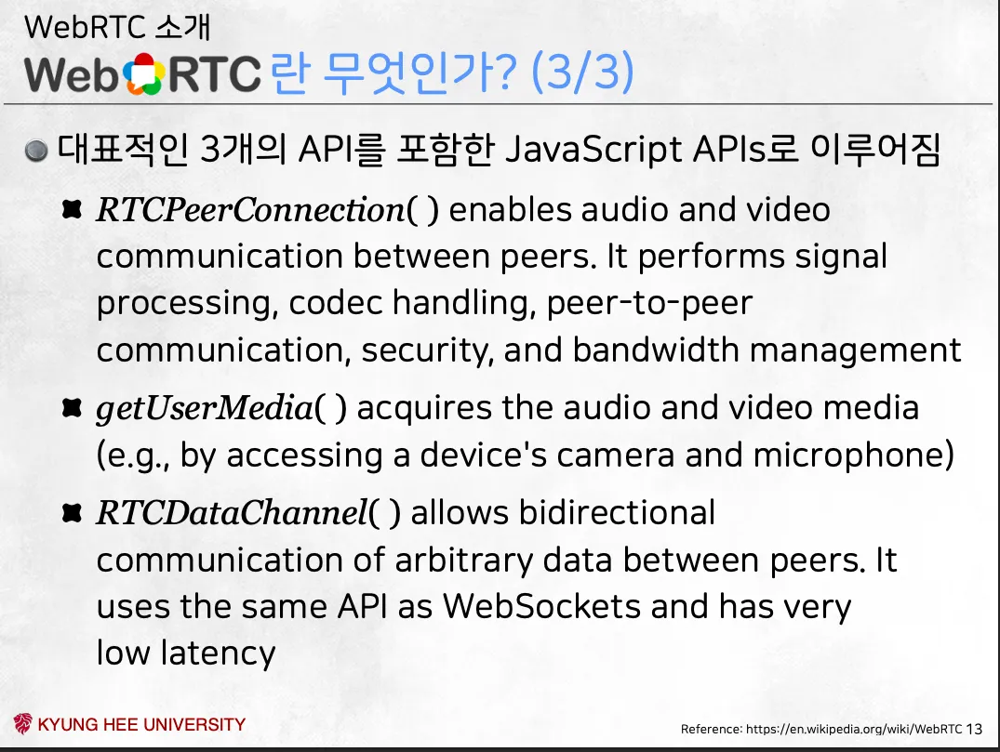

## **WebRTC의 대표 API 3가지**

1. **RTCPeerConnection()**
	- 두 클라이언트 간 **P2P 연결 생성**
	- 오디오/비디오 신호 처리, 코덱, 대역폭 관리, 보안 처리 등
2. **getUserMedia()**
	- **카메라·마이크 등의 미디어 스트림 가져오기**
	- 화면 공유도 가능
3. **RTCDataChannel()**
	- WebSockets과 유사한 API
	- 매우 낮은 지연으로 **임의의 데이터 양방향 전송**

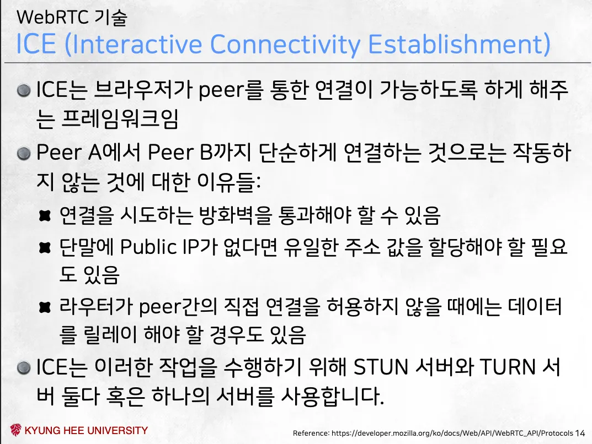

## ICE

- 브라우저가 Peer를 통한 연결을 가능하게 하는 프레임워크(→ 일종의 전체 매커니즘)
- P2P로 단순하게 연결할 경우 작동하지 않을 수 있음
	- 방화벽이나 보안 정책 때문에 외부로 연결이 안 될 수 있고
	- 대부분 사용자는 공인 IP가 아니라 공유기 내부의 private IP를 쓰기 때문에 외부에서 직접 접근 불가
	- NAT 환경에서는 P2P 연결이 깨지거나 아예 성립하지 않는 경우가 많음
- ICE는 이를 해결하기 위해 STUN, TURN 서버를 모두 사용

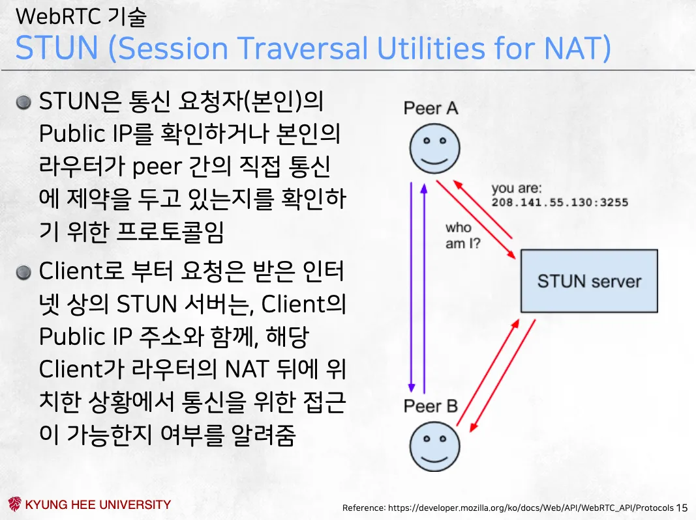

## STUN

- STUN은 **클라이언트가 외부에서 볼 때 자신의 Public IP가 무엇인지**, 그리고 **라우터(NAT)가 어떤 방식으로 통신을 변형시키는지 확인하기 위한 프로토콜**
	- 클라이언트는 인터넷 상의 STUN 서버에 요청을 보내고, STUN 서버는 그 요청이 보인 **공개 IP 주소와 포트**를 알려줌
	- 이렇게 확인한 정보는 peer-to-peer 연결(WebRTC)에서 NAT 뒤에 있어도 상대방과 직접 연결할 수 있는지 판단하는 데 사용
- Client로부터 요청을 받으면 STUN 서버는 클라이언트의 Public IP와 현재 라우터의 NAT에 뒤에 있는 상황에서 통신을 위한 접근이 가능한지 여부를 알려줌
→ **NAT 때문에 내 단말이 외부에서 보이는 IP/Port가 바뀌므로, STUN이 그것을 알려주고 통신이 가능한지 알려줌**

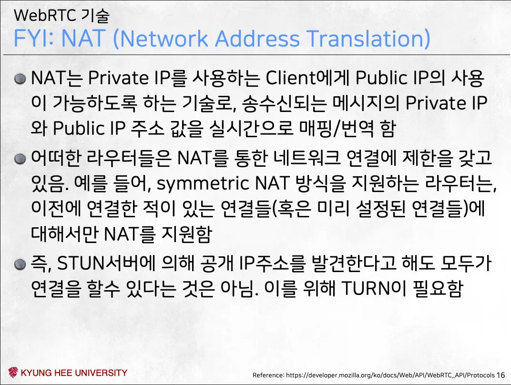

## NAT

- NAT는 **사설 IP를 사용하는 기기에게 공인 IP를 사용하는 것처럼 보이게 해주는 기술**
	- 즉, **내부 IP ↔ 외부 IP**를 라우터가 실시간으로 번역하는 방식
- NAT 방식은 라우터마다 다름
	- 특히 **Symmetric NAT를 지원하는 라우터는 **이미 통신한 적 있는 상대”에 대해서만 NAT를 지원
	- 이 때문에 **WebRTC 같은 P2P 통신 연결이 매우 어려워짐**
- **STUN으로 Public IP를 알아도, 모든 NAT 환경에서 직접 통신이 가능한 것은 아님**
	⇒ 그래서 **TURN 서버가 필요**할 때가 생김

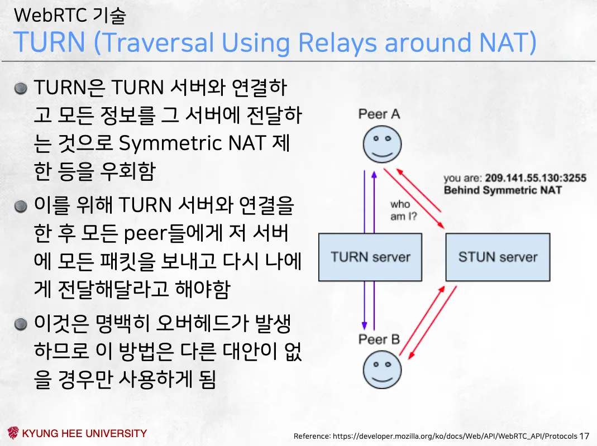

## TURN

- TURN은 **클라이언트가 TURN 서버와 연결을 맺고, 모든 패킷을 TURN 서버를 통해 보내고 받는 방식**으로 통신하는 방식
	⇒ 즉, Peer A → TURN 서버 → Peer B 구조로 완전히 중계
		→ 진짜 P2P가 아니긴 함

- TURN 서버는 모든 peer의 패킷을 받아서다시 상대방에게 전달
	- 이 과정에서 명백한 오버헤드(지연·트래픽 증가)가 발생
	→ 꼭 필요한 경우에만 사용해야함

- Symmetric NAT같은 경우가 꼭 필요한 경우에 해당하며, 일반 서버-클라이언트와 다를 것이 없으므로 이를 사용해 제한을 우회

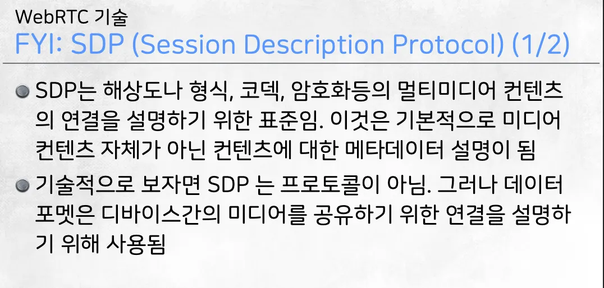

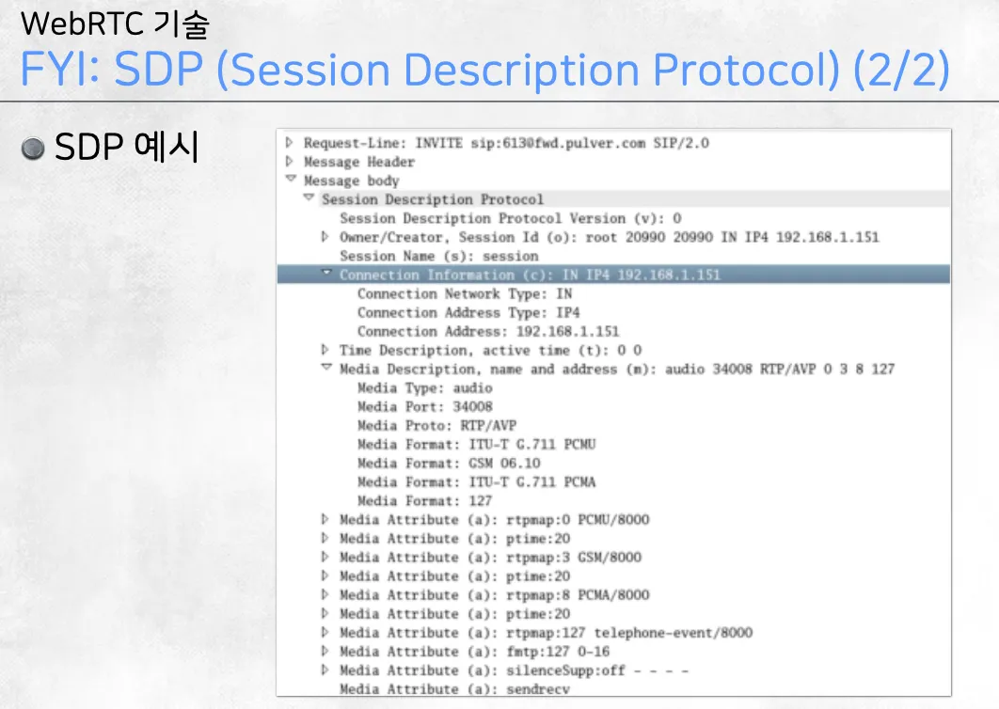

## SDP

- SDP는 **해상도, 코덱, 암호화 방식 등 멀티미디어 스트림이 어떻게 구성되어 있는지 설명하는 표준 형식**
	- 즉, 실제 미디어(영상/음성 데이터) 자체가 아니라, **그 미디어 스트림을 구성하고 재생·전송하는 데 필요한 메타데이터**를 기술
- 이름은 “프로토콜”이지만 실제 기술적으로는 네트워크 메시지를 직접 전송하는 것이 아니라 **미디어 세션을 설정하기 위한 설명서 역할**
⇒ WebRTC에서는 디바이스 간 미디어 공유(오디오/비디오 P2P 연결)를 위해 이 SDP 내용을 서로 교환해야함

- SDP에 포함된 정보
	1. **연결 정보(Connection Information)**: 영상/음성 패킷을 어느 IP/Port로 보낼지
	2. **미디어 타입(Media Type)**: audio / video 구분
	3. **미디어 포맷(Media Format)**: RTP payload type, 코덱(G.711, OPUS 등)
	4. **속성(attributes)**:
		- rtpmap: 어떤 코덱을 어떤 payload 번호로 사용하는지
		- fmtp: 코덱 파라미터
		- sendrecv / recvonly 등 미디어 방향성
⇒ 즉, SDP는 **상대와 어떤 방식으로 미디어를 주고받을지를 완전히 기술한 문서**이며, WebRTC의 Offer/Answer 방식에서 핵심적으로 사용

## WebRTC 동작 구성 예시
→ 실제 환경에서 WebRTC를 사용하면 어떻게 동작할지에 대한 예시
→ WebRTC는 각 상황에 따라 다르게 동작함

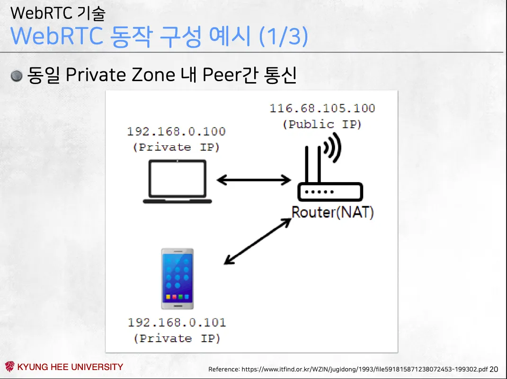

## 동일 Private Zone 내 Peer 간 통신

- 두 장치가 같은 라우터 내부(같은 사설망 192.168.0.x)에 있음
	- 둘 다 같은 NAT 라우터(공인 IP 116.68.105.100)에 연결됨
⇒ 이 경우 WebRTC는 **TURN도 STUN도 거의 필요 없이 **라우터 내부에서 **직접 P2P 연결**이 가능
	→ 라우터에 NAT가 달려있어도, NAT까지 가서 이를 사용하지 않는 경우

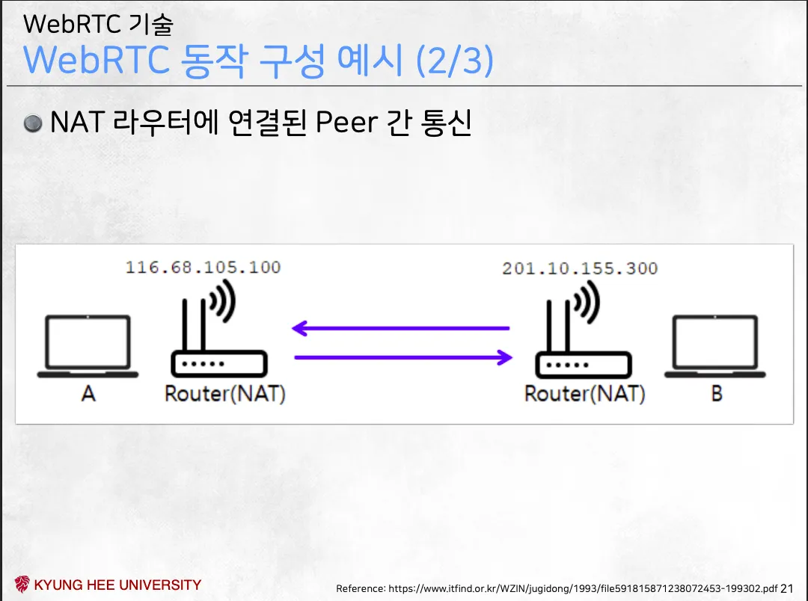

## NAT 라우터에 연결된 Peer통신
== 서로 다른 NAT 라우터에 연결된 Peer간 통신

- A는 116.68.105.100이라는 공인 IP를 가진 NAT 뒤
- B는 201.10.155.300이라는 공인 IP를 가진 NAT 뒤
⇒ 즉 서로 다른 네트워크(다른 집, 다른 회사)에서 통신을 시도하는 상황

### 이 경우의 동작 방식

1. 먼저 **STUN**을 통해 각자 외부에서 보이는 Public IP:Port를 알아낸 뒤
2. 상대에게 전달하여 P2P 연결을 시도합니다.
3. NAT가 Symmetric가 아니라면 **P2P 연결이 성공할 수 있음**
⇒ 즉, 다른 NAT 간에도 **조건만 맞으면 TURN 없이 직접 통신이 가능**

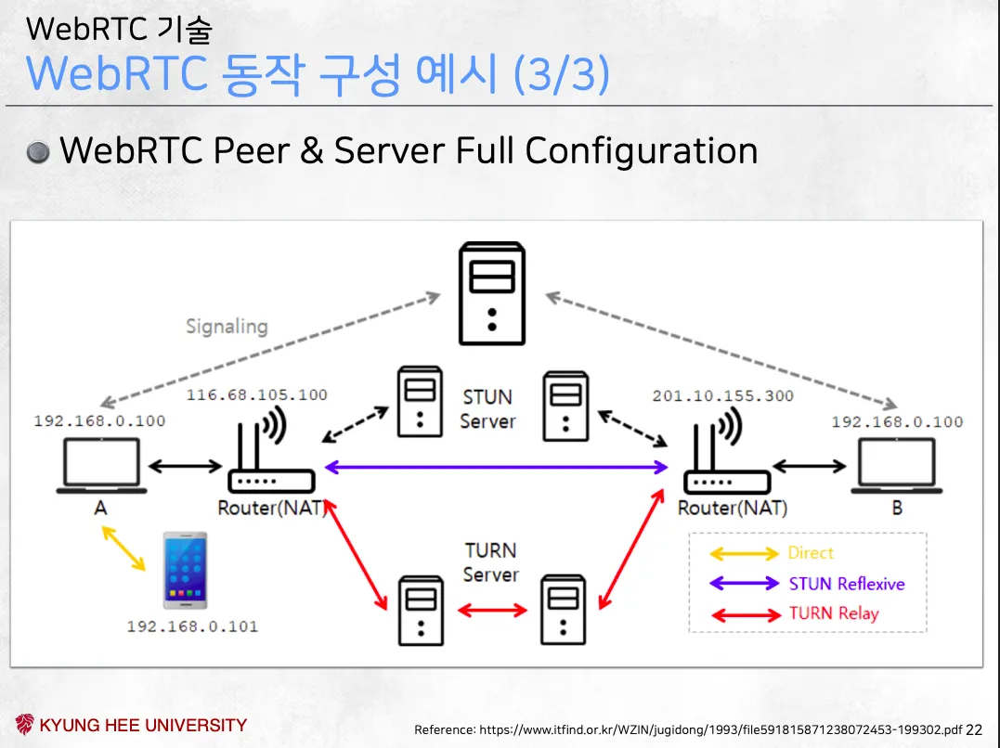

## WebRTC에서 피어 방식, 서버 방식이 모두 포함된 구성
→ 이 그림은 WebRTC가 실제 동작할 때 사용하는 **전체 서버 구조**를 보여줌

### 포함 요소

- **Signaling 서버**: SDP·ICE 후보 교환
- **STUN 서버**: Public IP:Port 획득
- **TURN 서버**: 직접 통신이 불가능할 때 중계 역할
- 양쪽 Peer A/B와 각 NAT 라우터

### 동작 흐름

1. 시그널링 서버를 통해 Offer/Answer(SDP)를 교환
2. STUN 서버로부터 **Reflexive Candidate(파란 화살표)** 획득
3. 가능한 경우 **Direct 연결(노란 화살표)**
4. Symmetric NAT 등으로 불가능한 경우 **TURN Relay(빨간 화살표)** 사용

### 결론

- **물리적으로 가까울수록** 또는 **NAT 제약이 약할수록** TURN 없이 통신 가능
- 하지만 NAT 제약이 심한 환경에서는 결국 **TURN의 중계가 필수적**

→ 시그널링 서버

	- Peer 간에 **SDP(Offer/Answer)**, **ICE 후보(IP/Port 정보)** 등을 **교환해 주는 중간 메신저**
	→ STUN서버와는 다른 것

## WebRTC의 연결 예시

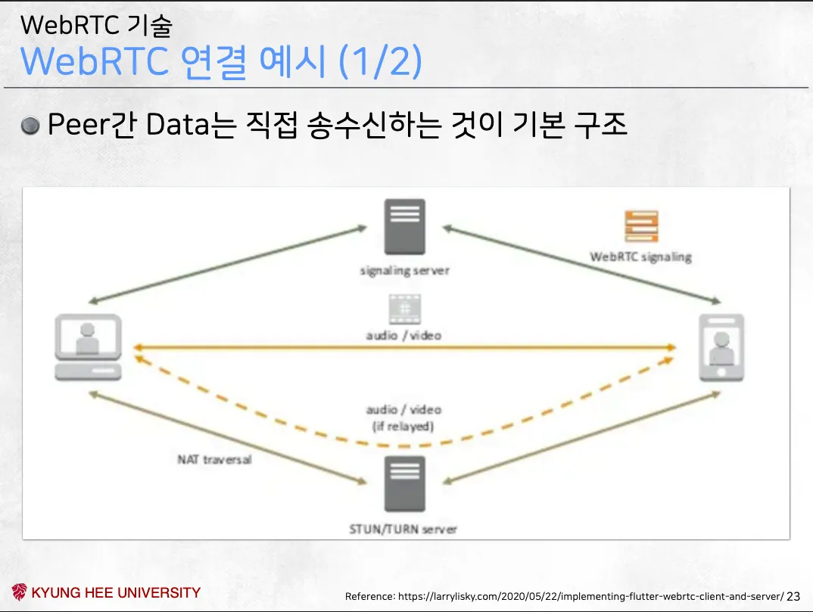

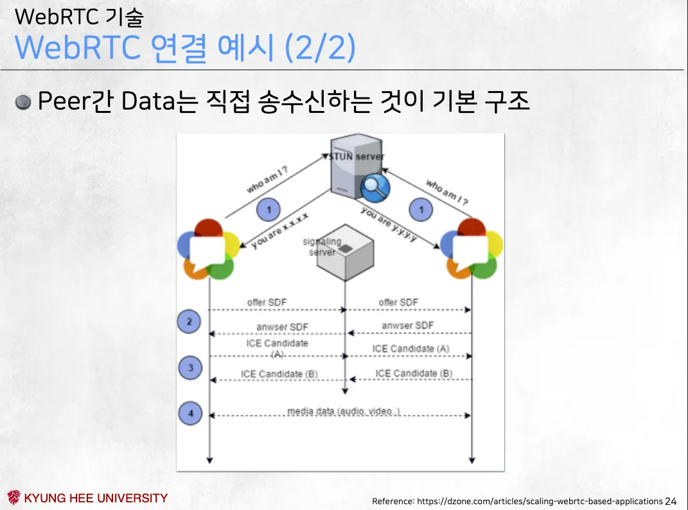

### **기본 구조: Peer 간 데이터는 가능한 한 직접 송수신**
→ 그림의 구조

1. **시그널링 서버**
	- Peer A와 Peer B가 SDP와 ICE 후보를 서로 교환하도록 중간에서 메시지를 전달함.
	- 이 서버는 단지 “연결에 필요한 정보 전달”만 담당하고 **실제 오디오·비디오 데이터는 절대 지나가지 않음**.
2. **STUN/TURN 서버**
	- STUN: 각 Peer가 NAT 뒤에서 보이는 자신의 Public IP/Port 확인(ICE 후보 생성)
	- TURN: 직접 연결 불가능할 때만 중계 경로 제공
3. **오디오/비디오 전송 경로**
	- 기본: Peer → Peer 직접 연결 (실선)
	- NAT 제약 심함 → TURN 서버를 통한 중계(점선)
⇒ 즉, WebRTC는 **항상 P2P 직연결을 우선 시도**하며, TURN은 **정말 필요할 때만 사용되는 백업 경로**

### 전체 흐름

1. Peer A가 시그널링 서버로 **Offer SDP** 전송
2. Peer B에게 해당 Offer 전달
3. Peer B가 **Answer SDP** 생성하여 다시 시그널링 서버 → Peer A
4. 양 Peer는 STUN 서버에 연결해 **ICE Candidate**(각자의 IP/Port 후보)를 수집
5. Peer A ↔ Peer B가 서로의 후보 목록을 시그널링 서버로 교환
6. 가능한 경로를 시험하여 **Direct / STUN Reflexive / TURN Relay 중 하나 선택**

### 정리

- **시그널링 서버는 SDP를 전달할 뿐, 실제 미디어 데이터의 전달 경로가 아님**
- **데이터는 Peer끼리 직접 주고받는 것이 기본**
	- 다만 환경에 따라
		1. 직접 전송(P2P)
		2. STUN 기반 경로
		3. TURN을 통한 완전 중계 중 하나가 선택됨
- TURN은 사용량만큼 비용이 발생하기 때문에, 많은 WebRTC 서비스들이 TURN을 최소화하여 비용을 줄이고 필요 시에만 사용하도록 설계함

## WebRTC 주요 구성요소

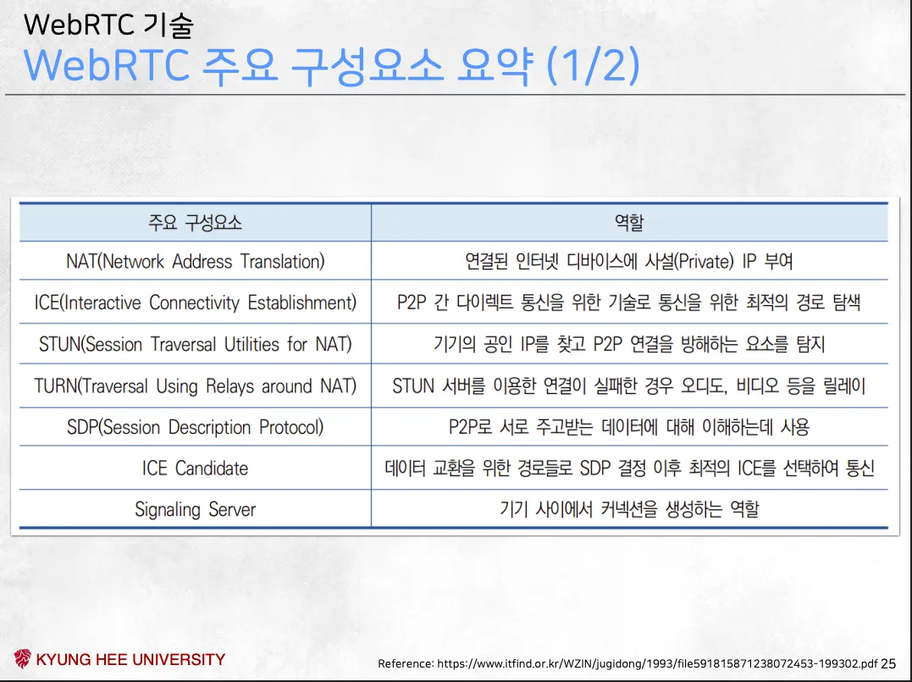

### **1. NAT (Network Address Translation)**

- 사설 IP 장치에게 인터넷 접속 시 공인 IP를 부여
- WebRTC에서는 NAT 때문에 직접 통신이 어려워져 ICE·STUN·TURN이 필요해짐

### **2. ICE (Interactive Connectivity Establishment)**

- P2P 연결을 만들기 위해 가능한 모든 경로(IP/Port 후보)를 모으고 최적의** 경로를 선택**하는 절차
- P2P간 다이렉트 통신을 위한 기술

### **3. STUN (Session Traversal Utilities for NAT)**

- 기기의 퍼블릭 IP를 찾고, P2P 연결을 방해하는 요소를 탐지하는 서버
→ NAT 뒤에 있는 기기가 STUN 서버를 통해 “외부에서 보이는 나의 IP:Port”를 알아내 P2P 연결에 활용

### **4. TURN (Traversal Using Relays around NAT)**

- STUN으로도 P2P 불가능할 때, **TURN 서버가 완전히 중계(relay)**
- 오디오/비디오 패킷이 TURN을 통해 전달됨 (비용·지연 증가)

### **5. SDP (Session Description Protocol)**

- P2P 미디어 세션을 기술하는 메타데이터
- 코덱, 포트, 방향성(sendrecv) 등 연결 설정에 필요한 정보를 담음
- 각 피어가 P2P로 주고받을 데이터에 대해 이해하기 위해 사용

### **6. ICE Candidate**

- 데이터 교환을 위한 후보 경로들, 이 중에서 최적의 경로를 선택해 통신
- 가능한 통신 경로 후보들(IP, Port, Type: host/reflexive/relay)

### **7. Signaling Server**

- 기기 사이 커넥션을 생성하는 역할
- SDP와 ICE 후보를 **서로에게 전달**해주는 메시지 전달 서버
- 실제 미디어 데이터는 흐르지 않음

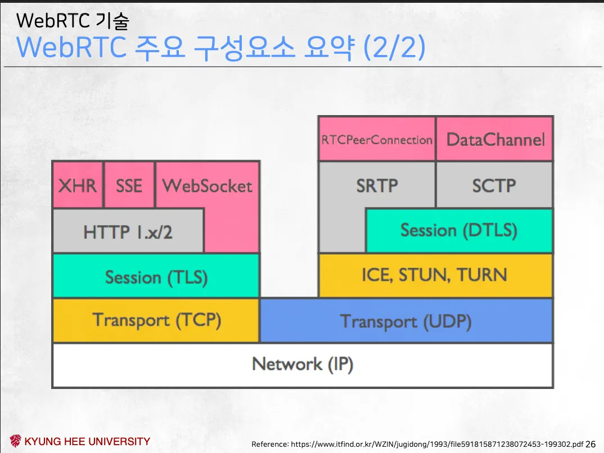

### WebRTC의 프로토콜 스택

1. **좌측(웹 기술 스택)**
	- 웹에서 자주 쓰는 통신기술을 계층화한 구조
	- HTTP/1.x, SSE, WebSocket 등이 **TCP → TLS → Application** 위에서 동작
2. **우측(WebRTC 스택)**
	- WebRTC PeerConnection 및 DataChannel에서 사용되는 구조
	- **Network (IP)** 위에
		→ **UDP 기반 Transport**
		→ 그 위에 **ICE, STUN, TURN (NAT traversal)**
		→ 그 위에 **DTLS(Session)**
		→ 미디어는 **SRTP**, 데이터는 **SCTP(DataChannel)**
→ 즉 WebRTC는 아래 구조로 동작

	- **UDP 기반**
	- **DTLS로 암호화**
	- **SRTP/SCTP로 실제 미디어·데이터 전송**

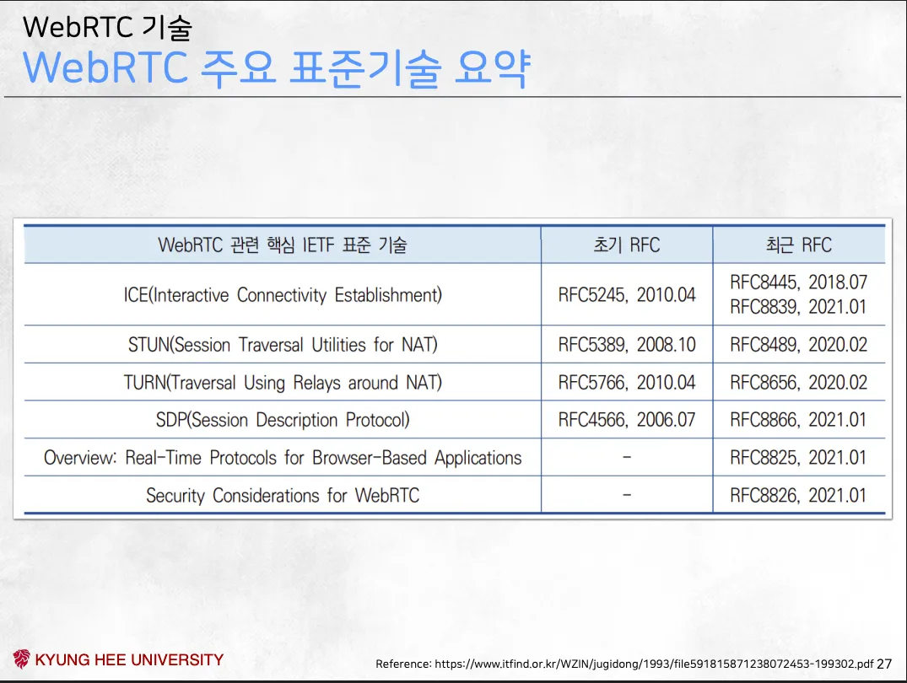

### WebRTC 관련 RFC

- **ICE**
	- 초기: RFC5245
	- 최신: RFC8445, RFC8839
- **STUN**
	- 초기: RFC5389
	- 최신: RFC8489
- **TURN**
	- 초기: RFC5766
	- 최신: RFC8656
- **SDP**
	- 초기: RFC4566
	- 최신: RFC8866
→ 여러 RFC 기술을 기반으로 WebRTC가 구성

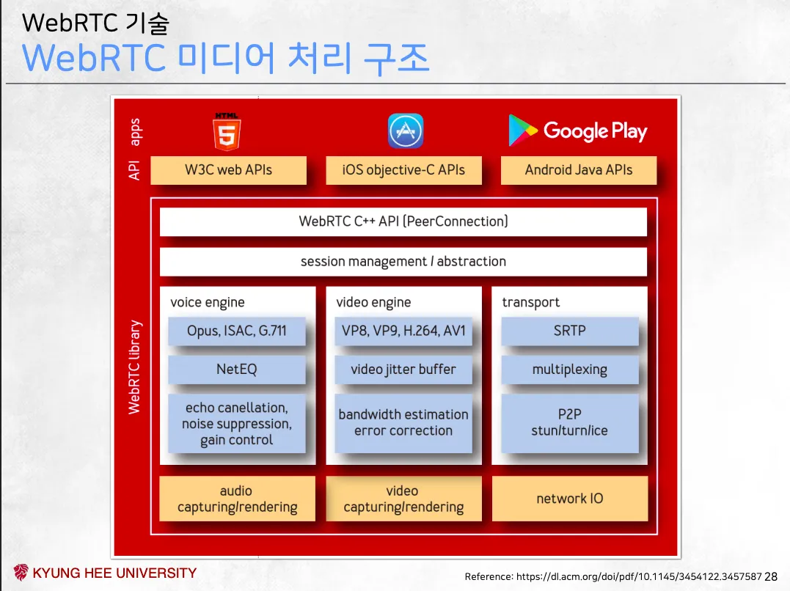

## WebRTC 미디어 처리 구조

- 이 슬라이드는 **WebRTC 내부가 어떤 모듈로 구성되어 있는지** 나타냄
1. **Web·iOS·Android에 상관없이, 내부 엔진(WebRTC C++ Core)은 동일**
	- 겉의 API(W3C API, Objective-C API, Java API)는 다르지만
	- 내부의 미디어 처리 엔진은 완전히 동일하게 동작함
2. **내부 엔진 구성**
	1. Voice Engine
		- 음성을 어떻게 인코딩하고, 네트워크 지연/손실을 극복하며, 에코 제거 등을 적용하는지 담당하는 엔진
	2. Video Engine
		- **VP8, VP9, H.264, AV1 같은 비디오 코덱 처리**
		- **Video Jitter Buffer**
			- 네트워크 지연(지터) 때문에 도착 시간이 들쭉날쭉한 영상 패킷들을
				플레이 가능한 순서와 속도로 재배열함

			- “영상이 튀지 않도록 완충하는 장치”라고 이해하면 됨
		- **Bandwidth Estimation (대역폭 추정)**
			- 지금 네트워크가 **얼마나 빠른지**, **얼마까지 비트레이트를 사용해도 되는지**
				실시간으로 추정하는 기능

			- fast.com이 속도를 측정하는 것과 유사한 방식
			- 이를 기반으로 WebRTC는:
				- 네트워크가 좋으면 화질을 올리고
				- 나쁘면 화질/프레임/비트레이트를 자동으로 낮춤
					→ “지금 네트워크 상태로 이 정도 화질이 적합합니다”를 엔진이 판단

		- **Error Correction (오류 보정)**
			- 패킷 손실이 발생해도 영상이 완전히 깨지지 않도록 FEC/RTX 등 사용
			- 비디오 패킷에 대한 에러 코렉션
	3. Transport
		- 실제 오디오·비디오 데이터를 **어떤 경로로, 어떤 방식으로 전달할지** 결정하는 층

# WebRTC 장점

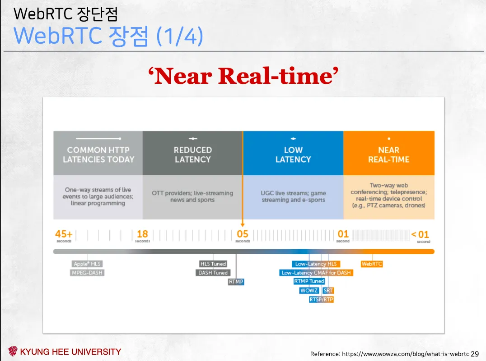

## 1. Near Real-time
→ 거의 실시간에 가까운 성능

- 굉장히 저지연의 거의 실시간의 속도를 가짐
- 이는 조건부의 성능 → near real time의 조건
	1. P2P로 직접 연결
	2. TURN 서버를 안 쓸 때 
	3. 서버를 몇 번 거치지 않을 때 
	→ 주로 가까운 거리의 다이렉트 P2P 방식으로 동작할 때 Near Real-time의 속도를 냄

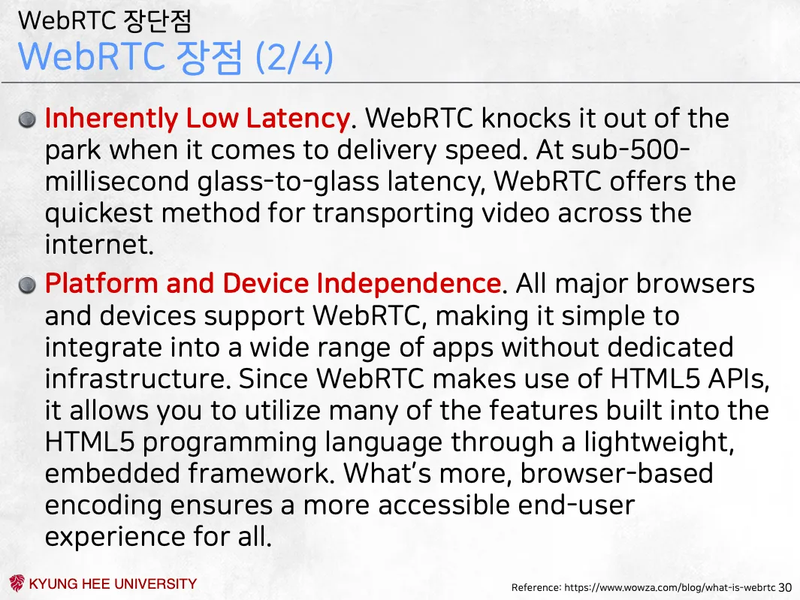

## 2. 태생적으로 지연이 낮음

- WebRTC는 전송 속도가 낮음
- 500밀리초 미만의 전 구간(glass-to-glass) 지연 시간으로, WebRTC는 인터넷을 통한 비디오 전송을 위한 가장 빠른 방법을 제공

## 3. 플랫폼과 기기 독립성

- 모든 주요 브라우저와 장치가 WebRTC를 지원하여, 전용 인프라 없이도 광범위한 앱에 쉽게 통합할 수 있음
- WebRTC는 HTML5 API를 활용하므로, 경량의 임베디드 프레임워크를 통해 HTML5 프로그래밍 언어에 내장된 많은 기능을 활용
- 브라우저 기반 인코딩은 모두에게 더 접근하기 쉬운 최종 사용자 경험을 보장

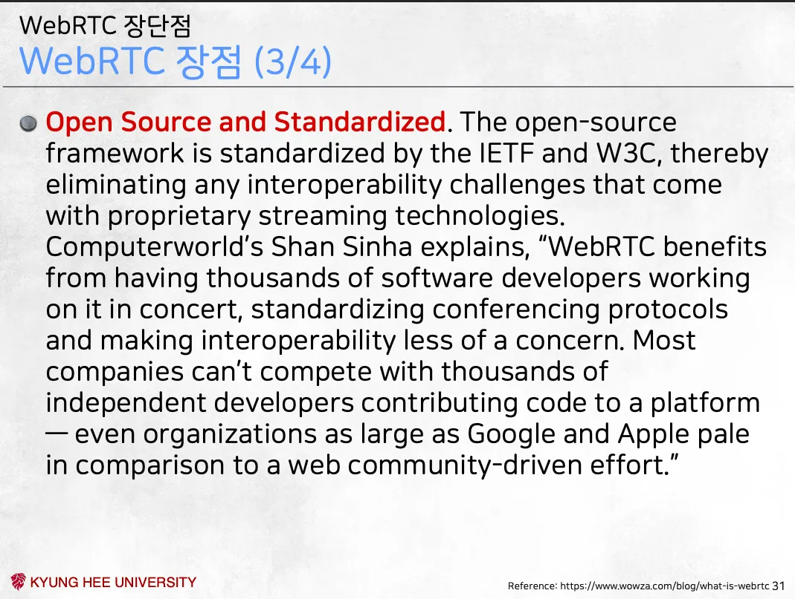

## 4. 오픈소스이고 표준화되어있음

- 오픈 소스 프레임워크는 IETF와 W3C에 의해 표준화되었으며, 독점 스트리밍 기술과 관련된 모든 상호 운용성 문제를 제거
- 소프트웨어 개발자들이 협력하여 작업하고, 회의 프로토콜을 표준화하며, 상호 운용성에 대한 우려를 줄인다는 이점

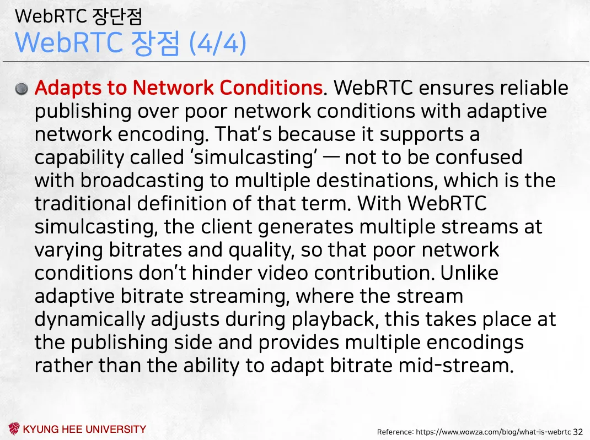

## 5. 네트워크 상태에 적응

- WebRTC는 적응형 네트워크 인코딩을 통해 열악한 네트워크 환경에서도 안정적인 게시(Publishing)를 보장
- 그 일환으로 시뮬캐스팅(simulcasting)'이라는 기능을 지원
	→ 브로드 캐스팅과는 다른 것

- WebRTC 시뮬캐스팅을 사용하면, 클라이언트가 다양한 비트레이트와 화질로 여러 스트림을 생성하여, 열악한 네트워크 환경이 비디오 전송을 방해하지 않도록 함
- 재생 중에 스트림이 동적으로 조정되는 적응형 비트레이트 스트리밍과 달리, 이 기능은 게시(Publishing) 측에서 발생하며 스트림 중간에 비트레이트를 조정하는 기능보다는 여러 인코딩을 제공

### Simulcast

- 한 영상 스트림을 다양한 해상호와 다양한 비트레이트로 여러개로 동시에 전송하는 기술
- ex) 1080p 2Mbps / 720p 1Mbps / 360p 300kbps 세 개를 동시에 전송하는 구조
- 수신자는 네트워크·CPU 상황에 따라 **가장 안정적인 스트림 하나만 선택해서 받으면 됨**
→ 일반적인 동시 송출에서는 가장 낮은 성능의 수신자를 따라 뿌려야 하는데, 이 경우 여러 성능, 화질의 수신자를 만족시킬 수 있음

# WebRTC 단점

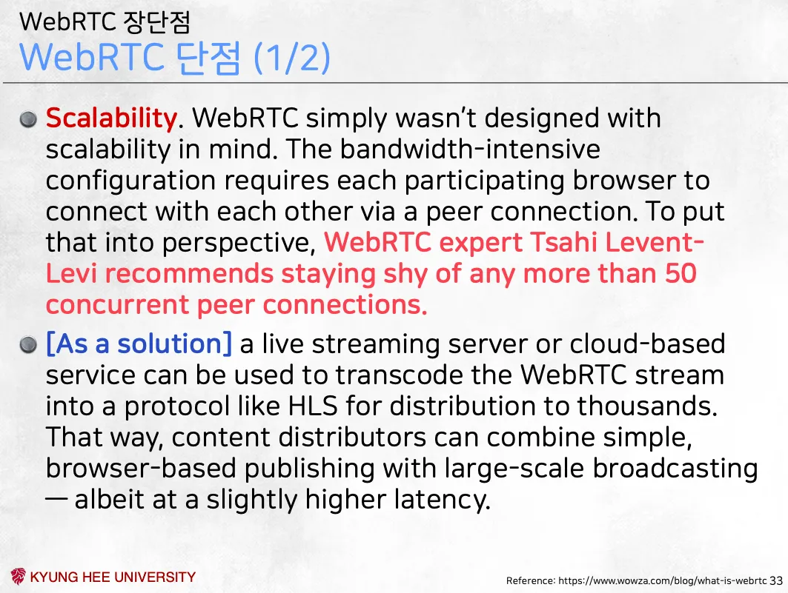

## 1. 확장성

- WebRTC는 애초에 확장성을 고려하여 설계된 기술이 아님
- 대역폭을 많이 요구하는 WebRTC 구조는, 참여한 브라우저들끼리 서로 직접(peer-to-peer) 연결해야함
- 전문가 Tsahi Levent-Levi는 **동시 50명 이상의 참여자 연결은 피하라**고 권장
→ P2P 구조 기반이므로

	- 모든 참가자는 서로를 향해 연결을 생성해야함
	- 이때 참가자가 많아질 수록 연결 수가 굉장히 많아지고, 대역폭 소모도 증가
	→ 그래서 WebRTC 단독으로는 많은 접속자 간 회의에서 비효율적이고 대규모 방송에서 부적합

		- 이를 극복하기 위해 중앙 미디어 서버 또는 TURN서버 등을 활용

### 해결 방법

- 해결책으로는 WebRTC 스트림을 HLS 같은 프로토콜로 변환하여 수천 명에게 송출하는 라이브 스트리밍 서버/클라우드 서비스를 사용하는 방법이 있음
	- 서버를 통해 이 미디어 스트림을 기존의 대규모 방송 표준인 **HLS(HTTP Live Streaming)** 또는 MPEG-DASH 같은 프로토콜로 변환(Transcoding) 가능

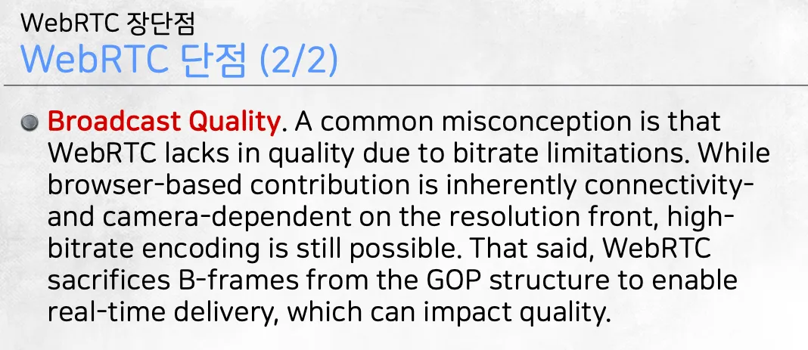

## 2. 브로드캐스트 품질

- 종종, WebRTC의 화질이 낮은 이유가 비트레이트 제한 때문이라고 오해
- WebRTC는 실시간 전송을 위해 비디오 GOP 구조에서 **B-frame을 사용하지 않으며**,
	- 이는 화질 저하로 이어짐
→ WebRTC는 실시간성을 우선하여, HLS같은 고품질 스트리밍에 사용하는 구조(B-Frame)을 사용하지 않음

	- 지연을 줄이기 위해 B-Frame을 제거해, 종종 방송 품질이 떨어지는 경우가 많음
→ 실시간성은 높지만, 품질은 낮게 됨

# WebRTC현황

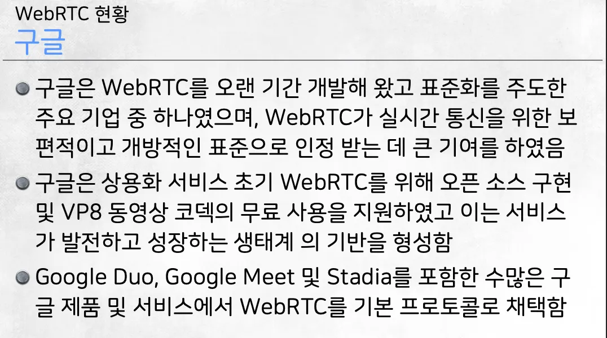

## 구글

- 구글은 WebRTC를 **초기부터 개발하고 표준화 과정(W3C, IETF)을 주도한 회사**
- 특히 **VP8 코덱을 오픈소스로 공개하고 무료로 사용 가능하게 만든 것**은 WebRTC의 대중화에 큰 역할
- Google Duo, Google Meet, Stadia 등 대부분의 구글 서비스가 WebRTC를 핵심 기술로 사용

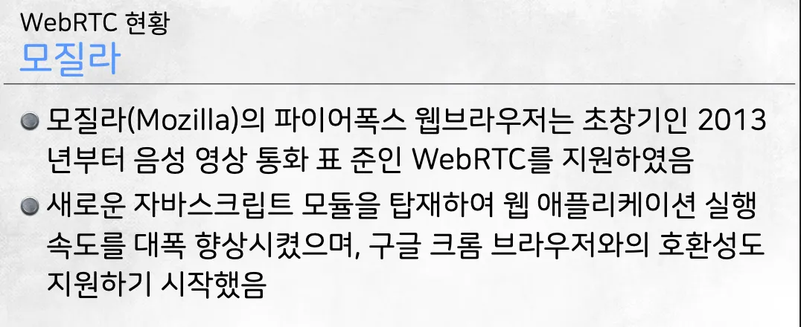

## 모질라

- 파이어폭스는 **2013년 초창기부터 WebRTC 표준을 지원한 브라우저 중 하나**
- 구글보다 느리긴 했지만 꾸준히 WebRTC 기능을 채택
- JS 모듈 최적화 등으로 웹앱 속도가 향상되며, **Chrome과의 호환성도 점점 강화**

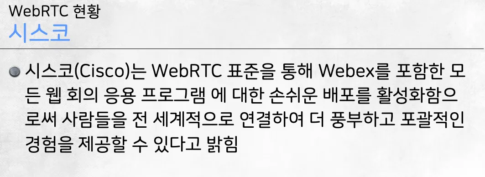

## 시스코

- 시스코는 WebRTC 표준 기반으로 **Webex 같은 기업용 화상 회의 솔루션을 강화**
- WebRTC 덕분에 설치 없이 브라우저만으로 Webex 회의를 실행할 수 있게 되어, 전 세계 사용자 접근성이 크게 향상
- Cisco는 WebRTC를 “글로벌 연결·협업의 핵심 도구”로 보는 입장

# WebRTC 개발

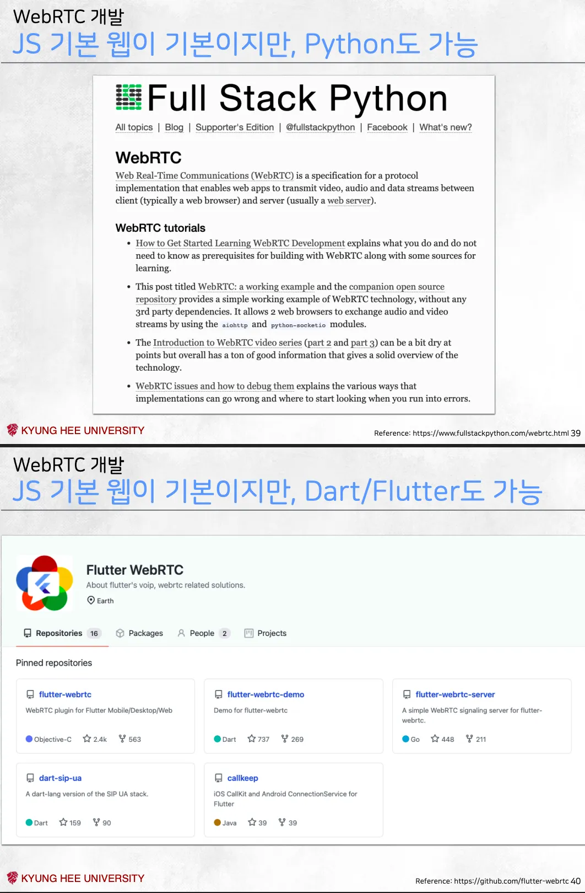

### Python과 WebRTC

- WebRTC는 기본적으로 **브라우저에서 JavaScript로 사용하는 기술**입
- 하지만 Python도 WebRTC를 다룰 수 있는데, 대표 라이브러리가 **aiortc**
- Full Stack Python 사이트는 WebRTC를 Python에서 다루는 방법, 예제, 코드 저장소 등을 제공하는 자료

## Dart와 WebRTC

- Flutter WebRTC GitHub 저장소는 Flutter(Dart 기반 프레임워크)에서 WebRTC를 사용할 수 있게 해주는 플러그인
- Flutter WebRTC의 특징
	- **Objective-C**, **Java**, **Dart** 등 다양한 언어로 구현되어 있음
	- iOS/Android/Web/Desktop 모두 지원
	- WebRTC 기반 VoIP, 화상채팅, 실시간 미디어 앱 개발 가능
	- flutter-webrtc-server(Go 기반) 같은 참고용 시그널링 서버도 제공
→ JS만이 아니라 Dart/Flutter, Python 등 다양한 언어·환경에서 WebRTC를 활용할 수 있음
→ 브라우저 뿐만 아니라 서버, 봇, 단순 프로그램, 모바일 앱에서도 WebRTC를 사용 가능
