> 원본 Notion 정리 — 강의 슬라이드 이미지 + 설명.

> [← 전체 목차](/posts/net-overview/)

***

# QUIC 개요

- QUIC은 기존 TCP 대신 쓰기 위해 구글이 만들고, 이후 IETF가 표준화한 새로운 전송 프로토콜
	- TCP보다 연결 설정이 빠르고, 패킷 유실 처리도 더 효율적이며, 암호화(보안)가 기본으로 포함
- HTTP/2에서 사용하던 멀티플렉싱(여러 스트림 동시 전송) 같은 기능은 QUIC이 기본적으로 지원
	- 그래서 HTTP/3은 HTTP/2 구조를 거의 유지하면서도, 하위 전송 계층을 QUIC으로 교체해 더 빠르고 안정적인 통신을 목표
	- HTTP2의 많은 기능들이 HTTP/3와  QUIC으로 녹아들어감
- HTTP/2는 HTTP/1.1의 기능을 대부분 유지하면서 성능 향상을 더한 버전
	- 하지만 전송계층은 여전히 TCP였기 때문에 TCP의 한계도 같이 가져감
	→ HTTP/3에서는 이 전송 부분(TCP)을 아예 QUIC으로 바꾸면서 TCP 기반 한계를 크게 줄임

# 현재까지의 기술 변천사

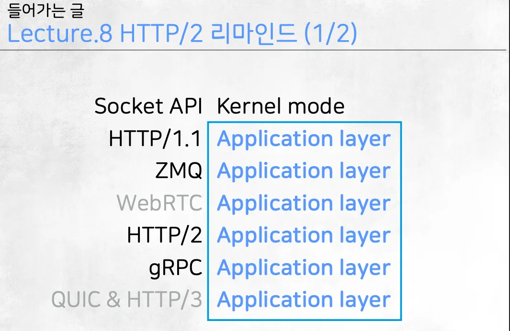

## 커널 레이어의 프로토콜

- 커널에 있는 프로토콜(TCP 등)은 OS 내부에서 돌아가므로 **성능 이점**(복사 절감, 안정성 등)이 있음.
- 하지만 커널 프로토콜은 **수정하기 어려움** → 배포도 제한적

## 애플리케이션 레이어

- 사용자 공간에서 동작하는 프로토콜은 커널 대비 **성능은 약간 손해**
- 그러나 누구나 개발·수정·배포가 가능(오픈소스 기반)하여 **유연성이 높음**.

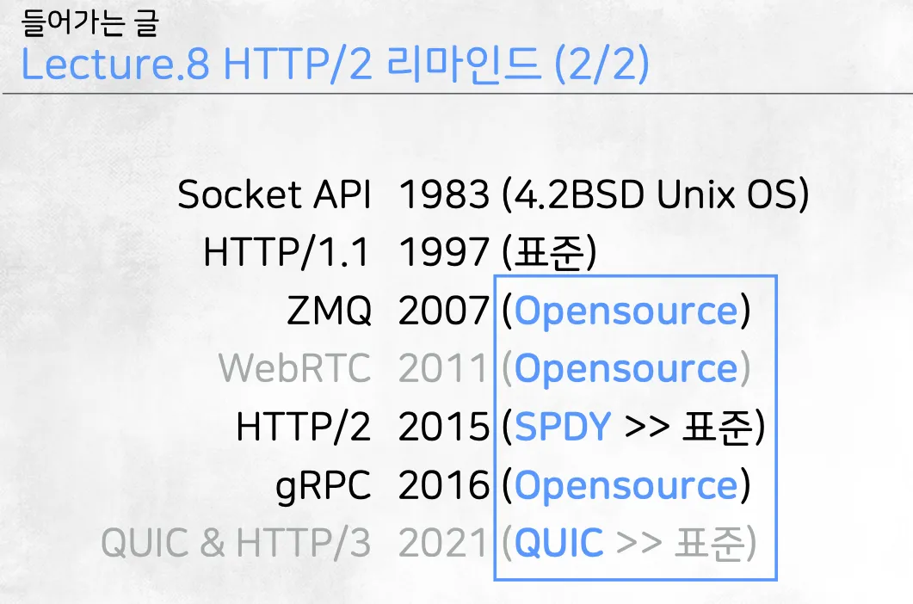

- 초기에는 표준(소켓 API) → 구현 순으로 진행됐지만, 요즘은 오픈소스 구현이 먼저 등장하고 → 나중에 표준화되는 흐름이 강함.
	→ 버클리 소켓 이후부터는 표준이 나오고 구현이 나오는 순서
	→ ZmQ 부터는 오픈소스가 퍼지고 표준이 생기면
⇒ 이는 일종의 헤게모니(주도권)의 변화를 말함

	- 기존에는 표준 단체가 주도
	- 이제는 오픈소스 프로젝트가 네트워크 기술 발전을 주도한 후 표준화는 그 뒤를 따라가는 구조
	→ 즉, 문제 해결이 더 빠르게 가능해짐, 문제해결을 위해 오픈소스 기술이 등장하고, 이것이 후에 표준화

# 현대 통신 프로토콜의 패러다임

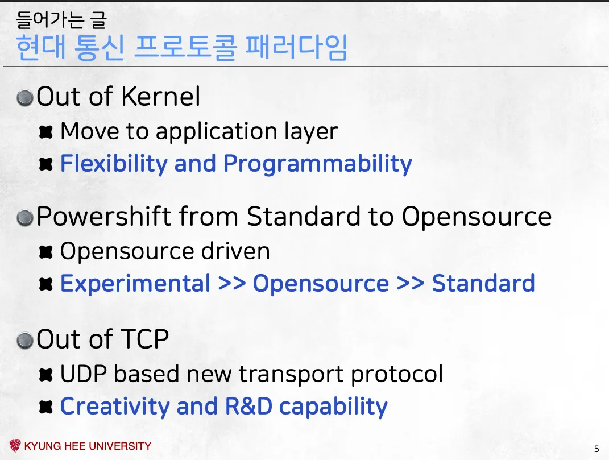

## 현대 통신 프로토콜의 특징

### 1. Out of Kernel

- 네트워크 기능을 커널 안(TCP 등)에서 구현하면 성능은 좋지만 변경이 어려움
- 최근에는 QUIC처럼 **커널 밖(애플리케이션 레벨)** 에서 프로토콜을 만들면서 수정·배포가 쉬워지고, 다양한 기능을 실험하기 쉬워짐
⇒ 현대 통신 프로토콜은 애플리케이션 레벨로 올라오는 경향이 있음

	- 이를 통해 유연성, 프로그래밍 가능성을 얻음

### 2. 표준에서 오픈소스로의 주도권 이전

- 예전에는 표준(standards)이 먼저 만들어지고 구현이 따라왔지만
- 지금은 **오픈소스 구현이 먼저 등장하고 → 널리 쓰이고 → 표준화되는 흐름**
	→ QUIC도 이 과정(구글 → 오픈소스 → 표준)을 따랐음

### 3. Out of TCP

- TCP 기반의 한계를 벗어나기 위해 UDP 위에서 새로운 전송 프로토콜(QUIC 등)을 만듬
- UDP는 최소한의 기능만 제공하므로, 상위에서 원하는 기능을 자유롭게 설계할 수 있음
	→ 즉, **TCP를 버리고 더 창의적인 방식으로 전송계층을 재설계 가능**해졌다는 의미

# QUIC

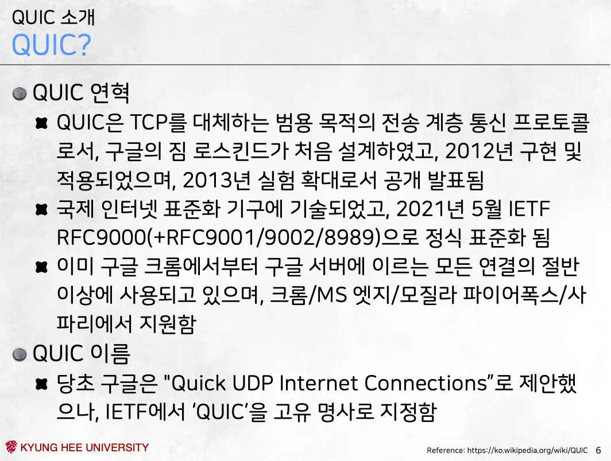

## QUIC 연혁

- QUIC은 TCP를 대체하는 범용 목적의 전송 계층 통신 프로토콜로서, 구글의 짐 로슬린드가 처음 설계하였고, 2012년 구현 및 적용되었으며, 2013년 실험 확대돼 공개 발표
- 국제 인터넷 표준화 기구에 기술되었고, 2021년 5월 IETF RFC9000(+RFC9001/9002/8989)으로 정식 표준화됨
- 이미 구글 크롬에서부터 구글 서버에 이르는 모든 연결의 절반 이상에 사용되고 있으며, 크롬/MS 엣지/모질라 파이어폭스/사파리에서 지원함

### **설명**

- QUIC은 원래 **구글이 TCP 성능 한계를 개선하기 위해 만든 전송계층 프로토콜**
- 2012년에 실제 서비스에 쓰이기 시작했고, 2021년 IETF가 공식 표준으로 승인
- 현재 주요 브라우저는 모두 QUIC/HTTP3를 지원하며, 트래픽의 상당 부분이 QUIC 기반

## QUIC 이름

- 당초 구글은 “Quick UDP Internet Connections”로 제안했으나, IETF에서 ‘QUIC’을 고유 명사로 지정함
- 처음에는 QUIC이 “Quick UDP Internet Connections”의 약자였으나, IETF는 “UDP와 직접 연결된 의미처럼 보이는 것을 피하기 위해” QUIC을 **고유명사**로 사용했음
- 즉, QUIC을 **UDP와 동일 레벨의 개념으로 혼동하지 않게 하려는 목적**

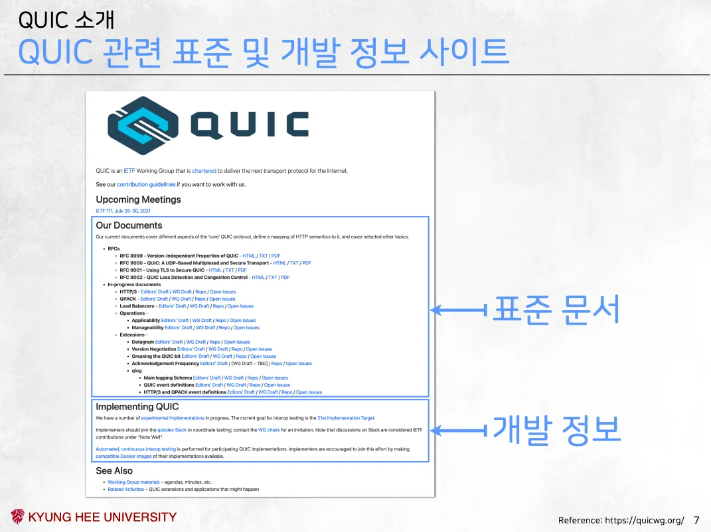

### **RFC 9000 – QUIC 기본 표준**

- “UDP 기반의 멀티플렉스되고 안전한 전송 프로토콜”
- HTTP/3의 기반이 되는 QUIC 사양 정의

### QUIC의 시작

- **데이터센터에서는 400Gbps급 통신**을 하며, 초기에 UDP로 실험했으나 기능 부족 → QUIC으로 발전.
- **근거리(DC)에서 시작해 자꾸 기능을 붙이면서 멀리까지 통신 가능하게 확장**됨.
- QUIC 개발은 **GitHub 오픈소스 중심 → 이후 표준화**되는 흐름을 따름.
- QUIC은 **UDP 위에 TLS 보안, 멀티플렉싱을 내장**, HTTP/2 기능 일부를 전송계층으로 옮긴 구조.
- TCP 기능(재전송, 흐름/혼잡 제어)을 **UDP 기반으로 재구현하여 TCP를 대체**하는 전송 프로토콜로 발전.

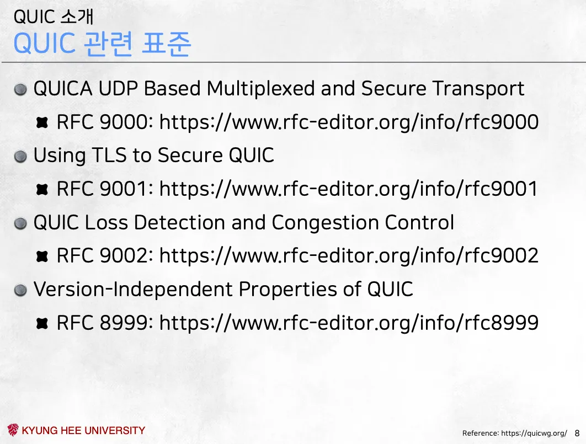

## QUIC 관련 표준

- RFC 9000 → QUIC의 핵심 전송 구조(연결 관리, 패킷 구조, 스트림 등)를 정의한 가장 기본 표준
- RFC 9001 → QUIC에서 TLS 1.3을 이용해 암호화·키 교환을 수행하는 방식을 정의
- RFC 9002 → 패킷 손실 감지, RTT 측정, 혼잡 제어 알고리즘 등 TCP가 제공하던 기능을 QUIC 방식으로 구현한 규칙
- RFC 8999 → QUIC 버전이 달라도 유지되는 QUIC의 공통 구조와 행동을 정의한 문서

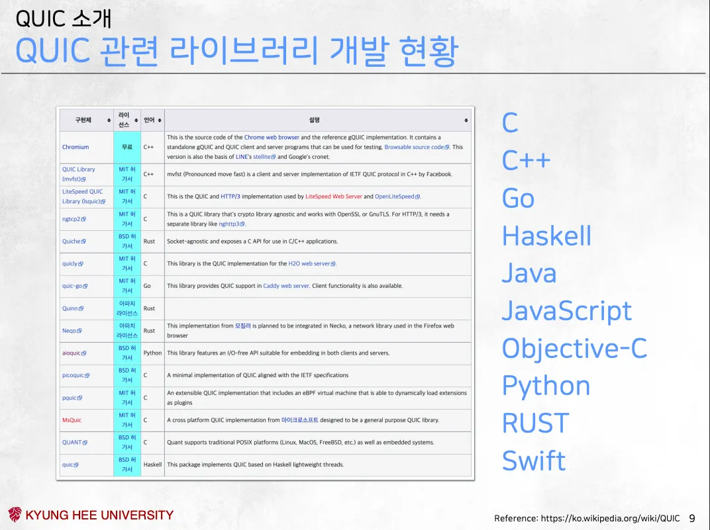

## QUIC 관련 라이브러리 개발 현황

- QUIC은 2021년에 표준화되었지만, 오픈소스 구현마다 성능·최적화 수준이 크게 다름
- QUIC이 커널이 아닌 사용자 공간에서 동작하는 구조이고, 생태계가 충분히 성숙하지 않기 때문에 **언어, 런타임, 구현 설계에 따라 성능 차이가 매우 크게 남**

# 화석화(Ossification) 탈피

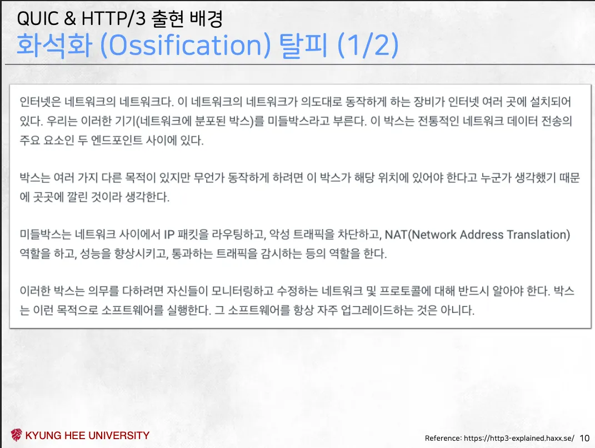

## 화석화

- 인터넷에는 수많은 중간 장비들(방화벽, 라우터, NAT 등)이 존재하며, 이를 **미들박스(middlebox)** 라고 부름
	- 이 미들박스들은 패킷 구조를 보고 필터링하거나 NAT 변환을 수행하는 등 여러 역할을 함
	- 문제는 **프로토콜이 조금만 바뀌어도 미들박스가 예상치 못해 통신을 막아버리는 상황**이 생긴다는 것
- 이 때문에 TCP/IP 기반 프로토콜은 점점 **변경이 어려워지고(화석처럼 굳어짐)**, 새로운 기능 추가가 매우 힘들어짐
→ TCP가 미들박스에 너무 깊게 박혀있어 변경이 불가능
→ 미들박스가 정교해져서 패킷을 검사, 조작하면서 새로운 프로토콜이 작동하기 어려워짐
→ 이런 화석화 때문에 혁신으 시도해도 막혀버림

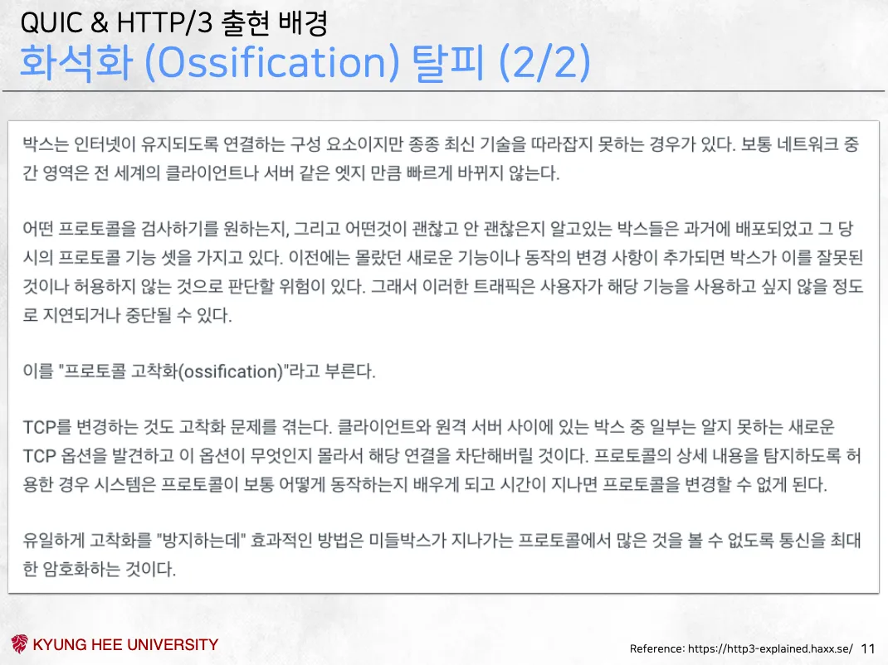

- 많은 미들박스는 **오래된 규칙**을 기준으로 패킷을 검사하기 때문에 최신 프로토콜 변화를 따라가지 못함
- 새로운 기능·옵션을 추가해도 미들박스가 이를 이해하지 못해 **통신 장애**가 발생함
- 이러한 문제를 “프로토콜 화석화(Ossification)”라고 부름
- TCP는 헤더 구조가 고정되어 있고, 미들박스들이 TCP 헤더를 보고 판단하는 경우가 많아
	**프로토콜을 바꾸거나 개선하는 것이 거의 불가능한 상태**가 되었음

- QUIC은 **암호화된 헤더(Encrypted Header)**를 사용하여 미들박스가 내부 구조를 해석하지 못하게 하여
	프로토콜 혁신을 가로막는 요소를 제거함
→ 즉, QUIC은 “인터넷의 화석화를 깨부수기 위한” 새 전송 프로토콜.
⇒ TCP를 바꿀 수 없어, UDP기반의 QUIC으로 전환

# TCP의 문제점

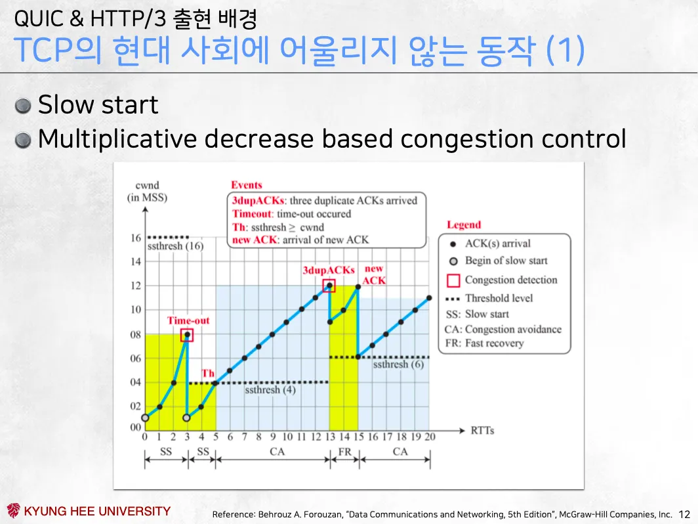

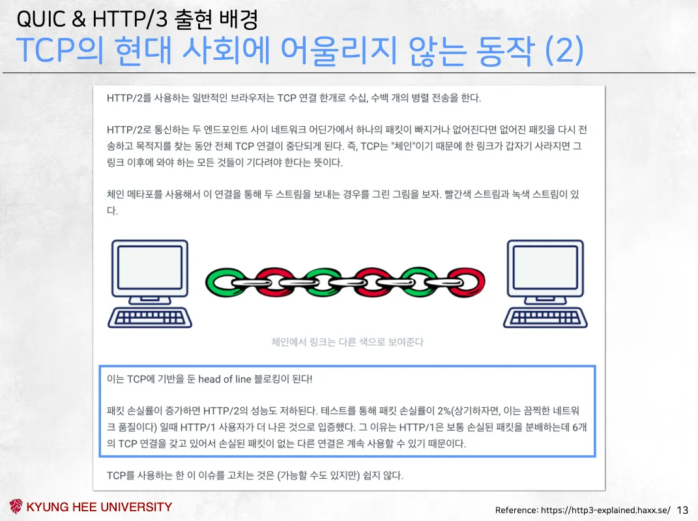

## 1. Slow Start

- TCP 연결 직후에는 혼잡을 피하기 위해 전송 속도를 아주 낮게 시작하고 ACK가 돌아올 때마다 점진적으로 속도를 올리는 방식
⇒ 즉, **초반 성능이 매우 느리다**는 의미

## 2. 승수 감소 기반 감소 제어

- 패킷 손실이 감지되면 TCP는 혼잡을 피하기 위해 **전송 속도를 절반 수준으로 급격히 줄임**
- 이 방식은 과거 네트워크 환경에는 효과적이었으나, 대역폭이 큰 현대 인터넷에서는 **손실 1번으로도 성능 감소가 너무 크다는 단점**이 있음

## 3. TCP Head-of-Line Blocking

- TCP는 전송된 패킷이 순서대로 도착해야 한다는 가정을 갖고 있음.
- 중간에 단 하나라도 손실되면 **그 패킷이 재전송될 때까지 뒤에 온 패킷도 모두 대기**해야 함.
- 이 때문에 비디오·웹페이지 등 여러 스트림을 동시에 요청하는 현대 환경에서는 성능이 크게 저하

⇒ HTTP/2도 TCP 위에서 TCP의 이런 문제점을 극복하지 못함

	- 즉, TCP의 태생적 한계가 HTTP/2 성능 문제의 뿌리
	- HTTP/2는 여러 스트림을 동시에 보내는 구조지만, TCP 아래에서는 결국 **한 스트림에서 손실이 나면 전체 스트림이 막혀버림**(HOL blocking)
		→ TCP의 한계 때문에 한 스트림에서 손실이 나면 전체 스트림이 막혀버림
	→ 이때 패킷 손실율이 크면 HTTP/1이 HTTP/2보다 성능이 나을 때도 있음

		- HTTP/2는 TCP 1개지만, HTTP/1에서는 TCP는 6개의 연결을 사용해야함

# QUIC의 특장점

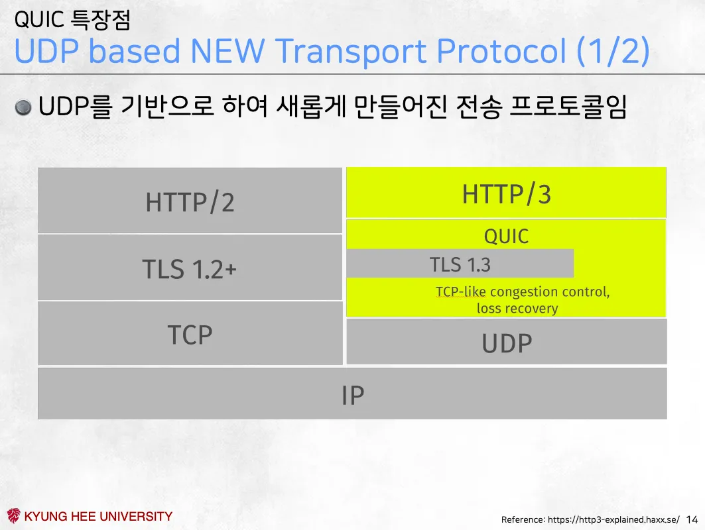

## QUIC

- UDP를 기반으로 하여 새롭게 만들어진 전송 프로토콜
- QUIC은 기존 TCP를 버리고 **UDP 위에 새로운 전송 계층을 직접 구현**한 프로토콜
⇒ 즉, UDP는 단순 운반수단이고, 실제 전송 기능(혼잡 제어·재전송·보안 등)은 QUIC이 담당
→ 프로토콜 스택 설명

	- UDP → TCP-like 혼잡 제어, 손실 복구 매커니즘 → TLS 1.3 → QUIC → HTTP/3

### QUIC 특징 개요

1. QUIC은 TLS를 전송 계층 내부에 통합하여 암호화가 무조건 적용되며, TCP가 하던 오류 검출·재전송 기능도 QUIC이 자체 구현
2. UDP는 단순한 포트·길이 정보만 제공하는 껍데기일 뿐, **실제 전송 프로토콜은 QUIC 자체**
	⇒ 즉, QUIC은 “UDP 기반의 독립 전송 프로토콜”

3. 애플리케이션 계층의 HTTP 메시지 구조는 HTTP/2와 거의 동일하고, 달라진 것은 **밑의 전송계층(TCP → QUIC)**

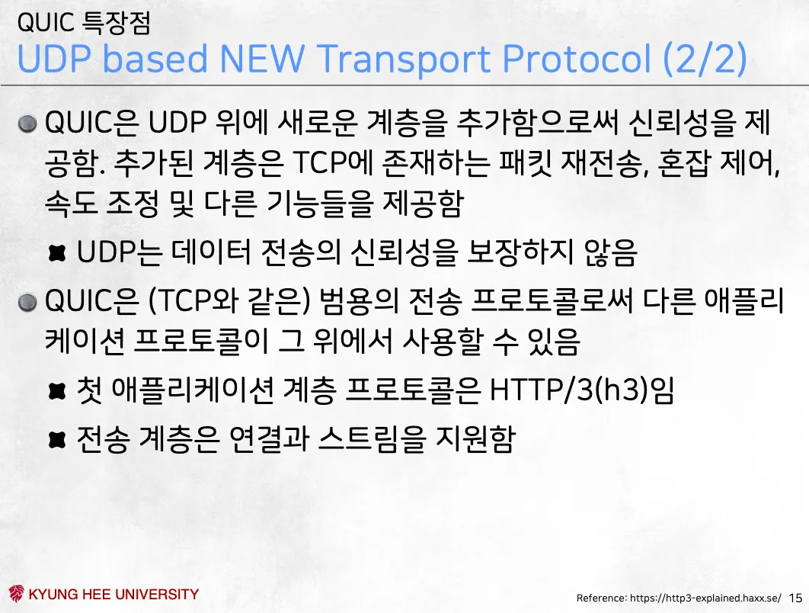

## 특징 1: UDP 기반 전송계층 프로토콜

- **QUIC은 UDP 위에 새로운 계층을 추가함으로써 신뢰성을 제공함**
	- UDP 자체는 손실 복구가 없지만, QUIC이 직접 전송 기능을 구현하여 TCP와 비슷한 수준의 신뢰성을 제공
- **추가된 계층은 TCP에 존재하는 패킷 재전송, 혼잡 제어, 속도 조절 등의 기능들을 제공함**
	- **UDP는 데이터 전송의 신뢰성을 보장하지 않음**
- QUIC은 **TCP처럼 범용 전송 프로토콜**이므로 HTTP/3뿐 아니라 여러 애플리케이션 프로토콜이 QUIC 위에서 동작할 수 있음
	- QUIC 위에서 동작하는 최초의 대표적인 프로토콜이 HTTP/3
	- **QUIC은 전송 계층으로서 연결과 스트리밍을 지원함**

## 특징 2: Connection based Transport

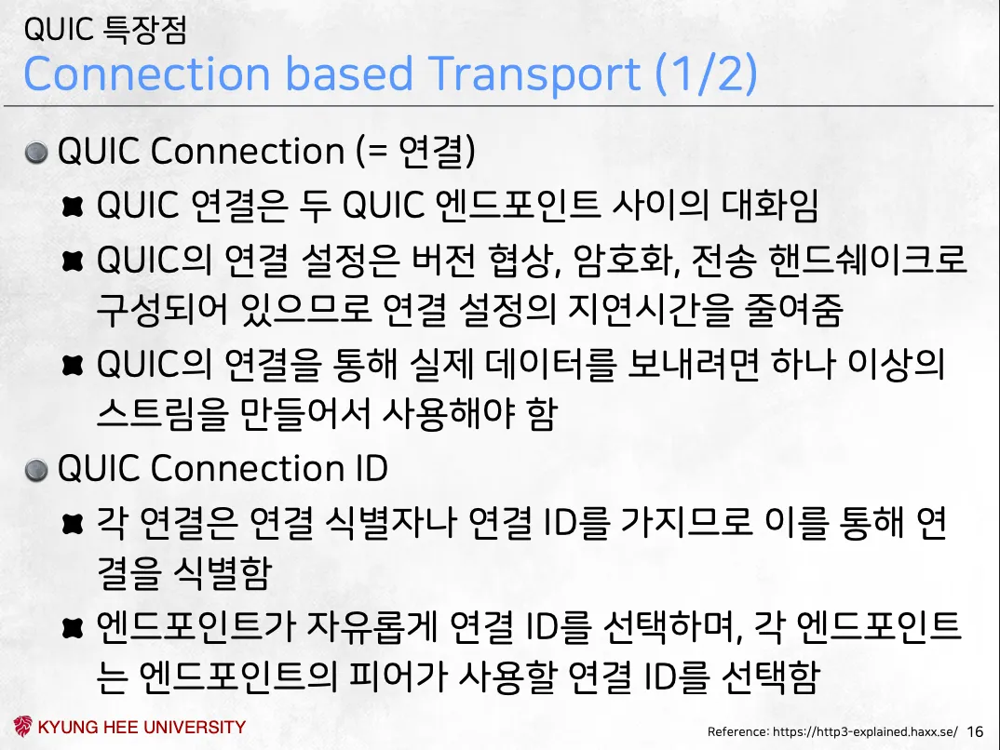

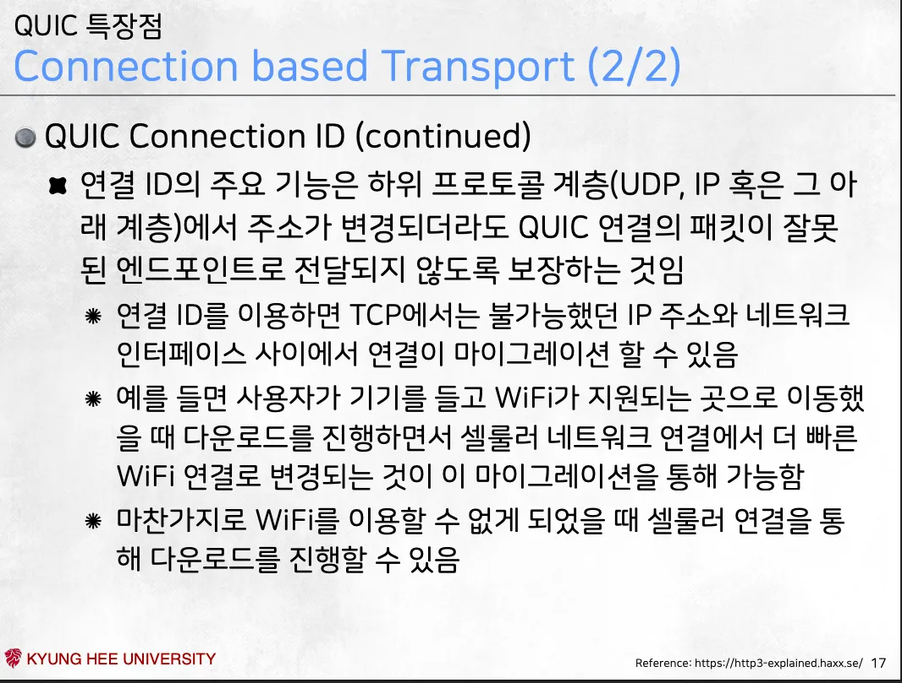

## QUIC Connection

- QUIC 연결은 두 QUIC엔드포인트 사이 대화
- 연결 설정에는 버전 협상, 암호화, 전송 핸드셰이크가 포함되며 지연시간 감소.
- 실제 데이터 전송은 하나 이상의 스트림을 생성해 사용.
→ QUIC의 연결은 TCP와 달리 **암호화(TLS 1.3)와 핸드셰이크가 통합된 논리적 연결 구조**

	- 그리고 이 연결 위에 여러 개의 스트림을 만들어 병렬로 데이터를 보냄
→ TCP vs QUIC
	→ TCP의 커넥션은 QUIC 커넥션과, TCP의 스트림은 QUIC 커넥션 내부 스트림과 동위
	→ QUIC의 스트림은 TCP의 바이트 스트림과 비슷하지만, **독립적이고 다중 스트림이며 HOL Blocking이 없음**

## QUIC Connection ID

- 각 QUIC 연결은 **고유한 연결 ID(Connection ID) 또는 식별자를** 가짐.
	- 이 ID로 연결을 구분하며, 엔드포인트가 자유롭게 ID를 선택할 수 있음.
- 이 ID는 네트워크 경로(IP, Port)가 바뀌어도 동일한 연결로 인식되도록 해 줍니다.
	→ TCP의 “IP + Port = 연결” 방식과 가장 큰 차이.

- Connection ID는 IP, Port가 바뀌어도 **패킷이 잘못된 엔드포인트로 가지 않게 보장**함.
- TCP에서는 IP/Port가 바뀌면 연결이 끊어지지만, QUIC은 **연결을 유지하며 마이그레이션 가능**
- ex) 다운로드 중이더라도 셀룰러 → WiFi로 전환 시 **IP가 바뀌어도 다운로드가 끊기지 않음.**
	- 이것이 QUIC Connection Migration 기능
- 기존 TCP는 ip, port가 바뀌면 서비스 마이그레이션이 안되지만, QUIC은 동일 Connection id이기만 하면 세션과 스트림이 유지

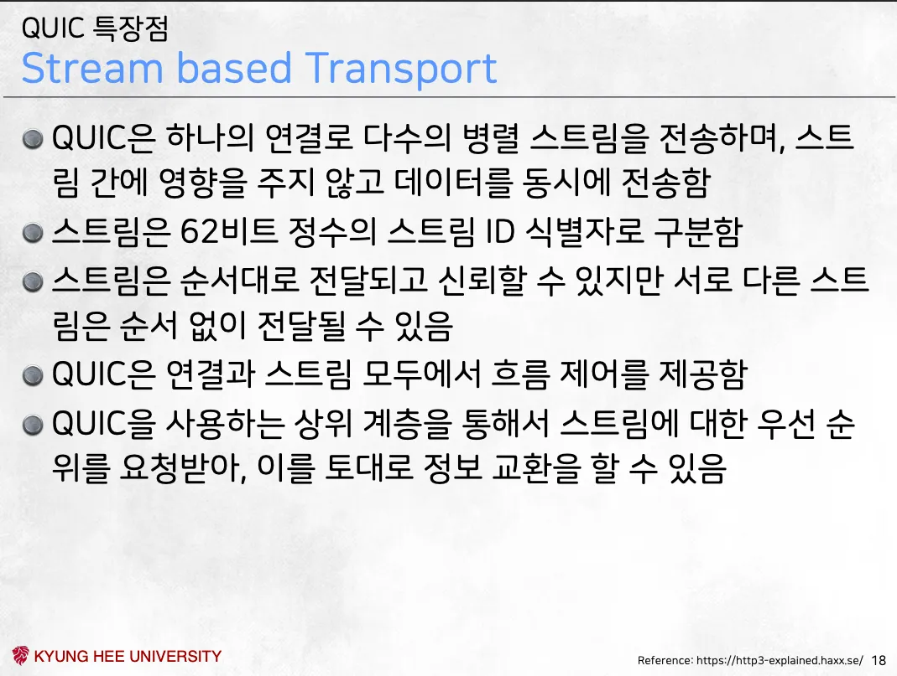

## 특징 3: Stream Based Transport

- **QUIC은 하나의 연결로 다수의 병렬 스트림을 전송하며, 스트림 간에 영향을 주지 않고 데이터를 동시에 전송함**
	- QUIC 연결 한 개 안에서 여러 스트림을 동시에 보낼 수 있으며, 어느 스트림에서 문제가 생겨도 **다른 스트림은 영향을 받지 않고 독립적으로 전달**됨.
	→ TCP에서는 불가능했던 HOL(Head-of-Line) 문제를 해결.

- **스트림은 순서대로 전달되고 신뢰할 수 있지만 서로 다른 스트림은 순서 없이 전달될 수 있음**
	- **스트림 내부**: 패킷 순서 보장 + 신뢰성 제공 (TCP처럼 보임)
	- **스트림 간**: 서로 독립이므로 순서와 상관없이 도착해도 됨
		→ 하나의 스트림 지연이 전체를 막지 않음.

- **QUIC은 커넥션과 스트림 모두에서 흐름 제어를 제공함**
	- QUIC은 다음 두 단계의 흐름 제어를 가짐
		- **연결 단위 흐름 제어**: 전체 데이터량 관리
		- **스트림 단위 흐름 제어**: 각각의 스트림이 서로 방해하지 않도록 조절
	→ TCP에는 스트림 단위 제어가 없었음.

- **QUIC을 사용하는 상위 계층을 통해서 스트림에 대한 우선 순위를 요청받아, 이를 토대로 정보 교환을 할 수 있음**
	- HTTP/3 같은 상위 프로토콜이 **특정 스트림의 우선순위를 지정**할 수 있으며, QUIC은 그 요청을 바탕으로 더 중요한 스트림을 먼저 보낼 수 있음.

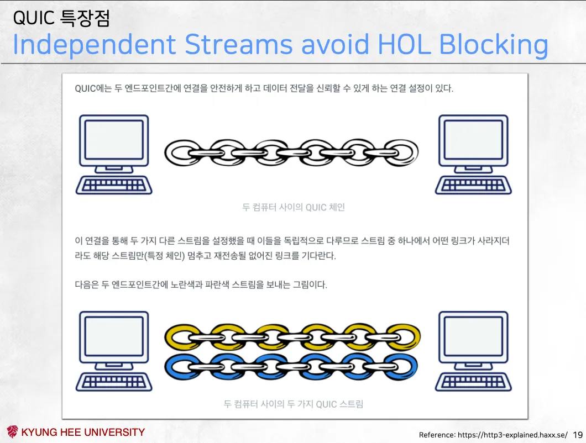

## 특징 4: HOL Blocking을 피하는 독립적인 스트림

- 독립적인 스트림은 HOL(Head-Of-Line) 블로킹을 피함
- TCP는 하나의 스트림에서 패킷이 하나라도 손실되면 그 뒤의 모든 데이터가 **멈춰서 기다려야** 하는 HOL Blocking 문제가 있음
- 반면 QUIC에서는:
	- 각 스트림이 **독립적**으로 동작하고
	- 한 스트림에서 손실이 발생해도 **그 스트림만 재전송/복구**하면 되고
	- 다른 스트림의 데이터는 **전혀 막히지 않고 즉시 전달**
	⇒ 따라서 QUIC은 TCP에 있던 HOL Blocking이 스트림 레벨에서 완전히 제거

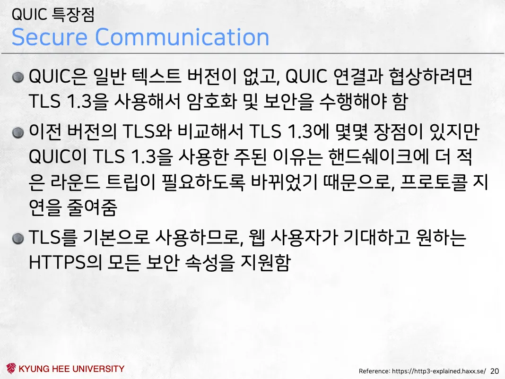

## 특징 5: Secure Communication

- **QUIC은 일반 텍스트 버전이 없고, QUIC 연결과 협상하려면 TLS 1.3을 사용해서 암호화 및 보안을 수행해야 함**
	- QUIC은 **초기부터 암호화가 기본**이며, 암호화되지 않은 QUIC은 존재하지 않음
	- 연결을 설정할 때 TLS 1.3을 반드시 사용하도록 설계되어 있음
- TLS 1.3은 핸드셰이크가 단축되어 **연결 지연(latency)을 크게 줄여줌**. QUIC은 빠른 연결 설정이 목표라 TLS 1.3을 채택함
- TLS 1.3 기반이므로 기밀성, 무결성, 인증 등 **HTTPS가 제공하는 보안과 동일한 수준**을 QUIC도 제공
→ QUIC은 암호화 기능을 자체 구현하지 않고, **TLS 1.3을 그대로 QUIC 내부에 통합하여 전송 계층 레벨에서 완전한 보안을 제공**
→ http, tls, tcp의 계층을 파괴

	- HTTP/3 구조에서는 기존의 HTTP → TLS → TCP의 계층 구분이 사라지고, **QUIC이 TLS와 TCP 역할을 모두 포함한 새 전송 계층으로 재탄생**
	- QUIC은 단순한 UDP 기반 프로토콜이 아니라 TLS(보안) + TCP기능(혼잡제어, 재전송) + 스트림 관리까지 **전부 한 층에서 수행**하는 구조.

## 특징 6: Reduced Signalling Latency
→ 줄어든 협상 시간

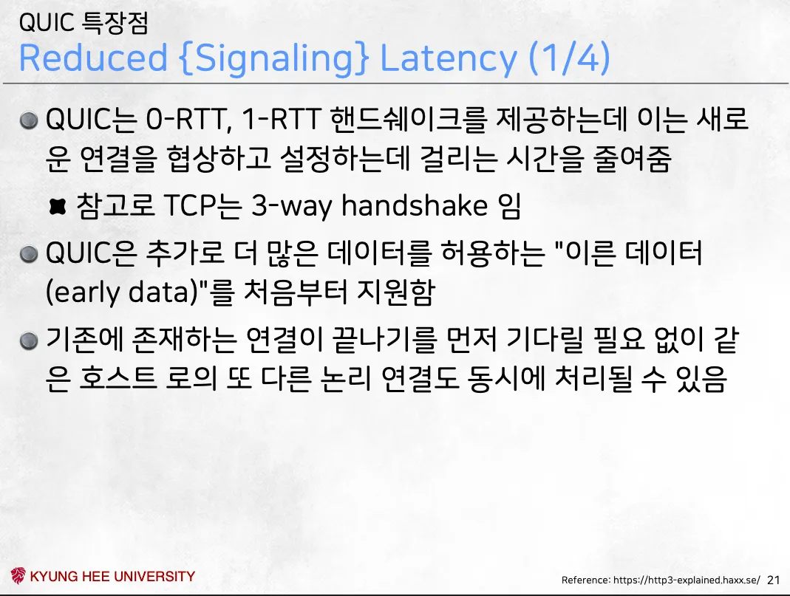

- **QUIC는 0-RTT, 1-RTT 핸드셰이크를 제공, 이는 새로운 연결 협상 시간을 줄여줌**
	- QUIC은 연결을 만들 때 **왕복 지연(RTT)을 거의 쓰지 않거나(0-RTT), 한 번(1-RTT)** 만에 끝냄
	→ TCP+TLS에서는 기본적으로 **여러 번 왕복**해야만 요청을 보낼 수 있었음

- **QUIC은 추가로 더 많은 데이터를 허용하는 early data(이른 데이터)를 처음부터 지원**
	- 0-RTT 연결에서는 핸드셰이크가 끝나기 전에도 **바로 HTTP 요청을 보낼 수 있음**
- **기존 연결이 끝나길 기다릴 필요 없이 같은 호스트로의  다른 논리 연결도 동시에 처리될 수 있음**
	- QUIC은 스트림을 여러 개 동시에 처리하므로 기존 연결이 끝날 때까지 기다릴 필요가 없음

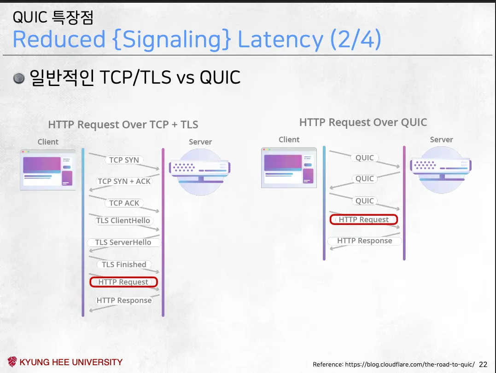

→ 그림 설명

- TCP + TLS에서는:
	1. TCP 연결
	2. TLS 핸드셰이크
	3. 그 후에야 HTTP 요청 가능
- QUIC에서는:
	- QUIC 초기 패킷에 TLS가 통합되어 있어 **첫 패킷에 바로 HTTP 요청을 포함**할 수 있음 (1-RTT 또는 0-RTT)

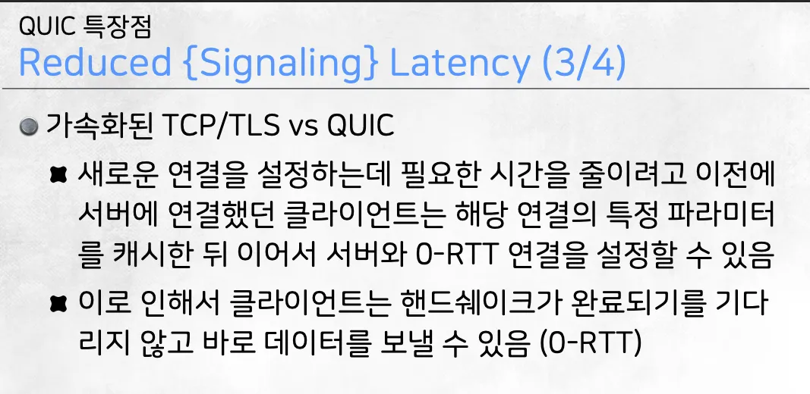

- QUIC은 과거 연결 정보를 기억하고 있으면 클라이언트는 바로 데이터를 보낼 수 있는 **0-RTT 연결 재개(resumption)** 를 사용할 수 있음

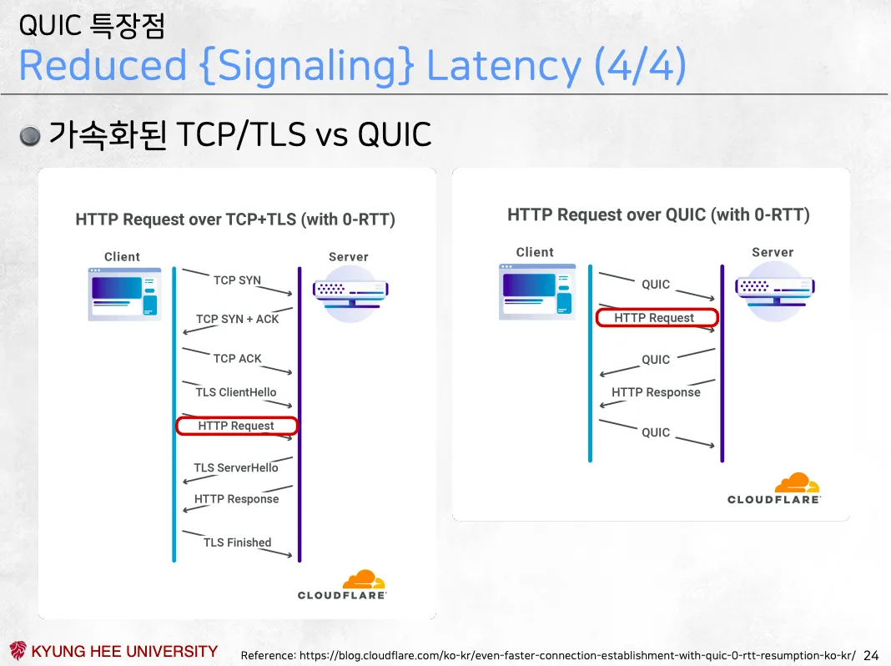

### **TCP/TLS (0-RTT 지원 버전조차):**
→ TCP도 tls 1.3의 0-RTT 지원이 존재

1. TCP 연결
- TLS ClientHello
- 세션 재개 정보 처리
- 이후에야 HTTP 요청 가능
	→ 결국 최소 한 번은 RTT 필요

### **QUIC:**

- 첫 패킷에서 바로 HTTP Request 전송 가능
	→ **HTTP 메시지가 날아가는 시점이 가장 빠르다**
***

# HTTP/3

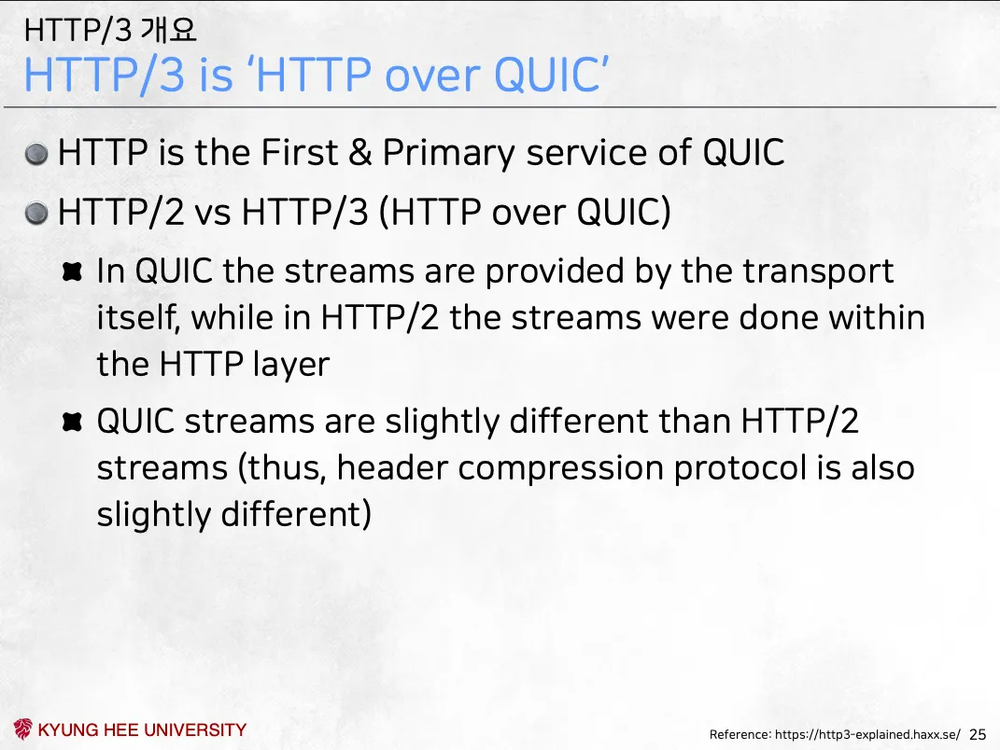

## HTTP/3 
→ http over QUIC

- HTTP/3은 QUIC을 기반으로 한 첫 번째, 주요한 서비스

### HTTP/2 vs HTTP/3

- QUIC에서는 스트림을 전송 계층(QUIC)이 제공하지만, HTTP/2에서는 스트림이 HTTP 계층 내에서 구현
	→ HTTP/2는 TCP 위에 스트림 기능을 “HTTP 레이어에서” 덧붙인 구조이고,
	→ HTTP/3는 QUIC 자체가 스트림을 제공하므로 **스트림 기능이 전송 계층 수준으로 내려온 것**

- QUIC 스트림은 HTTP/2 스트림과 약간 다르며, 따라서 헤더 압축 프로토콜도 약간 다름
	- HTTP/2에서는 헤더를 HPACK으로 압축했지만,
	- HTTP/3는 QUIC 스트림 구조와 맞추기 위해 **QPACK**이라는 다른 방식의 헤더 압축을 사용
→ HTTP/2에서 HTTP 레이어가 처리하는 기능이 HTTP/3에서는 QUIC의 전송 계층 내부로 이동

	- 프레이밍, 스트리밍, 멀티 플렉싱 등
→ **QUIC의 상단부는 http2의 하부, 하단부는 TCP의 상부 같은 역할**

	- HTTP/2에서 상위 레이어가 하던 “스트림·프레이밍” 기능 → QUIC이 수행
	- TCP가 하던 “전송·혼잡 제어·재전송” 기능 → QUIC이 수행
	⇒ 즉, QUIC은 **HTTP/2 + TCP를 결합하고 재구성한 새로운 전송 계층**.
→ QUIC의 스트림은 전송 계층의 기능이므로, HTTP말고 DNS, 미디어 스트리밍 등 범용적으로 다양한 프로토콜을 동작시킬 수 있음
	→ QUIC은 HTTP/3가 없어도 자체적으로 동작할 수 있음
	→ **DNS over QUIC”**

		- 기존 DNS는 UDP/53 또는 TCP를 사용하지만 보안·성능 문제가 있음.
		- DNS over QUIC은 암호화 + 멀티플렉싱 + 손실 회복을 제공하여 보안성과 성능을 동시에 확보.
		- 최근 브라우저·OS에서 채택이 늘고 있음.
	**→ “Media Over QUIC”**

	- 미디어 스트리밍, 파일 전송 등에서 QUIC의 빠른 재전송, 스트림 기능을 활용 가능.
	- 특히 P2P 기반 스트리밍에서도 QUIC이 유리함.

# HTTP/3 개요

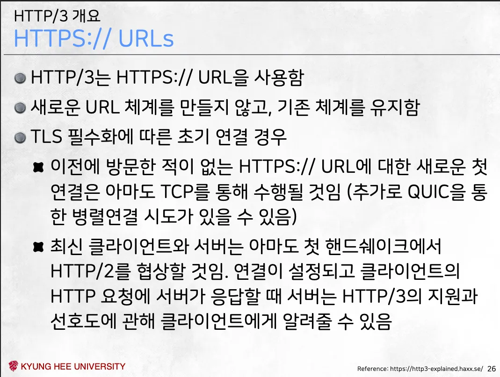

## HTTP3의 URL 구조

- HTTP/3는 새 URL 스킴을 만들지 않고 기존 HTTP/2/HTTP/1.1과 똑같이 **HTTPS://** 를 그대로 사용
	- 기존 HTTPS 체계 안에서 HTTP/3를 자동 협상(negotiation)으로 선택

### TLS 필수화에 따른 초기 연결

- **이전에 방문한 적이 없는 HTTPS:// URL에 대한 새로운 첫 연결은 아마도 TCP를 통해 수행될 것**
- 브라우저가 해당 서버에 **QUIC이 지원되는지 아직 모르는 경우**, 일단 TCP+TLS로 접속하면서 **동시에 QUIC 지원 여부도 테스트**
- **최신 클라이언트와 서버는 아마도 첫 핸드셰이크에서 HTTP/2를 협상**
	- 초기 연결에서 서버가 QUIC/H3 지원 여부를 아직 알려주기 전이므로, 브라우저는 TCP+TLS 위에서 **HTTP/2로 우선 접속**
- **연결 설정되고 클라이언트의 HTTP 요청에 서버가 응답할 때 서버는 HTTP/3의 지원과 선호도에 관해 클라이언트에게 알려줄 수 있음**
	→ 이를 알려주는 방법이 아래에서 설명되는 “Alt-Svc” 헤더
	→ 서버는 **Alt-Svc(Alternative Services) 헤더**를 통해 “이 도메인은 HTTP/3(QUIC)을 지원한다”라고 브라우저에게 알려줄 수 있음
		→ 이후 브라우저는 QUIC으로 다시 연결을 시도합니다.

### 기타

- HTTPS:// 체계를 유지하는 이유 중 하나는 **URL 스킴이 바뀌면 웹 전체 동작(쿠키, 캐시, 인증)이 깨지므로 **새 스킴을 만들 수 없다는 점
	- 따라서 [HTTPS://를](HTTPS://를) 통해 어느정도 http/3일 가능성을 식별
		→ 기존 방식을 통해 일정정도 식별

- 브라우저는 HTTPS로 접속한 뒤 서버가 HTTP/3을 지원한다는 정보를 받으면 **자동으로 QUIC으로 업그레이드**
- **기술들을 통한 요청을 하면서 동시에 최신 프로토콜을 사용할 수 있는지 확인하는 방식을 사용**
	- **Alt-Svc 기반 프로빙(Probe)** 
	- 브라우저는 기존 프로토콜로 연결하되, 서버가 h3 지원을 표시하면 **즉시 QUIC으로 갈아타는 전략**

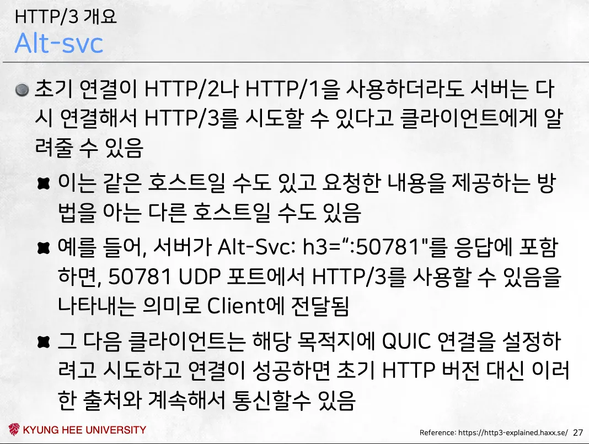

## Alt-svc 헤더
→ 다른 서비스를 지원함을 알리는 헤더

- **초기 연결이 HTTP/2나 HTTP/1을 사용하더라도 서버는 다시 연결해서 HTTP/3를 시도할 수 있다고 클라이언트에게 알려줄 수 있음**
- 브라우저는 Alt-Svc 정보를 바탕으로 QUIC 연결을 시도하고 성공하면 다음 요청들도 계속 HTTP/3로 보냄
→ 브라우저는 먼저 HTTP/2로 접속하고, Alt-Svc 헤더를 받으면 QUIC으로 **투명하게 프로토콜 전환하기도 함**

### 기타

- 모바일 앱의 경우 자체적으로 QUIC 클라이언트를 사용할 수 있으므로, 위 URL기반, Alt-svc 헤더 기반의 식별 방식을 사용할 필요가 없음
	- 또한 모바일 앱의 경우 서버와 앱(클라이언트)이 모두 동일한 주체에 의해 만들어지는 경향이 있으므로 사전에 합의를 하면 됨
	- 웹의 경우 그렇지 못하고 불특정 다수가 불특정한 서버에 접속하는 경향이 있음
		→ 웹 브라우저는 모든 서버가 QUIC을 지원하는지 모름.
		→ 그래서 **Alt-Svc가 가장 단순하고 범용적인 방식**

# HTTP/3 프레임

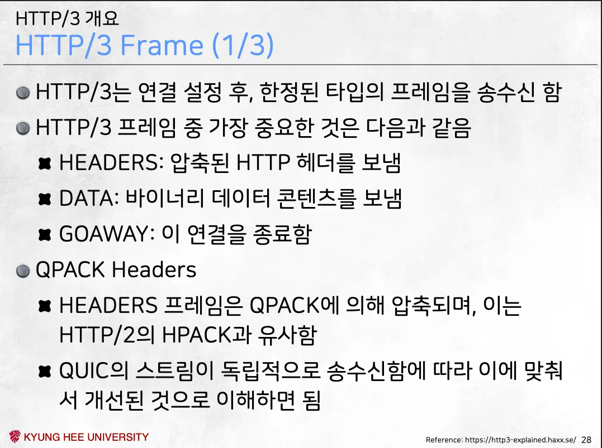

- HTTP/3는 QUIC 위에서 동작하고, QUIC 스트림 내부에는 정해진(한정된) 종류의 HTTP/3 프레임만 흐릅
- HTTP/3 프레임 중 가장 중요한 것은 아래와 같은
	1. HEADERS → 압축된 HTTP헤더
	2. DATA → 바이너리 데이터 콘텐츠
	3. GOAWAY → 연결 종료를 알림
- HTTP/3의 HEADERS프레임은 QPACK에 의해 압축
	- 이는 HTTP/2의 HPACK과 유사
	- QUIC의 스트림이 독립적으로 송수신함에 따라 이에 맞춰서 개선된 것
→ HTTP/2에서는 프레임이 HTTP2 레이어에 존재

	- HTTP/2는 TCP 위에서 **프레이밍과 스트리밍을 모두 HTTP/2가 담당**
→ HTTP/3에서는:

	- 프레임 포맷은 HTTP/3가 정의
	- 스트림/전송은 QUIC이 처리

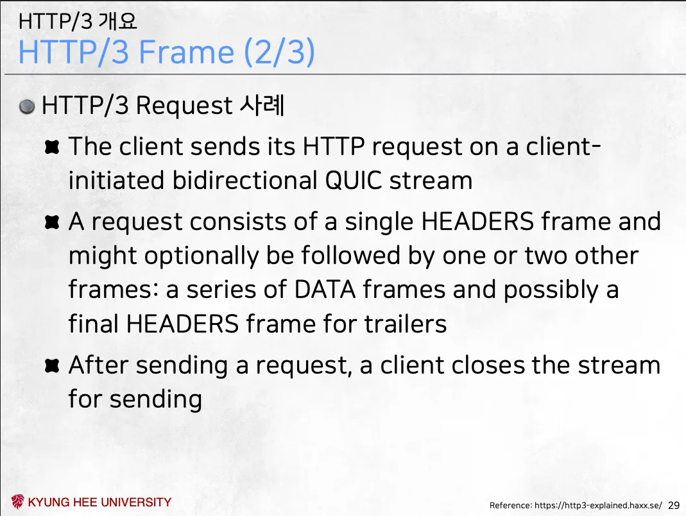

- 클라이언트는 자신이 시작한 양방향 QUIC 스트림에서 HTTP 요청을 보냄
- 요청은 하나의 HEADERS 프레임으로 시작하고, 선택적으로 DATA 프레임과 마지막 HEADERS(트레일러) 프레임이 이어질 수 있음
- 요청을 모두 보낸 뒤 클라이언트는 해당 스트림의 전송 방향을 닫음

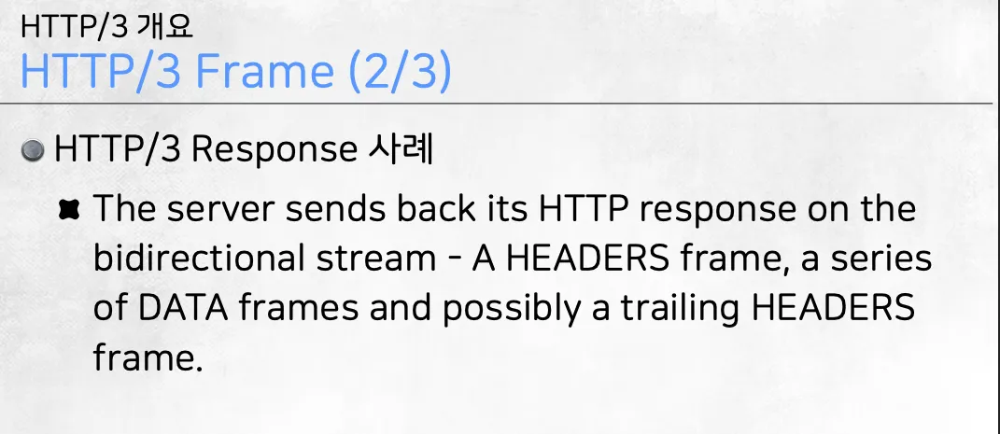

- 서버는 양방향 스트림을 통해 HEADERS 프레임, 여러 DATA 프레임, 선택적 트레일러 HEADERS 프레임으로 구성된 HTTP 응답을 보냄

# 우선순위 제어

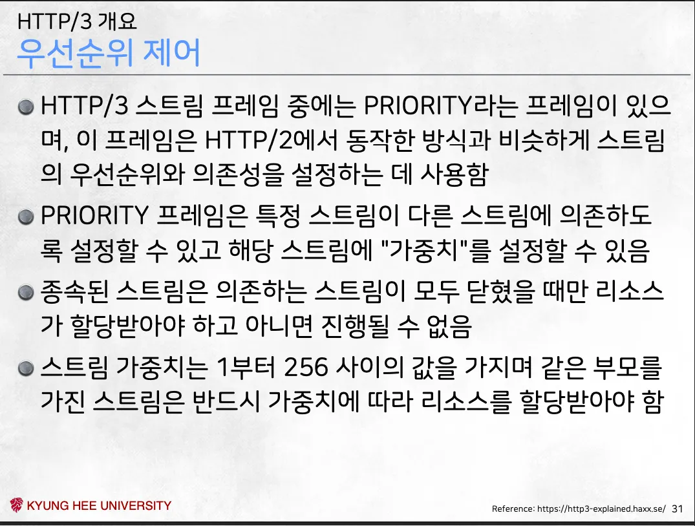

- HTTP/3의 프레임 중에 PRIORITY라는 프레임이 있음
	- 이는 스트림의 우선순위와 의존성 설정에 사용 → HTTP/2와 유사
- 이 프레임은 특정 스트림이 다른 스트림에 의존하게 할 수 있고, 해당 스트림에 가중치를 설정 가능
- 종속된 스트림은 의존하는 스트림이 모두 닫혔을 경우에만 리소스를 할당, 아니라면 진행 불가
- 스트림 가중치는 1~256 사이의 값이며, 같은 부모를 가진 스트림은 가중치에 따라 리소스를 할당
	→ HTTP/2와 우선순위에 따른 리소스 분배 방식은 동일
	→ HTTP/2의 복잡한 트리 구조는 폐기됨. → HTTP/3는 “의존성 + 가중치(weight)”만 가짐 → 구현이 더 단순하고 효율적.

# 서버 푸시

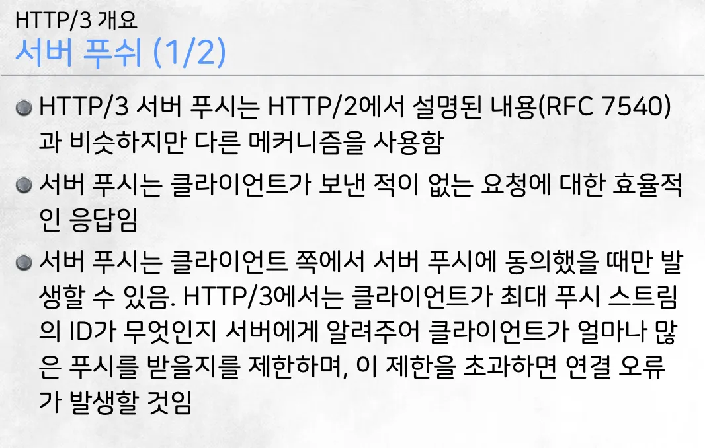

- **HTTP/3 서버 푸시는 HTTP/2의 개념을 기반으로 하지만 메커니즘이 다름**
	- 클라이언트가 요청하지 않은 리소스를 서버가 미리 보내는 것”이라는 개념은 동일
	- QUIC 스트림 구조 때문에 구현 방식은 변경
- 서버 푸시는 클라이언트가 보낸 적 없는 요청에 대한 효율적인 응답
- 서버 푸시는 클라이언트의 동의가 있을 때만 발생 
	- 최대 몇 개의 Push Stream을 허용할지푸시 스트림 ID 범위를 먼저 알려야 함.
	- 이 제한을 초과하면 연결 오류가 발생

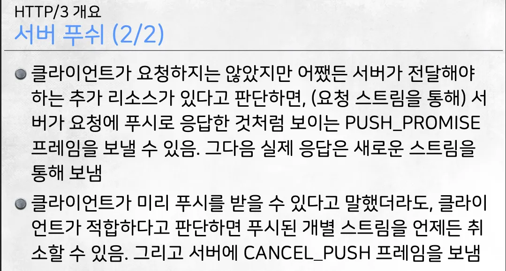

- 서버가 전달해야하는 추가 리소스가 있다고 판단하면 **PUSH_PROMISE** 프레임을 보냄.
	- HTTP/2와 비슷한 흐름이지만 실제 데이터는 별도의 새로운 스트림에서 전송
- 약속(PUSH_PROMISE)은 기존 요청 스트림에서 발생하고, 실제 리소스 데이터는 **서버가 여는 push stream** 안에서 DATA/HEADERS 프레임으로 보냄
- **클라이언트는 언제든 푸시 스트림을 취소 가능**
	- 이미 푸시를 허용했어도 클라이언트가 필요없다 판단하면 바로 **푸시를 취소(CANCEL_PUSH)** 할 수 있음.
	- QUIC 스트림의 독립성 덕분에, 서버 푸시 스트림 하나만 종료시키면 됨
→ 무한정 푸시가 가능한 HTTP/2보다 더 통제적임.

# HTTP/2와 HTTP/3의 유사점과 차이점

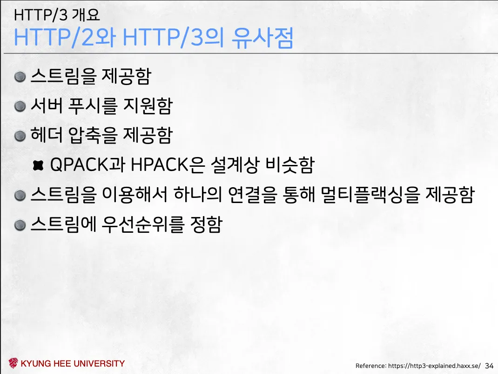

## 유사점

1. 스트림을 제공
2. 스트림을 이용해 하나의 연결을 통해 멀티플렉싱 제공
	- 하나의 연결 안에서 여러 스트림을 동시에 처리하는 기능 제공(멀티플렉싱)
3. 스트림에 우선순위를 정함
4. 서버 푸시를 지원
5. 헤더 압축 방식을 제공 → HPACK, QPACK

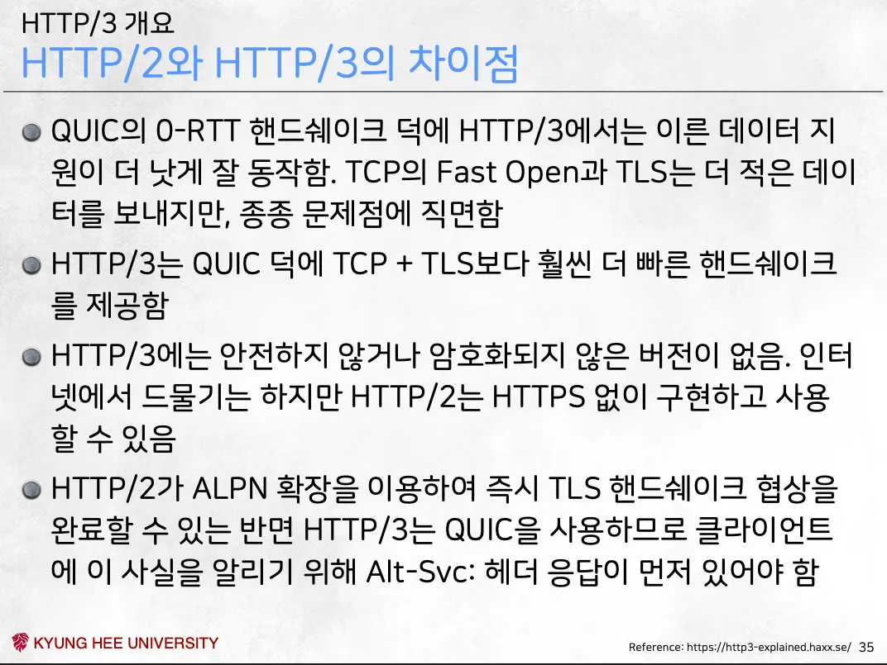

## 차이점

1. **QUIC의 0-RTT 덕분에 HTTP/3가 “이른 데이터(early data)”를 훨씬 잘 처리함**
	- HTTP/3는 QUIC의 **0-RTT handshake**를 그대로 활용 가능
		→ 첫 요청을 거의 지연 없이 바로 전송할 수 있음.

	- TCP Fast Open(TFO) + TLS early data(0-RTT)는 따로 결합해야 하고, 구현 난이도·종속성 문제로 잘 쓰이지 않음.
	→ HTTP/3는 TCP기반의 HTTP/2보다 시작 속도가 빠름

2. **HTTP/3는 QUIC 덕분에 TCP+TLS보다 더 빠른 핸드셰이크 수행**
3. **HTTP/3는 “암호화되지 않거나 안전하지 않은 버전”이 없음**
	- QUIC 자체가 항상 **TLS 1.3 기반**
	- 따라서 HTTP/3 = 무조건 HTTPS
	- HTTP/2는 HTTP(암호화 없음)과 HTTPS 둘 다 존재.
	→ 즉, HTTP/3는 **암호화가 강제**되는 최초의 HTTP 프로토콜.

4. **ALPN 차이 → HTTP/2는 바로 협상 가능, HTTP/3는 Alt-Svc가 먼저 필요**
	- HTTP/2:
		- TLS 핸드셰이크 중 **ALPN** 확장에서 "h2"를 협상하면 즉시 HTTP/2 사용 가능
		→ 별도의 절차 없이 바로 전환됨

	- HTTP/3:
		- QUIC 위에서 동작하므로, 첫 연결이 TCP일 때는 QUIC을 바로 협상할 수 없음
		→ 서버가 **Alt-Svc 헤더(h3=”:포트”)** 로 “HTTP/3 사용 가능함”을 먼저 알려야 함
		→ 그다음 클라이언트가 QUIC으로 다시 연결
	→ 즉, **HTTP/3는 HTTP/2보다 활성화 과정이 더 복잡**함.

# HTTP 기술 변화

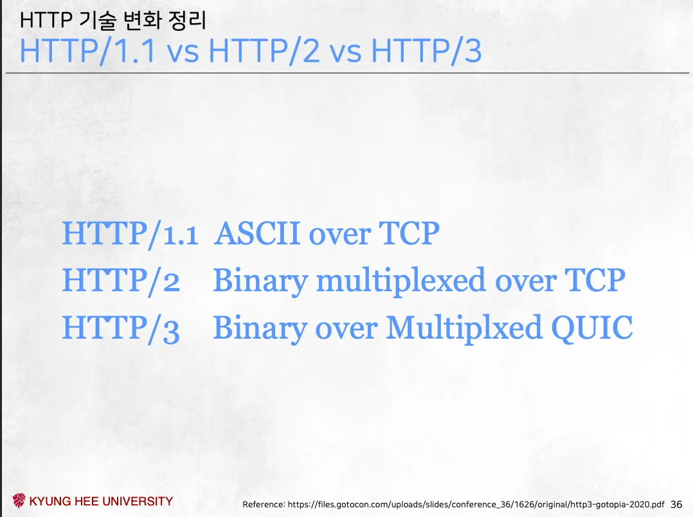

### HTTP/1.1

- TCP기반, 사람이 읽을 수 있는 텍스트로 메시지 구성
- TCP 연결 하나에서 요청-응답을 순차적으로 파이프라이닝 처리
→ 병렬성 낮고, HoL blocking 발생

### HTTP/2

- TCP 기반, 메시지를 바이너리 프레임으로 분할
- 단일 TCP연결에서 여러 스트림 동시에 처리
→ TCP 레벨의 HoL Blocking 발생 가능

### HTTP/3

- 멀티플렉싱 지원의 QUIC 기반, 바이너리 메시지
	→ 전송 계층이 멀티플렉싱 기본 지원

- 각 스트림이 완전히 분리되므로:
	- 하나에서 에러 발생해도 다른 스트림 영향 없음
	- 진짜 의미의 병렬 처리 가능
→ **HTTP/2 문제 해결의 핵심이 바로 QUIC 도입**

<columns>
	<column>

		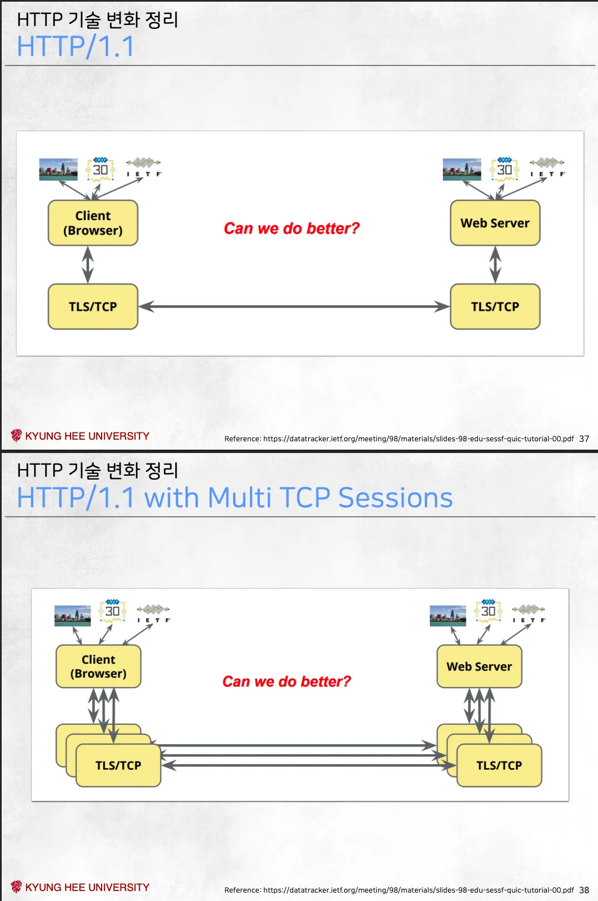

	</column>
	<column>

		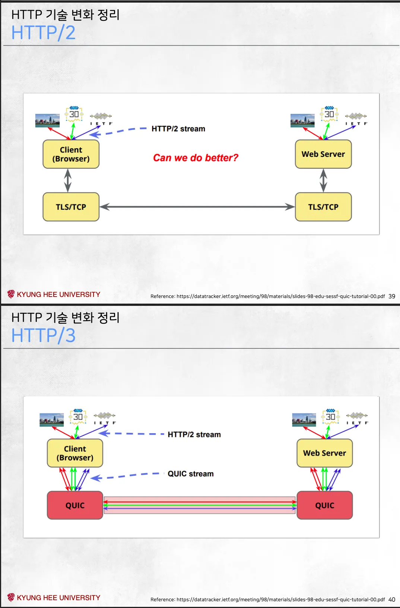

	</column>
</columns>
→ 아래 순서로 발전

	1. 기본적인 단일 TCP의 HTTP/1.1
	2. HTTP/1.1의 제한된 성능을 올리기 위해 여러 TCP연결 사용
	3. 멀티플렉싱을 도입해 TCP연결 하나에서 여러 스트림을 병렬 처리
	4. QUIC이라는 새로운 전송 계층을 도입해 스트림을 병렬처리, 독립성 확보, TCP HoL blocking 제거

## QUIC의 이슈(→ 일종의 단점)

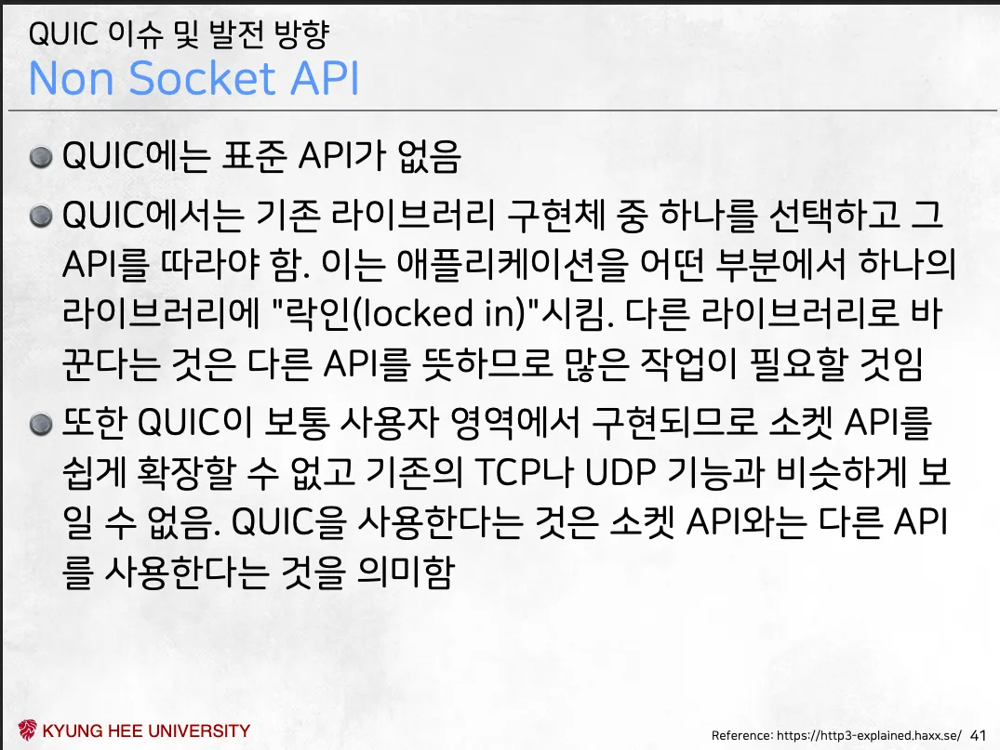

## Non Socket API

- QUIC은 TCP, UDP와 달리 표준 API가 없음
- QUIC에서는 라이브러리 구현체 중 하나를 선택하고 그 API를 따라야함
	→ 애플리케이션을 특정 라이브러리에 락인시키는 문제점 발생
	→ 다른 라이브러리의 변경이 어려움
→ QUIC을 사용하는 경우, QUIC라이브러리 자체는 래핑하고 애플리케이션은 그 래퍼를 사용하는 형태의 디자인 패턴을 활용하는 것이 좋음

	- 어뎁터 패턴 또는 파사드 패턴을 적용
- 이런 이유로 QUIC 구현체는 동일 프로토콜이지만, 구현체 자체의 속도와 성능에서 차이가 많이 남

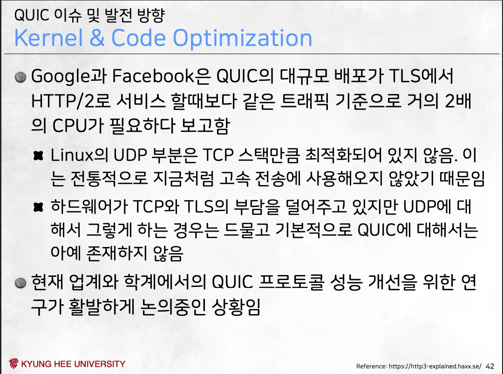

## Kernel & Code 최적화

- 같은 트래픽 기준 HTTP/2 대비 QUIC은 CPU를 2배 가까이 사용
	- 이유
		1. QUIC은 커널이 아닌 사용자 영역에서 동작하여
		2. 암호화, 혼잡제어, 스트림 관리 등을 라이브러리가 모두 직접 처리
- Linux의 UDP는 TCP스택만큼 최적화되지 않음
	- 전통적으로 고속 전송에 사용하지 않음
	- 하드웨어는 전통적으로 TCP, TLS의 부담을 더는데는 특화, UDP에 대해서는 그렇지 않고, QUIC은 존재하지 않음
- 현재 QUIC의 성능 개선을 위한 연구를 활발히 논의

# QUIC & HTTP/3 현황

## **핵심 설명**

- **QUIC + HTTP/3 표준이 2021년 5월에 최종 확정됨(RFC 9000 시리즈).**
- 이 표준이 확정되면서 글로벌 대형 서비스들이 본격적으로 HTTP/3를 도입하기 시작

## **실제 적용 사이트 예시**

- Google
- YouTube
- Instagram
- Facebook
- Cloudflare
⇒ 이미 대부분 대형 인터넷 서비스는 HTTP/3를 제공

## 네이버 적용

- 2022년 11월부터 네이버 검색이 HTTP/3 기반으로 서비스되기 시작.
- 장점: **빠른 응답 속도**, **안정적인 연결**, **통신 품질 향상**.
- 이미지에서는 네이버 검색이 HTTP/3로 동작하는 실제 테스트 화면이 보임.

## **Server 지원 현황**

### **1. nginx**

- 정식 지원은 아직
- HTTP/3 지원 프리뷰 버전이 2020년 공개됨
- 기본 nginx에는 아직 QUIC 기능 없음(Cloudflare가 quiche로 패치 제공)

### **2. LiteSpeed / OpenLiteSpeed**

- HTTP/3 draft를 이미 안정적으로 지원

### **3. Caddy 서버**

- HTTP/3 실험적 지원 활성화

### **4. Cloudflare**

- 자체 QUIC 라이브러리(quiche)를 nginx에 통합해 제공

### **5. Apache**

- 계획은 있으나 정식 발표 없음
**⇒ 서버마다 QUIC 지원 상태가 다름**. LiteSpeed, Caddy 등이 가장 빠르게 적용함.

## **Browser 지원 현황**

### **1. Chrome**

- Stable build에서 HTTP/3 탑재
- 2020년 이후 실제 사용자 환경에서 활성화

### **2. Firefox**

- Stable build에 HTTP/3 지원 탑재

### **3. Safari**

- Safari Technology Preview부터 지원

### **4. Edge**

- Chrome 기반이므로 Chrome과 동일하게 HTTP/3 지원
⇒  **2020년 이후 모든 주요 브라우저가 HTTP/3를 기본적으로 지원한다.**

## 기타

- CURL은 실험적으로 HTTP3 지원
- HTTP/3용 테스트 서버들도 존재
	→  curl이나 브라우저를 이용해 실제 HTTP/3 연결을 테스트할 수 있는 사이트
