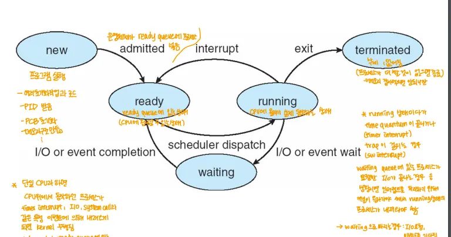

> 원본 Notion 정리 — 강의 슬라이드/설명.
> [← 전체 목차](/posts/os-overview/)

***

# 1. 리눅스 부트스트래핑 과정

1. CPU에 전원이 공급
2. 전원이 공급되면 CPU는 스스로를 초기화하고 고정된 주소의 BIOS/UEFI를 시작하는 명령을 실행
3. BIOS/UEFI의 명령을 실행하고 제대로 작동하는지 테스트(Power On Self Test)를 수행
4. BIOS/UEFI는 운영체제를 로드할 부트 장치를 찾고, 부트 로더를 메모리로 로드
	- 이때 BIOS는 MBR를 확인해 부트 로더를 찾고, UEFI는 ESP에서 부트 로더를 찾음
5. LILO나 GRUB같은 부트 로더가 실행되어 디스크에 설치된 압축된 커널 이미지를 메모리로 로드
6. 메모리로 로드된 커널은 스스로 압축을 풀고 실행시킴

# 2. 프로세스의 상태 전이를 그리고 상태와 전이조건 설명

1. **new**
	- **프로그램이 생성하기 시작한 상태, 프로세스가 생성되는 단계**
	- 프로세스 생성 및 실행을 위한 여러 초기화 작업 수행
	⇒ 상태 전이 조건

		- admitted(new → ready): 새로 만들어진 프로세스가 시스템에 승인되면 ready 상태로 전이
2. ready
	- 프로세스의 실행 준비가 완료된 상태
	- CPU를 할당받지 않아 동작을 기다리는 상태
	⇒ 상태 전이 조건

		- scheduler dispatch(ready → running): 스케줄러가 ready 상태의 프로세스가 선정되면 running 상태가 됨
3. running
	- 실제로 명령어가 실행되는 상태
	⇒ 상태 전이 조건

		- Interrupt(running → ready): running 상태에서 타이머 인터럽트나 강제적 이벤트 발생 시 ready 상태로 전이
		- I/O or event saiting(ready → waiting): running 상태에서 입출력 작업이나 이벤트를 기다리면 waiting 상태로 전이
		- exit(ready → terminated): running 상태에서 프로세스가 정상적으로 종료되면 terminated 상태로 전이
4. waiting
	- 프로세스가 어떤 이벤트가 일어나기를 기다리는 상태
	- 운영체제에 I/O 작업이나 기타 서비스를 요청했을 때 이런 요청을 받을 때 까지 기다려야함
	⇒ 상태 전이조건

	- I/O or event completion(waiting → ready): waiting 상태에서 대기하던 작업이 완료되면 ready 상태로 전이
5. terminated
	- 프로세스 실행이 종료되는 상태

# 3. Synchronization 문제와 동기화 도구의 요구사항 세 가지를 설명하라 → 얘일듯?
2개의 동시 실행되는 스레드 또는 프로세스가 동기화 문제를 일으킬 수 있는 Critical Section에 들어가서 동시에 공유 자원에 접근해 조작하게 되면 결과가 비 결정적이고 타이밍에 따라 달라지는 Race Condition이 발생한다. 이때 발생할 수 있는 문제가 Synchronization Problem이다.
동시성 환경에서 이런 동기화를 처리하기 위한 도구가 필요한데 이를 동기화 도구라고 한다. 동기화 도구가 갖춰야 하는 세 가지 요구사항은 아래와 같다.

1. Mutual Exclusive(상호 배제)
	- 프로세스가 자신의 Critical Section에서 실행 중일 때 다른 어떤 프로세스도 Critical Section에 진입할 수 없음
2. Progress
	- 다른 프로세스가 Critical Section에서 실행되지 않는 상황에서 해당 구간을 수행하고자 하는 프로세스가 있을 때 그 결정을 무기한 연기할 수 없어야 함
3. Bounded Waiting
	- 프로세스가 Critical Section의 진입을 위한 대기 중 다른 프로세스들이 Critical Section에 진입하는데는 한정된 횟수가 있어야 함
***
