> 원본 Notion 정리 — 강의 슬라이드/설명.
> [← 전체 목차](/posts/os-overview/)

***

# 프로그램과 프로세스

## 프로그램

- 디스크에 올라간 실행 파일 
	- 메모리에 올라가 있지 않은 디스크에 저장된 상태
- 언제든 메모리에 올려 실행시킬 수 있는 디스크에 저장된 바이너리 코드

## 프로세스

- 프로그램이 실행 중인 상태인 것
- 실행과 스케줄링의 기본 단위 
	→ 스레드 개념 등장하면 그게 더 기본적인 단위임

- 프로세스 ID(PID)로 식별 됨

# 프로세스 개념

## 프로세스란?

- 프로그램이 실행 중인 상태
- 프로그램 내에서 제어 흐름을 캡슐화 한 것 → 제어 흐름을 단위로 만든 느낌
- 동적이고 활동적인 상태의 것 → 프로그램이 실행되며 메모리에 올라가서 동작하는 중
- 실행과 스케줄링의 기본 단위
- 각 프로세스는 고유한 Process ID(=PID)를 통해 이름이 지정됨

# 프로세스 주소 공간

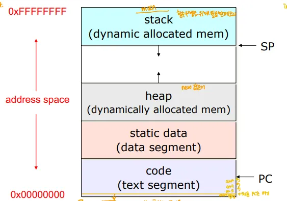

## Address Space(주소 공간)

- 운영체제가 프로세스가 사용하도록 논리적으로 0x00000000 ~ 0xFFFFFFFF 까지의 주소 공간을 사용할 수 있도록 잡아 줌
- 실제 물리적인 메모리와는 별개의 논리적인 메모리 공간
	→ 실제로 0x00000000 ~ 0xFFFFFFFF만큼을 다 쓰는게 아닌, 그 만큼을 쓸 수 있게 허락만 해주고, 실제로는 요구하는 만큼만의 물리 메모리만 쓰게 하는 느낌

- 프로세스는 저 공간을 모두 쓸 수 있다고 가정한 것

## Code Segment(코드 영역)
=Text Segment, Text Section

- 프로그램의 실행 코드가 저장된 영역
- 주로 프로그램의 명령어가 위치
- 이 영역에서 PC(프로그램 카운터)는 현재 실행 중인 명령어의 주소를 가리킴

## Static Data Segment(정적 데이터 세그먼트)
= Data Segment, Data Section

- 전역 변수, 정적으로 할당된 변수가 저장됨
	→ 프로그램의 실행 종료 까지 살아 있어야 하는 변수들을 할당
	→ 정적 변수: 함수, 클래스 내에서 선언되어도 그것들과 무관하게 값이 유지되는 변수

## Heap(힙)

- 런타임 동안 동적으로 할당되는 메모리 공간
	→ new 연산자로 할당한 메모리 같은 것들(지역 변수는X)
	→ 주로 큰 데이터(객체, 배열 등 동적 데이터) 같은 것들 넣음, 사용자가 명시적으로 관리할 것들 넣음 ↔ 스택

## Stack(스택)

- 함수 호출, 지역 변수 등의 임시 데이터를 저장하는 공간
	→ 함수 호출 시 해당 함수의 데이터가 스택에 저장, 종료 시 스택에서 제거

- 함수 파라미터, 복귀 주소 , 지역 변수 등
- 이 영역에서 SP(Stack Pointer)가 현재 스택의 위치를 가리킴

# 프로세스 상태

- **프로세스는 실행되며 그 상태(스스로의 상태)가 변함**
- **여러 프로세스가 운영 체제에 의해 상태가 변화하며 실행 됨 **
	- ex) 실행, 기다림 등등
**→ 잘 외우고 있을 것!**

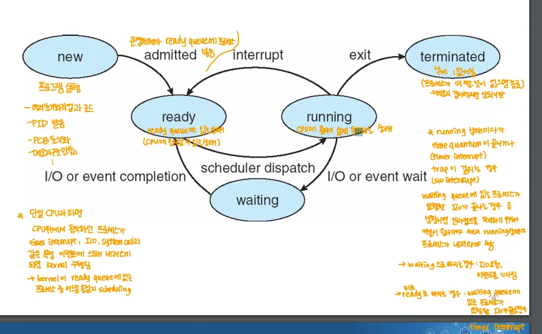

## 1. new

- 프로그램이 실행되기 시작한 상태, 프로세스가 생성되는 단계
- 프로세스 생성 및 실행을 위한 여러 초기화 작업(ex. PID 할당)이 수행

### 상태 전이 조건

1. Admitted(new → ready)
	- 새로 만들어진 프로세스가 시스템에 승인되면 ready 상태로 전이

## 2. ready

- 프로세스의 실행 준비가 완료된 상태
- CPU를 할당받지 않아 동작을 기다리는 상태(스케줄링을 기다리는 상태)

### 상태 전이 조건

1. Scheduler Dispatch(ready → running)
	- 스케줄러가 ready 상태인 프로세스에게 CPU를 할당하면 running 상태로 전이

## 3. running

- 실제로 명령어가 실행되는 상태
- 운영체제의 스케줄러에 의해 ready 상태의 프로세스가 선정되면 running 상태가 됨

### 상태 전이 조건

1. Interrupt(running → ready)
	- running 상태에서 타이머 인터럽트나 강제적 이벤트 발생 시 ready 상태로 전이
2. I/O or Event Wait(running → waiting)
	- running 상태에서 입출력 작업이나  특정 이벤트를 기다리게 되면 waiting 상태로 전이
3. Exit
	- 프로세스가 정상적으로 종료되면 terminated 상태로 전이

## 4. waiting

- 프로세스가 어떤 이벤트(ex. 입출력 작업 완료)가 일어나기를 기다리는 상태
- 운영체제에게 I/O 작업이나 기타 서비스를 요청했을 때 이런 요청을 받을 때 까지 기다려야함

### 상태 전이 조건

1. I/O or Event Completion(waiting → ready)
	- waiting 상태에서 대기하던 작업이 완료되면 ready 상태로 전이

## 5. terminated

- 프로세스의 실행이 종료되는 상태 → 정상 종료, 강제 종료 상관X
- 프로그램이 종료되는 상태
- Ex) return문, exit, MemoryException 등

## 리눅스 예시
→ ps -a 명령어 입력 ⇒ 이렇게 현재 존재하는 프로세스들의 상태가 나옴

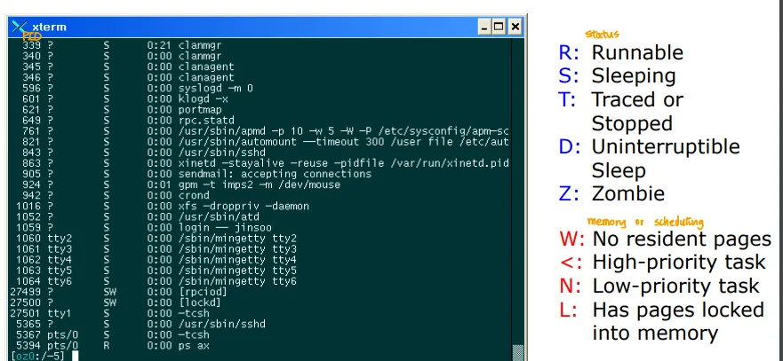

# Process Control Block(PCB)
= 프로세스 제어 블록

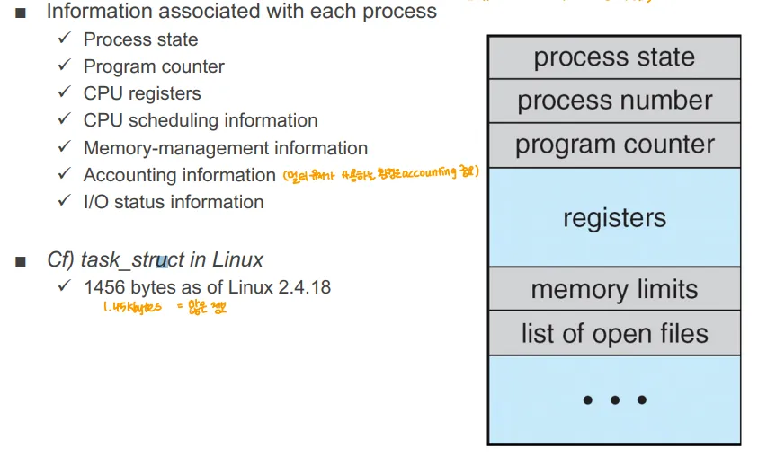

- 프로세스를 관리하기 위한 데이터를 구조체를 만들어 이를 통해 프로세스를 관리할 수 있도록 한 것
	- 프로세스를 다시 시작하기 위해 필요하나 데이터들의 저장소 역할을 함

## PCB 가 가지고 있는 정보

- PCB는 특정 프로세스와 관련된 여러 정보를 가짐
1. Process state(프로세스 상태)
	- new, ready 등 해당 프로세스의 상태
2. Program Counter(프로그램 카운터)
	- 프로세스가 다음에 실행할 명령어의 주소를 가리킴
	- 다른 프로세스 실행 도중 돌아오면 해당 지점으로 돌아와서 작업을 수행
3. CPU registers
	- CPU가 사용 중인 모든 레지스터의 값이 저장됨
	- 프로세스가 다시 스케줄 될 때 올바르게 실행되도록 하기 위해 필수
4. CPU scheduling information
	- 프로세스가 cpu를 언제 받을 지 결정하는 스케줄링 우선순위 등의 정보
5. Memory management information
	- 프로세스가 사용하는 메모리의 관리 정보
6. Accounting information
	- 프로세스가 시스템 자원을 얼마나 사용했는지에 대한 정보(ex. cpu 시간)
7. I/O status information
	- 프로세스가 대기중인 입출력 작업, 장치에 대한 정보
+) process number : PID를 저장

## 리눅스 PCB 예시

- Linux에서는 task_struct가 PCB 역할을 함
- Linux 2.4.18 기준으로 1456 바이트의 크기를 가짐
⇒ PCB는 매우 큰 구조체 → 문맥 전환이 비싼 이유

## C로 표현된 리눅스 PCB 예시

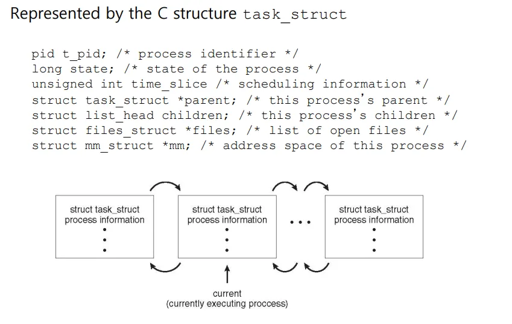

- 이런 형태의 구조체들이 링크드 리스트(더블 링크드 리스트)로 연결된 형태

# Context Switch(=문맥 전환, CPU Switch)
→ CPU에서 동작하는 Context가 바뀜

	- CPU Context : 프로그램이 바이너리 코드로 만들어지면, 이 바이너리 코드에는 CPU 명령어로 이 프로그램이 어떻게 수행 될 지 적혀있음 ⇒ 이게 **CPU Context(문맥)**
- **Context Switch: CPU가 현재 실행 중인 프로세스의 상태를 저장하고, 다른 프로세스의 상태를 복원해 실행하는 과정**

## Context Switch 과정

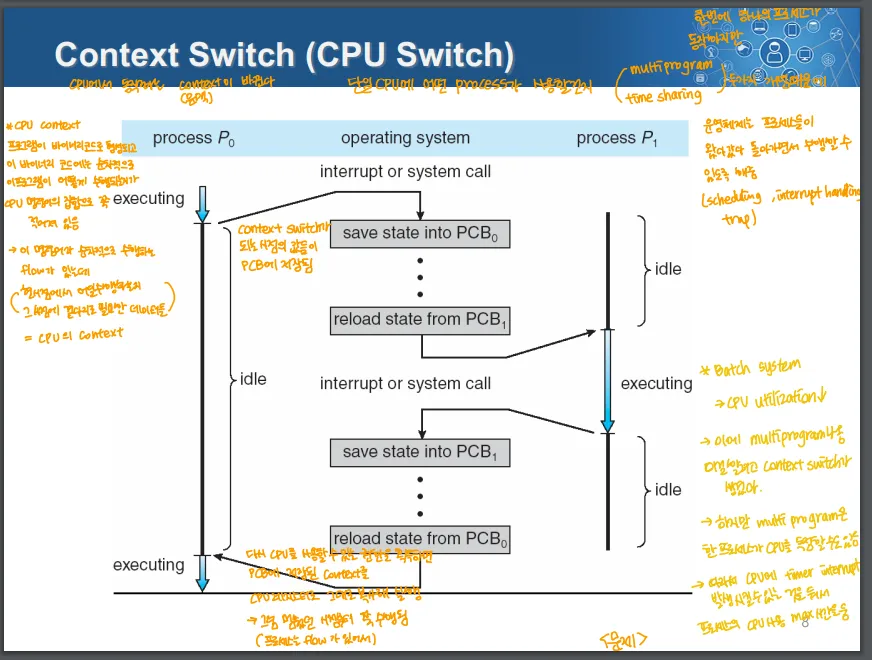

1. P0 실행 → 프로세스 P0이 현재 CPU에서 실행 중
2. **인터럽트 or 시스템 콜이 발생 → CPU 제어가 커널 모드로 전환**
3. P0의 상태 저장 → PCB0에 P0의 상태가 저장
4. P1의 상태 로딩 → PCB1을 불러와 P1의 상태를 불러옴
5. P1이 실행 → 프로세스 P1이 현재 CPU에서 실행 중
6. 다시 인터럽트 or 시스템 콜 발생 → CPU 제어가 커널 모드로 전환
7. P1 상태 저장 → PCB1에 P1의 상태 저장
8. P0 복원 → PCB0을 불러와 P0의 상태를 다시 로딩
9. P0 실행 → CPU가 P0를 다시 복원

### 커널 모드 (↔ 유저모드)

- cpu가 운영체제의 코드(커널 코드)를 실행할 때 사용하는 모드
- 해당 모드에서는 CPU가 전체 시스템 자원에 접근 가능
	- 이때 PCB를 저장하거나 불러옴
- 관점에 따라 일종의 프로세스로 볼 수도 있음
	- but, PCB를 안 쓰고, 중간에 중단되지도 X(이건 선점형 커널, 비선점형 커널이냐에 따라 다름)

### Idle 상태(유휴 상태) → idle 프로세스

- CPU가 수행할 프로세스가 없는 상황에서는 idle 상태에 들어감
- CPU가 최소 전력으로 실행되게 함
- 이때 실행하는 프로세스가 idle 프로세스
→ 프로세스의 상태를 저장했는데, 다른 프로세스들이 입출력 작업을 기다린다거나 하는 이유로 실행할 수 있는 프로세스가 없으면 idle 상태가 됨
→ 커널 모드일 때 idle인 것은 아님

## Context Switch의 부하

1. 레지스터와 메모리를 저장하고 로딩
2. 캐시를 지우고 다시 불러옴
3. 다양한 테이블과 리스트들을 업데이트
⇒ 컨텍스트 스위치의 부하는 하드웨어 지원에 종속적임

	- CPU 제조사에서 컨텍스트 스위치 부하를 하드웨어 적으로 줄일 수 있음

## 예외적인 경우

1. 컨텍스트 스위치가 자주 일어남 → 계속 커널만 돌다가 끝남
2. 컨텍스트 스위치가 적게 일어나면 → 하나의 프로세스만 실행되는 배치 시스템과 다를 게 없음
⇒ 시스템 요구사항에 따라 알맞게 조정해야함

## 리눅스의 예시(하드웨어 발전)

- 초당 약 60회의 컨텍스트 스위치가 일어나도 문제없음 → 하드웨어 발전

# Schedulers
→ 시스템 자원을 어떤 프로세스가 사용할지를 결정하는 운영체제의 소프트웨어적인 장치
→ ready 상태의 프로세스 중 누가 CPU를 사용할 것인가
	→ Short Term 스케줄러(현재는 스케줄러 == Short Term 스케줄러)

## 롱 텀 스케줄러(Job Scheduler)

- 어떤 프로세스를 메모리에 올려줄 것인가
- 어떤 프로세스가 Ready Queue에 올라갈 것인가
→ 어떤 프로세스를 메모리에 올려서 실행 대기 상태(ready queue)에 이동시킬지 결정

## 미디엄 텀 스케줄러

- 메모리에 올라간 프로세스가 너무 많아 시스템의 메모리 공간이 부족할 때 이를 관리하기 위해 사용
- 메모리가 부족한 경우 다시 디스크로 내리는 “스왑 아웃”을 함
- 다시 스왑 아웃된 프로세스를 메모리로 불러오는 “스왑 인” 작업을 함
⇒ → Virtual Memory와 MMU의 등장으로 디스크의 프로그램이 전부 메모리로 올라간다고 가정하고, 메모리 관리를 담당할 필요가 없어 롱 텀, 미디엄 텀 스케줄러는 대부분 없어진 개념, 현재는 숏 텀 스케줄러만을 스케줄러라고 칭함

## 숏 텀 스케줄러(CPU Scheduler)

- 실행 대기 상태에 있는 프로세스 중 어떤 프로세스를 CPU에 할당할지 결정하는 역할
	- 어떤 프로세스에 CPU 코어를 할당해줄 지 결정하는 역할

### 스케줄링 다이어그램

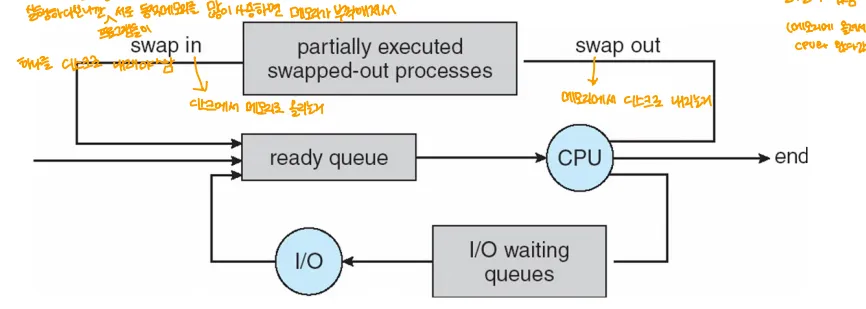

1. Ready Queue: CPU에서 실행할 준비가 된 프로세스들의 목록
	→ 숏 텀 스케줄러가 선택해 CPU를 할당

2. Swap Out: 메모리의 공간이 부족한 경우 프로세스를 메모리에서 디스크로 옮기는 작업, 
	→ Partially Executed Swapped-out Processes들이 이렇게 디스크로 옮겨진 프로세스들을 말함

3. Swap In: 스왑 아웃된 프로세스들을 다시 메모리로 복귀시키는 과정
4. I/O waiting Queues: I/O작업을 기다리는 프로세스들의 모임

## 멀티 프로그래밍 환경에서의 스케줄링

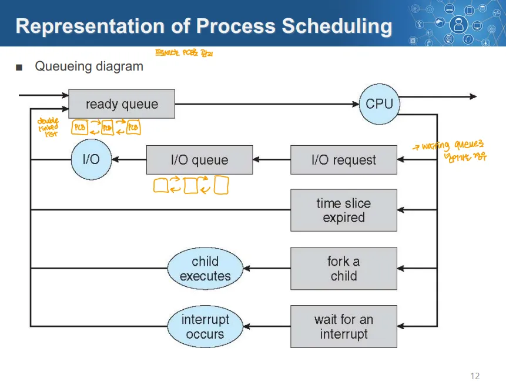

- IO작업은 IO 큐에서 대기 → IO작업 완료 시 Ready Queue로 돌아감
- time slice expired: 시간 할당이 끝난 프로세스는 다시 Ready Queue로 돌아가 다음 할당된 시간 동안 실행되기를 대기
- Fork a child: 자식 프로세스를 생성하는 작업 → 생성 후 Ready Queue로 감
- 인터럽트: 인터럽트 발생 시 다시 레디 큐로 돌아감

# 프로세스에 대한 작업(Operation)
→ 아래는 유닉스 기반의 설명

## 유닉스 기반 프로세스 동작 시스템 콜

1. 프로세스 생성 → fork()
2. 프로세스 실행 → exec()
3. 프로세스 종료
	→ exit()
	→ _exit()
	→ wait()
	→ abort() ⇒ 비정상 종료(나머지는 정상 종료)

## 프로세스들의 협력

- Inter-Process Communication(IPC)
	→ 프로세스들이 서로 같이 동작하는 상황에서 정보를 주고 받으면서 협력하는 것

# 유닉스/리눅스의 프로세스 생성(fork())
**int fork()**

## fork() 과정

1. 한 프로세스가 fork를 호출→ 시스템 콜, 커널이 실행
2. 새로운 자식 프로세스의 PCB, 주소 공간을 만들고 초기화
3. fork를 호출한 부모 프로세스의 메모리 정보, PCB 정보를 복사
	- PID는 다름, 그 외 모든 상태는 동일(파일 열람 중 상태 등도)
4. fork()가 반환값으로 부모 프로세스에게는 자식 프로세스의 PID, 자식 프로세스에게는 0을 반환
	- 호출한 부모, 자식을 구별 가능

- fork()한 부모 프로세스의 상태를 그대로 복사해서 자식 프로세스를 만듬
	- 다른건 PID뿐
- 부모 프로세스의 메모리 공간의 정보를 복사하는 것은 동일한 공간을 할당하는 것이 아니라, 단순히 복사
- 부모 프로세스의 커널 리소스를 똑같이 자식 프로세스도 참조할 수 있음

### 부모 프로세스의 파일 열람 상태 복사

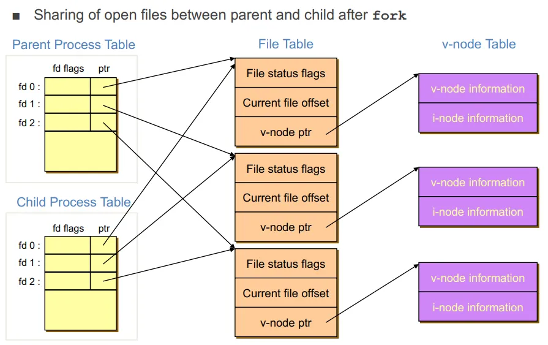

- 프로세스 테이블에는 파일에 접근한 상태도 기록
	- 열람 상태에서 접근하면 이를 fork할 때 자식도 동일하게 열람 상태
→ PID를 제외한 모든 값, 모든 상태가 동일(메모리 주소 공간은 주소가 아닌 값만 동일)

## fork() 예시

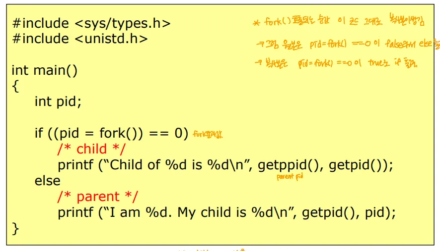

- fork()의 반환 값을 통해 부모, 자식 프로세스를 구별해 서로 다른 작업을 하도록 함

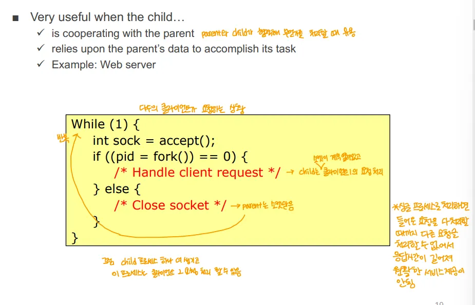

→ 웹 서버 예시

- 부모 프로세스는 자식 프로세스를 만드는 일만
	- 자식 프로세스는 요청을 처리하는 작업 수행
- 하나의 프로그램을 다중의 프로세스로 동작하게 할 수 있음

# 유닉스/리눅스의 프로세스 실행(exec())

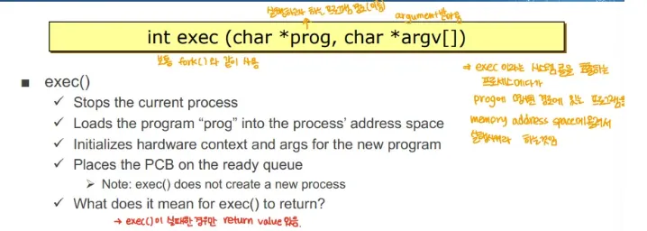

- 파라미터
	- prog로 실행할 프로그램 전달
	- argv[]로 그 프로그램에 전달할 파라미터들을 전달
- 새로운 프로그램을 위한 하드웨어 컨텍스트를 초기화(메모리 주소 공간 등)
- PCB 정보를 ready queue에 위치시킴 → 실행할 준비를 함
- exec의 반환값 → int
	- exec의 실행 상태(ex. 실패)를 정수 값으로 나타내 반환
주의점)

- exec()은 새로운 프로세스를 생성하는 것이 아님
- 현재 프로세스를 대체해 새로운 프로그램을 실행(PID는 변하지 않고 안의 내용만 교체)
→ 프로세스가 exec()을 수행하면 자기 자신은 없어지는 것과 같음

## exec() 실행 예시

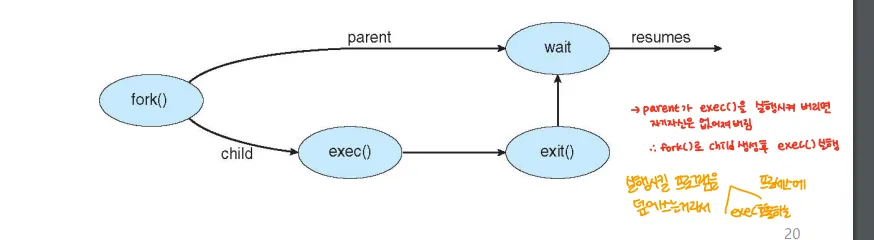

- 주로 자식 프로세스에게 exec()을 하도록 함
- 부모 프로세스는 exec()을 하지 않고 child를 생성하는 역할

## exec() 실행 예시 - shell(간략화된 버전)

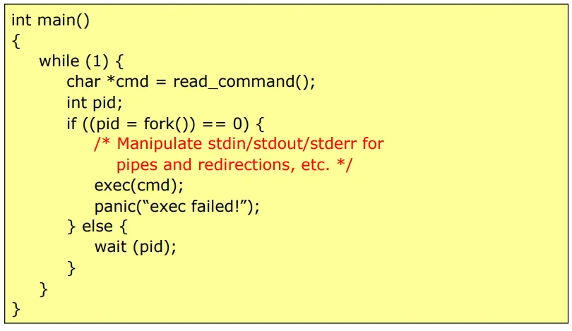

- 부모 프로세스에서는 wait(pid)로 해당 pid의 프로세스가 완료될 때 까지 대기
- pid는 자식 프로세스의 pid, 해당 자식 프로세스에게 exec()을 통해 일을 시킴

# 리눅스의 프로세스 트리

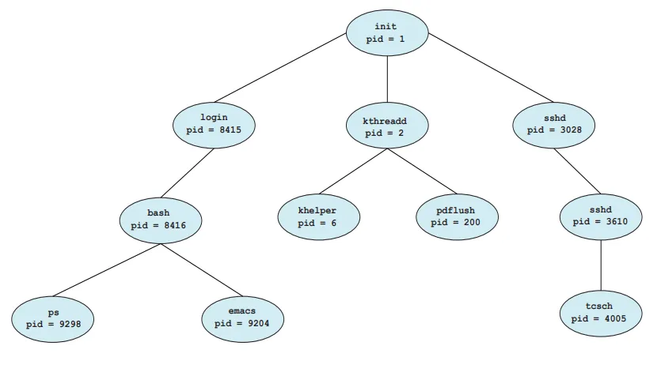

- init → 부팅할 때 생기는 최초의 프로세스
- 이 프로세스를 바탕으로 fork를 통해 여러 작업들을 수행
- init은 단순함 → init을 복사해 프로세스들을 만들기 때문에 단순해야 비용이 적어짐
→ 나중에 나옴, Zombie, Orphan 프로세스들을 모아서 없애는 작업을 init이 함

# 윈도우즈의 프로세스 생성, 실행

- 프로세스의 생성과 실행을 동시에 하는 시스템 콜
- PCB와 메모리 주소 공간을 생성 및 초기화
- 파라미터
	- prog에 실행할 프로그램을 전달
	- args에 프로세스 실행에 필요한 인자들 전달
- 하드웨어 컨텍스트를 초기화하고 메인 함수나 진입점에서 프로세스를 실행하도록 함
- 레디 큐에 PCB를 위치

# 프로세스 종료

## 정상 종료 → 프로그램이 의도한 대로 종료

1. main() 함수의 return 
2. exit() → 프로세스 종료에 필요한 정리 작업을 수행
3. _exit() → 별도 정리 작업 없이 정상적으로 종료

## 비정상 종료 → 의도치 않은 종료

1. abort() 호출 → 프로그램에 오류가 있어 abort()를 호출해 종료
2. 외부 신호를 통한 종료 → ex) kill 명령

## 자식 프로세스의 종료 대기

- wait() 호출 → 부모 프로세스는 자식 프로세스가 종료될 때까지 대기 가능
	- wait(자식 PID)로 해당 프로세스가 실행될 때 까지 대기, 반환값으로 잣기 프로세스의 종료 상태를 부모 프로세스에게 전달

### 예외적인 경우 - Zombie, Orphan 프로세스

- Zombie 프로세스: 부모 프로세스가 자식 프로세스의 종료를 기다리지 않는 상태
	→ 웹 서버 같은 것들은 일부러 좀비 프로세스를 만들기도 함

- orphan 프로세스: 부모 프로세스가 wait() 선언 하기 이전 먼저 종료된 상태

# C 프로그램의 실행과 종료

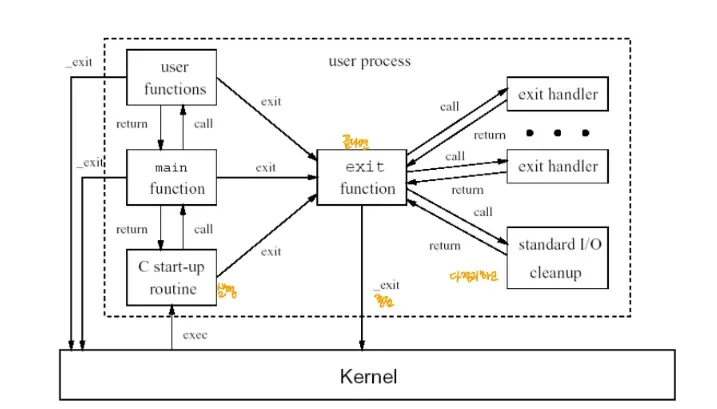

→ 대부분 시스템에서 C기반 언어(C, C++, JAVA 등)는 위 같은 과정으로 실행

1. 커널 위에서 C Startup Routine이 번저 호출
	- C기반 언어의 실행을 위한 작업을 수행하는 코드
2. 이후 main함수를 호출 → 프로그램은 main부터 실행된다고 한건 실은 거짓말
3. user function과 main function이 상호 작용 하다 main이 return문 수행
4. main이 return문 수행 시 C startup 루틴으로 이동
5. C startup routine이 exit()을 호출
6. 이후 exit()에서 여러가지 정리 작업 수행 후 _exit() 호출

# 애플리케이션 프로그램의 멀티프로세스 예시

## 구글 크롬

- 3가지 프로세스가 동작하는 구조
1. 브라우저 프로세스: UI, 디스크IO, 네트워크 IO작업 관리
2. 렌더러 프로세스: 웹 페이지(html, css, js)를 렌더링
	→ 렌더러 프로세스는 각 탭마다 존재해서 렌더링을 동시에 수행 가능

3. 플러그인 프로세스: 각 타입의 플러그인을 수행

## 모바일 시스템의 멀티프로세스

- 몇몇 모바일 시스템은 하나의 프로세스만 실행하도록 하고 나머지는 중단
	- 제한된 배터리 수명, 메모리 관리 때문에 제한이 있음

### 초기 IOS의 멀티 프로세스 

- 초기 IOS는 하나의 프로세스만 실행 가능, 나머지는 중단
- 백그라운드 프로세스도 실행하지 않음

### 현재 IOS 멀티프로세스 처리

- 하나의 foreground process만 동작
- background 프로세스는 메모리에 존재, 실행 중이어도 화면에 표시되지 않음

### 안드로이드

- foreground, background 작업을 IOS보다 더 적은 제한으로 수행
- service라는 것을 통해 백그라운드 프로세스를 실행
	- service는 UI도 없고, 메모리도 적게 씀

# IPC(Inter-Process Communication)

- **서로 다른 프로세스 사이에 정보를 교환하는 방법**
- 1) Message Passing 2) Shared Memory의 2가지 방법이 있음

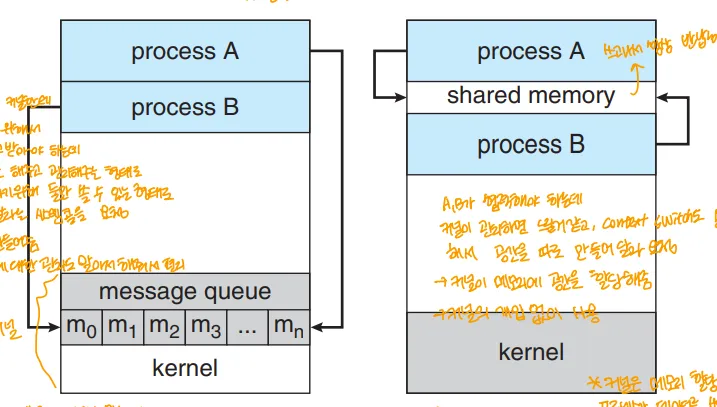

## Message Passing

- 커널에서 메시지 큐를 만들어 관리
- 프로세스가 다른 프로세스에 전달하고 싶은 메시지를 커널에 전달
	- 이후 다른 프로세스가 메시지가 필요할 때 메시지 큐에서 메시지를 받아감
- 장점
	- 동기화 처리 같은 신경쓸 부분은 커널이 관리해 구현이 단순, 개발자가 편리
- 단점
	- 상대적으로 커널에 부하가 큼
	- 데이터 전송 속도가 느릴 수 있음

## Shared Memory

- 커널에게 서로 다른 프로세스가 공유해서 사용할 메모리 공간을 할당해 달라고 요청
- 커널이 관리하는 공간이 아닌 실제로 메모리를 공유해서 사용
- 문제점
	- 각 프로세스가 메모리에 데이터를 써도 다른 프로세스가 이를 알 수 없음
		→ 데이터가 중간에 덮어씌워지거나 함 → 동기화 문제

		- 별도 동기화 처리(ex. 뮤텍스)를 해야함
- 장점
	- 커널이 중간에서 메시지를 전달하지 않아 커널의 오버헤드가 작다
- 단점
	- 개발자가 신경쓸 부분이 많음(동기화 처리 등)

## 프로세스 사이 협력 예시 → Bounded Buffer

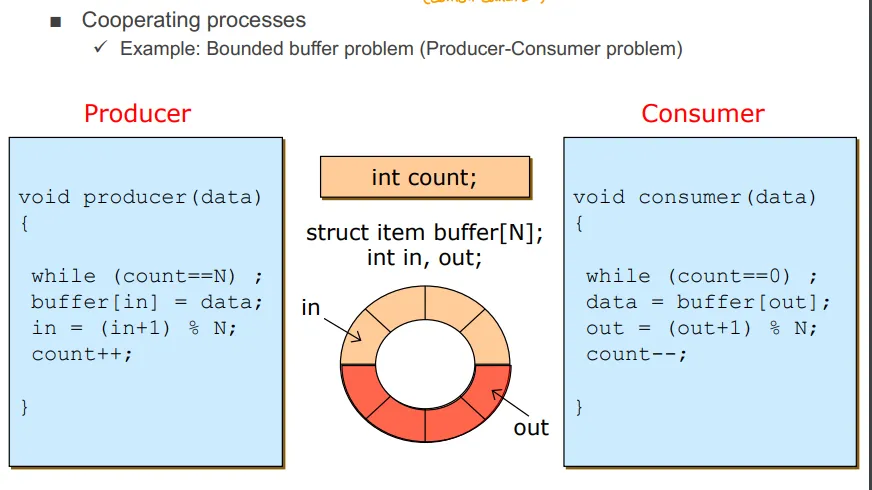

- 생산자, 컨슈머가 한정된 크기의 버퍼를 공유하며 데이터를 소비하는 과정에서 발생하는 동기화 문제
	- 생산자 → 데이터를 버퍼에 넣음
	- 소비자 → 데이터를 버퍼에서 꺼냄
	- 버퍼 → 공유 메모리(저장소)
- 한정된 크기의 버퍼로 원형 큐를 만들어 놓음
- 문제점 → 멀티 프로그램 시스템에서 가끔 데이터 오염 발생

## 유닉스/리눅스의  IPC

1. pipes → 단방향, 부모 자식 프로세스 사이 통신
2. FIFOS → 단방향, 이미 만들어진 파이프를 프로세스가 가져다 쓰는 느낌
3. message queue
4. shared memory
5. sockets → 랜카드로 외부 PC가 아닌, 내부 포트로 데이터 전달 시

# 클라이언트-서버 통신
→ 이것도 IPC의 일종으로 볼 수 있음, 네트워크를 통해 서로 다른 컴퓨터의 프로세스 끼리 통신하는 느낌

### 1. 소켓

- TCP, UDP 같은 네트워크 프로토콜을 사용해 클라이언트, 서버 사이에 통신하는 방식
- 소켓을 사용해 원격의 프로세스 사이 양방향 통신이 가능

### 2. RPC(Remote Procedure Call)

- 클라이언트가 원격 서버의 함수를 로컬에서 호출하듯이 호출하는 방식
- 네크워크를 통해 원격 서버의 프로시저를 호출하고 그 결과를 받음
→ 소켓을 기반으로 함
→ 프로시저: 명령어를 모아놓은 코드 블록, 함수와 거의 유사(거의 동의어), 일부 언어나 시스템에서는 결과를 반환하지 않는 코드 블록을 프로시저라 함

### 3. RMI(Remote Method Invocation)

- 자바의 RPC
→ JVM 탓에 조금 다르다고 생각,
→ 자바는 객체지향이라, 원격 함수보다는 원격 객체를 호출하는 느낌

### 마샬링 파라미터

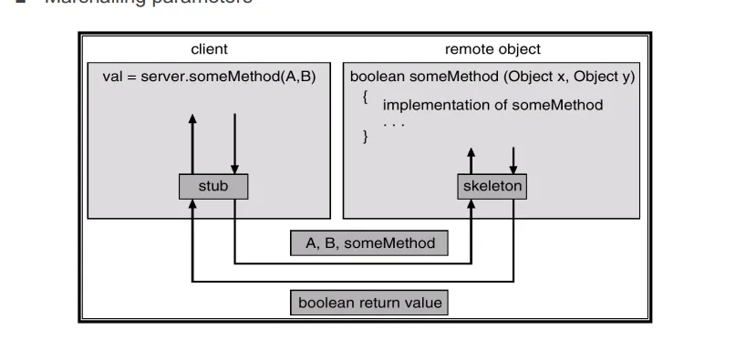

- RPC, RMI 호출 시 원격 객체에 파라미터를 전달할 때 이를 네트워크로 전송 가능한 바이트 형태로 변환
→ 네트워크로 바이트를 보내고 서버가 받으면 다시 복원하는 “언마샬링”이 필요
