> 원본 Notion 정리 — 강의 슬라이드/설명.
> [← 전체 목차](/posts/os-overview/)

***

# Virtual Memory

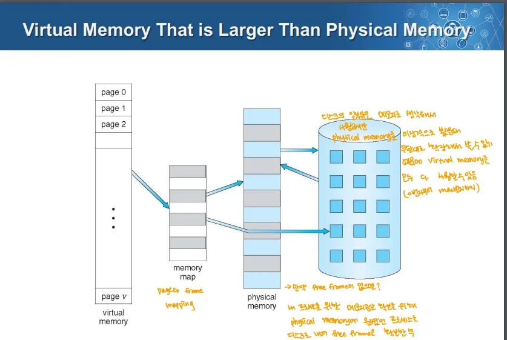

- **실제의 물리 메모리 개념과 개발자의 논리 메모리 개념을 분리한 것**
	→ 이를 통해 물리 메모리에는 프로그램의 사용하는 부분만 올려놓을 수 있음
	→ 이를 통해 작은 메모리로도 얼마든지 큰 가상 주소 공간을 제공할 수 있음

	- 디스크를 활용해 이를 해결 → 메모리를 비싼 자원이므로
- **가상 메모리는 물리적 메모리보다 커지게 될 수 있어짐**
***

# Demanding Paging

- “페이지 레벨의 스와핑”이라고도 함
	→ 그냥 스와핑은 프로세스 전체를 옮기는 것

- 프로세스가 필요로 하는 페이지를 요청할 때 메모리로 가져오는 것
- 운영체제는 시스템의 프로세스가 할당한 모든 데이터에 대한 캐시로 메인메모리를 사용
	→ 캐시처럼 빠르게 접근하게 해줌, 모든 데이터를 캐싱할 수는 없으므로 교체도 해야함

	- 초기에 페이징되면 페이지가 물리적 메모리 프레임에 할당
	- 이 물리적 메모리가 가득 차면 새로운 페이지를 할당하기 위해 기존의 다른 페이지를 물리적 메모리 프레임에서 제거해야함
- 물리적 메모리에서 퇴출된 페이지는 디스크의 Swap Space(Swap File)로 이동
	- 이때 페이지가 수정된 적(dirty) 있으면 디스크에 쓰기 작업을 하고 그렇지 않으면 하지 않음
	- 메모리와 디스크 사이 이동은 OS가 처리하며, 이 과정은 애플리케이션 입장에서는 알 수 없음

## Demand Paging을 하는 이유 = Locality

1. **Temporal Locality (시간적 지역성):**
	- 최근에 참조된 위치는 가까운 미래에 다시 참조될 가능성이 높음
2. **Spatial Locality (공간적 지역성):**
	- 최근 참조된 위치 근처의 위치가 곧 참조될 가능성이 높음
- 이 Locality로 인해 페이징이 적게 발생
	- 한번 페이지를 메모리아 올려놓으면, Locality로 인해 여러 번 사용됨
		- 보통은 한번 올라온 메모리들이 계속 사용됨
- Locality로 인한 효과는 여러 요인에 따라 달라짐
	1. 애플리케이션의 Locality의 정도
	2. 페이지 교체 정책
	3. 물리적 메모리의 양
	4. 데이터 참조 패턴과 메모리 사용량
		→ 데이터를 참조하는 순서에 따라 디스크 접근 횟수가 달라짐
		→ 메모리 사용량이 많으면 디스크 접근이 잦아짐

### 메모리 접근 패턴에서 드러나는 Locality

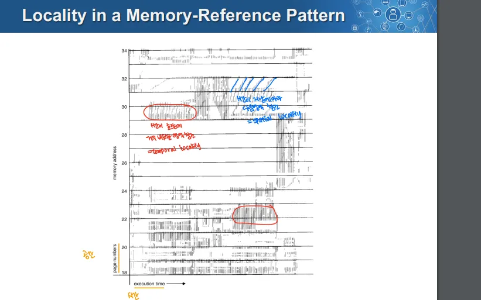

## 왜 Demand Paging이라고 하는가

- 처음 프로세스가 시작될 때 새로운 페이지 테이블이 생성되고, 모든 PTE의 valid bit는 invalid로 설정
	- 어떤 페이지도 물리적 메모리에 할당되지 않음
- 이후 프로세스가 실행되기 시작하면
	- 명령어가 코드와 데이터 페이지에 대해 Page fault를 발생시킴
	- 필요한 모든 코드, 데이터 페이지가 물리적 메모리에 적재되면 오류가 멈춤
- 프로세스에 필요한 코드/데이터만 메모리에 로드
- 필요한 데이터는 시간에 따라 바뀌므로, 이를 요구하는 경우 그때 페이지를 메모리에 추가
- 과정
	1. 처음 프로세스 생성 시 로지컬 메모리 주소 공간만 만듬
		- 이때 만들어진 페이지 테이블은 valid-invalid비트가 전부 invalid
		- 본래 invalid한 데이터에 접근하면 프로텍션 펄트 인터럽트 발생
		- 그러나 본래 자기 데이터에 관련해서 PCB를 뒤져서 사용 가능 여부 판단 가능
	2. 필요한 페이지를 가져오려 할 때 모두 invalid이므로 프로텍션 펄트인지 페이지펄트인지 확인
		- 이때 PCB를 조회해서 사용 가능한 것이면 페이지 펄트가 발생
		- 사용 불가능한 것이면 프로텍션 펄트를 일으킴
	3. 페이지 펄트인 경우 피지컬 메모리에 페이지를 로드함
		- 이후 페이지 테이블을 valid로 업데이트

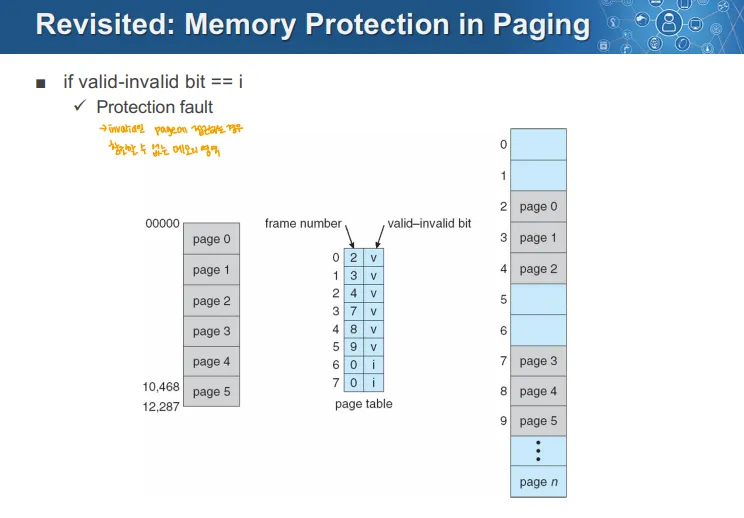

## Valid-Invalid Bit in Demand Paging
→ Valid-Invalid비트가 프로텍션에만 사용하는 것이 아님

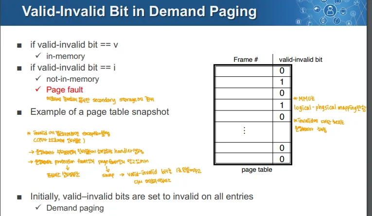

- valid-invalid bit가 valid한 상태이면 메모리 안에 페이지가 존재하는 것
- valid-invalid가 innvliad한 상태이면 메모리 안에 존재하지 않는 것 → Page Fault

### 과정

1. TLB 미스 발생해 MMU가 페이지 테이블을 조회
2. 이때 PTE가 invalid함, mmu가 인터럽트를 발생시켜 모드를 체인지, 커널 모드로 전환
3. 커널 모드에서 Protection Fault인지 Page Fault인지 판단, 이에 맞는 인터럽트 핸들러를 호출해 처리
	- 만일 Protection Fault → 프로세스를 kill하는 등의 방식으로 처리
	- 만일 Page Fault면 페이지가 디스크에 존재하므로 디스크에서 메모리로 로드(페이징)

### 예시

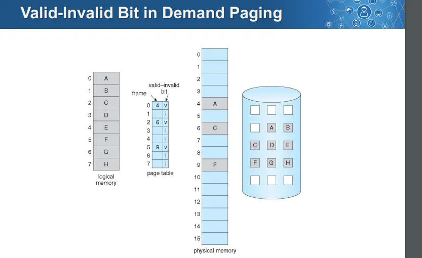

→ 논리적 메모리는 존재
→ 페이지 테이블을 보면 0번, 2번, 5번 인덱스의 PTE는 valid한 상태
→ valid한 상태인 것들만 물리적 메모리에 저장되어 있음
→ 디스크(그림 상의 원통)에는 논리적 메모리에 해당하는 모든 페이지가 보관되어있음
***

# Page Fault

### 1. Page 퇴출 과정

- 페이지가 퇴출(제거)될 때 운영체제는 PTE를 Invalid로 설정하고, 해당 페이지의 Swap Space(Swap File)의 위치를 PTE에 저장
- 프로세스가 제거된 페이지의 논리적 주소를 참조하려 하면 PTE가 Invalid하기 때문에 Exception이 발생

### 2. Page Fault 처리 과정

- 운영체제는 Page Fault 핸들러를 실행해 이 문제를 처리
- 핸들러는 invalid한 PTE를 사용해 해당 페이지가 Swap File의 어디에 위치해 있는지 찾음
- 핸들러는 페이지를 Swap File에서 물리적 메모리로 읽어오고, 이후 PTE를 업데이트해 해당 페이지가 물리적 메모리에 존재함을 나타내고 Valid로 표시
- 핸들러가 작업을 완료하면 Page Fault가 발생한 프로세스를 다시 실행

### 3. 물리적 메모리로 로드된 페이지는 어디로 가는가

- 필요하다면 Page Replacement Algorithm에 따라 기존 페이지를 퇴출
- OS는 기존 페이지를 퇴출시키지 않기 위해 보통 여유 페이지 풀을 유지하려 함

## Page Fault 핸들링 과정

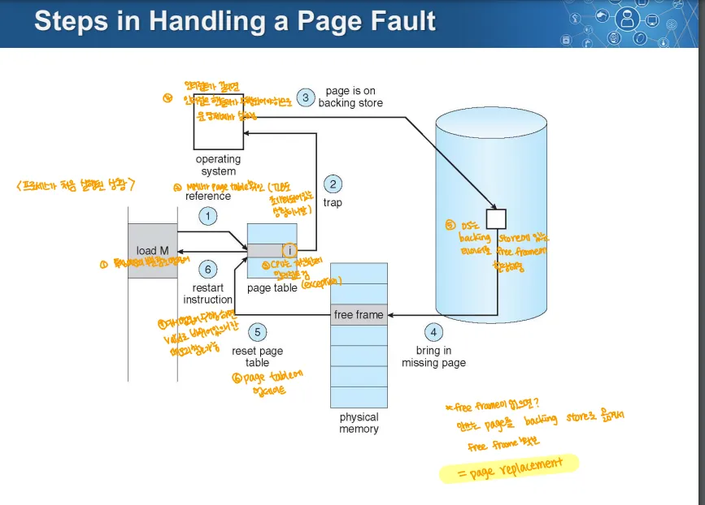

1. 특정 메모리의 페이지를 참조하라는 명령이 있고 TLB 미스가 난 상황이라 가정
2. MMU가 페이지 테이블을 확인
3. 페이지 테이블의 엔트리가 Invalid한 경우 CPU는 인터럽트를 걸어 예외를 일으킴
4. 이때 인터럽트가 일어났으므로 커널 모드로 전환되고 이를 처리하기 위한 핸들러를 호출
5. 이 예외가 Page Fault인 경우 OS가 Secondary Storage(디스크 등)에 있는 데이터를 free frame에 할당
	- 이때 free frame이 없으면 안쓰는 페이지를 Secondary Storage에 옮겨서 free frame을 확보 = Page Replacement
6. 이후 페이지 테이블을 업데이트하고 valid로 표시
7. 이때 다시 참조하면 메모리 참조 가능
***

# Memory Reference

## 일반적인 경우
→ 최상의 경우(TLB 힛, 물리적 메모리에도 페이지가 존재)

1. CPU가 논리적인 주소를 통해 메모리를 참조하려 하면 먼저 MMU의 TLB로 요청이 전달
2. TLB는 요청된 메모리 주소의 페이지 넘버를 통해 조회
3. TLB에서 페이지 넘버와 일치하는 항목이 있으면 해당 항목에 저장된 PTE를 반환
	- TLB의 Cache Hit
4. TLB에 저장되어있는 PTE를 통해 참조가 가능한지 파악(PTE에 표시된 valid-invalid bit)
5. PTE를 통해 페이지가 참조가 가능하다는 것을 알면 MMU는 PTE에서 얻은 물리적 프레임 넘버와 Page Offset을 결합해 물리적 주소를 생성
6. MMU에서 생성된 물리적 주소를 통해 메모리에서 데이터를 읽어 CPU로 이를 전달

## TLB 미스 발생 시 이를 처리하는 2가지 방법

### 1. MMU가 페이지 테이블에서 PTE를 로드하는 경우 → 하드웨어 TLB

- MMU가 물리 메모리의 페이지 테이블에서 필요한 PTE를 직접 로드해 물리 주소를 반환
- TLB를 하드웨어에서 관리할 때 OS는 관여하지 않음, MMU가 하드웨어적으로 페이지 테이블을 읽고 TLB를 업데이트
- 운영체제는 미리 페이지 테이블을 설정해 하드웨어가 직접 접근할 수 있도록 함
	- OS는 페이지 테이블이 물리 메모리에 상주하게 함

### 2. 운영체제로 인터럽트가 발생하는 경우 → SW관리 TLB

- TLB미스가 발생하고 OS로 인터럽트가 발생
- 소프트웨어 방식 TLB관리에서는 OS가 개입해 TLB를 업데이트
- OS가 페이지 테이블을 조회해 해당 PTE를 찾아 TLB에 로드
- OS는 인터럽트를 처리하고 다시 프로그램으로 돌아가고, TLB가 업데이트된 정보로 작업을 계속
⇒ 이 단계가 끝나면. 유효한 PTE가 저장

## TLB 미스 발생 시 발생 가능한 문제

### 1. 페이지 테이블 자체가 Swap out된 경우 재귀적인 Pafe Fault가 발생 가능

- 페이지 테이블이 OS의 가상 주소 공간에 존재한다고 가정하면 문제가 됨
	- 이 경우 페이지 테이블이 Swap Out될 수 있음
- 페이지 테이블이 물리적 메모리에 상주하고 있다면 이런 문제가 발생하지 않음
	- 재귀적인 Page Fault 방지 가능

### 2. TLB가  PTE를 가지고 있을 때

- TLB가 유효한 PTE를 얻으면 주소 변환 과정을 다시 시작
- 일반적인 경우 PTE는 메모리에 상주하는 유효한 페이지를 가리킴
- 이따금 Protection Bit 문제로 인해 변환 도중 다시 TLB Fault가 발생
	- Invalid 비트 상태거나, 권한에 문제가 있으면 이러함

## Page Fault

- PTE가 Protection Fault를 내는 경우
	1. Read, Write, Excute가 페이지에서 허용되지 않은 작업인 경우
	2. 가상 페이지가 할당되지 않거나 페이지가 아직 물리적 메모리에 없는 경우 Inalid 상태로 표시
- TLB가 OS로 인터럽트를 발생하는 경우 
	- Read/Write/Execute인 경우 OS는 Fault를 프로세스에 다시 보냄
	- Invalid(가상 페이지가 없는 경우)인 경우 OS는 Fault를 프로세스에 다시 보냄
	- Invalid(물리적 메모리에 없는 경우)인 경우 OS는 프레임을 디스크에서 읽어 할당하고 PTE를 업데이트
***

# Copy-on-Write

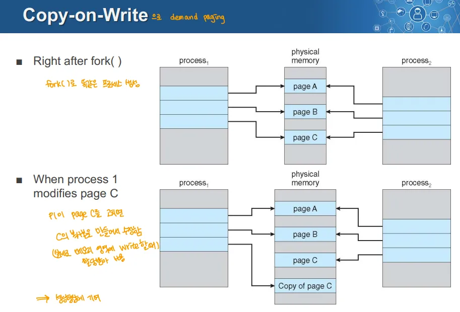

- 리눅스 계열에서 사용하는 Demand Paging에서 메모리 효율성을 극대화하는 기법
- fork를 한 직후에는 별도 메모리를 할당하지 않고 부모 프로세스와 동일한 메모리를 참조하게 함
- 이후 별도 작업을 통해 메모리의 내용이 달리지게 되면 그때 할당을 함
- 초기 메모리 할당을 하지 않고 필요할 때(demand) 메모리를 할당하는 방식으로 메모리 효율을 높임
- exec을 하면 메모리 내용이 달라짐
	- 이때 PCB의 페이지 위치 정보를 변경(디스크의 어느 위치에 있는지)
	- 이후 Page Table을 전부 invalid비트로 만듬(초기화랑 같은 개념)
***

# Free Frame이 없는 경우 어떻게 해야하는가

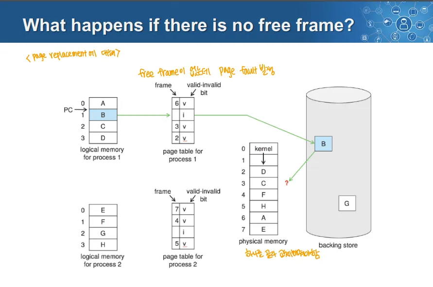

- Free Frame이 없는데 Page Fault가 발생하는 경우 문제가 생김
	- 이때는 원래 물리 메모리에 있는 프레임을 메모리처럼 인식될 수 있는 디스크의 영역으로 내려야 함
- 이렇게 물리 메모리의 프레임을 디스크로 내리고 디스크에서 다른 프레임을 불리오는 것 = Page Replacement 

# Page Replacement

- Page Fault 발생 시 운영체제는 디스크에서 해당 페이지를 읽어와 물리 메모리의 프레임에 로드
- 이때 물리 메모리가 가득 차 Free Frame이 없는 경우 Page Replacement를 해야함
	- **기존 페이지 중 하나를 선택해 디스크로 Evict(제거, 퇴출)하고 그 자리에 페이지를 로드하는 것**

## Page Replacement Algorithm

- Page Replacement에서 어떤 페이지를 제거할지 결정하는 방식
- Page Fault를 처리하는 것은 디스크 I/O를 2번 이상 해야하는 성능적으로 문제가 큰 작업이므로 이를 최소화해야함

# Page Replacement Algorithm

- 어떤 페이지를 제거해야 하는지, Victim을 결정하는 방법

## Page Replacement Algorithm의 목표

- 제거할 최적의 Victim 페이지를 선택해 Page Fault 발생률을 줄이는 것이 목표
- **최선의 선택은 다시는 사용되지 않을 페이지를 제거하는 것**
	- 이 페이지가 제거되어도 프로세스가 더 이상 해당 페이지를 필요로 하지 않을 것이므로 성능 저하, Page Fault가 발생하지 않음
- **다시는 사용되지 않을 페이지를 아는 것은 어렵기 때문에 가장 오래 사용되지 않을 페이지를 선택하는 것이 현실적**
### Belady의 증명

- **가장 오랫동안 사용되지 않은 페이지를 퇴출하는 것이 Page Fault를 최소화**
→ 이를 위해 Page Table Entry에 시간 정보를 보관해야함

## Page Replacement 과정

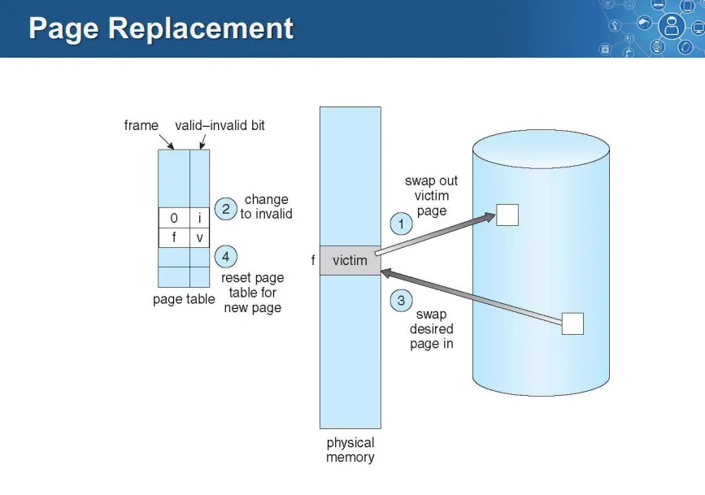

1. Swap In이 필요한 상황임은 전제
2. Victim Page를 디스크로 Swap Out
3. Page Table에서 invalid로 변경
4. 디스크에서 빈 자리로 페이지를 Swap In
5. 페이지 테이블을 valid로 변경

# Demand Paging의 성능

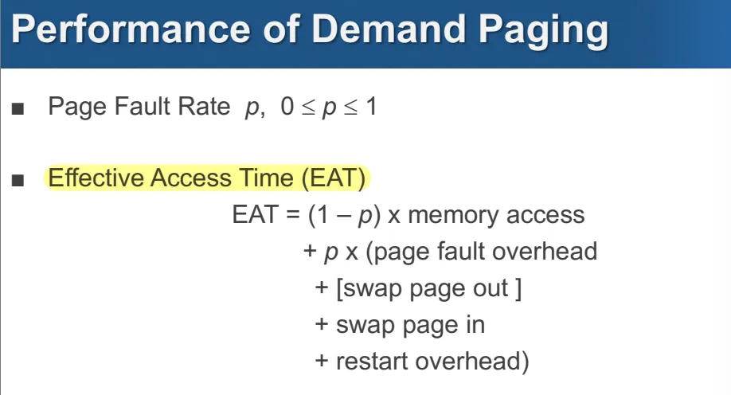

EAT
= 메모리 접근 시간 x  (Page Fault가 일어나지 않을 확률 = 1-p)

	+  (Page Fault가 일어날 확률 = p) x (Page Fault 오버헤드+Swap Out 오버헤드 + Swap in 오버헤드 + 프로세스 재시작 오버헤드)

# Page Replacement Algorithm 측정

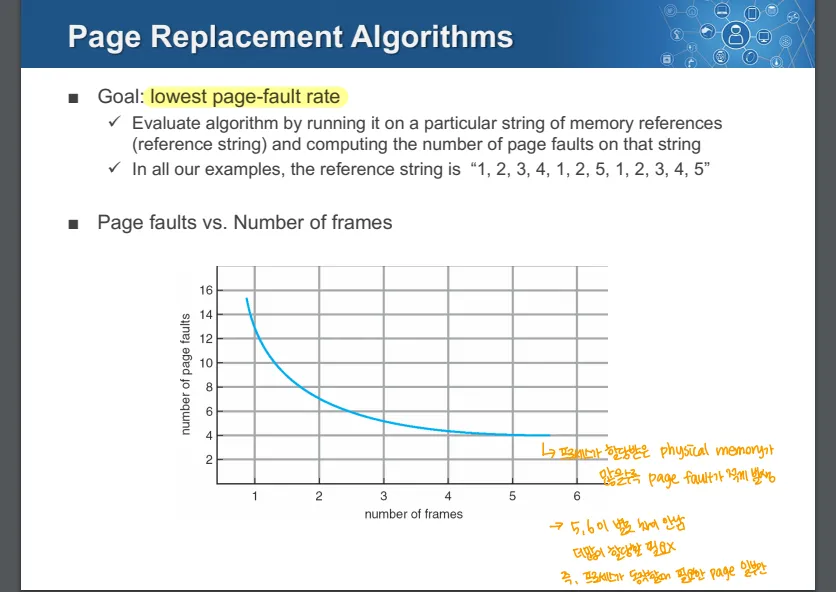

- Page Replacement Algorithm의 목표는 가장 낮은 Page Fault 빈도수
	- 따라서 특정 메모리 참조(ex. 참조 문자열)에 따른 Page Fault 빈도수로 알고리즘의 성능을 측정
- 아래 그래프에서 프로세스에 할당된 프레임 수에 따른 Page Fault의 수의 그래프
	- 프레임 수가 늘어나면 Page Fault가 감소
	- 그러나 4,5개 정도되면 감소율이 매우 작아짐
	- 20:80 규칙때문에 프레임을 많이 할당한다고 해도 쓰는 프레임만 사용하게 됨

# Page Replacement Algorithm 종류

## FIFO

- 메모리 프레임에 먼저 할당된 프레임을 Swap Out 대상으로 선정
- 명확하고 구현하기 쉬움
	- 메모리에 페이지가 로드된 순서를 유지하게 위해 큐를 사용
	- 교체 시 큐의 가장 앞에 있는 가장 먼저 로드된 페이지를 제거
- 가장 오래된 페이지가 사용되지 않을 수 높다는 가정 하의 알고리즘
	- Temporal Locality가 낮은 경우 이는 맞는 말일 수 있음
- 위의 가정이 틀릴 수 있음
	- Temporal Locality에 따라 가장 오래된 페이지가 가장 많이 사용될 수도 있음
→ 가장 공평하지만 성능적으로 좋지 않음

- **Belady’s Anomaly**
	- FIFO에서는 프레임 수가 증가해도 Page Fault가 증가할 수 있음

### FIFO 예시

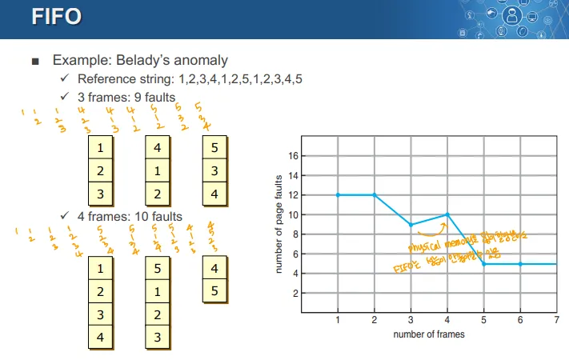

- 3 Frame인 경우
	- 1,2,3 이 들어감
	- 1이 빠지고 4가 들어감, 2가 빠지고 1, 3이 빠지고 2
	- 이런 순서대로 총 9번의 Page Fault 발생
- 4 Frame인 경우
	- 1,2,3,4가 들어감
	- 1이 빠지고 5가 들어감, 2가 빠지고 1이 들어가고, 3이 빠지고 2가 들어가고, 4가 빠지고 3이 들어감
	- 이런 순서대로 10번의 Page Fault발생
→ Frame 수는 증가했지만 Page Fault도 증가

## Optimal Algorithm

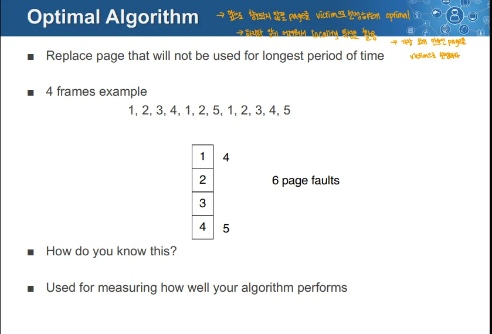

- 가장 오랫동안 사용되지 않을 페이지를 제거하는 것이 최적이다.
- 미래에 어떤 페이지가 참조될지 알고 있어야 구현 가능함
	- 어떤 페이지가 사용되지 않을 것인지 알 수 없으므로 구현이 불가능
- 단순히 다른 알고리즘이 얼마나 잘 동작하는지 측정하는 도구로 사용

### 예시
1,2,3,4 → 1, 2 → 5(4와 교체(4가 가장 나중에 쓰임)) → 1,2,3,4, → 4(1과 교체)

## LRU(Least Recently Used) Algorithm

- **과거에 가장 오랫동안 사용되지 않았던 페이지를 제거**
- 아이디어: 과거 기록을 통해 미래의 경향성을 추축
	- LRU는 Victim Page 선정을 위해 참조 정보를 사용
- Belady’s의 Optimal Algorithm은 미래를 예측, but LRU는 과거를 기반으로 판단

### LRU 구현 방식

1. Timestamp Implementation
	- 모든 PTE에 시간정보를 저장하는 카운터가 존재
	- 페이지가 참조될 때 마다 현재 시각을 카운터에 기록
	- Page Replacement가 일어날 때 모든 페이지의 TimeStamp를 비교해 가장 오래된 것을 교체
	- **문제점**
		- 페이지 테이블마다 타임 스탬프를 저장해야하므로 메모리 사용량 증가
		- 교체 시 모든 타임 스탬프를 비교해야해서 연산량이 증가
2. Stack Implementation
	- 페이지 넘버들의 스택을 유지
	- 페이지가 참조되면 상단으로 옮김
	- Page Replacement가 일어날 때 스택의 가장 아래에 있는 페이지를 Victim을 선정
	- 장점
		- 교체 시 victim 선정에 연산이 필요하지 않음
		- Page Table의 크기가 그대로
	- **문제점 **
		- 페이지 넘버의 스택을 관리하는데 걸리는 연산 오버헤드가 있음
3. Approximation
	- Timestamp 방식, Stack 방식은 비용이 크기 때문에 시간 정보를 근사치로 보관하는 알고리즘 사용
	- 시간 정보를 1비트로 표현하는 방식으로 근사하게 저장

## LRU Approxmation Algorithm

- 시간 정보를 근사화 해서 보관하는 방식

### Reference Bit 
→ LRU Approximation 알고리즘 중 하나

- 시간 정보를 1bit로 보관하는 것
- 각 페이지마다 할당되어 있음
- 초기에는 0, 페이지가 참조될 때 마다 1로 변경
- 주기적으로 1인 비트들을 0으로 초기화

### 페이지 교체

- Refernce Bit가 0인 것을 Victim으로 선정

### 문제점

- Reference Bit가 0인 페이지 중 누가 더 참조된 지 오래된 것인지 알 수 없음
	- 이로 인해 알고리즘의 효율성이 좋지 않음

## Second Chance(=LRU Clock) 알고리즘
→ LRU Approximation 알고리즘 중 하나

- Reference Bit를 사용하고 Clock Replacement를 사용
	- 이 Reference Bit는 페이지가 참조되면 1이 됨
	→ Clock Replacement(시계처럼 연결되고 돌아가는 형태)

### 페이지 교체

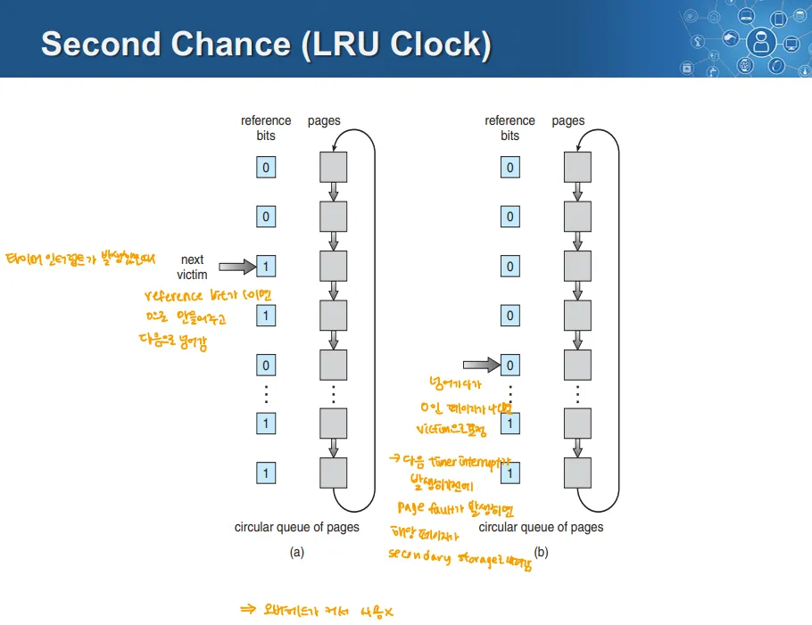

1. 교체 대상이 될 페이지의 Reference Bit가 1이면 해당 페이지의 Refernce Bit를 0으로 만들고 연결된 다음 페이지로 이동
	(= next victim을 선정하는 포인터가 가리키는 페이지)

2. Reference Bit가 0인 페이지를 만날 때 까지 해당 과정을 반복
⇒ Victim으로 선정되더라도 참조 여부에 따라 2번째 기회를 주는 것

## 장점

- 포인터를 둠으로서 0인 것 사이의 시간적 순서를 어느정도 반영이 가능

### 문제점

- 연결된 페이지들을 선형탐색 해야해서 탐색 오버헤드가 생김

## NRU(Not Recently Used) Algorithm
(= Enhanced Second Chance)

- Reference Bit와 Modify Bit를 사용
	- R비트는 페이지가 최근 참조되었는지, M비트는 페이지가 수정되었는지 여부를 나타냄
	- Reference Bit는 참조되면 1로 변경, 주기적인 인터럽트에 의해 0으로 변경
	- Modify Bit는 처음이었다가 Write 작업이 일어나면 1로 변경
- 페이지 상태를 4개의 클래스로 나누고, 이 클래스의 번호자 낮을 수록 Victim이 될 우선순위가 높음
	- Class 0이 Victim이 될 확률 가장 높고, Class 3이 가장 낮음

	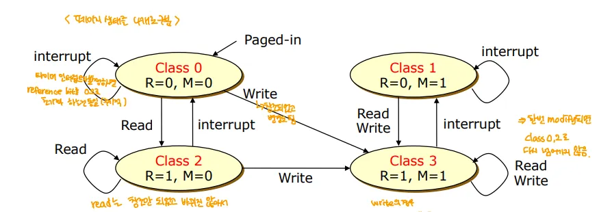

	- Class 0
		- R = 0, M = 0 
		- 최근에 참조되지 않았고 수정되지도 않음
	- Class 1
		- R = 0, M = 1
		- 최근 참조되지 않았지만 수정됨
	- Class 2
		- R = 1, M = 0
		- 최근에 참조되었지만 수정되지 않음
	- Class 3
		- R = 1, M = 0
		- 최근에 참조되었고 수정됨

### Algorithm

- 최소 번호의 비어있지 않은 클래스에서 임의의 페이지를 제거
	- 현재 있는 페이지 중 클래스의 숫자가 가장 낮은 것을 먼저 제거
- 한 번의 주기 동안 참조되지 않은 수정된 페이지(R=0, M=1 → Class 1)를 제거하는 것이 사용 중인 수정되지 않은 페이지(R=1, M=0 → Class 2)을 제거하는 것 보다 나음
	- R=1, M=0은 현재 무거운 작업을 수행하고 있을 가능성이 있기 때문

### 장점

1. 이해하기 쉬움
2. 구현이 비교적 간단
3. 항상 최적은 아니지만 적절한 성능을 제공 → 실제로 사용함

### NRU의 PTE

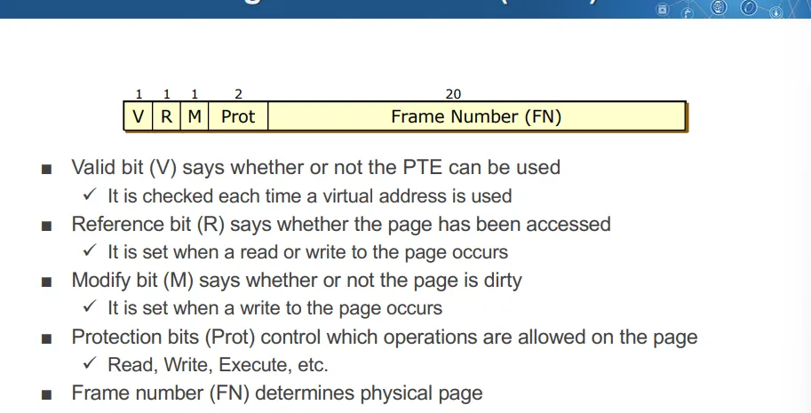

- 실제로 NRU 알고리즘에서는 Reference Bit(R)와 Modify Bit(M)를 알고리즘에 사용
1. Valid Bit(v) → 해당 PTE가 유효한지(=프레임에 존재하는지) 여부
2. Reference Bit(R) → 페이지가 참조되었는지 나타냄
3. Modify Bit(M) → 페이지가 수정되었는지 나타냄
4. Protection Bit(Prot) → 페이지에서 허용되는 작업 제어(페이지 권한)
5. Frame Number(FN) → 실제 프레임의 넘버

## LFU(Least Frequently Used) Algorithm
→ 시간 정보가 아닌 접근 횟수에 근거해 값을 처리

### Counting-based Page Replacement
→ 카운트에 근거한 페이지 교체

- 각 페이지마다 소프트웨어 카운터가 연결
- 주기적인 클럭 인터럽트마다 Reference Bit가 카운터에 더해짐
	- 카운터는 각 페이지가 얼마나 자주 참조되었는지를 나타냄
	→ 한 클럭이 지날 때 해당 페이지가 참조되었으면 R =1→ 따라서 카운터 값이 증가
		→ 참조되지 않았으면 R = 0 → 카운터 값은 그대로

### Least Frequently Used(LFU)

- 카운트가 가장 작은 페이지가 교체됨
	⇒ 각 페이지마다 소프트웨어 카운터가 존재하며, 이 카운터 값이 가장 작은 페이지일 수록 교체될 우선순위가 높은 알고리즘

### LFU의 한계

- It Never Forget Anything
	- 정보를 잊지 않음
	- 자주 사용되었던 페이지는 카운트가 높아 오랫동안 참조되지 않아도 교체되지 않음

### LFU의 단점

- 카운터 정보를 추가해야 하므로 Page Table의 크기가 커짐 
	→ 이를 방지하기 위해 Approximation 할 수 있음
	→ Approximation하면 Reference Bit를 사용하게 됨 → 즉, LRU의 Approximation과 LFU의 Approximation이 같아지는 것

### LFU  구현

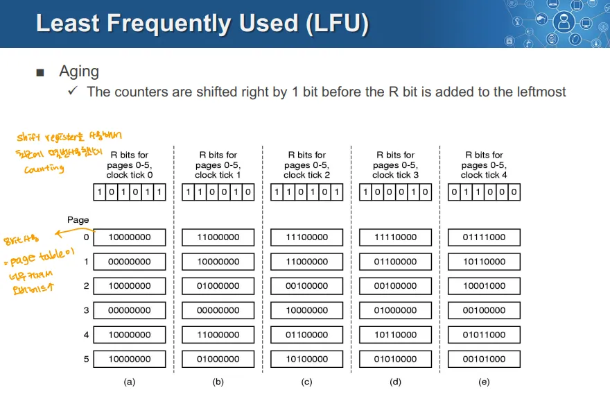

→ LFU를 Approximation해서 레퍼런트 비트 형태로 만들고 이에 Aging 매커니즘을 적용한 모습
Aging

- LFU의 한계를 극복하기 위해 오래된 참조를 교체하기 위한 방법
동작

1. R 비트가 각 페이지의 카운터를 갱신
2. 매 Clock마다 카운터는 오른쪽으로 1비트 시프트
	- 이후 새로운 R비트 값이 가장 왼쪽(MSB)에 추가
→ 이 과정을 통해 가장 낮은 카운터 값을 가진 페이지가 교체되게 됨
	→ 사용되지 않은지 오래된 경우 계속 0으로 밀려 감소하기 때문

## MFU(Most Frequently Used) 알고리즘
→ LFU와 반대되는 개념

- 가장 카운트가 높은 페이지가 교체
- 카운트가 가장 낮은 페이지는 메모리에 올라온지 얼마 되지 않았고, 아직 충분히 사용되지 않았을 가능성이 높다는 근거
***

# Frame의 할당
→ 어떻게 프로세스들에게 프레임을 할당할 것인가?
→ 각 프로세스는 동작에 따라 프레임을 필요로 할 수도, 아닐 수도 있음

## Frame Allocation Algorithm

1. Equal allocation
	- 모든 프로세스에게 동일한 프레임 개수를 할당하는 방식
2. Proportional allocation
	- 프로세스의 크기에 따라 큰 것에는 많이, 작은 것에는 적은 프레임 개수를 할당하는 방식
3. Priority-based allocation
	- 스케줄링 우선순위가 높은 프로세스에 많은 프레임을 할당해주는 방식
	- 우선순위가 높은 프로세스는 CPU에서 더 자주 동작하고, 이는 곧 메모리 접근을 많이 한다는 것을 의미 
		→ 이런 프로세스에 더 많은 프레임을 할당해주면 Page Replacement가 적게 발생
→ 현재 Frame Allocation은 Proportional allocation과 Priority-based Allocation을 적절히 섞어서 사용

### Page Replacement 방식

- Global한 방식과 Local한 방식 2가지가 있음
1. Global Replacement
	- 모든 프로세스를 대상으로 교체 대상 페이지를 선택
	- 전체 프레임을 대상으로 교체 대상을 선택
2. Local Replacement
	- 특정 프로세스 내에서만 교체 대상 페이지를 선택
→ 각 프로세스에 할당하는 프레임의 수를 동적으로 조정하는 경우, Page Replacement가 일어날 때 Global Replacement를 사용하는 것이 효과적일 수도 있음

	- 그러나 Global Replacement를 사용하기 위해서는 부가적인 정보가 많이 필요함
	- 프로세스 대기 중일 때 마음대로 페이지를 Swap out을 하고 다른 프로세스에 페이지를 할당하는 경우, 프레임을 빼앗긴 프로세스가 다시 실행 상태가 되었을 때 Page Replacement가 일어나거나 할 수 있음
→ Local Replacement를 사용하면, 다른 프로세스의 프레임에 영향을 주지 않기 때문에 급격하게 Page Replacement가 일어나는 것 없이 성능이 안정적임

	- 다만 평상시의 Page Replacement 성능이 낮아질 수 있음

## Page-Fault Frequency Scheme

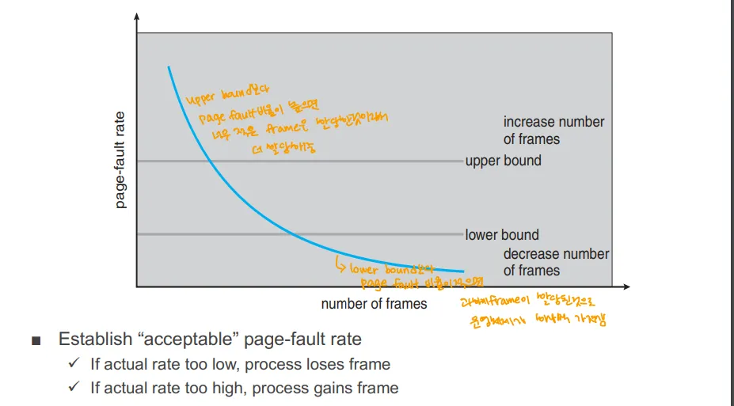

- 이 그래프의 X축은 프로세스에 할당된 Frame의 개수
- 이 그래프의 Y축은 Page Fault의 발생 빈도
- 그래프 곡선은 프레임 수가 증가하면 Page Fault의 발생 빈도가 감소

### 허용 가능한 Page Fault 비율 설정

- Page Fault Rate이 너무 낮으면 프로세스에서 Frame을 뺏어옴
	- Page Fault Rate가 Lower Bound보다 적으면, 프로세스가 프레임을 너무 많이 사용하고 있다는 의미이므로, 프레임을 뺏어 다른 프로세스에 할당
- Page Fault Rate가 너무 높으면 프로세스는 Frame을 얻음
	- Page Fault Rate가 Upper Bound보다 높으면, 프로세스에 프레임이 부족하다는 의미이므로, 더 많은 프레임을 할당
⇒ 이런 방식으로 시스템이 프레임을 조정

***

# Thrashing

- 프로세스가 페이지 교체를 너무 자주 하느라 대부분의 시간을 소비하는 상태
	- 이로 인해 CPU Utilization이 급격하게 감소하는 상태

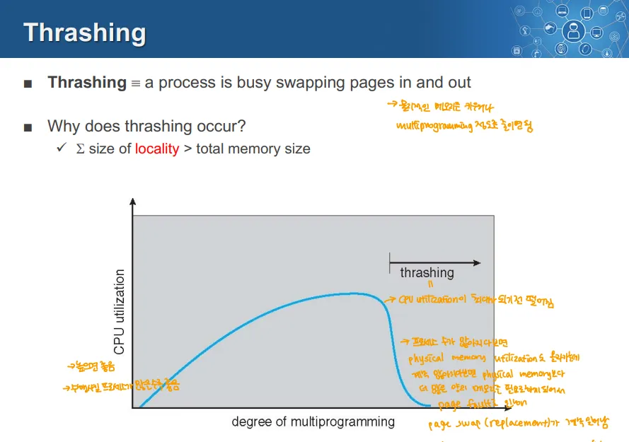

### 그래프 해석

- Multiprogramming의 정도가 늘면(=프로세스 수가 증가하면) CPU Utilization이 선형적으로 증가할 것이라 생각
	- 그러나 이때 메모리 요구량이 과도하게 증가해 CPU Utilization이 떨어지는 Thrashing이 발생

## Thrashing의 원인

- Trashing은 Locality의 총합이 전체 물리적 메모리의 크기보다 큰 경우 발생
	- Locality → 각 프로세스가 실행될 때 주로 접근하는 메모리의 특정 영역
- 또는, 한 프로세스가 요구하는 메모리 사용량이 물리 메모리의 크기를 초과할 때 발생
- 이런 Locality의 합이 시스템의 전체 물리 메모리 크기를 초과하는 경우 페이지를 모두 유지할 수 없어 계속 Page Replacement가 발생 

# Working Set

- Thrashing을 방지하기 위해 프로세스가 실행 시 필요한 적절한 메모리의 집합을 구하는 모델

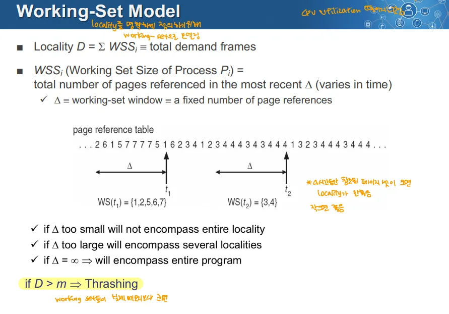

### D ← Locality

- D = Σ WSSi(모든 프로세스의 Working set size의 총합)
	- 시스템의 모든 프로세스의 Working Set 크기의 합
- 프로세스가 실행 중 특정 시간 동안 참조하는 페이지 집합을 나타냄

### WSS(Working Set Size of Process Pi)

- 프로세스 Pi의 Working Set의 크기
- 최근 Δ(델타) 동안 참조된 모든 페이지의 수

### Δ 

- Working Set Window
- 일정 시간 동안 참조된 페이지 수를 추적하기 위한 고정된 범위

### Δ 값에 따른 Working Set 

1. Δ가 너무 작은 경우 
	- Locality 전체를  포함하지 못함
	- 정확한 Working Set 측정 불가
2. Δ가 너무 클 경우
	- Locality가 아닌 프로그램 전체를 포함하게 되어 메모리 자원 낭비
3. Δ = ∞(Δ가 무한대 인 경우)
	- 프로그램 전체가 Working Set에 포함되어 의미를 잃음

### Thrashing 조건

- **D \> m(=시스템의 총 메모리 크기)인 경우 Thrashing이 발생**
- 프로세스가 실행에 필요한 페이지를 메모리에 모두 유지하지 못해 과도한 페이지 교체가 발생하는 상황

## Working Set Model의 목표

- D를 적절히 선정해 프로세스의 실제 필요한 메모리(Working Set)을 파악
- Locality(Working Set 크기의 총합)와 시스템의 메모리 크기 m을 바탕으로 Thrashing 방지
***

# 메모리 참조 과정 손으로 적어보기

- TLB → 페이지 테이블 → 디스크 스왑스페이스까지의 과정 전부 적어보기
- Virtula Memory개념까지 포함
- TLB Hit, TLB Miss, Protection Fault, Page Fault 포함
