> 원본 Notion 정리 — 강의 슬라이드/설명.
> [← 전체 목차](/posts/os-overview/)

***

# 개요 

## 사용자 관점에서의 파일 시스템

1. 파일의 이름은 어떻게 지정되는가
2. 파일에서 허용되는 작업은 무엇인가
3. 디렉토리 구조는 어떻게 생겼는가

## 구현 관점에서의 파일 시스템

1. 파일과 디렉토리는 어떻게 저장되는가
2. 디스크 공간은 어떻게 관리되는가
3. 효율적이고 신뢰성있게 하는 방법은 무엇인가
→ 파일 시스템을 다룰 때 위 내용을 고민해야한다는 뜻인듯, 안중요
***

# File System Implementation
→ 파일 시스템을 구현할 때는 2가지 관점에서 생각을 해야함

	- 인메모리 스트럭처, 온디스크 스트럭처

## In-memory Structure
→ 프로세스가 디스크의 파일을 읽고 작업을 수행할 때 커널이 필요, 이때 커널이 어떻게 중재자 역할을 할 것인지에 대한 개념
→ OS가 실행 중일 때, 프로세스와 파일 사이 작업에 필요한 데이터를 메모리에 유지

1. In-memory Partion Table
	- 메모리에 저장된 디스크 파티션 정보, 디스크가 어떻게 나뉘었고, 각 파티션이 무엇을 포함하는지 설명
2. **In-memory Directory Structure**
	- 메모리에 저장된 디렉토리 구조, 파일의 경로 탐색 디렉토리 관리에 사용
3. **System-wide open file table**
	- 시스템 전체적으로 열린 파일을 추적하는 테이블, OS는 이를 통해 열린 파일을 관리
4. **Per-process open file table**
	- 프로세스별로 열린 파일 정보를 유지, 특정 프로세스에서 어떤 파일이 열려있는지 확인 가능
→ 파일 시스템을 구현할 때 메모리에 이런 구조들을 포함해야함

## On-Disk Structure
→ 실제 하드웨어 디스크에서 데이터를 어떤 형태로 저장하고 관리할 것인지에 대한 개념

1. Boot Control Block
	- 디스크의 부팅 정보 포함
2. Volume Control Block
	- 볼륨에 대한 메타데이터 저장
3. **Directory Structure**
	- 디렉토리 구조를 저장, 파일 탐색에 사용
4. **File Control Block**
	- 파일의 메타 데이터를 관린
	- Unix File System의 i-node
→ 파일 시스템 구현 시 디스크에 이런 구조들을 포함해야함
***

# In-Memory Structure

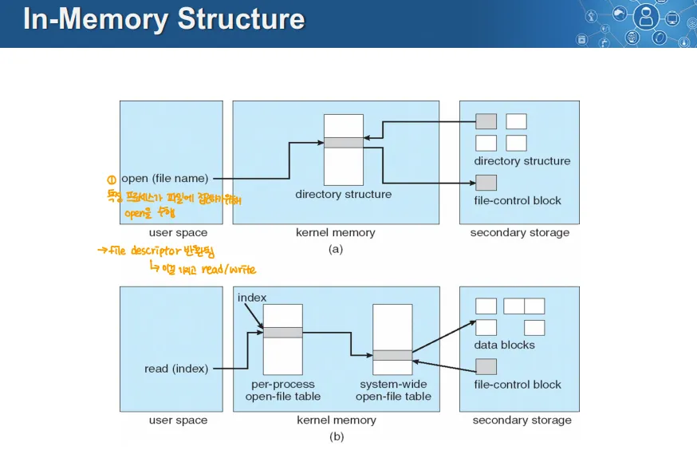

→ 위 그림은 OS에서 파일에 대해 열기, 읽기를 수행할 때 메모리 내 데이터 구조를 설명

## open(file name) → 파일 열기

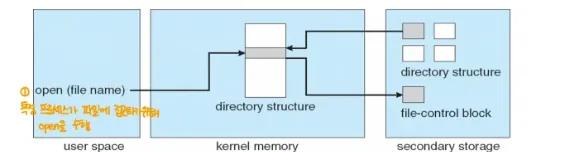

1. User Space에서 open(파일명)으로 커널에 요청을 보냄
2. 커널이 메모리에 가지고 있는 directory structure라는 구조체를 통해 Secondary Storage의 파일에 접근
3. 이후 접근한 파일이 디렉토리라면 Directory Structure에, 일반 파일이라면 File Control Block에 접근해 정보를 찾음
4. 찾은 정보를 바탕으로 커널의 Open-file table에 등록, User Space에는 파일에 접근 가능하도록 파일 디스크립터를 반환
→ 참고

	- 이전 13강에서 파일 열기와 읽기/쓰기를 분리(성능을 위해)
	- 이건 그 관점에서의 열기, 읽기 과정인듯 
	- 읽기, 쓰기가 일어나기 전에 열기가 선행되어야 함
		- **열기는 읽기 쓰기를 위한 준비과정, 읽기 쓰기는 실제 작업 이라고 생각하면 될 듯**

### → 파일 디스크립터

- Unix 시스템에서 파일을 읽기 위해 파일 디스크립터를 사용
	- 파일 디스크립터는 정수형 값을 가지고 있음
- I/O 디바이스, 일반 파일 모두 파일 디스크립터로 사용

## read(index) → 파일 읽기

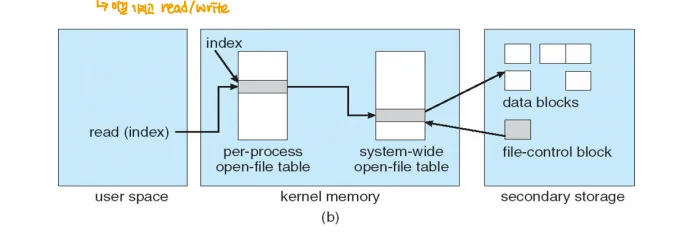

1. User Space에서 read(index)로 커널에 읽기 요청을 보냄
	- index는 per-process open-file table의 값에 접근하기 위한 인덱스
	→ 파일 디스클립터 = index인듯?

2. Index를 기반으로 Per-process open-file table을 참조
3. Per-process Open-file table는 System-wide Open File Table에 연결되어 참조
4. 이후 File control Block을 참조하고, 이 정보를 바탕으로 디스크 블록에서 데이터를 로드해 User Space로 반환

## In-Memory Structure의 구성

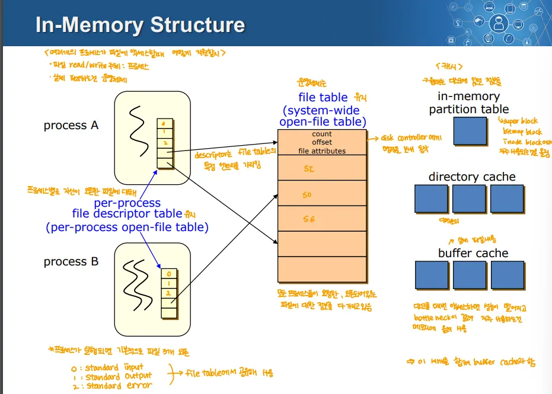

### 1. Per-Process File Descriptor Table(Per-Process Open-File Table)

- 각 프로세스마다 자신만의 file table을 가지고 있음
→ 그림 상에서는 프로세스 안에 들어있지만, 실제 위치는 커널 메모리에 있음

### 2. File Table(=System Wide Open-File Table)

- System 전체 단위로 파일에 대한 정보를 중복되지 않게 잘 관리하는 것

### 3. In-memory Partition Table

- 디스크 파티션에 대한 전체적인 메타데이터를 캐싱하는 영역

### 4. Directory Cache(=Inmemory Directory Structure)

- 자주 사용되는 디렉토리 경로 정보를 캐싱

### 5. Buffer Cache

- 실제 데이터에 대해 캐싱하는 영역
***

# Virtual File System

- 여러 파일 시스템들이 공통적으로 수행해야하는 기능들을 하나로 묶어서 일관된 형태로 제공하는 것
- VFS로 인해 호환성이 높아져 다양한 파일 시스템을 지원할 수 있음

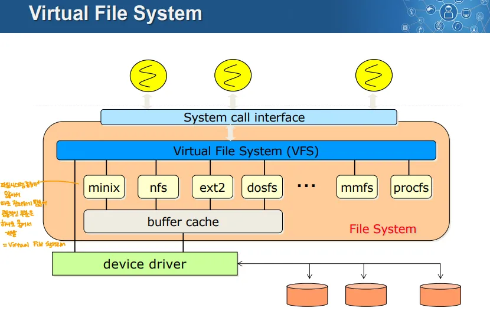

***

# Layered File System

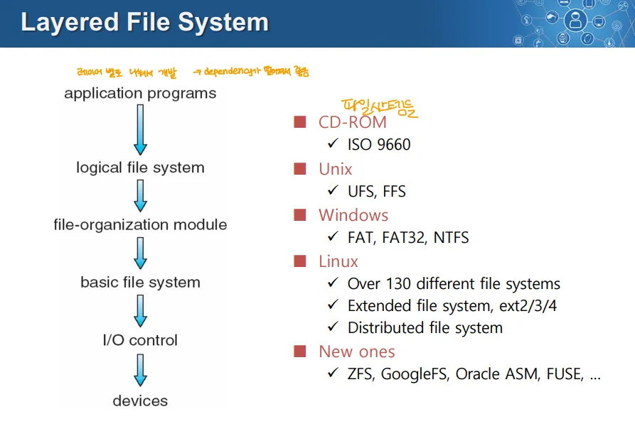

- 파일 시스템을 계층으로 나눠 계층 간 의존성을 낮추고자 하는 개념
	- 이를 실용적으로 만든 것이 Virtual File System
- device ↔ I/O Control ↔ Basic File System ↔ File organization module ↔ Logical file System ↔ 응용 프로그램
	- 이렇게 레이어를 나누고 각 레이어 사이 인터페이스를 갖춰놓자
***

# On-Disk Structure

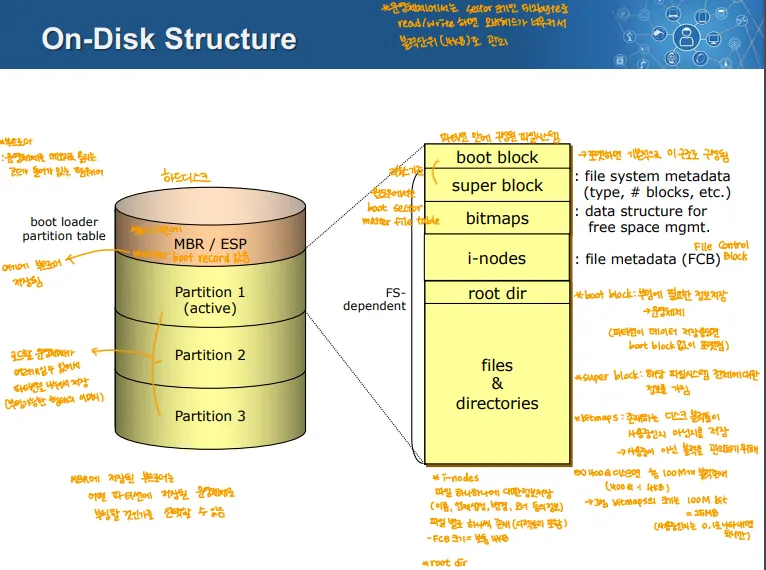

## 디스크

- 디스크의 가장 첫 번째 블록에는 부트 로더가 저장된 MBR/ESP가 존재
- 그 외 공간은 OS마다 파티션으로 나누어 사용
- 각 파티션마다 하나의 파일 시스템을 가지고 있음

## 파일 시스템 내부 구조

### Boot Block

- 가장 첫 번째에 위치
- 부팅을 위한 필수 데이터를 저장
- 커널이 설치된 파티션에서만 존재
	- 부트 로더가 부트 블록을 참조해 부팅 과정을 수행

### Super Block

- 파일 시스템에 관련한 메타 데이터가 저장되어 있음
	- 파일 시스템 타입, 파일 시스템의 블록 개수 등

### Bitmap Block

- 디스크 블록의 사용 여부를 추적하고 관리하는 블록
- 파티션의 크기가 커지면 비트맵 블록의 크기도 커짐
- 하나의 블록을 하나의 비트로 관리
- Ex)
	- 보통 하드디스크의 한 섹터는 512바이트, 이거 8개를 모아서 4KB 크기의 블록으로 만듬
	- 400MB의 디스크 → 400MB=4KB\*1024\*100 → 대강 블록 개수는 1024\*100 = 10만
	- 즉 10만개의 블록이므로 비트맵 블록에는 10만개의 비트가 존재

### i-node

- 파일과 관련한 메타데이터를 저장하는 영역
	- 데이터 자체를 포함하는 것이 아니라, 파일의 크기, 권한 등의 메타데이터만 포함

### root dir

- 파일 시스템의 시작 지점인 root 디렉토리의 정보가 저장되어 있음

### File & Directories

- 실제 데이터를 저장하는 공간

# Disk Block

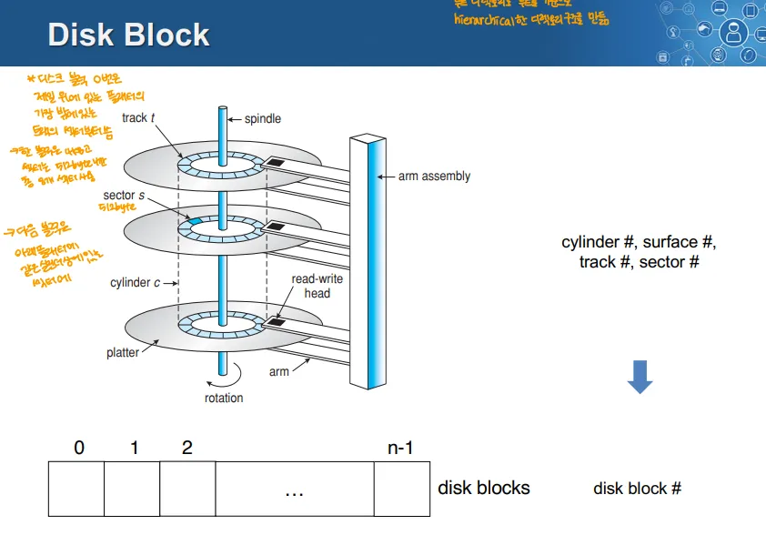

- 디스크는 최상단 플래터의 최외곽 트랙부터 읽기를 시작
	- 그 위치에 부트 블록이 저장
- 디스크 상의 위치는 실린더, 서페이스, 트랙, 섹터 넘버로 표현 가능 → 사용할 때는 디스크 블록 넘버로 파악
- 디스크를 바이트 단위, 섹터 단위가 아닌 논리적인 블록 단위로 사용
	- 논리적인 블록의 선형적인 주소 체계를 사용
→ 별로 안중요한듯
***

# Free Space management

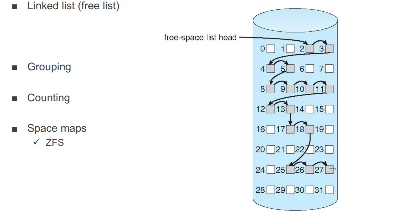

- 디스크에서 사용 가능한 블록과 이미 사용 중인 블록을 관리하는 방법
- 이를 관리하는 방식은 여러가지
	- 링크드 리스트, grouping, 카운팅, Space map, 비트맵 블록 등의 방식이 있음

# 일반적인 File Control Block

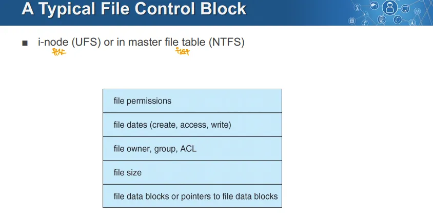

- File Control Block을 유닉스에서는 i-node, Windows에서는 Master File Table이라고 함
- 파일 생성 시간, 소유자, 크기, 파일을 구성하는 디스크 블록들의 위치 정보 등을 담고있음

# 디렉토리 구현

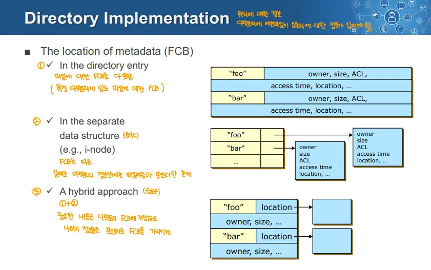

→ File Contorl Block을 어디에 보관하는가

1. 파일 컨트롤 블록을 디렉토리 엔트리에 전부 다 넣는 것
	- 디렉토리에 파일 컨트롤 블록에 정보가 모두 포함되어 관리
	- 디렉토리에 포함된 파일 개수가 증가하면 파일 컨트롤 블록 크기가 커짐
2. 별도 데이터 구조로 관리
	- FCB가 디렉토리 엔트리에 있지 않고 별도 데이터 구조에 저장
	- i-node가 이런 방식
3. 하이브리드 방식
	- 중요한 정보는 디렉토리 엔트리의 FCB에 저장하고, 자주 쓰이지 않는 정보는 별도로 File control Block을 만들어 이를 포인터로 가리킴
***

# Allocation Method
→ 파일의 내용을 디스크에 어떻게 할당하는지

- 3가지 방법이 있음
	1. Contiguous allocation 
	2. Linked Allocation
	3. Indexed Allocation

## 1. Contiguous Allocation

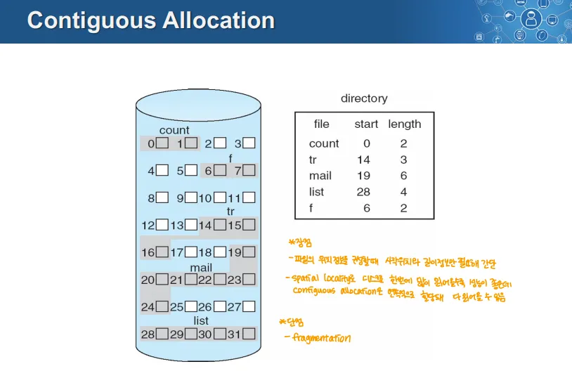

- 파일의 모든 블록이 디스크 상에서 연속적으로 저장
- 파일을 읽어오기 위해 파일의 시작 블록과 길이를 디렉토리에 저장해 관리
- 장점
	- 디스크 탐색 횟수가 최소화
	- 디렉토리 엔트리가 간단하게 표현 → 파일명, 시작 디스크 블록, 길이 정도로 표현 가능
- 단점
	- External Fragmentation이 발생
	- 빈 디스크 블록 중 어떤 곳에 할당해야하는지 탐색해야함
- 사용이 유리한 경우
	- Write하고 이후 변경하지 않는 매체에는 유리 → CD-ROM
	- 영상물 등의 데이터를 순차적으로 읽는 경우 유리

## 2. Linked Allocation

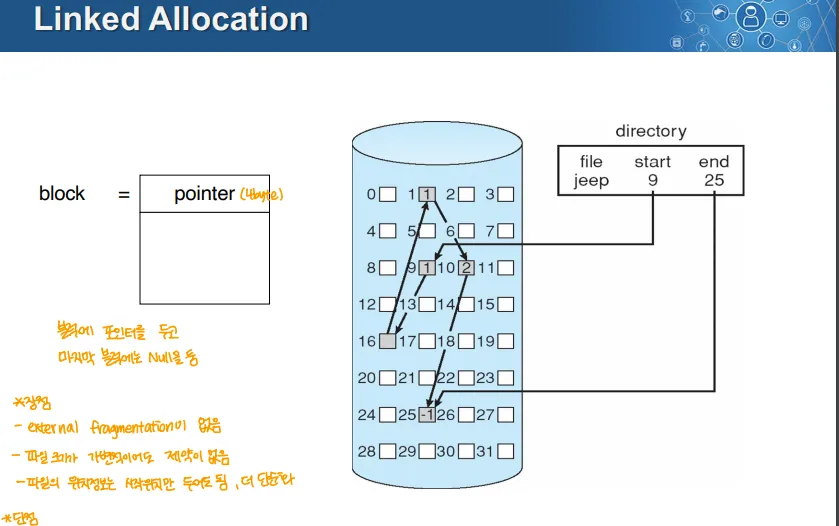

- 각 블록에 다음 블록을 가리키는 포인터가 포함되어 블록들이 연결된 형태로 파일이 저장
- 장점
	- External Fragmentation이 없음
	- 파일 크기의 확장이 쉬움
	- 디렉토리 엔트리가 단순 → 파일명, 시작 블록 , 끝 블록(끝도 필요 없는 경우 있음)
- 단점
	- 파일을 순차적으로 접근할 때만 효율적, 랜덤하게 접근하는 경우 비효율적
	- 포인터로 인해 공간 낭비, 블록 내 저장 공간이 2의 제곱이 아니게 됨
	- **포인터 손실 시 파일 데이터 전체가 손실될 위험이 있음**
	- Contiguous Allocation대비 Spacial Locality 활용이 떨어짐

### File Allocation Table

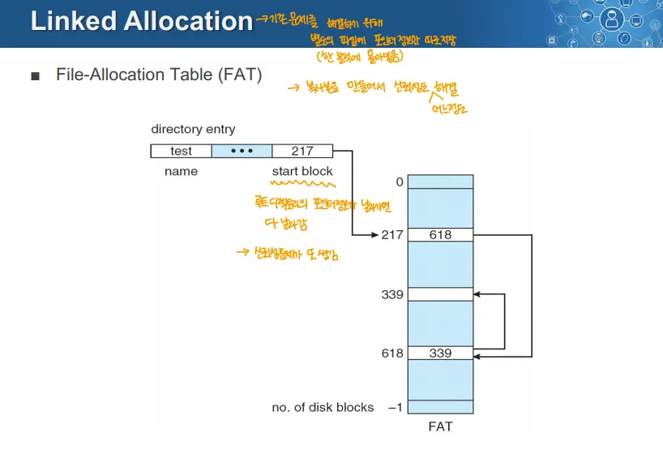

- 포인터의 정보들을 모아 관리하는 테이블
- 이 FAT을 사용하므로 포인터 정보를 백업해 신뢰성을 일정 정도 극복
	- 루트 디렉토리의 포인터 정보가 날아가면 다 날라가게 됨

## 3. Indexed Allocation

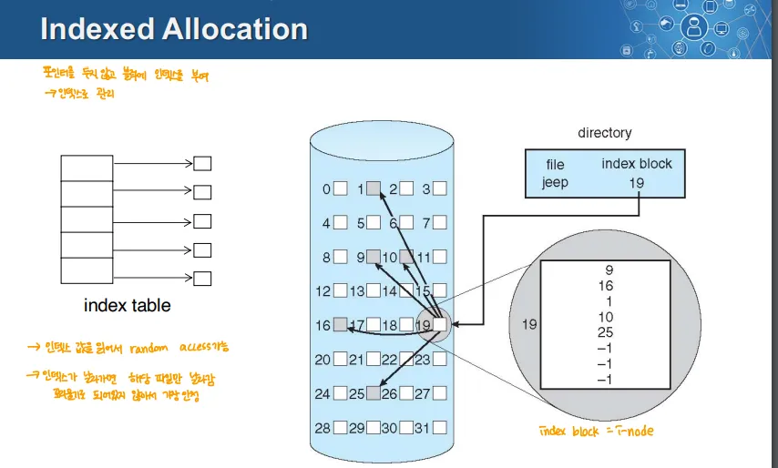

- 각 파일에 대한 인덱스 블록을 할당해 모든 데이터 블록의 정보를 관리
장점

	- External Fragmentation 없음
	- 인덱스를 통해 파일에 직접 direct access가능
	- 안정성 문제를 해결
		- Linked Allocation은 파일 전체를 사용하지 못함, 인덱스의 경우 그렇지 않음
	- i-node는 해당 파일이 열려 있을 때만 메모리에 로드되어 메모리 사용량이 적음
- 단점
	- 인덱스 블록에 의한 저장공간 오버헤드 발생
		- 링크된 스키마, 다중 인덱스 블럭, 혼합된 스키마의 경우 각자의 이유로 공간 오버헤드가 증가

## Direct Block, Indirect Block

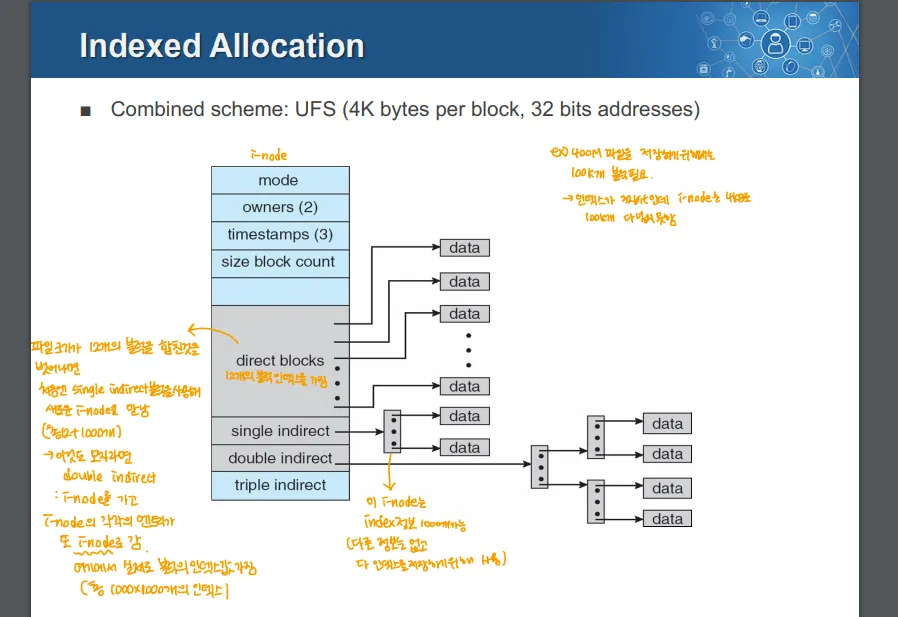

→ 이 그림의 구조체는 인덱스 블록(i-node)이라 생각하면 될 듯

- Indexed Allocation은 큰 파일을 효율적으로 관리하기 위해 여러 단계의 indirect block을 활용

### Direct Block

- i-node가 데이터 블록을 직접 가리키는 것
- 보통 사용자 파일은 50KB를 넘지 않으므로 12개의 포인터를 가지고 있음
	- 4KB \* 12 = 48KB

### Single Indirect

- Direct Block만으로 파일을 나타내기에는 부족한 경우 사용
- i-node의 single Indircet 블록을 따라가면 더 많은 정보를 담는 i-node가 나옴
	- i-node를 가리키는 포인터
- 이는 1K개의 인덱스 정보를 보관
	- 4KB \* 1K = 4MB

### Double Indirect

- Direct Block, SIngle Indirect를 모두 사용했음에도 부족한 경우에 사용
- i-node의 Double Indirect를 따라가면 1K개의 i-node가 나오고, 각각이 또 1K개의 블록을 가리킴
- 4KB \* 1K \* 1K = 4GB

### Triple Indirect

- 동일
- 4KB \* 1K \* 1K \* 1K = 4TB

## Indexed Allocation 예시: UFS(Unix File System)

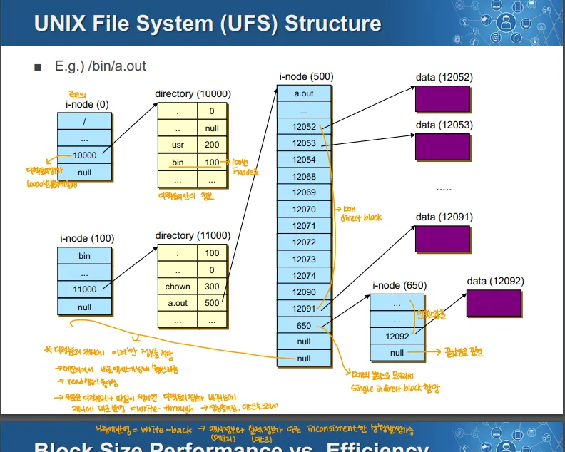

→ /bin/a.out 파일에 접근하는 상황

1. In-Memory File System에서 루트 정보를 찾아 0번 디스크 내의 i-node로 이동
	- 그림의 0번 i-node에는 루트 디렉토리 정보가 들어있음
		→ 보통 이러함

2. 0번 i-node가 디렉토리 메타데이터를 가리키고 있음 → 10000번 블록
	→ 이것도 Indexed Allocation에서 10000번 정보는 다이렉트 블록, 10000번의 디렉토리는 실제 정보가 저장된 블록으로 생각하면 될 듯

3. 10000번 블록의 디렉토리 메타데이터에 bin 디렉토리의 i-node가 100번에 위치한다는 정보가 나옴
4. 100번 i-node로 이동하면 11000 블록에 디렉토리 메타데이터가 저장되어 있다고 가리키고 있음
5. 11000번 블록으로 이동하면 a.out 파일의 i-node위치를 알려줌 → 500번 블록
6. 500번 i-node에 a.out파일에 대한 정보들이 존재
	- direct block은 총 12개의 인덱스를 가리킴
	→ 이 예시는 single indirect까지 사용

	- single indirect가 650번을 가리킴, 해당 위치에 i-node가 존재
		- 해당 i-node에 a.out의 추가적인 정보가 존재

### 문제

- 이 경우 블록 엑세스가 굉장히 많이 일어남

### 해결 방법

- 이를 해결하기 위해 In-Memory Structure에 디렉토리 캐시를 유지
	- 이를 통해 i-node를 통해 계층적으로 접근하는 오버헤드 감소
	- 그러나 이를 감안해도 데이터 블록을 읽는 엑세스 횟수는 많음
- 데이터 블록을 읽는 오버헤드를 줄이기 위해 있는 것이 In-Memory Structure에 버퍼 캐시를 유지

### 캐싱의 문제점

- Write 정책의 사용이 제한
	- Write back(←모아두고 쓰기), Write Through(←즉시 쓰기) 중 Write Back만 사용
	- Write Through를 하기에는 디스크 쓰기 성능이 낮아서 사용이 제한
	- 성능 상의 문제로 Write Back을 사용
		- 데이터 일관성 문제가 생김
		- 디스크에 저장되기 전에 시스템이 종료되면 날아가게 됨, 신뢰성 문제
			- 이를 위한 복구 방법도 존재
		→ 이거 모두 감수하고 Write Back을 사용
***

# 블록 사이즈에 따른 성능과 저장 공간 효율성

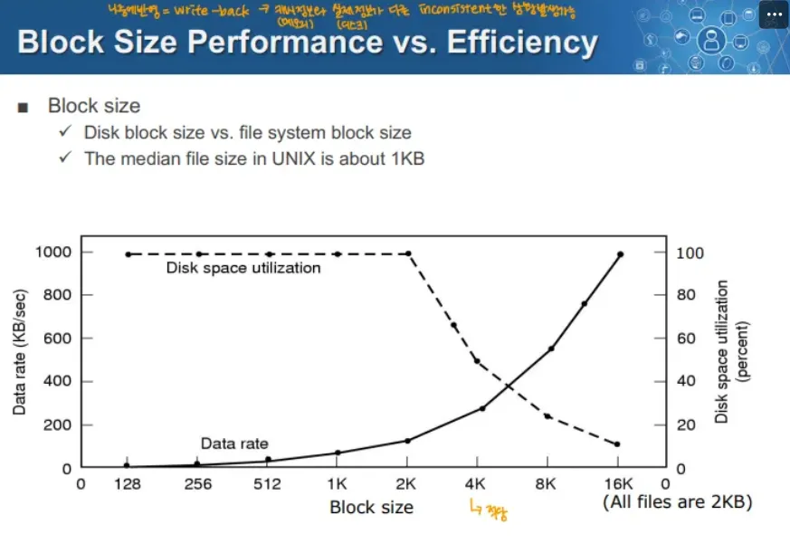

- 이 그래프에 따르면 블록 사이즈가 클 수록 
	- Disk Space Utilization(저장 공간 효율성)이 감소
	- Data Rate(데이터를 읽는 속도, 성능)은 증가
- 따라서 파일 시스템은 블록 크기로 적당한 4KB를 주로 사용
***

# 파일 시스템의 성능 향상을 위한 개념

## 1. Read Ahead

- 파일 시스템이 쓰일 것으로 예상되는 디스크 블록을 미리 읽어 오는 것
	- 근처에서 한번에 읽어오는 형태로 사용 가능 → Spacial Locality 활용
	- 프로세스가 이전 블록을 사용하는 동안 발생 가능, I/O와도 동시에 실행 가능
- 이렇게 미리 읽어오면 이후 프로세스가 블록을 사용하려 할 때 해당 블록은 이미 캐시에 있음
- 디스크 캐시를 보완, 디스크 캐시 또한 리드 어헤드 수행
- 순차적으로 접근되는 파일에서 매우 효과적
- 이를 활용하기 위해 파일 시스템은 블록이 비교적 연속적인 상태로 있도록 주기적인 재구성을 하기도 함

## 2. Buffer Cache

- 자주 쓰는 블록을 캐싱해 Locality를 통해 성능을 향상
- 시스템 전역적으로 사용되며, 모든 프로세스에서 공유

### 문제점

- 버퍼 캐시가 가상 메모리와 물리적 메모리를 두고 경쟁할 수 있음
	- 버퍼 캐시에 물리 메모리를 많이 주는 경우 VM의 성능 저하, VM에 많이 할당하면 버퍼 캐시 효율 저하가 될 수 있음
- 버퍼 캐시의 공간을 제한적임
- 캐싱과 관련된 Replacement 알고리즘이 필요하게 됨

## 3. Unified Buffer Cache

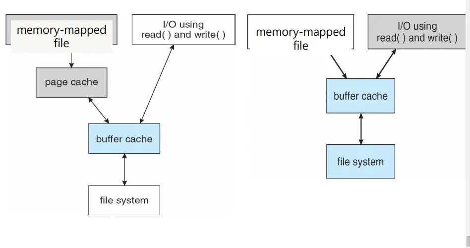

- 페이지 캐시와 버퍼 캐시를 통합해 관리하는 형태
	- 이를 통해 I/O 성능 향상
→ 여기까지는 성능 향상 방법, 아래는 신뢰성 해결 방법

## 4. Cache Write & Reliability(신뢰성 문제 해결)
→ 성능을 위해 캐시가 필요 그러나 이로 인해 신뢰성 문제 발생

### Caching Write

- 동기적인 Write(=Write-Through)는 매우 느림
	→ 메모리, 디스크 사이 즉시 동기화를 의미하는 듯

- 비동기적인 Write(=write back, write begind)방식을 사용하게 됨
	- 이런 방식은 아직 디스크에 저장되지 않은 블록을 큐로 관리
	- 이런 방식은 신뢰성, 일관성의 문제가 생기게 됨
- 신뢰성이 중요한 데이터는 동기적인 Write, 아닌 것은 비동기식 Write를 사용

### Reliability

- 시스템 크래시 등으로 인해 캐싱된 블록들이 디스크에 기록되지 않으면 비일관적인 사애가 될 수 있음
- i-node등의 메타데이터는 비일관 적이면 문제 발생 가능
- **이를 막기 위해 OS가 파일 시스템의 일관성을 확인하고 복구하는 프로그램을 제공**
	- Windows는 Scandisk, Unix는 fsck(file system check)라는 프로그램 제공

## 5. Log Structured File System
→ 기존 복구 프로그램의 성능, 복구 성공율이 높지 않아 사용하는 것
→ 저널링 파일 시스템은 Log Structured File System의 일종으로 생각 → 아니긴 함

### Journaling File System

- FSCK 작업(기존 OS가 지원해주는 프로그램)은 시간이 오래 걸리고, 복구 성능이 떨어짐
- Journal 또는 Log를 기록해 파일과 디렉토리의 수정 사항을 별도의 위치에 저장
	- 가능하다면 별도 디스크
- 시스템 크래시 발생 시 Journal을 사용해 부분적으로 완료된 작업을 되돌림, 파일 시스템이 비일관 상태가 되는 것을 방지

### 저널링 파일 시스템 매커니즘

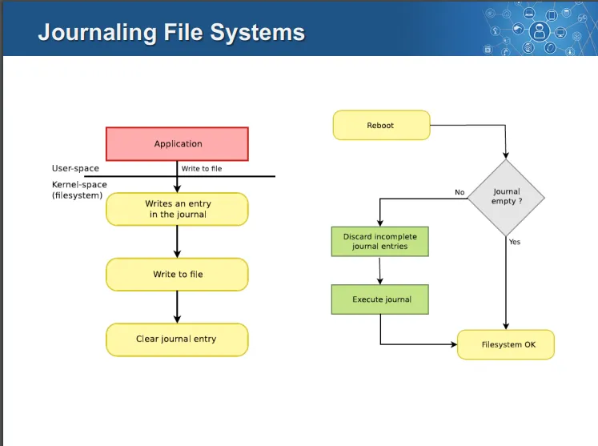

**정상적으로 디스크에 기록된 경우**

1. application이 file write 작업 수행
2. 변경 내용을 캐시에 기록하고 저널에 기록을 남김
3. 캐시의 변경 사항을 디스크에 기록
4. 저널 기록을 삭제
복구 과정

1. 재부팅 시작
2. 저널이 비어있는지 확인
	- 비어있으면 그냥 부팅 시작
	- 저널이 비어있지 않으면 복구 작업 수행
3. 복구 작업 → 불완전한 저널 기록을 삭제(잘못된 데이터일 수 있으므로)
4. 남은 저널 기록(완전한 것들)을 복구
5. 이후 부팅
***

# 원격 파일 시스템

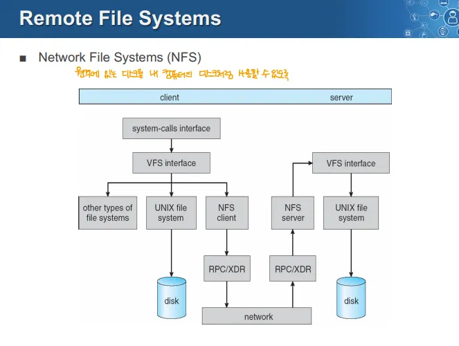

- 네트워크를 통해 원격의 파일 시스템을 로컬 시스템처럼 사용할 수 있게 해주는 파일 시스템

## 과정

1. 파일 시스템을 사용하기 위한 시스템 콜
2. VFS 인터페이스를 거쳐 NFS 클라이언트를 사용
3. NFS 클라이언트가 RPC 또는 XDR 프로토콜로 네트워크로 전달
4. 네트워크로 연결되어 원격지의 파일 시스템도 RPC 또는 XDR 프로토콜로 받아서 NFS Server가 받아 이를 사용

***
