> 원본 Notion 정리 — 강의 슬라이드/설명.
> [← 전체 목차](/posts/os-overview/)

***

# Computer Security

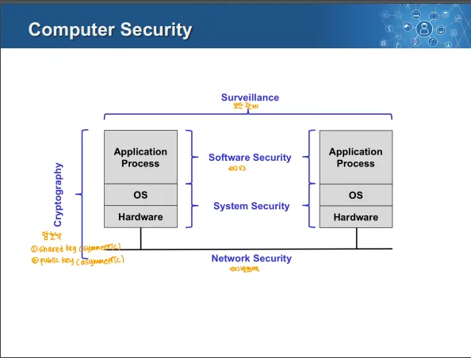

1. Cryptography(암호학)
	- 보안의 전반에 적용되어 데이터의 기밀성과 무결성을 보호
2. System Security(시스템 보안)
	- 운영체제와 하드웨어 레벨에서의 보안
	- 커널 레벨의 보안이 포함되어있는 부분
3. Software Security
	- 애플리케이션 레벨에서의 보안
4. Network Security
	- 네트워크를 통해 데이터를 전송할 때 발생 가능한 위협으로부터 보호
5. Surveilance(감시)
	- 시스템이 보안을 제대로 유지하고 있는지 모니터링
	- 시스템 관점, 물리적 관점으로 나뉨
		1. 시스템 관점 → 소프트웨어 안정성, 데이터 확인
		2. 물리적 관점 → 실제 하드웨어와 환경을 보호
***

# 컴퓨터 보안 개요

## 정의
→ NIST 컴퓨터 보안 핸드북에서의 정의

- 컴퓨터 보안은 자동화된 정보시스템의 보호를 통해 무결성, 가용성, 기밀성(CIA)를 유지하는 것을 목표로 함
- 이런 목표는 하드웨어, 펌웨어, 데이터, 통신과 같은 정보 시스템 전반에 걸쳐 적용

## CIA Triad(=보안 요구사항, 원칙)

- 보안의 3가지 요소, 이 요소들을 모두 충족해야 보안성이 보장된다고 할 수 있음

### 1.  Confidentiality(기밀성)

- 데이터, 코드 등의 정보가 비인가된 사용자에게 노출되지 않도록 보호
- 민감한 정보 등의 보호를 목표
- 데이터 기밀성과 프라이버시의 개념을 포함

### 2. Integrity(무결성)

- 데이터가 손상되거나 위,변조되지 않도록 보호
- 데이터 무결성과 시스템 무결성을 포함
	→ 데이터 무결성: 데이터가 정확하고 위변조되지 않는 것
	→ 시스템 무결성: 시스템이 무결하게 의도된 기능을 제대로 수행하는 것

### 3. Availability(가용성)

- 권한이 있는 사용자가 필요로 하는 정보를 적시에 접근하고 사용할 수 있도록 보장
***

# 보안 문제

## 완벽한 보안 시스템은 없다

- 모든 보안 시스템에는 취약점이 존재하며, 이를 완전히 제거하는 것은 불가능
- 보호는 공격자가 악의적인 행동을 하는 데 필요한 노력을 증가시킬 뿐 이를 완전히 방지하는 것은 불가능
- 모든 시스템은 특정한 형태의 hole(결함)을 가짐

### 4B(기술적으로 완벽한 보안 시스템에서도 발생 가능한 위협)

1. **Burglary (도둑질):** 정보를 물리적으로 훔침
2. **Bribery (뇌물):** 내부 사용자에게 뇌물을 제공해 정보를 얻음
3. **Blackmail (협박):** 약점이 있는 사용자를 협박하여 정보를 얻음
4. **Bludgeoning (폭행):** 물리적인 폭력으로 정보를 강제로 획득

## 보안 문제 관련 용어

### 1. Vulnerability(취약점)

- 보안적으로 악용 가능한 특정 지점
- 기밀성, 무결성, 가용성(CIA) 중 하나라도 손실될 가능성이 있는 지점

### 2.  Threat(위협)

- 취약점을 악용할 가능성이 있는 상태
	→ 취약점을 아무도 모른다면 악용 가능성이 없어 위협이 아니게 됨

### 3. Attack(공격)

- 위협을 실제로 실행하여 시스템에 피해를 주는 행위

### 4. Adversarry(공격 주체)

- 시스템을 공격하려는 주체
	→ 해커, 경쟁 기업 등

### 5. Countermeasure(대응책)

- 공격을 방어하거나 피해를 최소화하기 위한 방법
***

# Security Services
→ 보안을 위해 제공되는 매커니즘, 프로세스/ 보안의 요구사항

- Confidentiality, Integrity, Availability, Authentication, Access Control, Nonrepudiation의 총 5가지

### 1.  Confidentiality(기밀성)

- 데이터, 코드 등의 정보가 비인가된 사용자에게 노출되지 않도록 보호
- 민감한 정보 등의 보호를 목표
- 데이터 기밀성과 프라이버시의 개념을 포함

### 2. Integrity(무결성)

- 데이터가 손상되거나 위,변조되지 않도록 보호
- 데이터 무결성과 시스템 무결성을 포함
	→ 데이터 무결성: 데이터가 정확하고 위변조되지 않는 것
	→ 시스템 무결성: 시스템이 무결하게 의도된 기능을 제대로 수행하는 것

### 3. Availability(가용성)

- 권한이 있는 사용자가 필요로 하는 정보를 적시에 접근하고 사용할 수 있도록 보장

### 4. Authentication(인증)

- 시스템 접근 시 사용자의 신원을 확인하는 과정
- Ex) 사용자의 로그인 과정

### 5. Access Control(접근 제어)

- 권한에 따라 리소스에 대한 접근을 제한하는 매커니즘
- Authorization(권한 부여)이 이 접근 제어를 위해 사용

### 6. Nonrepudiation(부인 방지)

- 특정 작업이나 통신에 대해 부인할 수 없도록 보장
- Ex) 이메일 시스템 → 송신, 수신자, 서버 모두 송신, 수신, 확인 기록을 공유, 부인이 어려움
***

# 크래커의 통상적인 공격 단계

## 1. 정보 수집

- 취약점을 찾고 이를 악용하기 위해 최대한 많은 정보를 수집

## 2. 포트 스캔

- 네트워크 상에 열려있는 포트를 탐지해 어떤 서비스가 실행 중인지 확인한 후 보안이 약한 서비스나 구성 오류를 찾음

## 3. 로그인 계정 획득

- 시스템에 접근하기 유효한 사용자 계정을 획득

## 4. Root 권한 획득

- 취약점을 이용해 Root 권한(최고 권한)을 획득

## 5. Root 권한 유지

- 추후에 시스템에 다시 접근하기 위해 백도어를 설정
***

# 보안의 종류

- 물리적/ 계정/ 파일시스템/ 네트워크 보안 등이 있음

## 1. 물리적 보안(Physical Security)
→ 보안을 위해 물리적 접근을 통제하는 방식

### 하드웨어 보안

- 하드웨어 장비 및 시스템에 대한 물리적 접근을 제한해 보안 강화
- Ex) ID 카드, 생체 정보 인증(홍체, 지문 등)

### BIOS 보안

- 부팅 단계에서 보안을 설정해 시스템 보호
- 바이오스를 통해 부팅 단계의 부팅 비밀번호 설정 가능
- Ex) 부팅 비밀번호 설정, 외부 장치(플로피 디스크)를 통한 부팅 제한

### Session 보안

- 사용자가 시스템을 사용하지 않을 때(세션이 비활성화)도 시스템을 보호
- Ex) 일정 시간 동안 활동이 없을 시 자동 로그아웃, 화면보호기 등

## 2. 계정 보안(Account Security)

### Authentication(인증)

- 계정의 사용자가 본인이 맞는지 확인하는 과정
- 보통 비밀번호를 사용한 인증 방법을 사용
	- 이 방법은 보안의 첫 번째 방어선이자 가장 큰 보안 취약점이 될 수 있음
**비밀번호 사용의 문제점**

1. 비밀번호를 다른 사람이 볼 수 있는 곳에 메모하는 사용자
2. 비밀번호를 느리게 입력 시 주위 사람이 알아채기 쉬움
3. 단순한 비밀번호 사용
4. 너무 길고 복잡한 비밀번호 사용, 이는 사용자가 쉽게 잊게 함
- 비밀번호는 곧장 읽을 수 있는 형태(평문)으로 저장되어서는 안 됨
	- 따라서 보안 해시를 사용해 변환 후 저장
**계정 인증 프로토콜 **→ 이걸 사용해 비밀번호 취약점을 방지

- CHAP(Challenge Handshake Authentication Protocol)이 사용
	1. 클라이언트는 계정 정보와 비밀번호를 암호화 해 전송
	2. 서버에서 랜덤 넘버를 생성한 후 클라이언트에게 전송
	3. 클라이언트는 랜덤 넘버와 비밀번호를 조합해 서버로 전송
	4. 서버는 클라이언트가 보낸 정보를 계산해 검증

### Authentication Alternatives(인증 대안)
→ 비밀번호 인증 대신 사용하거나 이를 보완하는 대안

- 위조 및 복제가 불가능해야 하고 도난 시 소유자가 이를 빨리 알아차려 이전의 것을 비활성화 해야함
**인증 대안 예시**

1. 물리적 키 (Physical Keys)
	- 물리적인 장치를 사용해 접근을 인증
	- EX) 출입증
2. 생체 키 (Biometric Keys)
	- 사용자의 생체 정보를 기반으로 인증
	- Ex) 홍채, 지문, 얼굴 인식
3. 이미지를 사용한 비밀번호 (Passwords Using Images)
	- 텍스트 기반 비밀번호 대신 특정 이미지를 통한 인증

### Authorization(권한)

- 특정 사용자가 특정 작업 수행, 데이터 접근이 가능한지 결정하는 과정
- 인증 이후의 과정이고 사용자의 권한을 확인
- Access matrix로 표현됨
	→  ACL, Capability를 나타내는 테이블
**Access control lists (ACLs)**

- 각 객체에 대해 어떤 사용자가 어떤 작업을 수행할 수 있는 지를 나타냄
- 간단하며 거의 모든 파일 시스템에서 사용
**Capabilities**

- 각 사용자에 대해 어떤 자원에 접근할 수 있고, 어떤 방식으로 접근할 수 있는 지를 나타냄
- 이름 지정(naming)과 보호(protection)를 동시에 수행하는 경우가 많습니다. 사용자가 특정 객체에 대한 권한(capability)이 있어야만 해당 객체를 볼 수 있음
- 매우 높은 보안이 요구되는 시스템에서 사용

## 3. File System Security

### Setuid/Setgid 프로그램
→ setuid, setgid는 특정 파일 실행 시 실행자의 권한이 아닌 파일 소유자 권한으로 실행하게 함

- 잘못 작성된 setuid 프로그램은 보안 취약점을 포함하게 됨
	- 이런 setuid 프로그램을 통해 루트 권한을 획득하는 백도어가 존재

### Search Path(경로 검색)

- 사용자가 현재 작업 중인 디렉토리를 PATH(환경 변수)에 포함시키는 경우가 많음
- 크래커는 이렇게 사용되는 디렉토리에 악성 프로그램을 넣어 평소에 쓰는 명령어 등을 악성 프로그램의 실행으로 이어지게 함
	→ ex) 만일 /home/hi 디렉토리를 환경 변수로 설정하면 여기에 git이라는 이름의 악성 파일을 넣허 bash에 git 입력 시 악성 파일이 실행되게 함 

### 기타 보안 대책

1. 파일 시스템 자체 암호화
	- 디스크로 가는 PCI 버스에 암호화 엔진(하드웨어)를 설치해 암호화를 하는 방법도 있음
2. 파일 시스템 백업
3. 시스템 로그 모니터링
4. 기본 권한을 신중하게 지정
5. 파일 시스템 사용 제한
6. 파일 시스템 무결성 확인

## 4. Network Security

### Secure Protocol 사용

- 평문 데이터가 네트워크 상으로 전송되지 않도록 Secure Protocol을 사용
- ssh(Secure Shell) 프로토콜은 여러 프로토콜의 통신을 암호화
	- 많은 프로토콜이 ssh를 기반으로 한 프로토콜로 대체
	- slogin, sftp, ssh
- Secure Socket Layer(SSL)
	- 클라이언트와 서버 사이 데이터 암호화를 제공
	- 현재는 TLS로 대체
- IPSec 프로토콜
	- IP 패킷을 암호화
	- IPv4에서는 선택적으로 적용, IPv6에서는 선택적으로 적용

### TCP Wrapper

- 커널 단에서 TCP 통신을 Wrapping해  별도의 기능을 추가하는 것, 이때 보안적인 기능들을 추가 가능
	- 방화벽보다 내부에서 동작
- telnet, ftp 등의 인터넷 서비스를 모니터링하고 필터링
- 클라이언트를 서비스 프로그램에 연결하기 전에 활동을 로깅하고 연결이 허용되는지 확인
	→ 이 외에도 기능 존재

### Firewall

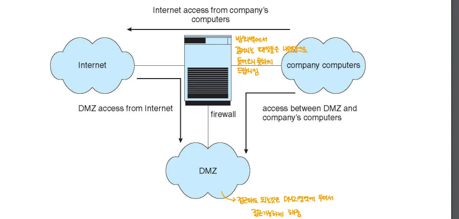

- 신뢰할 수 있는 호스트와 신뢰할 수 없는 호스트 사이에 배치되어 내부 네트워크와 연결된 외부 네트워크 사이에 필터링 또는 보호 계층을 생성
- 외부에서 들어오는 데이터를 필터 규칙에 의해 들어올 수 없는 것을 방어
- 별도로 public하게 접근해야하는 것들은 DMZ라는 영역을 별도로 두어 접근이 가능하게 함

### Instrusion Detection/ Prevention(침임 탐지 및 방지)

- 컴퓨터 시스템에 대한 침임 시도를 탐지하거나 방지하는 개념
- 방화벽은 네트워크 트래픽을 필터링하는 기본적인 보안 장치
	- **IDS와 IPS는 방화벽의 기능을 강화한 개념으로 침입을 탐지하고 방지하는 역할을 수행**
	- **방화벽을 안정적으로 강화한 장치**
***

# 공격(Attack)과 대응책(Countermeasure)

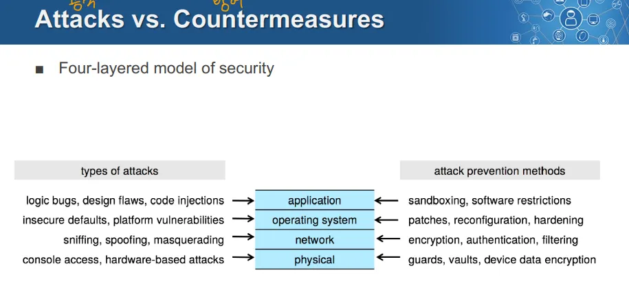

- 보안은 4가지 주요 계층에서 공격과 대응 방법을 통해 관리됨
***

# Security Threats(보안 위협)

## 1. Physical Threat(물리적 위협)

- 자연재해, 인간의 물리적인 침입
	- 홍수, 화재, 지진, 폭발 등
	- 컴퓨터를 훔침, 시스템 콘솔에 접근해 불법적 조작

## 2. Logical Threat(.논리적 위협)

- 개발자 또는 시스템을 구축한 사람에 의한 버그로 발생
- 사용자가 오용한 경우 → ex. 비밀번호를 0000으로 설정 등

## 3. Operational Threat(운영적 위협)

- 관리 실패로 인해 발생

## 4. Denial of Service(Dos, 서비스 거부 공격)

- 컴퓨터가 정상적으로 서비스를 제공하지 못하도록 과도한 트래픽 등을 발생시켜 방해

# Attack(공격 방법)

- 바이러스, 웜/ 트로이 목마/ Logic Bomb/ 트랩도어/ 딕셔너리 공격/ 로그인 스푸핑
	→ 상대적으로 저수준의 공격

- Malware, Spyware, Ransomware/ Keystroke Logger/ Code Injection/ Packet Sniffing
	→ 상대적으로 고수준의 어려운 공격

- DoS, DDoS

## Buffer Overflow
→ 공격보다는 취약점

- 함수의 호출과 관련된 내용들은 스택 영역에 포함

	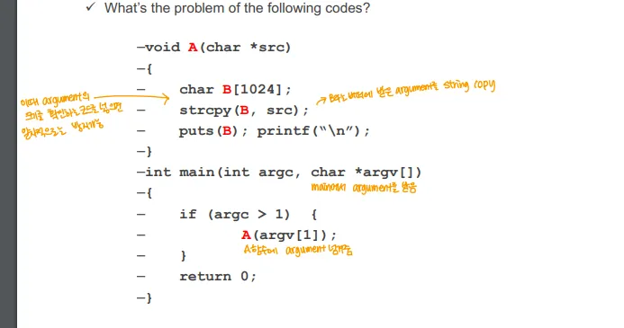

- 이 코드에 쓰인 strcpy는 문자열을 버퍼 B로 복사하는 것
- 그러나 처음 버퍼 선언 시 B[1024]로 1024 바이트 이하의 크기가 될 것이라 예상
	- 이를 초과하면 버퍼 오버플로우 발생
- 이를 방지하기 위해 일차적으로는 복사할 버퍼의 길이를 파라미터로 넘겨주는 방법으로 길이를 검증함
	- 이런 문제를 막기 위해 새로 나온 메서드들이 scanf_s, stycpy_s 같은 것들

## Code Injection

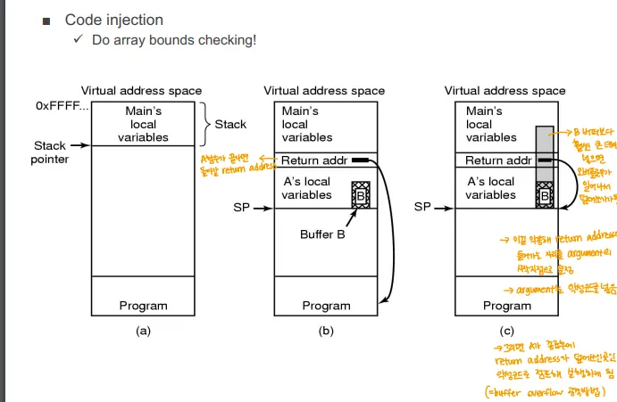

- 함수 A가 실행되면 A의 실행 이후 돌아갈 Return Address, 그 위에 A의 지역변수들이 스택 영역에 쌓임
	- 이때 A의 지역 변수 중 선언된 버퍼 B에 원래 할당된 값보다 큰 값을 넣으면 버퍼 오버플로우가 발생
	- 결국 Return Address를 덮어씌우게 됨, 함수의 실행이 끝나면 돌아가기 위해 Return Address가 저장된 공간의 코드를 실행시키는데, 이때 덮어씌워진 코드가 실행됨
	- **이런 버퍼 오버플로우로 악성 코드 등을 심으로 그게 코드 인젝션**

## IP Spoofing

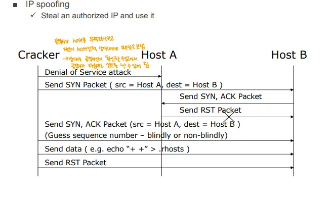

- 공격자가 허가된 IP주소를 위조해 이를 악용하는 공격 기법

## Denial of Service(DoS)

- 시스템이 서비스를 제공하지 못하도록 하는 공격, 주로 시스템 리소스를 과다하게 사용하게 해 사용자들의 요청을 처리하지 못하게 함

### Internal DoS

- 시스템 내부의 자원을 고갈시켜 시스템을 마비
	- 메모리, 프로세스. CPU 등
- 시스템 내부에서 발생할 수 있음
	- Ex) 사용자 실수로 인한 프로세스의 무한 fork()

### External DoS

- 시스템 외부의 자원을 고갈시켜 시스템을 마비
- **응용 프로그램(Application) 수준의 자원 고갈**
	- **Mail bombing**: 대량의 이메일을 전송하여 메일 서버 과부하 유발.
	- **Buffer overflow**: 입력 크기 제한을 초과하여 메모리 손상 유발.
	- **Java Applet Attack**: 악의적인 Java Applet을 사용해 시스템 침투.
- **프로토콜(Protocol) 수준의 자원 고갈**
	- **TCP SYN Flooding**: 다량의 SYN 패킷 전송으로 연결 요청을 초과시킴.
	- **Ping Flooding**: 다량의 핑 요청을 보내 네트워크 대역폭 소모.
- **네트워크(Network) 수준의 자원 고갈**
	- **UDP Storming**: UDP 프로토콜을 악용하여 네트워크 자원 소모.

### DDoS(Distributed DoS, 분산 서비스 거부 공격)

- 외부 DoS 등은 하나의 시스템에서 공격하므로 IDS로 탐지한 후 쉽게 차단이 가능
- 차단할 요청을 구별하기 어렵게 해 우회하는 식으로 공격하기 위해 불특정 다수의 컴퓨터에서 DoS 공격을 하는 것
	- 주로 작은 임베디드 디바이스, 다른 사람의 PC에 코드를 인젝션해 공격
***

# 암호학의 기초 개념

## 암호화

- 데이터를 읽기 어렵게 난독화 하는 방법
- 이를 통해 인증, 기밀성, 데이터 무결성을 얻을 수 있음
- 암호화 알고리즘은 공개되어도 되지만 키는 반드시 기밀로 유지되어야 함

## 암호화의 2가지 종류

1. 공유 키 암호화(대칭 키 암호화)
2. 공개 키 암호화(비대칭 키 암호화)

## 공유 키 암호화(대칭 키 암호화)

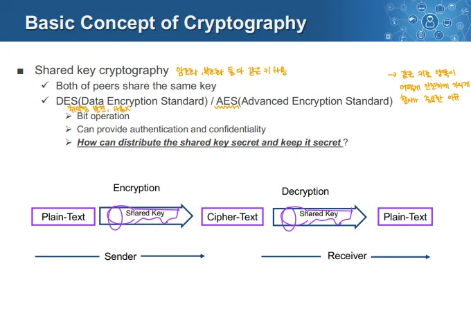

- 암호화와 복호화에 **동일한 키(공유 키, 대칭 키)**를 사용
	- 원격의 두 시스템이 모두 동일한 키를 지녀야 함
- 이때 대칭 키를 어떻게 두 시스템에게 안전하게 전달하는가가 관건
- DES/ AES 알고리즘을 사용

## 공개 키 암호화(비대칭 키 암호화)

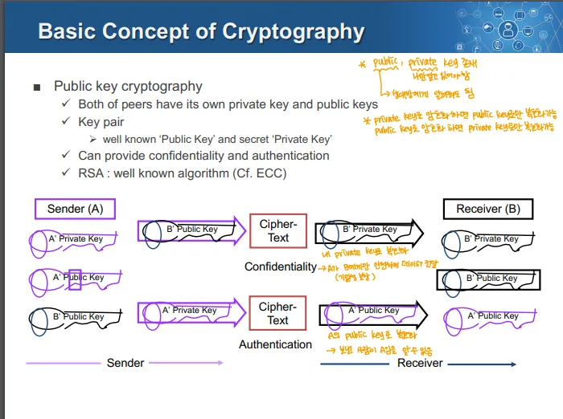

- 각 원격의 시스템이 자신만의 공개 키와 개인 키를 가짐
	- 공개 키는 모두에게 공개됨
	- 개인 키(비밀 키)는 소유자만 알고 있는 키
- Key pair
	- 공개 키와 개인 키의 한 쌍으로 암호화와 복호화
- 기밀성과 인증 제공 가능
- RSA 알고리즘을 사용

### 주의사항

- 비대칭 암호화 알고리즘은 시간복잡도가 매우 큼
- 따라서 데이터 전체에 비대칭 암호화를 적용하기 보다, 데이터는 대칭 키로 암호화하고, 대칭 키를 비대칭 암호화 방식으로 전달
- 인증 정보와 같이 중요한 정보는 직접 비대칭 키로 암호화 되기도 함

# 네트워크 상 암호화의 응용

## 1. 전자서명(Digital Signature) → 비대칭 키 암호화 응용

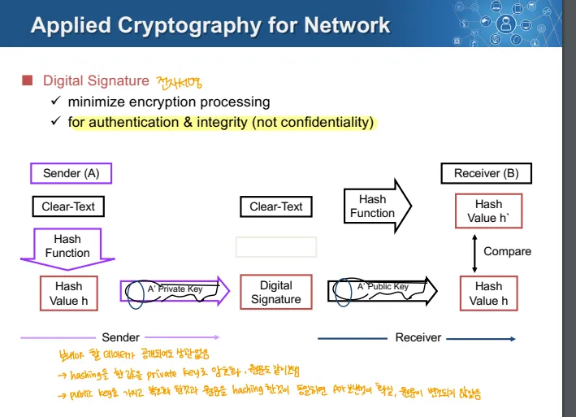

1. 전송할 평문 데이터를 해시함수로 해시 값으로 변환
2. 해시 값을 개인 키로 암호화해 전자서명을 생성
3. 이 전자 서명과 데이터를 보냄
4. 데이터가 암호화되어있다면 이를 복호화 하고, 해시함수로 만든 해시값과 전자 서명을 공개 키로 복호화 해서 나온 해시 값이 같다면 인증 절차가 완료

## 2. TLS/SSL → 비대칭 키 응용

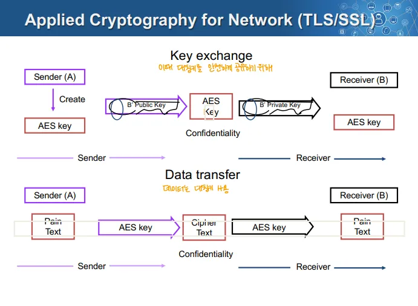

1. 키를 교환
	- 송신자가 AES(대칭키) 키를 생성 한 후 수신자의 공개 키로 암호화 해서 전송
	- 이를 수신자는 자신의 개인 키로 복호화 해 실제 키를 획득
	- 키를 안전하게 획득 가능
2. 데이터 전송
	- 데이터를 AES(대칭키) 키로 암호화 해 전송
	- 이를 받으면 획득한 AES(대칭키) 키로 복호화
→ 이게 위에서 말한 키는 비대칭 키 암호화로, 데이터는 대칭 키 암호화로 교환하는 것
***

# VPN(Virtual Private Network, 가상 사설망)

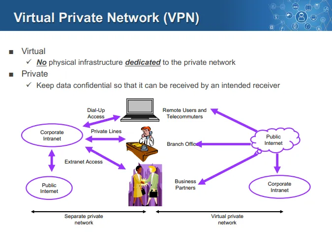

- 물리적 네트워크를 구축하지 않고 (기존 인터넷 망 위에) 가상의 네트워크를 만들어 사용 → Virtual
	- 전용 회선이 이상적, but  비용적인 이유로 VPN을 사용
- 데이터가 의도한 수신자에게만 전달되도록 기밀성 유지 → Private
	- VPN이 공공 인터넷 위에 개설되어도 데이터는 암호화 되어 의도되지 않은 수신자는 접근 불가

## VPN 기술

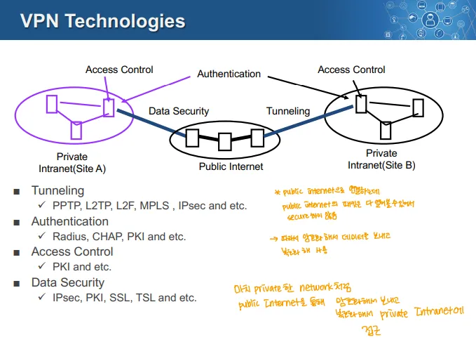

1. 터널링
	- 데이터를 안전하게 전송하기 위해 공공 인터넷 상에서 사설 네트워크를 만드는 과정.
	- 사용 프로토콜:
		- PPTP, L2TP, L2F, MPLS, IPsec
2. **Authentication (인증)**
	- 네트워크에 접근하는 사용자가 신뢰할 수 있는지를 인증.
	- 사용 기술:
		- Radius, CHAP, PKI
3. **Access Control (접근 제어):**
	- 네트워크 리소스에 대한 접근 권한을 설정.
	- 사용 기술:
		- PKI
4. **Data Security (데이터 보안):**
	- 데이터가 전송되는 동안 무결성과 기밀성을 보장.
	- 사용 기술:
		- IPsec, PKI, SSL, TSL
⇒ 공공 인터넷 위에 개설되므로 허점이 존재, 이를 막기 위해 암호화, 인증 프로토콜 등을 필수적으로 사욛
