> 참고: [MAC 가상머신 UTM 설치 방법](https://cocococo.tistory.com/entry/MAC-%EA%B0%80%EC%83%81%EB%A8%B8%EC%8B%A0-UTM-%EC%84%A4%EC%B9%98-%EB%B0%A9%EB%B2%95#google_vignette)

---

## 1. 사전 준비

두 가지 파일이 필요하다.

1. **UTM 프로그램** — [mac.getutm.app](https://mac.getutm.app) 에서 무료로 다운로드한다 (App Store 유료판 말고 여기서 받는다)
2. **Ubuntu ISO 파일** — M1/M2/M3 Mac은 반드시 **ARM 아키텍처** 버전으로 받는다

---

## 2. 가상머신 생성

### 새 가상머신 만들기
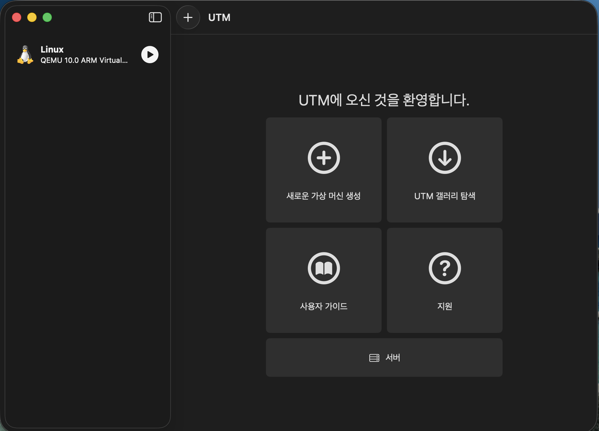
- UTM 실행 후 **새로운 가상머신 생성**을 클릭한다

### 가상화 방식 선택
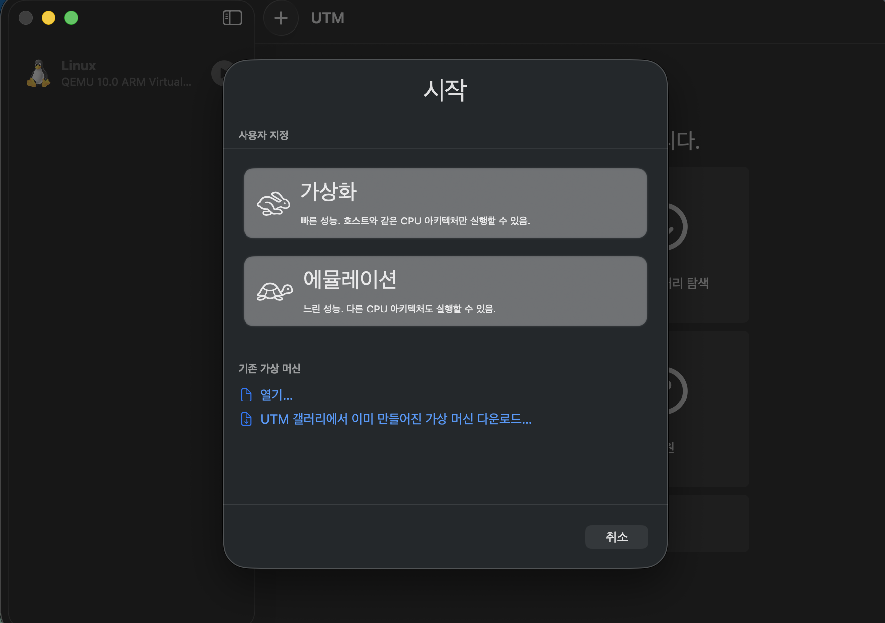
- **가상화(Virtualize)**를 선택한다 (에뮬레이션보다 훨씬 빠르다)

### OS 선택
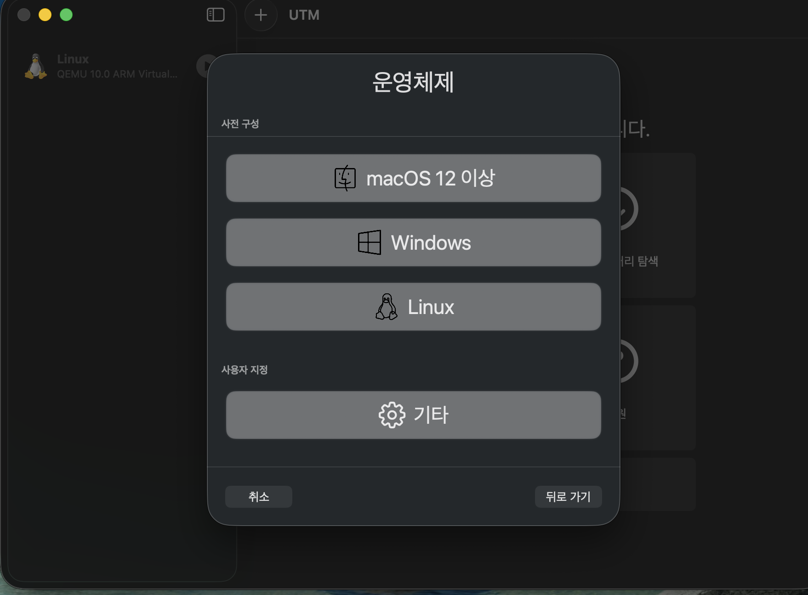
- **Linux**를 선택한다

### ISO 파일 연결
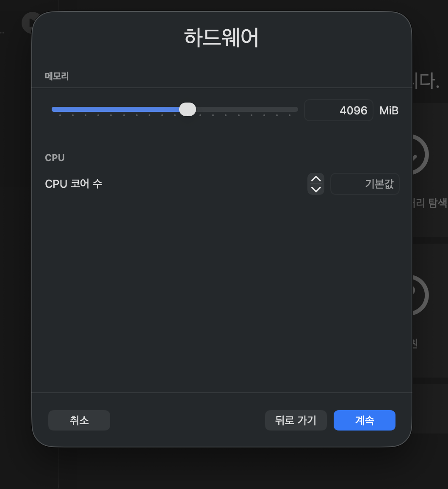
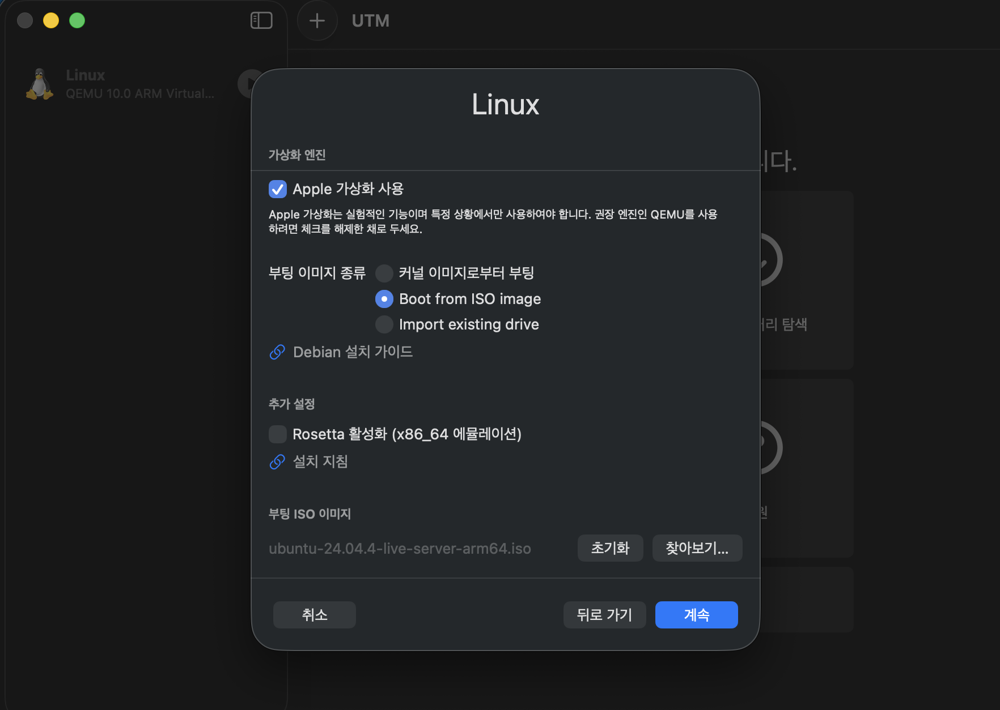
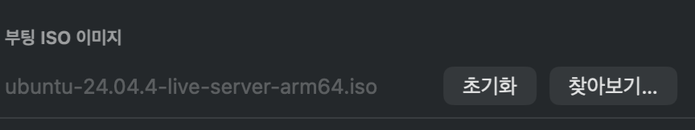
- 다운로드한 Ubuntu ARM ISO 파일을 선택한 후 Continue를 누른다

### 사양 설정
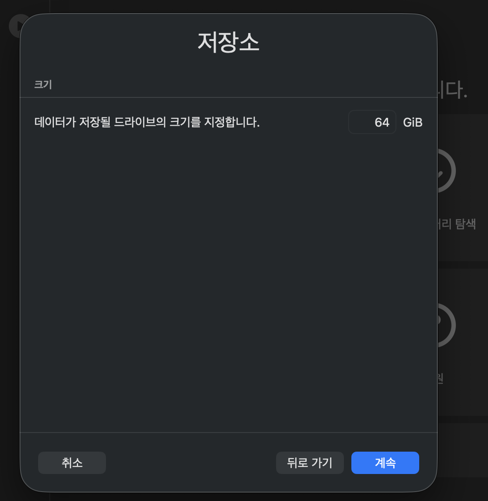
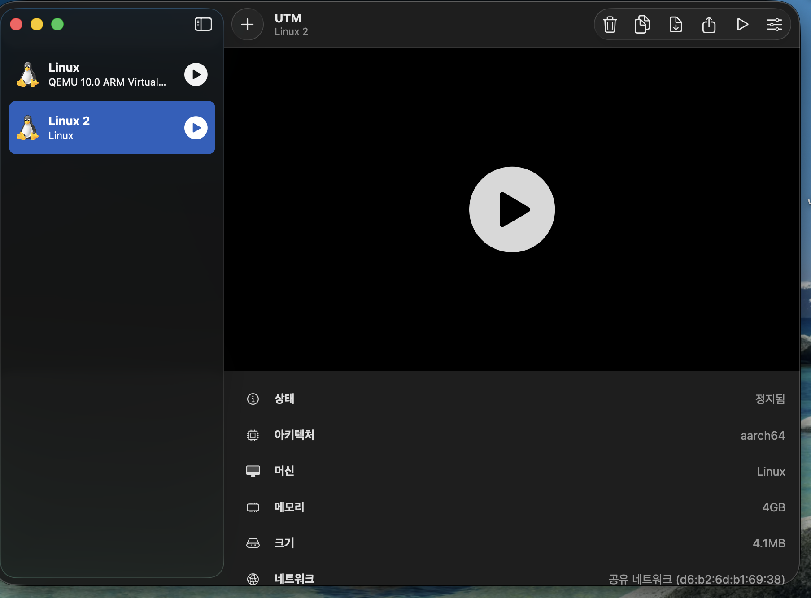
- **메모리**: 4GB 이상을 권장한다
- **CPU 코어**: 2개 이상을 권장한다

---

## 3. Ubuntu 설치

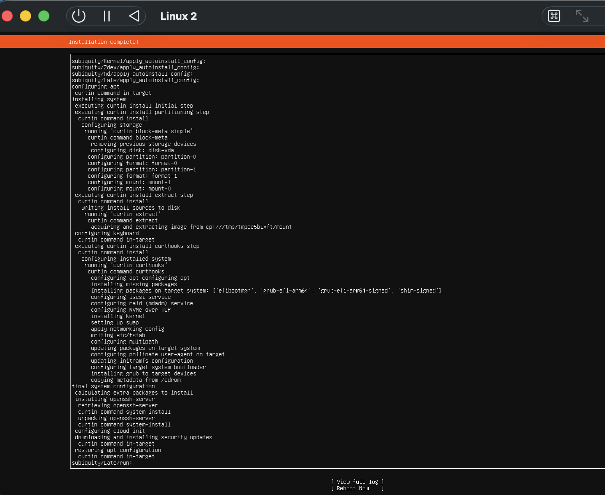

Play 버튼을 누르면 Ubuntu 설치 과정이 시작된다.

- `Install Ubuntu Server`를 선택한다
- 언어는 **English**를 선택한다
- 나머지는 기본값을 유지하며 `Done`을 반복 클릭한다
- 사용자 계정(ID/PW)을 생성한다
- 설치가 완료될 때까지 대기한다

---

## 4. 설치 완료 후 재부팅

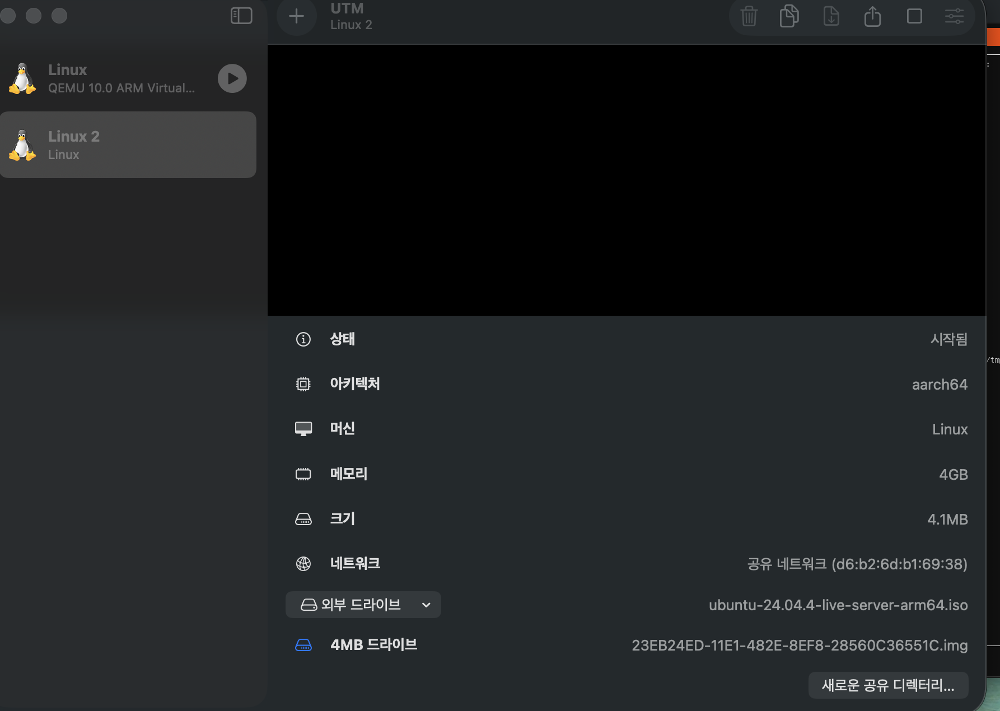
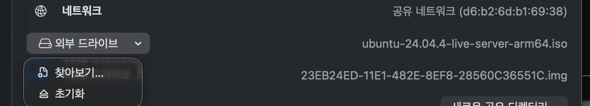

`reboot` 요청이 오면 바로 누르지 말고 다음 순서로 진행한다.

1. UTM에서 **일시정지**한다
2. **외부 드라이브(ISO)를 제거**한다 — 이걸 안 하면 설치가 무한 반복된다
3. 이후 재부팅하면 정상 작동한다

---

## 5. GUI 설치 (선택)

서버 버전으로 설치했다면 터미널에서 아래 명령어로 데스크탑 환경을 추가할 수 있다.

```bash
sudo apt update
sudo apt install ubuntu-desktop
```

설치 후 재부팅하면 그래픽 인터페이스를 사용할 수 있다.

---
