> 원본 슬라이드와 강의 녹취 설명을 바탕으로 정리한 노트입니다.
## 슬라이드 1

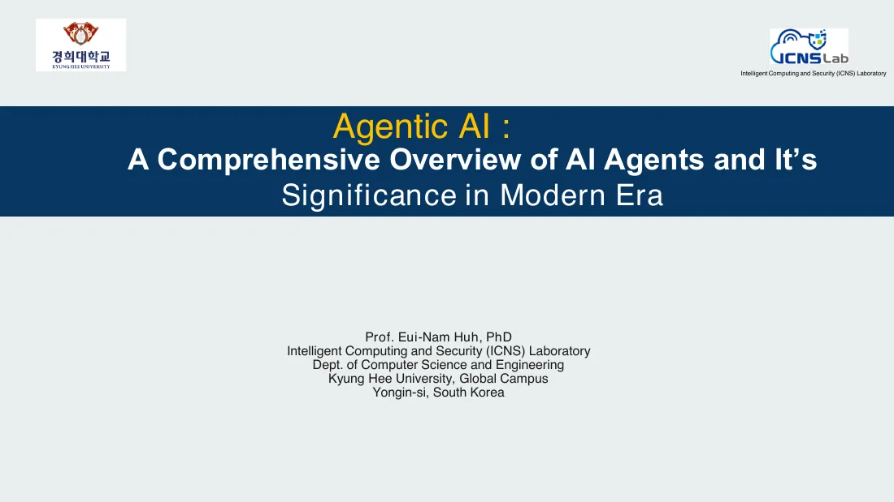

**직역**
> (좌상단 로고) 경희대학교 (KYUNG HEE UNIVERSITY)
> (우상단 로고) ICNS Lab — Intelligent Computing and Security (ICNS) Laboratory
>
> **에이전틱 AI (Agentic AI):**
> **AI 에이전트와 현대 시대에서의 그 중요성에 대한 종합적 개관 (A Comprehensive Overview of AI Agents and It's Significance in Modern Era)**
>
> Eui-Nam Huh 교수, PhD
> Intelligent Computing and Security (ICNS) Laboratory (지능 컴퓨팅 및 보안 연구실)
> Dept. of Computer Science and Engineering (컴퓨터공학과)
> Kyung Hee University, Global Campus (경희대학교 글로벌 캠퍼스)
> Yongin-si, South Korea (대한민국 용인시)

**설명**
- (도입 일화) 4학년 캡스톤 한 팀이 MS의 에이전트 프레임워크 + 코드 제너레이터(Codex)로 "AI Ops" 프로젝트를 2~3일 만에 완성했다. 클라우드 자원에 부하가 걸리면 자동 스케일, 마이그레이션, 에너지 절약까지 하고 대시보드도 그려준다. 에이전트끼리 통신하고, 페널티/리워드를 주고받으며 스코어가 업데이트된다.
- 교수 본인의 5년짜리 과제를 한 달 안에 다 개발해버려서 "백엔드 자리가 없어지겠다"는 불안감을 언급. 숙제에 AI를 써도 되지만 **과정(어떤 모델·데이터셋·추론·시각화를 쓰는지)을 정확히 알아야**한다고 강조.

## 슬라이드 2

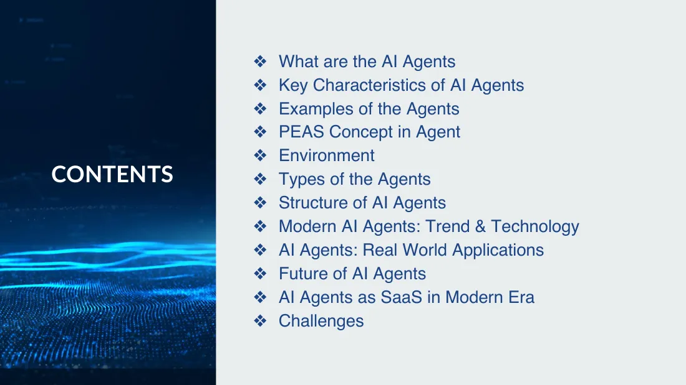

**직역**
> **목차 (CONTENTS)**
> - AI 에이전트란 무엇인가 (What are the AI Agents)
> - AI 에이전트의 핵심 특성 (Key Characteristics of AI Agents)
> - 에이전트의 예시 (Examples of the Agents)
> - 에이전트의 PEAS 개념 (PEAS Concept in Agent)
> - 환경 (Environment)
> - 에이전트의 종류 (Types of the Agents)
> - AI 에이전트의 구조 (Structure of AI Agents)
> - 현대 AI 에이전트: 트렌드 & 기술 (Modern AI Agents: Trend & Technology)
> - AI 에이전트: 실세계 응용 (AI Agents: Real World Applications)
> - AI 에이전트의 미래 (Future of AI Agents)
> - 현대 시대의 SaaS로서의 AI 에이전트 (AI Agents as SaaS in Modern Era)
> - 도전 과제 (Challenges)

## 슬라이드 3

**직역**
> **목차 (Contents)**— (자세한 항목 목록)
> - AI 에이전트 입문 (Introduction to AI Agents)
> - AI 에이전트의 평가 (Evaluation of AI Agents)
> - AI 에이전트의 특성 (Characteristics of AI Agents)
> - AI 에이전트의 종류 (Types of AI Agents)
> - 단순 반사 에이전트 (Simple Reflex Agents)
> - 모델 기반 반사 에이전트 (Model-Based Reflex Agents)
> - 목표 기반 에이전트 (Goal-Based Agents)
> - 효용 기반 에이전트 (Utility-Based Agents)
> - 학습 에이전트 (Learning Agents)
> - AI 에이전트 아키텍처 (AI Agent Architecture)
> - 현대 시대 AI 에이전트 (Modern Age AI Agents)
> - AI 에이전트의 범위 (Scope of AI Agents)
> - AI 에이전트의 응용 (Applications of AI Agents)
> - AI 에이전트의 도전 과제 (Challenges in AI Agents)
> - 기회와 미래 (Opportunities and Future)
> - 문제점과 한계 (Problems and Limitations)
> - AI 에이전트의 미래 (Future of AI Agents)
> - 결론 (Conclusion)
>
> (우측에 슬라이드 2와 동일한 12개 항목 목차가 병기되어 있음)

## 슬라이드 4

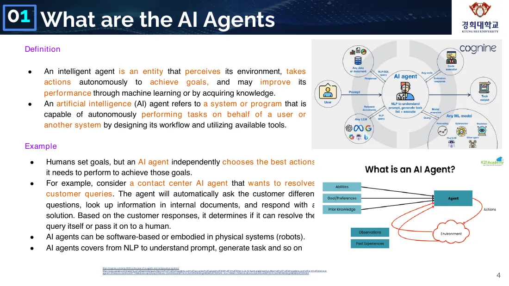

**직역**
> **01 AI 에이전트란 무엇인가 (What are the AI Agents)**
>
> **정의 (Definition)**
> - 지능형 에이전트(intelligent agent)란 자신의 환경을 지각(perceive)하고, 목표를 달성하기 위해 자율적으로(autonomously) 행동을 취하며, 머신러닝이나 지식 획득을 통해 자신의 성능을 향상시킬 수 있는 개체(entity)이다.
> - 인공지능(AI) 에이전트란, 자신의 워크플로를 설계하고 사용 가능한 도구(tools)를 활용함으로써, 사용자나 다른 시스템을 대신하여 자율적으로 작업을 수행할 수 있는 시스템 또는 프로그램을 가리킨다.
>
> **예시 (Example)**
> - 인간은 목표를 설정하지만, AI 에이전트는 그 목표를 달성하기 위해 자신이 수행해야 할 최선의 행동을 독립적으로 선택한다.
> - 예를 들어 고객 문의를 해결하려는 컨택 센터 AI 에이전트를 생각해보자. 이 에이전트는 자동으로 고객에게 여러 질문을 하고, 내부 문서에서 정보를 찾아보며, 해결책을 응답한다. 고객의 응답에 따라, 스스로 문의를 해결할 수 있는지 아니면 사람에게 넘길지를 판단한다.
> - AI 에이전트는 소프트웨어 기반일 수도 있고 물리적 시스템(로봇)에 체화(embodied)될 수도 있다.
> - AI 에이전트는 프롬프트를 이해하는 NLP에서부터 작업 생성 등까지 포괄한다.
>
> (출처 링크: cognine.com, google.com 이미지 검색)

**설명**
- (정의 강조) 잘못된 사용: 클라우드 자원을 "모니터링한다"는 모듈을 에이전트라 부르는 것은 틀리다. 그건 **수집(데이터 수집) 모듈**일 뿐이다.
- 올바른 정의: 환경(environment)을 관찰(observe)하고 거기에 **적절한 액션을 내려주는**놈이 에이전트다. 반복적인 루프 피드백으로 계속 수행한다. 수집만 하면 에이전트가 아니고, 수집한 것으로 환경에 액션을 가하면 에이전트다.
- (MIT 식 정의) 환경을 sense하고 autonomously 액션을 취해 목표(goal)를 달성·유지하는 시스템/프로그램. 머신러닝/지식(knowledge)을 통해 진화된 액션을 내림 = **AI Agent**.
- (에이전트 컴퓨팅) 에이전트 = **액션과 피드백이 있는 소프트웨어**(자신의 환경을 바꾸고 액션을 수행하는 방식). 그 중에서 **AI를 활용해 동작시키는 것**이 AI Agent다.
- 중요: **AI를 쓰는 것만 에이전트가 아니다.**기존에는 **룰 기반(rule-based)**으로도 에이전트를 구현했다. 예) V3 같은 백신은 뭐가 들어오면 검사(액션)하고 결과에 따라 조치(피드백)하는 **전통적 룰 기반 에이전트**다. 즉 룰 기반 에이전트와 학습형(AI) 에이전트는 구분된다.

## 슬라이드 5

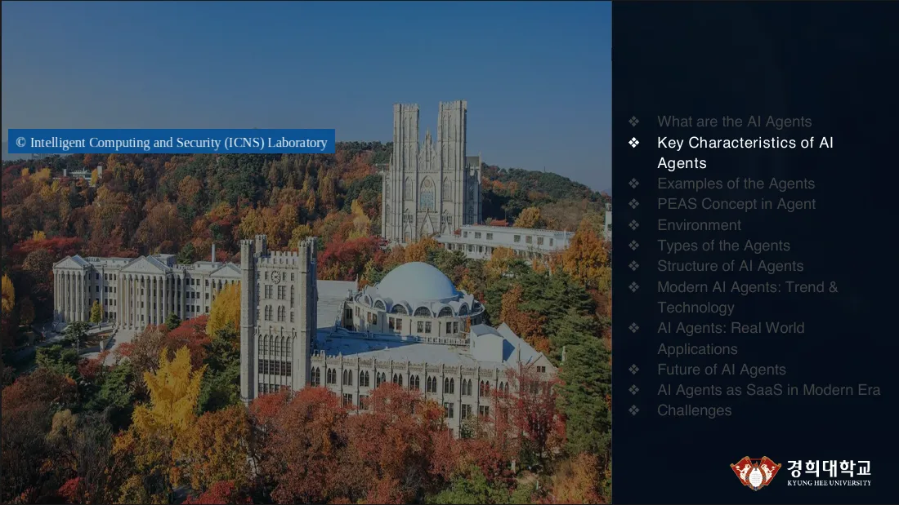

**직역**
> **목차 (Contents)**— (슬라이드 3과 동일한 상세 목차, 우측에 12개 항목 목차 병기)

## 슬라이드 6

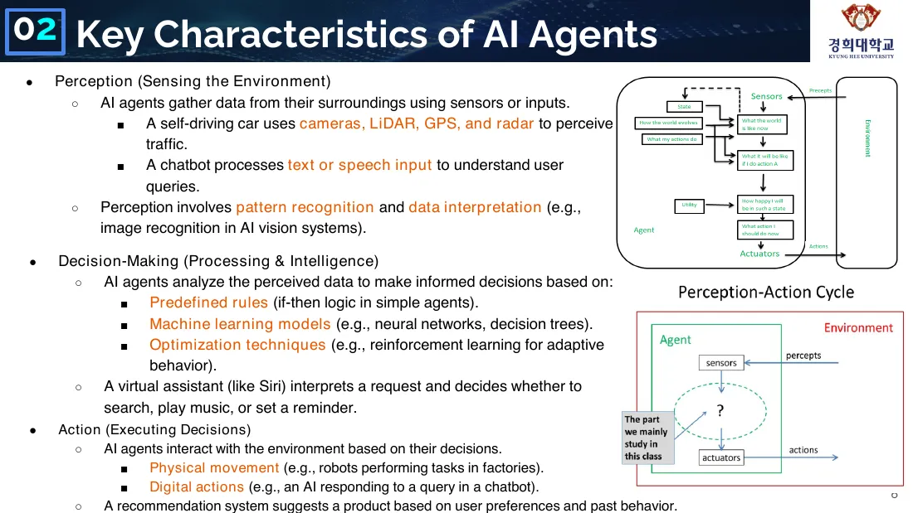

**직역**
> **02 AI 에이전트의 핵심 특성 (Key Characteristics of AI Agents)**
>
> - **지각 (Perception, 환경 감지/Sensing the Environment)**
> - AI 에이전트는 센서나 입력을 사용해 주변 환경에서 데이터를 수집한다.
> - 자율주행차는 카메라, LiDAR, GPS, 레이더를 사용해 교통 상황을 지각한다.
> - 챗봇은 텍스트나 음성 입력을 처리하여 사용자 질의를 이해한다.
> - 지각은 패턴 인식과 데이터 해석을 수반한다 (예: AI 비전 시스템의 이미지 인식).
>
> - **의사결정 (Decision-Making, 처리 & 지능/Processing & Intelligence)**
> - AI 에이전트는 지각한 데이터를 분석하여 다음에 기반한 정보화된 결정을 내린다:
> - 사전 정의된 규칙 (단순 에이전트의 if-then 로직).
> - 머신러닝 모델 (예: 신경망, 의사결정나무).
> - 최적화 기법 (예: 적응적 행동을 위한 강화학습).
> - 가상 비서(예: Siri)는 요청을 해석하고 검색할지, 음악을 재생할지, 알림을 설정할지를 결정한다.
>
> - **행동 (Action, 결정의 실행/Executing Decisions)**
> - AI 에이전트는 자신의 결정에 기반해 환경과 상호작용한다.
> - 물리적 움직임 (예: 공장에서 작업을 수행하는 로봇).
> - 디지털 행동 (예: 챗봇에서 질의에 응답하는 AI).
> - 추천 시스템은 사용자의 선호와 과거 행동에 기반해 제품을 제안한다.

**설명**
- 에이전트의 3대 핵심 특성: **Perception/Sensing(수집)**→ **Decision Making(룰 또는 학습으로 결정)**→ **Action(환경에 트리거/인터랙션)**. 디지털 액션뿐 아니라 물리적 액션(로봇 팔로 줍기, 자동차가 돌을 피해 핸들 꺾기 등)도 포함된다.

## 슬라이드 7

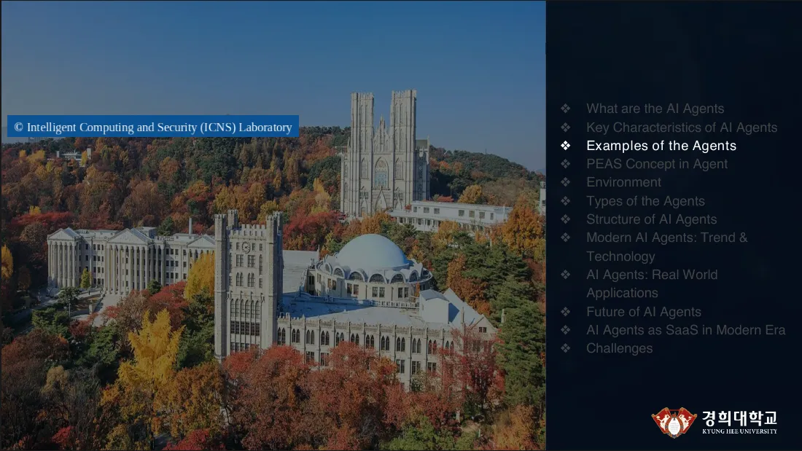

**직역**
> **목차 (Contents)**— (슬라이드 3과 동일한 상세 목차, 우측 12개 항목 병기)

## 슬라이드 8

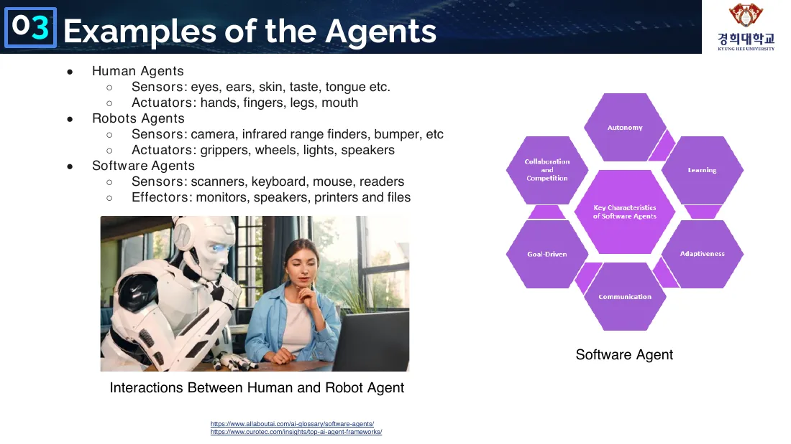

**직역**
> **03 에이전트의 예시 (Examples of the Agents)**
>
> - **인간 에이전트 (Human Agents)**
> - 센서(Sensors): 눈, 귀, 피부, 미각, 혀 등
> - 액추에이터(Actuators): 손, 손가락, 다리, 입
> - **로봇 에이전트 (Robots Agents)**
> - 센서(Sensors): 카메라, 적외선 거리 측정기, 범퍼 등
> - 액추에이터(Actuators): 그리퍼, 바퀴, 조명, 스피커
> - **소프트웨어 에이전트 (Software Agents)**
> - 센서(Sensors): 스캐너, 키보드, 마우스, 리더기
> - 이펙터(Effectors): 모니터, 스피커, 프린터, 파일
>
> (그림 라벨) 인간과 로봇 에이전트 간의 상호작용 (Interactions Between Human and Robot Agent) / 소프트웨어 에이전트 (Software Agent)

**설명**
- 에이전트 종류는 크게 Human Agent, Robot Agent, Software Agent로 나뉜다. 에이전트가 뜨는 이유는 로봇(피지컬)이다. 소프트웨어 에이전트는 모니터/스피커/프린터 등을 effector로 삼아 액션한다.

## 슬라이드 9

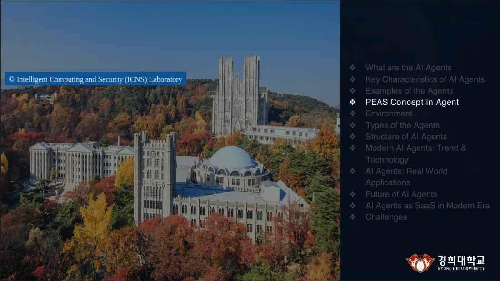

**직역**
> **목차 (Contents)**— (슬라이드 3과 동일한 상세 목차, 우측 12개 항목 병기)

## 슬라이드 10

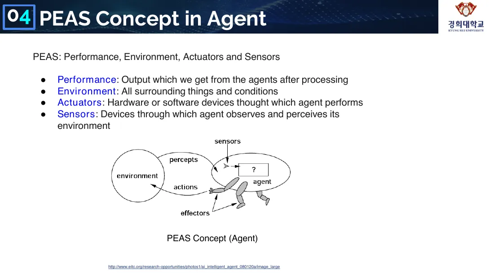

**직역**
> **04 에이전트의 PEAS 개념 (PEAS Concept in Agent)**
> PEAS: 성능(Performance), 환경(Environment), 액추에이터(Actuators), 센서(Sensors)
>
> - **Performance(성능):**처리 후 에이전트로부터 우리가 얻는 출력
> - **Environment(환경):**모든 주변 사물과 조건
> - **Actuators(액추에이터):**에이전트가 그것을 통해 수행하는 하드웨어 또는 소프트웨어 장치
> - **Sensors(센서):**에이전트가 그것을 통해 환경을 관찰하고 지각하는 장치
>
> (다이어그램 라벨) environment(환경) — percepts(지각) → sensors(센서) → agent[ ? ] → effectors(이펙터) → actions(행동) → 다시 environment로. 캡션: PEAS Concept (Agent)

**설명**
- **PEAS**4가지(Performance, Environment, Actuator, Sensor)는 에이전트를 평가·분류하는 핵심 프레임워크. "꼭 기억하세요"라고 강조.

## 슬라이드 11

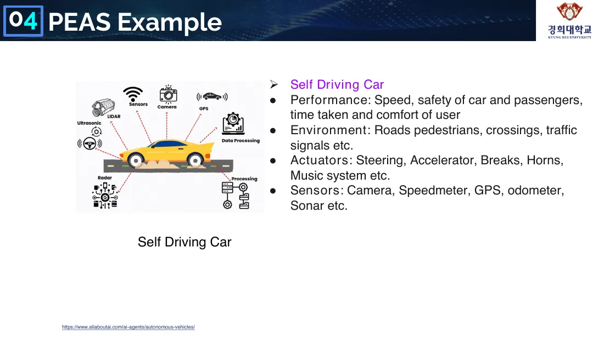

**직역**
> **04 PEAS 예시 (PEAS Example)**
>
> **자율주행차 (Self Driving Car)**
> - **Performance(성능):**속도, 차량과 탑승자의 안전, 소요 시간, 사용자의 편안함(comfort)
> - **Environment(환경):**도로, 보행자, 횡단보도, 교통 신호 등
> - **Actuators(액추에이터):**스티어링(핸들), 액셀러레이터, 브레이크, 경적, 음악 시스템 등
> - **Sensors(센서):**카메라, 속도계(Speedmeter), GPS, 주행거리계(odometer), 소나(Sonar) 등
>
> (그림 라벨) 자율주행차 (Self Driving Car)

**설명**
- 자율주행차 예시에서 **Environment가 가장 중요**하다고 강조. (액추에이터 예: 전기차가 일부러 가짜 엔진음을 내는 일화 언급)

## 슬라이드 12

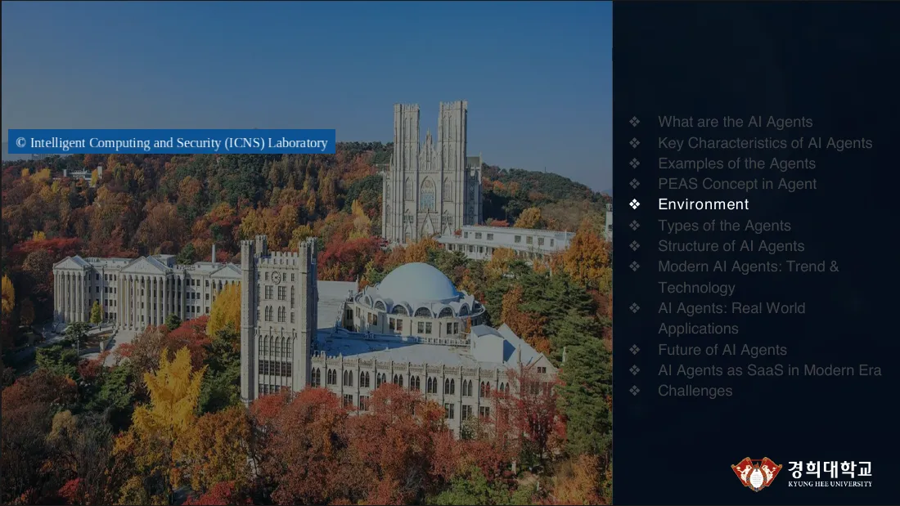

**직역**
> **목차 (Contents)**— (슬라이드 3과 동일한 상세 목차, 우측 12개 항목 병기)

## 슬라이드 13

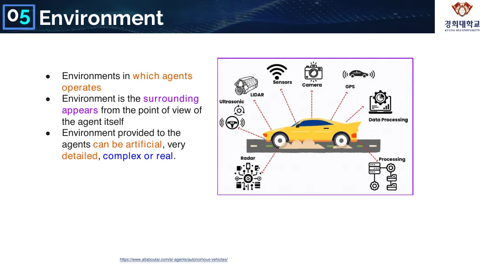

**직역**
> **05 환경 (Environment)**
>
> - 에이전트가 작동하는 환경들
> - 환경이란 에이전트 자신의 관점에서 나타나는 주변(surrounding)이다
> - 에이전트에게 제공되는 환경은 인공적이거나, 매우 상세하거나, 복잡하거나, 실제(real)일 수 있다

## 슬라이드 14

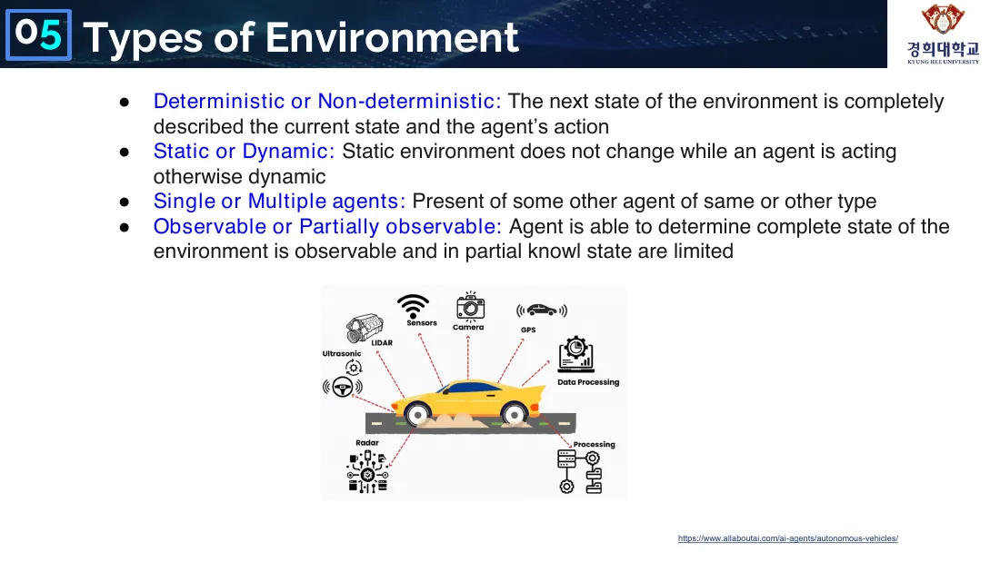

**직역**
> **05 환경의 종류 (Types of Environment)**
>
> - **결정론적 또는 비결정론적 (Deterministic or Non-deterministic):**환경의 다음 상태가 현재 상태와 에이전트의 행동으로 완전히 기술되는지 여부
> - **정적 또는 동적 (Static or Dynamic):**정적 환경은 에이전트가 행동하는 동안 변하지 않으며, 그렇지 않으면 동적이다
> - **단일 또는 다중 에이전트 (Single or Multiple agents):**같은 유형 또는 다른 유형의 다른 에이전트가 존재하는지 여부
> - **관찰 가능 또는 부분 관찰 가능 (Observable or Partially observable):**에이전트가 환경의 완전한 상태를 판단할 수 있으면 관찰 가능(observable), 지식이 부분적이면 상태가 제한적이다

**설명**
- 환경에 따라 시스템 작동 메커니즘이 달라지므로, 가장 먼저 어떤 환경인지 결정해야 한다.
- 컴퓨터 분야 예시(클라우드 장애 조치 에이전트): 모니터링(수집) 중에 노드가 새로 생길 수 있으므로 → **Partially Observable + Dynamic**(deterministic 아님)으로 판단해야 한다.

## 슬라이드 15

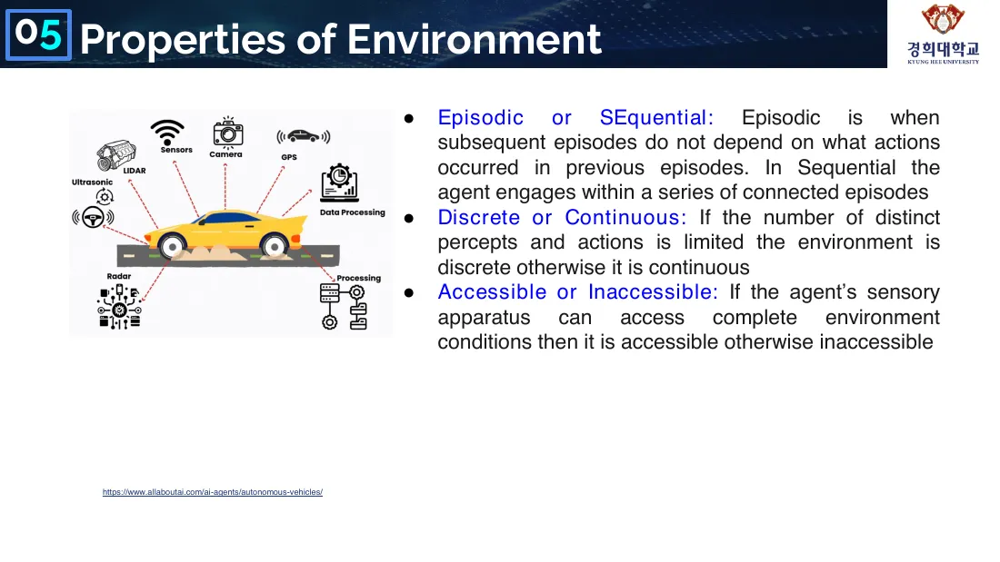

**직역**
> **05 환경의 속성 (Properties of Environment)**
>
> - **에피소드형 또는 순차형 (Episodic or Sequential):**이후 에피소드가 이전 에피소드에서 일어난 행동에 의존하지 않으면 에피소드형(Episodic)이다. 순차형(Sequential)에서는 에이전트가 연결된 일련의 에피소드 안에서 동작한다
> - **이산 또는 연속 (Discrete or Continuous):**구별되는 지각(percepts)과 행동의 수가 제한적이면 환경은 이산(discrete)이고, 그렇지 않으면 연속(continuous)이다
> - **접근 가능 또는 접근 불가 (Accessible or Inaccessible):**에이전트의 감각 장치가 완전한 환경 조건에 접근할 수 있으면 접근 가능(accessible)이고, 그렇지 않으면 접근 불가(inaccessible)이다

**설명**
- 환경 분류 쌍들(Deterministic/Stochastic, Static/Dynamic, Single/Multi, Fully/Partially Observable, Episodic/Sequential, Discrete/Continuous)을 가장 먼저 판단해야 한다고 강조.

## 슬라이드 16

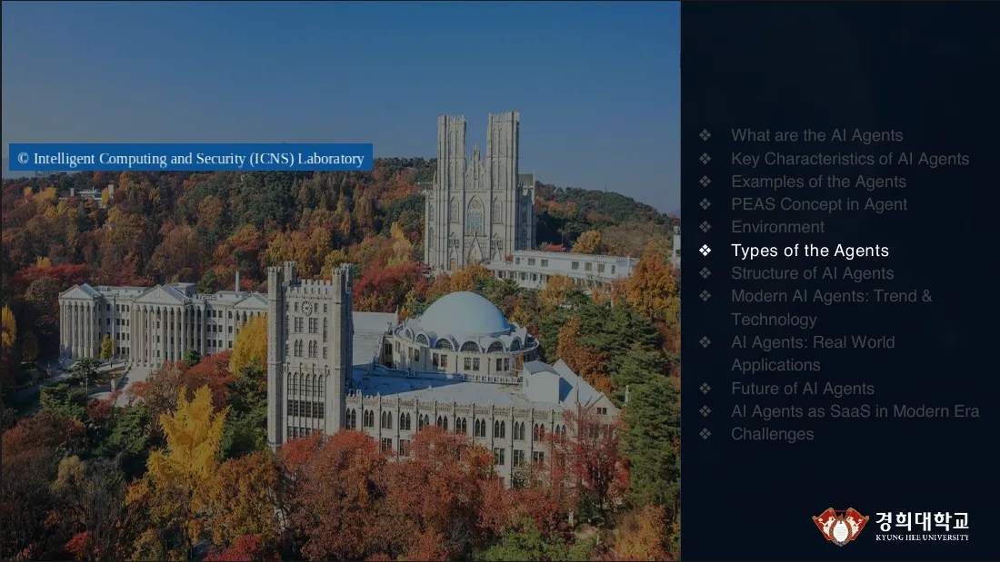

**직역**
> **목차 (Contents)**— (슬라이드 3과 동일한 상세 목차, 우측 12개 항목 병기)

## 슬라이드 17

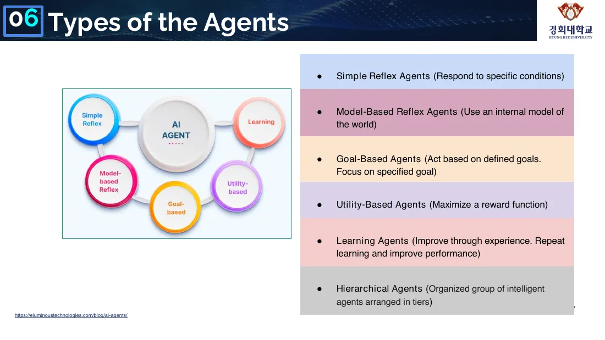

**직역**
> **06 에이전트의 종류 (Types of the Agents)**
>
> - **단순 반사 에이전트 (Simple Reflex Agents)**— 특정 조건에 반응한다 (Respond to specific conditions)
> - **모델 기반 반사 에이전트 (Model-Based Reflex Agents)**— 세계의 내부 모델을 사용한다 (Use an internal model of the world)
> - **목표 기반 에이전트 (Goal-Based Agents)**— 정의된 목표에 기반해 행동한다. 명시된 목표에 집중한다 (Act based on defined goals. Focus on specified goal)
> - **효용 기반 에이전트 (Utility-Based Agents)**— 보상 함수를 최대화한다 (Maximize a reward function)
> - **학습 에이전트 (Learning Agents)**— 경험을 통해 개선한다. 학습을 반복하고 성능을 향상시킨다 (Improve through experience)
> - **계층적 에이전트 (Hierarchical Agents)**— 계층(tiers)으로 배치된 지능형 에이전트의 조직화된 그룹 (Organized group of intelligent agents arranged in tiers)

**설명**
- 에이전트 종류는 6가지. 강의에서는 Simple Reflex와 Model-based Reflex를 자세히 다루고, Goal-based, Utility-based, Learning, Logical(계층적) 등은 이름 위주로 언급 후 다음 시간으로 넘김.

## 슬라이드 18

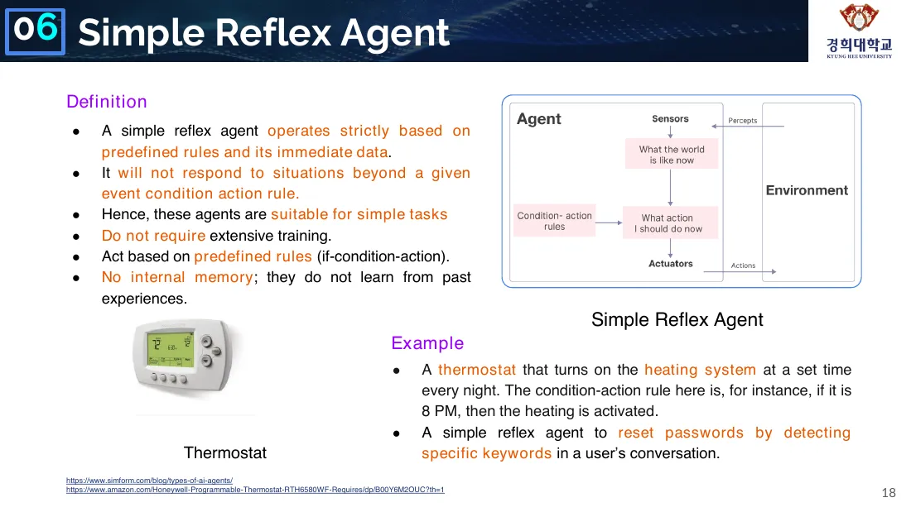

**직역**
> **06 단순 반사 에이전트 (Simple Reflex Agent)**
>
> **정의 (Definition)**
> - 단순 반사 에이전트는 엄격히 사전 정의된 규칙과 즉각적인 데이터에만 기반해 작동한다.
> - 주어진 "사건-조건-행동 규칙(event condition action rule)"을 넘어서는 상황에는 반응하지 않는다.
> - 따라서 이 에이전트들은 단순한 작업에 적합하다.
> - 광범위한 훈련을 필요로 하지 않는다.
> - 사전 정의된 규칙(if-condition-action)에 기반해 행동한다.
> - 내부 메모리가 없으며, 과거 경험에서 학습하지 않는다.
>
> (그림 라벨) 단순 반사 에이전트 (Simple Reflex Agent) / 온도조절기(Thermostat)
>
> **예시 (Example)**
> - 매일 밤 정해진 시간에 난방 시스템을 켜는 온도조절기. 여기서 조건-행동 규칙은 예를 들어 "오후 8시이면 난방을 작동시킨다"이다.
> - 사용자 대화에서 특정 키워드를 감지하여 비밀번호를 재설정하는 단순 반사 에이전트.

**설명**
- 환경 센싱 후 "이런 값이면 이렇게"라는 미리 정의한 룰로만 동작. 예: CPU 70%면 마이그레이션, 90%면 복제 / 온도계가 일정 이상이면 히팅 ON.

## 슬라이드 19

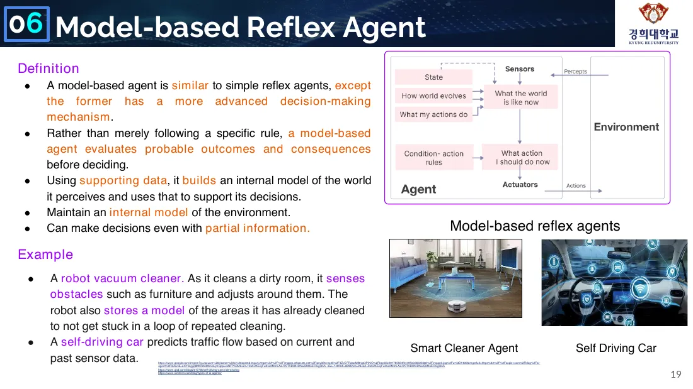

**직역**
> **06 모델 기반 반사 에이전트 (Model-based Reflex Agent)**
>
> **정의 (Definition)**
> - 모델 기반 에이전트는 단순 반사 에이전트와 유사하지만, 전자가 더 발전된 의사결정 메커니즘을 가진다는 점이 다르다.
> - 단순히 특정 규칙을 따르는 대신, 모델 기반 에이전트는 결정하기 전에 일어날 법한 결과와 영향을 평가한다.
> - 보조 데이터를 사용해, 자신이 지각하는 세계의 내부 모델(internal model of the world)을 구축하고 이를 의사결정에 활용한다.
> - 환경의 내부 모델을 유지한다.
> - 부분적 정보로도 결정을 내릴 수 있다.
>
> (그림 라벨) 모델 기반 반사 에이전트 (Model-based reflex agents) / 스마트 청소기 에이전트(Smart Cleaner Agent) / 자율주행차(Self Driving Car)
>
> **예시 (Example)**
> - 로봇 청소기. 더러운 방을 청소하면서 가구 같은 장애물을 감지하고 그 주위를 조정해 움직인다. 또한 이미 청소한 구역의 모델을 저장해 반복 청소의 루프에 빠지지 않는다.
> - 자율주행차는 현재와 과거 센서 데이터에 기반해 교통 흐름을 예측한다.

**설명**
- 단순 정보뿐 아니라 "현재 상태가 무엇이고, 과거에 어떻게 진화했는지(world model)"를 종합. 조건-액션 룰은 같지만 내부 상태 추적 능력이 추가된다. 예: 로봇 청소기가 이미 청소한 구역을 기억하며 장애물 회피.

## 슬라이드 20

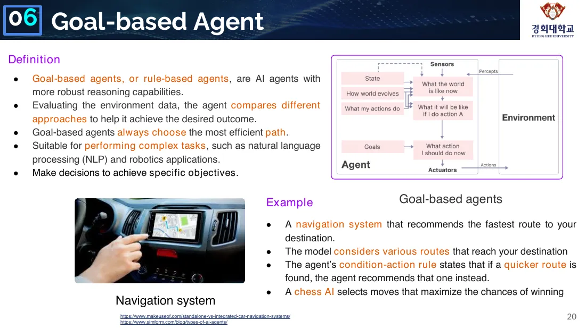

**직역**
> **06 목표 기반 에이전트 (Goal-based Agent)**
>
> **정의 (Definition)**
> - 목표 기반 에이전트, 또는 규칙 기반 에이전트(rule-based agents)는 더 강건한 추론 능력을 가진 AI 에이전트이다.
> - 환경 데이터를 평가하며, 에이전트는 원하는 결과를 달성하는 데 도움이 되도록 서로 다른 접근법들을 비교한다.
> - 목표 기반 에이전트는 항상 가장 효율적인 경로를 선택한다.
> - 자연어 처리(NLP)와 로보틱스 응용 같은 복잡한 작업 수행에 적합하다.
> - 특정 목표를 달성하기 위한 결정을 내린다.
>
> (그림 라벨) 목표 기반 에이전트 (Goal-based agents) / 내비게이션 시스템(Navigation system)
>
> **예시 (Example)**
> - 목적지까지 가장 빠른 경로를 추천하는 내비게이션 시스템.
> - 이 모델은 목적지에 도달하는 다양한 경로를 고려한다.
> - 에이전트의 조건-행동 규칙은 "더 빠른 경로가 발견되면 에이전트가 그것을 대신 추천한다"이다.
> - 체스 AI는 승리 확률을 최대화하는 수를 선택한다.

## 슬라이드 21

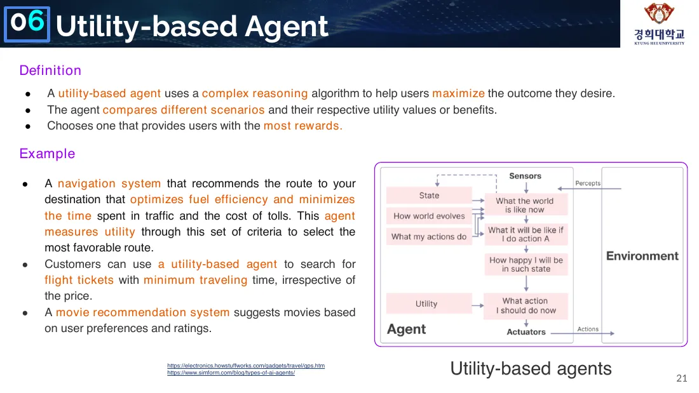

**직역**
> **06 효용 기반 에이전트 (Utility-based Agent)**
>
> **정의 (Definition)**
> - 효용 기반 에이전트는 복잡한 추론 알고리즘을 사용하여 사용자가 원하는 결과를 최대화하도록 돕는다.
> - 에이전트는 서로 다른 시나리오와 각각의 효용 값(utility values) 또는 이익을 비교한다.
> - 사용자에게 가장 많은 보상을 제공하는 것을 선택한다.
>
> (그림 라벨) 효용 기반 에이전트 (Utility-based agents)
>
> **예시 (Example)**
> - 연비를 최적화하고 교통 정체 시간과 통행료 비용을 최소화하는 경로를 추천하는 내비게이션 시스템. 이 에이전트는 이러한 기준 집합을 통해 효용을 측정하여 가장 유리한 경로를 선택한다.
> - 고객은 가격에 상관없이 최소 이동 시간의 항공권을 검색하는 데 효용 기반 에이전트를 사용할 수 있다.
> - 영화 추천 시스템은 사용자 선호와 평점에 기반해 영화를 제안한다.

## 슬라이드 22

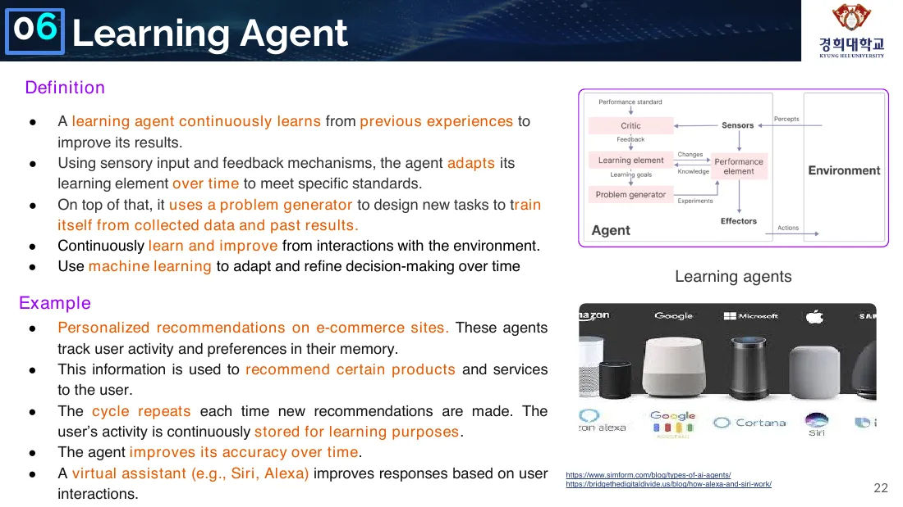

**직역**
> **06 학습 에이전트 (Learning Agent)**
>
> **정의 (Definition)**
> - 학습 에이전트는 이전 경험으로부터 지속적으로 학습하여 결과를 개선한다.
> - 감각 입력과 피드백 메커니즘을 사용하여, 에이전트는 특정 기준을 충족하도록 시간에 걸쳐 학습 요소(learning element)를 적응시킨다.
> - 그 위에, 수집된 데이터와 과거 결과로부터 스스로를 훈련하기 위해 새로운 작업을 설계하는 문제 생성기(problem generator)를 사용한다.
> - 환경과의 상호작용으로부터 지속적으로 학습하고 개선한다.
> - 머신러닝을 사용하여 시간에 걸쳐 의사결정을 적응시키고 정제한다.
>
> (그림 라벨) 학습 에이전트 (Learning agents)
>
> **예시 (Example)**
> - 이커머스 사이트의 개인화 추천. 이 에이전트들은 사용자 활동과 선호를 메모리에 추적한다.
> - 이 정보는 특정 제품과 서비스를 사용자에게 추천하는 데 사용된다.
> - 새로운 추천이 이루어질 때마다 사이클이 반복된다. 사용자 활동은 학습 목적으로 지속적으로 저장된다.
> - 에이전트는 시간에 걸쳐 정확도를 개선한다.
> - 가상 비서(예: Siri, Alexa)는 사용자 상호작용에 기반해 응답을 개선한다.

## 슬라이드 23

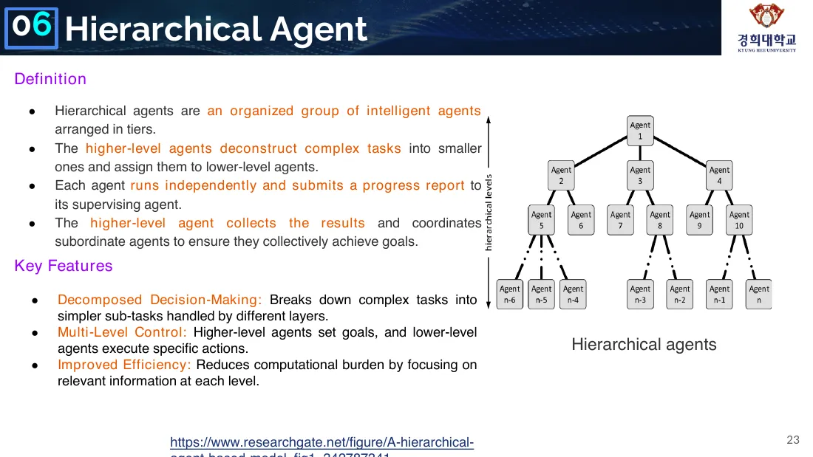

**직역**
> **06 계층적 에이전트 (Hierarchical Agent)**
>
> **정의 (Definition)**
> - 계층적 에이전트는 계층(tiers)으로 배치된 지능형 에이전트의 조직화된 그룹이다.
> - 상위 수준 에이전트(higher-level agents)는 복잡한 작업을 더 작은 작업으로 분해하여 하위 수준 에이전트(lower-level agents)에게 할당한다.
> - 각 에이전트는 독립적으로 실행되며 자신을 감독하는 에이전트에게 진행 보고서를 제출한다.
> - 상위 수준 에이전트는 결과를 수집하고 하위 에이전트들을 조정하여 그들이 집합적으로 목표를 달성하도록 보장한다.
>
> **핵심 기능 (Key Features)**
> - **분해된 의사결정(Decomposed Decision-Making):**복잡한 작업을 여러 계층이 처리하는 더 단순한 하위 작업으로 분해한다.
> - **다단계 제어(Multi-Level Control):**상위 수준 에이전트는 목표를 설정하고, 하위 수준 에이전트는 구체적 행동을 실행한다.
> - **향상된 효율성(Improved Efficiency):**각 수준에서 관련 정보에 집중함으로써 계산 부담을 줄인다.
>
> (그림 라벨) 계층적 에이전트 (Hierarchical agents)

## 슬라이드 24

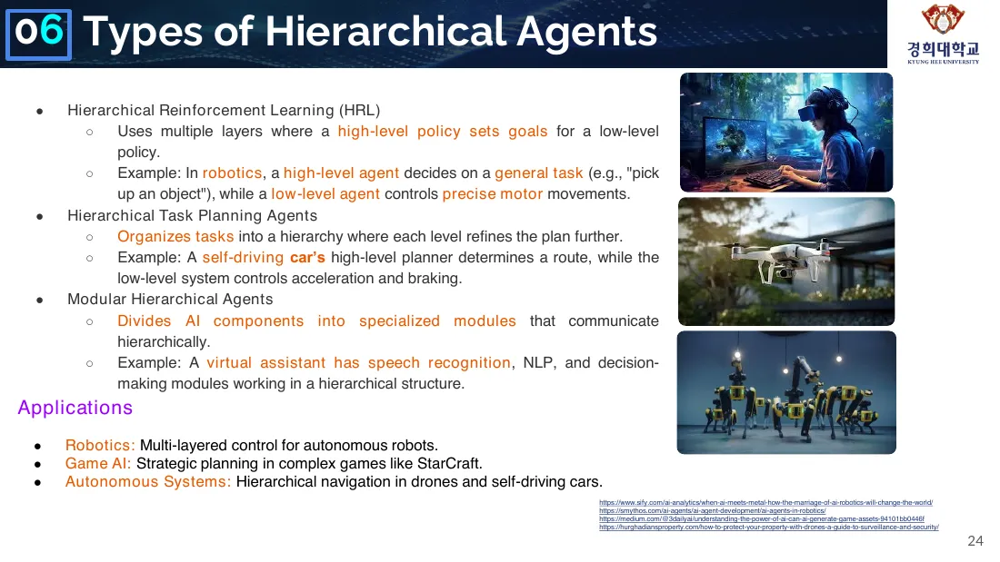

**직역**
> **06 계층적 에이전트의 종류 (Types of Hierarchical Agents)**
>
> - **계층적 강화학습 (Hierarchical Reinforcement Learning, HRL)**
> - 상위 수준 정책(high-level policy)이 하위 수준 정책(low-level policy)을 위한 목표를 설정하는 여러 계층을 사용한다.
> - 예시: 로보틱스에서 상위 수준 에이전트가 일반적 작업(예: "물체를 집어 들기")을 결정하고, 하위 수준 에이전트가 정밀한 모터 움직임을 제어한다.
> - **계층적 작업 계획 에이전트 (Hierarchical Task Planning Agents)**
> - 각 수준이 계획을 더 정교화하는 계층 구조로 작업을 조직한다.
> - 예시: 자율주행차의 상위 수준 계획자(planner)가 경로를 결정하고, 하위 수준 시스템이 가속과 제동을 제어한다.
> - **모듈형 계층적 에이전트 (Modular Hierarchical Agents)**
> - AI 구성요소를 계층적으로 통신하는 전문화된 모듈로 나눈다.
> - 예시: 가상 비서는 음성 인식, NLP, 의사결정 모듈이 계층 구조로 작동한다.
>
> **응용 (Applications)**
> - **로보틱스:**자율 로봇을 위한 다층 제어.
> - **게임 AI:**StarCraft 같은 복잡한 게임에서의 전략적 계획.
> - **자율 시스템:**드론과 자율주행차에서의 계층적 내비게이션.

## 슬라이드 25

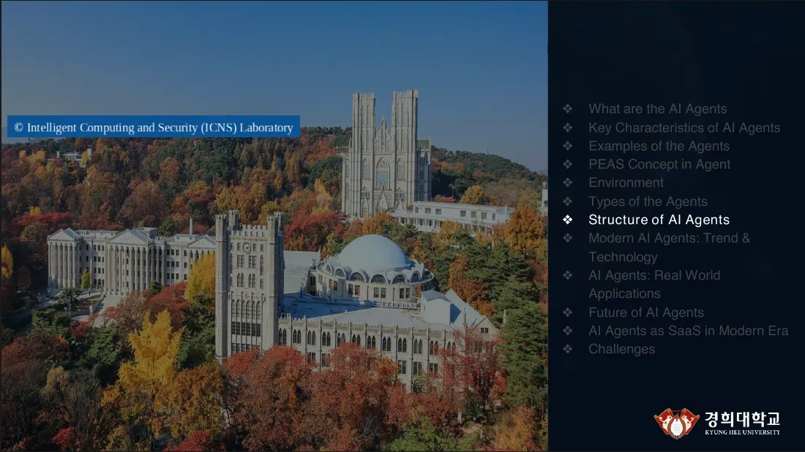

**직역**
> **목차 (Contents)**— (슬라이드 3과 동일한 상세 목차, 우측 12개 항목 병기)

## 슬라이드 26

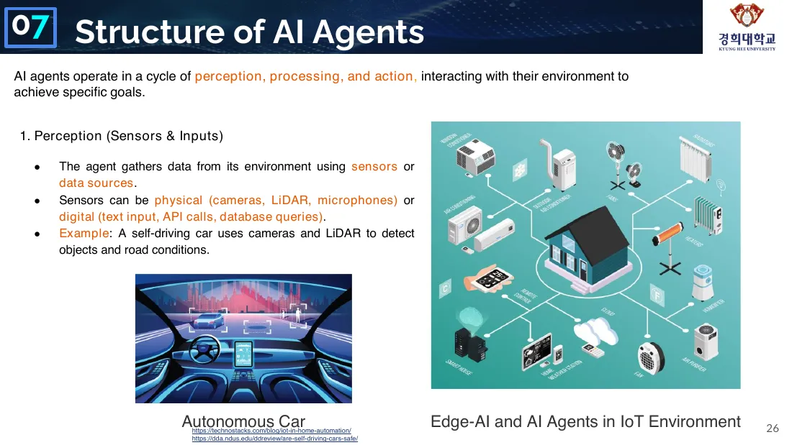

**직역**
> **07 AI 에이전트의 구조 (Structure of AI Agents)**
> AI 에이전트는 지각(perception), 처리(processing), 행동(action)의 사이클로 작동하며, 특정 목표를 달성하기 위해 환경과 상호작용한다.
>
> **1. 지각 (Perception, 센서 & 입력)**
> - 에이전트는 센서나 데이터 소스를 사용하여 환경에서 데이터를 수집한다.
> - 센서는 물리적(카메라, LiDAR, 마이크)이거나 디지털(텍스트 입력, API 호출, 데이터베이스 질의)일 수 있다.
> - 예시: 자율주행차는 카메라와 LiDAR를 사용하여 물체와 도로 상태를 감지한다.
>
> (그림 라벨) 자율주행차 (Autonomous Car) / IoT 환경에서의 엣지-AI와 AI 에이전트 (Edge-AI and AI Agents in IoT Environment)

## 슬라이드 27

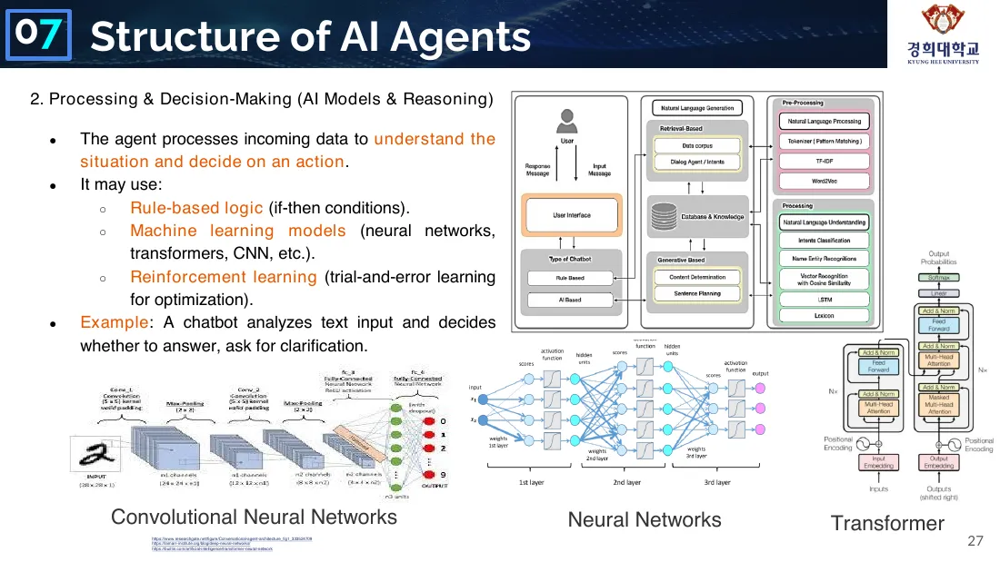

**직역**
> **07 AI 에이전트의 구조 (Structure of AI Agents)**
>
> **2. 처리 & 의사결정 (Processing & Decision-Making, AI 모델 & 추론)**
> - 에이전트는 들어오는 데이터를 처리하여 상황을 이해하고 행동을 결정한다.
> - 다음을 사용할 수 있다:
> - 규칙 기반 로직 (if-then 조건).
> - 머신러닝 모델 (신경망, 트랜스포머, CNN 등).
> - 강화학습 (최적화를 위한 시행착오 학습).
> - 예시: 챗봇은 텍스트 입력을 분석하여 답할지, 명확화를 요청할지를 결정한다.
>
> (그림 라벨) 합성곱 신경망 (Convolutional Neural Networks) / 신경망 (Neural Networks) / 트랜스포머 (Transformer)

## 슬라이드 28

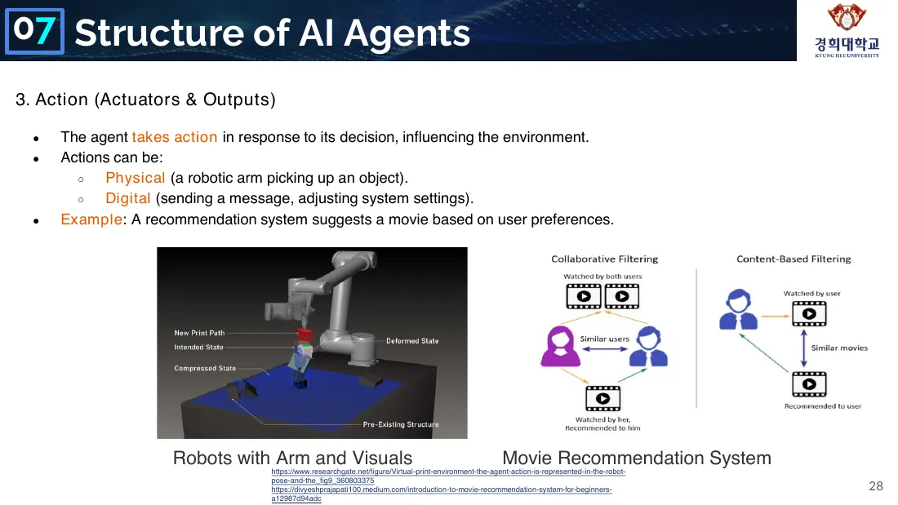

**직역**
> **07 AI 에이전트의 구조 (Structure of AI Agents)**
>
> **3. 행동 (Action, 액추에이터 & 출력)**
> - 에이전트는 자신의 결정에 응답하여 행동을 취하고, 환경에 영향을 미친다.
> - 행동은 다음일 수 있다:
> - 물리적 (로봇 팔이 물체를 집어 든다).
> - 디지털 (메시지 전송, 시스템 설정 조정).
> - 예시: 추천 시스템은 사용자 선호에 기반해 영화를 제안한다.
>
> (그림 라벨) 팔과 시각을 가진 로봇 (Robots with Arm and Visuals) / 영화 추천 시스템 (Movie Recommendation System)

## 슬라이드 29

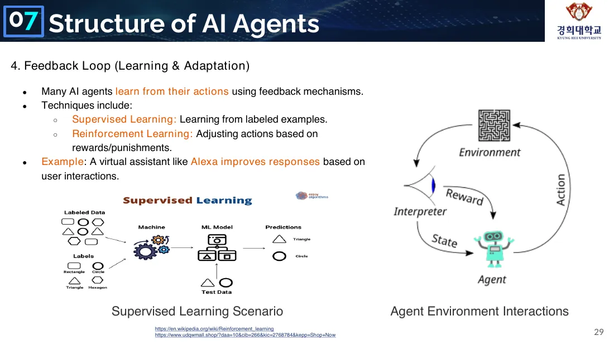

**직역**
> **07 AI 에이전트의 구조 (Structure of AI Agents)**
>
> **4. 피드백 루프 (Feedback Loop, 학습 & 적응)**
> - 많은 AI 에이전트는 피드백 메커니즘을 사용하여 자신의 행동으로부터 학습한다.
> - 기법에는 다음이 포함된다:
> - 지도 학습(Supervised Learning): 레이블이 있는 예시로부터 학습.
> - 강화 학습(Reinforcement Learning): 보상/처벌에 기반해 행동을 조정.
> - 예시: Alexa 같은 가상 비서는 사용자 상호작용에 기반해 응답을 개선한다.
>
> (그림 라벨) 지도 학습 시나리오 (Supervised Learning Scenario) — Labeled Data(레이블 데이터), Machine(머신), ML Model, Predictions(예측), Labels(레이블), Test Data(테스트 데이터) / 에이전트-환경 상호작용 (Agent Environment Interactions) — Environment(환경) → Reward(보상)/State(상태) → Interpreter(해석기) → Agent(에이전트) → Action(행동) → 다시 Environment로

## 슬라이드 30

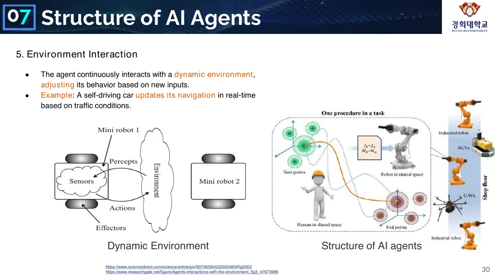

**직역**
> **07 AI 에이전트의 구조 (Structure of AI Agents)**
>
> **5. 환경 상호작용 (Environment Interaction)**
> - 에이전트는 동적 환경과 지속적으로 상호작용하며, 새로운 입력에 기반해 자신의 행동을 조정한다.
> - 예시: 자율주행차는 교통 상황에 기반해 실시간으로 내비게이션을 갱신한다.
>
> (그림 라벨) 동적 환경 (Dynamic Environment) — Mini robot 1, Sensors(센서), Percepts(지각), Environment(환경), Actions(행동), Effectors(이펙터), Mini robot 2 / AI 에이전트의 구조 (Structure of AI agents) — 작업 내 한 절차(One procedure in a task): Start point(시작점), Human in shared space(공유 공간 내 인간), Robot in shared space(공유 공간 내 로봇), End point(종료점), Industrial robots(산업용 로봇), AGVs, Shop floor(작업 현장)

## 슬라이드 31

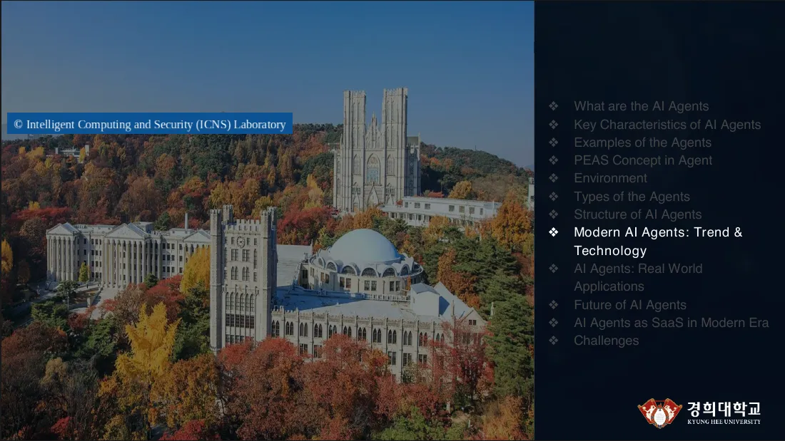

**직역**
> **목차 (Contents)**— (슬라이드 3과 동일한 상세 목차, 우측 12개 항목 병기)

## 슬라이드 32

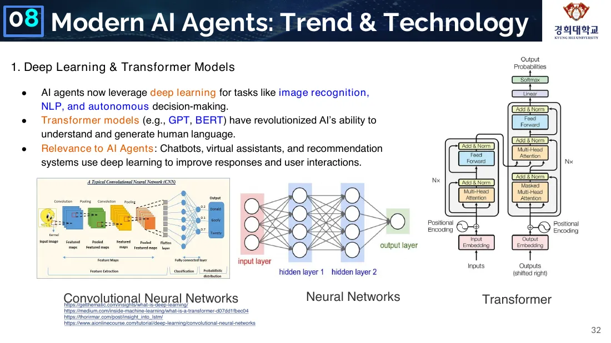

**직역**
> **08 현대 AI 에이전트: 트렌드 & 기술 (Modern AI Agents: Trend & Technology)**
>
> **1. 딥러닝 & 트랜스포머 모델 (Deep Learning & Transformer Models)**
> - AI 에이전트는 이제 이미지 인식, NLP, 자율적 의사결정 같은 작업에 딥러닝을 활용한다.
> - 트랜스포머 모델(예: GPT, BERT)은 인간 언어를 이해하고 생성하는 AI의 능력에 혁명을 일으켰다.
> - **AI 에이전트와의 관련성:**챗봇, 가상 비서, 추천 시스템은 응답과 사용자 상호작용을 개선하기 위해 딥러닝을 사용한다.
>
> (그림 라벨) 합성곱 신경망 (Convolutional Neural Networks) / 신경망 (Neural Networks) / 트랜스포머 (Transformer)

## 슬라이드 33

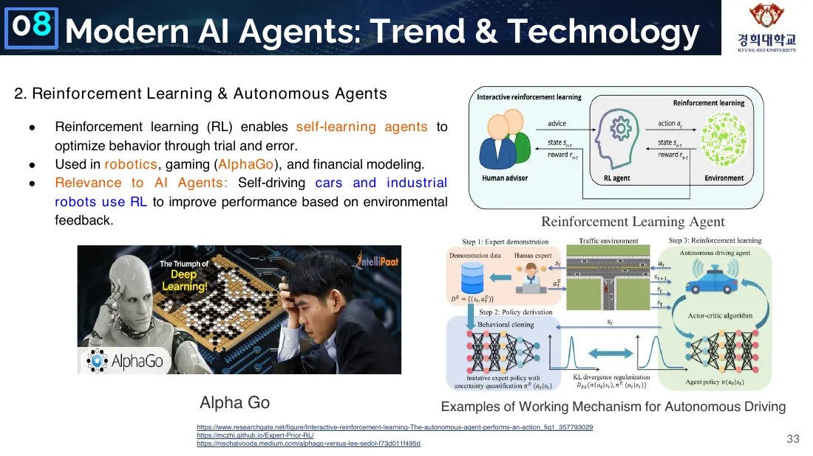

**직역**
> **08 현대 AI 에이전트: 트렌드 & 기술 (Modern AI Agents: Trend & Technology)**
>
> **2. 강화학습 & 자율 에이전트 (Reinforcement Learning & Autonomous Agents)**
> - 강화학습(RL)은 자기 학습 에이전트가 시행착오를 통해 행동을 최적화할 수 있게 한다.
> - 로보틱스, 게임(AlphaGo), 금융 모델링에 사용된다.
> - **AI 에이전트와의 관련성:**자율주행차와 산업용 로봇은 환경 피드백에 기반해 성능을 개선하기 위해 RL을 사용한다.
>
> (그림 라벨) 강화학습 에이전트 (Reinforcement Learning Agent) / Alpha Go / 자율주행을 위한 작동 메커니즘 예시 (Examples of Working Mechanism for Autonomous Driving)

**설명**
- 멀티 에이전트의 기반은 **강화학습(RL) 체계**: 환경에서 reward를 받고 액션을 취하며 진화한다. 데이터가 커지고 상호 연관성이 많아질수록 깊은 신경망(Deep NN) 레이어가 필요하다.
- **강화학습(Reinforcement Learning)**: 보상 체계(reward)를 통해서 동작시키는 것. 에이전트가 환경에서 보상을 받으며 행동을 학습·최적화한다.
- 다수 에이전트가 각자 학습하며 협력하는 방향으로 **federated agent learning → federated agent reinforcement learning**(연합 에이전트 강화학습) 개념이 확장된다.

## 슬라이드 34

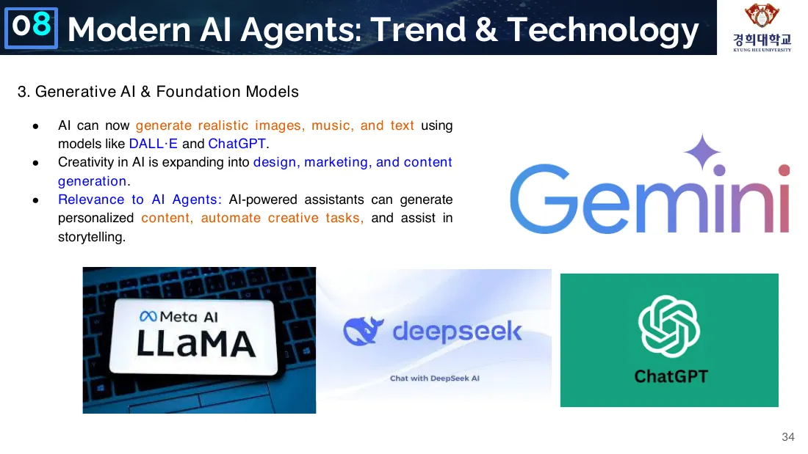

**직역**
> **08 현대 AI 에이전트: 트렌드 & 기술 (Modern AI Agents: Trend & Technology)**
>
> **3. 생성형 AI & 파운데이션 모델 (Generative AI & Foundation Models)**
> - AI는 이제 DALL·E와 ChatGPT 같은 모델을 사용하여 사실적인 이미지, 음악, 텍스트를 생성할 수 있다.
> - AI의 창의성은 디자인, 마케팅, 콘텐츠 생성으로 확장되고 있다.
> - **AI 에이전트와의 관련성:**AI 기반 비서는 개인화된 콘텐츠를 생성하고, 창의적 작업을 자동화하며, 스토리텔링을 지원할 수 있다.

## 슬라이드 35

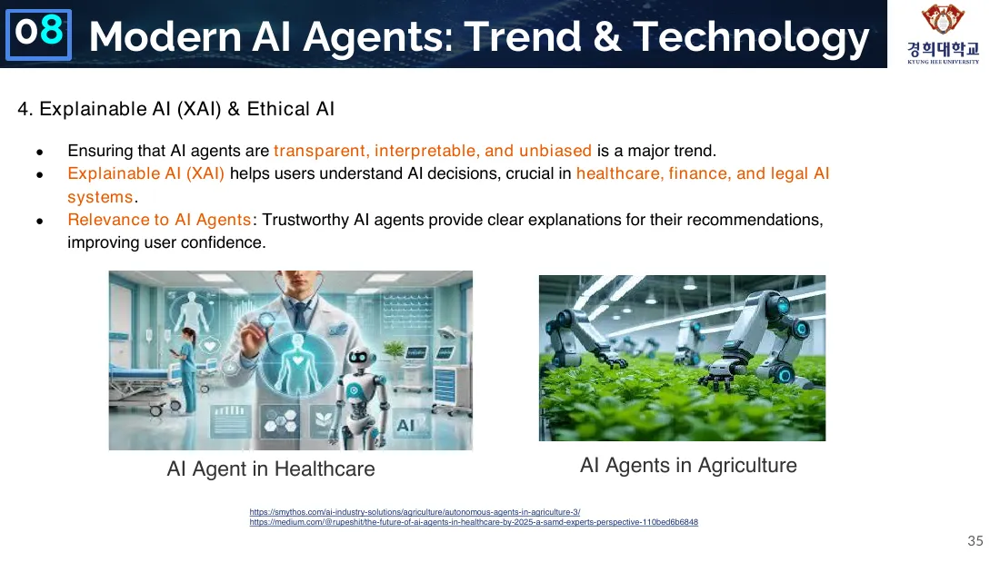

**직역**
> **08 현대 AI 에이전트: 트렌드 & 기술 (Modern AI Agents: Trend & Technology)**
>
> **4. 설명 가능한 AI (XAI) & 윤리적 AI (Explainable AI & Ethical AI)**
> - AI 에이전트가 투명하고(transparent), 해석 가능하며(interpretable), 편향되지 않도록 보장하는 것이 주요 트렌드이다.
> - 설명 가능한 AI(XAI)는 사용자가 AI 결정을 이해하도록 돕는데, 이는 헬스케어, 금융, 법률 AI 시스템에서 매우 중요하다.
> - **AI 에이전트와의 관련성:**신뢰할 수 있는 AI 에이전트는 자신의 추천에 대한 명확한 설명을 제공하여 사용자 신뢰를 향상시킨다.
>
> (그림 라벨) 헬스케어 분야의 AI 에이전트 (AI Agent in Healthcare) / 농업 분야의 AI 에이전트 (AI Agents in Agriculture)

## 슬라이드 36

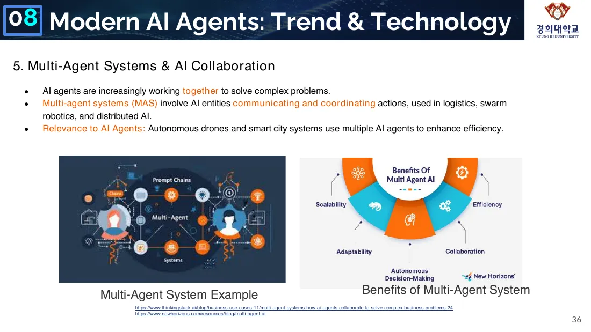

**직역**
> **08 현대 AI 에이전트: 트렌드 & 기술 (Modern AI Agents: Trend & Technology)**
>
> **5. 멀티 에이전트 시스템 & AI 협업 (Multi-Agent Systems & AI Collaboration)**
> - AI 에이전트들이 복잡한 문제를 해결하기 위해 점점 더 함께 작동하고 있다.
> - 멀티 에이전트 시스템(MAS)은 AI 개체들이 통신하고 행동을 조정하는 것을 수반하며, 물류, 군집 로보틱스(swarm robotics), 분산 AI에 사용된다.
> - **AI 에이전트와의 관련성:**자율 드론과 스마트 시티 시스템은 효율을 높이기 위해 다수의 AI 에이전트를 사용한다.
>
> (그림 라벨) 멀티 에이전트 시스템 예시 (Multi-Agent System Example) / 멀티 에이전트 시스템의 이점 (Benefits of Multi-Agent System)

**설명**
- 6G 같은 복잡한 환경에서는 에이전트 하나로는 너무 복잡하므로 **멀티 에이전트**가 키워드. 각자가 디시전을 내려 똑똑해지되, 한 에이전트의 액션이 다른 에이전트에 영향을 준다.
- 목표(goal)는 하나(예: 시간 단축)인데 각자의 액션이 달라 서로 충돌·영향을 미친다 → **Collaboration**(협력)을 어떻게 할지, 에이전트끼리 어떻게 통신·평가할지가 과제. 사람 사이의 소비자-생산자 관계처럼 에이전트 간에도 일어난다.
- **Collaboration**은 보통 **다른 에이전트의 정보를 가져와 반영하는 것**이므로 **통신(communication)이 필수적**이다.
- 다만 최근에는 통신을 직접 쓰지 않고 **다른 에이전트의 동작을 관찰해서 예측하는 방식**도 대두되고 있다.

## 슬라이드 37

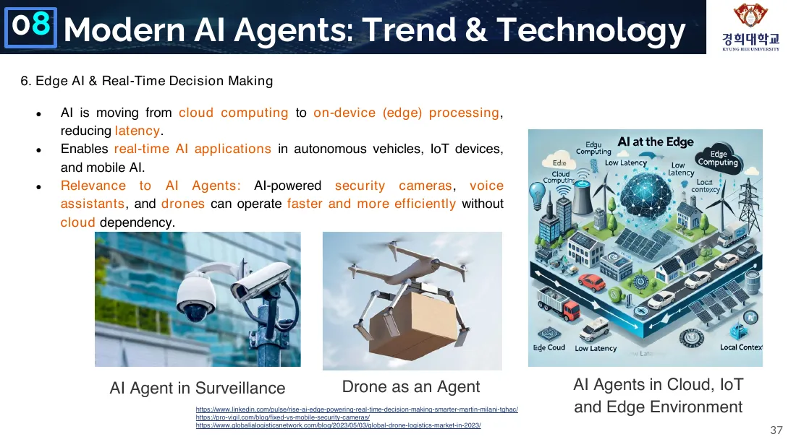

**직역**
> **08 현대 AI 에이전트: 트렌드 & 기술 (Modern AI Agents: Trend & Technology)**
>
> **6. 엣지 AI & 실시간 의사결정 (Edge AI & Real-Time Decision Making)**
> - AI는 클라우드 컴퓨팅에서 온디바이스(엣지) 처리로 이동하며 지연(latency)을 줄이고 있다.
> - 자율주행차, IoT 기기, 모바일 AI에서 실시간 AI 응용을 가능하게 한다.
> - **AI 에이전트와의 관련성:**AI 기반 보안 카메라, 음성 비서, 드론이 클라우드 의존 없이 더 빠르고 효율적으로 작동할 수 있다.
>
> (그림 라벨) 감시 분야의 AI 에이전트 (AI Agent in Surveillance) / 에이전트로서의 드론 (Drone as an Agent) / 클라우드, IoT, 엣지 환경에서의 AI 에이전트 (AI Agents in Cloud, IoT and Edge Environment)

**설명**
- 네트워크 레이어별로 에이전트가 분산되어 협력하는 구조로 갈 수밖에 없다(엣지에서 빠른 반응 + 수집 정보로 모델을 지속 업데이트·재배포).

## 슬라이드 38

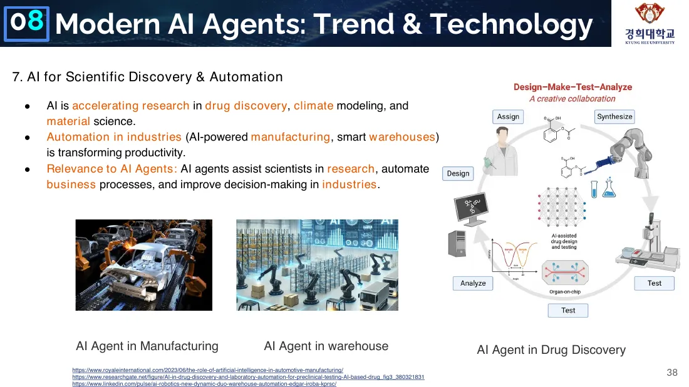

**직역**
> **08 현대 AI 에이전트: 트렌드 & 기술 (Modern AI Agents: Trend & Technology)**
>
> **7. 과학적 발견 & 자동화를 위한 AI (AI for Scientific Discovery & Automation)**
> - AI는 신약 개발(drug discovery), 기후 모델링, 재료 과학 연구를 가속하고 있다.
> - 산업의 자동화(AI 기반 제조, 스마트 창고)가 생산성을 변혁하고 있다.
> - **AI 에이전트와의 관련성:**AI 에이전트는 과학자의 연구를 지원하고, 비즈니스 프로세스를 자동화하며, 산업의 의사결정을 개선한다.
>
> (그림 라벨) 제조 분야의 AI 에이전트 (AI Agent in Manufacturing) / 창고의 AI 에이전트 (AI Agent in warehouse) / 신약 개발의 AI 에이전트 (AI Agent in Drug Discovery)

## 슬라이드 39

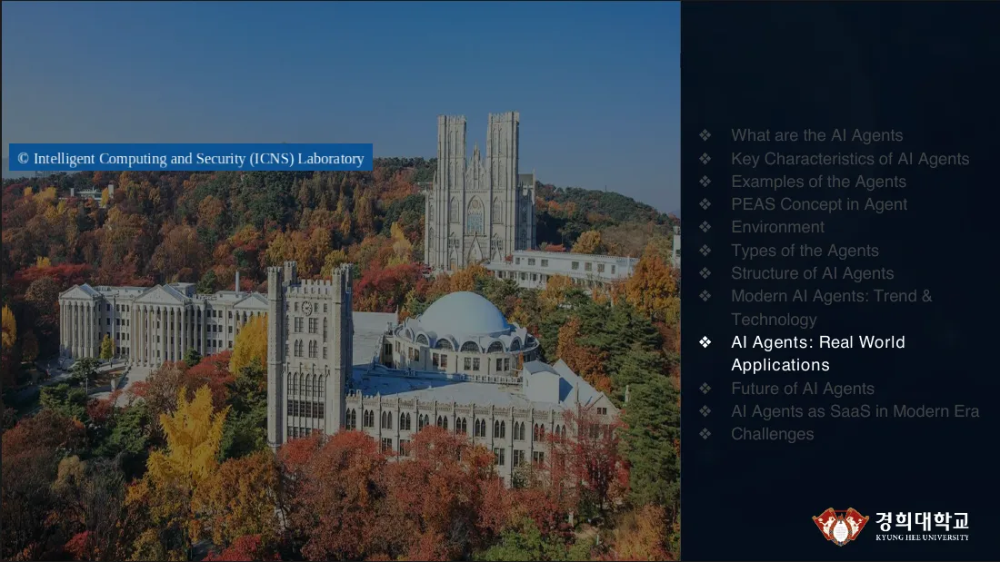

**직역**
> **목차 (Contents)**— (슬라이드 3과 동일한 상세 목차, 우측 12개 항목 병기)

## 슬라이드 40

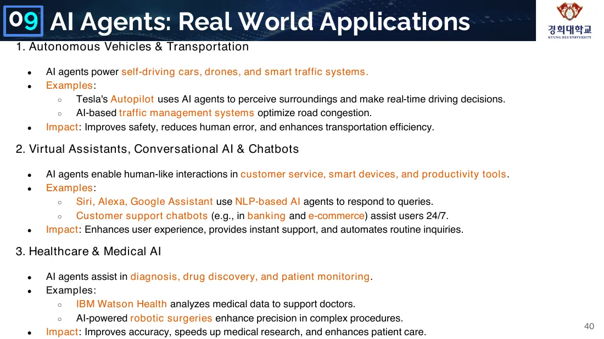

**직역**
> **09 AI 에이전트: 실세계 응용 (Real World Applications)**
>
> **1. 자율주행차 & 교통 (Autonomous Vehicles & Transportation)**
> - AI 에이전트는 자율주행차, 드론, 스마트 교통 시스템을 구동한다.
> - 예시:
> - Tesla의 오토파일럿(Autopilot)은 AI 에이전트를 사용해 주변을 지각하고 실시간 주행 결정을 내린다.
> - AI 기반 교통 관리 시스템은 도로 혼잡을 최적화한다.
> - 영향: 안전을 개선하고, 인적 오류를 줄이며, 교통 효율을 높인다.
>
> **2. 가상 비서, 대화형 AI & 챗봇 (Virtual Assistants, Conversational AI & Chatbots)**
> - AI 에이전트는 고객 서비스, 스마트 기기, 생산성 도구에서 인간 같은 상호작용을 가능하게 한다.
> - 예시:
> - Siri, Alexa, Google Assistant는 NLP 기반 AI 에이전트를 사용해 질의에 응답한다.
> - 고객 지원 챗봇(예: 은행, 이커머스)은 사용자를 24/7 지원한다.
> - 영향: 사용자 경험을 향상시키고, 즉각적 지원을 제공하며, 일상적 문의를 자동화한다.
>
> **3. 헬스케어 & 의료 AI (Healthcare & Medical AI)**
> - AI 에이전트는 진단, 신약 개발, 환자 모니터링을 지원한다.
> - 예시:
> - IBM Watson Health는 의료 데이터를 분석하여 의사를 지원한다.
> - AI 기반 로봇 수술은 복잡한 절차의 정밀도를 높인다.
> - 영향: 정확도를 개선하고, 의학 연구를 가속하며, 환자 케어를 향상시킨다.

## 슬라이드 41

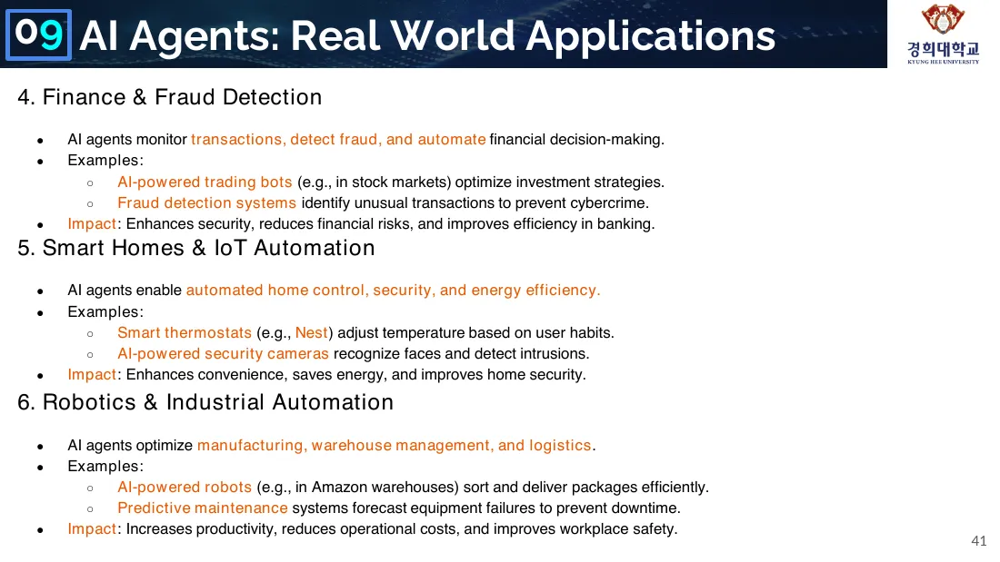

**직역**
> **09 AI 에이전트: 실세계 응용 (Real World Applications)**
>
> **4. 금융 & 사기 탐지 (Finance & Fraud Detection)**
> - AI 에이전트는 거래를 모니터링하고, 사기를 탐지하며, 금융 의사결정을 자동화한다.
> - 예시:
> - AI 기반 트레이딩 봇(예: 주식시장)은 투자 전략을 최적화한다.
> - 사기 탐지 시스템은 비정상 거래를 식별해 사이버 범죄를 예방한다.
> - 영향: 보안을 강화하고, 금융 위험을 줄이며, 은행 업무 효율을 개선한다.
>
> **5. 스마트 홈 & IoT 자동화 (Smart Homes & IoT Automation)**
> - AI 에이전트는 자동화된 가정 제어, 보안, 에너지 효율을 가능하게 한다.
> - 예시:
> - 스마트 온도조절기(예: Nest)는 사용자 습관에 기반해 온도를 조정한다.
> - AI 기반 보안 카메라는 얼굴을 인식하고 침입을 감지한다.
> - 영향: 편의성을 높이고, 에너지를 절약하며, 가정 보안을 개선한다.
>
> **6. 로보틱스 & 산업 자동화 (Robotics & Industrial Automation)**
> - AI 에이전트는 제조, 창고 관리, 물류를 최적화한다.
> - 예시:
> - AI 기반 로봇(예: Amazon 창고)은 패키지를 효율적으로 분류하고 배송한다.
> - 예측 정비 시스템은 장비 고장을 예측하여 가동 중단을 방지한다.
> - 영향: 생산성을 높이고, 운영 비용을 줄이며, 작업장 안전을 개선한다.

## 슬라이드 42

**직역**
> **목차 (Contents)**— (슬라이드 3과 동일한 상세 목차, 우측 12개 항목 병기)

## 슬라이드 43

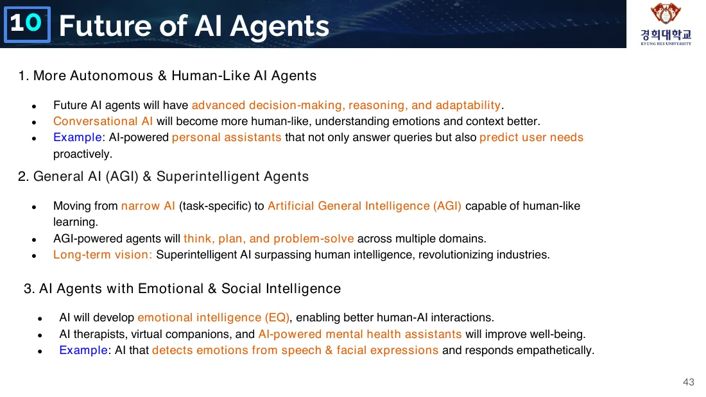

**직역**
> **10 AI 에이전트의 미래 (Future of AI Agents)**
>
> **1. 더 자율적이고 인간 같은 AI 에이전트 (More Autonomous & Human-Like AI Agents)**
> - 미래의 AI 에이전트는 진보된 의사결정, 추론, 적응력을 가질 것이다.
> - 대화형 AI는 더 인간 같아지며 감정과 맥락을 더 잘 이해할 것이다.
> - 예시: 질의에 답할 뿐 아니라 사용자 요구를 선제적으로 예측하는 AI 기반 개인 비서.
>
> **2. 일반 AI(AGI) & 초지능 에이전트 (General AI & Superintelligent Agents)**
> - 좁은 AI(narrow AI, 작업 특화)에서 인간 같은 학습이 가능한 인공일반지능(AGI)으로 이동.
> - AGI 기반 에이전트는 여러 도메인에 걸쳐 사고하고, 계획하고, 문제를 해결할 것이다.
> - 장기 비전: 인간 지능을 능가하는 초지능 AI가 산업을 혁명적으로 변화시킴.
>
> **3. 감정적·사회적 지능을 가진 AI 에이전트 (AI Agents with Emotional & Social Intelligence)**
> - AI는 감정 지능(EQ)을 발달시켜 더 나은 인간-AI 상호작용을 가능하게 할 것이다.
> - AI 치료사, 가상 동반자, AI 기반 정신 건강 비서가 웰빙을 개선할 것이다.
> - 예시: 음성과 표정에서 감정을 감지하고 공감적으로 응답하는 AI.

## 슬라이드 44

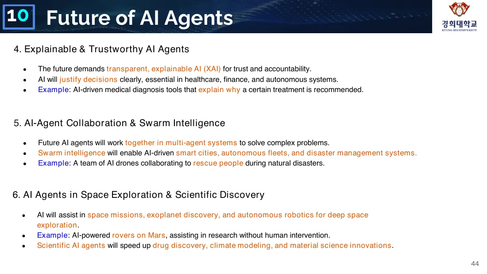

**직역**
> **10 AI 에이전트의 미래 (Future of AI Agents)**
>
> **4. 설명 가능하고 신뢰할 수 있는 AI 에이전트 (Explainable & Trustworthy AI Agents)**
> - 미래는 신뢰와 책무성을 위해 투명하고 설명 가능한 AI(XAI)를 요구한다.
> - AI는 결정을 명확히 정당화할 것이며, 이는 헬스케어, 금융, 자율 시스템에서 필수적이다.
> - 예시: 특정 치료가 왜 권장되는지를 설명하는 AI 기반 의료 진단 도구.
>
> **5. AI 에이전트 협업 & 군집 지능 (AI-Agent Collaboration & Swarm Intelligence)**
> - 미래의 AI 에이전트들은 복잡한 문제를 해결하기 위해 멀티 에이전트 시스템에서 함께 작동할 것이다.
> - 군집 지능(swarm intelligence)은 AI 기반 스마트 시티, 자율 함대, 재난 관리 시스템을 가능하게 할 것이다.
> - 예시: 자연재해 시 사람을 구조하기 위해 협력하는 AI 드론 팀.
>
> **6. 우주 탐사 & 과학적 발견에서의 AI 에이전트 (AI Agents in Space Exploration & Scientific Discovery)**
> - AI는 우주 미션, 외계행성 발견, 심우주 탐사를 위한 자율 로보틱스를 지원할 것이다.
> - 예시: 인간 개입 없이 연구를 지원하는 화성의 AI 기반 로버.
> - 과학 AI 에이전트는 신약 개발, 기후 모델링, 재료 과학 혁신을 가속할 것이다.

## 슬라이드 45

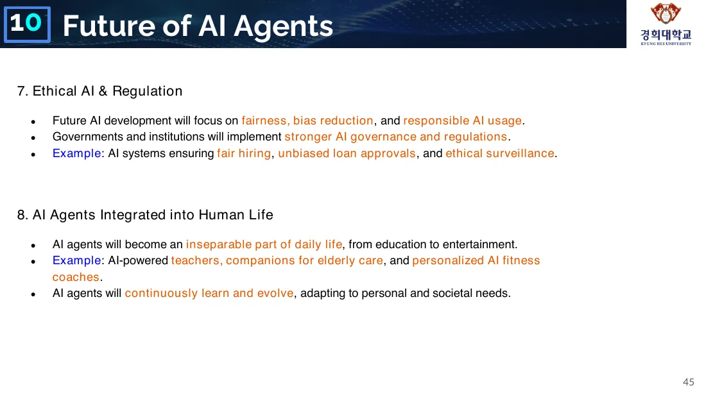

**직역**
> **10 AI 에이전트의 미래 (Future of AI Agents)**
>
> **7. 윤리적 AI & 규제 (Ethical AI & Regulation)**
> - 미래의 AI 개발은 공정성, 편향 감소, 책임 있는 AI 사용에 초점을 맞출 것이다.
> - 정부와 기관은 더 강력한 AI 거버넌스와 규제를 시행할 것이다.
> - 예시: 공정한 채용, 편향 없는 대출 승인, 윤리적 감시를 보장하는 AI 시스템.
>
> **8. 인간 생활에 통합된 AI 에이전트 (AI Agents Integrated into Human Life)**
> - AI 에이전트는 교육에서 엔터테인먼트까지 일상생활의 분리될 수 없는 일부가 될 것이다.
> - 예시: AI 기반 교사, 노인 돌봄을 위한 동반자, 개인화된 AI 피트니스 코치.
> - AI 에이전트는 개인적·사회적 요구에 적응하며 지속적으로 학습하고 진화할 것이다.

## 슬라이드 46

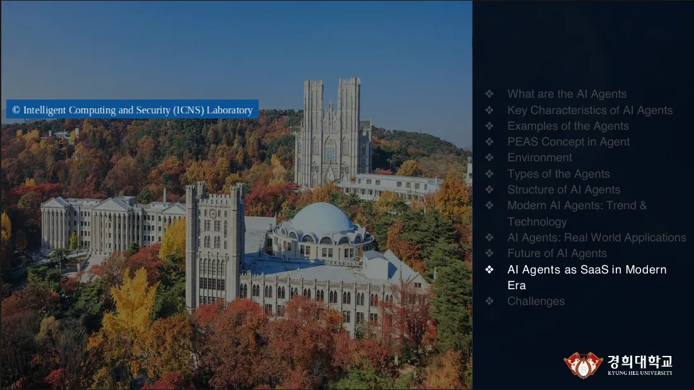

**직역**
> **목차 (Contents)**— (슬라이드 3과 동일한 상세 목차, 우측 12개 항목 병기)

## 슬라이드 47

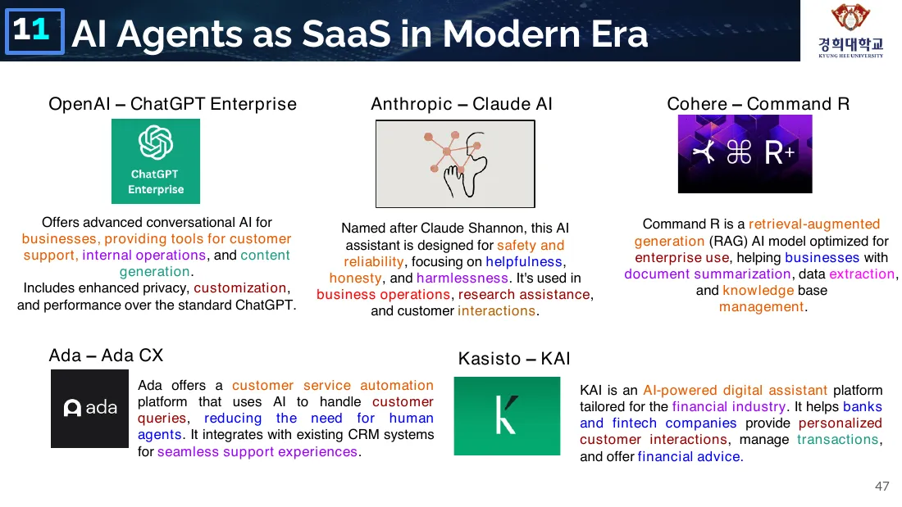

**직역**
> **11 현대 시대의 SaaS로서의 AI 에이전트 (AI Agents as SaaS in Modern Era)**
>
> - **OpenAI – ChatGPT Enterprise**
> 기업을 위한 진보된 대화형 AI를 제공하며, 고객 지원, 내부 운영, 콘텐츠 생성을 위한 도구를 제공한다. 표준 ChatGPT 대비 강화된 프라이버시, 커스터마이징, 성능을 포함한다.
> - **Anthropic – Claude AI**
> 클로드 섀넌(Claude Shannon)의 이름을 딴 이 AI 비서는 안전성과 신뢰성을 위해 설계되었으며, 유용성(helpfulness), 정직성(honesty), 무해성(harmlessness)에 초점을 둔다. 비즈니스 운영, 연구 지원, 고객 상호작용에 사용된다.
> - **Cohere – Command R**
> Command R은 검색 증강 생성(RAG) AI 모델로 기업 사용에 최적화되어 있으며, 문서 요약, 데이터 추출, 지식 베이스 관리로 기업을 돕는다.
> - **Ada – Ada CX**
> Ada는 AI를 사용해 고객 질의를 처리하는 고객 서비스 자동화 플랫폼을 제공하여 사람 상담원의 필요를 줄인다. 기존 CRM 시스템과 통합되어 매끄러운 지원 경험을 제공한다.
> - **Kasisto – KAI**
> KAI는 금융 산업에 맞춤화된 AI 기반 디지털 비서 플랫폼이다. 은행과 핀테크 기업이 개인화된 고객 상호작용을 제공하고, 거래를 관리하며, 금융 자문을 제공하도록 돕는다.

## 슬라이드 48

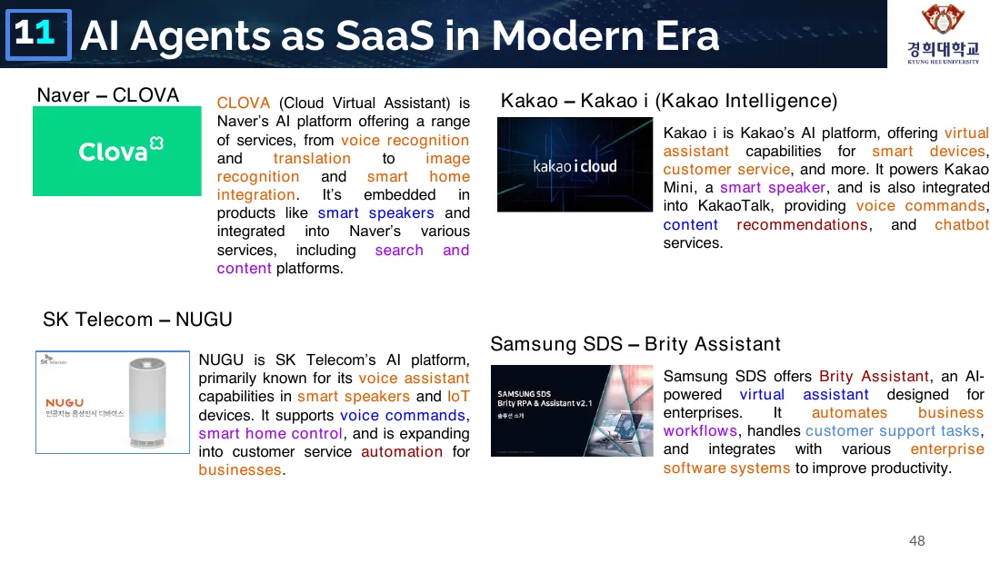

**직역**
> **11 현대 시대의 SaaS로서의 AI 에이전트 (AI Agents as SaaS in Modern Era)**
>
> - **Naver – CLOVA**
> CLOVA(Cloud Virtual Assistant)는 네이버의 AI 플랫폼으로, 음성 인식과 번역에서부터 이미지 인식, 스마트홈 통합까지 다양한 서비스를 제공한다. 스마트 스피커 같은 제품에 내장되어 있고, 검색과 콘텐츠 플랫폼을 포함한 네이버의 여러 서비스에 통합되어 있다.
> - **Kakao – Kakao i (Kakao Intelligence)**
> Kakao i는 카카오의 AI 플랫폼으로, 스마트 기기, 고객 서비스 등을 위한 가상 비서 기능을 제공한다. 스마트 스피커 Kakao Mini를 구동하며, KakaoTalk에도 통합되어 음성 명령, 콘텐츠 추천, 챗봇 서비스를 제공한다.
> - **SK Telecom – NUGU**
> NUGU는 SK텔레콤의 AI 플랫폼으로, 스마트 스피커와 IoT 기기에서의 음성 비서 기능으로 주로 알려져 있다. 음성 명령, 스마트홈 제어를 지원하며, 기업용 고객 서비스 자동화로 확장하고 있다.
> - **Samsung SDS – Brity Assistant**
> 삼성 SDS는 기업용으로 설계된 AI 기반 가상 비서 Brity Assistant를 제공한다. 비즈니스 워크플로를 자동화하고, 고객 지원 작업을 처리하며, 다양한 기업 소프트웨어 시스템과 통합되어 생산성을 향상시킨다.

## 슬라이드 49

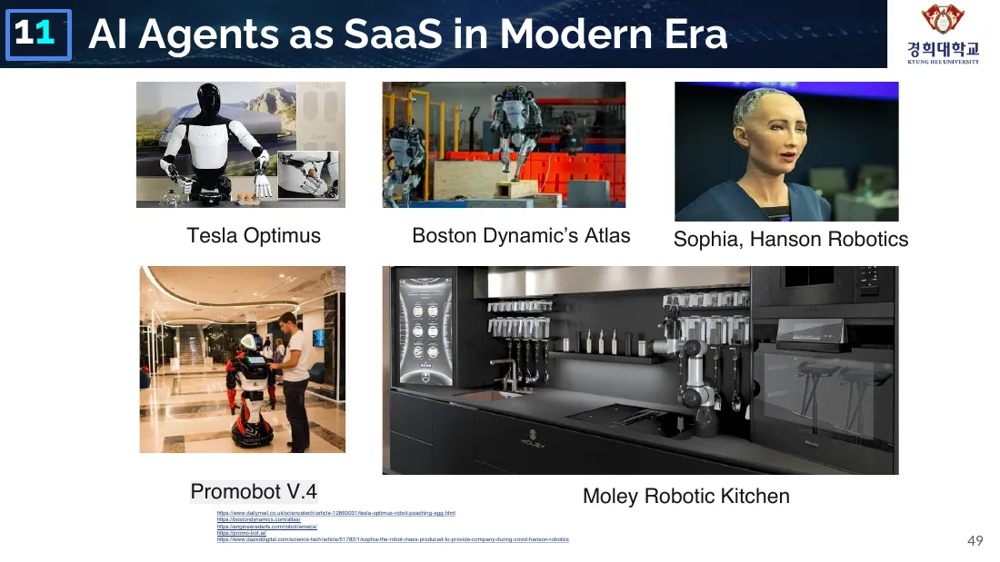

**직역**
> **11 현대 시대의 SaaS로서의 AI 에이전트 (AI Agents as SaaS in Modern Era)**
>
> (휴머노이드/로봇 사진 모음, 라벨만 표기)
> - Tesla Optimus (테슬라 옵티머스)
> - Boston Dynamic's Atlas (보스턴 다이내믹스의 아틀라스)
> - Sophia, Hanson Robotics (소피아, 핸슨 로보틱스)
> - Promobot V.4 (프로모봇 V.4)
> - Moley Robotic Kitchen (몰리 로보틱 키친)

## 슬라이드 50

**직역**
> **목차 (Contents)**— (슬라이드 3과 동일한 상세 목차, 우측 12개 항목 병기)

## 슬라이드 51

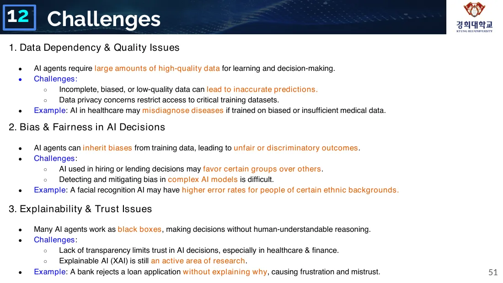

**직역**
> **12 도전 과제 (Challenges)**
>
> **1. 데이터 의존성 & 품질 문제 (Data Dependency & Quality Issues)**
> - AI 에이전트는 학습과 의사결정을 위해 대량의 고품질 데이터를 필요로 한다.
> - 도전 과제:
> - 불완전하거나, 편향되거나, 저품질 데이터는 부정확한 예측으로 이어질 수 있다.
> - 데이터 프라이버시 우려가 중요한 훈련 데이터셋 접근을 제한한다.
> - 예시: 헬스케어 AI는 편향되거나 불충분한 의료 데이터로 훈련되면 질병을 오진할 수 있다.
>
> **2. AI 결정의 편향 & 공정성 (Bias & Fairness in AI Decisions)**
> - AI 에이전트는 훈련 데이터로부터 편향을 물려받아 불공정하거나 차별적인 결과로 이어질 수 있다.
> - 도전 과제:
> - 채용이나 대출 결정에 사용되는 AI가 특정 집단을 다른 집단보다 우대할 수 있다.
> - 복잡한 AI 모델에서 편향을 탐지하고 완화하기 어렵다.
> - 예시: 얼굴 인식 AI는 특정 인종적 배경의 사람들에 대해 더 높은 오류율을 가질 수 있다.
>
> **3. 설명 가능성 & 신뢰 문제 (Explainability & Trust Issues)**
> - 많은 AI 에이전트는 블랙박스(black boxes)로 작동하며, 인간이 이해할 수 있는 추론 없이 결정을 내린다.
> - 도전 과제:
> - 투명성 부족이 AI 결정에 대한 신뢰를 제한하며, 특히 헬스케어와 금융에서 그렇다.
> - 설명 가능한 AI(XAI)는 여전히 활발한 연구 분야이다.
> - 예시: 은행이 이유를 설명하지 않고 대출 신청을 거절하여 좌절과 불신을 유발한다.

## 슬라이드 52

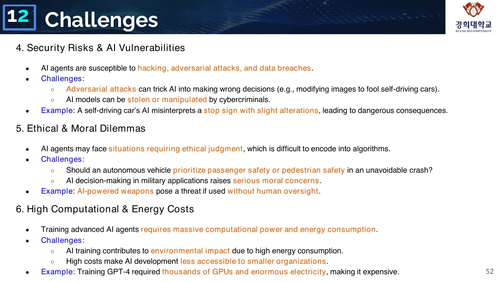

**직역**
> **12 도전 과제 (Challenges)**
>
> **4. 보안 위험 & AI 취약점 (Security Risks & AI Vulnerabilities)**
> - AI 에이전트는 해킹, 적대적 공격(adversarial attacks), 데이터 침해에 취약하다.
> - 도전 과제:
> - 적대적 공격은 AI가 잘못된 결정을 내리도록 속일 수 있다(예: 이미지를 수정해 자율주행차를 속임).
> - AI 모델은 사이버 범죄자에 의해 탈취되거나 조작될 수 있다.
> - 예시: 자율주행차의 AI가 약간 변형된 정지 표지판을 잘못 해석하여 위험한 결과로 이어진다.
>
> **5. 윤리적 & 도덕적 딜레마 (Ethical & Moral Dilemmas)**
> - AI 에이전트는 알고리즘으로 인코딩하기 어려운 윤리적 판단이 필요한 상황에 직면할 수 있다.
> - 도전 과제:
> - 불가피한 충돌에서 자율주행차는 탑승자 안전과 보행자 안전 중 무엇을 우선해야 하는가?
> - 군사 응용에서의 AI 의사결정은 심각한 도덕적 우려를 제기한다.
> - 예시: AI 기반 무기는 인간 감독 없이 사용되면 위협이 된다.
>
> **6. 높은 계산 & 에너지 비용 (High Computational & Energy Costs)**
> - 진보된 AI 에이전트의 훈련은 막대한 계산 능력과 에너지 소비를 필요로 한다.
> - 도전 과제:
> - AI 훈련은 높은 에너지 소비로 인해 환경 영향에 기여한다.
> - 높은 비용 때문에 소규모 조직은 AI 개발에 접근하기 어렵다.
> - 예시: GPT-4 훈련에는 수천 개의 GPU와 막대한 전력이 필요하여 비용이 많이 들었다.

## 슬라이드 53

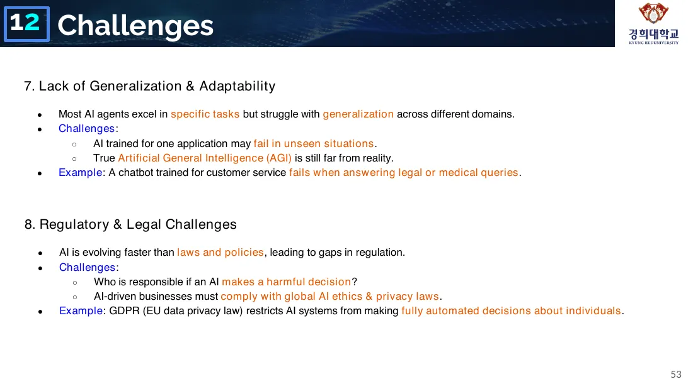

**직역**
> **12 도전 과제 (Challenges)**
>
> **7. 일반화 & 적응력 부족 (Lack of Generalization & Adaptability)**
> - 대부분의 AI 에이전트는 특정 작업에 뛰어나지만 서로 다른 도메인에 걸친 일반화에는 어려움을 겪는다.
> - 도전 과제:
> - 한 응용에 맞춰 훈련된 AI는 보지 못한 상황에서 실패할 수 있다.
> - 진정한 인공일반지능(AGI)은 아직 현실과는 거리가 멀다.
> - 예시: 고객 서비스용으로 훈련된 챗봇은 법률이나 의료 질의에 답할 때 실패한다.
>
> **8. 규제 & 법적 도전 과제 (Regulatory & Legal Challenges)**
> - AI는 법과 정책보다 빠르게 진화하여 규제의 공백을 낳는다.
> - 도전 과제:
> - AI가 해로운 결정을 내리면 누가 책임지는가?
> - AI 기반 비즈니스는 글로벌 AI 윤리 & 프라이버시 법을 준수해야 한다.
> - 예시: GDPR(EU 데이터 프라이버시 법)은 AI 시스템이 개인에 대한 완전 자동화된 결정을 내리는 것을 제한한다.

## 슬라이드 54

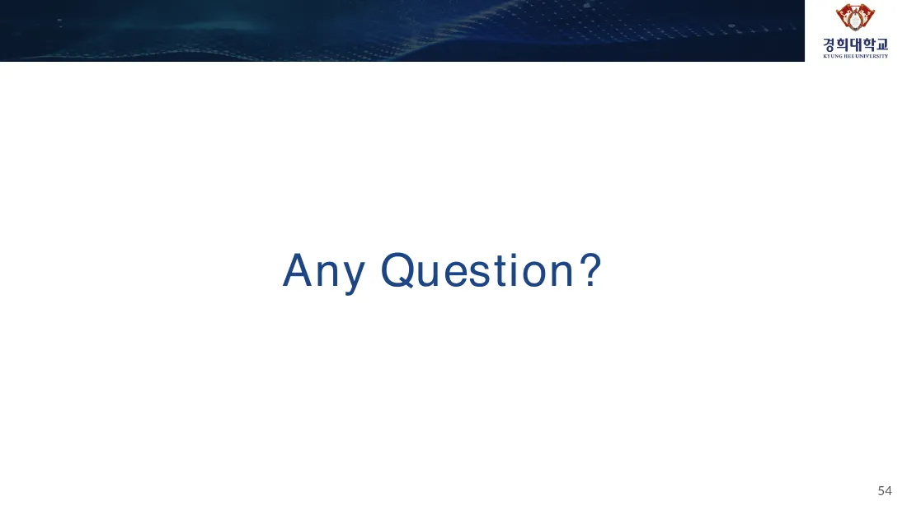

**직역**
> **질문 있나요? (Any Question?)**

## 슬라이드 55

**직역**
> **감사합니다! (Thank You !)**
