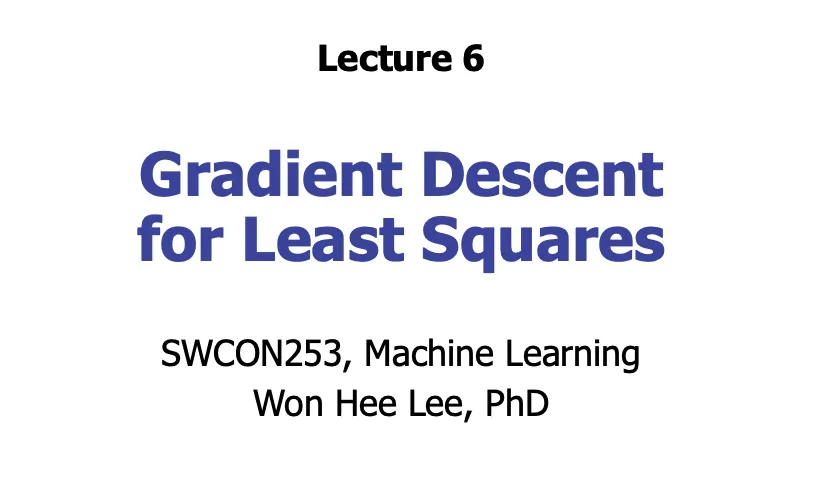

> 원본 Notion 정리 — 강의 슬라이드 이미지 + 설명.
- Gradient Descent for Least Squares

## 핵심 개념 정리
### 1. **왜 경사 강하법이 필요한가?**
이전에는 최적의 가중치 벡터 ŵ를 다음 공식으로 구했어요:
```plain text
ŵ = (X^T X)^(-1) X^T y

```
**문제점**: X가 엄청 크면 (예: 1억 × 1억) 역행렬 계산이 불가능하거나 매우 느려요.
**해결책**: 경사 강하법 - 역행렬 없이 반복적으로 ŵ를 구하는 방법!
***
### 2. **경사 강하법이란?**
**간단히 말하면**: 산을 내려가듯이 에러가 줄어드는 방향으로 조금씩 이동하는 방법
**핵심 공식**:
```plain text
w^(k+1) = w^(k) - τ∇f(w^(k))

```

- **w\^(k)**: k번째 단계의 가중치
- **τ (타우)**: step size (보폭, 학습률)
- **∇f**: gradient (경사, 기울기)
- **음수 부호(-)**: gradient의 **반대 방향**으로 가야 최소값에 도달
***
### 3. **Convex 함수 (볼록 함수)**
경사 강하법이 잘 작동하려면 함수가 convex해야 해요.
**Convex 함수의 특징**:

- 그릇 모양
- 전역 최솟값(global minimum)이 **하나만**존재
- 어느 점에서 접선을 그어도 함수가 접선 **위에**위치
- 최적화하기 쉬움!
**Non-convex 함수**:

- 울퉁불퉁한 산
- 여러 개의 local minimum 존재
- 최적화하기 어려움
***
### 4. **Gradient(미분)가 알려주는 것**
### **(1) 어느 방향으로 갈지**

- 미분값이 **음수**→ 오른쪽으로 가야 함 (함수가 내려가는 방향)
- 미분값이 **양수**→ 왼쪽으로 가야 함 (함수가 내려가는 방향)
- 그래서 **gradient**방향으로 이동!
### **(2) 얼마나 갈지**

- **Gradient가 큼**→ 최솟값에서 멀다 → 큰 보폭으로 이동
- **Gradient가 작음**→ 최솟값에 가깝다 → 작은 보폭으로 이동
***
### 5. **Step Size (학습률, τ or α)**
**매우 중요한 하이퍼파라미터!**
### **너무 크면**:

- 목표를 지나쳐서 반대편으로 튀어버림 (overshooting)
- 최솟값 주변에서 왔다갔다 (bouncing)
- 수렴 안 함
### **너무 작으면**:

- 수렴은 하지만 엄청 느림
- 시간이 오래 걸림
### **적절하면**:

- 빠르고 안정적으로 최솟값에 도달
***
### 6. **Least Squares에서의 경사 강하법**
**목표**: f(w) = \|\|y - Xw\|\|² 를 최소화
**Gradient 계산**:
```plain text
∇f(w) = -2X^T y + 2X^T Xw
   = 2X^T(Xw - y)

```
**업데이트 식**:
```plain text
w^(k+1) = w^(k) - 2τ X^T(Xw^(k) - y)

```
**종료 조건**:
```plain text
||w^(k+1) - w^(k)|| < ε (매우 작은 값)

```
***
## 알고리즘 순서

1. **초기값 설정**: w\^(1) = 0 또는 랜덤 값
2. **반복**:
	- Gradient 계산: ∇f(w\^(k))
	- 가중치 업데이트: w\^(k+1) = w\^(k) - τ∇f(w\^(k))
	- 수렴 확인: \|\|w\^(k+1) - w\^(k)\|\| < ε?
3. **수렴하면 종료**
***
## 직관적 이해
산을 내려간다고 생각해보세요:

- **Gradient**: 지금 서 있는 곳의 경사 방향
- **Gradient**: 아래로 내려가는 방향
- **Step size**: 한 번에 내딛는 발걸음 크기
- **목표**: 가장 낮은 곳(최솟값)에 도달하기
***
## 주의사항

1. **초기값 선택**: 초기값에 따라 결과가 달라질 수 있음 (특히 non-convex)
2. **학습률 조정**: 학습 과정 중에 학습률을 조정하기도 함
3. **수렴 속도**: convex 함수에서는 잘 수렴하지만, non-convex에서는 local minimum에 빠질 수 있음
***

***
##


