> Notion 원본 페이지의 강의 슬라이드와 설명을 바탕으로 정리한 노트입니다.
***

*→ 왜 지도학습은 작동하는가에 대해 배움*

# 데이터 분포

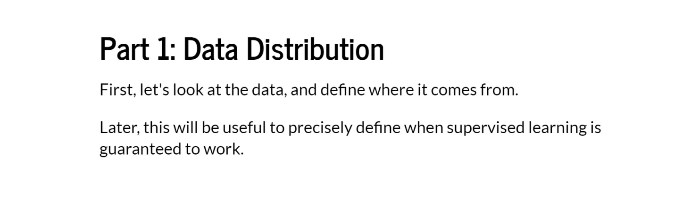

- 우선, 데이터를 살펴보고 데이터가 어디에서 오는지 정의해야함
	- 이 작업은 지도학습에 언제 보장되게 잘 동작하는지 정의하는데 사용 가능ㄴ
→ 설명

	- 여기서 말하는 데이터 분포는 *지도학습이 암묵적으로 가정하고 있는 데이터 생성 규칙*
	- 즉, 데이터는 아무렇게나 주어지는 것이 아닌 어떤 확률분포에서 샘플링되어 나온 것
	→ 지도학습이 잘 작동하려면 **훈련 데이터와 테스트 데이터가 같은 분포에서 나와야 하기 때문**
⇒ “데이터가 어디서 왔는지”를 모르면:

- 일반화 성능을 논할 수 없고
- Ridge/Lasso 같은 기법이 **왜 과적합을 막는지**도 이론적으로 설명할 수 없음

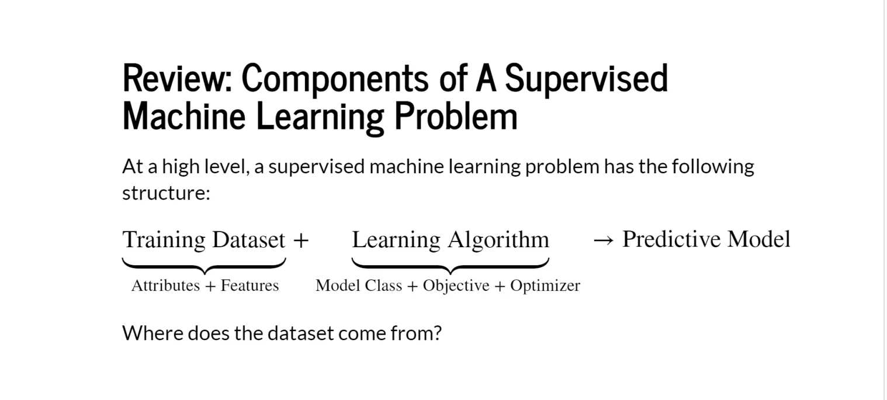

## 복습: 지도학습의 구성요소

- 개략적으로 보면 지도학습 알고리즘은 아래 구성요소를 가짐
- **Training Dataset + Learning Algorithm → Predictive Model**
	→ *훈련 데이터셋 + 학습 알고리즘 → 예측 모델*

	- **Training Dataset**
 - *Attributes + Features*
 → *속성 + 특징*

	- **Learning Algorithm**
 - *Model Class + Objective + Optimizer*
 → *모델 클래스 + 목적함수 + 최적화 기법*
⇒ 이때 사용되는 Training Dataset은 어디에서 오는지 확인해야함

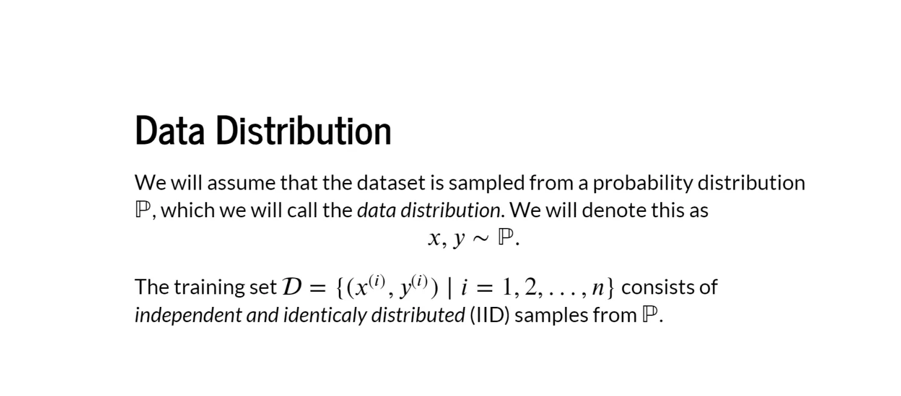

## 데이터 분포

- 데이터셋은 어떤 확률 분포 P에서 샘플링 되었다고 가정하고 이 P를 데이터 분포라고 부름
	- *이를 *$`x, y \sim P`$* 로 표기*
$$

D = \{(x^{(i)}, y^{(i)}) \mid i = 1, 2, \dots, n\}
$$

- 훈련 데이터셋 D는 분포 P로부터 추출된 독립적이고 동일한 분포(IID)를 따르는 샘플들로 구성

### **데이터 분포 P의 의미**

- 데이터는
	- 전 세계의 모든 가능한 입력–출력 쌍 중
	- **일부를 우연히 뽑아온 서브셋**
- 이 “전 세계의 규칙”을 수학적으로 표현한 것이 **확률분포 P**
	- P = *현실 세계의 데이터 생성 규칙*
	- D = *그 규칙에서 우연히 뽑은 표본*

### **IID(Independent and Identically Distributed) 가정이 왜 중요한가**

- **Independent (독립)**
	→ 한 샘플이 다른 샘플에 영향을 주지 않음

- **Identically Distributed (동일분포)**
	→ 모든 샘플이 같은 분포 P에서 나옴
이 가정이 있어야:

- 훈련 데이터로 배운 것이
- 테스트 데이터에도 통할 거라고 **일반화를 주장**할 수 있음
→ Ridge / Lasso의 이론적 정당성도 **전부 이 가정 위에 있음**
⇒ **지도학습은 “확률분포 P에서 IID로 뽑힌 데이터로, 그 분포의 규칙을 근사한다”는 가정을 전제로 함**

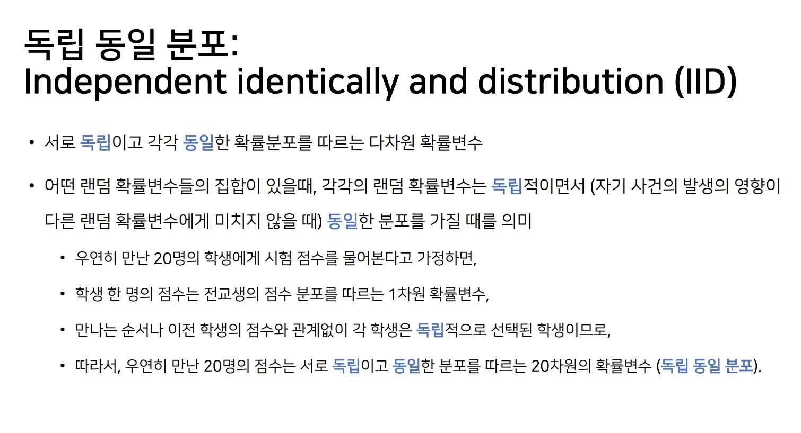

## 독립 동일 분포

- 여기서 동일(identically distributed)의 의미는
	→ *값이 비슷하다*가 아니라
	*→ 모두 같은 확률분포에서 생성된다*는 뜻

- 무작위로 학생을 뽑는다는 가정하에서:
	- 학생 1의 점수 ~ 전교생 점수 분포 P
	- 학생 2의 점수 ~ 전교생 점수 분포 P
	- …
	- 학생 20의 점수 ~ 전교생 점수 분포 P
→ **모든 점수가 같은 분포 **P**에서 나왔기 때문에 identical=**

### **독립 vs 동일**

- **독립 (Independent)**
	→ 한 학생 점수가 다른 학생 점수에 영향을 주지 않음

- **동일 (Identical)**
	→ 모든 학생 점수가 *같은 전교생 점수 분포*를 따름
→ 둘 다 만족하면 IID.
⇒ **작위로 학생을 뽑으면, 각 학생 점수는 전교생 점수 분포라는 동일한 생성 규칙을 따르므로 “identically distributed”**

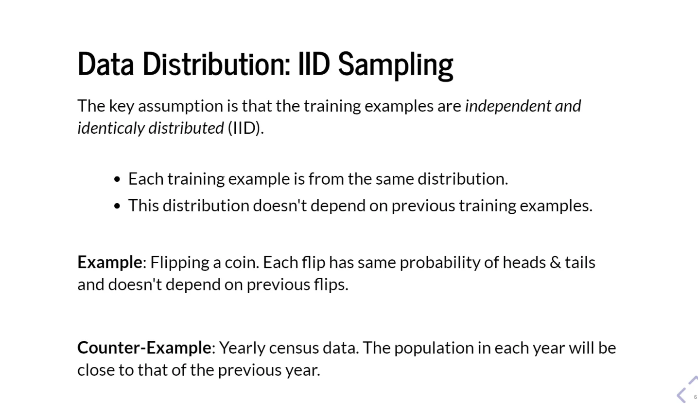

## 데이터 분포: IID 샘플링

- 지도학습의 핵심 가정은 훈련 데이터 샘플들이 독립적이고 동일한 분포를 따른다(IID)는 것
	- 각 훈련 데이터 예제는 동일한 분포에서 나옴
	- 이 분포는 이전 훈련 데이터 예제들에 의존하지 않음
- *예시: 동전 던지기. 각 동전 던지기는 앞면과 뒷면이 나올 확률이 동일하며, 이전에 던진 결과에 의존하지않음*
- *반례: 연도별 인구 조사 데이터. 각 해의 인구는 이전 해의 인구와 매우 비슷*

- IID 가정이 깨지면:
	- 훈련 데이터 분포 ≠ 테스트 데이터 분포
	- → **Out-Of-Distribution (OOD)**문제 발생

 ### **(1) In-distribution (ID)**

 - 훈련 데이터가 나온 분포: P_\{\\text\{train\}\}
 - 테스트 데이터도 **같은 분포**에서 나옴
 → 지금까지 강의에서 가정한 **IID 상황**
 예:

***
 ### **(2) Out-of-Distribution (OOD)**

 - 테스트 데이터가 **훈련 때 보지 못한 다른 분포**에서 나옴
 - 즉:
 P_\{\\text\{test\}\} \\neq P_\{\\text\{train\}\}
 예:

 - 테스트: 초등학생 점수, 혹은 다른 나라 학생 점수
 이 경우:

 - **IID 가정 깨짐**
 - 최소제곱 / Ridge / Lasso의
 *일반화 보장 이론이 적용되지 않음*
 그래서 슬라이드 메모의 의미는:
 > 현실에서는 데이터가 꼭 IID를 따르지 않고, OOD 상황이 자주 발생한다

- Foundation Model
	- **OOD 문제에 대한 현대적인 대응 방식**
	- **하나의 분포에만 맞추지 않음**
	- 매우 **다양한 분포 + 다양한 작업**으로 미리 학습

### 예시 코드

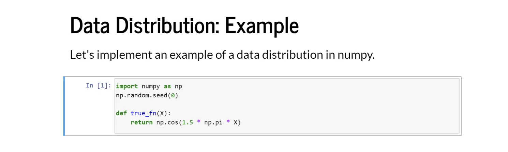

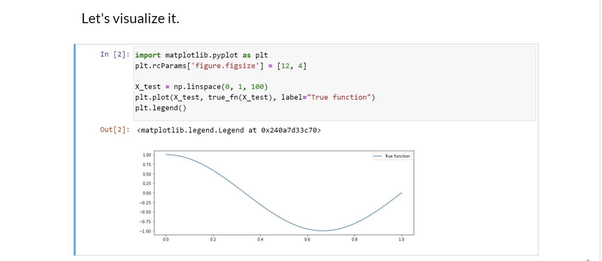

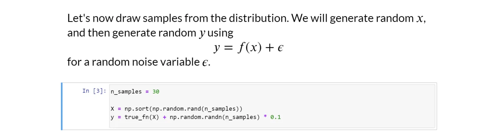

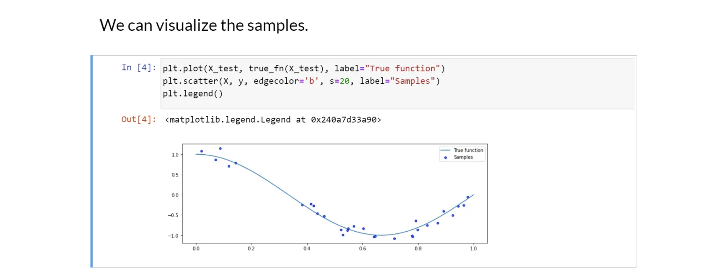

1. **곡선 **
	- 실제 세계의 “진짜 관계”
	- 데이터가 **어떤 규칙으로 생성되는지**를 나타냄
	- 학습할 때는 **이걸 모른다고 가정**
2. **파란 점들 **
	- 위 규칙에서 **IID로 뽑은 관측 데이터**
	- 각 점은:
 - 같은 함수 f(x)
 - 같은 노이즈 분포
 - 같은 x 분포
 에서 나왔지만

	- 노이즈 때문에 곡선에서 조금씩 벗어남
⇒ 그래서 점들이 **대충 곡선을 따라가지만 정확히 일치하지는 않음**
***

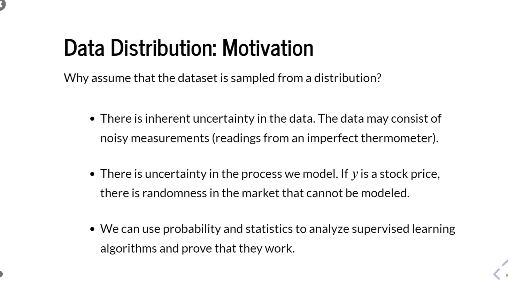

## 데이터 분포: 동기(이유)
→ **왜 굳이 데이터를 ‘확률분포에서 나왔다’고 가정해야 하는가?에 대한 이유**

1. 데이터 자체가 불확실
	- *데이터에는 본질적인 불확실성이 존재한다. 데이터는 노이즈가 있는 측정값들로 구성될 수 있다(완벽하지 않은 온도계로 측정한 값들처럼)*
	- 현실 데이터는 측정 오차, 센서 한계, 관측 잡음 등을 항상 포함
	⇒ **데이터는 애초에 결정론적이지 않음**

2. **대상 시스템도 불확실함**
	- *우리가 모델링하는 과정 자체에도 불확실성이 있다. 만약 y가 주가라면, 시장에는 모델로 표현할 수 없는 무작위성이 존재한다.*
	- 우리가 예측하려는 대상 자체가 완전히 설명 불가능한 요인을 포함
	- 주가, 날씨, 인간 행동 등등
	⇒ 설명 불가한 랜덤성이 남음

3. 이론을 만들기 위해서
	- *확률과 통계를 사용하면 지도학습 알고리즘을 분석하고, 그것들이 제대로 작동함을 증명할 수 있다.*
	- 데이터 분포를 가정해야만 일반화 오차, 기대 손실, 수렴성 등을 수학적으로 분석 가능
⇒ **데이터와 세계가 본질적으로 불확실하기 때문에, 확률분포를 가정해야 하고, 그래야 지도학습을 이론적으로 분석·증명할 수 있음**

# 지도학습이 동작하는 이유

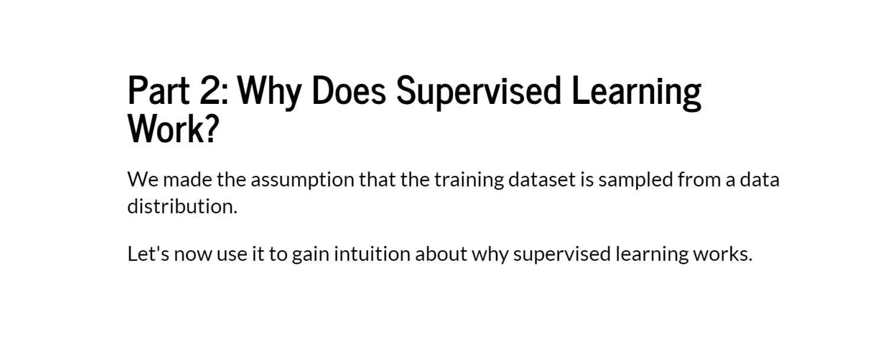

- 훈련 데이터셋이 어떤 데이터 분포에서 샘플링되었다는 가정을 한 상태
⇒ 이제 이 가정을 사용해서, 왜 지도학습이 작동하는지에 대한 직관을 얻어야 함

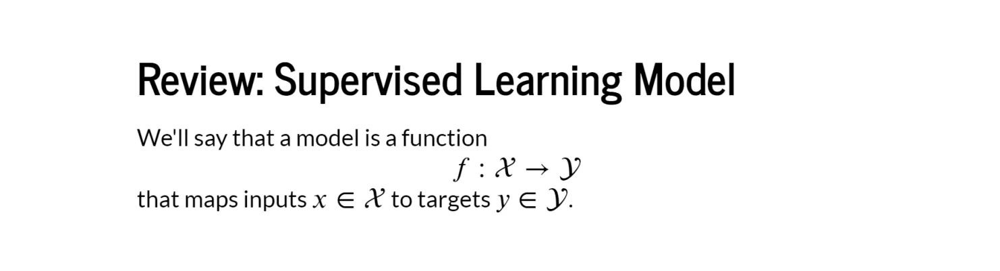

## 리뷰: 지도학습 모델

- 모델을 하나의 함수라고 가졍
$$

f : \mathcal{X} \rightarrow \mathcal{Y}
$$

- 이 함수는 입력 공간 $`\mathcal{X}`$에 속한 입력 x를 출력(타깃) 공간 $`\mathcal{Y}`$에 속한 y로 대응
**⇒ 지도학습 모델은 위와 같은 함수로 표현이 가능**

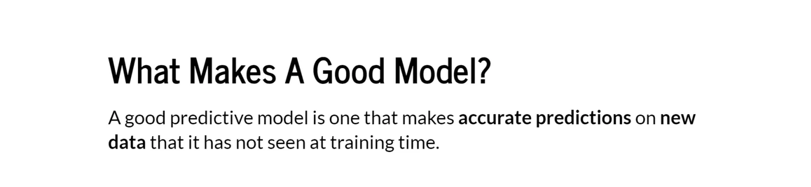

## 무엇이 좋은 모델을 만드는가

- 좋은 예측 모델이란 학습 시점에 보지 못한 새로운 데이터에 대해서도 정확한 예측을 하는 모델
	- 새로운 데이터에서 잘 맞추는 모델이 좋은 모델
**⇒ training 성능이 아니라 generalization 성능**이 기준이다.

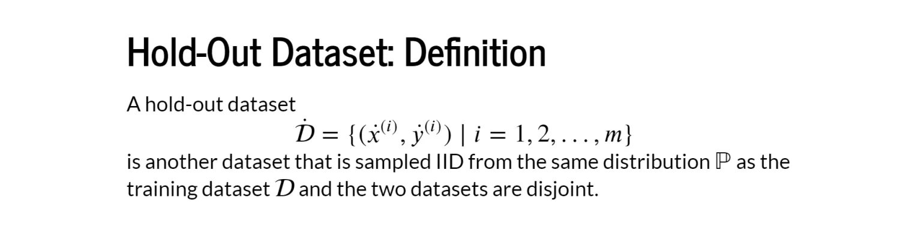

## 홀드아웃 데이터셋: 정의
$$

\tilde{D} = \{(x^{(i)}, y^{(i)}) \mid i = 1, 2, \dots, m\}
$$

- **훈련에 사용하지 않고**
- **성능 평가만을 위해 따로 빼둔 데이터셋**
- 홀드아웃 데이터셋이란, 훈련 데이터셋 D와 동일한 분포 P에서 IID로 샘플링된 또 다른 데이터셋
	- 훈련 데이터셋과 홀드아웃 데이터셋은 서로 겹치지 않음
- **홀드아웃 데이터셋도 IID임**
	- 홀드아웃 데이터도:
 - 훈련 데이터와 똑같이
 - **독립적이고 동일한 분포**에서 샘플링되어야
	- 훈련 성능 ↔ 테스트 성능 비교가 의미 있음
- 훈련 데이터와 홀드아웃 데이터가 겹치면:
	- 모델이 이미 본 데이터를 평가하게 됨
	- → 성능을 **과대평가**
	⇒ 두 데이터셋은 **완전히 분리**되어야 함

### 예시 코드

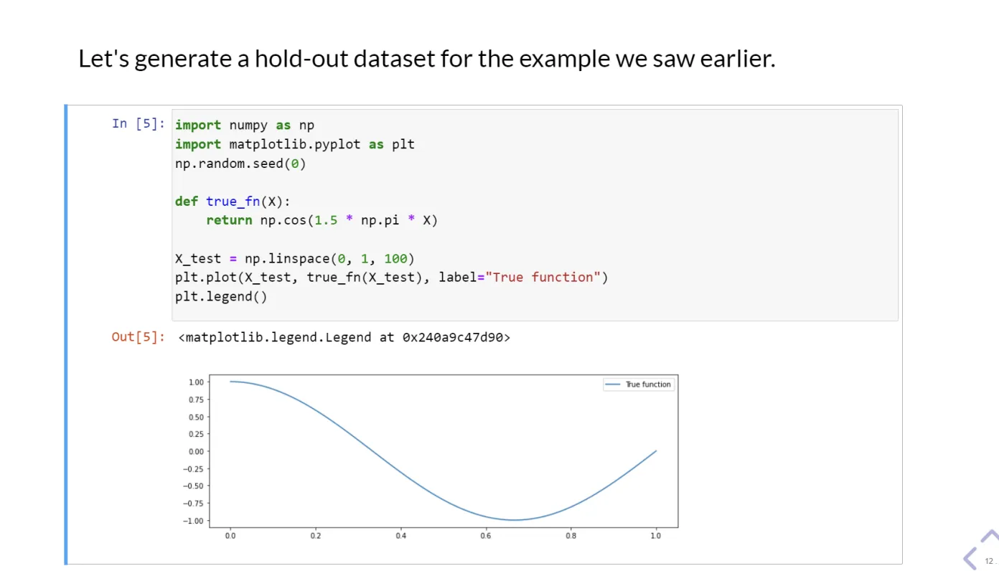

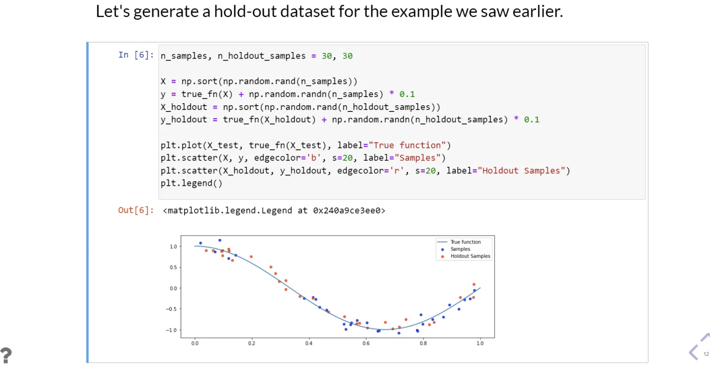

- 위 코드는 이전에 찾은 데이터에서 홀드 아웃 데이터셋을 추출한 것
- 파란 점은 훈련 데이터 / 붉은 점은 홀드아웃 데이터
	- 이 둘은 위치는 다르지만 전체적으로 같은 곡선을 따름
	⇒ **같은 분포에서 나왔지만, 서로 다른 IID 샘플이라는 시각적 증거**

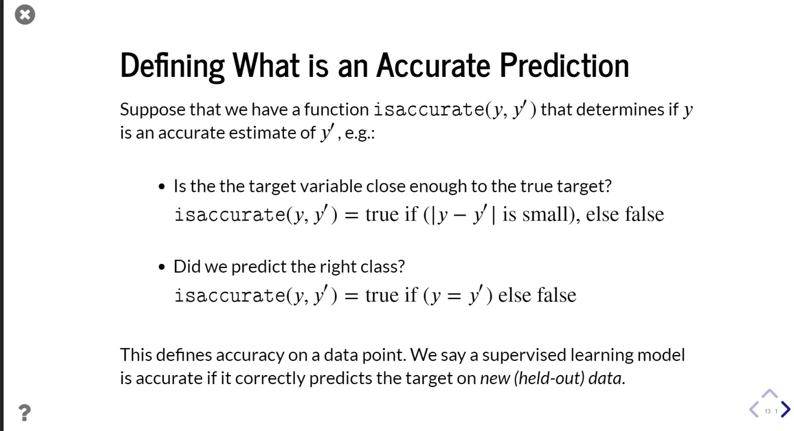

## 정확한 예측이 무엇인지 정의

- y가 실제 값 y’에 대해 정확한 추정인지 판단하는 함수 isaccurate(y, y’)가 있다고 가정
$$
\text{isaccurate}(y, y’) = \text{true if } |y - y’| \text{ is small, else false}
$$
→ \|y - y’\|가 작으면 true, 그렇지 않으면 false. → 회귀
$$
\text{isaccurate}(y, y’) = \text{true if } y = y’, \text{ else false}
$$
→ 예측 클래스가 실제 클래스와 같으면 true, 아니면 false. → 분류

- **이는 하나의 데이터 포인트에 대한 정확도를 정의**
- **지도학습 모델은 새로운(홀드아웃) 데이터에 대해 타깃을 정확히 예측하면 정확하다고 말함**
→ 설명

	- 정확한 예측을 판단하기 위해 판단 함수를 정의하고
	- 이 판단함수는 회귀인 경우 잔차의 절대값이 충분히 작으면, 분류인 경우 분류 결과가 동일하면 정확하다고 판단

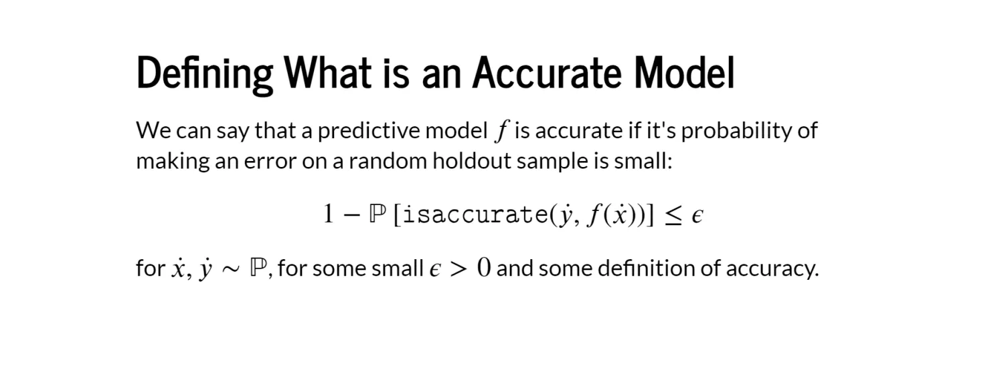

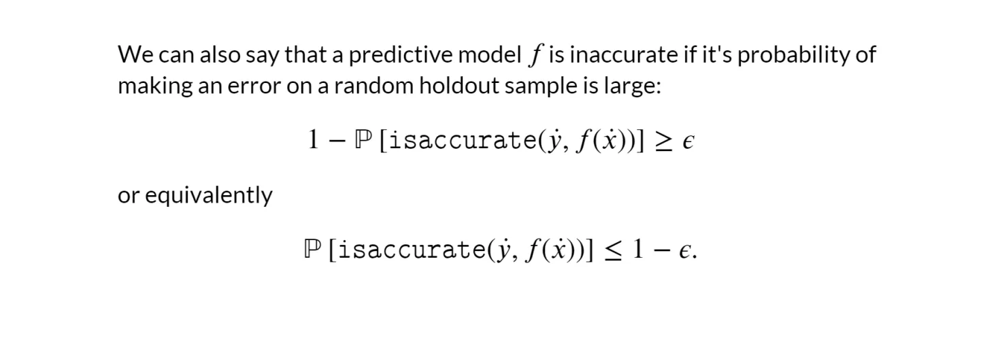

- 예측 모델 f는 무작위로 선택된 홀드아웃 샘플에서 오류를 낼 확률이 작다면 정확하다고 말할 수 있음
$$

1 - \mathbb{P}[\text{isaccurate}(y, f(x))] \le \epsilon
$$
$$

\mathbb{P}\,[\text{isaccurate}(y, f(x))] \le 1 - \epsilon.
$$
→ 무작위로 뽑은 데이터에서, 틀릴 ‘확률’이 얼마나 작은가로 모델의 품질을 정의

- 위 식은 $`에러 확률(error probability) ≤ \epsilon`$
	- 대부분의 경우에 대해 모델은 정확한 예측을 한다는 뜻
	⇒ $`\epsilon`$은 “허용 가능한 실패 확률”

- 이때도 홀드아웃 데이터 x, y는 훈련 데이터와 동일하게 P라는 분포에서 나옴

⇒ 위 확률이 허용 가능한 확률보다 크다면 이 모델은 부정확한 것

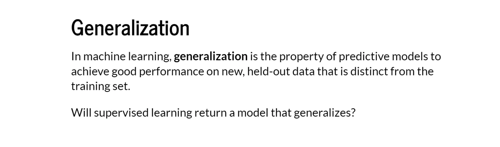

## 일반화

- **머신러닝에서 일반화란, 예측 모델이 훈련 데이터와는 다른 새로운 홀드아웃 데이터에서 좋은 성능을 내는 성질**
	→ **홀드아웃 / new data 성능**

- **일반화는 훈련 데이터셋이 아닌 IID 샘플(new data)을 넣어서 성능을 측정**
→ 이때 지도학습이 일반화를 보장해야하며, 언제 일반화를 보장하는지가 중요

# 과대적합과 과소적합

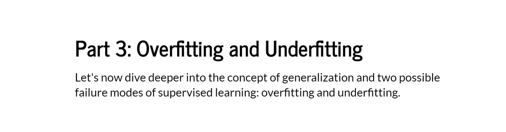

→ 이 장에서는 일반화 개념을 더 깊이 살펴보고, 지도학습의 두 가지 가능한 실패 형태인 과적합과 과소적합을 살펴볼 것

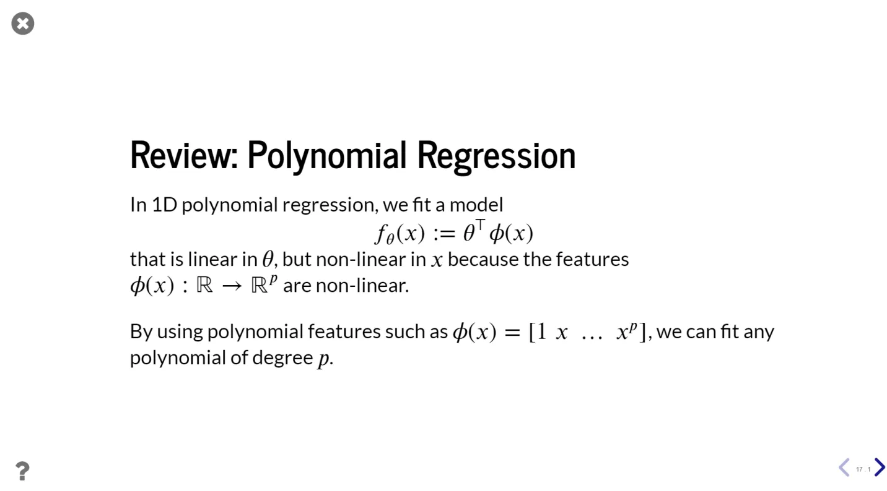

## 다항 회귀
$$

f_\theta(x) := \theta^\top \phi(x)
$$

- 1차워 다항 회귀에서는 위와 같은 모델이 적합
- 이 모델은 파라미터 $`\theta`$에 대해서는 선형이지만, 특징 함수 $`\phi(x)`$가 비선형이기 때문에 입력 x에 대해서는 비선형
$$
\phi(x) = [1, x, \dots, x^p](

\phi : \mathbb{R} \rightarrow \mathbb{R}^{p+1}

)
$$

- $`\phi(x)`$ 은 와 같은 다항 피처의 벡터
- $`\phi(x)`$ 은 1차원 입력 x를 p+1차원의 벡터로 바꿔주는 함수
	→ 입력 변수가 x 하나이므로 1차원

- 다항식은 데이터에 더 적합
- 선형 모델에서 다항 모델로 전환하면, 데이터를 더 잘 맞출 수 있고 정확도를 높일 수 있음
→ 선형 모델은 직선만 표현 가능하지만, 다항 모델은 곡선 표현이 가능해 데이터의 굴곡을 따라갈 수 있음

### 코드 예시

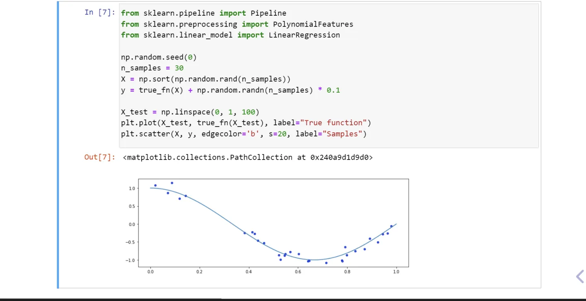

- 위의 합성 데이터셋을 고려

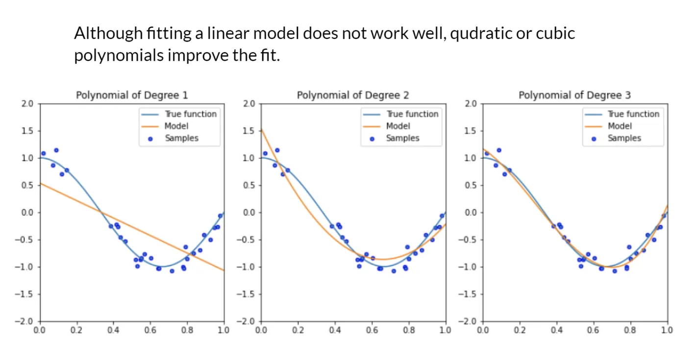

→ 위는 각 차수에 따른 선형 모델의 적합도를 보여줌
→ 파란 선이 실제, 주황 선이 모델

1. 차수 1 → 선형 모델
	- 직선만 표현 가능
	- 데이터의 곡선 구조를 못 따라감
2. 차수 2 → 이차 다항
	- 차수 1에 비해 개선
3. 차수 3 → 삼차 다항
	- 더 유연해진 곡선으로 차수 2보다 개선

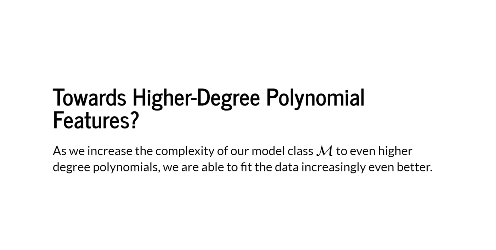

## 더 높은 차수의 다항 특징으로 가는 것

- 모델 클래스 M의 복잡도를 더 높은 차수의 다항식으로 증가시키면, 데이터를 점점 더 잘 맞출 수 있게 됨
⇒ **차수를 계속 올리면, 훈련 데이터에는 점점 더 잘 맞는다. 그럼 계속 올려도 되는가?**

	- 다항 차수 ↑
 → 특징 수 ↑
 → 모델이 표현할 수 있는 함수 집합 \\mathcal\{M\} 커짐

	- 결과:
 - 더 복잡한 굴곡
 - 더 많은 자유도
 - **훈련 데이터 오차 감소**
	→ 이건 거의 항상 참
	→ 이는 훈련 데이터에 너무 과적합되게 할 가능성이 있음

	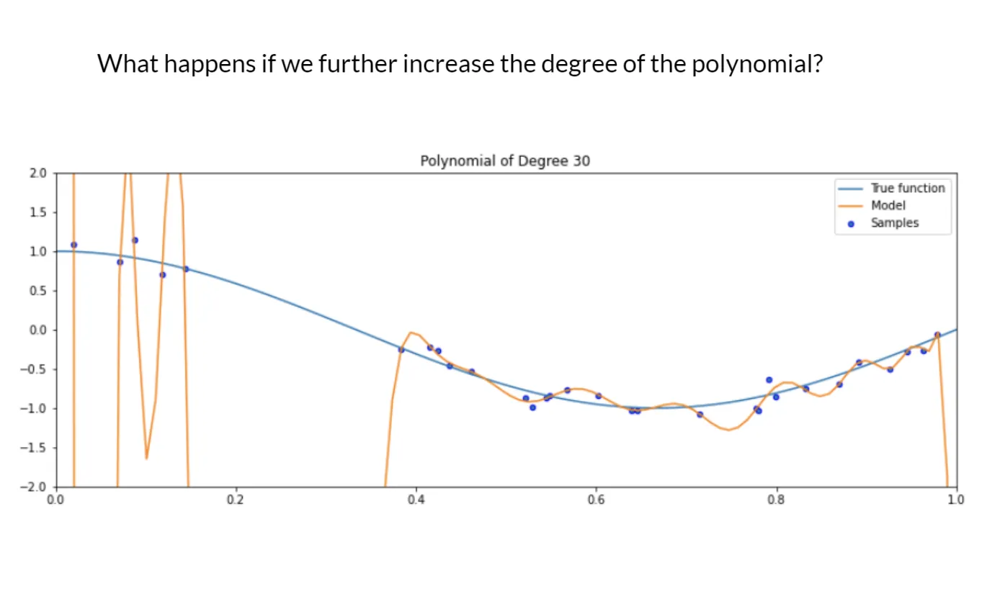

→ 위는 차수 30과 같이 극단적으로 복잡한 모델의 예시

- 이때 훈련 데이터의 점들에는 거의 완벽하게 맞음
- 그러나 실제 정답 함수와는 큰 괴리가 생김
	- 이는 훈련 데이터에 과적함 되어, 만일 정답 함수에서 값을 뽑아 적용해도 모델에서 다른 값을 출력할 확률이 높음
⇒ 일단 훈련 데이터에 적합해지긴 함

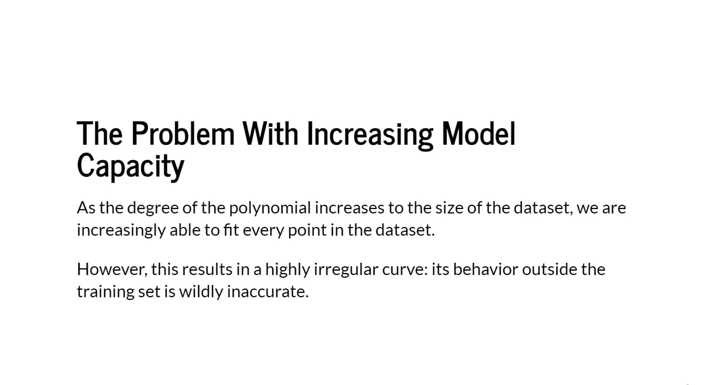

## 모델 용량을 증가시킬 때의 문제점
→ 모델 용량(model capacity) → 모델이 표현할 수 있는 함수의 복잡도

- 다항식의 차수가 데이터셋의 크기에 가까워질 수록, 데이터의 모든 점을 점점 더 정확히 맞출 수 있게 됨
⇒ 그러나 그 결과는 매우 불규칙한 곡선이 되고, 훈련 데이터를 제외하면 극도록 부정확해지게 됨 
→ 모델 용량이 높음 == 모델의 표현력이 높음 == 함수의 복잡도가 높음

	- 모델 용량 → 모델이 표현 가능한 함수 복잡도
	- 모델의 표현력 → 모델이 복잡한 함수를 표현하는 능력

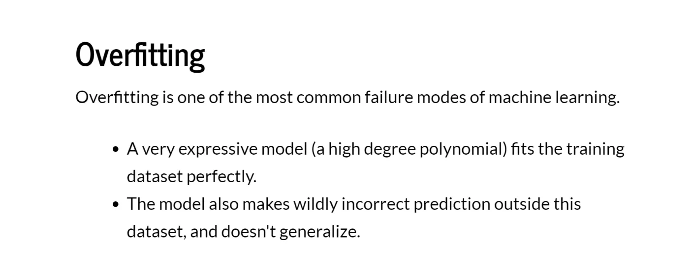

## 과적합(과대적합)

- 머신러닝에서 가장 흔한 실패 형태 중 하나
- 표현력이 매우 높은 모델(고차 다항식)은 훈련 데이터셋에 완벽하게 맞음
	- 그러나 이 모델은 해당 훈련 데이터셋 밖의 값에서는 매우 부정확
	- 일반화되지 못함
⇒ 이게 과적합
⇒ **과적합은 표현력이 너무 높은 모델이 훈련 데이터를 외워버려, 새로운 데이터에서는 일반화에 실패하는 현상**

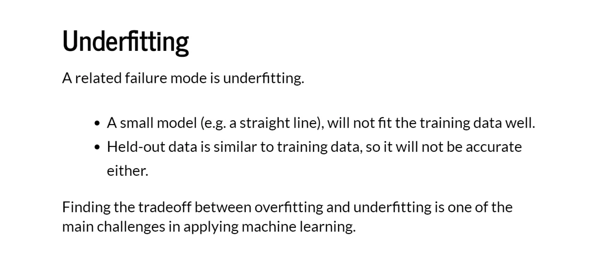

## 과소적합

- 작은(단순한) 모델은 훈련 데이터를 잘 맞추지 못함
- 홀드아웃 데이터(평가 데이터)는 훈련 데이터와 유사하므로 홀드아웃 데이터에서도 정확하지 않게 됨
⇒ **과소적합은 모델이 너무 단순해 훈련 데이터조차 설명하지 못하는 상태**
⇒ 과적함과 과소적합 사이의 적절한 지점을 찾아야함

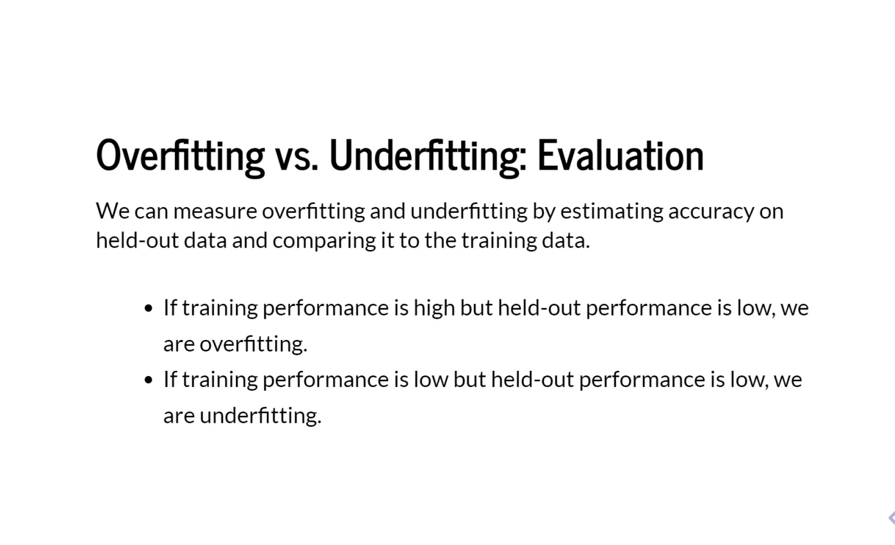

## 과적합 vs 과소적합: 평가

- 홀드아웃 데이터에서의 정확도를 추정하고 이를 훈련 데이터의 정확도와 비교해 과적합과 과소적합을 측정 가능
	→ 훈련 성능은 높지만 홀드아웃 성능이 낮다면, 이는 과적합
	→  훈련 성능도 낮고 홀드아웃 성능도 낮다면, 이는 과소적합

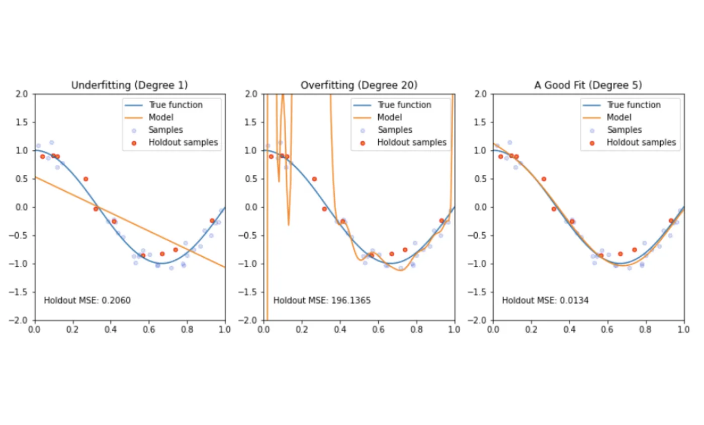

1. **Underfitting (Degree 1)**
	→ *과소적합 (차수 1)*

2. **Overfitting (Degree 20)**
	→ *과적합 (차수 20)*

3. **A Good Fit (Degree 5)**
	→ *좋은 적합 (차수 5)*

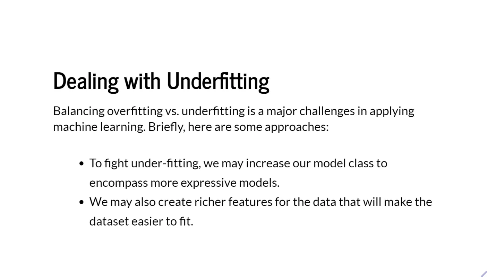

## 과소적합을 다루는 법

- 과소적합을 해결하기 위한 방법
1. 더 표현력이 높은 모델을 포함하도록 모델 클래스 확장
	- 모델이 선택할 수 있는 함수의 범위를 넓힘
	- 예시:
 - 직선 → 이차 다항 → 삼차 다항
 - 단순 선형 모델 → 더 복잡한 모델
2. 데이터를 더 잘 맞추게 풍부한 피처를 만들어냄
	- 이게 바로 앞에서 배운 것과 유사
 - 동일한 더 낮은 차수의 모델에 피처의 차원만 올리는 것
 - 원래 입력 → x
 - 특징 확장 → $`\phi(x) = [1,\ x,\ x^2,\ \dots]`$

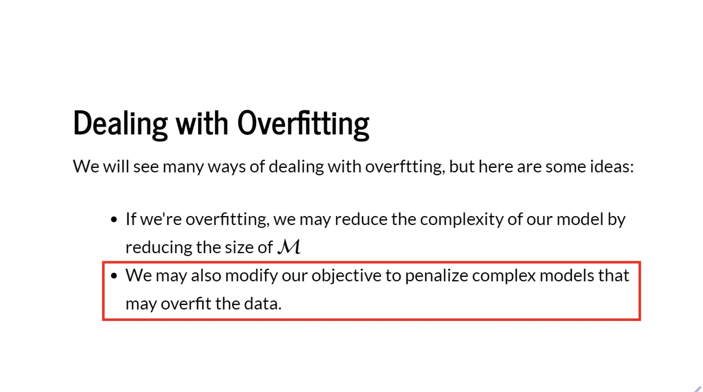

## 과대적합을 다루는 법

- 과대적합을 해결하는 방법
1. 모델 클래스 $`\mathcal{M}`$의 크기를 줄여 모델의 복잡도를 낮출 수 있음
	- 모델이 선택할 수 있는 함수의 범위를 줄임
	- 예시:
 - 다항 차수 낮추기 (20차 → 5차)
 - 특징 개수 줄이기
 - 신경망 층/노드 줄이기
2. 데이터에 과적합할 수 있는 복잡한 모델에 불이익을 주도록 목적 함수를 수정
	- 예시
 - 데이터는 잘 맞추되, **너무 복잡하면 벌점**
 → **Ridge (L2 정규화), Lasso (L1 정규화)**로 이어지게 됨

# 정규화(Regulaization)

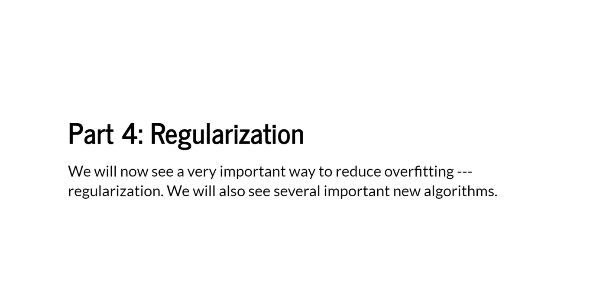

- 과적합을 줄이는 방법 → 정규화

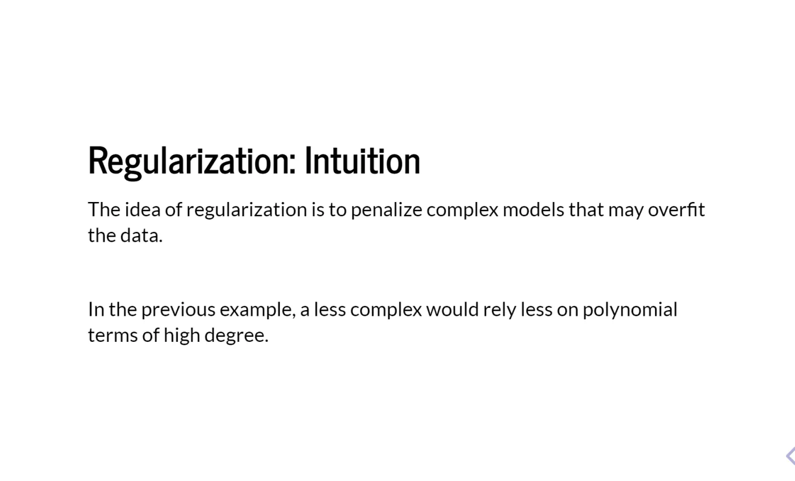

## 정규화: 직관

- 정규화의 아이디어는 데이터에 과적합할 수 있는 복잡한 모델에 패널티를 주는 것
⇒ 설명

	- 모델이 너무 복잡해지는 것을 불리하게 만드는 장치
	- 정규화는 고차 항의 영향력을 줄이게 유도

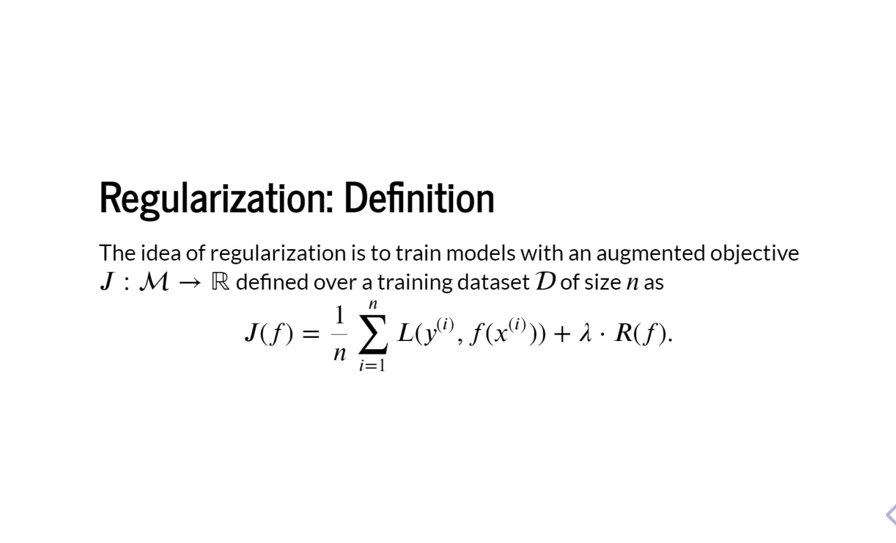

## 정규화: 정의

- 정규화의 아이디어는 확장된 목적 함수를 사용해 모델을 학습시키는 것
$$

J(f) = \frac{1}{n}\sum_{i=1}^n L\big(y^{(i)}, f(x^{(i)})\big) + \lambda \cdot R(f)

$$

- 위는 크기 n인 훈련 데이터셋 D 위에서 정의된 목적 함수 $`J : \mathcal{M} \to \mathbb{R}`$
**⇒ 정규화에서는 목적합수가 두 파트로 나뉘어짐**

$$

\frac{1}{n}\sum_{i=1}^n L\big(y^{(i)}, f(x^{(i)})\big)
$$

- 이는 훈련 정확도에 얼마나 잘 맞는지를 나타냄
- 훈련 데이터에 얼마나 잘 맞는가 → 훈련 정확도
→ 이 항만 최소화하면 → **과적합 위험**
$$

R(f)
$$

- 이는 모델이 얼마나 단순하지
- 모델의 일반화 정확도를 나타냄
- **모델이 얼마나 복잡한가**
$$

 \lambda
$$

- 정규화 파라미터
- **λ 값에 따른 효과**
	- $`\lambda \uparrow`$
 - 정규화 강해짐
 - 모델 더 단순
 - 과적합 ↓, 과소적합 위험 ↑
	- $`\lambda \downarrow`$
 - 정규화 약해짐
 - 데이터 적합 중시
 - 과적합 위험 ↑

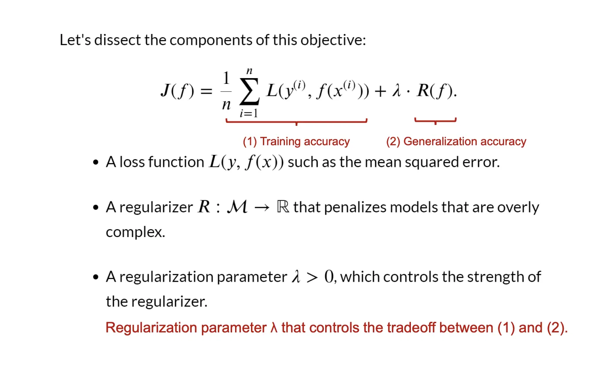

### **(1) 첫 번째 항: Training accuracy (훈련 정확도)**
$$
\frac{1}{n}\sum_{i=1}^{n} L\big(y^{(i)}, f(x^{(i)})\big)
$$
**의미**

- 훈련 데이터에서
- 예측 $`f(x^{(i)})`$가
- 실제 값 $`y^{(i)}`$와 얼마나 다른지
**예**

- 회귀: MSE
	$`L(y, \hat y) = (y-\hat y)^2`$
**이 항만 최소화하면?**

- 훈련 데이터에 **최대한 맞추려 함**
- 고차 다항식, 큰 계수 → 유리
- **과적합 발생**
⇒ 그래서 **이 항만으로는 부족**

### **(2) 두 번째 항: Regularizer **R(f)**(일반화 정확도)**
$$
R(f)
$$
**의미**

- 모델이 **얼마나 복잡한지**를 숫자로 측정
- 복잡할수록 값이 큼
- 아직 형태는 안 정함 (의도적)
**직관**

- 큰 계수들
- 고차항에 많이 의존
- 급격히 요동치는 함수
⇒ 이런 모델을 **“나쁜 모델”로 간주**
⇒ **일반화 성능은 직접 계산할 수 없기 때문에, 대신 ‘복잡하지 말라’는 압박을 줌**
$$

\lambda > 0
$$

- 이 람다는 하이퍼 파리미터로 “데이터 적합” vs “모델 단순성”을 결정하게 함
→ 람다를 높게 주면 더 크게 규제됨
→ 람다를 작게 주면 더 작게 규제됨

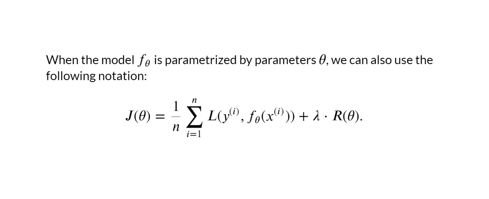

- 모델 $`f_\theta`$가 파라미터 $`\theta`$로 매개변수화되어 있을 때, 다음과 같은 표기법을 사용할 수 있음
$$

J(\theta)
=
\frac{1}{n}\sum_{i=1}^{n} L\big(y^{(i)}, f_\theta(x^{(i)})\big)
\;+\;
\lambda \cdot R(\theta)

$$
⇒ 이는 f를 $`\theta`$를 나타내게 하는 것

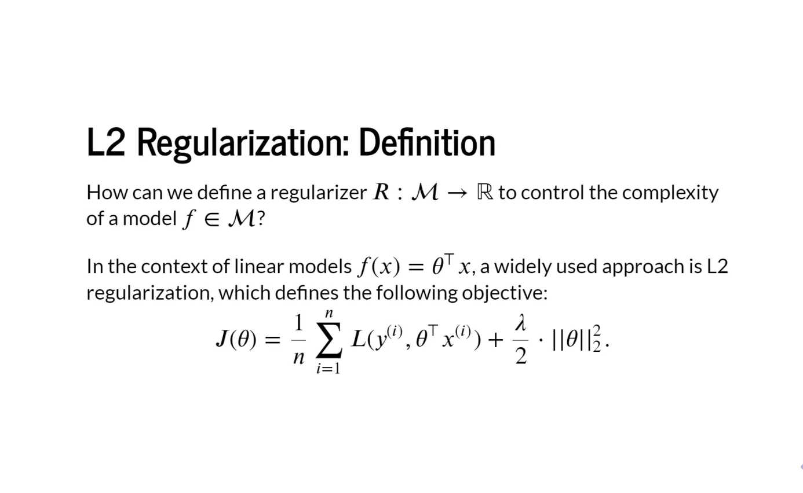

## L2 Regularization

- 모델 $`f \in \mathcal{M}`$ 의 복잡도를 제어하기 위해 정규화 함수 $`R : \mathcal{M} \to \mathbb{R}`$ 를 어떻게 정의할 수 있는가
- 선형 모델 $`f(x)=\theta^\top x`$ 의 맥락에서, 널리 사용되는 접근법은 L2 정규화
	- 이는 다음과 같은 목적 함수를 정의
	$$

J(\theta)
=
\frac{1}{n}\sum_{i=1}^{n} L\big(y^{(i)}, \theta^\top x^{(i)}\big)
+
\frac{\lambda}{2}\,\|\theta\|_2^2

	$$

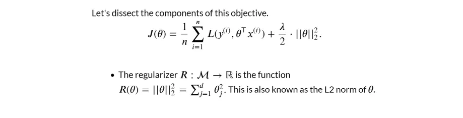

- 정규화 함수 $`R : \mathcal{M} \to \mathbb{R}`$는 다음과 같은 함수
	$$

R(\theta) = \|\theta\|_2^2 = \sum_{j=1}^{d} \theta_j^2
	$$

	- $`\theta`$의 L2 노름
- L2 정규화에서는 가중치들의 제곱합이 손실 함수에 더해짐
- 정규화 항은 큰 가중치에 패널티를 줌
	- 큰 가중치는 제곱되므로 줄어들어야 하는 목적함수 입장에서 더 안좋은 것이 됨
	- 제곱이라 클 수록 더 튀는 경향 존재
**⇒ 이는 특정 하나의 특징에 과도하게 의존하는 것을 막고, 심하게 불규칙한 해를 억제**

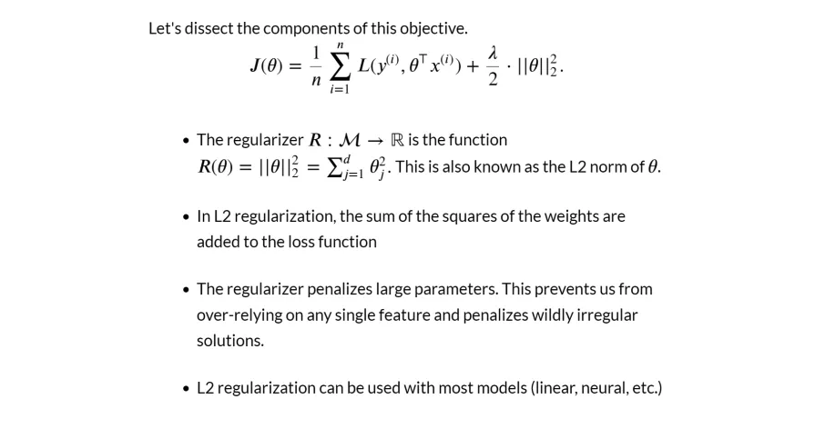

- L2 정규화에서는 가중치의 제곱합이 손실 함수에 추가
- 기존에는 $`\text{Loss} = \text{data error}`$
	- L2 적용 후에는 $`\text{Loss} = \text{data error} + \lambda \sum \theta_j^2`$
- 정규화는 큰 파라미터에 벌점을 줌
- 이는 특정 하나의 특징(feature)에 과도하게 의존하는 것을 방지하고, 매우 불규칙한 해가 패널티가 크게 함
→ 가중치 하나가 매우 크다는 것은:

	- 그 feature 하나에 **모델이 거의 모든 판단을 의존**하고 있다는 뜻
	→ 이럴 경우

 - 노이즈에 취약
 - 일반화 성능이 나쁨
- L2 정규화는 대부분 모델에서 사용 가능

## 예시

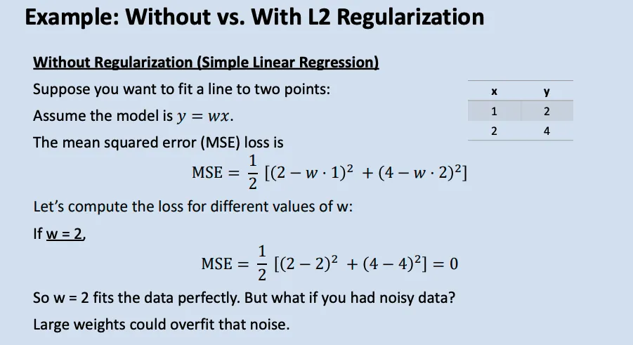

### 정규화 없는 단순 선형 회귀
→ 두 개의 점에 직선을 맞추고 싶다고 가정

- 모델은 y = wx 라고 가정
- 이떄 MSE(목적함수)는 아래와 같음
	$$

\text{MSE} = \frac{1}{2}[(2 - w\cdot1)^2 + (4 - w\cdot2)^2]
	$$

	- 이떄 w = 2이면 MSE는 0
⇒ 이때 w=2이면 MSE가 0이라 적합, 그러나 이는 과적합일 수 있음

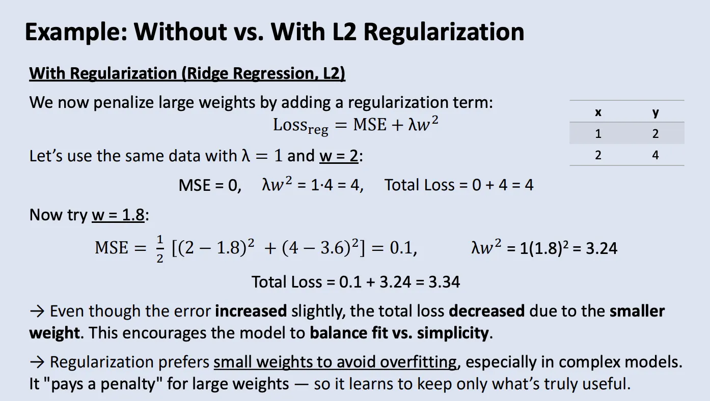

### 정규화 적용(L2, Ridge 회귀)

- 정규화 항을 추가해 큰 가중치에 벌점을 주는 형태
$$

\text{Loss}_{reg} = \text{MSE} + \lambda w^2
$$

- $`\lambda`$를 1로 가정
- 이때 w=2를 적용하면 MSE는 0, 정규화 항은 4 ⇒ 전체 손실은 4
- 이때 w=1.8을 적용하면 ⇒ 전체 손실은 3.34
	- 가중치가 줄었지만 전체 손실은 감소

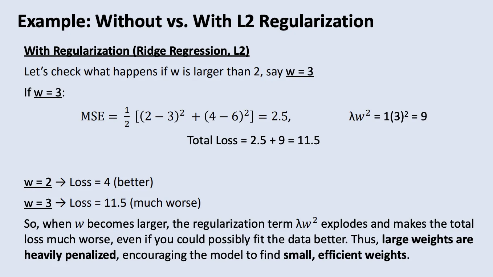

### Ridge 회귀에서 가중치가 커질 때

- w=3이면 → 손실은 MSE=2.5, 정규화 항 9 ⇒ 전체 손실은 11.5
- Ridge 회귀는 가중치가 작아지는 것을 선호
⇒ w가 커지면 복잡도가 커짐 → 과적합 가능성이 높아짐

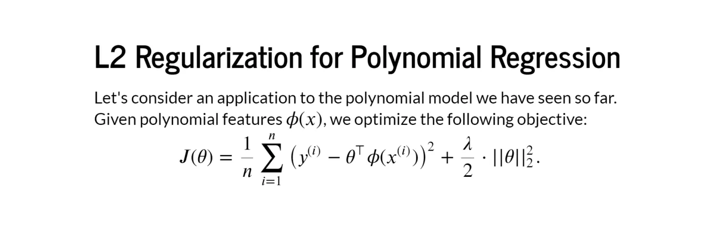

## 다항 회귀에서의 L2 정규화
$$

J(\theta) =
\frac{1}{n}\sum_{i=1}^{n}
\big(y^{(i)} - \theta^T \phi(x^{(i)})\big)^2

+ \frac{\lambda}{2}\|\theta\|_2^2
$$

- 이는 여전히 선형 모델임
	- 그러나 피처가 다항 피처 $`\phi(x)`$로 변함

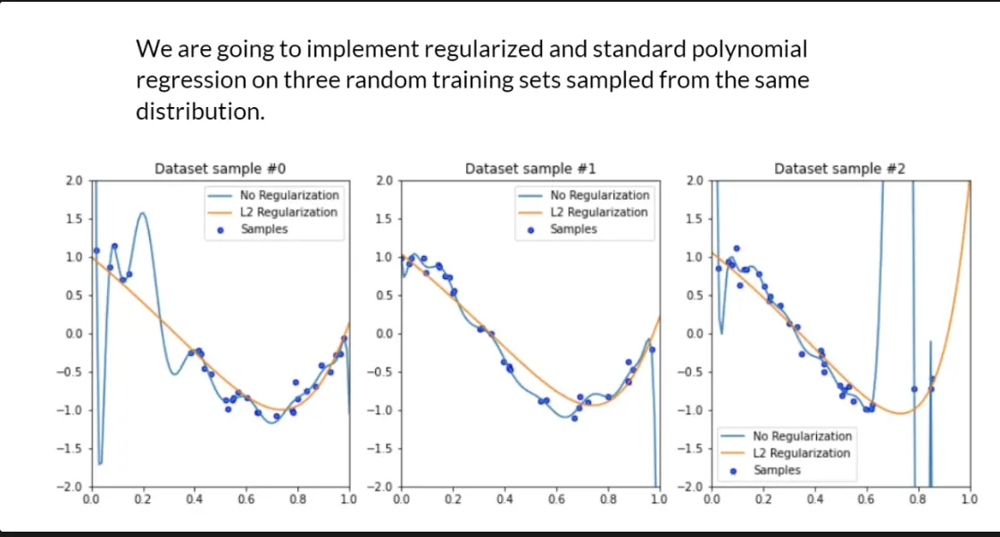

→ 파란 선은 정규화 하지 않은 것, 주황 선은 정규화 한것

- 전체적으로 파란 선은 비 훈련 데이터셋에 적합하지 않음
- 주황 선은 비교적 완만함

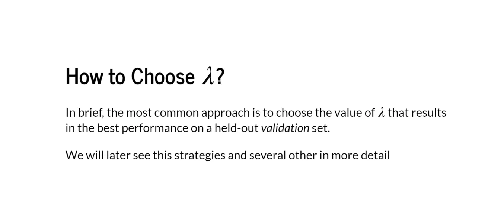

## $`\lambda`$를 고르는 법

- 별도로 만들어둔 검증 데이터셋에서 가장 좋은 성능을 내는 $`\lambda`$값을 선택

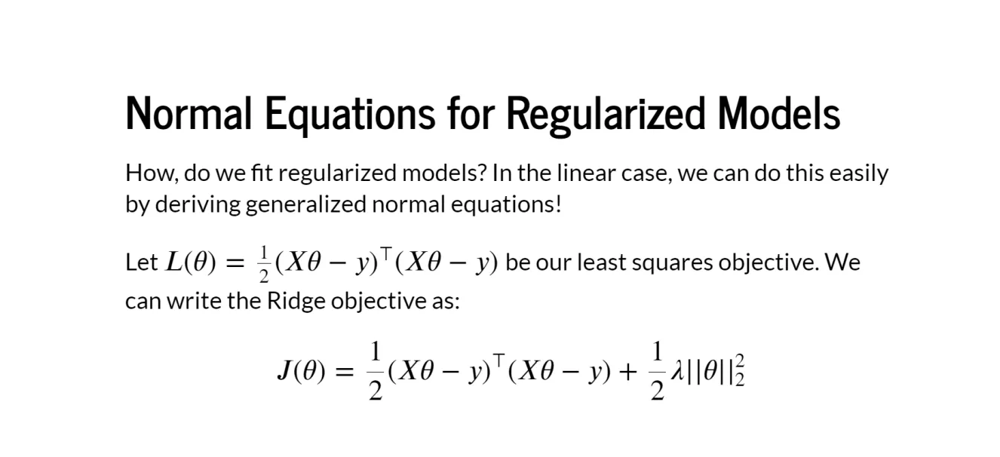

## 정규화 모델을 위한 정규 방정식

- 선형 모델은 일반화된 정규방정식을 유도해 쉽게 처리 가능
→ 현재 최소 제곱 목적 함수를 아래와 같이 가정
	$$

L(\theta) = \frac{1}{2}(X\theta - y)^T(X\theta - y)
	$$
	→ 여기서 취소제곱법(Least Square)을 쓰는 이유는 정규 방정식을 유도하기 위함

- 이때 Ridge 목적 함수는 아래와 같음
$$

J(\theta) = \frac{1}{2}(X\theta - y)^T(X\theta - y) + \frac{1}{2}\lambda \|\theta\|_2^2
$$

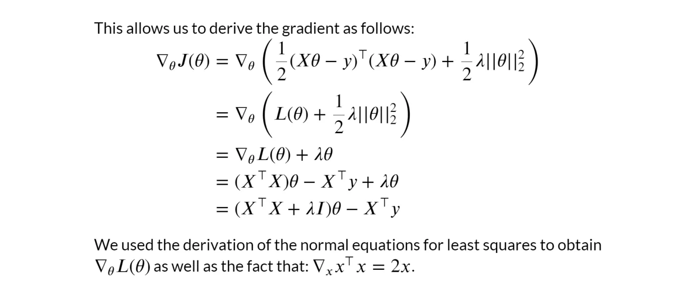

- 위 목적함수의 gradient를 구하면
	- 최솟값이 되는 지점을 찾기 위해
$$

\nabla_\theta J(\theta)
= \nabla_\theta L(\theta) + \lambda \theta
$$

- 위 식은 아래와 같아짐
$$

(X^T X)\theta - X^T y + \lambda \theta
$$

- 이 식은 아래와 같이 정리됨
$$

(X^T X + \lambda I)\theta - X^T y
$$
⇒ 이 gradient가 0인 지점이 목적함수가 최소인 지점

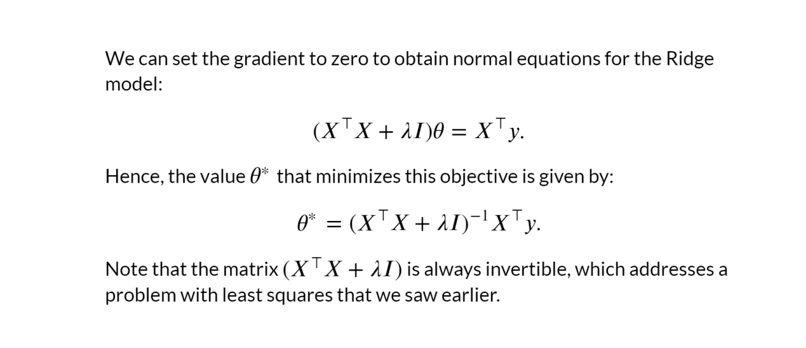

$$

(X^T X + \lambda I)\theta - X^T y = 0
$$

- 목적함수 최솟값을 구하기 위해 0으로 두면, 아래와 같이 이항해 정리 가능
$$

(X^T X + \lambda I)\theta = X^T y
$$

- 따라서 $`\theta`$ 앞의 항을 약분하면
$$

\theta^{*} = (X^T X + \lambda I)^{-1} X^T y
$$
⇒ 이떄 행렬 $`(X^T X + \lambda I)`$는 항상 역행렬이 존재

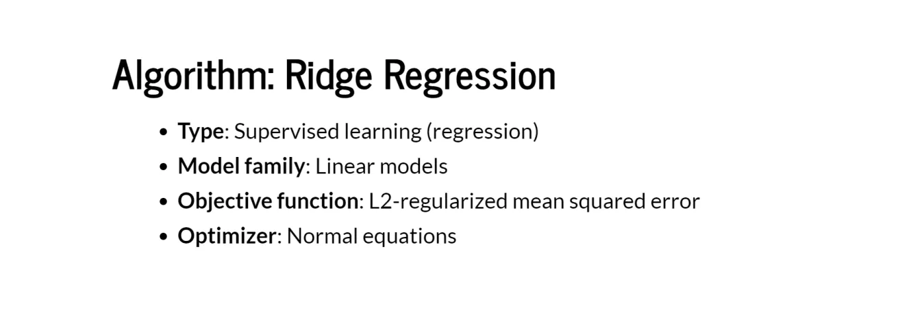

## Ridge Regression

- 유형(Type): 지도학습(회귀)
- 모델 계열(Model family): 선형 모델
- 목적함수(Objective function): L2 정규화된 평균제곱오차(MSE)
- 최적화기(Optimizer): 정규방정식(Normal equations)
***

# Part 5: 정규화와 Sparsity

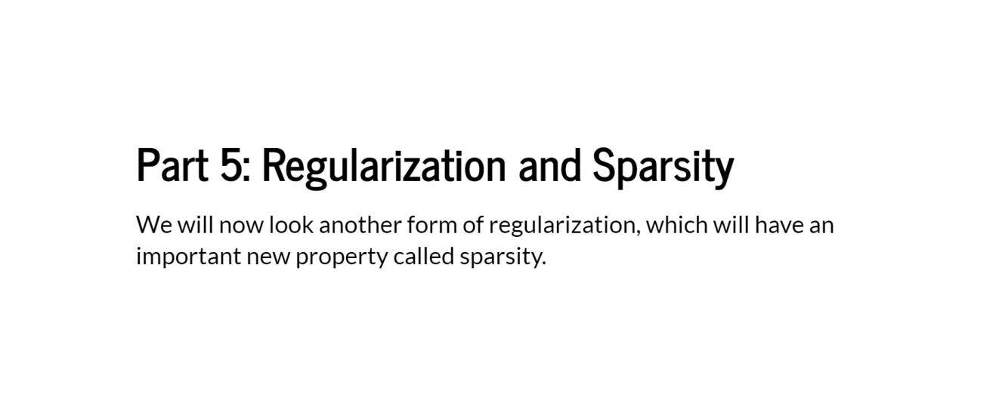

- s**parsity(희소성)**
	- 파라미터(가중치) 벡터에서 **0인 값이 매우 많은 상태**
→ 주로 Lasso에서 나오는 결과

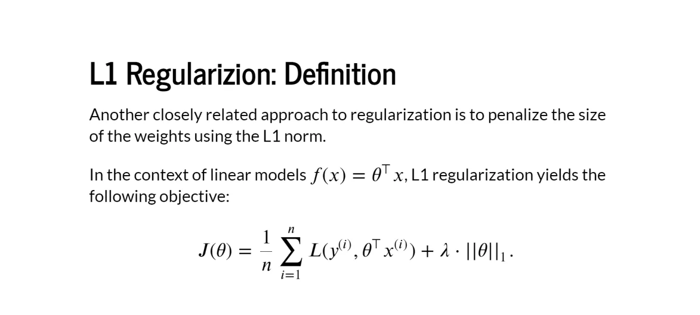

## L1 정규화: 정의

- L1 norm을 사용해 벌주는 것
- 선형 모델 $`f(x) = \theta^T x`$ 의 맥락에서, L1 정규화는 다음과 같은 목적 함수를 만듬
$$
J(\theta) = \frac{1}{n}\sum_{i=1}^{n} L(y^{(i)}, \theta^T x^{(i)}) + \lambda \cdot \|\theta\|_1
$$

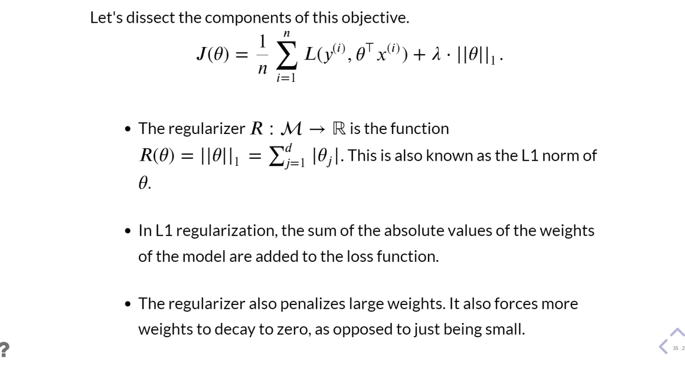

$$

R(\theta) = \|\theta\|_1 = \sum_{j=1}^{d} |\theta_j|
$$

- 위는 L1 정규화에서의 정규화 함수 $`R : \mathcal{M} \rightarrow \mathbb{R}`$
⇒ 이것은 $`\theta`$의 L1 norm 이라고도 부름

	- L1 norm == 절댓값의 함
	- 즉 모델 가중치 (세타)의 절댓값의 합이 손실 함수에 추가되는 것
- 이 정규화도 큰 가중치에 벌점을 주고 단순히 작게 만드는 것이 아니라 일부 가중치는 0으로 만들게 됨
⇒ L1 정규화는:

	- 큰 가중치도 벌주지만
	- **특히 0 근처에서 매우 강하게 작용**
	- 그 결과:
 - 어떤 가중치는 **완전히 0**
 - 어떤 가중치만 **살아남음**
	⇒ 그래서 L1은 **sparsity(희소성)**를 만듬

## 예시

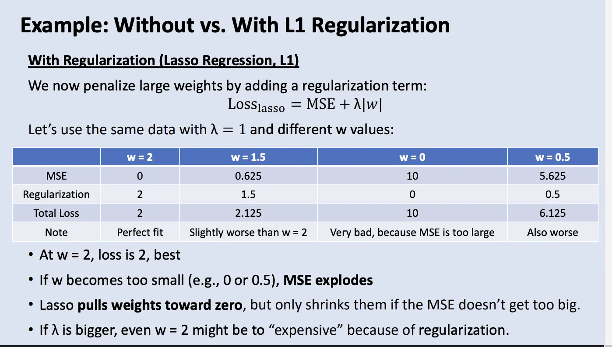

$$

\text{Loss}_{lasso} = \text{MSE} + \lambda |w|
$$

- L1 정규화(Lasso)는 가중치 절대값의 합에 패널티를 줌
- 위 표를 통해 알 수 있는 것
	- w=2 → 이 예시에서 가장 좋음 → MSE=0, 정규화=2 → 손실=2
	- w=(0,0.5) → 정규화는줄지만 MSE가 커짐 → 안좋아짐
	→ mse가 감당가능할 떄 까지 가중치를 0쪽으로 당기는 것이 Lasso의 목표

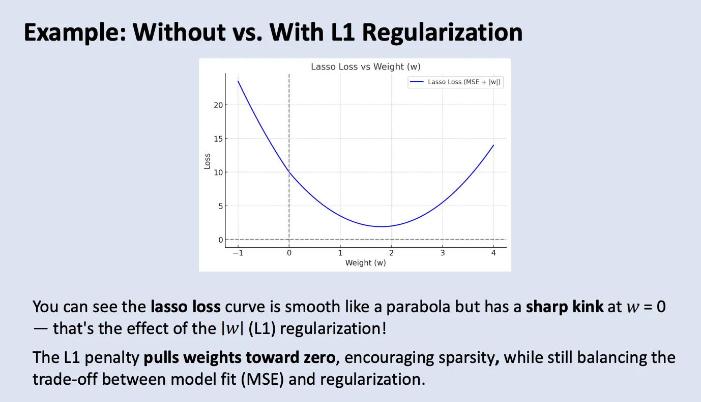

- Lasso 손실함수의 곡선은 실제로 w=0에서 꺾임이 존재
	- 절대값으로 인해 그러함
⇒ \|w\|에서 미분 불가능 → 그래서 0에서 걸림
⇒ L1 정규화의 \|w\| 때문에 w=0에 날카로운 꺾임이 생기고, 그 결과 가중치가 정확히 0이 되기 쉬워져 희소성이 만들어짐

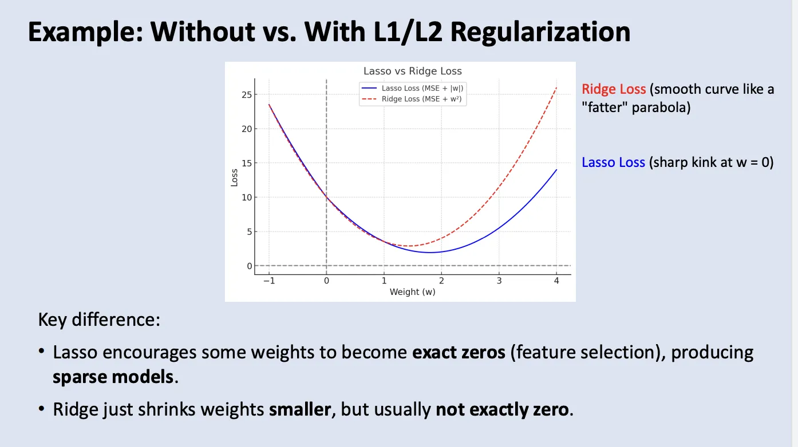

- ridge는 w\^2으로 인해 완전히 매끈 → 가중치가 작아질지언정 0이 되지는 않음
- lasso는 w=0에서 뾰족하게 꺾임 → 이 0 지점에 걸리는 경우가 많음

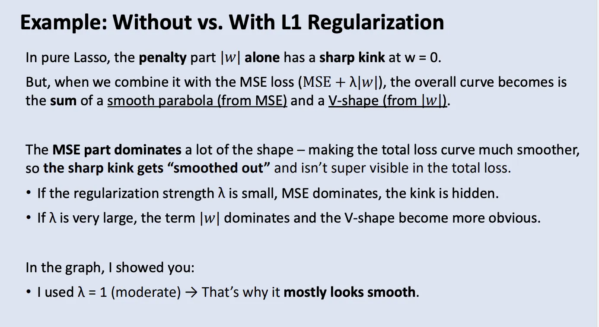

- 순수한 Lasso에서, 패널티 항 \|w\| 자체는 w=0에서 날카로운 꺾임(kink)을 가진다.
- 하지만 이를 MSE 손실과 결합하면 (MSE + λ\|w\|), 전체 곡선은
	- MSE에서 온 **부드러운 포물선**과
	- \|w\|에서 온 **V자 형태**의 합이 된다.
- MSE 항이 곡선 형태의 대부분을 지배하기 때문에,
	전체 손실 곡선은 더 매끄러워지고, 날카로운 꺾임은 잘 보이지 않게 된다.

- λ가 작으면 MSE가 지배하고, λ가 매우 크면 \|w\| 항이 지배한다.

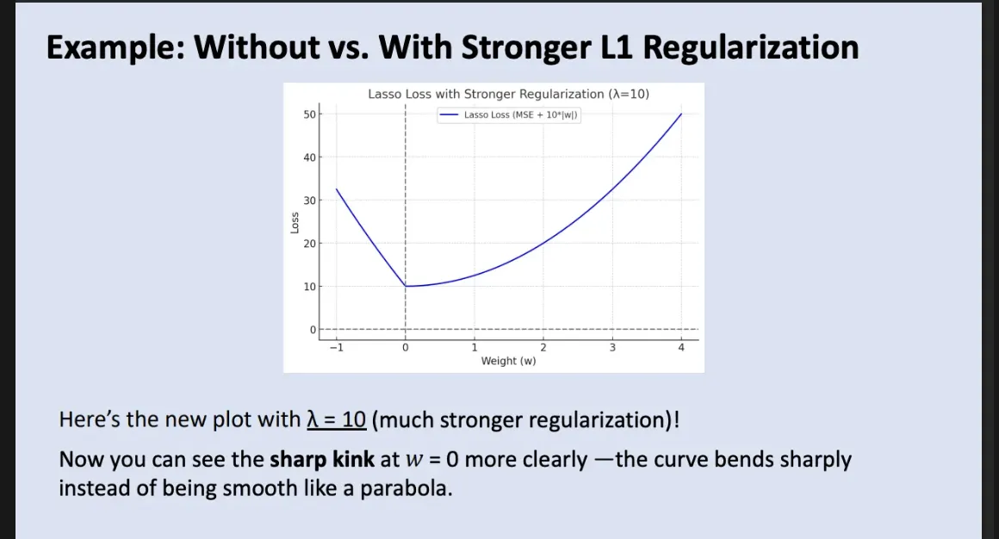

- 위는 $`\lambda`$가 10일 때의 그래프
- 꺾임이 잘 보임
	→ 위는 람다가 작아서 안보였던거

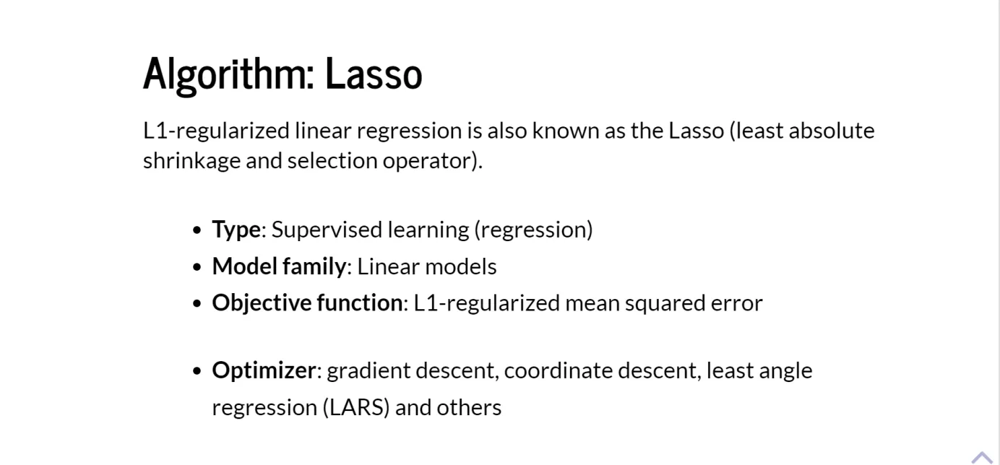

## Lasso 알고리즘

- L1 정규화된 선형 회귀는 Lasso(최소 절댓값 축소 및 선택 연산자)라고도 불림
- 유형: 지도학습 (회귀)
- 모델 계열: 선형 모델
- 목적 함수: L1 정규화된 평균제곱오차
- 최적화 방법: 경사하강법, 좌표 하강법, 최소각 회귀(LARS) 등

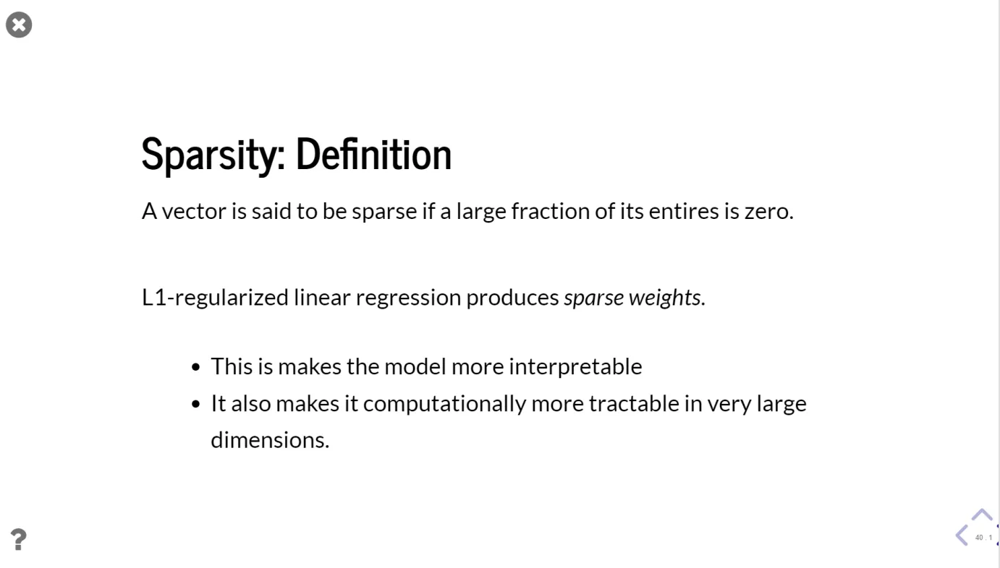

## Sparsity(희소성): 정의

- 벡터의 많은 원소가 0일 때, 그 벡터를 희소(sparse)하다고 함
- L1 정규화된 선형 회귀는 희소한 가중치를 만들어냄
	- 이는 모델을 더 해석 가능하게 만든다.
	- 또한 매우 높은 차원에서도 계산적으로 더 다루기 쉽게 만든다.
→ 부가설명

	1. **해석 가능성 증가**
 - 0이 아닌 가중치만 보면 되므로
 → 어떤 feature가 실제로 중요한지 명확

	2. **계산 효율 증가**
 - 고차원(피처 수 매우 많음)에서도
 → 0인 항은 계산에서 사실상 무시 가능

### Ridge 모델의 Sparsity

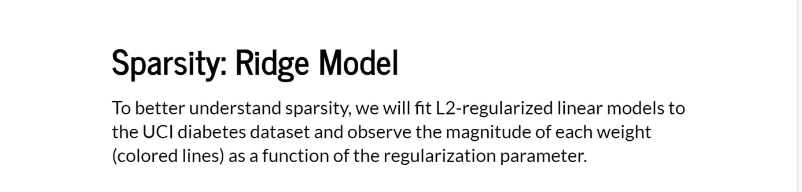

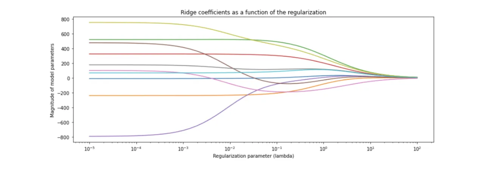

- 위는 Ridge모델의 람다 - 가중치 그래프(가로-람다, 세로 가중치)
	- 가중치에 무관하게 람다가 커지면 결국 0에 가까워짐
	- 그러나 정확히 0이 되지는 않음 → 극한같이 수렴하는 느낌

### Lasso 모델의 Sparsity

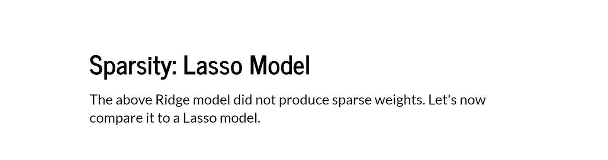

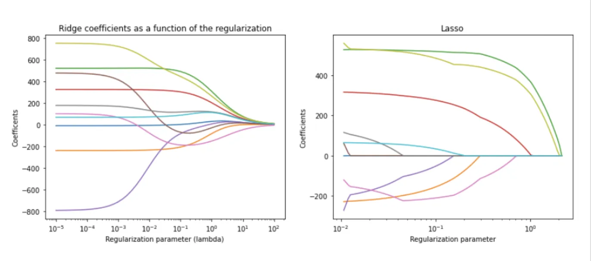

- Lasso모델에 Sparsity를 적용한 결과
- ridge는 부드럽게 0에 수렴, 정확히 0은 아님
- lasso는 급격하게 0이 됨, 정확히 0

# 정리

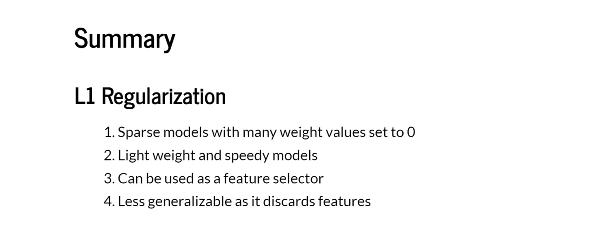

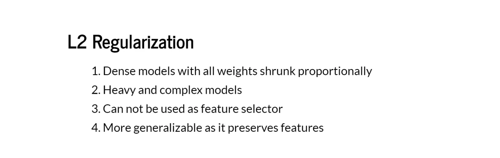

## L1 정규화(Lasso)

1. 많은 가중치 값이 0으로 설정된 희소(sparse) 모델
2. 가볍고 빠른 모델
3. 특징 선택기(feature selector)로 사용할 수 있음
4. 특징을 버리기 때문에 일반화 성능이 더 낮을 수 있음

## L2 정규화(Ridge)

1. 모든 가중치가 비례적으로 줄어드는 밀집(dense) 모델
2. 무겁고 복잡한 모델
3. 특징 선택기로 사용할 수 없음
4. 특징을 보존하므로 일반화 성능이 더 좋음

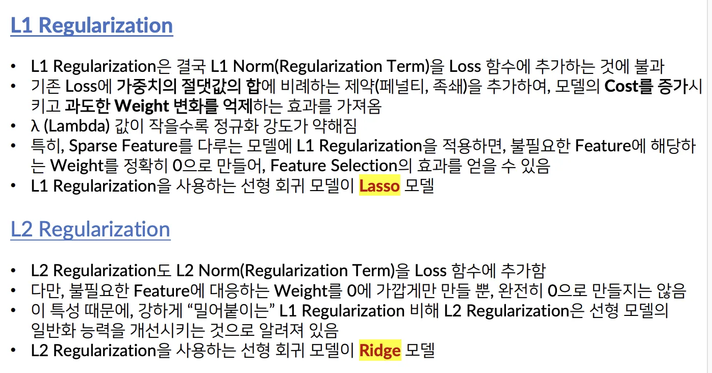

### **L1 Regularization (Lasso)**

- \*손실 함수에 L1 노름(가중치 절댓값의 합)**을 추가하는 방식
- 효과:
	- 가중치의 **절댓값에 직접 패널티**를 줌
	- 일부 가중치가 **정확히 0이 됨**
- 결과:
	- **Sparse 모델**생성 (많은 weight = 0)
	- **Feature selection 가능**(중요하지 않은 피처 제거)
- 단점:
	- 피처를 아예 버리므로, 상황에 따라 **일반화 성능이 떨어질 수 있음**
- 용도:
	- 피처 수가 많고, **불필요한 피처가 많다고 의심될 때**

### **L2 Regularization (Ridge)**

- \*손실 함수에 L2 노름(가중치 제곱합)**을 추가하는 방식
- 효과:
	- 모든 가중치를 **비례적으로 작게 줄임**
	- 가중치가 **0에 가까워질 뿐, 0이 되지는 않음**
- 결과:
	- **Dense 모델**(대부분의 피처를 유지)
	- Feature selection은 불가
- 장점:
	- 피처를 보존하면서 **일반화 성능을 안정적으로 개선**
- 용도:
	- 모든 피처가 어느 정도 의미가 있다고 볼 때
	- 예측 성능/안정성이 중요한 경우

**피처 선택기(feature selector) → 많은 입력 변수(feature) 중에서, 쓸모없는 것들은 버리고 중요한 것만 자동으로 고르는 메커니즘**
