> 원본 Notion 정리 — 강의 슬라이드 이미지 + 설명.
***

# Classification

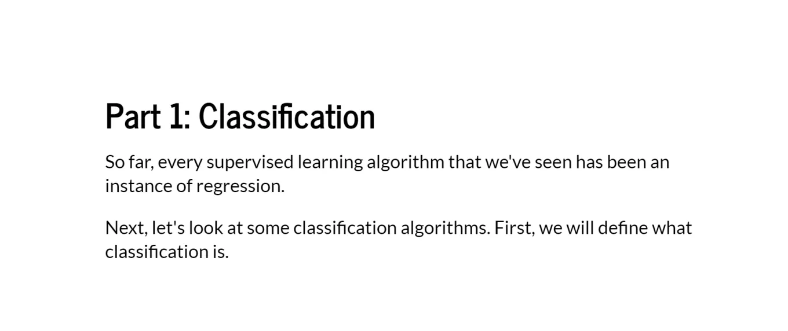

→ 지금부터는 분류 알고리즘 배움

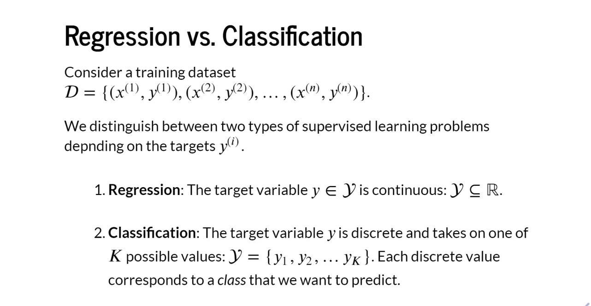

## 회귀 vs 분류
$$

D = \{(x^{(1)}, y^{(1)}), (x^{(2)}, y^{(2)}), \dots, (x^{(n)}, y^{(n)})\}
$$

- 타겟 값에 따라 분류 → 회귀 vs 분류
- 위 학습 데이터셋 D에서 y자리가 타겟 값
1. 회귀: 타깃 변수 y는 연속값이며, $`\mathcal{Y}`$ 는 실수 집합의 부분집합
2. 분류: 타깃 변수 y는 이산적이며 K개의 가능한 값 중 하나를 가짐
	- 각 이산 값은 우리가 예측하려는 하나의 클래스에 해당

# Binary Classification

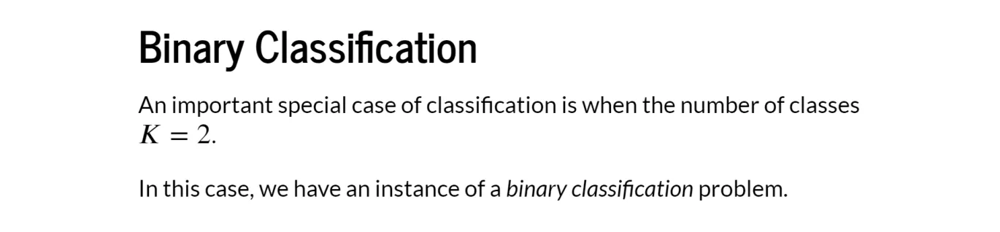

- 클래스 개수 K = 2인 경우 → 이진 분류

### 예시: 붓꽃 분류

- 아이리스 꽃은 **3가지 클래스**로 나뉨
	- Iris Setosa
	- Iris Versicolor
	- Iris Virginica

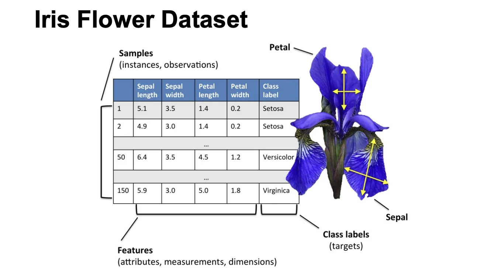

### **(1) Features (입력 변수)**
각 꽃은 **4개의 수치 특징(feature)**로 표현

- Sepal length (꽃받침 길이)
- Sepal width (꽃받침 너비)
- Petal length (꽃잎 길이)
- Petal width (꽃잎 너비)
	⇒ 모두 **연속적인 숫자 값**

### **(2) Class label (타깃)**

- 각 행의 마지막 열이 **클래스 라벨**
- Setosa / Versicolor / Virginica 중 하나
	⇒ **분류 문제**인 이유:

 - 타깃은 숫자가 아니라 **이산적인 클래스**
⇒ 데이터의 구조: $`(x_1, x_2, x_3, x_4) \rightarrow \text{class}`$

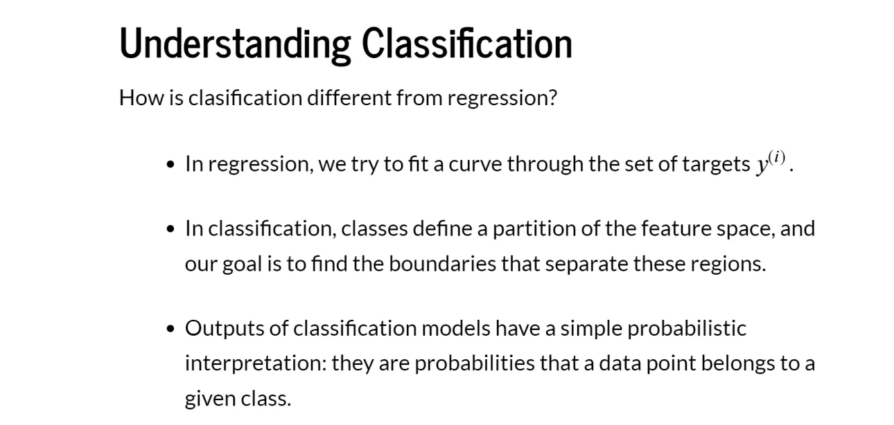

## 분류의 이해

- 회귀는 입력 x에 대해 연속적인 값 y를 예측
- 분류는 입력공간을 클래스별 영역으로 나눔
	- 분류 모델의 출력은 내부적으로 이 점이 특정 클래스에 속할 확률 → 확률 자체는 연속적
	- 최종적으로는 이산적인 출력으로 들어감

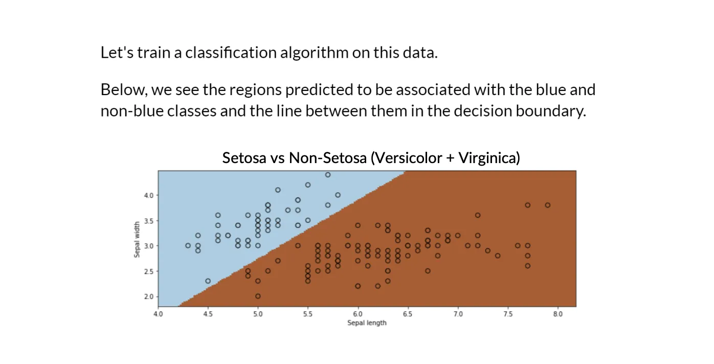

### 예시

- 위 붓꽃 예제를 Setosa와 Non-Setos로 나눔
- 두 색이 만나는 경계 → 결정 경계

# Logistic Regression

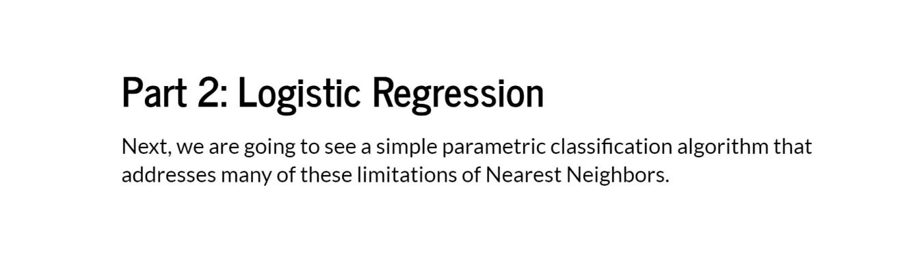

## 최소제곱 회귀를 분류 모델로 사용하는 경우

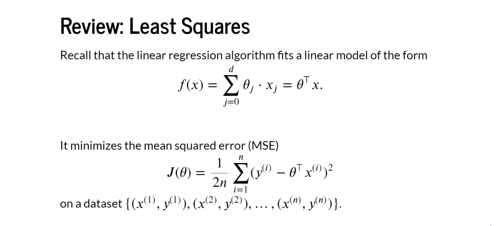

$$

f(x) = \sum_{j=0}^{d} \theta_j x_j = \theta^T x
$$

- 이 선형 모델은 MSE를 목적함수로 하는 → 최소제곱 회귀

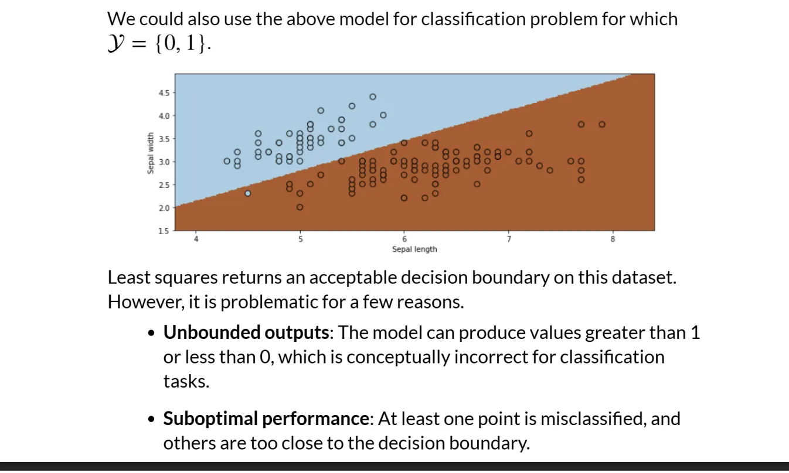

- 최소제곱 회귀는 분류에도 사용 가능
- **결정 경계(decision boundary)**자체는 만들어짐
- 그러나 문제점 있음
	1. Unbounded Output
 - 선형 회귀의 출력은:
 - $`(-\infty, +\infty)`$
 - 하지만 분류에서는:
 - 0과 1은 **클래스**
 - 또는 **확률처럼 해석되길 기대**
 → 값 자체가 적합하지 않음

	2. Suboptimal Performance
 - 전체 오차의 제곱합을 줄이는 것이 목표
 - 최소제곱은:
 - “전체 오차의 제곱합”을 줄이는 것이 목표
 - 분류에서는:
 - “경계를 잘 나누는 것”이 목표
 → 이 상황에서 성능이 낮을 수 있음

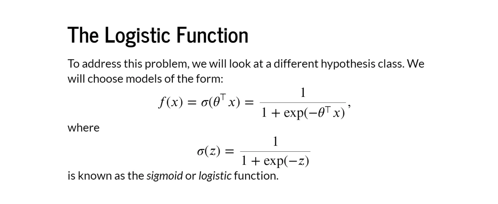

## 로지스틱 함수

- 위 문제 해결을 위해 아래 함수를 사용
	$$

f(x) = \sigma(\theta^T x) = \frac{1}{1 + \exp(-\theta^T x)}
	$$
	→ 기존 선형 회귀에 $`\sigma`$를 덧씌운 모습
	→ 기존 선형 회귀의 값을 특정 함수에 넣은 것
$$

\sigma(z) = \frac{1}{1 + \exp(-z)}
$$

- 위 시그마 함수는 logistic function 또는 시그모이드 함수라고 부름
⇒ $`1/(1+e^{-z})`$

→ 부가 설명

	- 이 모델은 **두 단계로 구성**됩니다.
 1. **선형 점수 계산**
 $`z = \theta^T x`$

 2. **시그모이드 함수 적용**
 $`f(x) = \sigma(z)`$
 ⇒ 입력 → 선형 점수 → 확률처럼 해석 가능한 값
→ 시그모이드 함수 성질
	$`\sigma(z) = \frac{1}{1 + e^{-z}}`$
	이 함수는:

	- 입력 z가 아무 값이어도
	- 출력은 항상 **0과 1 사이**
	성질:

	- $`z \to +\infty \Rightarrow \sigma(z) \to 1`$
	- $`z \to -\infty \Rightarrow \sigma(z) \to 0`$
	⇒ 분류에 **딱 맞는 출력 범위**

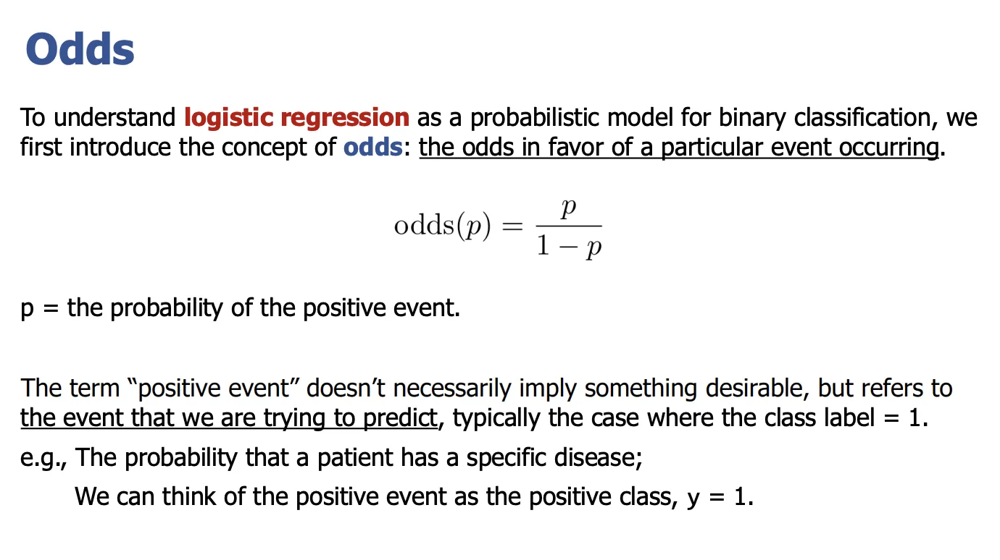

## Odds
$$

\text{odds}(p) = \frac{p}{1-p}
$$

- 특정 사건이 발생할 가능성
- p가 일어날 가능성
→ 확률 자체가 아니라 일어날 확률과, 일어나지 않을 확률의 비율

	- odds에 들어가는 파라미터 p는 확률
	- odds는 가능성이 비율
- p는 positive event의 확률 → positive 이벤트는 목표로 하는 사건 → p는 목표로 하는 사건이 일어날 확률

### **왜 확률 대신 odds를 쓰는가**

- 확률 p는 항상 **0~1 사이**
- odds는:
	- $`0 \sim \infty 범위`$
	- 수학적으로 다루기 쉬움 (특히 로그 변환)
⇒ 이 다음 단계에서 **log-odds**로 이어지기 위한 준비

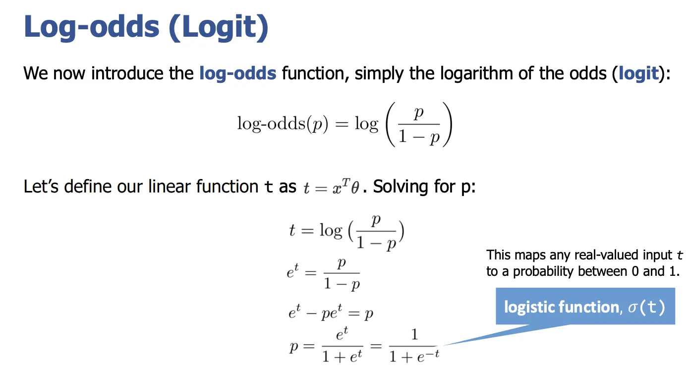

## Log-odds(Logit)
$$

\text{log-odds}(p) = \log\!\left(\frac{p}{1-p}\right)
$$

- 오즈(odds)에 로그를 취한 것
- 선형 함수 t를 $`t = x^T\theta`$로 정의하자. 이제 p에 대해 풀면,
	$$

t = \log\!\left(\frac{p}{1-p}\right)
e^{t} = \frac{p}{1-p}
p = \frac{e^{t}}{1+e^{t}} = \frac{1}{1+e^{-t}}
	$$

	- 위는 아래 식과 같음
 $$

\text{log-odds}(p) = x^T\theta
 $$
⇒ 이렇게 유도하면 자연스럽게 로지스틱함수가 나옴

	- $`1/(1+e^{-t})`$
	$$

p = \frac{1}{1+e^{-t}} = \sigma(t)
	$$

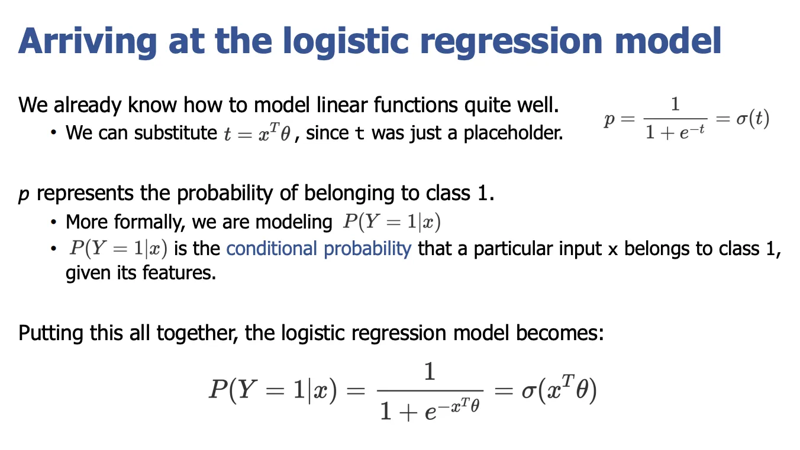

$$

P(Y = 1 \mid x) \;=\; \frac{1}{1 + e^{-x^T\theta}} \;=\; \sigma(x^T\theta)
$$

- **입력 **x**가 주어졌을 때**
- **정답이 1일 조건부 확률**
- 위 수식 설명
	- 입력 특징 x를 가중치 세타로 점수화한 뒤
	- 그 점수를 시그모이드에 통과시켜
	- **0~1 사이의 확률**로 해석

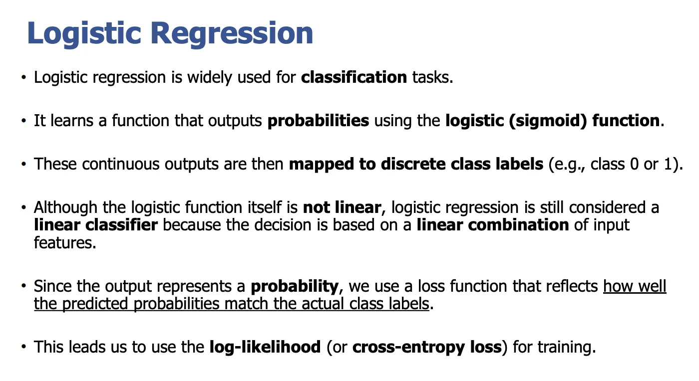

## 로지스틱 회귀

- 로지스틱 회귀는 분류 작업에 널리 사용된다. → 분류 알고리즘
- 로지스틱(시그모이드) 함수를 사용해 확률을 출력하는 함수를 학습한다.
- 이렇게 얻은 연속적인 출력은 이산적인 클래스 레이블(예: 0 또는 1)로 매핑된다.
- 로지스틱 함수 자체는 비선형이지만, 결정이 입력 특징들의 선형 결합에 기반하므로 로지스틱 회귀는 선형 분류기로 간주된다.
- 출력이 확률이기 때문에, 예측 확률이 실제 클래스 레이블과 얼마나 잘 맞는지를 반영하는 손실 함수를 사용한다.
- 그 결과 학습에는 로그우도(또는 크로스엔트로피 손실)를 사용하게 된다.
→ 분류 알고리즘

	- 수식의 뼈대가 선형 회귀와 같음
	- 선형 회귀를 시그모이드에 넣어서 0~1의 확률을 얻어내는 것

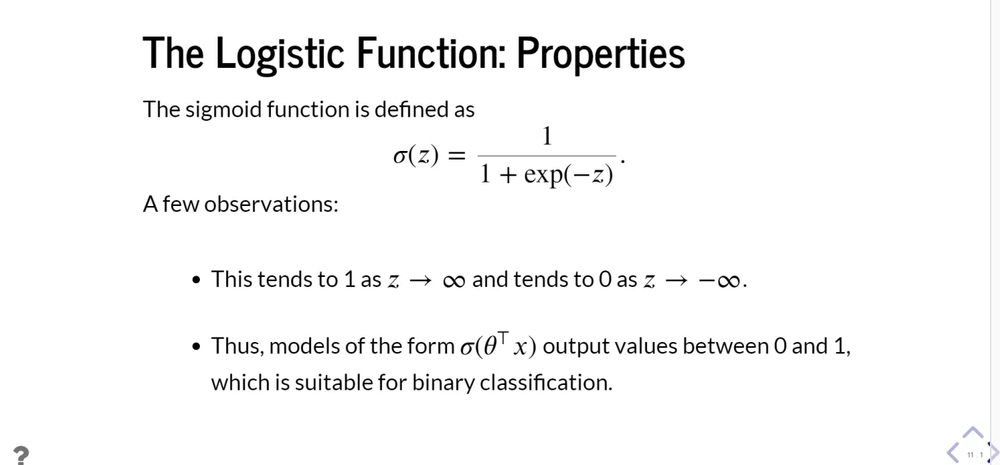

## 로지스틱 함수 특징
$$
\sigma(z) = \frac{1}{1 + \exp(-z)}
$$

- 이는 시그모이드 함수
- $`z \to \infty`$일 때 값은 1에 가까워지고, $`z \to -\infty`$ 일 때 값은 0에 가까워짐
⇒  $`\sigma(\theta^T x)`$ 형태의 모델은 0과 1 사이의 값을 출력하며, 이는 이진 분류에 적합 

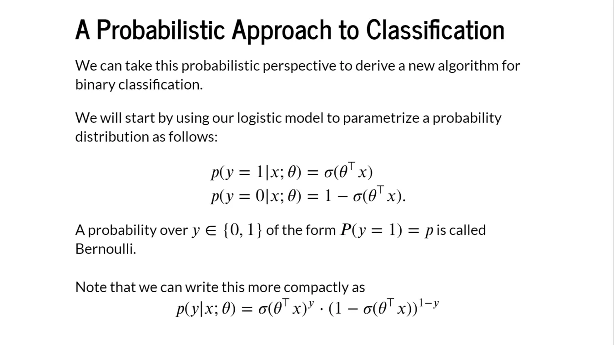

## 분류에 대한 확률적 접근법
$$

p(y=1 \mid x;\theta) = \sigma(\theta^T x)

$$
$$
p(y=0 \mid x;\theta) = 1 - \sigma(\theta^T x)
$$

- 위는 각각 입력 x가 1일 확률과 0일 확률
- 두 확률을 더하면 항상 1

### 베르누이 분포

- 출력 y가 0 또는 1만 가질 수 있을 때 이를 베르누이 분포라고 부름

### 위 확률에 대한 컴팩트한 표현
$$

p(y \mid x;\theta)
= \sigma(\theta^T x)^y \cdot (1-\sigma(\theta^T x))^{1-y}
$$

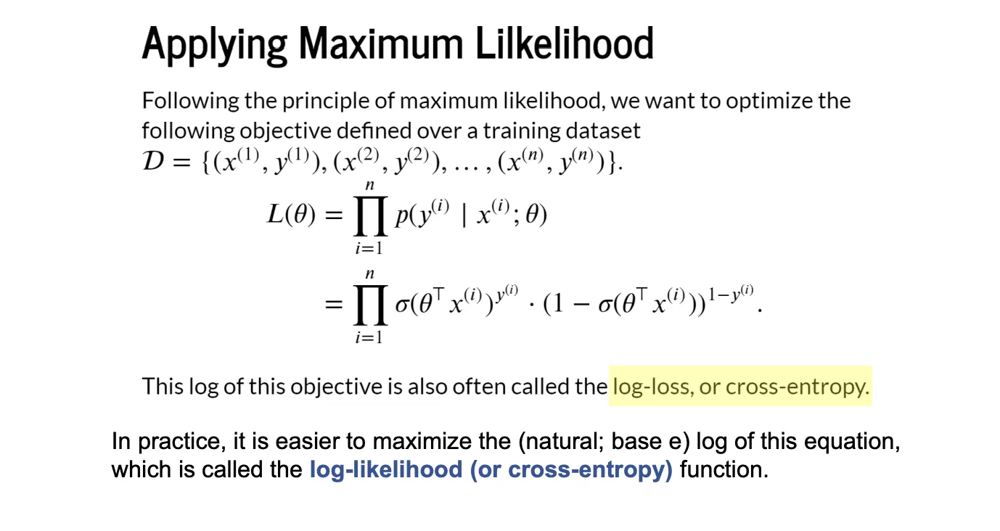

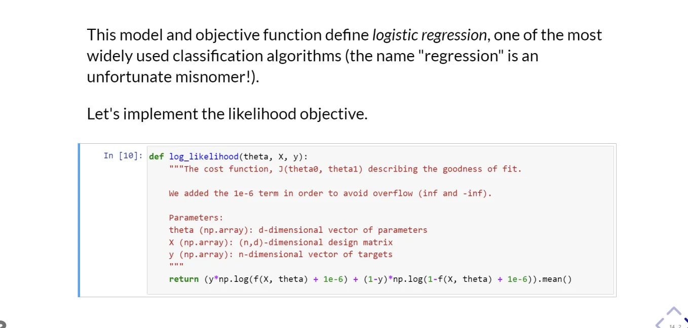

## Maximum Likehood 적용
$$

D=\{(x^{(1)},y^{(1)}),(x^{(2)},y^{(2)}),\dots,(x^{(n)},y^{(n)})\}
$$
$$

L(\theta)=\prod_{i=1}^{n} p\big(y^{(i)}\mid x^{(i)};\theta\big)

=\prod_{i=1}^{n}\sigma(\theta^T x^{(i)})^{y^{(i)}}\cdot
\big(1-\sigma(\theta^T x^{(i)})\big)^{1-y^{(i)}}
$$

- 모든 데이터가 관측될 확률을 최대화하는 파라미터 $`\theta`$를 찾음
- 이 목적함수에 로그를 취한 것을 로그 손실(log-loss) 또는 크로스엔트로피라고 함

### Maximum likehood

- 모든 확률을 곱하는 것
- 각 데이터마다:
	- 모델이 **정답을 맞출 확률**이 있음
	예:

	- 1번 데이터: 정답 맞출 확률 0.9
	- 2번 데이터: 정답 맞출 확률 0.8
	- 3번 데이터: 정답 맞출 확률 0.95
 전체적으로 잘 맞췄는지 보려면?
 **전부 곱함 → 0.9 x 0.8 x 0.95**

### 로그 씌우는 이유

- 로그를 취해서 모두 합으로 만들어 버림
$$
log(

0.9 × 0.8 × 0.95 × 0.97 ×

...) = log(0.9) + log(0.8)...
$$

이 식의 의미는 딱 이거입니다:

- **정답이 1이면**→ \\log(p)만 남김
- **정답이 0이면**→ \\log(1-p)만 남김

### 전체 수식
$$

L(\theta)
= \prod_{i=1}^{n}
\sigma(\theta^T x^{(i)})^{y^{(i)}}
\cdot
(1-\sigma(\theta^T x^{(i)}))^{1-y^{(i)}}
$$
→ 위 식에 로그 취하면
$$

\log L(\theta)
= \sum_{i=1}^{n}
\log\Big(
\sigma(\theta^T x^{(i)})^{y^{(i)}}
(1-\sigma(\theta^T x^{(i)}))^{1-y^{(i)}}
\Big)
$$
→ 여기서 로그의 기본 성질 적용하면

	- $`\log(ab) = \log a + \log b`$
	- $`\log(a^b) = b\log a`$
이 두 개만 쓰면:
$$
=
\sum_{i=1}^{n}
\Big[
y^{(i)}\log(\sigma(\theta^T x^{(i)}))
+
(1-y^{(i)})\log(1-\sigma(\theta^T x^{(i)}))
\Big]
$$

→ 이게 최종이고, 여기서 한 데이터만 떼는 경우에는 아래오 같아짐
$$

y\log(p) + (1-y)\log(1-p)

$$
→ $`p = \sigma(\theta^T x)`$

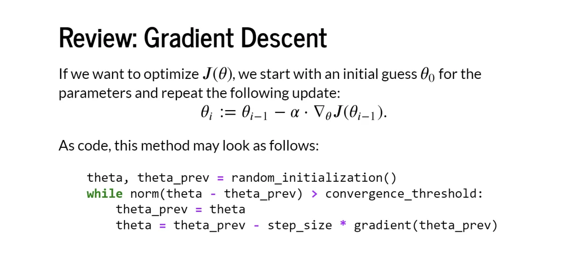

## 경사하강법: 복습
$$

\theta_i := \theta_{i-1} - \alpha \cdot \nabla_\theta J(\theta_{i-1})
$$

- 목적함수 $`J(\theta)`$를 최적화하려면, 파라미터의 초기값 $`\theta_0`$에서 시작해 다음 갱신을 반복

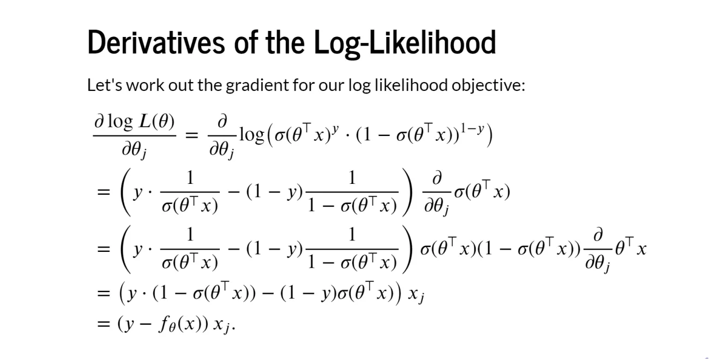

- 목적함수는 → log-likeihood
- 학습 방법 → 경사하강법
⇒ 경사하강법을 움직일 방향을 구해야함 → gradient

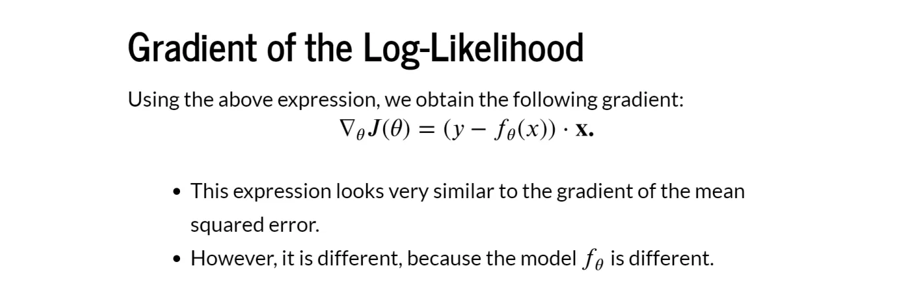

### 미분 해석

- 맨 마지막 줄의
$$
= (y - f_\theta(x))\,x_j
$$
여기서:

	- $`y : 실제 정답 (0 또는 1)`$
	- $`f_\theta(x)=\sigma(\theta^Tx) : 모델의 예측 확률`$
	- $`x_j : j번째 입력 값`$
1. **경우 1. 예측이 틀렸을 때**
	- y = 1
	- f_\\theta(x) = 0.2
	→ y - f_\\theta(x) = +0.8
 **θ를 그 방향으로 크게 움직여라**

2. **경우 2. 예측이 맞았을 때**
***

	- y = 1
	- f_\\theta(x) = 0.99
	→ y - f_\\theta(x) \\approx 0
 **거의 움직이지 마라**

3. **경우 3. 과하게 틀렸을 때**
***

	- y = 0
	- f_\\theta(x) = 0.9
	→ y - f_\\theta(x) = -0.9
 **강하게 반대 방향으로 움직여라**

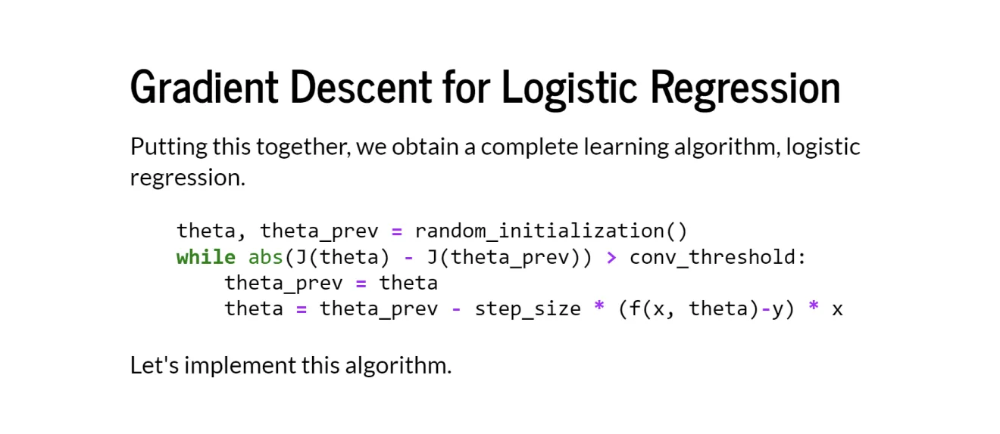

## 로지스틱 회귀의 경사하강법

- 앞에서 구한 것들:
	- 로지스틱 모델 $`f(x)=\sigma(\theta^T x)`$
	- 손실 함수 (로그우도 / 크로스엔트로피)
	- 그에 대한 gradient
⇒ 이걸 묶으면
	$$
	\theta \leftarrow \theta - \alpha (f_\theta(x) - y)x
	$$
	의미를 말로 풀면:

	- $`f(x,\theta)`$: 모델이 낸 **예측 확률**
	- y: 실제 정답
	- f - y: **예측 오차**
	- x: 그 오차에 책임 있는 입력

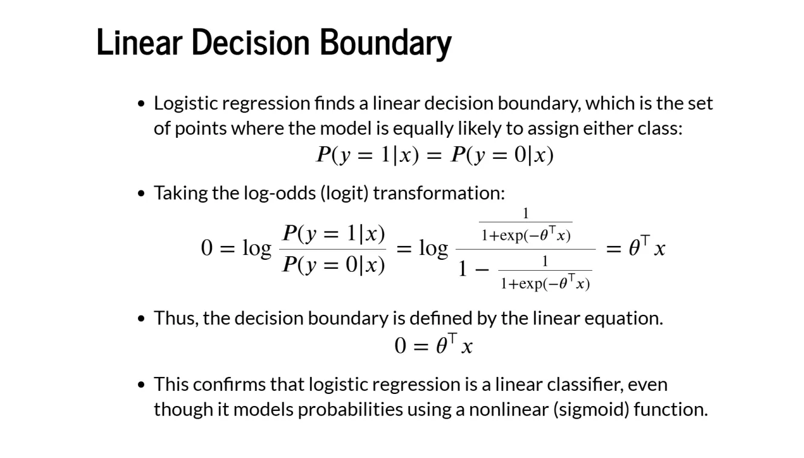

## 선형 결정 경계

- 로지스틱 회귀는 선형 결정 경계를 찾는데, 이는 모델이 두 클래스 중 어느 쪽에도 동일한 확률을 부여하는 점들의 집합
	$$

P(y=1\mid x) = P(y=0\mid x)
	$$

- 로그 오즈(logit) 변환을 취하면,
	$$

0
= \log \frac{P(y=1\mid x)}{P(y=0\mid x)}
= \log \frac{\frac{1}{1+\exp(-\theta^T x)}}{1-\frac{1}{1+\exp(-\theta^T x)}}
= \theta^T x
	$$
⇒ 결정 경계는 다음의 선형 방정식으로 정의
	$$
	0 = \theta^T x
	$$

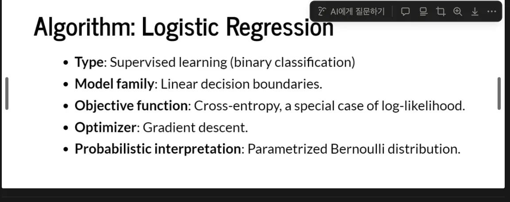

## 로지스틱 회귀 알고리즘

- 유형: 지도학습 (이진 분류)
- 모델 계열: 선형 결정 경계
- 목적 함수: 크로스엔트로피, 로그우도의 특수한 경우
- 최적화 방법: 경사하강법
- 확률적 해석: 파라미터화된 베르누이 분포
***

# 로지스틱 회귀 설명
## **1. 문제 설정: 우리가 풀고 싶은 것**

- **문제 유형**: 지도학습
- **목표**: 이진 분류
 $$
 y \in \{0,1\}
 $$

	- 예:
 - 스팸 / 정상
 - 질병 있음 / 없음
 - Setosa / Non-Setosa
 핵심 질문:
	> “입력
 **가 주어졌을 때, 정답이 1일 확률은 얼마인가?”**
***
## **2. 왜 선형 회귀를 그대로 쓰면 안 되는가**
### **선형 회귀의 문제**

- 출력:
 $$
 \hat y = \theta^T x \in (-\infty, +\infty)
 $$

	- 하지만 분류에서는:
 - 출력이 **확률(0~1)**이길 원함
 - 확률 해석 불가
 그래서 **출력을 바꿀 필요**가 있음
***
## **3. 해결책: 시그모이드(로지스틱) 함수**
### **로지스틱 함수**
$$
\sigma(z) = \frac{1}{1 + e^{-z}}
$$
### **특징**

- 입력: 모든 실수
- 출력: 항상 0 < \\sigma(z) < 1
 확률로 해석 가능
***
## **4. 로지스틱 회귀 모델**
### **모델 정의**
$$
f_\theta(x) = \sigma(\theta^T x)
$$
### **의미**
$$
f_\theta(x) = P(y=1 \mid x)
$$
즉,
> “입력이**주어졌을 때, 클래스 1일 확률”**
***
## **5. 확률적 관점 (중요)**
### **출력 **y**의 성질**
$$
y \in \{0,1\}
$$

- → **베르누이 분포**
### **모델의 의미**
$$
P(y=1 \mid x;\theta) = \sigma(\theta^T x)
$$
$$
P(y=0 \mid x;\theta) = 1 - \sigma(\theta^T x)
$$
 로지스틱 회귀는
	**베르누이 분포의 파라미터를 모델링하는 모델**
***
## **6. Odds 와 Log-odds (왜 선형이 되는가)**
### **Odds**
$$
\text{odds} = \frac{p}{1-p}
$$
### **Log-odds (logit)**
$$
\log\frac{p}{1-p}
$$
### **핵심 가정**
$$
\log\frac{P(y=1\mid x)}{P(y=0\mid x)} = \theta^T x
$$
 **log-odds를 선형으로 가정**
	이 가정의 결과가:
	$$
	P(y=1\mid x) = \sigma(\theta^T x)
	$$
***
## **7. 결정 경계 (Decision Boundary)**
### **경계 정의**

- 두 클래스 확률이 같을 때:
 $$
 P(y=1\mid x) = P(y=0\mid x)
 $$
### **log-odds 적용**
$$
\theta^T x = 0
$$
 결정 경계는:

	- 2D → 직선
	- 3D → 평면
	- 고차원 → 초평면
 **그래서 로지스틱 회귀는 선형 분류기**
(시그모이드는 확률용, 경계는 선형)
## **8. 학습 목표: 무엇을 최적화하나**
### **아이디어**

- 모델이 **정답을 낼 확률을 최대화**
### **Likelihood (우도)**
$$
L(\theta) = \prod_{i=1}^n P(y^{(i)}\mid x^{(i)};\theta)
$$
### **로그를 취하면**
$$
\log L(\theta)
= \sum_i
\big[
y^{(i)}\log p^{(i)} + (1-y^{(i)})\log(1-p^{(i)})
\big]
	$$
	이게 바로:

	- **log-likelihood**
	- **cross-entropy loss**
	- **log-loss**
 이름만 다르고 **같은 식**
***
## **9. 손실 함수 (한 데이터 기준)**
$$
\ell(y,p)
= -\big[y\log p + (1-y)\log(1-p)\big]
$$
### **의미**

- 정답이 1인데 p가 작으면 → 큰 벌점
- 정답이 0인데 p가 크면 → 큰 벌점
 **확률 예측에 최적화된 손실**
	⇒ 이게 크로스 엔트로피
***
## **최적화 방법: 경사하강법**
### **Gradient 결과 (중요)**
$$
\nabla_\theta J(\theta) = (f_\theta(x) - y)\,x
$$
### **업데이트 식**
$$
\theta \leftarrow \theta - \alpha (f(x)-y)x
$$
### **직관**

- 예측이 틀릴수록 → 크게 수정
- 입력 값이 클수록 → 그 feature의 가중치 많이 수정
***
## **1.1. 최종 알고리즘 요약**
**로지스틱 회귀 = 이 5개로 끝**

1. **문제**: 이진 분류 (지도학습)
2. **모델**:
 $$
 f(x)=\sigma(\theta^T x)
 $$

	3. **출력 해석**:
 $$
 P(y=1\mid x) (베르누이)
 $$

	4. **손실**: 크로스엔트로피 (로그우도)
	5. **학습**: 경사하강법

***

# 다중 클래스 분류

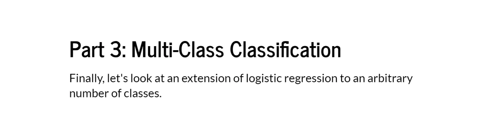

→ 로지스틱 회귀를 임의의 개수의 클래스에 대해 확장하는 방법

	- 로지스틱 회귀로 3개 이상을 하는 방법

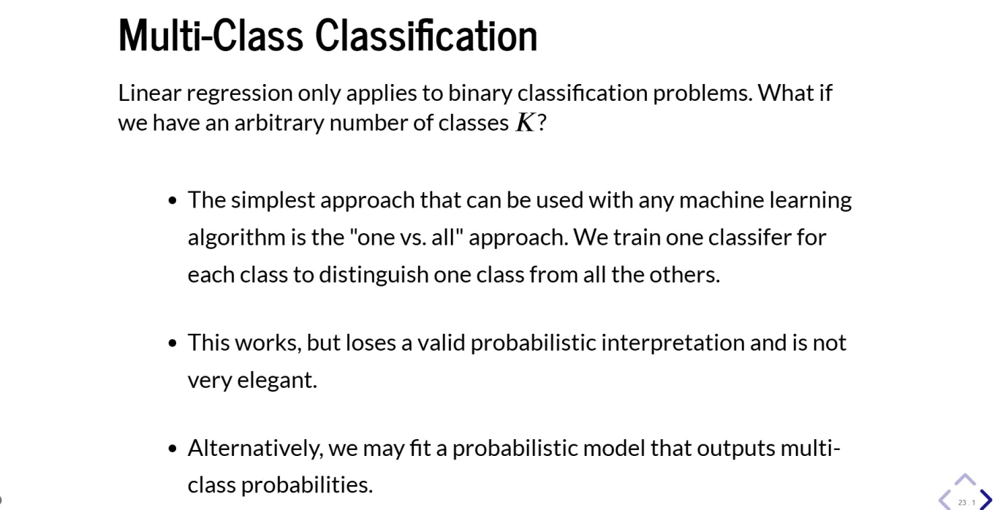

## 멀티 클래스 분류

- 로지스틱 회귀로 K ≥ 3인 클래스 분류
- 가장 단순한 방법은 “one vs. all” 접근법
	- 각 클래스마다 하나의 분류기를 학습시켜 모든 클래스와 구분
	- 동작은 하지만, 별로
- 다중 클래스 모델을 직접 출력하는 확률 모델 학습

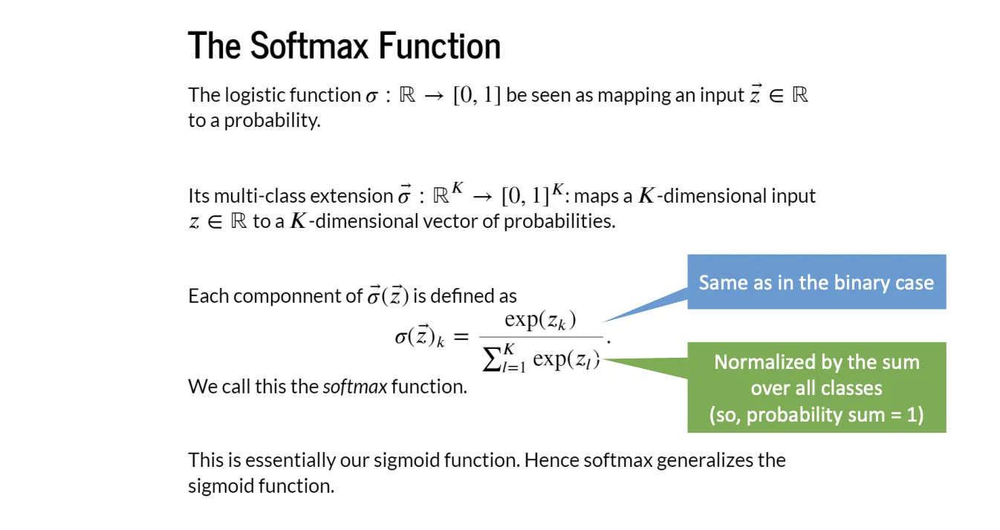

## 소프트맥스 함수

- 로지스틱 함수 $`\sigma : \mathbb{R} \to [0,1]`$는 실수 입력 $`z \in \mathbb{R}`$를 하나의 확률로 매핑하는 함수로 볼 수 있음
- 그 다중 클래스 확장은
$$
\vec{\sigma} : \mathbb{R}^K \to [0,1]^K
$$

- K차원 입력 벡터 $`\vec{z} \in \mathbb{R}^K`$를 K차원의 확률 벡터로 매핑

⇒ 이 함수를 소프트맥스 함수라고 함

	- 본질적으로 시그모이드임(시그모이드의 일반화 버전)
→ 시그모이드를 **K개로 확장한 것**이 소프트맥스

### 소프트맥스 함수 예시

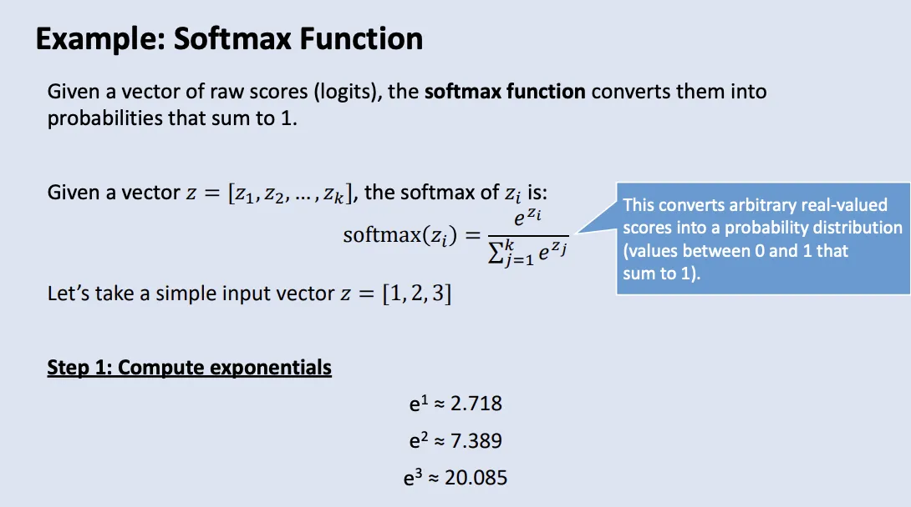

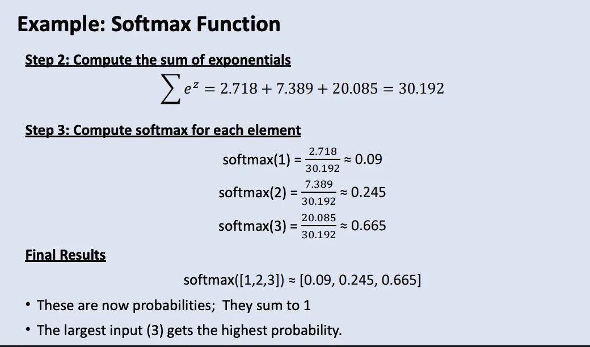

- 로짓(logits)이라 불리는 원시 점수 벡터가 주어지면, 소프트맥스 함수는 이를 합이 1이 되는 확률들로 변환
- 벡터 $`\mathbf{z} = [z_1, z_2, \dots, z_k]`$ 가 주어졌을 때, $`z_i`$에 대한 소프트맥스는 다음과 같음
	$$

\text{softmax}(z_i) = \frac{e^{z_i}}{\sum_{j=1}^{k} e^{z_j}}
	$$

### 계산 방법

1. 지수 계산 → $`exp(x) = e^x`$ ← 자연상수에 지수 씌워서 구함
	$$

e^1 \approx 2.718,\quad
e^2 \approx 7.389,\quad
e^3 \approx 20.085
	$$

2. 지수 합 계산
$$

\sum e^z = 2.718 + 7.389 + 20.085 = 30.192
$$

1. **각 원소에 대해 소프트맥스 계산**
$$
\text{softmax}(1) = \frac{2.718}{30.192} \approx 0.09
$$
$$
\text{softmax}(2) = \frac{7.389}{30.192} \approx 0.245
$$
$$
\text{softmax}(3) = \frac{20.085}{30.192} \approx 0.665
$$
⇒ 최종 결과
$$

\text{softmax}([1,2,3]) \approx [0.09,\;0.245,\;0.665]
$$

- 이것들은 이제 확률이며, 합은 1
- 입력값 3이 가장 큰 확률

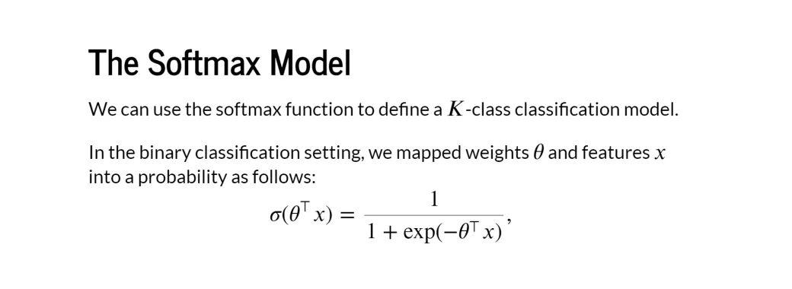

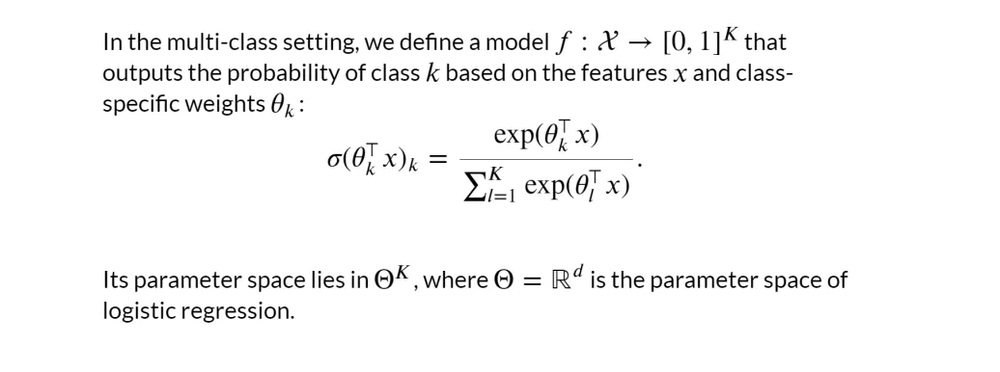

## 소프트맥스 모델

- 소프트맥스 함수를 사용하여 K개의 클래스를 가지는 분류 모델을 정의 가능
- 이진 분류에서는 가중치 세타와 특징 x를 하나의 확률로 매핑
	$$

\sigma(\theta^T x) = \frac{1}{1+\exp(-\theta^T x)}
	$$

- 다중 클래스에서는 입력 공간 X에서 각 클래스에 대한 확률 벡터 $`[0,1]^K`$를 출력하는 모델 f를 정의
	- 이때 클래스 K의 확률은 특징 x와 클래스별 가중치 $`\theta_k`$에 의해 결정
$$

\sigma(\theta_k^T x)_k
=
\frac{\exp(\theta_k^T x)}{\sum_{l=1}^{K}\exp(\theta_l^T x)}
$$
⇒ 이 모델의 파라미터 공간은 $`\Theta^K`$에 속하며, 여기서 $`\Theta = \mathbb{R}^d`$는 로지스틱 회귀의 파라미터 공간

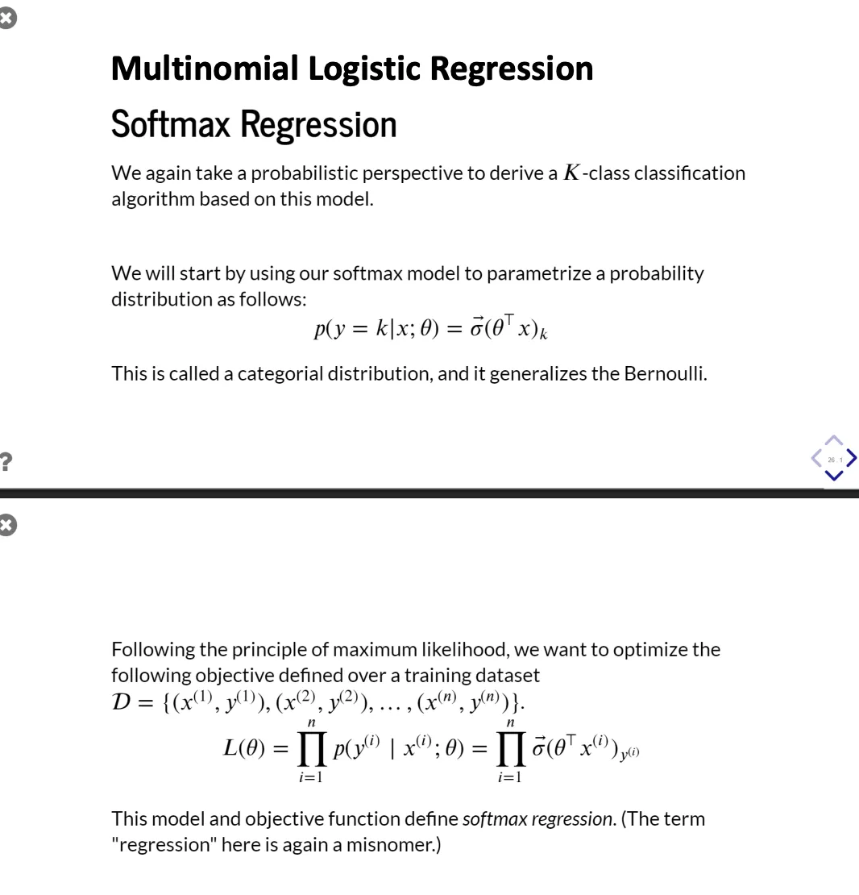

## 소프트맥스 로지스틱 회귀(multinomial 로지스틱 회귀)

- 소프트맥스 모델을 사용하여 다음과 같이 확률 분포를 파라미터화한다.
$$
p(y = k \mid x; \theta) = \vec{\sigma}(\theta^T x)_k
$$
→ 입력 x가 주어졌을 때 → 정답이 클래스 k일 **확률**

	- 다 더하면 항상 1
 $$

\sum_{k=1}^K p(y=k\mid x;\theta)=1
 $$

- 최대우도 원리에 따라, 다음과 같이 정의된 목적함수를 학습 데이터셋에 대해 최적화
$$

D=\{(x^{(1)},y^{(1)}),(x^{(2)},y^{(2)}),\dots,(x^{(n)},y^{(n)})\}
$$
$$

L(\theta)=\prod_{i=1}^{n} p(y^{(i)}\mid x^{(i)};\theta)
= \prod_{i=1}^{n} \vec{\sigma}(\theta^T x^{(i)})_{y^{(i)}}
$$
⇒ 이 모델과 목적함수는 소프트맥스 회귀를 정의

### 예시

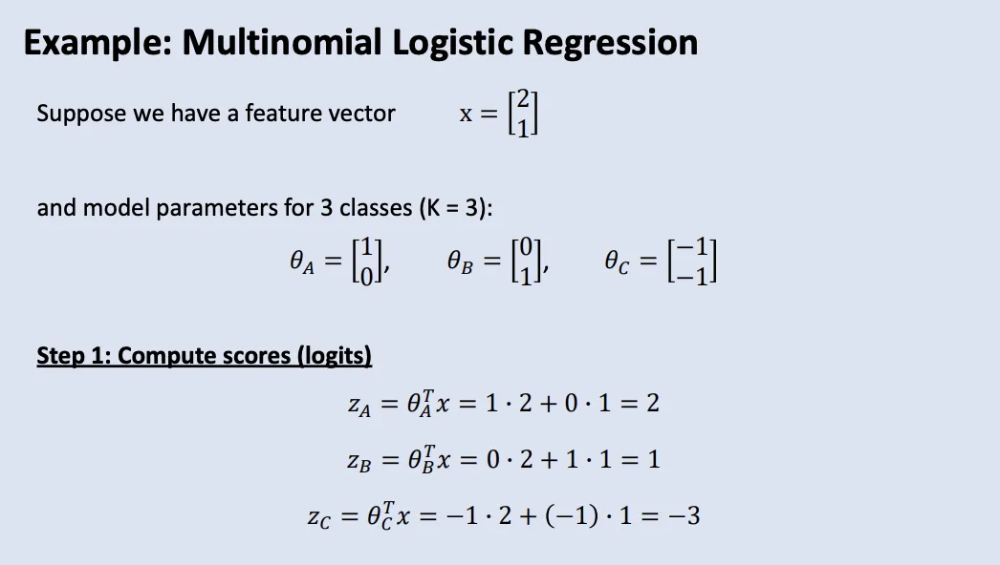

- 다음과 같은 특징 벡터가 있음 → $`x=\begin{bmatrix}2\\1\end{bmatrix}`$
- 3개의 클래스(K=3)에 대한 모델 파라미터는 아래와 같음
	$$

\theta_A=\begin{bmatrix}1\\0\end{bmatrix},\quad
\theta_B=\begin{bmatrix}0\\1\end{bmatrix},\quad
\theta_C=\begin{bmatrix}-1\\-1\end{bmatrix}
	$$

### 풀이

1. 점수(logit) 계산
	$$

z_A=\theta_A^T x = 1\cdot 2 + 0\cdot 1 = 2

	$$
$$

z_B=\theta_B^T x = 0\cdot 2 + 1\cdot 1 = 1

$$
$$

z_C=\theta_C^T x = (-1)\cdot 2 + (-1)\cdot 1 = -3
$$
→ 이 로짓은 이후 자연상수 e의 지수로 사용

1. 소프트맥스 적용해 클래스 확률 계산
$$

P(y=A\mid x)
=
\frac{e^2}{e^2+e^1+e^{-3}}
\approx
\frac{7.39}{7.39+2.72+0.05}
\approx 0.71

$$
$$

P(y=B\mid x)
=
\frac{e^1}{e^2+e^1+e^{-3}}
\approx
\frac{2.72}{7.39+2.72+0.05}
\approx 0.26

$$
$$

P(y=C\mid x)
=
\frac{e^{-3}}{e^2+e^1+e^{-3}}
\approx
\frac{0.05}{7.39+2.72+0.05}
\approx 0.003
$$
⇒ 클래스 A가 가장 높은 확률로 예측

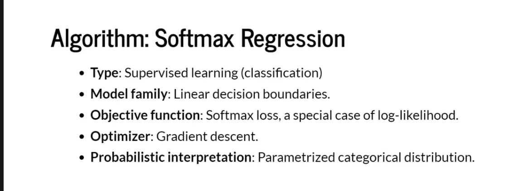

## 소프트맥스 회귀 알고리즘

- 유형: 지도학습 (분류)
- 모델 계열: 선형 결정 경계
- 목적 함수: 소프트맥스 손실, 로그우도의 특수한 경우
- 최적화 방법: 경사하강법
- 확률적 해석: 파라미터화된 범주형(categorical) 분포
***

# 소프트맥스 회귀 → 다중 클래스 분류 위해
## **왜 이 파트가 필요했나**
### **이전까지**

- **로지스틱 회귀**
 - 클래스: 2개
 - 출력:
 P(y=1\\mid x)=\\sigma(\\theta\^T x)

 - 분포: **Bernoulli**
 - 손실: **Binary Cross-Entropy**
### **문제 발생**

- 클래스가 **3개 이상(K ≥ 3)**이면?
 - 시그모이드는 확률 하나만 출력
 - “어느 클래스인가?”를 동시에 표현 못 함
 그래서 **다중 클래스용 확률 모델**이 필요해짐
***
## **2. 가장 단순한 방법: One-vs-All (왜 버렸는가)**

- 클래스 K개 → 이진 분류기 K개
- 각 모델이:
 - “이 클래스인가?”만 판단
### **문제**

- 확률의 합이 1이 아님
- 서로 경쟁하지 않음
- 확률적 해석이 깨짐
 **이론적으로 깔끔하지 않음**
***
## **3. 핵심 해결책: Softmax**
### **핵심 아이디어**
> 여러 개의 점수 → 하나의 확률 분포
$$
z = (z_1, z_2, \dots, z_K)
$$

- 여기서 각 $`z_k`$는 $`z_k = \theta_k^T x`$
- 의미 → 입력x**가 클래스K 에 얼마나 잘 맞는지에 대한 점수**
 - 한번 선형 모델을 돌린 결과
 → 이걸 소프트맥스에 넣어서 확률 분포로 변환하는 것

***
### **(1) 클래스별 점수 (logits)**
각 클래스마다:
$$
z_k = \theta_k^T x
$$

- 여기까지는 그냥 **선형 모델**
- 아직 확률 아님 (음수, 합≠1 가능)
***
### **(2) Softmax 함수**
$$
P(y=k\mid x)
=
\frac{e^{z_k}}{\sum_{l=1}^K e^{z_l}}
$$
이 한 줄이 이 파트의 핵심입니다.
### **Softmax가 보장하는 것**

- 모든 값 ∈ (0,1)
- 전부 더하면 = 1
- 큰 점수 → 훨씬 큰 확률
 **진짜 확률 분포**
***
## **4. Softmax = Sigmoid의 일반화**

- K = 2일 때:
 - softmax ⟶ sigmoid
	- 그래서:
 - 시그모이드는 **2-class softmax**
 로지스틱 회귀 → softmax 회귀는 **자연스러운 확장**
***
## **5. 확률 모델 관점 (아주 중요)**
### **이진 분류**

- 출력 분포: **Bernoulli**
 $$
 P(y\mid x)=p^y(1-p)^{1-y}
 $$
### **다중 클래스**

- 출력 분포: **Categorical**
 $$
 P(y=k\mid x)=\text{softmax}_k(z)
 $$
 Bernoulli의 다중 클래스 버전
***
## **7. 손실 함수: Softmax Loss = Categorical Cross-Entropy**
### **최대우도 관점**
$$
L(\theta)
=
\prod_i P(y^{(i)}\mid x^{(i)};\theta)
$$
로그 취하면:
$$
\sum_i \log P(y^{(i)}\mid x^{(i)})
$$
→ 이것이 바로
$$
\boxed{\text{Categorical Cross-Entropy}}
$$
### **One-hot 정답 **y**를 쓰면**
$$
\mathcal{L}
=
-\sum_{k=1}^K y_k \log p_k
	$$
***
## **8. 학습 방법**

- 손실 함수:
 - Softmax + Cross-Entropy
	- 최적화:
 - Gradient Descent
	- 파라미터:
 - \\theta_1,\\dots,\\theta_K
 구조는 **로지스틱 회귀와 완전히 동일**
	(단, 차원이 늘어남)
***
## **9. 결정 경계는 왜 선형인가**

- 결정은:
 \\arg\\max_k \\theta_k\^T x

	- 두 클래스 k,l의 경계:
 (\\theta_k-\\theta_l)\^T x = 0
 **항상 선형 경계**
	그래서:
	> “소프트맥스는 비선형인데 왜 선형 분류기냐?”
	> →
 **확률 함수는 비선형, 결정 경계는 선형**
