> 원본 Notion 정리 — 강의 슬라이드 이미지 + 설명.
> [← 전체 목차](/posts/학교공부/기계학습/목차/)

***

# Soft Margin

- 현재 까지는 모든 데이터가 완벽히 분리된다고 가정하고 모든 점이 마진 바깥에 있어야 한다고 생각
	⇒ 이게 Hard Margin

## 선형 분리가 불가능한 문제들

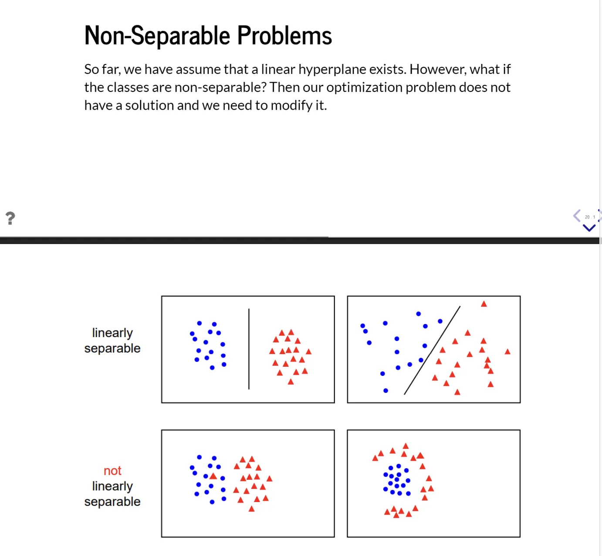

- 위는 선형(직선)으로 분리 가능 → 하드 마진 가능
- 아래는 그렇지 않음 → 소프트마진 필요
- 하드 마진으로는 풀기 힘들게 됨
- 하드 마진의 제약식은 아래와 같음 → 이는 무조건 모든 점이 마진 밖에 있다는 가정
$$

y_i(\theta^T x_i + \theta_0) \ge 1
$$

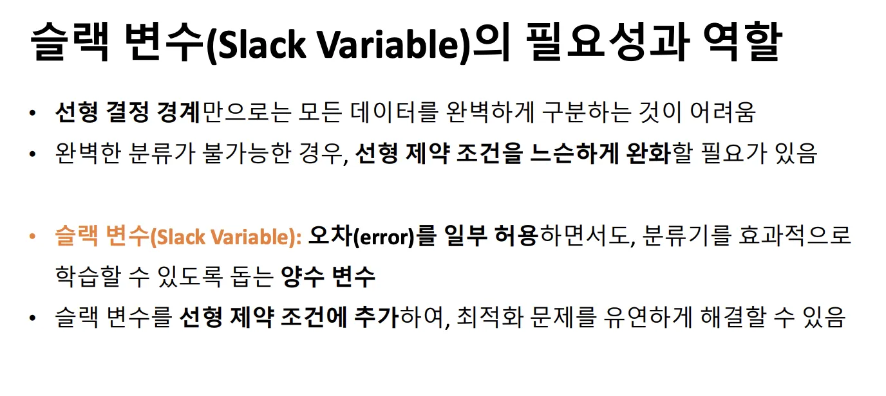

## 슬랙 변수

### **슬랙 변수 **$`\xi_i`$
제약식을 이렇게 바꿉니다:
$$
y_i(\theta^T x_i + \theta_0) \ge 1 - \xi_i
\quad,\quad \xi_i \ge 0
$$
→ 여기서 슬랙 변수는 이 점이 마진 규칙을 얼마나 어겼는지를 수치로 나타낸 값

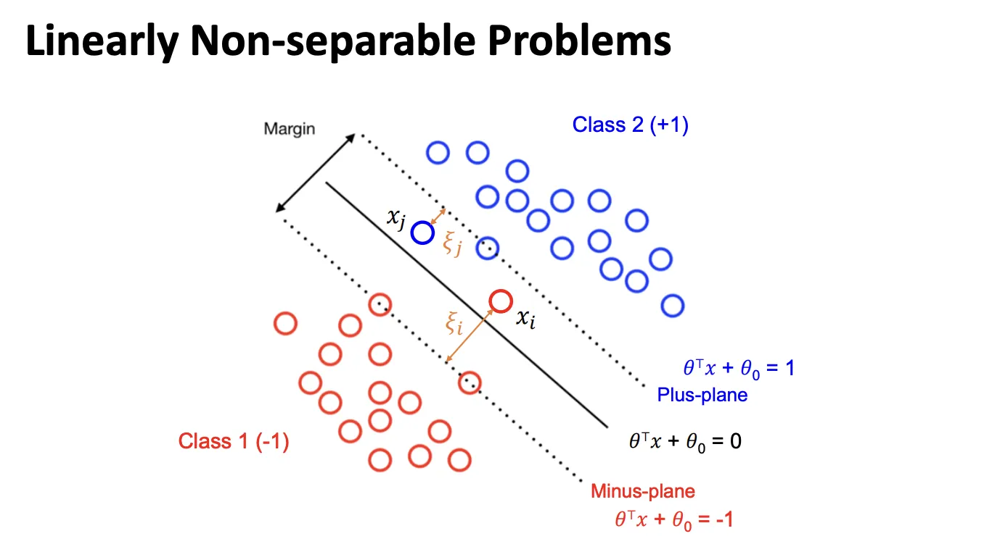

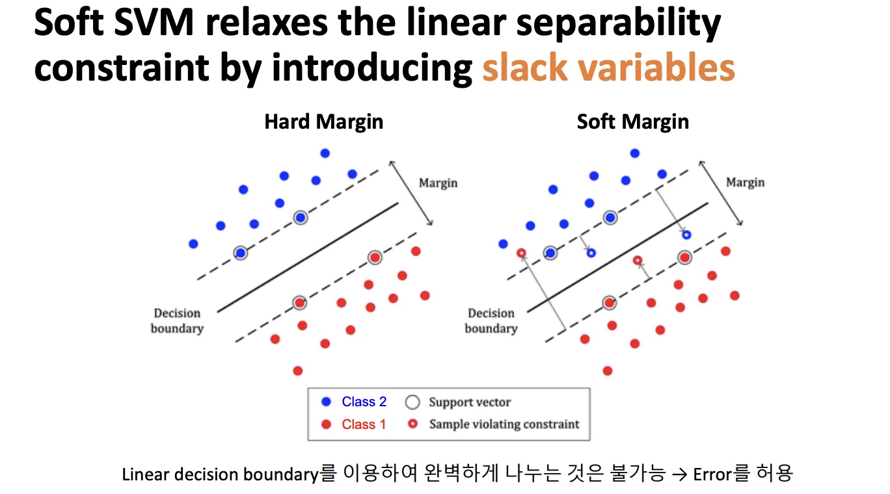

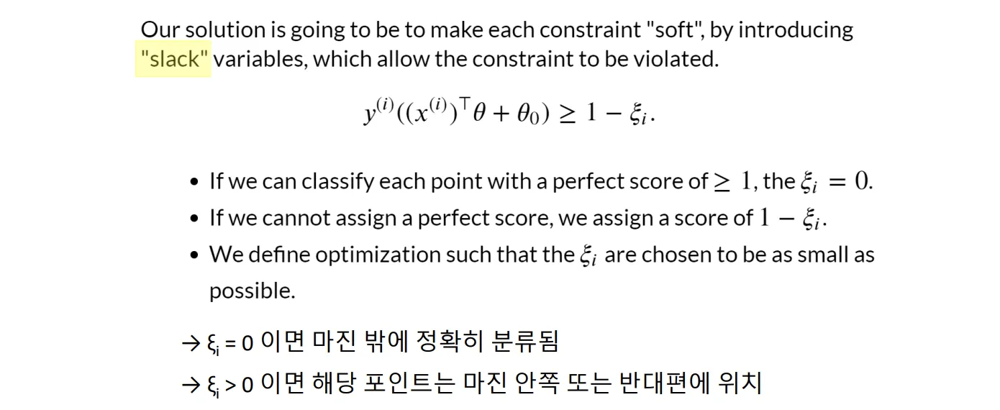

$$
y^{(i)}\big((x^{(i)})^T\theta + \theta_0\big) \ge 1 - \xi_i
$$

### **이 식의 의미를 단계적으로 풀면**

- 좌변:
	$`y_i(\theta^T x_i + \theta_0)`$
	→ **해당 점의 분류 점수(score)**
	→ 부호가 맞고, 크면 클수록 여유 있게 분류됨

- 우변:
	$`1 - \xi_i`$
	→ **원래 기준(1)에서 슬랙만큼 양보**
즉,

> “원래는 1 이상이어야 하지만,

> $`\xi_i`$ 만큼은 깎아주겠다.”

## 최적화의 목표는 아래와 같음

- 각 점을 1 이상의 완벽한 점수로 분류할 수 있다면, $`\xi_i = 0`$이다.
- 완벽한 점수를 줄 수 없다면, $`1 - \xi_i`$라는 점수를 부여
⇒ 우리는 $`\xi_i`$들이 가능한 한 작아지도록 최적화를 정의한다. 

# Soft SVM의 최적화

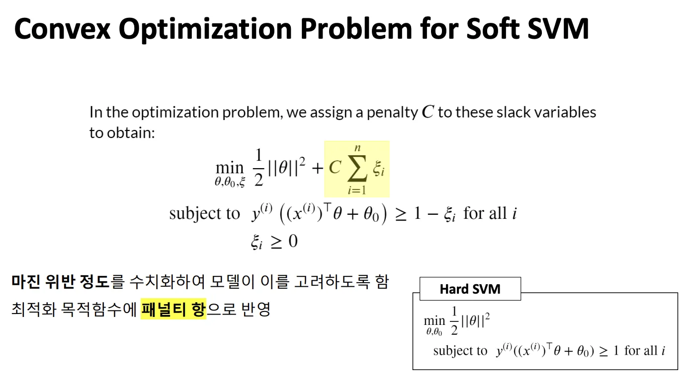

### 1. $`\frac{1}{2}\|\theta\|^2 :`$

### **마진 항**

- \\\|\\theta\\\|가 작을수록 → 마진이 큼
- 즉, 이 항을 최소화하는 것은
 **“결정경계를 최대한 단순하고 넓게 만들자”**
 **모델 복잡도 제어 (regularization)**
***

### 2. $`\sum_{i=1}^n \xi_i :`$

### **마진 위반 총량**

- 각 \\xi_i는
	- 마진 안으로 들어온 정도
	- 혹은 오분류의 정도
- 전부 더하면
 **전체 training error의 크기**
***

### **3. **C**:**

### **패널티 강도 (trade-off 조절기)**
$`\frac{1}{2}\|\theta\|^2
\quad \text{vs} \quad
C \sum \xi_i`$
이 두 항의 **힘의 균형을 조절**하는 게 C입니다.

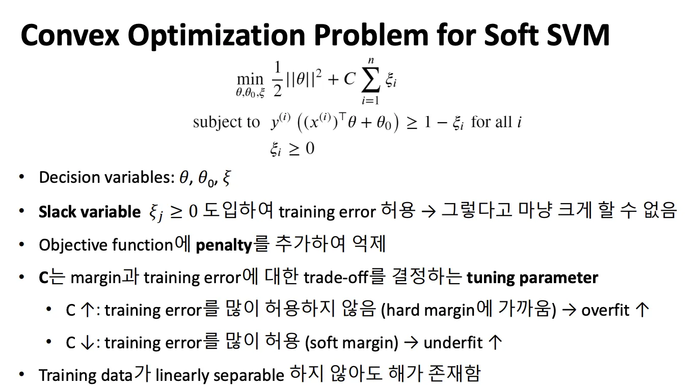

⇒ C를 잘 설정해야함

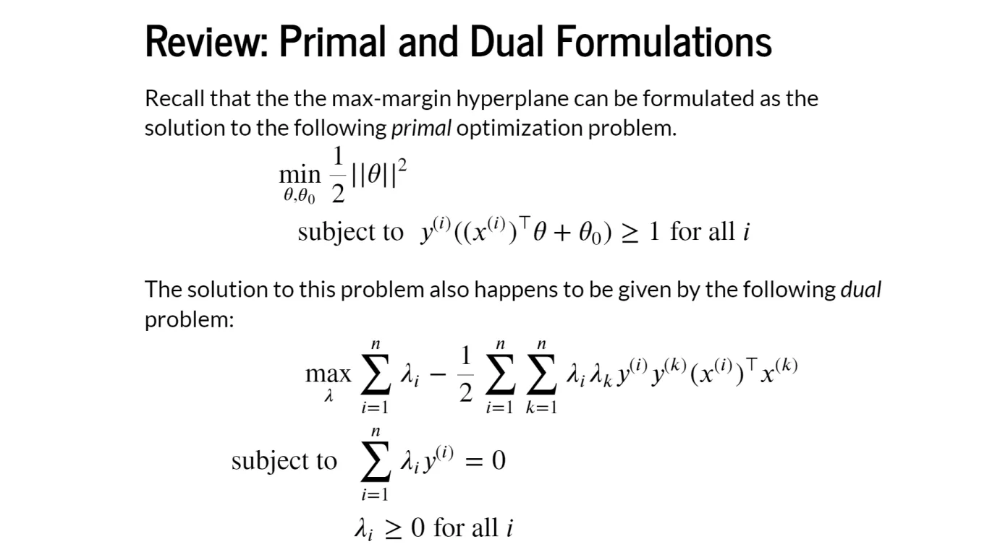

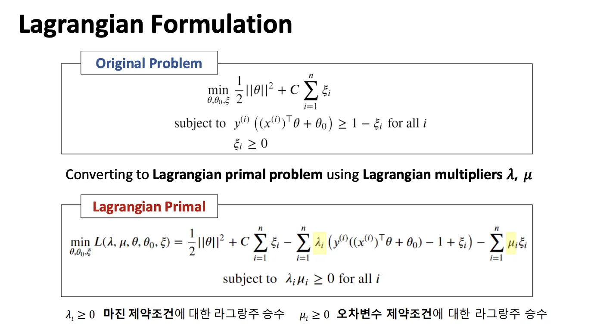

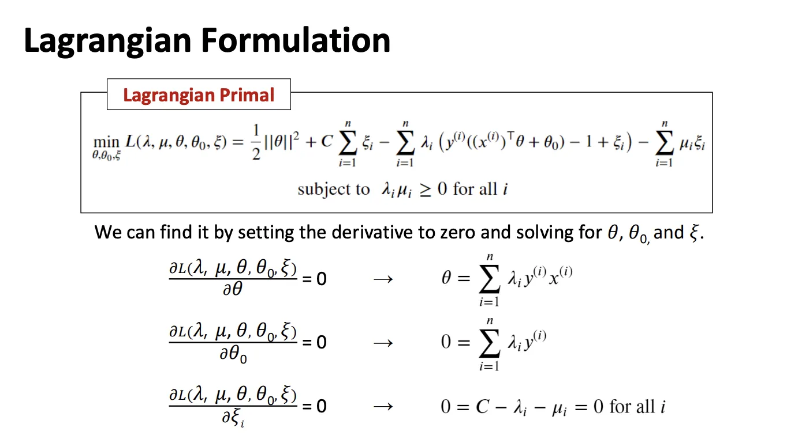

# 커널

# **① Kernels / The Kernel Trick: Motivation**

### **(슬라이드 핵심 문장)**

> So far, the majority of the machine learning models we have seen have been linear.

> In this lecture, we will see a general way to make many of these models non-linear.

### **직역**

- 지금까지 우리가 본 대부분의 머신러닝 모델은 **선형**이었다.
- 이번 강의에서는 이 모델들을 **비선형으로 만드는 일반적인 방법**을 배운다.
- 그 방법이 바로 **kernel**이다.

### **설명**
지금까지 SVM, 로지스틱 회귀 등은
 **입력 공간에서 직선(혹은 초평면)**만 만들 수 있었음
하지만:

- 실제 데이터는 **직선으로 분리 불가능한 경우가 많음**
- 그래서 **비선형 결정 경계**가 필요
 이 요구에서 **Kernel-based SVM**이 등장
***

# **② Solving nonlinear problems (선형으로 안 풀리는 예제 그림)**

### **(그림 설명)**

- 파란 점(+1), 빨간 점(−1)이 **엉켜 있음**
- 어떤 직선도 두 클래스를 잘 나누지 못함

### **슬라이드 문장 직역**

> Obviously, we would not be able to separate the examples using a linear hyperplane.
→ 선형 초평면으로는 분리가 불가능하다.

### **설명**
이 그림이 말하는 건 단순합니다.

- Hard / Soft SVM 이전 문제가 아님
- **아예 선형 모델의 표현력 한계**
 그래서 선택지는 두 가지:

1. 완전히 다른 모델 쓰기
2. **데이터 표현을 바꾸기**
SVM은 **2번**을 선택함
→ “공간을 바꾸자”
***

# **③ Kernel methods for linearly inseparable data (φ 매핑 아이디어)**

### **핵심 문장 직역**

> Project data into a higher-dimensional space via a mapping function Φ where the data becomes linearly separable.
→ 데이터를 **더 높은 차원으로 사상(매핑)**하면
→ 거기서는 **선형 분리가 가능해질 수 있다**

### **수식**
$$
\phi(x_1, x_2) = (x_1, x_2, x_1^2 + x_2^2)
$$

### **설명 (이게 진짜 핵심 직관)**

- 원래 공간: 2D
	→ 원 모양 데이터 → 직선 불가

- 새로운 공간: 3D
	→ “위/아래”로 분리 가능

- 3D에서는 **평면 하나로 분리**
- 다시 2D로 내려오면 → **곡선 결정경계**
 **비선형 문제를 선형 문제로 바꿔 푸는 전략**
***

# **④ Kernel Trick (왜 φ를 직접 쓰지 않는가)**

### **슬라이드 문장 직역**

> Constructing new features is computationally very expensive.
→ φ로 직접 차원 확장을 하면 계산 비용이 매우 큼

### **설명**
여기서 중요한 관찰이 하나 나옵니다:

> SVM은 φ(x) 자체를 쓰지 않는다
SVM dual 문제에는 오직 이것만 있음:
$$
\phi(x^{(i)})^T \phi(x^{(k)})
$$
즉:

- 벡터 자체
- **내적 값만 필요 **
 그래서 결론:

> “φ를 계산하지 말고

> φ의 내적 결과만 계산하는 함수
이 함수가 바로 **Kernel function**
***

# **⑤ Kernel Trick in SVM (수식의 완성)**

## **(1) 선형 SVM 예측식**
$$
\hat{y}_{new}
=
\text{sign}\Big(
\sum_{i\in SV} \lambda_i y_i (x^{(i)})^T x_{new} + \theta_0
\Big)
$$

- support vector만 사용
- 입력과의 **내적**
***

## **(2) 특징 공간으로 이동**
$$
(x^{(i)})^T x_{new}
\;\rightarrow\;
\phi(x^{(i)})^T \phi(x_{new})
$$

- 고차원 공간에서의 선형 분리
- x의 차원을 올림 → 파이(x)로 만드는 것
***

## **(3) Kernel Trick 적용 (최종 형태)**
$$
\hat{y}_{new}
=
\text{sign}\Big(
\sum_{i\in SV} \lambda_i y_i
K(x^{(i)}, x_{new})

+ \theta_0
\Big)
$$
여기서:
$$
K(x, x') = \phi(x)^T \phi(x')
$$

### **의미**

- φ는 **끝내 계산되지 않음**
- 우리는:
	- support vector
	- λ
	- kernel 함수
 만 사용
 **이게 커널 SVM의 최종 수식**

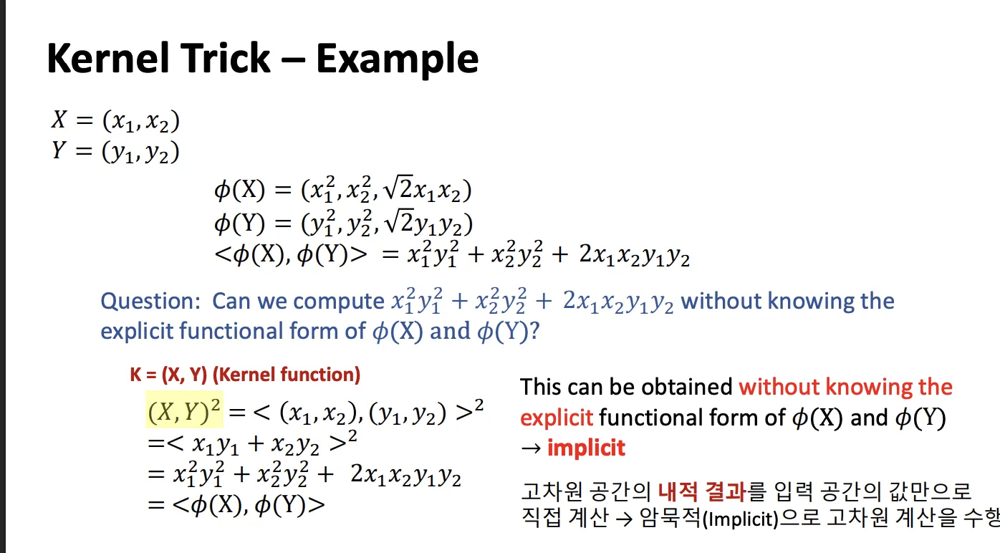

$$

K(X,Y) = (X,Y)^2 \\

= \langle (x_1,x_2),(y_1,y_2)\rangle^2 \\

= (x_1y_1 + x_2y_2)^2 \\

= x_1^2y_1^2 + x_2^2y_2^2 + 2x_1x_2y_1y_2 \\

= \langle \phi(X), \phi(Y) \rangle
$$

→ 커널은 사전에 알려진(내적 성질인 것을 골라서 사용하는 것)

⇒ 이 아래 문제 이따 풀어보기

***

> 비선형 분류를 수행하는 모델”이다.

> 데이터 사이의 관계(커널)만으로

> “데이터를 직접 보지 않고,

> SVM은

# **전체를 한 문장으로 요약**
***

- **관계 계산만 있음**
- 고차원 없음
- φ 없음
\\hat y(x) = \\text\{sign\} \\left( \\sum_\{i\\in SV\} \\lambda_i y_i K(x_i, x) + \\theta_0 \\right)

### **예측식**

- \\theta_0
- \\lambda_i
- support vector

### **학습 결과**

# **9. 최종 SVM (Kernel SVM)의 모습**
***

- RBF (가장 일반적)
- Polynomial
- Linear
그래서 자주 쓰는 것들:

- 즉, “어떤 φ의 내적”이어야 함
- 커널 행렬이 PSD

### **Mercer 조건**
단, 조건 있음:
 **사용자가 선택**
 자동 아님

# **8. Kernel 함수는 사전에 정해져 있나?**
***

- 그래도 SVM은 잘 동작
- RBF kernel은 φ를 **아무도 모름**
특히:

- 실제 사용에서는 **φ를 절대 안 씀**
- “정말 이런 커널이 어떤 φ에 대응됨”을 보여주기 위함
- **증명용**

### **답:**
중요한 질문이었음.

# **7. “그럼 φ는 왜 보여주나?”**
***
이게 **Kernel Trick**
 **커널 함수만 계산한다**
 **φ를 계산하지 않는다**
K(x_i, x_k) := \\phi(x_i)\^T \\phi(x_k)
그래서 정의:
만 필요
\\phi(x_i)\^T \\phi(x_k)
하지만 Dual SVM은:

- RBF의 경우 **무한 차원**
- \\phi(x)는 차원 폭발
문제:

# **6. Kernel Trick: φ를 버리는 순간**
***

- 선형 분리 가능
고차원 공간에서는:

- 특징 공간 \\phi(x)로 매핑
- 입력 x
그래서:

> 다른 공간에서는 선형일 수도 있지 않을까?”

> “입력 공간에서는 비선형이지만

## **문제 재정의**

# **5. Kernel의 핵심 아이디어**
***
이게 커널의 출발점

> “입력 간의 관계(내적)”만 쓴다

> 입력을 직접 쓰는 게 아니라
 이 말은 곧:

- 예측: x_i\^T x_\{new\}
- 학습: x_i\^T x_k
Dual SVM:

# **4. 결정적 관찰: “Dual에는 내적만 있다”**
***
**마진 위 + 마진 안 + 오분류 점까지 support vector**
 **Soft SVM에서는**

- **Support Vector**
- 마진 안 / 오분류

### **③ **\\lambda_i = C

- **Support Vector**
- 마진 위

### **② **0 < \\lambda_i < C

- 계산에도 안 들어감
- 경계와 무관

### **① **\\lambda_i = 0
KKT 조건으로 데이터가 3종류로 나뉨

# **3. KKT 조건: Support Vector의 정체**
***
→ **Support Vector**
 **결정경계는 일부 데이터만으로 결정됨**
\\theta = \\sum_i \\lambda_i y_i x_i

- 변수는 \\lambda_i뿐
- **내적 **x_i\^T x_k**만 남음**
- \\theta 사라짐

## **Dual의 결정적 특징**
그래서 **라그랑지안 → dual 문제**로 변환

- 비선형 확장 어려움
- 제약 많음
- 변수 많음
Soft SVM primal 문제는:

# **2. 왜 Dual로 가는가?**
***
 이 단계까지는 **아직 선형**

- **C**: 둘의 trade-off
- \\sum \\xi_i: 오차 작게
- \\\|\\theta\\\|\^2: 마진 크게 (모델 단순)
\\min \\frac12 \\\|\\theta\\\|\^2 + C\\sum_i \\xi_i

### **최적화 문제**

- \\xi_i > 0: 마진 안 / 오분류
- \\xi_i = 0: 완벽
- 마진 위반 정도

### **슬랙 변수 **\\xi_i

> 얼마나 틀렸는지는 벌점으로 관리하자”

> “조금 틀리는 건 허용하되,

## **핵심 아이디어**

# **1. Soft Margin SVM: “오차를 허용하자”**
***

1. **직선으로는 표현력 부족**→ 비선형 필요
2. **완벽 분리 불가능**→ 오차 허용 필요
그래서 두 가지 문제가 생김:

- → **해가 없거나**, **오분류가 필연적**
- 실제 데이터는 **선형 분리가 안 되는 경우가 대부분**
문제:

- 결정경계: 직선 / 초평면
- 선형 SVM

### **우리가 처음 가진 모델**

# **0. 출발점: 선형 SVM의 한계**
