> 원본 Notion 정리 — 강의 슬라이드 이미지 + 설명.
> [← 전체 목차](/posts/학교공부/기계학습/목차/)

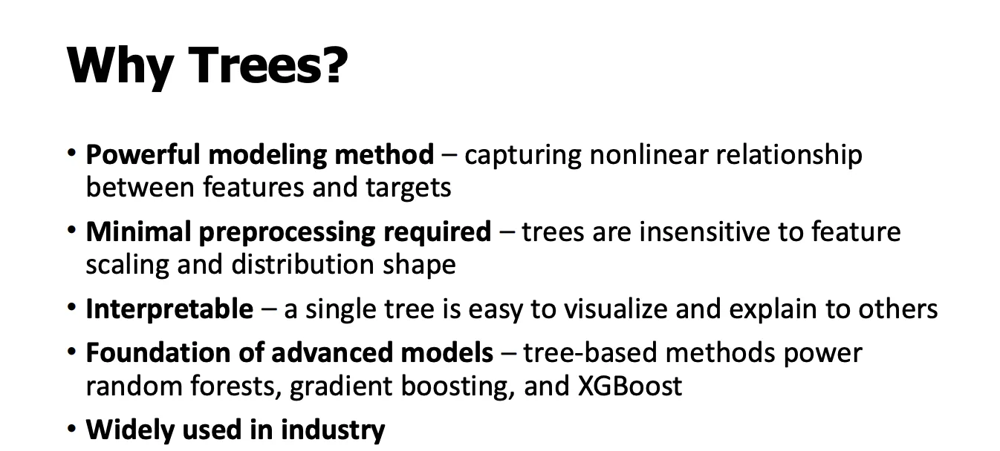

## 왜 트리인가

- **비선형 관계를 잘 학습함**
	결정트리는 “이 값이 기준보다 크냐/작으냐” 같은 분기(question)를 반복하면서 입력 공간을 나누기 때문에, 직선으로는 표현하기 어려운 복잡한 비선형 패턴을 자연스럽게 표현할 수 있습니다.

- **전처리가 거의 필요 없음**
	선형 모델이나 거리 기반 모델(KNN, SVM 등)과 달리, 트리는 값의 **절대적인 크기나 스케일**에 크게 의존하지 않습니다. 그래서 정규화, 표준화 같은 전처리를 안 해도 잘 동작합니다.

- **해석 가능성(interpretability)**
	하나의 결정트리는 “어떤 특징을 기준으로 어떤 순서로 판단했는지”가 경로(path)로 그대로 드러납니다.
	→ *왜 이런 예측이 나왔는지* 설명하기 쉽습니다.

- **앙상블 모델의 기반**
	랜덤 포레스트, 그래디언트 부스팅, XGBoost는 모두 **결정트리를 기본 단위 모델(base learner)**로 사용합니다.
	즉, 트리를 이해하면 이 강의 뒤에 나오는 고급 모델들을 이해하기가 훨씬 수월해집니다.

- **산업에서 많이 쓰이는 이유**
	성능이 좋고, 전처리 부담이 적고, 어느 정도 해석도 가능해서 실제 서비스·분석 환경에서 매우 자주 사용됩니다.

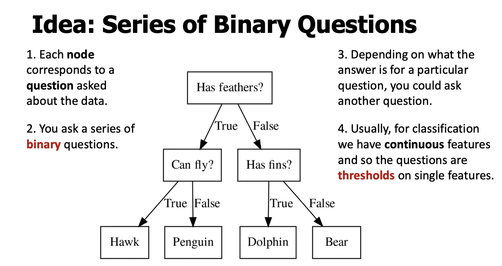

### **Idea: Series of Binary Questions**
**직역**

1. **Each node corresponds to a question asked about the data.**
	→ 각 노드는 데이터에 대해 던지는 **하나의 질문**에 대응한다.

2. **You ask a series of binary questions.**
	→ 우리는 **이진 질문(True / False)**들의 연속을 묻는다.

3. **Depending on what the answer is for a particular question, you could ask another question.**
	→ 특정 질문에 대한 **답에 따라 다음에 물을 질문이 달라진다.**

4. **Usually, for classification we have continuous features and so the questions are thresholds on single features.**
	→ 보통 분류 문제에서는 **연속형 특징**을 사용하므로, 질문은 **하나의 특징에 대한 임계값(threshold)**형태가 된다.

# 예시

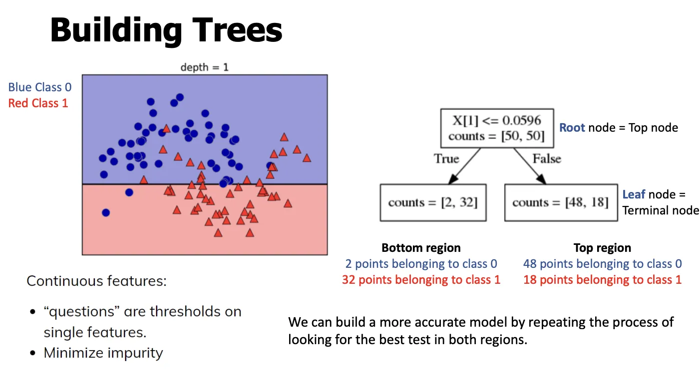

- X[1] ≤ 0.0596 → 조건
- counts = [50, 50] → [클래스0 개수, 클래스1 개수] → 아직 분기하기 전 존재하는 클래스의 개수
**설명**

- 이 데이터는 **비선형 구조(two-moons)**를 가짐
- 하나의 직선(선형 모델)로는 잘 분리하기 어려움
- 그래서 **결정트리처럼 공간을 나누는 모델**이 필요함

## **Building Trees (depth = 1, 첫 분기)**
**직역**

- *Continuous features:*
	→ 연속형 특징들

- *“questions” are thresholds on single features.*
	→ “질문”은 **하나의 특징에 대한 임계값(threshold)**

- *Minimize impurity*
	→ 불순도(impurity)를 최소화

 - 아직 각 영역에는 클래스 0과 1이 섞여있는 상태
- *Root node = Top node*
	→ 루트 노드 = 맨 위 노드

- *Leaf node = Terminal node*
	→ 리프 노드 = 종료 노드

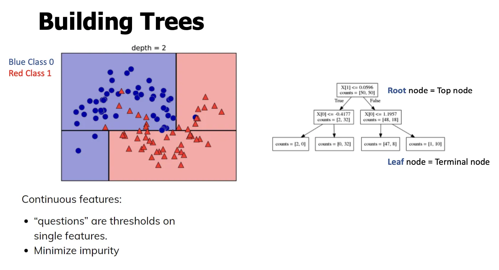

## 분기 반복
**설명**

- **각 영역마다 다시 질문을 던짐**
	- 왼쪽 영역 → 또 하나의 threshold
	- 오른쪽 영역 → 또 하나의 threshold
- 결과:
	- 처음 1번 나눔 → **2개 구획**
	- 다시 1번씩 나눔 → **4개 구획**
 **트리는 “지역별로 다른 질문”을 허용**
(이게 트리가 강력한 이유)

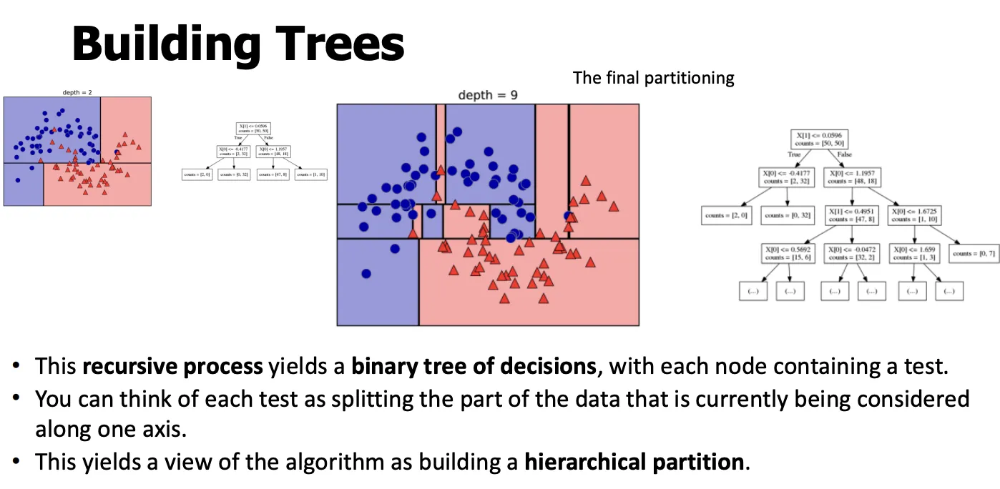

## **4. Building Trees (깊어질수록: depth = 9)**
**직역**

- *This recursive process yields a binary tree of decisions, with each node containing a test.*
	→ 이 재귀적 과정은 각 노드가 테스트를 포함하는 이진 결정 트리를 만든다.

- *You can think of each test as splitting the part of the data that is currently being considered along one axis.*
	→ 각 테스트는 현재 고려 중인 데이터 영역을 **하나의 축 기준으로 나누는 것**으로 볼 수 있다.

- *This yields a view of the algorithm as building a hierarchical partition.*
	→ 이 알고리즘은 **계층적 공간 분할**을 만든다고 볼 수 있다.

- **Pure leaf**
	- 리프 노드 안의 데이터가 전부 같은 클래스
	- → 더 이상 나눌 필요 없음

### ⇒ 불순도를 계산해야함

- **pure vs impurity**
	- **pure**: 노드 안의 데이터가 **모두 같은 클래스**
 → 불순도 = 0

	- **impure**: 여러 클래스가 섞여 있음
 → 불순도 > 0

- **왜 불순도를 계산하나?**
	결정트리는 각 분기에서
	> “이 질문(임계값)으로 나누면 클래스 섞임이 얼마나 줄어드나?”
	> 를 정량적으로 판단해야 합니다. 그 척도가
 **impurity**

# 불순도 기준

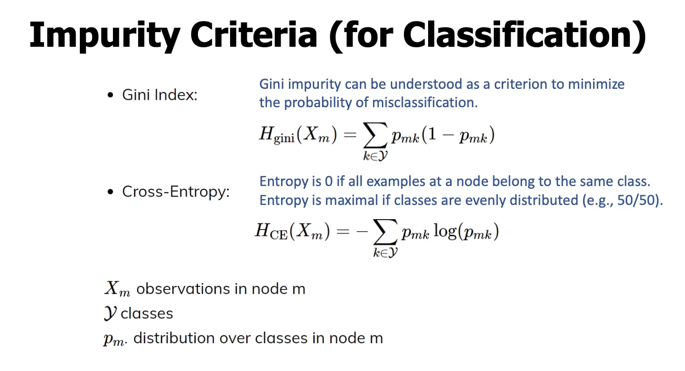

- **Gini Index**
	*Gini impurity can be understood as a criterion to minimize the probability of misclassification.*
	→ 지니 불순도는 **오분류 확률을 최소화하기 위한 기준**으로 이해할 수 있다.
	$$
	H_{\text{gini}}(X_m)=\sum_{k\in\mathcal{Y}} p_{mk}(1-p_{mk})
	$$

- **Cross-Entropy**
	*Entropy is 0 if all examples at a node belong to the same class.*
	→ 노드의 모든 샘플이 같은 클래스면 엔트로피는 0이다.
	*Entropy is maximal if classes are evenly distributed (e.g., 50/50).*
	→ 클래스가 균등(예: 50/50)하면 엔트로피는 최대다.
	$$
	H_{\text{CE}}(X_m)=-\sum_{k\in\mathcal{Y}} p_{mk}\log(p_{mk})
	$$

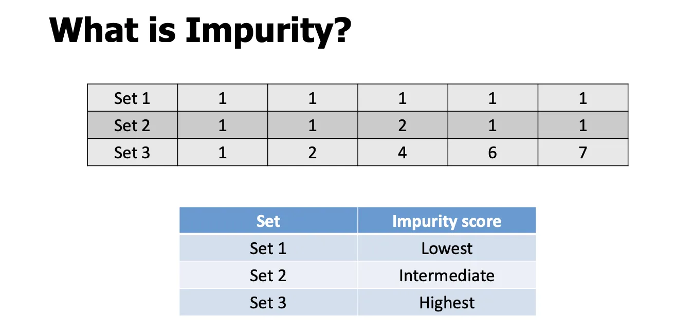

### 설명

1. set 1이 모두 클래스 1 → 불순도 낮음
2. set2 → 2가 하나 섞여있음 → 불순도 중간
3. set3 → 여러개가 섞여있음 → 불순도가 높음

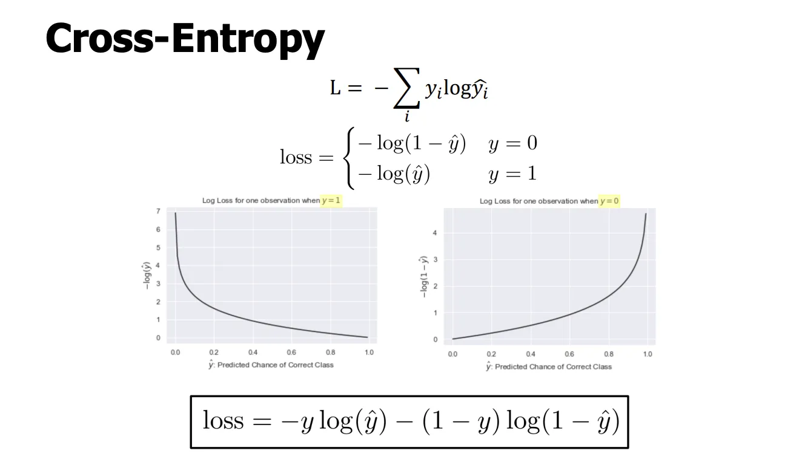

→ L은 총 크로스 엔트로피의 합 → 이걸 낮춰야 함
→ 아래 loss는 위 if문을 하나로 합친 것

# 예측

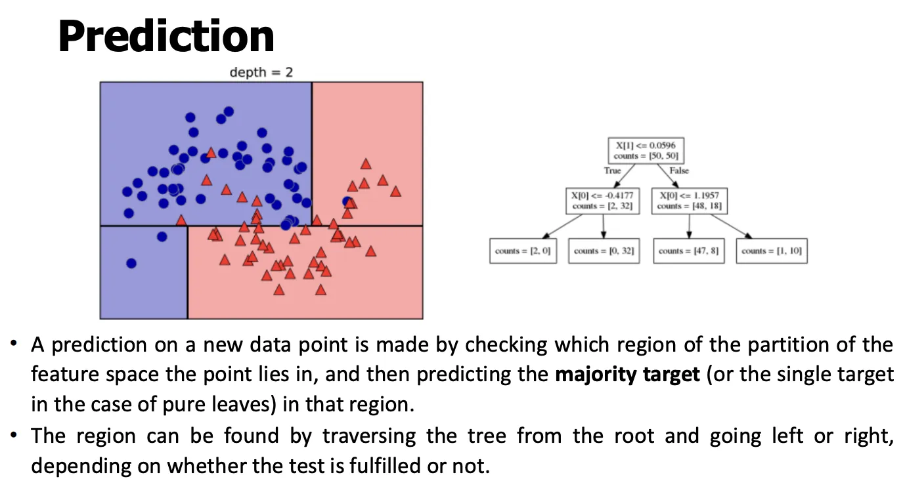

**직역**

- *A prediction on a new data point is made by checking which region of the partition of the feature space the point lies in, and then predicting the majority target (or the single target in the case of pure leaves) in that region.*
	→ 새로운 데이터 포인트가 **특징 공간의 어떤 영역에 속하는지**를 확인한 뒤, 그 영역의 **다수 클래스**(또는 pure 리프면 그 클래스)를 예측한다.

- *The region can be found by traversing the tree from the root and going left or right, depending on whether the test is fulfilled or not.*
	→ 루트에서 시작해 각 노드의 테스트를 만족하는지에 따라 **왼쪽/오른쪽으로 내려가며 트리를 순회**해 해당 영역을 찾는다.

- *(Regression)*
	*The output for this data point is the mean target of the training points in this leaf.*
	→ 회귀에서는 그 리프에 속한 **훈련 타깃의 평균**을 출력한다.

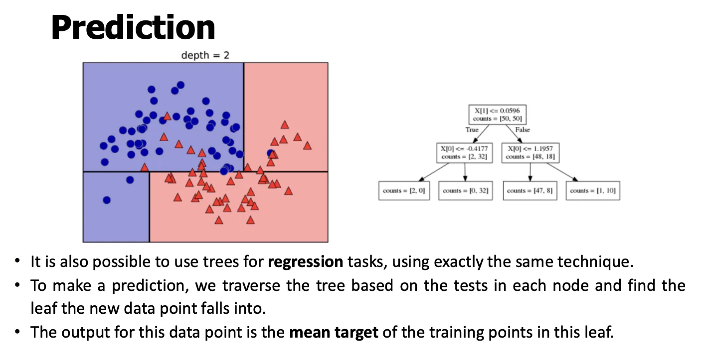

### **1. 분류(Classification)**

1. **루트에서 시작**
	X[j] ≤ threshold ? 같은 질문을 순서대로 평가

2. **좌/우로 이동**
	True/False에 따라 분기

3. **리프 도착**
	- 리프의 counts = [c0, c1, ...] 확인
	- **가장 많은 클래스**가 예측값
	- (확률이 필요하면 counts / 합계)
 그림의 색 영역은 “그 리프가 담당하는 공간”을 의미합니다.
***

### **2. 회귀(Regression)**

1. **분기 과정은 동일**(질문/순회 방식 동일)
2. **리프 도착 후 출력만 다름**
	- 분류: 다수 클래스
	- **회귀: 리프에 있는 타깃들의 평균값**
$$
\hat y = \frac{1}{N_{\text{leaf}}}\sum_{i\in \text{leaf}} y_i
$$

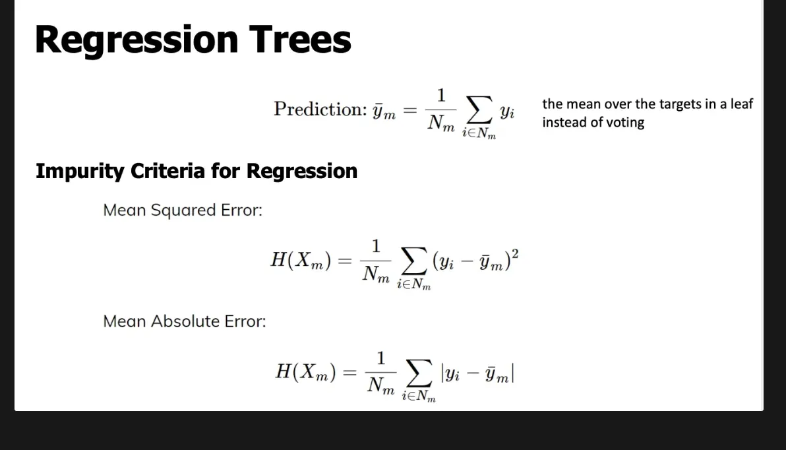

## 회귀 트리
$$
\bar y_m=\frac{1}{N_m}\sum_{i\in N_m} y_i
$$
→ 투표(voting) 대신, **리프(leaf)에 속한 타깃들의 평균**을 예측값으로 사용한다.

- **Impurity Criteria for Regression**(회귀에서의 불순도 기준)
	**Mean Squared Error (MSE)**
	$`H(X_m)=\frac{1}{N_m}\sum_{i\in N_m}(y_i-\bar y_m)^2`$
	**Mean Absolute Error (MAE)**
	$`H(X_m)=\frac{1}{N_m}\sum_{i\in N_m}\lvert y_i-\bar y_m\rvert`$

# 파라미터 튜닝

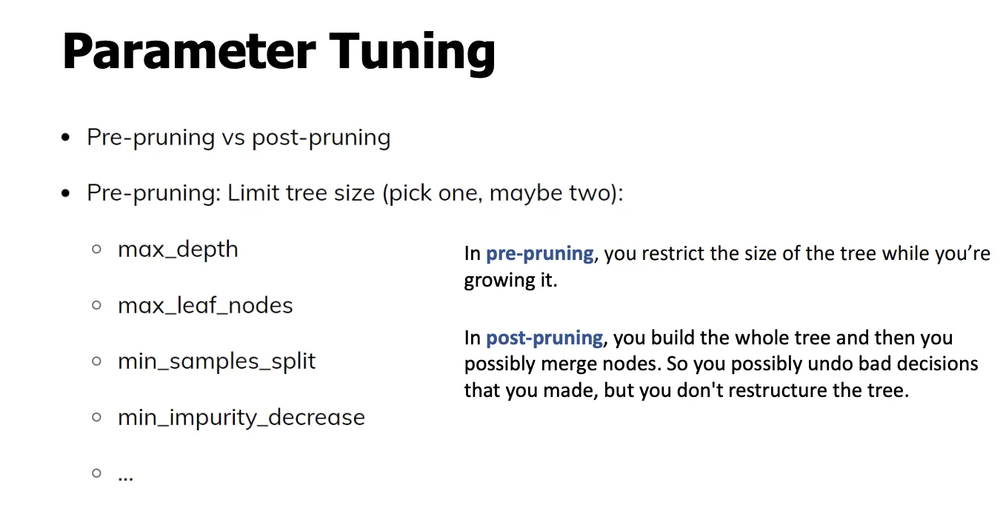

- 사전 가지치기: 트리를 **키우는 도중에 크기를 제한**
	1. max_depth →
	2. max_leaf_nodes
	3. min_samples_split
	4. min_impurity_decrease
- 사후 가지치기는 **트리를 끝까지 만든 뒤**, 노드들을 합칠 수 있다
⇒ 보통 사전 가지치기를 함
→ 가지치기 안하면 보통 과적합

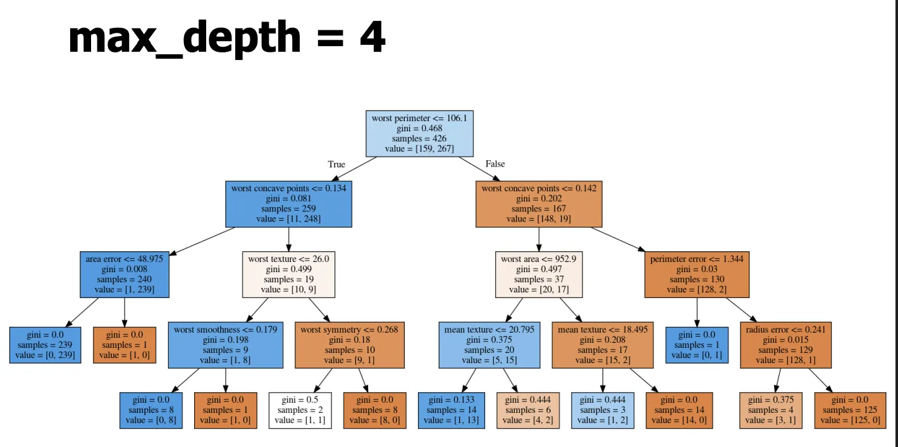

→ 루트는 뎁스 0

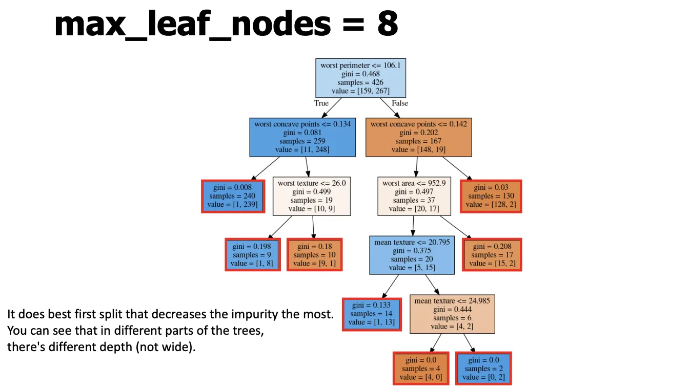

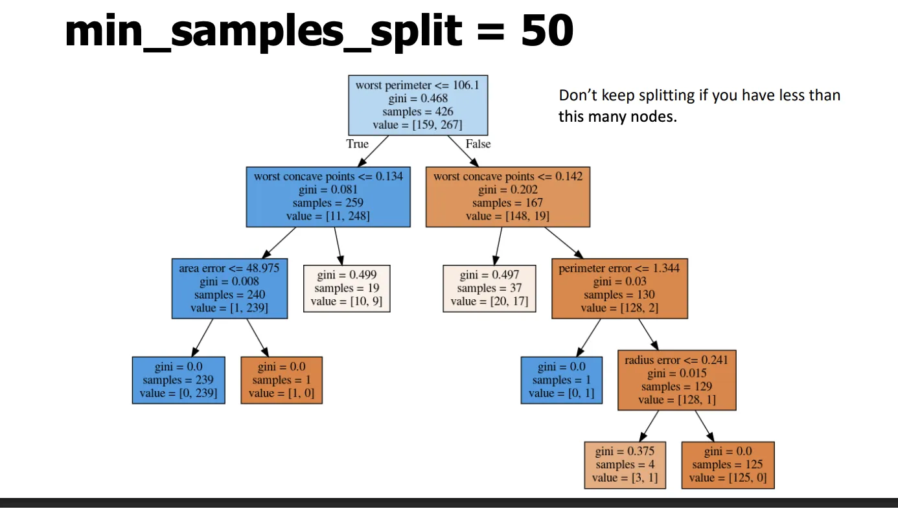

***

# 앙상블 모델

- 머신러닝/딥러닝에서 앙상블이란 **여러 개의 단일 예측(또는 분류) 모델을 하나로 묶어 더 좋은 성능의 복합 모델을 만드는 기법**
- **Build different models**
	→ 서로 다른 모델들을 만든다.

- **Average the result**
	→ 결과를 평균낸다.

- **More models are better – if they are not correlated**
	→ 모델들이 서로 **상관관계가 적다면**, 많을수록 좋다.

- **Also works with neural networks**
	→ 신경망에도 동일하게 적용 가능하다.

- **You can average any models as long as they provide calibrated (“good”) probabilities**
	→ 확률 예측이 잘 보정(calibrated)되어 있다면 어떤 모델이든 평균낼 수 있다.

- **Scikit-learn: VotingClassifier hard and soft voting**
	→ 사이킷런에서는 VotingClassifier로 하드/소프트 보팅을 제공한다.

### **Hard Voting (Majority Voting)**
**직역**

- 각 모델이 **클래스 하나를 바로 예측**
- 가장 많이 나온 클래스를 선택
**예**

- 모델 A: 0
- 모델 B: 1
- 모델 C: 1
	→ 결과: **1**
 특징

- 단순
- 확률 정보 사용

### **Soft Voting (Probability Voting)**
**직역**

- 각 모델이 **확률을 예측**
- 확률을 평균낸 뒤 가장 큰 클래스 선택
**예**

- 모델 A: P(1)=0.6
- 모델 B: P(1)=0.7
- 모델 C: P(1)=0.4
	→ 평균 = 0.566
	→ 결과: **1**
 특징

- 정보 더 풍부
- 확률이 잘 보정된 모델일수록 효과 큼
- **실무에서 더 많이 사용**

## 랜덤 포레스트

- **Ensembles**are methods that combine multiple machine learning models to create more powerful models.
	→ 앙상블은 여러 모델을 결합해 더 강력한 모델을 만드는 방법이다.

- **A main drawback of decision trees**is that they tend to overfit the training data.
	→ 결정트리는 학습 데이터에 과적합되기 쉽다.

- **A random forest can be considered as an ensemble of decision trees.**
	→ 랜덤 포레스트는 결정트리들의 앙상블이다.

- **Injecting randomness**into the tree building ensures each tree is different.
	→ 트리 생성 과정에 무작위성을 넣어 각 트리를 다르게 만든다.

- **Average multiple (deep) decision trees**to reduce high variance and improve generalization.
	→ 분산이 큰 (깊은) 트리 여러 개를 평균내어 일반화 성능을 높이고 과적합을 줄인다.

## **설명 (왜 랜덤 포레스트인가?)**

- **결정트리의 문제**: 분산(variance)이 큼 → 데이터 조금만 바뀌어도 결과가 크게 변함
- **해결 아이디어**:
	1. 트리를 **여러 개**만든다
	2. 각 트리를 **서로 다르게**만든다
	3. 결과를 **평균/투표**한다
 결과: **분산 감소 → 일반화 성능 향상**

## **Random Forest Algorithm (알고리즘 단계)**
**직역**

1. **Bootstrap sample**을 크기 n으로 뽑는다
	→ 학습 데이터에서 **복원추출(with replacement)**로 n개 선택

2. 부트스트랩 샘플로 **결정트리 하나를 성장**시킨다. 각 노드에서:
	- (a) **특징 **d**개를 무작위로 선택**(without replacement, random subset)
	- (b) 그중 **가장 좋은 분기**(정보이득 최대 등)를 선택
3. **1–2를 **k**번 반복**한다. (트리 k개 생성)
4. 각 트리의 예측을 **집계**하여
	- 분류: **다수결(majority vote)**
	- 회귀: **평균**

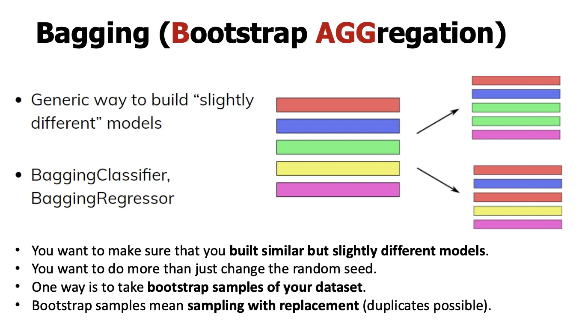

### **Bagging (Bootstrap**

### **AGG**

### **regation)**
**직역**

- **Generic way to build “slightly different” models**
	→ 서로 **조금씩 다른 모델**을 만드는 일반적인 방법

- **BaggingClassifier / BaggingRegressor**
	→ 분류·회귀 모두에 적용 가능

- **You want to make sure that you built similar but slightly different models.**
	→ 모델들은 **비슷하지만 완전히 같지 않게**만들어야 한다.

- **Do more than just change the random seed.**
	→ 랜덤 시드만 바꾸는 것보다 더 강한 차이를 만든다.

- **Take bootstrap samples of your dataset.**
	→ 데이터셋에서 **부트스트랩 샘플**을 뽑는다.

- **Sampling with replacement (duplicates possible).**
	→ **복원추출**이므로 **중복 샘플 가능**
***

## **설명 (핵심 아이디어)**

### **1. Bagging이 뭐냐면**

> 같은 학습 알고리즘을 여러 번 돌리되,

> 매번 “조금씩 다른 데이터”로 학습시키고

> 결과를 합치는 방법

- 데이터의 **작은 변형**만으로도
- **서로 다른 모델**들이 만들어짐
- 이들의 평균/투표 → **분산 감소**
***

### **2. Bootstrap(부트스트랩)의 의미**

- 원본 데이터가 N개면
- **복원추출로 **N**개**를 다시 뽑아 하나의 학습셋 생성
- 특징:
	- 어떤 샘플은 **여러 번 등장**
	- 어떤 샘플은 **아예 안 나올 수 있음**
 이 차이가 모델을 서로 다르게 만든다.
***

### **3. 왜 “duplicates possible”가 중요?**

- 중복 때문에 각 모델이
	- **데이터의 강조점이 달라짐**
- 같은 알고리즘이라도
	- **결정 경계/트리 구조가 달라짐**
- 결과적으로
	- 모델 간 **상관관계 감소**
***

### **4. Aggregation(병합)은 어떻게?**

- **분류**: 다수결(Hard) 또는 확률 평균(Soft)
- **회귀**: 평균
 이름 그대로 **Bootstrap + Aggregation**
***

### **5. Random Forest와의 관계 (정리)**

- **Bagging**:
	- 데이터만 무작위 (부트스트랩)
	- 베이스 모델은 무엇이든 가능
- **Random Forest**:
	- Bagging **+**각 노드에서 **특징 무작위 선택**
	- → 트리 간 상관관계 더 줄임
***

## **한 줄 요약**

> Bagging = 복원추출로 만든 여러 학습셋에

> 같은 모델을 학습시키고

> 결과를 합쳐 분산을 줄이는 앙상블 기법
다음 자연스러운 연결은
 **왜 Random Forest는 Bagging보다 더 강력한가**
 **OOB(out-of-bag) 에러**입니다.

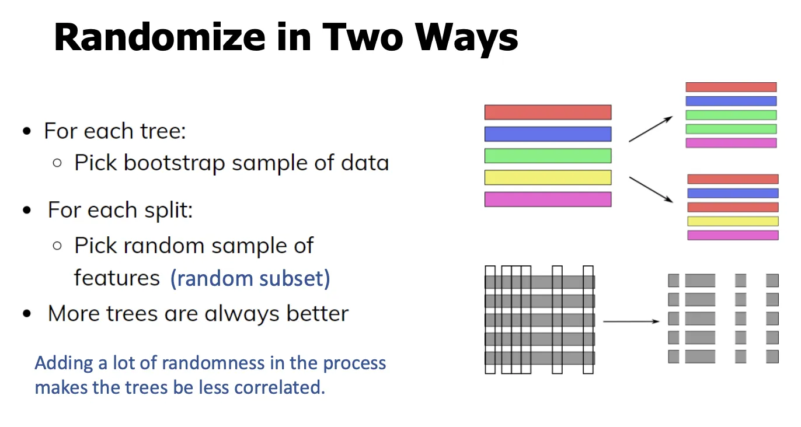

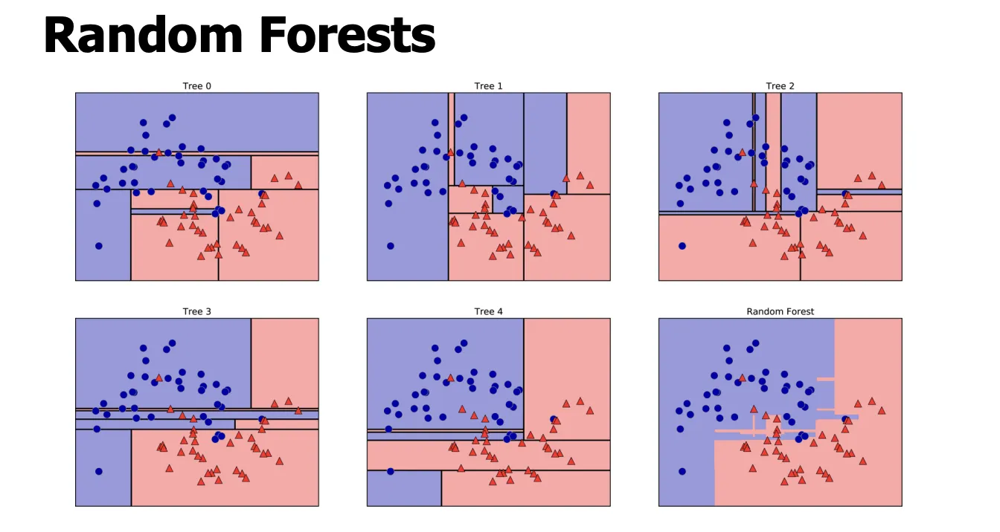

### **Randomize in Two Ways (랜덤 포레스트의 핵심)**
**직역**

- **For each tree:**
	- *Pick bootstrap sample of data*
 → 각 트리마다 **부트스트랩 샘플(복원추출 데이터)**을 뽑는다.

- **For each split:**
	- *Pick random sample of features (random subset)*
 → 각 분기마다 **특징의 무작위 부분집합**을 선택한다.

- **More trees are always better**
	→ 트리가 많을수록 항상 더 좋다.
	*(실제로는 수렴할 때까지)*

- *Adding a lot of randomness … makes the trees be less correlated.*
	→ 무작위성을 많이 넣을수록 트리들이 **서로 덜 상관**된다.
***

## **설명 (왜 “두 가지”가 중요한가)**
랜덤 포레스트의 성능 핵심은 **트리들 간 상관관계 감소**입니다.
이를 위해 **두 군데**에서 랜덤을 넣습니다.
***

### **1. 트리 단위 랜덤화:**

### **데이터 부트스트랩**

- 각 트리는 **서로 다른 데이터 샘플**로 학습
- 복원추출이므로:
	- 어떤 샘플은 여러 번 등장
	- 어떤 샘플은 빠짐(OOB)
- 효과:
	- 트리 구조가 서로 달라짐
	- **분산 감소**에 기여
***

### **2. 분기 단위 랜덤화:**

### **특징 서브샘플링**

- 각 노드에서 **전체 특징을 다 보지 않음**
- 일부 특징만 후보로 놓고 최적 분기 선택
- 효과:
	- 강력한 특징 하나가 **모든 트리를 지배**하는 것을 방지
	- 트리 간 **상관관계 크게 감소**

> 이게 Bagging(데이터만 랜덤)과 Random Forest의
	**결정적 차이**
***

## **“More trees are always better”의 정확한 의미**

- 트리 수를 늘리면:
	- **분산은 계속 줄어듦**
	- 성능은 어느 시점 이후 **포화**
- 과적합이 늘어나는 게 아니라, **계산 비용만 증가**
- 그래서 실무에서는:
	- 충분히 큰 n_estimators로 두고
	- 성능 수렴 지점에서 멈춤
***

## **한눈에 정리**

- **Bagging**: 데이터만 랜덤 (부트스트랩)
- **Random Forest**:
	- 데이터 랜덤 **+**
	- **각 분기에서 특징 랜덤**
 결과: **덜 상관된 트리들 → 평균 효과 극대화 → 일반화 성능↑**

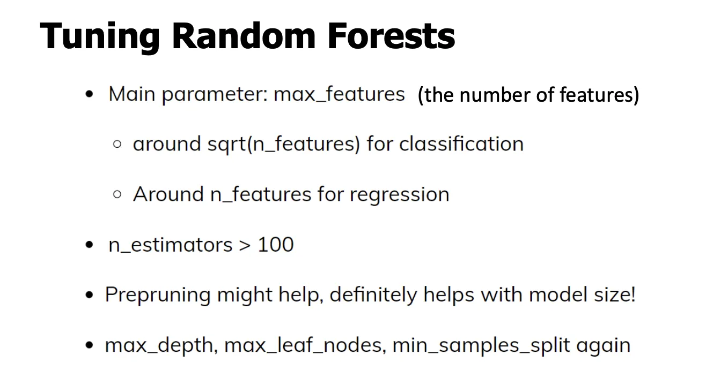

### **Tuning Random Forests (랜덤 포레스트 튜닝)**
**직역**

- **Main parameter: max_features (the number of features)**
	→ 핵심 파라미터: max_features (각 분기에서 고려할 특징 수)

	- **around sqrt(n_features) for classification**
 → 분류에서는 보통 전체 특징 수의 **제곱근 정도**

	- **around n_features for regression**
 → 회귀에서는 보통 **전체 특징 수에 가깝게**

- **n_estimators > 100**
	→ 트리 개수는 보통 **100개 이상**

- **Prepruning might help, definitely helps with model size!**
	→ 사전 가지치기는 성능에도 도움이 될 수 있고, **모델 크기 감소에는 확실히 도움**

- **max_depth, max_leaf_nodes, min_samples_split again**
	→ 트리에서 쓰던 사전 가지치기 파라미터들을 그대로 사용 가능
***

## **설명 (왜 이게 중요한가)**

### **1.**

### **max_features**

### **가 왜 “메인”인가?**
랜덤 포레스트 성능의 핵심은 **트리들 간 상관관계 감소**입니다.
max_features는 **각 분기에서 볼 수 있는 특징의 수**를 제한해 이를 직접적으로 조절합니다.

- **작게 설정**
	- 트리들이 더 달라짐(상관 ↓)
	- 분산 ↓, 바이어스 ↑ 가능
- **크게 설정**
	- 각 트리가 강해짐
	- 상관 ↑, 분산 감소 효과 ↓
 **분류/회귀에서 권장값이 다른 이유**는 이 균형점이 다르기 때문입니다.
***

### **2. 분류 vs 회귀 권장값 직관**

- **분류 (sqrt(n_features))**
	- 강한 특징 하나가 모든 분기를 지배하지 않게 함
	- 트리 다양성 확보가 중요
- **회귀 (~ n_features)**
	- 연속값 예측에서는 더 많은 특징을 보는 것이 안정적
	- 바이어스 증가를 피하는 게 중요
***

### **3.**

### **n_estimators**

### **는 왜 크게?**

- 트리 수를 늘리면:
	- **분산은 계속 감소**
	- 어느 시점 이후 성능은 **포화**
- 과적합이 늘지 않으므로:
	- **그리드서치로 찾지 말라**는 말이 나옴
	- 계산 자원 허용 범위에서 충분히 크게 설정
***

### **4. 사전 가지치기(pre-pruning)는 써야 하나?**

- 랜덤 포레스트는 **깊은 트리**여도 평균으로 안정화됨
- 그래서 성능 측면에서는 **필수는 아님**
- 하지만:
	- 모델 크기 ↓
	- 예측 속도 ↑
	- 메모리 ↓
 실무에서는 **적당한 가지치기**를 함께 씀
***

## **한눈에 요약 (실무 기본 세팅 감각)**

- **분류**
	- n_estimators: 200~500
	- max_features: sqrt(n_features)
- **회귀**
	- n_estimators: 200~500
	- max_features: n_features (또는 조금 줄여서 튜닝)
- 필요하면:
	- max_depth / min_samples_split로 크기 제어
***

### **한 줄 요약**

> 랜덤 포레스트 튜닝의 핵심은

> max_features로 트리 상관을 조절하고,

> n_estimators는 충분히 크게 두는 것
***

# 전체

# **1. 왜 결정트리(Tree)인가?**

### **핵심 메시지**

- 결정트리는 **비선형 관계**를 잘 잡는다.
- **전처리 거의 필요 없음**(스케일링, 정규화 불필요).
- **해석 가능**(질문 경로를 따라가면 설명 가능).
- 랜덤 포레스트, 부스팅 등 **고급 모델의 기본 단위**.
- 산업에서 매우 널리 사용.
 “트리는 단독으로도 좋고, 앙상블의 핵심 부품이다”
***

# **2. 결정트리의 기본 아이디어**

### **Series of Binary Questions**

- 각 노드 = **이진 질문**
	X_j \\le \\text\{threshold\}?

- True / False로 나뉘며,
- 답에 따라 **다음 질문이 달라짐**.
- 결국 **리프(leaf)**에 도달 → 예측.
 트리 = **이진 질문의 연쇄**
***

# **3. 트리를 어떻게 만드는가 (Building Trees)**

### **공간 분할 관점**

- 입력 공간을 **축에 평행한 직사각형들로 분할**.
- 깊어질수록 더 잘게 쪼개짐.

### **중요한 용어**

- **Root node**: depth = 0
- **Internal node**: 질문이 있는 노드
- **Leaf node**: 예측만 하는 노드
- **Pure leaf**: 한 클래스(또는 값)만 있음
***

# **4. 불순도(Impurity)의 개념**

### **왜 필요한가?**

- “이 질문이 좋은 질문인가?”를 **정량적으로 판단**해야 함.

### **직관**

- 한 클래스만 있으면 → **불순도 0 (pure)**
- 여러 클래스가 섞이면 → **불순도 큼**
***

# **5. 분류 트리의 불순도 지표**

## **5-1. Gini Index**
\\text\{Gini\} = 1 - \\sum_k p_k\^2

- 임의로 하나 뽑았을 때 **틀릴 확률**
- 계산 빠름, 실무에서 기본값

## **5-2. Cross-Entropy (Entropy)**
H = -\\sum_k p_k \\log p_k

- 불확실성(정보량)
- 수식은 **loss function과 동일**
 **Gini든 Entropy든 목적은 동일**
→ **불순도를 가장 많이 줄이는 분기 선택**
***

# **6. 분류 트리의 예측 (Prediction)**

1. 루트에서 시작
2. 조건에 따라 좌/우로 이동
3. 리프 도착
4. **다수 클래스**예측
	(확률은 counts 비율)
***

# **7. 회귀 트리 (Regression Trees)**

### **핵심 차이**

- 구조는 **완전히 동일**
- 리프에서:
	- 분류 → 다수 클래스
	- 회귀 → **평균값**

### **회귀 불순도**

- **MSE**
	H = \\frac\{1\}\{N\}\\sum (y_i - \\bar y)\^2

- **MAE**
	H = \\frac\{1\}\{N\}\\sum \|y_i - \\bar y\|
 회귀 트리 =
**“공간을 나누고, 각 영역을 평균값으로 대표”**
***

# **8. 과적합과 가지치기 (Pruning)**

### **No Pruning의 문제**

- 샘플 1개짜리 리프 다수
- 훈련 데이터에 과도하게 맞춤
- **과적합**
***

## **8-1. Pre-pruning (사전 가지치기)**
트리를 키우는 도중에 멈춤.

- max_depth
- max_leaf_nodes
- min_samples_split
- min_impurity_decrease
 **실무에서 가장 흔함**

## **8-2. Post-pruning (사후 가지치기)**

- 끝까지 키운 뒤 합침
- 이론적으로는 좋지만 복잡
- 실무에서는 드묾
***

# **9. 앙상블(Ensemble)의 개념**

### **핵심 아이디어**

> 여러 모델의 평균이 하나의 모델보다 낫다

- 단일 모델: 분산 큼
- 여러 모델 평균: **분산 감소**
***

## **9-1. Voting**

- **Hard voting**: 다수결
- **Soft voting**: 확률 평균 후 최대
***

# **10. 랜덤 포레스트(Random Forest)**

### **왜 필요한가?**

- 결정트리는 **분산이 큼**
- 평균을 내면 안정화됨

### **정의**

> 랜덤 포레스트 = 결정트리들의 앙상블
***

## **10-1. Random Forest Algorithm**

1. **Bootstrap**데이터 샘플링 (복원추출)
2. 각 트리 성장
	- 각 노드에서 **특징 일부만**사용
3. 이를 **k번 반복**
4. 예측을 **평균/투표**
***

## **10-2. 두 가지 랜덤성 (매우 중요)**

1. **데이터 랜덤**
	- Bootstrap (Bagging)
2. **특징 랜덤**
	- 각 split에서 feature subset
 트리 간 **상관관계 감소**
 앙상블 효과 극대화
***

# **11. Bagging (Bootstrap Aggregation)**

- 같은 모델을
- **서로 다른 부트스트랩 데이터**로 학습
- 결과를 합침
 Random Forest = **Bagging + Feature Randomness**
***

# **12. 랜덤 포레스트 튜닝**

### **핵심 파라미터**

### **max_features**

### **(가장 중요)**

- 분류: \\sqrt\{n_\\text\{features\}\}
- 회귀: n_\\text\{features\} 근처

### **n_estimators**

- 보통 **100 이상**
- 많을수록 분산 감소
- 과적합 거의 없음 (계산비용만 증가)

### **가지치기**

- 성능보다 **모델 크기/속도**에 도움
***

# **강의 전체 한 줄 요약**

> 이 강의는

> “결정트리 → 과적합 → 가지치기 → 앙상블 → 랜덤 포레스트”

> 로 이어지는 한 줄짜리 이야기다.

- 트리는 강력하지만 불안정
- 평균을 내면 안정화
- 랜덤성을 넣으면 평균 효과 극대화
- 그 결과가 **Random Forest**
***
원하시면 다음도 바로 이어서 정리해드릴 수 있습니다:

- Random Forest vs Gradient Boosting 차이
- 수식 없이 직관만 다시 정리
- sklearn 코드 흐름 정리
