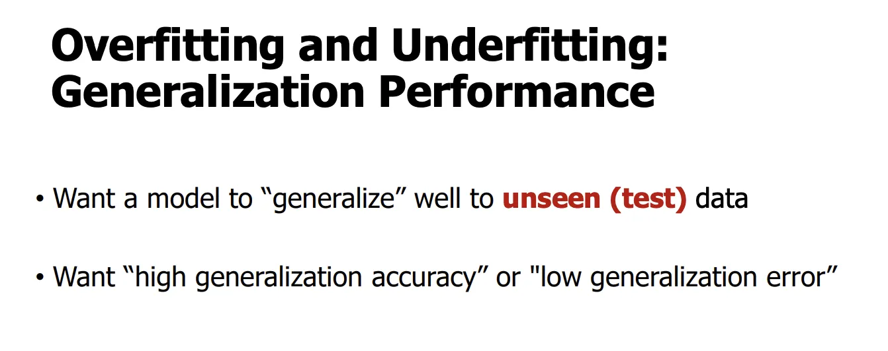
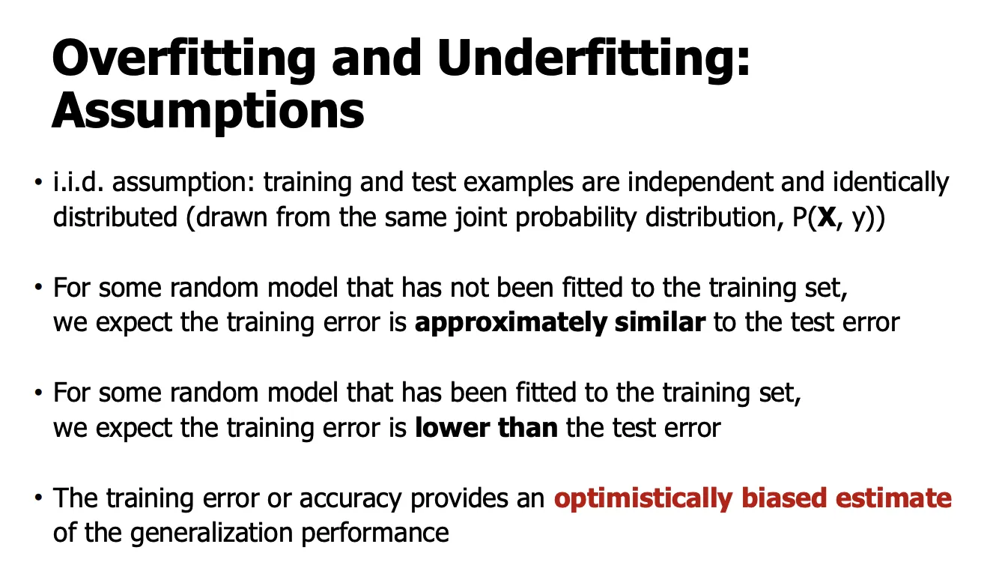
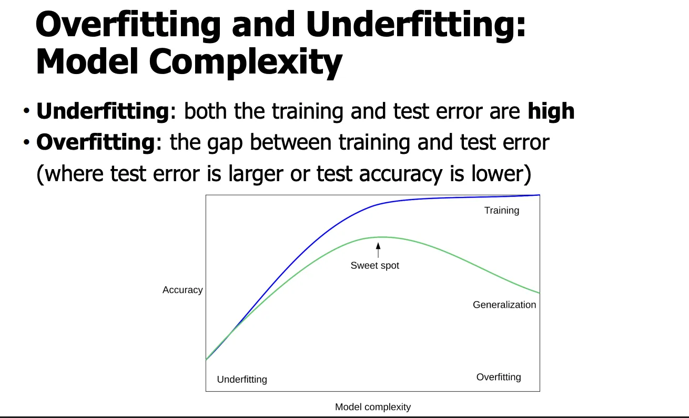
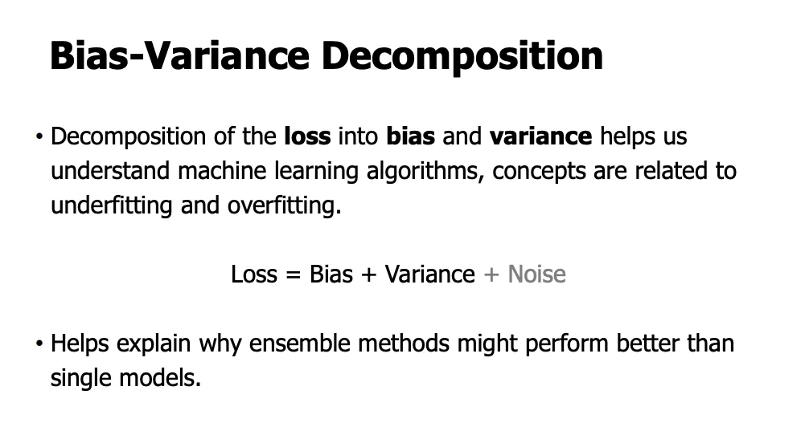
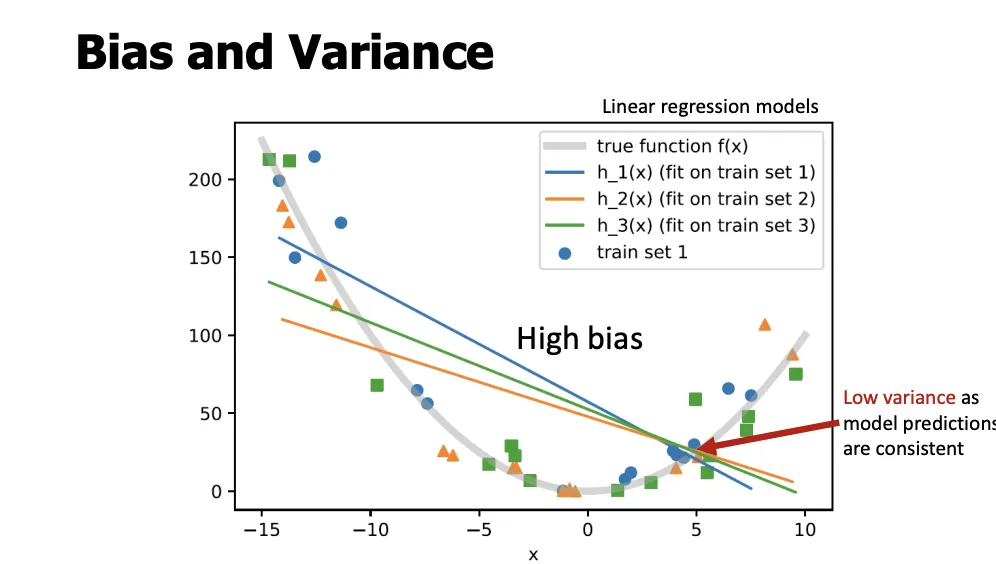
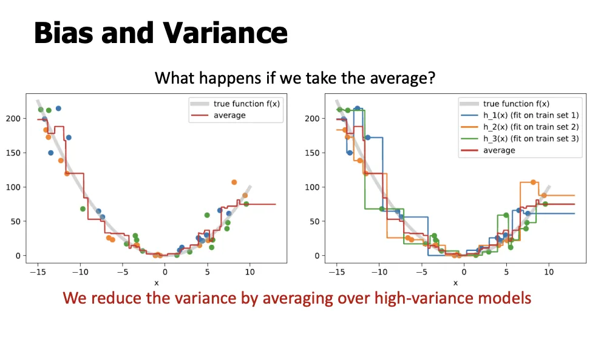
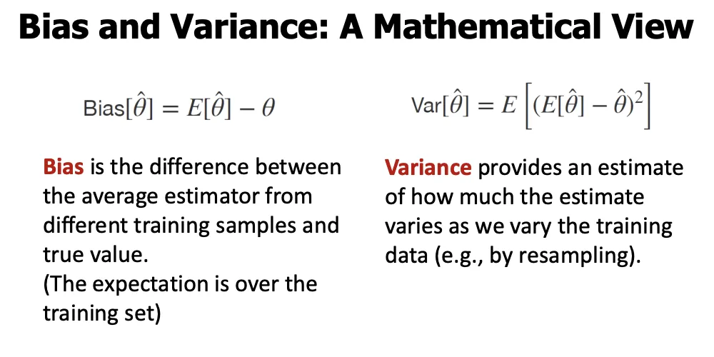
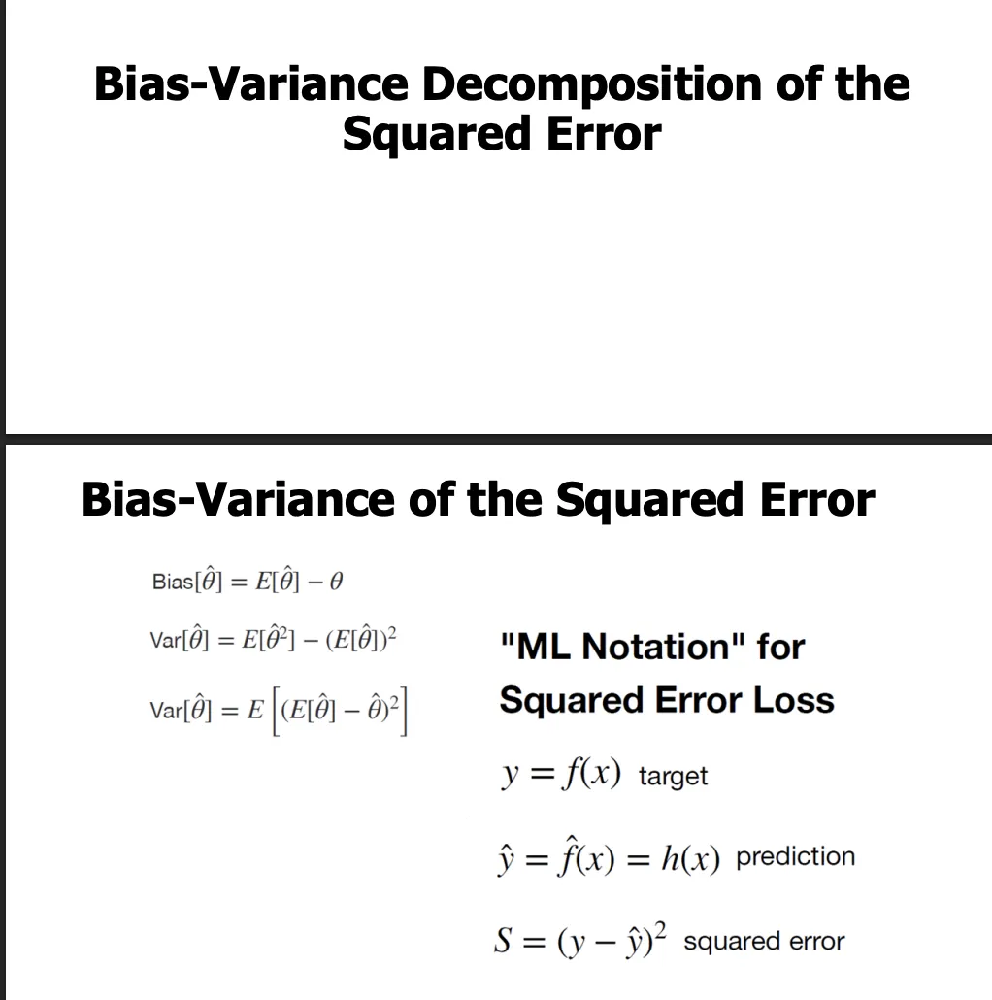
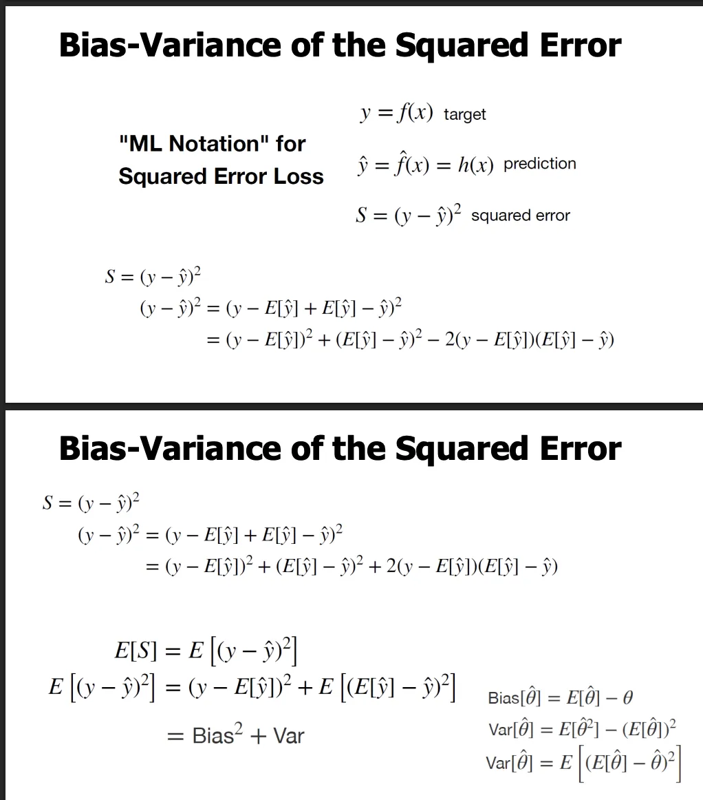
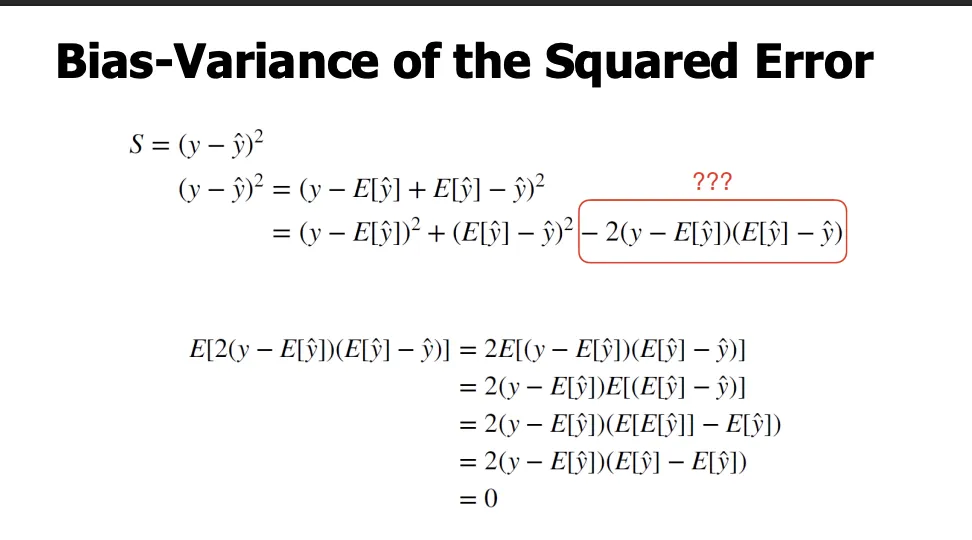

> Notion 원본 페이지의 강의 슬라이드와 설명을 바탕으로 정리한 노트입니다.
***

**Overfitting and Underfitting**
→ 과적합과 과소적합
**Overfitting and Underfitting: Generalization Performance**
→ 과적합과 과소적합: 일반화 성능

- **Want a model to “generalize” well to unseen (test) data**
	→ 모델이 **보지 못한(테스트) 데이터**에 대해서도 잘 **일반화**되기를 원함

- **Want “high generalization accuracy” or “low generalization error”**
	→ **일반화 정확도는 높고**, **일반화 오차는 낮은**모델을 원함

**Overfitting and Underfitting: Assumptions**
→ 과적합과 과소적합: (기본) 가정들

- **i.i.d. assumption: training and test examples are independent and identically distributed (drawn from the same joint probability distribution, P(X, y))**
	→ **i.i.d. 가정**: 훈련 데이터와 테스트 데이터는 **서로 독립(independent)**이고 **동일한 분포(identically distributed)**에서 뽑힌 샘플이다
	→ 즉, 같은 **결합확률분포 P(X, y)**에서 생성됨

- **For some random model that has not been fitted to the training set, we expect the training error is approximately similar to the test error**
	→ 훈련 데이터에 **아직 맞추지 않은(학습되지 않은)**임의의 모델에 대해
	→ 훈련 오차와 테스트 오차는 **대략 비슷할 것**이라고 기대함

- **For some random model that has been fitted to the training set, we expect the training error is lower than the test error**
	→ 훈련 데이터에 **맞춰서 학습된**모델의 경우
	→ **훈련 오차 < 테스트 오차**일 것이라고 기대함

- **The training error or accuracy provides an optimistically biased estimate of the generalization performance**
	→ 훈련 오차(또는 정확도)는 **일반화 성능을 낙관적으로 편향된(optimistically biased)**추정치로 제공함

**Overfitting and Underfitting: Model Complexity**
→ 과적합과 과소적합: 모델 복잡도

- **Underfitting: both the training and test error are high**
	→ 과소적합: **훈련 오차와 테스트 오차가 모두 높음**

- **Overfitting: the gap between training and test error (where test error is larger or test accuracy is lower)**
	→ 과적합: **훈련 오차와 테스트 오차 사이의 격차가 큼**
	(즉, 테스트 오차가 더 크거나 테스트 정확도가 더 낮음)

- **Sweet spot**
	→ 테스트 정확도가 **최대**가 되는 지점
	→ 우리가 선택해야 할 모델 복잡도
***

# **A model has “high bias/variance”**
→ 어떤 모델이 “높은 바이어스 / 높은 분산을 가진다”
**What does that mean?**
→ 그게 무슨 뜻일까?

## **1. “High bias”가 의미하는 것**
**Bias(편향)**=
 모델이 **평균적으로 틀리게 예측하는 정도**

- 모델이 너무 단순해서
	데이터의 **진짜 패턴을 표현할 능력 자체가 부족**

- 훈련 데이터를 아무리 바꿔도
	예측이 항상 비슷하고, 항상 빗나감
 특징

- 훈련 오차 큼
- 테스트 오차 큼
- 예측이 안정적이지만 항상 틀림
- **과소적합(underfitting)**과 연결
***

## **2. “High variance”가 의미하는 것**
**Variance(분산)**=
 훈련 데이터가 조금만 바뀌어도
**모델 예측이 크게 흔들리는 정도**

- 모델이 너무 복잡해서
	데이터의 **노이즈까지 학습**

- 훈련 샘플 하나 바뀌면
	함수 모양이 확 바뀜
 특징

- 훈련 오차 매우 작음
- 테스트 오차 큼
- 예측이 불안정
- **과적합(overfitting)**과 연결
***

## **3. 왜 “Bias–Variance Decomposition” 이 필요한가**
겉으로 보면 오차는 하나입니다.
\\text\{Error\}
그런데 이 오차를 분해하면:
\\text\{Error\} = \\text\{Bias\}\^2 + \\text\{Variance\} + \\text\{Noise\}
이 분해를 통해 알 수 있는 것:

- “모델이 틀린다”는 한 가지 이유만 있는 게 아님
-
	- **Bias 문제**: 모델이 너무 단순
	- **Variance 문제**: 모델이 너무 복잡
***

## **4. Bias–Variance**

## **Tradeoff**

## **란?**

- 모델을 **단순하게**만들면
	→ Bias ↑, Variance ↓

- 모델을 **복잡하게**만들면
	→ Bias ↓, Variance ↑
 둘을 동시에 낮출 수는 없음
 그래서 **Tradeoff(상충 관계)**
이게 바로 앞에서 본

- 모델 복잡도 vs 테스트 에러 곡선의 정체

### **과적합 / 과소적합과의 정확한 대응 관계**
<table header-row="true">
<tr>
<td>**현상**</td>
<td>**Bias**</td>
<td>**Variance**</td>
</tr>
<tr>
<td>과소적합</td>
<td>높음</td>
<td>낮음</td>
</tr>
<tr>
<td>과적합</td>
<td>낮음</td>
<td>높음</td>
</tr>
<tr>
<td>최적 모델</td>
<td>균형</td>
<td>균형</td>
</tr>
</table>

## **1. Bias–Variance Decomposition (개념 선언 슬라이드)**
**직역**

- **Decomposition of the loss into bias and variance helps us understand machine learning algorithms, concepts are related to underfitting and overfitting.**
	→ 손실(loss)을 **바이어스와 분산으로 분해**하면 머신러닝 알고리즘을 이해하는 데 도움이 되며, 이 개념들은 과소적합과 과적합과 연결된다.
$$
\text{Loss} = \text{Bias} + \text{Variance} + \text{Noise}
$$

- **Helps explain why ensemble methods might perform better than single models.**
	→ 왜 앙상블 방법이 단일 모델보다 더 좋은 성능을 보일 수 있는지 설명해준다.
**설명**

- 우리가 관측하는 **총 오차(loss)**는 하나처럼 보이지만, 원인은 세 가지:
	- **Bias**: 평균적으로 틀리는 정도 (모델 표현력 부족)
	- **Variance**: 데이터가 바뀔 때 예측이 흔들리는 정도
	- **Noise**: 데이터 자체의 불가피한 잡음 (줄일 수 없음)
- 이 분해가 중요한 이유:
	- 과소적합 ↔ Bias 문제
	- 과적합 ↔ Variance 문제
- 앙상블이 잘 되는 이유의 핵심도 **Variance 감소**에 있음
**설명**

- **Bias = 중심에서 얼마나 벗어났는가**
	- 중심(진짜 값)과 평균 예측의 거리
- **Variance = 점들이 얼마나 퍼져 있는가**
	- 같은 문제를 다시 학습했을 때 예측의 흔들림
- 네 가지 경우:
	1. **Low Bias, Low Variance**: 정확 + 안정 (이상적)
	2. **Low Bias, High Variance**: 평균은 맞지만 들쭉날쭉 (과적합)
	3. **High Bias, Low Variance**: 안정적이지만 항상 틀림 (과소적합)
	4. **High Bias, High Variance**: 최악
***

## **3. 진짜 함수 **f(x)**(노이즈 없음)**
**직역**

- **true (in practice unknown) data generating function f(x)**
	→ (실제로는 알 수 없는) 진짜 데이터 생성 함수 f(x)
**설명**

- 현실에는 **정답 함수 **f(x) 가 존재한다고 가정
- 우리는 이걸 모르고, 데이터만 관측함
- Bias–Variance 분석의 기준선이 되는 “진짜 세계”

## **4. 진짜 함수 + 노이즈**
**직역**

- **target f(x)**
	→ 목표 함수

- **target + noise**
	→ 목표 함수 + 노이즈
**설명**

- 실제 관측 데이터 = f(x) + \\epsilon
- 이 **Noise**는:
	- 측정 오차
	- 환경 변동
	- 본질적 불확실성
- 어떤 모델로도 완전히 제거 불가 → 분해식에 **Noise 항이 남음**

## **5. 여러 훈련 데이터셋 (sampling의 영향)**
**직역**

- **possible train set 1 / 2 / 3**
	→ 가능한 훈련 데이터셋들
**설명**

- 같은 분포에서 샘플링해도 **훈련 데이터는 매번 다름**
- 이때:
	- **좋은 모델**: 데이터가 바뀌어도 비슷한 예측
	- **나쁜 모델**: 데이터 조금만 바뀌어도 예측이 크게 변함
- 이 “변함의 정도”가 바로 **Variance**

**설명**

- 진짜 함수는 곡선인데, 모델은 **직선만 허용**
- 결과:
	- 모든 학습 결과가 비슷함 → **Low Variance**
	- 하지만 평균적으로 크게 벗어남 → **High Bias**
- “bias가 0인 점도 있다”는 말의 의미:
	- **일부 x 지점에서는 우연히 맞을 수 있음**
	- 하지만 **전체적으로는 틀린 모델**

**직역**

- **What happens if we take the average?**
	→ 평균을 내면 무슨 일이 일어날까?

- **We reduce the variance by averaging over high-variance models**
	→ 분산이 큰 모델들을 평균내면 분산이 줄어든다.
**설명**

- 여러 **High-Variance 모델**의 예측을 평균내면:
	- 들쭉날쭉한 부분이 상쇄됨
	- 평균 예측은 훨씬 부드러워짐
- Bias는 거의 그대로
- Variance만 크게 감소
- **Bagging, Random Forest의 이론적 근거**

## **1. Point estimator 개념**
**직역**
**Point estimator **\\hat\{\\theta\}**of some parameter **\\theta
→ 어떤 모수 \\theta에 대한 **점 추정량 **\\hat\{\\theta\}

- **Approximate value**
	→ 근사값

- **True parameter we want to estimate**
	→ 우리가 추정하고 싶은 진짜 모수

- *(could also be a function, e.g., the hypothesis is an estimator of some target function)*
	→ (함수일 수도 있음. 예: 가설 함수는 어떤 목표 함수의 추정량)
**설명**

- \\theta: 현실에 존재하지만 **알 수 없는 진짜 값**
	(예: 진짜 회귀 계수, 진짜 함수 f(x))

- \\hat\{\\theta\}:
	**데이터를 가지고 계산한 추정값**

- 머신러닝에서는:
	- 파라미터 \\theta를 추정하기도 하고
	- **함수 전체 **f(x) 를 추정하기도 함
 → 둘 다 “estimator”로 취급
***

## **2. Bias의 정의 (기대값 등장)**
**직역**
\\text\{Bias\} = E[\\hat\{\\theta\}] - \\theta

- **Expectation**
	→ 기댓값

- **Averaging over all the point estimators**
	→ 모든 점 추정량들에 대해 평균을 냄
**설명**

- 핵심 포인트:
 **Bias는 “하나의 모델”을 보는 게 아님**

- 같은 문제에 대해:
	- 훈련 데이터를 계속 다시 뽑아
	- 매번 \\hat\{\\theta\}를 구하면
	- 그 평균이 E[\\hat\{\\theta\}]
- 그 평균이 진짜 값 \\theta와 얼마나 떨어져 있는가
	→ **Bias**
즉,

> Bias = “이 학습 방법은 평균적으로 맞는가?”
***

## **3. Bias와 Variance의 일반적 정의**
**직역**
$$
\text{Bias}[\hat{\theta}] = E[\hat{\theta}] - \theta
$$
$$
\text{Var}[\hat{\theta}] = E[\hat{\theta}^2] - (E[\hat{\theta}])^2
$$
$$
\text{Var}[\hat{\theta}] = E\big[(E[\hat{\theta}] - \hat{\theta})^2\big]
$$

- **How far average point estimator is away from particular point estimator**
	→ 평균 추정값이 개별 추정값으로부터 얼마나 떨어져 있는가
	(점 추정량들의 퍼짐 정도)
**설명**

- Variance의 두 표현은 **완전히 같은 말**
- 의미는 하나:
	- 데이터가 바뀔 때
	- \\hat\{\\theta\}가 얼마나 **흔들리는지**
- 기준점은 항상 E[\\hat\{\\theta\}]
	(진짜 값이 아님!)
 중요 차이

- **Bias**: 평균 vs 진짜 값
- **Variance**: 개별 값 vs 평균

**직역**
**Bias–Variance Decomposition of the Squared Error**
→ 제곱 오차의 바이어스–분산 분해
**설명**

- 이제까지는 **Bias, Variance를 정의**만 했고
- 여기서는 **Squared Error Loss**가
	왜
	$$
	\text{Bias}^2 + \text{Variance}
	$$
	로 나뉘는지를 **수식으로 증명**하는 단계입니다.

## **1. 제목**
**직역**
**Bias–Variance Decomposition of the Squared Error**
→ 제곱 오차의 바이어스–분산 분해
**설명**

- 이제까지는 **Bias, Variance를 정의**만 했고
- 여기서는 **Squared Error Loss**가
	왜
	$$
	\text{Bias}^2 + \text{Variance}
	$$
	로 나뉘는지를 **수식으로 증명**하는 단계입니다.
***

## **2. ML notation 정리 (기호 통일)**
**직역**

- y = f(x) : target
- $`\hat{y} = \hat{f}(x) = h(x) : prediction`$
- $`S = (y - \hat{y})^2 : squared error`$
**설명**

- 이때 중요한 점:
	- y 는 **고정된 값**(특정 x에서의 진짜 값)
	- $`\hat{y} 만 확률변수`$
 - 이유: 훈련 데이터가 랜덤이기 때문
$` 기댓값 E[\cdot] 은`$
항상 **훈련 데이터 샘플링에 대해 취함**
***

## **3. 핵심 트릭: **$`E[\hat{y}]`$**를 더했다 빼기**
**직역**
$`(y - \hat{y})^2
= (y - E[\hat{y}] + E[\hat{y}] - \hat{y})^2`$
**설명**

- 이건 **아무 것도 바꾸지 않은 항등식**
- 목적:
	- 하나는 **Bias 항**
	- 하나는 **Variance 항**
 로 나누기 위함
***

## **4. 제곱 전개 (아주 중요)**
$`(y - \hat{y})^2
= (y - E[\hat{y}])^2

+ (E[\hat{y}] - \hat{y})^2
- 2 (y - E[\hat{y}])(E[\hat{y}] - \hat{y})`$
이제 항이 **3개**입니다.
***

## **5. 기댓값을 취함**
**직역**
$`E[S] = E[(y - \hat{y})^2]`$
$`E[(y - \hat{y})^2]
= (y - E[\hat{y}])^2

+ E[(E[\hat{y}] - \hat{y})^2]
- 2E[(y - E[\hat{y}])(E[\hat{y}] - \hat{y})]`$
***

## **6. ??? 부분: 교차항이 왜 0인가**
문제의 항:

### **단계별로 보면**

1. y - E[\\hat\{y\}] 는 **상수**
	- y 는 고정
	- E[\\hat\{y\}] 도 상수
2. 따라서 밖으로 뺌:
	$`(y - E[\hat{y}]) \, E[E[\hat{y}] - \hat{y}]`$

3. 기대값 안을 계산:
	$`E[E[\hat{y}] - \hat{y}]
= E[E[\hat{y}]] - E[\hat{y}]`$

4. 그런데
	$`E[E[\hat{y}]] = E[\hat{y}]`$

5. 따라서
	$`E[E[\hat{y}] - \hat{y}] = 0`$

6. 결국
	$`(y - E[\hat{y}]) \cdot 0 = 0`$
 **그래서 교차항 전체가 0**
***

## **7. 최종 결과**
$`E[(y - \hat{y})^2]
= (y - E[\hat{y}])^2

+ E[(E[\hat{y}] - \hat{y})^2]`$
이를 해석하면:

- $`(y - E[\hat{y}])^2`$
	→ **Bias²**

- $`E[(E[\hat{y}] - \hat{y})^2]`$
	→ **Variance**
즉,
$`\boxed{
E[(y - \hat{y})^2] = \text{Bias}^2 + \text{Variance}
}`$
(Noise 항은 y = f(x) + \\epsilon 을 명시하면 추가됨)
***

# 과적합, 과소적합과의 관계
**How is this related to overfitting and underfitting?**
→ 이것은 과적합과 과소적합과 어떻게 연결되는가?

- **We might say that “high variance” is proportional to overfitting, and “high bias” is proportional to underfitting.**
	→ 일반적으로 **분산이 크면 과적합**, **바이어스가 크면 과소적합**이라고 말할 수 있다.

- **The mean squared error (MSE) of an estimator is the sum of the variance of an estimate plus the square of its bias.**
	→ 추정기의 평균제곱오차(MSE)는 **분산 + 바이어스의 제곱**의 합이다.

## **설명 (그림 기준으로 정확히 연결)**

### **1. 모델 복잡도 축에서 벌어지는 일**

- **가로축**: 모델 복잡도
- **세로축**: 에러
복잡도를 왼쪽 → 오른쪽으로 늘리면:

- **Bias(파란 점선)**: ↓ 감소
	→ 모델이 단순할수록 크고, 복잡해질수록 작아짐

- **Variance(초록 점선)**: ↑ 증가
	→ 모델이 복잡해질수록 데이터에 민감해짐

- **Generalization error(MSE, 빨간 곡선)**: U자 형태
	→ 중간 어딘가에서 최소
이게 바로 **Bias–Variance Tradeoff**입니다.
***

### **2. 과소적합 = High Bias 영역 (왼쪽)**

- 모델이 **너무 단순**
- 데이터의 구조를 표현하지 못함
- 특징:
	- Bias 큼
	- Variance 작음
	- 훈련/테스트 에러 모두 큼
- 수식 관점:
	\\text\{MSE\} = \\text\{Bias\}\^2 + \\text\{Variance\}
	에서 **Bias² 항이 지배**
 **Underfitting = Bias 문제**
***

### **3. 과적합 = High Variance 영역 (오른쪽)**

- 모델이 **너무 복잡**
- 노이즈까지 학습
- 특징:
	- Bias 작음
	- Variance 큼
	- 훈련 에러 ↓, 테스트 에러 ↑
- 수식 관점:
	- **Variance 항이 지배**
 **Overfitting = Variance 문제**
***

### **4. 최적 복잡도 = Bias² + Variance 최소 지점**

- 그림의 **optimal complexity**
- Bias와 Variance가 **균형**
- 테스트(일반화) 에러 최소
 “훈련 에러 최소”가 아니라
 **“MSE 최소”가 목표**
***

### **5. 왜 MSE로 모든 게 정리되는가**
앞에서 증명한 결과:
E[(y-\\hat\{y\})\^2] = \\text\{Bias\}\^2 + \\text\{Variance\} \\;(+\\text\{Noise\})
따라서:

- 과소적합: Bias²가 커서 MSE 큼
- 과적합: Variance가 커서 MSE 큼
- 좋은 모델: **둘의 합이 최소**
***

## **핵심 한 줄 요약**

> 과소적합은 Bias 문제, 과적합은 Variance 문제이며,

> 일반화 성능(MSE)은 Bias²와 Variance의 합으로 결정된다.

***

# 전체

# **1. 이 강의의 출발점: “우리는 무엇을 잘하고 싶은가?”**
머신러닝의 목표는 단 하나입니다.

> 보지 못한 데이터(test data)에서 잘 맞추는 것

> → 이것을
	**일반화 성능 (generalization performance)**
그래서 우리는

- 훈련 정확도가 높은 모델
- **테스트 오차가 낮은 모델 **
을 원합니다.
***

# **2. 과소적합과 과적합은 “일반화 실패의 두 가지 방식”**

## **과소적합 (Underfitting)**

- 모델이 너무 단순
- 데이터 구조를 표현할 능력이 없음
- 결과:
	- 훈련 에러 큼
	- 테스트 에러 큼

## **과적합 (Overfitting)**

- 모델이 너무 복잡
- 노이즈까지 외움
- 결과:
	- 훈련 에러 매우 작음
	- 테스트 에러 큼
 **둘 다 일반화 실패**
***

# **3. 모델 복잡도 관점에서 본 핵심 그림**
모델 복잡도를 늘리면:

- **훈련 에러**: 계속 감소
- **테스트 에러**:
	처음엔 감소 → 어느 지점 이후 증가 (U자 형태)
이때

- 왼쪽: 과소적합 영역
- 오른쪽: 과적합 영역
- 가운데: **optimal complexity (최적 복잡도)**
 따라서

> 훈련 에러 최소 ≠ 좋은 모델

> 테스트 에러 최소 = 좋은 모델
***

# **4. 질문의 핵심: “왜 이런 현상이 생기는가?”**
여기서 등장하는 것이 바로

> Bias – Variance
입니다.
***

# **5. Bias와 Variance의 직관적 의미**

## **Bias (편향)**

- 모델이 **평균적으로 얼마나 틀리는가**
- 원인:
	- 모델이 너무 단순
- 특징:
	- 항상 비슷하게 예측
	- 하지만 항상 틀림
- 연결:
	- **High Bias ↔ Underfitting**

## **Variance (분산)**

- 훈련 데이터가 조금만 바뀌어도
	**예측이 얼마나 흔들리는가**

- 원인:
	- 모델이 너무 복잡
- 특징:
	- 데이터에 민감
	- 결과가 불안정
- 연결:
	- **High Variance ↔ Overfitting**
***

# **6. 수학적으로 정의하면**

### **추정량 관점**

- 진짜 값: \\theta
- 데이터로 얻은 추정값: \\hat\{\\theta\}

### **Bias**
\\text\{Bias\} = E[\\hat\{\\theta\}] - \\theta
→ 여러 번 학습했을 때 **평균 추정값이 진짜 값과 얼마나 떨어져 있는가**

### **Variance**
\\text\{Var\} = E[(\\hat\{\\theta\} - E[\\hat\{\\theta\}])\^2]
→ 학습 결과들이 평균을 기준으로 얼마나 퍼져 있는가
***

# **7. 결정적 결과: Squared Error의 분해**
이 강의의 **수학적 핵심 결론**은 이것입니다.
E[(y - \\hat\{y\})\^2] = \\text\{Bias\}\^2 + \\text\{Variance\} \\; (+ \\text\{Noise\})
즉,

> 일반화 오차(MSE)는

> Bias² + Variance의 합이다
이건 단순한 비유가 아니라
**정확히 증명된 수식 결과**입니다.
***

# **8. 그래서 Bias–Variance Tradeoff란?**
모델 복잡도를 늘리면:

- Bias ↓ (표현력 증가)
- Variance ↑ (민감도 증가)
모델 복잡도를 줄이면:

- Bias ↑
- Variance ↓
 **둘을 동시에 낮출 수는 없음**
그래서:

- 너무 단순 → Bias 지배 → 과소적합
- 너무 복잡 → Variance 지배 → 과적합
- **중간 어딘가에서 합(MSE)이 최소**
***

# **9. 과적합 / 과소적합을 한 문장으로 다시 쓰면**
<table header-row="true">
<tr>
<td>**현상**</td>
<td>**수학적 원인**</td>
</tr>
<tr>
<td>과소적합</td>
<td>Bias가 너무 큼</td>
</tr>
<tr>
<td>과적합</td>
<td>Variance가 너무 큼</td>
</tr>
<tr>
<td>좋은 모델</td>
<td>Bias² + Variance 최소</td>
</tr>
</table>

# **10. 왜 앙상블이 잘 되는가?**
앙상블(예: Random Forest)은

- 여러 **High-Variance 모델**을 평균냄
결과:

- Bias는 거의 유지
- **Variance는 크게 감소**
 Bias–Variance 분해가
앙상블 성능의 **이론적 근거**
***

# **11. 이 강의 전체의 핵심 메시지 (정리)**

1. 일반화 성능이 목표다
2. 일반화 오차는 Bias² + Variance다
3. 과소적합은 Bias 문제다
4. 과적합은 Variance 문제다
5. 좋은 모델은 둘의 균형점이다
***
원하시면 다음으로는:

- **“그래서 실제로 Bias / Variance를 어떻게 조절하나?”**
	- 정규화
	- 트리 깊이
	- k-NN의 k
	- 앙상블
 같은 **실전 연결**도 정리해 드릴 수 있습니다.
