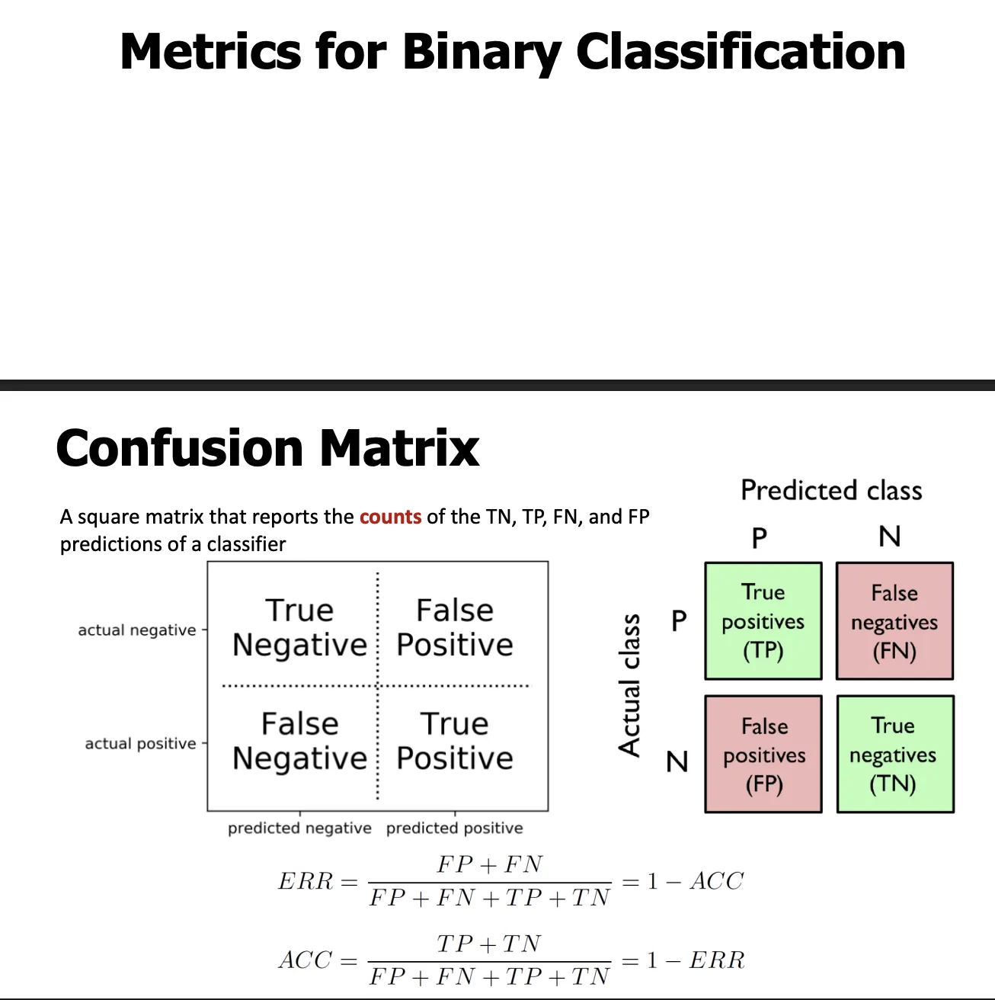

> Notion 원본 페이지의 강의 슬라이드와 설명을 바탕으로 정리한 노트입니다.

## **Metrics for Binary Classification**
**직역**: 이진 분류를 위한 성능 지표
**설명**: 클래스가 두 개인 문제(Positive / Negative)에서, 예측 결과를 어떻게 숫자로 평가할지 다룹니다.

## **Confusion Matrix**
**직역**: 혼동 행렬
**설명**: 분류기의 예측 결과를 **네 가지 카운트**로 요약한 **정사각 행렬**입니다.

- 축의 의미
	- **행(Row)**: 실제 클래스 (Actual)
	- **열(Column)**: 예측 클래스 (Predicted)

### **네 가지 항목**

- **TP (True Positive)**: 실제 P → 예측 P
- **TN (True Negative)**: 실제 N → 예측 N
- **FP (False Positive)**: 실제 N → 예측 P (오경보)
- **FN (False Negative)**: 실제 P → 예측 N (놓침)

## **Accuracy / Error Rate 식**

- **ERR**
	$$
	\text{ERR}=\frac{FP+FN}{FP+FN+TP+TN}=1-\text{ACC}
	$$
	**직역**: 오류율 = 전체 중 잘못 예측한 비율

- **ACC**
	$$
	\text{ACC}=\frac{TP+TN}{FP+FN+TP+TN}=1-\text{ERR}
	$$
	**직역**: 정확도 = 전체 중 맞춘 비율
	**설명**: 네 칸의 **합이 전체 표본 수**입니다.

***

# 치트시트

──────────────────────────── 이진 분류(Binary Classification) 기본 개념 ────────────────────────────
– Binary classification 두 개의 클래스(P / N) 중 하나를 예측하는 문제 예: 암/정상, 스팸/정상, 공격/정상
– Positive (P) 관심 대상 클래스 보통 “발견해야 하는 것” 예: 악성 종양, 공격 트래픽
– Negative (N) 관심 대상이 아닌 클래스
──────────────────────────── Confusion Matrix (혼동 행렬) ────────────────────────────
실제값과 예측값의 조합을 카운트한 표
                   Predicted P   Predicted N
Actual P         TP             FN Actual N         FP             TN
– TP (True Positive) 실제 양성을 양성으로 맞춤
– FN (False Negative) 실제 양성을 음성으로 잘못 예측 (놓침) 의료·보안에서 가장 위험
– FP (False Positive) 실제 음성을 양성으로 잘못 예측 (오경보)
– TN (True Negative) 실제 음성을 음성으로 맞춤
총 샘플 수 TP + TN + FP + FN
──────────────────────────── Accuracy / Error Rate ────────────────────────────
– Accuracy (정확도) 전체 중 맞춘 비율
ACC = (TP + TN) / (TP + TN + FP + FN)
개념 “얼마나 많이 맞췄는가”
주의 – 클래스 불균형일 때 신뢰 불가 – 전부 음성 예측해도 높게 나올 수 있음
– Error Rate (오류율)
ERR = (FP + FN) / 전체 = 1 – ACC
──────────────────────────── 비율 기반 지표 (Confusion Matrix 정규화) ────────────────────────────
– TPR (True Positive Rate) = Recall = Sensitivity
TPR = TP / (TP + FN)
개념 실제 양성 중 얼마나 잡았는가 “놓치지 않는 능력”
중요한 경우 – FN이 치명적인 문제 (암 진단, 침입 탐지)
– FNR (False Negative Rate)
FNR = FN / (TP + FN) = 1 – TPR
개념 실제 양성을 얼마나 놓쳤는가
– FPR (False Positive Rate)
FPR = FP / (FP + TN)
개념 실제 음성 중 얼마나 오경보를 냈는가
– TNR (True Negative Rate) = Specificity
TNR = TN / (TN + FP) = 1 – FPR
개념 실제 음성을 잘 걸러내는 능력
──────────────────────────── Precision / Recall / F1 ────────────────────────────
– Precision (정밀도)
Precision = TP / (TP + FP)
개념 “양성이라고 한 것 중 진짜 양성 비율”
중요한 경우 – FP 비용이 큰 경우 – 오경보가 문제인 시스템
– Recall (재현율)
Recall = TP / (TP + FN)
개념 “실제 양성 중 잡아낸 비율”
중요한 경우 – FN이 치명적인 경우
– Precision vs Recall 관계 threshold ↓ → Recall ↑, Precision ↓ threshold ↑ → Precision ↑, Recall ↓
– F1-score
F1 = 2 · (Precision · Recall) / (Precision + Recall)
개념 Precision과 Recall의 균형 점수 둘 중 하나라도 낮으면 F1 낮음
– 모델은 점수(score) 또는 확률(probability)을 출력 – predict()는 threshold 적용 결과
기본 threshold 보통 0.5
threshold 낮추면 – 더 많은 샘플을 양성으로 예측 – Recall 증가 – FP 증가 – Precision 감소
threshold 높이면 – Precision 증가 – FN 증가 – Recall 감소
──────────────────────────── Balanced Accuracy ────────────────────────────
Balanced Accuracy = (TPR + TNR) / 2
개념 – 클래스별 recall 평균 – Accuracy의 불균형 문제 완화
──────────────────────────── Precision–Recall (PR) Curve ────────────────────────────
– x축: Recall – y축: Precision – threshold를 바꾸며 그림
개념 – 양성 클래스 성능 중심 – 불균형 데이터에서 매우 중요
해석 – 곡선이 위에 있을수록 좋음
──────────────────────────── Average Precision (AP) ────────────────────────────
AP = Σ P(k) · ΔRecall(k)
개념 – PR curve 아래 면적 – score 기준 정렬된 상태에서 계산 – ranking 품질 평가
중요 – 불균형 데이터에서 accuracy 대체 지표
──────────────────────────── ROC Curve ────────────────────────────
– x축: FPR – y축: TPR – threshold 전체 sweep
개념 – 양성과 음성을 얼마나 잘 분리하는지
──────────────────────────── ROC AUC ────────────────────────────
– ROC 곡선 아래 면적 – 범위: 0 ~ 1
해석 – Random classifier → 항상 0.5 – 클래스 불균형과 무관
AUC = 1 → 모든 양성이 모든 음성보다 점수 높음
──────────────────────────── PR vs ROC 언제 쓰나 ────────────────────────────
– 클래스 불균형 → PR curve / AP
– ranking 품질 비교 → ROC AUC
– threshold 고정 운영 → Precision / Recall / F1
──────────────────────────── Multiclass Classification ────────────────────────────
– 개념 모든 멀티클래스 지표는 이진 분류를 one-vs-rest로 확장한 것
– Accuracy 정의는 같음 하지만 불균형이면 여전히 위험
– 평균 방식 macro: 클래스 동일 가중치 weighted: 샘플 수 가중치 micro: 전체 합산 계산
– 주요 도구 Confusion Matrix Classification Report
– 불균형 데이터 → Accuracy 금지 – FN 중요 → Recall – FP 중요 → Precision – 전체 비교 → PR / ROC – 랭킹 품질 → AUC – threshold 의존 여부 항상 확인
