> 원본 Notion 정리 — 강의 슬라이드/설명.
> [← 전체 목차](/posts/운영체제-목차/)

***

# Revisit: I/O  Operation

## I/O 명령을 통한 I/O 요청

### 1. Direct I/O, Memory-mapped I/O

- Direct I/O
	- CPU가 I/O 장치에 직접 명령을 전달하는 방식
- Memory-mapped I/O
	- I/O 장치를 메모리 주소 공간에 매핑해 메모리 접근을 통해 I/O 동작 수행

### 2. I/O Controller 역할

- CPU와 I/O 디바이스 사이 중재자 역할
	- CPU의 명령은 I/O 컨트롤러로 전달
		→ Memory Mapped I/O도 메모리 조작 결과가 I/O 컨트롤러로 전달

- CPU로부터 명령된 것을 처리하기 위해 레지스터를 가지고 있음
	- IR(Instruction Register)
	- DR(Data Register)

## I/O 처리 방법
→ 실질적으로 완료를 알리는 방법 차이
→ 위의 direct vs memory mapped는 명령을 주는 방법 차이

### 1. Programmed I/O

- CPU가 계속 I/O 장치에 요청 처리의 완료를 확인하는 형태(polling)로 데이터를 처리

### 2. Interrupt 

- I/O 장치가 요청을 처리했을 때 CPU에 신호를 주는 방식

### 3. DMA(Direct Memory Access)

- 위의 방식은 I/O 장치와 메모리 사이 데이터 이동은 CPU가 수행
- 데이터 전송이 CPU를 거치지 않고 메모리와 I/O 장치 사이에서 직접 이뤄짐
***

# Direct I/O, Memory Mapped I/O

## 1. Direct I/O

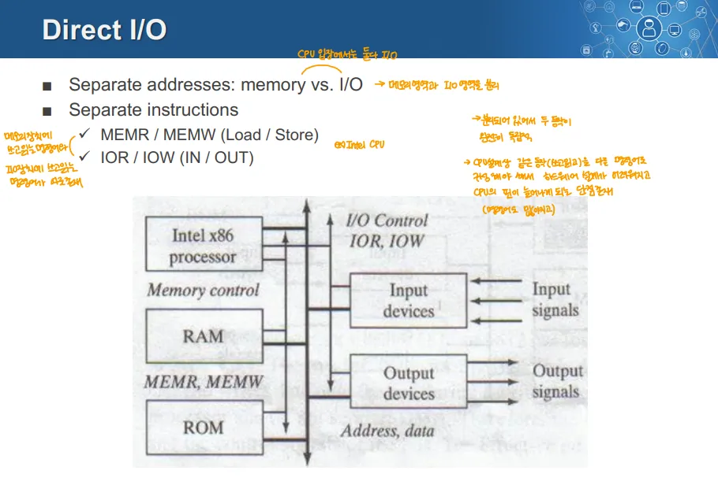

- CPU와 I/O 장치가 직접 데이터를 주고 받는 방식
	- **CPU의 레지스터와 I/O 컨트롤러가 직접 연결되어 작업을 처리**
	- CPU가 I/O 장치로 보내는 명령, I/O 장치가 시스템(CPU)으로 보내야 하는 데이터 모두 **CPU↔I/O 장치 사이에서 직접 이동**
- CPU와 메모리, CPU와 I/O 장치의 작업을 분리해 처리
	- 메모리 작업, I/O 작업을 별도의 주소, 별도의 명령어로 처리
	- MEMR/MEMW(=LOAD/STORE)
	- IOR/IOW(=IN/OUT)
- 인텔의 x86아키텍처에서 사용되는 방식 

### 장단점
장점

- CPU가 바로 처리하기 때문에 빠르고 응답성이 좋음
단점

- 메모리가 아닌 CPU의 레지스터를 사용해 I/O 장치와 연결되므로 **확장성이 상대적으로 떨어짐**
	- 한번에 컨트롤할 수 있는 I/O 디바이스 수가 적어짐(레지스터는 작으니깐)
- 프로세서의 구조가 복잡해짐(명령도 더 다양해짐)

## 2. Memory Mapped I/O

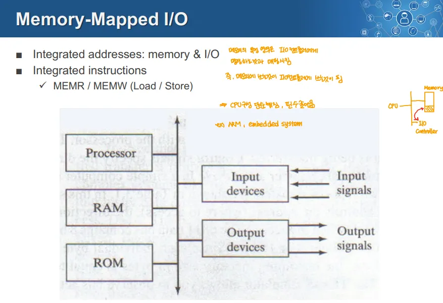

→ 프로세서(CPU)입장에서 메모리와의 데이터 전송, I/O 장치와의 데이터 전송 모두 동일한 I/O 작업으로 분류 가능

	- CPU에 데이터가 들어오고 나가는 작업
- 메모리 주소 공간에 I/O 장치를 매핑해 동작시키는 방식
	- 메모리의 특정 영역에 I/O 디바이스의 컨트롤러가 가진 레지스터를 매핑해놓는 형태로 명령을 내리는 방식
- 메모리와 I/O 장치가 동일한 주소 공간을 공유하고, 동일한 명령어를 가짐
	- MEMR, MEMW(=LOAD/STORE) 명령만 존재
	⇒ 덕분에 프로세서 설계가 단순해짐

- RISC 기반의 Arm 아키텍처가 주로 사용하는 방식

### 장단점
장점

- 프로세서 설계가 단순
- 확장성 측면에서 개선됨
단점

- 레지스터가 아닌 메모리를 사용하므로 상대적으로 응답성이 떨어짐

***

# Device Controller
= Host Adapter

- CPU가 I/O 작업에서 수행해야하는 기능들을 대신 담당해 CPU의 부담을 줄여주는 장치
- I/O 디바이스는 전자적인 구성 요소와 기계적인 구성 요소로 구성
	→ 기계적인 구성 요소 → 실제 데이터 입출력을 처리
	→ 전자적인 구성 요소 → 데이터 처리를 제어하는 장치 = Device Controller

- 여러 장치를 동시에 처리할 수 있는 능력을 가질 수 있음

## Device Controller의 역할

1. 직렬 비트 스트림을 바이트 블록으로 변환
	→ CPU는 바이트 단위로 처리하니깐

2. 필요하다면 에러 수정을 수행
3. 데이터를 메인 메모리로 보내 사용할 수 있게 함
***

# Memory, Storage, Network의 입출력 Latency

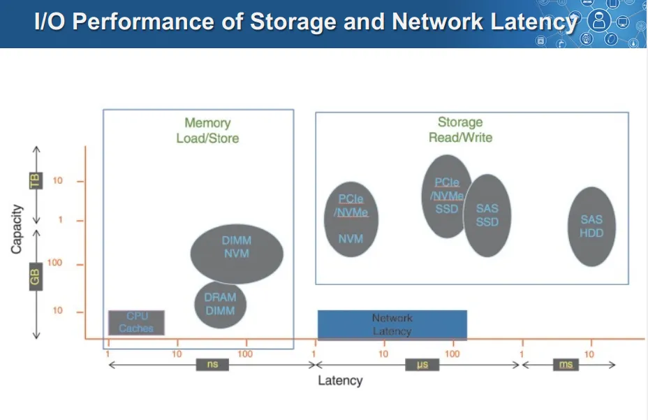

## 1. Memory Latency

- 용량은 “캐시 < DRAM < DIMM NVM”
- 입출력 지연시간은 캐시 < DRAM < DIMM NVM” 
→ NVM은 빠른 SSD같은거
⇒ 용량이 커질수록 느려지는 경향성

## 2. Storage Latency

- 별다른 경향성은 없음
- HDD, SSD 같은 곳에 read, write할 때의 지연 시간

## 3. Nework Latency

- 네트워크를 통해 데이터를 전송할 때의 지연 시간
- Storage Latency와 별 차이가 나지 않음
***

# Kernel I/O Structure
→ 강의자료 상으로 아래에 있음

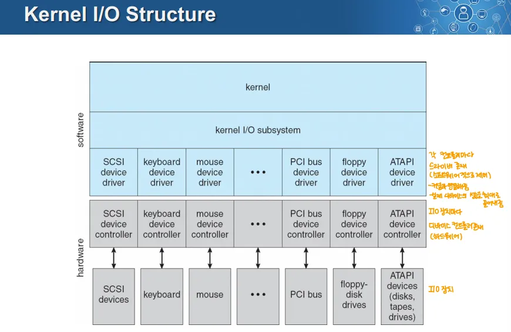

→ 입출력 장치를 관리하기 위한 커널의 입출력 관리 시스템의 구조

### 디바이스 드라이버

- 각 Device Controller마다 그에 맞는 디바이스 드라이버가 존재
- 각 장치에 종속적인 작업을 처리하는 역할

### Kernel I/O Subsystem

- I/O 작업에 필요한 기능 중 각 장치에 독립적인, 공통적인 작업을 처리하는 부분

# I/O 요청의 Life Cycle

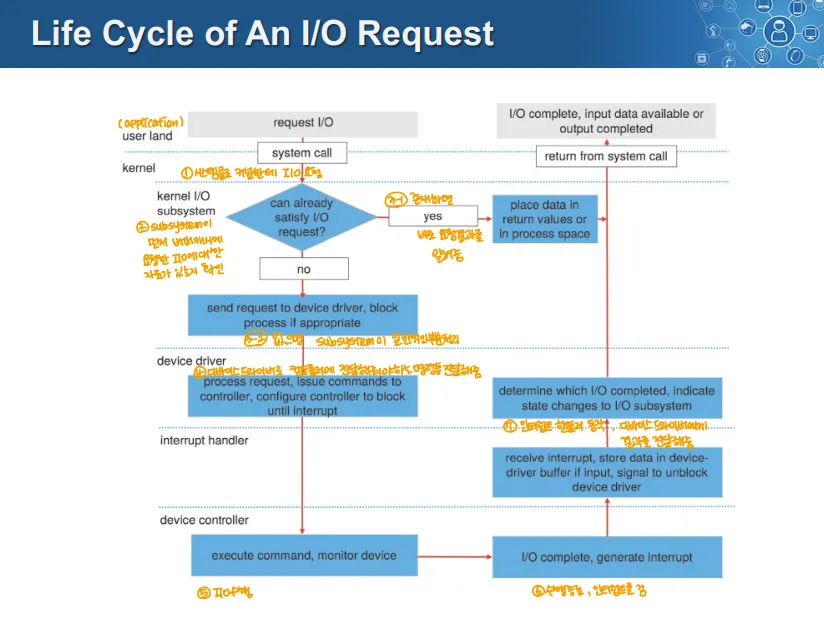

→ 커널, 커널 I/O 서브시스템, 디바이스 드라이버, 인터럽트 핸들러는 전부 커널의 일부

1. 사용자 레벨(application)에서 시스템 콜로 커널에  I/O 요청을 함
2. Kernel I/O Subsystem이 요청된 작업이 버퍼 캐시에 이미 존재하는지 확인
	- 있는 경우, 즉시 요청의 결과를 사용자 레벨로 전달
	- 없는 경우, kernel I/O Subsystem이 공통적인 작업을 처리한 후 디바이스 드라이버로 요청을 전달, 이때 필요하다면 프로세스를 블록 상태로 전환
3. 디바이스 드라이버는 I/O 요청을 처리하기 위한 작업을 수행하고, 디바이스 컨트롤러로 명령을 전달한다. 
	- 이때 작업 완료를 확인하기 위한 인터럽트를 대기하는 상태를 설정한다.
4. 디바이스 컨트롤러가 명령을 전달받아 실제 I/O 요청을 수행하고 작업 완료 시 인터럽트를 발생시켜 작업 완료를 알림
5. 인터럽트 핸들러가 호출되어 인터럽트를 처리하고, 데이터가 입력된 경우 이를 디바이스 드라이버 버퍼에 저장하고,~~ I/O 요청을 대기하고 있는 프로세스를 언블록으로 처리~~
	- 이후 결과를 디바이스 드라이버에게 전달
	→ 이거 언블록은 질문 해봐야 할 듯
	→ 이떄 입력(== cpu로 데이터가 들어간다)인데, I/O장치는 느리기 때문에 버퍼에 한번에 모아서 보내는 형태

6. 디바이스 드라이버에서 Kernel I/O Subsystem, Kernel을 거쳐서 유저 레벨로 결과를 전달
	- 이 때 Kernel I/O Subsystem이 작업 완료 상태 업데이트

## 컴퓨터 사이 통신(I/O 작업)

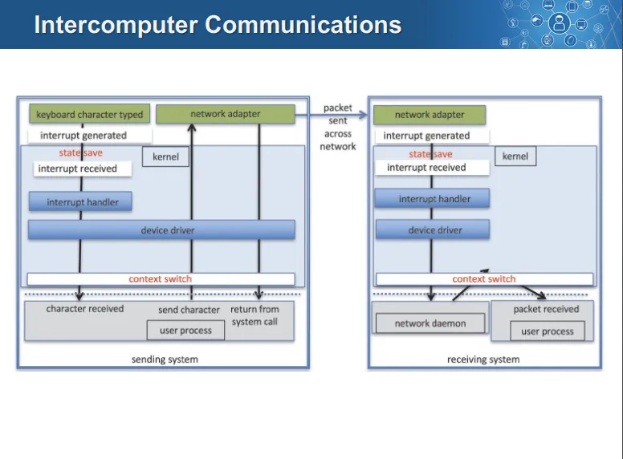

1. 키보드로 데이터를 입력, 이때 입력이 완료되면 인터럽트 발생
	→ 이거 키보드 연결 디바이스 컨트롤러는 생략이라 생각

2. 커널 레벨에서 인터럽트를 받으면 인터럽트 핸들러 실행
3. 인터럽트 핸들러가 이를 디바이스 드라이버로 전달
4. 인터럽트로 인해 Context Switch가 일어나서 I/O를 대기중이던 프로세스가 이를 전달받아 네트워크로 보내려 함
5. 이때 다시 디바이스 드라이버로 전달
6. 디바이스 드라이버가 네트워크 어댑터(디바이스 컨트롤러의 일종으로 생각)로 전달
	→ 기타 과정 생략이라 생각

7. 다른 컴퓨터로 회선(네트워크)를 타고 데이터가 전달
8. 다른 컴퓨터의 네트워크 어댑터가 이를 전송받음, 이때 인터럽트 발생
9. 다른 컴퓨터의 커널 레베에서 인터럽트를 받고, 인터럽트 핸들러 실행, 디바이스 드라이버로 전달
10. 다른 컴퓨터의 디바이스 드라이버가 이를 전달받고, 네트워크 전송을 대기하던 네트워크 데몬이 Context Switch되어 이를 다시 유저 프로세스로 전달
	- 이때 유저 프로세스로 Context Switch됨
***

# Device-Functionally Progression
→ 디바이스 기능 확장, 장치 기능 추가 정도로 생각

- **새로운 디바이스나 기능을 시스템에 추가할 때 해당 기능을 어떤 레벨에서 구현할지 결정하는 것**
	- 하드웨어 → 애플리케이션 코드까지 여러 레벨이 있음

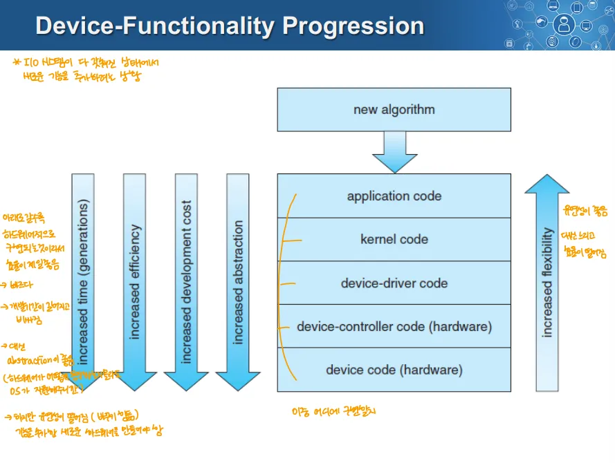

- 기준
	1. Increased time(generations)
		- 기술 개발에 걸리는 시간(장치 기능 개발에 걸리는 시간)
		- generations는 장치 기능 세대를 의미(신버전이 나올 때 까지의 시간)
	2. Increase Efficiency
		- 작업 처리 효율, 성능을 의미
	3. Increased development cost
		- 기능 개발에 걸리는 시간이 증가
	4. Increase abstraction
		- 추상화 정도를 말함
		- 위 단에서 사용할 때 얼마나 추상화 되는지
	5. Increased Flexibility
		- 증가된 유연성, 기능 추가 및 수정이 용이한 정도
- 전체적인 경향성은 
	- 하드웨어 단에 가까워지면
		- 증가하는 것
			1. 성능
			2. 개발 시간
			3. 추상화 정도
			4. 개발 비용
		- 감소하는 것
			1. 유연성
	- 소프트웨어 단에 가까워지면 이 반대
***

# I/O 소프트웨어의 목표
→ 컴퓨터 시스템에서 입출력 장치와 데이터를 주고받기 위해 사용하는 소프트웨어
	→ ex) 디바이스 드라이버, 파일 시스템
→ 이런 I/O 소프트웨어가 지향해야할 점 
	→ 시스템마다 다르게 적용되어야 하는 것 포함

### 1. Device Independence(디바이스 독립성)

- 프로그램이 특정 입출력 장치에 종속적이지 않고 여러 I/O 디바이스에 사용 가능해야함

### 2. Uniform Naming(일관된 명명)

- 파일이나 디바이스의 이름이 일관된 방식으로 문자열, 정수 등으로 간단히 식별되어야 함

### 3. Error Handling(에러 처리)

- 에러는 가능한한 하드웨어랑 가까운 부분에서 처리되어야 함

### 4. Synchronous, Asynchrnous(동기적 동작, 비동기적 동작)

- I/O 작업은 동기적, 비동기적으로 수행될 수 있음
	- 동기적 → blocked trasfer(블로킹된 전송)
	- 비동기적 → Interrupt-driven(인터럽트에 의한 전송)
	- 이건 시스템 요구에 맞게 구현

### 5. Buffering(버퍼링)

- 디바이스에서 나온 데이터는 최종 목적지로 곧장 보내지지 않고 버퍼에 임시 저장

### 6. Sharable, Dedicated Divice(공유 가능, 전용 디바이스)

- 디바이스는 여러 프로세스에 의해 공유 가능하거나 특정 프로세스에 전용으로 할당될 수 있음
	→ 디스크가 공유되는 디바이스에 해당
	→ 테이프 드라이브는 전용의 디바이스에 해당

- 공유되지 않는 전용의 장치는 데드락 같은 문제를 일으킬 수 있음

# I/O Software 계층

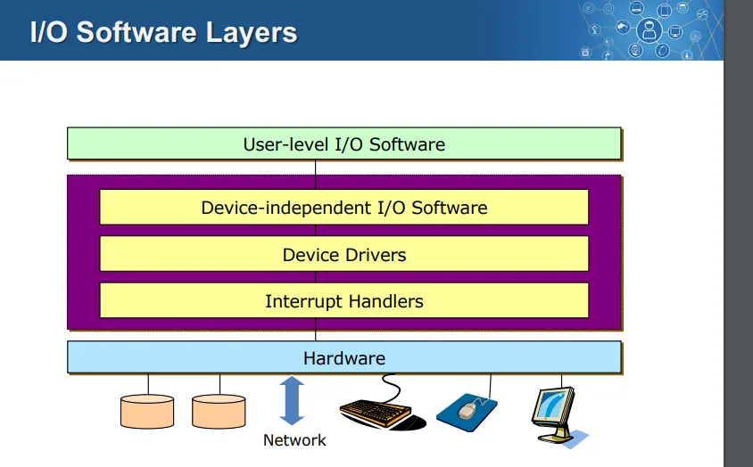

- 실질적으로 I/O System 구조와 동일
***

# Interrupt Handler

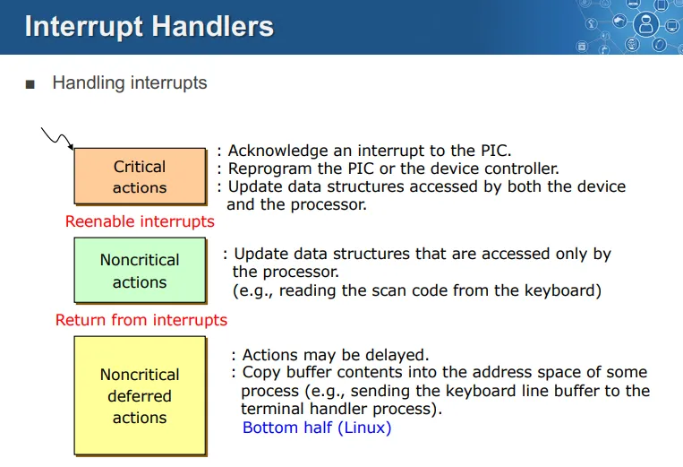

→ 교수님이 별로 안중요하다 말씀
→ “컴퓨터 공학 측면에서는 인터럽트 핸들러가 존재해서 이 핸들러가 잘 처리를 해 디바이스 드라이브에 전달하면 된다” 정도만 이해하라 하심

- 인터럽트 처리 과정을 우선순위에 따라 세 단계로 나눔
	- Critical Action/ Noncritical Action/ Noncritical deferred action
1. Critical Action
	- 인터럽트 발생 시 가장 먼저 처리해야하는 것 → 즉시 처리
	1. 인터럽트 확인
	2. 컨트롤러 재설정(디바이스 컨트롤러, 인터럽트 핸들러 재설정)
	3. 데이터 구조 업데이트(디바이스와 프로세스가 공유하는 데이터 구조)
2. Noncritical Action
	- 즉시 처리할 필요는 없는 것
	1. CPU만 접근하는 데이터 구조 업데이트
3. Noncritical Deferred Action
	- 즉시 처리할 필요도 없고 지연하는 작업
	1. 버퍼 데이터를 메모리 공간으로 복사
***

# Device Driver

- I/O 디바이스를 디바이스에 독립적인 I/O Software나 인터럽트 핸들러와 상호작용하게 하는 디바이스에 특화된 코드(소프트웨어)
- 디바이스 드라이버를 제외한 운영체제의 다른 부분과 연동을 위해 잘 정의된 모델이나 표준 인터페이스를 필요로 함

## 디바이스 드라이버 구현 방법

1. Statically Linked with the Kernel
	- 디바이스 드라이버가 커널에 정적으로 연결되어 커널 코드의 일부로 포함
2. Selectively Loaded During Boot time
	- 부팅 시점에 선택적으로 필요한 드라이버를 로드
	→ 보통 이 형태를 띔

3. Dynamically Loaded During Execution
	- 실행 시점에 동적으로 시스템에 드라이브를 로드
	→ 핫 플러그(실행 할 떄 꽂는 것) 디바이스

# Device Independent I/O Software
→ = Kernel I/O Subsystem

- I/O 디바이스들이 공통적으로 제공해야하는 부분들을 처리하는 중재자 역할

## 주요 기능

### 1. Uniform Interfacing for Device Driver

- **디바이스 드라이버를 위해 일관된 인터페이스를 제공**
- EX) 유닉스에서는 디바이스는 특수한 파일로 관리
	- open,read, write, close, ioctl 등의 시스템 콜로 관리
	- 디바이스와 상호작용 할 때 이런 일관된 인터페이스를 제공
	- 유닉스에서 Major Device Number로 드라이버를 식별, Minor Device number로 드라이버 내부 디바이스를 식별
	- 파일 시스템의 보호(권한) 시스템이 디바이스에 동일하게 적용

### 2. Buffering(버퍼링)
→ 데이터가 디바이스 → 유저 레벨, 유저 레벨 → 디바이스로 이동할 때 사용하는 임시 저장 공간
→ I/O 작업 성능 최적화, 디바이스와 CPU의 속도 차이 줄임

- 버퍼링의 4가지 종류가 있음

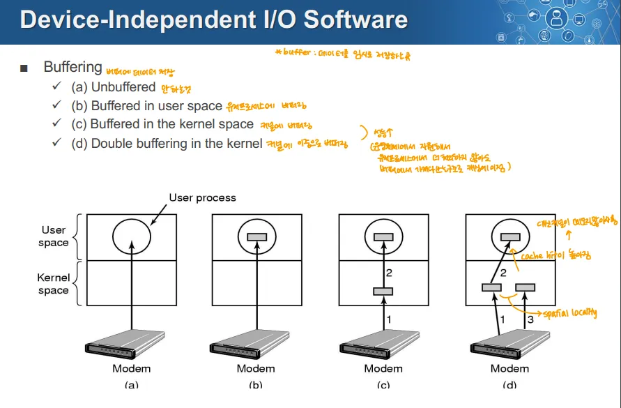

1. Unbuffered
	- 버퍼를 사용하지 않음
2. Bufferd in user spcae
	- 유저 스페이스에 있는 버퍼에 데이터를 저장
3. Bufferd in the kernel space
	- 유저스페이스와 커널에 있는 버퍼(각 1개, 총 2개)에서 데이터를 저장
	- 커널에 버퍼링 하는 경우 애플리케이션에서 캐싱하지 않아도 OS가 알아서 캐싱하게 됨
4. Double Buffering in the kernel
	- 유저스페이스에 버퍼 1개, 커널에 버퍼 2개에 데이터를 저장
	- 커널 버퍼 2개에 동일한 데이터를 넣는 것이 아니라 하나에는 다음에 읽어올 것을 넣어놓음
		- spacial locality를 통해 근처의 값을 읽어 이를 미리 버퍼에 캐싱해놓음
→ 3번 4번 처럼 이중으로 버퍼링 하면 데이터 손실이 일어날 확률이 적어짐 → 신뢰성이 향상
→ 보통 커널에 이 4가지 방식을 모두 지원, 디바이스 드라이버 개발자가 선택해 사용 가능

### 3. Error Reporing

- 많은 에러가 디바이스에 특화되어 일어나서 개별 드라이버가 핸들링
	- 그러나 에러 처리의 기본 틀은 디바이스에 독립적
	- 공통적으로 발생하는 에러는 Kernel I/O Subsystem에서 처리할 수도 있음
- 보통 I/O에서 일어나는 에러는 실제 I/O 장치 에러거나 프로그래밍 문제 → 둘 다 핸들링하긴 해야함
- 에러 헨들링 방식
	- 시스템 콜로 에러 코드를 반환
	- 특정 횟수만큼 다시 시도 → ex) 네트워크가 이렇게 동작
	- 에러를 무시
	- 프로세스를 죽이는 방식
	- 시스템을 강제종료하는 경우 → ex) CPU 발열문 제

### 4. Allocating and Releasing Dedicated Divices

- **공유되지 않는 전용 디바이스의 관리**
	- 동시 접근을 방지, 이런 장치를 관리하는 방법이 필요
- (유닉스에서) 프로세스가 open()을 통해 특정 디바이스를 할당받음
	- 실패하면 open()을 다시 시도
- OS는 특별한 방법으로 전용 장치의 요청, 해제를 관리
	- 장치가 사용 불가하면 호출을 차단

### 5. Device-Independent Block Size

- 상위 계층에서는 같은 크기의 블록을 사용하는 추상화된 디바이스를 다룸
	- 이를 위해 블록 크기를 잘 조절해야함
***

# User Space I/O Software

- 유저 레벨에는 라이브러리의 형태로 제공됨
	- ex) C의 스탠다드 I/O 라이브럴
		- fopen(), open()
		→ 내부에 시스템 콜이 사용됨

## Spooling

- 멀티프로그래밍 시스템에서 전용의 I/O 디바이스를 다루는 방식
- 큰 파일 같은 것을 메모리에 올려놓게 되면 메모리 낭비가 심해짐
	- 만일 I/O 디바이스가 느리다면 오랫동안 보관하게 됨
→ 교수님은 프린터 예시, 프린터는 느림, 근데 출력하는 파일들은 큼
	→ 따라서 이를 메모리에 계속 올려놓으면 메모리를 많이 오래 차지
	→ 이를 해결하기 위해 디스크에 임시저장하고 이를 읽어서 전달
	→ 메모리도 I/O디바이스보다 빠르지만, 디스크도 I/O디바이스보다는 빨라서 상관없음

- **이를 방지하기 위해 데이터를 디스크에 임시 파일같은 형태로 저장하고 이를 I/O 디바이스에 컨트롤러에 전달하는 형태**
***

# I/O 시스템 계층

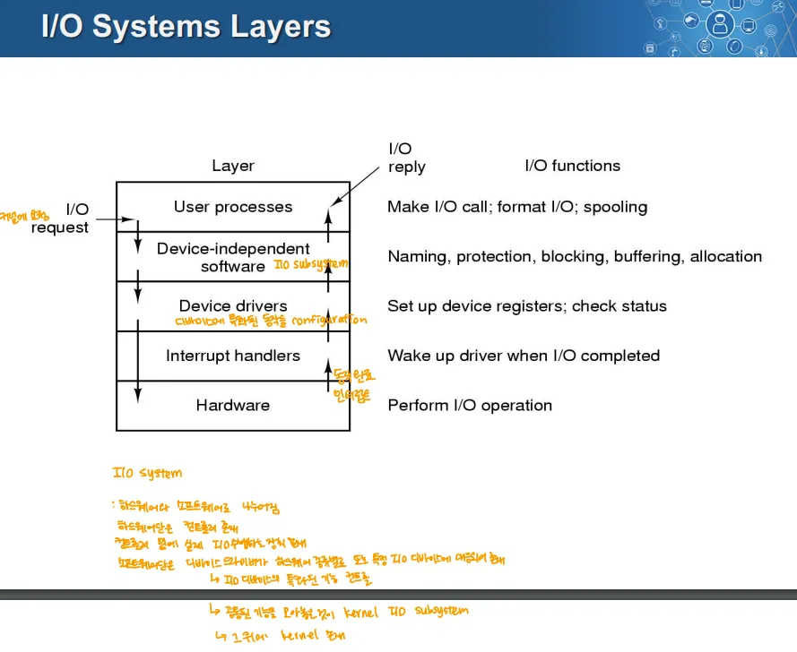

→ I/O Software Layer, I/O System Structure와 동일

- 하드웨어로 내려갈 때는 인터럽트 핸들러는 거치치 않음
	- 나머지는 모두 순서대로 거침(올라올 때도)
