> 원본 Notion 정리 — 강의 슬라이드/설명.
> [← 전체 목차](/posts/학교공부/운영체제/목차/)

***

# 컴퓨터(Computer)

## 컴퓨터란?

- CPU와 메모리를 구성요소로 가진 하드웨어 위에 소프트웨어가 동작할 수 있는 세상의 모든 것

## 컴퓨터의 분류

1. 임베디드 컴퓨터 
	- 특정 목적에 맞춰 제작한 컴퓨터
	- 특징 
		- 대체로 비용적 이유로 하드웨어 스펙이 좋지 않음
2. 퍼스널 컴퓨터(PC)
	- 범용으로 사용 가능한 컴퓨터
		→ 엄밀히 따지면 정확한 정의는 아니나, PC는 이런 컴퓨터에 속함

3. 서버 컴퓨터
	- 범용으로 사용 되는 것들 중 성능이 매우 좋은 것
	- 대부분 다수 원격 사용자에게 온 요청을 처리해 응답을 주는 역할 수행

## 컴퓨터의 구성 요소(추상적인 버전)
→ 컴퓨터의 구성 요소를 사용자+3개의 계층으로 설명

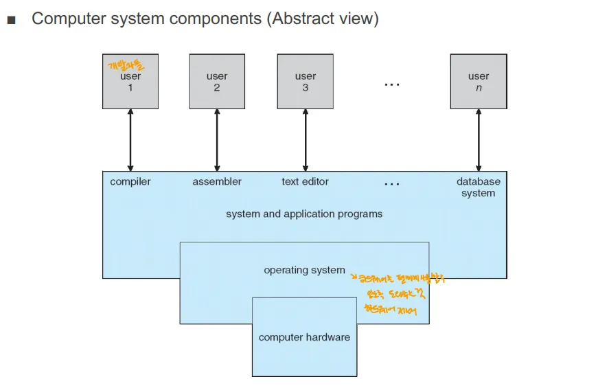

### 1. 사용자

- 개발자 또는 일반 사용자들 or 다른 프로그램을 사용하는 프로그램

### 2. 시스템 및 애플리케이션 프로그램

- 사용자가 실행하는 중간 격(미들웨어 격)의 프로그램
- 컴파일러, 어셈블러, 텍스트 편집기, 데이터베이스 시스템 등

### 3. 운영체제

- 하드웨어와  시스템 및 애플리케이션 프로그램 사이에서 하드웨어를 제어하는 역할을 수행하는 소프트웨어
- 다른 프로그램들이 하드웨어를 직접 사용하지 못하게 함과 동시에 하드웨어를 편하게 사용할 수 있도록 함

### 4. 하드웨어

- 컴퓨터의 물리적인 하드웨어

## 컴퓨터 시스템의 구조(추상적인 버전)

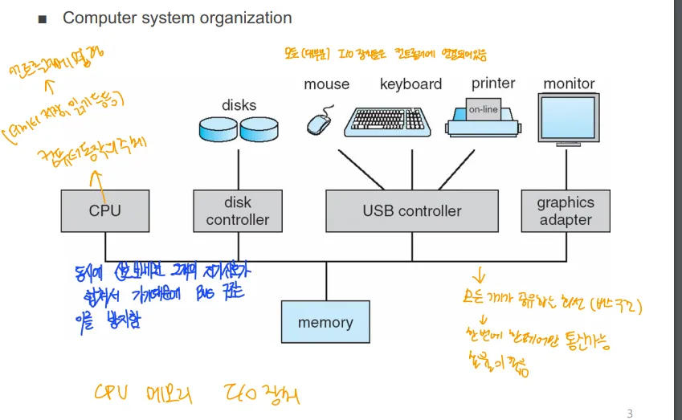

### 버스(BUS)

- 각 구성요소들을 연결하는 매체
	- 일종의 네트워크 인터페이스, 토폴로지임, 대역폭도 존재
	→ 그림에서의 선

- 특징
	- 한번에 한 쌍만 통신 가능
	→ 대체로 CPU와 다른 것 사이에서 통신

### 컨트롤러
→ 컨트롤러 + 어댑터 

- 위 그림의 USB 컨트롤러, 디스크 컨트롤러, 그래픽 어댑터 등등
- CPU는 입출력 장치들과 직접 연결되지 않고 각기 다른 컨트롤러에 연결
- 사용하는 이유
	- CPU는 입출력 장치보다 빠름, 따라서 CPU가 데이터를 보내도 입출력 장치가 느려서 CPU가 작업을 마치는 시간보다 더 기다려가면서 작업을 해야함
	- 버스는 한 쌍만 통신이 가능하기 때문에 기다리면서 다른 작업을 수행하는 것도 어려움
	⇒ 따라서 이 CPU와 입출력 장치 사이의 성능 차이를 해결하기 위해, 컨트롤러(어댑터)가 존재

## Modern PC Architecture(현대 PC 구조)

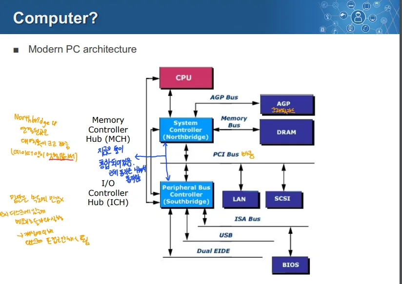

### 1. CPU

- 직접적으로 메모리 및 다른 장치들과 연결되지 않고, NorthBridge와 SouthBridge와 연결

### 2. Northbridge(System Controller)

- 상대적으로 대용량 데이터를 빈번하게 교환해야 하는 기기들을 연결
- AGP(그래픽 카드), DRAM 등과 연결

### 3. Southbridge(Peripheral Bus Controller)

- 상대적으로 느린 장치들(ex. IO 디바이스, LAN, BIOS 등)을 관리

### Northbridge, Southbridge 분리의 이유

- 대용량 데이터의 병목(고속 장치와 저속 장치의 처리 속도가 다르므로)을 없애기 위해

# Operating System

### 운영체제의 역할

1. 추상화(Abstraction)
	- 운영체제는 하드웨어 자원을 추상화하여 사용자나 응용 프로그램이 복잡한 하드웨어 동작을 몰라도 사용할 수 있도록 함
2. 자원 공유(Sharing)
	- 여러 자원들이 하드웨어 자원을 공유해서 사용할 수 있도록 함
		→ CPU, Memory 등

	- 각 프로그램들이 문제 없이 수행될 수 있도록 하면서도 효율적으로 자원을 사용할 수 있게 함
3. 보호(Protection)
	- 한 프로세스가 다른 프로세스의 자원에 접근하거나 손상시키지 않도록 보호
4. 공정성(Fairness)
	- 하나의 프로세스가 자원을 독점하지 않고 공평하게 사용될 수 있도로 ㄱ보장
5. 성능(Performance)
	- 자원을 효율적으로 관리하여 시스템 성능을 최적화
	- CPU, 메모리, 디스크 등의 자원이 필요한 곳에 적절히 할당될 수 있도록 관리

### 운영체제의 정의

1. Resource Allocator(자원 할당자)
	- 하드웨어 자원을 적절하게 나눠 할당하는 역할을 함
2. Control Program(제어 프로그램)
	- 하드웨어와 소프트웨어 사이의 상호작용, 시스템의 작동을 감시하고 제어
	- 사용자와 시스템 간의 인터페이스 제공
3. Kernal(커널)
	- 운영체제의 핵심 부분(핵심적인 기능들)

### 운영체제의 목적

1. 편의성 → 사용자가 복잡한 하드웨어를 편하게 사용할 수 있도록 함
2. 효율성 → 하드웨어 자원을 최적화해 성능 극대화
**→ 편의성과 효율성을 위해 하드웨어 자원을 관리해주는 특수한 시스템 소프트웨어**

# Computer System Operation

## Computer HW Architecture(추상적인 버전)

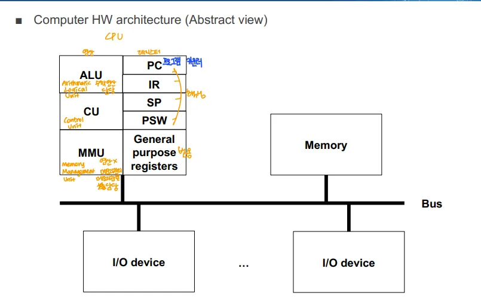

### CPU 구조

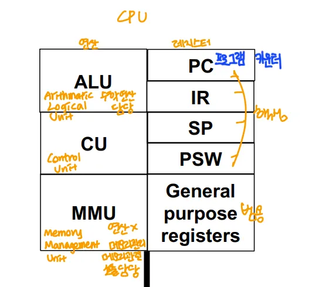

→ CPU는 위와 같이 쪼개져 있음, 좌측은 작업을 실질적으로 수행

1. ALU → 산술 연산 처리
2. CU → 컨트롤 플로우 제어를 담당
	→ 우리가 모듈을 쓰면 거기로 컨트롤 플로우가 넘어가거나 함

3. MMU → 메모리를 관리하는 여러가지 기능들을 하드웨어적으로 구현
	- 메모리 관리는 복잡하므로 SW로 처리하는 경우에는 느림, 따라서 하드웨어적으로 처리
4. PC → 다음번에 수행할 명령의 주소를 저장
5. IR → 현재 수행하고 있거나 수행해야 할 명령어를 저장
6. SP → 현재 컨트롤 플로우에서 메모리 스택의 가장 위에 있는 메모리의 주소
7. PSW → 프로그램의 현재 상태를 저장
8. General Purpose Register → 함수의 인풋 등의 다양한 목적에 범용으로 사용

## CPU Operation

### 폰 노이만 아키텍처
→ 현재도 사용

- 프로그램 코드와 데이터를 동일한 메모리에서 관리하는 시스템
- CPU와 메모리 사이에 병목이 생김
	- 이 병목을 해결하기 위해 코드 메모리와 데이터 메모리를 각각 분리해서 CPU와 연결한 것 → 하버드 아키텍처

### 폰 노이만 아키텍처 vs 하버드 아키텍처

- 폰 노이만 아키텍처
	- 메모리를 효율적으고 유동적으로 사용 가능
- 하버드 아키텍처
	- 성능이 빠름 → 코드, 데이터 메모리를 나눠서 캐시 힛 확률이 높음
	- 메모리를 효율적으로 활용하기 어려움
	- 폰 노이만 아키텍처보다 복잡해 구현 비용이 증가하고 발열과 전력소모가 큼
→ 현재는 폰 노이만 아키텍처를 사용

### 명령어들

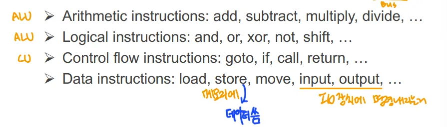

→ 주로 ALU와 CU가 명령들을 처리

## 리눅스의 부트스트래핑(Bootstrapping) 과정
→ 부트스트래핑 = 시스템 시작 과정, 참고로 부팅은 부트스트래핑의 일부

1. CPU에 전원 공급
2. 전원이 공급되면 CPU는 스스로를 초기화하고, 0xFFFFFFF0 위치로 이동 시작되는 명령어를 실행
	- 해당 주소는 바이오스 명령들의 시작 주소
3. BIOS/UEFI의 명령 실행
	- BIOS ⇒ Basic Input/Output System, 오래된 펌웨어 인터페이스
	- UEFI ⇒ Unified Extensible Firmware Interface, 최신의 펌웨어 인터페이스
	- POST(Power-On Self-Test)
		- 제대로 작동하는지 확인 하기 위해 셀프 테스트(POST, Power On Self Test)를 실행
		- CPU, 모니터, 키보드 등등 필수적인 장비 테스트
4. 부트 장치 및 부트 로더 찾기
	- BIOS/UEFI는 운영체제를 로드할 부트 장치(디스크)를 찾고, 부트 로더를 메모리로 로드
	- BIOS는 MBR을 확인해 부트 로더를 찾고, UEFI는 ESP에서 부트 로더를 찾음
5. 부트 로더 실행
	- 부트 로더 → 디스크에 설치된 압축된 커널 이미지를 메모리로 로드
	- LILO나 GRUB 같은 부트 로더를 실행
	- LILO → 리눅스 구버전 부트 로더
		- 정해진 메모리 주소에서 운영체제를 로드
		- 운영체제가 업데이트 될 때 마다 이 주소를 수동으로 변경해야함
	- GRUB → 최신 리눅스에서 사용되는 부트로더
		- 벡터 값을 이용해 다양한 운영체제 중에서 선택
6. 메모리로 로드된 커널은 스스로 압축을 풀고 실행시킴

## CPU

### ISA(Instruction Set Architecture)
→ ISA의 구조에 따라 컴퓨터 아키텍처를 CISC, RISC로 나눌 수 있음

- CISC(Complex Instruction Set Computer)
	- 자주 사용되는 instruction 들을 하나로 묶어서 사용하도록 하드웨어 설계
	- 장점
		- 자주 쓰는 명령들을 묶어, 여러 사이클에 할 일을 한 사이클로 해서 빠름
	- 단점
		- 회로의 복잡도가 엄청나게 증가
		- CPU 설계가 어렵고 전력 소모량, 열 효율이 악화
	→ x86 진영(주로 인텔) 프로세서는 아직 CISC를 사용

- RISC(Reduced Instruction Set Computer)
	- 기본적인 instruction들만 ISA에 넣고 사용
	→ ARM(주로 애플의 코어), MIPS(ISA)는 RISC 사용

### Pipelining

- RISC의 성능 향상을 위한 방식
- CPU가 명령어를 여러 단계로 나눠 동시에 처리하는 방식
- 주로 1) Fetch, 2) Decode 3) Execute 4) Write Back 단계로 나눔
- 각 명령어 단계가 종속성이 없다면 동시에 실행 가능

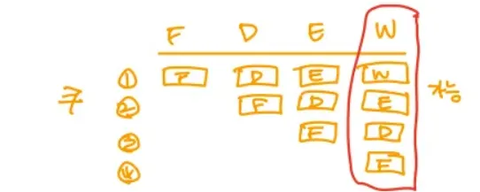

### ILP(Instruction Level Parallelism, 명령 레벨 병렬성)

- CPU가 여러 명령어를 동시에 실행할 수 있는 능력
- ILP를 지원하는 기술
	1) Superescalar 2) VLIW 3) Simultaneous multithreading 4) Multi-core
		→ 슈퍼 스칼라와 VLIW는 ILP, 동시 멀티스레딩, 멀티 코어는 TLP(스레드 레벨)에 가까움

	- SuperScalar
		- 하드웨어적인 ILP
		
		- 여러 명령어를 동시에 실행할 수 있는  CPU 구조
		→ CPU 내부에 여러 실행 유닛이 있어 동시에 여러 명령어를 가져와 해석 및 실행

	- VLIW(Very Long Instruction Word)
		- 소프트웨어적인 ILP(컴파일 시점에 병렬성 분석 및 동시에 실행하게 함)
		- 여러 개의 독립적인 명령어들을 묶어 하나의 긴 명령어로 만든 후 동시에 실행
	- Simultaneous Multithreading
		- CPU가 여러 스레드를 동시에 실행
		- Intel의 하이퍼 스레딩이 이런 동시 멀티스레딩의 일종
	- 멀티코어
		- 하나의 CPU에 여러 코어를 통합해 여러 작업을 병렬로 처리할 수 있는 구조

## CPU 아키텍처(그 중, 멀티 프로세서 아키텍처)

### 멀티 코어 아키텍처

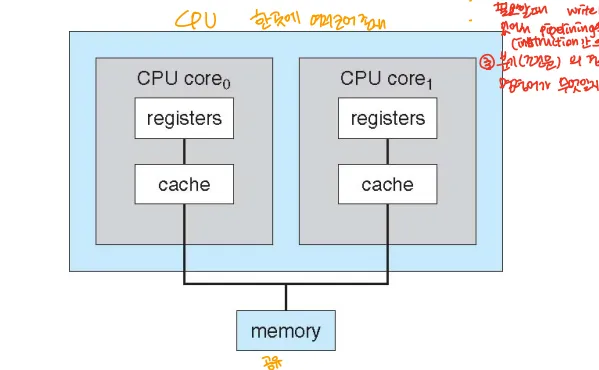

- 물리적인 CPU안에 코어를 여러개 넣고, 메인 메모리는 공유
→ 하나의 CPU에 코어가 여러개

### Symmetric multiprocessing architecture

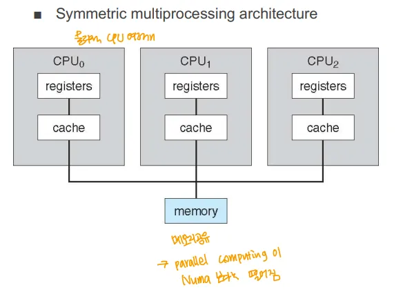

- 물리적 CPU를 여러개 두고 메모리를 공유하는 형태
- 확장성이 좋음

### NUMA multiprocessing architecture
→ Non Uniform Memory Access → 메모리를 단일로 두지 않았다는 뜻

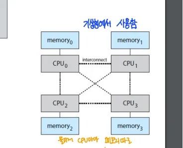

- 각 CPU끼리 모두 BUS로 연결되고, 각 CPU 마다 독립적인 메모리를 가짐

### Clustured system architecture

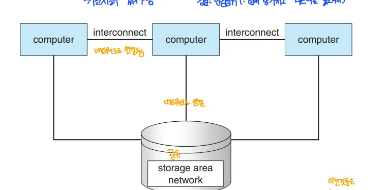

- 단일 컴퓨터 시스템들을 연결해 공유 저장소에 연결해 사용
- SAN(Storage Area Network)에 각 노드를 묶어 공유 스토리지를 통해 데이터 공유

## 분산 시스템과 병렬 시스템

### 병렬 시스템

- 여러 CPU 또는 코어가 일을 동시에 처리
- 멀티 코어 아키텍처, Symmetric(다중) 멀티프로세스 아키텍처, Numa 멀티프로세스 아키텍처가 여기에 속함

### 분산 시스템

- 각 단위 시스템들을 여러 개를 둬서 그 결과를 서로 공유, 갈무리해 하나의 시스템 처럼 동작
- 클러스터 시스템 아키텍처가 여기에 속함

# I/O Operation

- I/O 명령을 통한 I/O 요청
	→ CPU가 외부 장치와 데이터를 주고받는 과정

	- 2가지 방식이 존재
		1. Direct I/O → CPU와 입출력 장치가 직접 통신, CPU는 그 동안 대기
			→ CPU가 바로 입출력 장치의 데이터 사용할 떄 사용

		2. Memory-mapped I/O → 메모리와 입출력 장치 간에 데이터 전송
			→ DMA가 있으면 CPU는 기다리지 않고, 그게 아니면 CPU도 대기

- I/O 방식
	1. Programmed I/O
		- CPU가 입출력 장치로부터 데이터를 주기적으로 확인(polling)
		- 계속 요청을 통해 물어보므로 CPU 오버헤드 증가
	2. Interrupt
		- 입출력 장치에서 CPU에게 작업이 완료되었음을 알리는 방식
		- CPU는 특정 이벤트가 발생할 떄만 중단되고, 장치의 요청을 처리해 CPU 오버헤드 감소
	3. DMA(Direct Memory Access)
		- CPU의 개입 없이 입출력 장치가 직접 메모리로 데이터를 전송하는 방식
		→ 입출력 작업 시작 시 CPU가 DMA 컨트롤러(or 유닛)에게 메모리와 입출력 장치를 연결해주고 이후에는 CPU가 개입X
		→ CPU 부하가 줄어듬

## Interrupt Driven I/O 

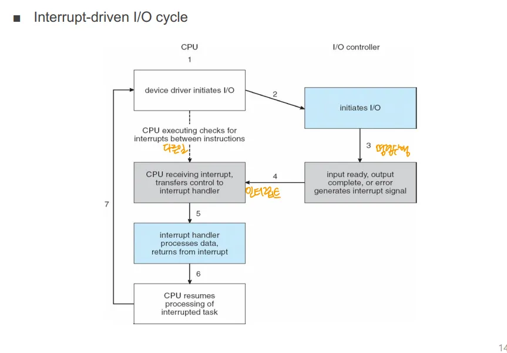

1. CPU가 I/O 작업 시작을 위해 초기화
2. I/O 컨트롤러에 명령, CPU는 그 이후 다른 자겅ㅂ 수행
3. I/O 작업이 끝나면 CPU에게 인터럽트를 보냄
4. 그럼 다시 아이오 작업을 수행

## 애플리케이션 프로세스 관점에서 I/O 모드

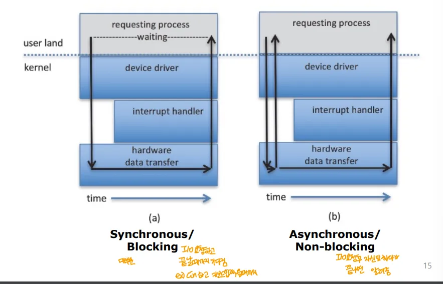

- 2가지 모드 존재  → 원래 다 따로, but 대부분 2가지가 함께 감
	1. Synchronous + Blocking 
	2. Asynchronous + Non-blocking
	**→ 동기, 비동기 = 작업의 완료 여부 / 블로킹, 논 블로킹 = 작업이 완료될 떄까지 프로세스 or 스레드가 멈추는지 안멈추는지의 여부**

		- 동기 → 작업이 끝나야 다음 작업 실행 가능
		- 비동기 → 작업이 끝나지 않아도 다른 작업을 진행 가능
		- 블로킹 → 작업이 완료될 때까지 프로세스 또는 스레드가 대기 상태
		- 논 블로킹 → 요청한 작업이 바로 완료되지 않더라도, 프로세스나 스레드가 멈추지 않고 다른 작업을 계속 수행
		→ 관점의 여부, 물론 동기+논 블로킹, 비동기+블로킹도 가능
		→ 동기 + 논블로킹 → 작업 요청 시 프로세스는 다른 작업 실행 가능 but 요청한 작업이 완료 되었는지 반복적으로 확인(polling)
		→ 비동기+블로킹 → 작업 요청 시 프로세스는 다른 작업 가능 but 작업 결과 필요할 떄는 비동기 작업 요청을 대기(but 계속 확인해야하지는X)
		→ 동기, 비동기의 중요한 부분은 결과를 확인해야하는지, 결과가 나오면 콜백, 인터럽트 등으로 알려주는가 인듯
**→ 본래 애플리케이션 프로그램은 하드웨어 자원을 직접 제어 불가, OS에게 I/O 작업도 요청해야함**

### 1. Synchronous / Blocking I/O

- 애플리케이션 프로그램이 OS에 I/O 작업을 요청하고 이를 처리하는 시간동안 기다리는 것

### 2. Asynchronous / Non-blocking I/O

- 애플리케이션 프로그램이 OS에 I/O 작업을 요청하고 이를 기다리지 않고 다른 작업 수행

## Interrupt

### CPU가 I/O 작업 완료를 확인하는 방법

1. Polling 방식
	- 명령을 내린 주체(CPU)가 I/O 작업이 끝났는지 반복해서 물어보는 방식
	- CPU 오버헤드가 큰 방식
		- CPU는 다른 작업을 하는 동안에도 지속적으로 확인을 해야함
		- Polling 주기가 오기 전까지는 작업 완료를 알 수 없음
2. Interrupt 방식
	- I/O 작업이 끝나면 명령 받은 장치가 직접 CPU에게 작업 완료를 알림
	- CPU 오버헤드가 크지 않음

### 인터럽트란?

- CPU 가 인터럽트라는 신호를 받으면 기존 작업을 멈추고 인터럽트부터 처리함
- 1) Interrupt 2) Trap 3)Fault 총 3가지로 나뉨

### 1. Interrupt

- 하드웨어 장치에 의해 발생
- 비동기적
- Ex) Keyboard Interrupt, Timer Interrupt등
→ 주로 입출력 장치가 CPU에게 신호를 보내 CPU의 작업 흐름을 일시 중단

### 2. Trap

- 애플리케이션 프로그램에서 OS로 보내는 요청 신호
- 동기적
- Ex) System Call

### 3. Fault

- 프로그램 실행 중 오류가 나면 CPU가 이를 감지해 처리하는 형태
- Ex) 0으로 나누는 경우

### 소프트웨어 인터럽트, 하드웨어 인터럽트

- 소프트웨어 인터럽트 → 소프트웨어에서 보내는 인터럽트
- 하드웨어 인터럽트 → 하드웨어로 인해 일어나는 인터럽트
- Interrupt는 하드웨어 인터럽트, Trap은 소프트웨어 인터럽트, Trap은 경우에 따라 다름

## DMA Transfer

### DMA 기술 적용 이전

- 디스크 or I/O 디바이스에서 메모리로 블럭 단위로 이산적으로 정보가 전송
	- 이 매 블럭마다 도착 인터럽트가 CPU로 전달
	- 계속해서 멈추게 되고, CPU 성능 저하 → DMA, DMA 컨트롤러 생김

### Direct Memory Access

- I/O 디바이스가 즉시 메모리에 접근할 수 있게 함
- DMA가 필요할 거 같은 대용량 데이터의 경우 CPU에서 DMA 컨트롤러로 요청
- 완료된 이후 디스크 → CPU → 메모리 형태가 아닌, 디스크 → DMA컨트롤러 → 메모리로 감
	- CPU의 작업 성능이 향상되고 인터럽트가 감소

### DMA Transfer 실행 6단계

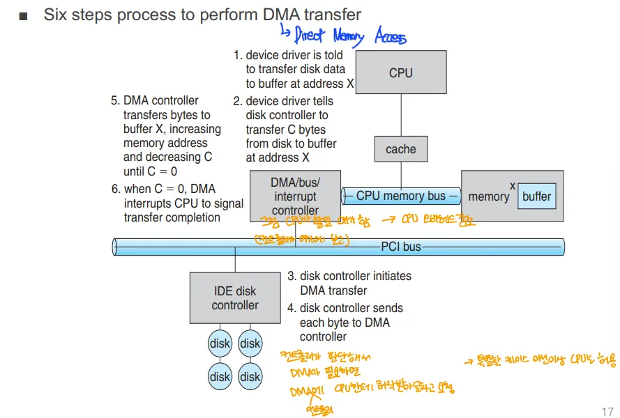

1. 디바이스 드라이버가 디스크 데이터 전송을 메모리 버퍼에 지시
2. 디바이스 드라이버가 디스크 컨트롤러에게 디스크에서 메모리 주소 X로 C바이트를 전송하라고 지시
3. 디스크 컨트롤러가 DMA 전송 시작
	- 실제로 디스크에서 데이터를 읽어 메모리로 전송
4. 디스크 컨트롤러가 디스크에서 DMA 컨트롤러에게 각 바이트를 전송
5. DMA 컨트롤러가 이후 메모리 주소 X에 바이트를 전송하며 바이트 값 C가 0이 될 떄까지 감소시키고 메모리 주소를 증가
6. C값이 0이 되면 DMA는 CPU에게 전송이 완료되었음을 인터럽트로 알림
→ 한 바이트는 메모리의 한 칸, 따라서 바이트 수는 감소, 주소는 증가시켜가며 저장
→ 디바이스 드라이버는 디바이스를 조정하는 운영체제의 일부

# Storage Hierarchy

## ROM, RAM

### ROM(Read Only Memory)

- 한번 쓰면 읽기만 가능
- BIOS 등을 ROM에 저장

### RAM

- 계속 일고 쓰기가 가능, 랜덤 엑세스가 가능
1. SRAM(Static RAM)
	- 높은 성능, 높은 가격/ 리프레시 필요X
	- 레지스터, 캐시에 사용
2. DRAM(Dynamic RAM)
	- 낮은 성능, 낮은 가격/ 소자 특성상 리프레시 필요
		- 리프레시 동안에 메모리 접근 불가해 성능이 떨어짐
	- 메인 메모리에 사용

## Storage Hierarchy

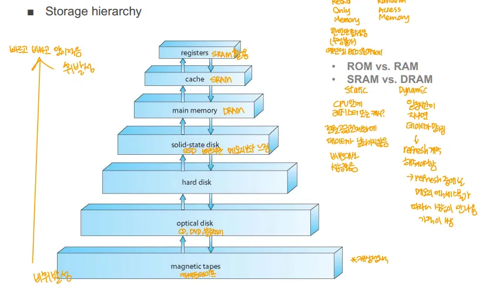

→ 레지스터 ↔ 캐시 ↔ 메인메모리 ↔ SSD ↔ HDD ↔ 광학 디스크 → 자기테이프
→ 트레이드 오프 관계

- 위쪽은 비싸고 빠름, 휘발성을 띄는 것이 많음
- 아래쪽은 싸고 느림, 비휘발성을 띄는 것이 많음

## Caching

- 가정(전제)
	- 메모리 데이터 중에서 가장 최근에 사용되는 것이 다음에 사용될 확률이 높다
- 데이터 중 자주 사용되는 것들을 속도가 더 빠른 곳에 저장
- 캐시 정책
	- Write-Through → 캐시의 데이터가 바뀌면 바로 메모리나 디스크의 정보를 변경
		- 장점 → 데이터 일관성이 잘 유지
		- 단점 → 그때그때 데이터를 변경하기 때문에 CPU 오버헤드, 성능 문제 생김
	- Write-Back → 캐시의 바뀐 데이터들을 모아서 바꿈
		- 장점 → CPU 오버헤드 감소, 성능 문제 감소
		- 단점 → 데이터 일관성이 잘 유지되지 않음
	- 캐시와 메모리, 메모리와 디스크 관계도 캐싱 개념 존재

## Physical Hard Disk Structure(HDD)

- 용어
	1. Platter → 하드 디스크의 각 판
	2. Surface → 플래터 위의 실제로 데이터가 기록되는 부분
	3. Track → 플래터 표면을 따라 원형으로 그려진 경로, 각 트랙은 데이터가 기록되는 연속적인 구역
	4. Sector → 트랙은 여러 섹터로 나눠짐
	5. Cylinder → 여러 플래터가 쌓인 구조에서 서로 같은 위치의 트랙들의 모임
	6. Arm → 읽기, 쓰기 헤드를 플래터의 적절한 위치로 움직이는 것, 각 플래터마다 존재
	7. Head → Arm 끝에서 데이터를 읽고 쓰는 장치
- 동작
	1. CPU가 디스크 컨트롤러에게 데이터를 찾으라고 명령
	2. arm seek → 암이 데이터를 찾기 위해 움직이는 동작
	3. 데이터를 읽어 메모리로 넘기는 동작
	- 세 동작중 가장 느린 것이 arm seek → 이게 HDD의 병목, 이 시간을 줄이는게 관건
- Arm Seek 타임 줄이는 방법
	- 데이터를 최대한 연속적으로 저장
	- 같은 실린더에 같이 필요한 데이터들을 저장
→ 디스크 조각모음 → 디스크 내 데이터를 연속된 공간에 모아 정리하는 작업

## Compact Flash card internals
→ 초기 Compact Flash card와 SSD모두 플래시 메모리 기술 기반 발전
→ 현재 Compact Flash card는 거의 사용하지 않음

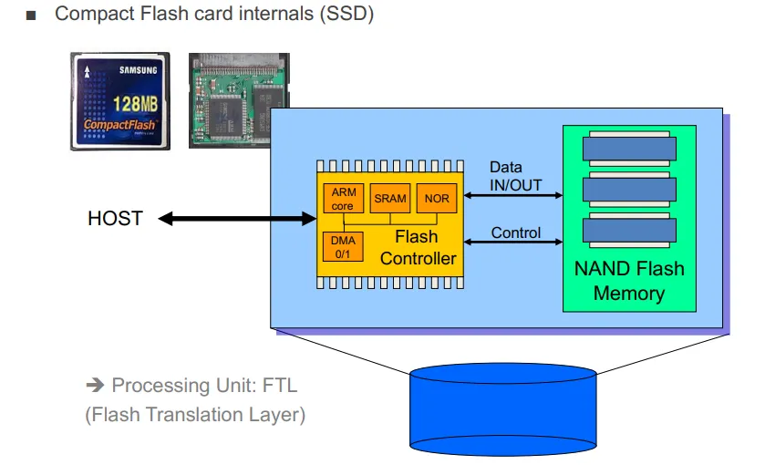

- SSD는 컨트롤러와 낸드플래시 메모리로 구성
- SSD는 각 블록 당 데이터 초기화 횟수가 정해져 있음
	- 블록 내부에 데이터를 덮어쓰는 것은 불가, 블록을 클리어 하고 데이터 저장
	- 데이터 초기화 횟수가 곧 블록의 수명
	- 블록 중 하나라도 수명을 다하면 SSD도 수명을 다함
- FTL
	- 플래시 메모리의 논리적 블록 주소와 물리적 블록 주소를 매핑하는 레이어

# System Call
→ Function Call과 대비(함수 호출은 주로 유저모드 내에서만 수행)

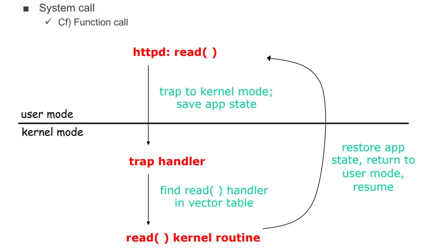

- 하드웨어 자원 접근 등을 커널 모드에 요청하는 인터페이스 
- 유저모드와 커널 모드를 나워 동작하는 것을 듀얼모드 오퍼레이션이라 함

# Hardware Protection

## 1. CPU Protection

- 한 프로세스가 계속 CPU를 점유하는 것을 방지
- 구현 방식
	- 하드웨어로 Timer가 존재
	- 주기적으로 시간(리눅스는 10ms)마다 인터럽트를 줌
	- 특정 시간이 지나면 CPU가 스스로에게 인터럽트를 걸고, 다른 프로그램이 CPU에서 동작하게 함

## 2. Memory Protection

- 운영체제가 MMU의 도움을 받아 프로세스가 자신의 영역이 아닌 곳에 접근하는 것을 방지
- 구현 방식
	- MMU의 도움을 받아 OS가 잘못된 영역에 접근하려는 프로세스를 죽임

## 3. I/O Protection
→ 입출력 장치 보호

- 애플리케이션 프로세스들이 하드웨어 장치에 직접 접근하는 것을 방지
- 구현 방식
	- 듀얼 모드 오퍼레이션을 통해 커널 모드에서만 하드웨어 장치에 접근할 수 있게 함
	- I/O는 오직 커널 모드에서만 수행 가능한 작업

# OS가 가진 시스템 제어권

### 1. Bootstrapping

- 시스템이 처음 켜지면 실행되는 초기화 작업 → 운영체제가 수행
	→ 조금 애매, 일부만 수행하는 걸로

### 2. System Call

- 운영체제는 응용 프로그램이 하드웨어에 접근할 수 있도록 함

### 3. Interrupts

- 운영체제는 하드웨어에서 걸리는 Interrupt등을 처리

# 컴퓨터의 역사

## 1세대(1945-55)

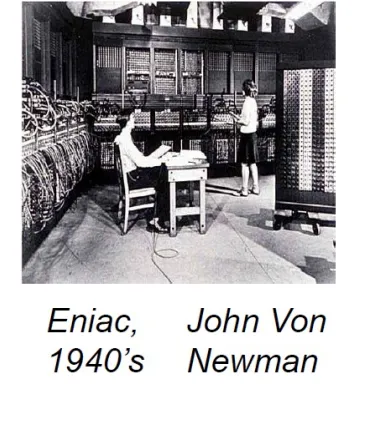

→ 폰 노이만이 1940년도 개발한 에니악

- 주요 기기 → 에니악
- 주요 부품 → 진공관, 플러그보드
- 특징
	- 운영체제가 없어 한번에 하나의 작업만, 모든 하드웨어 제어는 직접 수행
	- 프로그래밍 언어, 어셈블리 언어가 없어 프로그램을 모두 기계어로 작성

## 2세대(1955-65)

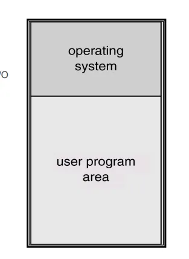

→ Operating System이라 적힌 부분에 Resident Monitor가 상주해 시스템 자원 관리, 작업 처리
→ User Program Area에서 유저가 제출한 프로그램들이 처리

- 주요 기기 → 메인프레임
- 주요 부품 → 트랜지스터
- 특징
	- 배치 시스템을 사용 → 각 작업을 “한번에 하나만 끝까지 다 수행”
		→ 각 작업을 일괄로 모아서 실행
		→ 이때 작업들은 순차적으로 한 작업이 끝난 후 다음 작업이 시작
		**→ 그냥, 여러 작업들을 실행 도중이 아닌, 실행 이전에 등록해놓고, 하나씩 순차대로 실행한다고 생각**

		- Resident Monitor라고 하는 간단한 운영체제를 사용
		- 배치 시스템에서는 입출력 작업의 속도가 느려 IO 작업에 병목 현상이 발생해 CPU가 효율적으로 사용되지 않음
			→ 당연, CPU가 더 빠른데, 한번에 하나씩 차례료 실행되므로 IO를 CPU가 기다려야함

## 3세대(1965-75)

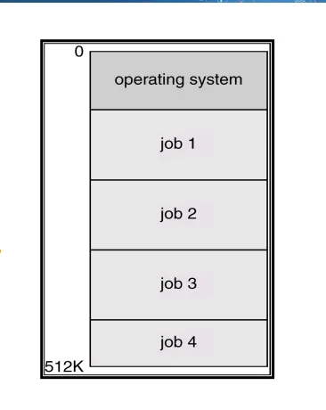

→ opertaing system 영역에 운영체제가 상주
→ 아래 여러 job들이 메모리 공간을 나눠서 사용

- 주요 기기 → IBM System/360 시리즈
- 주요 부품 → IC(집적 회로)
- 특징
	- Computer Architecture라는 개념의 등장
		- 컴퓨터 하드웨어 설계에서 필요한 구조와 원칙을 제시
	- 멀티 프로그래밍 시스템의 등장
		- 여러 프로그램(작업)이 동시에 메모리에 상주해 실행 가능
		- CPU 활용율을 극대화
	- 시분할 시스템 도입
		- 여러 프로세스가 동시에 동작하는 것 처럼 동작하게 시간을 쪼개 CPU를 사용하게 함
		- 응답 시간을 향상
	→ 이때부터 현대적 의미의 OS로 봄

## 4세대

- 주요 소자 → LSI, VLSI(Large Scale Integration, Very Large Scale Integration)
- 특징
	- 구조적인 발전이 일어남
		- 마이크로 프로세스는 더 작고 빠르게 발전 → PC(개인용 컴퓨터)가 보편화
		- 저장 장치들은 용량이 커지고 속도가 빨라짐
		- CPU가 모든 작업을 처리하지 않고, 일부 작업은 IO 작업으로 분산되어 처리
		→ 이런 특징을 바탕으로 개인용 컴퓨터가 등장해 컴퓨터의 대중화를 이끔

	- 현대 운영체제의 특징을 가짐
		1. GUI(그래픽 유저 인터페이스), 
		2. Multimedia(이미지, 비디오, 오디오), 
		3. 인터넷과 웹, 
		4. 네트워크와 분산컴퓨팅 

# Computing Environment
→ 컴퓨터 시스템과 그 시스템에서 실행되는 모든 것들

## 전통적인 컴퓨팅

### 1. 메인프레임 시스템
→ OS 개념이 적용된 시스템

- 배치 시스템
- 멀티프로그래밍 시스템
- 시분할 시스템(Time-Sharing)
→ 2세대의 메인프레임은 배치 시스템만 지원, 지금은 거기서 발전한 기능들 지원
→ 여러 작업들을 배치 잡으로 모아서 이런 배치 잡들을 여러개 메모리에 올려 실행한다고 생각

### 2. 데스크탑 시스템

- 개인용 컴퓨터
- 일반적인 작업과 응용 프로그램 실행에 사용

## 모바일 컴퓨팅

### 1. Hand-held System(휴대용 시스템)

- 스마트폰, 태블릿 등의 장치
- 제한된 메모리, 느림 프로세서, 작은 화면과 터치스크린 인터페이스

## Real-time Embedded Computing

### **실시간 시스템 **

- **정해진 시간 안에 작업을 처리해야함**
- 중요한 건 데드라인
- 반드시 지켜야 하면 Hard 리얼타임, 아니면 Soft 리얼타임

### 임베디드 시스템

- 특정 목적을 위해 존재하는 시스템
- 대부분 실시간 시스템

## 클라이언트-서버 컴퓨팅

- 데이터 센터에 위치해 수많은 클라이언트 요청을 처리
- 클러스터형 서버
	- 여러 대의 서버가 하나의 작업을 병렬로 처리하는 구조

## Peer to peer Computing

- 클라이언트 끼리 서로 직접 연결되어 자원을 공유
- Discovery Protocol 
	- P2P 네트워크에서 다른 클라이언트를 찾기 위해 사용하는 방법
- Napster, Gnutella, VoIP 등등

## Cloud Computing

- 인터넷을 통해 컴퓨팅 자원을 제공하는 서비스
- 주로 3가지 모델로 나뉨
	1. IaaS(Infrastructure as a Service)
		- 하드웨어 자원과 인프라만 제공
		- Ex) Amazon EC2
	2. PaaS(Platform as a Service)
		- 운영체제와 미들웨어 같은 애플리케이션 개발을 위한 플랫폼을 서비스로 제공
		- Ex) Heroku
	3. SaaS(Software as a Service)
		- 소프트웨어를 인터넷을 통해 제공
		- Google Workspace(구글 드라이브, 지메일 ,구글닥스)

## Virtualization

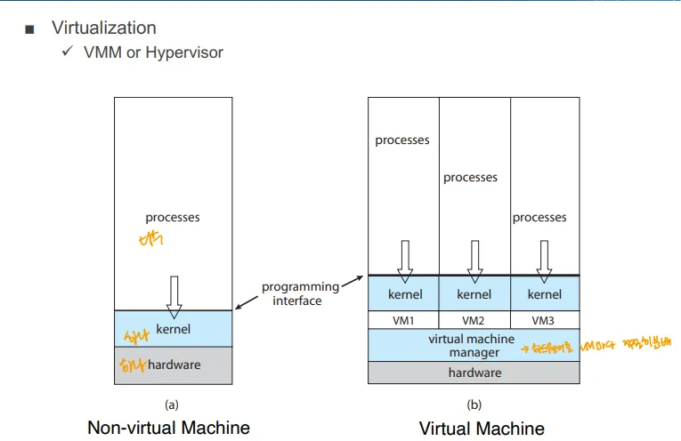

→ 비 가상화 머신에서는 하드웨어와 커널이 직접 연결

### 가상화 머신

- VMM(Virtual Machine Manager) 또는 하이퍼바이저가 하드웨어와 운영체제 커널 사이 위치
- VMM은 여러 가상머신을 생성하고 관리, 각 가상머신은 각자 운영체제 커널을 가지고 있음

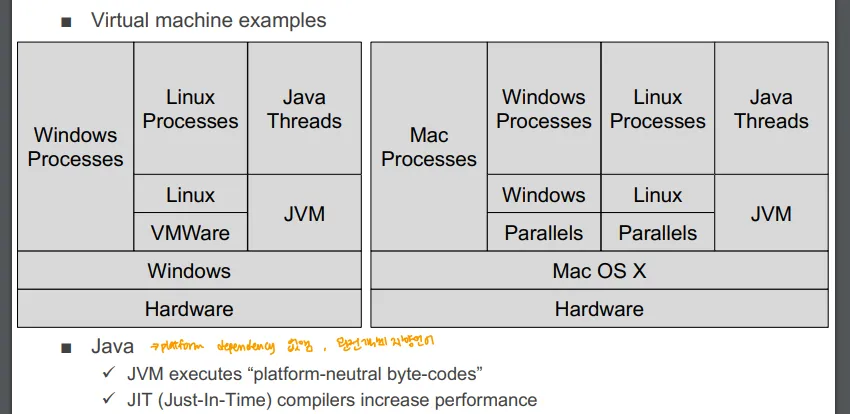

→ 위 그림은 VMWare, Paralles같은 가상화 소프트웨어를 사용해 가상머신 별로 운영체제를 별도로 사용하는 것을 보여줌
→ Java의 JVM도 가상머신이라 Java Thread가 그 위에서 동작

### Java Virtual Machine

- 플랫폼에 구애받지 않고 자바 바이트코드로 컴파일 되어 JVM이 설치된 모든 환경에서 실행 가능
- JIT 컴파일러를 사용해 실행 속도 향상

## Distributed Computing

- 여러 독립된 시스템이 네트워크를 통해 연결되어 하나의 시스템 처럼 동작하는 모델

# OS의 역사
→ 이 부분은  너무 모호, 중요한 것들만 정리

## OS의 역사 개요

1. IBM OS/360 → 초기 멀티 프로그래밍을 가능하게 한 시스템
2. MIT CTSS → 시분할 시스템 도입
3. MULTICS → 다중 사용자 컴퓨팅 시스템, UNIX의 전신
4. UNIX → 1969년, 최초의 Unix 시스템이 탄생

## Unix의 역사

### 1969 - 1985

- Unix의 다양한 분파가 등장
	-  **BSD**(Berkeley Software Distribution)와 **System V**는 Unix 기반 운영체제의 두 가지 큰 흐름을 형성
- **Unix Seventh Edition **부터 XENIX, SunOS, 그리고 BSD 계열로 발전하기 시작

### 1985 - 1996

- **SunOS**, **Mach** 커널, 그리고 BSD 계열 운영체제들이 더욱 발전
	- ** Linux도 이 시기에 탄생했습니다.**
- **NextStep**, **Solaris**, **HP-UX**, **AIX** 등 상용 유닉스 계열 시스템들도 이 시기에 큰 영향을 미쳤습니다.

### 1997 -

- 주요 Unix 기반 운영체제들은 **Sun Solaris**, **HP-UX**, **IBM AIX**, **Linux** 등의 다양한 시스템들로 발전
- POSIX 표준은 유닉스 시스템 간의 호환성을 보장하기 위한 표준 인터페이스로 자리잡음

### POSIX 표준

- 서로 분파된 유닉스 시스템 사이 호환성 문제 해결을 위한 표준
- POSIX 표준을 지키는 OS끼리는 시스템 콜이 같아 호환

## Windows 역사

- MS-DOS 기반 초기 버전부터, NT→95→XP 등으로 발전

## Linux 역사

- 1983년 리처드 스톨만의  GNU 프로젝트와 함께 자유 소프트웨어 개념 제시
- 1991년 리누스 토발즈에 의해 개발
- 1995년 서버, 임베디드, 모바일 기기에서 리눅스 사용이 점점 확산

## OS 분류(Taxonomy)

- **Mainframe systems**: 대형 컴퓨터에서 사용하는 시스템.
- **Desktop systems**: 일반 PC에서 사용하는 운영체제(DOS, Windows, MacOS 등).
- **Distributed systems**: 여러 컴퓨터가 네트워크를 통해 연결된 분산 시스템.
- **Embedded systems**: 임베디드 장치에서 사용하는 시스템.
	- VsWorks라는 건 항공기 등에서 많이 쓰임
- **Real-time systems**: 실시간 응답을 요구하는 시스템.
