> 원본 Notion 정리 — 강의 슬라이드/설명.
> [← 전체 목차](/posts/학교공부/운영체제/목차/)

***

# 운영체제 서비스
***

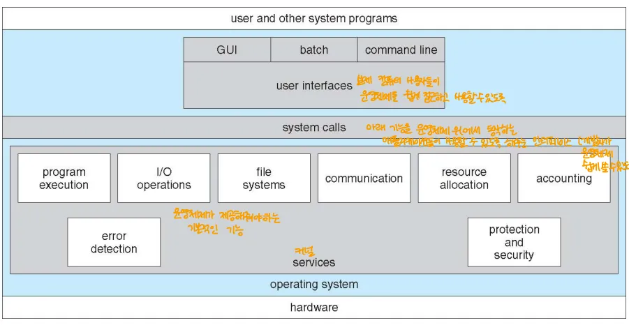

→ 운영체제 서비스를 바라보는 관점
→ 주로, 1. UI / 2. 시스템 콜 / 3. 서비스 의 관점으로 봄
	→ 사용자나 다른 시스템 프로그램은 이런 운영체제 서비스를 사용

## User Interface Service

- 운영체제가 사용자를 위해 제공하는 인터페이스
- 주로 CLI, GUI, 터치스크린 인터페이스로 나뉨

### CLI(Command Line Interface)

- 명령어 라인 인터페이스
- 텍스트를 기반으로 명령어를 전달
- Ex) Bourne shell, bash

### GUI(Graphic User Interface)

- 그래픽 사용자 인터페이스
- Ex) Mac OS X

### 터치스크린 인터페이스

- 터치스크린을 통해 화면 내의 버튼 등을 눌러 조작하는 방식
- Ex) iPhone

## System Programs

- 응용프로그램과 사용자를 위해 컴퓨터 시스템 자체를 운영, 제어하는 프로그램
	→ 이런 목적을 위해 운영체제가 제공하는 프로그램

	- 커널과 유저 프로그램 사이 존재
	- 시스템 콜이 제공하는 여러가지 기능들을 수행하는 프로그램

### 시스템 프로그램의 목적

- 프로그램의 개발과 실행에 편리한 환경을 제공

### 시스템 프로그램이 제공하는 기능

1. File manipulation(파일 조작) 
	→ 파일 생성, 삭제, 수정, 읽기, 쓰기 등 파일과 관련된 작업 지원

2. **Status information sometimes stored in a file modification (상태 정보)**
	→ 파일 수정 시 해당 파일의 상태 정보가 저장될 수 있음

3. **Programming language support (프로그래밍 언어 지원)**:
	→ 다양한 프로그래밍 언어를 지원하는 기능을 제공

4. **Program loading and execution (프로그램 로딩 및 실행)**:
	→ 프로그램을 메모리에 로드하고 실행하는 과정

	- **Linker and loader**
		→  링커는 여러 개의 오브젝트 파일을 하나의 실행 파일로 연결
		→  로더는 프로그램을 메모리에 로드하여 실행할 준비를 함

5. **Communications (통신)**:
	→ 운영체제는 프로세스 간, 또는 컴퓨터 간의 통신을 지원

6. **Background services (백그라운드 서비스)**:
	→ 사용자가 직접적으로 실행하지 않는 백그라운드에서 동작하는 서비스
**Cf) Application programs (응용 프로그램)**:
	→ 응용 프로그램과는 대비되는 개념
	→ 시스템 프로그램은 운영체제와 직접적으로 상호작용
	→ 응용 프로그램은 사용자가 특정 작업을 수행하기 위해 사용하는 프로그램

### 링커와 로더

- 링커: 여러 오브젝트 파일을 하나의 실행 파일로 묶는 역할
- 로더: 실행 파일을 메모리에 적재하고 실행을 준비
**정적 링크, 동적 링크**

1. 정적 링크
	- 모든 필요한 라이브러리를 실행 파일에 포함시켜 실행 시에 별도 라이브러리 참조 없이 동작하게 함
		→ 임베디드와 같이 라이브러리를 가지고 있지 않은 환경에서는 Static 링킹을 해야함

	- 장점: 실행 시 필요한 모든 코드가 포함 →독립적으로 실행, 성능 빠름
	- 단점: 파일 크기가 커짐 → 이런 이유로 메모리, 디스크를 비효율적으로 사용하게 됨
2. 동적 링크
	- 프로그램 실행 시 필요한 라이브러리 파일이 별도로 로드되는 방식
		- 라이브러리의 접근 주소만 포함시켜 동적으로 실행 중에 접근해 사용
		→ 보통 OS에서는 이 방식 사용

	- 장점: 파일 크기는 작음 → 메모리를 효율적으로 사용 가능
	- 단점: 실행 중에 외부 라이브러리 참조
	
**윈도우의 .dll 파일**

- 윈도우에서는 동적 링크를 통해 .dll 파일을 사용
- 실행 파일이 동적으로 참조하는 라이브러리 → **.dll은 라이브러리 파일임**
- 메모리, 디스크 사용량을 줄일 수 있음
**리눅스의 .sa와 .so 파일**

- 리눅스에서 동적 링크를 하면 .sa 파일에 동적으로 참조할 라이브러리의 주소들을 모아놓음
- 윈도우의 .dll 처럼 동적으로 참조 가능한 라이브러리 파일이 .so

### 컴파일 과정

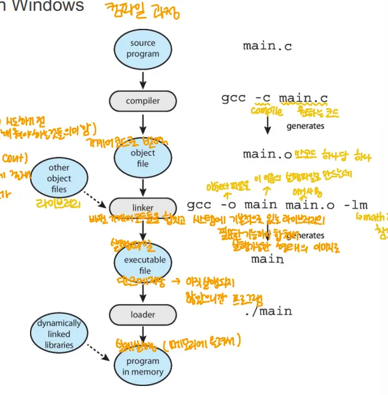

1. **소스 프로그램 → 사용자가 작성한 소스코드**
2. **컴파일러 → 소스 프로그램 to 오브젝트 파일**
	→ 소스코드를 기계어로 번역해서 오브젝트 파일을 생성
	→ 소스코드 파일 하나 당 하나씩 만들어지는 느낌
	→ 원래 여기에 어셈블러도 있음

3. **오브젝트 파일 →소스 코드가 컴퓨터가 이해할 수 있는 명령어로 변환된 파일 → 실행은 X, 이해가능한 명령어로 바뀌기만 함**
4. **링커 → 오브젝트 파일 to 실행 파일**
	→ 링커가 오브젝트 파일들을 결합하고 필요한 라이브러리를 포함시켜 실행 파일을 만듬

5. **실행 파일 → 컴퓨터에서 실행 가능한 상태의 파일, 실행되지 않을 때는 디스크에 저장됨**
6. **로더 → 실행 파일을 메모리에 적재하고 필요한 경우 동적 라이브러리를 로드한 후 프로그램을 실행할 준비를 함**
7. **메모리 내 프로그램 → 최종적으로 프로그램이 메모리에 적재되고, 실행됨**

## 시스템 콜

- **운영체제에 의해 사용 가능한 서비스에 대한 인터페이스**
	→ 운영체제 서비스를 사용할 수 있는 인터페이스
	→ 운영체제 커널에서 제공하는 함수(주로 C, C++로 작성된 함수로 제공)

	- 프로그램이 운영체제에 직접 요청을 해 하드웨어 자원, 시스템 리소스에 접근할 때 사용 → 응용 프로그램은 직접 못함
- **Function Call(함수 호출)과 대비**
- **시스템 콜로 인해 커널 모드로 들어가는 매커니즘 ⇒ Trap**

### 시스템 콜 예시

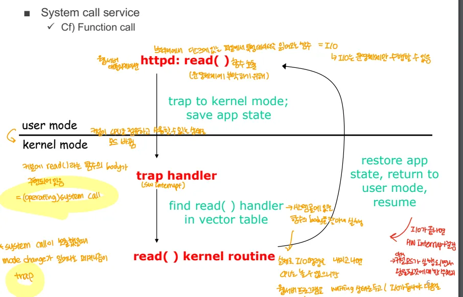

→ 웹 서버의 예시

1. **시스템 콜 호출**
	- **유저 모드**에서 httpd 라는 프로그램이 read() 라는 시스템 콜을 호출
	- read()는 파일을 읽어오는 작업, 즉 I/O 작업 → 이건 OS만 가능한 작업, 따라서 시스템 콜 호출
2. **커널 모드로 전환(Trap)**
	- 시스템 콜이 호출되면 프로그램은 “Trap” 이라는 특별한 인터럽트를 통해 **커널 모드**로 전환
	- 커널 모드로 전환되는 과정에서 프로그램의 현재 상태(레지스터 값, PC 등)은 저장, 이후 작업은 커널이 이어받음
		→ 유저 모드에서의 프로그램 상태를 커널 쪽에 저장한 후, 커널 모드에서 그 값을 참조해 작업 수행

	- Trap Handler를 통해 트랩 벡터 테이블을 참조해 호출된 시스템 콜에 맞는 핸들러를 찾음 → 이때는 read()의 핸들러
		- 이 핸들러는 해당 시스템 콜을 처리하는 커널 코드로 이어짐
3. 커널 모드에서 처리
	- 커널모드로 전환되고 난 후, 커널은 read()의 커널 루틴을 실행
	- 커널이 호출된 시스템 콜을 실제로 처리
4. 커널 모드에서 유저 모드로 복귀
	- 커널 루틴이 끝나면 다시 유저 모드로 전환
	- 유저 모드로 돌아가 애플리케이션의 상태를 복원, 프로그램이 계속 실행되게 함
		→ 애플리케이션 상태는 불변임(커널 루틴에서 변하지X, 그대로 다시 가져오느 느낌)

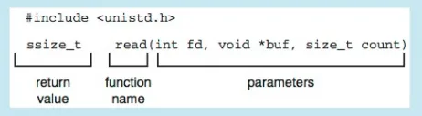

→ 실제 시스템 콜은 이런 식으로 구현되어 있음

### 시스템 콜이 운영체제에서 처리되는 과정

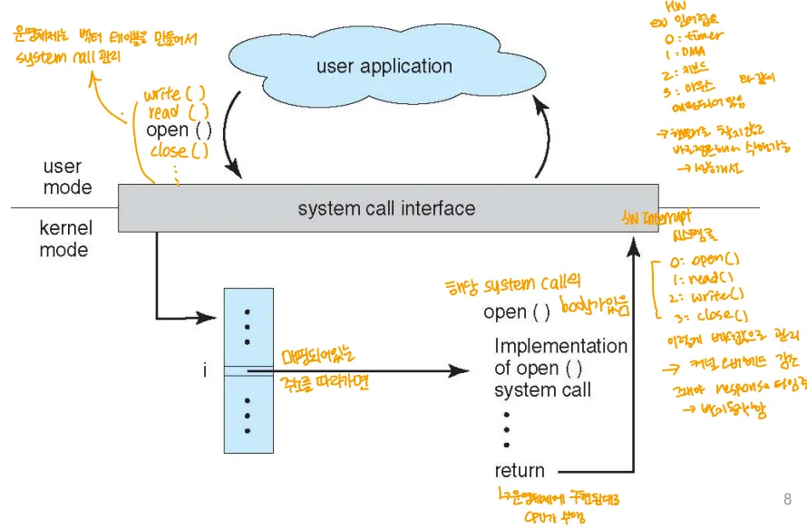

1. **유저 애플리케이션 프로그램이 시스템 콜을 호출**
	- 이 호출은 시스템 콜 인터페이스로 전달
	- 유저 애플리케이션은 파일 입출력, 메모리 할당, 프로세스 생성 등의 시스템 자원에 접근할 수 없으므로, 시스템 콜을 통해 운영체제에 작업을 요청
	- OS는 벡터 테이블을 만들어 각 시스템 콜을 관리
		→ 벡터 테이블을 통해 시스템 콜에 알맞은 루틴을 호출

2. **시스템 콜 인터페이스**
	- 유저 애플리케이션에서 호출한 시스템 콜은 시스템 콜 인터페이스를 통해 커널 모드로 진입
3. **커널 모드로 전환**
	- 테이블에 매핑되어있는 주소로 가면 시스템 콜의 핸들러가 있음
4. **시스템 콜 처리**
	- 매핑된 핸들러가 각 시스템 콜에 적절한 커널 코드를 실행
5. **결과 반환 및 유저 모드 복귀**
	- 커널에서 시스템 콜 작업 완료 시 시스템 콜 인터페이스를 통해 유저 애플리케이션으로 결과를 전달

### 시스템 콜 파라미터 넘기기

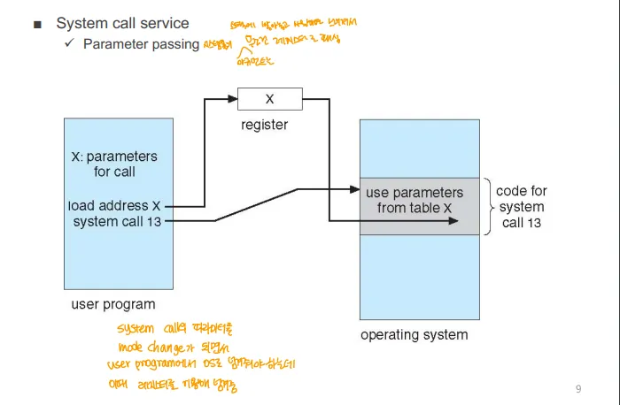

→ 사용자 프로그램에서 커널 모드로 전화되어 OS가 시스템 콜을 처리하느 ㄴ과정에서 시스템 콜에 필요한 파라미터가 어떻게 전달되는가

1. 유저 프로그램이 파라미터를 준비
2. 파라미터 전달
	- 레지스터를 통해 전달, 레지스터에 시스템 콜에 필요한 파라미터의 주소가 전달 → 값 X, 주소가 전달
	- 많은 파라미터가 전달되면 메모리 내의 블록에 파라미터가 저장, 메모리 블록의 주소가 레지스터에 전달
3. OS에서 파라미터를 사용
	- OS가 레지스터 값을 통해 파라미터를 읽음
4. 시스템 콜 실행

### windows, Unix의 시스템 콜 예시

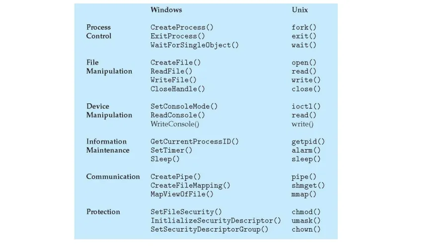

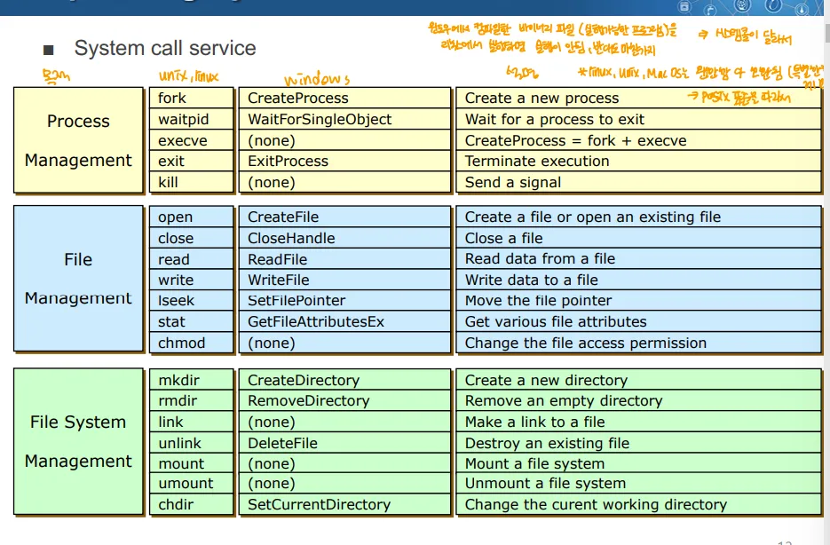

→ 둘이 다르다는 점만 알면 됨

- 윈도우즈에서 컴파일한 실행파일을 리눅스에서 실행하면 실행 불가 → 시스템 콜이 다르기 때문
	- linux, unix, macos는 posix라는 표준을 따라서 모두 호환 됨

# Operating System Structure
→ OS의 구조 1. simple, 2. monolithic, 3. layered, 4. micro , 5. modular, 6. hybrid 구조가 있음

### 1. Simple Structure

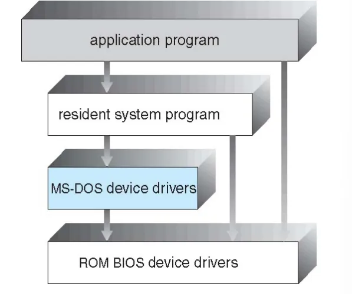

- Monolithic, Micro Structure가 나오기 이전 훨씬 간단한 구조
- 한번에 하나의 프로그램만 실행시킬 수 있는 형태 
	⇒ 배치 시스템 → 참고로 배치 시스템은 한번에 모아서 여러개를 순차적으로 실행

- OS라고 보기보다는 resident monitor 으로 간주
- Ex) MS-DOS

### 2. Monolithic Kernel

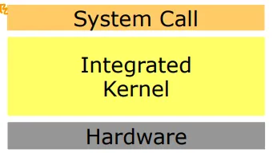

- 운영체제가 가져야 하는 모든 기능을 한 덩어리로 만듬
	→ 안 쓰는 기능도 모두 한 덩이로

- Function calls⇒모놀리식 커널에서는 모든 기능이 함수 호출을 통해 이뤄짐
- Ex) Unix, Solaris, Linux 등등
- 장점 
	- **성능**: 모놀리식 커널은 모든 기능이 커널 내에서 통합되어 실행되므로, 커널 내부에서의 함수 호출이 매우 빠름
- 단점
	- 안 쓰이는 것 까지 있어 용량이 너무 커짐
	- **복잡성**: 커널에 모든 기능이 포함되기 때문에 커널 자체가 매우 커지고 복잡
		- 새로운 기능을 추가하거나 오류를 수정하기가 어려움
	- 안정성 문제: 오류가 나면 시스템 전체에 영향을 미칠 수 있음
**전통적인 유닉스 구조(예시)**

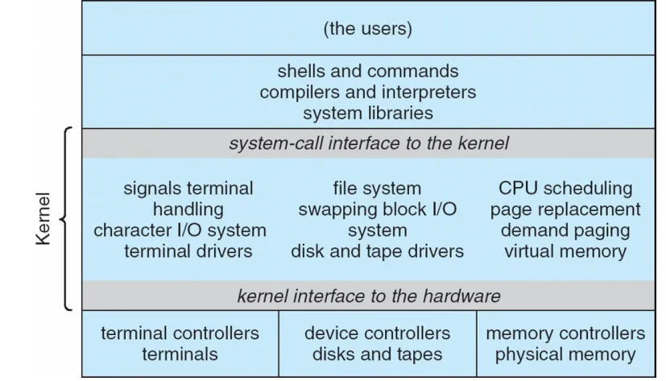

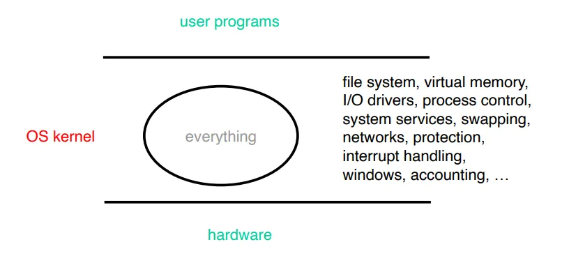

**→ 하드웨어와 유저 프로그램 사이에 중재 역할에서 해야하는 모든 기능을 다 떄려박은 것이라고 이해**

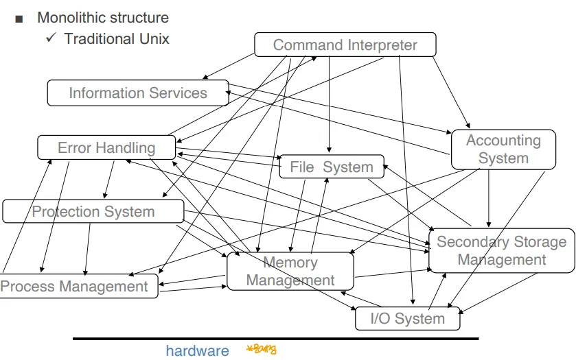

→ 여러 기능들 사이의 의존성을 나타낸 다이어그램
→ 절차지향적인 관점에 따라 만들어져서, 각자의 기능을 하기 위해 연속적인 함수 호출을 해야함 
→ 프로그램 복잡도 기하급수적 증가
→ 유지보수 문제, 비용이 기하급수적으로 증가

**⇒ 개발의 복잡도를 낮추기 위해 각각의 의존성을 분리해야(찢어내야)함**

	- **그런 관점에서 나온 것이 Layered approach(계층적 접근법)**

### 3. Layered approach

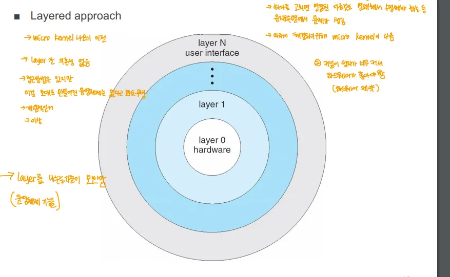

→ micro  kernel이 나오기 이전, 나온 아이디어(구현된건 없다고 봐도됨)

- Layer 사이 의존성이 없이, 하드웨어부터 유저 인터페이스까지 계속 나눈 것
- 이상적고이 좋음 → but 구현되지 못함

**⇒ Layered approach의 결과로 나온 것이 마이크로 커널**

### 4. Micro Kernel

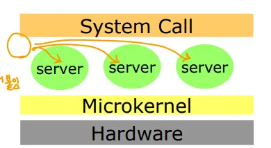

**마이크로 커널 구조**

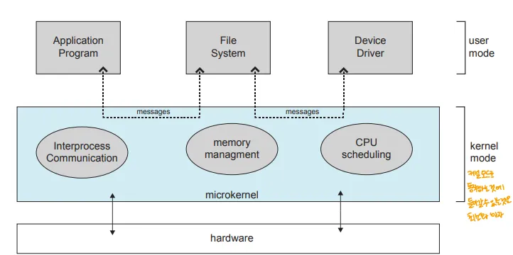

- 운영체제의 필수적인 최소한의 기능만 커널에 포함시키고 나머지 기능들은 애플리케이션 형태의 서버를 만들어서 붙이는 형태로 동작하느 ㄴ구조
- **Multiple servers ⇒** 커널 외부에서 파일 시스템, 네트워킹, 메모리 관리 등의 기능들이 **서버**로 동작
- **Message passing ⇒** 마이크로커널 구조에서 통신은 **메시지 전달** 방식을 사용
	- 커널과 외부 서버 간의 통신은 메시지 전달을 통해 이뤄짐
	- 모놀리식 커널이 함수 호출 방식으로 동작하는 것과는 다름
- Ex) Mach, Chorus, Linux mk 등
- 장점
	- 확장성 : 새로운 기능 추가, 수정 시 전체 커널이 아닌 외부 서버를 수정하는 식으로 확장 가능
	- 안정성: 외부 서버에서 OS의 기능을 담당하므로 서버가 다운되어도 전체 시스템이 다운되지 않음
	+) 커널이 가벼워서 불러오기가 빠름

- 단점
	- 성능의 문제: 마이크로 커널에서 애플리케이션으로 구현된 기능이 실제 시스템 자원, 하드웨어 자원을 제어해야 할 때, 커널에 부탁해야함
		- 이 경우 유저↔커널 모드 사이 모드 트랜지션(모드 전이) 같은 부분에서 오버헤드 발생

### 5. Modular approach

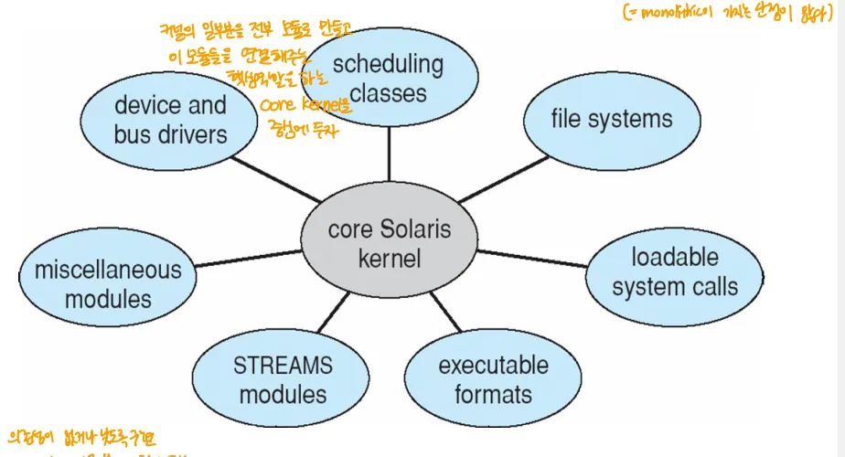

- Loadable Kernel Module(LKM) ⇒ 적재 가능 커널 모듈
- 커널은 핵심적인 구성요소들의 집합을 가지고 있고, 부팅 때 or 실행 중에 부가적인 기능들을 모듈을 통해서 연결
	- 필요한 모듈만 코어 커널에 붙여 운영체제 이미지를 만들면 됨
	→ 필요한 것들만 있는데, 그것들이 하나의 모놀리식 커널처럼 동작

- Ex) Linux, Solaris 등등
- 장점
	- 유연성: 필요에 따라 모듈을 동적으로 추가, 제거 가능 → 시스템 유연하게 구성
	- 확장성 : 새로운 기능, 수정할 모듈을 쉽게 처리할 수 있음
	- 성능: 마이크로 커널과 달리 모놀리식 처럼 함수 호출로 기능을 처리하므로 마이크로 커널에 비해 속도가 빠름
- 단점
	- 모놀리식 커널보다는 조금 느림

**⇒ 오늘날 우리가 쓰는 대부분의 OS의 커널 구조 → 대세, GOAT**

### 6. Hybrid approach

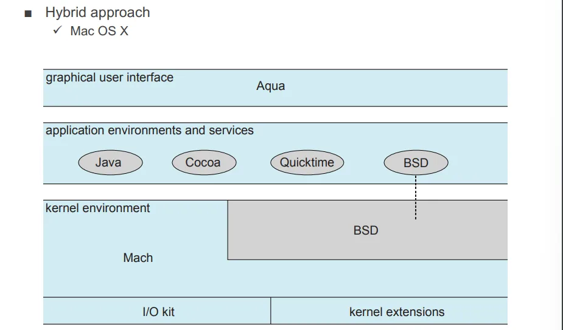

- MacOS X의 경우
- 모놀리식 + 마이크로 커널
	- BSD가 모놀리식 커널, Mach 가 마이크로 커널의 역할을 함
- POSIX 표준을 따라서 리눅스와도 호환

- **IOS, 안드로이드도 이런 하이브리드에 속함**

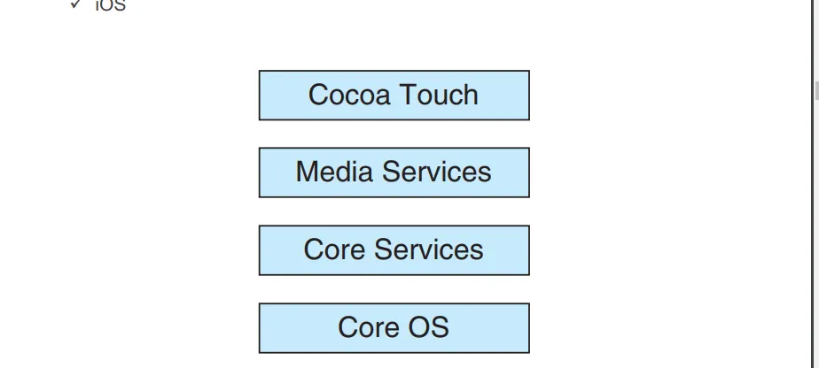

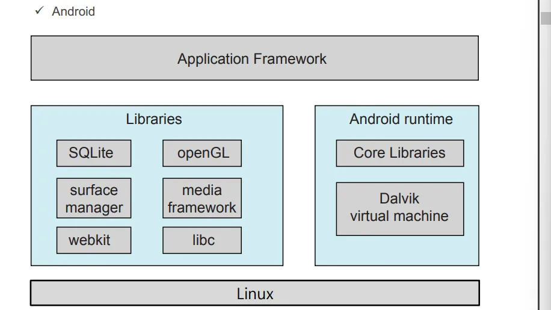

# 운영 체제
→ OS가 제공하는 서비스를 개략적으로 보여줌

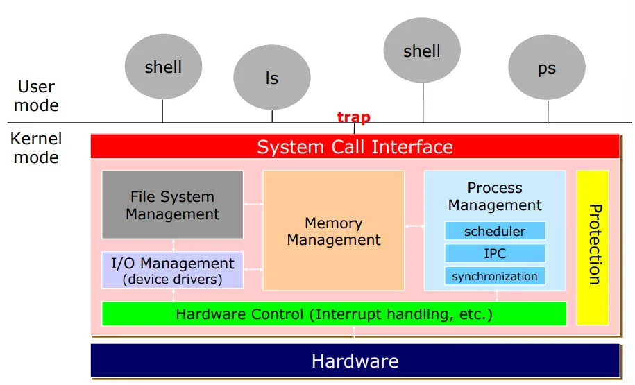

System call interface

- 유저 모드에서 하드웨어 자원, 시스템 자원을 제어하기 위해 OS에게 서비스를 요청할 떄 사용
Process Management

- 프로세스가 잘 동작 하도록 관리
**Memory Management**

- 메모리 관리
Hardware Control

- 인터럽트도 관리해야함
