> Notion 원본 페이지의 강의 슬라이드와 설명을 바탕으로 정리한 노트입니다.
***

# 프로세스의 문제점(→스레드 등장 이유)

1. 프로세스는 많은 것들을 포함 = 무겁다
	- 프로세스가 포함하는 것
		1. 주소 공간: 코드와 데이터 페이지를 가지는 주소 공간(=프로그램 실행에 필요한 메모리 공간 전체)을 포함
		2. OS 자원: 열려있는 파일 상태, OS의 정보 등
		3. 하드웨어 실행 상태: 프로세스의 PC, SP, 레지스터 등이 포함
			- 프로세스가 실행되기 위한 하드웨어 상태 전체
2. 새로운 프로세스를 만드는 것은 매우 비싼 작업
	- 모든 자료구조를 할당하고 초기화해야함 
		→ PCB같은 것 생성에 비용 많이 듬

	- Ex) 리눅스의 task_struct는 100개가 넘는 필드를 가진 구조체
3. IPC의 통신 비용이 크다
	- 대부분의 IPC에서는 커널을 거쳐야 하기 때문에 비요잉 크다
	- 데이터 처리에 비용이 듬 = 통신 과정이 빠르고 가볍지 않음

# 스레드의 개념

- **핵심 아이디어 ⇒ 프로세스와 그 실행 상태를 분리**
- 프로세스는 주소 공간, OS 자원, 기타 속성들을 포함
- **“실행 상태”는 PC, SP, 레지스터 등으로 구성**
	- **다른 자원들은 공유, but 실행 상태만 따로 관리하는 경량 프로세스**
→ 한 프로세스 안에서 실행 경로를 여러개로 두면 fork()보다 가볍게 동작할 것
→ 위 같은 상태로 동작하면 멀티 프로세스와 비슷한 형태로 프로그램 작성, 실행 가능

- 이러한 실행 상태는 보통 아래와 같이 불림
	1. a thread of control
	2. a thread
	3. a lightweight process(LWP) 
→ 위에서 말한 실행 상태 == 스레드, **스레드는 분리된 컨트롤 플로우라 생각**

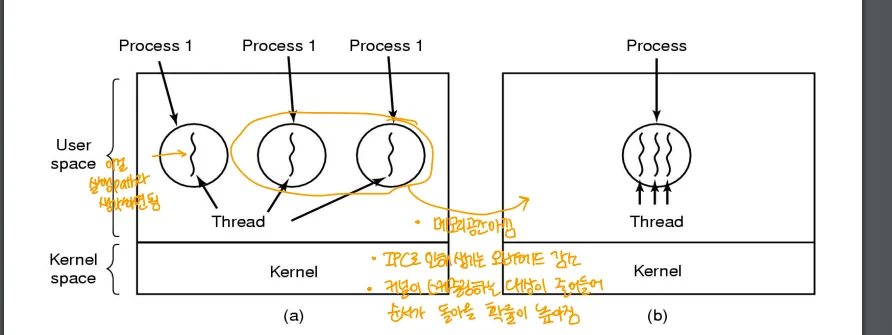

→ 기존 방식

	- 프로세스 1개마다 컨트롤 플로우(스레드) 1개, 이런 프로세스를 여러개 두는 방식
→ 스레드 등장 후

	- 한 프로세스 안에서 여러 컨트롤 플로우를 관리
	- 이로 인해 기존 보다 적은 프로세스 사용
		- 메모리 공간 절약
		- IPC 오버헤드 감소
		- 커널의 스케줄링 대상 감소 → 처리될 확률이 높아짐

# 싱글스레드, 멀티스레드 프로세스

## 싱글스레드 프로세스 실행 과정

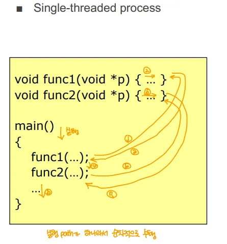

- 실행 순서
	1. main문 실행 시작
	2. func1(); 읽음 → 이후 선언된 func1으로 동작, 다시 돌아옴
	3. func2(); 일음 → 이후 선언된 func2로 감, 다시 돌아옴
	→ 하나의 실행 path(컨트롤 플로우)가 순차적으로 수행

## 멀티스레드 프로세스 실행 과정

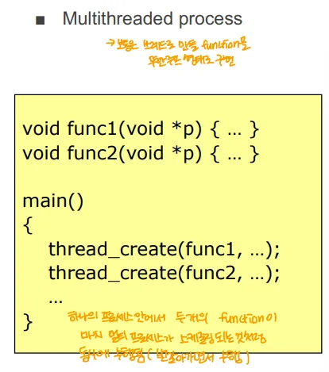

- 실행 순
	→ 하나의 프로세스 안에서 func1, func2를 각가의 스레드로 넘겨줌
	→ 멀티프로세스가 스케줄링 되듯이 두 개의 함수가 동시에 수행(번갈아가며)
	
## 싱글 스레드, 멀티 스레드 프로세스의 내부 자원

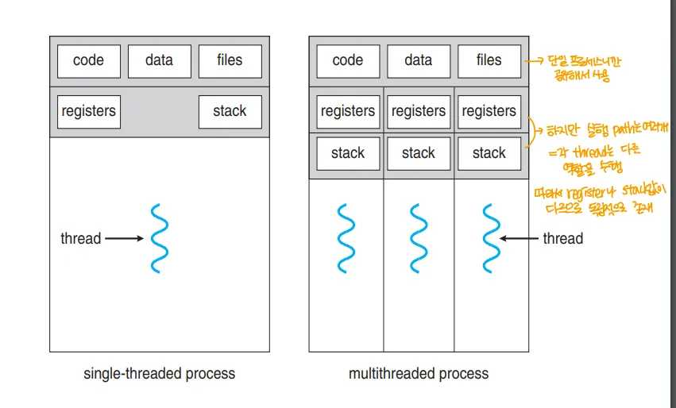

- 싱글 스레드 프로세스
	- 하나의 스레드가 하나의 프로세스에 있는 자원 전체를 사용
- 멀티 스레드 프로세스
	- 코드, 데이터, 파일은 여러 스레드가 공유
	- 각 스레드는 자신의 레지스터, 스택을 개별적으로 가짐

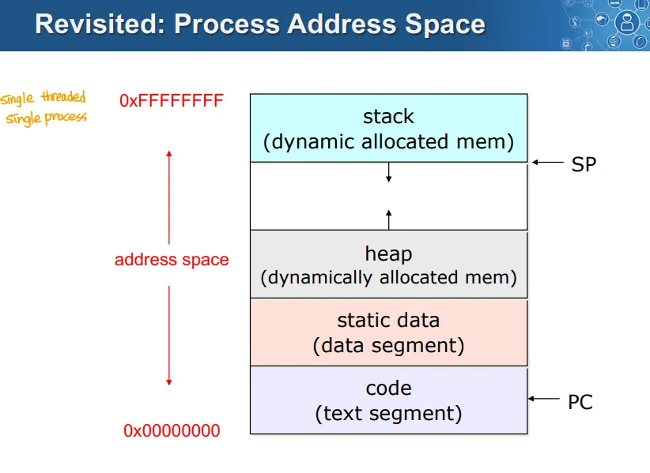

→ 위는 프로세스의 주소 공간 구성

- 스택, 힙, 정적 데이터, 코드 영역이 존재
- 싱글 스레드에서는 저렇게 나뉘지 않고 저 공간 모두를 하나의 스레드가 점유

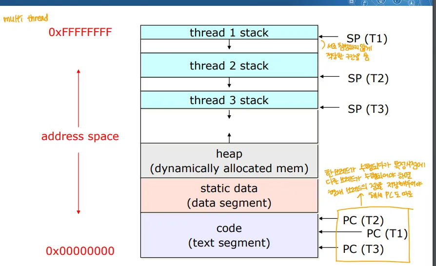

→ 멀티 스레드 프로세스의 주소 공간 구성

- 스택 영역을 각 스레드마다 나눠서 별도로 할당
	- 각 스레드는 서로 침범하지 않게 적당한 구간(=가드 스페이스)을 둠
	- 각 스레드의 SP는 개벌적으로 가진 스택의 가장 먼저 나올 요소를 가리킴
- 코드 영역에서는 각 스레드의 PC가 자신이 수행할 코드를 가리킴
	→ 나눠 가지지는 않음
	
# 멀티프로세스, 멀티 스레드 비교 예시

## 웹 서버 예시(멀티프로세스, 멀티스레드)

### 웹 서버 멀티프로세스 모델

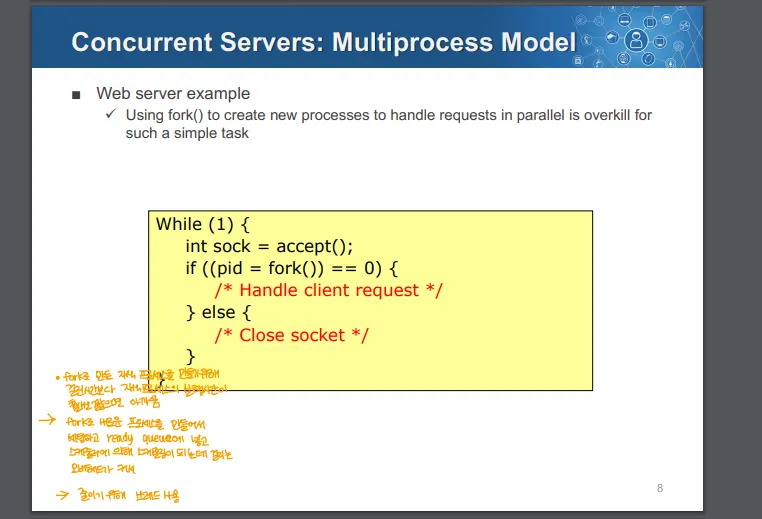

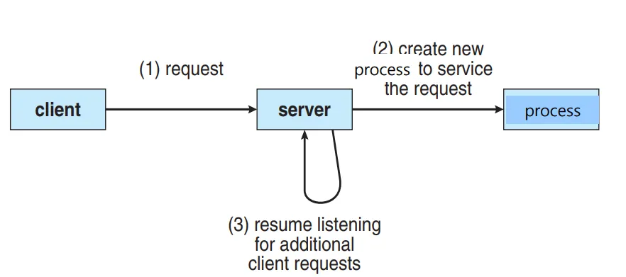

- 들어온 요청을 자식 프로세스를 만들어 처리하게 함
	→ 새로운 프로세스를 만드는데 비용, 시간이 많은 듬

### 웹 서버 멀티스레드 모델

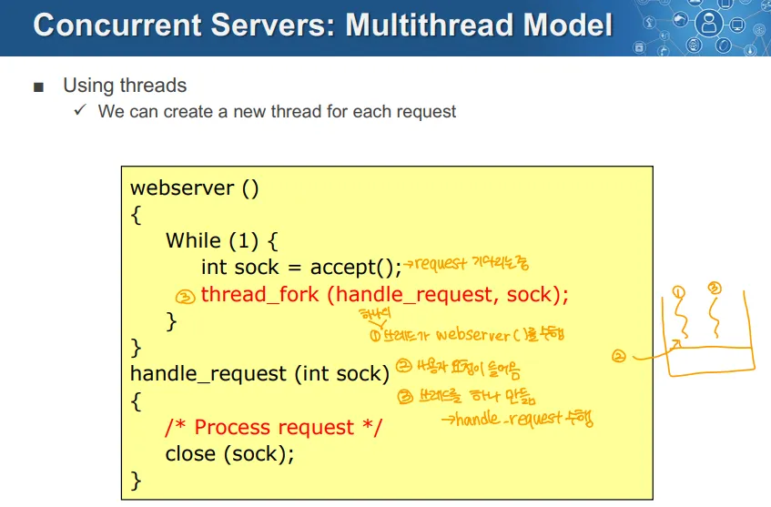

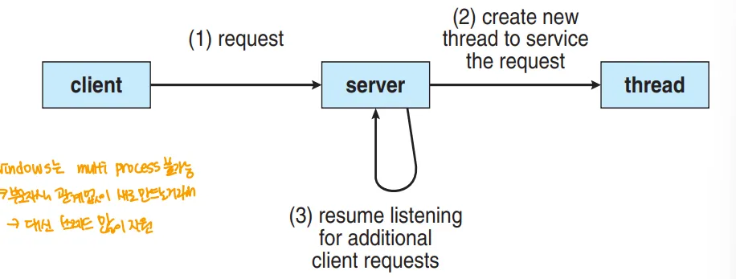

- 요청을 받으면 스레드를 만들어서 요청을 처리하게 함

## Shell 예시(싱글프로세스, 멀티프로세스, 멀티스레드)

### 싱글 프로세스(Iteration, 반복)

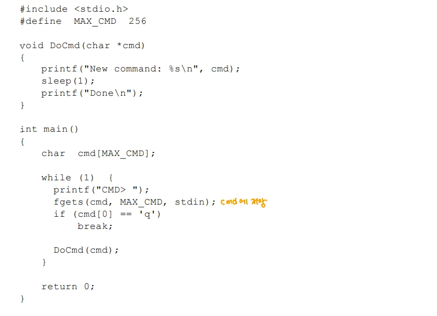

- while 문을 통해 들어온 요청을 반복적으로 처리
- 한번에 하나의 요청만 처리

### 멀티 프로세스

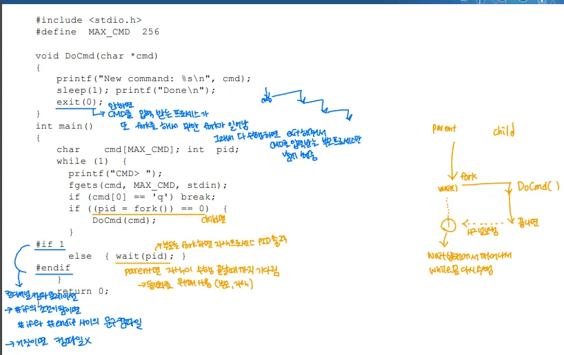

- 반복문으로 요청을 받음
- fork()를 통해 들어온 작업 요청을 수행하게 함
- 작업을 수행하는 DoCmd 함수에는 반드시 exit()이 있어야 함
- 컨디셔널 컴파일레이션으로 자식 프로세스가 아닌 경우(=부모 프로세스인 경우) wait하는 코드 넣음
	→ #if 1 → 조건이 1인건 일단 임시로 아무거나 쓴 듯?

### 멀티 스레드

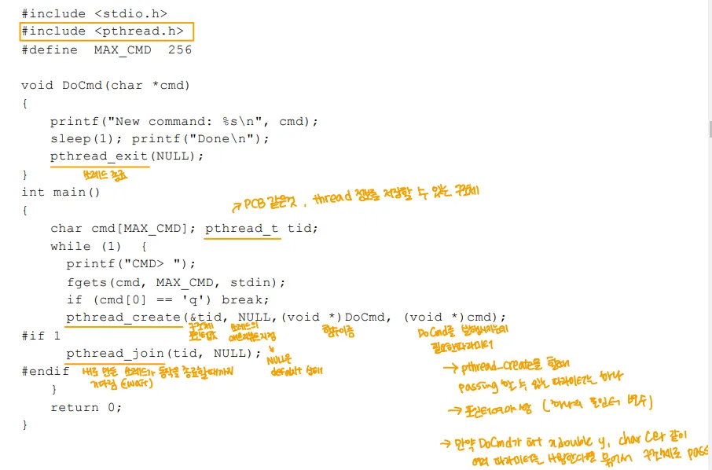

- 반복문으로 요청을 받음
- 스레드를 만들어 요청을 넘김
- pthread_join으로 동작을 종료할 떄까지 기다림
- 스레드도 pthread_exit을 해줌

## 아두이노에 두 가지 프로그램 올리는 예시

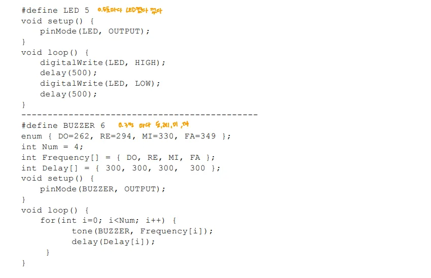

→ 위 아래, 2가지 코드를 동시에 실행하고 싶음

### 단일 작업으로 수행

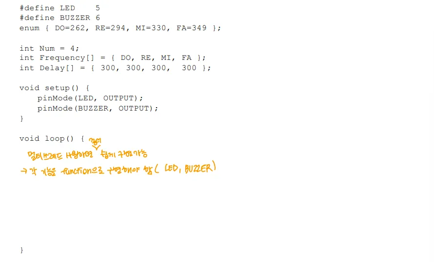

→ 그냥 위 두 코드를 하나로 합쳐서 차려로 수행

### 아두이노에서 다중 작업(←멀티 스레드와 유사)

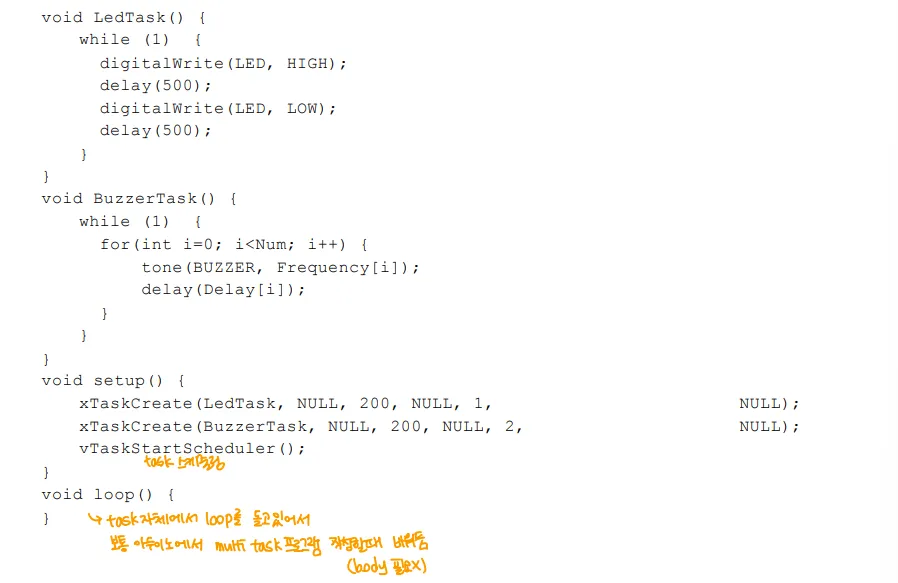

→ 두 코드를 함수로 만들어
→ xTaskCreate 함수로 다중 작업으로 수행

# 멀티 코어 프로그래밍
**→ 싱글 코어일 때와, 멀티 코어일 때 멀티 스레드가 어떻게 실행 되는지**

## 싱글 코어에서의 동시 실행

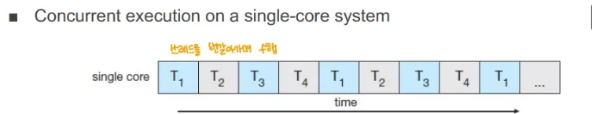

- 코어가 1개일 때는, 스레드가 여러개여도 이를 시분할 해서 교차하며 실행
	- 동시에 실행되는 것 처럼 보임, 실제로는 교차하며 실행

## 멀티 코어 시스템에서의 병렬 실행

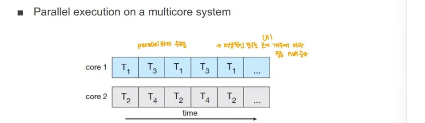

- 코어가 여러개인 시스템에서는 여러 코어가 동시에 작업을 처리할 수 있어 병렬적으로 실행
	→ 진짜로 동시에 수행되는 것

- 각 스레드의 작업 사이의 의존성 관계를 따져서, 서로 의존성이 없는 것들은 각각의 코어에서 병렬적으로 동작 가능

→ 동시성: 여러 작업이 동시에 실행되는 것처럼 보이는 상태(실제로는 하나의 코어에서 짧은 시간 단위로 작업을 교차하며 실행)
→ 병렬성: 여러 작업이 물리적으로 동시에 실행되는 것, 진정한 병렬 처리 가능
→ 시분할: 여러 작업이 짧은 시간 간격으로 CPU 시간을 나눠 사용하는 방식(동시성 구현에 쓰임)

# 병렬 처리 방식
→ 1) 데이터 병렬성 2) 테스크 병렬성 2가지가 있음

## 데이터 병렬성(Data pararellism)

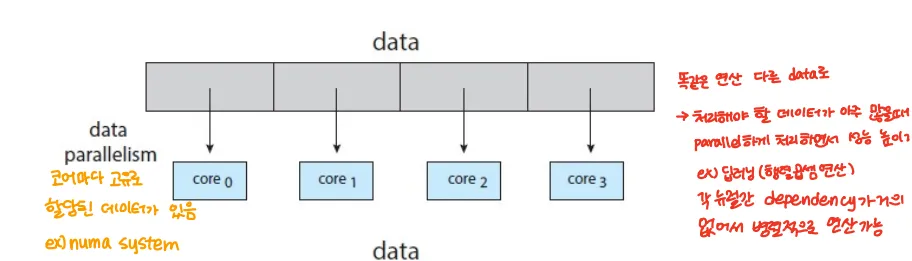

- 큰 데이터를 나누어 여러 코어에서 병렬적으로 동일한 작업을 나눠진 데이터에 수행하는 방식
	- 코어마다 데이터를 할당해 완료 후 취합하는 형태
	- GPU는 데이터 병렬성 방식 특화
- ex) NUMA 시스템, 딥러닝의 행렬곱

## 테스크 병렬성(Task pararellism)

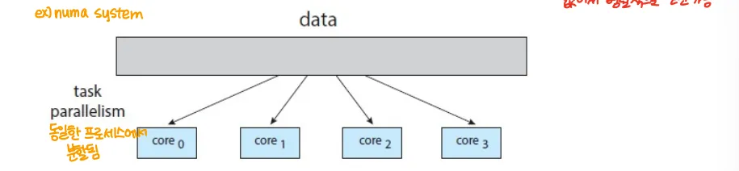

- 각 코어마다 다른 작업을 병렬적으로 수행하는 방식
	- CPU가 테스크 병렬성 방식 특화

# 병렬 프로그래밍을 위한 라이브러리, 기술

1. Pthreads(POSIX threads) → 테스크 병렬성(이거만 테스크 병렬성)
2. OpenMP → 데이터 병렬성
3. Open MPI → 데이터 병렬성
4. SIMD → 데이터 병렬성
5. GPGPU → CUDA, OpenCL → 데이터 병렬성, 머신러닝 연산작업 수행

# 유저 스레드, 커널 스레드

## 유저 스레드

- 유저 레벨의 스레드 라이브러리에 의해 관리되는 스레드
→ 초기 커널 레벨에서 구현하기 어려워 유저 레벨에서 스레드를 구현(라이브러리 형태)

- 문제점
	- 커널에서 유저 스레드를 알지 못함
	- 스레드 단위에서 스케줄링을 하기 힘듬
		- ex) 한 프로세스에 스레드 T1, T2, T3가 스케줄링되어 실행,
			→ T1이 실행 도중 시스템 콜 호출, 이러면 프로세스가 커널 레벨로 전환, 다른 스레드들은 계속 대기
			→ 커널에서 알고 있었으면 T1을 가장 마지막에 스케줄링

- 장점
	- 커널 오버헤드는 기존과 동일
- ex) Pthread, C-Thread, Solaris thread → Pthread는 커널레벨로 변환됨

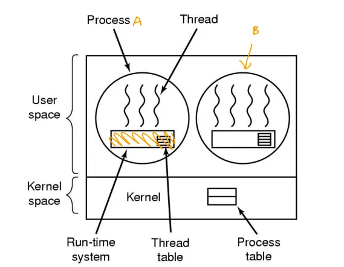

→ 스레드를 관리하는 런타임 시스템과 스레드 테이블이 유저 레벨에 있음
→ 프로세스 테이블은 커널에 있는 것과 대조적

## 커널 스레드

- 커널에 의해 지원되는 스레드
	- 스레드의 생성과 관리가 시스템 콜에 의해 이루어짐
- 장점
	- 커널이 알고 있기 때문에 스케줄링을 커널에서 해줌
- 단점
	- 커널 오버헤드가 증가

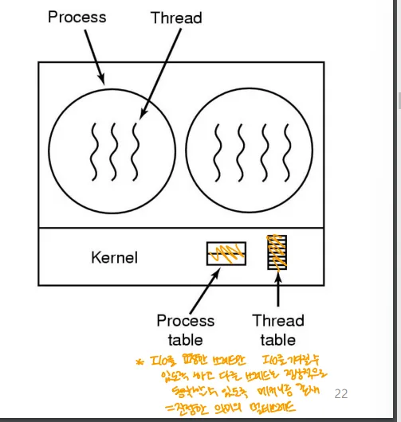

→ 커널 안에서 프로세스, 스레드 모두 관리

## 유저 레벨 스레드, 커널 레벨 스레드 비교

### 유저 레벨 스레드

- 유저 레벨의 스레드 라이브러리가 스레드 작업 구현
- 작고 빠름
- OS는 유저 레벨 스레드를 볼 수 없음
	- OS가 blocking I/O 작업 같은 잘못된 결정 가능
- 스레드 스케줄링
	- 비 선점형 스케줄링 : yield()로 이뤄짐
	- 선점형 스케줄링: 신호를 통한 타이머로 이뤄짐

### 커널 레벨 스레드

- 모든 스레드 작업이 커널에서 구현
- 커널이 모든 스레드를 스케줄링
- 프로세스보다는 저렴, 비용이 유저레벨 스레드에 비해 상대적으로 큼
→ 기능적으로 더 신뢰, 안정성 높음

# 멀티스레딩 모델

- 커널에서 스레드를 관리하는 방식과 커널의 구현에 따라 달라짐
- 1) Many-to-One 2) One-to-One 3) Many-to-Many 4) Two-level(Many-to-Many + One-to-One) → 총 4가지

## Many to One

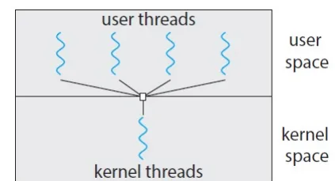

- 여러 사용자 스레드가 하나의 커널 스레드에 매핑

## One to One

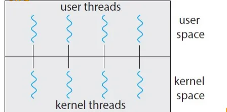

- 하나의 유저 스레드에 하나의 커널 스레드가 매핑

## Many to Many

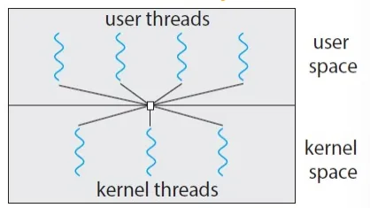

- 여러 유저 스레드가 여러 커널 스레드에 매핑

## Two level

- Many to Many와 One to One 모델을 결합
- 기본적으로 Many to Many를 사용, 필요에 따라 One to One으로 동작

→ 헷갈린거: 유저스레드만 쓰다가 유저스레드+커널스레드로 이동(유저 스레드를 버린게 아님)

# Threading 이슈

1. fork()와 exec() 시스템 콜의 의미
	→ 멀티 스레드 프로그램에서는 fork(), exec() 시스템 콜의 의미가 달라질 수 있음

	- fork() 호출 시 새로운 프로세스는 모든 스레드를 복제해야 하는가, 아니면 fork()를 호출한 스레드만 복제 해야 하는가
		- 정답X, fork()는 둘 다 지원
		- 스레드가 많은 프로세스 복제 시 모든 스레드도 같은 복사할 수도 있음
			- 따라서 fork()를 하기 이전에 스레드를 만들지 않는 것이 불문율
	- 여러 스레드가 있는데 그 중 하나가 exec()을 만나면, 모든 스레드를 없애고 exec()의 실행 내용이 프로세스의 내용을 대체
2. Thread Cancellation
	- 스레드가 끝나기 이전 강제 종료하는 작업
	- 만일 스레드가 다른 스레드와 공유하는 자료구조를 수정하는 중 취소되면 문제가 일어날 수 있어 고민해야함
3. Signal Handling
	- signal은 프로세스에 어떤 이벤트가 일어났음을 알리기 위해 사용
	- 그럼 멀티 스레드 환경에서는 어떤 스레드에 전달해야하는가
		1. signal이 적용될 스레드에만
		2. 모든 스레드에
		3. 몇몇 스레드에만 선택적으로
		4. 특정 스레드가 모든 Signal 받기를 전담 하도록
		→ 이 중에 고를 수 없어서 문제

4. Thread pools
	- 스레드들을 미리 만들어 놓는 풀
	- 최적의 풀의 크기는 얼마인지, 스레드 풀을 다 쓰고 있을 때는 어떡할 것인지, 스레드 재사용 시 초기화를 제대로 안하면 나는 에러 같은 것들을 고려
5. Thread specific data
	- 각 스레드가 독립적으로 다룰 수 있는 데이터
	- 각 스레드가 독립적으로 관리하므로 메모리 접근, 데이터 일관성, 초기화나 소멸 등에 따라 정확히 관리해야함

# Pthreads(POSIX threads) 명령어

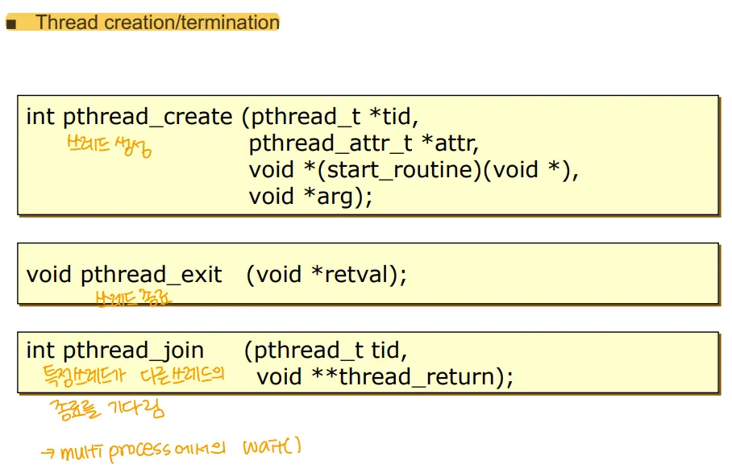

1. pthread_create : 스레드 생성
2. thread_exit: 스레드 종료
3. thread_join: 특정 스레드가 다른 스레드의 종료를 기다림
	- 프로세스의 wait() 같은 것

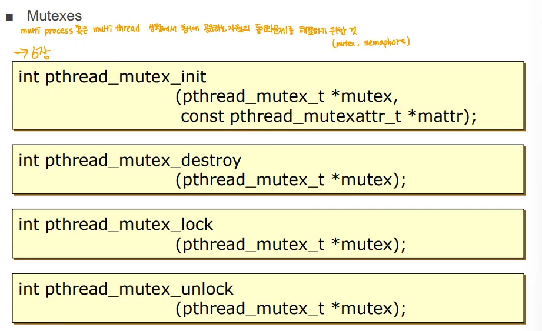

Mutexes

- 멀티 프로세스나 멀티 스레드 상황에서 동시에 공유하는 자원의 동기화 문제를 해결하기 위한 방법
	- Mutex, semaphore 등의 방법이 쓰임
→ 나중에 배움, 6장에서, 일단은 뮤택스의 존재만 알 것

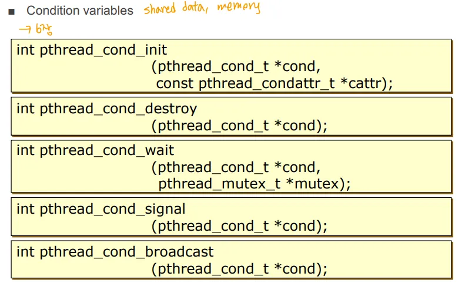

Condition variables

- 공유 데이터, 공유 메모리 등을 관리
→ 나중에 배움, 6장에서, 그냥 글쿠나 할 것

# Window 스레드 명령어

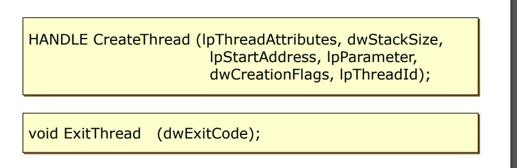

1. CreateThread → 스레드를 생성하고 실행
2. ExitThread → 스레드를 종료

# JAVA의 스레드

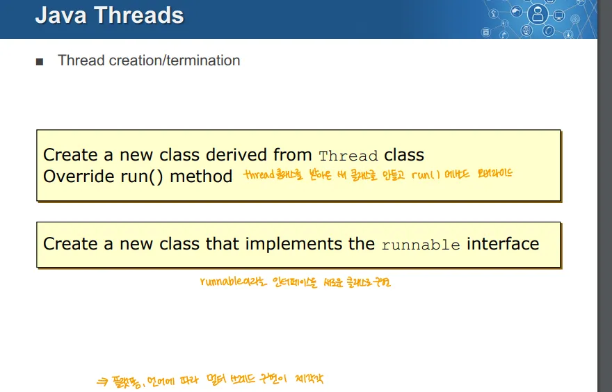

→ 자바(JVM)에서 쓸 수 있는 스레드 방법 여러개

1. Thread 클래스를 상속
	- run 메서드를 오버라이드해, 스레드가 실행할 코드 정의
2. Runnable 인터페이스 구현
	- Runnable 인터페이스에 run 메서드를 미리 정의해, thread로 넘겨 실행

# 스레드 설계 공간

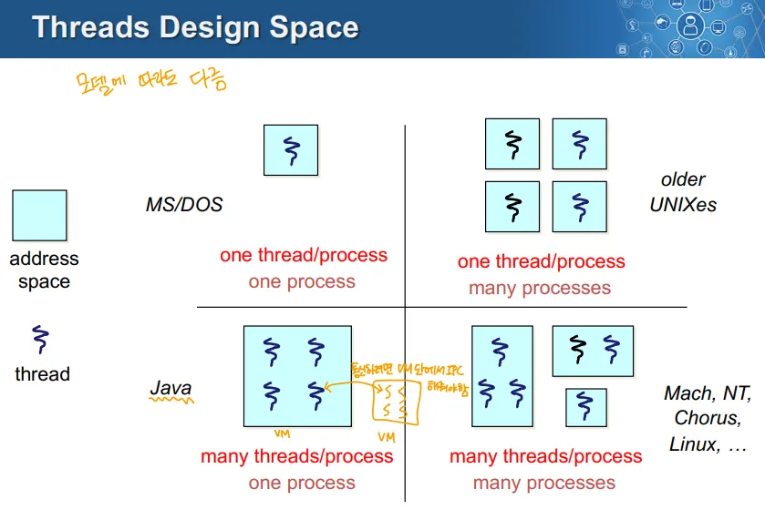

1. One thread/process, One Process
	- 하나의 프로세스에 스레드 하나
	- MS DOS
2. One thread/process, Many processes
	- 각 프로세스에 하나의 스레드만 존재 but 여러 프로세스를 동시에 실행
	- 구버전 Unix
3. Many Thread/process, One process(Java 구조)
	- 하나의 프로세스가 여러 스레드를 가짐
	→JVM이라는 하나의 프로세스 위에서 실행되므로, 프로세스는 1개이고 그 안에서 여러 스레드를 실행

4. Many threads/process, Many processes
	- 하나의 프로세스가 여러 스레드를 가지고, 동시에 여러 프로세스도 실행 가능
	- Mach, Linux 등등등
