> 원본 Notion 정리 — 강의 슬라이드/설명.
> [← 전체 목차](/posts/학교공부/운영체제/목차/)

***

# Process Execution

- 프로세스의 실행 과정은 CPU burst와 I/O burst가 번갈아가며 실행됨

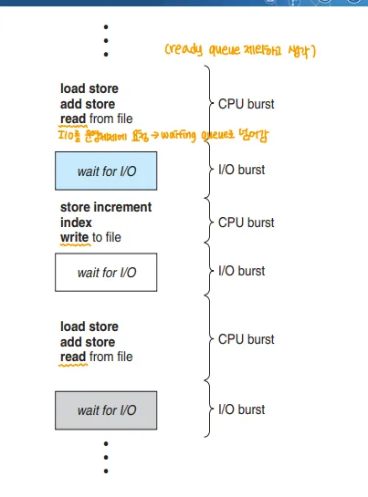

→ 그림에서 read, write 명령을 수행하면 I/O burst 구간으로 넘아가서 대기하다가 I/O 작업이 끝나면 다시 CPU burst 구간으로 돌아옴

# CPU burst, I/O burst

## CPU burst

- 프로세스가 CPU에서 실행되는 시간

## I/O burst

- 프로세스가 I/O 작업을 수행하는 시간
→ 이 시간동안 CPU는 프로세스를 중단하고 다른 프로세스를 처리할 수 있음

## CPU bound process

- CPU burst 비율이 높은 프로세스
- Ex) 슈퍼컴퓨터의 연산, 딥러닝, 시뮬레이션
	→ 연산량이 많아 실행시키고 사용자는 나중에 결과를 확인하는 많은 프로세스

## I/O bound process

- I/O bust 비율이 높은 프로세스
- Ex) 한글2024, 브라우저, MP3 등
	→ 일상적으로 사용하는 대부분의 프로그램
	→ 대부분 잠깐의 시간동안 CPU 작업을 수행하고 이후 입출력 작업을 수행

⇒ CPU를 스케줄링(숏 텀 스케줄러) 할 때 CPU bound process인지 I/O bound process인지에 따라 스케줄링을 어떻게 할 지 고려해야함
	→ 일반적으로 I/O bound process 가 CPU burst가 짧기 때문에 먼저 스케줄링 됨

# Dispatcher
→ Dispatch를 수행하는 운영체제의 일부분

## Dispatch

- ready 상태인 프로세스를 실제로 CPU에 할당하는 작업
- **현재 실행되고 있는 프로세스의 정보를 PCB에 저장하고 실행할 프로세스의 정보를 PCB에서 로드하는 과정**

## Dispatch Latency

- 프로세스 하나를 정지시키고 다른 프로세스를 실행할 떄 까지의 시간
- Dispatch가 일어나는 시간

## Scheduling과 Dispatch

- 좁은 의미의 Scheduling은 CPU에서 실행할 프로세를 선정하는 단계, Dispatch는 CPU가 수행할 수 있게 하는 작업
- 넓은 의미의 Scheduling은 Dispatch를 포함

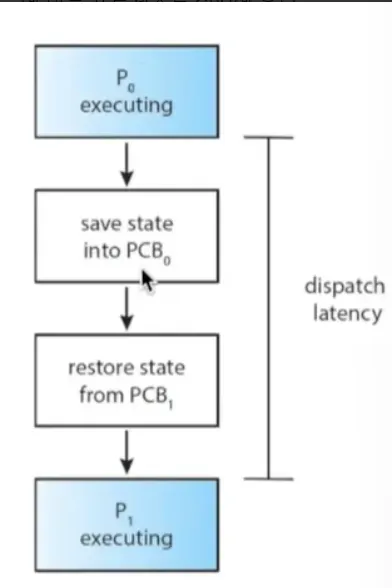

→ P0가 실행 중일 때 P0의 정보를 PCB0에 넣고, PCB1을 복원해 P1을 실행할 준비를 마침

# Preemptive, Non-preemptive
→ 스케줄링 방식의 차이

## Non-preemptive Scheduling

- 실행 중인 프로세스가 끝날 때까지 기다린 다음 Context Switch 함
	→ 실행 중일 때 뺏지 않음

- Context Switch는 아래와 같은 경우 일어남
	1. 프로세스가 종료 되었을 때
	2. 프로세스가 I/O 작업을 수행하기 위해 대기하고 있을 때

## Preemptive Scheduling

- 스케줄러가 실행 중인 프로세스를 강제로 중지하고 Context Switch를 할 수 있는 방식
- 문제 발생 가능성
	- 스케줄러가 고융 데이터를 수정하는 중에 선점되면(=강제로 내려오게 되면)?
	- 시스템 콜로 인해 커널 모드가 실행 중일 떄 선점되는 경우에는?
→ 대부분 OS는 선점형 스케줄링을 사용

# Scheduling Criteria

- 스케줄링 시 고려해야할 기준

## 1. CPU utilization

- CPU가 실제로 작업을 수행하는 시간의 비율
	→ 그냥 실제로 작업을 수행한 시간과 비례

- **CPU utilization을 최대로**

## 2. Throughput

- 단위 시간 당 처리량, 단위 시간 당 처리한 명령어 수
- **Throughput을 최대로**

## 3. Turnaround Time

- 특정 프로세스가 CPU에 제출되고 나서 완료될 때 까지의 시간
- **Turnaround Time을 최소로**

## 4. Waiting Time

- ready queue에서(ready 상태에서) running이 될 때 까지 대기하는 시간
	→ waiting 상태와 무관

- **Waiting Time을 최소로**

## 5. Response Time

- 프로세스가 작업을 시작한 순간부터 결과를 반환할 때 까지의 시간
- **Response Time은 최소로**

## Context Switch에 따른 각 기준 변화

- Context Switch 횟수가 늘어나면
	- Context Switch 오버헤드로 인해 CPU Utilization, Throughput 이 낮아짐
- Turnaround, Waiting, Response Time은 Context Switch가 자주 일어날 수록 좋아짐 → 주기가 짧아짐
→ Trade-Off 관계

# Scheduling Goals
→ 각 시스템 별로 스케줄링의 목적이 달라짐

## 1. 모든 시스템의 경우

- Fairness: 프로세스들이 공평하게 CPU를 사용할 수 있도록 스케줄링 하는 것
- Balance: 시스템 전체가 바쁘게 일하도록 하는 것

## 2. Batch System
→ 한번에 하나의 프로세스가 CPU를 독점(Context Switch는 없음)

- Throughput 
- Turnaround Time
- CPU Utilization

## 3. Interactive System
→ 우리가 사용하는 일반적 프로그램, 사용자와 interactive하게 대화형으로 동작

- Response Time
- Waiting Time
- Proportionality → 사용자가 기대한 만큼의 성능을 보여줌
	→ 사용자 경험 만족, 사용자가 예측할 수 있는 성능 보여줌

## 4. Real-Time System

- Meeting Deadline
	- 데이터를 손실하는 것을 피하기 위해 데드라인을 만족해야함
- Predictability 
	- 멀티미디어 시스템과 같은 경우 시스템의 성능이 예측 가능해야함

# Scheduling Non-Goal

- 스케줄링이 일어나지 않게 해야하는 것

## Starvation(기아 상태)

- 한 프로세스가 다른 프로세스가 필요로 하는 자원을 가지고 있어 해당 프로세스가 실행되지 못하는 상황
	- 주로 한 프로세스가 CPU를 너무 오래 사용해 다른 프로세스가 실행되지 못하는 경우
	- Lock도 이런 자원이 됨
- 잘못된 스케줄링 정책이 Starvation을 발생시킬 수 있음
	- Ex) 높은 우선순위의 프로세스가 낮은 우선순위의 프로세스가 CPU에서 실행되는 것을 막는 경우 
- 동기화도 Starvatiin을 발생시킬 수 있음
	- 한 스레드(=프로세스)가 항상 Lock을 획들해서 다른 스레드가 얻지 못하는 경우

# Scheduling Algorithm
→ 이 장에서는 총 7가지 배움

## 1. FCFS(First Come First Served)
= First In First Out(FIFO)

- 작업들이 도착한 순서대로 실행
- 특징
	- 현실 세계에서 많이 쓰임
	- 일반적으로 비선점형
	- 작업들이 평등하게 다뤄짐 → Starvation이 절대 없음(Fairness를 가장 잘 보장)

### 문제점

- 평균 Waiting Time이 큰 작업이 작은 작업보다 먼저 오면 늘어남
	→ CPU burst time이 프로세스마다 달라, 평균 Waiting Time이 늘어남

- CPU 작업과 I/O 작업이 동시에 잘 실행되지 않을 수 있음

### 예시

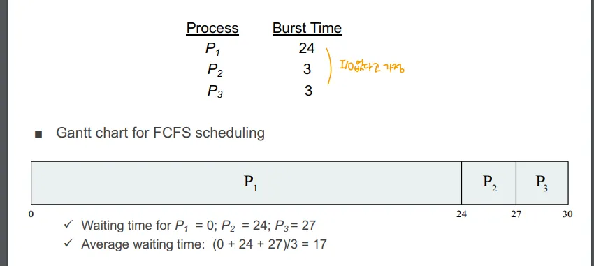

→ 이 경우 CPU burst time이 긴 P1이 P2, P3보다 앞에 와서 평균 대기 시간이 증가

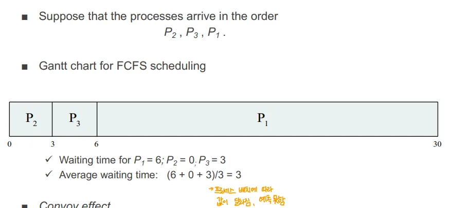

→ 이 경우에는 CPU burst time이 짧은 P2, P3가 먼저 실행되어 평균 대기 시간 감소

### Convoy Effect

- 짧은 Burst Time을 가진 작업이 먼저 오면 평균 대기 시간이 짧아지는 효과

## 2. Shortest Job First(SJF)

- Burst Time이 짧을 것으로 예상되는 작업을 먼저 실행
- 특징
	- 평균 대기 시간 관점에서 최적의 것들 중 하나
	- 비 선점형 

### 예시

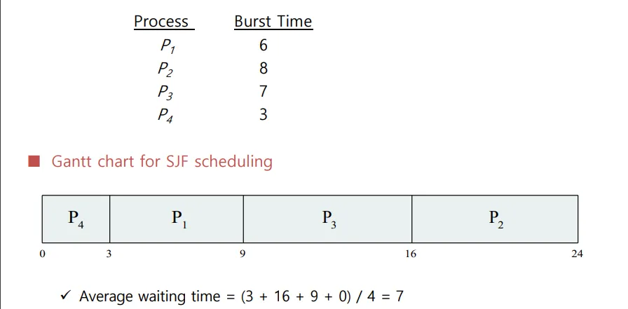

→ burst time 순으로 P4 → P1 → P3 → P2 순서로 실행
→ 평균 waiting time = (P4 0, P1 3, P3 9, P2 16)/4 = 7

## 3. Shortest Remaining Time First(SRTF)

- SJF의 선점형 버전
- 남은 Burst Time이 가장 짧은 프로세스를 우선으로 실행
- 특징
	- 평균 대기 시간 관점에서 최적의 것들 중 하나
	- 선점형

### 예시

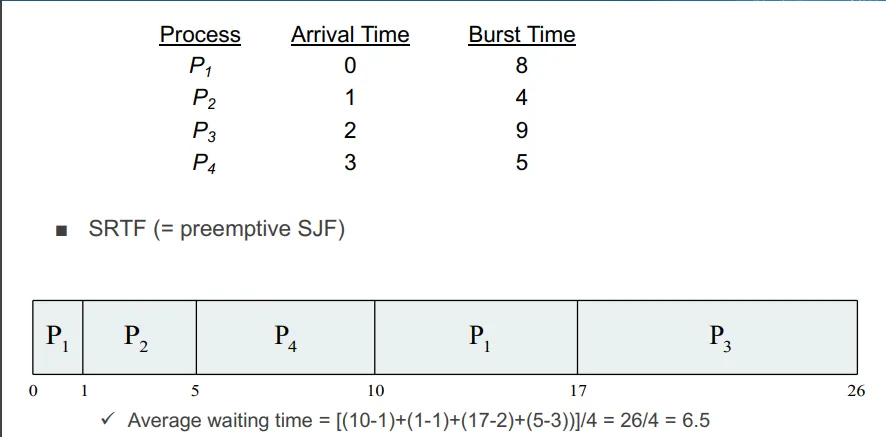

→ 이건 P1 → P2 → P3 → P4 순서로 각 0, 1, 2, 3초에 도착한 상황

1. P1이 가장 먼저 도착해 실행
2. 1초 실행 후 P2가 도착
	- 남은 실행 시간은 P1 8-1 =7, P2=4 ⇒ P2가 선점
3. 2초에 P3 도착
	- 남은 실행 시간 P2 = 4-1 = 3, P3 = 9 ⇒ P2가 그대로 실행
4. 3초에 P4 도착
	- 남은 실행 시간 P2 = 4-2 = 2, P4 = 5 ⇒ P2가 그대로 실행
5. 5초에 P2 실행 종료
	- P1 = 7초, P3 = 9초, P4 = 5초  ⇒ P4 실행
6. 이후 차례로 P1, P3가 실행
→ 대기 시간

	- P1 ⇒ 10초 - 1초(처음 실행된 1초)
	- P2 ⇒ 1초-1초(도착 시간 1초)
	- P3 ⇒ 17초 - 2초(도착 시간 2초)
	- P4 ⇒ 5초 - 3초(도착 시간 3초)
	⇒ (9+0+15+2 )/ 4 = 6.5

### SJF, SRTF문제점 

- 미래에 실행될 CPU burst 를 정확히 알 수 없음
- 합리적으로 예측하는 것이 가능한가
	→ 과거 버스트 타임 기준으로 추정하는 방법이 존재한다고 함

- 잠재적으로 Starvation에 빠질 수 있음
	- 이런 우선순위에 기반한 알고리즘은 우선순위가 낮은 것들이 Starvation에 빠질 수 있음

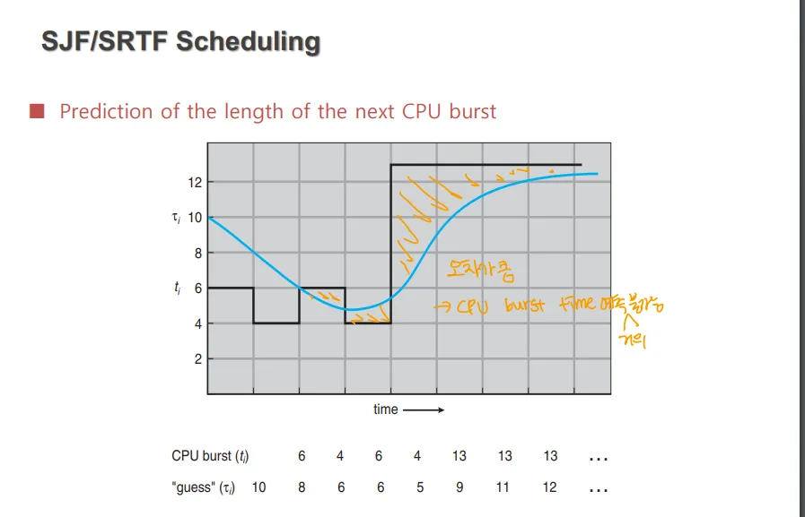

**→ Burst Time을 정확히 예측할 수 없어 오차가 큼**

## 4. Priority Scheduling

- 각 프로세스에 정수 값으로 우선순위를 매핑
- SJF, SRTF은 CPU burst time과 remaining burst time 관점의 우선순위 스케줄링으로 볼 수 있음
- 특징
	- 선점, 비선점형 모두 가능
	- 시스템에 따라 우선순위의 기준이 다름(숫자가 높은 게 우선순위 높을 수도, 낮을 수도)

### 문제점

- Starvation → 낮은 우선순위의 프로세스는 절대로 실행되지 않을 수도 있음

### 해결방법

- Aging → 프로세스의 waiting time이 길어질 수록 우선순위가 점점 높아짐
	- 오래 기다린 것들은 우선순위가 높아져 결국 실행

### “다중 우선순위 큐”를 통한 우선순위 스케줄링 추상적 모델

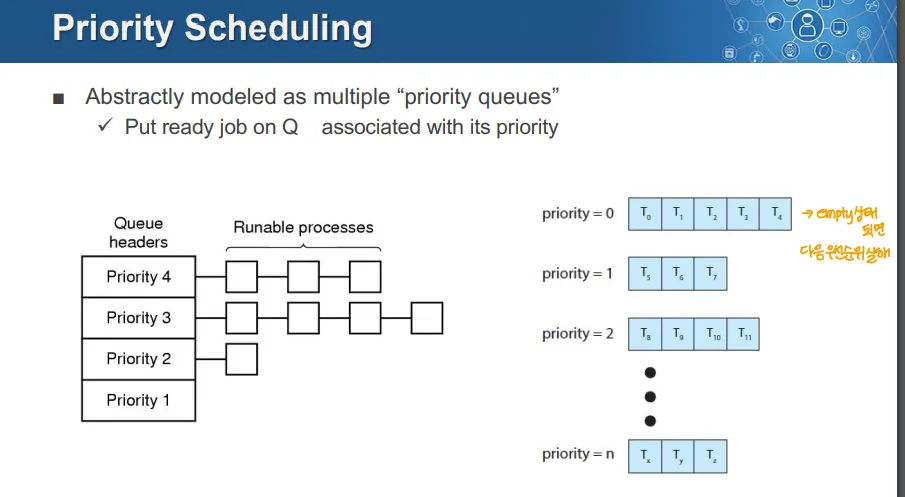

- 각 우선순위 별로 나누고, 같은 우선순위를 가지는 것들은 일렬로 매핑
- 우선순위가 높은 것부터 차례로 처리하고 다음을 우선순위로 넘어감
	- 우선순위가 같은 것을 어떻게 처리할 지는 다음에 나옴

### 예시

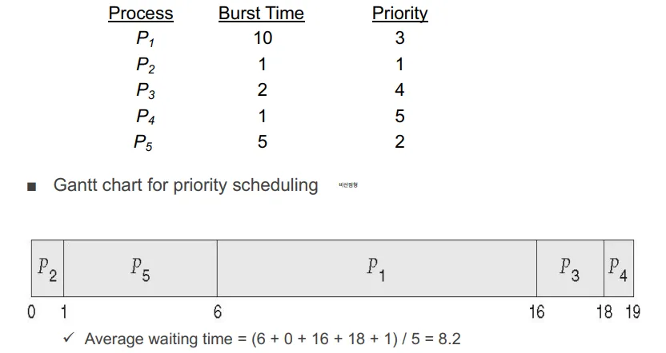

→ 이 경우 burst time과 무관하게 우선순위를 둔 비 선점형 우선순위 스케줄링

## 5. Round Robin(RR) Scheduling
→ robin 이라는 새가 새끼에게 밥을 줄 때 여러 새끼에게 하나씩 주는 것을 반복하는 모습에서 따옴

- 각 프로세스에 작은 CPU 사용 시간 단위를 부여한 후, 
	- 해당 프로세스가 그 시간을 다 사용하면 그 프로세스는 다른 프로세스에게 선점당하고 Ready Queue의 가장 마지막으로 이동
- 특징
	- SJF(or SRTF, FCFS)보다 turnaround time은 더 큼

### Time Quantum  

- CPU를 사용할 수 있는 최대 시간 단위
- Time Quantum이 길면 FCFS(FIFO)와 같음
- Time Quantum이 짧으면 Context Switch 횟수 증가, 오버헤드 증가
- 보통 10\~100ms 사이로 잡음

### 예시

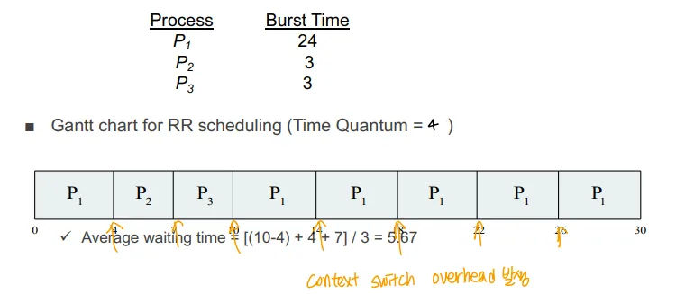

→ 처음 P1은 4의 Time Quantum을 다 쓰고 Context Switch됨

	- P2, P3는 Time Quantum보다 덜 쓰고 종료됨

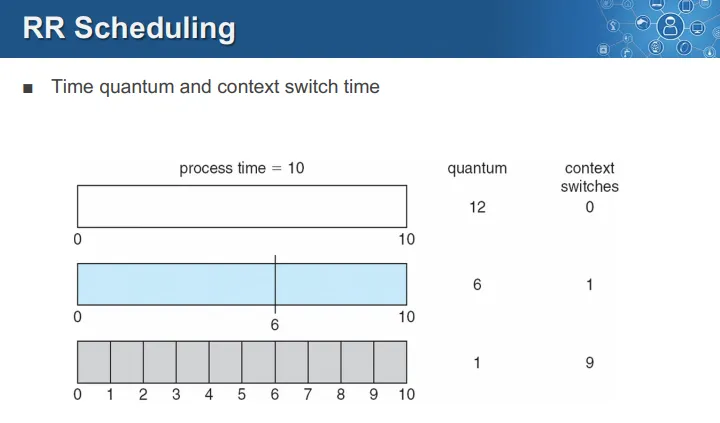

→ Process Time이 10인 경우
	→ Quantum이 12면 Context Switch는 0번 일어남
	→ 6이면 Context Switch는 1번
	→ 1이면 Context Switch는 9번

### 문제점

- 적절한 Time Quantum이 얼마인가
	- 무한대면 FIFO, 0이면 processor sharing(그냥 공유하는 것처럼 보이는 이론적 모델)
	- Time Quantum이 작으면 Context Switch가 너무 자주 일어나 오버헤드가 커짐 → CPU utilization이 떨어짐
	- Time Quantum이 크면 → response time이 커짐
- 엄지의 법칙 → 프로세스의 평균 CPU burst의 80%보다 적은 시간을 Time Quantum으로 해야함
	→ 단순 경험적인 법칙, 검증 X

# Combining Algorithms

- 스케줄링 알고리즘들을 섞어놓은 것
	- 실제로 다양하게 결합되어 동작할 수 있음
		1. 여러 큐를 사용
		2. 각 큐에 대해 다른 알고리즘 선택 가능
		3. 각 큐 사이에서 스케줄링 하는 매커니즘 사용 가능
		4. 필요하면 프로세스를 큐 사이에서 이동시킬 수 있음

## 6. Multilevel Queue Scheduling

- 여러 큐를 두고 각기 다른 프로세스의 특성에 따라 각 큐에 넣는 방식
→ 아래 설명에서는 Ready Queue를 나누는 형식의 Multilevel Queue Scheduling을 설명 → 얼마든지 변경 가능

- Ready Queue를 분리된 큐로 나눔
	1. foreground(interactive) 
		→ I/O 중심의 response time이 중요한 Interactive한 프로세스들

	2. background(batch)
		→ CPU 중심의 성능 효율성이 중요한 사용자와 상호적용이 적은 Batch 작업 성격의 프로세스

- 각 큐는 고유한(각기 다른) 스케줄링 알고리즘을 사용
	1. foreground → round robin 알고리즘 사용
		- RR 스케줄링을 통해 빠른 response time을 보장
	2. Backgournd → FCFS 스케줄링
		→ CPU bound 프로세스는 쭉 실행하는 것이 성능상 나음
⇒ 이렇게 큐를 분리하고 각 큐마다 우선순위를 주는 방식으로 동작

	- RR, FCFS는 같은 우선순위 안에서 동작

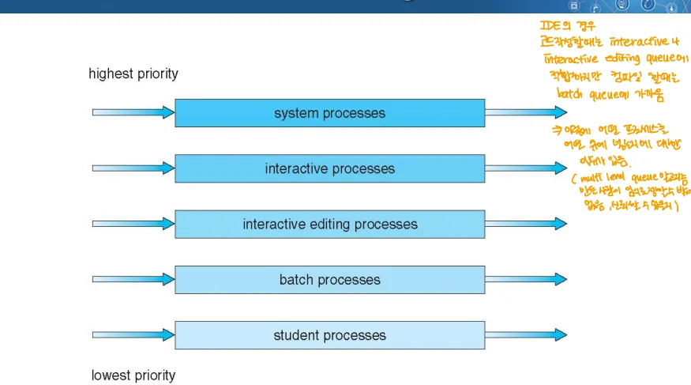

→ 이 그림은 큐를 5개로 나눈 것 → 주로 Interactive한 것이 우선순위가 높고, batch가 우선순위가 낮음

## 7. Multilevel Feedback Queue Scheduling

- 가정: 모든 프로세스는 인터렉티브 하다

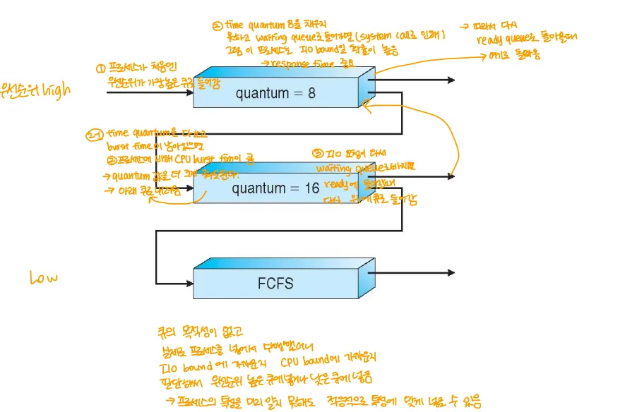

- 큐를 Time Quantum이 낮은 것부터, 긴 것으로, 끝에는 FCFS인 것으로 차례로 둠
- 동작 방법
	1. 일단 Time Quantum이 짧은 큐에 넣음
	2. 만일 프로세스가 중간에 I/O 작업이나 기타 인터럽트가 걸리면 I/O bound 프로세스일 확률이 높으므로 다시 Tiem Quantum이 짧은 큐로 감
	3. 만일 Time Quantum을 다 쓰고도 끝나지 앟은 작업인 경우 CPU bound 프로세스일 확률이 높으므로 Time Quantum이 더 큰 큐로 보냄
		- 그럼에도 끝나지 않으면 끝에는 FCFS 큐로 보냄
- 프로세스의 성격은 실행을 시켜봐야 알 수 있음
→ 실제로 OS에서 쓰는 알고리즘의 기본적인 틀

# Multiple-Processor Scheduling
→ 물리적 코어가 여러 개 있는 시스템에서 스케줄링 하는 방법

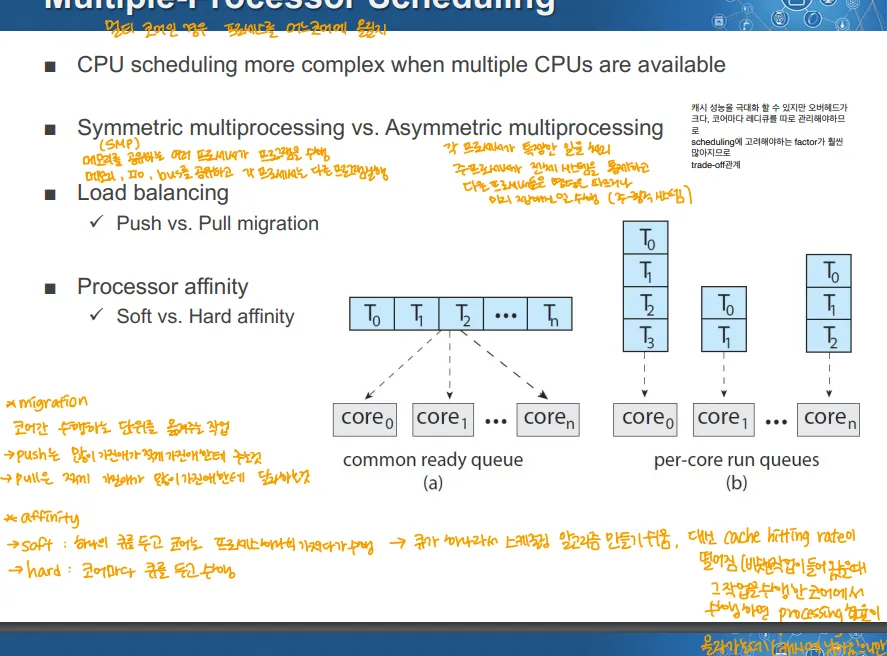

- CPU 스케줄링은 여러 CPU를 사용할 수 있을 때 더 복잡할 수 있음

## Symmetric multiprocessing(SMP)

- 각 CPU가 동일한 메모리 공간과 자원을 공유하는 형태

## Asymmetric Multiprocessing(AMP)

- 각 CPU가 특정한 역할을 가지며 프로세서가 자신만의 특정 기능을 수행
- 하나의 프로세서가 메인 운영체제를 실행, 다른 것은 I/P 오퍼레이션을 전담하는 경우가 있음

## Load Balancing

- Pull migration → 작업을 적게 담당하는(또는 하지 않는) 코어에서 작업을 많이 담당하는 코어의 작업ㅇ르 가져오는 것
- Push migration → 작업을 많이 담당하는 코어에서 작업을 적게 담당하는(또는 하지 않고 있는) 코어로 작업을 넘기는 것

## Affinity

### Soft Affinity

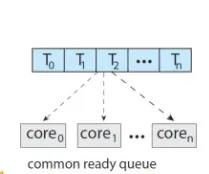

- Ready Queue를 하나 두고 작업들을 코어에 분산하는 형태
→ Common Ready Queue(공용 레디 큐)를 사용

### Hard Affinity

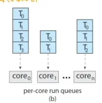

- 각 코어마다 Ready Queue를 가지는 형태
- 특징
	- 캐시 히팅 확률이 높아짐
	- 커널이 할 일이 많아짐
→ Per-core Ready Queue(코어마다 레디 큐를 둠)

# Real-Time Scheduling

- Real-Time 시스템의 작업들은 주기적 성격을 지님

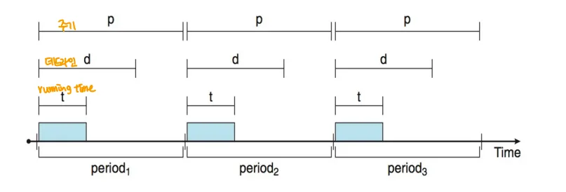

⇒ 특정 태스크의 주기, 실제 실행 시간, 남는 시간 등을 고려해야함

- Static, Dynamic 우선순위 스케줄링으로 나뉨

## Hard Real-time Systems

- 데드라인을 지키지 않으면 치명적인 시스템

## Soft Real-time Systems

- 데드 라인을 지키지 못해도 큰 일은 없는 시스템

## Static → Rate-Monotonic Algorithm

- 우선순위가 주기의 역수에 기반해 할당되는 알고리즘
- **변하지 않는 고정된 우선순위를 기반으로 작성 → Static**
→ 선점형

### 예시

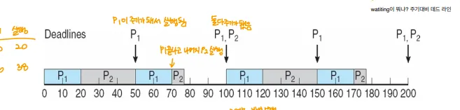

→ P1이 우선순위가 높은 상황

1. P1이 우선순위가 높아서 먼저 실행
2. P1이 종료된 후 P2 실행
3. 중간에 P1의 주기가 돌아옴 → 이때 우선순위가 높은 P1이 실행(P2는 선점당함)
4. 이후 P1, P2의 주기가 일치하면 P1이 먼저 실행

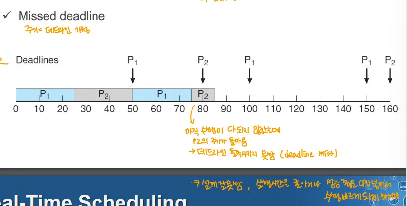

→ 수행이 다 되지 않았으나 P2의 주기가 돌아옴

- 설계 자체를 잘 못함
	⇒ 실행 시간을 줄이거나 성능 좋은 CPU로 수행을 빠르게 하거나 해야함

## Dynamic→ EDF(Earlist Deadline First) Algorithm

- 데드라인이 가장 빠른 작업에 우선순위를 부여하는 방식
- **우선순위는 마감 시간에 따라 동적으로 결정 → Dynamic**
→ 선점형

### 예시

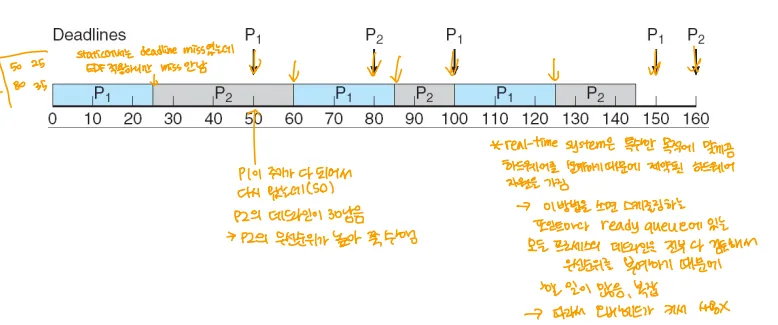

1. P1이 실행
2. P2가 이후 실행 but P1의 주기가 돌아옴
	- but P2의 데드라인이 더 임박했으므로 P2가 우선순위가 높음, 계속 실행
⇒ 보통은 Static한 방법을 사용

	- 일반적으로 Real-time 시스템은 프로세스들이 정해진 단순한 시스템이라 Static한 알고리즘을 사용해도 문제 없음
	- Dynamic(EDF)은 런타임의 스케줄링 오버헤드가 커서 임베디드 시스템에 사용하기 힘듬

# 운영체제 별 스케줄링 알고리즘

## 리눅스 스케줄링

- Real-Time 작업들(Interactive한 것들)은 Static한 우선순위를 가짐
- 리눅스 스케줄링 시스템은 Real-Time 태스크와 일반 태스크를 모두 포함 → 이 두가지는 글로벌 우선순위 체계로 통합
	- 기본값은 120, 낮을 수록 좋음
		- Nice가 -20이면 100으로, +19면 139로 정해짐 → 이게 최상, 최하

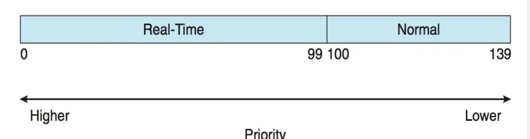

- 0\~99까지는 실시간 프로세스, 100-139까지는 일반 프로세스인 그림
- 실시간 프로세스는 고정된 우선순위, 일반 프로세스는 같은 우선순위인 경우 Round Robin을 적용

### CFS(Completely Fair Scheduling)

- 완전히 공정한 스케줄링 
- 리눅스 커널의 기본 스케줄링 알고리즘
- nice값 -20\~+19 사이에서 Time Quantum값을 변경
- vruntime 변수에 virtual 실행 시간을 유지
- 트리 형태로 태스크를 관리

## 윈도우즈의 스케줄링 알고리즘

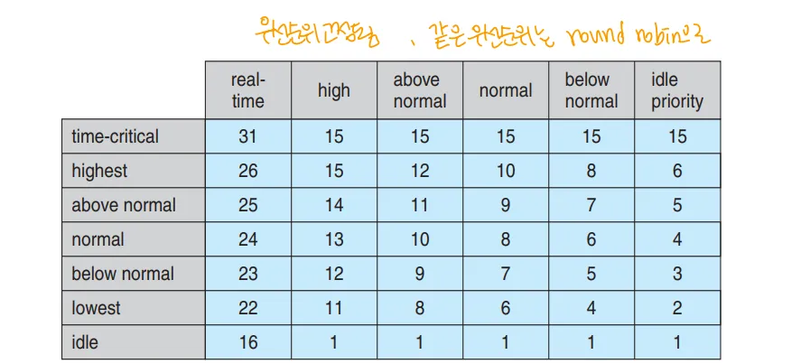

- 프로세스의 타입에 따라(컬럼), 프로세스의 특성에 따라(로우)로 우선순위를 둠
- 우선순위가 같으면 Round Robin으로 스케줄링

## Solaris의 스케줄링 알고리즘

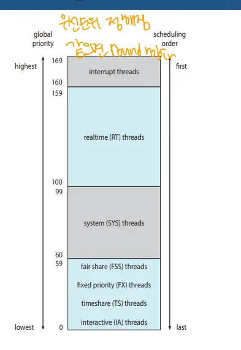

- 우선순위 기반으로 동작
	- 숫자가 높으면 우선순위가 높음
- 가장 아래 단은 멀티레벨 피드백 큐로 동작
- 동일한 우선순위에서는 Round Robin 스케줄링으로 동작

# 스케줄링 알고리즘 평가 방법

## 1. Deterministic Modeling

- 사전에 정의된 워크로드에 대해 스케줄링 알고리즘의 성능을 평가하는 방법
- 수학적 계산
→ Big O와 같은 것이라 하심

## 2. Queueing Model

- 확률 모델을 수학적으로 분석
⇒ 위 2개는 수학적인 방법, 정확도 장담 불가 but 시뮬레이션 보다는 높다고 평가

## 3. Simulation

- 가상으로 환경을 설정하고 돌려보는 것

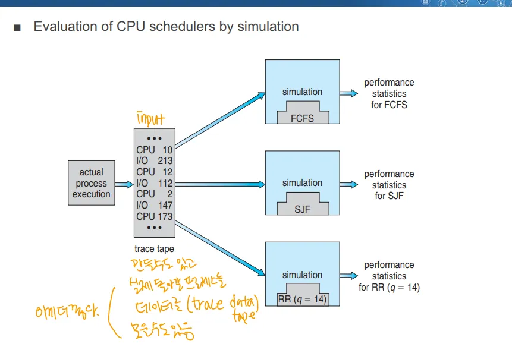

- 실제 시뮬레이션 해볼 때 인풋을 만들 수도, 기존의 로그나 데이터에서 가져올 수도 있음
	- 이러한 시스템의 동작 로그, 데이터 ⇒ Trace Tape or Trace Data라고 함
↔ 애뮬레이션 → 실제 환경을 똑같이 만들어 실험하는 것

## Implementation

- 실물로 개발해서 돌려봄
→ 가장 높은 신뢰성
