> 원본 Notion 정리 — 강의 슬라이드/설명.
***

# Synchronization

## 멀티 스레드 프로그램에서 스레드 협력

- 멀티 스레드 프로그램에서 여러 스레드가 동일한 자원이나 데이터를 공유하는 경우가 있음
- 이때 스레드 사이 실행 순서를 조정해야함
⇒ 그렇지 않으면 **동기화 문제 **발생

## 정확성을 위한 동기화 필요성

- 스레드들이 임의의 방식과 서로 다른 속도로 교차하며 실행될 수 있음
	- 이때 스케줄링은 애플리케이션 개발자가 제어 불가
- Synchronization을 사용해 협력을 제어
	- 이 synchronization을 통해 실행의 교차를 제한
⇒ 프로세스와 분산 시스템에서도 동일하게 적용

## 예시 1

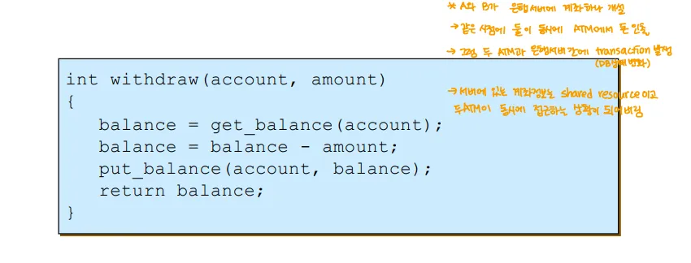

- 현재 인출 함수
- 이 함수를 동시에 여러 명이 사용하는 상황

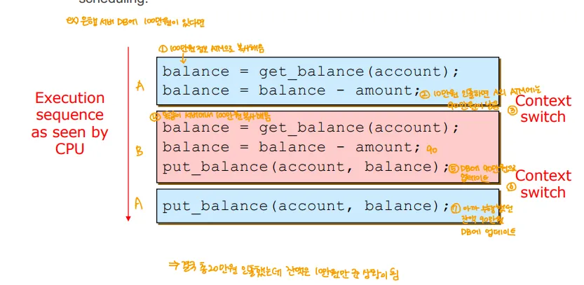

- A에서 balance의 총액을 빼고 업데이트(=put)하기 이전 문맥 전환
- 이때 2번째 프로세스는 문맥전환하고 업데이트까지 함
- A는 다시 실행될 때 업데이트를 진행
→ 만일 총 50만원 중 A가 10만원, B가 10만원 출금하면 잔고는 30만원이어야 함
→ but, A의 기존 balance에 들어있던 40만원이 balance로 업데이트 됨

## 예시 2

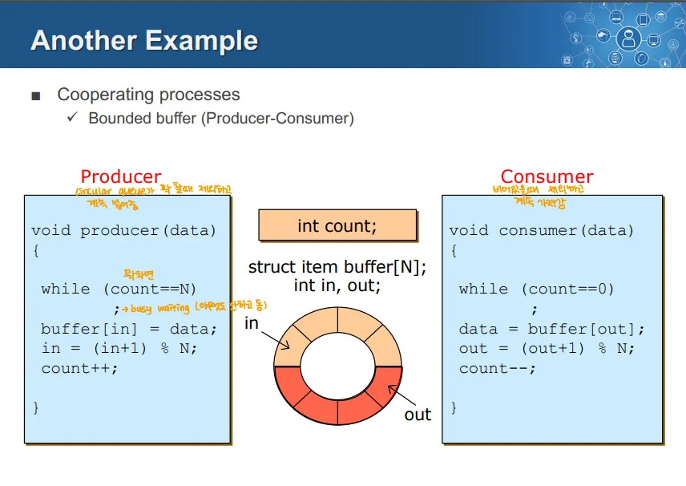

- 이때 count가 공유하는 자원
- 정보를 입력하는 Producer는 count를 1 올리고
- Consumer는 count를 1 줄임

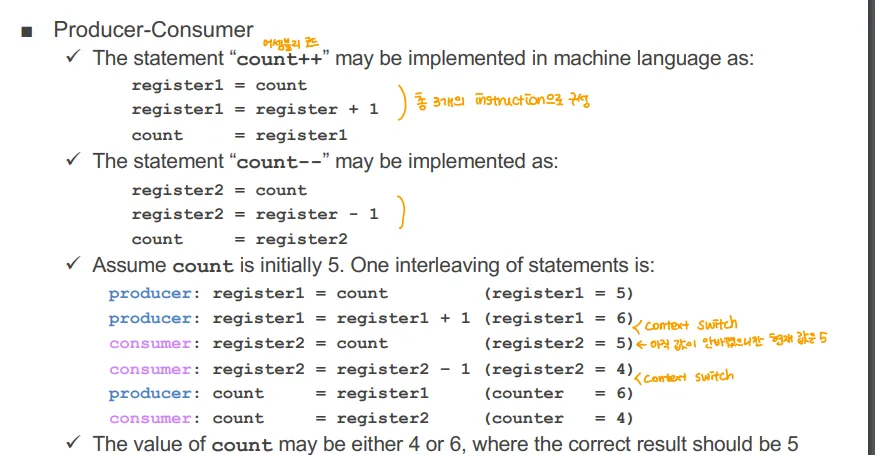

- 감산, 가산 연산은 어셈블리 레벨에서 저렇게 분할
- 만일 Producer가 register1에 값을 더하기까지만 하고 전환
- Consumber가 레지스터 2에 값을 더 하고 전환
- Producer가 count로 값 업데이트
- Consumer가 cound로 값 업데이트
⇒ 이러면 실제로 들어가야하는 값이 아니라 Consumer프로세스에 있던 값이 덮어씌워짐

# Synchronization Problem

- 2개의 동시 실행되는 스레드(or 프로세스)가 동기화 없이 공유 자원에 접근
- **Race Condition 이 생겨남**
	- 2개의 동시 실행되는 스레드가 동시에 공유 자원에 접근해 조작하는 상황
	- 이런 Race Condition의 경우, 여러 프로세스가 동시에 공유 데이터에 접근, 조작해서 결과가 비 결정적이고 타이밍에 따라 달라짐
		**⇒ 즉, 동기화 문제가 일어남**

- **동시성 환경에서 공유 자원에 대한 접근을 제어하기 위한 매커니즘(=동기화)** 필요
	- 버퍼, 큐, 리스트 등 모든 공유 데이터 구조에서 이런 동기화가 필요
- **Critical Section**
	- **동기화 문제가 일어날 수 있는 코드 구간**
	-  주로 공유 자원에 접근하는 코드 영역

# Requirements for Synchronization Tools
→ 동기화 문제를 위한 도구에 필요한** 조건**

## 1. Mutual Exclusion(상호 배제)

- 프로세스 P가 자신의 Critical Section에서 실행 중일 때, 다른 어떤 프로세스도 자신의 Critical Section에 진입할 수 없음
→ 크리티컬 섹션을 수행 중인 프로세스가 있다면 다른 프로세스들은 그 크리티컬 섹션을 수행할 수 없어야 함

## 2. Progress

- 다른 프로세스가 Critical Section에서 실행되지 않는 상황에서, 해당 구간을 수행하고자 하는 프로세스가 있을 때 그 결정을 무한정 연기할 수 없어야 함
→ 즉, Critical Section을 수행하는 프로세스가 없을 때 다른 프로세스들을 의미없이 연기하지 않도록 해야 함

## 3. Bounded Waiting

- 프로세스가 Critical Section 진입을 위한 대기를 하는 중에, 다른 프로세스들이 Critical Section에 진입하는 데는 한정된 횟수가 있어야 함
→ 즉 프로세스가 대기 중일 때, 다른 프로세스들이 계속 Critical Section에 진입해 무한정 대기하는 것을 방지해야함
⇒ 2, 3번은 Starvation을 방지하기 위한 조건

# Synchronization Tool

## Synchronizaiton Tool의 종류

1. Locks
2. Mutex lock(Blocked Lock)
3. Semaphores
4. Monitors 
5. Messages → 이건 강의에서 안다룸

## Locks

- lock, unlock이라는 동작을 제공하는 메모리 안의 객체
	- lock() → 누군가 먼저 lock을 한 상태인 경우 대기, 아닌 경우 lock을 함
	- unlock() → lock을 풀고, lock을 건 스레드를 동작하게 함
- Critical Section에 접근하기 이전 lock을 걸고, 빠져나올 때 unlock을 할수 있도록 하는 것 

### Lock을 사용하는 방식

1. Lock은 처음에 자유로운 상태
2. Critical Section에 진입할 때 lock()을 호출하고 나올 때 unlock()을 호출
	- 스레드는 lock(), unlock() 사이 그 Lock을 소유
	- **lock() 호출은 호출한 스레드가 Lock을 소유할 떄 까지 return 하지 않고 대기** → 이 떄문에 대기를 하게 됨
	- 동시에 하나의 스레드만 Lock을 소유할 수 있음

### Lock의 구현 종류

- Spin lock과 Block lock으로 구분 가능
1. Spin lock → Low level의 매커니즘, lock이 풀릴때까지 busy waiting을 함
2. block(mutex) lock → high level의 매커니즘, 락을 획득할 떄 까지 block상태로 전환

### Lock 예시

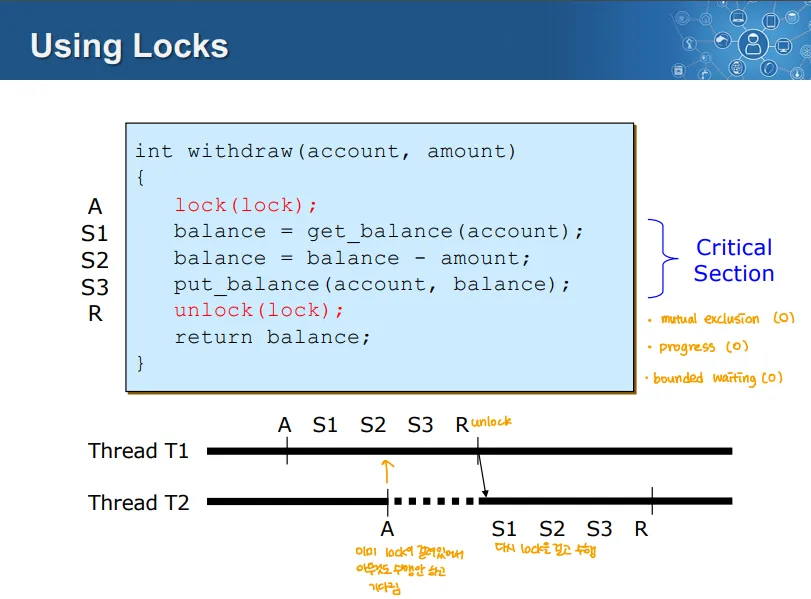

→ 위 코드를 T1, T2 스레드가 동시에 실행
→ S1, S2, S3는 Critical Section이므로, 진입 이전 lock(lock), 빠져나오고는 unlock(lock)을 함
→ T1이 A~R을 전부 수행하기 이전에 T2가 A(락 호출)을 수행했으므로 T1이 R(unlock)을 수행하기 전까지 대기

## Lock의 구현(Spin lock)
```c++
struct lock { int held = 0; }; // 0 = unlock, 1 = lock
void lock(struct lock *l) {
  while (l->held) ;
  l->held = 1;
}
void unlock(struct lock *l) {
  l->held = 0;
}
```

- lock의 상태를 가지는 구조체를 만들고 lock이 1이면 무한 반복으로 기다리게 됨
- 이때 락이 풀릴 때 까지 호출한 스레드는 무한반복을 돌며 바쁘게 대기
	-  **“busy wait”**하는 상태
- 무한 반복으로 돌면서 대기하기 때문에 **Spin Lock**

## Lock의 문제점

1. **Lock의 구현 자체가 Critical Section을 가지고 있음**
**⇒ 이걸 해결하기 위해서는 “All or nothing” 방식으로 Atomic하게 lock과 unlock을 구현**

### 해결 방법(→ Atomic Lock의 구현 방법)

1. SW적인 알고리즘 → 베우지 X
	- 단점 → 성능이 높지 않음
2. HW의 Atomic Instuction(원자적 하드웨어 명령어)
	- 한 클락에 수행되기 때문에 lock의 Critical Section이 일어나지 않음
3. Disable/Re-enable Interrupts
	- Interrrupt를 방지해서 문맥 전환을 막는 원리

### HW Atomic Lock 구현

1. test-and-set

	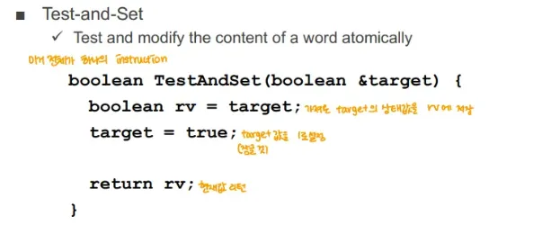

	→ 들어온 값을 1(true)로 세팅하는 원자적인 인스트럭션

	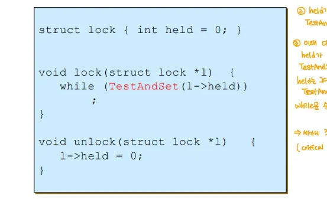

	→ 이렇게 원자적인 TestAndSet을 lock의 구현에 사용

2. compare-and-swap

	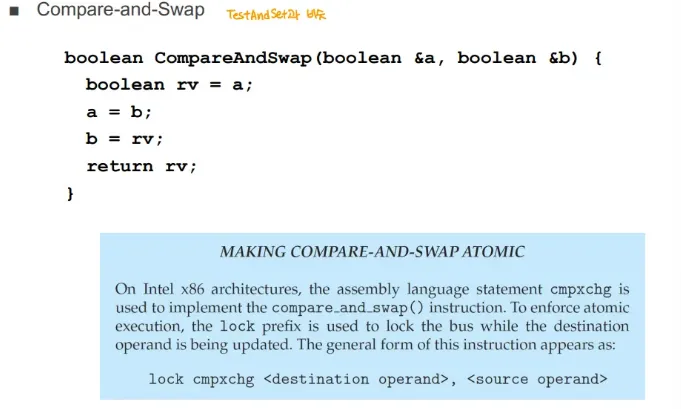

	→ TestAndSet을 개선한 버전
	
### HW instruction을 통한 Atomic Lock 구현 장점

- 기존 Spin Lock과 달리 Critical Section이 생기지 않음

### Spin Lock의 문제점
→ 위 HW 명령어로 구현한 락은 Spin Lock이므로 이 경우에 해당

1. 비 효율적인 방식
	- Spin lock의 경우 락을 기다리는 경우에도 CPU를 점유하게 됨, 따라서 CPU가 불필요하게 낭비
	- Critical Section이 긴 경우 계속해 Busy Waiting을 하면 대기, 더욱 CPU 사용 효율성이 떨어짐
	- Lock을 소유한 스레드가 다른 작업을 수행 or 인터럽트 가능성이 있을 때 Spin lock을 유지하면 데드락이나 성능저하 발생 가능
2. 스레드가 CPU를 양보할 때 락의 재획득 여부 같은 곳에서 신경쓸 게 많음
⇒ 효율적이지 못한 이유로 Spin lock을 직접 사용하기 보다 이를 활용해 고수준 동기화 툴을 만들고, 이를 활용
→ 유저 프로세스가 Spin lock을 쓸 수 있게 하면 CPU Utilization이 떨어지므로 이는 커널 모드에서만 사용할 수 있도록 함

### Disable, Re-enable Interrupts

- lock을 걸 때 cli(); 호출로 인터럽트 비활성화
- unlock할 때 sti(); 호출로 인터럽트 활성화
- 인터럽트를 비활성화 하면 Context Switch를 발생시키는 타이머 인터럽트 등이 차단

### Disable, Re-enable Interrupts 방식의 장점

- busy waiting이 발생하지 않음

###  Disable, Re-enable Interrupts 방식의 문제점

1. 커널에서만 사용 가능
2. Multiprocessor에서 사용하기 힘듬
3. Critical Section이 길면 주요한 이벤트를 놓치거나 지연시킬 수 있음
⇒ Spin Lock과 같이 고차원 동기화 툴 구현에만 사용

## Lock 구현 방식

### 1. 초기 시도
→ 원래의 락 → Critical Section이슈로 사용하지 않음

### 2. Interrupt 비활성화/활성화

- 단일 프로세서에서 사용하는 OS 레벨의 락

### 3. HW Atomic Lock

- 다중 프로세서에서 사용하는 OS 레벨의 락

# High-level Synchronization
**동기(high-level 동기화의 필요성)**

- Spin lock, Interrupt Disable은 짧고 간단한 Critical Sector에서 유용
	- 낭비가 발생하고 상호 배제(Mutual Exclusion)만 발생
	→ 긴 범위에 사용하면 Busy Waiting, 인터럽트 차단으로 인한 문제 발생
	→ 동기화 도구가 가져야 하는 요구조건 중 Mutula Exclusion만 함

- 그동안은 개발자가 응용 단에서 사용할 만한 동기화 도구가 없었음

### 2가지 고수준 동기화 도구 방식

1. 세마포어
2. 모니터
- 이러한 것들의 구현을 위해 여전히 Atomic Lock이 사용됨

# Semaphore

- 여러 프로세스나 스레드가 공유 자원에 접근할 수 있도록 제공되는 카운터
	→ 티켓과 같은 것(티켓 개수에 대한 값을 정수형으로 가짐)

- 0~N의 값을 가지는 카운팅 세마포어, 0~1의 값을 가지는 바이너리 세마포어가 있음
- 2가지 연산을 가짐
	1. Wait(or P연산) → 프로세스가 공유 자원을 사용하기 위해 대기
		→ 이때 사용하기 시작할 때 Semaphore 값을 1 감소
		→ 0이면 0보다 커질 때 까지 대기

	2. Signal(or V연산) → 자원을 사용한 후 신호를 보냄
		→ 전부 사용한 이후 Semaphore 값을 1 증가
			→ 티켓을 쓰고 반납하는 느낌

### 세마포어를 사용한 동기화 절차

1. 공유 자원을 사용하려는 프로세스가 세마포어 값을 확인
2. 세마포어 값이 양수(0이상)이면 프로세스는 자원을 이용 가능
	- 이때 프로세스는 세마포어 값 1 감소(자원을 하나 사용 중임을 나타냄)
	→ wait or P 연산

3. 세마포어 값이 0인 경우, 세마포어 값이 0보다 커질 때 까지 프로세스는 대기 상태로 들어감
	- 프로세스가 대기상태에서 깨어내면(세마포어 값이 0 이상이 되면) 2로 돌아감

## 세마포어의 사용

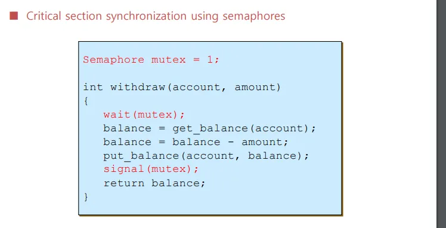

- mutex라는 세마포어 전역 변수를 만든 후
- wait(mutex)를 하면 정수 값을 1 감소(→티켓을 1 줄임)
	- 이때 mutex가 0이면 양수 값이 될 때 까지 대기
- 이후 signal(mutex)할 때 정수 값을 1 증가(→티켓을 다시 반납)

### 세마포어는 프로세스 사이 선후관계 조정에도 사용
→ 시간적 동기화(여러 프로세스의 실행 순서 보장)에 사용

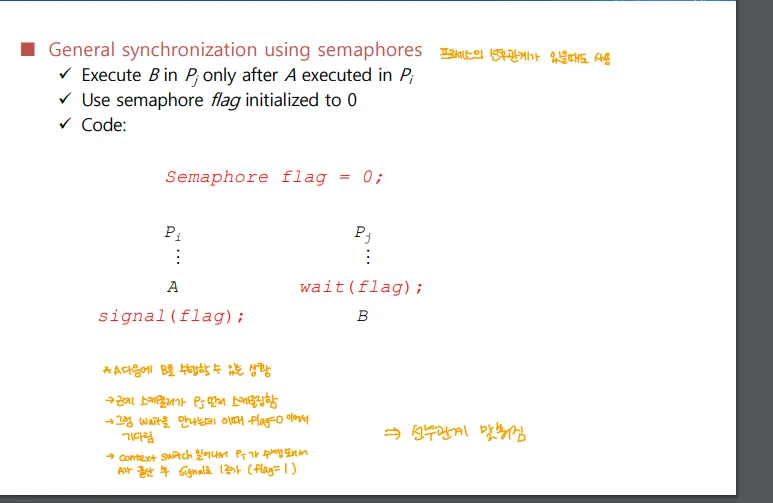

→ 이때 Pj에서 B작업이 실행되기 이전 반드시 Pi에서 A가 실행되어야 함
→ A작업 뒤에 Signal(flag)를 한 이후, B작업 앞에 Wait(flag)를 두어 A가 끝나지 않은 상태에서 B가 실행되지 않도록 함

## Mutex Lock(뮤텍스 락)

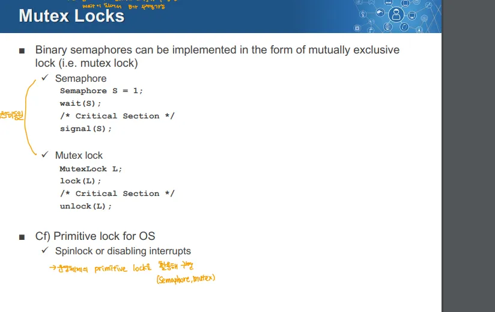

- 이진 세마포어를 Lock과 같은 형태로 만든 것
- Binary Semaphore를 통해 Critical Section을 보호
- 이 뮤택스 락과 Spin Lock, 인터럽트 비활성화는 다른 것
	- 뮤택스 락은 HIgh Level
	- Spin Lock, 인터럽트 비활성화는 Low level

## Semaphore의 2가지 형태

### 1. Binary Semaphore

- 0~1사이의 값을 가지는 세마포어
- 구현하기 쉬움

### 2. Counting Semaphore

- 0~n 사이의 제한되지 않은 값을 가지는 세마포어
- 카운팅 세마포어로 바이너리 세마포어를 구현 가능
	- n을 1로 하면 됨
**→ 사용 예시**

- 바이너리 세마포어는 Critical Section 보호에 Lock처럼 사용 가능
- n개의 프린터를 m개의 유저가 사용하는 경우 카운팅 세마포어를 통해 프린터가 사용 가능한 상태일 때만 유저가 사용하게 할 수 있음

## Semaphore 구현

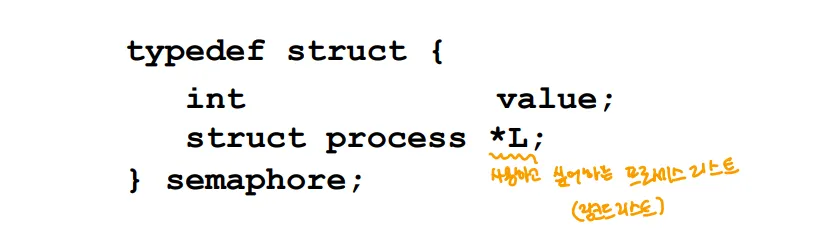

- value는 세마포어 값(정수 값, 티켓 수)
- \*L을 통해 공유 자원을 사용하고 싶어하는 프로세스들을 연결 리스트로 만들어 관리

### 세마포어의 2가지 주요 동작

1. Block → 세마포어 값이 0일 때 프로세스를 블록
2. wakeup(P) → 세마포어 값이 증가했을 때 연결 리스트의 프로세스 중 하나를 깨움

## No Busy Waiting
→ 아래는 프로세스가 세마포어를 사용하는 경우, 세마포어를 사용한 Wait

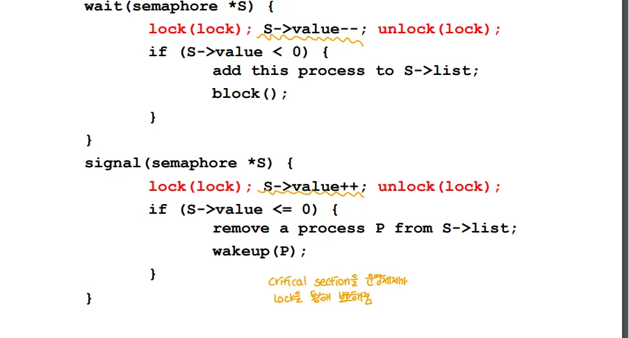

- 위의 함수들을 프로세스가 사용하게 됨
- 이때 Busy Waiting이 없음
- 공유 자원은 Semaphore 값은 OS레벨의 Lock으로 보호
	→ 이 OS Level의 Lock은 스핀락이거나 할 수 있음 but, 이건 응용 단과 무관하다 봄
	
# DeadLock and Starvation
→ 세마포어 사용 시 가능한 문제이므로 여기서 다루는 듯

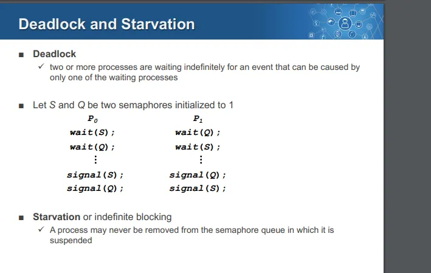

## 데드락

- 2개 이상의 프로세스가 서롤르 기다리며 무한히 대기하는 것
- 두 프로세스가 서로 필요한 자원을 가지고 있을 때, 상대방이 자원을 반환하지 않으면 영원히 대기를 함

### 예시
→ 위 그림의 P0, P1예시

1. P0가 wait(s)하고 문맥 전환
2. P1이 wait(q)하고 문맥 전환
3. P0가 wait(q) → 이때 대기, 문맥전환됨
4. P1이 wiat(s)를 하면 대기 → P0는 q를, p1은 s를 무기한으로 기다리는 상태

## Starvation(or Indefinite Blocking)

- 프로세스가 세마포어 큐에서 제거되지 않고 계속 실행이 지연되는 것

## 세마포어의 문제점

1. 버그가 있음 → 버그 유발이 가능
2. 사용하기 어려움 → 기존 Lock과는 사용법이 다름
3. 세마포어는 커널에서 관리되기 때문에 세마포어 사용 시 커널 오버헤드가 걸림
	- 이를 해결하기 위해 프로그래밍 언어 레벨에서 세마포어를 지원 
		→ 모니터, Critical Region이 있음 → 여기서는 Monitor만 배움

# Monitor

- 동시성 프로세스 사이 공유 데이터에 안전하게 접근하도록 프로그래밍 언어에서 지원하는 개념
	- 런타임에 컴파일러가 동기화 코드를 강제로 추가
	- 동시성 프로세스 사이에 하나의 공유 데이터를 공유할 때 발생 가능한 충돌을 방지

## 모니터의 구성 요소

1. 공유 데이터 구조 → 여러 프로세스가 동시에 접근 가능한 데이터 구조
2. Procedure → 공유 데이터에 대해 작동하는 함수, 메서드
3. Synchronization → 프로세스 간 동기화를 담당, 동시성 프로세스가 모니터 내의 절차를 호출할 때 Mutual Exclusion을 보장

## 모니터의 보호 기능

- 오직 Procedure를 통해서만 공유 데이터 구조에 접근할 수 있게 해서 비구조화된 방식으로 접근하는 것을 방지

## 모니터 예시(Java)

- Java에서는 synchronized 키워드를 통해 모니터가 구현

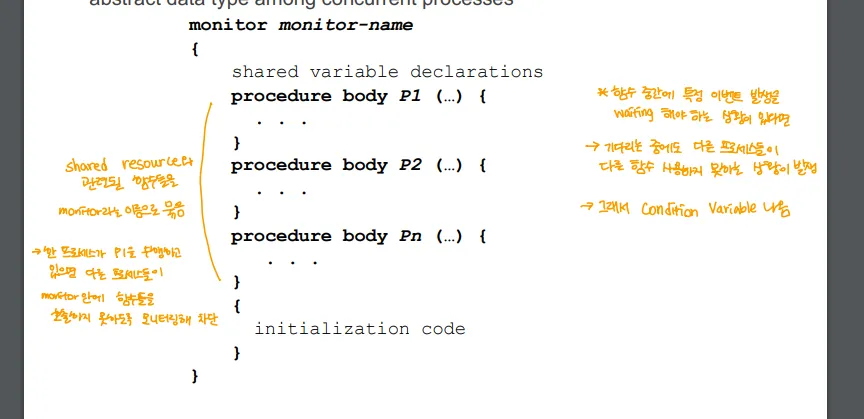

- Monitor 블록에서 여러 Procedure들을 묶어 놓음
	- **한 프로세스가 프로시저들을 사용하고 있으면 다른 프로세스들은 Monitor안에 프로시저들을 호출하지 못하도록 모니터링해서 차단**

## 모니터의 동작 흐름

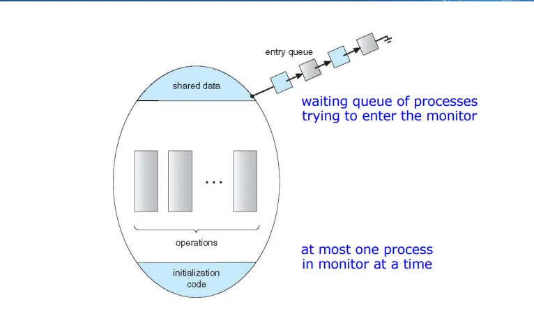

- 모니터 안에서는 한 번에 하나의 프로세스만 실행 가능
	→ 공유자원 접근 위해서는 모니터의 프로시저를 써야하는데, 다른 프로세스들은 모니터의 프로시저 사용할 수 없음 → 이렇게 동기화 문제 해결

1. Entry Queue
	- 모니터에 들어가려고 하는 프로세스들의 대기 큐
2. Share Data and Operation
	- 모니터 내부에서 공유 데이터와 관련된 여러 작업이 실행
	- 이 작업들은 상호 배제를 보장, 여러 프로세스가 동시에 모니터에 접근 못하게 함

# Conditional Variable

## Conditional Variable의 필요성
→ 모니터의 경우 특정 조건이 될 때 까지 스레드를 효율적으로 기다리게 하는 것

	- 실행에 앞서 어떤 자원이 준비된다거나 하는 조건이 있는 경우, 모니터는 계속 이 자원의 준비를 기다림 → 이때 다른 프로세스들이 실행 불가
	- 이러한 문제 해결 위한 방법이 Conditional Variable

## Conditional Variable이란

- 모니터 내부에서 이벤트를 기다리는 프로세스를 위한 기다림 지점을 제공
	- Ex) 프로세스가 특정 조건의 충족까지 기대려야하는 경우 조건변수를 사용해 대기

## Conditional Variable의 사용

- wait과 signal
- x.wait() → 특정 프로세스가 조건을 기다리기 위한 중단 상태에 들어가는 것
	- 대기 상태로 진입, 다른 프로세스가 x.signal()을 호출할 떄 까지 대기
- x.signal() → 대기 연산에 있는 프로세스를 하나 때워서 실행을 재개

## Conditional Variable사용 모니터

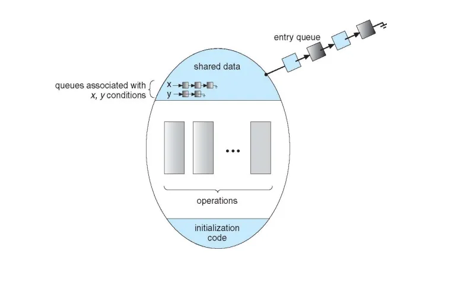

→ X, Y는 x,y조건의 대기열(이는 conditional variable로 사용)

# Conditional Variable과 세마포어 비교
→ 이 둘은 굉장히 유사

## Conditional Varaible

- History가 없음
- signal 호출 시 대기 중인 프로세스가 없으면 아무 일도 일어나지 않음
	→ 세마포어의 티켓 값이 초기 설정한 최대 값을 넘을 수 없음

## Semaphore

- History가 있음
- Signal호출 시 대기 중인 프로세스가 없으면 세마포어 값이 증가
	→ 초기 설정한 최대 티켓 값보다 더 큰 값을 가질 수 있음
