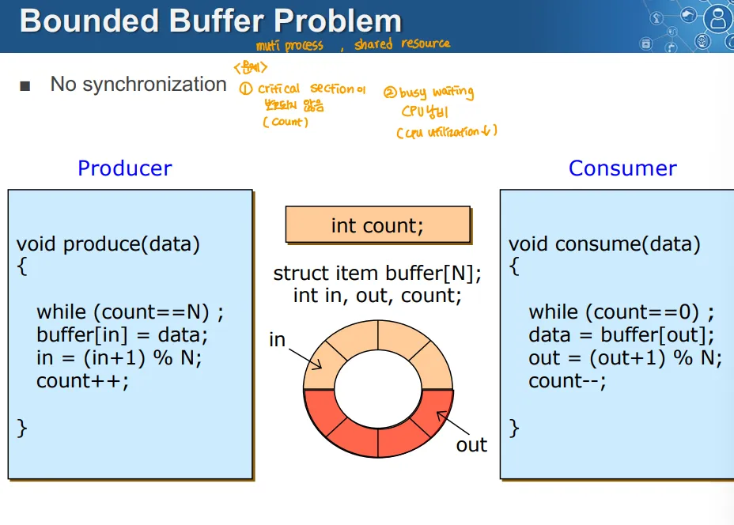
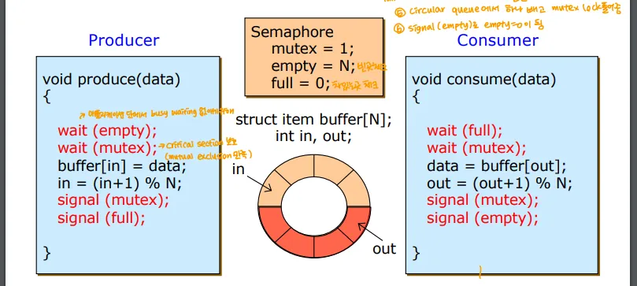
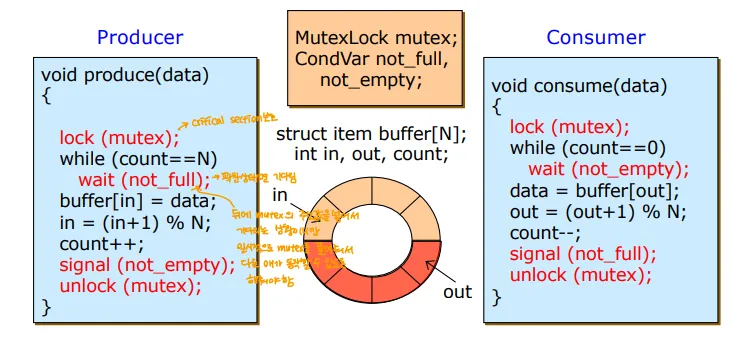
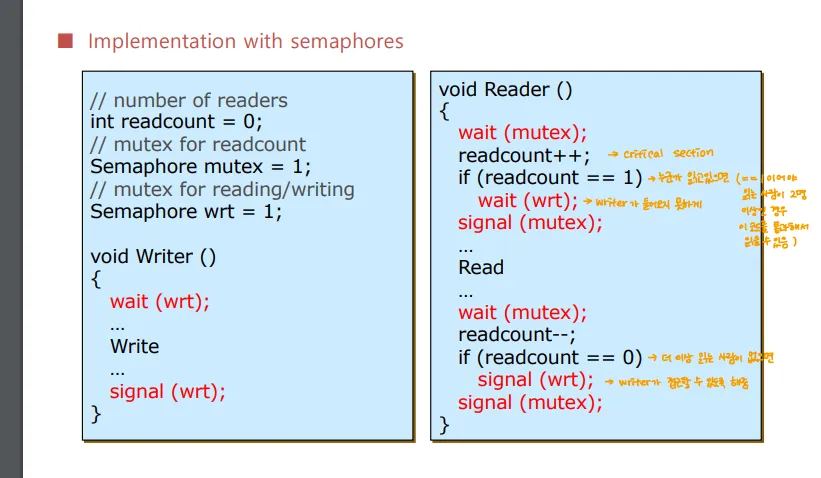
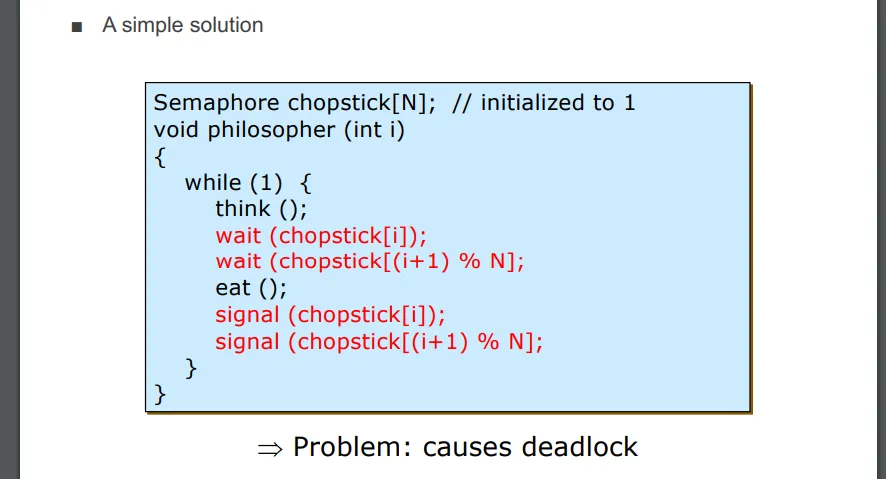
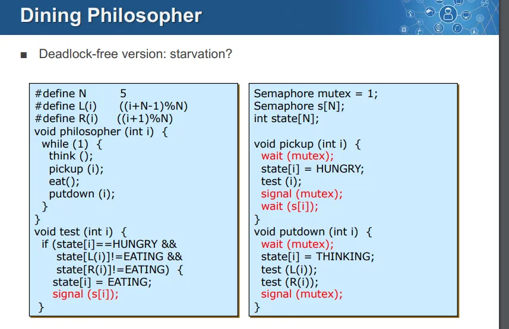
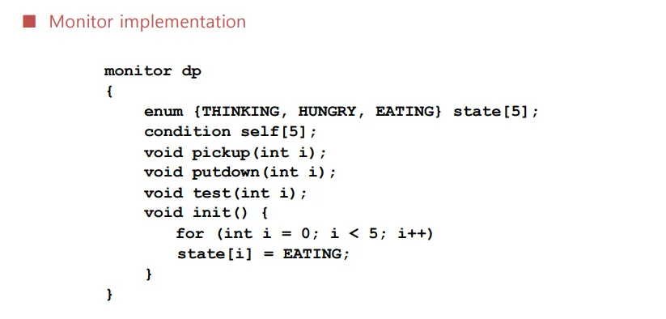
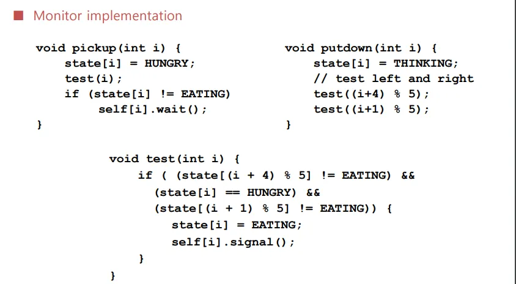

> 원본 Notion 정리 — 강의 슬라이드/설명.
> [← 전체 목차](/posts/학교공부/운영체제/목차/)

→ 여러 동기화 문제 예시를 봄
***

# 3가지 동기화 문제 예제

1. Bounded Buffer Problem
2. Readers and Writers Problem
3. Dining-Philosophers Problem

# Bounded Buffer Problem
→ 1) 동기화 없는 버전 2) 세마포어 사용 3) 뮤택스+Conditional Variable

## 1. 동기화 없는 버전

**count는 버퍼에 들어있는 데이터의 수를 나타내는 공유 자원**

### Producer

- count == N ⇒ 꽉 차있는 상태면 무한 반복
- 버퍼의 in 자리에 값을 넣은 후 in에 +1을 하고 N을 모듈러 연산
- count 에 +1을 함

### Consumer

- count == 0 ⇒ 비어있는 상태면 무한 반복
- 데이터를 buffer의 out자리에서 빼낸 후, out에 +1을 하고 N을 모듈러 연산
- count에 -1을 함

### 문제점

- 별도의 동기화 처리를 하지 않았기 때문에 Producer와 Consumer가 동시에 데이터에 접근할 때 Race Condition이 발생 가능
	- count에 대해 문제가 생김

## 세마포어를 사용한 구현

### Semaphore 구현

- mutex → 바이너리 세마포어, Producer와 Consumer가 동시에 접근하지 못하게 Mutual Exclusion을 보장
- empty → 버퍼의 비어있는 공간 수를 추적하는 카운팅 세마포어
- full → 버퍼의 채워진 데이터를 추적하는 세마포어

### Producer

- wait(empty)로 빈 공간이 있는지 확인 → empty값이 0(=빈 공간이 없으면) 대기
- wait(mutex)로 상호 배제를 보장 → 데이터에 버퍼를 추가한 후 signal(mutex)로 뮤택스를 해제
- 작업을 마친 후 signal(full)로 Consumer가 데이터를 소비할 수 있도록 함

### Consumer

- wait(full)로 버퍼에 데이터가 있는지 확인 → full값이 0(=데이터가 없으면) 대기
- wait(mutex)로 상호 배제를 보장한 후 데이터를 소비, 이후 signal(mutex)로 뮤텍스 해제
- signal(empty)를 호출해 Producer가 데이터를 넣을 수 있게 함
⇒ Race Condition 해결

### 뮤택스 + Conditional Variable을 사용한 구현

### MutexLock 

- Producer, Consmer가 버퍼에 접근할 때 상호 배제 보장

### Conditional Variable

- not_full → 버퍼가 가득 찼을 때 Producer가 대기하는 조건변수
- not_empty → 버퍼가 비었을 때, Consumer가 대기하는 조건변수

### Producer

- lock(mutex)로 상호 배제 보장
- count == N이면 wait(not_full)에서 대기
- 버퍼에 데이터 추가한 후, signal(not_empty)로 소비자가 데이터를 소비할 수 있도록 신호를 보냄
- 작업이 끝나면 unlock(mutex)로 뮤택스 해제

### Consumer

- lock(mutex)로 상호 배제 보장
- 버퍼가 비어있으면 wait(not_empty)에서 대기
- 데이터 소비한 후 signal(not_full)로 Producer가 데이터를 더 추가할 수 있도록 신호를 보냄
- 작업 끝나면 unlock(mutex)로 뮤택스 해제
→ 이거 wait에서 while사용하는 이유가 있음

# Readers-Writers Problem

- 여러 스레드가 하나의 객체를 공유하며 일부 스레드는 그 객체를 읽기만 하고, 나머지 스레드는 쓰기 작업을 수행
- 이때 읽기 작업은 동시에 다수가 할 수 있지만, 쓰기 작업은 단독으로 실행되어야 함
- 2가지 경우가 있음
	1. 읽기 우선 → 여러 Reader가 있을 때는 Writer가 기다리더라도 읽기 작업을 계속 진행 가능
	2. 쓰기 우선 → Writer가 준비되면, 즉시 쓰기 작업을 수행하고 나머지 작업은 잠시 대기

## 세마포어를 이용한 구현 → 읽기 우선 경우

**readcount → 데이터를 읽고 있는 스레드의 수 → 일종의 공유자원**

### 세마포어

1. mutex → readcount를 수정할 때 상호 배제를 보장하는 뮤택스(이진 세마포어)
2. wrt → 읽기 및 쓰기 작업을 제어하는 뮤택스(이진 세마포어)

### Writer

- wait(wrt)를 호출해 쓰기 작업을 독점
- 쓰기가 완료되면 signal(wrt)를 호출해 다른 작업을 허용

### Reader

- wait(mutex)로 readcount를 안전하게 수정
- readcount == 1인 경우 Writer가 작업 중인지 확인하기 위해 wait(wrt)를 호출해 쓰기 작업 차단
	- 읽기 우선이므로 첫 번째 reader가 들어오면 Writer를 차단
- 읽기 작업 도중에는 mutex를 사용하지 않음 → 다수가 가능
- 읽기 작업을 마치면 wait(mutex)로 readcount를 안전하게 수정
- 이후 readcount == 0인 경우 signal(wrt)로 쓰기 작업을 할 수 있게 함

### 추가 설명

1. Writer가 작업 중(wait(wrt) ~ signal(wrt)
	- 첫 번째 Reader는 wrt에서 대기
		- 이때 다른 Reader들은 mutex에서 대기하게 됨(첫 번째 Reader가 mutex 구간 안에서 wrt를 대기 중)
2. writer가 종료되면 모든 Reader가 진입 가능
3. 마지막 Reader가 나갈 때 Writer에게 신호를 보냄
	- 마지막 Reader가 나라 때 signal(wrt)로 Writer에게 작업할 수 있게 허용
4. Writer가 종료되면, Reader, Writer가 모두 대기 중일 때 누가 먼저 실행될지는 스케줄러에 의해 결정
⇒ 만일 Writer가 작업 중일 때 첫 번째 reader는 wait(wrt)로 대기하게 됨
⇒ readcount가 1이 아닐 때(첫 번째 reader가 아닐때) 
	→ 첫 번째 reader가 wait(wrt)를 해서 writer는 작업을 하려고 해도 대기 중
	→ 이때 2번째 reader부터는 wait(wrt)를 하지 않아 그냥 진입 가능

- 읽기 우선
	- 이미 리더가 읽는 중일 때는 다른 리더들이 진입 가능
	- 라이터가 작업 중일 때는 리더 진입 불가

# Dining Philosopher

- 각 철학자 사이에 젓가락 1개(한 쌍 아님)가 있음, 2개가 있어야 밥을 먹을 수 있음
	- 철학자는 생각하기→밥먹기→2개의 젓가락을 들기 →먹기 만 반복
	- 왼쪽과 오른쪽의 젓가락을 집어야 식사 가능
- 동기화, 데드락에 대한 문제
- 공유 자원을 젓가락으로 둘 수도, 철학자의 상태로 둘 수도 있음

## 1. 단순 해결책

### 공유 자원

- ** chopstick 배열로 구현**

### 철학자 구현 방식

1. wait(chopstick[i]). wait(chopstick[(i+1)%N])으로 왼쪽 오른쪽의 chopstick을 점유
2. 먹기
3. 먹기 작업 후 signal(chopstick[i]); signal(chopstick[(i+1)%N]); 으로 다른 철학자들이 사용할 수 있도록 함(대기하는 다른 철학자를 동작시킴)

### 문제

- **모든 철학자들이 동시에 왼쪽 젓가락을 집으면 모두가 오른쪽 젓가락을 기다리게 됨 ⇒ 데드락이 발생**
- 젓가락을 공유 자원으로 두면 무조건 데드락 발생 확률 생김

## 2. Deadlock-free version

### 공유 자원

- 철학자의 상태를 공유자원 → state 배열로 구현

### 세마포어

- mutex → 상태 보호용 이진 세마포어
- s[N] → 각 철학자의 상태 대기 세마포어

### 전역변수 
→ 왼쪽 오른쪽 철학자 인덱스는 전처리 L(i), R(i)에 할당

- state[N] → 각 철학자의 상태(Thinking, HUNGRY, EATING)

### 철학자 구현 방식

- 철학자는 think → pickup → eat → putdown을 계속 반복
**pickup 함수**

- wait(mutex)로 상태 변경 이전 뮤택스 잠금
- state[i] = HUNGRY → 철학자를 배고픈 상태로 변경
- test(i); → 젓가락을 들 수 있는지 확인
- signal(mutex) → 뮤택스 해제
- wait(s[i]); → 젓가락을 들 수 있을 때 까지 대기
**putdown 함수**

- wait(mutex) → 상태 변경 위해 뮤택스 잠금
- 철학자 생각 상태로 변경
- test(L(i)), test(R(i))로 왼쪽 오른쪽 철학자가 배고프면 젓가락 줄 수 있는지 테스트
- signal(mutex) → 뮤택스 해제
**test 함수**

- 내 상태가 HUNGRY, 양옆에 EATING 상태가 아닐 때 
	- 철학자의 상태를 Eating으로
	- signal(s[i]) → 식사를 허용하는 신호

### 작동 방식

1. 철학자가 젓가락 들기 위해 pickup 함수 호출 → 해당 철학자 상태 HUNGRY로 변경
2. 이후 pickup 내부에서 test함수가 호출되어 좌우 철학자들이 식사 중인지 아닌지 확인한 후 젓가락을 사용할 수 있으면 EATING 상태로 변경하고 식사 시작
3. putdown 함수는 철학자가 식사를 끝내고 젓가락을 내려놓을 때 호출, 좌우 철학자에게 젓가락을 사용할 수 있는지 테스트
	- putdown이 test를 호출하고, test가 signal(R(i)), signal(L(i))를 호출해 식사의 기회를 줌

### 장점

- 철학자가 양쪽 젓가락을 모두 쓸 수 있을 때만 식사를 시작하므로 데드락을 방지

### 문제점

- Starvation 문제 해결 X → 특정 철학자가 계속해 젓가락을 들지 못할 가능성 있음

## 모니터 사용 구현 → 철학자의 상태를 공유자원으로

### 모니터

- state[5] 배열 → 철학자의 상태를 나타내는 enum 배열
- self[5] → Conditional Variable 조건 배열
	- 각 철학자가 젓가락을 집거나 놓을 때 대기할 수 있는 Conditional Variable
- 그 외는 공유 자원에 접근하는 프로시저

### 프로시저 구현

1. **pickup(int i)**
	- 젓가락을 집을 때
	1. 철학자는 배고픈 상태가 됨
	2. test(i) → 좌우 철학자가 식사중인지 확인해 젓가락 들수 있는지 확인
	3. if(state[i] ≠ EATING) → 이때 self[i]에서 대기
2. **putdown(int i)**
	- 젓가락을 놓을 때
	1. 철학자의 상태는 생각 중으로 변경
	2. 좌우 철학자가 배고픈 상태인지 확인해 젓가락을 쓸 수 있는지 테스트
		- 이를 통해 좌우 철학자가 바로 wait을 풀고 식사를 할 수 있게함
3. test(int i)
	- 자신이 hungry고 좌우 철학자가 식사 중 상태가 아니면 철학자는 젓가락을 들 수 있음, 
		- 자신의 상태를 EATING으로 변경
		- 철학자 자신에게 식사를 허용하는 신호 보내기

### 장점

- 이 형태의 구현은 교착 상태와 기아 상태 모두 방지 가능

# 현실 세계의 동기화 도구

## 1. POSIX synchronization 

- POSIX semaphores
- POSIX mutex locks
- POSIX condition variable

## 2. Java 동기화

- 모니터 → synchronized라는 이름으로 제공

## 3. C/C++/Java

- 세마포어
- 뮤택스+Conditional Variable
