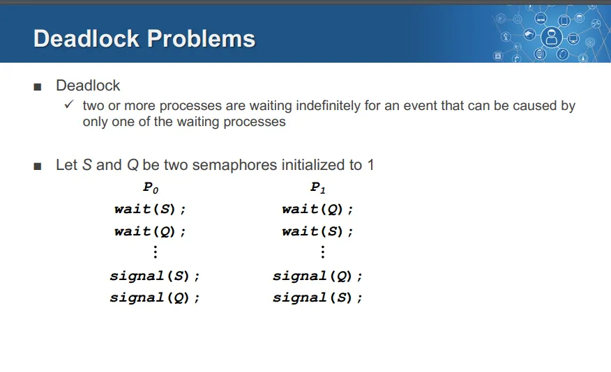
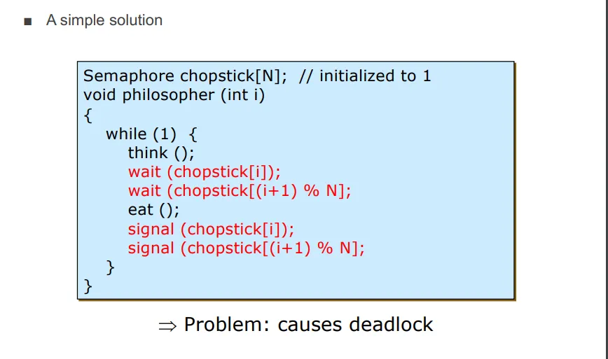
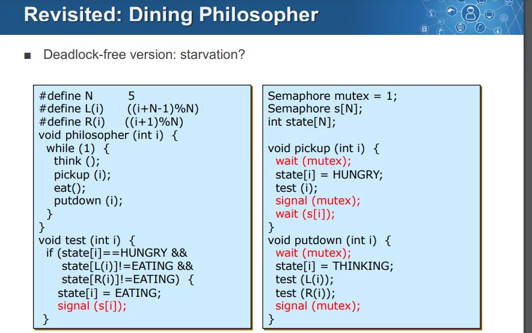

> 원본 Notion 정리 — 강의 슬라이드/설명.
***

# Deadlock Problem

## Deadlock

- 두 개 이상의 프로세스가 서로 상대방이 가진 자원을 기다리며 무한정 대기하게 되는 상태를 의미
= 두 개 이상의 프로세스가 상대방 프로세스에 의해 발생해야 하는 이벤트를 기다리며 무한정 대기하는 상태
→ 위 코드에서는 P0과 P1에서 쓰인 두 가지 세마포어가 모두 1로 초기화되어있어 데드락 발생

# Deadlock Chracterization

- 데드락은 총 4가지의 조건이 모두 동시에 충족되어야지 발생

## 1. Mutual Exclusion

- 오직 한 번에 한 프로세스만 자원을 사용 가능

## 2. Hold and wait

- 한 프로세스가 자원을 점유한 상태로 다른 자원을 추가로 요청하며 기다리는 상황
	- 이 자원은 다른 프로세스에 의해 점유되어있기 때문에 대기하는 상황이 됨

## 3. No preemtion

- 점유된 자원은 프로세스가 작업을 마친 후 자발적으로 내려놓을 때만 해제될 수 있는 것
- 다른 프로세스가 강제로 자원을 해제시켜 사용할 수 없는 상황

## 4. Circular wait 

- 프로세스 사이 순환적인 자원 대기 관계가 존재하는 상황
- 프로세스들이 원형 고리처럼 서로의 자원을 사용하기 위해 기다리는 상황
→ P0 → P1 → P2 → P0 의 형태로 자원 요청을 하는 경우를 말함

# Handling Deadlock

- 데드락을 처리하는 방법 4가지

## 1. Deadlock Prevention(데드락 방지)

- 데드락이 발생하지 않도록 미리 설계 단계에서 방지하는 방법
- 데드락을 발생시키는 4가지 조건 중 하나라도 만족하지 않게 보장하는 것
→ 문제 발생 이전에 하는 것, 개발자가 주로 담당

## 2. Deadlock Avoidance(데드락 회피)

- 자원 할당 시점에 데드락이 발생할 가능성이 있는지 미리 예측해 자원 요청을 승인하거나 거절하는 방법
- 문제점
	- 커널 레벨에서 코드 분석을 전부 해야하므로 커널 오버헤드 증가

## 3. Deadlock detection and recovery(데드락 탐지 및 복구)

- 데드락을 허용하고 이를 탐지해 해결하는 방법
- 문제점
	- 프로세스를 찾는 리소스, 데드락을 해결하는 리소스가 사용됨

## 4. Deadlock ignorance(데드락 무시)

- 데드락을 무시하는 방식
- ex) Ostrich(타조) algorithm → 문제를 무시하면 없는 것과 같다

# Dining Philosopher 문제 예시

## 기존 방식

- 젓가락 자체가 Mutual Excusive한 공유 자원
- 코드 자체가 No Preemption이라 가정
- 한 철학자가 자신의 젓가락을 잡고 다른 젓가락을 사용하려고 대기
- 각 철학자가 순환적으로 각자가 점유한 젓가락을 대기
⇒ 데드락 발생

## 해결 방법

- 상태 기반의 해결 방법으로 데드락 문제 해결
- but, 특정 철학자가 계속 대기하는 Starvation문제는 여전히 발생 가능
