> Notion 원본 페이지의 강의 슬라이드와 설명을 바탕으로 정리한 노트입니다.
***

# Memory Management

## 메모리 관리의 목적

1. 프로그래밍을 위한 편리한 추상화를 제공하기 위해
2. 경쟁적인 프로세스 사이에서 적은 오버헤드로 성능을 최적화하며 부족한 메모리를 할당하기 위해
3. 프로세스 사이에 고립을 제공하기 위해

## 배치 프로그래밍 시스템

- 프로그램들이 메모리를 물리적인 주소로 직접 사용
	→ 별도 메모리 관리가 필요하지 않음

- OS는 작업을 로드하고 실행하고 언로드하는 것만을 반복

## 멀티프로그래밍 시스템

- 한번에 여러 프로세스가 메모리에 존재하는 상황
	- CPU, I/O를 동시에 수행 
	→ 메모리 관리의 필요성이 생김
	→ 각 프로세스마다 메모리는 다 고립시켜서 해당 프로세스만 사용할 수 있는 메모리를 모두 할당해줘야 함

- 다양한 방법으로 구현이 가능
	- 고정 파티셔닝, 가변 파티셔닝, 페이징, 세그멘테이션

### 멀티프로그래밍 시스템에서의 메모리 관리 요구조건

1. Protection(보호)
	- 각 프로세스가 자신만의 메모리 영역을 사용할 수 있도록 보호
	- 다른 프로세스의 메모리 공간에 접근하지 못하도록 보호하는 기능이 필수
2. Fast Translation(빠른 변환)
	- 메모리 주소를 변환하는 과정이 빠르게 수행되어야 함
	- 주소를 번역하는 과정이 포함되어도 성능 저하는 최소화되어야 함
3. Fast Context Switching(빠른 컨텍스트 스위칭)
	- 프로세스 간 Context Switch시 메모리의 내용들이 빠르게 변경되어야 함

## 메모리 관리의 이슈

### 1. Support for Multiple Processes
→다중 프로세스 지원

- 논리적으로 연속된 공간 제공 필요
	→ 각 프로세스는 물리적으로 연속적일 필요는 없지만 논리적으로 연속된 공간을 가져야 함(연속적으로 보여야 함?)

- 각 공간의 크기가 변동 가능해야함
	→ 프로세스마다 필요한 메모리 크기가 다르기 때문에 크기를 유연하게 할당 가능해야 함

### 2. Enable a Process to Be Larger Than the Amount of Memory Allocated to it
→ 프로세스가 할당된 메모리보다 더 커질 수 있게 하기

- 프로세스가 실행될 때 프로세스에 할당된 모든 메모리를 한꺼번에 사용하는 것은 아님
	→ 프로세스는 특정 시점에 필요한 데이터만을 메모리 공간에 올려놓고 사용 → 일부만 있어도 작업 처리가 가능

- 메모리 참조는 Temporal, Spacial Locality를 보임
	→ 일부만 올라올 때 Locality를 살려야 함

### 3. Protection

- 각 프로세스의 메모리 공간의 독립성을 보호

### 4. Sharing

- 서로 협력하는 프로세스 사이 메모리 공유를 지원

### 5. Support for Multiple Regions per Process(segments)
→ 프로세스 내부 다중 영역 지원

- 하나의 프로세스가 차지하는 메모리 공간 내부에 코드, 데이터 세그먼트, 스택, 힙 등 각 메모리 영역을 가질 수 있음

### 6. Performance

- Memory Reference Overhead(메모리 참조 오버헤드)
	- 메모리 관리 기능이 많으면 메모리 접근 속도가 느려질 수 있음
	→ 그냥 물리 주소를 사용하는 것보다 가상 주소 사용이 더 오래걸림

- Context Switching Overhead(문맥 전환 오버헤드)
	- 프로세스 간 전환 시 메모리 상태 저장 및 복원 작업이 필요하므로 성능에 영향을 미침

## 해결 방법: Virtual Memory
→ 실제 물리 메모리보다 더 큰 논리적 메모리 공간을 제공하는 방법
	→ 물리 메모리와 논리적 메모리를 분리시키는 것이 핵심

### 특징

1. 가상 메모리는 프로그램이 전체 주소 공간을 물리적 메모리에 상주시키지 않고 실행될 수 있게 함
	- 프로그램은 그것이 실제 필요로 하는 것보다 적은 양의 메모리로 실행 가능
2. 프로그램의 코드나 데이터가 한 번에 사용되지 않음
	- ex) 실행되지 않는 분기, 절대 read, write되지 않는 데이터
	- 사용되지 않는 것들을 메모리에 할당힐 필요는 없음
		- 운영체제는 프로세스의 런타임의 동작에 따라 할당된 양을 조절
3. 가상 메모리는 프로세스 사이 메모리 공간을 고립시킴
	- 한 프로세스는 다른 프로세스에서 볼 수 있는 주소에 접근하지 못함
	- 각 프로세스는 자신만의 고립된 주소 공간을 가짐
***

# Binding of Instruction and Data to Memory

- 프로그램의 명령어와 데이터가 어떤 메모리 주소에 할당될지 결정하는 과정
- 3가지 단계에서 binding이 가능
	1. compile time에
	2. load time에 → 메모리로 로드하는 타임에
	3. execution time에 

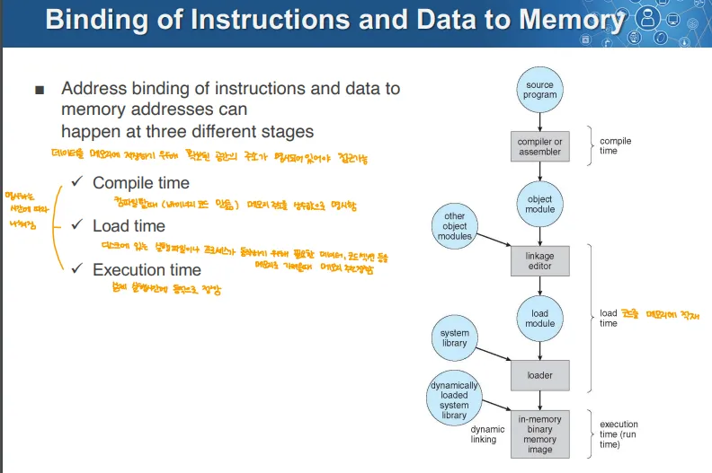

→ 이 사진에서

	1. compiler or assembler 단계가 컴파일 타임
	2. linking과 loader 단계가 로드 타임
	3. in-memory binary image가 실행 타임

## Compile Time

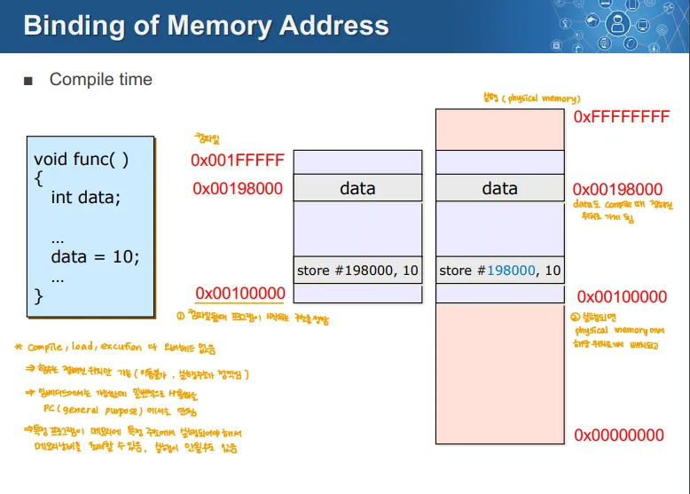

→ 가운데 블록은 컴파일되어 디스크에 들어있는 상태
	→ 메모리로 올라간 상태에서도 동일한 주소를 참조
		→ 위 사진의 데이터, 명령 모두 컴파일 타임에 정해진 것과 동일한 메모리 주소를 할당
		→ 둘 다 0x00100000임

- 컴파일 타임에 주소를 바인딩 하면 절대적인주소로 할당
	- 이 고정된 주소에 따라 메모리에 할당
- 장점
	- 로드, 실행 단계에서 별도 오버헤드가 없음
- 단점
	- 해당 공간을 다른 프로세스가 사용하고 있으면 프로그램 실행이 불가능
		- 절대적으로 할당된 메모리 주소를 변경하려면 다시 컴파일 해야함
	- 주소를 컴파일 시간에 정해야 하므로 컴파일 오버헤드가 증가할 수 있음

## Load Time

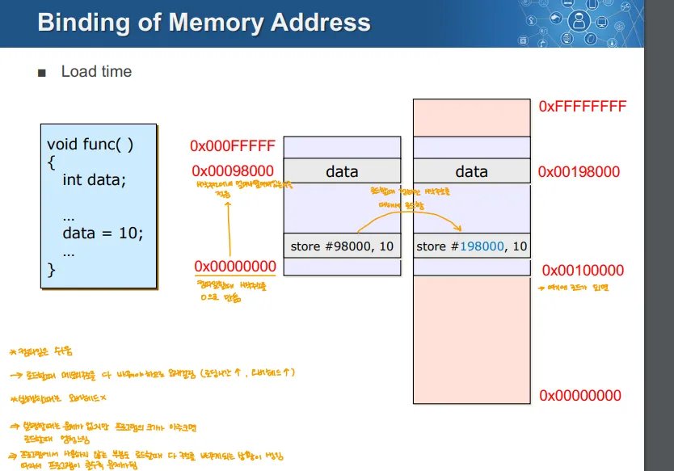

→ 이 사진에서 프로그램이 디스크에 있을 때는 실제 메모리와 무관하게 0x00000000에서 시작, 순서대로 쌓아 올림
	→ 실제 메모리에서 시작 지점이 0x00100000이므로, 디스크에 있을 때 0x00098000인 데이터가 실제 메모리에서 0x00198000으로 할당

- 컴파일 단계에서 실제 메모리 주소와는 무관하게 기준점을 잡고 메모리 주소를 할당
- load time에 이 주소를 프로그램이 로드되는 메모리 위치에 따라 실제 메모리 주소로 바인딩
	- 실행 중에는 주소가 고정되어 변하지 않음
- 장점
	- 실행 환경에 따라 다양한 위치에 프로그램을 로드할 수 있어 기존 프로세스와 겹쳐 실행 불가능한 문제가 사라짐
	- 실행 단계의 오버헤드가 없음, 컴파일 타임이 짦아짐
- 문제점
	- 메모리 주소를 실제 메모리 주소로 바인딩 하는 과정으로 인해 로드 타임이 길어짐

## Execution Time

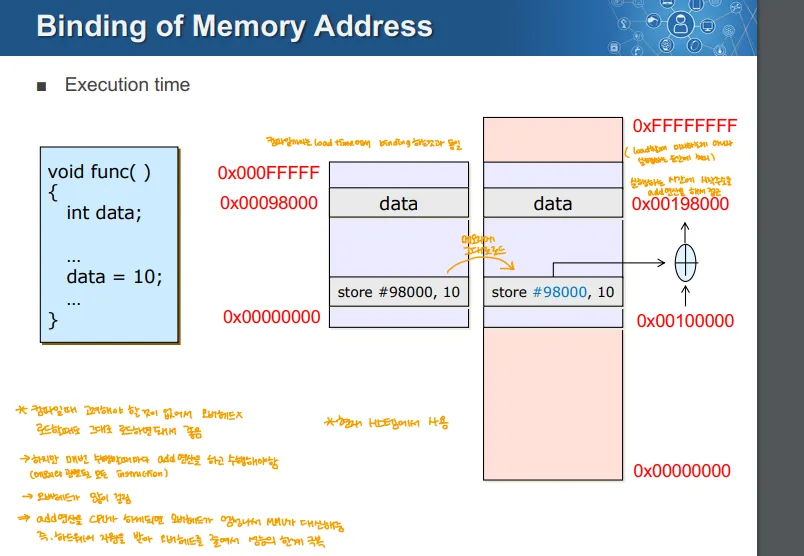

- 컴파일 단계에서 실제 메모리 주소와는 무관하게 기준점을 잡고 메모리 주소를 할당
- 프로그램이 실행되는 동안 메모리 주소를 동적으로 결정
	- 매 명령을 수행할 때 실제 메모리 주소로 할당해서 수행
- 로드 타임에 실제 메모리 주소로 바꾸지 않음
- 장점
	- 로드타임과 같이 절대적인 주소 사용으로 인한 문제가 없음
	- 컴파일, 로드 단계의 오버헤드가 없음
- 문제점
	- 매 명령을 수행할 때 마다 CPU에서 메모리를 할당하는 연산을 수행
		- 따라서 실행 오버헤드가 커짐
- 해결 방법
	- 매번 수행하는 주소 할당 연산을 하는 하드웨어를 사용 → MMU
→ 실제로 사용하는 것은 Execution Time의 방법

## Virtual Memory의 주소 매핑

### 주소 매핑 과정

1. CPU가 논리적 주소를 참조
2. MMU가 주소를 물리적 주소로 변환
3. 메모리가 부족해지면 사용하지 않는 페이지를 디스크(Swap)으로 이동(swap out)하고 필요하면 Swap in함
***

# Memory Management Unit(MMU)
→ 피지컬 메모리 → 실제 메모리
→ 로지컬 메모리 → 사용이 편하도록 할당하는 메모리 주소
	→ 각 프로세스마다 0번지부터 프로세스의 필요최대 번지까지 다 사용하는 것으로 가정됨

- 논리적 주소를 물리적 주소로 바꿔주는 하드웨어 장치
	- CPU안에서 논리적 메모리 주소를 물리적 주소로 바꿔줌
- 유저 프로그램은 논리적 주소를 다룸
	- 유저 프로그램은 절대 물리적 주소를 다루지 않음

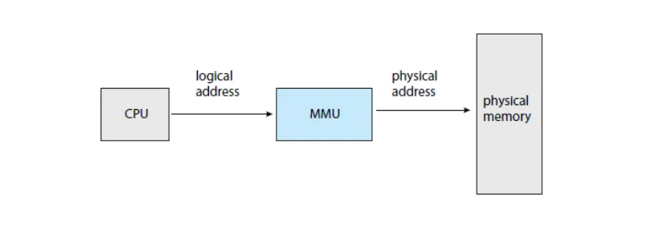

## Logical Address Space

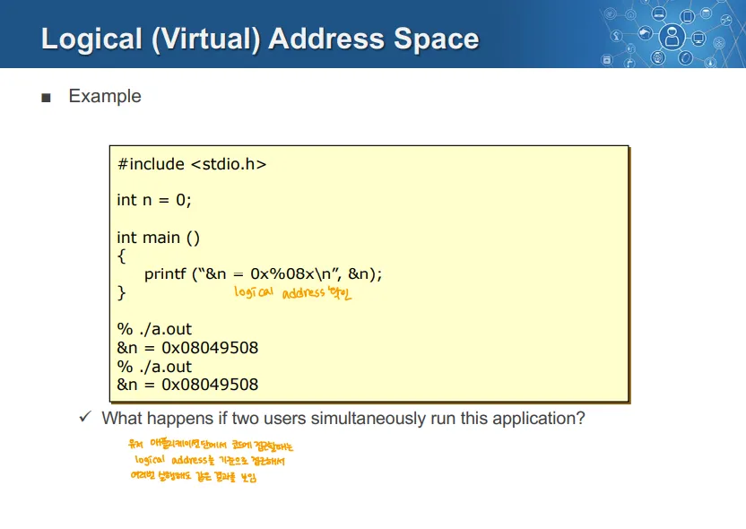

- 위 그림은 코드를 짜서 2번 실행하는 예시
	- 해당 코드는 자신의 주소를 출력하는 코드
- 이렇게 2번 실행 시 동일한 주소가 나옴
	- 각 프로세스의 논리적 주소를 보여주기 때문
	- 동일한 프로그램은 각 프로세스의 독립적인 논리적 주소 공간에서 동일하게 할당됨
***

# Contiguous Allocation

- 프로세스가 실행될 때 논리적으로 연속된 메모리 공간과 물리적으로 연속된 메모리 공간을 사용하는 방식
- 프로세스가 차지하는 logical 메모리 공간을 그대로 physical 메모리 공간으로 연속적으로 할당

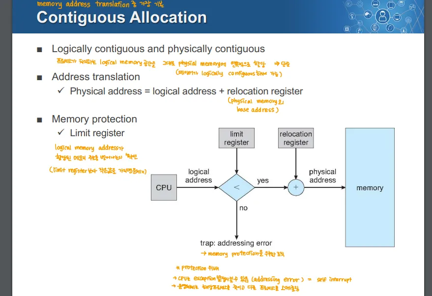

## 주소 변환

- PhysicalAddress = LogicalAddress + RelocationRegister
	- 물리적 주소로 변환될 떄 논리적 주소 + relocation 레지스터의 값으로 변환
	- relocation register의 값은 프로세스가 차지하는 물리 메모리의 base address

## Memory Protection

- limit register로 논리적 주소가 허용된 범위를 초과하지 않도록 제어
	- 논리적 주소가 limit register를 초과하면 주소 참조 오류가 발생
		- 이를 방지하기 위해 인터럽트를 호출해 addressing error 예외를 발생

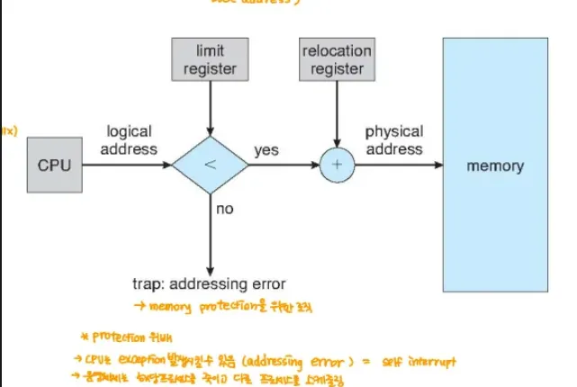

→ 이 그림이 주소 변환 및 메모리 보호 과정

1. cpu가 로지컬 메모리로 메모리에 접근하려 함
2. limit register의 값과 비교 → 메모리 보호 단계
	- logical address \< limit register → yes, 다음 단계
	- logical address \> limit register → no, 인터럽트 발생, addressing error 예외
		→ 하드웨어에서 발생하니깐 인터럽트

3. relocation register의 값을 논리적 주소에 더하기 → 그 결과로 물리 주소를 얻음
4. 변환된 물리적 주소로 실제 메모리에 접근
***

# Hole

- 사용 가능한 메모리의 빈 공간
- 크기가 다양하고 메모리에 흩어져서 존재
→ 프로세스가 종료되고 메모리에서 언로드되면 hole이 생성됨

- **새로운 프로세스가 메모리에 로드될 때 크기가 충분한 hole이 필요함**

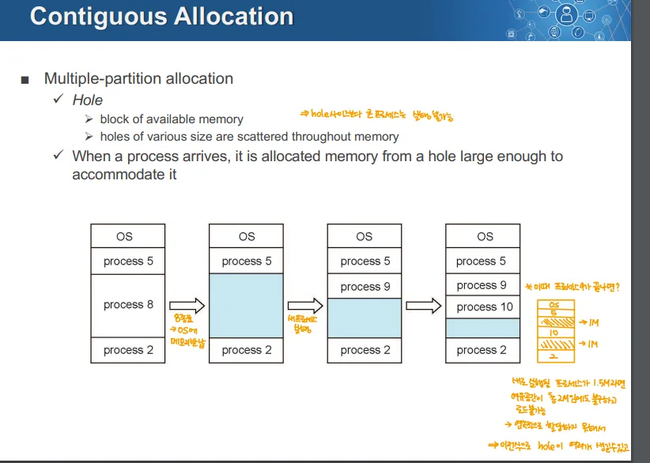

**→ Contiguous Allocation에서는 군데군데 흩어져 있는 홀의 크기의 총합이 프로세스를 로드하기에 충분하더라도 프로세스를 연속적으로 할당하기 때문에 로드하지 못하는 경우가 생김**

## Dynamic Storage Allocation Problem

- 새로운 프로세스가 메모리에 할당될 때 빈 공간(free hole) 중 어떤 곳을 선택해야 가장 효율적인 할당이 되는지 결정
- 총 3가지 방법이 있음

### 1. First Fit

- 충분히 큰 hole 중 가장 첫 번째 공간에 할당

### 2. Best Fit

- 충분히 큰 hole 중 가장 작은 것에 할당
- 크기에 따라 free hole 리스트가 정렬되어있지 않으면 전체를 탐색해야함
- 이 경우 프로세스가 할당되고 남은 hole의 크기가 가장 작음
	→ fragmentation이 최소화

### 3. Worst Fit

- 가장 큰 hole에 할당
- 전체를 탐색해야함
- 프로세스 할당 후 남은 hole의 크기가 가장 큼
⇒ First fit, Best fit이 worst fit보다 속도와 저장공간 효율면에서 더 나음
***

# Fragmentation
→ 단편화
→ 2가지 유형으로 나뉨

## External Fragmentation

- 메모리의 전체 공간은 충분하지만, 연속된 공간이 부족해 할당이 불가능한 문제
	- 전체 가용 메모리 공간의 합은 충분하지만, 이것들이 연속적이지 않아 할당이 불가능한 경우
- Contiguous Allocation에서 발생

## Internal Fragmentation

- 할당된 메모리가 실제로 필요한 크기보다 약간 클 때 발생하는 문제
- 그 차이는 메모리 파티션 내부에는 존재하지만 실제로 사용되지 않는 메모리 공간
	→ 할당 단위가 고정되어있으면 남을 수 있음

- Paging에서 발생

## External Fragementation 해결방법: Compaction

- 메모리 내용들을 재배치해서 free 상태인 hole을 하나의 큰 블록을 만드는 작업
- Compaction은 재배치가 동적이고, 실행시간에 가능해야 사용 가능

### 문제점

1. I/O 문제
	→ I/O 작업에 사용되는 메모리는 재배치하면 안됨

	- 해결방법 1: I/O 작업에 쓰이는 메모리를 고정하는 방법
	- 해결방법 2: I/O 작업을 OS 버퍼에서만 수행하는 방법
2. 오버헤드
	- 메모리를 옮기는 과정에서 많은 데이터의 이동, 즉 I/O 작업이 이뤄지므로 엄청난 I/O 오버헤드가 발생
***

# Paging

- 물리적 메모리와 논리적 메모리를 동일한 크기의 Frame과 Page단위로 나누어 관리하는 방식
	- 논리적 메모리를 물리적 메모리 주소로 변환해 사용
	- Frame: 물리적 메모리를 동일한 크기로 나눈 단위
	- Page: 논리적 메모리를 동일한 크기로 나눈 단위
- 이때 논리적으로는 연속적이지만 물리적으로는 연속적일 필요가 없음
	- Frame은 Contiguous하지 않게 할당됨

### 장점

- External Fragmentation 문제를 해결

### 문제점

- 고정적인 단위인 Page, Frame을 사용하므로 해당 크기를 전부 사용하지 않는 경우가 생김
	- 즉, Internal Fragmentation이 발생
- Page와 Frame의 매핑 관계를 가져야 하고, 모든 프로세스가 이런 정보를 가져야 함 → 메모리 오버헤드
- Page의 주소를 Frame의 주소로 변환하는 오버헤드가 생김

# Address Traslation

- 논리적 주소는 두 가지 부분으로 구성

	

	- Page Number
		- 논리적 메모리를 페이지 단위로 나누었을 때 해당 페이지의 번호
		→ Page Table의 인덱스로 사용

	- Offset
		- 페이지 내부에서의 세부적인 위치
- 이때 Page Table이 Frame number를 결정
⇒ 물리적 주소는 \<Frame Number, Offset\> 또는 (f, d)로 변환

- 이때 Page와 Frame은 같은 크기이므로 Offset값은 같음

## Page Table

- Page number와 Frame number를 매핑
	- Page number는 Page Table이 Frame number를 결정하게 하는 인덱스
- 운영체제가 관리하고 각 프로세스마다 별도 Page Table이 존재
- 가상 주소 공간의 페이지 하나 당 하나의 Page Table Entry가 존재

## Address Trasnlation 구조

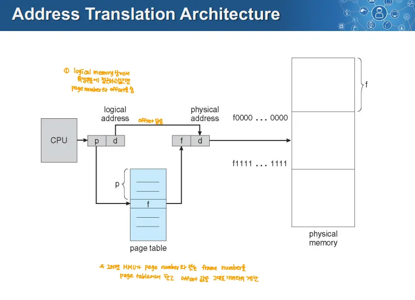

1. logical 메모리 상에서 특정 부분에 접근하기 위해 page number와 offset으로 구성된 logical address로 접근
2. MMU가 Page number를 통해 Page Table에서 매핑된 Frame number를 찾음
3. 이후 frame number와 offset을 통해 물리적 주소를 찾아냄
4. 해당 물리적 주소를 통해 물리적 메모리에 접근

# Paging 예시

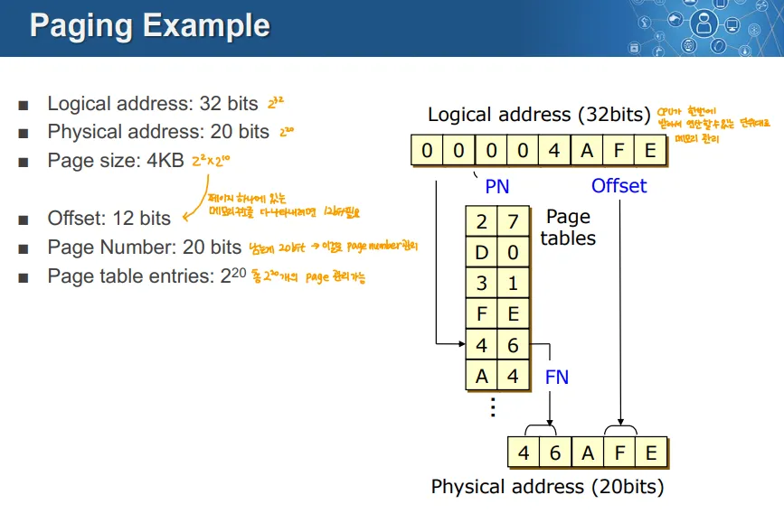

### 설명

1. 논리적 주소: 32비트
	- 논리적 주소는 총 $`2^{32}`$개의 메모리 공간을 나타낼 수음
2. 물리적 주소: 20비트
	- 물리적 주소는 $`2^{20}`$개의 메모리 공간을 나타냄
3. 페이지 크기: 4KB
	- 하나의 페이지는 4KB로 구성
	- 즉 1KB →  $`2^{10}`$byte, 4KB이므로  $`2^{12}`$
	→이 위 3가지는 정해진 것(사전에 정의된 부분)

4. Offset: 12비트
	- 오프셋의 비트 수는 페이지의 내부 바이트를 나타낼 수 있어야 함
	- 즉 12비트 ⇒ $`2^{12}`$개의 공간을 가리킬 수 있음
	→ 페이지 크기가 $`2^{12}`$개이므로 Offset은 12비트로 정해진 것 

5. Page Number
	- 논리적 주소 32비트 중 Offset 12비트를 제외한 20비트
	→ Offset이 12이므로 PageNumber는 20비트로 정해진 것

6. Page Table Entry
	- $`2^{20}`$개 → 페이지 넘버가 20이므로 최대 $`2^{20}`$만큼 필요
	→ Page Number가 20비트니깐 PTE개수는  $`2^{20}`$으로 정해짐
	→ PTE 개수 = Page의 개수(=$`2^{32} \\div 2^{12} = 2^{20}`$)
	→ 통상적으로 프레임 개수 ≤ 페이지 개수임

		- 이 예시도 페이지 개수 = $`2^{20}`$
		- 프레임 개수 = $`2^{20} \\div 2^{12} = 2^8`$
			- 프레임 크기 = 페이지 크기 = 4KB

### 변환 과정

1. CPU에서 논리적 주소(32비트)가 생성
	- ex) 00004AFE → 16진수 정수(4비트) 8자리
2. 논리적 주소에서 상위 20비트를 추출 → PN(페이지 넘버)
	- ex) 00004 → 16진수 정수(4비트) 5자리 → 20비트
3. 페이지 테이블을 참조해 이를 인덱스로 해당 페이지와 매핑된 FN(frame number)를 찾음
	- ex) 위 예시에서 00000이 인덱스 0, 00004는 인덱스 4 → 5번째인 46
4. Frame number와 Offset을 결합해 물리적 주소 생성
	- ex) 46(FN) + AFE(Offset) → 46AFE가 생성

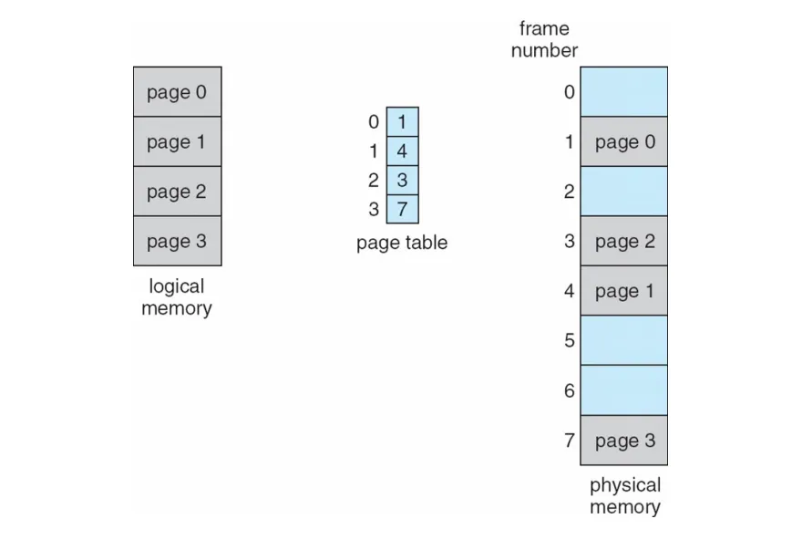

→ 각 page number가 0,1,2,3임 → 이걸 인덱스로 사용하면

- 0 ⇒ 1
- 1 ⇒ 4
- 2 ⇒ 3
- 3 ⇒ 7 
***

# Free Frame

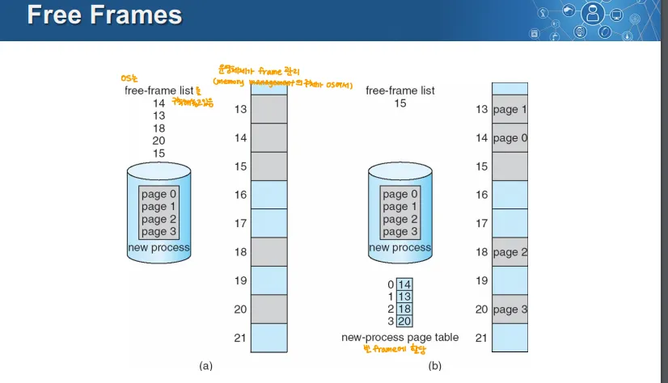

- 현재 사용되지 않는 물리적 메모리의 프레임
- 운영체제가 관리하며 새로운 프로세스가 메모리 요청 시 Free Frame 리스트에서 할당
	- 이 Free Frame 리스트는 OS에 의해 유지 및 업데이트
***

# Page Table 구현

- 페이지 테이블은 메인 메모리에 저장
	- PTBR(Page Table Base Register)
		- 현재 실행 중인 프로세스의 페이지 테이블 시작 주소를 가리킴
	- PTLR(Page Table Length Register)
		- 페이지 테이블의 크기를 나타냄
		- 논리적 주소가 페이지 테이블 크기를 초과하면 접근 에러 발생
→ 페이지 테이블은 메인 메모리에 위치
→ 접근 효율 증가를 위해 이를 관리하는 레지스터가 있음

### 문제점: 2번의 메모리 접근이 필요

-  페이지 테이블을 메모리에 저장하면, 데이터/명령어를 가져오기 위해 최소 2번의 메모리 접근이 필요
	1. 페이지 테이블 접근 → 논리적 주소로 프레임 넘버 조회
	2. 실제 데이터 접근 → 실제 물리적 메모리에서 읽기

### 성능 향상
→ 메모리에 두 번 접근해 속도가 느려져서 성능 향상 방법이 필요

- 목표: 가상 주소로 데이터를 가져오는 것을 물리 주소로 가져오는 것만큼 빠르게 만들기
- 해결 방법
	- 하드웨어에서 가상 주소를 물리 주소로 변환한 결과를 캐싱
		→ 전부 캐싱하기에는 페이지 테이블은 크기 때문에 일부만 캐싱

	- 그래서 TLB(Traslation Look-aside Buffer)를 사용
	- TLB는 MMU에서 관리
		→ mmu 내부에 있는 캐시

# TLB를 사용하는 페이징 하드웨어

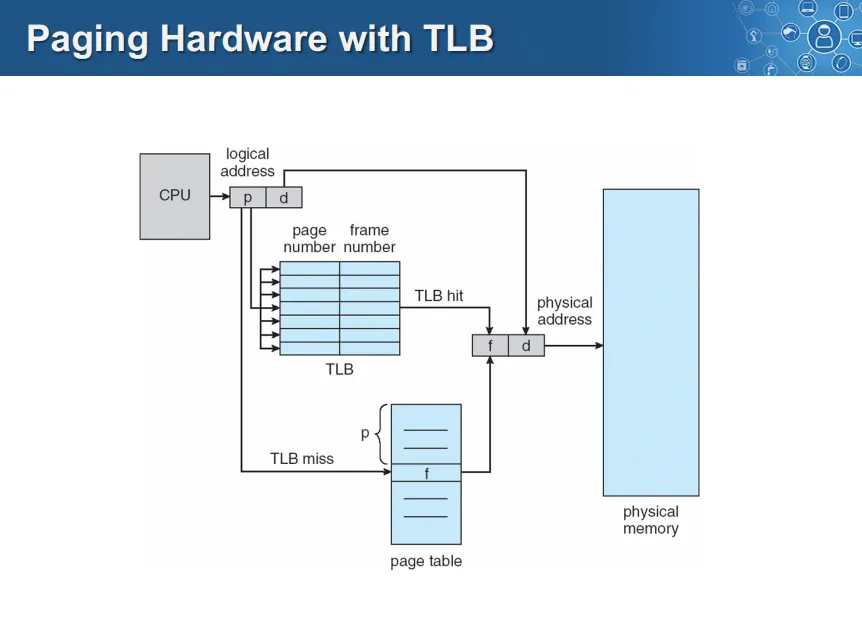

1. 가상 주소 입력 → 이를 페이지 넘버와 오프셋으로 나눔
2. 페이지 넘버를 TLB로 넘겨 캐싱되어있는지 확인 
	- 있으면(TLB Hit) 바로 물리 주소를 생성해 물리 메모리에 접근
3. 없는 경우(TLB Miss)인 경우 페이지 테이블을 조회, 이를 통해 Frame number를 가져와 물리 주소를 생성
4. 물리 주소를 통해 물리 메모리에 접근

# Associative Memory

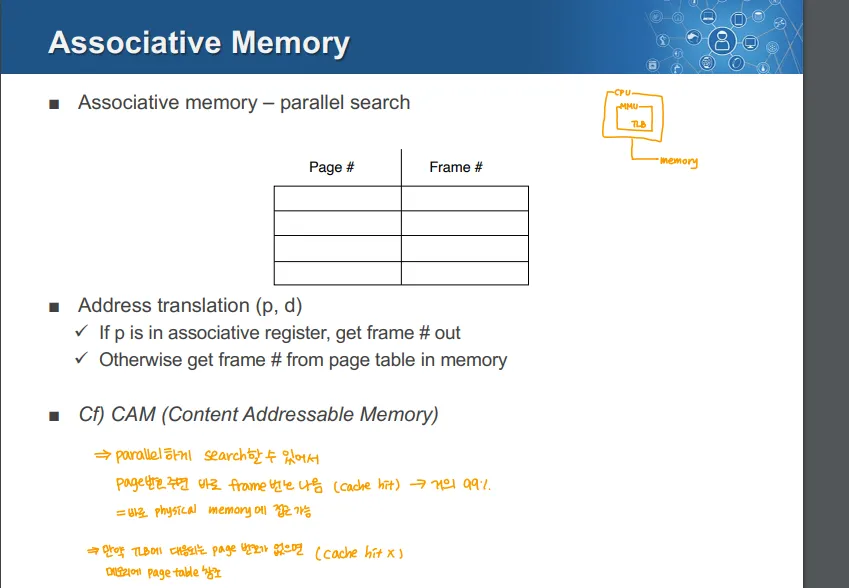

- 병렬적인 탐색을 수행할 수 있는 메모리
	- 일반 메모리는 한 번에 하나씩 데이터를 검색, Associative Memory는 한 번에 여러 항목을 검색 가능해 성능이 매우 좋음
	- 페이지 넘버가 Associative 메모리에 저장되어 있으면 즉시 프레임 넘버를 반환(Cache Hit)
- TLB에 사용, 그냥 TLB의 다른 이름이라고 생각해도 무방
- Associative Memory는 CAM(Content Addressable Memory)라고도 불림
	- 내용을 기반으로 검색됨
→ TLB는 이런 메모리로 만들어져 매우 빠름

# TLB

- TLB는 하드웨어로 구현되어있음
	- TLB는 완전히 Associative Cache로 구성(모든 엔트리를 병렬적으로 탐색)
	-  논리적 페이지 넘버를 Cache tag로 함
	- Cache 값은 PTE(페이지 테이블의 엔트리)
	- PTE와 오프셋을 통해 MMU는 바로 물리적 주소를 계산 가능
- TLB는 Locality를 활용
	- 프로세스는 한번에 소수의 페이지만 사용
		- 보통 TLB는 16\~48 엔트리를 저장(64\~192KB)
		- hot set 또는 working set이라고 불리는 프로세스에서 자주 쓰이는 데이터를 TLB에 저장 가능
		→ Temporal Locality를 말하는 듯

	- Hit Rate가 매우 중요
- TLB는 Temporal Locality롸 Spacial Locality를 모두 활용
	- TLB는 자주 쓰이는 페이지의 정보를 캐시 형태로 저장 → Temporal Locality
	- TLB는 한 번 로드된 페이지의 근처 페이지들도 함께 참조될 가능성 고려 → Spacial Locality

## Handling TLB Miss

- 주소 변환은 대부분 TLB에 의해 처리
	- 99%는 처리, 가끔 TLB Miss가 발생
- Miss가 발생했을 때, 페이지 테이블에 접근해야하고, 이 정보를 TLB로 저장해야함
	→ 하드웨어에서 처리하는 방식, 소프트웨어에서 처리하는 방식 2가지가 있음

### Harware(MMU)→ Intel x86

- MMU안에 페이지 테이블 위치를 저장하는 레지스터가 있어 이를 알고 있음
- OS가 테이블을 관리하고, 접근은 하드웨어를 통해 수행
- 페이지 테이블이 하드웨어에서 정의된 형태여야 함
→ 이때는 접근 속도는 빠름, 그러나 페이지 테이블 형태가 고정

### Software Loaded TLB(OS)

- TLB Miss 발생 시 OS가 PTE를 찾아 TLB로 로드
- 이때 빠르게 동작해야만 함
- Cpu ISA가 TLB조작을 위한 명령 포함
- TLB는 운영체제에 적합한 형태로 존재 가능, 유연하게 존재 가능

### TLB miss 처리 과정

1. MMU 안의 TLB를 확인
2. 이때 TLB Hit이면 바로 주소 후 메모리 접근
3. TLB miss면 페이지 테이블에 가서 참조
4. 다시 TLB에 정보를 올리며 메모리에 접근

## TLB 관리 방법

- OS는 TLB와 페이지 테이블의 일관성을 유지해야함
	- TLB는 캐시이므로 운영체제가 페이지 테이블을 업데이트할 때 이를 반영하도록 관리해야함
- 프로세스 Context Switch시 TLB를 리로드
	- 각 프로세스는 자신만의 페이지 테이블을 가짐
		- context switch하면 이전 TLB 내용이 의미없어짐
	- 이때 TLB를 모두 비우는 작업(flush TLB)를 수행
		- IA32 아케텍처는 CR3 레지스터 변경 시 TLB가 자동 플러시
	- 대안으로 TLB 항목에 PID를 포함시켜 각 프로세스별로 항목 유지가 가능하나 비용이 큼
- TLB미스 발생 시 PTE를 교체해야함
	- 이때 새로운 PTE를 불러와야하는데 TLB공간은 한정되어 있으므로 기존에 캐싱된 PTE중 하나를 퇴출하고 새로운 PTE를 로드
	- 퇴출할 PTE를 선정하는 방법을 TLB 교체 정책이라고 함
	- 하드웨어적으로 구현되어있고 대게 간단함(ex. LRU)
***

# Effective Access Time 

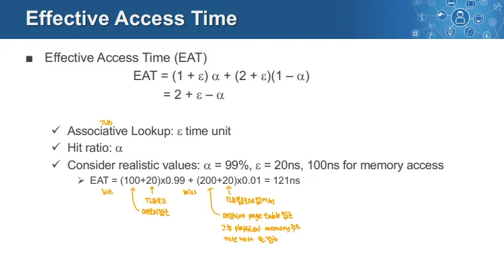

→ 논리적 주소를 물리적 주소로 변환해 메모리에 접근하는 시간

- EAT = (1 + ε)α + (2 + ε)(1 - α)
	- **ε (엡실론)**: TLB 접근 시간 (Associative Lookup 시간)
	- **α (알파)**: TLB 히트 확률 (Hit Ratio)
	- **1 - α**: TLB 미스 확률
	→ 이때 1은 1번 메모리에 접근하는 시간

		- 100ns만큼 걸리면 100ns로 계산
- **(1 + ε)α**: TLB에 접근했을 때 **히트**가 발생하는 경우 시간 계산
	- (메모리 접근 시간 + TLB 접근 시간) \\* TLB Hit 확률
	- TLB에 접근하고 TLB Hit이 나고, 바로 메모리에 접근
- **(2 + ε)(1 - α)**: TLB **미스**가 발생했을 때, 페이지 테이블 접근과 메모리 접근을 모두 수행하는 시간 계산
	- (메모리 접근 시간 2번 + TLB접근 시간) \\* TLB Miss 확률
	- TLB에 접근하고 TLB Miss가 나서 페이지 테이블(메모리)에 접근 후 이를 기반으로 다시 메모리에 접근 → 메모리 2번 접근
***

# 메인 메모리 보호

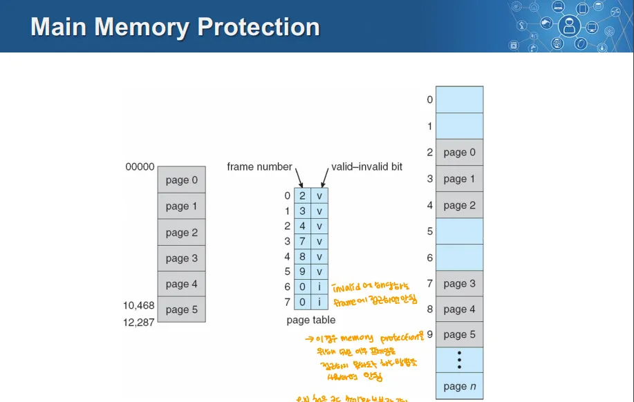

→ 유효하지 않은 프레임 주소에 접근하는 것을 방지해야함

- 메모리 보호를 위해 valid/invliad 비트를 사용
	- valid/invalid비트를 페이지 테이블에 추가해서 사용
	- 위 그림을 보면 페이지 넘버(인덱스), 프레임 넘버, valid-invalid bit가 있음
- valid한 경우 페이지가 유효하고 물리적 메모리의 프레임에 매핑되어있음을 말함
- invalid한 경우 페이지가 유효하지 않고, 물리적 메모리에 존재하지 않음을 나타냄
***

# Page Table Entry(PTE)
→ 페이지 테이블의 한 행 = PTE

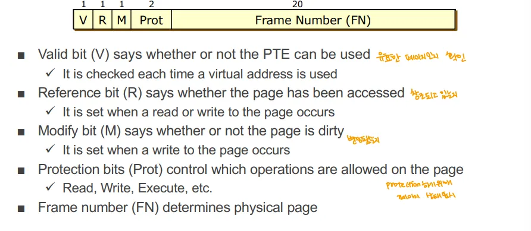

## Valid Bit

- 페이지가 유효한지 여부를 나타냄
- 가상 주소(논리적 주소)를 사용할 때마다 이 비트를 확인
→ 1비트면 충분 → 0(invalid), 1(valid)

### Reference Bit

- 해당 페이지가 이전에 접근되었는지 나타냄
- page에 read, write가 수행되면 설정됨
→ 페이지 교체 알고리즘에서 페이지 사용 여부를 파악하는데 사용

## Modify Bit

- 페이지가 수정되었는지 여부를 나타냄(dirty인지 나타냄)
- 페이지가 write된 경우 설정

## Protection Bit

- 페이지에서 허용되는 작업을 제어

## Frame Number

- 물리 메모리의 프레임 번호를 나타냄
***

# Page Table Structure

## 페이지 테이블 관리

- 페이지 테이블의 공간적 오버헤드
	- 페이지 테이블은 모든 주소 공간을 매핑해야 하므로 크기가 매우 큼
- 오버헤드를 감소시킬 수 있는 방법
	- 전체 주소 공간 매핑 대신, 실제로 사용 중인 주소만 매핑해 효율성을 높임
- 어떻게 사용되는 주소만 매핑하는가
	- 페이지 테이블을 동적으로 확장 가능하게 만들어 필요한 부분만 매핑

## 페이지 테이블 구조 종류

1. Hierarchical Paging(계층적 페이징) → 이건 실제로 사용
2. Hashed Page Table(해시 페이지 테이블)
3. Inverted Page Table

# Hierarchical Page Table

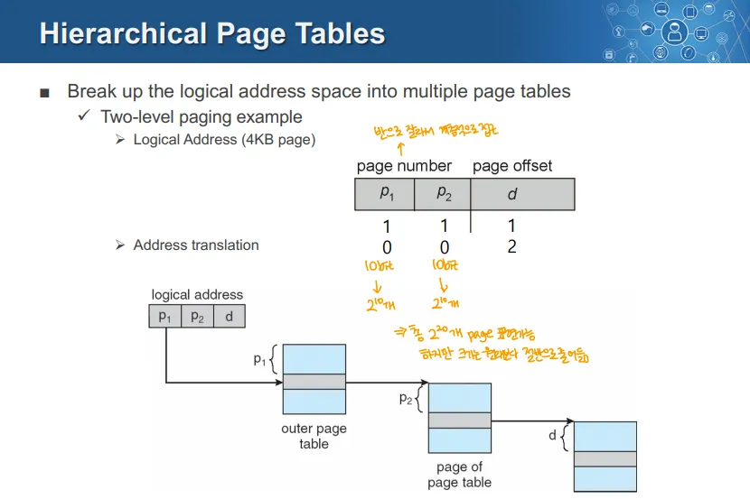

- 논리적 주소의 페이지 넘버를 여러 부분으로 나눠 여러 페이지 테이블을 참조하게 함
- Ex) Two-Level Paging, 20비트 페이지 넘버
	- p1 10비트, p2 10비트로 사용
	- p1으로 바깥 페이지 테이블을 찾음
		- p1으로 찾은 바깥 페이지 테이블의 페이지를 참조해야함
	- p1으로 바깥 페이지 테이블로 참조한 페이지를 p2로 다시 참조
	- 이를 통해 본래의 프레임 넘버를 찾아 오프셋을 더해 물리 주소를 찾음
- 장점
	- 전체 페이지 테이블을 유지할 필요가 없어 메모리 낭비를 줄임
		- 사용 중인 메모리 영역만 매핑
	- 20비트로 기존보다 많은 영역을 매핑 가능

## 계층적 페이지 테이블 예시

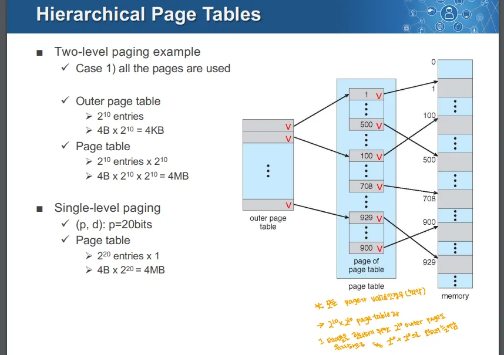

- 모든 페이지가 사용 중인 경우
- 외부 테이블에는 $`2^{10}`$개의 엔트리이고 각 엔트리는 4B이므로 총 4KB를 차지
- 내부 테이블에는 $`2^{10}`$개의 엔트리가 있고 이것이 $`2^{10}`$개 있으므로 4B\\*$`2^{10}`$\\*$`2^{10}`$ = 4MB차지
→ 총 4KB+4MB개 차지/ 2\\^20개 공간 매핑 가능

- 이때  싱글 레벨로 바꾸면 4MB/ $`2^{20}`$

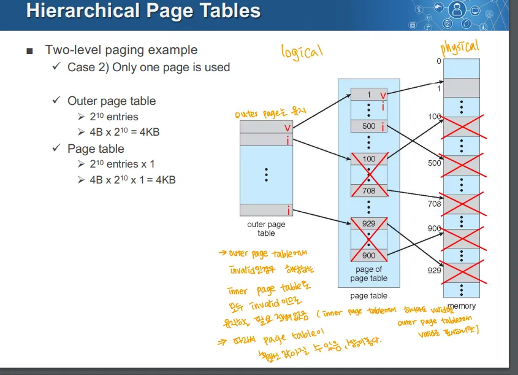

- 하나의 페이지만 사용 중
- 내부 페이지 테이블 중 하나라도 valid이면 외부 페이지 테이블의  비트의 해당 PTE는 valid
	- 여기서는 외부 페이지 테이블의 PTE 중 하나만 valid
- 외부 페이지 페이블 → $`2^{10}`$엔트리, 4b\\*$`2^{10}`$ = 4KB
- 내부 페이지 테이블 
	- 1개의 테이블만 존재
	- $`2^{10}`$엔트리, 4b\\*$`2^{10}`$ = 4KB
→ 총 $`2^{10}`$만큼의 프레임을 가리키며, 8KB사용

	- 사용하는 만큼만 저장

# Hashed Page Table

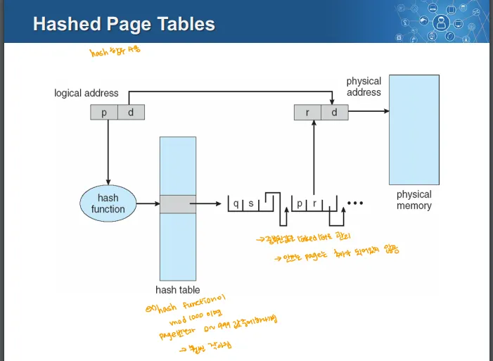

- 해시 함수를 사용해 페이지 번호를 물리 페이지 프레임에 매핑
- 중복된 값은 링크드 리스트를 통해 연결
- 이때 사용하지 않는 page는 추가되어있지 않음
→ ex) hash 함수가 mod 1000이면 해시 테이블은 0\~999만 보관, 이때 사용되는 것들만 매핑

	- 따라서 1000+a로 감소
- 해시 충돌 시 링크드 리스트를 선형탐색 해야해서 엑세스 효율이 떨어짐

## Inverted Page Table

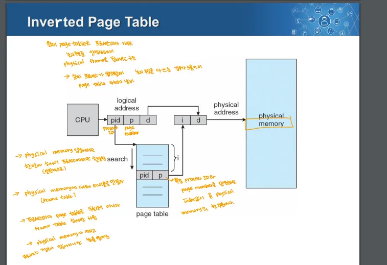

→ 이 그림의 Page Table이라 적힌 것은 Frame Table

- 페이지가 아닌 프레임의 번호를 넣어 관리하는 방식
- 시스템 전체에서 1개만 존재
	- 본래 페이지 테이블은 프로세스마다 존재 
		→ 하나의 프로세스가 이 정보를 전부 사용하는 일은 드물기 때문에 이 자체가 낭비

	- 프레임 테이블은 시스템 전체에 1개이므로 pid를 담고 있어야함
		- 엔트리에 보관할 정보가 늘어남 
			- pid등의 많은 정보를 모두 포함해 계산, mmu가 복잡해짐
- 이때 논리적 주소에는 pid, page number, offset이 존재
	- pid, page number로 Frame Table에서 frame number를 찾음
	- 이 프레임 넘버와 오프셋을 더해 물리적 주소를 찾음
***

# Shared Page 예시

## Shared Page

- 여러 프로세스가 동일한 프레임을 참조하게 해 메모리를 효율적으로 사용하는 것

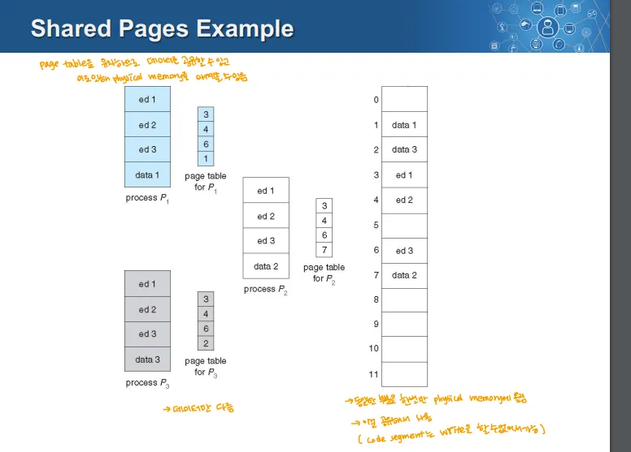

→ 프로세스 P1, P2, P3 각각의 페이지 테이블이 존재

	- P1: `ed 1`, `ed 2`, `ed 3`, `data 1`
	- P2: `ed 1`, `ed 2`, `ed 3`, `data 2`
	- P3: `ed 1`, `ed 2`, `ed 3`, `data 3`
- 이때 동일한 내용은 물리적 메모리에 1번씩만 저장
- 중복된 내용이 작업 도중 달라지게 되면, 그때 새로운 프레임을 할당

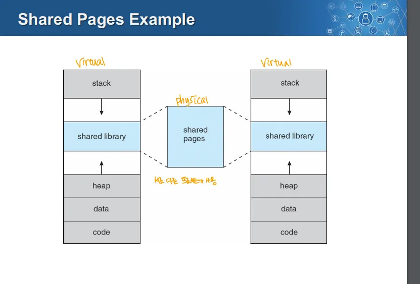

- 이때는 다이나믹 링킹을 하는 경우
- 서로 다른 프로세스가 shared library에 해당하는 하나의 프레임을 참조
***

# Paging의 장점

1. 물리적 메모리에 할당하기가 쉬움
	- 물리적 메모리는 동일한 크기의 프레임으로 나눠 관리
	- 프레임을 free list에서 선택해 바로 할당 가능
2. External Fragmentation이 없음
3. Page Out이 쉬움
	- 청크(디스크를 나눈 단위)를 모두 동일하게 할 수 있음
		- 페이지 크기와 동일하게 하면 됨
	- Page out된 페이지를 탐지하기 위해 valid 비트를 사용
	- 페이지 사이즈를 디스크 블록 크기의 배수로 설정하며 I/O 작업이 더욱 효율적
4. 잘못된 접근으로부터 페이지를 보호하기 쉬움
5. 페이지를 공유하기 쉬움
→ 많은 것이 페이지 크기 = 프레임 크기 = 청크 크기? 이므로 생기는 장점

# Paging의 단점

1. Internal Fragmentation이 발생 가능
	- 프로세스가 정확히 페이지 크기의 배수를 사용하지 않을 수 있음
2. 메모리 참조 오버헤드 발생
	- 하나의 논리 주소를 실제 물리 주소로 변화해 접근하기 위해 두 번의 메모리 접근이 필요
		1. 페이지 테이블 접근
		2. 변환된 물리 주소 접근
	- 해결책
		- TLB를 통해 하드웨어적으로 성능 향상
3. 페이지 테이블로 인해 메모리 사용량이 증가
	- 페이지 테이블은 페이지 하나 당 하나의 PTE를 필요로 함
		- 32비트의 4KB 크기 페이지면 $`2^{20}`$개의 페이지,  $`2^{20}`$개의 PTE
		- 4바이트PTE는 페이지 테이블 당 4MB를 필요(4\\* $`2^{20}`$)
	- OS는 보통 프로세스 하나 마다 페이지 테이블을 가짐
		- 25개 프로세스면 100MB 차지하는 것
	- 해결 방법
		- Hierarchical page tables
		- hashed page table
		- inverted page table
→ Contiguous allocation \~ 여기까지 전부 Paging
***

# Segmentation

- 프로그램을 논리적인 단위로 나눠 메모리를 관리하는 기법

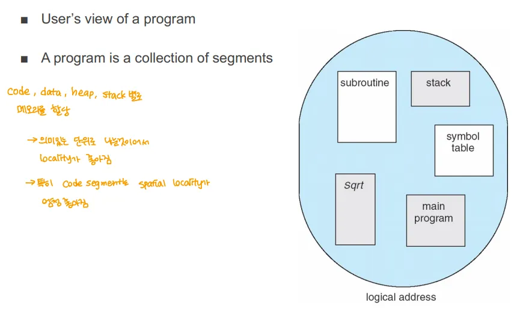

- 사용자 관점의 메모리 관리
	→ 사용자는 프로그램을 세그먼트의 모음으로 인식
		→ 서브루틴, 스택, 특정 함수 등등 논리적으로 유사한 단위
	**→ 각 세그먼트는 프로그램의 논리적 구성 요소로 나뉘고, 이로 인해 Spacial Locality 향상에 도움이 됨**

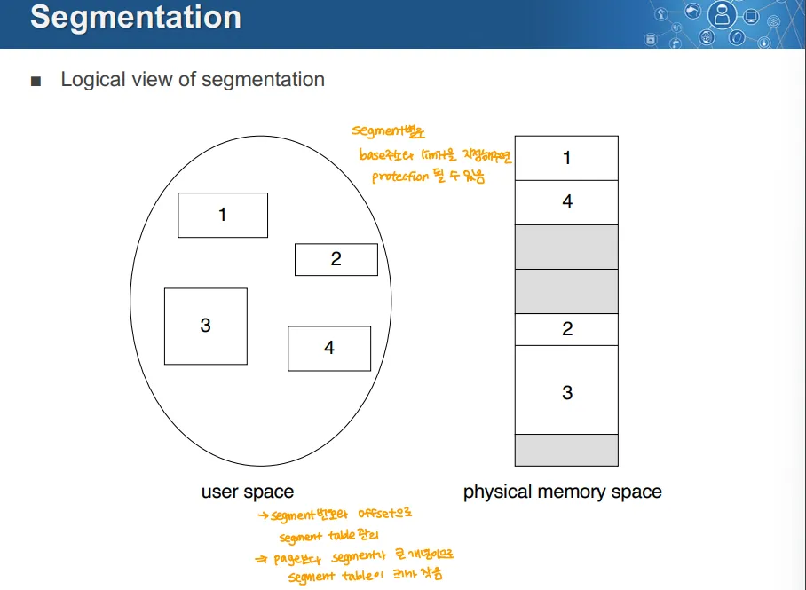

→ 사용자는 세그먼트를 각각 독립된 논리적 메모리 블록으로 봄
→ 세그먼트 별로 base address, limit으로 물리적 메모리로 매핑 가능

## Segmentation 하드웨어

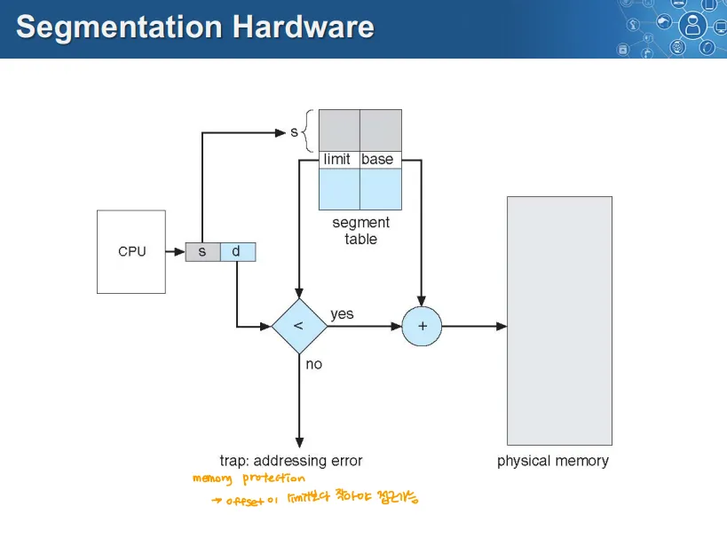

- 논리 주소는 세그먼트 번호+오프셋으로 나타남
- 세그먼트 테이블을 통해 base address와 limit(세그먼트 크기)를 조회
- 주소 변환
	1. 세그먼트 번호를 통해 Base, Limit값을 가져옴
	2. offset \< Limit인 경우 유효한 주소로 판단, 아닌 경우 addressing Error 인터럽트 발생
	3. 유효한 경우 base address에 offset을 더해 물리적 주소 생성
		→ Contiguous allocation과 유사한 방식

- Limit을 통해 메모리 공간을 보호
- 이 경우 External fragmentation 발생 → contiguous allocation과 동일한 이유

## Segment의 공유

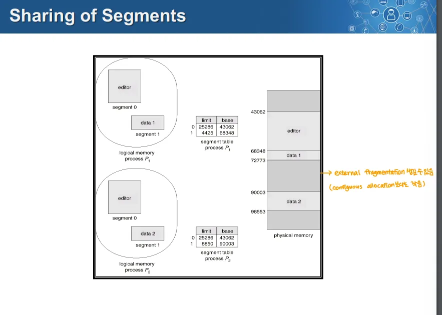

- p0, p1이 동일한 세그먼트(editor)를 공유
	- 동일한 물리적 메모리의 공간을 사용

## Segmentation의 장점

1. 동적으로 늘어나거나 줄어드는 데이터를 관리하기 쉬움
2. 세그먼트 보호가 쉬움
	- 세그먼트 테이블의 각 엔트리에 valid bit를 설정
	- 세그먼트 별로 작업 권한을 지정해 보호 가능
3. 세그먼트 공유가 쉬움
	- 세그먼트 테이블의 base, limit 쌍에 동일한 값을 넣으면 됨
	- 코드와 데이터의 공유가 세그먼트 레벨에서 일어남
		- ex) 공유 라이브러리(dll)
4. internal fragmentation이 없음

## Segmentation의 단점

1. cross-segment 주소 문제
	- 프로세스가 세그먼트를 공유할 때 해당 세그먼트의 번호는 동일해야함
		→ 프로세스마다 세그먼트 넘버는 달라질 수 있음

	- 이를 해결하기 위해 indirect addressing을 함, 이로 인한 처리 오버헤드 증가

1. 세그먼트 테이블은 크기가 큼
	- 각 프로세스마다 큰 세그먼트 테이블을 유지해야함
	- 세그먼트 테이블도 메모리 안에 존재, 성능향상 위해 캐시 사용 가능
2. external fragmentation 발생
	- 세그먼트 크기가 다양하기 때문에 external fragmentation발생
		→ contiguous allocation과 동일
***

# Paging vs Segmentation

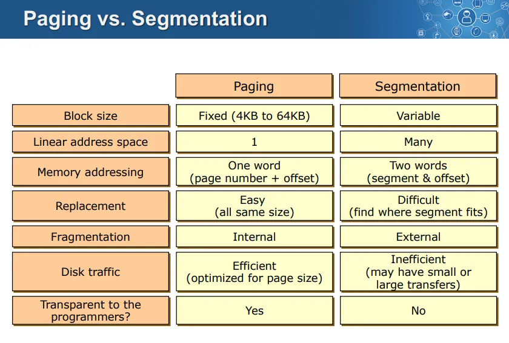

### **Paging (페이징)**

1. **블록 크기**:
	- 메모리는 고정된 크기의 **페이지(Page)** 단위로 나뉩니다.
	- 모든 페이지가 동일한 크기(4KB, 8KB 등)라 관리가 간단합니다.
2. **주소 공간**:
	- 단일 선형 주소 공간을 사용하여 메모리를 처리합니다.
3. **주소 지정**:
	- 논리 주소를 `(페이지 번호, 오프셋)`으로 나눕니다.
	- 페이지 테이블을 통해 물리 주소로 매핑됩니다.
4. **교체 알고리즘**:
	- 페이지 크기가 고정되어 있어 교체가 쉽고, 메모리 관리가 효율적입니다.
5. **단편화**:
	- 고정 크기의 페이지이므로 **내부 단편화** 발생 가능.
	- 페이지가 꽉 차지 않으면 남은 공간이 낭비됩니다.
6. **디스크 트래픽**:
	- 페이지 크기에 맞게 설계되어 디스크 트래픽이 최적화됩니다.
7. **프로그래머에게 투명함**:
	- 메모리 관리가 자동으로 이루어지기 때문에 프로그래머가 세부적인 내용을 알 필요가 없습니다.

### **Segmentation (세그먼테이션)**

1. **블록 크기**:
	- 세그먼트는 가변 크기의 논리적 단위로 관리됩니다.
	- 예: 코드, 데이터, 스택 각각 별도의 세그먼트 크기.
2. **주소 공간**:
	- 프로그램은 여러 개의 독립적인 주소 공간으로 나뉩니다.
	- 예: 코드 세그먼트, 데이터 세그먼트, 스택 세그먼트.
3. **주소 지정**:
	- 논리 주소를 `(세그먼트 번호, 오프셋)`으로 표현합니다.
	- 세그먼트 테이블을 통해 물리 주소로 변환됩니다.
4. **교체 알고리즘**:
	- 세그먼트 크기가 가변적이기 때문에 교체가 어렵습니다.
	- 적절한 크기의 세그먼트를 찾는 추가 작업이 필요합니다.
5. **단편화**:
	- 가변 크기 때문에 **외부 단편화** 발생 가능.
	- 세그먼트의 크기와 물리적 메모리 블록 크기가 일치하지 않으면 낭비가 발생합니다.
6. **디스크 트래픽**:
	- 세그먼트 크기가 일정하지 않아 트래픽 관리가 비효율적일 수 있습니다.
7. **프로그래머에게 비투명**:
	- 프로그래머는 세그먼트의 구성과 관리 방식을 알고 있어야 할 수 있습니다.

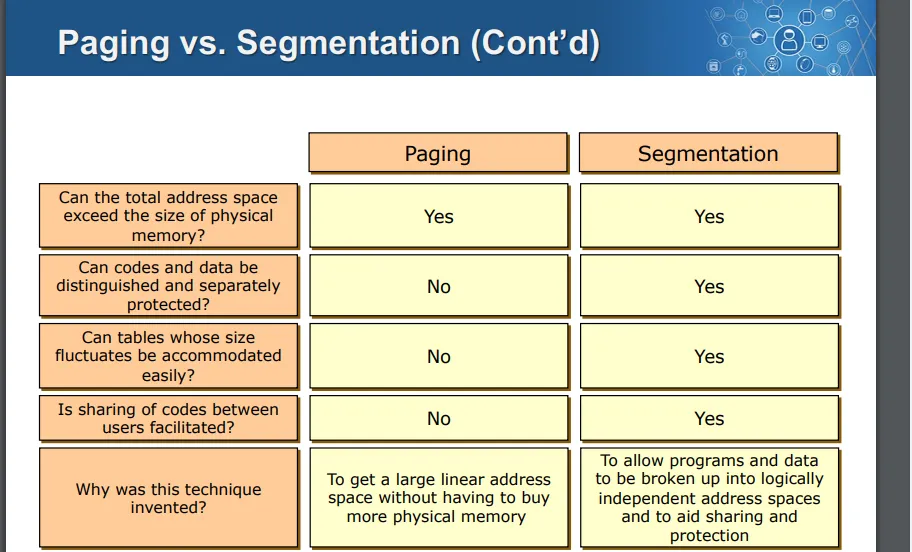

### **1. 물리적 메모리 크기를 초과한 주소 공간 가능성**

- **Paging**:
	- 가상 메모리를 지원하여 물리적 메모리보다 큰 주소 공간을 사용할 수 있습니다.
	- 운영체제는 페이지 테이블을 사용하여 필요할 때만 실제 메모리를 할당하고, 나머지는 디스크를 통해 관리합니다.
- **Segmentation**:
	- 세그먼트를 논리적 단위로 나누고, 각각의 세그먼트가 가상 메모리를 지원하므로 물리적 메모리 크기를 초과하는 주소 공간을 사용할 수 있습니다.

### **2. 코드와 데이터를 구분하고 보호 가능성**

- **Paging**:
	- 페이징은 고정 크기의 페이지 단위로 메모리를 나누기 때문에 코드와 데이터를 구분하거나 각각 보호하는 기능이 없습니다.
	- 모든 페이지는 동일한 방식으로 관리됩니다.
- **Segmentation**:
	- 세그먼트는 논리적 단위(코드, 데이터, 스택 등)로 나뉘어져 있어 각 세그먼트를 별도로 보호할 수 있습니다.
	- 예: 코드 세그먼트를 읽기 전용(Read-Only)으로 설정하거나 데이터 세그먼트를 읽기/쓰기(Read/Write) 가능으로 설정.

### **3. 크기 변동이 있는 테이블 처리 가능성**

- **Paging**:
	- 모든 페이지가 고정된 크기를 가지므로 페이지 테이블도 고정된 크기를 가집니다. 크기 변동을 쉽게 처리하기 어렵습니다.
- **Segmentation**:
	- 세그먼트의 크기는 가변적이기 때문에 세그먼트 테이블이 크기 변동을 반영할 수 있습니다.
	- 예: 프로그램이 실행 중에 새로운 세그먼트를 추가하거나 기존 세그먼트를 확장 가능.

### **4. 사용자 간 코드 공유 용이성**

- **Paging**:
	- 페이징은 물리 메모리를 단순히 나누기 때문에 동일한 페이지를 공유하는 기능이 제한적입니다.
	- 코드를 공유하려면 특별한 메커니즘(예: Copy-On-Write)이 필요합니다.
- **Segmentation**:
	- 논리적으로 독립된 세그먼트를 공유 가능하며, 특히 공유 라이브러리(Shared Libraries)와 같은 경우에 유리합니다.
	- 동일한 세그먼트를 참조하도록 설정하면 사용자 간 효율적인 코드 공유 가능.

### **5. 기술이 발명된 이유**

- **Paging**:
	- 물리 메모리 크기를 초과하는 큰 선형 주소 공간을 제공하기 위해 설계되었습니다.
	- 특히, **내부 단편화**를 최소화하고 단순한 메모리 관리를 가능하게 합니다.
- **Segmentation**:
	- 프로그램과 데이터를 논리적으로 독립적인 주소 공간으로 나누기 위해 설계되었습니다.
	- 이는 **코드 보호**, **데이터 보호**, **효율적인 공유**를 가능하게 하기 위한 목적을 가집니다.
***

# Hybrid approach

## Paged Segments

- 세그멘테이션과 페이징 결합
- 프로그램을 먼저 세그먼트로 나누고, 각 세그먼트를 다시 페이지 단위로 나눔
- 각 세그먼트는 페이지 크기의 배의 크기를 가짐

## 다중 페이지 사이즈

- 일부 아키텍처에서는 다양한 페이지 크기를 지원
	- 이를 통해 internal fragmentation 최소화

## Segmentation with Paging

- 세그멘테이션과 페이징 결합
- 논리적으로 관련있는 단위를 관리하기 위해 세그먼트 사용
	- 세그먼트는 크기 측면에서 다름, 보통 페이지보다 배 이상 큼
- 세그먼트를 다시 고정된 청크로 나누기 위해 페이지 사용
	- 세그먼트를 물리적 메모리에서 관리하기 쉽게하기 위해
	- 세그먼트의 일부만 메모리로 올리기 용이
		- 일부만을 위해 페이지 테이블을 올릴 필요가 있음
	- external fragmentation이 없음
- IA32가 이를 지원

### Segmentation with paging 의 팬티엄 예시

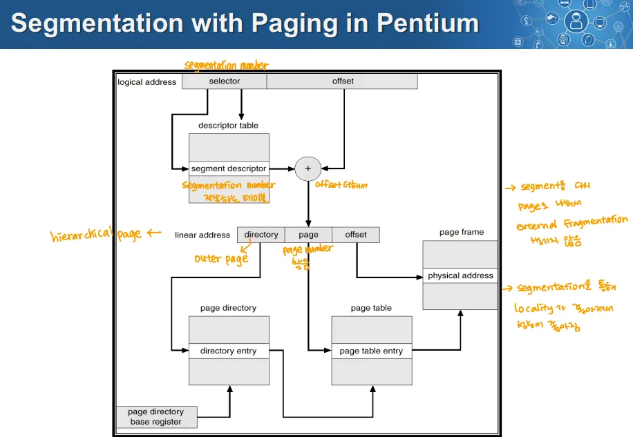

1. 논리적 주소는 segmentation number+offset
2. segmentation number를 저장하는 descriptor table에서 base address, limit을 조회
3. base address에 offset을 더해 Linear address를 구함
4. linear address는 directory+page+offset
	- 이때 directory는 outer page 넘버
	- page는 그 다음 단계의 page 넘버
5. 차례로 페이지 디렉토리의 엔트리를 찾고, 해당 엔트리가 가리키는 페이지 테이블을 통해 실제 frame number를 찾음
6. frame number에 offset을 더해 물리 주소를 찾아서 사용
***

# 프로세서 별 예시

## IA-32의 주소 변환

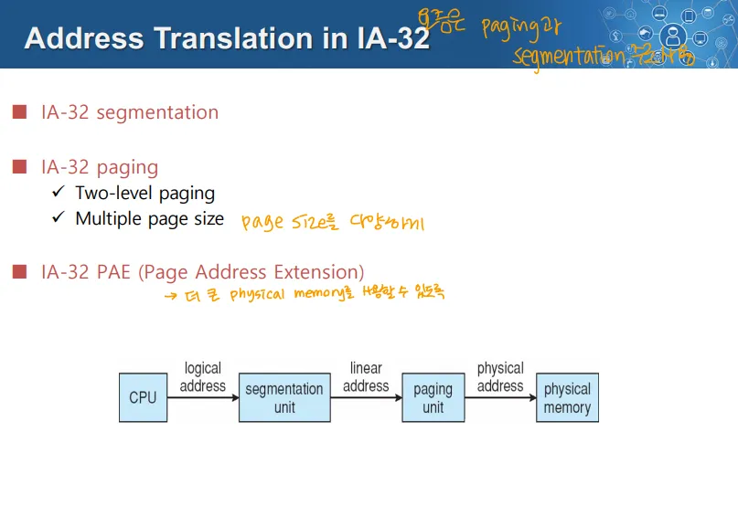

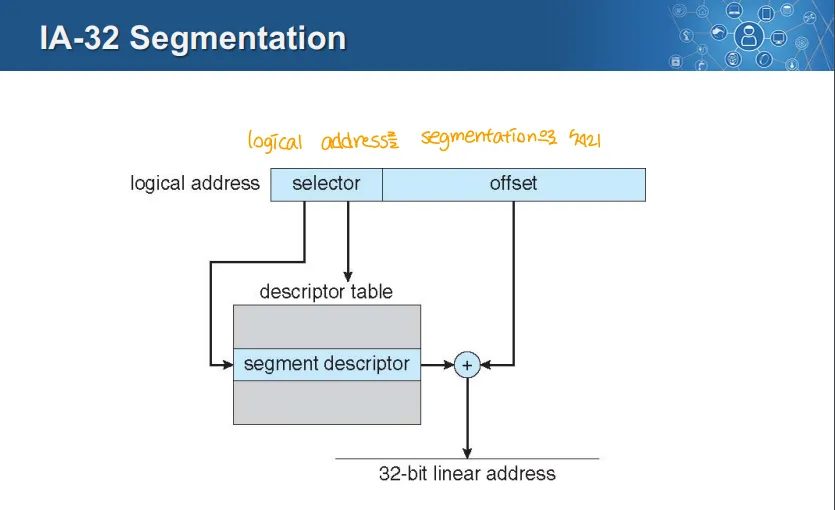

- selector로 세그먼트를 식별
- offset으로 세그먼트 내부의 위치를 찾아냄
- 이를 통해 linear address를 반환

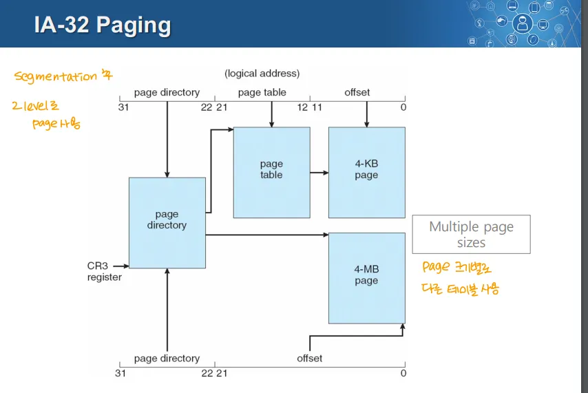

- 페이지 디렉토리,  페이지 테이블을 통해 two-level로 사용
- 상위 10비트, 페이지 디렉토리 엔트리를 찾음
- 중간 10비트, 페이지 테입르 엔트리를 찾음
- 하위 12비트, 페이지 내의 데이터 위치를 찾음
- 이떄 페이지 테이블을 거치지 않고 바로 4MB 페이지 사용 가능
	- 4KB, 4MB의 두 가지를 지원해 메모리 사용의 유연성 증가
	→ temporal locality가 필요한 것은 많은 공간이 필요 없어 4kb에
	→ spacial locality가 필요한 것은 많은 공간이 필요해 4mb 페이지에 할당

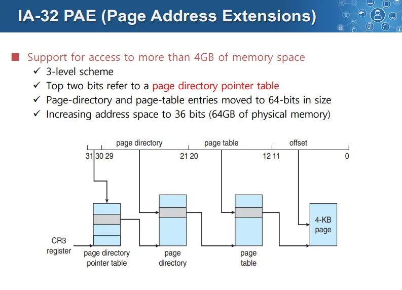

- 4GB이상의 접근을 위해 3단계 페이징을 함
- 3단계를 통해 총 36비트(64GB)메모리로 확장

## x86의 주소 변환

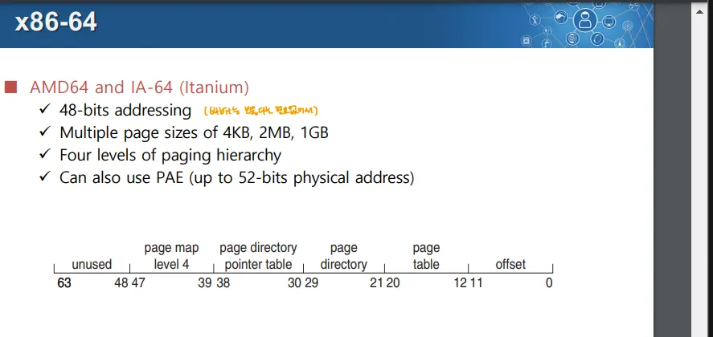

- 48비트 주소 체계
- 4KB, 2MB, 1GB 크기의 페이지를 지원해 메모리 관리 유연성을 높임
- 4단계의 계층적 페이징 구조를 사용
- 64비트일 때는 63\~48까지는 사용하지 않음

## ARM의 주소 변환

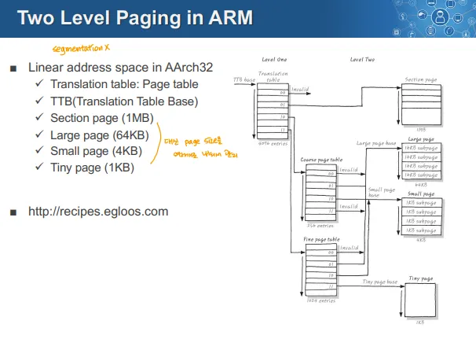

- 세그멘테이션이 없음 → 다른 것들은 섞어서 사용
- TTB로 페이지 테이블 시작 주소 저장
- 다양한 페이지 크원

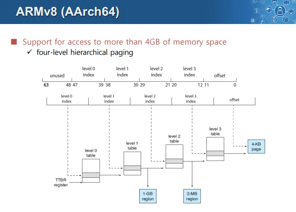

- 최대 52비트 물리주소, 논리 주소는 64비트까지 확장 가능
- 4단계 계층적 페이징 구조
- 사용되지 않는 영역이 존재
