> Notion 원본 페이지의 강의 슬라이드와 설명을 바탕으로 정리한 노트입니다.
***

# Mass Storage(대용량 저장장치)

- HDD(하드 디스크 드라이브)
- SSD(솔리드 스테이트 디스크)
	→ 움직이는 장치 없이 고체 반도체로 구성

- RAM disk
- Magetic Tape(자기 테이프)
⇒ 상대적으로 큰 용량의 영속적으로 데이터를 저장하고, 속도가 느린 저장장치

# Disk Attachment
→ 컴퓨터 시스템에 디스크를 부착해 사용할 때 연결하는 방식
→ 아래 둘 중 하나의 방식으로 사용

1. Host Attached
	- 실제로 I/O  포트로 연결하는 방식
	- IDE, M.2(엠닷투), SCSI 같은 형태에서 많이 사용
2. Network Attached
	- 네트워크로 연결하는 방식
	- NAS, SAN 등

## NAS(Network-Attached Storage)

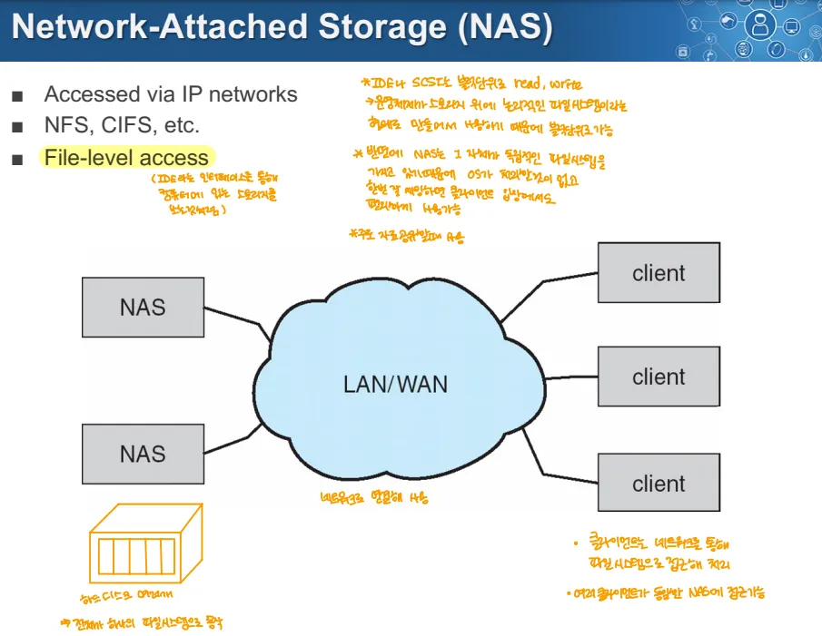

→ 주로 디스크 여러개를 NAS 장치에 꽂아서 이걸 하나의 디스크처럼 사용, 사용할 때 네트워크를 통해 연결

- IP 네트워크를 통해 저장장치에 대한 엑세스를 제공하는 방식
- 주로 사용하는 쪽에서 NFS, CIFS 인터페이스 등을 파일시스템으로 사용해 접근
- NAS는 독립적인 시스템(자체 펌웨어 or OS를 가질 수도 있음)
	- NAS 장치 자체적인 파일 시스템이 있음
	- 따라서 클라이언트의 파일 시스템과는 무관
	- 블럭 단위가 아닌 File 단위로 read, write를 수행함
		→ 클라이언트와 무관하므로 이를 사용하기 위해 파일 이름만 알면 되는 방식인 듯

## SAN(Storage Area Network)

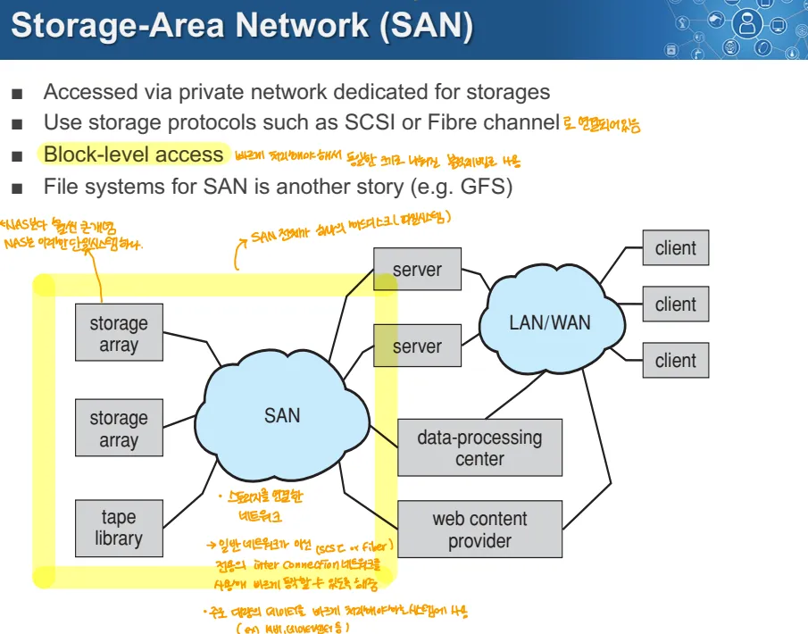

- 저장장치 전용 네트워크를 통해 저장장치에 접근하는 방식
	→ NAS는 LAN/WAN 등을 사용, 따라서 SAN은 대역폭을 사용하지 않음

	- 전용의 고속 네트워크를 통해 고성능으로 사용 가능
- SCSI, Fibre Channel같은 저장소 전용 프로토콜로 사용
	→ 이 프로토콜로 네트워크 상에서 묶어놓은 형태

- 여러 Storage Array를 묶어놓은 형태라 신뢰성이 높음
	→ 장점: 속도 높고, 신뢰성 높음

- 사용자의 시스템에 종속적으로 사용
	- 따라서, 블록 단위로 read, write를 수행
- SAN을 위한 별도 파일 시스템을  사용
	- ex) GFS(대규모 환경에 적합한 파일 시스템)

## 스토리지 분류

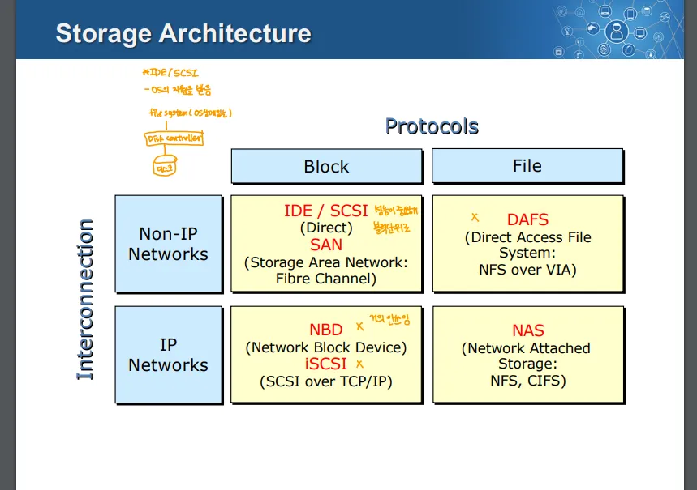

- Interconnection
	- Non-IP network: 인터넷 프로토콜을 사용하지 않는 연결
		- ip가 아닌 다른 네트워크를 사용하는 경우도 포함
	- IP Network: 인터넷 프로토콜을 사용하는 연결
- Protocol
	- Block: 디스크에 블록 단위로 접근해 데이터를 읽고 쓰는 방식
		- OS레벨의 파일 시스템에 의존
	- File: 파일 단위로 데이터를 저장하고 접근
⇒ SAN은 Network Attached지만 IP 네트워크로 동작하지 않고 실질적으로 Host Attached 방식으로 동작

# HDD

## 하드디스크와 OS

- 디스크는 복잡한 물리적 장치
	- 에러, bad block, missed seek(탐색 실패) 등의 복잡한 고려할 요소들이 있음
- OS는 이런 복잡함을 high-level의 소프트웨어가 알 수 없게 처리
	- low level → 디바이스 드라이버(디스크 읽기 시작 등)
	- high level → 파일, 데이터베이스 등
	**⇒ 즉, 저레벨의 복잡성을 숨기고, 고레벨의 파일, 데이터베이스 등으로 디스크를 사용하게 함**

- OS는 각각의 사용자에게 다양한 디스크 접근 수준을 제공
	- 물리적 디스크 블록(surface, cylinder, sector) → 저수준
	- Disk 논리적 블록(disk block 번호) → 고수준
	- 논리적 파일(파일명, 블록, 레코드, 바이트 번호) → 가장 높은 수준

## 하드디스크와의 상호작용

- 디스크 요청 지정에는 많은 정보 필요
	- 실린더 번호, 표면 번호, 트랙 번호, 섹터 번호, 전송 크기 등등
- 구형의 디스크는 운영체제가 모든 정보를 지정, 
	- 따라서 모든 정보를 알아야 함
- 현대 디스크는 더욱 복잡
	- 모든 섹터가 같은 크기가 아님
	- 섹터의 위치가 재배치될 수 있음
- 현대 디스크는 고레벨 인터페이스(ex. SCSI)를 지원
	- 이런 인터페이스는 디스크 컨트롤러를 통해 지원 
		→ SCSI 컨트롤러가 있음
	→ 따라서 OS에서 할 일이 줄어들고, 커널 오버헤드 감소
	
## 하드디스크 구조

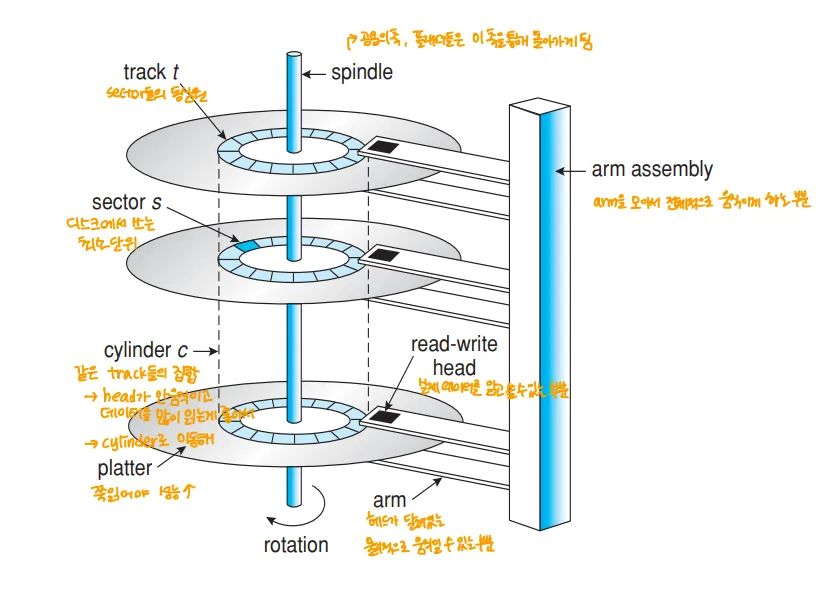

- Spindle → 플래터들의 축
- Platter → 디스크의 돌아가는 접시
- surface → 플래터의 표면
- sector → 디스크 최소 단위
- track → 섹터를 모두 이어 원으로 만든 것
- cyclinder → 각 플러터의 동일한 위치의 트랙의 모음
- arm → 헤드가 달려있는 물리적으로 움직일 수 있는 부분
- read-wirte head → 데이터를 읽고 쓸 수 있는 부분
- arm assembly → arm을 모아 움직이게 하는 부분

## 하드디스크 성능

- Disk의 성능을 여러 단계에 따라 달라짐
- 디스크는 총 3단계로 동작
	1. Seek
		- 디스크 앎을 올바른 실린더로 이동
		- 디스크 작업 중 가장 오래걸리는 작업
			→ 물리적인 움직임에 의해 제한된 속도

	2. Rotation
		- 섹터가 헤드 아래로 올 때 까지 플래터를 회전
		→ 디스크 회전 속도가 높아지면 시간이 감소

	3. Transfer
		- 데이터를 디스크 컨트롤러로 전송하는 과정
		- 디스크에서 데이터를 읽어오는 단계
⇒ 이 중 Seek Time이 가장 오래 걸리므로 HDD 성능 향상을 위해 Seek Time을 감소시켜야 함

	- 디스크에서 어떤 순서대로 탐색하느냐에 따라 탐색 시간에 차이가 큼
**⇒ 즉, seek time이 곧 성능과 직결, 이 seek time을 최소화하는 것이 디스크 스케줄링**
	→ SSD는 랜덤 엑세스가 되서 스케줄링은 없어도 됨
	
# Disk Scheduling
→ 디스크에서 데이터를 어떻게 접근하는지에 대한 순서를 나타낸 것

## 1. FCFS(First Come First Served)

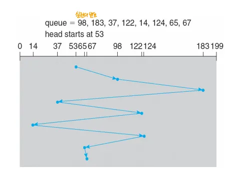

- 디스크 큐에 입/출력 요청이 들어온 순서대로 처리하는 방식
- 장점
	- Starvation이 발생하지 않음
- 단점
	- seek time이 길어짐

## 2. SSTF(Shortest Seek Time First)

- 현재 헤드 위치에서 탐색 시간이 가장 짧은 요청을 먼저 처리
	→ CPU에서 SJF는 실행시간의 예측은 불가 
	→ 디스크는 데이터 위치를 디스크 컨트롤러가 모두 알고 있어 예측 가능

- 장점
	- seek time이 감소
- 단점
	- Starvation이 발생할 수 있음

## 3. SCAN

- 한 방향으로 다른 쪽 끝까지 이동하며 가는 길에 있는 요청을 모두 처리
- “엘레베이터 알고리즘”이라고 부름
- **장점**: **Starvation**이 발생하지 않으며, 디스크 헤드의 이동을 비교적 균등하게 분배(SSTF보다)
- **단점**: 
	- 디스크 헤드가 끝까지 갔다가 다시 돌아오는 과정에서 비효율적인 시간이 발생 가능
	- 요청 처리를 균일하지 못하게 될 수 있음
		- 만일 균일하게 요청이 들어온다고 치면, 
		- 지나온 경로에는 상대적으로 요청을 처리한지 얼마 안되어 처리할 요청이 적고, 
		- 현재 위치의 반대편의 요청들은 대기한지 오래된 상태

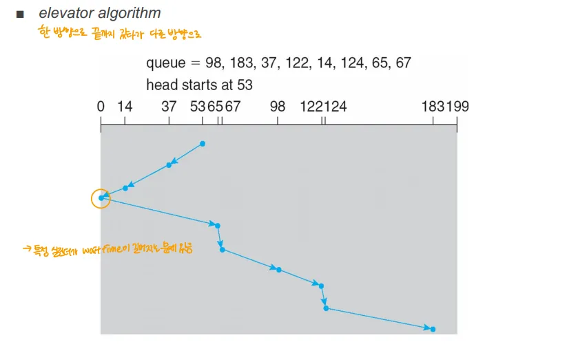

## 4. C-SCAN

- 한 방향으로는 이동만, 다른 방향의 이동할 때 요청을 처리

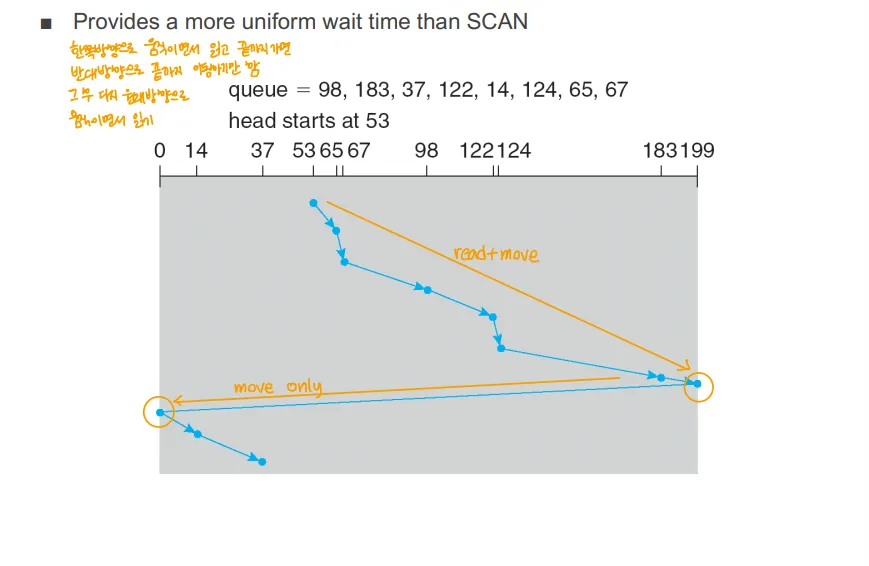

→ SCAN은 디스크 중간의 요청이 끝부분 요청보다 먼저 처리되는 경향이 있음
→ C-SCAN은 상대적으로 균등함

- 장점
	- 상대적으로 SCAN보다 균일하게 요청 처리
- 단점
	- SCAN과 마찬가지의 비효율적인 시간 발생

## 5. LOOK

- 한 방향으로 이동하며 읽고 쓰기를 모두 진행, 끝까지 가지 않고 해당 방향의 가장 마지막 요소까지 이동, 이후 반대로 똑같이 동작
- 장점
	- 헤드 끝까지 가는 것이 아니라 비효율적인 시간 감소
- 단점
	-  마지막 요청 처리 후 돌아오는 시점에 헤드 끝에 생기는 요청은 오랫동안 처리되지 않음

## 6, C-LOOK

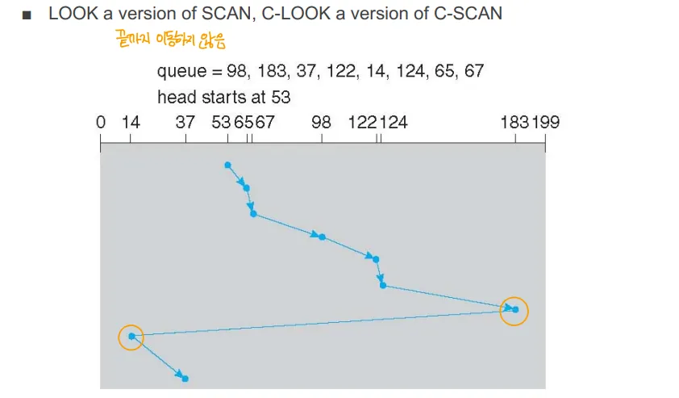

- Look과 동일하게 동작하되, 한쪽 방향으로는 이동만, 반대쪽으로는 읽고 쓰기를 실행
- 장단점 - LOOK과 동일
→ 현대에는 SCAN, C-SCAN, LOOK, C-LOOK을 디스크 컨트롤러가 적절히 섞어서 사용

## 디스크 스케줄링 알고리즘 선택

- 성능은 요청의 수와 종류에 따라 달라짐
	- 보통의 성능 측면에서는 SSFT가 가장 우수
	- 디스크 큐에서 처리를 기다리는 요청이 하나면 모든 알고리즘이 FCFS와 같음
	- SCAN, C-SCAN은 Starvation 가능성이 작아 디스크에 많은 부하를 주는 시스템의 성능 향상
		→ 부하를 많이 줌 → 요청이 많음 → starvation 발생활률 증가 → 따라서 SCAN, C-SCAN 사용
⇒ SSTF를 기반으로 하되, Starvation 방지를 위해 SCAN, C-SCAN, LOOK, C-LOOK을 구분

- 서버와 같이 처리할 요청이 많은 시스템에서 디스크 스케줄링이 특히 중요
- 현대 디스크는 자체적으로 스케줄링을 수행해 운영체제의 스케줄링보다 최적화 된 경우도 있음
	- 운영체제가 수행한 스케줄링을 무시, 되돌리는 경우도 있음

# 디스크 컨트롤러

## 현대의 지능적인 디스크 컨트롤러

- 현대 디스크 컨트롤러는 작은 프로세서와 메모리를 내장해 독립적으로 작업 수행
- I/O 요청은 CPU에서 컨크롤러로 전달되고, 컨트롤러가 이를 처리하는 프로그램을 실행해 요청을 처리

## 주요 기능

1. Read-ahead
	- 현재 트랙의 데이터를 한번에 많이 읽어와 데이터 접근 시간을 감소
		→Spacial Locality 측면의 작업

2. Caching
	- 디스크에서 자주 엑세스하는 데이터를 캐싱해 속도를 높임
3. Request Reordering
	- 탐색 시간 최소화를 위해 디스크 컨트롤러가 요청의 순서를 재조정
	→ 디스크 컨트롤러가 수행하는 스케줄링

4. Request Retry
	- 하드웨어 오류 발생 시 요청을 재시도해 안정성 높임
5. Bad block identification & remapping
	- 디스크의 블록 중 문제가 생김 블록을 찾고 관리, 해당 블록의 데이터를 다른 곳으로 옮기는 것까지 컨트롤러가 처리

# Swap-Space Management
→ 이전에 Virtual memory를 배울 때 메모리 공간이 부족하면 페이지를 디스크로 옮겨야 함 → 그 때 사용하는 공간이 Swap space
→ 본래는 프로세스를 내리는 공간 but 그렇게 하는 현대적 OS는 없음

	- 가상메모리 + 페이징을 함께 사용해 페이지 단위로 스왑을 수행

## Swap-space

- 가상 메모리는 디스크 공간을 메인 메모리의 확장으로 사용
- Swap Space는 보통 물리적 메모리 크기의 2배만큼 할당

## OS별 Swap space

1. Windows계열
	- 일반적인 파일 시스템에 파일로 Swap Space를 생성
	- 장점
		- 필요할 때 파일 크기를 늘리는 것이 쉬움 → 유연성이 좋음
	- 단점
		- 파일이 손상되는 경우 Swap Space사용 불가 → 안정성이 별로
			- 사용자 또는 악의적 프로그램에 의해 파일이 손상되면 Swap Space사용 불가
2. Unix/Linux계열
	- 디스크 파티션을 따로 만들어서 디스크의 별도 공간을 Swap Space로 할당
	- 장점
		- 관리 측면에서 안정적으로 운영 가능 → 안정성 별로
	- 단점
		- Swap Space를 런타임에 확장하는 것이 어려움 → 유연성 별로

## Swap Space Management

- 스왑을 하는 시스템은 파일 시스템에서 함께 구동
- 이는 결국 Virtual Memory와 함께 사용되기 때문에 Swap Space 내부의 데이터는 프레임 단위로 쪼개진 조각 형태로 보관

# RAID

- Redundant Array of Inexpensive(or Independent) Disks
	→ 저렴한 디스크(독립적인 디스크)를 중복으로 배열해놓은 것

- 파일 시스템이 아닌 스토리지 시스템
- 디스크 여러 개를 조합해 안정성, 성능을 개선하려는 기술
	- 디스크는 안정성, 성능이 떨어짐

## RAID의 동기

1. 비용 효율(Inexpensive)
	- 큰 고가의 디스크 사용 대신 저렴한 소형 디스크를 사용해 비용 절감
2. 높은 신뢰성, 높은 데이터 전송률
	- 디스크를 동시에 활용해 높은 신뢰성과 데이터 전송률을 목표로 함

## 신뢰성 향상 방법

### 1. Mirroring(=Shadowing)

- 데이터를 완전히 복사해 두 개의 디스크에 동일한 데이터 저장
- 장점
	- 데이터가 망가져도 백업이 있어 복구 가능
- 단점
	- 디스크 사용량이 2배로 늘어나고 저장 공간 효율이 낮음
		→ 이걸 개선한게 Parity, Error correcting code

### 2. Parity or error correcting code

- 디스크에 데이터 말고 이를 복구하기 위한 패리티 비트를 추가로 저장해 데이터를 검사하고 복구
- 패리티 비트 또는 에러 코렉팅 코드를 통해 다른 데이터와 연산 시 복구 가능
- 장점
	- 저장 공간 사용량이 상대적으로 감소
- 단점
	- 복구를 위해 추가적인 연산이 필요
		→ 미러링은 그냥 읽으면 되서 연산은 필요X

## 성능 향상 방법

### 1. Data Striping

- 데이터를 여러 디스크에 분산 저장해 읽기/쓰기를 나눠서 수행해 시간을 줄임
1. bit level striping
	- 비트 단위로 읽어오는 방식
	- 이렇게 하면 Spacial Locality를 활용할 수 없음
2. block-level strping
	- 디스크 접근 단위인 블럭 단위로 읽어오는 방식
	- 읽을 때 접근 횟수를 줄이고 한 번에 많이 가져옴 → Spacial Locality 증가
→ 결과적으로 블록 레벨 스트라이핑이 효율이 좋음

## 디스크 여러개와 RAID 비교

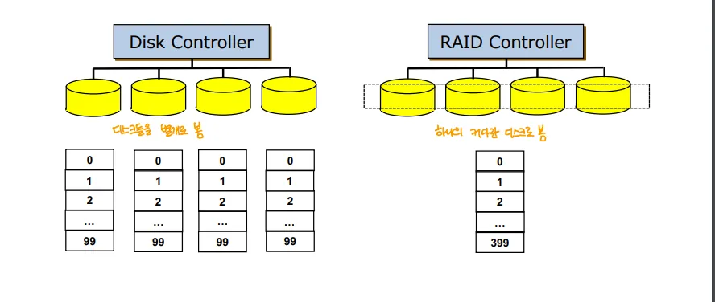

- 디스크 컨트롤러에 여러 디스크를 꽂아서 사용
	- 디스크들을 별개로 봄
- RAID 컨트롤러에 여러 디스크를 연결해 사용
	- OS 레벨에서 보면 하나의 디스크로 보임

## RAID LEVEL
→ 레이드 단계, 방법 정도로 생각

### 1. RAID 0

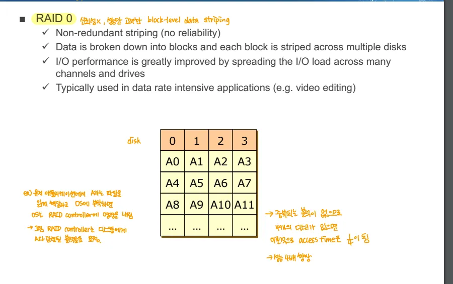

- 별도의 안정성을 위한 조치 없이 Data Striping만 하는 경우
- 데이터를 각 디스크로 쪼개놓고 이를 Data Striping으로 여러 암에서 읽어옴
	- 만일 디스크를 4장 쓰는 경우 이론적으로 접근 시간이 1/4가 됨
- 신뢰성을 1장일 때와 동일 또는 그보다 못함
	- 확률적으로 여러 디스크 중 한 장만 고장나도 데이터를 전부 쓸 수 없게 됨

### 2. RAID 1

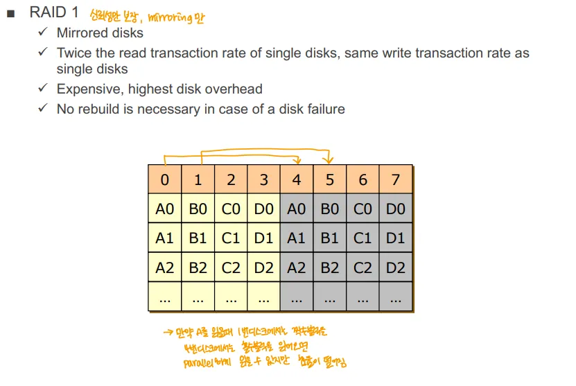

- 성능은 신경쓰지 않고 미러링을 이용해 데이터 신뢰성만 높인 사황
- 이 경우에도 읽기 성능은 향상 → Data Striping 하면 되기 때문
	- 쓰기 성능은 단일 디스크와 동일
- 데이터의 신뢰성 측면에서 좋음 → 디스크 하나가 망가져도 다른 복제본에서 복구 가능
- 디스크 사용량이 배로 증가

### 3. RAID 2

- 에러 코렉션 코드를 사용해 데이터를 보호하는 형태
- 데이터는 비트 단위로 나눠 스트라이핑해서 저장 → bit level striping
- 에러 코렉션 코드를 사용해 비트레벨 연산으로 데이터를 복구
- 디스크 사용량이 RAID 1에 비해 상대적으로 감소

### 4. RAID 3

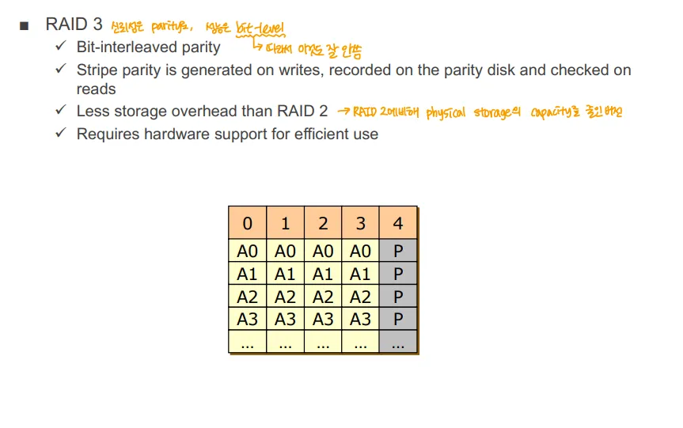

- parity 비트를 사용해 오류를 감지하고 복구
	- 하나의 디스크를 패리티 정보를 저장하는 패리티 디스크로 사용
- 각 비트에 대한 패리티 비트를 저장
- 비트 레벨로 스트라이핑 되어 있음
- 장점
	- 저장 공간 낭비가 적음
	- 단일 디스크 장애는 복구 가능
- 단점
	- 단일 패리티 디스크에 과도한 작업 부하(보틀넥) 발생 가능
	- 읽기/쓰기 속도가 RAID 0보다 낮음

### 5. RAID 4

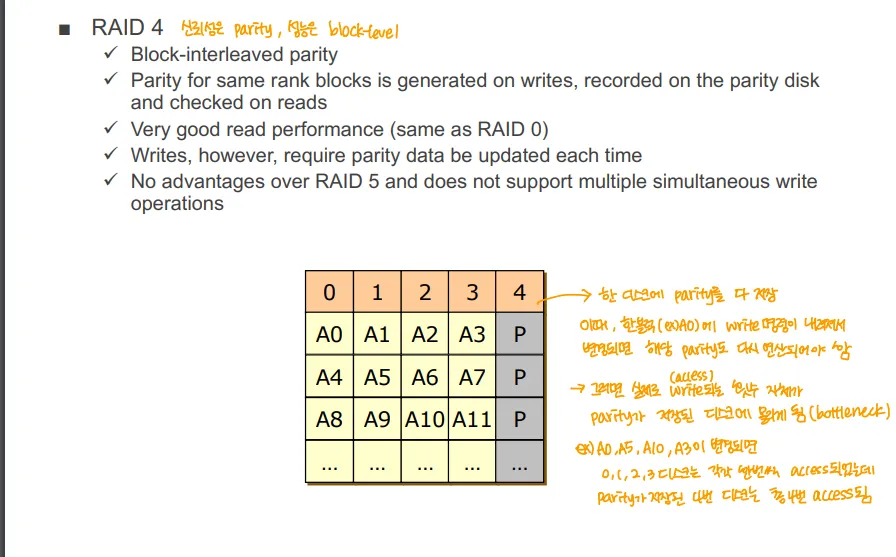

- 각 블럭에 대한 패리티 비트를 저장
- 블럭 레벨 스트라이핑
- 단일 디스크에 패리티 저장
- RAID 3와 동일하게 장애 발생 시 패리티 디스크에 병목 현상 발생
	- 평소에는 패리티 디스크가 잘 쓰이지 않음
→ 이 위(0~4)는 잘 사용하지 않음

### 6. RAID 5

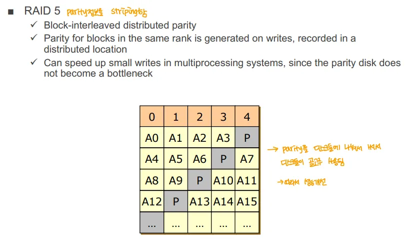

- 블럭 단위에 대한 패리티를 각 디스크에 분산해놓는 것
	- 패리티 비트도 스트라이핑 하는 것
- 장애가 있을 때도 bottle neck이 발생하는 것이 아니라 데이터 스트라이핑을 살릴 수 있음
- 복구 시 성능이 저하되며
- 단일 디스크 장애(1장 고장)시 복구 가능

### 7. RAID 6

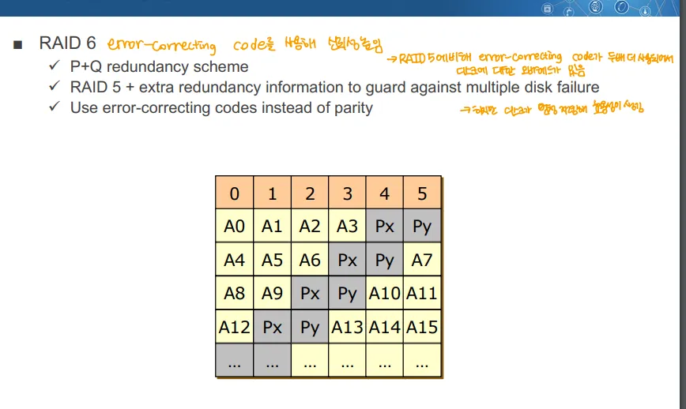

- RAID 5보다 복구 시간이 줄어들고, 두 개 이상의 디스크 장애도 복구 가능
- 패리티 비트 대신에 간소화된 에러 코렉션 코드를 사용
- 각 에러 코렉션 비트도 각 디스크에 분산되어 있음
	- 에러 코렉션 비트도 스트라이핑 되어있음

### 8. RAID 0+1

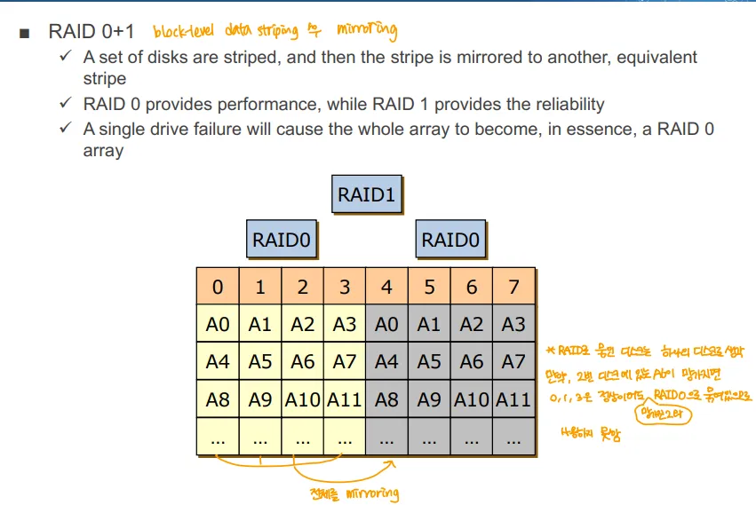

- RAID 0과  RAID 1을 결합
	- RAID 0의 데이터 스트라이핑을 한 후 이를 RAID 1의 미러링을 함
- 장점
	- 성능, 신뢰성 모두 좋아짐
		→ RAID 0이 성능, RAID 1이 신뢰성을 향상

- 문제점
	- 디스크가 많이 필요함 → 당연
	- 데이터가 한 장이라도 망가지면 RAID 0으로 묶인 한 덩어리를 사용할 수 없음
		- 논리적으로 하나의 디스크이기 때문
		- 이때는 RAID 0+1에서 그냥 RAID 0이 되는 꼴, 하나가 사라짐

### 9. RAID 10(1+0)

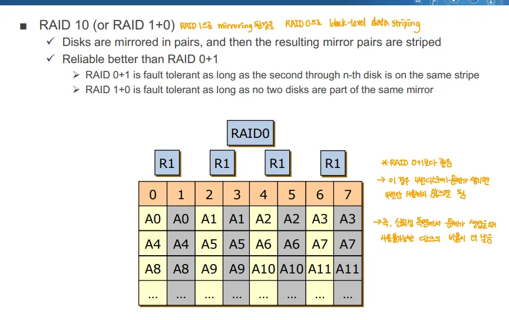

- RAID 0+1의 문제점을 해결한 버전 
- RAID 1과 RAID 0을 결합
	- 데이터를 RAID 1의 미러링을 한 후 이를 RAID 0 방식으로 데이터 스트라이핑
- 장점
	- RAID 0+1보다 안정성이 좋음
→ 서버에서는 보통 RAID 10을 사용
