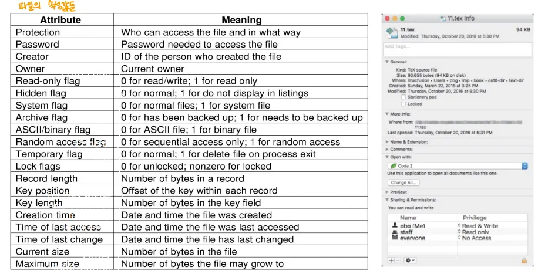
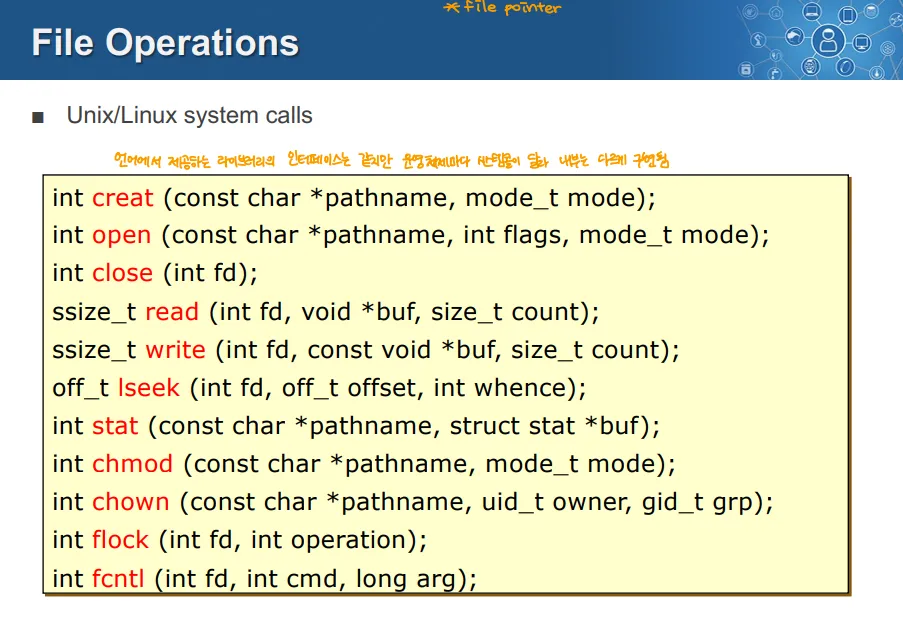
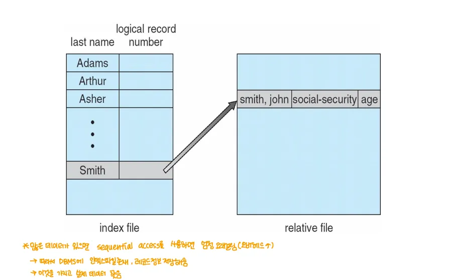
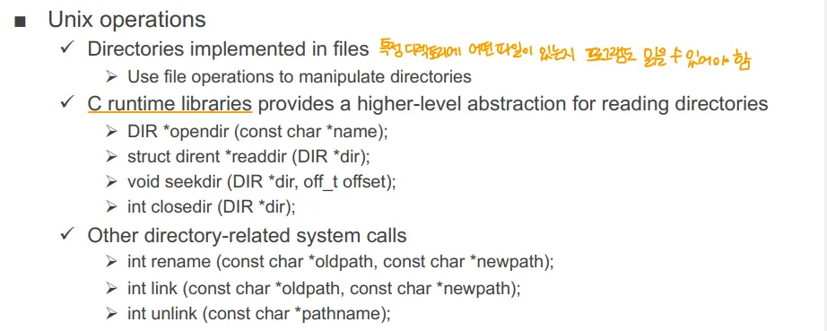
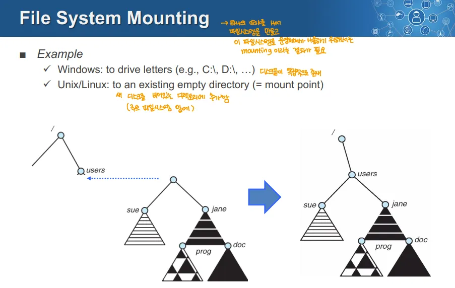
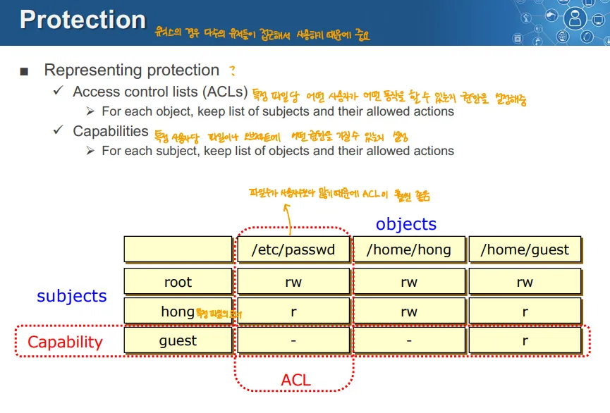
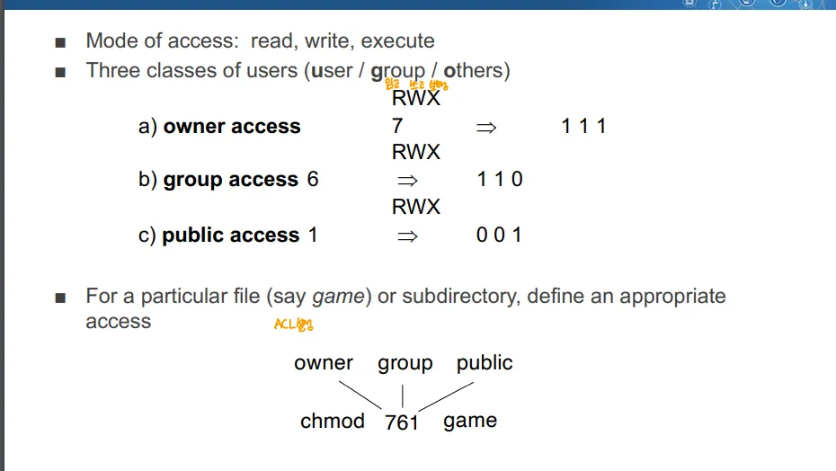
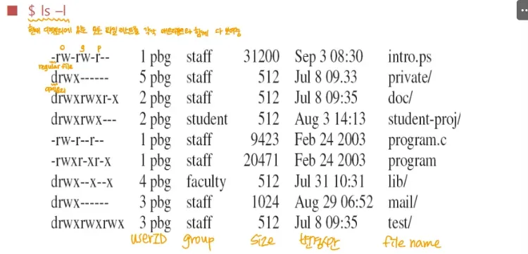
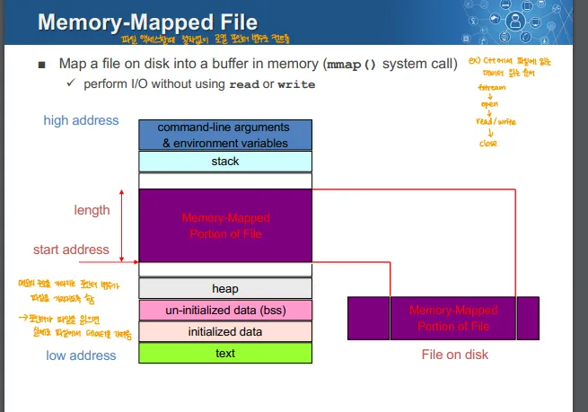

> 원본 Notion 정리 — 강의 슬라이드/설명.
> [← 전체 목차](/posts/학교공부/운영체제/목차/)

***

# Basic Concepts

## 장기 정보 저장에 대한 요구

- 시스템은 매우 큰 데이터를 저장할 수 있어야 함
- 데이터를 사용하는 프로세스가 종료되더라도 정보가 유지되어야 함
- 여러 프로세스가 동시에 동일한 정보에 접근할 수 있어야 함

## 파일 시스템
→ 운영체제 입장에서 체계적으로 보조 저장장치 내부를 관리하게 함

- 파일 시스템은 보조 저장장치를 추상화 ⇒ 파일
	- 사용자가 이해하기 쉽도록 파일의 형태로 데이터를 저장, 관리
- 파일을 논리적으로 정리 ⇒ 디렉토리
- 파일 시스템은 데이터가 여러 프로세스, 사용자, 기기 사이 공유되게 함 ⇒ Sharing
- 잘못된 접근으로부터 데이터를 보호해야함 ⇒ Protection
***

# File
→ 교수님 피셜 ⇒ 파일: 연관되어있는 데이터들을 하나로 묶어놓아 Secondory Storage에 저장하는 개념

- **이름이 지정된 연관된 정보들의 모음이며 보조 저장장치에 기록된 데이터**
- 전원 장애, 시스템 재부팅이 발생해도 데이터는 지속적으로 유지
- OS는 파일을 통해 데이터 저장에 대한 일관된 논리적 뷰를 제공

## File Structure

- Flat
	- 바이트 시퀀스로 나열되어 있는 것
- Structured
	- 줄 단위로 구성
	- 고정 크기의 데이터의 구조체
	- 가변 길이의 데이터의 구조체

## File Attributes

- 각 파일에는 파일 속성을 나타내는 메타데이터가 포함
	- 파일의 접근 권한, 소유자,유형, 위치 등
- 운영체제는 메타데이터를 통해 파일의 용도를 판단하고, 어떤 작업이 가능한지 등을 결정

## File Operation

- 운영체제는 파일을 관리하기 위한 시스템 콜을 지원
- 이를 통해 사용자 프로그램이 파일과 관련된 작업을 수행할 수 있도록 지원
- 이런 시스템 콜이 내부적으로 사용된 라이브러리를 통해 언어레벨에서 File Operation을 지원하며, 이를 통해 애플리케이션이 File operation 수행 가능

→ 이는 Unix의 파일 시스템 콜을 C 라이브러리로 지원하는 것

## File Type

### File의 유형은 세 가지로 분류 가능

1. File System에 의해 해석되는 파일
	- 파일 시스템 내부에서 해석하고 처리하는 파일
	- Ex)
		- 디바이스 파일(Unix, Linux는 I/O 디바이스를 파일 형태로 관리)
		- 디렉토리(폴더)
		- 심볼릭 링크(Windows의 바로가기 같은 것)
2. OS 또는 런타임 라이브러리에서 해석되는 파일
	→ 런타임 라이브러리: 프로그램 실행 시 필요한 리소스를 제공하는 라이브러리

	- OS 또는 런타임 환경에서 해석되는 파일
	- Ex)
		- 실행 파일, 동적 라이브러리 파일
		- 소스 코드, 목적 코드 → 이것들은 엄밀하게는 컴파일러를 통해 이해되는 것
3. 응용 프로그램에서 해석되는 파일
	- 특정 응용 프로그램을 통해 해석하고 사용하는 파일
	- Ex)
		- jpg, mpg, avi, mp3 등

### File Type 인코딩
→ 파일의 타입을 구분하는 방법

1. Windows
	- 확장자(extension)으로 파일 타입을 구분
	- 확장자가 파일 타입을 결정하므로 Windows에서는 필수적
2. Unix/Linux
	- 파일의 내용으로 타입을 구분
		- 따라서 확장자가 필수적이지는 않음
	- EX)
		1. 매직 넘버 → 파일의 시작 부분에 고유한 숫자로 파일 형식을 나타냄
		2. 초기 문자 → 가장 앞에 초기 문자를 통해 파일 형식을 나타냄

## File Access

- 어떤 파일 시스템은 파일 안의 데이터에 접근하기 위한 차별화된 접근 방법을 제공
- 또한 보조 저장장치에 따라 File Access 방법의 성능이 달라짐
	- 하드웨어가 Sequential Access를 지원하는 경우(ex. HDD) Sequential Access 방식을 사용하는 것이 효율적
	- 하드웨어가 Direct Access를 지원하는 경우(ex. SSD), Direct Access 방식을 사용하는 것이 효율적

### 1. Sequential Access

- 파일을 순서대로 한번에 한 바이트씩 읽기

### 2. Direct Access(=Random Access)

- 파일의 특정 위치를 지정해 데이터를 바로 읽거나 쓰는 방식
→ 이 위는 어떻게 접근을 하는지

### 3. Record Access

- 파일을 고정 또는 가변길이의 정보들이 나열된 레코드로 보관
- 레코드 넘버를 통해 순차적으로, 또는 랜덤하게 읽기/쓰기 됨
- Ex) 디렉토리 내부에 디렉토리 내부 파일에 대한 레코드를 만들고 이를 통해 파일에 즉시 접근

### 4. Index Access

- 파일 내부 레코드의 특정 필드에 인덱스를 포함
- 인덱스를 포함한 필드를 가리키는 경우 인덱스를 통해 레코드를 조회
- Ex) DB가 이런 방식

→ 이 위는 어떤 단위로 접근을 하는지
***

# Directory

- 다른 파일들을 묶어서 관리할 수 있는 특수한 파일
- 디렉토리 안에 포함되어있는 파일들의 기본 정보를 모아 만든 특수한 파일
- 사용자에게 파일을 조직화하는 방법을 제공
- 파일 시스템에서 논리적 파일 구성과 물리적 디스크 위치를 분리하도록 돕는 파일

## Hierarchical Directory System

- 대부분의 파일 시스템은 다중 레벨 디렉토리를 지원
	→ 디렉토리의 개념 덕분에  파일 시스템을 계층적으로 사용 가능

- 대부분 파일 시스템은 현재 디렉토리(작업 디렉토리)의 개념을 지원
	- 현재 디렉토리를 기준으로 지정된 경로 → 상대 경로
	- 디렉토리 트리의 루트에서 시작하는 경로 → 절대 경로

## Directory의 내부

- 디렉토리는 특별한 메타데이터를 포함하는 파일
	- 디렉토리와 일반 파일 모두 동일한 Secondary Storage에서 관리
	- 디렉토리 자체도 파일이므로 자기 자신에 대한 속성을 저장
- 디렉토리의 주요 목적은 파일의 메타데이터를 저장하고 관리하는 것
	- 디렉토리는 파일 이름과 파일 속성의 리스트
	- 파일 속성은 주로 파일 크기, 생성 시간, 디스크에서의 위치 등을 포함
- 보통 디렉토리 내부의 내용은 정렬되지 않은 상태로 저장
	- Random Access를 하는 경우가 많이 때문
	- 디렉토리를 읽어서 보여주는 프로그램(ex. 파일 탐색기, 명령어)이 필요에 따라 데이터를 정렬해서 보여줌
		- 그렇지만 실제로는 정려되지 않은 상태

## Directory Operation

- 디렉토리는 파일로 구현되므로 File Operation을 통해 디렉토리를 조작 가능
- C 런타임 라이브러리는 디렉토리를 처리할 수 있는 추상화된 인터페이스를 제공
- 이런 디렉토리를 제어하는 동작들도 시스템 콜 형태로 제공

# Pathname Translation
→ 디렉토리를 통해 계층적으로 파일 시스템을 관리 가능, 따라서 파일의 경로에 대한 개념이 등장

- 절대 경로
	- 파일 시스템의 루트 디렉토리부터 특정 파일까지의 경로
	- 파일의 환경 변수 등을 사용할 때는 절대 경로를 사용
- 상대 경로
	- 특정 폴더를 기준으로 상대적으로 어떤 경로에 파일이 존재하는지를 나타내는 경로
	- 장점
		- 보통 특정 디렉토리 아래의 것을 접근하므로, 상대경로 사용 시 접근 속도 향상
	- 단점
		- 파일의 위치가 바꾸는 경우 상대경로 사용이 불가능
- Linux 시스템에서는 디렉토리를 구분할 때 /(슬래시)를 사용
- Windows 시스템에서는 디렉토리 구분에 \\(역슬래시)를 사용
	- 슬래시는 단일 문자 표현 가능, 역슬래시는 이스케이프 문자로 인해 \\\\같이 2번 써야함

## 경로명 변환(open("/a/b/c"))

1. 루트 디렉토리 / 열기 → /
2. 루트 디렉토리 아래의 디렉토리 a 탐색 → /a
3. 루트 디렉토리 아래의 디렉토리 b 탐색 → /a/b
4.  루트 디렉토리 아래의 파일 c 검색 → /a/b/c
5. 이후 파일 c를 열기
- 이때 각 단계에서 권한이 확인됨

## 경로명 변환의 성능 문제

- 시스템은 각 디렉토리 경로를 단계별로 접근하는데 많은 시간을 사용
- 이를 해결하기 위한 방법
	1. 이를 위해 open과 read,write를 분리
		→ open과 read/write를 분리함으로써, **경로 탐색 비용을 읽기/쓰기 비용과 분리**하고 효율성을 높임

	2. Prefix(접두사)를 캐싱
		- 여러 경로에서 공유된 접두사를 캐싱해 탐색 비용을 줄임
		- Ex) /a/b, /a/bb/, /a/bbb는 모두 /a 접두사를 공유, 이를 캐싱
***

# File System Mounting

## Mount

- 새로운 저장 장치를 파일 시스템에 연결하는 작업
- 마운트를 통해 파일 시스템의 루트 디렉토리 안에 새로운 디레고리 또는 장치가 통합

## Windows의 File System Mounting

- Windows는 물리적 저장장치 또는 물리적 저장장치 내부의 논리적인 파티션이 추가되면 이는 새로운 드라이브로서 분리되게 됨
- 각 드라이브 문자(C:\\, D:\\)를 사용해 각각의 저장장치를 구분
	- 각 드라이브마다 Root가 따로 존재

## Unix/Linux의 File System Mounting

- Unix/Linux 계열에서는 모든 I/O 장치는 파일의 형태로 관리
- 따라서 새로운 저장장치가 연결되더라도 기존 파일 시스템의 Root(/) 내부의 디렉토리에 저장장치를 연결
	- 파일 시스템에 저장장치를 연결해도 이는 Root로부터 시작된 하나의 디렉토리 트리로 보임
	- root는 저장장치와 별개로 유일
***

# File Sharing(=Remote File System)

- 원격의 파일 시스템을 시스템에 마운트 해 로컬 파일 시스템처럼 사용하는 방식
- Client-Server 모델을 통해 클라이언트가 서버로부터 원격의 파일 시스템을 마운트 해서 사용 가능
	- 서버는 여러 사용자에게 파일 시스템을 제공 가능
	- 다만, 클라이언트와 클라이언트 사용자 식별은 안전하지 않거나 복잡할 수 있음
- NFS(Network File System)
	- Unix 계열의 표준 클라이언트-서버 파일 공유 프로토콜
- CIFS(Common Internet FIle System)
	- Windows 환경의 표준 파일 공유 프로토콜
- 분산 정보 시스템(=분산 파일 시스템)에는 전용의 프로토콜이 존재
	- 분산된 원격 파일 시스템을 사용하기 위한 통합된 접근 방식을 제공
***

# Protection

- 시스템의 파일, 디렉토리 등에 대해 누가 어떤 작업을 수행할 수 있는지 권한을 설정하는 것
- Unix/Linux 같은 경우 여러 사용자가 같은 시스템을 공유하는 형태로 사용되기 때문에, 각 파일과 리소스에 대해 적절한 접근 제어(access control)가 필요

## Protection의 구현방식

### 1. Access Control List(ACL)

- 각 객체에 대해 접근 가능한 주체 목록과 그들이 수행 가능한 행동을 저장
- 특정 파일에 해당 파일을 사용 가능한 모든 유저와 그들이 수행 가능한 작업 권한을 저장해서 관리

### 2. Capability

- 각 주체에 대해 어떤 객체에 대해 어떤 작업이 허용되는지 저장
- 특정 유저(계정)에 대해 사용 가능한 파일과 그 권한을 관리

## ACL과 Capability 비교

1. 두 방식의 차이는 권한 테이블이 어떻게 표현되는지에 있음
	- ACL은 객체(파일)별로 접근 가능한 주체(유저)와 허용된 권한 기록
		→ 즉 권한 테이블의 필드가 파일, 내부 값이 유저와 권한

	- Capability는 주체(유저)별로 접근 가능한 객체와 권한 기록
		→ 권한 테이블의 필드가 유저, 내부 값이 파일과 권한

2. Capabilty는 전송하기가 쉬움
	- 마치 Key와 같이 작동하여 다른 유저에게 건네주기가 쉬움
	- 이런 특성을 통해 파일 등의 공유가 간편
3. 실제로는 ACL이 관리하기 쉬움
	- 객체(파일) 중심이므로 권한의 부여와 회수가 쉬움
	- Capability의 경우 유저가 다른 유저에게 권한을 넘겨줄 수 있으므로, 권한 회수를 위해 해당 파일의 권한이 전달된 경로를 추적해야함
	- 또한 보통 파일의 수 > 유저의 수이므로 하나의 Capabilty가 하나의 ACL보다 크기가 큼 → 따라서 관리가 복잡
	→ 그냥 파일을 찾아서 기록을 지우는 것이 간편
	⇒ 따라서 일반적으로 ACL형태로 관리, 필요할 때 Capability를 사용

4. ACL은 파일이 많이 공유될 수록 크기가 커짐
	- 이를 활용하기 위해 Group을 활용 가능
	- Group 사용의 추가적인 이점
		- 그룹 구성원이 변경될 경우 ACL에 해당 그룹이 기록된 모든 객체에 자동으로 반영
			→ 하나하나 파일을 업데이트 하지 않고 모든 파일에 변경이 자동 반영

## Unix/Linux의 Access List 예시

- Linux에서는 파일 권한을 그룹 별로 나눠 부여 → Group을 사용하는 ACL

- Unix/Linux에서 파일 시스템의 접근 권한은 3가지
	- Read, Write, Execute
- Unix/Linux에서 파일은 세 가지 사용자 클래스에 대한 권한 설정 가능
	1. 실제 파일의 소유자 → Owner access
	2. 파일을 사용할 수 있는 그룹 사용자 → Group Access
	3. public하게 사용할 수 있는 사용자 → Public Access
- 권한 설정 방시
	- 권한은 3자리 숫자로 표현
		- 첫 번째 자리는 onwer의 접근 권한
		- 두 번째 자리는 Group의 접근 권한
		- 세 번째 자리는 Public의 접근 권한
	- 특정 자리의 숫자는 read, write, execute 권한의 이진수를 8진수로 변환한 것
		- read, write, execution 권한을 모두 가지면 111→7
		- read, execution 권한만 가지면 101→5
	→ 권한은 총 9비트로 표현됨(한 자리 read,write,execute 3비트 \* 3자리 ⇒ 9비트)

### chmod 761 game

- chmod 권한숫자(3자리) game → game파일에 대한 권한을 설정
- 761은 owner는 7, groupt은 6, public은 1의 권한을 가짐
- 각 read, write, execution자리가 111→7/ 110→6/ 001→1로 설정

- ls -l 명령어를 치면 현재 폴더의 파일들과 권한을 표현해줌
- 가장 앞 문자열이 권한 표시
	- 총 10자리
	- 첫 번째 자리는 파일의 유형
	- 나머지 9자리는 파일의 권한→3자리씩 나눠서 onwer, group, public
		- **drwxrw-r-- → onwer는 모든 권한, group은 read,write만, public은 read만 가능**
→ 이런 권한 관리는 Windows도 가능
***

# Memory-Mapped File

- 응용 프로그램에서 파일을 Read, Write할 때 시스템 콜을 호출해야 함
	- 이런 과정 자체가 커널 오버헤드, 디스크 I/O 오버헤드 등의 오버헤드가 발생 가능
- 파일이 저장된 디스크의 영역을 메모리에 매핑해서 사용 가능
	- 메모리의 Stack과 Heap 사이 어딘가에 매핑
- C 라이브러리 기준 mmap() 시스템 콜을 제공

### 주의할 점

- 파일 크기가 크면 메모리 사용량 등의 오버헤드가 더 커짐
⇒ 따라서 보통 Memory Mapped File로는 작은 파일들을 사용
