> Notion 원본 페이지의 강의 슬라이드와 설명을 바탕으로 정리한 노트입니다.
***

## 1강

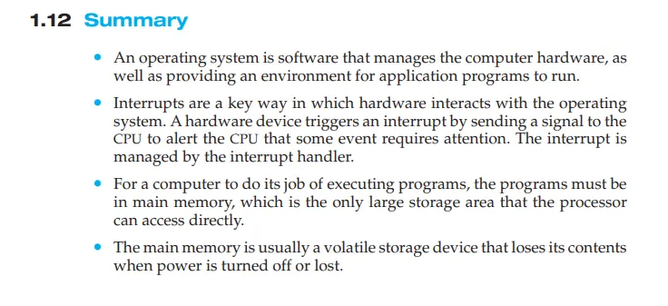

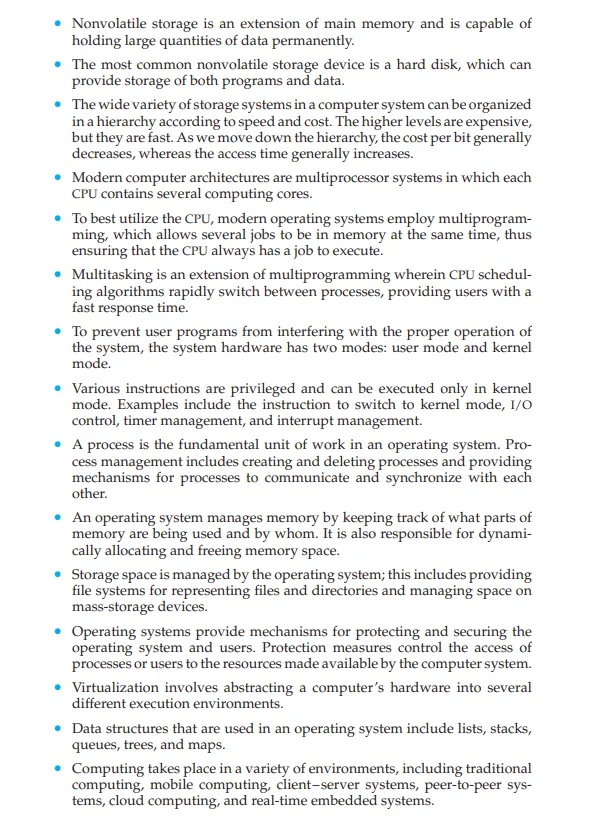

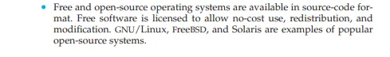

### 요약

- **운영체제**는 컴퓨터 하드웨어를 관리하고 애플리케이션 프로그램이 실행될 수 있는 환경을 제공합니다.
- **인터럽트**는 하드웨어가 운영체제와 상호작용하는 주요 방식입니다. 하드웨어 장치는 CPU에 신호를 보내 인터럽트를 발생시키며, CPU가 주의를 기울여야 할 이벤트가 발생했음을 알립니다. 이 인터럽트는 인터럽트 핸들러에 의해 관리됩니다.
- 컴퓨터가 프로그램을 실행하기 위해서는 **주기억장치(메인 메모리)**에 있어야 하며, 이는 프로세서가 직접 접근할 수 있는 유일한 대용량 저장장치입니다.
- **주기억장치**는 전원이 꺼지면 내용을 잃어버리는 휘발성 저장장치입니다.
- **비휘발성 저장장치**는 주기억장치의 확장으로, 데이터를 영구적으로 저장할 수 있습니다. 가장 일반적인 비휘발성 저장장치는 하드 디스크로, 프로그램과 데이터를 저장할 수 있습니다.
- 컴퓨터 시스템의 저장 시스템은 속도와 비용에 따라 계층적으로 구성됩니다. 상위 계층은 비싸지만 빠르고, 하위 계층으로 갈수록 비용은 감소하지만 접근 속도도 느려집니다.
- 현대 컴퓨터 구조는 **멀티프로세서 시스템**으로, 각 CPU가 여러 컴퓨팅 코어를 포함합니다.
- 운영체제는 **멀티프로그래밍**을 사용하여 여러 작업이 동시에 메모리에 존재하도록 하여 CPU가 항상 작업을 수행할 수 있도록 합니다.
- **멀티태스킹**은 CPU 스케줄링 알고리즘을 통해 여러 프로세스 간에 빠르게 전환하여 사용자에게 빠른 응답 시간을 제공합니다.
- 시스템 하드웨어는 사용자 프로그램이 시스템의 적절한 작동을 방해하지 않도록 **사용자 모드**와 **커널 모드**의 두 가지 모드를 사용합니다.
- 특정 명령어는 특권을 가지며 커널 모드에서만 실행할 수 있습니다. 예를 들어 커널 모드로 전환, I/O 제어, 시간 관리, 인터럽트 관리는 커널 모드에서 수행됩니다.
- **프로세스**는 운영체제의 기본 단위입니다. 프로세스 관리는 프로세스를 생성하고 삭제하며, 프로세스 간의 통신과 동기화를 위한 메커니즘을 제공합니다.
- 운영체제는 메모리에서 어느 부분이 사용 중인지, 누가 사용하는지를 기록하며 메모리 공간을 동적으로 할당하고 해제하는 역할도 합니다.
- 저장 공간은 파일과 디렉토리를 나타내는 파일 시스템을 포함하여 운영체제에 의해 관리됩니다.
- 운영체제는 시스템의 프로세스와 사용자 접근을 제어하는 보호 메커니즘을 제공합니다.
- **가상화**는 컴퓨터의 하드웨어를 여러 다른 실행 환경으로 추상화하는 것을 의미합니다.
- 운영체제에서 사용하는 **데이터 구조**에는 리스트, 스택, 큐, 트리, 맵 등이 포함됩니다.
- 컴퓨터 작업은 전통적인 컴퓨팅 모델, 클라이언트-서버 시스템, 피어-투-피어 시스템, 클라우드 컴퓨팅, 실시간 임베디드 시스템을 포함하는 다양한 환경에서 수행됩니다.
- 무료 및 **오픈 소스 운영체제**는 소스 코드 형식으로 제공됩니다. 자유 소프트웨어는 비용 없이 사용, 재배포, 수정이 가능하며, GNU/Linux, FreeBSD, Solaris 등이 인기 있는 오픈 소스 시스템의 예시입니다.
***

## 2강

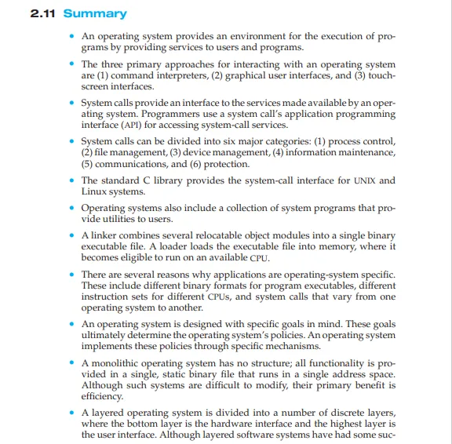

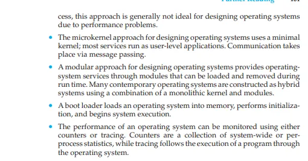

### 요약 (2.11 Summary)

- 운영체제는 사용자와 프로그램에게 서비스를 제공하여 프로그램 실행을 위한 환경을 제공합니다.
- 운영체제와 상호작용하는 세 가지 주요 접근 방식은 (1) 명령어 인터프리터, (2) 그래픽 사용자 인터페이스, (3) 터치스크린 인터페이스입니다.
- 시스템 호출은 운영체제에서 제공하는 서비스를 위한 인터페이스를 제공합니다. 프로그래머는 시스템 호출 API를 사용하여 시스템 서비스를 호출합니다.
- 시스템 호출은 6가지 주요 범주로 나눌 수 있습니다: (1) 프로세스 제어, (2) 파일 관리, (3) 장치 관리, (4) 정보 유지, (5) 통신, (6) 보호.
- 표준 C 라이브러리는 UNIX 및 Linux 시스템을 위한 시스템 호출 인터페이스를 제공합니다.
- 운영체제는 사용자에게 유틸리티 프로그램을 제공하는 시스템 프로그램 모음도 포함합니다.
- 링커는 여러 개의 재배치 가능한 개체 모듈을 단일 바이너리 실행 파일로 결합합니다. 로더는 실행 파일을 메모리에 로드하여 실행 가능한 상태로 만듭니다.
- 응용 프로그램이 운영체제에 종속되는 여러 가지 이유가 있습니다. 여기에는 프로그램 실행 파일의 이진 형식, 다양한 CPU에 대한 명령어 세트, 운영체제마다 다른 시스템 호출이 포함됩니다.
- 운영체제는 특정 목표를 염두에 두고 설계됩니다. 이러한 목표는 운영체제의 정책을 결정하며, 운영체제는 이러한 정책을 특정 메커니즘을 통해 구현합니다.
- **모놀리식 운영체제**는 구조가 없으며, 모든 기능이 단일 주소 공간에서 실행되는 단일 정적 바이너리 파일로 실행됩니다. 수정이 어렵지만, 이러한 시스템의 주요 장점은 효율성입니다.
- **계층형 운영체제**는 여러 개의 구분된 계층으로 나누어집니다. 하드웨어 인터페이스가 아래에 있고, 사용자 인터페이스가 위에 위치합니다. 이러한 계층형 소프트웨어 시스템은 수정이 어려울 수 있지만, 주요 장점은 구조적 정리입니다.
- **마이크로커널 접근 방식**은 최소한의 커널을 사용하여 운영체제를 설계하며, 대부분의 서비스는 사용자 수준 애플리케이션으로 실행됩니다. 통신은 메시지 전달을 통해 이루어집니다.
- **모듈형 접근 방식**은 실행 중에 로드 및 제거할 수 있는 모듈을 통해 운영체제 서비스를 제공합니다. 많은 현대 운영체제는 모놀리식 커널과 모듈을 결합하여 하이브리드 시스템으로 구성됩니다.
- **부트 로더**는 운영체제를 메모리에 로드하고 초기화를 수행한 후 시스템 실행을 시작합니다.
- 운영체제 성능은 **카운터**나 **트레이싱**을 사용하여 모니터링할 수 있습니다. 카운터는 시스템 전체 또는 프로세스별 통계를 수집하고, 트레이싱은 운영체제를 통해 프로그램 실행을 추적합니다.
***

## 3강

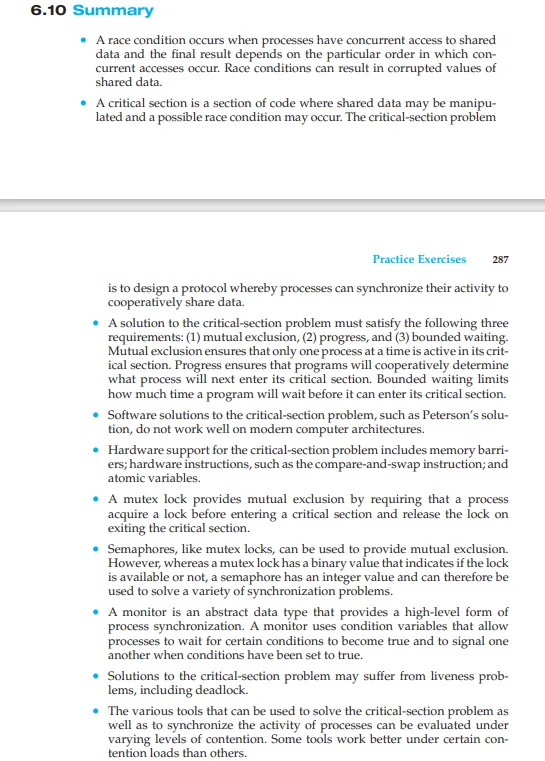

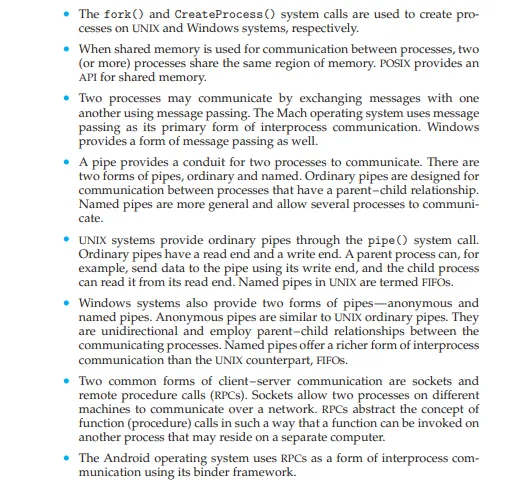

### 3.9 요약 (Summary)

- **프로세스**는 실행 중인 프로그램이며, 프로세스의 현재 활동 상태는 프로그램 카운터와 다른 레지스터들에 의해 나타납니다.
- 프로세스의 메모리 배치는 4개의 다른 섹션으로 나타납니다: (1) 텍스트, (2) 데이터, (3) 힙, (4) 스택.
- 프로세스가 실행되면서 상태가 변화합니다. 프로세스의 네 가지 일반적인 상태는 다음과 같습니다: (1) 준비(ready), (2) 실행 중(running), (3) 대기 중(waiting), (4) 종료(terminated).
- \*프로세스 제어 블록(PCB)**는 운영체제에서 프로세스를 나타내는 커널 데이터 구조입니다.
- 프로세스 스케줄러의 역할은 실행 가능한 프로세스를 선택하여 CPU에서 실행하는 것입니다.
- 운영체제는 하나의 프로세스에서 다른 프로세스로 전환할 때 **문맥 전환(context switch)**을 수행합니다.
- `fork()`와 `CreateProcess()` 시스템 호출은 각각 UNIX와 Windows 시스템에서 프로세스를 생성하는 데 사용됩니다.
- **공유 메모리**는 두 개 이상의 프로세스가 메모리의 동일한 영역을 공유할 때 사용됩니다. POSIX는 공유 메모리에 대한 API를 제공합니다.
- 두 프로세스는 **메시지 전달(message passing)**을 통해 통신할 수 있습니다. Mach 운영체제는 메시지 전달을 주요 통신 방법으로 사용하며, Windows도 유사한 형태의 메시지 전달을 제공합니다.
- \*파이프(pipe)**는 두 프로세스가 통신하는 방법입니다. 파이프는 보통 파이프와 이름 있는 파이프로 구분됩니다. 보통 파이프는 부모-자식 관계의 프로세스 간 통신에 사용되며, 이름 있는 파이프는 더 일반적이며 여러 프로세스가 통신할 수 있게 합니다.
- **UNIX 시스템**은 `pipe()` 시스템 호출을 통해 보통 파이프를 제공합니다. 보통 파이프는 읽기 끝과 쓰기 끝을 가지며, 부모 프로세스는 쓰기 끝으로 데이터를 보내고, 자식 프로세스는 읽기 끝에서 이를 읽습니다. UNIX의 이름 있는 파이프는 FIFO로 구현됩니다.
- **Windows 시스템**도 익명 파이프와 이름 있는 파이프 두 가지 형식을 제공합니다. 익명 파이프는 보통 파이프와 유사하며, 부모-자식 관계의 프로세스 간 단방향 통신을 제공합니다. 이름 있는 파이프는 UNIX에서 제공하는 FIFO와 비슷한 형태의 통신을 제공합니다.
- 클라이언트-서버 통신의 두 가지 일반적인 형태는 **소켓(socket)**과 **원격 프로시저 호출(RPC)**입니다. 소켓은 서로 다른 기계에 있는 프로세스가 네트워크를 통해 통신할 수 있게 합니다. RPC는 네트워크의 다른 컴퓨터에서 함수를 호출할 수 있도록 기능을 추상화하여 같은 컴퓨터에 있지 않은 프로세스에서도 함수가 실행될 수 있도록 합니다.
- **안드로이드 운영체제**는 Binder 프레임워크를 사용하여 RPC를 통해 상호 프로세스 통신을 수행합니다.
***

## 4강

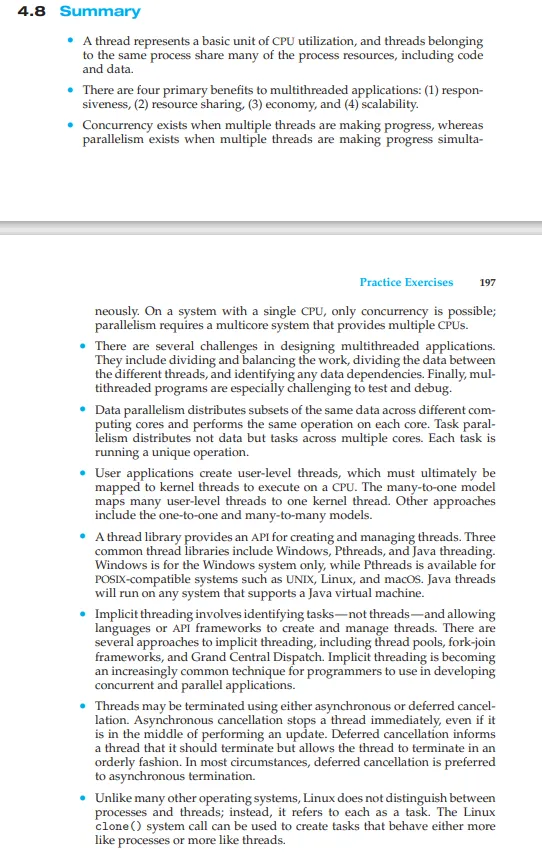

### 4.8 요약 (Summary)

- **스레드**는 CPU 사용의 기본 단위를 나타내며, 동일한 프로세스에 속한 스레드들은 코드와 데이터를 포함하여 많은 자원을 공유합니다.
- 다중 스레드 애플리케이션의 4가지 주요 이점은 다음과 같습니다: (1) 응답성, (2) 자원 공유, (3) 경제성, (4) 확장성.
- \*동시성(concurrency)**은 여러 스레드가 동시에 진행 중일 때 발생하며, **병렬성(parallelism)**은 여러 스레드가 동시에 진행하는 경우에 발생합니다.
- 단일 CPU 시스템에서는 동시성만 가능하지만, 병렬성을 위해서는 다중 CPU를 제공하는 멀티코어 시스템이 필요합니다.
- 다중 스레드 애플리케이션 설계에는 여러 도전 과제가 있습니다. 작업을 나누고 균형을 맞추는 것, 스레드 간 데이터를 분배하는 것, 데이터 종속성을 식별하는 것이 포함됩니다. 특히 다중 스레드 프로그램은 테스트하고 디버그하기 어려운 경우가 많습니다.
- **데이터 병렬성**은 여러 컴퓨팅 코어에서 동일한 데이터를 분산 처리하며, 각 코어에서 동일한 작업을 수행합니다. **작업 병렬성**은 데이터가 아닌 작업을 여러 코어에 분산하여 각각 고유한 작업을 실행합니다.
- 사용자 애플리케이션은 사용자 수준의 스레드를 생성하며, 이를 **커널 스레드**에 매핑하여 CPU에서 실행됩니다. **many-to-one 모델**은 많은 사용자 스레드를 하나의 커널 스레드에 매핑합니다. 다른 접근 방식으로 **one-to-one**과 **many-to-many** 모델이 있습니다.
- 스레드 라이브러리는 스레드를 생성하고 관리할 수 있는 API를 제공합니다. 세 가지 공통 스레드 라이브러리는 Windows, Pthreads, Java 스레딩입니다. Windows는 Windows 시스템 전용이며, Pthreads는 UNIX, Linux, macOS와 같은 POSIX 호환 시스템에서 사용됩니다. Java 스레드는 Java 가상 머신을 지원하는 시스템에서 실행됩니다.
- \*암시적 스레딩(Implicit threading)**은 스레드가 아닌 작업을 식별하여 API나 언어가 스레드를 자동으로 생성하고 관리할 수 있도록 합니다. 암시적 스레딩의 몇 가지 접근 방식에는 **스레드 풀, 포크-조인 프레임워크, 그랜드 센트럴 디스패치** 등이 있습니다.
- 스레드는 **비동기** 또는 **연기된 종료**를 통해 종료될 수 있습니다. 비동기 취소는 즉시 스레드를 종료하고, 연기된 취소는 스레드가 정상적으로 종료할 수 있도록 시간을 제공합니다.
- Linux 운영체제는 프로세스와 스레드를 구분하지 않으며, 대신 **작업(task)**으로 취급합니다. `clone()` 시스템 호출은 프로세스를 생성할 때 스레드처럼 작동하는 작업을 생성하는 데 사용됩니다.
***

## 5강

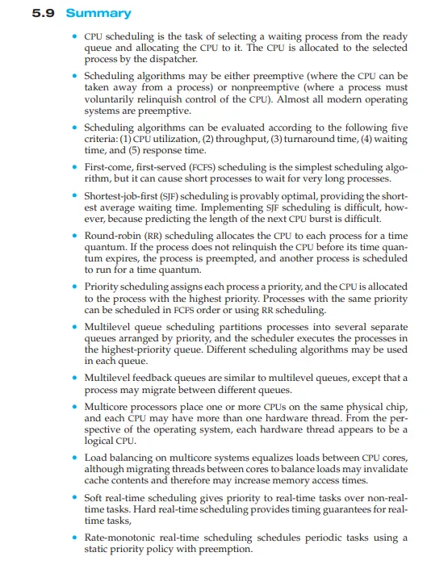

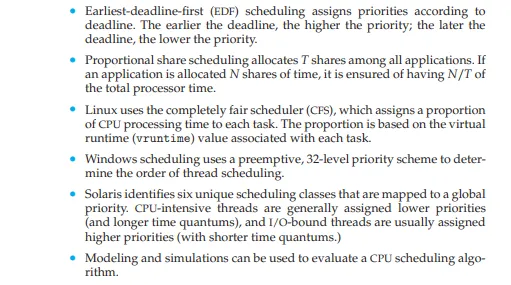

### 5.9 요약 (Summary)

- **CPU 스케줄링**은 준비 큐에서 대기 중인 프로세스를 선택하고 CPU를 할당하는 작업입니다. CPU는 디스패처에 의해 선택된 프로세스에 할당됩니다.
- **스케줄링 알고리즘**은 선점형(프로세스에서 CPU를 빼앗을 수 있음) 또는 비선점형(프로세스가 자발적으로 CPU의 제어권을 포기)일 수 있습니다. 대부분의 현대 운영체제는 선점형입니다.
- **스케줄링 알고리즘**은 다음의 다섯 가지 기준에 따라 평가될 수 있습니다: (1) CPU 사용률, (2) 처리량, (3) 반환 시간, (4) 대기 시간, (5) 응답 시간.
- **First-come, first-served (FCFS) 스케줄링**은 가장 단순한 스케줄링 알고리즘이지만, 짧은 프로세스가 긴 프로세스를 기다리게 할 수 있습니다.
- **Shortest-job-first (SJF) 스케줄링**은 평균 대기 시간이 가장 짧은 최적의 방법이지만, 다음 CPU 버스트의 길이를 예측하는 것이 어렵기 때문에 구현하기가 어렵습니다.
- **Round-robin (RR) 스케줄링**은 각 프로세스에 일정 시간 동안 CPU를 할당합니다. 프로세스가 시간 할당량 내에 CPU를 포기하지 않으면 선점되며, 다른 프로세스가 다음 시간 할당량 동안 실행됩니다.
- **우선순위 스케줄링**은 각 프로세스에 우선순위를 부여하고, 우선순위가 높은 프로세스에 CPU를 할당합니다. 같은 우선순위를 가진 프로세스는 FCFS 또는 RR로 스케줄링됩니다.
- **다단계 큐 스케줄링**은 프로세스를 여러 개의 큐로 나누며, 각 큐는 우선순위에 따라 스케줄링됩니다. 다른 스케줄링 알고리즘이 각 큐 내에서 사용될 수 있습니다.
- **다단계 피드백 큐**는 다단계 큐와 유사하지만, 프로세스가 다른 큐로 이동할 수 있다는 차이가 있습니다.
- **멀티코어 프로세서**는 동일한 물리적 칩에 여러 개의 CPU를 배치하며, 각 CPU는 두 개 이상의 하드웨어 스레드를 가질 수 있습니다. 운영체제의 관점에서 각 하드웨어 스레드는 논리적 CPU로 취급됩니다.
- **로드 밸런싱**은 멀티코어 시스템에서 CPU 코어 간의 부하를 균등하게 분배하는 것을 의미하며, 스레드가 코어 간 이동할 때 메모리 접근 시간이 증가할 수 있습니다.
- **소프트 실시간 스케줄링**은 실시간 작업에 높은 우선순위를 부여하며, 비실시간 작업은 낮은 우선순위를 가집니다.
- **하드 실시간 스케줄링**은 실시간 작업에 대해 시간 보장을 제공합니다.
- **Rate-monotonic 실시간 스케줄링**은 선점형 정적 우선순위 정책을 사용하여 주기적인 작업을 스케줄링합니다.
- **Earliest-deadline-first (EDF) 스케줄링**은 데드라인에 따라 우선순위를 부여합니다. 데드라인이 가까울수록 우선순위가 높습니다.
- **Proportional share 스케줄링**은 애플리케이션들 사이에 T개의 지분을 할당합니다. 애플리케이션이 N개의 지분을 할당받으면 전체 프로세서 시간의 N/T를 보장받습니다.
- **Linux**는 **완전 공정 스케줄러(CFS)**를 사용하여 각 작업에 대해 CPU 처리 시간을 할당합니다. 이 비율은 각 작업과 관련된 가상 실행 시간(`vruntime`)에 기반하여 결정됩니다.
- **Windows 스케줄링**은 선점형 32레벨 우선순위 체계를 사용하여 스레드 스케줄링 순서를 결정합니다.
- **Solaris**는 6개의 고유한 스케줄링 클래스를 정의하고, 이를 전역 우선순위에 매핑합니다. CPU 집중형 스레드는 일반적으로 낮은 우선순위(긴 시간 할당량)를 부여받고, I/O 집중형 스레드는 높은 우선순위(짧은 시간 할당량)를 부여받습니다.
- **모델링 및 시뮬레이션**은 CPU 스케줄링 알고리즘을 평가하는 데 사용될 수 있습니다
***

## 6강

### 6.10 요약 (Summary)

- \*경쟁 상태(race condition)**는 여러 프로세스가 공유 데이터를 동시에 접근하여 최종 결과가 액세스 순서에 따라 달라질 때 발생하며, 이로 인해 공유 데이터 값이 손상될 수 있습니다.
- \*임계 구역(critical section)**은 공유 데이터가 조작될 수 있는 코드 부분으로, 이 부분에서 경쟁 상태가 발생할 가능성이 있습니다. **임계 구역 문제**는 프로세스가 공유 데이터를 협력적으로 사용할 수 있도록 동작을 동기화하는 프로토콜을 설계하는 것입니다.
- **임계 구역 문제 해결책**은 다음 세 가지 요구사항을 충족해야 합니다: (1) 상호 배제(mutual exclusion), (2) 진행(progress), (3) 한정 대기(bounded waiting). 상호 배제는 한 번에 한 프로세스만 임계 구역에 있을 수 있음을 보장하며, 진행은 프로세스가 어느 프로세스가 임계 구역에 들어갈지 협력적으로 결정하는 것을 의미합니다. 한정 대기는 프로그램이 임계 구역에 들어가기까지 기다릴 수 있는 시간을 제한합니다.
- **Peterson의 솔루션**과 같은 임계 구역 문제의 소프트웨어 솔루션은 현대 컴퓨터 아키텍처에서는 제대로 작동하지 않습니다.
- 임계 구역 문제에 대한 **하드웨어 지원**은 메모리 장벽(memory barriers), **compare-and-swap 명령**과 같은 하드웨어 명령어 및 원자적 변수(atomic variables)를 포함합니다.
- **뮤텍스 락**은 프로세스가 임계 구역에 들어가기 전에 락을 획득하고, 임계 구역을 나갈 때 락을 해제함으로써 상호 배제를 제공합니다.
- **세마포어**는 뮤텍스 락과 유사하게 상호 배제를 제공할 수 있습니다. 그러나 뮤텍스는 락이 사용 가능한지 여부를 나타내는 이진 값(binary value)을 가지는 반면, 세마포어는 정수 값을 가지며 다양한 동기화 문제를 해결하는 데 사용할 수 있습니다.
- **모니터**는 프로세스 동기화에 대한 고수준의 추상화된 데이터 타입입니다. 모니터는 특정 조건이 참이 될 때까지 프로세스가 기다리도록 허용하며, 다른 조건이 참일 때 신호를 보냅니다.
- 임계 구역 문제의 해결책은 교착 상태(deadlock)와 같은 **활발성 문제(liveness problems)**로 이어질 수 있습니다.
- **임계 구역 문제**를 해결하는 데 사용되는 여러 도구는 프로세스의 동기화를 위해 사용되며, 경쟁 상태를 해결하는 데 효과적입니다. 일부 도구는 특정 경쟁 상태 하에서만 작동합니다.
***

## 7강

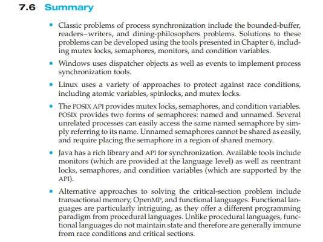

### 7.6 요약 (Summary)

- 프로세스 동기화의 고전적인 문제로는 **bounded-buffer 문제**, **readers-writers 문제**, **dining-philosophers 문제**가 포함됩니다. 이러한 문제들의 해결책은 6장에서 설명한 도구들, 즉 **뮤텍스 락**, **세마포어**, **모니터**, **조건 변수**를 사용하여 개발할 수 있습니다.
- **Windows**는 **디스패처 객체** 및 이벤트를 사용하여 프로세스 동기화 도구를 구현합니다.
- **Linux**는 **원자적 변수**, **스핀락**, **뮤텍스 락**을 포함한 다양한 방법을 사용하여 경쟁 상태로부터 보호합니다.
- **POSIX API**는 **뮤텍스 락**, **세마포어**, **조건 변수**를 제공합니다. POSIX는 두 가지 유형의 세마포어를 제공합니다: **이름 있는 세마포어**와 **이름 없는 세마포어**입니다. 서로 관련이 없는 프로세스도 같은 이름의 세마포어를 참조하여 쉽게 접근할 수 있습니다. 이름 없는 세마포어는 공유할 수 있으며, 공유 메모리 영역에 세마포어를 배치해야 합니다.
- **Java**는 풍부한 **동기화 라이브러리**와 API를 제공합니다. 사용 가능한 도구로는 언어 수준에서 제공되는 **모니터**, **재진입 락(reentrant locks)**, **세마포어**, 그리고 API에서 지원하는 **조건 변수**가 포함됩니다.
- **임계 구역 문제**를 해결하는 대안적 접근 방식으로는 **트랜잭셔널 메모리**, **OpenMP**, **함수형 언어**가 있습니다. 함수형 언어는 특히 흥미로운데, 이는 절차적 언어와는 다른 프로그래밍 패러다임을 제공하기 때문입니다. 절차적 언어와 달리 함수형 언어는 상태를 유지하지 않으므로 **경쟁 상태** 및 **임계 구역 문제**에서 일반적으로 자유롭습니다.
