> 원본 Notion 정리 — 강의 슬라이드 이미지 + 설명.

***

## 목차
### **1. 기본적인 단어의 이해**

- Message (메시지)
- Sender (송신자)
- Receiver (수신자)
- Medium (전송 매체)
- Protocol (프로토콜)
### **2. MAC 계층 (L2 - Data Link Layer)**
### **2.1 Multiple Access Protocols (다중 접속 프로토콜)**

- Random-access protocols
- Controlled-access protocols
- Channelization protocols
### **2.2 CSMA/CD (Carrier Sense Multiple Access with Collision Detection)**

- 이더넷, 초고속 인터넷, 광랜, IEEE 802.3
- 충돌 감지 및 중단 메커니즘
- Flow diagram
### **2.3 CSMA/CA (Carrier Sense Multiple Access with Collision Avoidance)**

- 무선랜, WiFi, IEEE 802.11
- Inter-frame space, Contention window, ACK
- RTS/CTS 프레임
- NAV (Network Allocation Vector)
- Hidden station problem
### **2.4 Flow and Error Control**

- Flow Control (흐름 제어)
- Error Control (오류 제어)
- Best-Effort 철학
### **3. Network 계층 (L3 - Network Layer)**
### **3.1 Network Layer 기본 개념**

- Packetizing (패킷화)
- Routing and Forwarding (라우팅과 포워딩)
### **3.2 Datagram Approach**

- Connectionless packet-switched network
- Host-to-Host communication
- Forwarding process in router
### **3.3 IP Protocol**

- IP 프로토콜의 위치
- IP Datagram format
- Header 구조
### **3.4 IP Addressing (IPv4)**

- 32-bit 주소 체계
- Binary, Dotted-decimal, Hexadecimal 표기법
- Hierarchy in addressing (Prefix/Suffix)
- Slash notation (CIDR)
- Network address 추출
- Forwarding table
### **3.5 네트워크 기술 이해**

- IP Address 개념
- Domain Name
- Domain Name System (DNS)
- Dynamic Host Configuration Protocol (DHCP)
- Network Address Translation (NAT)
- Port Address Translation (PAT)
- Private IP vs Public IP
### **4. 기술적 시사점**

- **MAC Layer**: QoS 저하 (충돌, 손실)
- **Network Layer**: Connectionless 특성과 서비스 설계 고려사항
***

***

# Basic Terminologies(기초적인 용어)

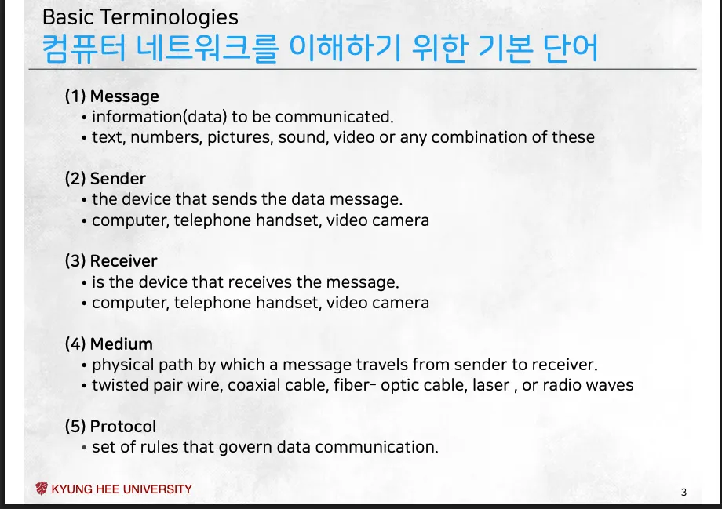

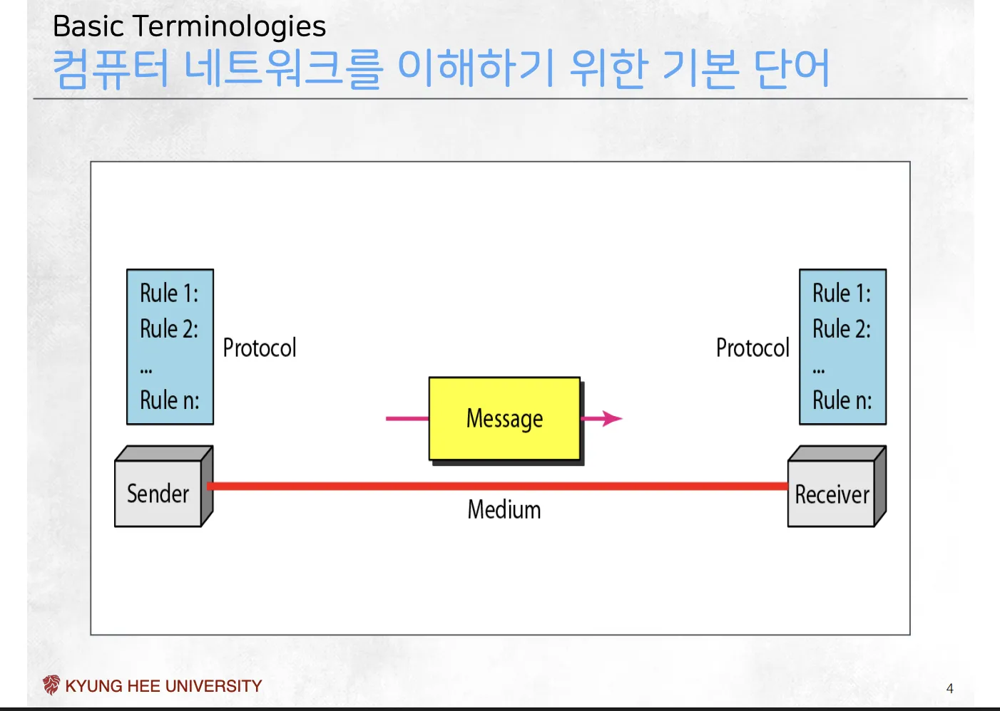

1. 메시지(Message)
	- 주고받는 정보나 데이터 그 자체를 의미
	- 텍스트, 숫자, 사진, 음성, 영상과 이것들의 조합이 메시지가 될 수 있음
2. 송신자(Sender)
	- 데이터 메시지를 보내는 장치
	- 컴퓨터, 스마트폰, 비디오 카메라 등
3. 수신자(Receiver)
	- 메시지를 받는 장치
	- 컴퓨터, 스마트콘, 비디오 카메라 등 (→ 동일)
4. 매체(Medium)
	- 송신자와 수신자를 연결하는 물리적인 경로
	- 메시지가 실제로 이동하는 길
	- 랜선, 광계이블 또는 전파 등
5. 프로토콜(Protocol)
	- 원활한 통신을 위해 통신을 관리하는 규칙
	- 데이터를 어떤 형식으로 보낼지, 전송 중 오류가 생기면 어떻게 처리할지, 송수신자는 어떤 행동을 할 지 등을 미리 정해놓은 약속
	→ 통신이 잘 안되면 프로토콜이 깨진, 안맞는 것
⇒ 통신분야는 “사전”이 있을 정도로 전문용어, 약어가 많으므로 이를 아는 것이 중요

# MAC Layer Protocol(CSMA/CD, CSMA/CA)
→ OSI에서 L2의 하위 부분을 담당하는 레이어라고 함, 실제로는 그냥 Layer2 프로토콜 이라고 이해

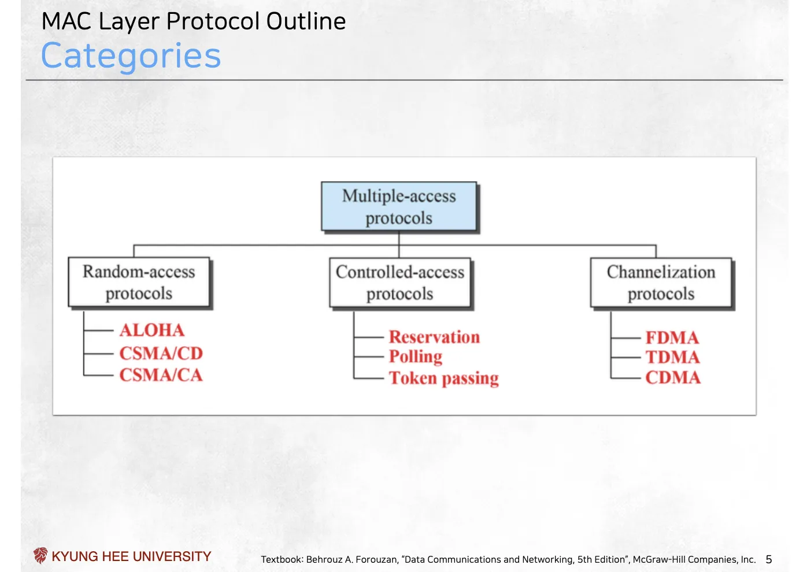

## L2와 L1의 관계

- 1계층에서 어떤 물리적 매체를 쓰느냐에 따라, 그 매체를 함께 사용하는 2계층의 규칙이 정해지게 됨
	- ex) 2계층의 주된 역할은 에러 검출 및 복구, 1계층의 매체가 무선일 때와 유선일 때의 에러 검출은 방식이 달라질 수 밖에 없음
- 따라서 이를 위해 2계층에는 많은 프로토콜들이 존재

## MAC(2계층) 프로토콜의 종류

### 1. Random access protocols
→ 충돌과 무관하게 눈치껏 보내는 느낌

- 종류
	1. ALOHA
	2. CSMA/CD → 중요
	3. CSMA/CA → 중요

### 2. Contolled access protocols
→ 충돌을 원천적으로 막기 위해, 데이터를 보내기 전에 미리 '예약(Reservation)'을 하거나, 중앙 장치가 각 장치에게 '물어보고(Polling)' 순서를 정하는 방식

- 종류
	1. Reservation
	2. Polling
	3. Token passing

### 3. Channelization protocols
→ "경쟁"이나 "순서"가 아니라, 아예 **"도로(채널) 자체를 나누는"**방식

- 종류
	1. FDMA
	2. TDMA
	3. CDMA

# CSMA/CD

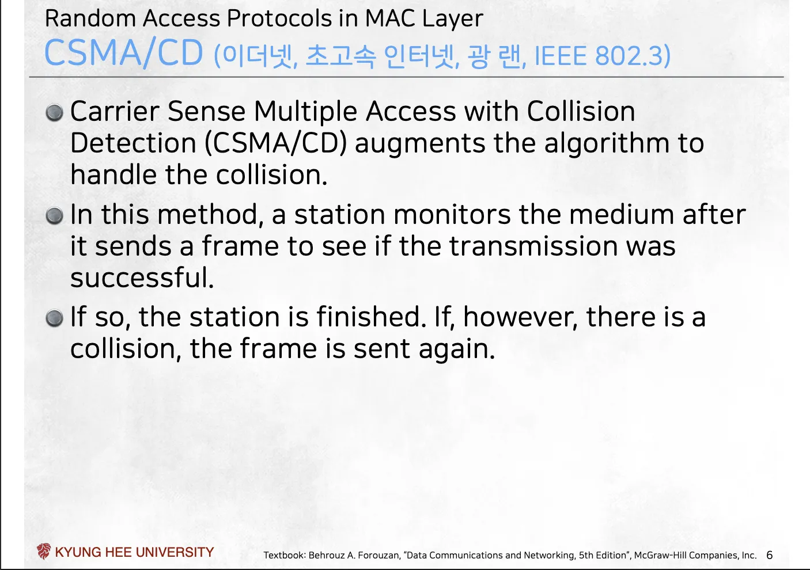

- Carrier Sense Multiple Access with Collsion Detection ⇒ CSMA/CD
	- Carrier Sense → 통신선 흐르는 신호(Carrier)를 감지(Sense)해 비어있는지 확인
	- Multiple Access → 하나의 매체에 여러 기기가 접속해 사용
 - 이때문에 충돌 문제 발생 가능
	- Collision Detection → Carrier Sense에도 불구하고 충돌은 발생 가능
 - 이 충돌을 확인하고, 감지되면 무작위 시간을 기다린 후 다시 연결
- 전체 작동 방식이 나옵니다.
	1. **(CS)**A 컴퓨터가 데이터를 보내기 전, 선이 비어있는지 확인
	2. 선이 비어있으면 데이터를 보내기 시작
	3. **(CD)**데이터를 **보내는 중에도**계속 선을 감시
 - **성공:**아무 충돌 없이 전송이 끝나면, 작업이 완료
 - **실패 (충돌!):**만약 B 컴퓨터도 동시에 데이터를 보내 충돌이 감지되면, A와 B 둘 다 즉시 전송 중지
 - **재시도:**그리고 각자 **무작위(Random) 시간**을 기다린 후, 1번 단계(CS)부터 다시 시도

## CSMA/CD의 충돌과 중단

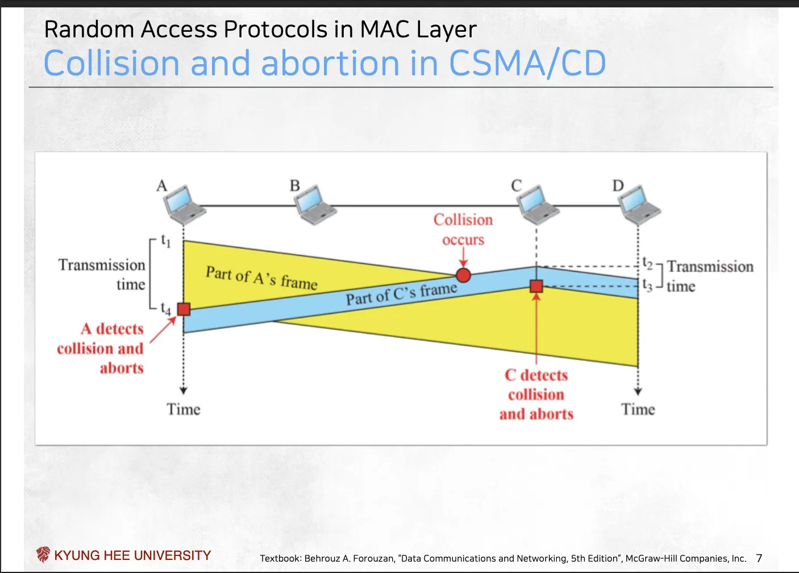

### CSMA/CD 충돌 및 중단 시나리오
t1 ⇒ A가 D로 정보를 보내기 시작
t2 ⇒ C가 정보를 보내려고 함

	- 이때 C는 Carrier Sense를 수행했지만, A가 보내는 신로가 아직 C가 감지 가능한 범위에 도달하지 않음
 → 이러한 신호가 전파되는 물리적 시간 == 전파 지연(Propagation Delay)
t2~t3 ⇒ Collision이 발생
t3 ⇒ C가 꺠진 신호(충돌)을 감지

	- C를 보내는 중에도 계속 선을 감시(Collision Detection)하므로 충돌을 감지
	- 이때 C는 충돌을 감지하고 데이터 전송을 중단
t4 ⇒ A가 충돌을 감지하는 시간

	- C보다 충돌 지점에서 멀어서 시간이 더 걸림
	- 이때 A도 충돌을 감지하고 데이터 전송 중단
⇒ 이 둘이 이후 무작위 시간을 기다렸다가 Carrier Sense(처음)부터 다시 시도

### 과거와 현재의 비교

1. 현재
	- 현재는 통신사에서 공유기(장치)를 설치하면 이를 내 PC로 1:1 연결 가능 ⇒ 초고속 인터넷
 - 나 혼자 쓰는 전용선이므로 충돌은 일어나지 않음
	- 따라서 현재는 CSMA/CD는 비활성화, 이런 전용선에 연결하면 곧장 꺼지게 됨
 - 현재도 여러 센더들이 공유하는 선이 연결되면 CSMA/CD를 하게 됨
2. 과거
	- 과거에는 선 자체가 비싸서, 줄을 하나만 깔아서 여러 센더가 공유, CSMA/CD가 필요
→ CSMA/CD는 초고속 인터넷의 기술적 원형이므로 배우는 것

	- 현재 사용하는 유선 초고속 인터넷은 이더넷을 기반으로 함
	- 이 이더넷이 과거에는 CSMA/CD를 기반으로 함

## CMSA/CD의 플로우차트

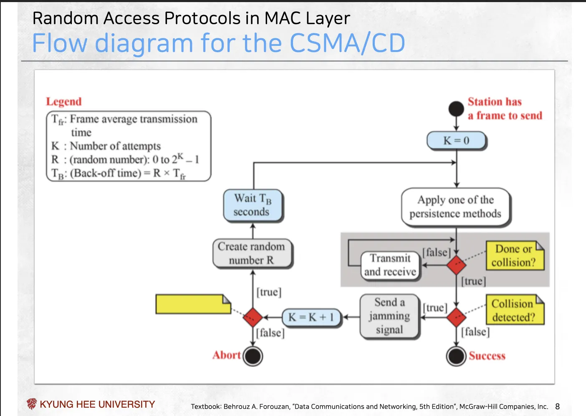

### 전송 성공 시 흐름

1. 시작 상태
	- 센더에 보낼 데이터가 있음
	- 시도 횟수(K)는 0
2. 전송 종료까지 계속 Collision Detect
	- Done or Collision(전송 완료 또는 충돌이 true가 될 때 까지 전송하고 receive(← 이게 충돌 감지)하는 것을 반복
3. 충돌이 감지되지 않았다면 모든 과정이 끝

### 충돌 발생 시 복구 스킴

1. 위의 2번(충돌감지)를 계속 하다 충돌이 감지(Collision Detected == true)되면 복구 스킴이 시작
2. 시도 횟수(K)를 1 증가
3. 최대 시도 횟수 확인(저기 비어있는 조건)하고 넘었다면(최대시도 횟수 ≤ 현재 K) abort
4. 최대 시도 횟수를 넘지 않았다면 랜덤한 대기 시간 R을 생성
	- 그러나 K가 커지면 랜덤 넘버 생성의 범위가 지수적으로 늘어남
5. 계산된 대기 시간만큼 대기
6. 대기가 끝나면 다시 1번부터 시작
→ 통신에서 에러는 피할 수 없으므로 이러한 충돌감지와 복구 스킴이 필요하게 됨

# CSMA/CA

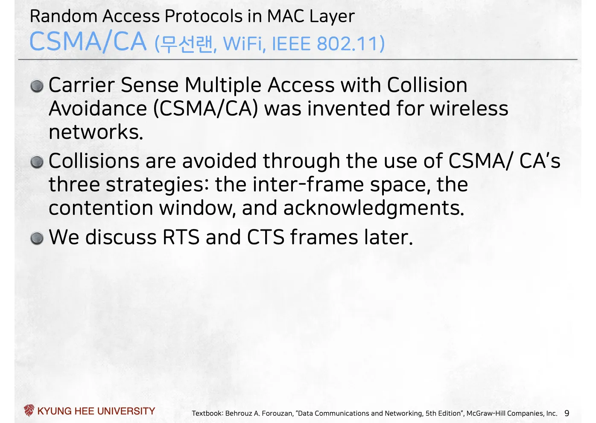

- Carrier Sense Multiple Access with Collsion Avoidance ⇒ CSMA/CA
	- Carrier Sense → 통신선 흐르는 신호(Carrier)를 감지(Sense)해 비어있는지 확인
	- Multiple Access → 하나의 매체에 여러 기기가 접속해 사용
 - 이때문에 충돌 문제 발생 가능
	- Collision Avoidance → 충돌을 회피하는 전략
- 무선 네트워크를 위해 개발된 프로토콜
- 충돌은 CSMA/CA의 세 가지 전략을 통해 회피됨
	1. inter-frame space
	2. Content Window
	3. Acknowledgements
→ 무선에서는 유선과는 달리 감지가 어려움

	- 내가 전파를 쏘면서 동시에 공기 중의 미약한 전파를 감지하는 것은 매우 어려움
 → 내가 쏜 전파에 묻혀버림

## CSMA/CD의 NAV

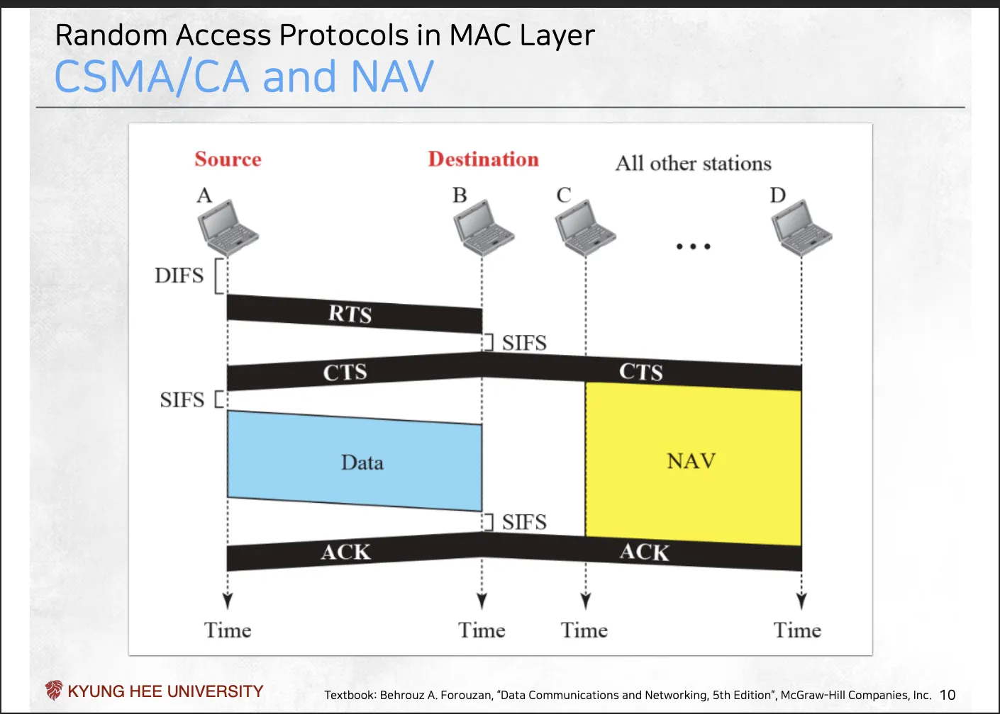

1. Sender인 A가 DIFS라는 시간 동안 대기한 후 B에게 RTS를 보냄
	- DIFS라는 시간동안 대기해 채널이 비어있는지 확인
	- 채널이 비어있으면 sender는 receiver에게 RTS(Request to Send) 신호를 보냄
2. Receiver인 B는 RTS를 받으면 SIFS라는 짧은 시간 동안 대기한 후 CTS 신호를 Broadcasting(주위 모두에게 전파, 방송)
	- CTS(Clear to Send)는 A만 받는 OK신호가 아님, 이는 주위 모든 장치(A, B, C)에게 통신할 것이니 끼어들지 말라고 공지하는 것
	- 이 CTS신호 안에는 앞으로 얼마 동안 통신할 예정인지에 대한 시간 정보 포함
3. CTS를 받은 A외의 다른 기기들은 이 CTS 안의 통신 예정 시간을 보고 자신의 NAV를 설정
	- NAV(Network Allocation Vector) → 아무 정보도 보내지 않도록 예약된 시간
4. Data 전송
	- A는 B에게서 CTS를 받아 데이터 전송 허가를 확인
	- SIFS만큼 기다리고 진짜 데이터를 B에게 전송
5. ACK
	- B는 데이터를 다 받고 SIFS만큼 기다린 후 ACK를 보내고, A는 이를 받아 통신을 마침
	- 이때 이 ACK는 A만 받는 것이 아닌 C, D도 모두 받는 것이라, 이를 보고 통신이 끝났음을 인지하고 NAV를 종료

## CSMA/CA 흐름도

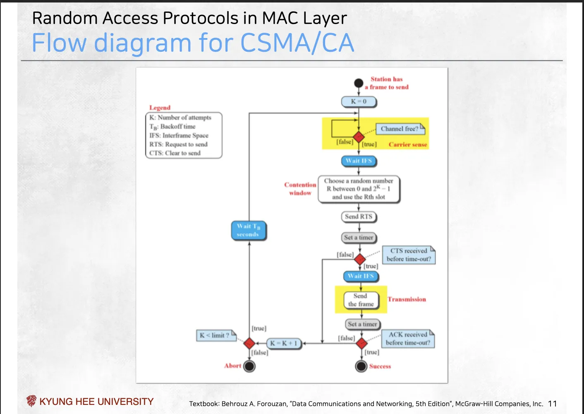

### 1. 전송 성공 시

1. 시작
	- 데이터를 보낼 준비를 하고 시도 횟수(K)를 0으로 초기화
2. Carrier Sense
	- 채널이 비어있는지(Channel Free?)를 확인
	- 만일 채널이 비어있지 않다면 (Channel Free == false)이면 Carrier Sense
	- 만일 채널이 비어있으면 (Channel Free == true)이면, 다음 단계로 진행
3. Wait IFS → 채널이 비어있어도 일단 IFS만큼 대기
4. Contention window
	- CSMA/CD와 다르게 전송 전에 랜덤 시간을 대기
 - 0 ~ $`2^K-1`$ 사이 무작위 숫자 R만큼 대기
 - R에 해당하는 시간(Contention Window)만큼 대기
	**⇒ 이 랜덤 시간 대기 덕분에 여러 장치가 동시에 전송을 시작하려 해도 각자 다른 랜덤 시간을 기다리게 되어 충돌이 회비(CA)**

5. Send RTS → RTS신호를 보냄
6. CTS received → 정해신 시간 내에 CTS받았는지 확인
7. Send the frame → CTS받으면 실제 제이터를 전송
8. ACK received → 다 받았다는 ACK를 받았는지 확인, 받으면 완료

### 2. 충돌 추정 시

- 지속적으로 디텍트하는 CSMA/CD와 달리 충돌을 추정
	- **`CTS`****가 안 오거나 (timeout)**또는 **`ACK`****가 안 오면 (timeout)**, CSMA/CA는 충돌 발생으로 **추정**하고 복구 절차에 들어감
1. 충돌 추정
2. 시도 횟수 K를 1 증가
3. K가 최대 시도 횟수를 넘었는지 확인
	- 이건 넘으면 아에 abort
	- 넘지 않으면 처음(Carrier Sense)부터 다시 시돈
4. K값이 커져 지수적으로 대기하게 됨

## 필연적인 지연과 실패

### 모든 통신에는 필연적 지연이 존재

- 유션(CSMA/CD) ⇒ 충돌이 나면 복구를 위한 대기에 들어가는 지연
- 무선(CSMA/CA) ⇒ 충돌이 나기 전에도 대기하는 지연
⇒ 유, 무선 방식에서 모두 데이터 전송을 위한 필연적 지연이 존재

### 지연으로 인한 실패

- 만일 강의실에서 150명이 일반적인 공유가에 접속한다면 모두가 CSMA/CA에 따라 RTS를 마구 보내고, 공유기는 CTS를 마구 받게됨
- 이때 신호끼리 충돌이 발생 → 복구 지연이 시작되고 → 계속되는 복구 시도에 결국 abort
- 이래서 공유기를 4대로 늘려도 같은 채널을 쓰면 의미없음, 이를 방지하기 위해 공유기의 담당 방향을 4분할하는 방식도 있음

### L2의 포기와 L4의 필요성

- 위의 지연으로 인한 실패는 L2에서 에러 검출 및 복구를 하더라도 L4에서 또 하는 이유
- 2계층의 복구 매커니즘은 Hop-to-Hop만 책임이고 한계에 부딪히면 메시지를 버리게 됨
- 4계층은 End-to-End 통신을 책임지며, 2계층이 포기한 버려진 메시지를 감지하고 패킷의 재전송을 수행
⇒ **결론:**2계층은 "무선 1-홉"의 안정성을 시도하지만 실패할 수 있고, 4계층은 "인터넷 전 구간"의 최종 신뢰성을 보장

### 개발자가 이 지연을 알아야 하는 이유
**⇒ 애플리케이션은 잘돌아도 아래단에서 발생되는 버그 같은 것들을 감안해야함**

- 내 애플리케이션(L7)의 코드는 완벽해도, 사용자가 저 205호 강의실" 같은 최악의 Wi-Fi 환경(L1/L2)에 있으면 사용자는 내 앱이 "느리다, 끊긴다"고 불평하게 됨
	- 이때 진짜 원인은 내 애플리케이션에서 보낸 데이터가 L2(CSMA/CA)의 '복구 지연'에 갇혀있거나, `Abort`되어 L4(TCP)가 '재전송 지연'을 일으키고 있기 때문
**⇒ 가치:**네트워크를 아는 개발자는 이 아래단의 지연(버그)을 감안하여, "이건 네트워크 혼잡 문제"라고 정확히 진단 가능

### **Wi-Fi vs. 이동통신**

1. WI-FI(무선랜)
	- **대역 특성**
 - 비면허 대역 사용 (무료)
 - 누구나 사용 가능
	- **접속 방식: 경쟁(Contention) 기반**
 - CSMA/CA 프로토콜 사용
 - "먼저 말하는 사람이 임자" 방식
 - 모든 기기가 채널 사용권을 놓고 경쟁
	- **한계점**
 - 경쟁 자체가 필연적 지연 발생 원인
 - 사용자가 많아질수록 경쟁 심화 → 지연 급증
 - 극단적인 경우 연결 끊김 가능
 - 예: 무선랜 전화는 여러 명이 동시 사용 시 불안정
2. 이동통신 (LTE/5G)
	- **대역 특성**
 - 면허 대역 사용 (유료)
 - 통신사가 독점적 사용권 보유
	- **접속 방식: 스케줄링(Scheduling) 기반**
 - TDMA/FDMA 등의 프로토콜
 - "기지국이 각 기기에 시간/주파수 할당" 방식
 - 중앙 제어를 통한 체계적 자원 분배
	- **장점**
 - 지연 제어 가능 (예측 가능한 성능)
 - 충돌 거의 없음
 - QoS(품질 보장) 가능
	- **우선순위 시스템**
 - 긴급 통화(119 등)에 최고 우선순위 부여
 - 법적으로 보장된 긴급 통화 연결
 - 유심 없이도 긴급 통화 가능
 - 다른 모든 통신을 제치고 즉시 연결

## Hidden Station Problem

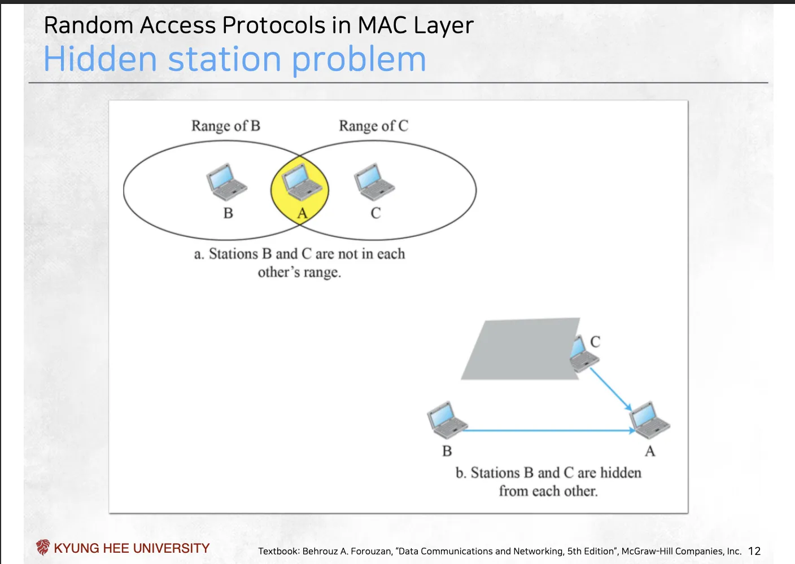

### Hidden Station Problem(숨겨진 노드 문제)

- 캐리어 센스가 실패하는 대표적인 시나리오
- **상황:**3대의 컴퓨터 A, B, C가 있습니다. B와 C는 A(아마도 Wi-Fi 공유기)와 통신하려 함
- **문제:**`B`와 `C`는 너무 멀리 떨어져 있거나(a) 중간에 장애물(벽)이 있어서(b) **서로의 전파를 들을 수 없음**
	- B와 C는 서로에게 숨겨진 상태
- **결과:**`B`의 신호와 `C`의 신호가 **수신자 ****`A`****에서 동시에 수신되어 충돌**합니다. `A`는 두 데이터 모두를 잃게 됨

### 해결 방법(RTS/CTS)

- Hidden Station문제를 해결하기 위해 고안된 것인 RTS/CTS와 그 전파 방식
	- CTS가 주변 모든 기기에 전송으 ㄹ하거나 하는 것도 이런 것의 일종
- 이래도 hidden station problem에 의해 충돌이 발생할 수 있음

### 블루투스, 무선 랜 사이 주파수 간섭

- 무선랜(Wi-Fi)과 **블루투스**는 둘 다 **동일한 2.4GHz 주파수 대역**을 사용, 심지어 **전자레인지**도 이 대역을 침범
- **체급 차이로 블루투스가 짐**
	- **블루투스:**"1:1 연결"이 기본이며("wireless serial cable"이라는 별명), 선을 없애는 게 목적인 저전력 기술
	- **Wi-Fi (공유기):**"소리를 막 지름", 즉 넓은 범위를 커버하기 위해 강력한 신호(전파)를 방송
→ 데모 같은거 할 때는 사람 많은 컨퍼런스 장에서 문제가 되지 않도록 되도록 유선을 써라

# Mac Layer의 플로우와 에러 컨트롤

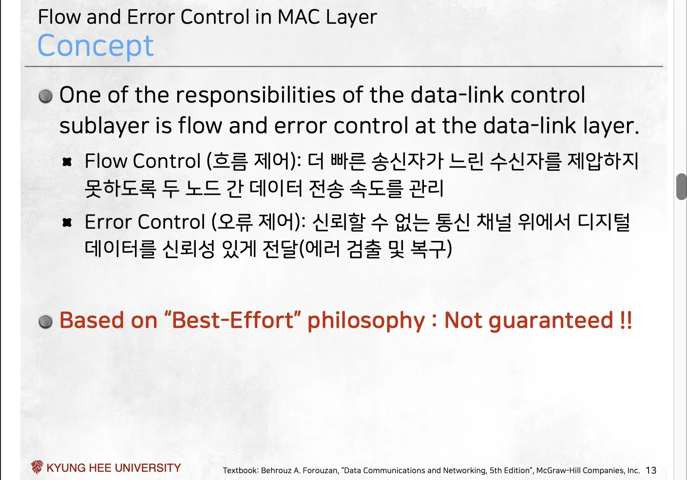

- 2계층(정확히는 Data-Link Control 부계층)은 1계층(물리 계층)에서 발생할 수 있는 문제들을 해결하기 위해 두 가지 제어를 시도
	1. **Flow Control (흐름 제어)**
 - **정의:**빠른 송신자가 느린 수신자를 데이터로 압도(제압)하지 못하도록 전송 속도를 조절
	2. **Error Control (오류 제어)**
 - **정의:**근본적으로 신뢰할 수 없는 물리적 통신 채널(랜선, 공기) 위에서 데이터가 깨지거나(오류) 사라지지 않도록 **신뢰성**을 부여하는 작업
 - **방법:**"오류 검출"(데이터가 깨졌는지 확인)과 "오류 복구"(깨졌으면 재전송 요청, 예: Wi-Fi의 `ACK`)를 포함
- 이거들은 모두 Best-Effort 철학에 의해 동작
	- 따라서 실패가 가능, 절대로 보장하지는 않음
	→ 그래서 4계층에서도 다시금 이러한 동작을 하는 것으로 보임

## QoS 저하

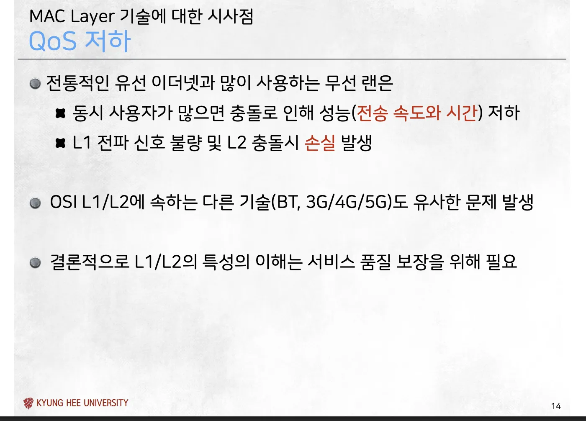

### QoS(Quality of Serivce) 저하의 원인

1. 경쟁으로 인한 성능 저하
	- 유선 이터넷, 무선 랜은 동시 사용자가 많으면 충돌로 인해 성능(전송 속도와 시간) 저하
2. 데이터 손실 발생
	- L1 전파 신호 불량 및 L2 충돌시 손실 발생
	- 전파가 벽에 막히거나(신호 불량), 블루투스/전자레인지에 간섭(Interference)을 받아 데이터가 깨지거나(L1), `RTS`/`CTS` 경쟁에서 계속 밀리거나 충돌이 반복되면, 2계층은 Abor하고 패킷을 손실
⇒ 이건 다른 L1, L2의 기술도 유사한 문제를 가짐

- 결론적으로 L1, L2의 특성 이해는 서비스 품질 보장을 위해 필요
***

# Network Layer(Layer 3)

### Network Layer

- L2 직접 연결된 곳 사이에서 1-hop 장치 간의 데이터를 전달
- L3는 전 세계의 수많은 네트워크를 건너 데이터를 전송할 때 필요
⇒ 이를 위해 데이터를 어디로 보낼 지 결정하는 과정이 “라우팅”

## 패킷화

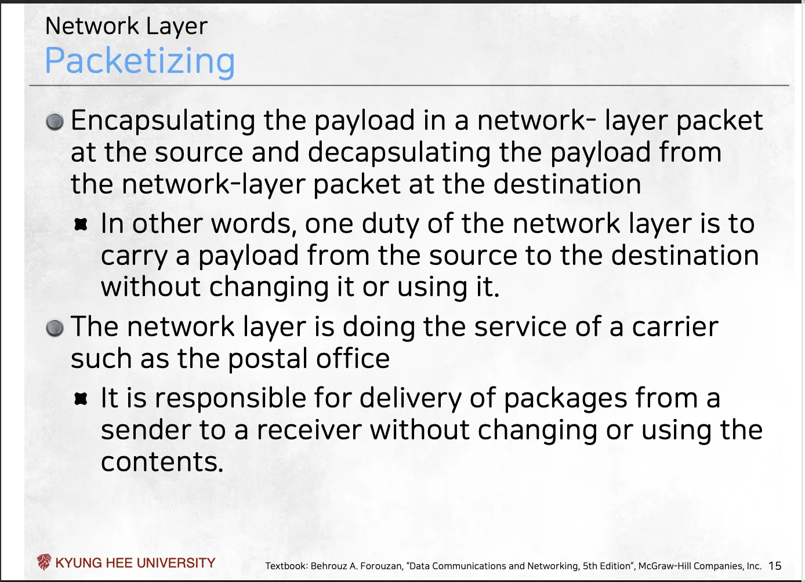

- 출발지(source)에서 페이로드를 네트워크 계층 패킷으로 캡슐화하고, 목적지에서 네트워크 계층 패킷으로부터 페이로드를 액캡슐화
	- 페이로드를 변경, 사용하지 않고 출발지에서 목적지까지 전달
	- 캡슐화 할 때 페이로드에 source ip, destination ip를 같이 캡슐화
- 내용물은 변경, 사용하지 않고 송신자로부터 수신자에게 패키지를 전달하는 우체국의 역할

## 라우팅과 포워딩

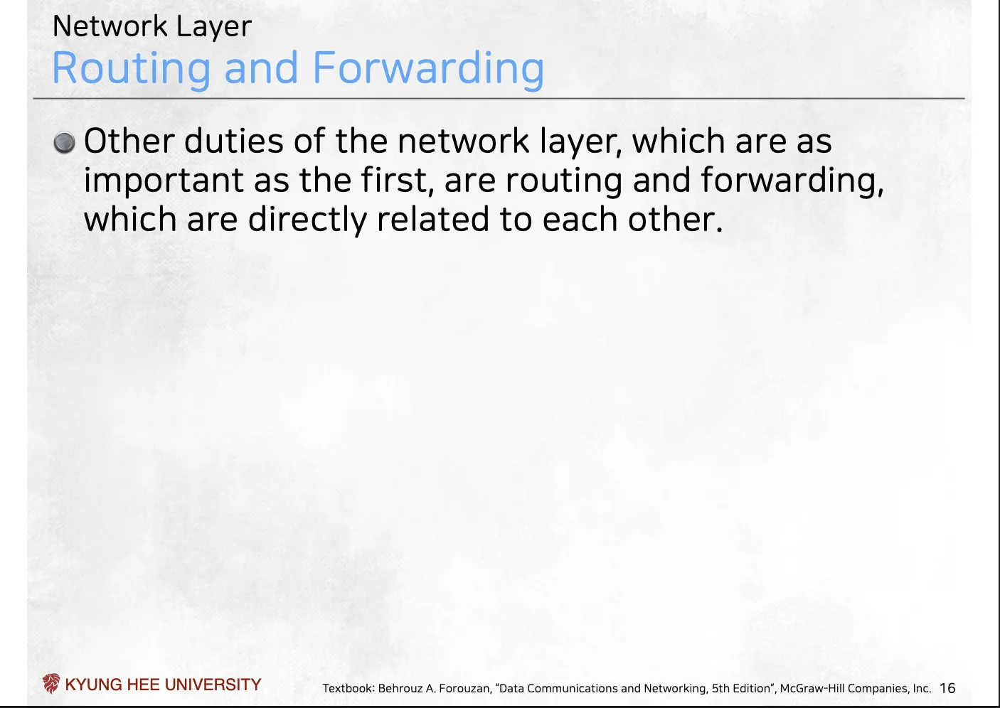

### 라우팅

- 어떤 경로(줄)로 가는 것이 최선인가를 결정하는 **전체 과정**

### 포워딩

- 도착한 패킷을 어느 경로로 밀어낼 지 처리하는 작업
→ 상대적으로 라우팅이더 느리고 복잡한 작엄

## L3의 Connectionless packet-switched network

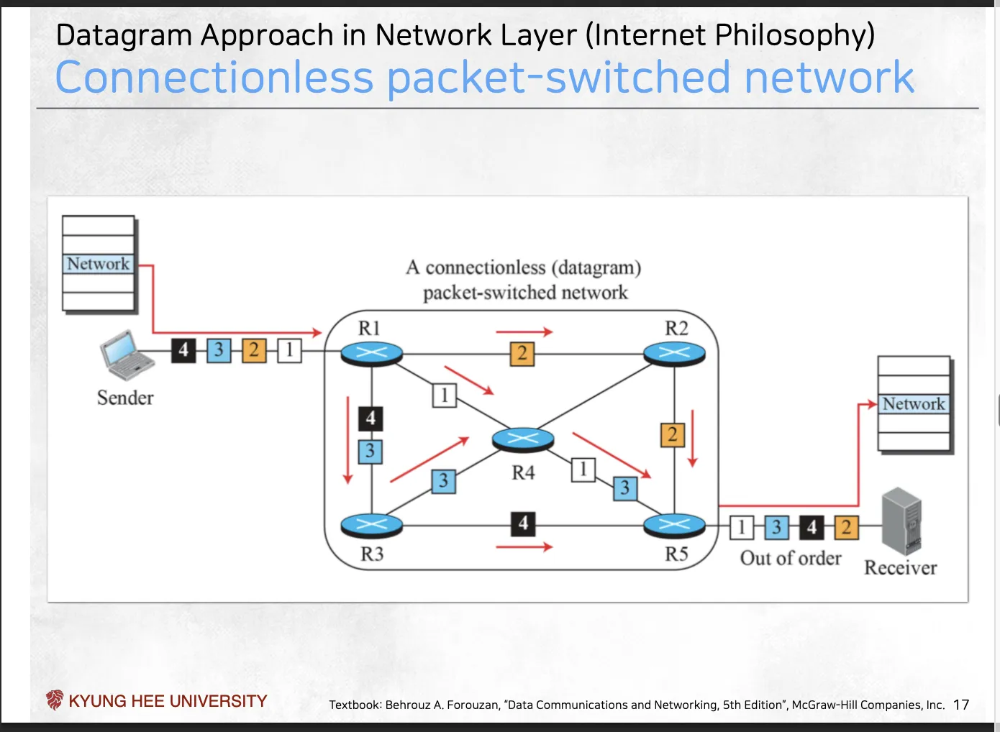

### IP(Internet Protocol)

- 3계층에서 가장 널리 사용되는 프로토콜
- Memoryless(상태 없음, 각 패킷이 독립적이라는 뜻) 철학을 핵심으로 함
	- 3계층의 장비인 라우터 등이 패킷 간의 관계, 순서를 기억하지 않음
	- 각 패킷은 독립적인 메시지(=Datagram)으로 취급됨

### **동작 방식 (다이어그램)**

1. `R1`은 1, 2, 3, 4번 패킷을 받음
2. `R1`은 *그 순간의 최적 경로*로 각 패킷을 **독립적으로 라우팅**
	- 패킷 2는 `R1` → `R2` → `R5`로 감
	- 패킷 4는 `R1` → `R3` →`R4` →`R5`라는 완전히 다른 경로로 감
3. 그 결과, "Receiver"는 패킷을 1, 3, 4, 2라는 **뒤죽박죽(Out of order)**순서로 받게 됨
	⇒ 순서 보장 X

### IP의 Survivability(생존성)

- 도착 패킷의 순서가 달리지는 문제를 감수한 이유 ⇒ 생존성
- 역사적으로 IP는 미 국방성의 요청에 따라 미 각지의 통신소가 망가져도 데이터를 전송 가능한 생존성의 네트워크로 설계
- ex) 위 다이어그램의 R2가 죽어도, R1은 그냥 다음 패킷을 다른 경로로 보내면 됨

### 순서 보장

- 각 패킷 사이 의존성이 있다면 순서를 맞출 수 있지만, IP에서는 그렇지 않음, 이를 위해 TCP(4계층)가 존재
- **리시버가 메시지를 받고 나면"**, 이제 선택을 해야 함
	1. **TCP (Transmission Control Protocol)**
 - 순서 맞춤
 - "Receiver"의 4계층(TCP)이 "1, 3, 4, 2"로 도착한 패킷을 보고, 순서 맞추기와 에러 검출/복구를 수행
 - 마치 퍼즐 조각을 다시 맞추듯 "1, 2, 3, 4"로 재조립하여 상위 계층(애플리케이션)에 전달
 - 신뢰성(reliability)이 필요할 때 사용
	2. **UDP (User Datagram Protocol)**
 - "순서 맞추기" 같은 작업을 전혀 하지 않고, L3가 전달해준 "1, 3, 4, 2" 순서 그대로 앱에 전달
 - 속도(speed)가 신뢰성보다 중요할 때 사용
- 현대적인 앱은 QUIC을 사용(유투브, MMORPG 등)
	- TCP는 신뢰할 수 있지만 **느림**(순서 맞추고 확인하느라)
	- UDP는 빠르지만 **신뢰할 수 없음**(순서 엉망, 에러 복구 안 함)
	⇒ 이를 해결하기 위해 **구글**같은 기업은 TCP/UDP에만 의존하지 않고, **UDP 위에서**이 모든 요구사항(순서, 속도, 에러 복구)을 자체적으로 구현한 새로운 프로토콜인 QUIC을 사용

## Host-to-Host Communication Concept

- L2의 Hop-by-Hop과 달리 L3는 Host-to-Host(End-to-End)통신을 담당

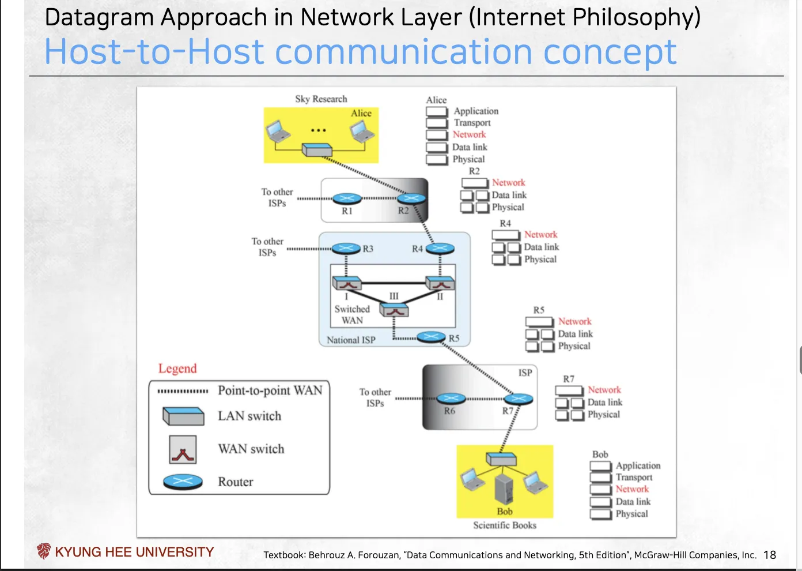

### 다이어그램 해석

- **호스트 (Alice, Bob)와 라우터 (R1 ~ R7)가 존재**
- **호스트 (PC, 서버)**
	- 데이터를 *생성*하고 *소비*하는 최종 주체
	- 따라서 애플리케이션부터 물리 계층까지 **모든 5계층(혹은 7계층)의 스택**을 다 가지고 있음
- **라우터 (R2, R4, R5...)**
	- **L3 장비**
	- 이들의 유일한 임무는 IP 주소(L3)를 보고 다음 경로로 패킷을 "전달(Forwarding)"하는 것
	- 따라서 이들은 L1, L2, L3(네트워크 계층)까지만 가지고 있음
- **L2 (데이터 링크 계층):**패킷이 한 "홉(Hop)"을 건너뛸 때마다 L2 주소(MAC 주소)는 계속 바뀜

### → 개발자는 아래 레이어를 믿지 않아야 함

- 사용자는 애플리케이션이 잘 동작하지 않으면, 그 원인이 아래 레이어여도 L7(개발자)의 문제로 인식
- 본인 서비스(넷플릭스)에서 필요한 네트워크 속도를 측정하고, 클라이언트가 이를 만족하는 속도를 가지고 있는지를 애플리케이션(L7) 개발사가 직접 "감안"하고 "확인해야함

### → 위 다이어그램과 같이 수많은 중간 네트워크를 거치게 됨

- 인터넷으로 데이터를 전송할 때 알 수 없는 네트워크를 지나가게 됨
- 이를 수정하는 것은 거의 어려운 일, but 방법 2가지
	1. 물리적 줄을 매설
 - 구글이 이렇게 함, 해저 케이블 회사를 사서 전용선을 깔아서 처리
 - 유사하게 LG에 구글 서버를 넣어버려 CDN효과를 누림
	2. 논리적 줄을 빼냄
 - 남의 네트워크를 통과하며 논리적인 줄을 빼내는 것이 필요
 - 일반적인 방법
	⇒ 가능한 방법은 여전히 다른 사람의 신뢰 불가능한 네트워크를 통과하므로 개발자는 아래 단을 고려해야함
***

# IP의 주요 특징과 문제점
→ IP에는 세 가지 문제점이 존재

- 1. 패킷 순서 섞임/ 2. 패킷 손실 / 3. IPv4, IPv6간 호환 불가
	- 위 1, 2번은 IP의 데이터그램 방식 때문에 발생

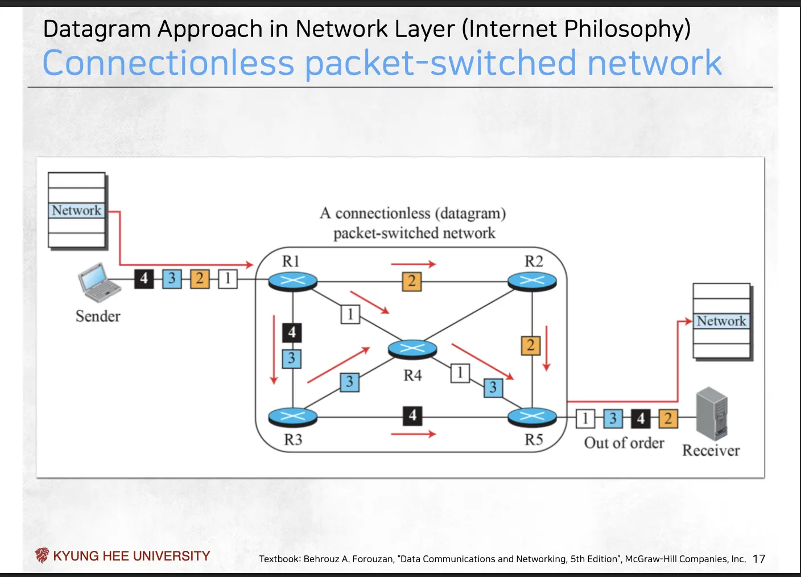

## 1. IP 패킷 순서 섞임

- IP가 준용하는 패킷 간 의존 관계를 만들지 않은ㄴ 데이터그램 방식은 패킷이 서로 다른 경로로 가서 섞이는 문제를 야기
→ 문제라고 하기에도 애매함

## 2. IP 패킷 손실

- IP는 트래픽 폭증이 있는 경우 패킷을 버리도록 설계

### Burst(트래픽 폭증)

- 갑자기 수많은 패킷이 하나의 라우터로 몰리는 현상이 발생
- 트래픽이 폭증하면 라우터 내부에 존재하는 큐에 쌓아둠
	- 이 큐는 유한하기 때문에 다 찬 이후 들어오는 것은 그냥 버림 → 패킷 손실, 3계층의 무책임
- IP는 이후 패킷을 버렸음을 출발지에 알려주지도 못함
→ 위 두 가지 문제는 L4에서 TCP가 처리

	- 패킷의 순서 번호를 재조립
	- 버려진 데이터를 다시 재전송요청
	- 또한 3계층에서 패킷이 버려지는 것을 감지하고 라우터가 붐비는 것을 알아채 스스로 전송 속도를 늦춰 보내는 양을 컨트롤 하기도 함 → 혼잡제어

# 라우터의 포워딩 프로세스

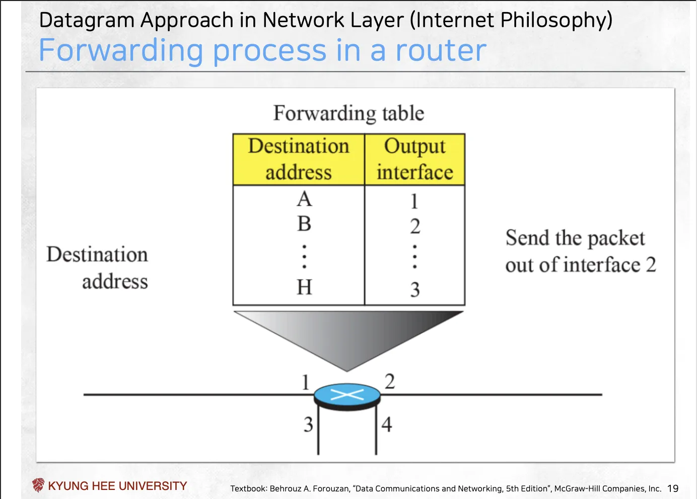

## 라우터 내부에서 이뤄지는 포워딩 프로세스

1. Destination address를 꺼냄
	- 라우터는 패킷이 L3 헤더를 열어서 최종 목적지를 확인
2. 테이블 조회(=경로탐색)
	- 이 목적지 주소를 자신이 가진 Forwarding table 또는 Routing table과 대조
	- 이 테이블은 어떤 목적지로 가려면 몇 번 출구로 나가야 하는지가 적힌 이정표
3. 줄로 내보냄 (패킷 전송)
	- 테이블 내부 키 값 매치가 이뤄지면, 라우터는 해당 패킷을 지정된 인터페이스로 밀어냄
→ 이 과정은 선의 속도에 맞춰 그것보다 10~100배 빠르게 진행
	→ 이때 해시맵을 사용

## IP의 위치

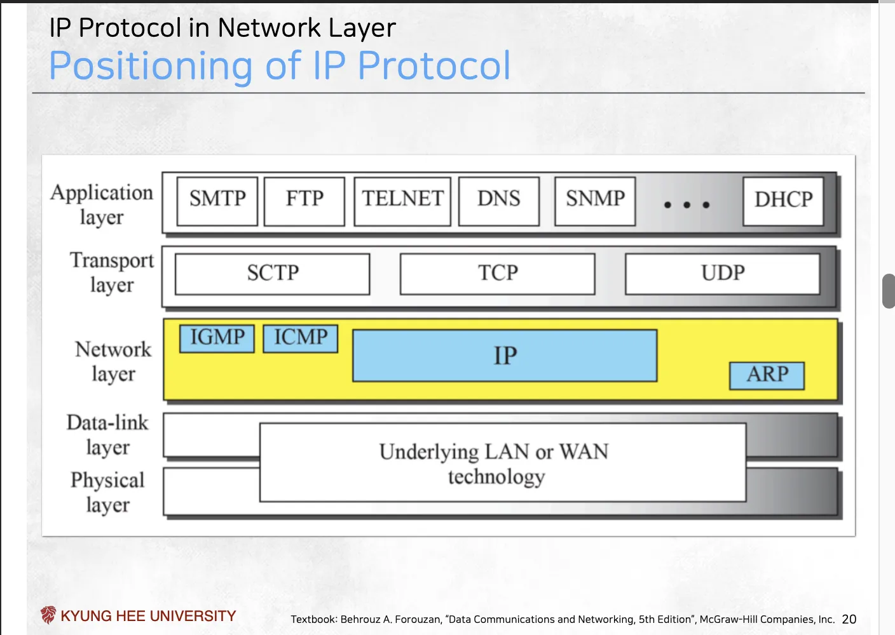

- OSI 7 Layer의 허리에 위치
- L3에는 IP외에도 ARP, IGMP, ICMP 등이 존재
	→ IGMP, ICMP: IP가 잘 작동하는지 돕는 **"보조"**프로토콜 (`ping`이 ICMP를 사용)
	→ **ARP:**IP(L3 주소)를 MAC(L2 주소)으로 번역해주는 **필수적인 **프로토콜

 - IP가 L2를 사용하기 위해 반드시 필요

# IP Address

## IP Address

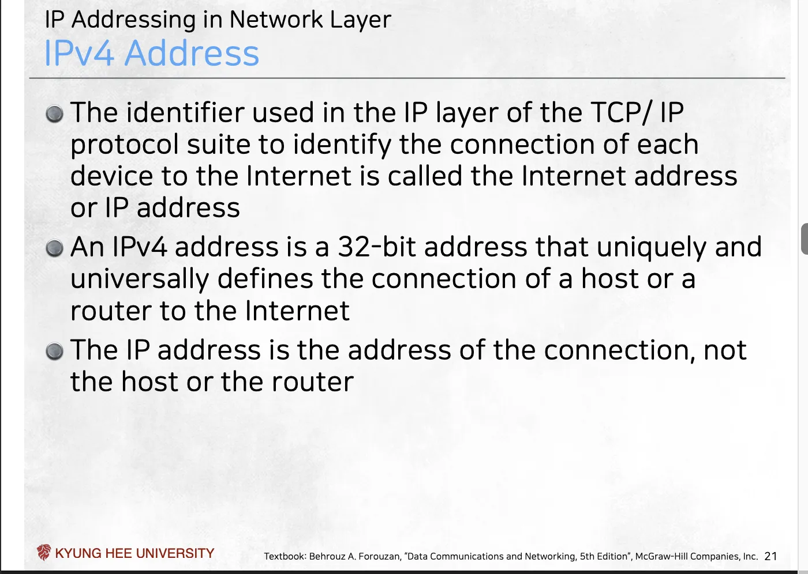

### IP 주소

- TCP/IP 프로토콜 스위트의 IP계층에서 사용되는 식별자
- 각 장치가 인터넷에 연결(connection)된 것을 식별하는 데 사용하는 주소
- **인터넷 주소(Internet address)**또는 IP 주소(IP address)**라고 부름
- IP 주소는 호스트나 라우터 *자체*의 주소가 아니라, 그 연결(connection)의 주소
→ 실은 단순히 장치보다는 선을 통해 할당되는 것이 ip, 따라서 하나의 장치에 선 2개 꽂으면 ip2개 할당 가능

### IPv4

- IPv4 주소는 **32비트 주소**로, 인터넷에 연결된 호스트(host)나 라우터(router)의 연결을 고유하고(uniquely) 보편적으로(universally) 정의
- **32비트(bit, 4바이트)**길이의 주소
	- $`2^{32}`$, 약 43억 개의 고유한 주소를 만들 수 있음

### IP의 주소 고갈

- 32비트밖에 안되는 ip(2\^32개)의 주소 부족 문제가 생김
- 통신 기술이 오래된 나라들(미국, 한국 등)이 초기에 IPv4 주소를 대부분 선점
⇒ 이를 해결하기 위해 IPv6가 나옴

### IPv6와 IP의 세 번쨰 문제

- **128비트**길이의 IP의 6번째 버전
⇒ 문제점이 생김

- **IP의 세 번째 문제 ⇒ IPv4, IPv6의 호환성 문제**
- ipv6를 사용하더라도 버전을 낮춰야 동작하게 됨
	- 내 기기가 IPv6를 지원해도, 내가 접속하려는 서버가 IPv4만 지원하면, 중간에 터널링이나 변환(NAT64) 등 복잡한 과정을 거쳐야만 함

→ 내가 만든 L7(애플리케이션)은 최신 기술로 만들었을지라도, 그 앱을 사용하는 유저는 낡은 3G(L1/L2) 망을 쓰거나, IPv4/IPv6 변환 문제(L3)로 고통받는 네트워크 환경

	- 이런 맥락에서 아랫 단을 믿지 말고 서비스 안정성을 확보해야함
	- 글로벌 서비스에서는 IPv6만 가능한 국가들도 고려할 필요가 있음

## IPv4의 표기법

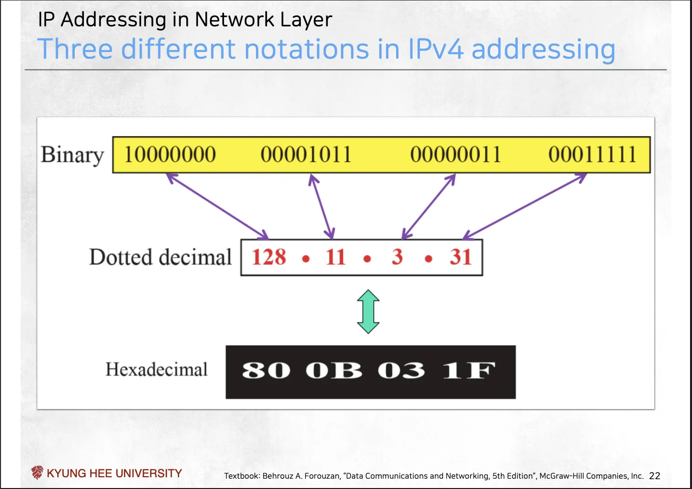

1. 바이너리 표기법
	- 8비트 \* 4 ⇒ 32비트 표기
2. Dotted Decimal(십진법 표기법)
3. Hexadecial(16진수)
	- 보통 개발할 때 16진법으로 처리
→ 수업에 안나온 내용

	- 진법 변환
 - 2진법 → 10진법 ⇒ 숫자가 1인 곳의 자릿수-1만큼 2를 제곱하고 더하기 → 10(bin) ⇒ $`2^1+2^0 = 3`$
 - 2진법 → 16진법 ⇒ 2진수 4자리 = 16진수 1자리
 - 10011100₂
 - 1001 → 9 / 1100 → C(12)
	- IP 주소 각 위치의 의미
 - IP는 네트워크 주소, 호스트 주소 두 부분으로 나뉨(가변적)
 - 192.168.1.10/24 → 앞의 24비트가 네트워크 주소
			```elixir
11000000.10101000.00000001.00001010
└────────24비트 네트워크────┘└─8비트─┘

192.168.1.10/24
│  │  │ │  └─ 호스트 번호 (이 네트워크의 10번 장치)
│  │  │ └──── 네트워크 세부 구분
│  │  └────── 네트워크 중간 구분
│  └───────── 네트워크 상위 구분
└──────────── 네트워크 최상위 구분
			```

## IP 주소의 계층적 구조

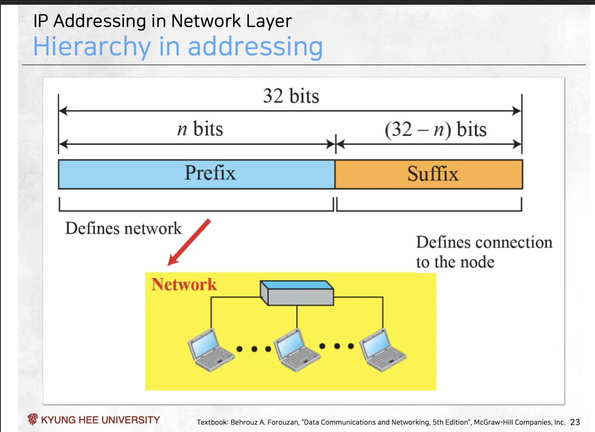

### IP주소의 계층 구조

- IP주소는 2단 계층 구조를 가짐
1. Prefix(접두사, n개의 비트) == 네트워크 주소
	- 데이터가 속한 네트워크가 어디인지 식별
	- 이 주소는 해당 네트워크에 속한 모든 컴퓨터가 공유하는 부분
	- ex) 한국 → 경기도 → 용인시 → 경희대 까지 속하는 “그룹 주소”
2. Suffix(접미사, 32-n비트) == 호스트 주소
	- 해당 네트워크 안에서 특정한 장치(호스트, 노드)를 식별
	- ex) 경희대 안의 중도, 국제대, 그 안의 특정 PC등을 뜻하는 “개별 주소”


### 계층 구조를 사용하는 이유
→ 라우터를 효율적으로 구성하기 위해 계층 구조를 사용

- 만일 라우터가 전체 주소를 확인한다면 한 대마다 43억개의 조수를 모두 기억해야함 → 불가능
- 라우터는 용도에 따라 각각 다른 부분만 확인

### 글로벌 라우터

- 글로벌 라우터는 Prefix(네트워크 주소)만 보고, Suffix(호스트 주소)는 무시
	- 라우터는 이 Prefix를 자신의 라우팅 테이블과 대조해 Destination Address, 즉 네트워크 주소를 찾아냄

### 로컬 라우터
→ (예: 경희대 공유기):

- suffix만 보는 라우터 → 내부적으로 라우팅 테이블을 보고 호스트에게로 포워딩
⇒ 이를 통해 라우팅 테이블이 매우 작고 빨라지게 됨

## CIDR 노테이션(Slash 노테이션)

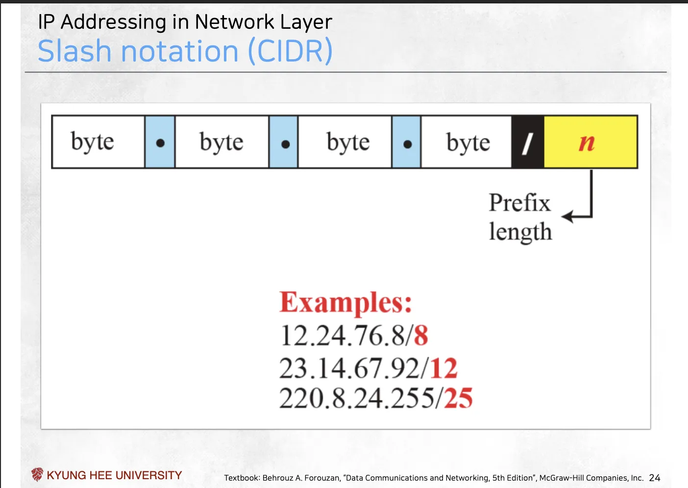

### CIDR 표기법

- **`IP 주소 / n`**형식으로 표기
	- `/n` 이 핵심 → 이 IP주소의 Prefix Length를 나타냄
 - 이 아이피 주소의 네트워크 주소(prefix)가 몇 비트인지 나타냄
- ex) 12.24.76.8/8
	- 8비트가 Prefix
	- Suffix부분은 자동으로 32-8 ⇒ 24비트
	⇒ `/8`이라는 표기 하나로 “이 네트워크는 12.x.x.x이고, 약 1,670만 개의 기기를 가질 수 있는 거대한 네트워크"라는 것을 즉시 알 수 있음

## CIDR 주소의 정보 추출

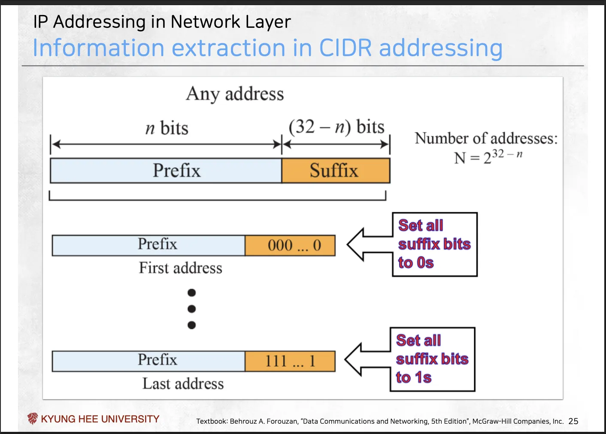

→ 위는 CIDR표기법의 주소에서 네트워크 핵심 정보를 추출하는 방법을 보여줌

### First Adddress

- 추출 방법 ⇒ CIDR에서 Prefix는 그대로 두고, 나머지 Suffix부분을 모두 0으로 둠
- 네트워크 자체를 가리키는 네트워크 주소
	⇒ 라우터가 패킷의 Prefix로 라우팅 테이블의 이 네트워크 주소와 대ㅂ조해 경로를 찾을 수 있음

### Last Address

- 추출 방법: Prefix(n비트)는 그대로 두고 나머지 Suffix부분을 모두 1로 만듬
- 네트워크에 속한 모든 호스트에게 한번에 데이터를 보낼 때 사용하는 전체 방송용 주소

### 주소의 총 개수

- N = $`2^{(32-n)}`$
- 호스트를 구분하는 데 사용 가능한 Suffix부분이 32-n비트이므로 N = $`2^{(32-n)}`$개의 주소 조합이 그 네트워크에 존재함을 의미
	- 이는 네트워크 주소, 호스트 주소, 브로드 캐스트 주소를 포함
	⇒ 실제 호스트에 할당 가능한 주소는 N = $`2^{(32-n)}`$ 에서 네트워크, 브로드캐스트를 제외한 $`2^{(32-n)}`$ - 2 개

## 라우팅 테이블 예시

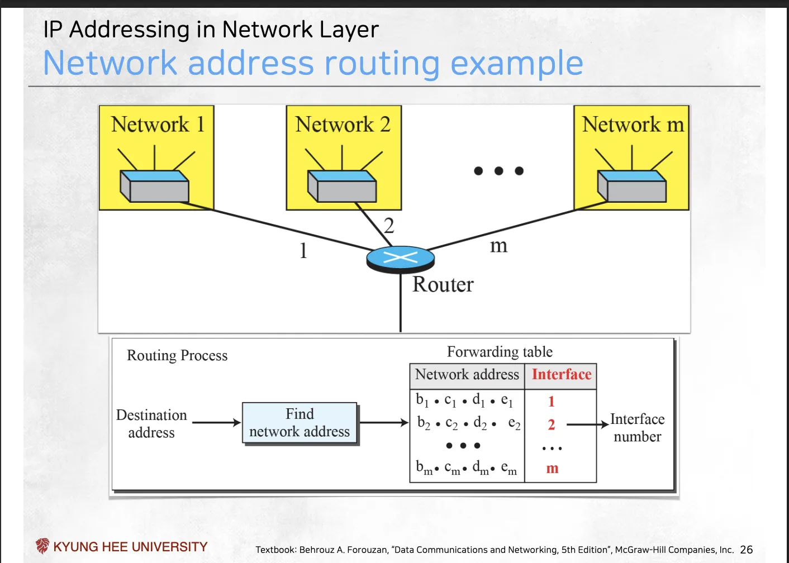

- 라우터는 네트워크 주소와 인터페이스의 정보를 짝지어서 가지고 있음
- 패킷의 L3헤더에서 네트워크 주소를 받아 어느 인터페이스로 포워딩 할 지를 결정

## IP데이터그램 포맷

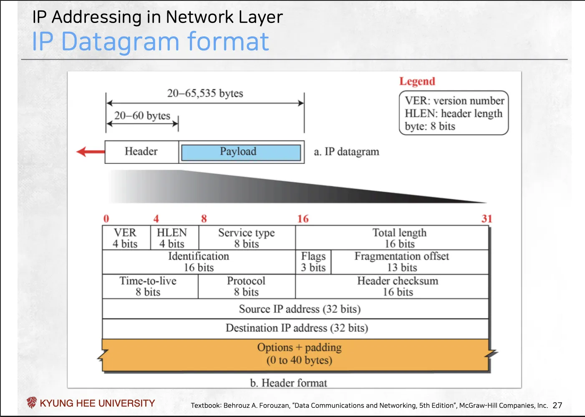

### IP 데이터그램 포맷

- IP패킷은 크게 두 부분으로 나뉨
	1. Header(헤더, 20~60바이트)
 - 이 패킷이 어디서 왔는지(Source IP), 어디로 가는지(Destination IP), 어떻게 처리해야 하는 지 등의 메타데이터가 들어있음
	2. Payload(페이로드, 헤더를 제외한 바이트)
 - 실제 실어날라야 하는 데이터
 - L4에서 받은 데이터(세그먼트 or 데이터그램)가 이 안에 담김
- 더 자세히 보면 바이트가 아닌 비트 단위로 분류
	- 과거 통신망은 매우 느림(네트워크 대역폭이 좁고, 비쌈)
	- 따라서 1비트라도 아끼기 위해 비트 단위로 설계
	→ "비트 단위 연산"이라는 CPU의 부담을 감수하고서라도, 여러 필드를 1바이트 안에 "쑤셔 넣는" **비트 단위(bit-level)**설계를 택함

## 기타 시스템과 네트워크

### 메모리 순서와 전송 순서

- 통신은 컴퓨터 메모리와 다른 Endian표기법을 사용해서 이를 읽어서 내보낼 때 역순으로 보내야 함
- PC메모리는 Little Endian으로, `0x12345678` 은 \[78\]\[56\]\[34\]\[12\] 순서로 저장
- 통신은 Big-Endian을 표준으로 약속 해서 `0x12345678` 은 \[12\]\[34\]\[56\]\[78\]로 전송
⇒ 따라서 전송할 때 주소를 역순으로 읽어서 보내야 함(2\^32 → 2\^0으로)

### 네트워크와 포인터
→ 네트워크에서 C언어 포인터가 필요한 것인 처리 단위와 전송 단위의 차이로 인한 것

- CPU프로세서는 데이터를 `Word` 단위로 한 번에 처리 ⇒ 보통 32비트, 64비트
	→ 이것이 정수의 사이즈가 됨

- 네트워크는 바이트 스트림이며, 전송의 기본 단위는 1바이트(8비트)임
⇒ 따라서 CPU가 처리하는 Word단위(64 or 32비트) 데이터를 네트워크로 보내려면 이 단어를 1바이트(char)짜리 조각 여러개로 직렬화 해야함

	- `char *p;` 는(포인터는) C언어에서 직렬화를 수행하는 고전적인 방법
	- 32비트 정수 메모리를 1바이트를 가리키는 포인터로 변환하면 이를 1바이트씩 찝이서 전송 가능
 → char는 C에서 1바이트를 의미하는 표준 단위이며, 대부분의 언어에서도 이를 준수

### 프로토콜 설계의 변화

- 프로토콜이 비트 단위 설계, 바이트 단위 설계를 사용하느냐는 시기에 따라 달라짐
1. 초기에 만들어진 프로토콜
	- 저속, 고비용 통신망이므로 1비트라도 아끼기 위해 비트단위연산을 사용
2. 고속 인터넷 시대에 만들어진 프로토콜
	- http1.1같이 비교적 최근에 만들어진 프로토콜은 네트워크가 빠르고 저렴해진 시기에 만들어져, 개발자의 생산성을 중요시해(Human Readability) 읽을 수 있는 바이트(텍스트)단위로 설계
3. 모바일/이동통신 시대
	- 이 시기에는 스마트폰, 이동통신이 느려, 다시 성능을 위해 비트 단위 또는 그에 가까운 포맷으로 회귀

## IP주소 정리

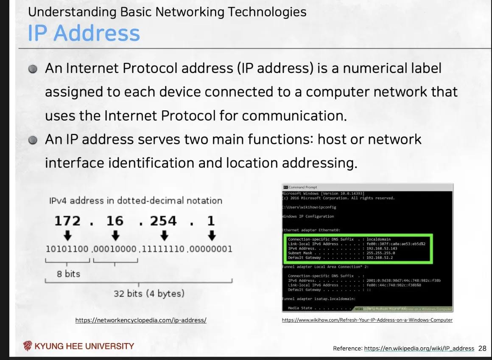

### IP주소란

- 인터넷 프로토콜을 사용하는 네트워크에 연결된 모든 장치에 할당되는 식별용 숫자
- 네트워크에서 특정 호스트 또는 네트워크 인터페이스가 누구인지(Identification), 어느 네트워크에 있는지(Location Addressing)를 나타냄 → 기능

# Domain Name

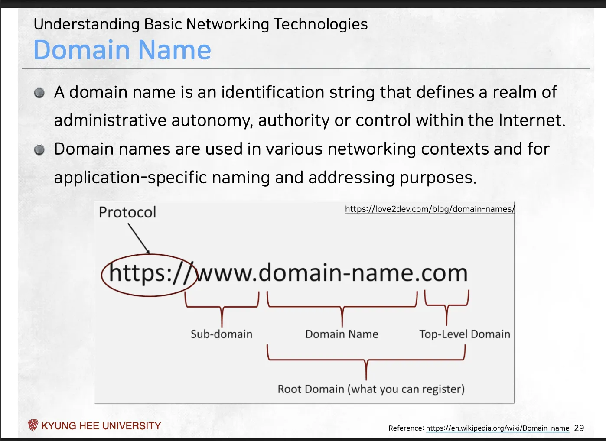

### Domain Name

- 인간의 가독성을 위해 도메인 네임을 사용
	- 숫자로 된 IP는 외우기 어려워, 인간이 읽고 기억하기 쉬운 문자열 라벨을 붙인 것이 도메인 네임
- 인터넷 내에서 관리상의 자치권, 권한 또는 제어의 영역을 정의하는 식별 문자열
	- ex) google.com은 구글이라는 회사의 관리, 제어하는 인터넷 상의 영역으로 식별됨

### 도메인 네임의 계층 구조
→ [`https://www.domain-name.com`](https://www.domain-name.com/)

- **`https://`****(Protocol / 프로토콜)**
	- 이것은 도메인 네임의 일부는 아니지만, 해당 영역에 어떻게 접속할지(통신 규칙)를 알려줌
- **`.com`****(Top-Level Domain / 최상위 도메인)**
	- **가장 큰 영역**입니다. `.com` (회사), `.org` (단체), `.kr` (대한민국) 등을 의미
- **`domain-name`****(Domain Name / 도메인 이름)**
	- `.com`이라는 큰 영역 안에서, "domain-name"이라는 **특정 영역**을 식별
 - (예: `google.com`)
	- 슬라이드의 "Root Domain"(`domain-name.com`)이 바로 우리가 실제로 등록하고 소유할 수 있는 "영역"
- **`www`****(Sub-domain / 하위 도메인)**
	- `domain-name.com`이라는 나의 영역 안에서, **더 작은 세부 영역**을 나눈 것
	- `www`는 보통 "World Wide Web" 서버를 의미하며, `mail.google.com`의 `mail`이나 `map.google.com`의 `map`처럼 특정 서비스(메일, 지도)를 구분하기 위해 사용

## DNS(Domain Name System)

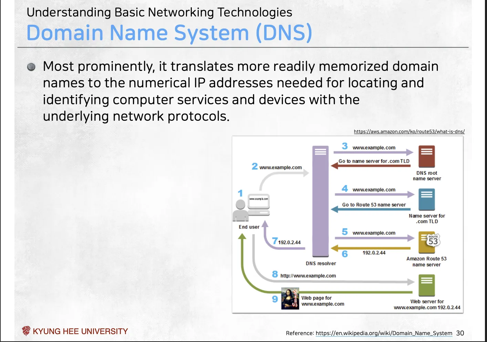

- 도메인 네임을 받아 IP로 번역해서 돌려주는 기능을 하는 서버

### 동작 방식

1. 사용자 (End user)가 `www.example.com`을 브라우저에 입력
2. PC는 미리 설정된 **DNS resolver**(보통 ISP 업체 서버, "해석기")에게 "[www.example.com](https://www.example.com/)의 IP 주소가 뭐야?"라고 질의
3. **Resolver**는 "Root name server" (전 세계 DNS의 뿌리)에게 "`.com` 담당자가 누구야?"라고 질의
4. **Root 서버**는 "`.com`은 저기 `.com TLD` 서버가 담당해"라고 알려줍니다.
5. **Resolver**는 "`.com TLD` 서버"에게 "`example.com` 담당자가 누구야?"라고 질의
6. **TLD 서버**는 "`example.com`은 저기 'Amazon Route 53' 서버가 진짜 주인이야"라고 알려줌 (이것을 '권한 있는(Authoritative) 네임 서버'라고 함)
7. **Resolver**는 드디어 "Amazon Route 53" 서버에게 "[www.example.com](https://www.example.com/)의 진짜 IP 주소가 뭐야?"라고 질의
8. **Amazon 서버**가 "그거 **192.0.2.44**야"라고 최종 IP 주소를 알려줌
9. **Resolver**는 이 IP 주소(`192.0.2.44`)를 **사용자 PC**에게 응답

# DHCP(Dynamic Host Configuration Protocol)

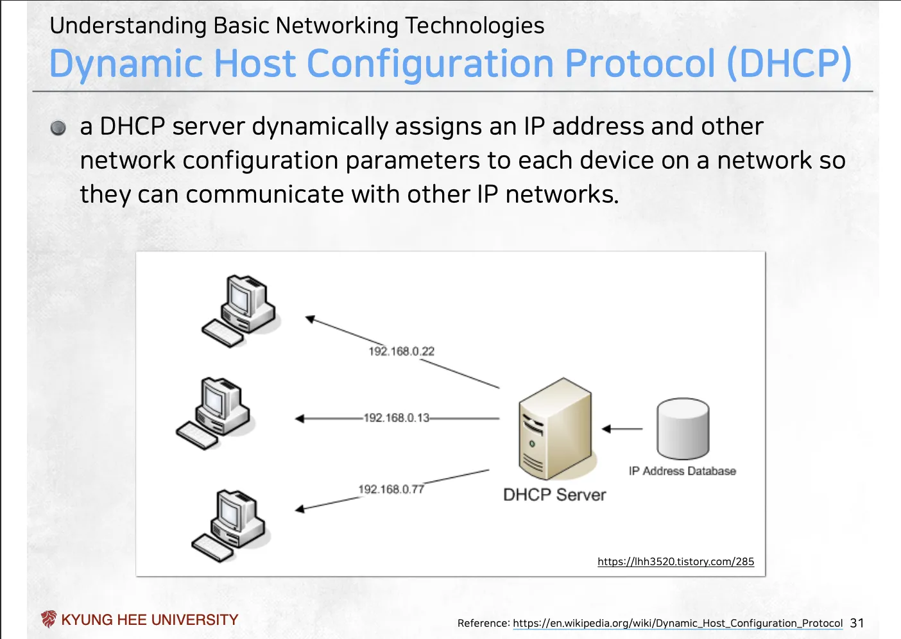

### DHCP

- 네트워크 상의 각 장치에 IP주소와 기타 네트워크 설정 매개변수들을 동적으로 할당해 그 장치들이 다른 ip 네트워크와 통신하게 함
- DHCP는 두 가지 기능을 가짐
	1. 유무선 공유기에 접속하면 본래 이 설정값을 전혀 모르나, DHCP는 이를 고려해 ip주소 DB에서 사용하지 않는 IP를 자동 할당(임대)함
	2. DHCP는 IP를 주고 돌려받는 방식으로 작동해 실제보다 적은 IP개수로도 더 많은 호스트의 네트워크를 담당할 수 있음
	→ 현재는 거의 1번의 역할만 남음

# Network & Port Address 번역

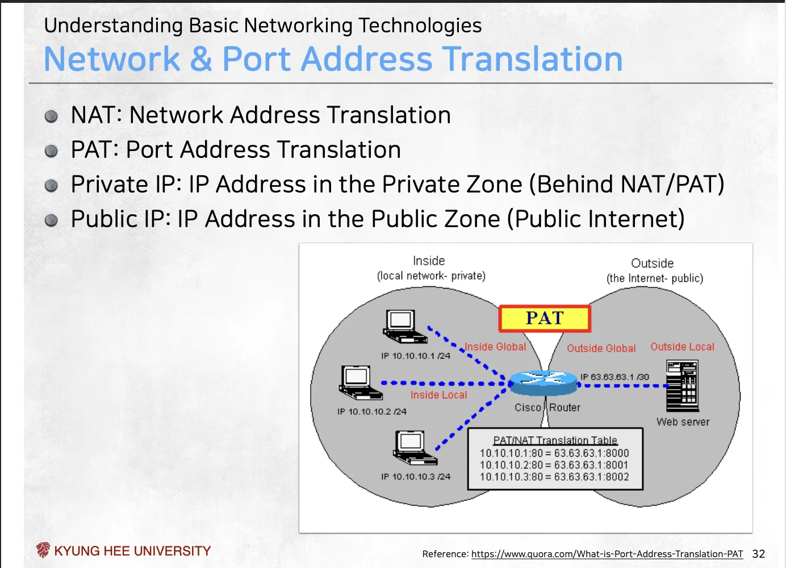

### Private IP, Public IP

1. Private IP(사설 IP)
	- 외부에서 의미가 없는 아이피
	- 전 세계 단위로 중복되어 사용 가능 → Ex) 우리 집 공유기도 192.168.0.1, 옆집도 192.168.0.1일 수 있음
2. Public IP (공인 IP)
	- 외부에서 사용되는 전 세계에서 유일한 실제 IP주소
	→ 현재 IP주소 고갈로 매우 부족

### NAT(Network Address Translation)

- NAT 장치(라우터)가 "사설 IP"를 "공인 IP"로 **일대일(1:1) 변환**해주는 기술
- 네트워크 계층의 주소를 번역하는 기술
→ 단순 1:1 변환이므로 IP주소 고갈에 큰 도움이 되지 않음

### PAT(Port Address Translation)

- 단 한개의 공인 IP주소와 포트 번호를 조합해 수천 개의 사설 IP가 동시에 인터넷을 사용할 수 있게 만듬
- **동작 (다이어그램 예시):**
	- 라우터의 공인 IP가 `200.1.1.1` 하나라고 가정
	- 웹 서버의 주소는 `83.63.63.1`
	1. PC 1 (`10.10.10.1`)이 `83.63.63.1`로 접속합니다. (이때 출발 포트는 `50001`번)
	2. PC 2 (`10.10.10.2`)가 *동시에* `83.63.63.1`로 접속합니다. (출발 포트 `50002`번)
	3. 라우터 (PAT 장치)가 이 패킷들을 받음
	4. **변환 1:**PC 1의 출발지(`10.10.10.1:50001`)를 라우터의 공인 주소(`200.1.1.1:60001`)로 바꿔치기
	5. **변환 2:**PC 2의 출발지(`10.10.10.2:50002`)를 라우터의 공인 주소(`200.1.1.1:60002`)로 바꿔치기
	6. 라우터는 이 변환 기록(리스트)**을 **"PAT/NAT Translation Table"**에 저장
⇒ 이 private ip를 public ip로 변화하는 기술 덕에 부족한 공인 IP 문제에도 불구하고 내부망의 모든 컴퓨터가 인터넷에 접속 가능

# IP 프로토콜의 시사점

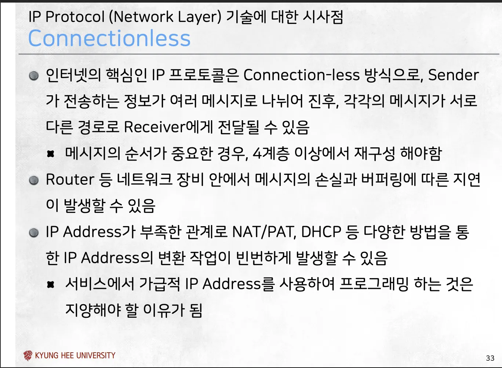

- IP는 Connection Less이므로 순서 보장이 불가
	- 메시지 순서가 중요한 경우 4계층 이상에서 재구성 필요
- 라우터 등 네트워크 장비 안에서 메시지의 손실과 버퍼링에 따른 지연 발생 가능
	- 라우터 내부 큐가 패킷으로 가득 차면 이후에는 버리거나 함
- IP address 부족해서 NAT/PAT, DHCP 등 다양한 방법으로 변환 작업이 빈번하게 발생
	⇒ 서비스에서 가급적 IP주소를 사용해 프로그래밍 하는 것은 지양

- IP는 줄의 개수만큼 하나의 PC에 여러개도 부여 가능
	- 클라이언트는 보통 1개만 사용하나, 서버는 네트워크 고장 대비 등의 이유로 여러개를 하는 경우도 있음
