> 원본 Notion 정리 — 강의 슬라이드 이미지 + 설명.

> [← 전체 목차](/posts/학교공부/풀스택-서비스-네트워킹/목차/)

***

# 프로토콜의 위치

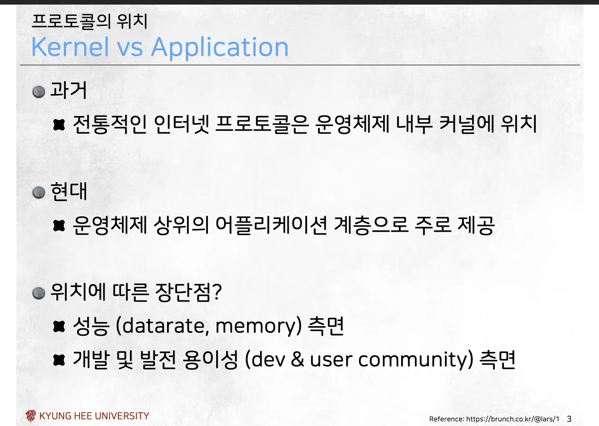

### 프로토콜의 위치 ⇒ 커널 vs Application

1. 과거 ⇒ 커널
	- 전통적 인터넷 프로토콜은 OS내부 커널에 위치
	- 장점
		- 커널에서 직접 작동하므로 데이터 전송률(datarate)과 메모리 관리 측면에서 성능이 뛰어남
	- 단점
		- 커널의 일부이므로 수정, 새로운 기능 추가가 어려움
		- 개발 및 발전에 커뮤니티가 기여하기 힘들어 유연성이 낮음
2. 현재 ⇒ 애플리케이션
	- 현대의 통신 프로토콜들은 OS의 상위 애플리케이션 계층에서 주로 제공
	- OS에 직접 설치되거나, 특정 프로그래밍 언어의 라이브러리 형태로 배포
	- 장점
		- 애플리케이션의 일부처럼 다룰 수 있어 개발 및 수정에 매우 용이
		- 오픈소스로 제공되는 경우가 많아 코드를 읽고 수정하며 커뮤니티를 통한 빠른 발전 가능
	- 단점
		- 커널 레벨이 아닌 애플리케이션 레벨 동장이라 상대적으로 성능(속도) 저하 발생 가능
⇒ 프로토콜의 위치에 따라 성능과 개발 용이성, 유연성에서 Trade-Off를 가짐

## 전통적 인터넷 프로토콜

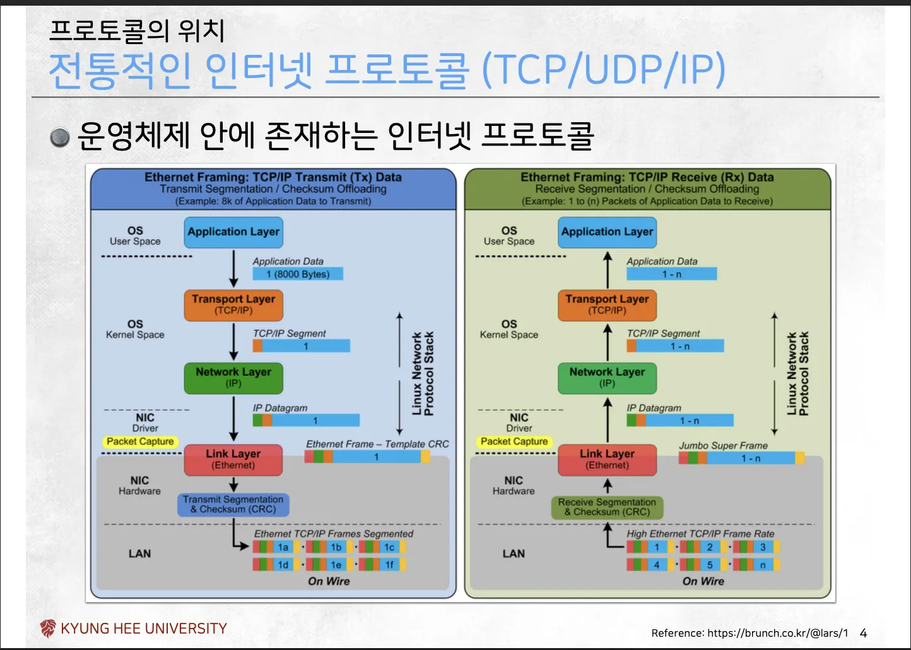

→ 위는 전통적 인터넷 프로토콜의 Tx, Rx ⇒ 데이터 송수신 절차를 나타내는 다이어그램

	- **유저 공간 (User Space):** 애플리케이션이 전송할 데이터(예: 8000 바이트)를 생성
	- **커널 공간 (Kernel Space):** 데이터가 커널로 전달되면, **전송 계층(TCP)**에서 이를 'TCP/IP 세그먼트'로 만듬
	- 네트워크 계층(IP)에서 'IP 데이터그램'으로 캡슐화
	- 링크 계층(Ethernet)에서 '이더넷 프레임'으로 만듬
	- **NIC 하드웨어**
		- 프레임은 NIC(네트워크 카드)로 전달되며, 하드웨어는 데이터를 여러 개의 작은 프레임으로 분할(Segmentation)하고 CRC(체크섬)를 계산하여(Offloading) 네트워크(LAN) 상으로 전송
	⇒ L3, L4 작업은 커널 스페이스에서 동작

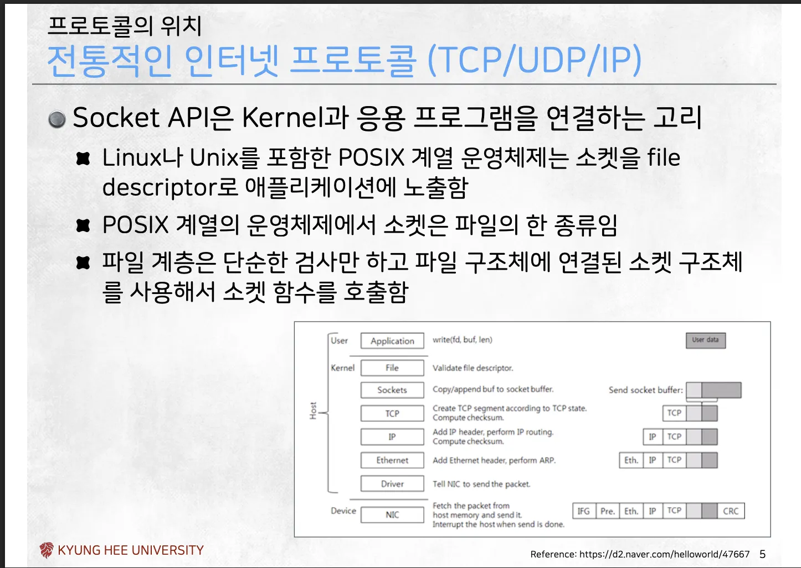

### Socket API

- **커널 공간의 프로토콜 스택과 유저 공간의 애플리케이션이 통신하기 위해 사용하는 API**
- POSIX계열 OS(Linux, Unix)는 소켓을 file descriptor로 노출
	⇒ POSIX계열 OS에서 소켓은 파일의 한 종류

- 파일 계층은 단순한 검사만 하고 파일 구조체에 연결된 소켓 구조체를 사용해 소켓 함수 호출
	→ descriptor 식별자로 파일 읽고 쓰기로 소켓 통신

⇒ 현대적인 애프로토콜은 커널이 아닌 애플리케이션 계층에 존재
	→ QUIC같은 프로토콜도 애플리케이션 계층에 존재

## ZMQ 프로토콜의 위치

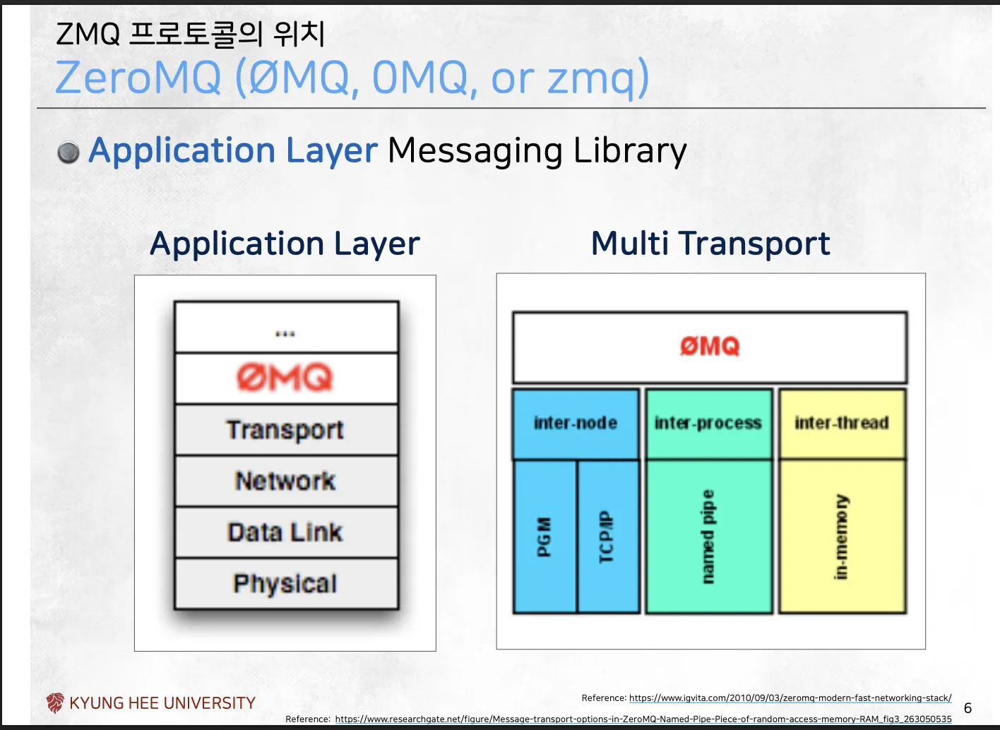

### ZeroMQ의 위치

- zmq도 전통적인 TCP/IP스택의 최상단 애플리케이션 계층에서 존재
	→ 커널이 아닌 애플리케이션(유저 레벨)에서 실행

	- zmq는 유저 레벨(애플리케이션 레벨)에서 동작하는 메시징 라이브러리

### 전통적 TCP통신과의 차이

- 전통적인 TCP통신은 단순한 줄(연결)을 만드는 것
	- 그러나 실제 애플리케이션에서는 멀티 스레드 처리, 여러 커넥션 등의 처리가 복잡
- ZMQ는 이런 복잡한 네트워크 통신(ex. 멀티스레드 TCP)을 개발자가 구현할 필요 없이 알아서 처리하니 이를 사용하라는 고수준 API를 제공
- 개발자는 ZMQ 라이브러리로 코드를 작성하면, ZMQ가 그 하부 통신 매커니즘을 알아서 처리

### Multi Transport
→ 오른쪽 그림

- ZMQ는 다양한 전송 방식을 추상화
1. inter-node(노드 간): 다른 컴퓨터와의 통신
	- 이떄는 TCP/IP나 PGM을 사용
2. Inter-process(프로세스 간): 같은 컴퓨터 내의 다른 프로세스와 통신
	- 이때는 Named Pipe를 사용
3. Inter-Thread(스레드 간): 같은 프로세스 내의 스레드끼리 통신
	- 인메모리 방식 사용
⇒ 개발자가 ZMQ소켓을 사용하면, ZMQ가 상황에 맞게 최적의 하부 전송 방식(TCP, PIPE, Memory)을 선택

# ZMQ 소개

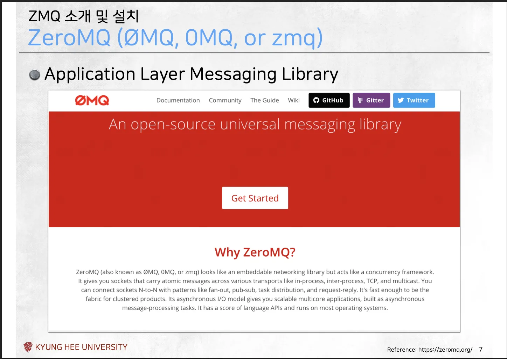

### ZMQ

- 애플리케이션 계층 메시징 라이브러리
- 오픈소스 범용 메시징 라이브러리

### 왜 ZMQ인가
→ 이 항목에 대한 설명

- ZeroMQ는 임베디드 네트워킹 라이브러리처럼 보이지만 동시성(concurrency) 프레임워크처럼 작동
- 이것은 인-프로세스, 인터-프로세스, TCP 및 멀티캐스트와 같은 다양한 전송 수단을 통해 아토믹(원자적) 메시지를 전달하는 소켓을 제공
- 사용자(개발자)는 fan-out, pub-sub, 작업 분배, request-reply와 같은 패턴으로 소켓을 N-to-N (다대다)으로 연결 가능
- 클러스터형 제품을 위한 기반(fabric)이 될 만큼 고성능
- 이것의 비동기 I/O 모델은 비동기 메시지 처리 작업으로 구축된 확장 가능한 멀티코어 애플리케이션을 제공
- 수많은 언어 API를 가지고 있으며 대부분의 운영체제에서 실행

## ZMQ의 특성

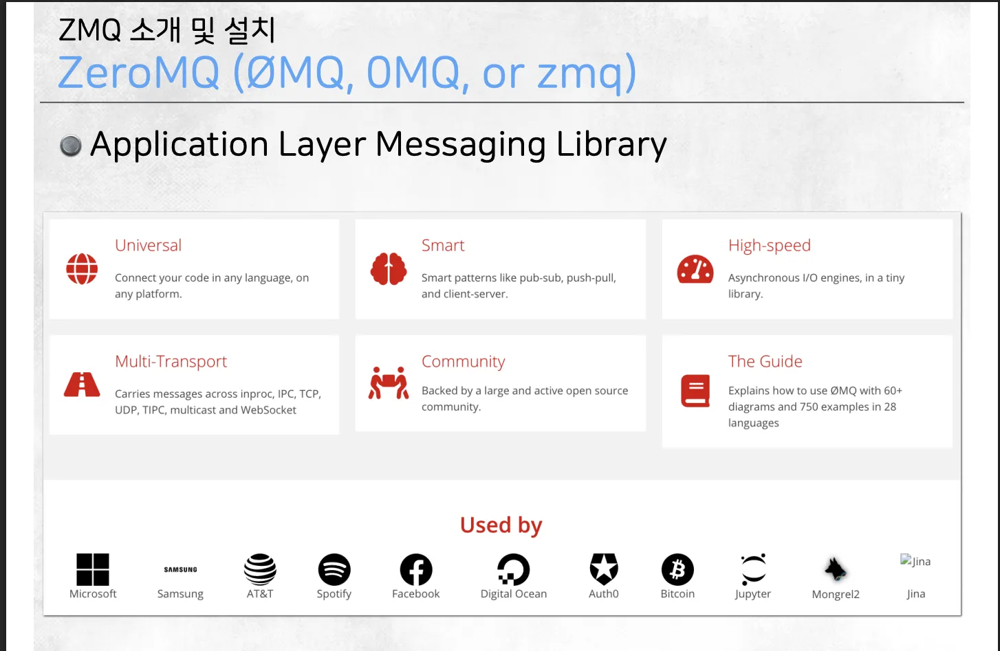

### ZeroMQ가 애플리케이션 계층 라이브러리로서 가지는 특징

1. 범용
	- 다양한 언어, 플랫폼 지원
2. Multi-Transport 
	- 네트워크를 통한 통신(TCP, UDP), 같은 장비 내 프로세스 간 통신(IPC), 혹은 프로세스 내 스레드 간 통신(inproc) 등 **다양한 전송 방식을 추상화**하여 개발자가 동일한 API로 사용할 수 있게함
3. 고속
	- 비동기 I/O 엔진을 내장해 고속으로 동작
4. 스마트
	- 단순 1:1 통신 뿐만 아니라 pub-sub, push-pull, client-server같은 다양한 메시징 패턴을 라이브러리 차원에서 지원
5. 가이드
	- 60개 이상의 다이어그램, 28개이상 언어, 750개의 예제로 사용법 설명

### 사용처

- MS, 삼성, Auth0 등
- Jupyter notebook의 내부 통신에서 사용

## ZMQ 설치 및 소개(선택 기준)

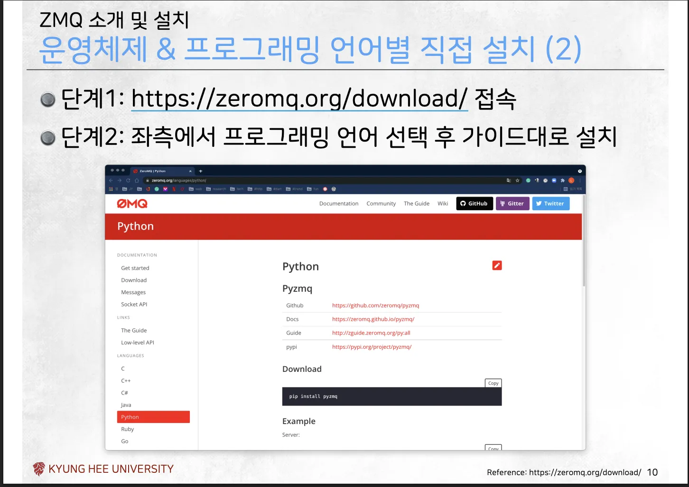

### ZMQ 설치 방법

- 공식 사이트에서 각종 프로그래밍 언어 선택 시 설치 가이드 존재

### ZMQ 특징과 활용

- 매우 높은 수준의 추상화를 제공해, 클라이언트도 알아서 처리
- 전통적 메시지큐(MQ)와 유사한 동작
	- 하부 동작과 무관히 메시지를 전파하는 것이 가능
	- 1:1, 1:N, N:N 모두 가능

### ZMQ 구현체 성능 기준

- 오픈소스 커뮤니티에 의해 관리되어 다양한 구현체 존재
- 선택 프로세스
	1. 기능 확인 → 본인이 원하는 기능이 있는지
	2. 성능 측정 → 원하는 기능이 있다면, 어느정도의 성능인지 테스트
	3. 대안 탐색 → 기능, 성능 면에서 충족되지 않은 경우 다른 언어의 것을 가져와 바인딩도 가능
- **C 기반 구현체:**
	- 통상적으로는 C와 같은 대중적이고 저수준 언어가 코어 라이브러리로 존재
	- C로 작성된 비객체형 구현체는 **기계어와 직접 매핑이 가능**하여 성능이 매우 뛰어남
	- 대부분의 경우 C, C++, Python 3가지 버전의 구현체는 기본적으로 존재하므로 선택의 폭이 넓음

# ZeroMQ의 이해

## ZMQ의 연혁

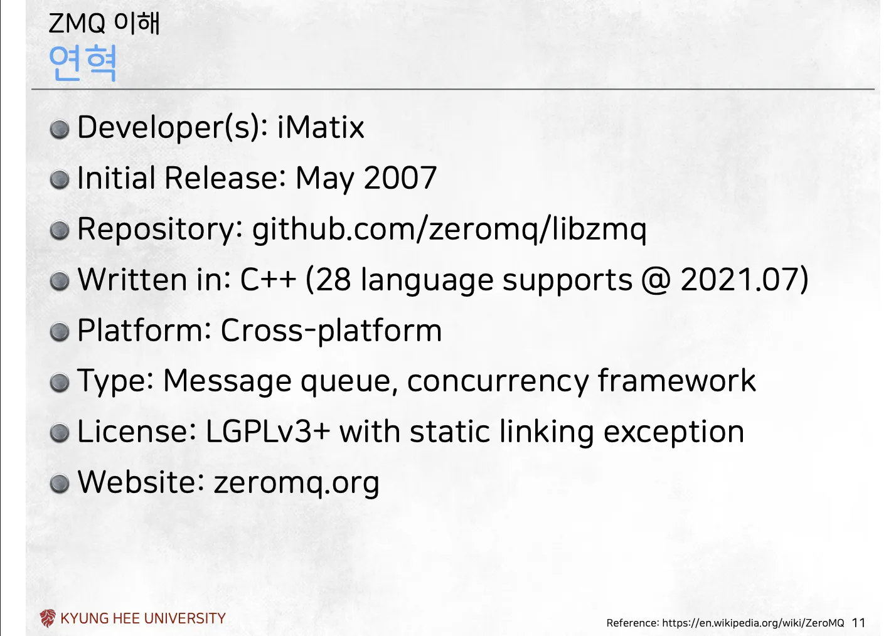

### ZMQ의 연혁

- **개발 및 역사:** ZMQ는 **iMatix**사에 의해 개발되어 **2007년 5월**에 처음 릴리스
- **핵심 라이브러리:** 핵심 라이브러리(`libzmq`)는 C++로 작성
- **언어 지원:** 21년도 슬라이드 기준 28개 언어, 현재는 30개 언어 지원
	→ 주의할 점: 다양한 언어를 지원하지만, 언어별 구현체에 따라 성능, 기능이 다를 수 있음

- **플랫폼:** 크로스플랫폼(Cross-platform)을 지원하며, 대부분 주요 운영체제에서 동작 가능
- **정체성 (Type):** ZMQ는 단순한 메시지 큐(MQ)가 아니라, 동시성 프레임워크(Concurrency Framework)로도 동작
	→ 이는 ZMQ가 복잡한 비동기 및 동시성 처리를 위한 강력한 도구임을 의미

- **라이선스**
	- **LGPLv3+** 라이선스를 따르지만, **"정적 링크 예외(static linking exception)"** 조항이 포함
	- 이는 ZMQ 라이브러리를 상용 소프트웨어에 정적으로 링크(포함)하더라도, 해당 소프트웨어의 소스 코드를 공개하지 않아도 된다는 것을 의미하여 상업적 활용에 유리

## ZMQ의 특징

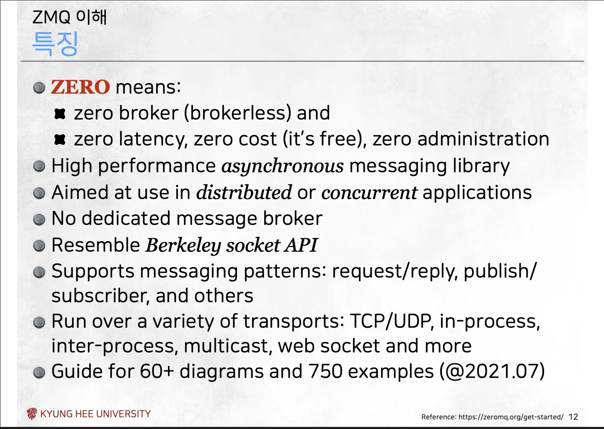

### 특징

1. Zero는 아래 네 가지가 없음을 뜻함
	- zero broker ⇒ 중앙 브로커가 없음
	- zero administartion ⇒ 중앙 브로커가 없어서 관리도 하지 않음
	- zero latency ⇒ 매우 빠름
	- zero cost ⇒ 오픈소스로, 비용지불 없음
2. **고성능 비동기 라이브러리**
	- ZMQ는 **고성능**을 내는 **비동기(asynchronous)** 메시징 라이브러리
	- **분산 시스템**이나 **동시성(concurrent)** 애플리케이션에 사용하는 것을 목표로 함, 그리고 적합함
3. 버클리 소켓 API와 유사한 API
	- 친숙한 API를 제공
4. 다양한 메시징 패턴 지원 ⇒ 요청/응답, 발행/구독 등
5. 전송 방식 추상화(multi transport) ⇒ 하부 전송 방식을 추상화하고, 다양한 방식을 지원
	- TCP/UDP, inter-process, in-process
	- 따로 지정하지 않으면 ZMQ가 해당 패턴에서 가장 일반적인 전송 방식으로 알아서 지정
6. 풍부한 문서 존재 → 다양한 다이어그램, 언어별 예시 존재

## ZeroMQ의 메시징 패턴

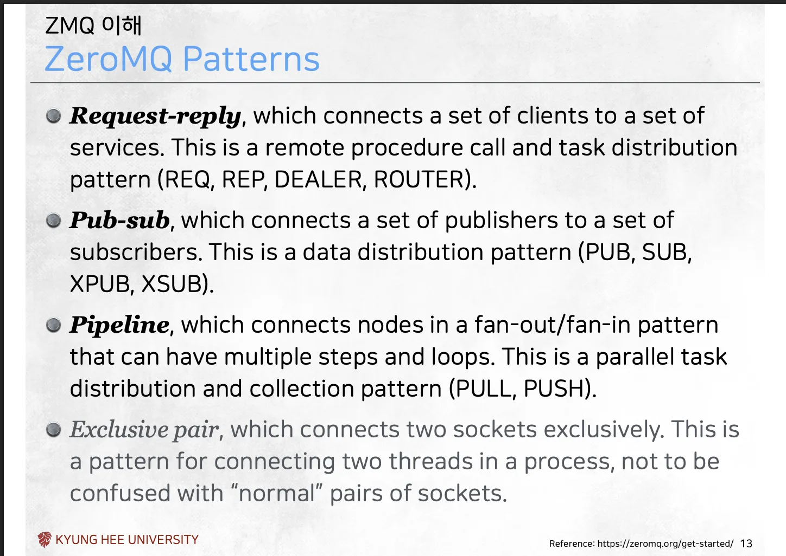

### Request-reply(요청-응답)

- 가장 일반적인 **클라이언트-서버** 모델
- 클라이언트(REQ)가 서비스를 요청하면 서버(REP)가 응답
- 원격 프로시저 호출(RPC)나 간단한 작업 분배에 사용
- REQ, REP, DEALER, ROUTER 등의 소켓을 제공 → DEALER, ROUTER는 확장한 버전

### Pub-Sub(발행-구독)

- 1:N 데이터 배포에 사용
- 하나의 발행자(PUB, Publisher)가 특정 토픽으로 메시지를 발행하면, 해당 주제를 구독(SUB, Subscriber)하는 모든 구독자에게 메시지 전달
- 뉴스 피드, 실시간 알림, 주식 시세 전송 등 광범위한 데이터 배포에 유용
- PUB, SUB, XPUB, XSUB 소켓을 제공

### Pipeline(파이프라인)

- 데이터 처리 파이프라인 구성 시 사용, PULL/PUSH 소켓을 사용
- 병렬 작업 분배 및 결과 취합에 특화
	- Fan-out(분배) → 하나의 PUSH소켓이 여러 PULL소켓(워커)에게 작업을 분배
	- Fan-in(취합) → 여러 소켓들이 처리된 결과를 하나의 PULL소켓으로 밀어넣어 결과 취합
- 패턴은 **데이터 사이언스나 데이터 분석** 분야에서 대용량 데이터를 **병렬 처리**하고 그 결과를 다시 **취합**해야 할 때 강력하게 권장
- 주로 **서버 대 서버(server to server)** 간의 백엔드 통신에서 복잡한 작업을 효율적으로 처리하기 위해 사용

### Exclusive Pair(배타적 쌍)

- 두 개의 소켓을 배타적으로 연결
- 프로세스 내의 두 스레드를 연결하기 위한 패턴
- 일반적인 네트워크 통신이 아닌, **단일 프로세스 내에서 두 개의 스레드 간**에 빠르고 배타적인 통신 채널을 만들 때 사용
- 다른 소켓과 연결될 수 없으며 오직 두 스레드 간의 1:1 통신만을 보장

## ZMQ Sockets과 전통적 소켓 비교

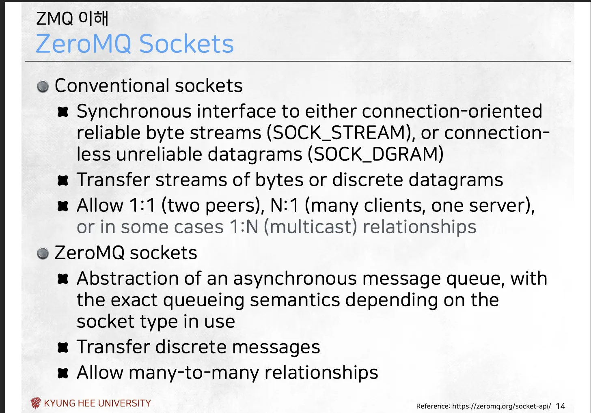

→ 전통적 소켓과 zeromq소켓의 비교

### **전통적인 소켓(전통적 TCP, UDP)**

- 연결 지향 신뢰성 있는 바이트 스트림 (SOCK_STREAM) 또는 비연결 비신뢰성 데이터그램 (SOCK_DGRAM)에 대한 동기식 인터페이스.
- 바이트 스트림 또는 개별 데이터그램을 전송.
- 1:1 (두 피어), N:1 (많은 클라이언트, 한 서버), 또는 일부 경우 1:N (멀티캐스트) 관계를 허용.

### **ZeroMQ 소켓**

- 비동기 메시지 큐의 추상화, 정확한 큐잉 시맨틱은 사용 중인 소켓 타입에 따라 다름.
- 개별 메시지를 전송.
- 다대다 (many-to-many) 관계를 허용

## ZeroMQ 소켓의 비동기성

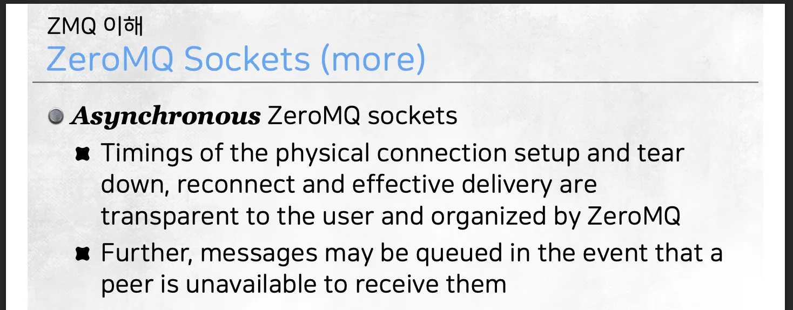

### 비동기적인 ZMQ소켓
→ 비동기인 이유는 개발자의 코드 실행과 네트워크의 실제 동작 흐름 사이 순서가 없기 때문으로 생각됨

1. **개발자에게 "투명한" 연결 관리**
	- 물리적 연결 설정 및 종료, 재연결 및 효과적인 전달의 타이밍이 zmq에 의해 관리됨
2. 내부 큐 (Queuing)의 역할
	- , 피어가 메시지를 받을 수 없는 경우 메시지가 큐에 저장
→ 비동기인 이유

	- send()가 실제 전송 완료를 기다리지 않고 즉시 반환
		1. **연결 대기 안 함**
			- 상대방 연결 전에도 send() 가능
		2. **전송 완료 대기 안 함**
			- 메시지를 큐에만 넣고 즉시 반환
		3. **재연결도 백그라운드에서**
			- 연결 끊어져도 프로그램 멈추지 않음

## ZeroMQ 소켓 생명주기

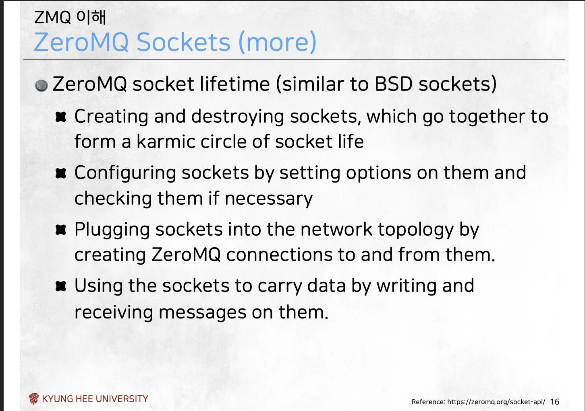

### ZeroMQ 소켓의 생명주기

- 소켓의 생성 및 파괴를 반복함
- 소켓의 역할을 옵션을 통해 구성
- 네트워크에 실제로 연결
- 소켓을 사용
→ 아래는 더 정확한 라이프사이클

	1. **생성 (Creating)**
		- `zmq_socket()`과 같은 함수를 호출하여 소켓(통신 채널)을 생성
	2. **구성 (Configuring):** 
		- `zmq_setsockopt()` 등을 사용하여 소켓의 옵션을 설정
		-  (예: `REQ`/`REP` 또는 `PUB`/`SUB` 같은 메시징 패턴 정의, 타임아웃 설정 등)
	3. **연결 (Plugging in)**
		- 소켓을 실제 네트워크 토폴로지에 "연결"
		- `zmq_bind()` (주소를 열고 연결을 기다림) 또는 `zmq_connect()` (특정 주소로 연결을 시도함)를 호출하여 수행
	4. **사용 (Using)**
		- 구성과 연결이 완료된 소켓을 사용하여 `zmq_send()`로 메시지를 **쓰고(sending)**, `zmq_recv()`로 메시지를 **받으며(receiving)** 실제 데이터를 주고받음
	5. **파괴 (Destroying)**
		- 모든 통신이 끝나면 `zmq_close()`를 호출하여 소켓을 닫고 자원을 해제
		→  (슬라이드의 "생성 및 파괴"에 해당)

## ZeroMQ 소켓의 Bind와 Connect

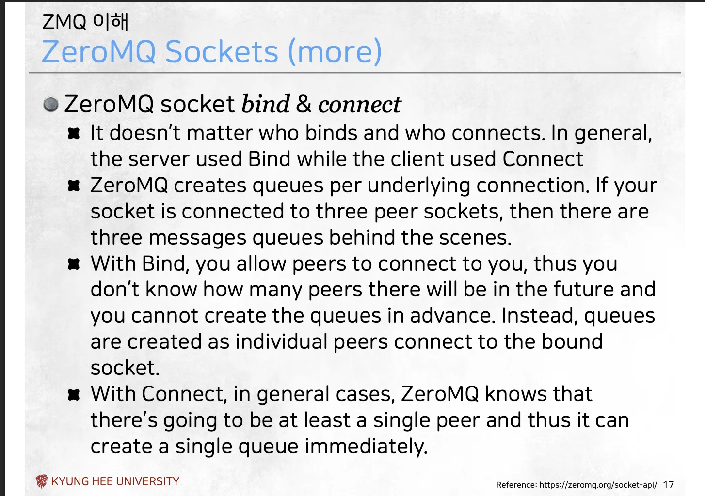

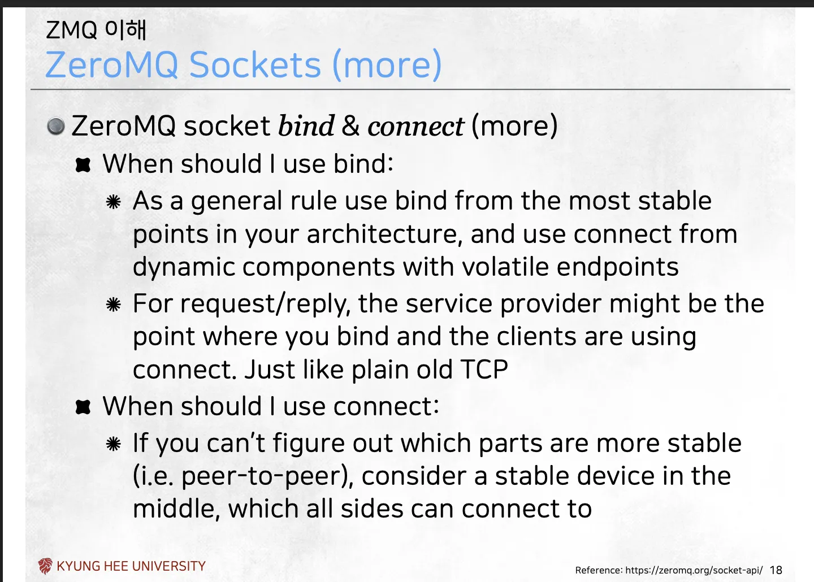

### ZeroMQ 소켓의 Bind & Connect

- zeromq에서 누가 bind하고, connect하는지는 중요하지 않음
	- 전통적으로는 보통 서버는 bind를 사용하고 클라이언트는 connect를 사용
	- zmq는 이를 엄격하게 따르지 않음 → 필요에 따라 따를 수도 있긴 함
		- Server to Server 통신에 주로 사용되므로 유연하게 구성 가능
- ZeroMQ는 내부 연결 마다 큐를 생성
	- ex) 현재 소켓이 3개의 피어와 연결되어있으면 3개의 큐가 존재하는 것
		- 내 기준 3개, 피어(3개)들도 각각 하나씩 가짐 → 총 6개
		- 단방향이라고 하면 나한테 송신 큐 3개, 각 피어가 수신 큐 1개씩 가짐
	- `connect` 사용 시 명확한 대상(피어)에게 연결을 시도하므로 즉시 해당 피어를 위한 메시지 큐 하나를 생성
	- `bind` 사용 시 주소를 열어두고 누군가 연결하기를 대기하므로 몇 명이 연결할지 미리 알 수 없음
		- 따라서 미리 큐를 만들지 않고 실제 피어가 연결되는 시점에 해당 피어를 위한 큐를 생성

### 언제, 누가 Bind, Connect를 사용해야하는가
→ 서버/클라이언트의 구분보다 안정성을 기준으로 이를 결정ㄴ

- bind들 사용해야하는 경우
	- 아키텍처에서 가장 안정적인 지점, 더 오래 살아있는 쪽에서 수행
	- 다운되지 않고 고정적으로 오래 살아있는(live longer) 쪽에서 이를 수행
	- ex) request/reply에서는 서비스 제공자(변하지 않는 노드)가 bind 수행
- connect를 사용하는 경우
	- 휘발성의 엔드포인트(volatile한 엔드포인트, 필요에 의해 연결하고 끊는)를 가지는 동적인 컴포넌트가 사용해야함
- p2p의 경우
	- 이때는 어떤 노드가 더 안정적인지 알 수 없으므로 애매함
		- 서로가 서로에게 모두 bind, connect하면 네트워크 토폴로지가 매우 복잡
	- 이때 zmq는 모든 피어들이 connect가능한 중간에 있는 안정적인 장치를 하나 두는 것을 권장
		- 모든 P2P 노드들은 connect를 사용하고, 중앙 장치만 bind를 수행해 구조를 단순화

# 중앙 집중형 브로커 방식
→ **For Your Information(FYI, 참고용)**
→ zeromq(brokerless, zero broker)와 다르게 중앙집중형 메시징 시스템 소개

## RabbitMQ

- 가장 널리 쓰이는 오픈소스 메시징 브로커

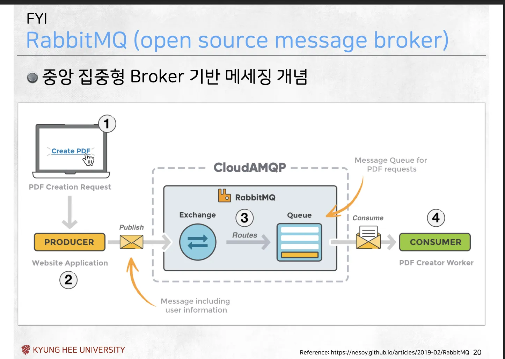

- 동작 방식 예시
	1. 사용자가 웹사이트에 PDF생서 ㅇ요청
	2. Producer → PDF생성요청 메시지를 래빗엠큐로 발행(Publish)하고 즉시 사용자에게 응답
	3. Broker(래빗엠큐) → 메시지를 받아 교환기(exchange)를 통해 적절한 큐에 저장
	4. Consumer(ex. PDF 생성작업 프로그램) → Subscribe하다 메시지를 Consume해서 실제 PDF생성 작업 수행

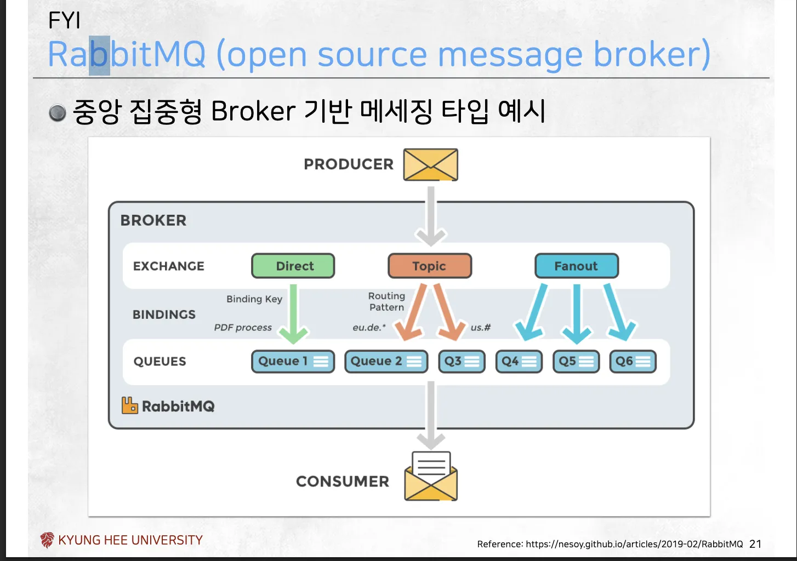

- RabbitMQ의 메시지 라우팅
	- ZMQ는 소켓 자체가 패턴을 가짐, 그러나 이는 브로커 내부 Exchange가 이를 담당
1. **Producer**는 메시지를 큐에 직접 보내는 것이 아니라, **Exchange**에 전송
2. **Exchange**는 설정된 타입에 따라 메시지를 어떤 **Queue**로 보낼지 결정
	1. **Direct:** 바인딩키가 정확히 일치하는 큐로 보냄
	2. Topic: 라우팅 패턴과 일치하는 큐로 보냄
	3. **Fanout:** **(Pub/Sub 모델)** 키와 상관없이, 해당 Exchange에 연결된 **모든 큐**로 메시지를 "방송"

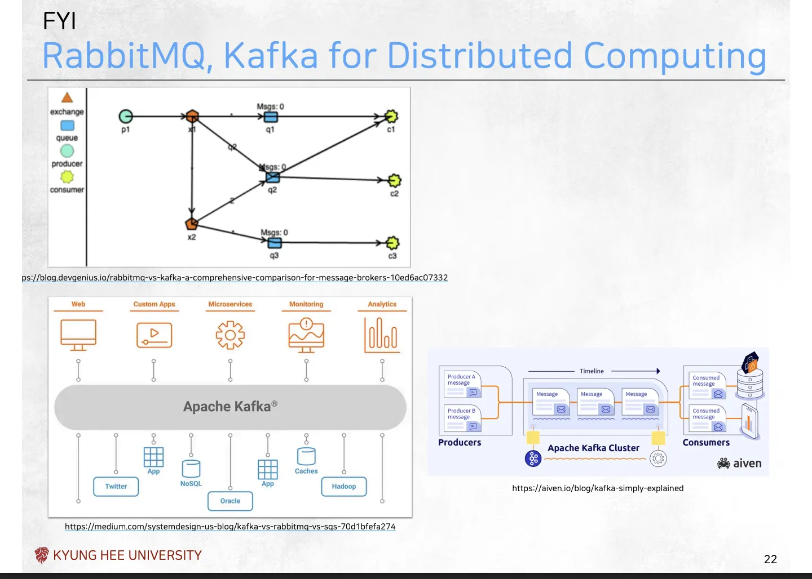

- **Kafka** 역시 RabbitMQ처럼 중앙 브로커(클러스터)를 사용하는 시스템이지만, 목적이 약간 다름
- **데이터 스트리밍 파이프라인:** Kafka는 '메시지 큐' 개념보다는 **"지속성 있는 로그(Log)"** 또는 **"타임라인(Timeline)"** 개념에 가까움
**차이점:**

- **RabbitMQ:** 메시지는 큐에 저장되고, Consumer가 가져가면(Consume) **큐에서 삭제**되는 것이 일반적(작업 큐)
- **Kafka:** Producer가 보낸 메시지는 "타임라인"에 **순서대로 계속 쌓입니다(삭제되지 않음)**. Consumer들은 이 타임라인의 **특정 지점부터 메시지를 "읽어가는"** 방식

# ZMQ 패턴과 코드

## Request/Reply 패턴

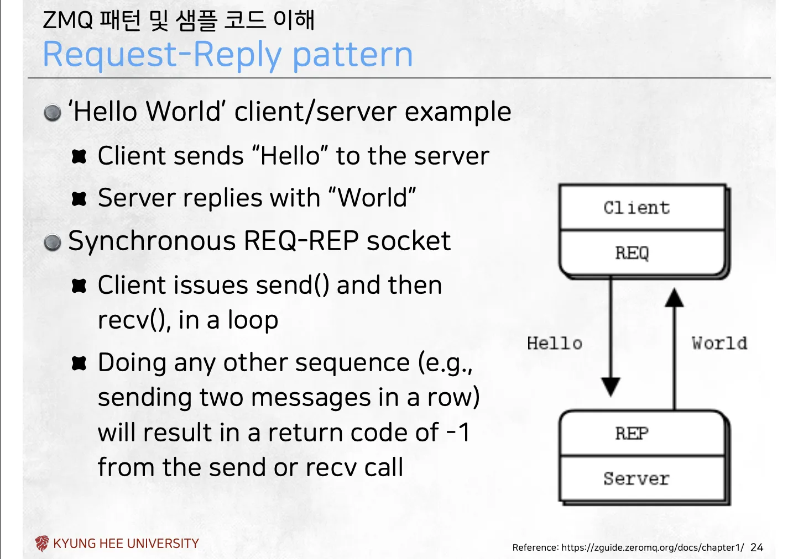

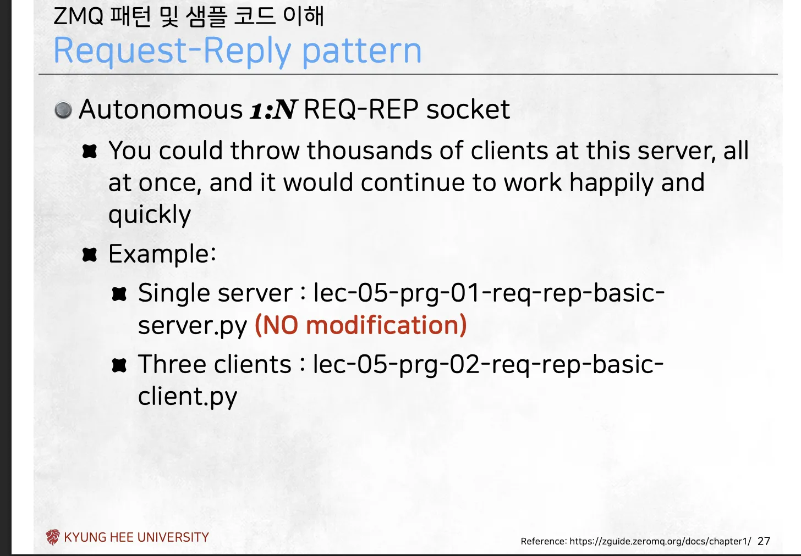

### `Request-Reply` 패턴의 기본 규칙

- `REQ-REP` 패턴은 ZMQ가 클라이언트가 요청하고, 서버가 응답하는 형태
	- 서버는 ZMQ의 REP패턴
	- 클라이언트는 REQ패턴을 사용

### 예시 설명
→ ZMQ의 **`Request-Reply`**** 패턴**이 단순한 1:1 통신을 넘어, **어떻게 1:N (서버 1대 : 클라이언트 N대) 통신을 코드 수정 없이 "자율적으로" 처리하는지 보여주는 것**
→ 코드의 수정 없이 클라이언트 개수만 늘려도 1:1에서 1:3이 되는 걸 보여줌

### 코드 설명
```python
#

# Hello World 서버 in Python

# Binds REP 소켓 to tcp://*:5555

# 클라이언트로부터 b"Hello"를 예상하고, b"World"로 응답
#

# Reference: https://zeromq.org/languages/python/
#
import time
import zmq

context = zmq.Context()
socket = context.socket(zmq.REP)
socket.bind("tcp://*:5555")

while True:
    # 클라이언트로부터 다음 요청을 기다림
    message = socket.recv()
    print("Received request: %s" % message)

    # "작업" 수행
    time.sleep(1)

    # 클라이언트에게 응답을 보냄
    socket.send(b"World")
```

- 서버쪽 코드
```python
#

# Hello World 클라이언트 in Python

# REQ 소켓을 tcp://localhost:5555에 연결

# "Hello"를 보내고, 서버로부터 "World"를 응답받을 것을 예상
#

# Reference: https://zeromq.org/languages/python/
#
import zmq

context = zmq.Context()

# 서버와 통신할 소켓
print("Connecting to hello world server…")
socket = context.socket(zmq.REQ)
socket.connect("tcp://localhost:5555")

# 10번의 요청을 수행
for request in range(10):
    print("Sending request %s …" % request)
    socket.send(b"Hello")

    # 응답 받기
    message = socket.recv()
    print("Received reply %s [ %s ]" % (request, message))
```

- 클라이언트쪽 코드

## Publish-Subscribe 패턴

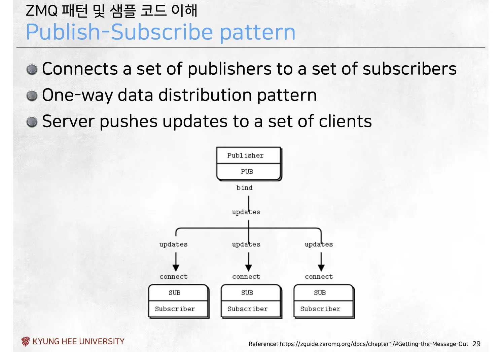

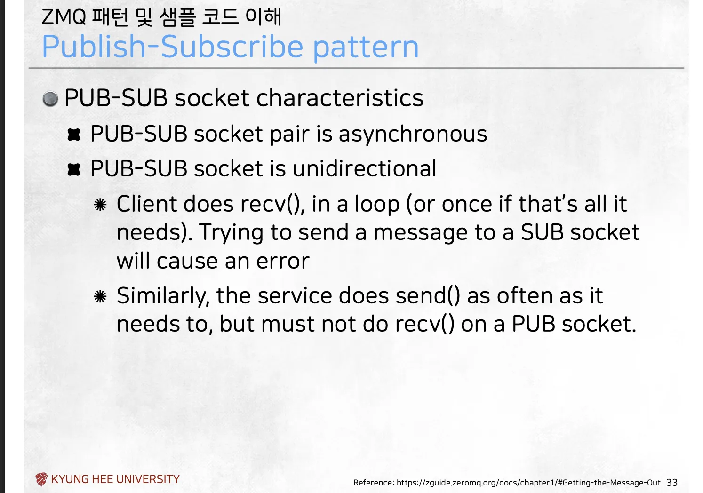

### Publish-Subscribe 패턴

- Publisher집합을 Subscriber집합에 연결 → 1:N (일대다) 통신
- 서버가 클라이언트 집합에게 업데이트를 Push하는 방식 → 1:N (일대다) 통신
- 단방향(One-way)의 데이터 분배 패턴

### PUB-SUB 소켓 특징

- PUB-SUB 소켓 쌍은 비동기식으로 동작
- PUB-SUB 소켓은 단방향(unidirectional, one-way)으로 동작
	- 클라이언트는 반복을 통해(일회성이면 한번) recv()를 수행
		- SUB소켓으로 메시지를 보내려 하면 오류 발생
	- 동일하게 Server(서비스)는 필요한 만큼 send()를 수행
		- 그러나 PUB소켓으로 recv()를 수행하면 에러 발생

### 코드 설명

- PUB-SUB 날씨 방송 예제
- 서버는 우편번호, 온도, 상대 습도로 구성된 날씨 업데이트를 밀어(pushes) 보냄(PUB)
- 클라이언트는 이 업데이트 스트림을 수신하고, 지정된 우편번호와 관련된 것은 무엇이든 가져옴(SUB)
	- `setsockopt_string`의 `zip_filter` (라인 21)
	- 클라이언트는 `setsockopt()`와 `SUBSCRIBE`를 사용하여 구독을 설정해야만 함 (라인 21에서처럼)
```python
#

# Weather update server

# Binds PUB socket to tcp://*:5556

# Publishes random weather updates
#
import zmq
from random import randrange

print("Publishing updates at weather server…")

context = zmq.Context()

# 1. 소켓 타입을 "발행자(PUB)"로 생성
socket = context.socket(zmq.PUB)

# 2. REP 서버와 마찬가지로, bind()를 사용해 주소를 열고 대기
socket.bind("tcp://*:5556")

while True:
    zipcode = randrange(1, 100000)
    temperature = randrange(-80, 135)
    relhumidity = randrange(10, 60)

    # 3. 비동기적으로 메시지를 계속 "방송" (send)
    #    (구독자가 있든 없든 상관없이 보냄)
    socket.send_string(f"{zipcode} {temperature} {relhumidity}")
```

- Publisher 쪽 코드
```python
#

# Weather update client

# Connects SUB socket to tcp://localhost:5556

# Collects weather updates and finds avg temp in zipcode
#
import sys
import zmq

context = zmq.Context()

# 1. 소켓 타입을 "구독자(SUB)"로 생성
socket = context.socket(zmq.SUB)

print("Collecting updates from weather server…")

# 2. REQ 클라이언트와 마찬가지로, connect()를 사용해 서버에 접속
socket.connect("tcp://localhost:5556")

# 3. (핵심) 구독할 메시지의 "필터"를 설정

#    sys.argv[1] (터미널에서 받은 인자)이 없으면 기본값 "10001" 사용
zip_filter = sys.argv[1] if len(sys.argv) > 1 else "10001"

# 4. (핵심) zmq.SUBSCRIBE 옵션으로 필터를 설정해야만 메시지를 받을 수 있음

#    이것이 없으면 아무 메시지도 받지 못함
socket.setsockopt_string(zmq.SUBSCRIBE, zip_filter)

# Process 5 updates
total_temp = 0
for update_nbr in range(20): # (슬라이드 실행화면 기준)
    # 5. 서버가 보낸 메시지 중 필터(zip_filter)와 일치하는 것만 수신
    string = socket.recv_string()
    zipcode, temperature, relhumidity = string.split()
    total_temp += int(temperature)

    print(f"Receive temperature for zipcode '{zip_filter}' was {temperature} F")
```

- Subscriber쪽 코드
- SUB소켓을 설정할 때 connect만 해서는 메시지 수신하지 않음
	- SUB소켓은 기본으로는 아무것도 구독하지 않아, recv호출 전에 반드시 구독 신청해야함
	- 구독 신청 → socket.setsockopt_string(zmq.SUBSCRIBE, 필터 문자열)
		- 접두사를 기반으로 필터링함 → **“구독 필터”**
⇒ ZMQ가 알아서 연결된 구독자들에게 메시지를 분배(distribution)하고, 각 구독자들은 자신들의 필터에 맞는 메시지만 골라 받음

## Publish-Subscribe 패턴 with pipeline pattern

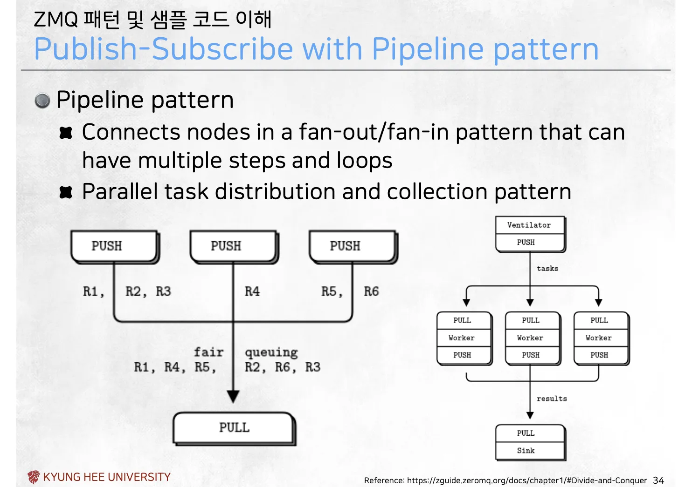

### 파이프라인 패턴

- 여러 단계와 루프를 가질 수 있는 fan-out/fan-in 패턴으로 노드를 연결
- 병렬 작업 분배 및 수집 패턴
→ PUB-SUB과 Pipeline(PUSH/PULL)을 조합해 분산 작업 및 취합, 동기화를 구현

	- push → pull → push → pull을 반복하는게 pipeline

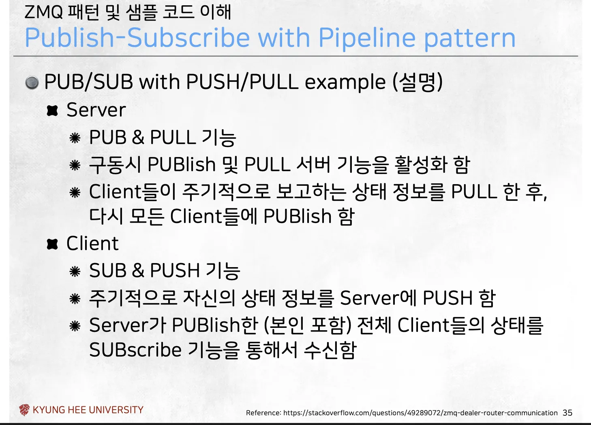

### 아키텍처 설명

- 아키텍처의 목적
	1. 다수의 클라이언트들이 자신의 "상태" (예제에서는 임의의 숫자)를 서버에 PUSH
	2. 서버는 모든 클라이언트로부터 이 보고를 수집(PULL)합니다.
	3. 서버는 수집한 정보를 취합(이 예제에서는 그냥 그대로)하여 **모든 클라이언트에게** 다시 발행(PUB)
	4. 클라이언트들은 이 방송을 구독(SUB)함으로써, **자기 자신을 포함한 다른 모든 클라이언트의 상태**를 확인
- **두 가지 패턴의 조합 (네 번째, 여섯 번째, 일곱 번째 슬라이드)**
	- 이 목적을 달성하기 위해 두 개의 독립적인 통신 채널(포트)이 사용
	1. 클라이언트 → 서버 (Fan-in, 수집)
		- Pipeline 패턴을 사용
			- 클라이언트는 PUSH, 서버는 PULL
	2. 서버 → 클라이언트 (Fan-out, 분배)
		- PUB-SUB 패턴 사용
			- 서버는 수집한 메시지를 PUB
			- 클라이언트는 이를 구독(SUB)해서 정보를 받음

### 예시 설명
```python
import zmq

def main():
    # context와 소켓들
    ctx = zmq.Context()
    
    # 1. PUB 소켓: 클라이언트들에게 "방송"할 소켓 (포트 5557)
    publisher = ctx.socket(zmq.PUB)
    publisher.bind("tcp://*:5557")
    
    # 2. PULL 소켓: 클라이언트들의 "보고"를 "수집"할 소켓 (포트 5558)
    collector = ctx.socket(zmq.PULL)
    collector.bind("tcp://*:5558")

    while True:
        # 3. (핵심) PULL 소켓으로 클라이언트의 보고(message)를 기다림 (blocking)
        message = collector.recv()
        print("I: publishing update ", message)
        
        # 4. (핵심) PULL로 받은 메시지를 그대로 PUB 소켓으로 "모든" 클라이언트에게 방송
        publisher.send(message)

if __name__ == "__main__":
    main()
```

- 서버 측 코드
```python
import random
import time
import zmq

def main():
    ctx = zmq.Context()
    
    # 1. SUB 소켓: 서버의 "방송"을 "구독"할 소켓
    subscriber = ctx.socket(zmq.SUB)
    # (핵심) 모든 메시지(접두사 b'')를 구독하도록 설정
    subscriber.setsockopt(zmq.SUBSCRIBE, b'')
    subscriber.connect("tcp://localhost:5557") # 서버의 PUB 포트

    # 2. PUSH 소켓: 서버에게 "보고"할 소켓
    # (변수명이 publisher지만 실제 역할은 PUSH임)
    publisher = ctx.socket(zmq.PUSH) 
    publisher.connect("tcp://localhost:5558") # 서버의 PULL 포트

    random.seed(time.time())
    
    while True:
        # 3. (핵심) 100ms 동안 서버의 "방송"이 있는지 비동기 체크 (non-blocking)
        #    subscriber.poll()은 버퍼를 지속적으로 확인 (필기 내용)
        if subscriber.poll(100) & zmq.POLLIN:
            # 3-1. 방송이 있으면(POLLIN) 수신해서 출력
            message = subscriber.recv()
            print("I: received message ", message)
        else:
            # 4. (핵심) 방송이 없는 동안 (else), 10% 확률로 서버에게 "보고" (PUSH)
            rand = random.randint(1, 100)
            if rand < 10:
                message = (b"%d" % rand)
                print("I: sending message ", message)
                # PUSH 소켓으로 서버의 PULL 포트에 메시지 전송
                publisher.send(message)

if __name__ == "__main__":
    main()
```

- 클라이언트 측 코드

## Dealer-Router 패턴

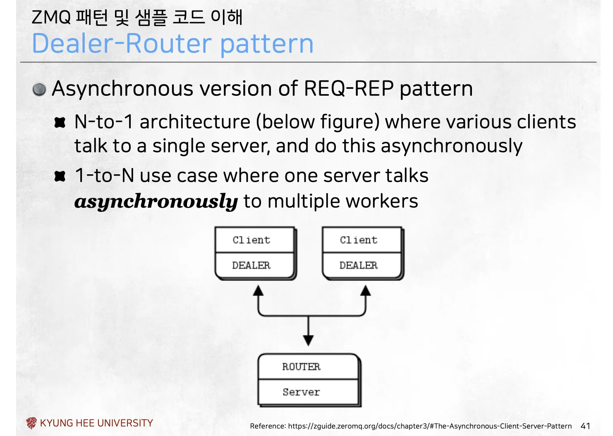

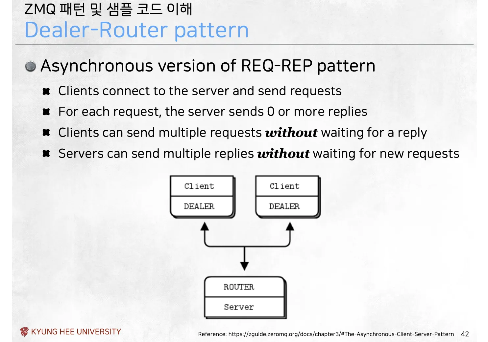

### Dealer-Router Pattern

- REQ-REP 패턴의 비동기 버전
	→ REQ-REP는 동기적으로 동작

		- 클라이언트는 send하고 반드시 recv, 서버도 recv후에야 send가 되는 엄격한 순서
			→ 이미 들어온 요청에 대한 응답 전까지 다음 요청 전송이 불가능 → 성능저하
	→ Dealer-Router는 비동기적으로 동작

		- 순서를 지키지 않아도 동작 가능
		- 클라이언트는 응답 대기 없이 계속 send가능
		- 서버는 요청을 기다릴 필요 없이 처리되는 만큼 send가능
- 다양한 클라이언트가 단일 서버와 비동기 통신하는 N:1 아키텍처
- 하나의 서버가 여러 워커에게 비동기적으로 작업을 전달하는 N:1 유스케이스
- 클라이언트들은 서버에 연결하고 요청을 보냄
	- 각 요청에 대해, 서버는 0개 또는 그 이상의 응답을 보냄
	→ 기본적으로 REQ-REP의 형태를 따르긴 함

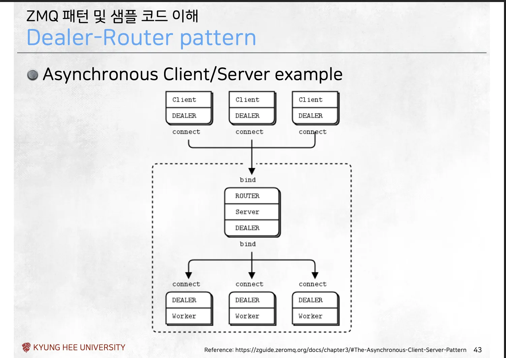

### Router 소켓

- REQ-RES는 한번에 한 클라이언트만 상대, 별도로 클라이언트들을 기억할 필요가 없음 
	→ 현재 연결된 것에 요청 주면 되기 때문

- Router 소켓은 여러 DEALER(클라이언트)가 ROUTER에 연결하면 이들의 고유 식별자를 기억
	→ 누구한테 응답 줄지 알 수 없기 때문

	- 딜러가 라우터에 메시지 보내면 라우터는 그 메시지에 보낸 딜러의 ID프레임을 자동으로 추가 관리
	- 라우터가 딜러에게 응답할 떄는 메시지 맨 앞에 대상 딜러의 ID프레임을 붙여 send하면 됨
		→ `ROUTER`는 그 ID를 보고 **정확한 반송 주소로** 메시지를 라우팅

### 현재 아키텍처 설명

- 라우터는 1개, 서버 워커 3개, 클라이언트 3개
- 각 구성요소 설명
	- 클라이언트(딜러) → 딜러 소켓/ 서버에 작업 요청
	- 서버(라우터, 딜러) 
		- 직접 작업 수행하지 않고 클라이언트의 요청을 받아 워커들에게 분배하고, 이를 다시 클라이언트로 전달
		- 두 개의 소켓을 가짐
			1. 라우터 소켓 → 클라이언트의 연결을 받는 역할
				- bind를 사용 → 항상 켜져있기 때문
				- 클라이언트(딜러)가 이 라우터에 연결하면, 라우터는 딜러의 고유 식별자를 자동 저장, 클라이언트가 메시지를 보내면, 라우터가 메시지 앞에 반송주소(고유 식별자)를 알아서 첨부
			2. 딜러 소켓
				- 내부 워크들에게 작업을 분해하는 작업 분배기
				- bind를 사용 → 항상 켜져잇기 때문
				- 라우터에서 받은 (클라이언트 식별자, 메시지)를 Round-Robin으로 공평하게 워커에 분배
	- 워커(딜러)
		- 실제로 일을 처리하는 프로세스 또는 스레드 → 코드에서 `ServerWorker`
		- 소켓 타입은 딜러
		- `서버(DEALER 소켓)`가 보낸 `[클라이언트 ID, 메시지]`를 그대로 받아서 처리
		→ 딜러 ↔ 딜러끼리도 통신 가능
			→ 중계 서버가 딜러를 쓰는 이유는 라운드 로빈 + 이건 워커로 요청하는 것이므로(라우터가 아님)

				- 일종의 클라이언트가 되는 것이므로
				- 중요하지 않음, 그런가부다 ㄱㄱ
- 라우터가 서버로 들어오는 클라이언트의 요청을 알아서 분배하고, 작업이 끝난 후 클라이언트로 응답

### 코드 설명
```python
import zmq
import sys
import threading
import time
from random import randint, random

class ServerTask(threading.Thread):
    """ServerTask"""
    def __init__(self, num_server):
        threading.Thread.__init__(self)
        self.num_server = num_server

    def run(self):
        context = zmq.Context()
        # 1. Frontend (클라이언트 FACING): ROUTER 소켓
        #    - 클라이언트의 연결(DEALER)을 받음
        #    - tcp://*:5570 주소로 바인드
        frontend = context.socket(zmq.ROUTER)
        frontend.bind("tcp://*:5570")

        # 2. Backend (내부 워커 FACING): DEALER 소켓
        #    - 내부 워커 스레드들과 통신
        #    - inproc://backend 주소로 바인드 (inproc: 스레드 간 고속 통신)
        backend = context.socket(zmq.DEALER)
        backend.bind("inproc://backend")

        # 3. ServerWorker (스레드)들을 생성하고 시작
        workers = []
        for i in range(self.num_server):
            worker = ServerWorker(context, i)
            worker.start()
            workers.append(worker)

        # 4. (핵심) ZMQ 프록시 실행
        #    - frontend(ROUTER)와 backend(DEALER) 사이에서 메시지를 자동으로 중개
        zmq.proxy(frontend, backend)
        
        # ... (정리 코드) ...

class ServerWorker(threading.Thread):
    """ServerWorker"""
    def __init__(self, context, id):
        threading.Thread.__init__(self)
        self.context = context
        self.id = id

    def run(self):
        # 5. 워커는 DEALER 소켓을 사용해 backend(DEALER)에 "연결"
        worker = self.context.socket(zmq.DEALER)
        worker.connect('inproc://backend')
        print(f'Worker#{self.id} started')

        while True:
            # 6. (핵심) 워커는 backend로부터 [클라이언트 ID, 메시지]를 받음
            #    recv_multipart()로 메시지를 여러 부분으로 나눠 받음
            ident, msg = worker.recv_multipart()
            print(f'Worker#{self.id} received {msg.decode()} from {ident.decode()}')

            # 7. (핵심) 응답을 보낼 때, "반드시" [클라이언트 ID, 응답 메시지] 순서로 보냄
            #    이 ID(ident)를 보고 frontend(ROUTER)가 올바른 클라이언트에게 전달
            worker.send_multipart([ident, msg])

# ... (main 함수) ...
```

- 라우터 쪽 코드
```python
import zmq
import sys
import threading
import time
from random import randint, random

class ClientTask(threading.Thread):
    """ClientTask"""
    def __init__(self, id):
        self.id = id
        threading.Thread.__init__(self)

    def run(self):
        context = zmq.Context()
        # 1. 클라이언트는 DEALER 소켓을 사용
        socket = context.socket(zmq.DEALER)
        
        # 2. (핵심) 클라이언트가 자신의 "ID"를 설정 (예: 'identity-1')
        #    이 ID를 ROUTER가 "반송 주소"로 사용
        socket.identity = u'identity-%s' % self.id
        socket.connect("tcp://localhost:5570") # 서버의 frontend(ROUTER)에 연결
        print(f'Client {self.id} started')
        
        # Poller를 사용해 비동기 수신 준비
        poll = zmq.Poller()
        poll.register(socket, zmq.POLLIN)
        reqs = 0
        while True:
            reqs = reqs + 1
            print(f'Req #{reqs} sent..')
            # 3. (핵심) 비동기 전송: 응답을 기다리지 않고 요청을 보냄
            socket.send_string(u'request #%d' % (reqs))
            
            # (1초간 랜덤하게 대기)
            time.sleep(1) 
            
            # 4. (핵심) 비동기 수신: 1초(1000ms) 동안 응답이 "왔는지 확인" (poll)
            sockets = dict(poll.poll(1000))
            if socket in sockets:
                # 5. 응답이 와 있으면 수신
                msg = socket.recv()
                print(f'Client {self.id} received: {msg.decode()}')

# ... (main 함수) ...
```

- 딜러 쪽 코드

## Dealer-Router pattern with Multi-thread Client

- 클라이언트에서 보내기(send)와 받기(recv) 기능을 분리
- 클라이언트의 받기(recv) 기능은 스레드로 구현
→ 위에서는 클라이언트는 여전히 블로킹 상태

	- `send` 스레드와 `recv` 스레드가 완전히 분리되어 **서로를 전혀 기다리지 않고(Non-blocking) 독립적으로** 동작하게 함
	- 이래야 클라이언트도 응답 등에 무관하게 요청을 계속 뿌림
→ 위에서 말한 진짜 비동기식 Dealer-Router
```python

# (recvHandler 함수가 클래스 외부 또는 내부에 별도로 정의됨)
def recvHandler(self):
    """
    (이 함수는 lec-05-prg-10의 run() 메서드 내
     while 루프의 "poll/recv" 부분만 가져온 것입니다.)
    """
    while True:
        # 1. (핵심) 이 핸들러(스레드)는 "받는(recv)" 작업만 전담
        sockets = dict(self.poll.poll(1000))
        if self.socket in sockets:
            msg = self.socket.recv()
            print(f'{0} received:{1}'.format(self.identity, msg))

def run(self):
    self.context = zmq.Context()
    self.socket = self.context.socket(zmq.DEALER)
    self.socket.identity = u'identity-%s' % self.id
    self.socket.connect('tcp://localhost:5570')
    print(f'Client {self.id} started')
    
    self.poll = zmq.Poller()
    self.poll.register(self.socket, zmq.POLLIN)
    reqs = 0

    # 2. (핵심) "받는(recv)" 작업을 전담할 별도의 스레드를 생성하고 시작
    clientThread = threading.Thread(target=self.recvHandler)
    clientThread.daemon = True
    clientThread.start()

    # 3. (핵심) 메인 스레드의 while 루프는 "보내는(send)" 작업만 전담
    while True:
        reqs = reqs + 1
        print(f'Req #{reqs} sent..')
        self.socket.send_string(u'request #%d' % (reqs))
        
        # 이전 코드의 poll/recv 로직이 여기서 완전히 사라짐
        time.sleep(1)

    self.socket.close() #useless
    self.context.term() #useless
```

## Dirty (?) P2P example
→ Dirty (?)라고 불리는 이유는 **피어(Peer)를 찾는 방식이 매우 비효율적인 '브루트 포스(Brute-force)' 방식이기 때문**

### 기본적인 동작 방식

- **모든 노드가 서버이자 클라이언트의 기능**을 둘 다 가지고 있음
- 프로그램이 시작되면, **먼저 네트워크상에 "서버" 역할을 하는 다른 피어가 있는지 스캔**
	- 서**버를 찾으면:** "Client only" 모드로 작동
	- **서버를 못 찾으면:** **자기 자신이 "Server/Client" 모드**가 되어, 다른 피어들이 접속할 수 있도록 서버 기능을 활성화
	→ 중간에 서버가 중단되어도 다시 위 프로세스를 반복함
***

# ZMQ패턴 간략 요약

- ZMQ(ZeroMQ)는 저수준의 소켓 통신을 추상화하고, 특정 통신 시나리오에 최적화된 고성능 메시징 패턴을 제공하는 라이브러리
***

## 1. Request-Reply Pattern (REQ/REP)

- \*`REQ/REP`\*는 **동기식(Synchronous)** 1:1 또는 N:1 통신을 위한 패턴
- **소켓 타입:**
	- `zmq.REQ`: 요청(Request)을 보내는 클라이언트 소켓.
	- `zmq.REP`: 응답(Reply)을 보내는 서버 소켓.
- **핵심 규칙 (Lockstep):**
	- `REQ` 소켓은 `send()` 호출 이후 반드시 `recv()`를 호출해야 함
	- `REP` 소켓은 `recv()` 호출 이후 반드시 `send()`를 호출해야 함
	- 이 순서를 위반하면(예: `REQ`가 `send()`를 연속 호출) 오류가 발생
- **주요 특징:**
	- 1개의 `REP` 소켓은 N개의 `REQ` 소켓과 연결 가능
	- `REP` 소켓은 ZMQ 내부적으로 공평한 큐(Fair-Queueing)를 통해 여러 `REQ`의 요청을 순차적으로 처리 → 동기식
***

## 2. Publish-Subscribe Pattern (PUB/SUB)

- \*`PUB/SUB`\*은 **비동기식(Asynchronous)** 1:N 단방향 데이터 분배(방송)를 위한 패턴
- **소켓 타입:**
	- `zmq.PUB`: 메시지를 발행(Publish)하는 서버 소켓.
	- `zmq.SUB`: 메시지를 구독(Subscribe)하는 클라이언트 소켓.
- **핵심 규칙 (Unidirectional):**
	- `PUB` 소켓은 `send()`만 가능하며, `SUB` 소켓은 `recv()`만 가능
	- `PUB` 소켓은 구독자의 수신 여부와 관계없이 비동기적으로 메시지를 전송
- **주요 특징:**
	- **구독 필터링:** `SUB` 소켓은 `connect` 후, `setsockopt(zmq.SUBSCRIBE, "필터_문자열")`을 통해 수신할 메시지를 **반드시 명시**해야 함
	- ZMQ는 메시지의 **접두사(Prefix)**가 이 "필터_문자열"과 일치하는 메시지만 `SUB` 소켓으로 전달
		- (모든 메시지를 수신하려면 빈 문자열 `""`을 사용)
***

## 3. Pipeline Pattern (PUSH/PULL)

- \*`PUSH/PULL`\*은 **비동기식(Asynchronous)** N:M 단방향 병렬 작업 분배 및 수집을 위한 패턴
- **소켓 타입:**
	- `zmq.PUSH`: 작업을 송신(Push)하는 소켓.
	- `zmq.PULL`: 작업을 수신(Pull)하는 소켓.
- **핵심 규칙 (Load-Balancing & Collection):**
	- **Fan-out (1:N):** 1개의 `PUSH` 소켓이 여러 `PULL` 소켓에 연결되면, ZMQ는 `PULL` 소켓들에게 작업을 **라운드 로빈(Round-Robin) 방식으로 공평하게 분배**
	- **Fan-in (N:1):** 여러 `PUSH` 소켓이 1개의 `PULL` 소켓에 연결되면, `PULL` 소켓은 모든 `PUSH` 소스로부터 메시지를 공평하게 수집
- **주요 특징:**
	- `PUB/SUB`과 달리 메시지 필터링이 없으며, `PULL` 소켓 간 경쟁을 통해 작업을 가져감
***

## 4. Dealer-Router Pattern (DEALER/ROUTER)

- \*`DEALER/ROUTER`\*는 **비동기식(Asynchronous)** N:M 양방향 통신을 위한 가장 유연하고 강력한 패턴입니다. `REQ/REP`의 동기식 한계를 극복
- **소켓 타입:**
	- `zmq.DEALER`: 비동기 `send`/`recv`가 가능한 소켓. (비동기 `REQ`)
	- `zmq.ROUTER`: 비동기 `send`/`recv`가 가능하며, 메시지 라우팅을 위한 ID를 관리하는 소켓. (비동기 `REP`)
- **핵심 규칙 (Identity Management):**
	- **`ROUTER`**** 수신:** `DEALER`로부터 메시지를 수신할 때, ZMQ는 메시지 앞에 발신자 **`[DEALER ID]`**** 프레임**을 자동으로 추가
	- **`ROUTER`**** 송신:** `DEALER`에게 메시지를 송신할 때, 개발자는 **반드시** 메시지 앞에 **`[목적지 DEALER ID]`**** 프레임**을 명시적으로 추가해야 함
	- **`DEALER`****:** `send`/`recv` 시 ID를 관리하지 않고 순수 메시지만 전송/수신
- **주요 특징:**
	- `REQ/REP`의 1:1 강제 순서(Lockstep)가 없으므로, 클라이언트와 서버 모두 원하는 시점에 `send`와 `recv`를 자유롭게 호출 가능
	- **비동기 프록시:** `Client(DEALER) <-> Frontend(ROUTER) <-> Backend(DEALER) <-> Worker(DEALER)` 구조로 결합하여 고성능 병렬 처리(로드 밸런싱) 서버 아키텍처를 구축하는 데 사용됨
