> 원본 Notion 정리 — 강의 슬라이드 이미지 + 설명.

***

***

# 함수 호출 방법

## Compile과 Linking

### compile

- 프로그래밍 언어를 기계어로 바꾼 목적 파일(OBJ)로 변환하는 작업
\* 목적 파일

	- 소스 코드가 CPU가 이해 가능한 기계어 명령(Instruction)으로 번역된 것
	- 그러나 목적 파일은 기계어 명령으로 구성되었음에도 자체로 실행이 불가능
		→ 외부 함수 호출, 다른 파일의 전역 변수 등을 알 수없기 때문, 이를 링킹으로 해결

### linking

- 컴파일된 목적 파일이 사용하는 외부 함수(ex. 라이브러리)를 가져와서 이름을 모두 하나로 묶어 최종 실행 파일을 만드는 작업

## 함수 호출이란

- cpu는 pc(Program Counter)라는 포인터로 다음에 실행할 명령어의 메모리 주소를 가리킴
	- cpu는 pc의 명령어를 실행하고 pc를 다음 주소로 옮기는 일을 반복
- cpu는 함수 이름을 만나면 pc를 함수 코드의 시작 메모리 주소로 옮겨 해당 코드를 실행
	- 함수의 이름은 해당 함수가 위치한 기계어 코드 블록의 시작 주소
- 이때 함수를 모두 실행하고 돌아오기 위해 메모리 스택을 사용
	- 함수의 시작 주소로 점프하기 전에 돌아올 지점(다음 주소)을 메모리 스택에 저장해두고 다 실행하면 돌아올 주소를 꺼내 점프

## 정적 링킹 (Static Linking)

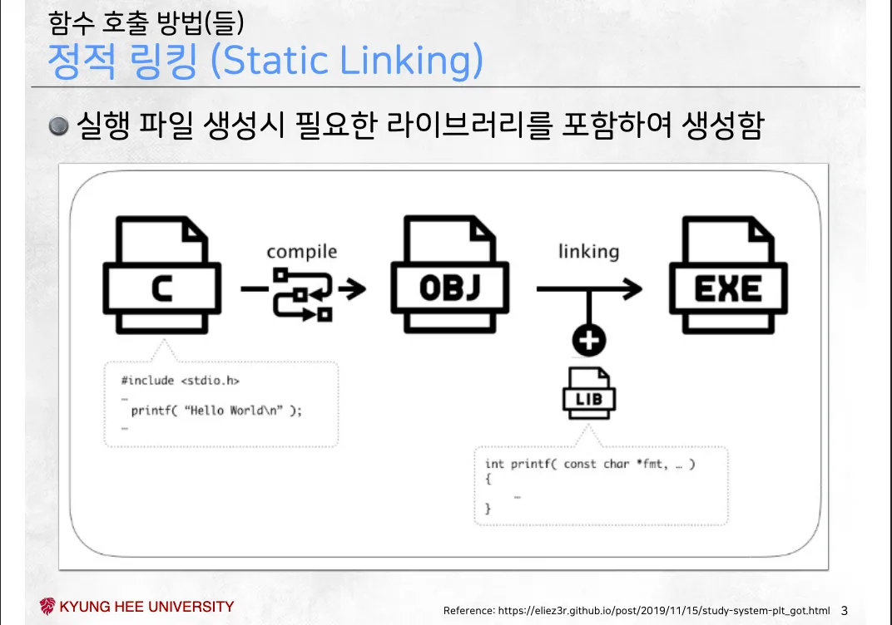

- 실행 파일을 만들 때 필요한 라이브러리를 실행 파일 안에 포함시키는 링킹 방식
- 위 다이어그램 예시
	1. **코드 작성:** 개발자가 C 코드에 `printf("Hello World\n");`라고 작성
	2. **컴파일:** 컴파일러가 이 코드를 기계어로 번역해서 목적 파일을 생성
	3. **링킹:** 링커(Linker)가 `printf` 함수가 필요함을 인지하고, `printf` 함수의 실제 기계어 코드가 들어있는 라이브러리 파일로 가서 기계어 코드 전체를 복사해 목적 함수와 연결
		→ 정적 링킹

	4. **실행 파일 생성:** 이 모든 게 합쳐져서 하나의 완전한 실행 파일로 생성
⇒ 정적 링킹으로 만들어진 실행 파일은 `printf` 함수의 코드를 포함하고 있어 해당 라이브러리가 없는 환경에서도 실행 가능

## 동적 링킹 (Dynamic Linking)

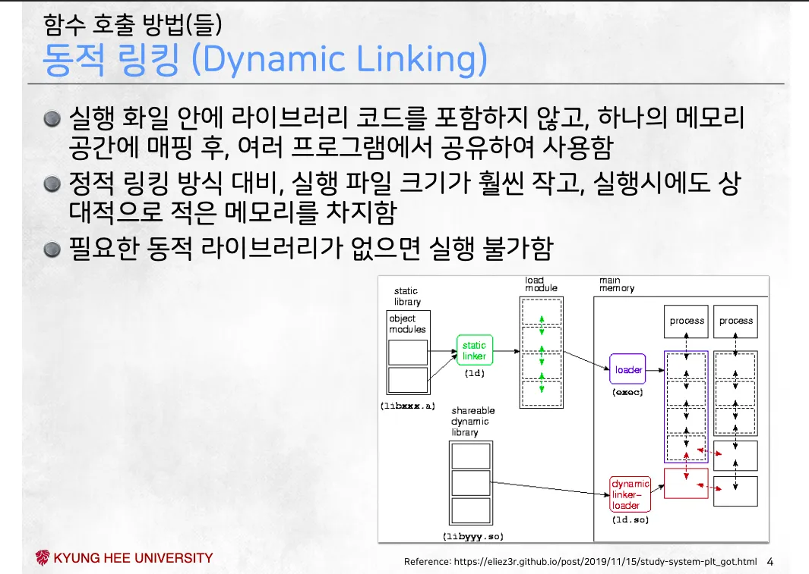

- 실행 파일을 만들 때 라이브러리 코드를 포함시키지 않고 프로그램이 실행하는 순간에 필요한 라이브러리를 메모리에 불러와 공유하는 방식
	- 실행 파일 안에 실제 코드가 아닌 참조가 포함되어있고, 이를 불러와 사용
- 정적 링킹 대비 실행 파일 크기가 작고, 실행 시에도 적은 메모리 차지
- 다만, 필요한 동적 라이브러리가 없으면 실행 불가
→ 메모리가 한정적, 업데이트가 힘든 상황(ex. 화성탐사선)에서는 프로그램을 모두 재설치하기 보다 공유 라이브러리 파일 하나만 업데이트 하는 방식을 사용하기도 함

## 원격 함수 호출(RPC, Remote Procedure Call)

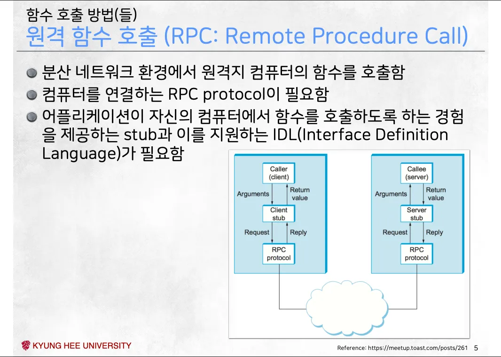

- 분산 네트워크 환경에서 다른 컴퓨터(원격지)의 함수를 자신의 컴퓨터(로컬)에 있는 함수처럼 호출하는 기술
	- 정적, 동적 링킹과 달리 실행 파일에 링킹되지 않은 함수를 호출하는 방법
	- 이때 원격지와 로컬을 연결하는 RPC 프로토콜이 필요
	- 80~90년대에도 있던 기술, http를 통해 수행
- `stub` 덕분에 원격지의 함수를 호컬처럼 호출 가능
	→ 일종의 함수 호출의 대리인, 프록시(통신의 프록시와 유사)

	- 실제로 함수의 기능을 수행하지 않고 네트워크 통신을 통해 원격지의 함수를 실행하게 하게 응답을 받아 반환
	- 이를 통해 RPC를 사용하는 쪽에서는 `원격지의 함수 호출` 이라는 개념 자체를 제거
		- 클라이언트는 로컬의 함수 호출처럼 사용 가능(원격지라는 것을 알 수 없음)
		- 서버는 단순히 요청이 왔으니 응답하는 역할만 수행
- 클라이언트의 스텀과 서버의 스텁으로 나뉨
	1. Client Stub
		- 개발자가 함수를 호출하면 이 클라이언트 스텁이 가로채 이를 네트워크로 전송가능한 형태로 직렬화 해 전송
		- 결과를 받아 함수 호출 결과인 것 처럼 반환
	2. Server Stub
		- 서버 스텁은 전송된 요청을 받아 이를 역직렬화 해 처리 후 다시 직렬화해 응답
- RPC는 세 가지 것이 필요
	1. RPC Protocol → 컴퓨터끼리 연결하고 스텁들이 요청, 응답을 주고받게 하는 프로토콜
	2. IDL(Interface Definition Language) → 스텁이 함수 호출을 위해 함수명, 인자, 반환값 등을 사전에 정의하는 특수한 언어
	3. stub → 함수 호출과 동일한 경험을 주는 구성요소
→ 이러한 RPC는 함수 호출이므로 무차별적으로 접근 가능하게 할 수 없음

	- 따라서 소유주가 동일한 앱과 서버, 서버와 서버를 연결할 때 사용
	- REST API와는 다름(주로 모두가 접근 가능한 웹 서비스)

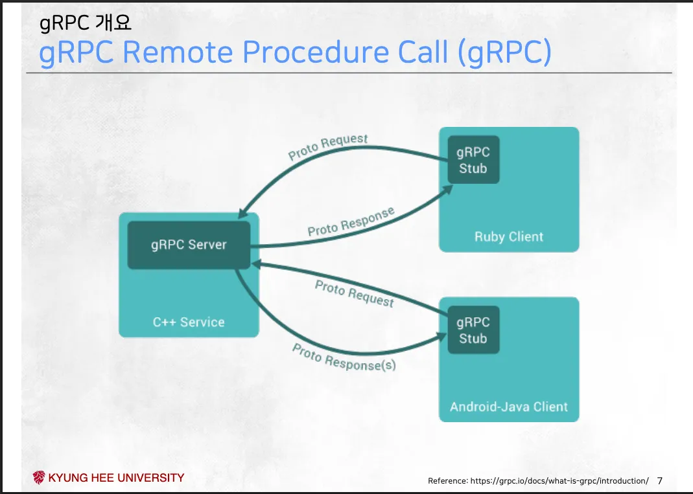

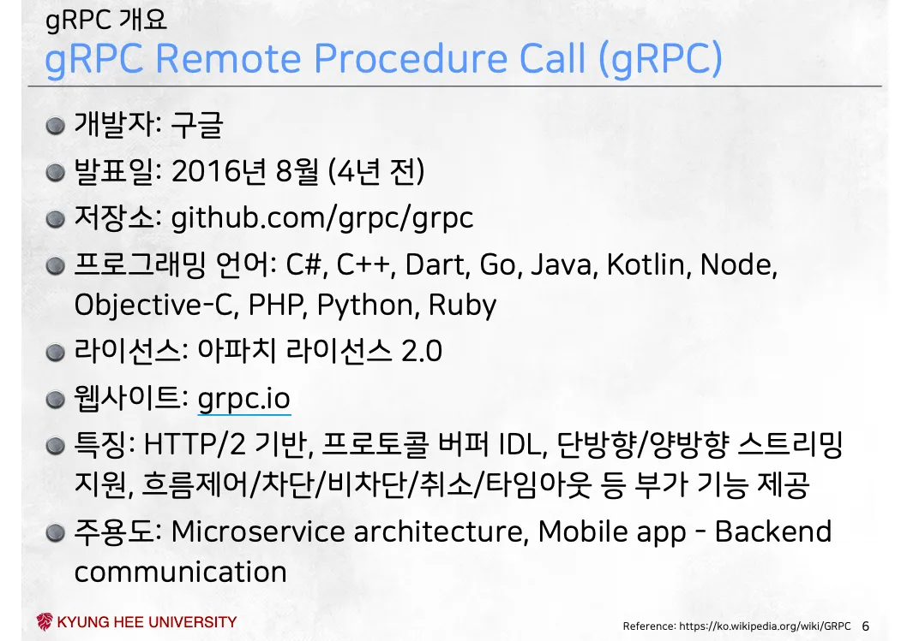

- 주요 특징
	1. Polyglot: 언어에 무관하게 동작
	2. 간단한 서비스 정의: Protocol Buffer라는 IDL을 사용해 서비스와 메시지를 간단하게 정의
	3. 빠른 시작과 확장성: 설치가 간단, 초당 수백만 건의  RPC처리 가능
	4. 양방향 스트리밍, 인증 기능
		- http1.1을 사용하는 REST API와의 차이점
		- http/2르를 사용하여 두 가지 기능을 가짐
			- 양방향 스트리밍 지원, 클라이언트와 서버가 동시적으로 데이터 스트리밍 가능
			- 암호화 및 인증 기능이 통합
- 이러한 특징으로 MSA, 모바일 앱과의 통신에서 자주 사용
	1. 마이크로서비스 아키텍처
		- 내부적으로 빠르고 효율적으로 통신 가능
	2. 모바일 앱 ↔ 백엔드 통신
		- 네트워크 성능이 높지 않은 이동통신 환경에서도 효과적

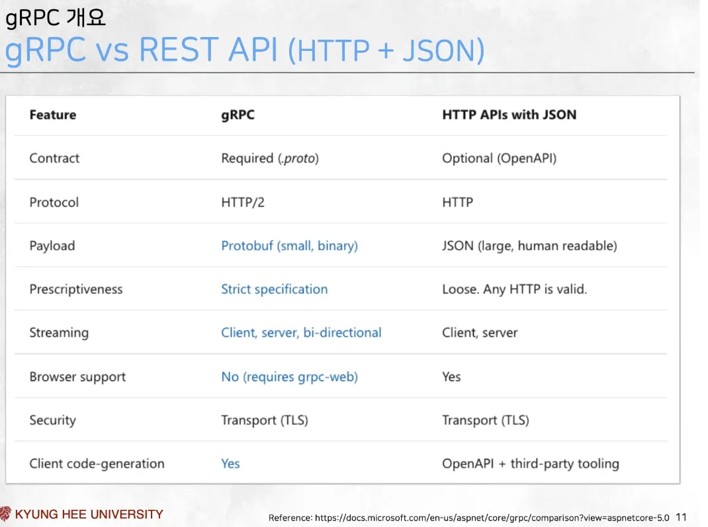

## 통신 프로토콜 패러다임의 변화

- 과거에는 CPU 자원이 비싸고 부족했기 때문에 데이터 처리에 CPU를 많이 쓰는 방식은 기피됨
- 현대는 클라이언트 기기의 성능이 비약적으로 향상
⇒ 결론: 남는 CPU자원을 적극적으로 소모해서라도 네트워크 대역폭과 지연을 최소화하는 전략 사용

	- cpu자원 소모 → ex) 압축, 바이너리 변환 등, 성능 최적화는 아니지만 암복호화도 해당
		→ 이를 통해 속도를 끌어올림

# gRPC vs REST API
<table>
<tr>
<td>**비교 항목**</td>
<td>**REST API (HTTP + JSON)**</td>
<td>**gRPC (HTTP/2 + Protobuf)**</td>
</tr>
<tr>
<td>**기반 프로토콜**</td>
<td>**HTTP 1.1** (텍스트 기반)</td>
<td>**HTTP 2** (바이너리 기반)</td>
</tr>
<tr>
<td>**데이터 포맷**</td>
<td>**JSON** (Human Readable)<br>- 사람이 읽기 좋음<br>- 키(Key) 반복 등 불필요한 데이터 큼</td>
<td>**Protobuf** (Small Binary)<br>- 0과 1로 된 이진 데이터<br>- 사람이 읽을 수 없음 (전용 도구 필요)<br>- 압축되어 용량이 매우 작음</td>
</tr>
<tr>
<td>**CPU 사용량**</td>
<td>상대적으로 적음 (텍스트 전송)</td>
<td>**높음** (데이터를 압축/해제하고 이진화하는 과정 필요)</td>
</tr>
<tr>
<td>**통신 방식**</td>
<td>**Request-Response** (단방향)<br>- 요청하면 응답하고 끝남 (Transaction)</td>
<td>**Streaming** (양방향)<br>- 클라이언트와 서버가 연결된 상태에서 지속적으로 데이터 주고받기 가능</td>
</tr>
<tr>
<td>**엄격성 (Spec)**</td>
<td>**Loose** (느슨함)<br>- 문서화(OpenAPI)는 선택 사항</td>
<td>**Strict** (엄격함)<br>- `.proto` 파일로 명확한 규격(Contract) 정의 필수</td>
</tr>
<tr>
<td>**주요 사용처**</td>
<td>**웹 브라우저**, 대외용 오픈 API</td>
<td>**내부 서버 간 통신(S2S)**, 모바일 앱 백엔드</td>
</tr>
</table>
→ code-generation → gRPC는 

### 추가 설명

1. **Human Readable**
	- JSON은 Human Readable하지만, 통신 링크 상에서 정보의 크기를 늘리는 형태
		- 반복되는 키-값, 공백, 괄호 등 네트워크 트래픽을 많이 차지하고 지연으로 이어짐
2. **gRPC**
	- Protobuf를 사용해 데이터를 바이너리로 변환 및 압축
	- 이 압축 및 변환 과정은 CPU를 많이 사용하지만, 이를 통해 네트워크 지연을 줄일 수 있음
3. 브라우저 지원 한계
	- REST API는 웹 브라우저가 기본적으로 지원, 해석 가능
	- gRPC는 기본적으로 브라우저에서 동작시킬 수 없음(gRPC-WEB 등의 오픈소스가 있긴 함)
	⇒ 현재 gRPC는 MSA에서 서버 간 통신, 앱 통신에 사용

4. Code-Generation
	→ 개발자가 일일이 작성하기 귀찮고 복잡한 코드를 기계가 대신 짜주는 것

	- gRPC의 경우 .proto파일을 정의하면 코드가 생성되고 이를 사용해 원격 호출이 가능

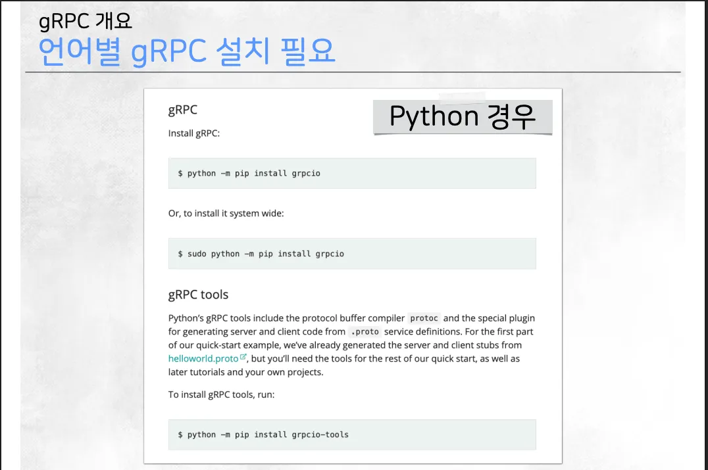

### 설치의 필요성

- 기존 TCP, UDP는 OS에 기본 탑재, http/1.1은 OS는 아니어도 언어의 스탠다드 라이브러리로 사용
- gRPC는 대부분의 경우에 기본적으로 지원되지 않고 이를 설치해서 사용해야함

### grpcio

- python진영의 grpc라이브러리
	- grpcio와 grpcio-tools가 필요
- grpcio가 통신 프로토콜을 지원하는 본체 라이브러리
- grpc-tools가 .proto파일을 읽어 코드를 생성하는 protobuf 컴파일러가 포함된 툴킷

##

# gRPC의 네 가지 타입

1. Unary
2. Server Streaming
3. Client Streaming
4. Bidirectional Streaming

### proto

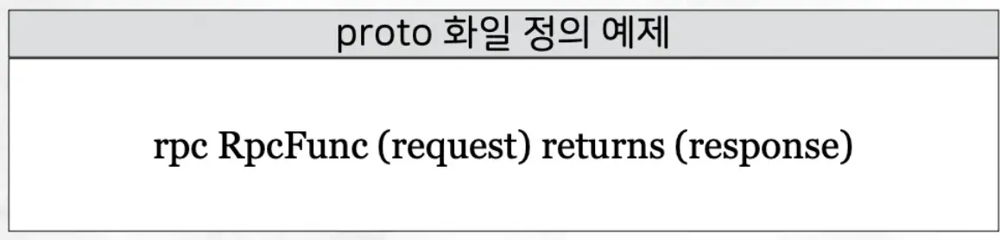

- gRPC는 원격지 통신을 위해 `proto` 라는 언어를 사용
- client, server의 언어, 하드웨어, OS에 무관하게 원격호출을 가능하게 하는 제 3의 언어
- 호출할 함수 이름 정하게 하고 주고받을 데이터를 정의하는 용도
	- 원격 함수, 입력 파라미터, 반환값, 요청과 응답이 일반적인지 스트리밍인지를 정의
	- rpc를 통해 원격함수임을 정의, RpcFunc가 이름, request라는 입력 파라미터를 받아, response를 반환
- Interface Definition Language에 속하는 것

# 1. Unary RPC

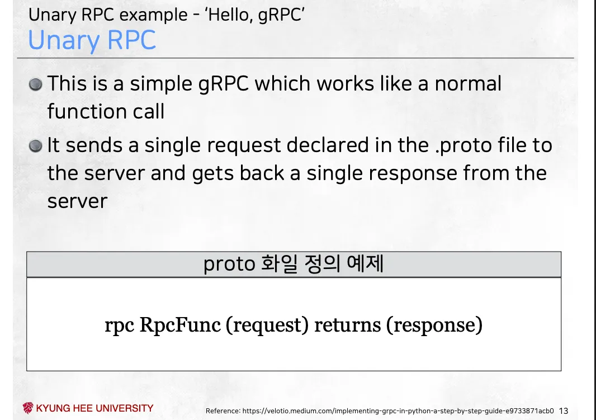

## Unary RPC

- 일반적 함수 호출처럼 동작하는 간단한 RPC
- `.proto` 파일에 선언된 단일 요청을 서버로 보내고, 서버로부터 단일 응답을 되돌려 받음

## Unary RPC 작성 예시


### 1단계: 원격 호출할 함수 로직 작성

- 서버가 수행할 실제 로직을 정의

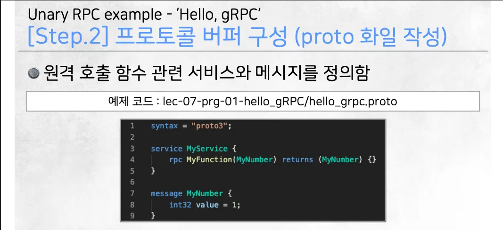

### 2단계: Proto 파일 정의

- 서버와 클라이언트가 서로 대화할 인터페이스를 정의하는 단계
- `MyService` 라는 서비스 정의 후, `MyFunction` 이라는 RPC를 선언
- `MyNumber` 라는 타입을 선언한 후 내부에 `int32 value = 1;` 을 선언
- int 32
	- 과거 C언어같은 언어들은 하드웨어에 따라 int의 크기가 달리지는 문제가 있어 `int16`, `int32` 같은 탕타입으로 명확하게 지정해 사용
	- gRPC의 protobuf도 OS, 하드웨어에 무관하게 고정된 32비트로 통신하기 위해 `int32` 라고 명시
		→ 이를 통해 언어, 플랫폼 독립성을 보장

- proto 파일은 Protocol Buffer 표준을 따르며, JSON과 동일한 직렬화/역직렬화 방식
	- Protobuf는 본질적으로 직렬화/역직렬화의 방식
	- 직렬화 → 프로그램 내 객체 또는 데이터를 네트워크 전송 또는 저장장치 저장이 가능하게 바이트 스트림으로 변환
	- 직렬화 → 전송 받은 바이트 스트림을 다시 내 프로그램의 객체로 복원

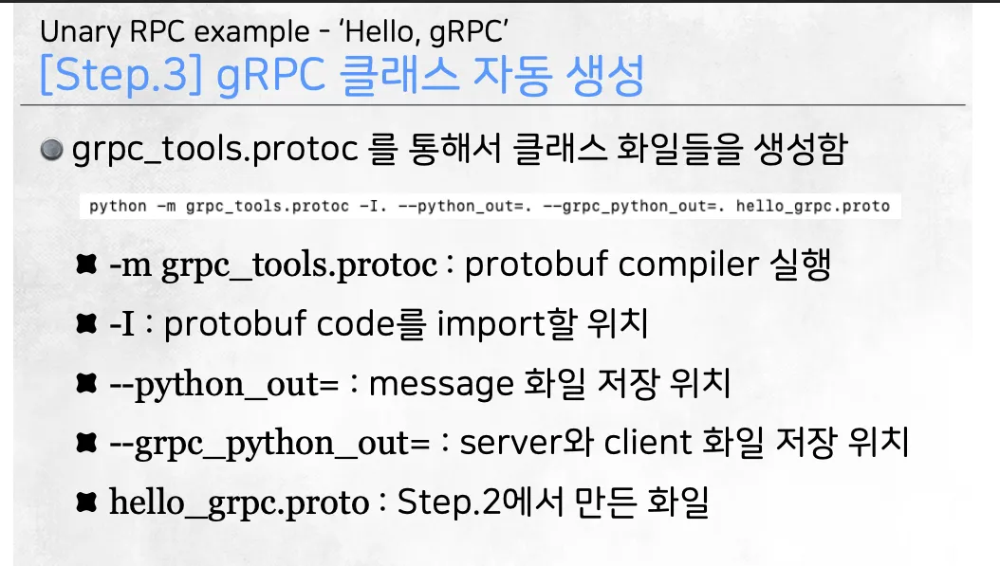

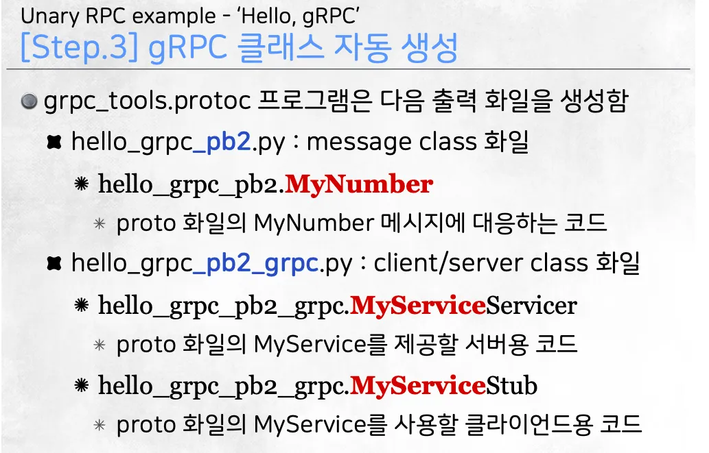

### 3단계: gRPC 클래스 자동 생성(proto 파일 컴파일)

- 작성한 `.proto` 파일을 gRPC 도구로 파이써 코드로 변환
- `python -m grpc_tools.protoc` -I . —python_out=. —grpc_python_out=. hello_grpc.proto 
	- `python -m grpc_tools.protoc` → protobuf 컴파일러 실행
	- -I 경로 → protobuf code 임포트할 위치
	- —python_out=경로 → message 파일 저장 위치
	- —grpc_python_out → 서버와 클라이언트 파일 저장 위치
	- hello_grpc.proto → 번역할 대상 proto 파일
- 결과적으로 자동으로 아래 두 개의 파일이 생성
	1. **`hello_grpc_pb2.py`****:** 메시지 클래스 파일 (예: `MyNumber` 클래스가 들어있음)
	2. **`hello_grpc_pb2_grpc.py`****:** 클라이언트용 **Stub**과 서버용 **Servicer** 클래스가 들어있음

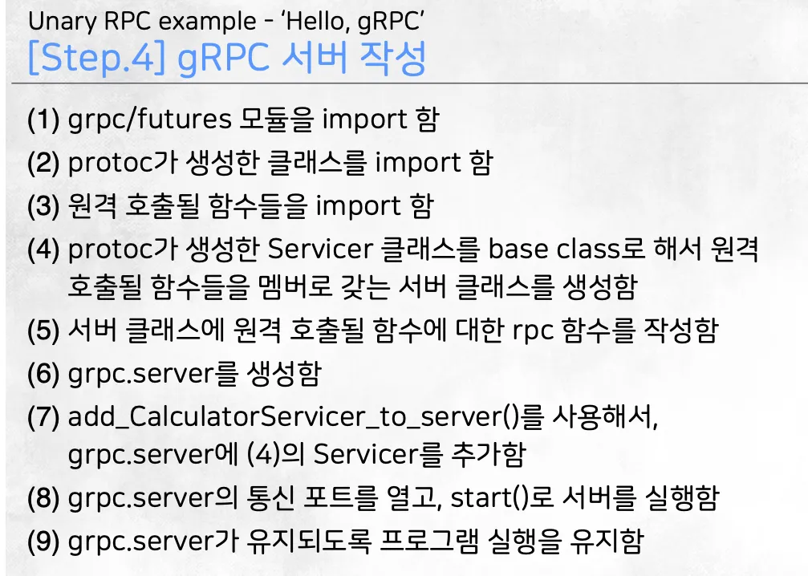

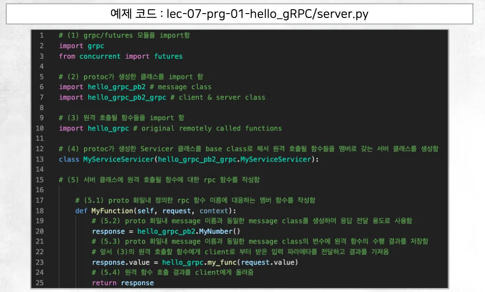

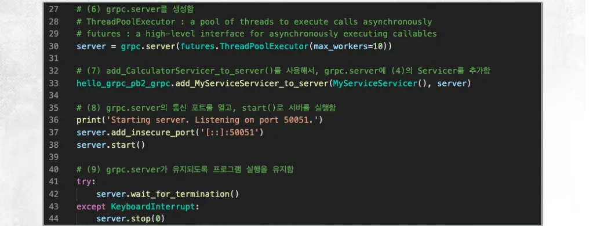

### **4단계: gRPC 서버(Server) 작성**

- 실제로 요청을 받아 처리할 서버 코드를 작성
- **주요 작업:**
	1. 자동 생성된 `MyServiceServicer` 클래스를 상속
	2. `MyFunction` 메서드를 오버라이딩(재정의)하여, 실제 로직(Step 1에서 만든 제곱 계산)을 연결
		- 들어온 요청(MyNumber)에서 값을 가져와 계산 후 다시 응답 포맷으로 반환(MyNumber)
	3. `grpc.server`를 생성하고 포트(50051)를 열어 대기
	4. 동시 처리를 위해 `futures.ThreadPoolExecutor`를 사용하여 멀티 스레드 환경을 구성

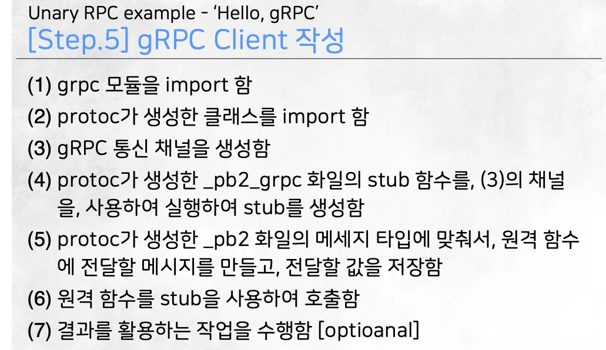

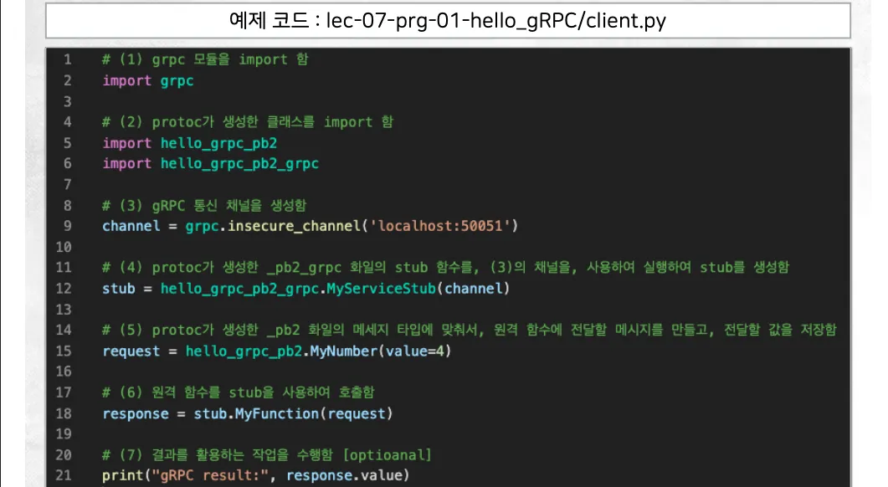

### **5단계: gRPC 클라이언트(Client) 작성**

- 서버에 접속해 함수를 호출할 클라이언트 코드를 작성
- **주요 작업:**
	1. **채널 생성:** `grpc.insecure_channel`로 서버 주소(localhost:50051)에 연결
	2. **Stub 생성:** 서버의 함수를 마치 내 컴퓨터에 있는 것처럼 부르기 위해 `Stub` 객체를 만듬
	3. **요청:** `MyNumber(value=4)` 메시지를 만들어 `stub.MyFunction(request)`를 호출
	4. **결과:** 서버가 계산해준 `16`을 받아 출력

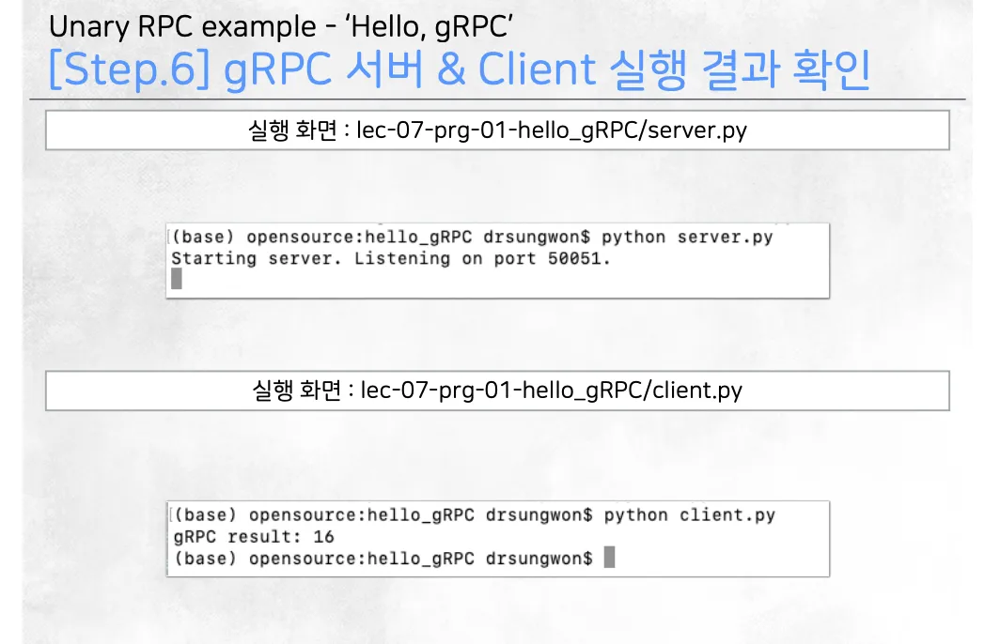

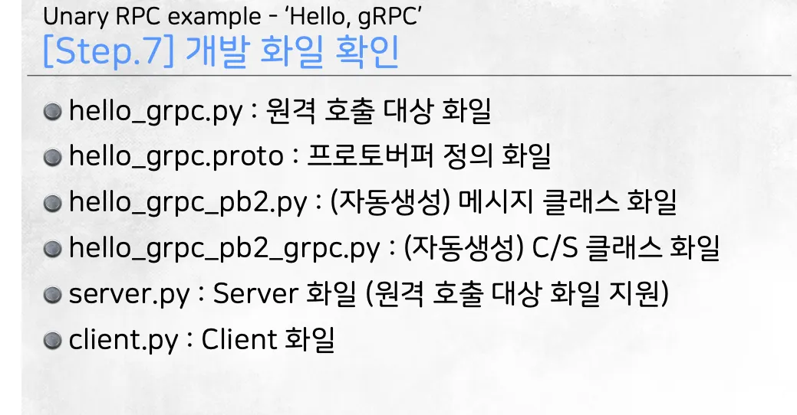

### **6, 7 단계: 실행 및 파일 확인**

- **실행 순서:** 먼저 `server.py`를 실행하여 서버를 켜두고, 다른 창에서 `client.py`를 실행
- **결과:** 클라이언트 화면에 `gRPC result: 16`이 출력
- **파일 구조 요약:**
	- **개발자가 작성:** `server.py`, `client.py`, `hello_grpc.proto`, `hello_grpc.py`(로직)
	- **자동 생성됨(건드리지 않음):** `_pb2.py`, `_pb2_grpc.py`

# 2. Server Streaming gRPC

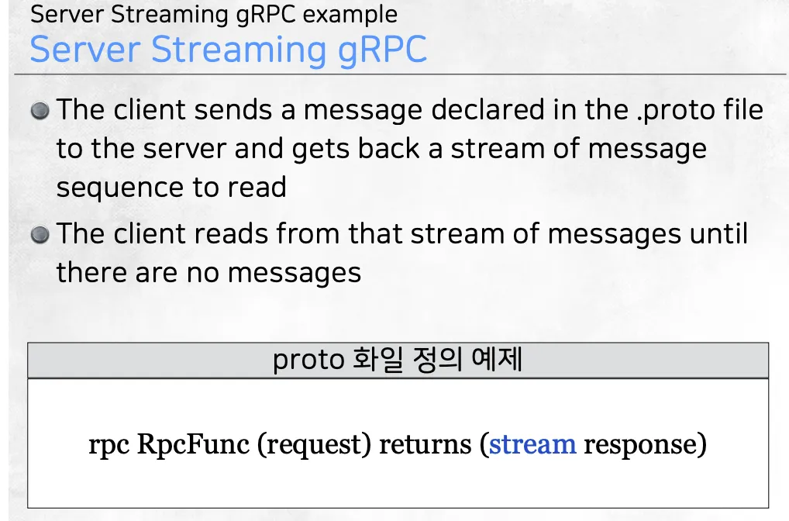

## Server Streaming gRPC

- 클라이언트는 .proto 파일에 선언된 메시지를 서버로 보내고, 읽을 수 있는 **메시지 시퀀스(연속된 메시지들)의 스트림**을 되돌려 받는 방식
- 클라이언트는 메시지가 더 이상 없을 때까지 그 메시지 스트림을 계속 읽어들임

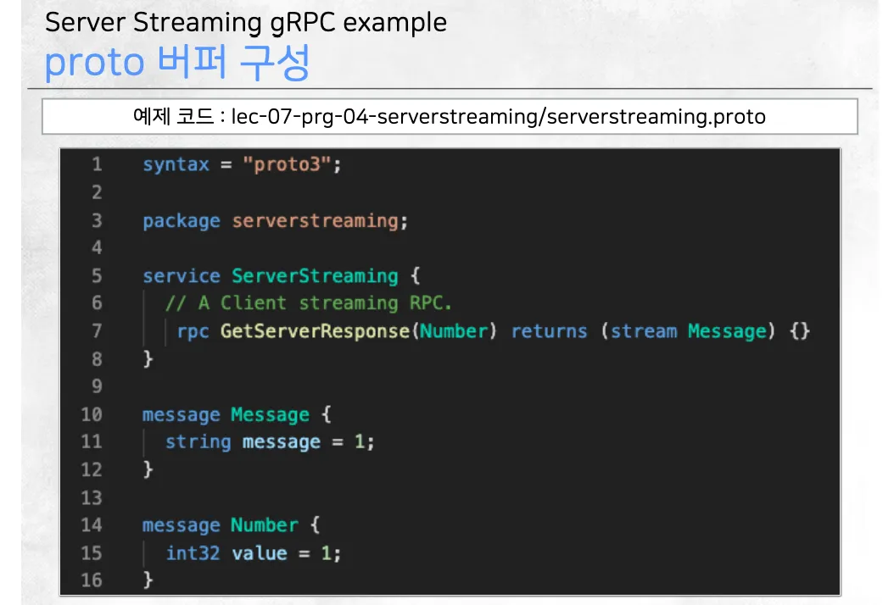

`rpc GetServerResponse(Number) returns (stream Message) {}` 

- returns 뒤에 `stream` 이 붙어있음 → 응답이 하나가 아니라 계속 흘러나온다는 뜻
- 메시지 타입
	- 입력(`Number`): `int32 value = 1;` (몇 개 받을지 숫자)
	- 출력(`Message`): `string message = 1;` (보내줄 텍스트)
`protoc` 컴파일러를 통해 `.proto` 파일을 파이썬 코드로 변환

- `serverstreaming_pb2.py` 와 `serverstreaming_pb2_grpc.py` 파일이 생성

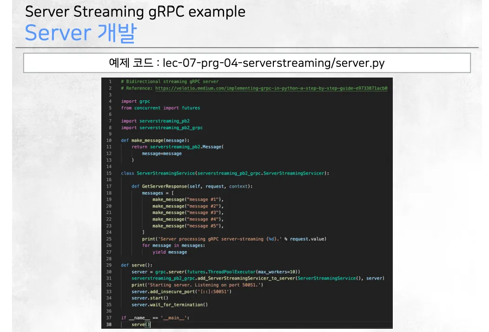

- **구현 로직:**
	1. 클라이언트가 보낸 숫자(`request.value`)만큼 반복문을 순회
	2. **`yield message`**: 파이썬의 제너레이터 문법인 `yield`를 사용하여 데이터를 하나씩 밀어냄
		- `return`을 쓰면 함수가 끝나버리지만, `yield`는 데이터를 계속 공급
- 스트리밍 서버 구현의 핵심은 **`return`**** 대신 ****`yield`****를 쓴다**는 점
```python
for message in messages:
    yield message
```

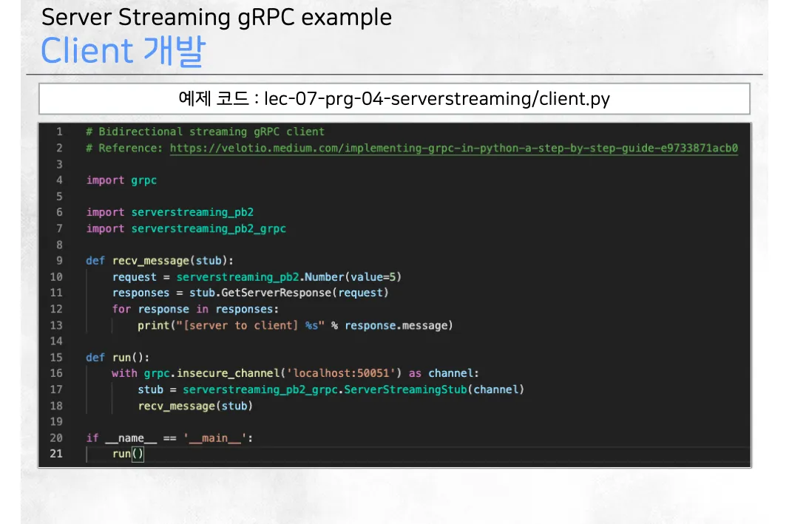

- 클라이언트는 응답을 리스트(List)가 아닌 반복자(Iterator)로 받음
- **구현 로직**
	1. Stub을 통해 함수를 호출합니다: `responses = stub.GetServerResponse(...)`
	2. **`for`****문 사용:** 서버가 언제 끝낼지 모르기 때문에 `for response in responses:` 문법을 사용해 하나씩 도착하는 대로 처리
```python
request = ...Number(value=5)
responses = stub.GetServerResponse(request)
for response in responses:
    print(response.message) # 하나 올 때마다 즉시 출력
```

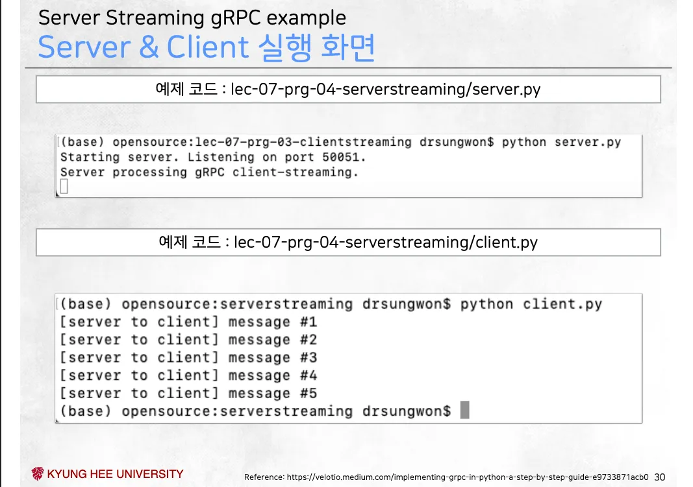

- **서버 실행**
	- 50051 포트에서 대기합니다. "Server processing gRPC client-streaming" 메시지가 나옴
- **클라이언트 실행**
	- 클라이언트가 접속하자마자 서버로부터 데이터가 날아옴
	- 화면에 `[server to client] message #1` 부터 `#5`까지 순차적으로 출력

# 3. Client Streaming gRPC

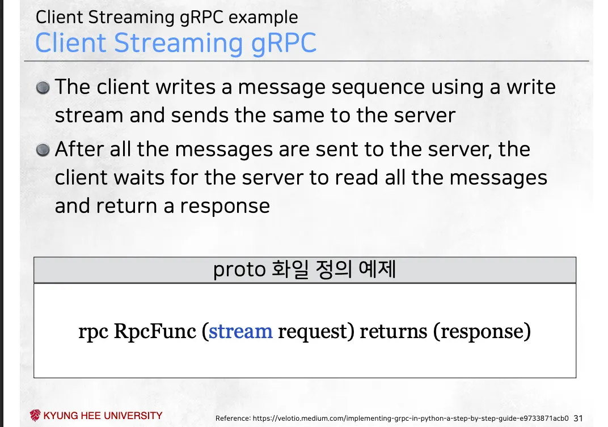

## Client Streaming gRPC

- 클라이언트는 쓰기 스트림(write stream)을 사용하여 일련의 메시지(message sequence)를 작성하고 이를 서버로 전송
- 모든 메시지가 서버로 전송되고 나면, 클라이언트는 서버가 그 메시지들을 모두 읽고 하나의 응답을 반환할 때까지 대기

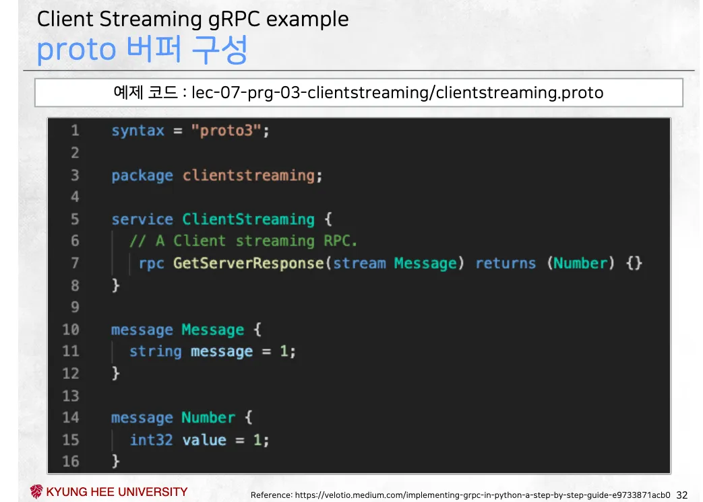

```python
rpc GetServerResponse(stream Message) returns (Number) {}
```

- `stream` 키워드가 **요청(Request)** 쪽에 붙어 있음
- 클라이언트는 메시지를 스트림으로 보내고, 서버는 Number 하나로 응답한다는 뜻

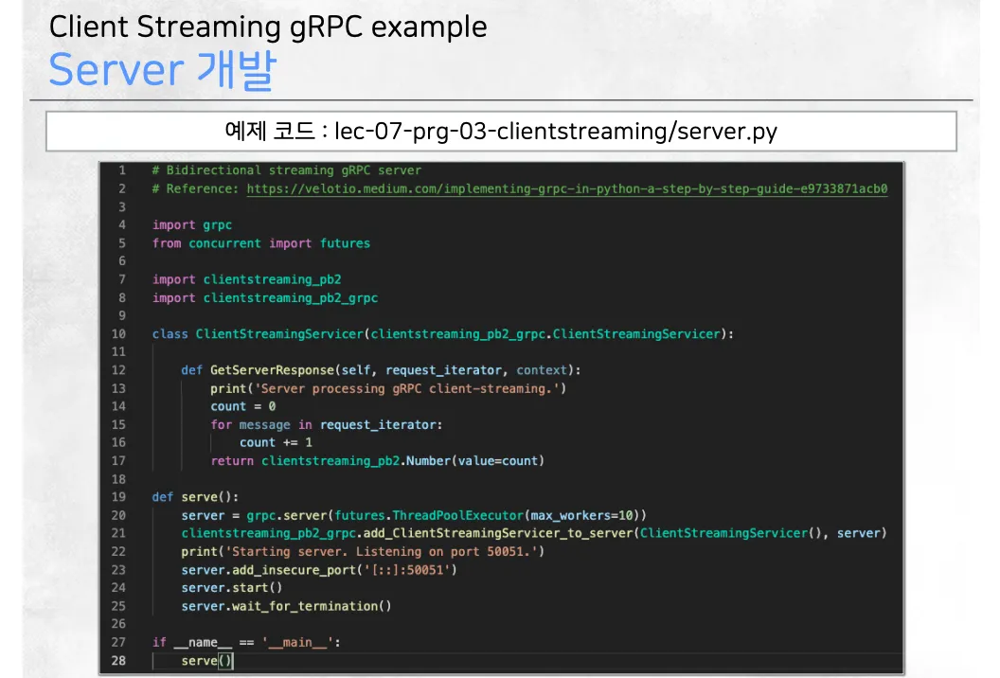

### 서버 개발

- 받는 쪽인 서버 생성
- **함수 정의:** `def GetServerResponse(self, request_iterator, context):`
	- 여기서 입력 변수명이 `request_iterator`인 것이 중요
	- gRPC는 클라이언트가 보내는 스트림 데이터를 파이썬의 **Iterator(반복자)** 형태로 서버에 전달
- **데이터 처리 (Loop):**Python
	`for message in request_iterator:<br>    count += 1`

	- 서버는 `for` 문을 돌면서 클라이언트가 보내는 메시지를 하나씩 꺼냄
	- **대기:** 클라이언트가 다음 메시지를 보낼 때까지 이 `for` 문 안에서 대기
	- **종료:** 클라이언트가 "전송 끝!"이라고 알리면 `for` 문이 끝남
- **응답 반환:**
	- 루프가 다 끝나면 `return ... Number(value=count)`를 통해 지금까지 받은 메시지가 총 몇 개인지(count)를 **한 번** 반환

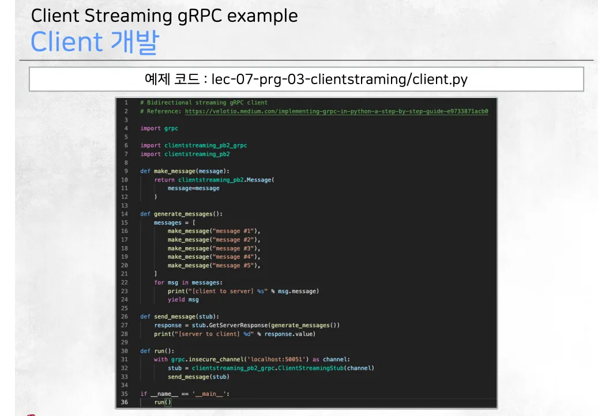

### 클라이언트(Client) 개발

- 보내는 쪽인 클라이언트를 만듬
- **제너레이터(Generator) 생성:**Python
	```python
def generate_messages():
    ...
    for msg in messages:
        print(...)
        yield msg  # <--- 핵심!
	```

	- 파이썬의 `yield` 키워드를 사용
	- 한 번에 리스트를 통째로 넘기는 게 아니라, `yield`를 만날 때마다 데이터를 하나씩 툭툭 던져주는 **제너레이터** 함수를 생성
- **데이터 전송:**Python
	`stub.GetServerResponse(generate_messages())`

	- 서버의 함수를 호출할 때, 데이터 자체가 아니라 위에서 만든 함수(제너레이터)를 인자로 넣어줌
	- 이렇게 하면 gRPC 라이브러리가 알아서 이 함수를 실행시키며 데이터를 하나씩 꺼내 서버로 스트리밍

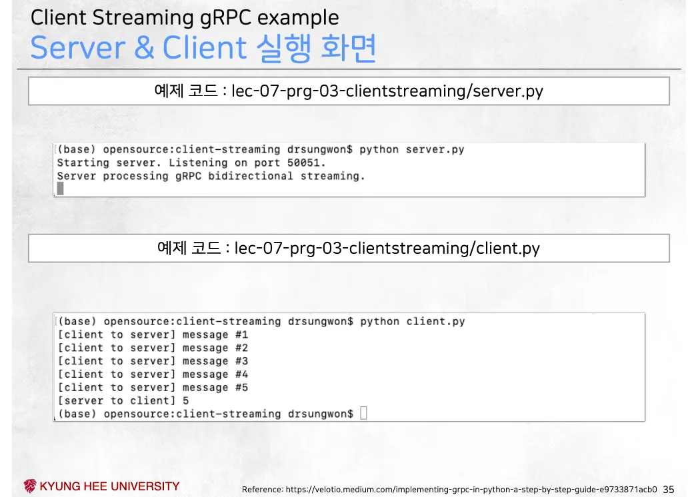

### 4단계: 실행 결과 (Execution)

- 실제로 돌렸을 때의 모습
1. **클라이언트 행동 (아래쪽 터미널 로그)**
	- `[client to server] message #1` 부터 `#5`까지 순서대로 찍힘
	- 이는 클라이언트가 제너레이터를 통해 데이터를 5번 쪼개서 서버로 보냈다는 뜻
2. **서버 행동:**
	- 서버는 `request_iterator`를 통해 이 5개의 메시지를 차례대로 받음
	- 내부적으로 `count` 변수를 1씩 증가시켜 `5`를 만듬
3. **최종 결과:**
	- 서버가 모든 수신을 마치고 `5`라는 값을 반환
	- 클라이언트 로그 마지막 줄: `[server to client] 5`
	- 클라이언트는 서버가 계산한 총 개수(5)를 응답받고 프로그램을 종료

# 4. Bidirectional Streaming gRPC

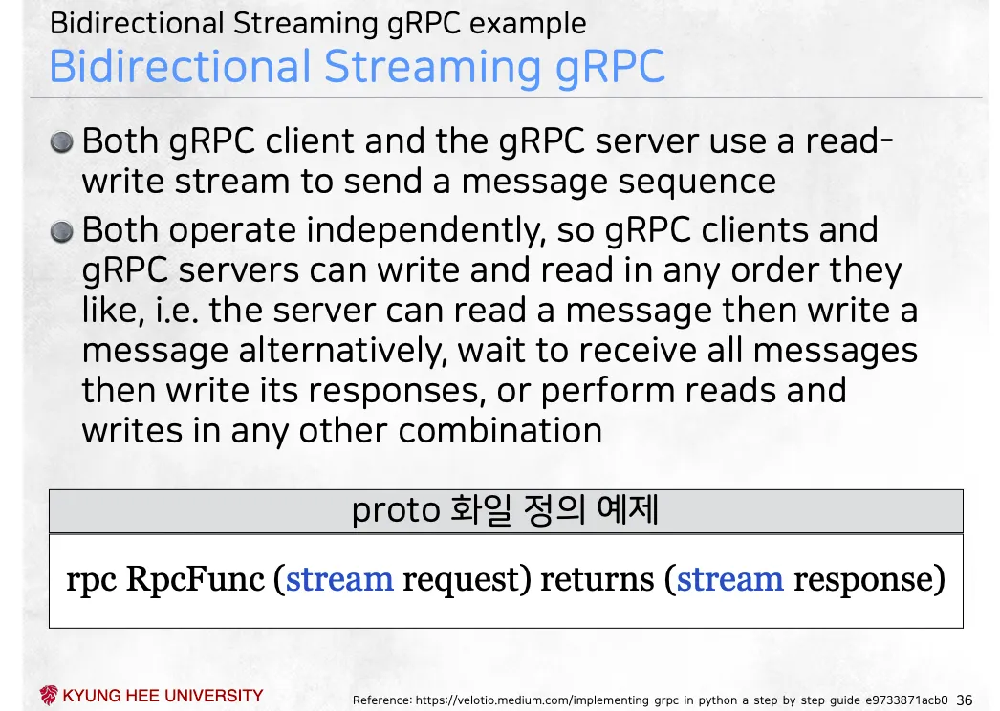

## Bidirectional Streaming gRPC

- gRPC 클라이언트와 서버 양쪽 모두 읽기/쓰기 스트림을 사용하여 일련의 메시지(message sequence)를 전송
- 두 스트림은 독립적으로 작동하므로, 클라이언트와 서버는 그들이 원하는 순서대로 읽고 쓸 수 있음
- ex)
	- 서버는 메시지를 하나 읽고 바로 응답을 하나 보낼 수도 있음(핑퐁 방식)
	- 모든 메시지를 받을 때까지 기다렸다가 응답을 보낼 수도 있음
	- 그 외 다른 어떤 조합으로도 읽기/쓰기를 수행할 수 있음
`rpc RpcFunc (stream request) returns (stream response)`

- 요청(request)과 응답(response) **양쪽 모두에 ****`stream`**** 키워드**가 붙어 있음

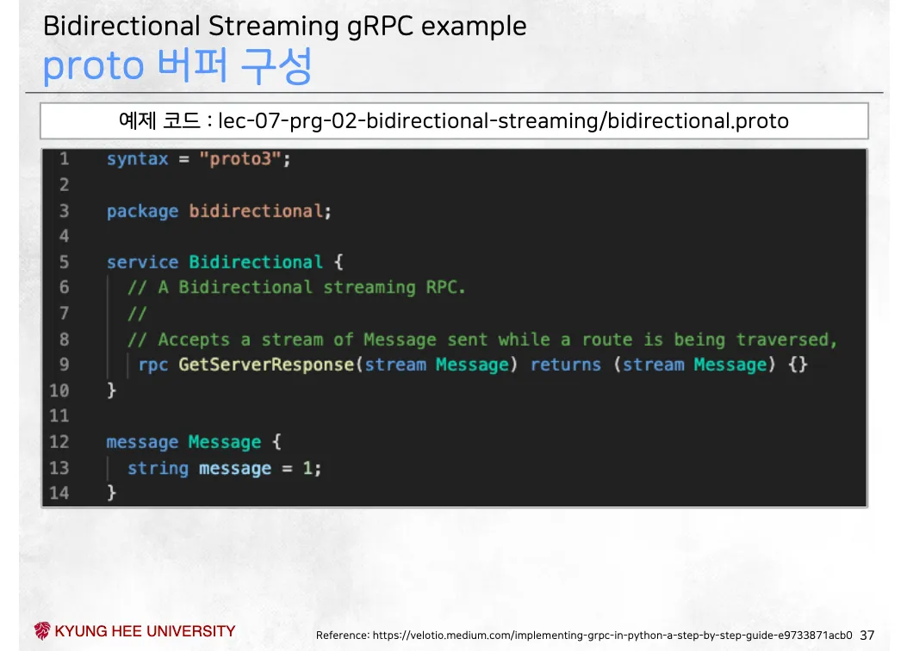

### 1단계: Proto 정의 (계약서 작성)
`rpc GetServerResponse(stream Message) returns (stream Message) {}`

- **`(stream Message)`**** (Request):** 클라이언트가 메시지를 연속으로(Stream) 보냄
- **`returns (stream Message)`**** (Response):** 서버도 응답을 연속으로(Stream) 보냄
- **의미:** 양쪽 파이프가 모두 열려 있어 언제든지 보내고 받을 수 있음

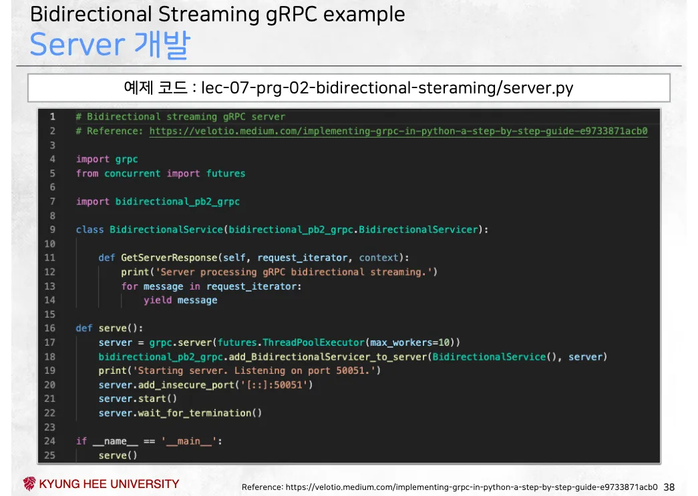

### 2단계: Server 개발 (반사판/에코 서버)
Python
```python
def GetServerResponse(self, request_iterator, context):
    # 클라이언트가 보낸 메시지 스트림(iterator)을 하나씩 꺼냄
    for message in request_iterator:
        # 받은 메시지를 그대로 다시 클라이언트에게 보냄 (Echo)
        yield message
```

- **`request_iterator`****:** 클라이언트가 보내는 메시지가 들어오는 입구
- **`yield message`****:**
	- 이전의 'Client Streaming' 예제에서는 `for` 문이 다 끝난 뒤 `return`을 했지만,
	- 여기서는 `for` 문 안에서 `yield`를 씁니다. 즉, **메시지 하나를 받으면 그 즉시 응답 하나를 뱉어냄.**

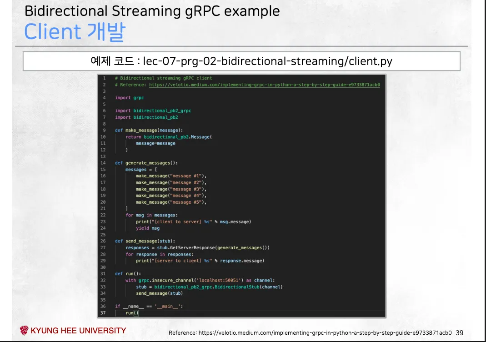

### 3단계: Client 개발 (보내면서 듣기)
클라이언트는 말하는 입(Generator)과 듣는 귀(Response Loop)를 동시에 가동

1. **메시지 생성 (보내기):**Python
	```python
def generate_messages():
    ...
    yield msg  # 메시지를 하나씩 서버로 던짐
	```

2. **함수 호출 및 수신 (받기):**Python
	```python

# 1. generate_messages()로 데이터를 계속 보내면서,

# 2. 동시에 서버가 주는 응답을 responses 변수로 받음
responses = stub.GetServerResponse(generate_messages())

# 3. 서버가 응답을 줄 때마다 즉시 출력
for response in responses:
    print(f"[server to client] {response.message}")
	```

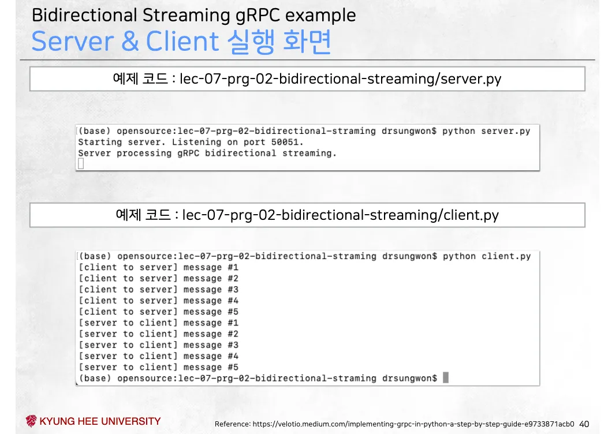

### 4단계: 실행 결과 출력

- 클라이언트가 보낸 메시지(`client to server`) 5개와 서버가 응답한 메시지(`server to client`) 5개가 모두 출력

# Protocol Buffer (Protobuf)

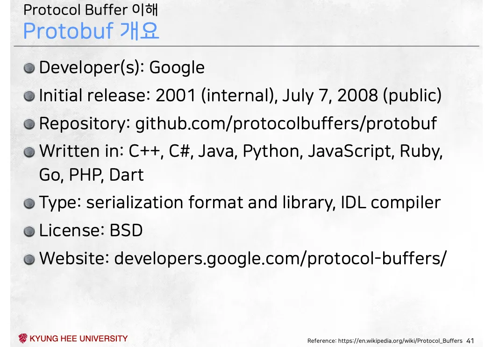

- 구글이 개발
- 2001년 내부적으로 사용, 2008년 공개
- Repository: [github.com/protocolbuffers/protobuf](https://github.com/protocolbuffers/protobuf)
- C++, C#, Java, Python, JavaScript, Ruby, Go, PHP, Dart 의 언어를 기본 지원
	- 그 외에도 오픈소스로 다양한 언어에서 사용
- 유형: 직렬화 포맷 및 라이브러리, IDL 컴파일러(Interface Description Language)
- BSD 라이선스
→ 부가설명

	- 구글이 내부적으로 정보 저장에 사용하던 방식
	- 이동통신에서의 protobuf의 의미
		- protobuf는 메시지 크기가 작기 때문에 이동통신에서 용이
		- 이동통신은 대역폭이 제한적, 데이터 요금이 발생하므로 메시지 크기가 작은 protobuf가 JSON과 같은 크고 휴먼 리더블한 포맷보다 용이
		- 에러가 잦고 재전송 등이 잦고 빈번하게 통신하는 이동통신에서 protobuf가 용이
		→ 이런 이유로 텍스트 기반 프로토콜에서 비트 단위 프로토콜로 패러다임이 회귀

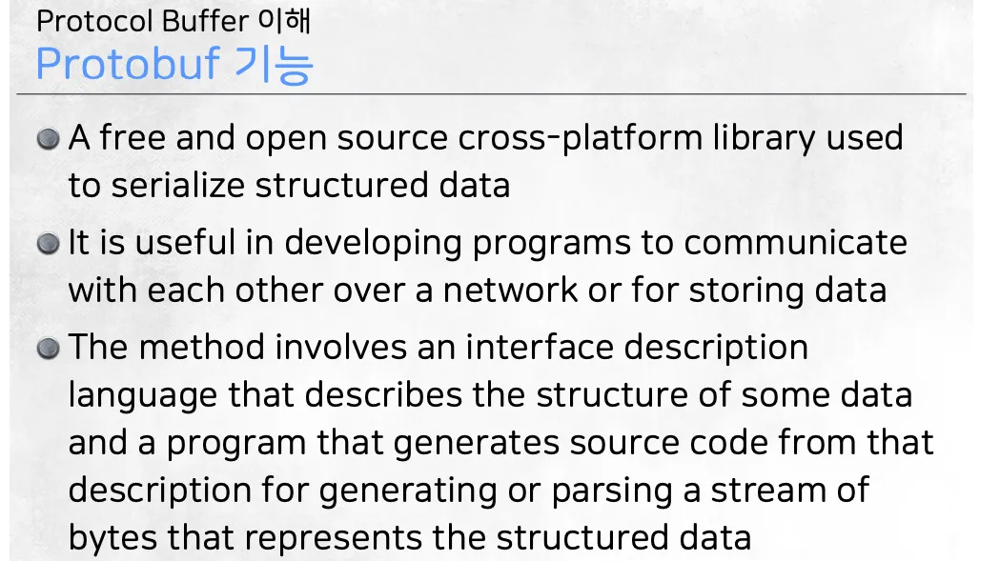

- 구조화된 데이터를 직렬화 하는 데 사용되는 무료 오픈소스 크로스 플랫폼 라이브러리
- 네트워크를 통해 서로 통신하는 프로그램을 개발하거나 데이터를 저장하는데 유용
- 데이터의 구조를 설명하는 IDL과 그 설명을 바탕으로 구조화된 데이터를 표현하는 바이트 스트림을 생성(=직렬화)하거나 파싱(=역직렬화)하기 위한 소스 코드를 만드는 프로그램을 포함

### 직렬화(Serialization)

- 메모리 상에 있는 객체, 데이터 구조 등을 네트워크 전송이나 파일 저장이 가능한 형태(주로 바이트 스트림)로 변환하는 과정
- 파일 시스템에 저장하는 것, 마우스를 움직여 정보를 넘기는 것 등도 일종의 직렬화
- protobuf도 직렬화를 위해 만들어진 일종의 포맷

### Protobuf의 특징 및 장점

- 언어 중립적
	- `.proto` 파일에 데이터 구조를 한 번만 정의하면, 다양한 언어용 코드를 자동으로 생성
- 이진 데이터
	- 사람이 읽을 수 없는 포맷이 아니라 컴퓨터가 처리하기 쉬운 바이너리 포맷으로 변환
	- 데이터 크기가 작고, 처리속도가 훨씬 빠름
- IDL
	- 데이터의 구조를 명확하게 정의해야 하므로, 통신하는 양쪽 시스템 사이 약속이 철저하게 지켜짐

## Protobuf 동작 원리

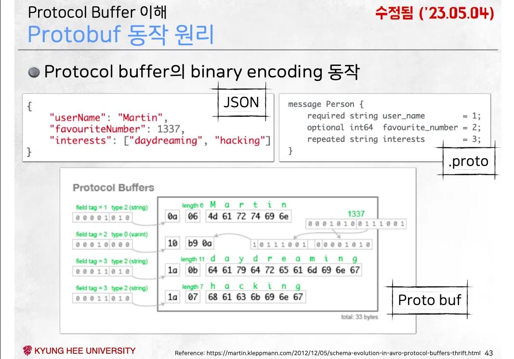

- JSON은 `필드이름: 값` 을 텍스트로 그대로 전송
- Protobuf는 필드 이름 대신 필드 번호(숫자)를 사용해 용량을 줄이도록 동작
```python
message Person {
    required string user_name = 1;
    optional int64 favourite_number = 2;
    repeated string interests = 3;
}
```

1. **키워드 (Rule)**
	- `required`: 데이터 전송 시 **반드시** 값이 있어야 함 (없으면 에러)
	- `optional`: 값이 있어도 되고 없어도 됨
	- `repeated`: 값이 여러 개일 수 있음(배열/리스트와 동일)
2. **필드 번호 (Field Number)**
	- `= 1`, `= 2`, `= 3` 처럼 각 항목에 고유한 번호를 부여합니다.
	- **핵심:** 직렬화될 때 `user_name`이라는 긴 텍스트 대신, 숫자 `1`\*만 헤더(Header)로 저장
		→ 이것이 Protobuf가 용량이 작은 이유 중 하나
**효율적인 저장방식**

- **int64의 효율성:** `int64`라고 선언했다고 해서 무조건 64비트(8바이트)를 다 쓰지 않음
- **가변 길이 (Variable Length):** 숫자가 작으면(예: 1, 2) 1바이트만 쓰고, 숫자가 크면 더 많은 바이트를 쓰는 방식(Varint)을 사용하여 **필요한 만큼만 용량을 차지**

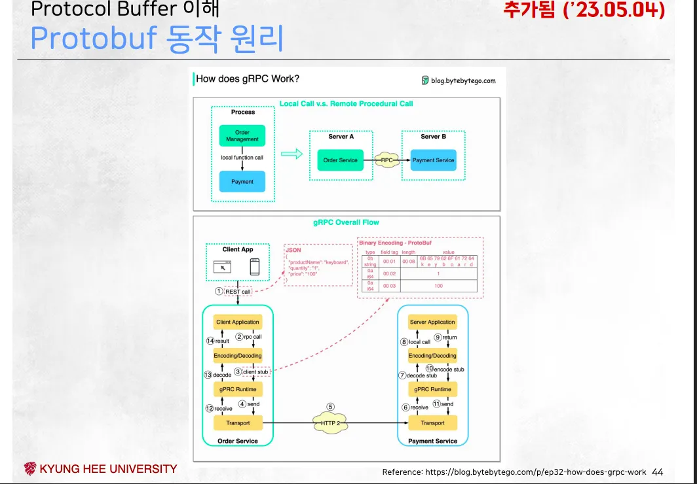

→ gRPC Overall Flow는 클라이언트가 서버의 함수를 로컬 함수와 같이 호출하는 과정을 보여줌

1. Client Application → 클라이언트가 서버에 있는 함수를 호출
2. Client Stub
	- Encoding/ Marshalling, Decoding/ Unmarshalling 이 일어남
	- 클라이언트가 보낼 데이터를 Protobuf 형식(바이너리)로 변환 
		- 또는 서버에서 받은 데이터를 Protobuf 포맷에서 클라이언트가 이해하는 데이터로 변환
3. Transport(Send/Receive)
	- 압축된 데이터를 네트워크를 통해 전송하는 과정
	- gRPC는 이 과정에 http/2를 사용해 빠르고 효율적으로 데이터 송수신
4. 실행 및 반환
	- 서버는 요청을 처리하고 결과를 다시 Protobuf로 Encoding해 클라이언트로 응답

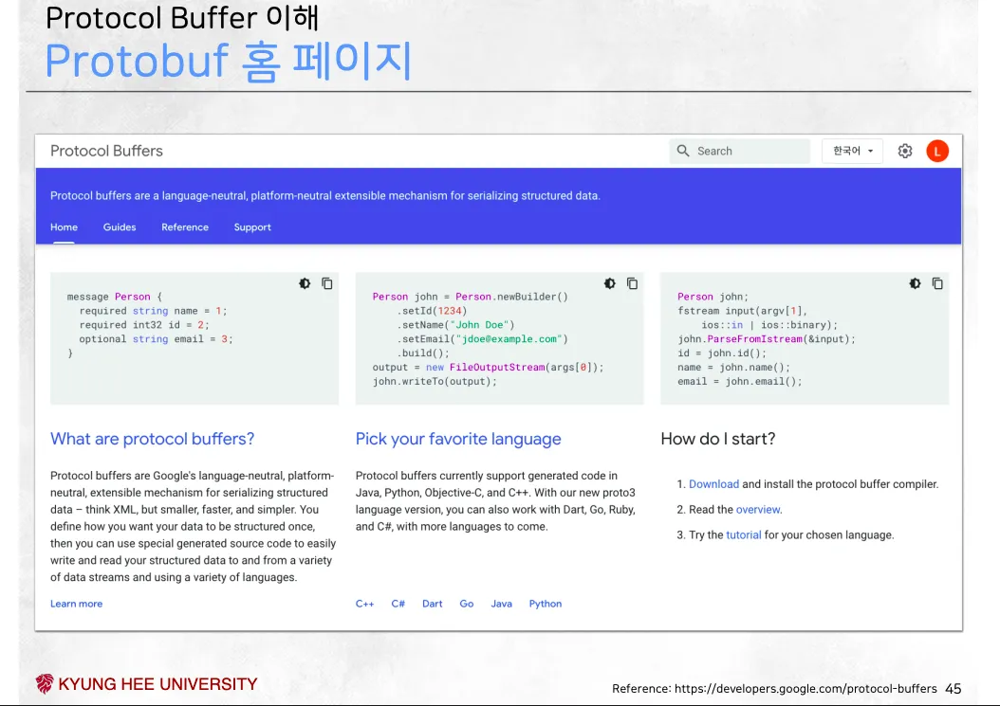

## gRPC 홈페이지의 소개

1. 언어 중립적, 플랫폼 중립적 (Language & Platform Neutral)
	- **의미:** "작성된 데이터 구조(.proto 파일) 하나만 있으면, 어떤 언어나 OS에서도 통하는 코드를 만들어 낼 수 있다"는 뜻
	- 서버는 Go(Linux)로 만들고, 클라이언트는 Python(Windows)이나 Java(Android)로 만들어져 있어도 상관없음
	- 서로 다른 언어와 환경을 가진 시스템끼리 대화가 가능하게 함
2.  작고, 빠르고, 단순함 (Small, Fast, Simple)
	- **작고 빠름:** 앞서 보신 것처럼 데이터를 바이너리로 압축해서 보내기 때문에 **XML이나 JSON보다 용량이 훨씬 작고(3~10배), 파싱 속도도 훨씬 빠름**
	- **단순함:** 개발자가 복잡한 파싱 로직을 직접 짤 필요가 없음
		-  데이터 구조만 정의하면, 코드는 자동으로 생성
3. 공식 지원 언어 (Code Generation)

# gRPC의 장점

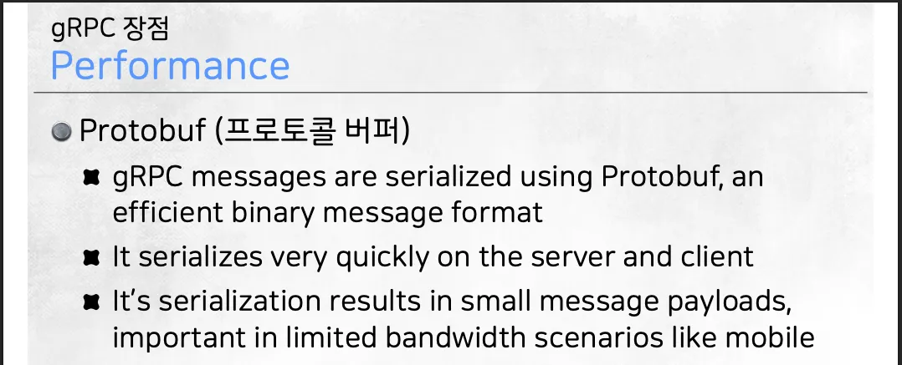

## 1. 성능

- gRPC는 효율적인 바이너리 메시지 포맷인 Protocol Buffer를 사용해 직렬화
- Protobuf는 json대비 컴퓨터가 해석하기 쉬워 서버와 클라이언트 양쪽에서 빠르게 직렬화
- Protobuf는 더 작은 메시지 페이로드를 가져 모바일과 같이 대역폭이 작은 경우에 효과적

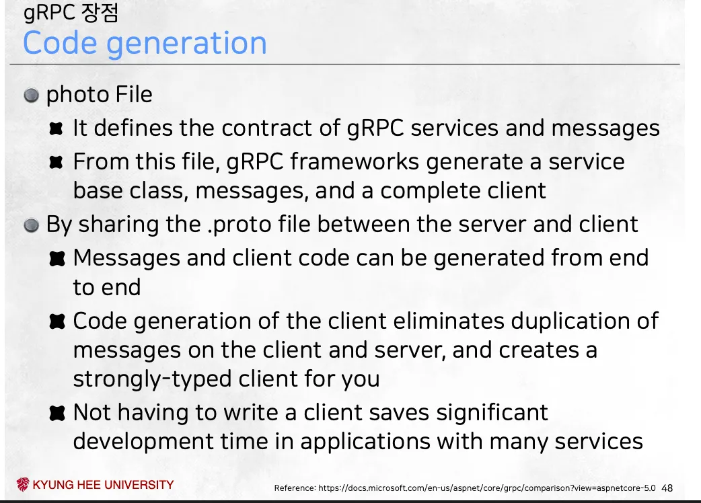

## 2. 코드 생성

### Proto File

- proto file은 gRPC 서비스와 메시지들 간의 계약(Contract)을 정의
- 이 파일로부터 gRPC프레임워크는 서비스 베이스 클래스, 메시지, 완전한 클라이언트 코드를 생성
	→ proto file이 일종의 계약이자 설계도로서 동작

### 서버와 클라이언트 사이에 `.proto` 파일을 공유함으로서 아래 역할 수행 가능

- 메시지가 클라이언트가 코드가 양쪽 끝단에서 처음부터 끝까지 생성 가능
- 클라이언트 코드 생성은 서버와 클라이언트 사이 메시지 정의 중복을 제거하고, 강 타입의 클라이언트를 생성
- 클라이언트 코드를 직접 작성할 필요가 없다는 것은 시간 절약에 도움

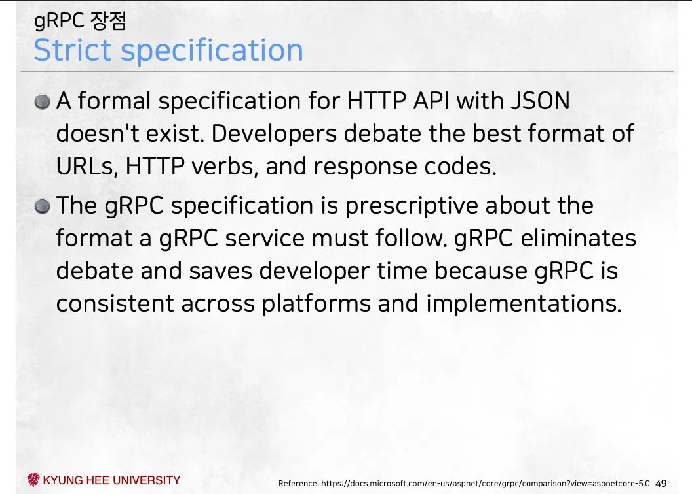

## 3. 엄격한 Specification(엄격한 명세)

- JSON 기반 HTTP API(Rest API)는 공식적인 규격(사양)이 정해지지 않아 개발자들이 많은 사항들에 대해 논쟁
	- URL, HTTP 메서드, 응답 코드 등으로 논쟁
		→ 이런 고민, 논쟁으로 시간이 낭비

- gRPC의 스펙은 gRPC 서비스가 따라야 하는 형식에 대해 엄격하제 규정
	- gRPC는 플랫폼, 구현 전반에 걸쳐 스펙이 정해져 있기 때문에 논쟁 없이 따르면 됨
		→ 시간을 낭비하지 않게 함
⇒ 엄격한 명세를 통해 논쟁, 고민을 줄이고 시간을 절약

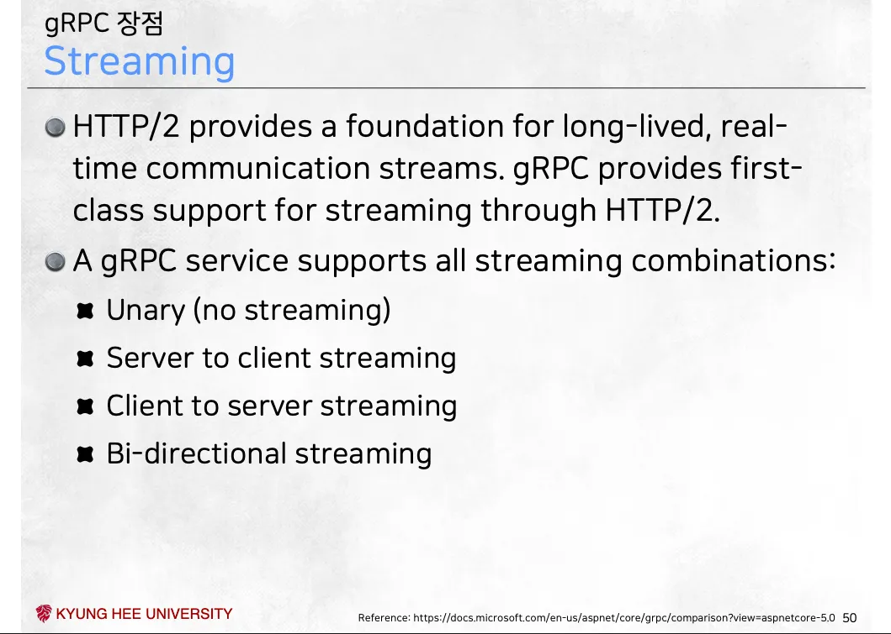

## 4. Streaming
→ 연결을 맺어놓고 데이터를 계속 흘려보내는 방식

- gRPC는 HTTP/2 를 기반으로 하며, 이 HTTP/2가 장기 실시간 통신 스트림을 위한 기반을 제공
- gRPC 서비스는 모든 스트리밍 조합을 지원
	1. **Unary (no streaming):** 단항 (스트리밍 없음 - 일반적인 요청/응답)
	2. **Server to client streaming:** 서버에서 클라이언트로의 스트리밍
	3. **Client to server streaming:** 클라이언트에서 서버로의 스트리밍
	4. **Bi-directional streaming:** 양방향 스트리밍

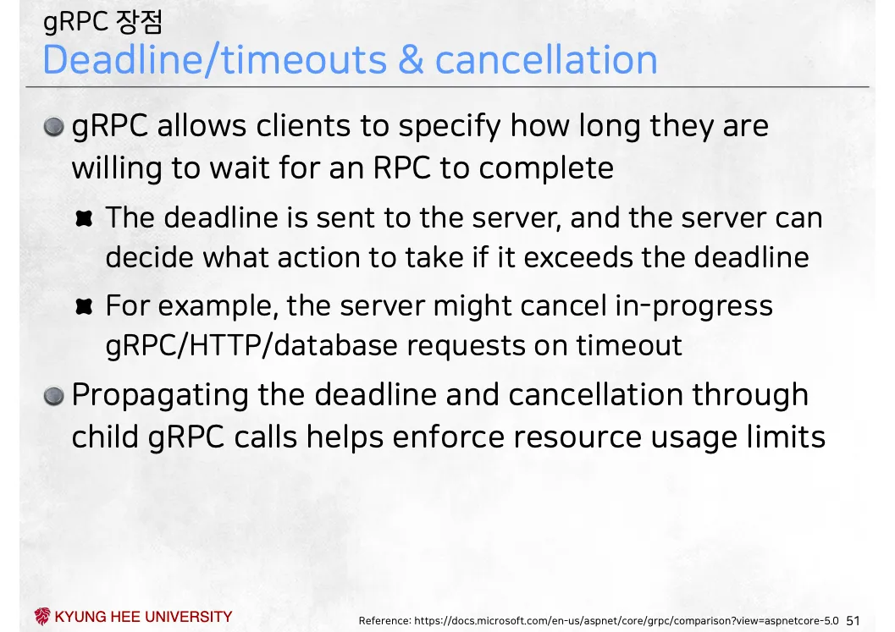

## 5. Deadline/timeout & cancellation

- gRPC는 클라이언트가 RPC가 완료될 때 까지 얼마나 기다릴지를 명시하는 것을 허용
- 데드라인은 서버로 전송되고, 서버는 이 시간을 초과할 경우 어떤 조치를 취할지 결정 가능
	- ex) 서버는 타임아웃 발생 시 진행 중인 gRPC, HTTP, DB쿼리 등을 취소 가능
- 하위 gRPC호출을 통해 데드라인과 취소를 전파하는 것은 리소스 사용 제한 강제를 가능하게 함

# gRPC의 권장 사용 시나리오

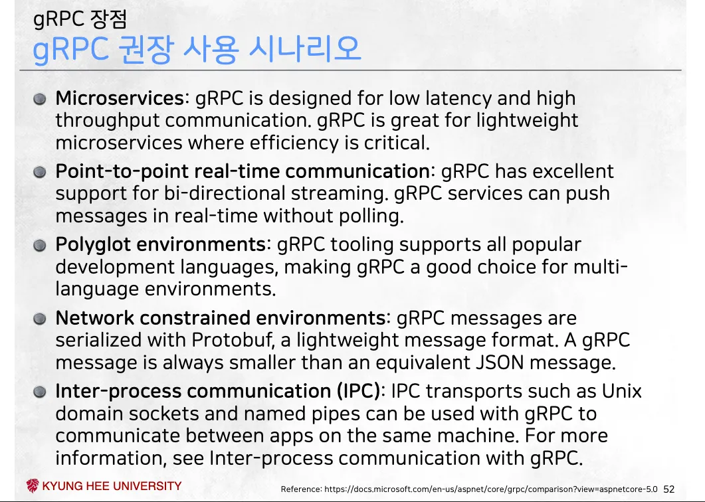

### 1. Microservices

- gRPC는 낮은 지연 시간, 높은 처리량의 통신을 위해 설계
	- gRPC는 효율성이 중요한 경량 마이크로서비스에 좋음
→ 서버 사이 빈번한 통신을 하는 마이크로서비스에 유용

### 2. Point-to-point real-time communication

- gRPC는 양방향 스트리밍을 지원하므로, 폴링 없이 메시지를 스트리밍 가능
- 실시간 통신에 유용

### 3. Polyglot environments

- gRPC 툴링은 많은 개발 언어를 지원하므로 폴리글랏 환경에서 유용
- `.proto` 파일만 공유하면 폴리글랏 환경에서도 각 언어에 따른 코드가 생성되어 유용

### 4. Network constrained environments

- gRPC 메시지는 경량 메시지 형식인 Protobuf로 직렬화되므로 gRPC메시지는 동일 데이터를 의미하는 JSON보다 작음
- 이는 네트워크가 제약된 환경에서 유용
	- ex) IoT, 모바일

### 5. Inter-process communication

- gRPC는 IPC를 위한 유닉스 도메인 소켓, Named PIpe를  같은 전용 수단을 타고 넘어갈 수 있음
	- 따라서 gRPC를 IPC를 위해 사용 가능

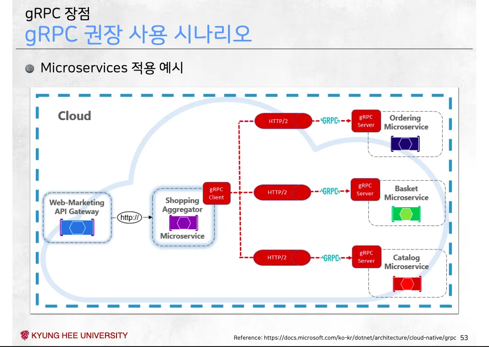

→ 위의 마이크로서비스 환경 예시

# gRPC 단점

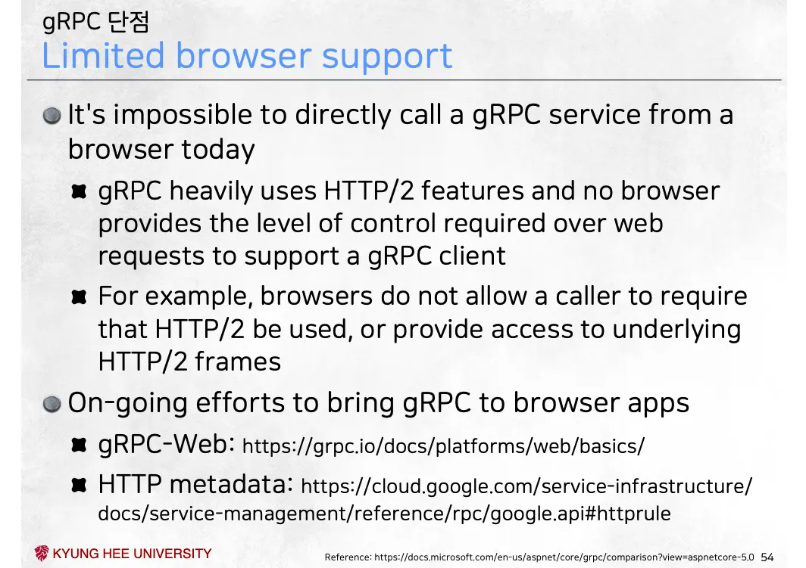

## 1. 제한된 브라우저 지원

- 오늘날의 대부분 브라우저는 gRPC 서비스를 직접 호출하는 기능을 지원하지 않음
	- gRPC는 HTTP/2 기능에 많이 의존하는데, 대부분 브라우저는 gRPC 클라이언트를 지원하기 위해 웹 요청에 대해 요구되는 수준의 제어 권한을 제공하지 않음
	- ex) 브라우저는 호출자가 HTTP/2 사용을 강제하게 하지 않고, 베이스 HTTP/2 프레임에 접근하는 것을 허용하지 않음
- gRPC를 브라우저로 가져오기 위한 노력들이 진행 중
	1. gRPC-Web
	2. HTTP metadata 

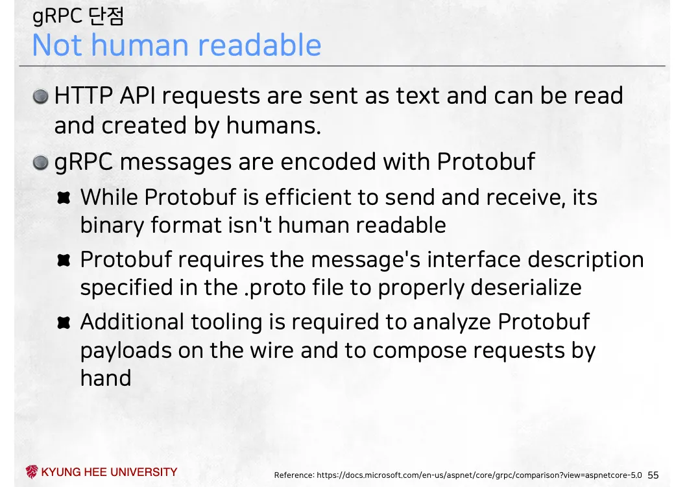

## 2. 인간이 읽을 수 없음

- HTTP API 요청들은 테스트로 전송되고, 인간이 읽고 생성 가능
- gRPC메시지는 Protobuf로 변환
	- 이는 주고받기에는 효율적이나, 바이너리 포맷이라 사람이 읽을 수 없음
- Protobuf는 데이터를 역직렬화하기 위해 .proto파일에 명시된 메시지 인터페이스 설계도를 필요로 함
- 또한 네트워크 상의 Protobuf의 페이로드를 분석하거나 수동으로 요청을 작성하기 위해서는 추가적인 도구가 필요
	→ 디버깅이 어려움

# gRPC를 올바른 곳에 사용해야함
→ 이를 일종의 단점으로 생각
	→ 특정 상황에서 적절하게 사용하지 않으면 gRPC 사용 자체가 문제가 됨

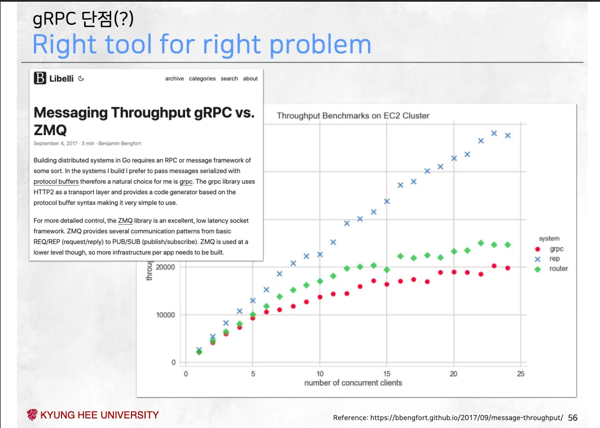

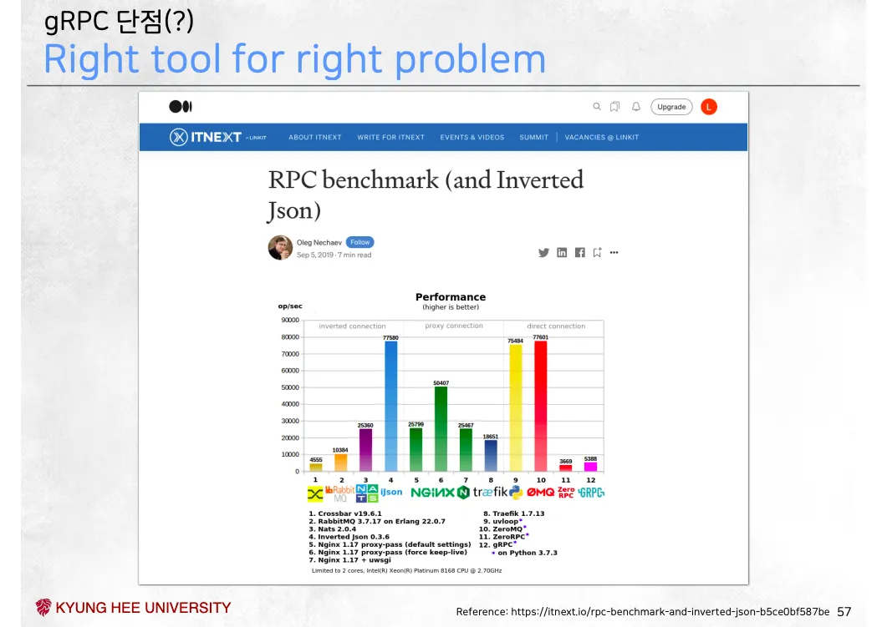

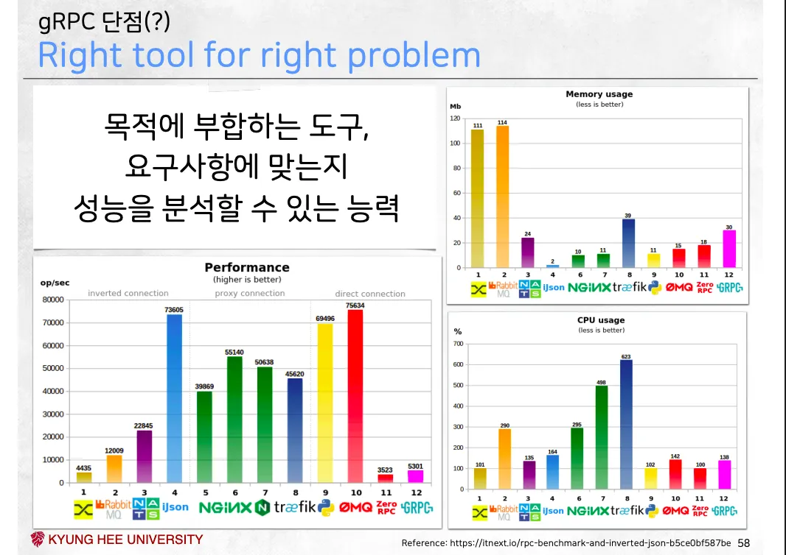

## 목적, 상황에 맞는 도구 선택
→ 위 그래프, 표 들은 각 상황, 도구 등에 따른 벤치마크를 비교한 것, 아래와 같은 조건에 따라 차이가 발생

1. 언어의 차이
	- 특정 언어로 구현된 상황에서 속도 차이가 발생할 수 있음
2. 도구의 차이
	- 기능을 제외하면 ZMQ, Inverted JSON과 같이 gRPC보다 더 빠른 기술도 존재
3. 상황의 차이
	- 동시 접속자가 늘어날수록 `router`, `rep` 이 gRPC보다 처리량이 높아짐
⇒ gRPC를 은총알 처럼 사용하지 말고 현재 적용할 곳의 명확하게 진단해서 적절한 기술을 사용해야함

	- 도구의 적용이 올바른지 판단하고 분석해볼 수 있어야 함
		→ 필요할 때는 직접 돌려보기도 해야함

	- 용도와 목적에 따라 적절하게 적용할 수 있어야 함
