> 원본 Notion 정리 — 강의 슬라이드 이미지 + 설명.

> [← 전체 목차](/posts/풀스택네트워킹-목차/)

## 목차

- 컴퓨터 네트워크 개요
- OSI 7계층 개요
- 패러다임의 변화
- Linux Foundation의 이해
***

# 컴퓨터 네트워크

## 컴퓨터란?

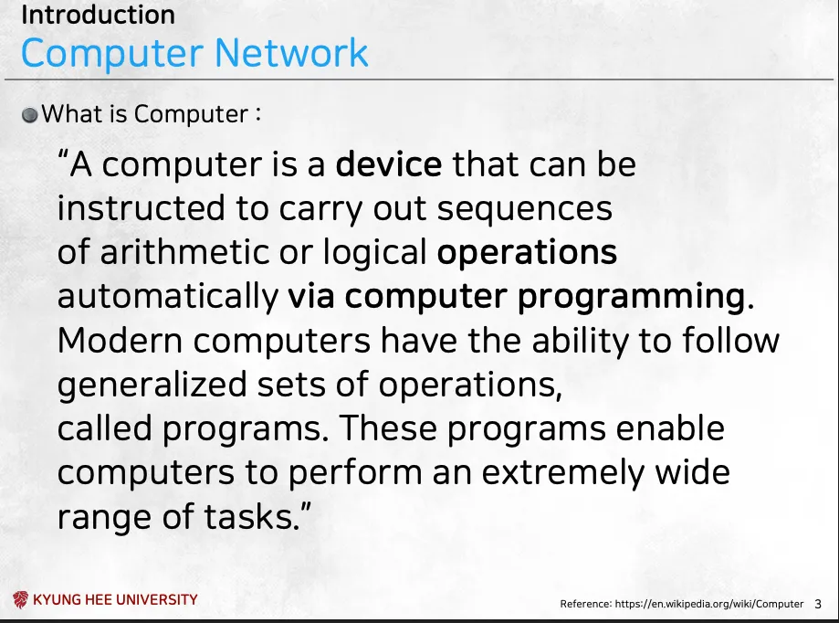

컴퓨터는 

- **컴퓨터 프로그래밍**을 통해 **산술적 또는 논리적 연산**의 순차적 수행을 자동적으로 처리하도록 지시받을 수 있는 **장치**
- 현대의 컴퓨터는 **프로그램**이라고 불리는 일반화된 작업 집합을 따를 수 있는 능력을 갖추고 있음
- 이러한 프로그램들은 컴퓨터가 극도로 넓은 범위의 작업을 수행할 수 있도록 해줌

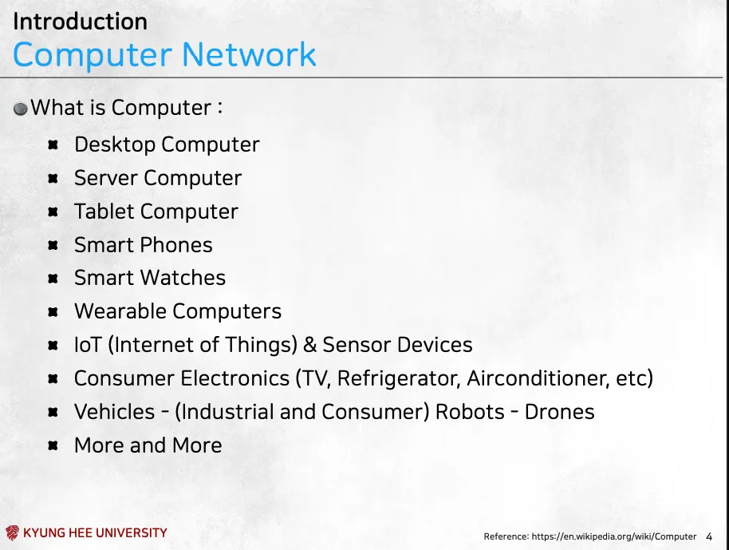

### 1단계: 전통적인 컴퓨터와 네트워크의 시작
처음에는 **컴퓨터**라고 하면 주로 **데스크톱**과 **서버**를 의미

- **서버 컴퓨터:** 아주 성능이 좋은 컴퓨터로, 요청(데이터 처리, 계산 등)을 전문적으로 처리하는 역할
- **데스크톱 컴퓨터**
	- 상대적으로 서버에 비해 성능이 떨어지는 컴퓨터
	- 주로 서버가 처리한 결과를 사용자에게 보여주는 역할을 수행
	- 그래서 데스크톱은 **클라이언트(Client) 역할**

### 2단계: '컴퓨터'의 개념 확장
기술이 발전하면서 '컴퓨터'의 모습과 역할이 매우 다양해짐

- **휴대용 컴퓨터:** 태블릿, 스마트폰
- **착용하는 컴퓨터:** 스마트워치, 각종 웨어러블 기기
- **인간과 분리되어, 공간 속에 존재하는 컴퓨터 (IoT):** 스마트 스피커, TV, 냉장고, 각종 센서
- **움직이는 컴퓨터:** 자동차, 로봇, 드론

### 3단계: 새로운 컴퓨터와 새로운 네트워크
⇒ 결론: 새로운 종류의 컴퓨터는 새로운 방식의 네트워크를 요구

	- 새로운 요구사항으로 새로운 디바이스가 등장, 이 디바이스는 새로운 네트워크의 요구사항을 도출
- 현재는 로봇이 새로운 디바이스로 떠오르며 통신기술도 로봇을 향하게 됨
***

# 네트워크의 분류

## 네트워크의 규모에 따른 명칭

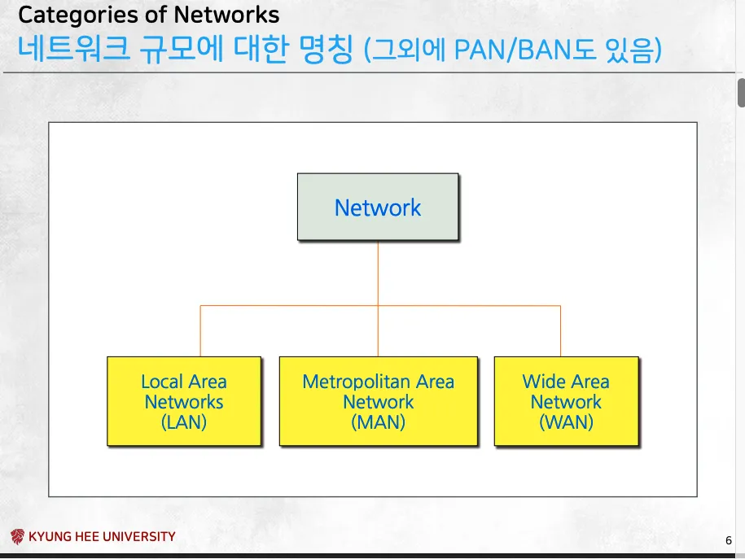

- 네트워크는 연결된 장치들이 차지하는 지리적 규모(범위)에 따라 이름이 달라짐

### 1. LAN - Local Area Network

- **규모:** 가정, 사무실, PC방, 학교 건물 하나 정도의 **제한된 로컬(Local) 공간**을 연결
	→ 소유주가 같다면 하나의 LAN으로 보기도 함

- **예시:** 한 사무실 내의 컴퓨터, 프린터, 서버들을 서로 연결

### 2. MAN - Metropolitan Area Network

- **규모:** 하나의 도시 전체나 대규모 캠퍼스 등 수십 km 범위에 걸쳐 여러 개의 LAN을 연결
- **예시:** 한 도시 내의 여러 관공서나 대학 캠퍼스 건물들을 하나로 묶는 네트워크, 케이블 TV 방송망

### 3. WAN - Wide Area Network

- **규모:** 도시와 도시, 국가와 국가, 심지어 대륙을 넘나드는 **광대역(Wide)** 지역을 연결
- **예시:** 여러 도시에 지사를 둔 회사가 본사와 각 지사의 네트워크(LAN)를 서로 연결

### 기타(더 작은 범위, 더 큰 범위)
**PAN**과 **BAN**이 가장 작은 규모의 네트워크

1. **PAN (Personal Area Network)**
	- 한 개인의 주변 공간(보통 10m 이내)에 있는 장치들을 연결합니다.
	- **예시:** 스마트폰과 블루투스 이어폰, 무선 키보드/마우스 연결
2. **BAN (Body Area Network)**
	- PAN보다 더 작은 개념
	- 사람의 몸에 착용하거나 이식된 장치들을 연결하는 네트워크
	- 의료나 피트니스 분야에서 주로 사용됩니다.
	- **예시:** 심박수 센서, 혈당 측정기, 스마트워치 등의 웨어러블 기기 간의 통신
따로 자세한 설명은 없으나 WAN보다 더 큰 범위도 존재

## LAN

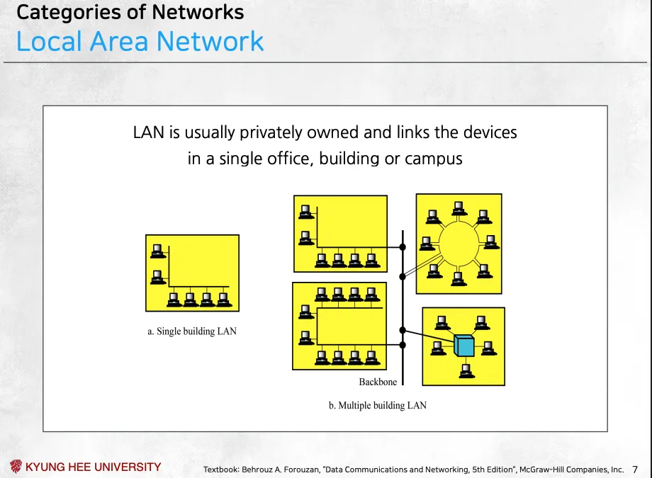

### LAN

- 통상적으로 가정, 사무실, PC방, 학교 건물 하나 정도의 **제한된 로컬(Local) 공간**을 연결하는 네트워크
- LAN은 일반적으로 사적으로 소유하며(privately owned), 단일 사무실, 건물 또는 캠퍼스 내의 장치들을 연결
	→ `슬라이드의 정의`

	- **사적 소유, 제한된 지역**이 핵심

### LAN은 작은 규모, 큰 규모가 존재

1. 작은 규모의 LAN (Single Building LAN)
	- **규모:** 가정집, 작은 사무실, PC방 등 **건물 하나** 정도의 가장 기본적인 규모
	- **개인/조직이 직접 공유기, 케이블 등을 소유하고 관리**
2. 큰 규모의 LAN (Multiple Building LAN)
	- **규모:** 대학교 캠퍼스처럼 **여러 건물**이 모여있는 더 큰 규모
	- 소유 주체는 **'대학교'라는 단일 조직**
		- ex) 각 단과대학 건물마다 작은 LAN이 있고, 이 LAN들을 **'백본(Backbone)'** 이라는 뼈대 네트워크로 연결하여 캠퍼스 전체를 **하나의 거대한 LAN**으로 연결
		**⇒ 물리적으로는 넓지만, 한 조직이 소유하고 관리하기 때문에 LAN의 범주에 속함**

## MAN

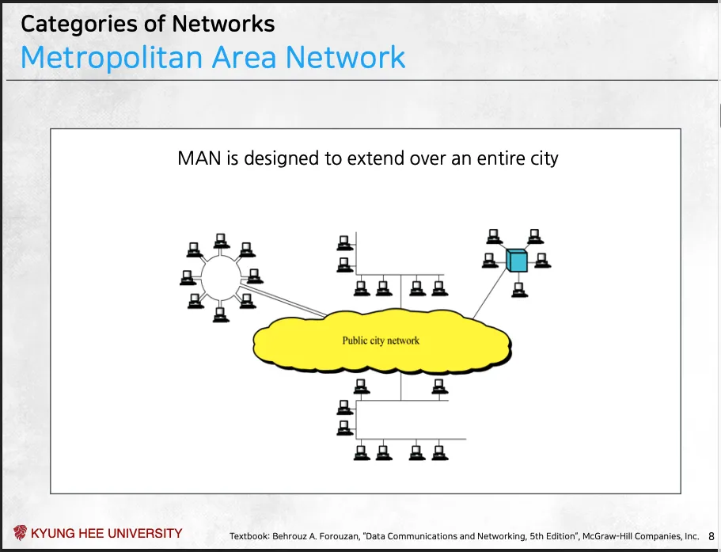

### MAN

- 여러 개의 LAN이 모인 것
- 도시 전체로 확장되도록 설계된 네트워크
	→ `슬라이드의 정의`

- 한 도시 내에 흩어져 있는 여러 개의 LAN을 서로 연결하여 하나의 거대한 네트워크로 묶은 것
- ex) 위의 그림은 한 도시 안의 작은 LAN들과 이를 모은 MAN을 도식화한 것

### 유선과 무선 MAN
MAN은 유선 기술과 무선 기술을 모두 사용
→ LAN도 유선 LAN(ex. 랜선=이터넷 케이블), 무선 LAN(ex. 와이파이)이 있음
→ WAN도 유선 WAN(ex. 해저 광케이블), 무선 WAN(ex. 위성 통신)이 있음

- **유선 MAN:** 광케이블이나 케이블 TV 망처럼 물리적인 선을 이용해 도시 내의 네트워크들을 연결
- **무선 MAN (Wireless MAN):** **LTE나 5G 서비스 등의 이동통신 기술은 **도시 전체에 무선 네트워크 커버리지를 제공하므로, 그 자체가 하나의 거대한 무선 도시권 통신망(WMAN)임

## WAN

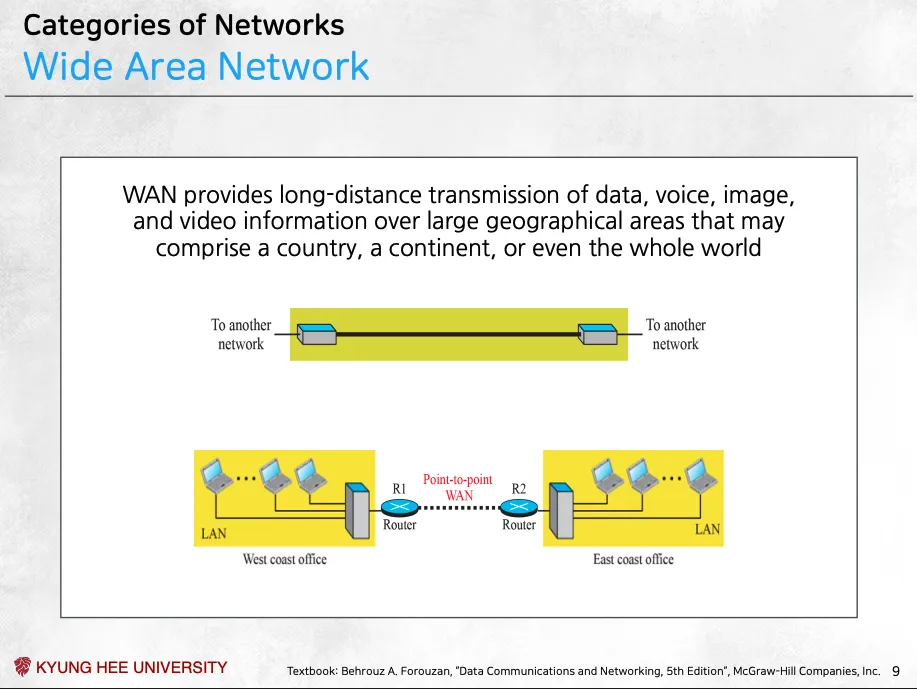

### WAN

- **국가, 대륙, 혹은 전 세계와 같은 넓은 지리적 영역에 걸쳐 데이터, 음성, 이미지 등의 장거리 전송을 제공**하는 네트워크
	→ `슬라이드의 정의`

- WAN은 묶음이 아니라 MAN(또는 더 작은 LAN)을 연결하는 줄
	- LAN이나 MAN이 특정 지역 내의 컴퓨터 **'묶음'** 이라면, **WAN은 이 묶음들을 서로 연결하는 장거리 '연결선' 또는 '다리'**
- ex) 그림이 wan을 도식화
	- 미국 서해안 사무실의 **LAN**과 동해안 사무실의 **LAN**이 있음
	- 이 두 개의 LAN은 너무 멀리 떨어져 있어 직접 연결할 수 없음
	- 이때 라우터(Router)를 통해 **`Point-to-point WAN`** 이라는 장거리 연결선으로 두 LAN을 하나로 묶어주는 것
- ex) **인터넷은** 전 세계의 수많은 LAN과 MAN을 연결하는 가장 대표적이고 거대한 WAN

## LAN, MAN, WAN의 조합(단순 그림)

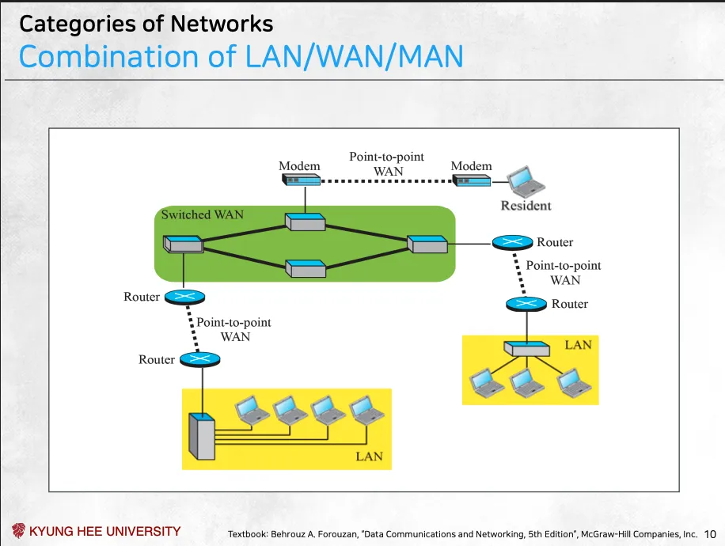

### → 그림에 대한 전체 흐름 요약

- 이 그림을 데이터의 흐름으로 보면 아래와 같음(그냥 이해를 위한 예시)
	1. 왼쪽 아래 회사(**LAN**)에 있는 컴퓨터에서 데이터를 보냄
	2. 데이터는 **라우터**(톨게이트)를 통해 밖으로 나감
	3. **Point-to-point WAN**(진입로)을 타고 거대한 **Switched WAN**(고속도로)에 진입
	4. 데이터는 고속도로를 달려 목적지 근처의 다른 **라우터**(톨게이트)에 도착
	5. 최종적으로 오른쪽 아래의 다른 회사(**LAN**)나 집(**Resident**)에 있는 컴퓨터에 안전하게 전달
***

# OSI 7 Layer

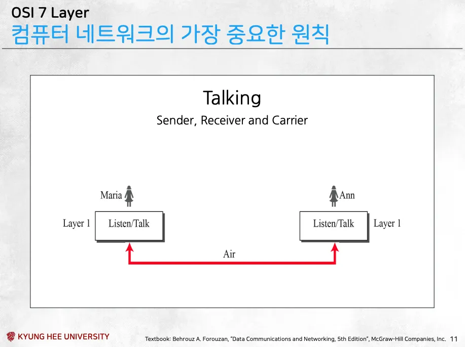

- 가장 원시적인 통신 방식 → 공기를 매체로 한 음성 대화

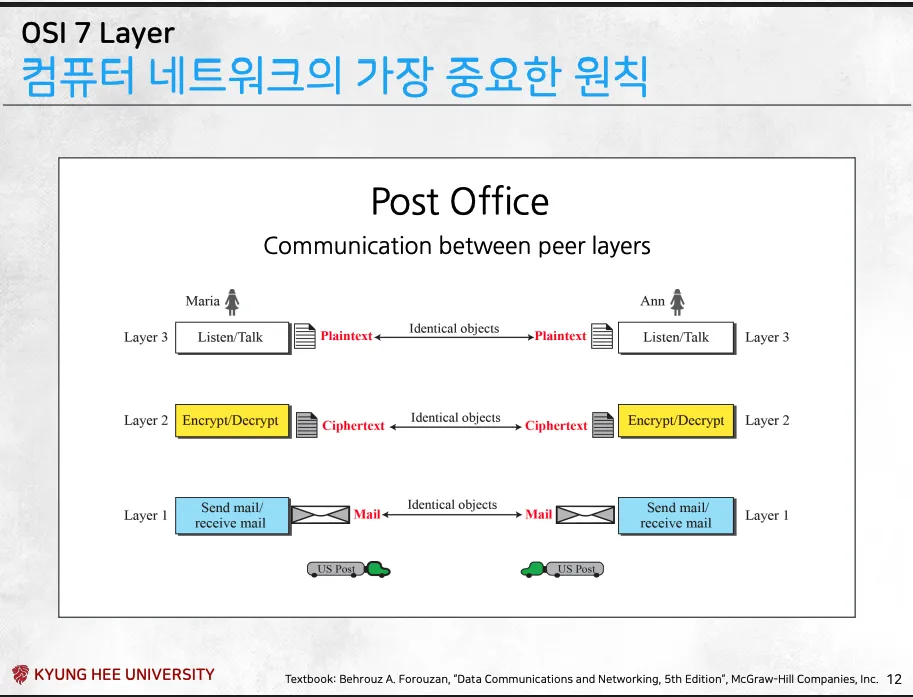

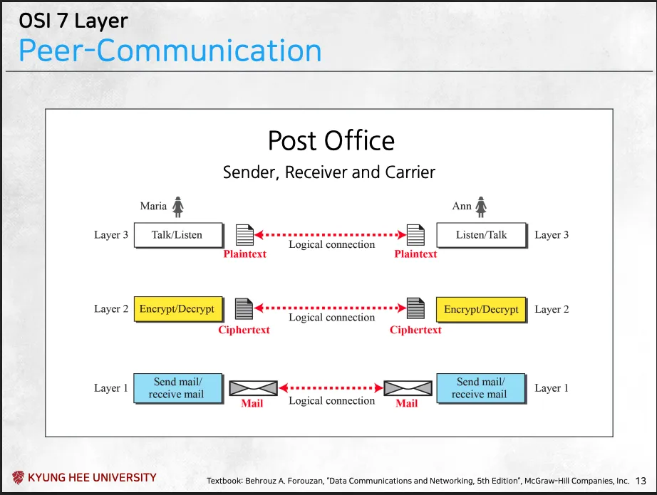

### 우편으로 알아보는 계층적 구조

- 마리아(Maria)가 앤(Ann)에게 비밀 편지를 보내는 상황
1. 보내는 과정 (마리아 쪽: 위에서 아래로)
	- **Layer 3: 편지 작성**
		- 마리아는 앤에게 보낼 **내용(Plaintext)** 을 작성
		- 마리아는 오직 '무슨 내용을 쓸까'만 고민
			- 편지가 어떻게 암호화되고 배달될지는 신경 쓰지 않음
	- **Layer 2: 암호화**
		- **이 단계에서는 편지를 암호문(Ciphertext)** 으로 변환
		- 이때 오직 '어떻게 암호화할까'만 신경 씀
			-  편지의 내용이나 우체국 시스템은 알 필요가 없음
	- **Layer 1: 발송**
		- 암호화된 편지는 우체부에게 전달되고, 우체부는 이 편지를 봉투에 넣어 우체국 시스템을 통해 **물리적으로 발송(Mail)**
		- 우체부는 오직 '어떻게 배달할까'만 신경 씀
			- 편지가 암호문인지, 내용은 무엇인지 전혀 관심 없음
2. 받는 과정 (앤 쪽: 아래에서 위로)
	- **Layer 1: 수신**
		- 앤 쪽의 우체부가 **물리적인 편지(Mail)** 를 수신
	- **Layer 2: 복호화**
		- 편지는  약속된 방식으로 **암호문(Ciphertext)** 을 다시 **원래 내용(Plaintext)** 으로 복호화
	- **Layer 3: 편지 읽기**
		- 앤은 전달받은 준 **편지의 내용**을 읽음

### 이 비유의 핵심 원리

1. **독립적인 역할 분담**
	- 각 계층(Layer)은 자신에게 주어진 **고유한 임무만 수행**
	- 편지 쓰는 사람(3계층)은 배달(1계층)을 걱정하지 않고, 암호화하는 사람(2계층)은 편지 내용(3계층)을 신경 쓰지 않음
2. **계층 간 논리적 연결 (Peer-to-Peer)**
	- 실제 데이터는 `3→2→1` 계층을 거쳐 전달되지만, **논리적으로는 같은 계층끼리 통신**
	- 마리아의 '작성 계층(Layer 3)'은 앤의 '읽기 계층(Layer 3)'과 통신하는 셈
	- '암호화 계층(Layer 2)'은 '복호화 계층(Layer 2)'과 짝을 이룸
3. **모듈화와 독립성**
	- 각 계층은 서로 독립적이기 때문에 중간의 한 계층을 바꿔도 다른 계층에 영향을 주지 않음
	- ex) 배송 수단을 우체국(Layer 1)에서 택배로 바꿔도, 편지를 쓰고 암호화하는 방식(Layer 3, 2)은 그대로 유지 가능

## OSI 7 Layer의 각 계층

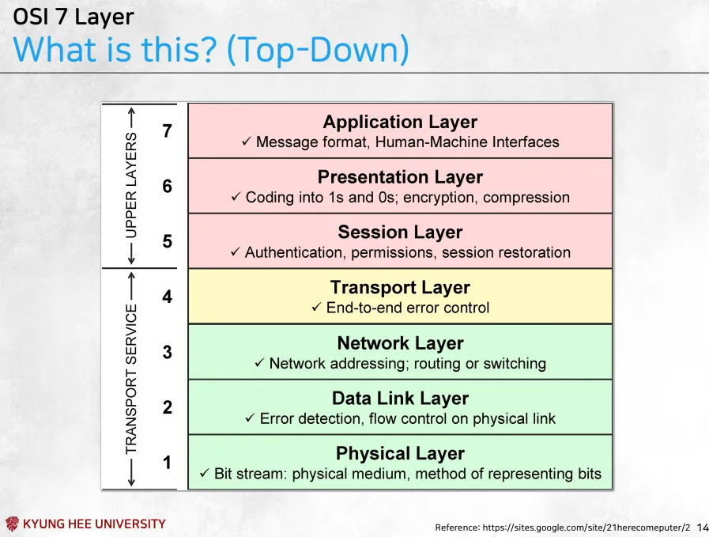

### OSI(**Open Systems Interconnection) 7 계층 모델**

- **“만든 회사나 사람이 누구든 상관없이, 이 표준 규칙만 지키면 서로 통신이 가능하도록" 만든 일종의 국제 표준 통신 규약**
	- 개방된 표준 규격에 따라 만들면 누가 만들었든, 무엇이든 인터커넥션 가능
- 복잡한 네트워크 통신 과정을 7개의 독립적인 단계(계층)로 나누어 역할 분담을 시킨 모델

### 하위 계층 (Transport Service): 데이터 전송을 책임지는 영역
→ 실제 데이터가 어떻게 안정적으로, 그리고 정확한 목적지까지 전달되는지를 책임

1. 물리 계층 (Physical Layer)
	- **역할:** 데이터를 실제 전기 신호, 즉 0과 1의 **비트 스트림(Bit Stream)** 으로 변환하여 케이블이나 전파를 통해 전송
	- 0과 1의 전기 신호만 다루는 계층
	- 랜선(유선), 전파(무선) 등 모든 하드웨어적인 요소가 여기에 해당
2. 데이터 링크 계층 (Data Link Layer)
	- **역할: **물리적으로 직접 연결된 두 장치(노드) 사이의 데이터 전송을 담당
		- **바로 옆에 있는 상대에게 안전하게 전달**
	- 물리 계층에서 발생할 수 있는 오류를 감지하고 수정
	- **MAC 주소**라는 물리적 주소를 사용
	- **이더넷(유선)** 과 **Wi-Fi(무선), 이동통신(무선)이** 이 계층의 대표적인 기술
⇒ 1, 2계층은 **직접 연결된 단 하나의 연결(One-Hop)** 에만 관여

	- 두 개 이상의 연결은 그 상위 계층의 역할(주로 네트워크 레이어=L3)
1. 네트워크 계층 (Network Layer)
	- **역할:** 데이터가 목적지까지 갈 수 있는 **최적의 경로를 찾아주는(라우팅)** 역할
		→ 네비겡이션

	- 여러 네트워크를 거쳐 데이터를 전달하기 위해 **IP 주소**를 사용
	- 이 계층 덕분에 여러 LAN을 넘어선 **'인터넷(Internet)'** 이 가능
2. 전송 계층 (Transport Layer)
	- **역할:** 데이터가 출발지에서 목적지까지 **안전하고 신뢰성 있게** 전달되는 것을 보장
	- 데이터 전송에 오류가 없는지 확인(**오류 제어**)
	- 데이터의 흐름을 조절(**흐름 제어**)
	- 도착한 패킷을 재조립
	- 대표적인 프로토콜은 **TCP**와 **UDP**

### 상위 계층 (Upper Layers): 사용자와 데이터를 다루는 영역
실제 데이터가 어떻게 안정적으로, 그리고 정확한 목적지까지 전달되는지를 책임

1. 세션 계층 (Session Layer)
	- **역할:** 두 컴퓨터 간의 통신 세션을 만들고(establish), 관리하며(manage), 종료(terminate)하는 역할
	- 인증(Authentication)과 권한 부여(Authorization)를 통해 통신을 시작할지 말지를 결정
	- 통신이 끊겼을 때 대화를 이어주는 **세션 복구** 기능도 담당
2. 표현 계층 (Presentation Layer)
	- **역할:** 한 시스템에서 사용되는 데이터 형식을 다른 시스템에서도 이해할 수 있도록 변환
	- **암호화/복호화**, 데이터 압축, 그리고 데이터의 형식을 결정
	- ex) `JPG`, `PNG` 같은 이미지 형식이나 `ASCII`, `UTF-8` 같은 문자 인코딩 방식을 정의하는 곳이 이 계층
3. 응용 계층 (Application Layer)
	- **역할:** 우리가 사용하는 네트워크 응용 프로그램(애플리케이션)의 인터페이스를 제공
	- **사용자와 가장 가까운 계층.** 
	- 마우스 클릭, 화면에 무언가 보여주기 등 사용자가 직접 접하는 부분
	- 웹 브라우저(HTTP), 이메일(SMTP), 파일 전송(FTP) 프로그램이 모두 여기에 속합

## Peer-Communication

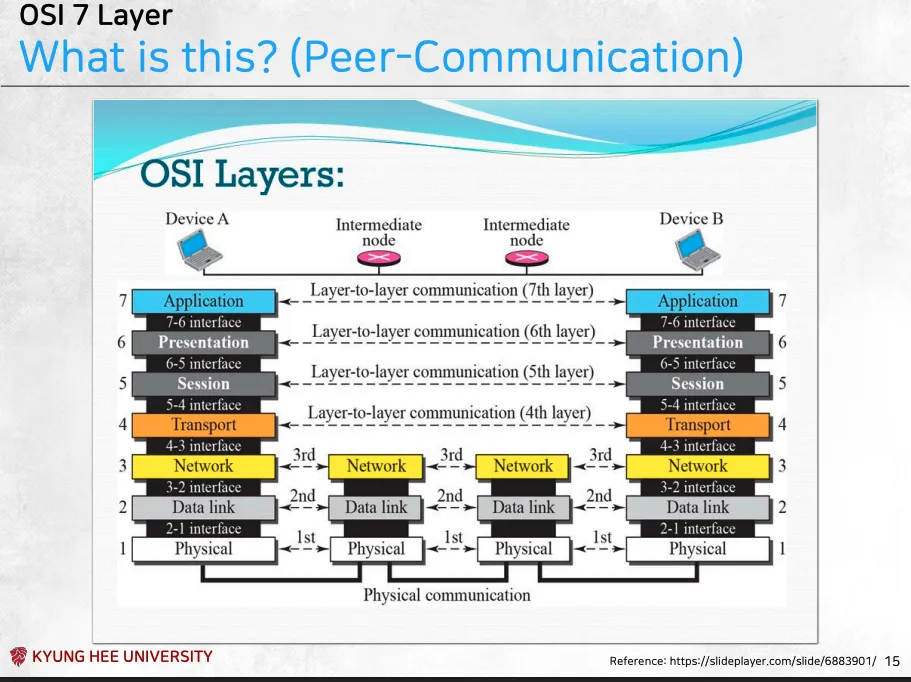

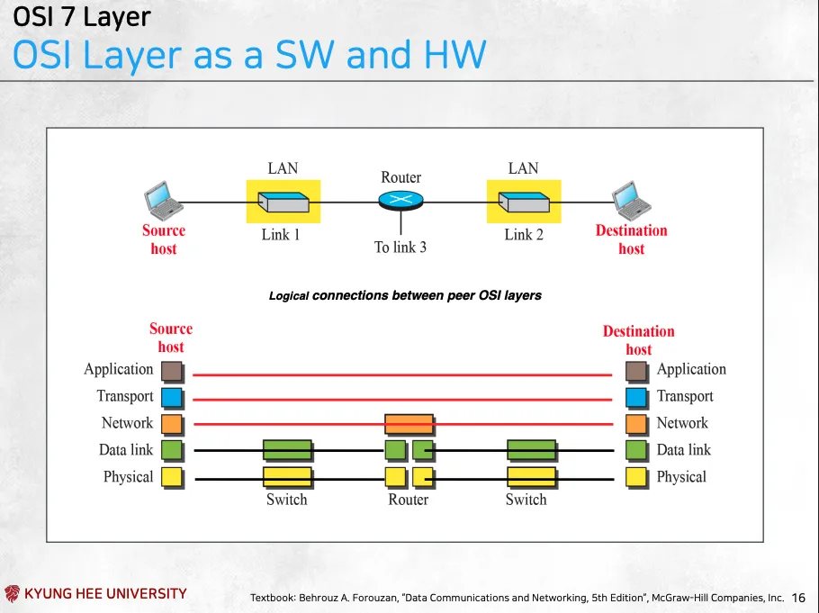

- **물리적 데이터 흐름**
	- **데이터는 아래 계층으로 차례대로 내려감 → **이후 물리적인 선(Physical communication)을 타고 중간 장치(라우터)들을 거쳐 B 컴퓨터에 도착한 뒤 → 다시 **아래에서 위 계층으로 올라감**
	- **중간** 장치(라우터)는 3계층(네트워크 계층)까지만 데이터를 확인
		- IP 주소만 보고 어느 길로 보낼지 결정할 뿐, 4~7계층 데이터(실제 데이터)은 열어보지 않음
- **논리적 통신**
	- 각 계층은 통신 상대방의 **'같은 계층'과 직접 대화한다고 생각**
	- ex) A 컴퓨터의 7계층(응용 계층)은 B 컴퓨터의 7계층과 직접 대화하는 것처럼 작동
		⇒ 이것이 **Peer Communication**
⇒ 물리적으로는 상-하위 계층 사이 데이터가 이동하지만, 논리적인 통신은 동일 계층(Peer) 사이에 이루어짐
⇒ interlayer independency (계층 간 독립성)을 얻게 됨

	- 이런 경우 서로의 일에 간섭하지 않기 때문에 **유지보수와 업그레이드가 매우 쉬워짐**

## 인터넷 서비스와 네트워크를 위한 단순화된 모델(=TCP/IP)

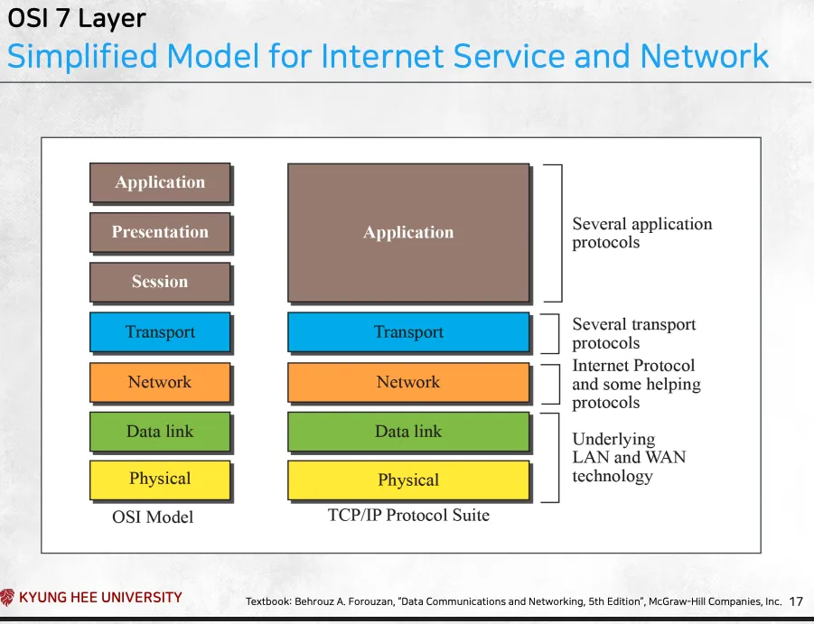

→ 현재 OSI 7 Layer를 배우지만, 실제로는 인터넷은 더 간소화된 TCP/IP를 따름

### OSI 모델 = 철학

- OSI 모델은 국제 표준 기구에서 만든 **'이렇게 통신 기능을 나누면 완벽할 거야'** 라는 이상적인 **설계도(Blueprint)** 또는 **'교과서'** 와 같은 것
- 너무 복잡하고, 시장이 표준을 기다려주지 않아 실제 제품(HW/SW)으로 널리 구현되지는 못함
	**⇒ 철학만 남음**

### TCP/IP = 현실

- **어떤 상황에서도 통신을 살아남게 하는(survivality) **실용적인 목표를 가진 모델
- 이 모델은 "생존과 통신"이라는 핵심 목표에만 집중
	- 따라서, 사용자가 직접 다루는 응용 프로그램의 세세한 기능(세션 관리, 데이터 표현 등)을 굳이 3개의 계층(Application, Presentation, Session)으로 나눌 필요가 없다고 판단
		→ 어차피 애플리케이션 개발자들이 다 알아서 처리할 기능임

	- 이 세 계층을 하나의 **응용 계층(Application Layer)** 으로 묶어버린, 더 단순하고 실용적인 현재의 인터넷 모델

## 배경지식

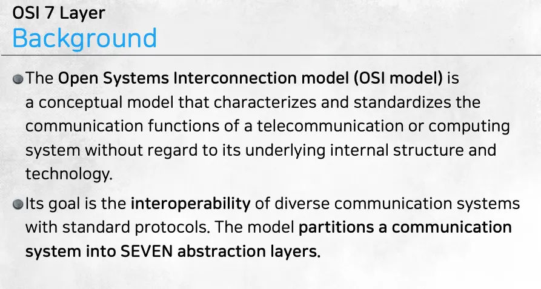

### **OSI 모델**

-  내부 구조나 기반 기술에 관계없이, 통신 시스템 또는 컴퓨터 시스템의 통신 기능을 정의하고 표준화하는 **개념적 모델**
- 목표: 표준 프로토콜을 통해 다양한 통신 시스템들이 상호운용(interoperability)될 수 있도록 하는 것
- 통신 시스템을 **7개의 추상 계층**으로 나눔
	→ 일종의 상호 운용성을 얻기 위한 방법

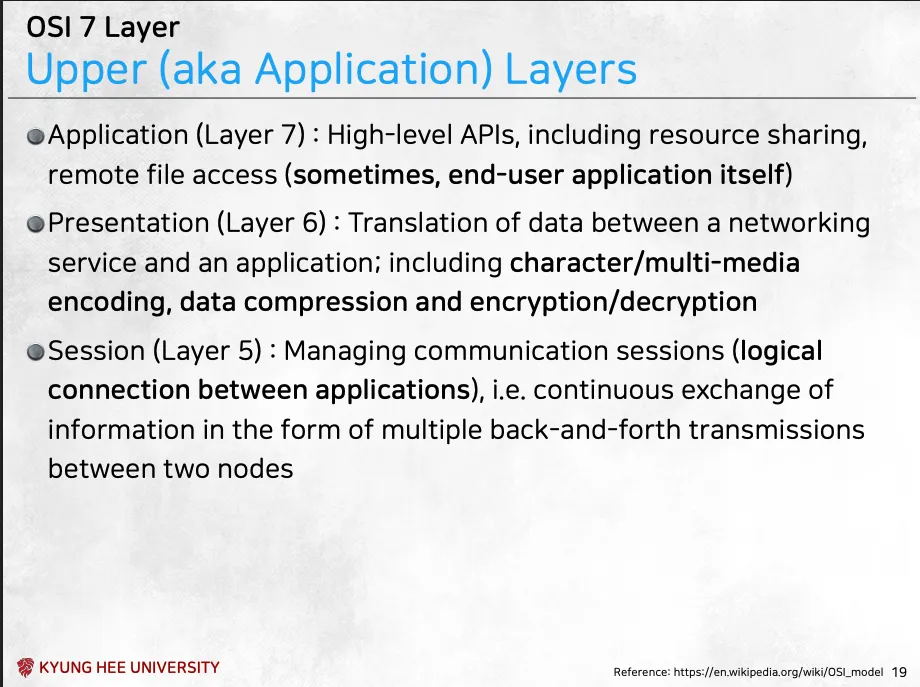

### 상위 계층(Application Layer)
→ 소프트웨어, 사용자와 더 가까운 3개의 계층

1. 응용 계층(Layer 7, Application Layer)
	- 사용자를 위한 고수준 API를 제공하며, 파일 공유, 원격 접속 등 사용자가 직접적으로 인지하는 서비스들을 포함
2. 표현 계층(Layer 6, Presentation Layer)
	- 네트워킹 시스템과 애플리케이션 사이에서 데이터를 번역하는 역할
	- 문자 인코딩(예: ASCII, UTF-8), 멀티미디어 파일 형식(예: JPEG, MP3), 데이터 압축, 암호화 및 복호화 등을 처리
3. 세션 계층(Layer 5, Session Layer)
	- 두 응용 프로그램 간의 논리적인 통신 연결(세션)을 만들고, 유지하고, 끝내는 역할
	- 통신 세션을 관리하며, 두 장치 간에 정보가 지속적으로 오고 갈 수 있도록 논리적인 연결을 담당

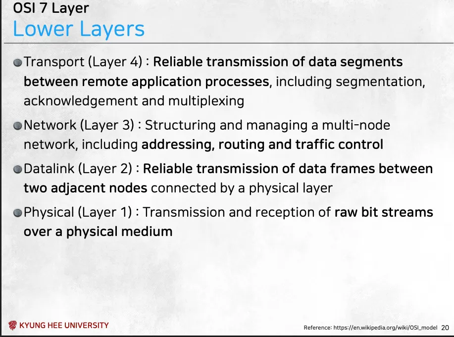

### 하위 계층

1. 전송 계층(Layer 4, Transport Layer)
	- 원격의 애플리케이션 프로세스 사이 데이터 세그먼트의 신뢰성 있는 전송을 담당
	- 세그멘테이션(데이터를 작은 조각=세그먼트으로 나누기), acknowledgement(잘 도착했는지 확인), multiplexing(여러 애플리케이션의 데이터를 동시 처리)
2. 네트워크 계층(Layer 3, Network Layer)
	- 여러 노드로 네트워크를 구성하고 관리
	- addressing(주소 지정), routing(경로 설정),  traffic control(데이터 트래픽을 관리)
3. 데이터 링크 계층(Layer2, Data Link Layer)
	- 인접한 두 노드 사이 신뢰성 있는 데이터 프레임 전송을 담당
4. 물리 계층(Layer1, Physical Layer)
	- 물리적 매체를 통해 가공되지 않은 비트 스트립(0, 1의 연속)을 보내고 받는 역할

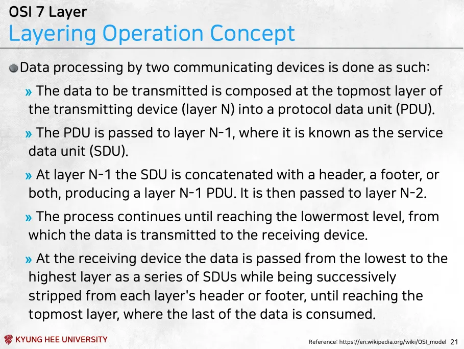

### 두 통신 장치 사이 데이터 처리
→ 두 통신 장치에 의한 데이터 처리는 다음과 같이 수행

	- OSI 7계층에서 데이터가 어떻게 각 층을 이동하며 처리되는지에 대한 핵심 원리, 즉 **캡슐화(Encapsulation)** 와 **역캡슐화(Decapsulation)** 를 설명
- 전송될 데이터는 송신 장치의 최상위 계층(N 계층)에서 프로토콜 데이터 단위(PDU)로 구성
	- PDU: Protocol Data Unit, 프로토콜의 데이터 처리 단위
	- N계층인 이유는 장치가 3계층의 라우터와 같이 7계층 아래의 장치일 수 있으므로
- PDU는 **N-1 계층**으로 전달되며, 이 아래 계층에서는 위에서 내려온 PDU를 처리해야할 데이터로 취급
	- SDU: Service Data Unit, 처리(서비스)해야 하는 데이터 단위
- **N-1 계층**에서 SDU는 **헤더(header), 푸터(footer), 또는 둘 다와 결합**되어 **N-1 계층의 PDU를 생성, **그리고 이것은 **N-2 계층으로 전달**
	- 이렇게 자기 계층의 SDU(위 계층의 PDU)로 자기 계층의 PDU를 만들어 아래 계층으로 내려 보냄PDU
	- 이 과정은 **최하위 계층에 도달할 때까지 계속**되며, 그곳으로부터 데이터는 수신 장치로 전송
- **수신 장치**에서는 데이터가 **최하위 계층에서 최상위 계층으로** 일련의 SDU 형태로 전달
	- 이 과정에서 **각 계층의 헤더나 푸터가 연속적으로 제거**되며, 최종적으로 최상위 계층에 도달하여 마지막 데이터가 사용(consumed)
	- PDU에서 헤더, 푸터를 떼어내고 SDU로 만들어 위 계층으로 전달

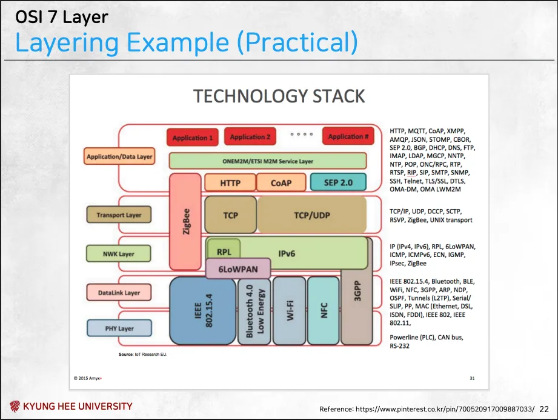

→ 위 그림은 아래 구성

	- **왼쪽의 계층: OSI 7계층을 5개의 실용적인 계층으로 단순화한 모델**
	- **가운데의 기술 블록:** 각 계층에서 사용될 수 있는 실제 프로토콜(기술 이름)을 보여줌
	- **오른쪽의 목록:** 각 계층에 속하는 기술들의 이름을 나열
→ 3GPP는 3계층에 속하지 않는다고 교수님이 말씀하심

## 패러다임의 변화

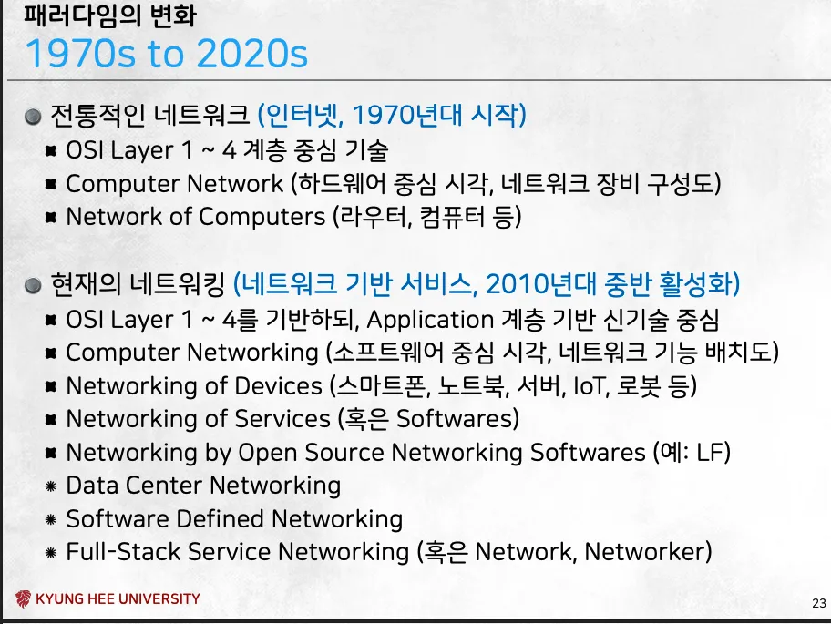

### 전통적 네트워크(1970~2010년대 초)

- OSI L1~4 중심 기술
	→ 어떻게 케이블을 깔고(1계층), 신호를 안전하게 전달하며(2계층), 목적지까지 길을 찾아(3계층), 데이터를 신뢰성 있게 보낼까(4계층)가 최대 과제

- `Network of Computers`
	- 라우터, 컴퓨터 등 **물리적인 장비들을 서로 '연결'하는 것**이 주된 목표

### 현재: 네트워크 기반 서비스 (2010년대 중반~)

- 이미 L1~4는 잘 깔려있으니, 이를 기반해 응용계층 기반 신기술에 중점
	→ 이미 기반은 깔려있으니, 그 위에서 무엇을 잘 제공할지에 집중

- `Networking of Devices`
	- 컴퓨터뿐만 아니라 스마트폰, IoT, 로봇 등 **온갖 종류의 기기**들이 네트워크를 사용
- `Networking of Services(Softwares)`
	- 더 중요한 개념, 이제는 기기가 아닌 **'소프트웨어(서비스)'끼리 통신**
- 데이터 센터 네트워킹, SDN(**Software Defined Networking:** 네트워크 장비의 제어 기능을 소프트웨어로 중앙 집중화하여, 하드웨어로부터 독립시키는 기술), 풀스택 서비스 네트워킹

### → 깨지는 OSI 모델

- **네트워크가 서비스 중심으로 진화하면서 OSI 모델의 경직된 계층 구조가 흐려지고 있다는 관점으로 보임**
- 아래와 같은 경우들이 생기게 됨
	- **계층 통합**: 여러 계층을 하나의 프로토콜이 처리
	- **계층 우회**: 불필요한 계층은 건너뛰기
	- **서비스 최적화**: 각 서비스가 자신만의 네트워크 스택 구성
	- **소프트웨어 정의**: 하드웨어 제약에서 자유로워짐
- 구글의 서비스를 크롬, 안드로이드(구글 산하의 플랫폼)에서 접속하는 경우 더욱 밀결합되어 이런 계층 구조를 흐리게 만들 수 있음
	- 이를 통해 특정 서비스에 대해 더욱 특화된 통신이 가능해짐
***

# Linux Foundation

## Linux Foundation

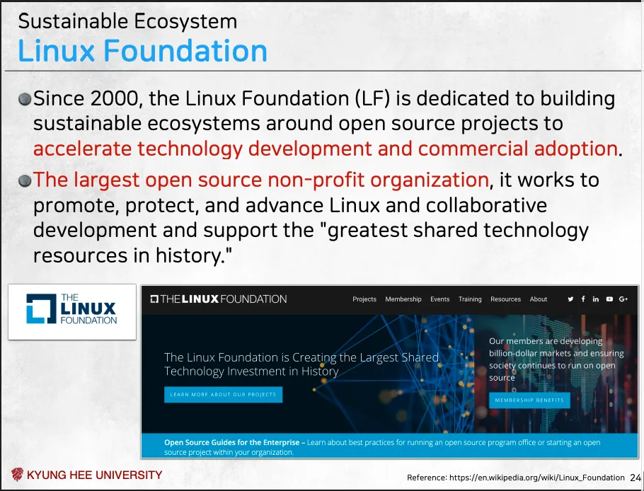

- **초기 목표 ⇒** 리눅스(Linux) 운영체제 커널을 체계적으로 관리하고, 개발하며, 법적으로 보호하는 것이 주된 역할
- **현재 역할 ⇒ **지금은 리눅스뿐만 아니라, **900개가 넘는 핵심 오픈소스 프로젝트**들을 관리하는 거대한 **기술 생태계의 관리자** 역할

### 이 수업과의 연관성(네트워킹과 연관성)

- 모든 통신은 OSI 7Layer, TCP/IP 모델 등을 기반으로 함, 그러나 현재는 패러다임이 전환
- 구글, 넷플릭스, 네이버 등의 거대 서비스는 더 이상 사용자와 1:1 통신만으로 운영 불가
	- 내부에서는 수많은 서버끼리 정보를 주고받으며 협력 ⇒ Server to Server 통신
	- 이런 기술이 집약된 예시 중 하나가 기업체 등에서 운영하는 데이터센터
- 거대 서비스 기업들은 복잡한 문제 해결을 위해 새로운 통신 기술을 직접 개발
	→ ex) 구글 K8S

	- 이런 기업들은 기술을 개발해 리눅스 재단 등의 단체에 기증
	- 특히 '클라우드 환경'에서 서버들을 효율적으로 관리하고 통신하게 하는 기술들이 너무 많아지자, 리눅스 재단은 이 분야를 전문적으로 관리할 산하 재단인 CNCF(Cloud Native Computing Foundation)를 만듬
		→ 이런 기업들은 주로 클라우드, 네트워크 기술에 특화되었기 때문

	- ex) 이런 모든 최신 기술이 실제로 적용되고 운영되는 물리적인 공간이 바로 **데이터센터**
- 클라우드 네이티브한 개발자
	- 수천 개의 CPU(서버)가 서로 어떻게 연결되고 동작하는지를 이해하고 관리할 수 있는 사람을 의미

### CNCF(Cloud Native Computing Foundation)

- 클라우드 관련 기술들은 너무 많고 복잡해서, 리눅스 재단이 직접 관리하기에는 벅찬 수준
	- 이를 위해 산하 재단(CNCF)을 따로 만들어서 관리
- 쿠버네티스가 이 재단의 대표적 프로젝트
- [CNCF Landscape](https://landscape.cncf.io/)
	- 클라우드 네이티브 환경을 구축하는 데 필요한 수많은 오픈소스 기술들의 **지도**
	- 졸업한 프로젝트(크게 표시되는 것들)는 안정성과 성숙도를 인정받은 기술들
