> 원본 Notion 정리 — 강의 슬라이드 이미지 + 설명.

> [← 전체 목차](/posts/풀스택네트워킹-목차/)

***

# HTTP/1.1의 문제점

## HTTP/1.1의 배경
***

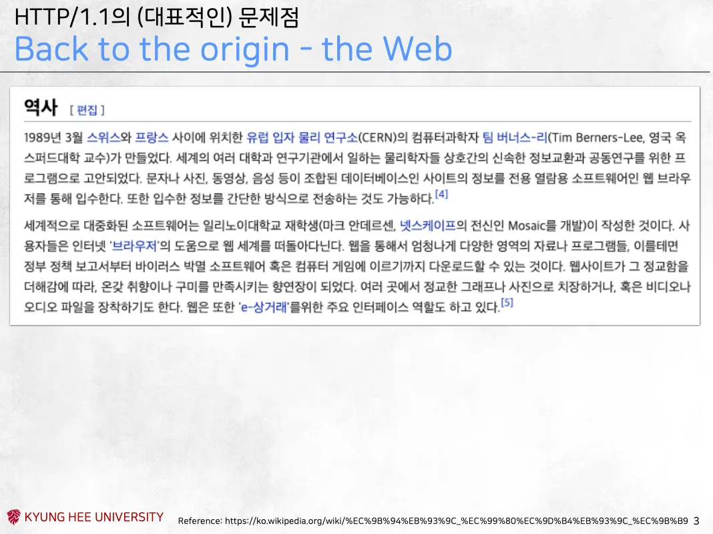


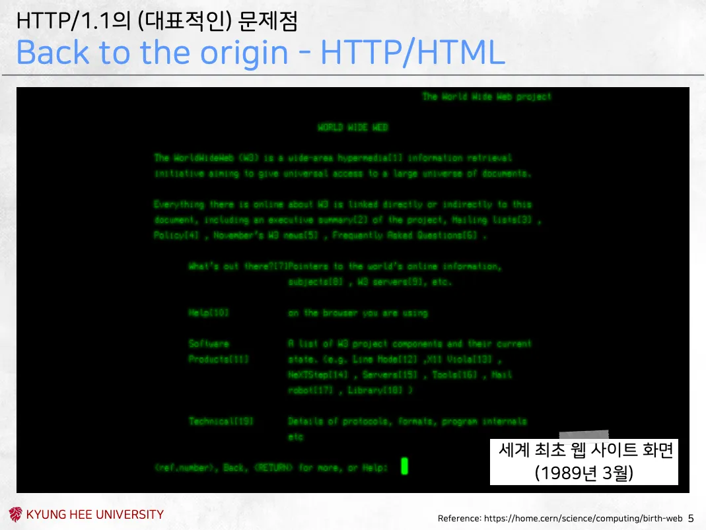


### 1. Web과 HTTP의 기원

- 웹은 팀 버너스 리가 발명했지만, 기술적 개념(하이퍼텍스트)은 이미 존재하던 것
- **창시자:** 1989년 3월, 팀 버너스 리(Tim Berners-Lee)가 제안.
- **개념의 재조립**
	- **하이퍼텍스트(Hypertext)는 이전부터 있던 개념**
		- 대표적으로 애플의 '하이퍼 카드(HyperCard)'가 이미 존재
	- 팀 버너스 리는 이 개념을 인터넷 통신과 결합하여, 연구원들이 논문과 정보를 쉽게 공유하도록 만듬

### 2. 1990년대 한국의 인터넷 상황

- 한국은 미국과 거의 동시에 인터넷 인프라가 깔리고 서비스가 시작
- **타임라인 (1990년대 중반)**
	- 미국에서 웹이 태동하던 시기와 맞물려 한국에도 인터넷망이 깔림
		- **미국과의 도입 시차(Gap)가 거의 없음**
- **주요 사건**
	- 1994년 6월: 한국통신(KT) 'KORNET' 상용 서비스 시작.
	- 1996년: 인터파크, 롯데인터넷백화점 등 e-commerce(전자상거래) 시대 개막.
	- 이후 IMF 외환위기를 거치며 정부 주도의 폭발적인 인프라 확장이 일어남

### 3. HTTP/1.1의 "정상"의 문제화
→ "의도와 다르게 쓰이는 도구"
**⇒ 텍스트 전송용으로 만든 프로토콜을, 20년 뒤 미디어 전송용으로 쓰게 되면서 발생한 구조적 한계가 바로 '웹의 가장 큰 문제'의 원인**

- **예상치 못한 폭발적 성장**
	- 1990년 기준, 이렇게 많은 기업과 사람이 다양한 용도로 인터넷을 쓸 줄은 창시자도 몰랐음
	- 특히 **3.5세대 이동통신과 스마트폰**의 등장은 전 세계 인터넷 트래픽의 성격을 완전히 바꿔놓음
- **현재의 문제점 (The Problem)**
	- **원래 목적:** 단순 텍스트(논문) 공유.
	- **현재 용도:** 긴 맥락 사이로 대용량 **미디어(사진, 영상)를 전송**하는 시대.
	**⇒ 결론:** 이를 목적으로 설계되지 않은 기술(HTTP/1.1)을 억지로 미디어 전송에 사용하고 있는 것이 **웹의 가장 큰 문제**이자 비효율의 원인
		→ 기존 HTTP/1.1 한계에 봉착

## HTTP/1.1의 문제점

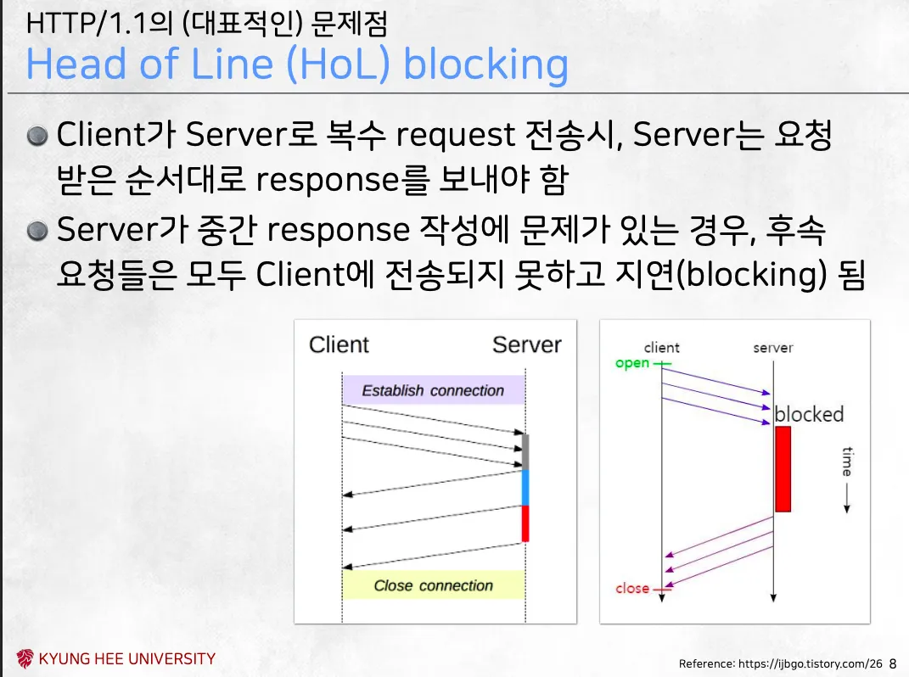

### 1. Head of Line Blocking (HoL Blocking)
→ 라인의 선두 막힘 현상

- HTTP/1.1 은 요청이 온 순서대로 응답을 해야하도록 되어있어, 복수개의 요청이 오면 이를 순서대로 응답
	- HTTP/1.1의 클라이언트는 요청을 연속해서 전송 가능
	- 그러나 HTTP/1.1가 Stateless 프로토콜이라 순서를 섞어서 응답하는 경우 클라이언트가 어떤 응답이 어떤 요청에 대한 응답인지 알 수 없음
		⇒ 따라서 순서대로 응답

- 순서대로 응답하는 동작 때문에, 서버가 중간 응답 작성에 문제가 없는 경우 후속 요청들은 모두 클라이언트에게 응답되지 못하고 블로킹(지연)됨

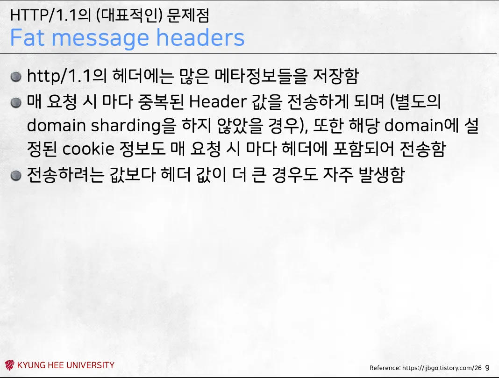

### 2. Fat Message Header

- HTTP/1.1의 헤더에는 많은 메타데이터가 들어감
	- 특히나 모두 인간이 읽을 수 있는 텍스트 기반이기 때문에 더욱 무거움
- 또한 매 요청 마다 중복된 헤더를 전송, 별도의 조치가 없다면 특정 도메인에 대한 쿠키 정보도 매 요청마다 헤더에 포함되어 전송
	→ Domain Sharding

		- 이미지나 CSS 같은 정적 파일은 굳이 로그인 쿠키가 필요 없음
		- 그래서 `static.naver.com` 처럼 **별도의 도메인**을 파서 파일을 저장하면, 메인 도메인(`naver.com`)의 쿠키가 자동으로 따라가지 않아 헤더를 가볍게 만들 수 있음
- 전송하려는 값보다 헤더가 더 큰 경우도 자주 발생

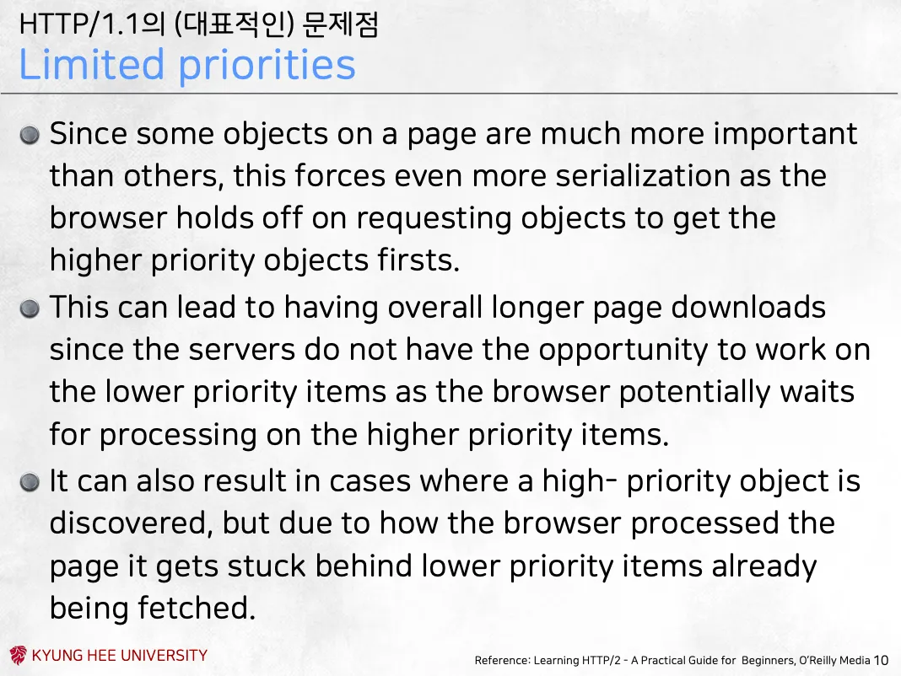

### 3. Limited Priorities (제한된 우선순위 설정)

- HTTP/1.1 에는 별도의 우선순위 제어 기능이 없음
- 따라서 브라우저는 더욱 중요한 요청을 위해 덜 중요한 요청을 일부러 보내지 않는 상황이 발생
	- 이렇게 브라우저가 요청을 보내지 않아 서버는 동작하지 않고 전체 페이지 다운로드 시간이 길어짐
- 요청을 먼저 한 후 중요한 파일이 발견되었을 때 요청을 하면 먼저 요청된 파일 뒤에 막히는 경우가 발생

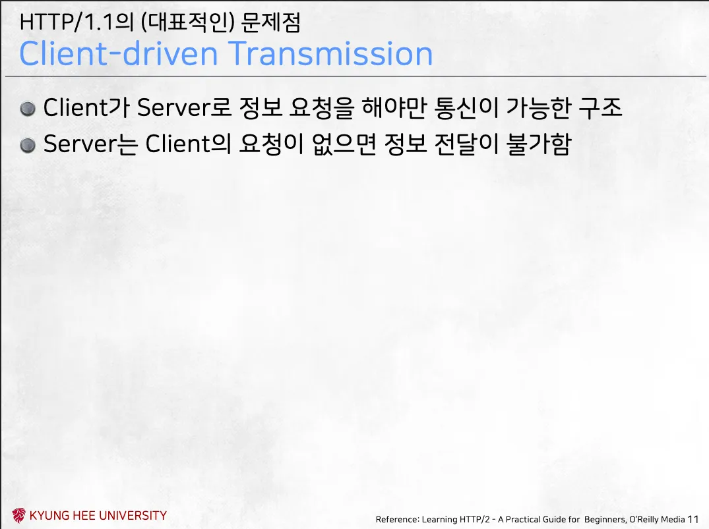

### 4. Client-driven Transmission (클라이언트 주도의 전송 방식)

- HTTP/1.1은 Client가 Server로 정보 요청을 해야만 통신이 가능
	- Server는 Client 요청이 없으면 정보 전달이 불가능 → 아무것도 할 수 없음
- 이로 인해 클라이언트에게 필요한 자원을 미리 밀어주거나 할 수 없음

# HTTP/2의 기원

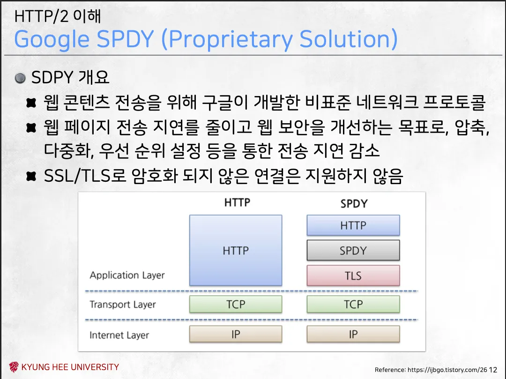

## Google SPDY

- 웹 콘텐츠 전송을 위해 구글이 개발한 비표준 네트워크 프로토콜
- 웹 페이지 전송 지연을 줄이고 웹 보안을 개선하기 위해 압축, 다중화, 우선순위 설정 등을 통한 전송 지연 감소
	1. 압축 → Fat Message Headers 문제 해결, 텍스트로 된 헤더를 압축해서 크기를 줄임
	2. 다중화 → HoL Blocking 문제 해결, 여러 요청을 동시에 보낼 수 있게 함
	3. 우선순위 설정 → Limited Priorities 문제 해결, 우선순위 지정 가능
- TLS 강제 → SPDY는 보안이 옵션이 아닌 필수로 함
- 계층적 구조 → HTTP 밑에 SPDY 계층, 그 아래 TLS, 그 아래 TCP를 넣는 구조

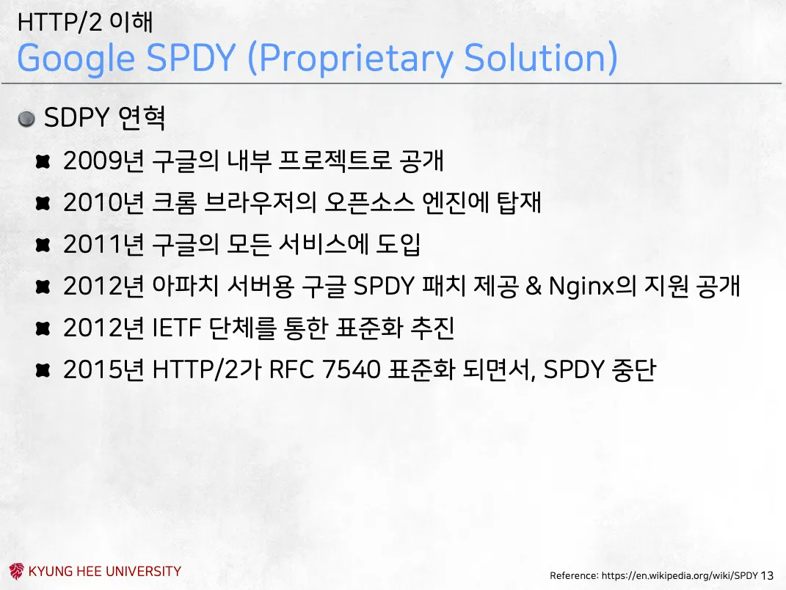

### SPDY 연혁
→ 2009 ~ 2011

	- SPDY는 구글 내부 프로젝트로 공개 후, 크롬 브라우저의 오픈소스 엔진에 탑재, 이후 구글 서비스에 도입
→ 2012

	- 아파치 서버, Nginx에서 SPDY를 지원
	- IETF를 통해 표준화 추진
	→ 구글의 기술이 외부 지원, 표준화 단계
→ 2015

	- HTTP/2가 표준화가 되며 SPDY는 중단
		→ SPDY는 HTTP/2의 모태가 됨

# HTTP/2

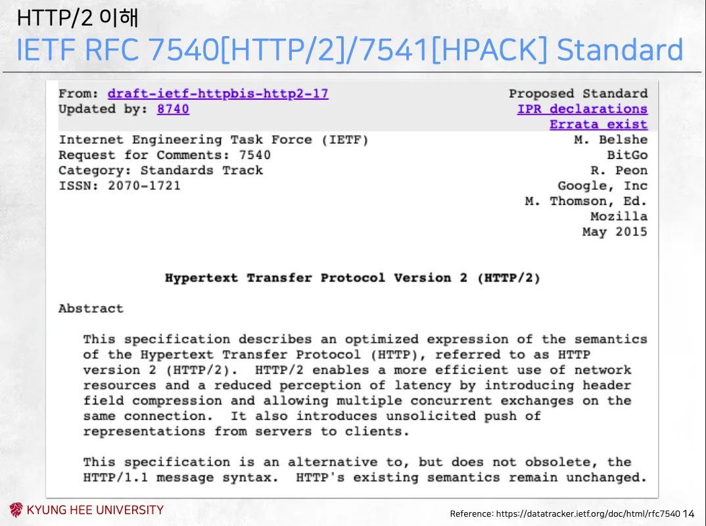

### HTTP/2 관련 RFC문서

- RFC 7540 → HTTP/2 , RFC 2541 → HPACK 으로 HTTP/2가 RFC로 문서화
- Abstract 요약
	- HTTP의 의미는 그대로 두되 표현 방식만 최적화(텍스트 → 바이너리)
	- 헤더 필드 압축을 도입해 지연 시간을 줄임 → HPACK 도입
	- 동일한 연결 상에서 여러 요청을 동시에 주고받을 수 있게 함 → HoL Blocking goruf
	- 클라이언트가 요청하지 않아도 서버가 알아서 데이터를 밀어넣을 수 있음 → 서버 푸시
	- HTTP/1.1에 대한 대안이지만, 이를 폐기하는 것은 아님

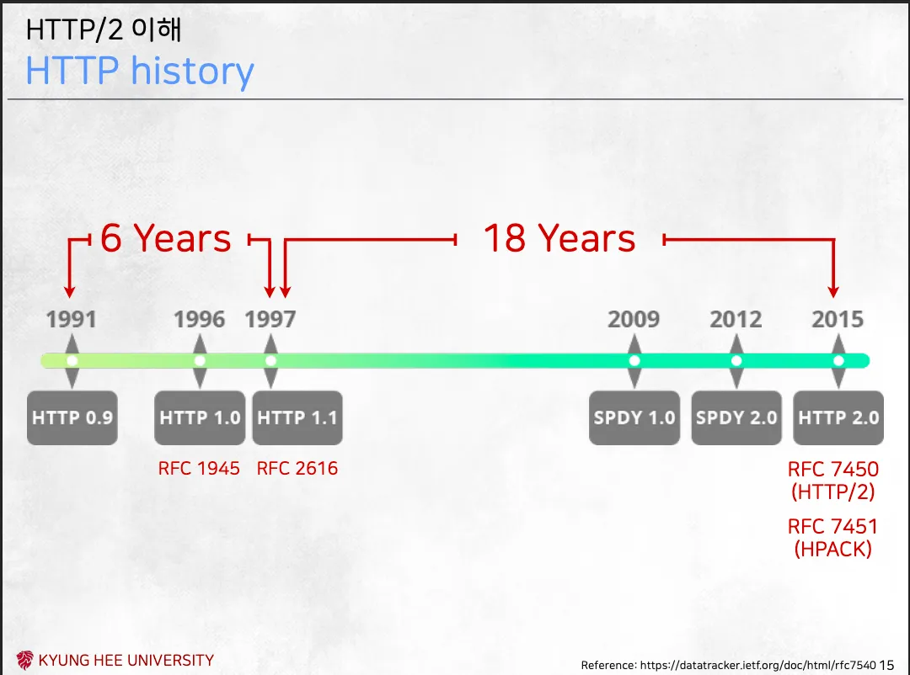

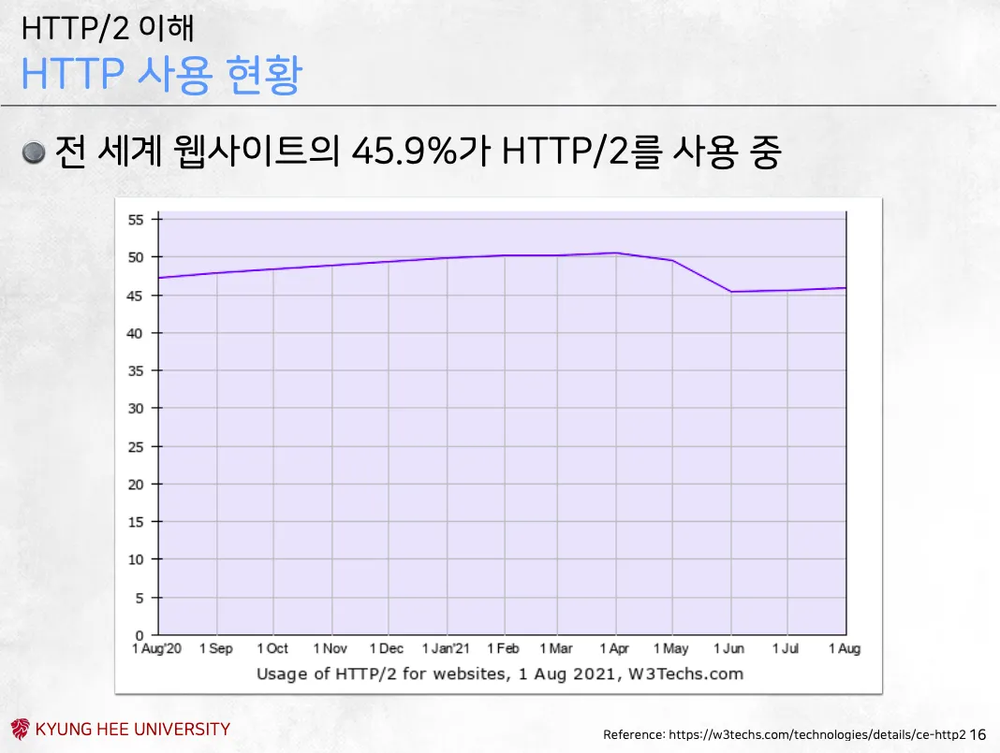

### HTTP/2 사용 현황

- 현재 전 세계 웹사이트의 45.9%가 쓸 정도로 높은 점유율을 보임
- 널리 사용되는 이유
	1. HTTP/1.1을 그대로 사용 가능
		→ HTTP/2는 전송 방식만 수정, 개발자가 사용하는 HTTP메서드, 상태 코드, 헤더 필드 등은 HTTP/1.1과 동일

	2. 암호화를 선택으로 해서 부담이 적음
		- SPDY가 암호화를 필수로 한 것과 달리 HTTP/2는 암호화를 선택으로 함

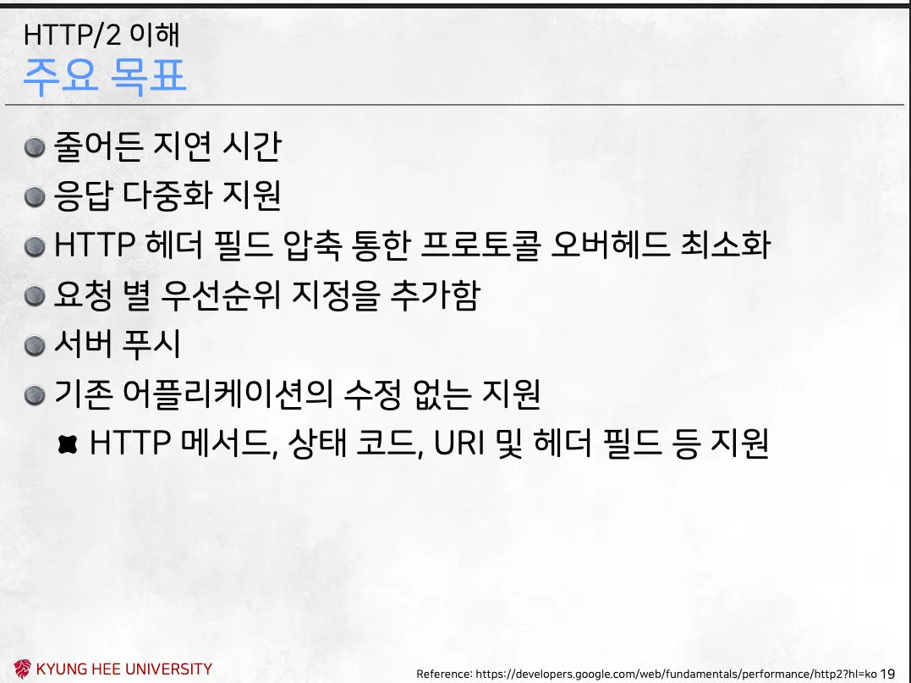

## HTTP/2의 주요 목표

1. 지연시간 감소
	- 응답 다중화, 헤더 필드 압축을 통해 지연 시간을 감소
		→ 그 외에도 여러 방법이 존재하긴 함, 이 두 가지가 대표적

2. 응답 다중화 지원
3. HTTP 헤더 필드 압축
4. 요청 별 우선순위 지정 추가
	- 무엇을 먼저 보낼 지 결정 가능
	- 이를 통해 요청 별로 클라이언트가 우선순위를 매기면 서버는 이를 멀티 큐를 활용해 중요한 데이터를 먼저 처리
5. 서버 푸시
	- 클라이언트 요청 없이 서버가 리소스를 전송
6. 기존 애플리케이션의 수정 없는 지원
	- 기존 HTTP/1.1의 메서드, 상태 코드, URI 및 헤더 필드 등 지원

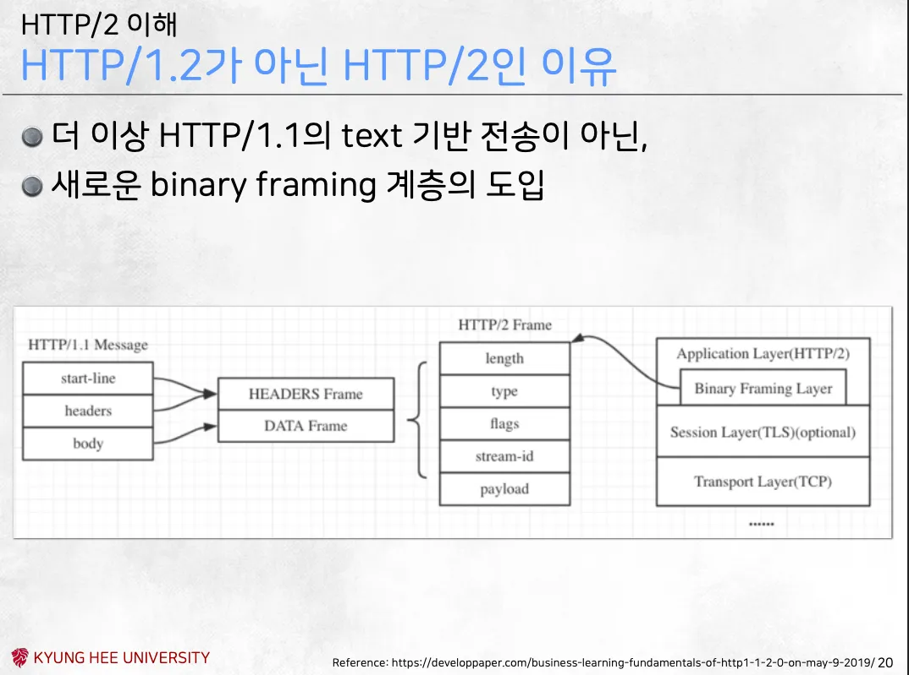

### HTTP/2로 메이저 버전이 오른 이유

- 텍스트에서 바이너리로 전송 방식을 변화
	- HTTP/1.1 → 사람이 읽을 수 있는 텍스트 형태로 데이터 전송
	- HTTP/2 → 컴퓨터가 처리하기 쉬운 바이너리 형태로 전송
		→ 따라서 전송 방식 자체가 바뀌어 메이저 버전이 오름

- Length 필드의 중요성
	- 텍스트 프로토콜과 달리 가변 길이의 바이너리 이므로, 어디까지 읽을지 결정

# HTTP/2의 이해

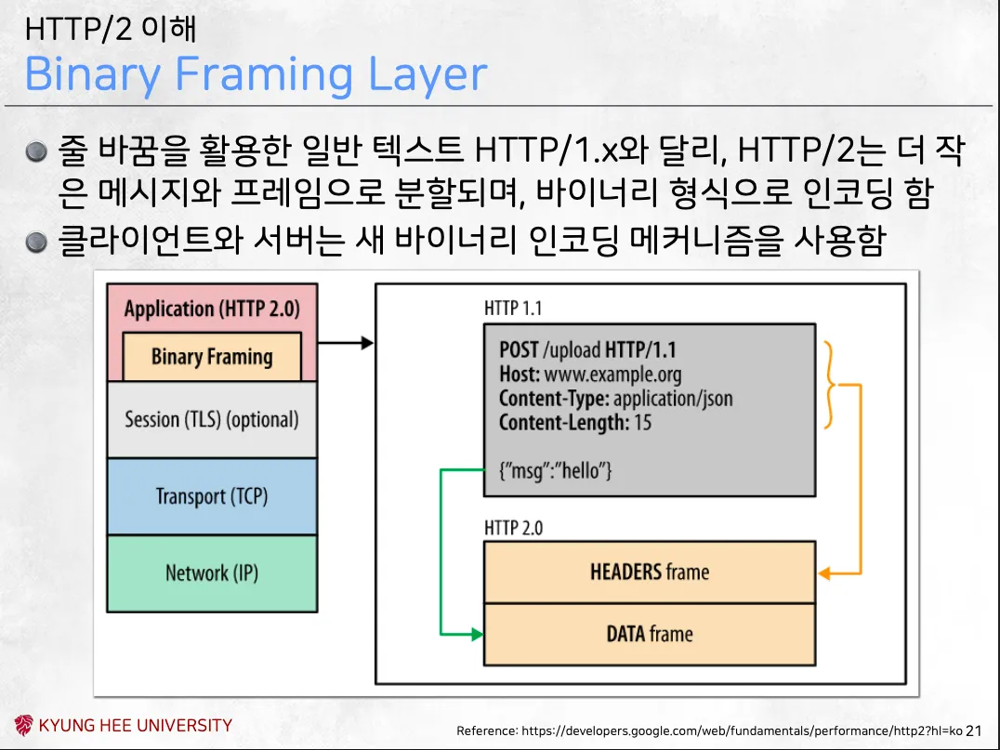

## Binary Framing Layer

- HTTP/1.1
	- 줄 바꿈을 활용한 일반 텍스트 기반의 프로토콜
	- 사람이 읽을 수 있는 텍스트로 되어있고, 줄 바꿈 문자로 데이터의 끝을 구분
- HTTP/2
	- 더 작은 메시지와 프레임으로 분할되어, 바이너리 형식으로 인코딩
	- HTTP/2 클라이언트, 서버는 새로운 바이너리 인코딩 메커니즘을 사용
→ 그림 설명

	- Application Layer 아래에 바이너리 프레이밍 계층이 존재
		→ 기존의 애플리케이션 영역은 그대로 두고 데이터를 네트워크로 보내기 전 포장하는 방식만 바이너리로 바뀜

	- HTTP/1.1의 헤더는 헤더 프레임, 바디는 데이터 프레임 등으로 변환

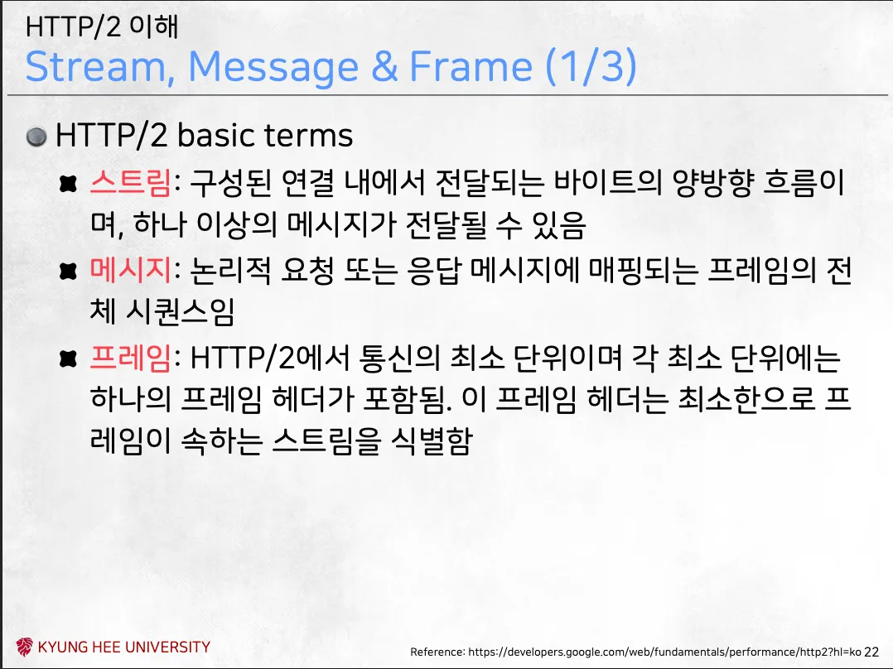

## HTTP/2의 기본 용어

1. 스트림
	- 구성된 연결 내에서 전달되는 바이트의 양방향 흐름
	- 하나 이상의 메시지가 전달될 수 있음
2. 메시지
	- 논리적 요청 또는 응답 메시지에 매핑되는 프레임의 전체 시퀀스
		→ ex) 요청 하나 == 메시지 하나

3. 프레임
	- HTTP/2에서 통신의 최소 단위
	- 각 최소 단위에는 하나의 프레임 헤더가 포함
	- 이 프레임 헤더는 최소한으로 프레임이 속하는 스트림을 식별
→ Stream \> Message \> Frame의 순서

	- **Connection (TCP 연결):** 가장 바깥쪽의 물리적 도로 (1개)
	- **Stream (스트림):** 도로 위의 논리적인 통로(여러 개, ID로 구분)
	- **Message (메시지):** 스트림 위의 논리적인 요청/응답 단위
	- **Frame (프레임):** 메시지를 구성하는 단위 (가장 작은 전송 단위).
→ 프레임 헤더

	- 각 프레임에 붙어있는 고정 크기의 영역
	- 이 헤더에는 스트림 식별자가 존재 → 어떤 스트림, 메시지의 것인지 구분 가능
		→ 스트림 하나는 하나의 요청-운반 사이클을 운반하므로 그러함
		→ 요청-응답 한번 또는 하나의 웹소켓 연결은 하나의 스트림을 점유

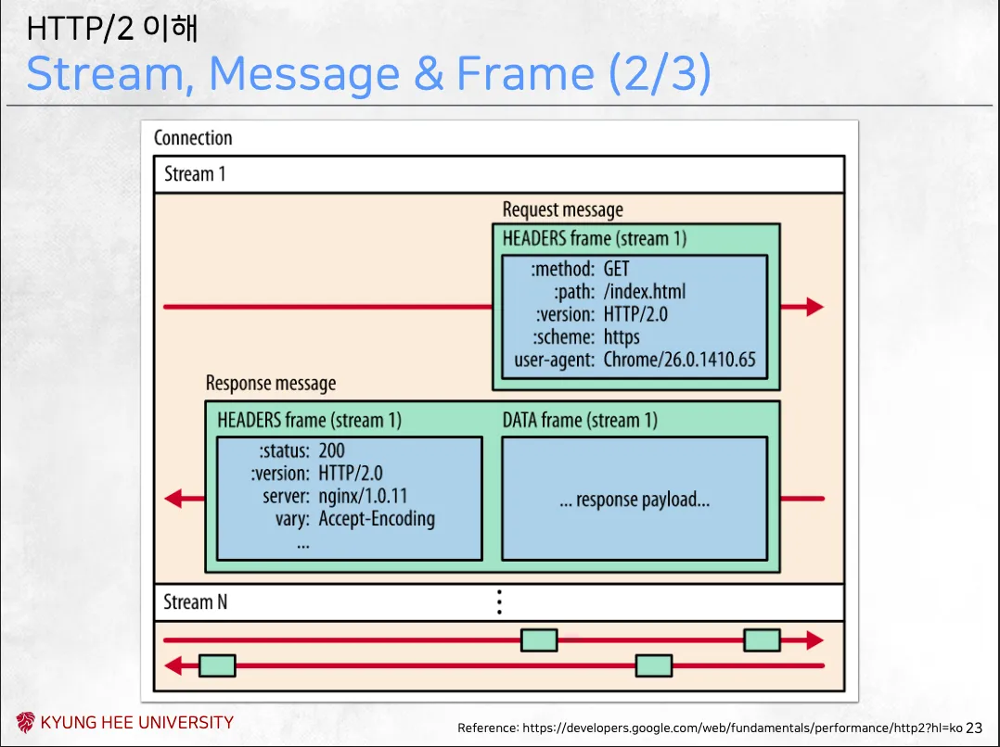

→ 그림 설명

	1. Connection → 전체를 감싸는 하나의 연결
	2. Stream → Connection 내부에 존재하는 여러 개의 논리적 스트림(N개)
	3. Request message, Response message
		→ 요청, 응답의 메시지

		- 내부에 각각의 프레임이 존재
- 하나의 TCP연결(Connection)에 여러 논리적인 줄(Stream)을 두는 방식
	- Multiplexing
	- 기존 HTTP/1.1에서는 속도를 높이기 위해 여러 TCP를 사용해 다중 전송을 함
	- HTTP/2는 하나의 TCP연결 안에서 Multiplexing을 통해서 다중 전송
		→ 기존 여러 TCP커넥션을 유사한 컨셉으로 하나의 TCP커넥션에 여러 스트림을 사용하게 함

- 요청, 응답 컨셉은 HTTP/1.1과 동일하게 여전히 존재

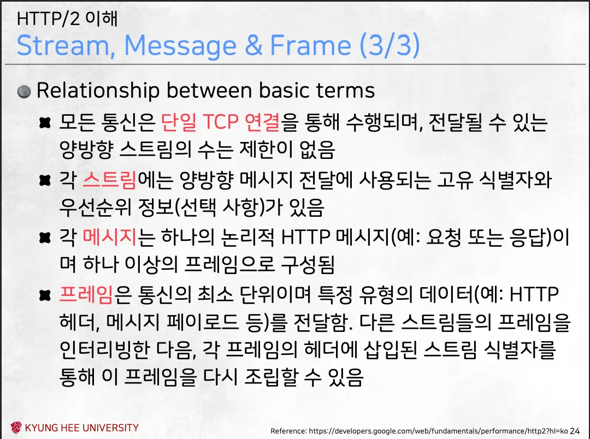

### Connection, Stream, Message, Frame 사이 관계

- **모든 통신은 단일 TCP 연결을 통해 수행되며,** 전달될 수 있는 양방향 스트림의 수는 제한이 없음
- **각 스트림에는** 양방향 메시지 전달에 사용되는 고유 식별자와 우선순위 정보(선택 사항)가 있음
- **각 메시지는** 하나의 논리적 HTTP 메시지(예: 요청 또는 응답)이며 하나 이상의 프레임으로 구성됨
- **프레임은** 통신의 최소 단위이며 특정 유형의 데이터(예: HTTP 헤더, 메시지 페이로드 등)를 전달함. 
	- 다른 스트림들의 프레임을 인터리빙(Interleaving, 끼워넣기)한 다음, 각 프레임의 헤더에 삽입된 스트림 식별자를 통해 이 프레임을 다시 조립할 수 있음

### **프레임으로 쪼개는 이유**

- **블로킹(Blocking) 방지**
- 데이터 프레임, 메시가 큰 경우 이를 더 작은 프레임으로 쪼갬
- 큰 것을 쪼개서 블로킹을 일으키지 않게 함
- **ex)**
	- **문제 (HTTP/1.1):** 만약 100MB짜리 큰 파일을 다운로드하는 요청이 먼저 시작되면, 그 뒤에 있는 아주 작은 1KB짜리 텍스트 요청은 앞선 파일이 다 끝날 때까지 기다려야 함
		- Head-of-Line Blocking
	- **해결 (HTTP/2):** HTTP/2는 큰 데이터(Body)를 `DATA Frame`이라는 작은 단위로 잘게 쪼갬
	- **효과**
		- 100MB 파일의 프레임 하나를 보내고, 그 사이에 1KB 텍스트의 프레임을 **'끼워 넣기(Interleaving)'** 할 수 있음
		⇒ 결과적으로 큰 데이터가 길을 막지 않아 전체적인 지연 시간(Latency)이 줄어듬

### **단일 연결과 논리적 스트림**

- **단일 TCP 연결:** HTTP/2는 웹사이트에 접속할 때 **TCP 연결을 딱 하나만** 맺음
- **스트림 (논리적 줄):** 대신 그 연결 안에서 '스트림(Stream)'이라는 가상의 줄을 무수히 많이 만듬
- **조립**
	- 각 프레임에는 "나는 1번 스트림 소속이야", "나는 3번 스트림 소속이야"라는 식별자(Stream ID)가 붙어 있음
	- 수신 측은 뒤섞여서 들어오는 프레임들을 이 ID를 보고 다시 원래의 메시지로 완벽하게 조립

# 요청 및 응답 다중화

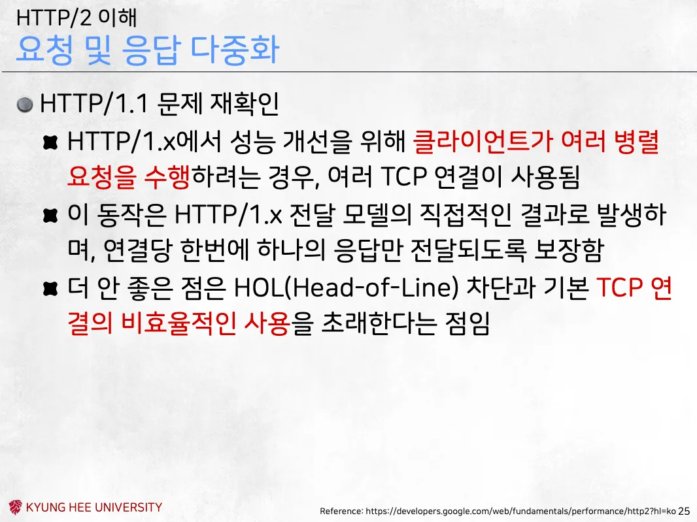

## 기존 HTTP/1.1의 문제

- HTTP/1.1은 성능 개선을 위해 클라이언트가 여러 병렬 요청을 사용하는 경우 여러 TCP연결이 사용
	- 하나의 연결이 하나의 요청-응답 사이클만 책임지기 때문
⇒ 위와 같은 HTTP/1.1의 전송 모델의 특징으로 인해 연결 당 하나의 요청-응답만 전달되도록 보장하고, 이 때문에 성능 개선에 여러 TCP연결이 필요

- 이로 인해 Head of Line Blocking과 기본 TCP연결의 비효율적 사용을 초래

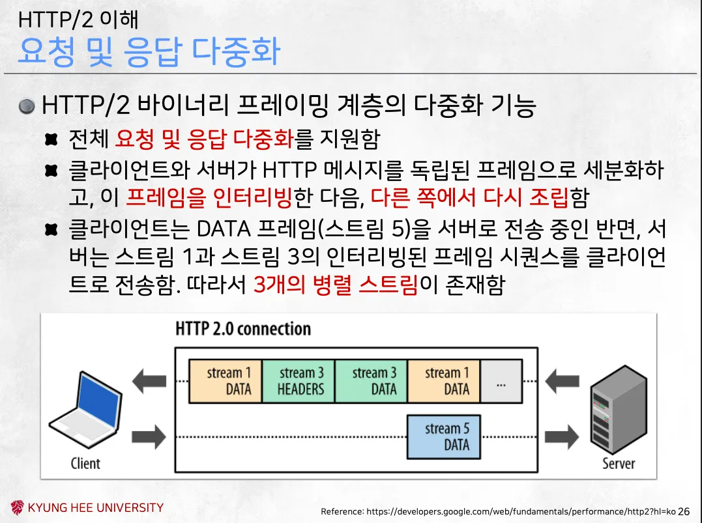

## HTTP/2 바이너리 프레이밍 계층의 다중화 기능
→ HTTP/2는 바이너리 프레이밍 계층을 도입해 이 문제를 해결

- HTTP/2는 전체 요청 및 응답에 다중화를 지원
- 클라이언트, 서버가 각각 아래 동작을 수행
	- HTTP 메시지(요청 또는 응답)를 독립된 프레임으로 세분화
	- 프레임을 인터리빙 → 쪼개진 조각을 순서에 무관하게 섞어서 보냄(각각 사이사이에 끼워넣음)
	- 받은 쪽에서 이를 재조립(Stream ID를 통해 각 프레임을 식별)
	→ 이 과정이 단일 TCP연결에서 이뤄짐
⇒ 위 다중화 및 인터리빙 기법으로 **HOL Blocking 해결**

	- ex) 용량이 큰 이미지(요청 A)가 전송되는 중간중간에 가벼운 텍스트(요청 B) 조각들이 끼어들어 먼저 도착할 수 있음
→ 위 그림 설명

	- 클라이언트는 Stream 5에 속하는 데이터 프레임을 서버로 전송
	- 서버는 Stream 1, Stream 3의 프레임을 순서에 무관하게 인터리빙해서 클라이언트로 전달
	⇒ 총 3 개의 스트림이 동시적으로 동작하는 것

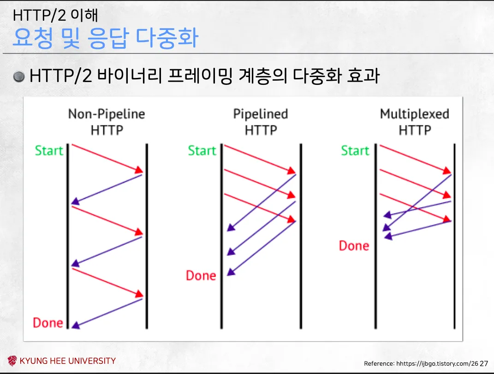

## HTTP 방식에 따른 전송 효과

### 1. Non-Pipeline HTTP
→ HTTP/1.0의 방식

- 요청을 보내고 응답을 받고 나서 다음 요청을 보내는 방식
- 네트워크 지연 시간이 매우 김

### 2. Pipelined HTTP
→ HTTP/1.1에서 개선 시도

- 응답을 기다리지 않고 여러 요청을 연속적으로 보냄
- 이후 서버는 요청을 처리해 요청 순서대로 응답
	→ HTTP의 Head of Line 블로킹을 일으킴

### 3. Multiplexed HTTP
→ HTTP/2의 동작 방식

- 요청을 각자가 무관하게 서버로 전송
- 서버는 이를 처리하고 요청 순서와 무관하게 전송
- 각 요청이 병렬적으로 처리됨, Http의 Head of Line 블로킹 방지

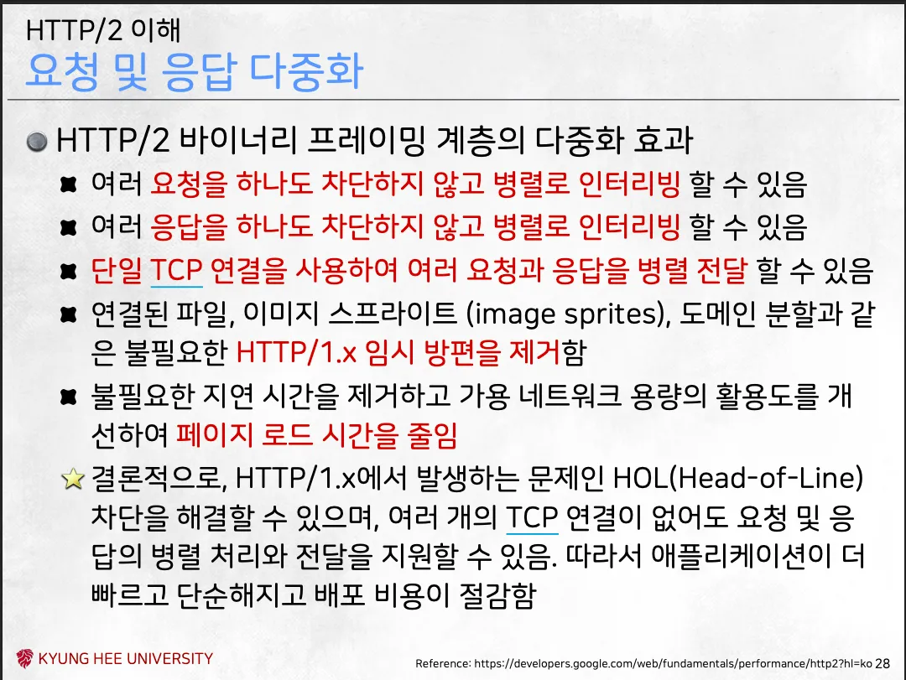

### HTTP/2 바이너리 프레이밍 계층의 다중화 효과

- **인터리빙(Interleaving) 지원**
	- 요청과 응답을 잘게 쪼개서(프레임), 서로 섞어서 보낼 수 있음
	→ ex) "큰 파일 하나가 길을 막고 있어도, 작은 파일들이 그 사이사이로 지나갈 수 있다"는 뜻

- **단일 TCP 연결 사용**
	- HTTP/1.1 시절에는 속도를 높이려고 브라우저가 도메인당 6개 정도의 TCP 연결을 억지로 뚫었지만,
	- HTTP/2는 **연결 하나만으로도 여러 요청과 응답을 병렬 전달 가능**
		- **단일 TCP연결로도 충분히 빠름**
		- 네트워크 부하가 줄어듬
- **HTTP/1.x에서 사용한 꼼수(Hack) 제거**
	- **이미지 스프라이트:** 아이콘 여러 개를 이미지 한 장으로 합치는 기술.
	- **도메인 분할:** 연결 개수 제한을 피하려고 `img1.com`, `img2.com` 처럼 도메인을 여러 개 쓰는 기술.
	- HTTP/2에서는 요청 오버헤드가 작고 병렬 처리가 잘 되므로, **개발자가 이런 귀찮은 최적화 작업을 더 이상 하지 않아도 됨**
⇒ 결론적으로 

	- HTTP/1.1의 문제인 Head of Line Blocking을 해결
	- 여러 TCP연결 없이도 요청, 응답의 병렬처리와 전달 가능
	⇒ 이로 인해 애플리케이션이 더 빠르고 단순, 배포 비용 절감

# 스트림 우선 순위 지정

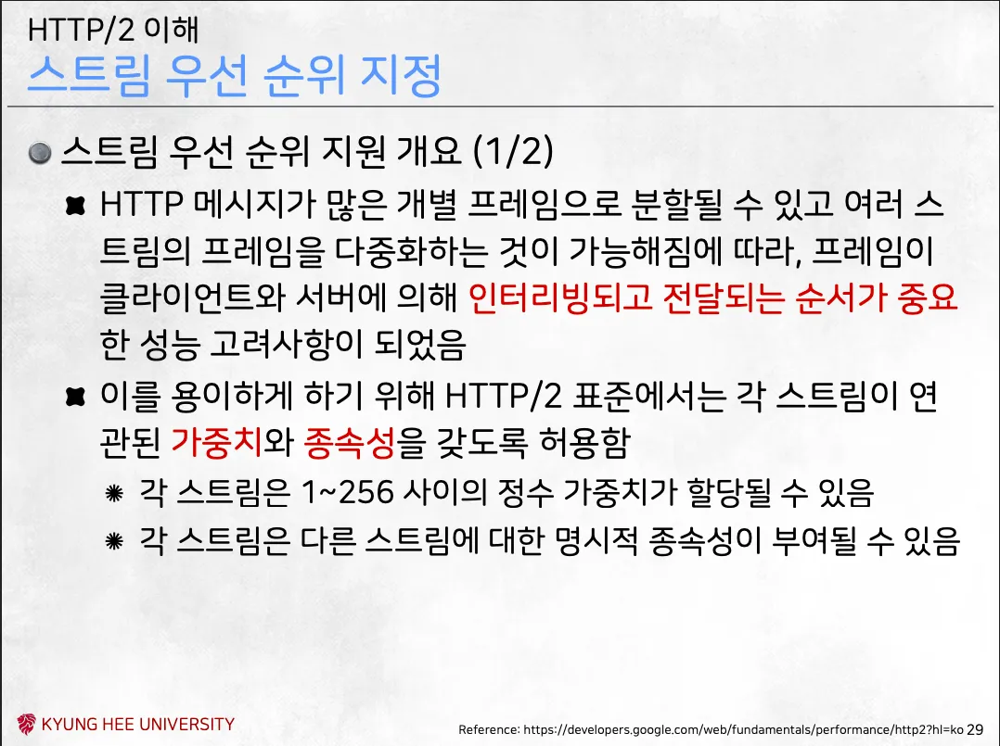

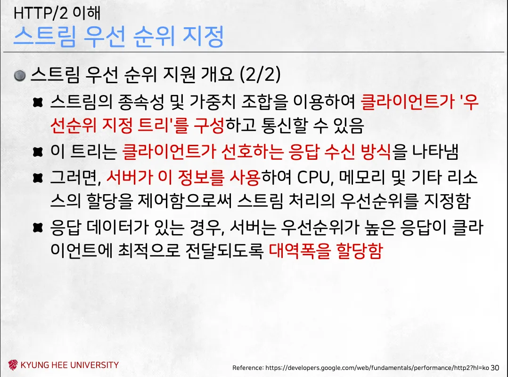

## 스트림 우선순위 지원 개요

### 스트림 우선 순위 지원의 이유

- HTTP메시지가 많은 개별 프레임으로 분할될 수 있고 여러 스트림의 프레임을 다중화하는 것이 가능
→ 프레임이 클라이언트, 서버에 의해 인터리빙되고 전달되는 순서가 중요한 성능 고려사항이 됨

### 스트림 우선 순위 지원의 개요

- 스트림 우선순위 지원을 위해 HTTP/2 표준에서 스트림이 연관된 가중치, 종속성을 갖도록 허용
	- 가중치 → 각 스트림은 1~256 사이 정수 가중치 할당 가능
	- 종속성 → 각 스트림은 다른 스트림에 대한 명시적 종속성 부여 가능

### 스트림 우선 순위 지원 방식 개요

- 스트림의 종속성, 가중치 조합으로 클라이언트가 우선순위 지정 트리를 구성하고 통신 가능
	- 우선순위 지정 트리는 클라이언트가 선호하는 응답 수신 방식을 나타냄
	→ 이를 서버로 전송

- 서버가 우선순위 지정 트리의 정보를 사용해 CPU, 메모리, 대역폭 등의 리소스 할당을 제어해 스트림 처리의 우선순위를 지정
- 응답 데이터가 있는 경우, 서버는 우선순위가 높은 응답이 클라이언트에 최적으로 전달되게 대역폭을 할당

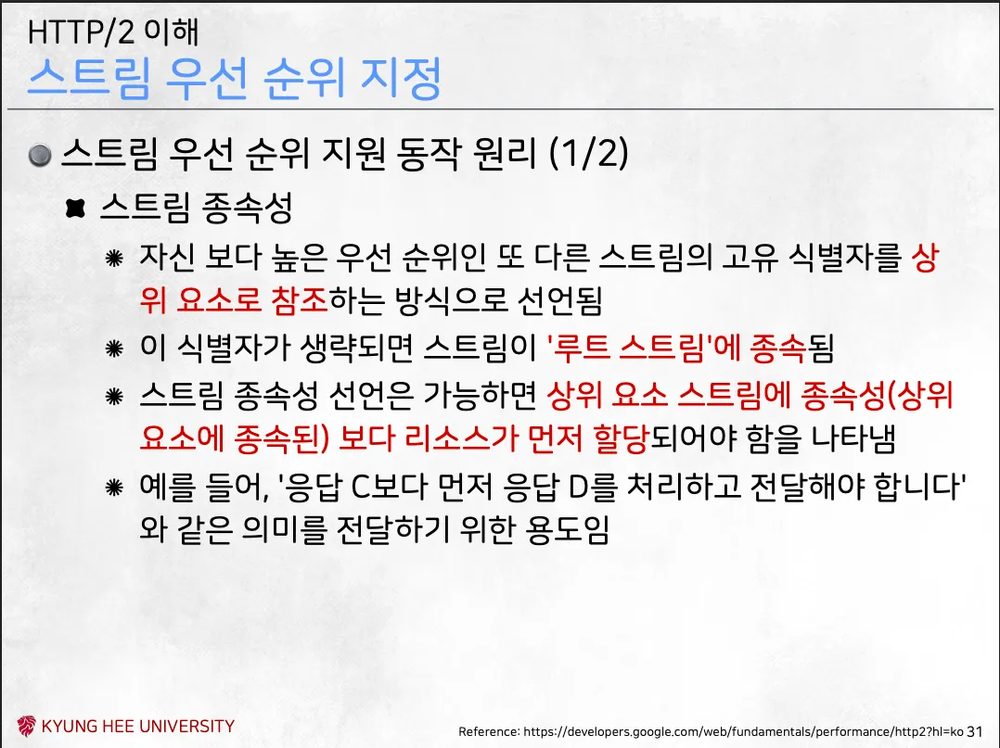

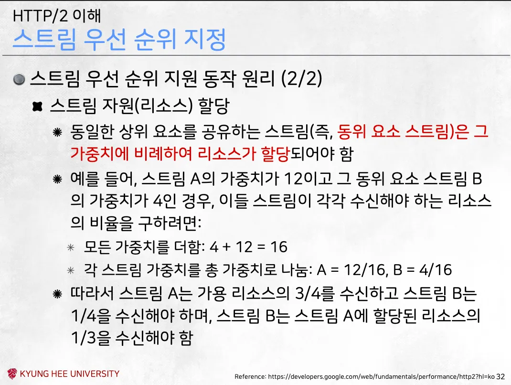

## 스트림 우선 순위 지원 동작 원리

### 스트림 종속성

- 자신보다 높은 우선순위의 또 다른 스트림의 식별자를 상위 요소로 참조하는 방식으로 선언
	→ 일종의 부모-자식 관계, 자신이 의존할 스트림의 ID를 지정

- 이 식별자 참조가 없는 경우 루트 스트림에 종속
- 스트림 종속성 선언은 가능하면 상위 요소 스트림에 리소스를 먼저 할당되어야 함을 나타냄
	→ 스트림A가 스트림B에 종속(스트림B가 A의 식별자를 지정)된 경우, 스트림 A가 가능하면 스트림 B보다 먼저 리소스를 할당받아야함

### 스트림 가중치(→ 스트림 자원 할당)

- 동일한 상위 요소를 가지는 스트림(⇒ 동위 요소 스트림)은 그 가중치에 비례해 리소스가 할당되어야 함
- ex) 스트림 A, 스트림 B, 스트림 C가 있고 B, C가 A에 종속된 경우
	- 스트림 B의 가중차기 12, C의 가중치가 4인 경우
	- B와 C는 동위 요소 스트림이므로
	- B는 12/16, C는 4/16만큼의 리소스를 할당받아야 함
		→ C는 B보다 1/3만큼의 리소스를 받게 됨

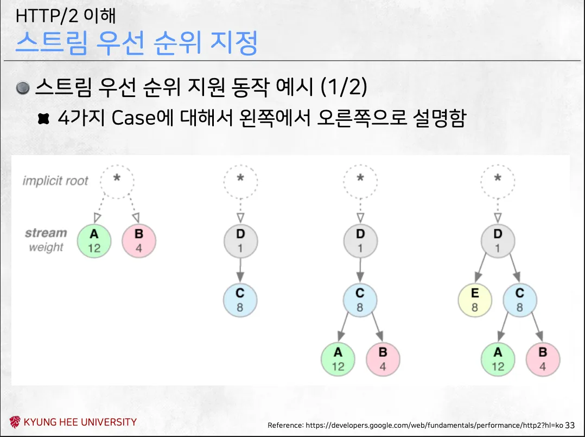

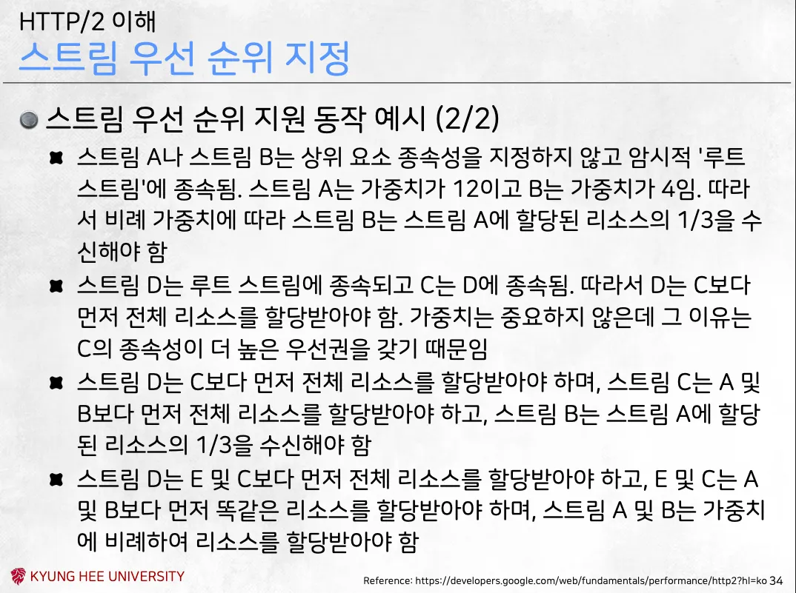

## 스트림 우선 순위 지원 동작 예시

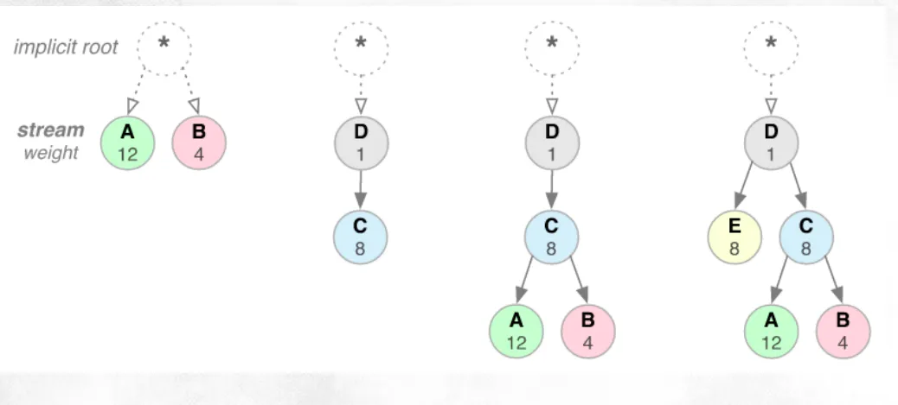

### 첫 번째 트리

- 스트림 A나 스트림 B는 상위 요소 종속성을 지정하지 않고 암시적 '루트 스트림'에 종속
- 스트림 A는 가중치가 12이고 B는 가중치가 4
	- 따라서 비례 가중치에 따라 스트림 B는 스트림 A에 할당된 리소스의 1/3을 수신해야 함
		→ 12/16, 4/16 → A가 B보다 3배, B가 A보다 1/3만큼 수신

### 두 번째 트리

- 스트림 D는 루트 스트림에 종속, C는 D에 종속
- 따라서 D는 C보다 먼저 전체 리소스를 할당받아야 함
- 이때 C가 D에 종속하므로 가중치보다 종속성을 먼저 따지므로, 가중치는 중요하지 않음

### 세 번째 트리

- 스트림 D는 루트 스트림에 종속, C는 D에 종속, A와 B는 C에 종속
- 스트림 D는 C보다 먼저 전체 리소스를 할당받아야 하며
	- 스트림 C는 A와 B보다 먼저 전체 리소스를 할당받아야 하고,
	- 스트림 B는 스트림 A에 할당된 리소스의 1/3을 수신해야 함
→ 종속성을 먼저 따지고 동위인 경우 가중치를 따짐

### 네 번째 트리

- 스트림 D는 루트 스트림에 종속, C와 E는 D에 종속, A와 B는 C에 종속
- 스트림 D는 E 및 C보다 먼저 전체 리소스를 할당받아야 하고, 
	- E 와 C는 A와 B보다 먼저 똑같은 리소스를 할당받아야 하며,
		- 이때 E와 C는 가중치에 비례해 리소스를 할당받고
	- 그 다음 스트림 A와 B는 가중치에 비례하여 리소스를 할당받아야 함

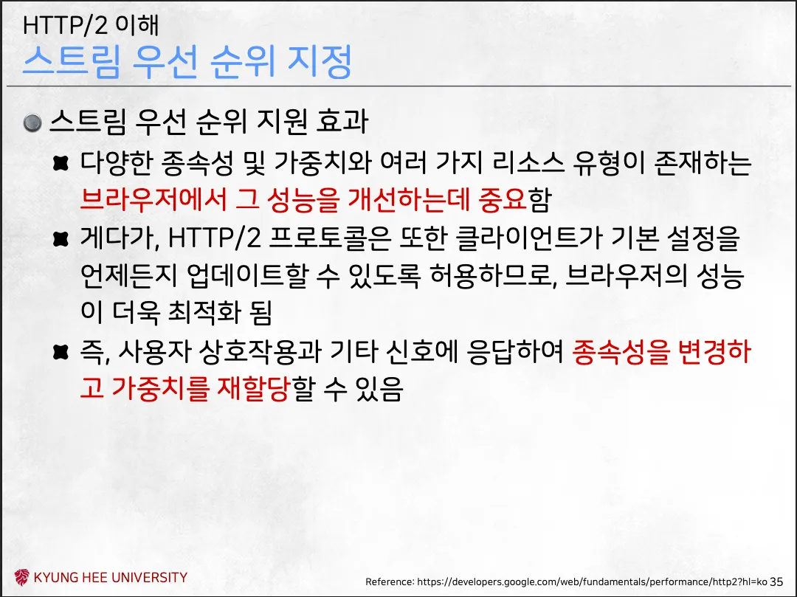

## 스트림 우선 순위 지정 효과

- HTTP/2의 스트림 우선 순위 지정 방식은 다양한 종속성 및 가중치, 여러가지 리소스 유형이 존재하는 브라우저에서 성능을 개선하는데 유용
- HTTP/2는 클라이언트가 기본 설정을 상시 업데이트할 수 있도록 하므로, 브라우저 성능을 동적으로 더욱 최적화 가능
	- 사용자 상호작용, 기타 신호에 응답해 종속성과 가중치를 변경 가능
**ex) 이는 웹의 DOM트리는 루트부터 렌더링되며, 이를 표현하기 위해 DOM트리와 유사한 우선순위 트리를 통해상위 요소부터 데이터를 받아 처리하게 할 수도 있음**

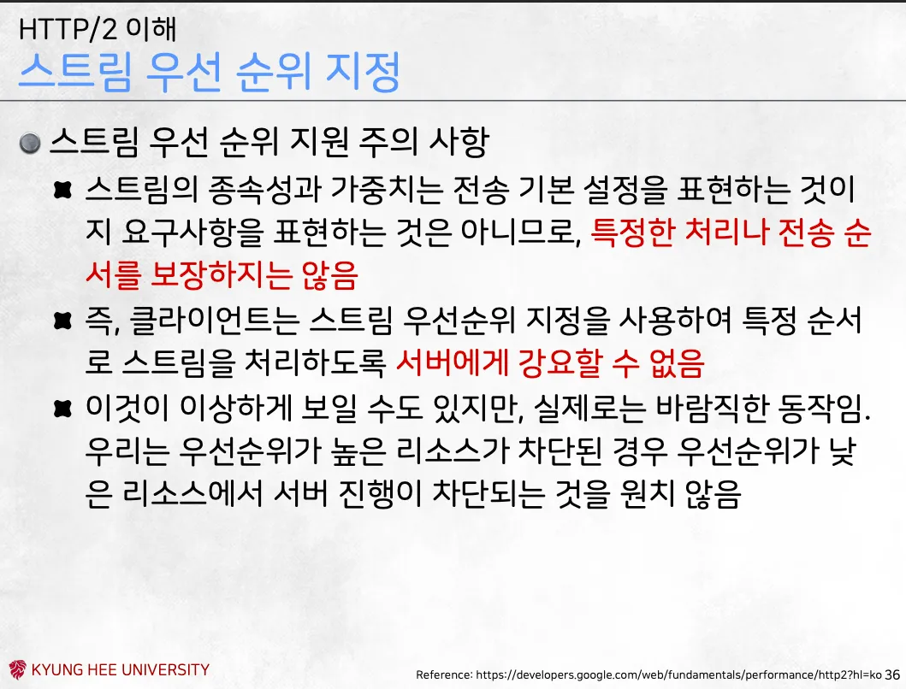

## 스트림 우선순위 지원 주의사항

- 스트림의 종속성, 가중치를 기반으로 한 우선순위는 전송의 기본 설정을 표현하는 것일 뿐, 요구사항을 표현하는 것은 아님
	- 따라서, 특정한 처리나 전송 순서를 보장하지는 않음
- 클라이언트는 스트림 우선순위 지정을 통해 서버에서 처리 순서를 강요할 수 없음
	- 이는 단순히 “가능하면 이렇게 해달라”는 의미
- 만일 강제라면, 1순위 데이터 처리 중 블로킹이 일어나면 2순위 데이터 처리도 동시에 블로킹 되는 등의 현상으로 인해 성능이 떨어짐
	- 이것이 강제가 아니므로, 서버는 1순위 처리 중 블로킹이 일어나면, 비는 시간 동안 2순위를 처리해 처리 효율을 높일 수 있음

# One connection per origin
→ One TCP Connection per Origin

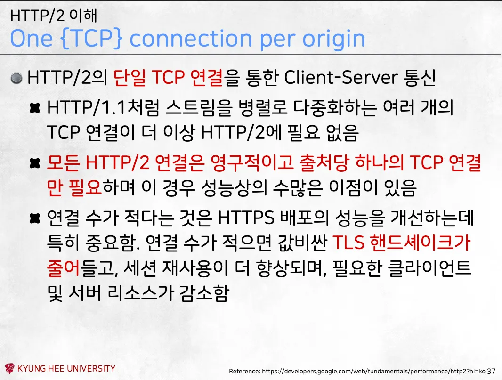

### HTTP/1.1과의 비교

- 기존 HTTP/1.1은 스트림을 병렬로 다중화하기 위해 여러 TCP연결을 사용
- HTTP/2는 병렬 스트림을 위해 하나의 TCP연결만 사용하면 됨

## HTTP/2의 Origin 하나 당 하나의 연결 정책

- HTTP/2 연결은 Origin 당 1개의 TCP연결만 맺음
- 이 하나의 연결 안에서 수많은(수십, 수백) 요청을 다중화해서 전송

### 단일 TCP연결 정책의 효용 

- TCP연결은 하나만 유지할 경우 성능상 많은 이점을 얻을 수 있음
- 연결 수가 적으면 아래 효용이 증가
	- HTTPS의 경우 값비싼 TLS 핸드셰이크가 줄어듦
	- 세션 재사용성은 향상
	- 필요한 클라이언트 및 서버 리소스가 감소

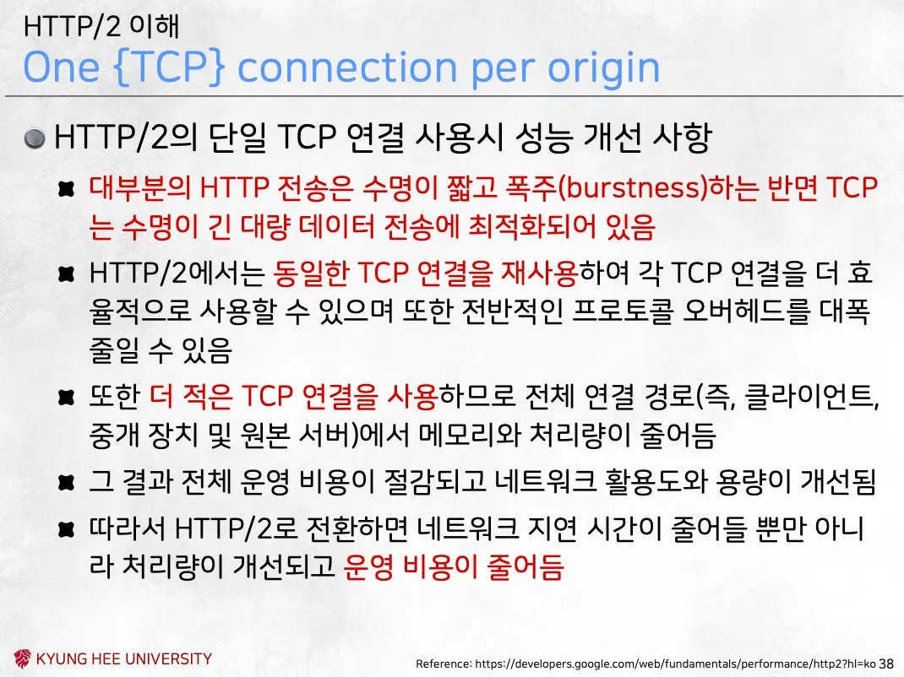

## HTTP/2의 단일 TCP연결 사용 시 성능 개선 사항

1. TCP와 HTTP의 특성 차이 극복
	- HTTP는 짧고, 간헐적으로 데이터가 폭주(Burst)하는 특성이 있음
	- TCP는 연결을 오래 유지하고 대용량 데이터를 보낼 때 효율이 높아지도록 설계
2. 프로토콜 오버헤드 감소
	- 기존 HTTP/1.1 처럼 매번 연결을 맺고 끊는 경우 3-way handshake같이 연결을 맺고 끊는 과정을 반복해 불필요한 통신이 낭비
	- HTTP/2는 동일한 TCP연결을 재사용해, 불필요한 통신 낭비가 감소
3. 시스템 리소스 절약
	- 더 적은 TCP연결을 사용해, 전체 연결 경로에서 메모리, 처리량이 감소
		- 클라이언트, 중개 장치(프록시), 원본 서버의 시스템 리소스를 절약
⇒ 결과적으로 

	- 전체 운영 비용 절감, 네트워크 활용도와 용량이 개선
	- HTTP/2로 전환 시 네트워크 지연 시간이 감소할 뿐만 아니라 처리량이 개선되고 운영 비용이 감소

# 흐름 제어

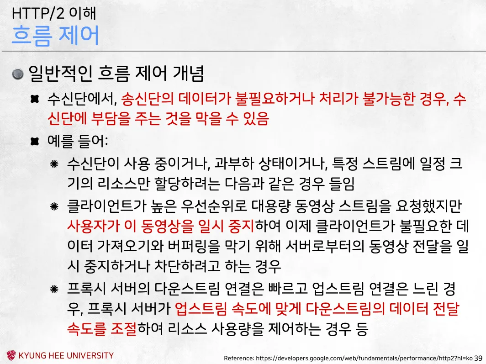

## 일반적인 흐름 제어 개념

- 수신단이 송신단에서 보내는 데이터가 불필요하거나 처리가 불가능한 경우, 수신단에 부담을 주는 것을 막는 방식
	- 이를 위해 “흐름제어”가 필요
- 아래 영상, 프록시 등의 예시에서 볼 수 있듯이 TCP레벨의 흐름제어 뿐만 아니라 HTTP(애플리케이션) 레벨의 흐름제어도 필요하게됨
	→ 주로 시스템 리소스를 더욱 효율적으로 사용하기 위해

- 예시
	1. 클라이언트가 높은 우선순위로 대용량 동영상 스트림을 요청했으나, 데이터 가져오기와 버퍼링을 막기 위해 서버로부터의 동영상 전달을 일시 중지하거나 차단하는 경우
	2. 프록시 서버의 다운스트림은 연결은 빠르고, 업스트림 연결은 느림 경우
		- 이때 프록시가 업스트림 속도에 맞게 다운스트림의 데이터 전달 속도를 조절해 리소스 사용량을 제어
		- Downstream → 서버에서 클라이언트로 데이터가 내려오는 방향
		- Upstream → 클라이언트에서 서버로 데이터가 올라가는 방향
		→ 서버와 프록시 사이는 빠르지만(유선), 프록시와 클라이언트(모바일) 사이는 느릴 수 있음, 이때 프록시가 중간에서 속도를 조절해 전체적인 리소스 사용량을 효율적으로 관리

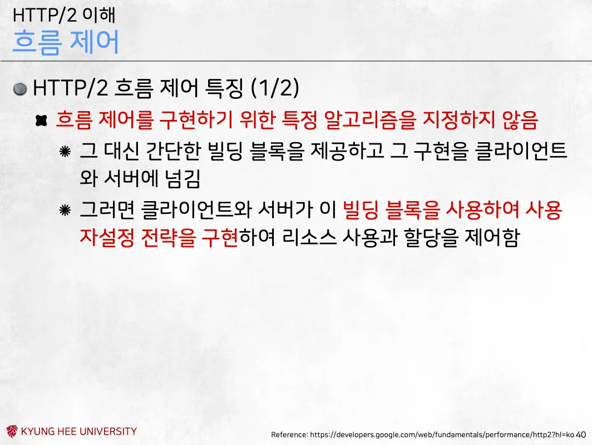

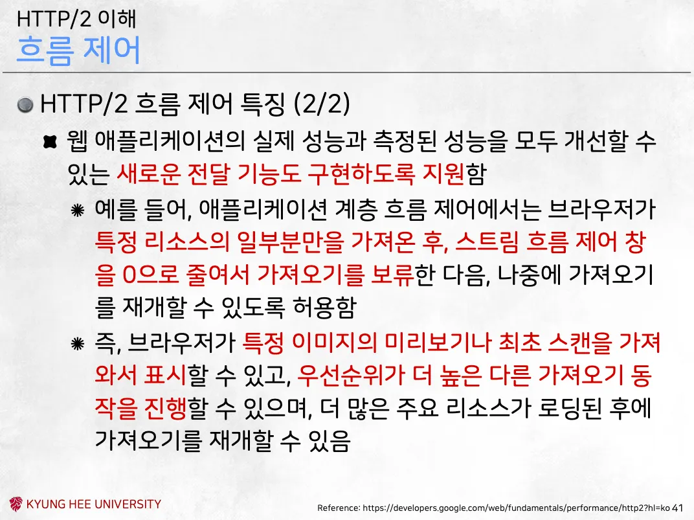

## HTTP/2의 흐름제어 특징

- 흐름 제어를 구현하기 위한 특정 알고리즘을 지정하지 않음
	- 대신 간단한 빌딩 블록을 제공하고 그 구현을 클라이언트와 서버에 넘김
	- 그러면 클라이언트, 서버는 이 빌딩 블록을 사용해 사용자설정 전략을 구현해 리소스 사용과 할당을 제어
	→ 빌딩 블록: 구체적인 완성품이 아닌 그것을 만들기 위한 재료나 기초 구성 요소
	→ HTTP/2는 구제척인 흐름제어 알고리즘을 강제하기 않고, 이를 사용하는 개발자가 구현해서 넣어야함

		- 만일 구현하지 않으면 TCP의 흐름제어에 의존
- 따라서 웹 애플리케이션의 실제 성능과 측정된 성능을 모두 개선할 수 있는 새로운 전달 기능도 구현하도록 지원
	→ 이런 류의 기능도 가능하니, 개발자가 필요에 따라 구현할 수 있음을 나타냄

	- 애플리케이션 계층 흐름 제어에서 브라우저가 특정 리소스의 일부만을 가져온 후 스트림 흐름 제어 윈도우를 0으로 줄여 가져오기를 보류하고, 나중에 가져오기를 재개하도록 허용
	- 특정 이미지의 미리보기, 최초 스캔을 가져와서 표시가능, 우선순위가 더 높은 가져오기 동작 진행도 가능, 더 많은 주요 리소스가 로딩된 후에 가져오기 재개 가능

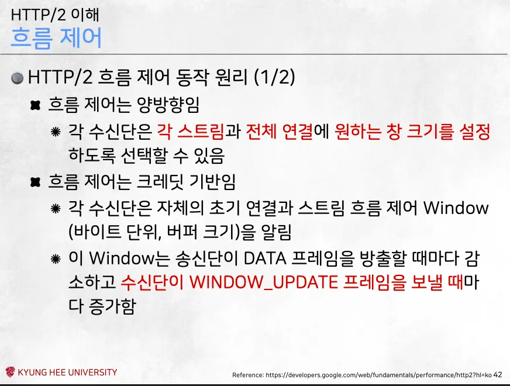

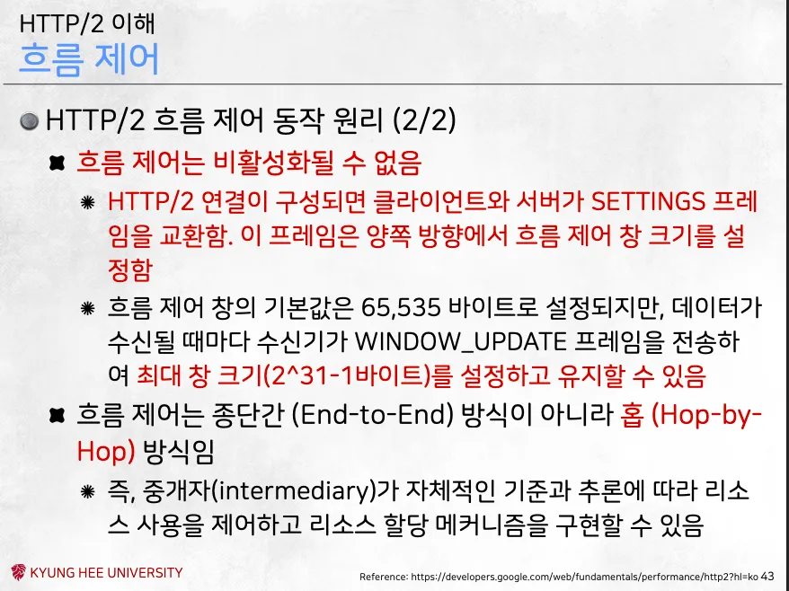

## HTTP/2 흐름제어 동작 원리

1. 양방향 및 독립적 제어
	- 흐름제어는 각 스트림과 전체 연결에 대해 각 수신단에서 원하는 윈도우 크기를 설정하게 할 수 있음
2. 크레딧 기반 시스템
	- 각 수신단은 자체의 초기 연결되 스트림 흐름제어 윈도우를 알림
	- 이는 송신단이 데이터 프레임을 발송할 때 마다 감소하고 수신단이 WINDOW_UPDATE 프레임을 보낼 때 마다 증가
3. 비활성화 불가, 기본적으로 적용
	- HTTP/2 연결 시 흐름 제어는 무조건 켜지고, 기본 값으로 설정
	- HTTP/2연결이 구성되면 클라이언트와 서버가 SETTINGS 프레임을 교환
		- 이 프레임이 양쪽 방향에서 흐름 제어 윈도우 크기를 설정
	- 흐름 제어 창의 기본값은 65535 바이트이지만, 데이터가 수신도리 때 마다 수신기가 WINDOW_UPDATE 프레임을 전송해 최대 창 크기(2\^31-1바이트)를 설정하고 유지 가능
4. 흐름 제어는 종단간이 아닌 홉-바이-홉
	- 흐름 제어 신호는 최종 목적지까지 end-to-end로 한번에 가지 않고 중간에 있는 중개자(Intermediary, 프록시)까지만 전달
	- 프록시가 자체 판단하에 리소스를 제어하므로, 이동통신 기지국 뒤에 있는 프록시가 단말기의 느린 속도에 맞춰 서버의 빠른 전송 속도를 중간에서 조절해 줄 수 있음
	→ 이때 홉은 2,3계층의 홉(라우터, 스위치)이 아닌 애플리케이션의 홉을 의미(클라이언트, 서버, 프록시 등)
		→ 없으면 클라-서버로도 됨
	→ 기존 HTTP/1.1에서 숨어있는 프록시 서버가 앞단에 나와서 흐름제어까지 도움

# 서버 푸시

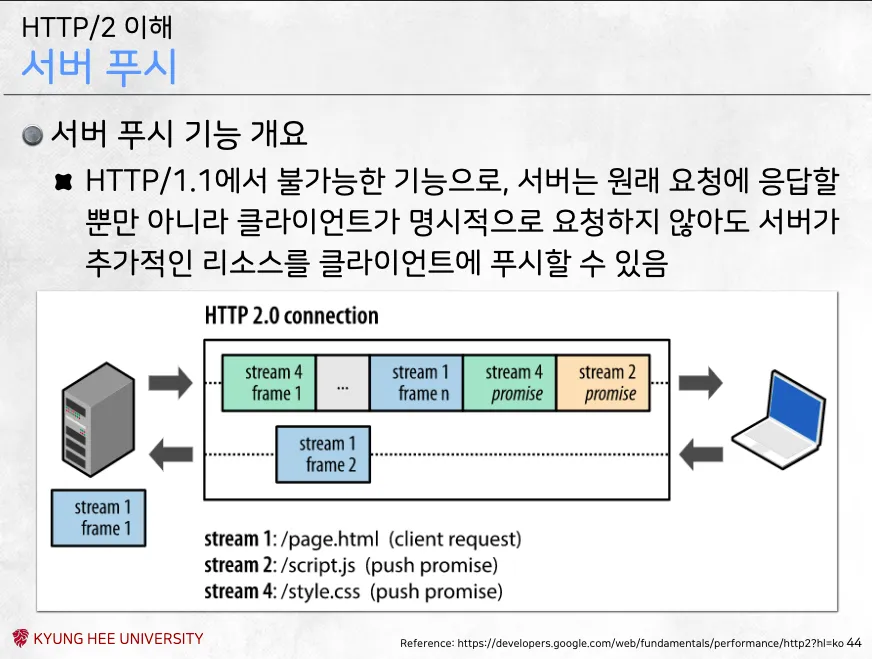

## 서버 푸시 기능 개요

- 기존 HTTP/1.1에서는 서버는 항상 요청에 응답하기만 함
- HTTP/2에서는 클라이언트가 아직 요청하지 않은 리소스라도 서버 판단 하에 미리 클라이언트에게 보내줄 수 있음

### 다이어그램 설명

1. Stream1으로 클라이언트가 `/page.html` 을 요청
2. 서버가 이를 해석하니 `/script.js` , `/style.css` 가 필요함을 해석
3. 서버가 Stream2, 4를 통해 Push Promise라는 프레임을 전송
	- 이는 요청하지 않았지만 미리 보낼것임을 알리는 것
	- 이를 통해 클라이언트는 다시 요청하지 않게 됨
4. 이후 실제 데이터 프레임으로 서버에서 데이터 전송
⇒ 클라이언트는 `/page.html` 을 읽고 `/script.js` , `/style.css` 을 요청하지 않아도 되어 효율적

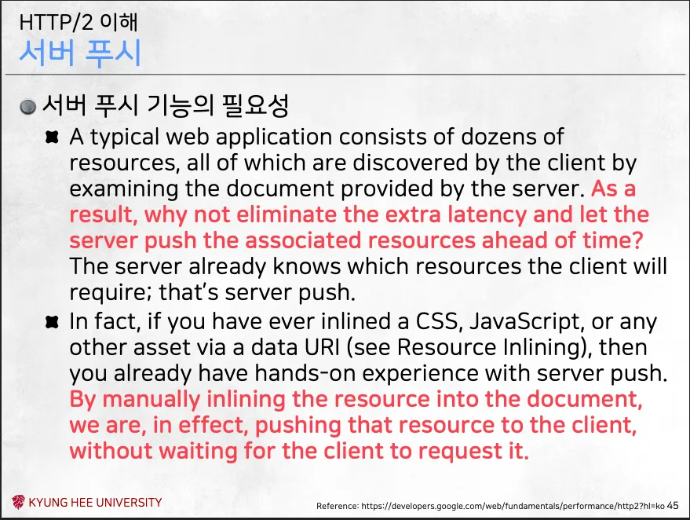

## 서버 푸시 기능의 필요성

- 기본적으로 웹 애플리케이션은 여러 리소스로 구성, 이것들은 클라이언트가 서버에서 제공한 문서를 확인하고 나서 발견되어 요청
	- 이로 인해 추가적인 대기 시간이 발생
- 추가적인 대기 시간을 제거하기 위해 서버가 관련된 리소스를 미리(ahead of time) 푸시할 필요성이 생김
	→  서버는 html을 줄 때 연관된 css, js도 필요함을 이미 알고 있음, 따라서 이를 달라고 하기 전에 푸시해서 대기 시간을 없애는 것이 핵심
→ 기존에는 리소스 인라이닝(ex. html파일 안에 css, js를 그대로 담기) 등의 방법으로 필요한 리소스를 html과 함께 보내는 형태의 “유사 서버푸시”를 사용

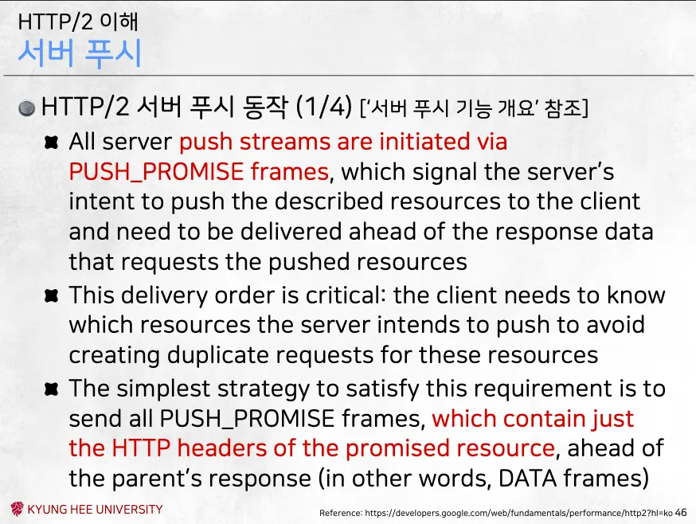

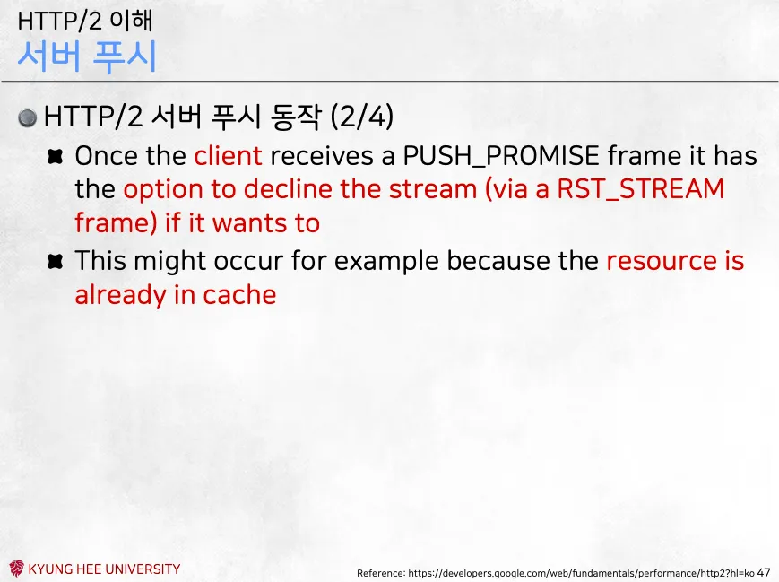

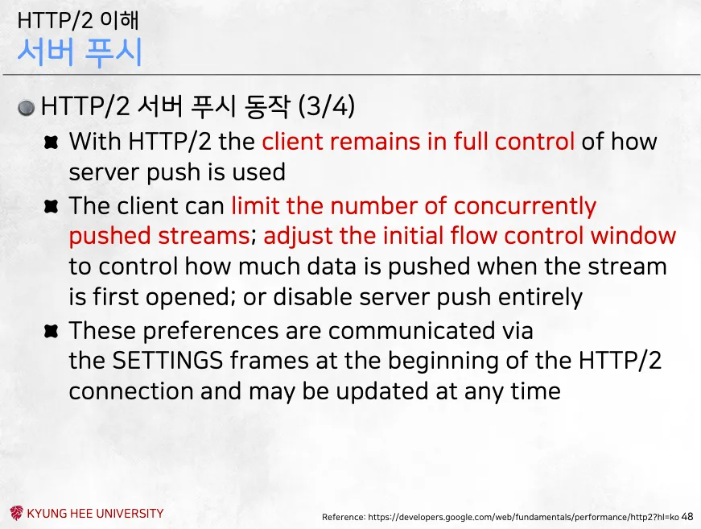

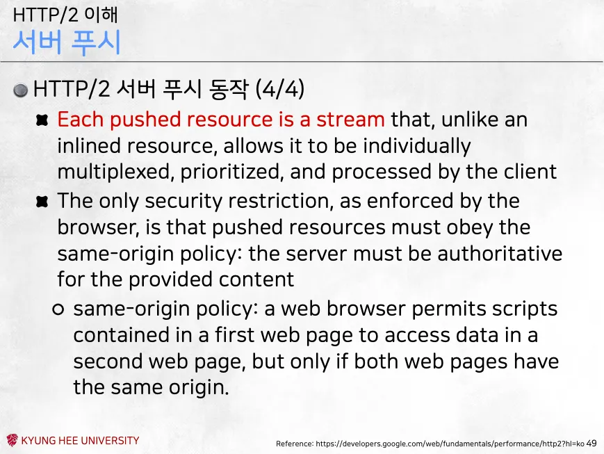

## 서버 푸시 동작

- 모든 서버 푸시 스트림은 `PUSH_PROMISE` 프레임을 통해 시작
	- 이 프레임은 서버가 설명된 리소스를 클라이언트에게 푸시하겠다는 의도를 알리는 것
	- 푸시 리소스를 요청하는 응답 데이터보다 `PUSH_PROMISE`가 먼저 도착해야함
		- 클라이언트가 중복 요청을 하는 것을 방지하기 위해 무엇을 푸시할 것인지 미리 알아야 하기 때문
	- 이를 위해 부모 응답의 데이터 프레임보다 `PUSH_PROMISE` 응답을 먼저 보내는 전략을 사용
		- ex) html파일의 데이터 프레임을 보내기 전에 css, js에 대한 `PUSH_PROMISE` 를 먼저 전송
- 클라이언트가 `PUSH_PROMISE`  프레임을 수신하면, 클라이언트는 해당 스트림을 거절 가능
	→ ex) 이미 해당 리소스가 디스크 캐시 등에 존재하는 경우 거절할 수 있음

	- `RST_STREAM` 프레임을 서버로 보내서 거절
	- 불필요한 리소스인 경우 서버가 푸시해서 불필요하게 대역폭을 낭비하는 것을 방지
- HTTP/2에서 클라이언트는 서버 푸시가 사용되는 방식에 대해 온전한 통제권을 유지
	→ 푸시는 서버가 보내도, 그 규칙은 클라이언트에서 지정

	- 클라이언트는 동시에 푸시되는 스트림 수 제한 가능, 스트림이 열릴 때 데이터가 얼마나 푸시될 지 제어하기 위한 초기 흐름 제어 윈도우 조정 가능, 서비 푸시를 완전히 비활성화도 가능
	- 이는 HTTP/2 연결 시작에서 `SETTINGS` 프레임을 통해 전달, 이후 언제든지 업데이트 가능
- 각각의 푸시된 리소스는 Stream
	- 이는 리소스 인라이닝과 달리 개별적으로 다중화되고, 우선순위가 매겨저 클라이언트에 의해 처리 가능해짐
		→ 리소스 인라이닝은 HTML 파일 안에 리소스를 직접 박아넣는 방식, 따라서 개별 관리가 어려움
		→ HTTP/2의 서버 푸시는 각각의 파일이 별도의 Stream으로 오기 때문에 개별적인 요청과 같이 우선순위 처리, 다중화 등이 가능

- 각각의 서버 푸시 리소스에 대해 브라우저에서는 Same-Origin-Policy만을 보안 제약으로 준수하게 함

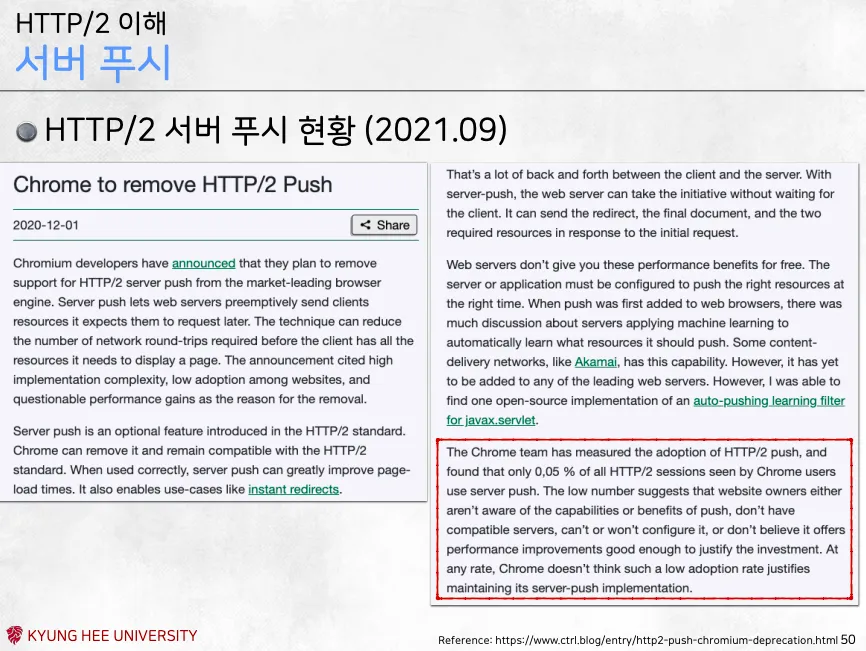

## 서버 푸시의 현황

- 크롬에서 HTTP/2의 서버 푸시 기능이 제거
- 서버 푸시는 이론적으로는 훌륭했지만(미리 보내서 속도 향상)
	- 실제로는 서버가 "클라이언트가 무엇을 필요로 하는지" 완벽하게 예측하기가 매우 어려웠음
	- 이미 캐시에 가지고 있는 파일을 또 보내서 데이터를 낭비하는 경우도 많았음
	- 서버 설정을 올바르게 하여 푸시를 효율적으로 사용하는 것이 개발자들에게 구현난이도가 너무 높았음
	- 전체의 0.05%라는 극히 미미한 사용률은 이 기능을 유지보수하는 비용에 비해 효용이 없음을 보여줌
⇒ 그래서 제거해버림

# 헤더 압축

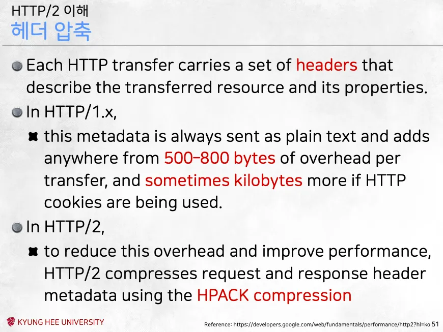

## 헤더 압축 개요

- 각 HTTP 전송은 전송되는 리소스와 그 속성을 설명하는 헤더의 집합을 포함
- HTTP/1.x 에서는 
	- 이 메타데이터(헤더의 집합)는 항상 평문으로 전송되고, 전송 당 500-800 바이트의 오버헤드를 추가, HTTP 쿠키가 쓰이면 수 킬로바이트가 더 추가되기도 함
- HTTP/2 에서는
	- 헤더 전송 오버헤드를 줄이고 성능을 개선하기 위해 HPACK 압축 방식을 사용해 요청 및 응답 헤더 메타데이터를 압축
⇒ HTTP/1.1은 매 요청마다 매우 큰 헤더를 같이 보냄 → 불필요한 네트워크 오버헤드
⇒ 이를 해결하기 위해 HTTP/2는 HPACK이라는 전용 압축 알고리즘을 사용해 중복된 헤더를 제거하고 데이터를 압축해서 보내 성능을 향상

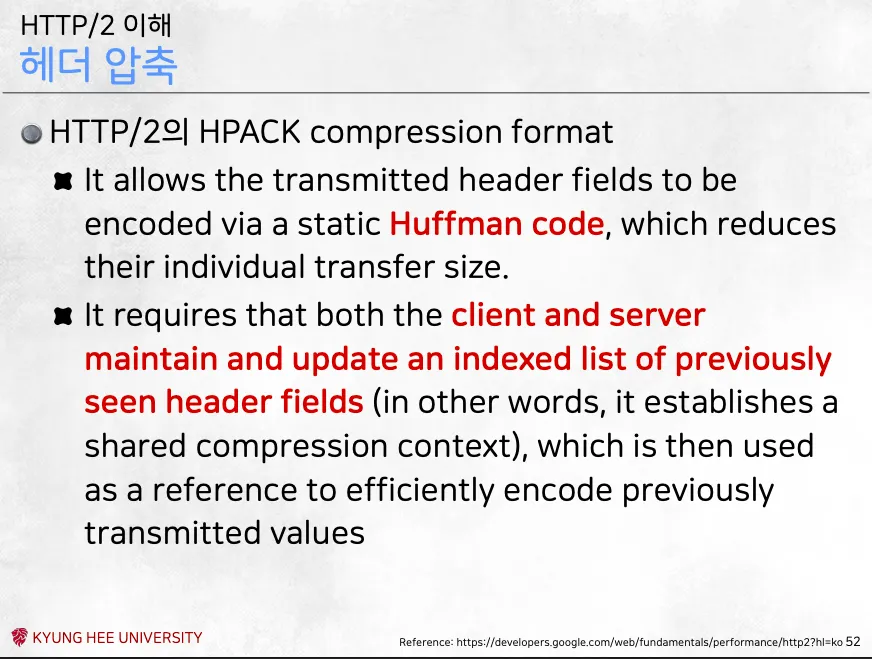

- 전송되는 헤더 필드들을 정적인 “허프만 코드”를 사용해 각각의 전송 크기를 줄임
- 클라이언트와 서버 모두 이전에 본 헤더 필드들의 인덱스 리스트를 유지하고 업데이트해야함
	- 이는 이전에 전송된 값들을 효율적으로 인코딩하기 위한 참조로 사용됨
→ HPACK이 데이터를 줄이는 **두 가지 핵심 원리**를 설명합니다.

	1. **허프만 코딩 (Huffman Code):** 자주 쓰이는 문자열은 짧은 비트로, 자주 안 쓰이는 건 긴 비트로 변환하여 문자열 자체의 용량을 줄이는 기법
	2. **인덱스 리스트 (Indexed List):** 클라이언트와 서버가 서로 "방금 무슨 헤더를 주고받았는지" 기억하는 표(Table)를 만듬
		- 예를 들어, "User-Agent: Mozilla/5.0..."을 한 번 보냈다면 이를 1번이라고 기록해 둠
		- 다음에 똑같은 걸 보낼 때는 긴 문자열 대신 숫자 `1`만 보내서 용량을 줄임
			→ 이를 "공유 압축 컨텍스트(Context)"라고 부름

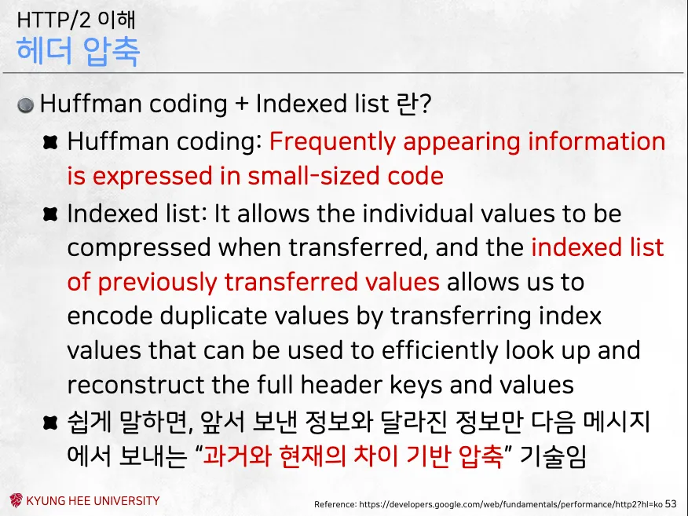

## 허프만 코딩 + 인덱스 리스트

### 허프만 코딩

- 자주 등장하는 정보는 작은 크기의 코드로 표현
- 데이터에서 **자주 나오는 문자열은 짧은 비트**로, 자주 안 나오는 문자열은 긴 비트로 변환하는 고전적인 압축 알고리즘

### 인덱스 리스트

- 전송 시 개별 값들이 압축되는 것을 허용하며, '이전에 전송된 값들로 구성된 인덱스 목록'을 통해 우리는 중복된 값들을 인코딩할 수 있게 해줌
- 이때 인덱스 값(숫자)만 전송하며, 이 값은 전체 헤더의 키와 값을 효율적으로 조회하고 재구성하는 데 사용

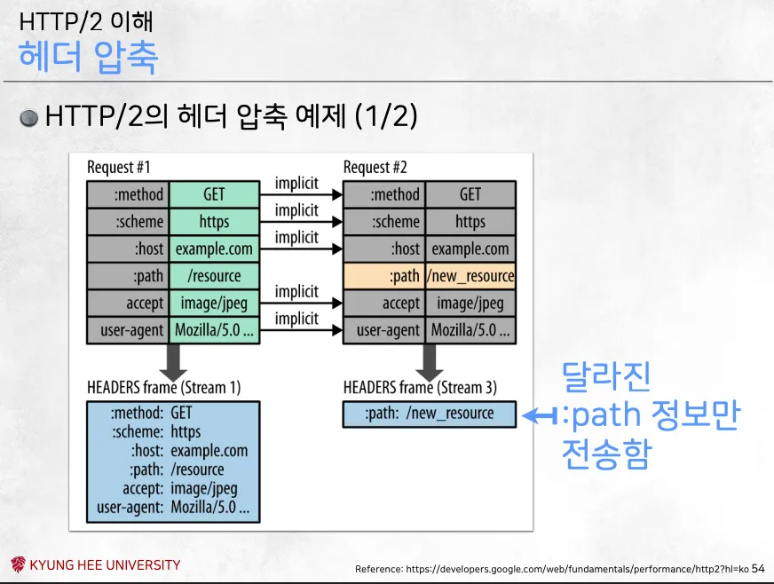

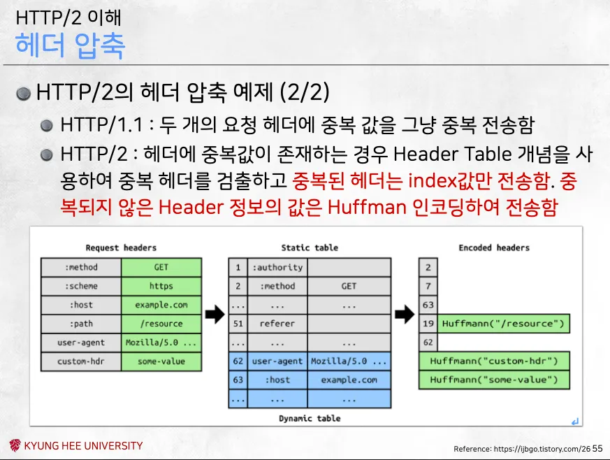

## 헤더 압축 예시

- HTTP/2의 헤더 압축 시 달라진 헤더만 데이터를 전송
	- 중복된 헤더는 인덱스 값만 전송
	- 달라진 헤더는 허프만 인코딩 해서 전송
- 첫 번째 그림
	- **Request #1:** 처음 요청을 보낼 때는 모든 헤더(`:method`, `:scheme`, `:host`, `:path` 등)를 다 보냄
	- **Request #2:** 두 번째 요청을 보낼 때, Request #1과 비교해서 **달라진 점**은 `:path` (리소스 경로) 뿐
		- 나머지(`method`, `host` 등)는 앞선 요청과 똑같으므로, HTTP/2에서는 **달라진 ****`:path`**** 정보만 전송**
		- 이것이 가능한 이유는 클라이언트와 서버가 서로 "이전 상태"를 기억하고 있기 때문
			→ 무상태성인 HTTP 프로토콜 위에서, 연결(Connection) 동안에는 문맥을 유지함

				- 즉 무상태성을 포기

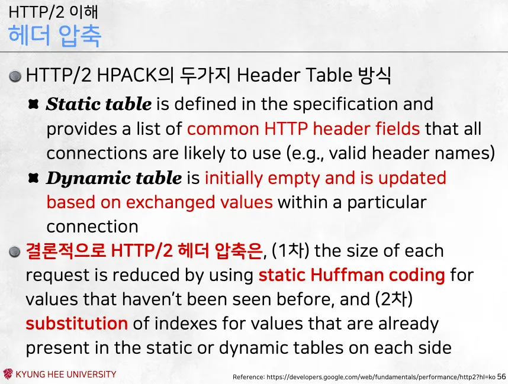

## HPACK의 두 가지 Header Table 방식

- Static Table은 스펙에 정의되어있으며, 모든 연결이 사용할 가능성이 높은 일반적인 HTTP헤더 필드 목록을 제공
- Dynamic Table은 초기에 비어있으며, 특정 연결 내에서 교환된 값들을 기반으로 업데이트됨
→ 위는 HPACK에서 사용되는 두 가지 테이블에 대한 설명
⇒ 결과적으로 이 테이블을 사용해 HPACK은 

	- 새로운 데이터에 대해서는 정적 허프만 코드로 암축
	- 양쪽의 정적, 동적 테이블에 이미 존재하는 값은 중복된 데이터로 보고 인덱스만 전송

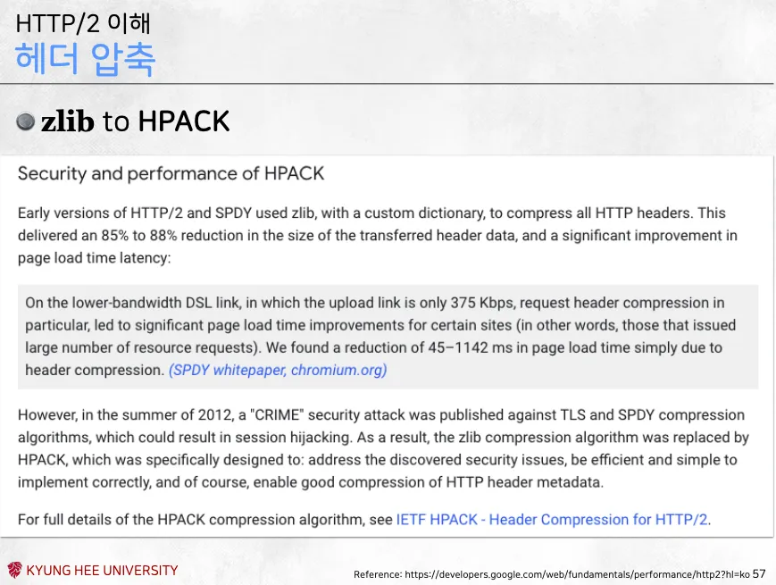

## zlib 방식에서 HPACK방식으로 변경된 이유

- 기존 SPDY에서는 zlib을 사용, 압축률도 준수
- 그러나 CRIME이라는 보안 취약점이 발생하며 보안에도 강하고, 압축률도 좋은 HPACK을 새롭게 개발해 HTTP/2의 표준으로 채택

# HTTP/2 개발 환경

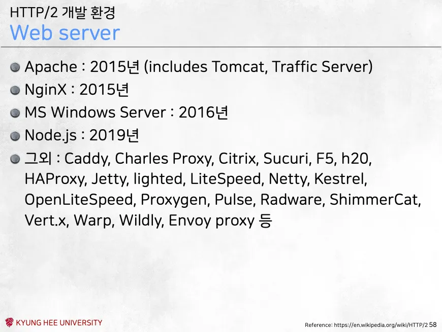

→ Nginx, Apache 같은 주류 서버, 자바 기반(Tomcat, Netty), 최신 경량 서버(Caddy, Envoy) 등의 많은 서버들이 HTTP/2를 지원

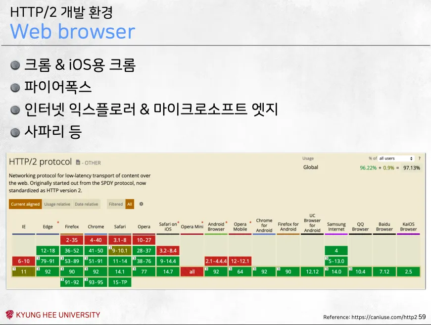

→ 대부분의 주요 브라우저에서 HTTP/2를 지원

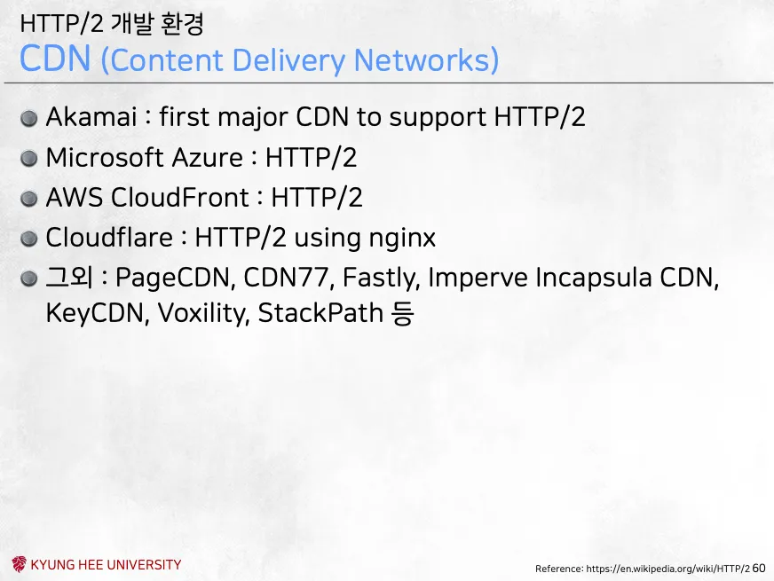

→ 대부분의 CDN에서도 HTTP/2를 기본 지원
	→ 인프라 레벨에서의 지원도 활발

## 프로그래밍 언어 지원

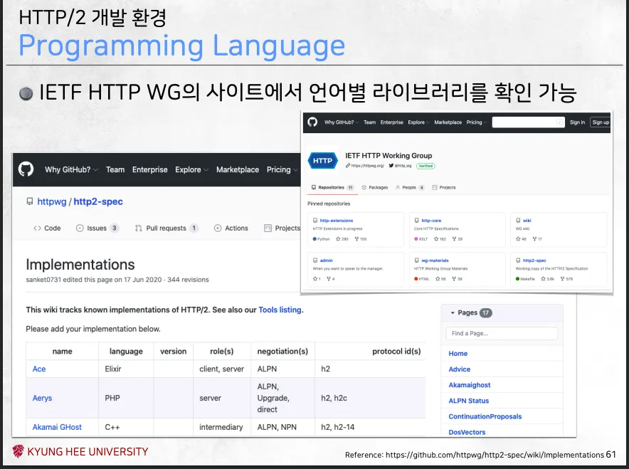

## HTTP/2 문서를 통해 볼 수 있는 헤게모니의 변화

- 일반적인 웹 표준(W3C)이나 인터넷 표준(IETF)은 해당 기구가 관리하는 공식 웹사이트에 문서 형태로 보관
- HTTP/2의 기반이 된 것은 Google이 만든 **SPDY** 프로토콜이며, 이는 처음부터 오픈소스로 개발
	- 이 SPDY가 IETF의 표준화 과정을 거쳐 HTTP/2가 되었기 때문에 탄생 배경이 특이
- IETF가 관리하는 공식 문서(RFC)는 별도의 저장소에 있지만, HTTP/2 구현체나 관련 도구 개발은 **GitHub** 같은 오픈소스 플랫폼에서 활발하게 이루어짐
	→ HTTP/2는 표준 문서가 github에 위치

- 빠르게 진화하는 통신 기술 분야에서는, 표준 문서가 모든 것을 완벽하게 정의하기 어려움
	- 표준이 있더라도 실제 작동은 개발자들의 오픈소스 구현과 피드백에 의해 주도되는 경향이 있음
- HTTP/2는 HPACK 같은 복잡한 압축 알고리즘을 사용하므로, 단순히 문서상의 스펙을 이해하는 것보다 **실제로 코드를 작성하여 상호 운용성(Interoperability)을 확인**하는 것이 매우 중요
- 이론적으로는 완벽해 보이는 프로토콜도 실제 네트워크 환경(지연, 패킷 손실 등)에서 테스트를 해봐야 버그나 취약점을 찾을 수 있음 → 이는 특히 성능이 중요한 HTTP/2에서는 필수적
	- 그러므로 이를 수학적으로 계산하기보다 실제로 돌려볼 필요가 있음
- 표준 문서가 미처 정의하지 못한 예외적인 상황이나, 구현 과정에서 발견된 모호한 부분을 채워 넣는 작업이 필요
	- 이는 주로 실제 개발을 통해 이루어짐

## 프로토콜 라이브러리 개발 언어의 경향

- 메이저 회사들은 통신 프로토콜 구현할 때 C, C++을 사용하는 경향이 있음
	- **C**나 C++은 메모리 관리와 성능 최적화에 유리한 저수준(low-level) 언어이므로, 속도가 핵심인 통신 프로토콜 라이브러리(예: `nghttp2`, **Proxygen** 등)를 개발할 때 선호
- FFI (Foreign Function Interface)는 한 프로그래밍 언어로 작성된 코드를 다른 언어에서 호출할 수 있게 해주는 메커니즘입니다. 예를 들어, Python에서 속도가 빠른 C++ 라이브러리를 가져와 쓰는 방식
- C는 문법이 단순하여 FFI를 이용해 다른 언어와 연결(Linking)하기 쉽습니다. 최근에는 안정성과 성능이 뛰어난 **Rust** 또한 저수준 프로토콜 개발에 활용되는 추세
- C++의 복잡한 기능(상속, 가상 함수 등)은 프로토콜 라이브러리처럼 **매우 빠른 속도와 단순한 구조**가 요구되는 환경에서는 오버헤드가 될 수 있음
	- 따라서 C++를 쓰더라도 C 스타일의 단순하고 효율적인 방식으로 구현하는 경향이 있다는 뜻
	- 또한 객체 컨셉을 많이 사용하면 정적으로 링킹하기 어려움

## 주요 언어별 지원 현황

### C/C++ 

- **특징:** 표준 라이브러리는 없으며, **외부 라이브러리**를 활용합니다.
- **Nghttp2:** C언어 기반의 **가장 대표적인 HTTP/2 클라이언트 & 서버 라이브러리**입니다. 많은 다른 언어의 HTTP/2 구현체들이 이 `nghttp2`를 기반으로 연결하여 사용
- **Proxygen:** Facebook이 내부용으로 개발하여 오픈소스로 공개한 C++ HTTP 라이브러리입니다. 클라이언트와 서버 모두 지원

### Python 

- **특징:** 표준 라이브러리는 없으며, **외부 라이브러리**를 활용
- **Hyper-h2(Hyper):** Python용 HTTP/2 클라이언트 라이브러리로, Python 생태계에서 널리 사용됨

### Go

- **특징:** **2016년 Go 1.6 버전부터 표준 라이브러리를 통해 HTTP/2를 기본으로 제공**
	- **Go 1.6 릴리스:** TLS와 Transport 패키지 내에서 HTTP/2를 투명하게(transparently) 지원
	- HTTP/1.1을 위한 별도의 API 수정 없이도 HTTP/2의 이점을 활용할 수 있게 되었음
- **결론:** Go 언어는 언어 자체 레벨에서 HTTP/2를 강력하게 지원하며, `net/http` 패키지 사용 시 별도 설정 없이 HTTP/2 통신이 가능

### Dart

- **특징:** 2018년부터 **gRPC**를 통해 Standard 라이브러리로 제공
- **결론:** Dart는 gRPC를 지원함으로써 간접적으로 HTTP/2를 지원하며, 이는 특히 Google의 Flutter/Dart 생태계에서 중요

## 개발 및 분석 도구

- IETF WG 사이트에서는 HTTP/2 통신을 **디버깅하고 분석하기 위한 도구** 목록도 함께 제공
- **주요 도구:**
	- **`curl`****:** 명령줄 기반으로 HTTP/2 요청을 보내고 테스트할 수 있음
	- **Wireshark:** 네트워크 패킷 분석 도구로, HTTP/2 프레임(Frame)과 헤더 압축(HPACK) 데이터를 디코딩하여 볼 수 있는 기능을 제공
	- **기타:** HTTP/2 성능 테스트 도구, 헤더 인코딩/디코딩 도구 등 다양한 도구들이 개발자들의 HTTP/2 환경 구축 및 분석을 지원

***

# 참조

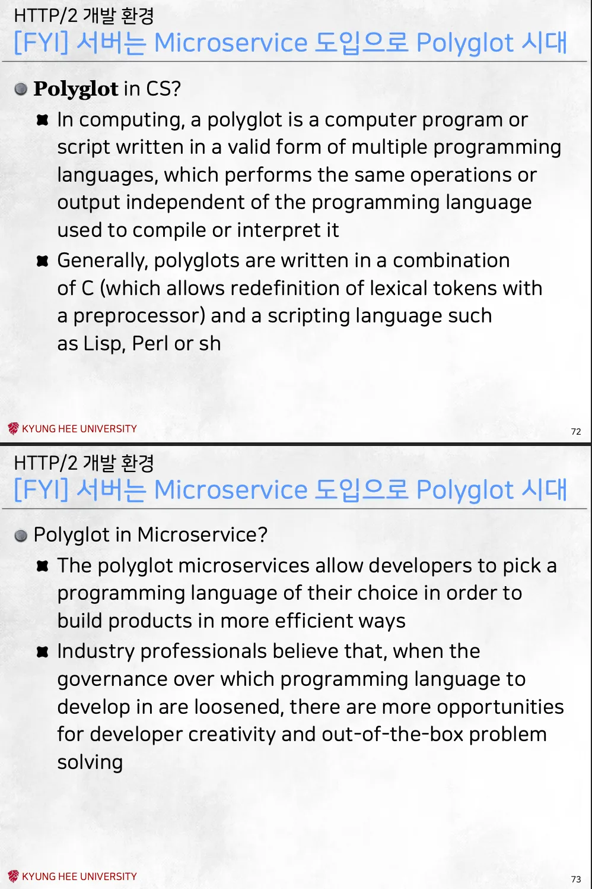

## **다양한 프로그래밍 언어의 사용 (Polyglot 시대)**

### **Polyglot(폴리글롯)**

- 여러 프로그래밍 언어를 조합하여 문제를 해결하는 방식
- 컴퓨터 과학에서, 폴리글롯은 여러 유효한 프로그래밍 언어로 작성된 컴퓨터 프로그램 또는 스크립트로, 컴파일되거나 해석되는 프로그래밍 언어와 독립적으로 동일한 작업을 수행

### **Microservice(마이크로서비스) 도입**

- 서버 환경이 마이크로서비스 아키텍처로 바뀌면서, 개발자들은 특정 기능을 구현하기에 **가장 적합한 언어**를 선택할 수 있게 됨
- 이는 언어 선택의 자율성을 높여 개발 생산성과 창의적인 해결책을 향상
- 서버는 더 이상 통일될 필요가 없으며, 기술적으로 가장 적합한 언어가 우선시
***

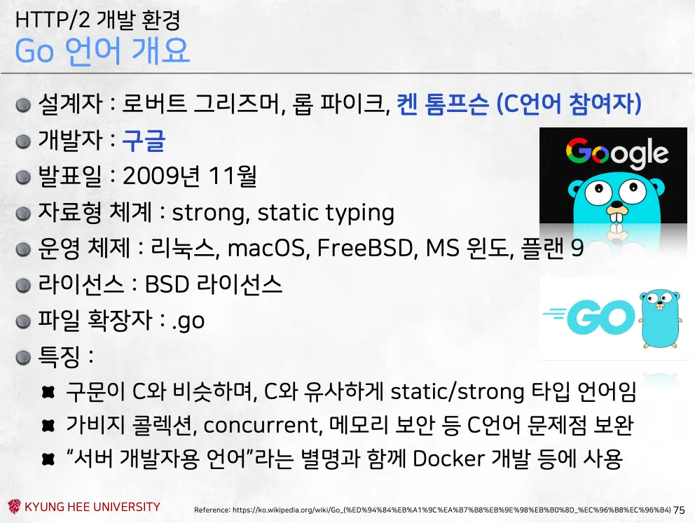

## **Go 언어 (Golang) 개요 및 특징**

- Go 언어는 2009년 11월에 발표되었으며, Google에서 로버트 그리세머(Robert Griesemer), 롭 파이크(Rob Pike), 켄 톰슨(Ken Thompson, C 언어 공동 창시자) 등 C 언어 개발 경험이 풍부한 설계자들이 참여
- **개발 목표**: C 언어와 유사하지만 **동시성(Concurrency)과 메모리 보안** 문제를 해결하고, TCP 통신 및 병렬 처리에 최적화되도록 설계
- **주요 특징**:
	- C와 유사한 문법 구조를 가지며, 정적 타입(static typing) 언어
	- **고루틴(Goroutine)** 및 채널(Channel)을 통한 동시성(Concurrency) 처리가 매우 강력
	- **메모리 보안**이 뛰어나 C 언어의 문제점을 해결
	- `Docker`, `Kubernetes` 등 최신 서버 기술의 핵심 도구들이 Go 언어로 작성
***

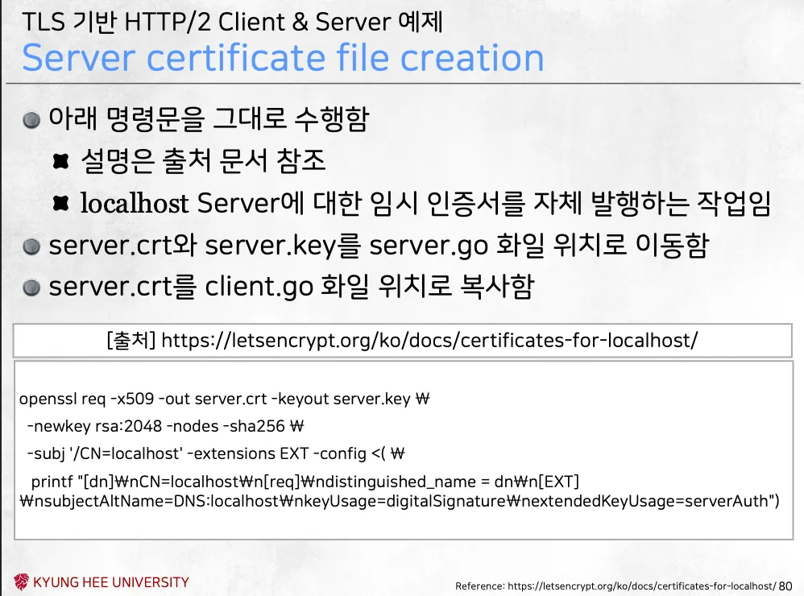

## **TLS 기반 HTTP/2 통신 및 인증서**

- HTTP/2 통신 환경에서 보안을 확보하기 위해 TLS (Transport Layer Security)가 필수적으로 사용
- TLS는 공개 키 기반 구조(PKI)와 암호화 원리를 기반으로 함

### **1. 인증서 파일 생성 명령 (OpenSSL 사용)**

- TLS 기반 서버를 구동하기 위해서는 서버의 신원을 증명하는 인증서(Certificate)와 비밀 키인 개인 키(Private Key)가 필요
- 개발 환경에서는 `openssl` 명령어를 사용하여 임시 인증서를 자체적으로 발급
- **명령어**: `openssl req -x509 -out server.crt -keyout server.key ...`
- **생성 파일**:
	- `server.crt`: **인증서 파일** (X.509 표준을 따름)
	- `server.key`: **개인 키 파일**
- **RSA 및 SHA-256**: 키 생성 시 RSA 2048비트 크기 및 SHA256 해시 알고리즘을 사용하도록 명시

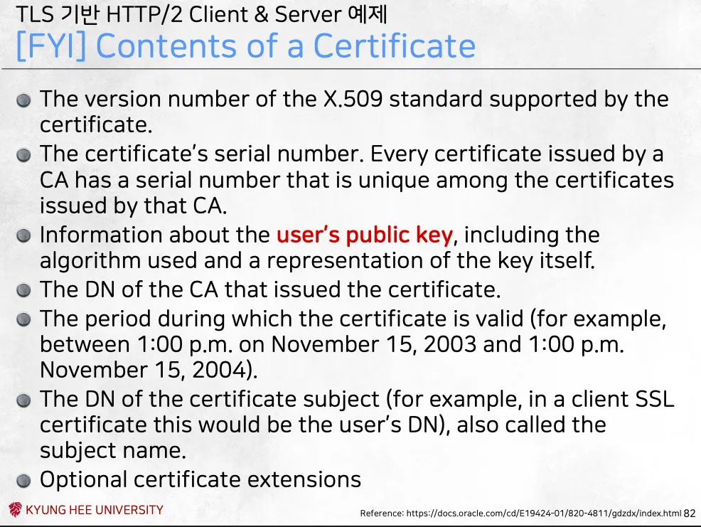

### **2. 인증서(X.509)의 내용**
인증서는 통신 당사자의 신뢰성을 보장하는 정보가 담겨 있으며, 주요 내용은 다음과 같습니다.

- **버전 번호**: X.509 표준의 버전 정보
- **일련번호**: 인증기관(CA)에서 발급한 고유 번호
- **발급자 정보**: 인증서를 발급한 CA의 정보
- **사용자 공개 키**: 사용자의 **공개 키(Public Key)** 정보
- **유효 기간**: 인증서가 유효한 시작 및 종료 시간
- **주체 정보**: 인증서의 주체(사용자, 예: 서버)의 이름 (DN, Subject Name)

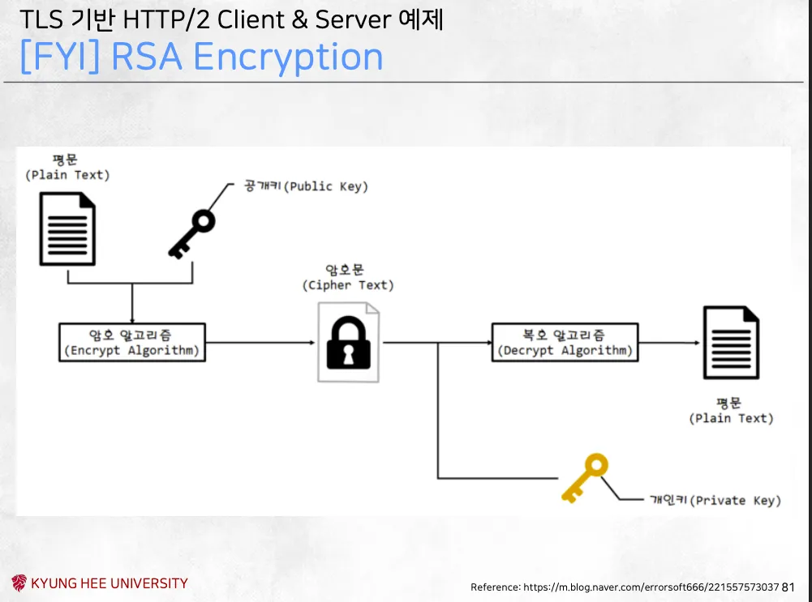

### **3. 암호화 원리 (RSA와 DES/AES)**

- TLS 통신은 RSA (비대칭 키)와 DES/AES (대칭 키)를 조합한 **하이브리드 암호화** 방식을 사용
<table>
<tr>
<td>암호화 방식</td>
<td>키 특징</td>
<td>역할</td>
</tr>
<tr>
<td>**RSA**</td>
<td>비대칭 키 (공개 키/개인 키)</td>
<td>1. **인증** (서버 신원 확인) 2. **세션 키 암호화** (통신에 사용할 대칭 키를 안전하게 전달)</td>
</tr>
<tr>
<td>**DES/AES**</td>
<td>대칭 키 (키가 하나)</td>
<td>**실제 트래픽 암호화 및 복호화** (RSA보다 계산량이 낮아 빠름)</td>
</tr>
</table>

- 클라이언트는 서버의 **공개 키**로 통신에 사용할 대칭 키(세션 키)를 암호화하여 보내고, 서버는 자신의 **개인 키**로 복호화하여 세션 키를 얻은 후, 이후 모든 데이터 통신은 효율적인 **대칭 키**로 진행

### **4. Go 언어 TLS/HTTP 서버 예제 코드 분석**

- 제공된 `server/server.go` 코드는 Go 언어에서 TLS 기반 HTTP 서버를 구동하는 방법을 보여줌
**Go**
```python
func main() {
    // 1. HTTP 서버 객체 생성
    server := &http.Server{
        Addr: fmt.Sprintf(":%d", *port),
        Handler: http.HandlerFunc(handler),
        // ... (Timeout 설정 등)
    }

    // 2. TLS 설정 및 리스닝 시작
    // ListenAndServeTLS는 서버 객체와 인증서/키 파일 경로를 인수로 받아 TLS 서버를 실행합니다.
    err := server.ListenAndServeTLS(*certFile, *keyFile)
    
    // ... (에러 처리)
}
```

1. `http.Server` 객체를 생성하고, 요청을 처리할 `handler` 함수를 등록
2. **`server.ListenAndServeTLS(*certFile, *keyFile)`** 함수가 핵심
	-  이 함수는 HTTP/1.1에 대한 TLS 지원은 물론, Go 언어의 기본 라이브러리 차원에서 **HTTP/2까지 자동으로 지원**하며, 전달된 인증서와 개인 키 파일(`server.crt`와 `server.key`)을 사용하여 서버를 TLS/SSL로 구동
3. Go 서버는 클라이언트의 요청에 따라 **HTTP/1.1과 HTTP/2를 자동으로 구분**하여 처리
